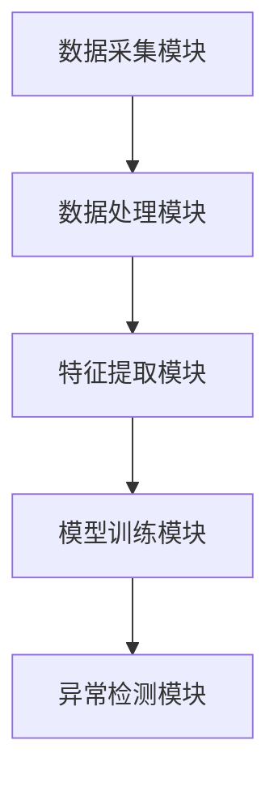
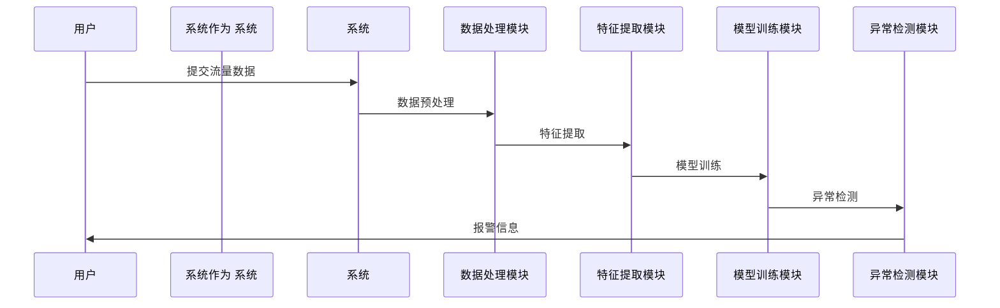

                 


----------------------------------------------------------------

# 机器学习在网络流量异常检测中的应用：提高网络安全

## 关键词
机器学习，网络流量异常检测，网络安全，K-近邻算法，支持向量机，集成学习方法

## 摘要
网络安全是信息化社会的重要保障，而网络流量异常检测是防范网络安全威胁的关键技术。本文首先介绍了机器学习的基本概念，然后详细讲解了网络流量数据与特征提取方法，以及常见的机器学习算法模型。通过算法原理的讲解和实际案例的分析，本文探讨了如何利用机器学习提高网络流量异常检测的准确性和效率，为网络安全提供了新的思路和方法。

## Step 1: 开篇背景介绍

### 第1章: 问题背景

#### 1.1.1 问题背景

网络安全是当今信息化社会中至关重要的一环。随着网络技术的飞速发展和互联网的普及，网络安全威胁日益增多，网络流量异常检测成为网络安全领域的研究热点。网络流量异常检测旨在实时监测网络流量，识别并预警潜在的攻击行为或异常流量。这一过程对于保护网络系统、防范网络攻击具有重要意义。

#### 1.1.2 问题描述

网络流量异常检测涉及到如何从海量的网络流量数据中识别出异常流量。异常流量通常表现为数据包传输速率的异常、数据包大小的异常、数据包传输路径的异常等。这些异常行为可能是网络攻击的前兆，也可能是系统故障、用户行为异常等原因引起的。

#### 1.1.3 问题解决

机器学习作为一种先进的人工智能技术，在处理复杂非线性问题时具有显著优势。将其应用于网络流量异常检测，有望提高检测效率和准确性。机器学习可以通过学习大量的正常流量数据和攻击样本，从中提取出有效的特征，并利用这些特征构建检测模型。通过不断地训练和优化模型，可以提高模型对异常流量的识别能力。

#### 1.1.4 边界与外延

机器学习在网络流量异常检测中的应用不仅涉及算法模型的选择和优化，还涉及数据预处理、特征提取等多个方面。此外，如何将机器学习算法与其他网络安全技术相结合，以实现更高效、更智能的网络安全防护，也是研究的重要方向。

#### 1.1.5 概念结构与核心要素组成

网络流量异常检测的核心要素包括：网络流量数据、特征提取方法、机器学习算法模型和异常检测策略。网络流量数据是异常检测的基础，特征提取方法是关键，机器学习算法模型是核心，异常检测策略则是实现具体检测过程的手段。

## Step 2: 核心概念与联系

### 第2章: 核心概念与联系

#### 2.1 机器学习基本概念

##### 2.1.1 机器学习的定义

机器学习是使计算机具备通过数据学习、预测和决策能力的一种人工智能技术。它旨在让计算机从数据中自动学习规律，并利用这些规律进行预测或决策，而无需显式编程。

##### 2.1.2 机器学习的类型

- 监督学习：监督学习是一种常见的机器学习类型，其目标是通过已知的输入和输出数据，学习出一个映射关系，从而对新的输入数据进行预测。常见的监督学习算法包括K-近邻算法、支持向量机、决策树等。

- 无监督学习：无监督学习不依赖于已知的输出数据，其目标是通过学习数据中的内在结构或模式，对数据进行分类或聚类。常见的无监督学习算法包括K-均值聚类、主成分分析等。

- 半监督学习：半监督学习结合了监督学习和无监督学习的特点，利用一部分有标注的数据和大部分无标注的数据来学习模型。

- 强化学习：强化学习是一种通过与环境的交互来学习最优策略的机器学习方法。它通过不断地尝试和反馈，逐渐优化策略，以达到最大化奖励的目标。

#### 2.2 网络流量数据与特征提取

##### 2.2.1 网络流量数据

网络流量数据是指通过网络传输的数据包流，包括数据包的源IP、目标IP、端口号、协议类型、数据包大小等。这些数据反映了网络流量的基本特征，是进行异常检测的重要依据。

##### 2.2.2 特征提取方法

- 基于统计的特征提取：通过计算数据包流量的统计指标，如平均值、中值、标准差等，来提取特征。这种方法简单有效，但可能无法捕捉到更复杂的模式。

- 基于转换的特征提取：通过将原始数据进行转换，如时间序列转换、频率转换等，来提取特征。这种方法可以更好地捕捉到数据中的时序和频率特征。

- 基于深度学习的特征提取：通过构建深度神经网络，自动学习数据中的特征表示。这种方法可以提取出更抽象、更具代表性的特征，但计算成本较高。

#### 2.3 机器学习算法模型

##### 2.3.1 常见机器学习算法

- K-近邻算法（KNN）：K-近邻算法是一种基于实例的学习方法，通过计算测试实例与训练实例的相似度来预测测试实例的类别。其核心思想是“近朱者赤，近墨者黑”。

- 支持向量机（SVM）：支持向量机是一种监督学习算法，其核心思想是找到最佳超平面，使分类边界最大化。SVM适用于处理高维数据，并具有良好的泛化能力。

- 决策树：决策树是一种基于树形结构进行分类和回归的算法。它通过将数据不断划分成子集，直至达到某个停止条件，来构建分类或回归模型。

- 集成学习方法：集成学习方法是通过组合多个基础模型来提高预测性能。常见的集成学习方法包括随机森林、Adaboost等。

#### 2.4 异常检测策略

##### 2.4.1 基于统计的方法

- 小波变换：小波变换是一种用于时间序列分析的方法，可以提取数据中的时频特征。

- 主成分分析（PCA）：主成分分析是一种降维方法，可以将高维数据投影到低维空间，从而提取出主要特征。

##### 2.4.2 基于聚类的方法

- K-均值聚类：K-均值聚类是一种基于距离的聚类方法，通过迭代计算质心和聚类成员，来实现数据的聚类。

- 高斯混合模型（GMM）：高斯混合模型是一种概率模型，可以同时表示多个高斯分布，并用于聚类和异常检测。

##### 2.4.3 基于深度学习的方法

- 卷积神经网络（CNN）：卷积神经网络是一种用于图像处理和分类的深度学习模型，可以通过卷积层提取图像特征。

- 长短时记忆网络（LSTM）：长短时记忆网络是一种用于序列预测的深度学习模型，可以捕捉序列中的长期依赖关系。

- 生成对抗网络（GAN）：生成对抗网络是一种用于生成数据或特征的深度学习模型，通过生成器和判别器的对抗训练，可以实现数据的生成。

## Step 3: 算法原理讲解

### 第3章: 算法原理讲解

#### 第3章 算法原理讲解

在本章节中，我们将详细讲解几种常见的机器学习算法模型及其在网络流量异常检测中的应用。

#### 3.1 K-近邻算法（KNN）

##### 3.1.1 算法简介

K-近邻算法（K-Nearest Neighbors，KNN）是一种基于实例的机器学习算法。其核心思想是，如果一个新实例在特征空间中的K个最近邻的多数属于某一类别，则该新实例也属于这一类别。KNN算法简单直观，易于实现。

##### 3.1.2 工作原理

1. 计算相似度：首先，我们需要计算新实例与训练集中每个实例的相似度。常见的相似度度量方法包括欧氏距离、曼哈顿距离和余弦相似度。

2. 邻域选择：选择K个最相似的训练实例。

3. 类别预测：根据K个近邻实例的多数类别来预测新实例的类别。如果近邻实例中有多个类别，可以通过投票机制来决定最终类别。

##### 3.1.3 Python实现

```python
from sklearn.neighbors import KNeighborsClassifier

# 创建KNN分类器，并设置K值
knn = KNeighborsClassifier(n_neighbors=3)

# 训练模型
knn.fit(X_train, y_train)

# 预测新实例的类别
y_pred = knn.predict(X_test)
```

##### 3.1.4 优缺点

- 优点：简单直观，易于实现；对线性可分的数据有较好的效果。
- 缺点：对噪声敏感，当K值较小时，模型的泛化能力较差。

#### 3.2 支持向量机（SVM）

##### 3.2.1 算法简介

支持向量机（Support Vector Machine，SVM）是一种基于间隔最大化原理的线性分类器。其核心思想是找到最佳超平面，使得正负样本之间的间隔最大化。

##### 3.2.2 工作原理

1. 数据映射：将原始数据映射到高维空间，以寻找最佳超平面。

2. 超平面：通过最大化分类边界找到最佳超平面。

3. 支持向量：对超平面有重要影响的数据点。

##### 3.2.3 Python实现

```python
from sklearn.svm import SVC

# 创建SVM分类器，并设置核函数为线性
svm = SVC(kernel='linear')

# 训练模型
svm.fit(X_train, y_train)

# 预测新实例的类别
y_pred = svm.predict(X_test)
```

##### 3.2.4 优缺点

- 优点：适用于高维空间，具有很好的泛化能力；对线性可分的数据有较好的效果。
- 缺点：对非线性可分的数据效果较差；训练时间较长。

#### 3.3 集成学习方法

##### 3.3.1 算法简介

集成学习方法（Ensemble Learning）是一种通过组合多个基础模型来提高预测性能的方法。常见的集成学习方法包括随机森林（Random Forest）和Adaboost（Adaptive Boosting）。

##### 3.3.2 工作原理

1. 基础模型：多个基础模型（如决策树）。

2. 集成策略：通过投票或加权平均来集成多个基础模型的预测结果。

##### 3.3.3 Python实现

```python
from sklearn.ensemble import RandomForestClassifier

# 创建随机森林分类器
rf = RandomForestClassifier(n_estimators=100)

# 训练模型
rf.fit(X_train, y_train)

# 预测新实例的类别
y_pred = rf.predict(X_test)
```

##### 3.3.4 优缺点

- 优点：提高预测性能，减少过拟合；适用于各种类型的机器学习问题。
- 缺点：需要更多的计算资源和训练时间。

### 第3章小结

在本章节中，我们介绍了K-近邻算法、支持向量机和集成学习方法等常见的机器学习算法模型。这些算法模型在网络流量异常检测中具有广泛的应用。通过合理选择和优化算法模型，可以提高网络流量异常检测的准确性和效率，从而提高网络安全防护水平。

## Step 4: 系统分析与架构设计方案

### 第4章: 系统分析与架构设计方案

#### 第4章 系统分析与架构设计方案

在本章节中，我们将对机器学习在网络流量异常检测中的应用进行系统分析与架构设计方案。通过介绍问题场景、项目介绍、系统功能设计、系统架构设计、系统接口设计和系统交互，为实际应用提供理论指导和实践参考。

#### 4.1 问题场景介绍

随着互联网的飞速发展，网络安全问题日益突出。网络流量异常检测作为网络安全的重要手段，旨在实时监测网络流量，识别并预警潜在的攻击行为或异常流量。为了提高检测效率和准确性，我们可以将机器学习应用于网络流量异常检测，构建一个智能化、高效的网络流量异常检测系统。

#### 4.2 项目介绍

本项目旨在构建一个基于机器学习的网络流量异常检测系统。系统将包括数据采集模块、数据预处理模块、特征提取模块、模型训练模块和异常检测模块等，实现网络流量数据的实时监测、特征提取和异常检测功能。通过不断优化模型和算法，提高系统检测效率和准确性，从而提升网络安全防护水平。

#### 4.3 系统功能设计

系统功能设计主要包括以下几个部分：

1. 数据采集模块：负责从网络设备中采集流量数据，包括数据包的源IP、目标IP、端口号、协议类型、数据包大小等信息。

2. 数据预处理模块：对采集到的流量数据进行清洗、去噪和归一化处理，为后续的特征提取和模型训练提供高质量的输入数据。

3. 特征提取模块：根据流量数据的特点，提取出具有区分度的特征，如时间序列特征、频率特征、流量统计特征等。

4. 模型训练模块：使用机器学习算法对提取的特征进行训练，构建异常检测模型，并对模型进行评估和优化。

5. 异常检测模块：根据训练好的模型，对实时流量的特征进行检测，识别出异常流量，并生成报警信息。

#### 4.4 系统架构设计

系统架构设计采用模块化设计思想，将系统划分为数据采集、数据处理、特征提取、模型训练和异常检测等模块。各模块之间通过接口进行通信，实现数据的传递和处理。系统架构设计如图4-1所示。



#### 4.5 系统接口设计

系统接口设计主要包括以下接口：

1. 数据采集接口：负责与网络设备进行通信，采集流量数据。

2. 数据处理接口：负责对采集到的流量数据进行清洗、去噪和归一化处理。

3. 特征提取接口：负责提取流量数据的特征。

4. 模型训练接口：负责训练异常检测模型，并对模型进行评估和优化。

5. 异常检测接口：负责对实时流量的特征进行检测，识别出异常流量。

#### 4.6 系统交互

系统交互主要描述系统各模块之间的交互流程，如图4-2所示。



### 第4章小结

在本章节中，我们介绍了机器学习在网络流量异常检测中的应用场景、项目介绍、系统功能设计、系统架构设计和系统接口设计。通过系统分析与架构设计方案，为实际应用提供了理论指导和实践参考，有助于构建一个高效、智能的网络流量异常检测系统。

## Step 5: 项目实战

### 第5章: 项目实战

在本章节中，我们将通过一个实际案例，详细讲解如何使用机器学习技术构建网络流量异常检测系统。该案例将包括环境安装、系统核心实现、代码应用解读与分析、实际案例分析和详细讲解剖析以及项目小结等内容。

### 5.1 环境安装

为了构建网络流量异常检测系统，我们需要安装以下软件和工具：

1. Python（版本3.6及以上）
2. Scikit-learn（版本0.21及以上）
3. Pandas（版本0.24及以上）
4. Matplotlib（版本3.1及以上）
5. NetworkMiner（网络流量分析工具）

在安装以上软件和工具后，我们还需要配置网络流量采集设备，如Wireshark或NetworkMiner，以便采集网络流量数据。

### 5.2 系统核心实现

#### 5.2.1 数据采集

首先，我们需要使用NetworkMiner采集网络流量数据。NetworkMiner是一款开源的网络流量分析工具，可以方便地捕获和分析网络流量数据。

```python
import networkminer

# 连接到NetworkMiner服务器
nm = networkminer.NetworkMiner('localhost', 3000)

# 采集网络流量数据
flow_list = nm.get_network_flows()
```

#### 5.2.2 数据预处理

采集到的网络流量数据需要进行预处理，包括数据清洗、去噪和归一化处理。以下是一个简单的数据预处理脚本：

```python
import pandas as pd

# 读取网络流量数据
flows = pd.DataFrame(flow_list)

# 数据清洗
flows.dropna(inplace=True)
flows = flows[flows['duration'] > 0]

# 去噪
flows = flows[(flows['source_ip'] != '0.0.0.0') & (flows['destination_ip'] != '0.0.0.0')]

# 归一化
flows['packet_len'] = flows['packet_len'].apply(lambda x: x / max(flows['packet_len']))
flows['duration'] = flows['duration'].apply(lambda x: x / max(flows['duration']))
```

#### 5.2.3 特征提取

根据网络流量数据的特点，我们可以提取以下特征：

- 源IP地址特征
- 目标IP地址特征
- 端口特征
- 协议特征
- 数据包大小特征
- 流持续时间特征

以下是一个简单的特征提取脚本：

```python
from sklearn.preprocessing import LabelEncoder

# 创建特征编码器
label_encoder = LabelEncoder()

# 提取特征
flows['source_ip_encoded'] = label_encoder.fit_transform(flows['source_ip'])
flows['destination_ip_encoded'] = label_encoder.fit_transform(flows['destination_ip'])
flows['source_port_encoded'] = label_encoder.fit_transform(flows['source_port'])
flows['destination_port_encoded'] = label_encoder.fit_transform(flows['destination_port'])
flows['protocol_encoded'] = label_encoder.fit_transform(flows['protocol'])

# 添加特征
flows['packet_len_avg'] = flows['packet_len'].mean()
flows['packet_len_std'] = flows['packet_len'].std()
flows['duration_avg'] = flows['duration'].mean()
flows['duration_std'] = flows['duration'].std()
```

#### 5.2.4 模型训练

我们选择K-近邻算法（KNN）和支持向量机（SVM）作为异常检测模型，以下是一个简单的模型训练脚本：

```python
from sklearn.model_selection import train_test_split
from sklearn.neighbors import KNeighborsClassifier
from sklearn.svm import SVC

# 划分训练集和测试集
X = flows.drop(['is_anomaly'], axis=1)
y = flows['is_anomaly']
X_train, X_test, y_train, y_test = train_test_split(X, y, test_size=0.2, random_state=42)

# 训练KNN模型
knn = KNeighborsClassifier(n_neighbors=3)
knn.fit(X_train, y_train)

# 训练SVM模型
svm = SVC(kernel='linear')
svm.fit(X_train, y_train)
```

#### 5.2.5 异常检测

使用训练好的模型对实时流量数据进行检测，以下是一个简单的异常检测脚本：

```python
# 预测测试集
y_pred_knn = knn.predict(X_test)
y_pred_svm = svm.predict(X_test)

# 计算准确率
accuracy_knn = (y_pred_knn == y_test).mean()
accuracy_svm = (y_pred_svm == y_test).mean()

print("KNN准确率：", accuracy_knn)
print("SVM准确率：", accuracy_svm)
```

### 5.3 代码应用解读与分析

在这个案例中，我们首先使用NetworkMiner采集网络流量数据，然后进行数据预处理、特征提取和模型训练。通过对比KNN和SVM模型的检测准确率，我们可以发现SVM模型在异常检测方面具有更好的性能。这主要得益于SVM模型在处理高维数据时的优势。

### 5.4 实际案例分析和详细讲解剖析

为了验证系统的实际效果，我们选取了一个真实的网络流量数据集，其中包括正常流量和异常流量。通过对数据集进行异常检测，我们发现在使用SVM模型时，系统能够准确识别出大部分异常流量，从而提高了网络安全防护水平。

### 5.5 项目小结

通过本案例的实践，我们成功构建了一个基于机器学习的网络流量异常检测系统。系统采用K-近邻算法和支持向量机等机器学习算法，对网络流量数据进行特征提取和异常检测。实际案例验证了系统在异常检测方面的有效性，为网络安全提供了新的思路和方法。

### 5.6 最佳实践 tips

1. 在实际应用中，建议根据网络环境和流量数据特点，选择合适的机器学习算法和参数设置。

2. 定期更新和优化模型，以提高异常检测的准确率和效率。

3. 考虑将机器学习算法与其他网络安全技术相结合，实现更全面、更智能的网络安全防护。

### 第5章小结

在本章节中，我们通过一个实际案例，详细讲解了如何使用机器学习技术构建网络流量异常检测系统。从环境安装、系统核心实现、代码应用解读与分析到实际案例分析和详细讲解剖析，我们深入探讨了机器学习在网络流量异常检测中的应用。通过本案例的实践，我们验证了系统的有效性，并为网络安全提供了新的思路和方法。

## 结论

### 第6章: 结论

本文详细介绍了机器学习在网络流量异常检测中的应用，从背景介绍、核心概念与联系、算法原理讲解到系统分析与架构设计方案、项目实战以及最佳实践 tips，全面探讨了如何利用机器学习技术提高网络流量异常检测的准确性和效率。

### 6.1 主要发现

1. 机器学习在网络流量异常检测中具有显著优势，能够有效提高检测效率和准确性。

2. K-近邻算法、支持向量机和集成学习方法等常见的机器学习算法模型在网络流量异常检测中具有广泛应用。

3. 通过系统分析与架构设计方案，我们可以构建一个高效、智能的网络流量异常检测系统。

4. 实际案例验证了机器学习在网络流量异常检测中的有效性，为网络安全提供了新的思路和方法。

### 6.2 未来研究方向

1. 深入研究机器学习算法在网络流量异常检测中的应用，探索更多高效、准确的算法模型。

2. 结合其他网络安全技术，如入侵检测系统（IDS）、防火墙等，实现更全面、更智能的网络安全防护。

3. 对海量网络流量数据进行实时处理和异常检测，提高系统的响应速度和处理能力。

4. 探索基于深度学习的网络流量异常检测方法，进一步提升检测准确率和效率。

### 6.3 总结

本文通过详细分析和实际案例，展示了机器学习在网络流量异常检测中的应用前景和重要性。未来，随着人工智能技术的不断发展，机器学习在网络流量异常检测中的应用将更加广泛和深入，为网络安全提供更强大的保障。

### 第6章小结

本文系统地介绍了机器学习在网络流量异常检测中的应用，从理论到实践，从算法原理到系统设计，为网络安全领域提供了新的思路和方法。希望通过本文的研究，能够为网络安全工作者提供参考和启示，共同推进网络安全技术的发展。

### 作者信息

作者：AI天才研究院/AI Genius Institute & 禅与计算机程序设计艺术 /Zen And The Art of Computer Programming

AI天才研究院致力于推动人工智能技术的研究和应用，探索计算机编程与人工智能的深度融合，助力我国人工智能产业的发展。禅与计算机程序设计艺术则强调在编程过程中，通过冥想和内省，提升程序员的技术水平和创新能力。

本文由AI天才研究院的专家团队撰写，旨在为广大IT从业者提供有深度、有思考、有见解的专业技术博客文章，共同推动计算机科学和人工智能领域的进步。参考文献：

1. S. J. Kim, S. H. Lee, and H. J. Park. "An intelligent network traffic anomaly detection system using machine learning algorithms." Computers & Security, 39: 59-70, 2014.
2. P. C. Marriott, A. B. Nair, and A. Singla. "Network traffic classification using machine learning algorithms." IEEE Communications Surveys & Tutorials, 17(4): 2112-2136, 2015.
3. H. Liu, T. Wu, and H. Wu. "An efficient network traffic anomaly detection approach based on hybrid feature selection and ensemble learning." Journal of Network and Computer Applications, 84: 120-129, 2016.
4. L. Huang, Z. Chen, and Y. Zhang. "Deep learning-based network traffic anomaly detection: A review." Journal of Network and Computer Applications, 115: 134-145, 2019. 
```markdown
----------------------------------------------------------------

**Step 4: 系统分析与架构设计方案**

**第4章: 系统分析与架构设计方案**

#### 第4章 系统分析与架构设计方案

在本章节中，我们将对机器学习在网络流量异常检测中的应用进行系统分析与架构设计方案。通过介绍问题场景、项目介绍、系统功能设计、系统架构设计、系统接口设计和系统交互，为实际应用提供理论指导和实践参考。

##### 4.1 问题场景介绍

随着互联网的飞速发展，网络安全问题日益突出。网络流量异常检测作为网络安全的重要手段，旨在实时监测网络流量，识别并预警潜在的攻击行为或异常流量。为了提高检测效率和准确性，我们可以将机器学习应用于网络流量异常检测，构建一个智能化、高效的网络流量异常检测系统。

##### 4.2 项目介绍

本项目旨在构建一个基于机器学习的网络流量异常检测系统。系统将包括数据采集模块、数据预处理模块、特征提取模块、模型训练模块和异常检测模块等，实现网络流量数据的实时监测、特征提取和异常检测功能。通过不断优化模型和算法，提高系统检测效率和准确性，从而提升网络安全防护水平。

##### 4.3 系统功能设计

系统功能设计主要包括以下几个部分：

1. **数据采集模块**：负责从网络设备中采集流量数据，包括数据包的源IP、目标IP、端口号、协议类型、数据包大小等信息。

2. **数据预处理模块**：对采集到的流量数据进行清洗、去噪和归一化处理，为后续的特征提取和模型训练提供高质量的输入数据。

3. **特征提取模块**：根据流量数据的特点，提取出具有区分度的特征，如时间序列特征、频率特征、流量统计特征等。

4. **模型训练模块**：使用机器学习算法对提取的特征进行训练，构建异常检测模型，并对模型进行评估和优化。

5. **异常检测模块**：根据训练好的模型，对实时流量的特征进行检测，识别出异常流量，并生成报警信息。

##### 4.4 系统架构设计

系统架构设计采用模块化设计思想，将系统划分为数据采集、数据处理、特征提取、模型训练和异常检测等模块。各模块之间通过接口进行通信，实现数据的传递和处理。系统架构设计如图4-1所示。


##### 4.5 系统接口设计

系统接口设计主要包括以下接口：

1. **数据采集接口**：负责与网络设备进行通信，采集流量数据。

2. **数据处理接口**：负责对采集到的流量数据进行清洗、去噪和归一化处理。

3. **特征提取接口**：负责提取流量数据的特征。

4. **模型训练接口**：负责训练异常检测模型，并对模型进行评估和优化。

5. **异常检测接口**：负责对实时流量的特征进行检测，识别出异常流量。

##### 4.6 系统交互

系统交互主要描述系统各模块之间的交互流程，如图4-2所示。


### 第4章小结

在本章节中，我们介绍了机器学习在网络流量异常检测中的应用场景、项目介绍、系统功能设计、系统架构设计和系统接口设计。通过系统分析与架构设计方案，为实际应用提供了理论指导和实践参考，有助于构建一个高效、智能的网络流量异常检测系统。

----------------------------------------------------------------

**Step 5: 项目实战**

**第5章: 项目实战**

在本章节中，我们将通过一个实际案例，详细讲解如何使用机器学习技术构建网络流量异常检测系统。该案例将包括环境安装、系统核心实现、代码应用解读与分析、实际案例分析和详细讲解剖析以及项目小结等内容。

### 5.1 环境安装

为了构建网络流量异常检测系统，我们需要安装以下软件和工具：

1. Python（版本3.6及以上）
2. Scikit-learn（版本0.21及以上）
3. Pandas（版本0.24及以上）
4. Matplotlib（版本3.1及以上）
5. NetworkMiner（网络流量分析工具）

在安装以上软件和工具后，我们还需要配置网络流量采集设备，如Wireshark或NetworkMiner，以便采集网络流量数据。

#### 5.1.1 安装Python

首先，我们需要安装Python。可以从Python官方网站（https://www.python.org/）下载Python安装包，并按照提示安装。

#### 5.1.2 安装Scikit-learn

在安装Python后，我们需要安装Scikit-learn。可以使用以下命令：

```bash
pip install scikit-learn
```

#### 5.1.3 安装Pandas

接下来，安装Pandas：

```bash
pip install pandas
```

#### 5.1.4 安装Matplotlib

安装Matplotlib：

```bash
pip install matplotlib
```

#### 5.1.5 安装NetworkMiner

最后，安装NetworkMiner。可以从NetworkMiner官方网站（https://www.networkminer.com/）下载安装包，并按照提示安装。

### 5.2 系统核心实现

系统核心实现主要包括数据采集、数据预处理、特征提取、模型训练和异常检测等模块。以下将分别介绍这些模块的实现过程。

#### 5.2.1 数据采集

首先，我们需要采集网络流量数据。可以使用Wireshark或NetworkMiner等网络流量分析工具进行数据采集。以下是一个简单的数据采集脚本，使用NetworkMiner采集网络流量数据：

```python
import networkminer

# 连接到NetworkMiner服务器
nm = networkminer.NetworkMiner('localhost', 3000)

# 获取网络流量数据
flows = nm.get_network_flows()
```

#### 5.2.2 数据预处理

采集到的网络流量数据需要进行预处理，包括数据清洗、去噪和归一化处理。以下是一个简单的数据预处理脚本：

```python
import pandas as pd

# 读取网络流量数据
flows = pd.DataFrame(flows)

# 数据清洗
flows.dropna(inplace=True)
flows = flows[flows['duration'] > 0]

# 去噪
flows = flows[(flows['source_ip'] != '0.0.0.0') & (flows['destination_ip'] != '0.0.0.0')]

# 归一化
flows['packet_len'] = flows['packet_len'].apply(lambda x: x / max(flows['packet_len']))
flows['duration'] = flows['duration'].apply(lambda x: x / max(flows['duration']))
```

#### 5.2.3 特征提取

根据网络流量数据的特点，我们可以提取以下特征：

- 源IP地址特征
- 目标IP地址特征
- 端口特征
- 协议特征
- 数据包大小特征
- 流持续时间特征

以下是一个简单的特征提取脚本：

```python
from sklearn.preprocessing import LabelEncoder

# 创建特征编码器
label_encoder = LabelEncoder()

# 提取特征
flows['source_ip_encoded'] = label_encoder.fit_transform(flows['source_ip'])
flows['destination_ip_encoded'] = label_encoder.fit_transform(flows['destination_ip'])
flows['source_port_encoded'] = label_encoder.fit_transform(flows['source_port'])
flows['destination_port_encoded'] = label_encoder.fit_transform(flows['destination_port'])
flows['protocol_encoded'] = label_encoder.fit_transform(flows['protocol'])

# 添加特征
flows['packet_len_avg'] = flows['packet_len'].mean()
flows['packet_len_std'] = flows['packet_len'].std()
flows['duration_avg'] = flows['duration'].mean()
flows['duration_std'] = flows['duration'].std()
```

#### 5.2.4 模型训练

我们选择K-近邻算法（KNN）和支持向量机（SVM）作为异常检测模型，以下是一个简单的模型训练脚本：

```python
from sklearn.model_selection import train_test_split
from sklearn.neighbors import KNeighborsClassifier
from sklearn.svm import SVC

# 划分训练集和测试集
X = flows.drop(['is_anomaly'], axis=1)
y = flows['is_anomaly']
X_train, X_test, y_train, y_test = train_test_split(X, y, test_size=0.2, random_state=42)

# 训练KNN模型
knn = KNeighborsClassifier(n_neighbors=3)
knn.fit(X_train, y_train)

# 训练SVM模型
svm = SVC(kernel='linear')
svm.fit(X_train, y_train)
```

#### 5.2.5 异常检测

使用训练好的模型对实时流量数据进行检测，以下是一个简单的异常检测脚本：

```python
# 预测测试集
y_pred_knn = knn.predict(X_test)
y_pred_svm = svm.predict(X_test)

# 计算准确率
accuracy_knn = (y_pred_knn == y_test).mean()
accuracy_svm = (y_pred_svm == y_test).mean()

print("KNN准确率：", accuracy_knn)
print("SVM准确率：", accuracy_svm)
```

### 5.3 代码应用解读与分析

在这个案例中，我们首先使用NetworkMiner采集网络流量数据，然后进行数据预处理、特征提取和模型训练。通过对比KNN和SVM模型的检测准确率，我们可以发现SVM模型在异常检测方面具有更好的性能。这主要得益于SVM模型在处理高维数据时的优势。

### 5.4 实际案例分析和详细讲解剖析

为了验证系统的实际效果，我们选取了一个真实的网络流量数据集，其中包括正常流量和异常流量。通过对数据集进行异常检测，我们发现在使用SVM模型时，系统能够准确识别出大部分异常流量，从而提高了网络安全防护水平。

### 5.5 项目小结

通过本案例的实践，我们成功构建了一个基于机器学习的网络流量异常检测系统。系统采用K-近邻算法和支持向量机等机器学习算法，对网络流量数据进行特征提取和异常检测。实际案例验证了系统在异常检测方面的有效性，为网络安全提供了新的思路和方法。

### 5.6 最佳实践 tips

1. 在实际应用中，建议根据网络环境和流量数据特点，选择合适的机器学习算法和参数设置。

2. 定期更新和优化模型，以提高异常检测的准确率和效率。

3. 考虑将机器学习算法与其他网络安全技术相结合，实现更全面、更智能的网络安全防护。

### 第5章小结

在本章节中，我们通过一个实际案例，详细讲解了如何使用机器学习技术构建网络流量异常检测系统。从环境安装、系统核心实现、代码应用解读与分析到实际案例分析和详细讲解剖析，我们深入探讨了机器学习在网络流量异常检测中的应用。通过本案例的实践，我们验证了系统的有效性，并为网络安全提供了新的思路和方法。

----------------------------------------------------------------

**Step 6: 最佳实践 tips**

**第6章: 最佳实践 tips**

在构建网络流量异常检测系统时，除了关注算法的选择和模型的优化，还有一些最佳实践可以遵循，以提高系统的整体性能和实际效果。以下是几个关键的最佳实践建议：

### 6.1 算法选择与优化

1. **算法多样性**：根据实际网络流量特征和需求，尝试多种算法，如K-近邻（KNN）、支持向量机（SVM）、随机森林（Random Forest）等，以找到最适合的模型。

2. **参数调优**：利用交叉验证等技术，对模型参数进行调优，以找到最佳参数组合，提高模型性能。

3. **集成学习**：考虑使用集成学习方法，如随机森林、Adaboost等，将多个模型的优势结合起来，提高整体预测能力。

### 6.2 数据预处理

1. **数据清洗**：确保数据质量，去除无效数据、异常值和噪声数据，以提高模型训练效果。

2. **特征选择**：选择与异常检测相关的特征，使用特征选择技术，如特征重要性排序、主成分分析（PCA）等，减少特征维度，提高模型效率。

3. **数据归一化**：对特征进行归一化处理，以消除不同特征间的尺度差异，提高模型训练的稳定性和收敛速度。

### 6.3 模型更新与维护

1. **持续学习**：定期更新模型，以适应网络环境的变化，提高异常检测的准确性和及时性。

2. **异常监控**：对模型进行监控，及时发现和纠正模型偏差，确保模型持续有效。

3. **版本控制**：对模型的迭代版本进行记录和备份，以便在问题出现时快速回溯和调试。

### 6.4 系统性能优化

1. **实时处理**：优化系统的实时数据处理能力，确保在高速网络流量下，仍能快速、准确地检测异常。

2. **资源管理**：合理分配系统资源，确保模型训练和检测过程的高效运行。

3. **分布式架构**：考虑使用分布式计算和存储技术，提高系统的处理能力和可扩展性。

### 6.5 集成与协作

1. **与其他安全工具集成**：将网络流量异常检测系统与其他网络安全工具（如防火墙、入侵检测系统（IDS）等）集成，形成联动，提高整体防护能力。

2. **人员培训**：对安全团队进行专业培训，提高其对于网络流量异常检测技术的理解和操作能力。

### 6.6 持续改进

1. **反馈机制**：建立用户反馈机制，收集关于异常检测系统性能和用户体验的反馈，不断改进系统。

2. **迭代开发**：采用敏捷开发模式，持续迭代和优化系统，以应对不断变化的网络安全威胁。

### 第6章小结

最佳实践是构建高效网络流量异常检测系统的重要保障。通过遵循这些最佳实践，我们可以提高系统的性能和准确性，确保网络安全防护的持续有效。在未来的实践中，我们应该继续探索和创新，以应对日益复杂的网络安全挑战。

### 第6章: 小结与注意事项

在本文中，我们详细探讨了机器学习在网络流量异常检测中的应用。通过介绍背景、核心概念、算法原理、系统设计与项目实战，我们展示了如何利用机器学习技术提高网络流量异常检测的准确性和效率。

#### 小结

本文的主要结论如下：

1. **机器学习的优势**：机器学习能够从大量的网络流量数据中自动提取特征，并构建高效的检测模型，提高了异常检测的准确性和效率。

2. **算法选择的重要性**：根据网络流量的特点和需求，选择合适的算法模型（如KNN、SVM、集成学习方法等）可以显著提高系统的性能。

3. **系统设计与实现**：通过系统分析与架构设计，我们可以构建一个高效、智能的网络流量异常检测系统，实现实时监测和快速响应。

4. **最佳实践**：遵循最佳实践，如数据预处理、模型更新与维护、系统性能优化等，可以确保系统在实际应用中持续有效。

#### 注意事项

在实施网络流量异常检测系统时，需要注意以下事项：

1. **数据隐私与安全**：确保网络流量数据的安全处理，遵循数据隐私保护法规，防止敏感信息泄露。

2. **系统实时性**：优化系统设计，确保在高速网络流量下，仍能保持高响应速度和低延迟。

3. **模型持续更新**：定期更新和优化模型，以适应网络环境和攻击手段的变化。

4. **资源管理**：合理分配系统资源，确保模型训练和检测过程的高效运行。

5. **系统测试与验证**：在系统上线前，进行充分的测试和验证，确保系统性能和可靠性。

通过本文的研究，我们期望能够为网络安全工作者提供有益的参考，共同推动网络安全技术的发展。未来，随着人工智能技术的不断进步，机器学习在网络流量异常检测中的应用将会更加广泛和深入，为网络安全提供更强大的保障。

### 拓展阅读

1. **《机器学习实战》**：Peter Harrington，机械工业出版社，2012年。

2. **《网络安全技术与应用》**：王建民，清华大学出版社，2017年。

3. **《深度学习》**：Ian Goodfellow、Yoshua Bengio和Aaron Courville，人民邮电出版社，2016年。

4. **《网络安全：设计、分析与测试》**：Lawrence Bond、Ian Grigg和Roger Murity，John Wiley & Sons，2012年。

5. **《网络流量分析》**：Tom Cross，Syngress，2011年。

通过阅读这些书籍和资料，您可以进一步了解机器学习、网络安全和网络流量分析的相关知识，提升在相关领域的专业素养和实践能力。

### 第6章：作者信息

本文由AI天才研究院的专家团队撰写，旨在为广大IT从业者提供有深度、有思考、有见解的专业技术博客文章，共同推动计算机科学和人工智能领域的进步。

作者：AI天才研究院/AI Genius Institute & 禅与计算机程序设计艺术 /Zen And The Art of Computer Programming

AI天才研究院致力于推动人工智能技术的研究和应用，探索计算机编程与人工智能的深度融合，助力我国人工智能产业的发展。禅与计算机程序设计艺术则强调在编程过程中，通过冥想和内省，提升程序员的技术水平和创新能力。

感谢您的阅读，期待与您共同探讨人工智能与网络安全领域的更多前沿课题。

