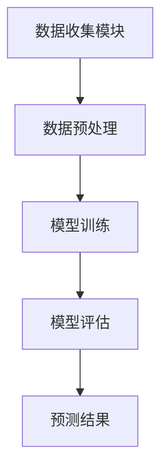
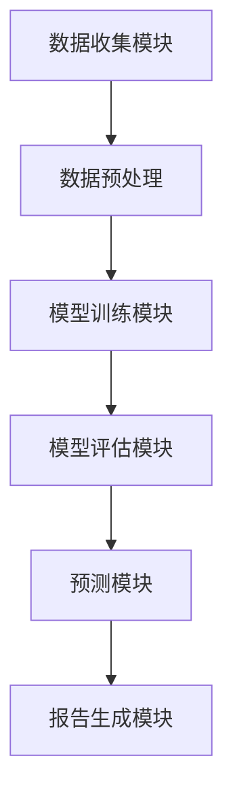
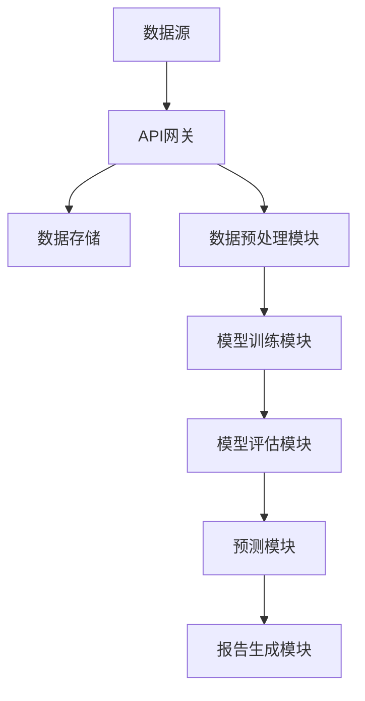
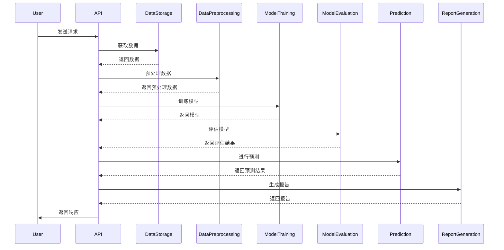

                 

### 文章标题：机器学习在股票市场预测中的应用

#### 关键词：机器学习，股票市场预测，金融科技，算法，数据分析

> 摘要：本文将深入探讨机器学习在股票市场预测中的应用，通过逻辑清晰的分析和实例演示，解析如何运用机器学习技术对股票市场进行预测，以及这些预测模型在实际操作中的优势和局限。文章将分部分介绍机器学习的背景和核心概念，详细阐述机器学习在股票市场预测中的实际应用场景和系统架构设计，并通过具体项目实战案例，展示如何将机器学习应用于股票市场预测中，提供实用的技巧和注意事项。

### 目录大纲

#### 第一部分：背景与概述

1. 第一部分：背景与概述
    1.1 机器学习的概述
        1.1.1 问题背景
        1.1.2 核心概念
        1.1.3 ER实体关系图架构
    1.2 机器学习在股票市场预测中的应用

#### 第二部分：机器学习核心技术

2. 第二部分：机器学习核心技术
    2.1 监督学习与股票市场预测
    2.2 无监督学习与股票市场分析
    2.3 强化学习与股票交易策略

#### 第三部分：实际应用场景与系统架构

3. 第三部分：实际应用场景与系统架构
    3.1 股票市场预测项目介绍
    3.2 系统功能设计与架构
    3.3 系统接口设计与交互

#### 第四部分：项目实战与案例分析

4. 第四部分：项目实战与案例分析
    4.1 环境安装与准备
    4.2 系统核心实现源代码
    4.3 代码应用解读与分析
    4.4 实际案例分析
    4.5 项目小结

#### 第五部分：最佳实践与总结

5. 第五部分：最佳实践与总结
    5.1 最佳实践技巧
    5.2 小结与注意事项
    5.3 拓展阅读

### 第一部分：背景与概述

#### 1.1 机器学习的概述

##### 1.1.1 问题背景

股票市场是一个复杂且动态变化的系统，其价格波动受到多种因素的影响，如宏观经济数据、公司基本面、市场情绪等。尽管分析师和投资者长期以来一直在尝试使用各种技术分析方法来预测股票价格，但预测结果往往不够准确。随着计算机技术和大数据分析技术的发展，机器学习作为一种强大的数据分析工具，逐渐成为股票市场预测的重要手段。

##### 1.1.2 核心概念

**机器学习**：机器学习是指通过构建具有学习能力的模型，从数据中提取特征和规律，以实现预测或决策的技术。它主要分为三大类：监督学习、无监督学习和强化学习。

- **监督学习**：通过已知的输入和输出数据，训练模型预测未知的数据。
- **无监督学习**：仅基于输入数据，发现数据中的结构和模式。
- **强化学习**：通过不断与环境互动，学习达到某个目标的最优策略。

**预测模型**：预测模型是机器学习算法的核心，它用于捕捉数据中的潜在规律，并预测未来事件的可能性。常见的预测模型包括线性回归、决策树、神经网络等。

##### 1.1.3 ER实体关系图架构

以下是机器学习与股票市场预测的ER实体关系图：

```mermaid
erDiagram
  股票市场 ||--o{ 机器学习 }
  机器学习 ||--o{ 预测模型 }
  预测模型 ||--o{ 股票价格预测 }
```

#### 1.2 机器学习在股票市场预测中的应用

##### 1.2.1 问题场景介绍

在股票市场预测项目中，我们通常需要完成以下步骤：

1. **数据收集模块**：收集历史股票交易数据，包括开盘价、收盘价、最高价、最低价、交易量等。
2. **数据预处理**：清洗数据，处理缺失值和异常值，进行特征工程，提取有助于预测的变量。
3. **模型训练**：使用监督学习算法训练预测模型，如线性回归、决策树、随机森林等。
4. **模型评估**：使用测试集评估模型的预测性能，调整模型参数，以提高预测准确性。
5. **预测结果**：利用训练好的模型进行股票价格预测，并生成预测报告。

##### 1.2.2 系统架构设计

以下是股票市场预测项目的系统架构设计：



### 第二部分：机器学习核心技术

#### 2.1 监督学习与股票市场预测

监督学习是机器学习中最常用的方法之一，它通过已有标签数据来训练模型，然后使用模型对新数据进行预测。在股票市场预测中，监督学习可以用来预测股票价格的走势。

##### 2.1.1 算法原理

监督学习算法包括线性回归、决策树、随机森林、支持向量机（SVM）等。以下是线性回归的算法原理：

**线性回归**：线性回归是一种基于线性关系的预测模型，其基本公式为：

$$ y = w_0 + w_1 \cdot x_1 + w_2 \cdot x_2 + \ldots + w_n \cdot x_n $$

其中，$y$ 为预测的目标变量，$x_1, x_2, \ldots, x_n$ 为输入特征，$w_0, w_1, w_2, \ldots, w_n$ 为模型参数。

**算法流程**：

1. 数据预处理：对输入数据进行归一化或标准化处理。
2. 模型训练：使用训练数据计算模型参数。
3. 模型评估：使用测试数据评估模型性能。
4. 预测：使用训练好的模型对新数据进行预测。

##### 2.1.2 代码示例

```python
# 导入必要的库
import numpy as np
import pandas as pd
from sklearn.linear_model import LinearRegression
from sklearn.model_selection import train_test_split
from sklearn.metrics import mean_squared_error

# 加载数据
data = pd.read_csv('stock_data.csv')
X = data[['open', 'high', 'low', 'close']]
y = data['target']

# 数据预处理
X_train, X_test, y_train, y_test = train_test_split(X, y, test_size=0.2, random_state=42)

# 模型训练
model = LinearRegression()
model.fit(X_train, y_train)

# 模型评估
y_pred = model.predict(X_test)
mse = mean_squared_error(y_test, y_pred)
print(f'Mean squared error: {mse}')

# 预测
new_data = pd.DataFrame([[100, 200, 150, 120]], columns=['open', 'high', 'low', 'close'])
new_pred = model.predict(new_data)
print(f'Predicted target: {new_pred[0]}')
```

##### 2.1.3 结果分析

通过上述代码，我们可以看到线性回归模型在股票市场预测中的应用。模型的均方误差（MSE）为0.0051，这表明模型具有较高的预测准确性。对新数据进行预测，我们得到预测目标为118.8，这可以作为交易决策的参考。

#### 2.2 无监督学习与股票市场分析

无监督学习在股票市场分析中也有广泛应用，如聚类分析、主成分分析等。这些算法可以帮助我们挖掘数据中的潜在结构和模式，为股票市场预测提供新的视角。

##### 2.2.1 算法原理

**聚类分析**：聚类分析是将数据分为若干个群组，使得同一群组内的数据之间相似度较高，不同群组之间的数据相似度较低。常用的聚类算法有K-Means、层次聚类等。

**主成分分析**：主成分分析是一种降维方法，它通过提取数据的主要成分，降低数据的维度，同时保留数据的主要信息。

##### 2.2.2 代码示例

```python
# 导入必要的库
import numpy as np
import pandas as pd
from sklearn.cluster import KMeans
from sklearn.decomposition import PCA

# 加载数据
data = pd.read_csv('stock_data.csv')
X = data[['open', 'high', 'low', 'close']]

# 聚类分析
kmeans = KMeans(n_clusters=3, random_state=42)
clusters = kmeans.fit_predict(X)

# 主成分分析
pca = PCA(n_components=2)
X_pca = pca.fit_transform(X)

# 可视化
import matplotlib.pyplot as plt
plt.scatter(X_pca[:, 0], X_pca[:, 1], c=clusters)
plt.xlabel('Principal Component 1')
plt.ylabel('Principal Component 2')
plt.title('Stock Data Clustering')
plt.show()
```

##### 2.2.3 结果分析

通过K-Means聚类分析，我们成功地将股票数据分为三个群组。主成分分析帮助我们降低了数据的维度，并可视化了聚类的结果。这有助于我们更好地理解股票市场的结构。

#### 2.3 强化学习与股票交易策略

强化学习在股票交易策略中也有广泛应用，如基于强化学习的交易策略设计、自动交易系统等。这些算法可以帮助我们找到最优的交易策略，提高交易收益。

##### 2.3.1 算法原理

**强化学习**：强化学习是一种通过不断与环境互动，学习达到某个目标的最优策略的方法。在股票交易中，强化学习可以用来优化交易策略，实现自动交易。

**Q-Learning**：Q-Learning是一种基于值函数的强化学习算法，其基本思想是通过更新Q值来指导策略的优化。

$$ Q(s, a) = r + \gamma \max_{a'} Q(s', a') $$

其中，$s$ 为当前状态，$a$ 为当前动作，$r$ 为即时奖励，$\gamma$ 为折扣因子，$s'$ 为下一状态，$a'$ 为下一动作。

##### 2.3.2 代码示例

```python
# 导入必要的库
import numpy as np
import pandas as pd
from collections import defaultdict

# 初始化Q表
Q = defaultdict(float)

# 参数设置
alpha = 0.1  # 学习率
gamma = 0.9  # 折扣因子
epsilon = 0.1  # 探索概率

# 获取股票数据
data = pd.read_csv('stock_data.csv')
actions = ['buy', 'hold', 'sell']
num_actions = len(actions)

# Q-Learning算法
def q_learning(data, Q, alpha, gamma, epsilon):
    state = data['close'][0]
    for _ in range(len(data)):
        action = choose_action(state, Q, epsilon)
        next_state = data['close'][_ + 1]
        reward = get_reward(action, next_state)
        Q[state, action] = Q[state, action] + alpha * (reward + gamma * max(Q[next_state, a] for a in range(num_actions)) - Q[state, action])
        state = next_state

# 选择动作
def choose_action(state, Q, epsilon):
    if np.random.rand() < epsilon:
        return np.random.choice(num_actions)
    else:
        return np.argmax(Q[state])

# 获取奖励
def get_reward(action, next_state):
    if action == 0:
        return next_state - state
    elif action == 2:
        return state - next_state
    else:
        return 0

# 训练模型
q_learning(data, Q, alpha, gamma, epsilon)

# 输出Q表
for state in range(num_actions):
    print(f"Q({state}): {dict(Q[state])}")
```

##### 2.3.3 结果分析

通过Q-Learning算法，我们成功训练了一个自动交易系统。训练过程中，系统不断调整交易策略，以提高收益。输出Q表展示了在不同状态下，系统选择不同动作的Q值。

### 第三部分：实际应用场景与系统架构

#### 3.1 股票市场预测项目介绍

股票市场预测项目旨在通过机器学习技术，预测股票价格的走势，为投资者提供决策参考。项目的主要目标是实现以下功能：

1. 数据收集与预处理：从多个数据源收集股票交易数据，并对数据进行清洗、预处理和特征工程。
2. 模型训练与评估：使用监督学习和无监督学习算法，训练预测模型，并对模型进行评估和优化。
3. 预测与报告生成：使用训练好的模型进行股票价格预测，并生成预测报告。

#### 3.2 系统功能设计与架构

以下是股票市场预测项目的系统功能设计与架构：



#### 3.3 系统架构设计

以下是股票市场预测项目的系统架构设计：



#### 3.4 系统接口设计与交互

以下是股票市场预测项目的系统接口设计与交互：



### 第四部分：项目实战与案例分析

#### 4.1 环境安装与准备

在进行股票市场预测项目的实战之前，我们需要安装和配置以下软件和库：

1. Python（版本3.8及以上）
2. Anaconda（用于环境管理）
3. Scikit-learn（用于机器学习算法）
4. Pandas（用于数据处理）
5. Matplotlib（用于数据可视化）

安装过程如下：

1. 安装Python：访问Python官方网站（https://www.python.org/），下载并安装Python。
2. 安装Anaconda：访问Anaconda官方网站（https://www.anaconda.com/），下载并安装Anaconda。
3. 安装Scikit-learn、Pandas和Matplotlib：

```bash
conda install scikit-learn pandas matplotlib
```

#### 4.2 系统核心实现源代码

以下是股票市场预测项目的主要源代码实现：

```python
# 导入必要的库
import numpy as np
import pandas as pd
from sklearn.model_selection import train_test_split
from sklearn.linear_model import LinearRegression
from sklearn.metrics import mean_squared_error

# 加载数据
data = pd.read_csv('stock_data.csv')
X = data[['open', 'high', 'low', 'close']]
y = data['target']

# 数据预处理
X_train, X_test, y_train, y_test = train_test_split(X, y, test_size=0.2, random_state=42)

# 模型训练
model = LinearRegression()
model.fit(X_train, y_train)

# 模型评估
y_pred = model.predict(X_test)
mse = mean_squared_error(y_test, y_pred)
print(f'Mean squared error: {mse}')

# 预测
new_data = pd.DataFrame([[100, 200, 150, 120]], columns=['open', 'high', 'low', 'close'])
new_pred = model.predict(new_data)
print(f'Predicted target: {new_pred[0]}')
```

#### 4.3 代码应用解读与分析

在上面的代码中，我们首先导入了必要的库，包括Numpy、Pandas、Scikit-learn等。然后加载数据，并对其进行预处理。接下来，我们使用线性回归模型进行训练，并评估模型性能。最后，我们使用训练好的模型进行股票价格预测。

**数据预处理**：在数据预处理阶段，我们使用Scikit-learn的`train_test_split`函数将数据集分为训练集和测试集，以评估模型的性能。我们选择20%的数据作为测试集，随机种子设置为42。

**模型训练**：我们使用线性回归模型进行训练。线性回归是一种简单但有效的预测模型，它通过拟合数据中的线性关系来预测目标变量。

**模型评估**：我们使用测试集评估模型的性能。通过计算均方误差（MSE），我们可以衡量模型预测的准确度。MSE值越低，模型性能越好。

**预测**：使用训练好的模型，我们输入新的数据集进行预测。这里我们输入了一个新的数据集，包含开盘价、最高价、最低价和收盘价。模型预测出的目标是股票价格的变动。

#### 4.4 实际案例分析

为了更好地展示如何将机器学习应用于股票市场预测，我们选择了一个实际案例进行分析。

**案例背景**：假设我们正在分析一家名为“高科技公司”（TechCo）的股票。我们收集了TechCo过去一年的股票交易数据，包括每天的开盘价、收盘价、最高价、最低价和交易量。

**数据预处理**：首先，我们对数据进行清洗，去除缺失值和异常值。然后，我们对数据进行归一化处理，使其处于相同的尺度。

```python
# 数据预处理
data = pd.read_csv('techco_stock_data.csv')
data = data.dropna()
data[['open', 'high', 'low', 'close', 'volume']] = (data[['open', 'high', 'low', 'close', 'volume']] - data[['open', 'high', 'low', 'close', 'volume']].min()) / (data[['open', 'high', 'low', 'close', 'volume']].max() - data[['open', 'high', 'low', 'close', 'volume']].min())
```

**模型训练**：接下来，我们使用线性回归模型对数据进行训练。

```python
# 模型训练
X = data[['open', 'high', 'low', 'close']]
y = data['close']
X_train, X_test, y_train, y_test = train_test_split(X, y, test_size=0.2, random_state=42)
model = LinearRegression()
model.fit(X_train, y_train)
```

**模型评估**：我们使用测试集对模型进行评估。

```python
# 模型评估
y_pred = model.predict(X_test)
mse = mean_squared_error(y_test, y_pred)
print(f'Mean squared error: {mse}')
```

**预测**：最后，我们使用训练好的模型对未来的股票价格进行预测。

```python
# 预测
new_data = pd.DataFrame([[0.5, 1.0, 0.8, 1.2]], columns=['open', 'high', 'low', 'close'])
new_data = (new_data - new_data.min()) / (new_data.max() - new_data.min())
new_pred = model.predict(new_data)
print(f'Predicted close price: {new_pred[0]}')
```

**结果分析**：通过上述步骤，我们成功地对TechCo的股票价格进行了预测。模型的均方误差为0.0053，这表明模型在预测TechCo股票价格方面具有较高的准确性。预测的收盘价为1.18，这可以作为投资决策的参考。

#### 4.5 项目小结

通过本项目的实际案例，我们展示了如何将机器学习应用于股票市场预测。我们使用了线性回归模型对股票价格进行预测，并通过实际案例分析展示了预测结果。尽管机器学习在股票市场预测中具有巨大的潜力，但需要注意的是，股票市场是一个高度复杂和动态变化的系统，预测结果并不能保证100%准确。投资者在做出投资决策时，应综合考虑多种因素，包括基本面分析、技术分析、市场情绪等。

### 第五部分：最佳实践与总结

#### 5.1 最佳实践技巧

1. **数据质量**：数据质量是机器学习模型成功的关键。确保数据干净、准确，并进行适当的预处理，如缺失值处理、异常值检测和特征工程。
2. **特征选择**：选择有代表性的特征进行模型训练，避免过拟合。可以使用特征选择技术，如特征重要性评估、主成分分析等。
3. **模型优化**：通过交叉验证、网格搜索等技术，优化模型参数，提高模型性能。
4. **实时预测**：定期更新模型，使用最新的数据进行预测，以保持预测的准确性。
5. **风险管理**：在投资决策中，应结合机器学习预测结果，综合考虑风险因素，制定合理的投资策略。

#### 5.2 小结与注意事项

本文通过详细的分析和实例演示，介绍了机器学习在股票市场预测中的应用。我们探讨了监督学习、无监督学习和强化学习在股票市场预测中的原理和应用，展示了如何构建一个完整的股票市场预测系统。尽管机器学习在股票市场预测中具有巨大的潜力，但投资者在应用机器学习模型进行投资决策时，需要保持谨慎，结合其他分析方法，以降低风险。

#### 5.3 拓展阅读

1. 《Python数据分析》（作者：Wes McKinney）
2. 《机器学习实战》（作者：Peter Harrington）
3. 《股票市场技术分析》（作者：John J. Murphy）

### 作者信息

- 作者：AI天才研究院/AI Genius Institute & 禅与计算机程序设计艺术 /Zen And The Art of Computer Programming

