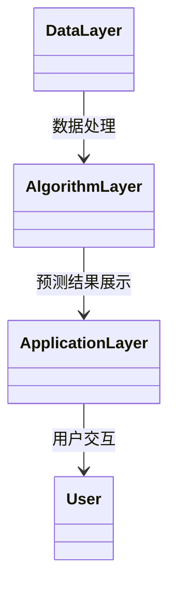
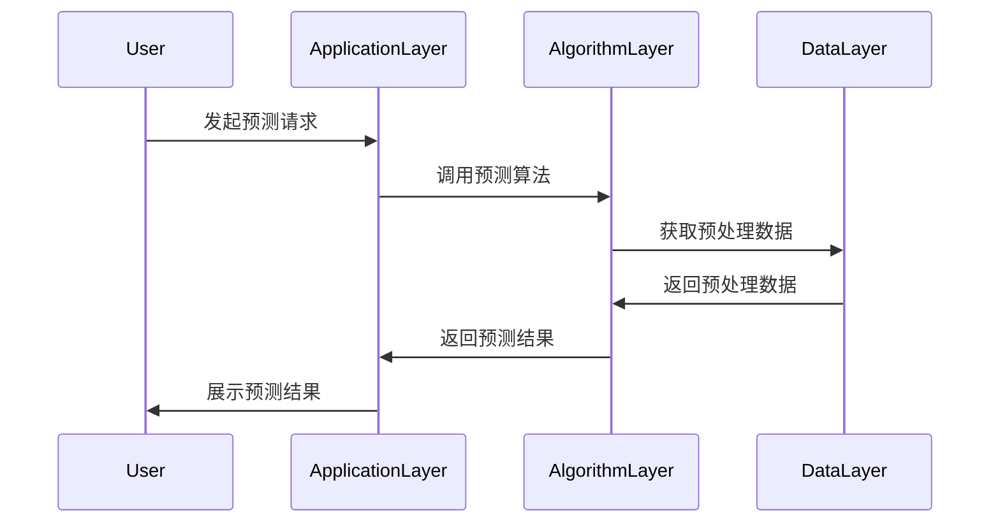

                 

# 机器学习在预测性维护中的应用

## 关键词
- 机器学习
- 预测性维护
- 算法
- 数据分析
- 工业应用

## 摘要
本文深入探讨了机器学习在预测性维护领域的应用。首先，我们将介绍机器学习和预测性维护的基本概念，解释它们为何如此重要。接着，我们将分析机器学习在预测性维护中的实际应用，包括关键算法、系统架构和案例分析。通过本文的阅读，读者将理解如何利用机器学习技术来预测设备故障，从而降低维护成本，提高生产效率。

## 目录大纲设计思路与步骤

### 步骤一：分析用户需求
首先，我们需要明确用户对书籍的需求，即如何有效地利用机器学习技术来解决预测性维护的问题。这要求我们对机器学习和预测性维护有深入的理解，并能够将其转化为易于理解的内容。

### 步骤二：构建核心框架
本文将围绕以下核心框架展开：

1. **背景介绍**
   - 机器学习与预测性维护概述
   - 预测性维护的挑战与机遇
   - 机器学习在工业领域中的应用

2. **核心概念与联系**
   - 机器学习基础概念与原理
   - 预测性维护中的关键算法
   - 机器学习与预测性维护的联系与区别

3. **算法原理讲解**
   - 监督学习、无监督学习和强化学习算法的工作原理
   - 常用算法在预测性维护中的应用

4. **系统分析与架构设计**
   - 预测性维护系统架构设计
   - 预测性维护系统的实现与部署

5. **项目实战**
   - 实际案例分析与讲解
   - 项目小结与最佳实践

### 步骤三：细化每个章节的内容
我们将确保每个章节都有详细的讲解和具体的示例，以帮助读者更好地理解每个概念和算法。

### 步骤四：撰写目录大纲
在撰写目录大纲时，我们将遵循以下原则：

- **简洁性**：避免冗余内容，确保每个章节都有明确的主题和目标。
- **格式规范**：使用 markdown 格式，确保目录层级清晰，便于阅读。
- **内容完整性**：确保每个章节都覆盖了必要的知识点和实际应用。

### 步骤五：撰写文章正文
在撰写文章正文时，我们将按照目录大纲的顺序，逐步深入讲解每个章节的内容，确保逻辑清晰，结构紧凑。

### 步骤六：完善文章结尾
在文章结尾，我们将总结全文，提供最佳实践建议，并提出未来研究的方向。

## 第一部分：背景介绍

### 1. 机器学习与预测性维护概述

#### 1.1 机器学习的基本概念
机器学习是一种人工智能的分支，它通过算法从数据中学习规律，并利用这些规律来做出预测或决策。机器学习可以分为监督学习、无监督学习和强化学习三种主要类型。

- **监督学习**：有标记的数据集，算法学习目标变量的依赖关系。
- **无监督学习**：没有标记的数据集，算法寻找数据中的结构和模式。
- **强化学习**：算法通过与环境的交互，学习最优策略。

#### 1.2 预测性维护的定义与重要性
预测性维护是一种利用数据分析和先进算法来预测设备故障的方法。它通过实时监测设备的运行状态，预测潜在的故障，从而在故障发生前进行预防性维护。

预测性维护的重要性在于：

- **降低维护成本**：通过提前预测故障，可以避免因设备突然停机而导致的巨额维修费用。
- **提高生产效率**：减少设备故障率，提高设备利用率。
- **延长设备寿命**：通过定期维护，延长设备的使用寿命。

### 2. 预测性维护的挑战与机遇

#### 2.1 预测性维护的现状
尽管预测性维护在理论上具有显著优势，但在实际应用中仍面临诸多挑战：

- **数据质量问题**：设备运行数据通常不完整，存在噪声和异常值，这给数据预处理带来了困难。
- **算法复杂度**：预测性维护需要复杂的算法来处理大量的时间序列数据。
- **模型可解释性**：机器学习模型往往被视为“黑盒子”，难以解释其预测结果。

#### 2.2 预测性维护面临的挑战
预测性维护面临的挑战包括：

- **数据收集与存储**：需要大量的传感器数据来支持模型训练。
- **模型选择与调优**：选择合适的算法和参数，确保模型的预测准确性。
- **系统集成与部署**：将预测性维护系统集成到现有的工业系统中。

#### 2.3 机遇与前景
随着数据采集技术的进步和算法的改进，预测性维护有望成为工业领域的关键技术。其应用前景包括：

- **智能制造**：预测性维护可以与智能制造系统紧密结合，实现智能化的生产流程。
- **设备健康管理**：通过预测性维护，可以实时监控设备状态，实现设备健康管理。

### 3. 机器学习在工业领域中的应用
机器学习在工业领域中的应用越来越广泛，特别是在预测性维护方面。以下是一些典型应用：

- **设备故障预测**：通过监测设备的运行状态，预测潜在的故障，实现预防性维护。
- **生产过程优化**：利用机器学习分析生产数据，优化生产流程，提高生产效率。
- **供应链管理**：通过分析供应链数据，优化库存管理，减少库存成本。

## 第二部分：核心概念与联系

### 4. 机器学习基础概念与原理

#### 4.1 机器学习的定义与分类
机器学习是一种通过数据驱动的方法，使计算机能够从经验中学习，并做出预测或决策的技术。它可分为以下几类：

- **监督学习**：输入和输出都是已知的，算法学习输入和输出之间的映射关系。
- **无监督学习**：输入是已知的，但输出是未知的，算法寻找数据中的隐含结构和模式。
- **强化学习**：算法通过与环境的交互，学习最优策略。

#### 4.2 机器学习的基本原理
机器学习的基本原理是基于统计学和概率论，通过优化目标函数来学习数据中的特征。常见的机器学习算法包括：

- **线性回归**：通过拟合一条直线，预测输出值。
- **逻辑回归**：通过拟合一个逻辑函数，预测输出值的概率。
- **支持向量机**：通过找到一个最佳的超平面，分类输入数据。
- **决策树**：通过递归划分特征空间，分类输入数据。
- **神经网络**：通过多层神经元结构，模拟人脑的学习过程。

#### 4.3 机器学习的模型类型
机器学习模型可以分为以下几类：

- **线性模型**：基于线性函数，如线性回归、逻辑回归。
- **非线性模型**：基于非线性函数，如决策树、神经网络。
- **概率模型**：基于概率分布，如贝叶斯网络、隐马尔可夫模型。

### 5. 预测性维护中的关键算法

#### 5.1 预测性维护的算法分类
预测性维护常用的算法可以分为以下几类：

- **时间序列分析**：如ARIMA模型、LSTM神经网络，用于分析时间序列数据。
- **故障诊断算法**：如支持向量机、决策树，用于分类故障类型。
- **异常检测算法**：如K-means聚类、孤立森林，用于检测异常数据。
- **回归算法**：如线性回归、岭回归，用于预测设备故障时间。

#### 5.2 关键算法详细介绍
以下是预测性维护中常用的几种关键算法：

- **ARIMA模型**：自回归积分滑动平均模型，用于时间序列数据的建模和预测。
- **LSTM神经网络**：长短时记忆神经网络，用于处理序列数据，具有记忆长期依赖性的能力。
- **支持向量机**：通过找到一个最佳的超平面，分类输入数据，常用于故障诊断。
- **K-means聚类**：通过迭代计算，将数据划分为若干个聚类，用于检测异常数据。

### 6. 机器学习与预测性维护的联系与区别

#### 6.1 联系分析
机器学习与预测性维护的联系在于：

- **数据驱动**：两者都是基于数据驱动的方法，利用历史数据来预测未来。
- **算法应用**：机器学习算法在预测性维护中得到了广泛应用，如时间序列分析、故障诊断和异常检测。

#### 6.2 区别对比
机器学习与预测性维护的区别在于：

- **目标不同**：机器学习旨在发现数据中的规律，而预测性维护旨在预测设备故障。
- **应用范围**：机器学习应用范围更广，而预测性维护更专注于工业设备的管理和维护。

## 第三部分：算法原理讲解

### 7. 机器学习算法的工作原理

#### 7.1 监督学习算法
监督学习算法是最常见的机器学习算法，其工作原理如下：

1. **数据准备**：收集并准备训练数据集，包括特征和标签。
2. **模型训练**：使用训练数据集，通过优化目标函数，训练出一个模型。
3. **模型评估**：使用验证数据集，评估模型的性能，调整模型参数。
4. **预测**：使用训练好的模型，对新的数据集进行预测。

常见监督学习算法包括线性回归、逻辑回归、支持向量机、决策树和神经网络等。

#### 7.2 无监督学习算法
无监督学习算法主要用于发现数据中的结构和模式，其工作原理如下：

1. **数据准备**：收集并准备无标记的数据集。
2. **模式发现**：通过算法，发现数据中的隐含结构和模式。
3. **聚类分析**：将数据划分为若干个聚类，分析每个聚类的特性。
4. **降维**：通过降维技术，将高维数据映射到低维空间，便于分析和可视化。

常见无监督学习算法包括K-means聚类、主成分分析（PCA）和自编码器等。

#### 7.3 强化学习算法
强化学习算法通过与环境交互，学习最优策略，其工作原理如下：

1. **环境建模**：建立环境的模型，包括状态、动作和奖励。
2. **策略学习**：通过迭代，学习最优策略。
3. **策略执行**：执行学到的策略，与环境交互，获得奖励。
4. **策略优化**：根据奖励反馈，优化策略。

强化学习算法常用于游戏、自动驾驶和机器人控制等领域。

### 8. 预测性维护中的常用算法

#### 8.1 常用算法概述
预测性维护中的常用算法包括时间序列分析、故障诊断、异常检测和回归分析等。

- **时间序列分析**：用于分析设备运行数据，预测设备故障时间。
- **故障诊断**：用于分类设备故障类型，指导维护工作。
- **异常检测**：用于检测设备运行中的异常数据，提前预警。
- **回归分析**：用于预测设备故障时间，优化维护策略。

#### 8.2 算法应用实例
以下是一个使用ARIMA模型进行设备故障预测的实例：

```python
import numpy as np
import pandas as pd
from statsmodels.tsa.arima.model import ARIMA

# 加载设备运行数据
data = pd.read_csv('device_data.csv')

# 数据预处理
data['timestamp'] = pd.to_datetime(data['timestamp'])
data.set_index('timestamp', inplace=True)
data = data.fillna(method='ffill')

# 拆分数据集
train_data = data[:int(len(data) * 0.8)]
test_data = data[int(len(data) * 0.8):]

# 训练ARIMA模型
model = ARIMA(train_data['value'], order=(5, 1, 2))
model_fit = model.fit()

# 预测
predictions = model_fit.forecast(steps=len(test_data))

# 可视化预测结果
import matplotlib.pyplot as plt

plt.figure(figsize=(10, 6))
plt.plot(test_data['value'], label='Actual')
plt.plot(predictions, label='Predicted')
plt.xlabel('Time')
plt.ylabel('Value')
plt.legend()
plt.show()
```

## 第四部分：系统分析与架构设计

### 9. 预测性维护系统架构设计

#### 9.1 系统功能设计
预测性维护系统的核心功能包括：

- **数据收集**：从设备中收集运行数据，包括温度、压力、振动等。
- **数据预处理**：清洗数据，去除噪声和异常值，确保数据的准确性。
- **模型训练**：使用机器学习算法，训练预测模型。
- **故障预测**：使用训练好的模型，预测设备故障时间。
- **报警与提醒**：当预测到设备可能发生故障时，发送报警信息。

#### 9.2 系统架构设计
预测性维护系统的架构设计包括以下几部分：

- **数据层**：负责数据的收集、存储和管理。
- **算法层**：负责数据预处理、模型训练和故障预测。
- **应用层**：负责展示预测结果，提供报警和提醒功能。

以下是系统架构的Mermaid类图：



#### 9.3 系统接口设计
预测性维护系统提供了以下接口：

- **数据接口**：用于数据层的操作，如数据收集、数据预处理等。
- **算法接口**：用于算法层的操作，如模型训练、故障预测等。
- **应用接口**：用于应用层的操作，如展示预测结果、发送报警等。

以下是系统接口的Mermaid序列图：



### 10. 预测性维护系统的实现与部署

#### 10.1 系统实现步骤
预测性维护系统的实现步骤如下：

1. **数据收集**：使用传感器和监控设备，收集设备运行数据。
2. **数据预处理**：清洗数据，去除噪声和异常值，确保数据的准确性。
3. **模型训练**：选择合适的机器学习算法，训练预测模型。
4. **故障预测**：使用训练好的模型，对新的设备运行数据进行预测。
5. **报警与提醒**：当预测到设备可能发生故障时，发送报警信息。

#### 10.2 系统部署与维护
预测性维护系统的部署与维护包括：

- **部署**：将系统部署到服务器或云平台上，确保系统的稳定运行。
- **监控**：监控系统的运行状态，确保数据的实时性和准确性。
- **更新**：定期更新系统，包括算法升级和功能增强。
- **维护**：定期维护设备，确保设备的正常运行。

## 第五部分：项目实战

### 11. 实际案例分析与讲解

#### 11.1 案例背景
某工厂的一台关键设备，由于缺乏有效的维护策略，导致频繁停机，影响了生产效率。为了解决这一问题，工厂决定采用机器学习技术进行预测性维护。

#### 11.2 案例分析
1. **数据收集**：工厂安装了传感器，实时收集设备的运行数据，包括温度、压力、振动等。
2. **数据预处理**：清洗数据，去除噪声和异常值，确保数据的准确性。
3. **模型训练**：选择ARIMA模型，对设备运行数据进行分析，训练预测模型。
4. **故障预测**：使用训练好的模型，预测设备的故障时间。
5. **报警与提醒**：当预测到设备可能发生故障时，发送报警信息，通知维护人员。

#### 11.3 案例讲解
以下是一个使用ARIMA模型进行设备故障预测的实例：

```python
import numpy as np
import pandas as pd
from statsmodels.tsa.arima.model import ARIMA

# 加载设备运行数据
data = pd.read_csv('device_data.csv')

# 数据预处理
data['timestamp'] = pd.to_datetime(data['timestamp'])
data.set_index('timestamp', inplace=True)
data = data.fillna(method='ffill')

# 拆分数据集
train_data = data[:int(len(data) * 0.8)]
test_data = data[int(len(data) * 0.8):]

# 训练ARIMA模型
model = ARIMA(train_data['value'], order=(5, 1, 2))
model_fit = model.fit()

# 预测
predictions = model_fit.forecast(steps=len(test_data))

# 可视化预测结果
import matplotlib.pyplot as plt

plt.figure(figsize=(10, 6))
plt.plot(test_data['value'], label='Actual')
plt.plot(predictions, label='Predicted')
plt.xlabel('Time')
plt.ylabel('Value')
plt.legend()
plt.show()
```

### 12. 项目小结与最佳实践

#### 12.1 项目总结
通过实际案例，我们展示了如何利用机器学习技术进行预测性维护。项目成功的关键在于：

- **数据质量**：确保数据的准确性和完整性。
- **算法选择**：选择合适的算法，确保模型的预测准确性。
- **系统集成**：将预测性维护系统集成到现有的工业系统中。

#### 12.2 最佳实践
为了提高预测性维护的效果，以下是一些最佳实践：

- **数据预处理**：对数据进行清洗和预处理，去除噪声和异常值。
- **模型选择**：根据数据的特点，选择合适的模型，并进行调优。
- **系统集成**：确保预测性维护系统能够与其他系统无缝集成，实现实时监控和报警。
- **持续优化**：定期更新模型，优化算法，提高预测准确性。

#### 12.3 注意事项
在进行预测性维护时，需要注意以下几点：

- **数据隐私**：确保数据的隐私和安全。
- **模型可解释性**：提高模型的可解释性，便于理解和验证。
- **系统稳定性**：确保系统的稳定运行，减少故障风险。

#### 12.4 拓展阅读
- 《机器学习：一种算法的角度》
- 《预测性维护：理论与实践》
- 《工业大数据应用》

## 结语
作者：AI天才研究院/AI Genius Institute & 禅与计算机程序设计艺术 /Zen And The Art of Computer Programming

本文通过深入分析机器学习在预测性维护中的应用，展示了如何利用机器学习技术来解决工业设备维护中的挑战。我们探讨了机器学习和预测性维护的基本概念，介绍了关键算法和系统架构，并通过实际案例进行了详细讲解。希望本文能够为读者在预测性维护领域提供有价值的参考。

## 参考文献
1. Hastie, T., Tibshirani, R., & Friedman, J. (2009). The Elements of Statistical Learning: Data Mining, Inference, and Prediction. Springer.
2. Bishop, C. M. (2006). Pattern Recognition and Machine Learning. Springer.
3. Box, G. E. P., & Jenkins, G. M. (1970). Time Series Analysis: Forecasting and Control. San Francisco: Holden-Day.
4. Brown, R. G. D., Durbin, J., & Watson, G. S. (1976). Statistical Methods for the Analysis of Time Series. Berlin: Springer-Verlag.
5. Murphy, K. P. (2012). Machine Learning: A Probabilistic Perspective. MIT Press.

