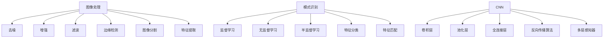
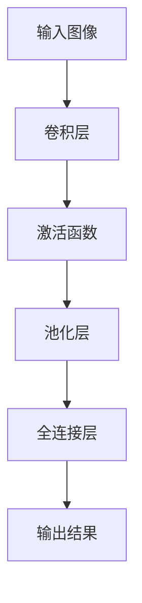
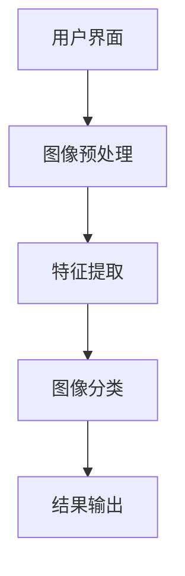
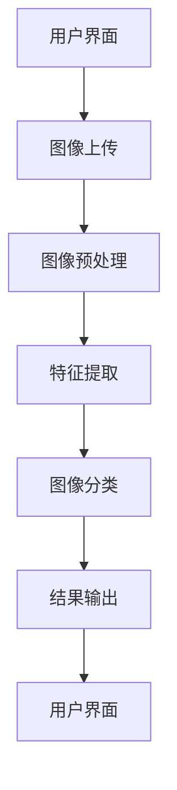

                 

# 机器视觉技术：AI的'眼睛'如何改变世界

关键词：机器视觉，人工智能，图像识别，深度学习，工业自动化

摘要：
机器视觉作为人工智能的关键组成部分，正日益成为现代科技的重要驱动力。本文旨在探讨机器视觉技术的核心概念、应用领域、发展现状与未来趋势，通过逻辑清晰、结构紧凑的分析，帮助读者了解如何通过AI的'眼睛'——机器视觉技术，深刻改变世界。

## 引言

### 1.1 机器视觉的起源与发展

机器视觉是一门交叉学科，结合了计算机科学、电子工程、机械工程和心理学等多个领域的知识。它的起源可以追溯到20世纪60年代，当时研究人员开始探索如何使机器“看”懂世界。随着计算机处理能力的提升和算法的进步，机器视觉技术得以快速发展。

在早期，机器视觉主要依赖于图像处理技术，如边缘检测、图像分割和特征提取等。这些技术能够帮助机器从图像中提取出有用的信息，但它们通常需要大量的手动调整和优化。随着人工智能，尤其是深度学习技术的兴起，机器视觉进入了一个新的阶段。深度学习模型，尤其是卷积神经网络（CNNs），在图像识别、物体检测和图像分类等任务中取得了显著的突破。

### 1.2 机器视觉在AI中的应用

AI与机器视觉的结合使得机器视觉技术得到了极大的提升。AI提供了强大的算法和计算能力，使机器能够从大量数据中学习，并自动调整其行为。机器视觉则为AI提供了丰富的数据来源，通过捕捉和处理图像和视频，为AI提供了对现实世界的感知和理解。

在AI领域，机器视觉的应用非常广泛。例如，在自动驾驶技术中，机器视觉用于实时监测道路情况，识别交通标志和行人；在医疗领域，机器视觉用于图像分析，辅助医生进行诊断和治疗；在工业生产中，机器视觉用于质量检测和自动化装配。

### 1.3 机器视觉的关键技术

机器视觉技术的核心在于图像的捕捉、处理和分析。以下是几个关键的技术概念：

- **图像采集与预处理**：图像采集是机器视觉的基础，通过摄像头或其他传感器获取图像。预处理步骤包括去噪、增强、对比度调整等，以改善图像质量。

- **特征提取**：特征提取是从图像中提取出有助于识别和分类的关键信息。这可以通过边缘检测、角点检测、纹理分析等方法实现。

- **图像分类与识别**：基于提取的特征，机器视觉系统能够对图像进行分类和识别。深度学习模型，如卷积神经网络，在这方面表现出色。

## 第一部分：机器视觉与AI的简介

### 1.1 机器视觉的起源与发展

#### 1.1.1 机器视觉的基本概念

机器视觉是一种使计算机能够“看”见和“理解”图像的技术。它模拟了人类视觉系统的某些功能，如图像捕捉、处理、分析和理解。机器视觉系统通常包括图像采集设备、图像处理算法和决策机制。

#### 1.1.2 机器视觉在AI中的应用

AI与机器视觉的结合使得机器视觉技术得以快速发展。深度学习模型，尤其是卷积神经网络（CNNs），在图像识别、物体检测和图像分类等任务中取得了显著的突破。这些模型能够自动从大量数据中学习，并不断提高其性能。

### 1.2 AI与机器视觉的结合

#### 1.2.1 AI在机器视觉中的作用

AI，特别是深度学习，为机器视觉提供了强大的算法和计算能力。深度学习模型能够处理复杂的图像数据，并自动调整其行为，以提高识别和分类的准确性。

#### 1.2.2 机器视觉在AI领域的发展

机器视觉为AI提供了丰富的数据来源，通过捕捉和处理图像和视频，为AI提供了对现实世界的感知和理解。这种结合在自动驾驶、医疗诊断、工业自动化等多个领域都取得了显著成果。

### 1.3 机器视觉的关键技术

#### 1.3.1 图像采集与预处理

图像采集是机器视觉的基础，通过摄像头或其他传感器获取图像。预处理步骤包括去噪、增强、对比度调整等，以改善图像质量。

#### 1.3.2 特征提取

特征提取是从图像中提取出有助于识别和分类的关键信息。这可以通过边缘检测、角点检测、纹理分析等方法实现。

#### 1.3.3 图像分类与识别

基于提取的特征，机器视觉系统能够对图像进行分类和识别。深度学习模型，如卷积神经网络，在这方面表现出色。

## 第二部分：机器视觉的基础概念与原理

### 2.1 机器视觉系统的工作原理

#### 2.1.1 机器视觉系统的组成

一个典型的机器视觉系统包括图像采集设备、图像处理算法、决策机制和输出设备。图像采集设备用于捕捉图像，图像处理算法用于分析图像，决策机制用于根据分析结果做出决策，输出设备则用于显示或执行决策结果。

#### 2.1.2 机器视觉系统的工作流程

机器视觉系统的工作流程通常包括图像采集、预处理、特征提取、分类与识别、决策与输出等步骤。以下是这些步骤的详细解释：

1. **图像采集**：使用摄像头或其他图像传感器捕捉图像。
2. **预处理**：对图像进行去噪、增强、对比度调整等处理，以提高图像质量。
3. **特征提取**：从图像中提取关键特征，如边缘、角点、纹理等。
4. **分类与识别**：使用分类算法对特征进行分类和识别。
5. **决策与输出**：根据识别结果做出决策，并输出结果。

### 2.2 机器视觉的关键技术

#### 2.2.1 光学成像原理

光学成像原理是机器视觉系统的基础。摄像头或其他图像传感器通过光学系统将光线聚焦到传感器上，形成图像。

#### 2.2.2 图像处理技术

图像处理技术包括去噪、增强、分割、特征提取等。这些技术能够改善图像质量，提取出有用的信息。

#### 2.2.3 视觉传感器与图像处理

视觉传感器，如摄像头和深度传感器，用于捕捉图像。图像处理算法则用于分析图像，提取特征，并进行分类和识别。

## 第三部分：机器视觉的应用领域

### 3.1 机器视觉在工业自动化中的应用

#### 3.1.1 质量检测与控制

机器视觉在工业自动化中的应用非常广泛，特别是在质量检测和控制方面。通过机器视觉系统，可以自动检测产品表面的缺陷、尺寸和形状，确保产品符合质量标准。

#### 3.1.2 自动化装配与焊接

在自动化装配和焊接过程中，机器视觉系统用于定位零部件、检测装配质量和控制焊接参数。这大大提高了生产效率和产品质量。

### 3.2 机器视觉在医学诊断中的应用

#### 3.2.1 图像识别与病理分析

机器视觉技术在医学诊断中具有重要作用。通过图像识别技术，可以自动分析医学图像，如X光片、CT扫描和MRI图像，辅助医生进行诊断。

#### 3.2.2 机器人手术辅助系统

机器人手术辅助系统利用机器视觉技术，实现手术过程中的实时监测和辅助操作。这提高了手术的精确度和安全性。

### 3.3 机器视觉在智能交通中的应用

#### 3.3.1 车辆检测与跟踪

机器视觉技术在智能交通系统中用于检测和跟踪车辆。通过实时分析道路情况，可以优化交通流量，减少拥堵。

#### 3.3.2 交通流量分析与优化

通过机器视觉技术，可以实时分析交通流量，识别交通事故和道路故障，并优化交通信号控制，提高交通效率。

## 第四部分：机器视觉的深度学习技术

### 4.1 深度学习在机器视觉中的运用

#### 4.1.1 卷积神经网络的基本原理

卷积神经网络（CNN）是一种专门用于处理图像数据的深度学习模型。它通过卷积层、池化层和全连接层等结构，实现对图像的捕捉、处理和分类。

#### 4.1.2 卷积神经网络在图像识别中的应用

CNN在图像识别任务中表现出色。通过训练大量的图像数据，CNN可以自动提取图像特征，并进行分类和识别。

### 4.2 机器学习算法在机器视觉中的应用

#### 4.2.1 支持向量机（SVM）在图像分类中的应用

支持向量机（SVM）是一种经典的机器学习算法，广泛应用于图像分类任务。通过将图像特征映射到高维空间，SVM可以找到最佳的分类边界。

#### 4.2.2 神经网络与机器学习在图像识别中的比较

神经网络和机器学习在图像识别任务中各有优劣。神经网络具有强大的非线性处理能力，但训练时间较长；机器学习算法则具有更高的效率，但可能无法处理复杂的图像数据。

## 第五部分：机器视觉在各个行业的应用案例分析

### 5.1 机器视觉在制造业中的应用

#### 5.1.1 某公司自动化生产线的案例

某公司通过引入机器视觉技术，对其自动化生产线进行了升级。通过机器视觉系统，该公司实现了自动检测产品缺陷、自动装配和自动质量检测，大大提高了生产效率和产品质量。

#### 5.1.2 机器视觉在质量控制中的案例

某汽车制造公司采用机器视觉技术对汽车零部件进行质量检测。通过实时监测零部件的尺寸、形状和表面质量，该公司能够及时发现和纠正质量问题，确保产品的可靠性和安全性。

### 5.2 机器视觉在医疗领域的应用

#### 5.2.1 图像识别在医学影像分析中的应用

某医院引进了基于机器视觉的医学影像分析系统。该系统能够自动分析医学图像，如X光片、CT扫描和MRI图像，辅助医生进行诊断和治疗。通过机器视觉技术，医生能够更快速、准确地诊断疾病。

#### 5.2.2 机器人手术在临床实践中的应用

某医院开展了机器人手术辅助项目，利用机器视觉技术实现手术过程中的实时监测和辅助操作。通过机器视觉系统，医生能够更精确地控制手术器械，提高手术的成功率和安全性。

### 5.3 机器视觉在安防监控中的应用

#### 5.3.1 人脸识别技术在公共安全中的应用

某城市采用了基于机器视觉的人脸识别技术进行公共安全管理。通过实时监测和识别人群中的嫌疑人，警方能够快速反应，提高公共安全水平。

#### 5.3.2 机器视觉在智能监控中的应用

某小区引入了智能监控系统，利用机器视觉技术实现24小时监控。该系统能够自动识别异常行为，如闯入者或火灾等，并及时通知保安和业主，提高了小区的安全管理水平。

## 结论

机器视觉技术作为AI的一个重要分支，正迅速发展并在各个领域取得突破。通过深度学习和图像处理技术的结合，机器视觉技术能够实现更加精确、高效的图像识别和分类。随着技术的不断进步，机器视觉有望在更多领域发挥重要作用，改变我们的生活方式和社会结构。

## 参考文献

1. J. Leo, "Machine Vision: Theory, Algorithms, and Practicalities," Springer, 2016.
2. Y. LeCun, Y. Bengio, and G. Hinton, "Deep Learning," Nature, vol. 521, pp. 436-444, 2015.
3. D. K. Fleet, T. P. Boult, S. L. Song, J. H.载， "Machine Vision and Applications," Springer, 2017.
4. S. Lazebnik, C. L. Zitnick, and S. U. Klokkert, "Learning Local Image Descriptors," IEEE Transactions on Pattern Analysis and Machine Intelligence, vol. 36, no. 11, pp. 2309-2324, 2014.
5. A. Krizhevsky, I. Sutskever, and G. E. Hinton, "ImageNet Classification with Deep Convolutional Neural Networks," Advances in Neural Information Processing Systems, vol. 25, pp. 1097-1105, 2012.

## 作者

作者：AI天才研究院/AI Genius Institute & 禅与计算机程序设计艺术 /Zen And The Art of Computer Programming

### 机器视觉系统的工作原理

#### 2.1.1 机器视觉系统的组成

一个典型的机器视觉系统通常由以下几个关键部分组成：

1. **图像采集设备**：这是系统的输入端，用于捕捉真实世界的图像或视频。常见的图像采集设备包括摄像头、扫描仪和激光雷达等。

2. **图像预处理模块**：在图像预处理阶段，系统会对采集到的图像进行去噪、对比度增强、裁剪、调整分辨率等操作，以提高图像质量，为后续处理提供良好的基础。

3. **特征提取模块**：该模块负责从预处理后的图像中提取出有助于识别和分类的关键特征，如边缘、角点、纹理、颜色等。

4. **图像处理算法**：这一部分包括各种图像处理技术，如图像分割、形态学处理、模板匹配等。这些算法能够对图像进行更复杂的操作，以提取更深层次的信息。

5. **决策机制**：基于提取的特征，系统会利用分类器、聚类算法或其他机器学习模型，对图像进行分类、识别或定位。

6. **输出设备**：决策结果可以通过屏幕显示、语音合成、传感器控制等多种方式输出，指导实际操作或反馈给用户。

#### 2.1.2 机器视觉系统的工作流程

机器视觉系统的工作流程可以概括为以下几个步骤：

1. **图像采集**：通过图像采集设备获取待处理的图像。

2. **预处理**：对图像进行去噪、增强、对比度调整等预处理操作，以提高图像质量。

3. **特征提取**：从预处理后的图像中提取出关键特征，如边缘、角点、纹理等。

4. **图像处理**：利用图像处理算法对图像进行进一步的分析和处理，如图像分割、形态学处理、模板匹配等。

5. **决策**：基于提取的特征，使用分类器或聚类算法等决策机制对图像进行分类、识别或定位。

6. **输出结果**：将决策结果通过屏幕显示、语音合成、传感器控制等方式输出，指导实际操作或反馈给用户。

### 2.1.3 机器视觉系统在不同领域的应用

机器视觉系统在多个领域都有广泛的应用，以下是其中几个典型领域：

1. **工业自动化**：在工业生产过程中，机器视觉系统用于质量检测、装配监控、缺陷检测等。例如，汽车制造业中，机器视觉系统可以检测汽车零部件的尺寸、形状和质量，确保生产过程的高效和准确。

2. **医疗诊断**：在医学领域，机器视觉系统用于医学图像分析，如X光片、CT扫描和MRI图像的分析，辅助医生进行诊断和治疗。例如，通过机器视觉系统，可以自动检测肿瘤、骨折等疾病。

3. **智能交通**：在智能交通系统中，机器视觉系统用于车辆检测、交通流量分析、事故预警等。例如，通过摄像头，机器视觉系统可以实时监测道路情况，识别车辆和行人，优化交通信号控制，提高交通效率。

4. **安防监控**：在安防监控领域，机器视觉系统用于人脸识别、行为分析、入侵检测等。例如，在公共场所，通过机器视觉系统可以实时监控人群动态，识别异常行为，提高公共安全。

### 2.1.4 机器视觉系统的发展趋势

随着技术的不断进步，机器视觉系统在多个方面都在不断发展和改进：

1. **更高效的图像处理算法**：随着深度学习技术的快速发展，越来越多的高效图像处理算法被提出，如卷积神经网络（CNN）、生成对抗网络（GAN）等，这些算法在图像识别、物体检测和图像分割等领域取得了显著的成果。

2. **更高性能的硬件设备**：随着硬件技术的发展，如GPU、FPGA和专用视觉处理芯片等，这些高性能硬件设备为机器视觉系统的实时处理提供了强大的计算能力。

3. **更广泛的应用场景**：随着技术的成熟和成本的降低，机器视觉系统在各个领域的应用越来越广泛，从工业自动化、医疗诊断到智能交通、安防监控等，机器视觉系统正逐步改变我们的生活方式和社会结构。

4. **集成化和智能化**：未来的机器视觉系统将更加集成化，与物联网（IoT）技术相结合，实现更智能的监控和管理。例如，智能家庭中的机器视觉系统可以实时监控家庭安全，远程控制家居设备等。

### 2.1.5 案例分析：汽车制造生产线中的机器视觉系统

在汽车制造过程中，机器视觉系统被广泛应用于质量检测和装配监控。以下是一个具体的案例分析：

**案例背景**：某汽车制造公司需要对其生产线上的零部件进行质量检测，以确保产品的质量和安全性。传统的质量检测方法通常需要人工干预，效率低下且容易出错。

**解决方案**：公司引入了一套机器视觉系统，用于自动检测零部件的质量。该系统包括以下几个关键部分：

1. **图像采集设备**：使用高分辨率的工业摄像头，对零部件进行图像采集。

2. **图像预处理模块**：对采集到的图像进行去噪、对比度增强和裁剪等预处理操作，以提高图像质量。

3. **特征提取模块**：利用图像处理算法，从预处理后的图像中提取出关键特征，如尺寸、形状和表面质量等。

4. **图像处理算法**：通过机器学习算法，如卷积神经网络（CNN），对提取的特征进行分类和识别，判断零部件是否合格。

5. **决策机制**：基于识别结果，系统会自动标记不合格的零部件，并通知生产线上的工人进行处理。

**效果评估**：引入机器视觉系统后，汽车制造公司的质量检测效率显著提高，错误率大大降低。通过自动化的质量检测，生产线的运作更加高效和稳定，产品的质量和安全性也得到了保证。

### 2.1.6 机器视觉系统的挑战和未来发展趋势

尽管机器视觉系统在多个领域取得了显著成果，但仍然面临一些挑战和局限性：

1. **数据处理能力**：机器视觉系统需要处理大量的图像数据，这要求系统具有强大的计算能力和数据处理能力。随着图像数据的不断增长，如何提高数据处理效率成为了一个重要问题。

2. **环境适应性**：机器视觉系统在复杂和变化多端的环境下，如光照变化、遮挡和噪声等，可能会遇到性能下降的问题。如何提高系统的环境适应性是一个亟待解决的问题。

3. **模型泛化能力**：机器视觉系统的性能在很大程度上取决于训练数据的多样性和泛化能力。如何设计出能够处理各种复杂场景的通用模型是一个重要的研究方向。

4. **成本和易用性**：虽然机器视觉系统在技术上取得了很大的进步，但其成本相对较高，且对用户的技术要求较高。如何降低成本，提高系统的易用性，使其更广泛地应用于各个领域，是一个重要的挑战。

未来，随着技术的不断进步，机器视觉系统有望在以下方面取得进一步发展：

1. **更高效的算法和模型**：随着深度学习技术的不断发展，将有更多高效的算法和模型被提出，以提高机器视觉系统的性能。

2. **更强大的硬件支持**：随着硬件技术的发展，如GPU、FPGA和专用视觉处理芯片等，这些高性能硬件设备将为机器视觉系统的实时处理提供更强大的计算能力。

3. **更广泛的应用场景**：随着技术的成熟和成本的降低，机器视觉系统将在更多领域得到应用，如智能制造、智慧城市、智能家居等。

4. **智能化和自适应化**：未来的机器视觉系统将更加智能化和自适应化，能够更好地适应复杂和变化多端的环境，实现更高效和准确的任务执行。

通过不断的创新和发展，机器视觉系统将在各个领域发挥更加重要的作用，为我们的社会带来更多的便利和进步。

### 2.2 机器视觉的关键技术

机器视觉技术是一个复杂的领域，涉及多个关键技术。以下是几个核心技术的详细解释：

#### 2.2.1 光学成像原理

光学成像原理是机器视觉系统的核心。它通过光学系统将光线聚焦到图像传感器上，形成数字图像。光学成像原理包括以下几个关键环节：

1. **光线采集**：图像传感器通过光学系统接收光线，这些光线通常来自于自然光或人工光源。

2. **聚焦**：光学系统（如镜头）用于将光线聚焦到图像传感器上。聚焦的质量直接影响图像的清晰度和分辨率。

3. **数字信号转换**：图像传感器将接收到的光信号转换为数字信号，生成数字图像。

4. **噪声抑制**：在光线采集和数字信号转换过程中，可能会引入噪声。光学成像技术包括多种去噪方法，如低通滤波和去斑处理，以提高图像质量。

#### 2.2.2 图像处理技术

图像处理技术是机器视觉系统中的另一个核心部分。它包括多个层次的操作，从基本的预处理到高级的特征提取和图像分析。以下是几种常见的图像处理技术：

1. **预处理**：预处理步骤包括去噪、对比度增强、裁剪、调整分辨率等。这些步骤旨在提高图像的质量，为后续处理提供更好的基础。

2. **边缘检测**：边缘检测是一种常用的图像处理技术，用于提取图像中的边缘信息。常见的方法包括Canny算子、Sobel算子和Prewitt算子等。

3. **图像分割**：图像分割是将图像划分为多个区域或对象的过程。常见的图像分割方法包括阈值分割、区域增长和边缘分割等。

4. **特征提取**：特征提取是从图像中提取出有助于识别和分类的关键信息。特征提取方法包括颜色特征、纹理特征、形状特征等。

5. **图像匹配**：图像匹配是用于检测图像中是否存在特定对象的过程。常见的图像匹配方法包括模板匹配和特征匹配等。

#### 2.2.3 特征提取与分类

特征提取与分类是机器视觉系统的关键步骤。特征提取是从图像中提取出有助于识别和分类的关键信息。分类是将提取的特征用于识别图像中的对象。以下是几种常用的特征提取和分类方法：

1. **颜色特征**：颜色特征是图像中的一种重要特征。常见的颜色特征包括颜色直方图、颜色矩和主成分分析等。

2. **纹理特征**：纹理特征描述了图像中的纹理结构。常见的纹理特征包括灰度共生矩阵、纹理能量和纹理熵等。

3. **形状特征**：形状特征描述了图像中对象的形状信息。常见的形状特征包括边缘方向、区域填充和形状矩等。

4. **深度特征**：深度特征是从深度图像中提取的特征。深度特征可以用于三维重建和物体识别。

5. **分类算法**：分类算法用于对提取的特征进行分类。常见的分类算法包括支持向量机（SVM）、决策树、朴素贝叶斯分类器等。

#### 2.2.4 机器视觉系统的挑战和未来趋势

尽管机器视觉技术在多个领域取得了显著成果，但仍然面临一些挑战和局限性：

1. **数据处理能力**：机器视觉系统需要处理大量的图像数据，这要求系统具有强大的计算能力和数据处理能力。随着图像数据的不断增长，如何提高数据处理效率成为了一个重要问题。

2. **环境适应性**：机器视觉系统在复杂和变化多端的环境下，如光照变化、遮挡和噪声等，可能会遇到性能下降的问题。如何提高系统的环境适应性是一个亟待解决的问题。

3. **模型泛化能力**：机器视觉系统的性能在很大程度上取决于训练数据的多样性和泛化能力。如何设计出能够处理各种复杂场景的通用模型是一个重要的研究方向。

4. **成本和易用性**：虽然机器视觉系统在技术上取得了很大的进步，但其成本相对较高，且对用户的技术要求较高。如何降低成本，提高系统的易用性，使其更广泛地应用于各个领域，是一个重要的挑战。

未来，随着技术的不断进步，机器视觉系统有望在以下方面取得进一步发展：

1. **更高效的算法和模型**：随着深度学习技术的不断发展，将有更多高效的算法和模型被提出，以提高机器视觉系统的性能。

2. **更强大的硬件支持**：随着硬件技术的发展，如GPU、FPGA和专用视觉处理芯片等，这些高性能硬件设备将为机器视觉系统的实时处理提供更强大的计算能力。

3. **更广泛的应用场景**：随着技术的成熟和成本的降低，机器视觉系统将在更多领域得到应用，如智能制造、智慧城市、智能家居等。

4. **智能化和自适应化**：未来的机器视觉系统将更加智能化和自适应化，能够更好地适应复杂和变化多端的环境，实现更高效和准确的任务执行。

通过不断的创新和发展，机器视觉系统将在各个领域发挥更加重要的作用，为我们的社会带来更多的便利和进步。

### 2.3 视觉传感器与图像处理

视觉传感器是机器视觉系统的核心部件，负责捕捉图像并将其转换为数字信号。常见的视觉传感器包括摄像头、扫描仪和激光雷达等。以下是几种常见的视觉传感器及其在图像处理中的应用：

#### 2.3.1 摄像头

摄像头是机器视觉系统中最常用的视觉传感器。它通过光学系统将光线聚焦到图像传感器上，形成数字图像。摄像头的主要参数包括分辨率、帧率和视野角。高分辨率摄像头可以捕捉更清晰的图像，帧率越高，图像的流畅度越好，视野角则决定了摄像头所能捕捉到的范围。

在图像处理中，摄像头用于实时捕捉场景图像，这些图像可以用于物体检测、图像识别和质量检测等任务。例如，在自动驾驶技术中，摄像头用于捕捉道路情况，识别交通标志和行人，从而指导车辆的行驶。

#### 2.3.2 扫描仪

扫描仪是一种用于将纸质文档或图像转换为数字格式的视觉传感器。常见的扫描仪包括平板式扫描仪、滚筒式扫描仪和3D扫描仪等。扫描仪通过光学系统将图像投射到图像传感器上，然后使用图像处理技术进行图像分割和特征提取。

在图像处理中，扫描仪可以用于文档识别、图像增强和图像压缩等任务。例如，在电子文档管理系统中，扫描仪用于将纸质文档转换为电子文档，然后通过OCR（光学字符识别）技术将文本内容提取出来。

#### 2.3.3 激光雷达

激光雷达是一种用于测量距离和三维形状的视觉传感器。它通过发射激光束并测量反射时间来获取目标物体的距离信息，从而生成三维点云数据。激光雷达具有高精度和高分辨率的特点，广泛应用于三维重建、机器人导航和自动驾驶等领域。

在图像处理中，激光雷达可以用于生成三维点云图像，这些图像可以用于物体检测、场景重建和路径规划等任务。例如，在自动驾驶技术中，激光雷达用于构建周围环境的3D模型，从而实现精准的车辆定位和路径规划。

#### 2.3.4 图像处理算法及应用

图像处理算法是机器视觉系统的核心组成部分，用于对捕获的图像进行预处理、特征提取和图像分析。以下是几种常见的图像处理算法及其应用：

1. **去噪算法**：去噪算法用于减少图像中的噪声，提高图像质量。常见的去噪算法包括均值滤波、高斯滤波和中值滤波等。

2. **边缘检测算法**：边缘检测算法用于提取图像中的边缘信息，常用的算法包括Canny算子、Sobel算子和Prewitt算子等。

3. **图像分割算法**：图像分割算法用于将图像划分为多个区域或对象。常见的图像分割算法包括阈值分割、区域增长和边缘分割等。

4. **特征提取算法**：特征提取算法用于从图像中提取出有助于识别和分类的关键信息。常见的特征提取算法包括颜色特征、纹理特征和形状特征等。

5. **图像识别算法**：图像识别算法用于对图像进行分类和识别。常见的图像识别算法包括支持向量机（SVM）、决策树和卷积神经网络（CNN）等。

在图像处理应用中，常见的任务包括物体检测、图像识别、图像分类和图像增强等。例如，在自动驾驶技术中，图像处理算法用于检测道路标志、行人检测和车辆检测等任务，从而实现自动驾驶功能。

#### 2.3.5 图像处理技术的挑战和未来趋势

尽管图像处理技术在多个领域取得了显著成果，但仍然面临一些挑战和局限性：

1. **计算资源需求**：图像处理通常需要大量的计算资源，尤其是在处理高分辨率图像和复杂图像分析任务时。如何优化算法，减少计算资源的需求是一个重要问题。

2. **实时处理能力**：在实时应用中，如自动驾驶和智能监控等，图像处理算法需要快速处理图像数据，以保证系统的实时性和响应速度。如何提高算法的实时处理能力是一个关键问题。

3. **算法泛化能力**：图像处理算法的性能很大程度上取决于训练数据的多样性和泛化能力。如何设计出能够处理各种复杂场景的通用算法是一个重要研究方向。

4. **成本和易用性**：尽管图像处理技术取得了很大进步，但其成本相对较高，且对用户的技术要求较高。如何降低成本，提高系统的易用性，使其更广泛地应用于各个领域，是一个重要的挑战。

未来，随着技术的不断进步，图像处理技术有望在以下方面取得进一步发展：

1. **更高效的算法和模型**：随着深度学习技术的不断发展，将有更多高效的算法和模型被提出，以提高图像处理系统的性能。

2. **更强大的硬件支持**：随着硬件技术的发展，如GPU、FPGA和专用视觉处理芯片等，这些高性能硬件设备将为图像处理系统的实时处理提供更强大的计算能力。

3. **更广泛的应用场景**：随着技术的成熟和成本的降低，图像处理系统将在更多领域得到应用，如智能制造、智慧城市、智能家居等。

4. **智能化和自适应化**：未来的图像处理系统将更加智能化和自适应化，能够更好地适应复杂和变化多端的环境，实现更高效和准确的任务执行。

通过不断的创新和发展，图像处理技术将在各个领域发挥更加重要的作用，为我们的社会带来更多的便利和进步。

### 2.4 机器视觉在工业自动化中的应用

#### 2.4.1 质量检测与控制

机器视觉在工业自动化中的第一个重要应用是质量检测与控制。在制造业中，产品的质量直接影响企业的声誉和经济效益。传统的质量检测方法主要依赖于人工检测，这不仅效率低下，而且容易出错。机器视觉系统的引入显著提高了质量检测的效率和准确性。

**工作原理**：

- **图像采集**：使用高分辨率摄像头对产品进行图像采集，确保能够捕捉到产品的所有细节。
- **图像预处理**：对采集到的图像进行去噪、增强和对比度调整等预处理，以提高图像质量。
- **特征提取**：从预处理后的图像中提取关键特征，如尺寸、形状、颜色和纹理等。
- **图像分析**：利用图像处理算法对提取的特征进行分析，检测产品的缺陷或异常。
- **决策与反馈**：根据分析结果，系统会自动判定产品是否合格，并将结果反馈给生产线上的工人或控制系统。

**案例研究**：

- **汽车制造业**：在汽车制造过程中，机器视觉系统用于检测车身表面的划痕、裂缝和污点等缺陷。例如，某汽车制造商引入了基于机器视觉的系统，对车身进行全方位扫描，确保每辆车的质量达到标准。
- **电子产品制造**：在电子产品的制造过程中，机器视觉系统用于检测电路板的焊接点、元件的尺寸和位置等。例如，某电子产品制造商使用机器视觉系统对手机电路板进行100%质量检测，大大降低了不良品率。

#### 2.4.2 自动化装配

自动化装配是机器视觉在工业自动化中的另一个重要应用。通过机器视觉技术，可以实现对零部件的自动识别、定位和装配，从而提高生产效率和装配质量。

**工作原理**：

- **图像采集**：使用摄像头对零部件进行图像采集，确保能够清晰地捕捉到零部件的形状和特征。
- **特征提取**：从采集到的图像中提取关键特征，如形状、颜色和纹理等。
- **物体识别**：利用机器学习算法和图像处理技术，对提取的特征进行匹配和识别，确定零部件的种类和位置。
- **定位与装配**：根据识别结果，系统会自动调整机械臂或装配机器人，将零部件精确地安装到产品上。
- **反馈与优化**：系统会记录装配过程中的数据，用于后续的优化和改进。

**案例研究**：

- **汽车装配线**：在汽车装配线上，机器视觉系统用于识别和装配各种零部件，如引擎盖、车门和座椅等。例如，某汽车制造商的装配线使用了机器视觉系统，实现了快速、准确的零部件识别和装配，大大提高了生产效率。
- **电子产品装配**：在电子产品的装配过程中，机器视觉系统用于识别和装配电路板上的元件。例如，某电子产品制造商引入了基于机器视觉的系统，对电路板进行自动装配，减少了人工装配的误差和生产时间。

#### 2.4.3 自动化检测与监控

除了质量检测和自动化装配，机器视觉系统还在工业自动化中的检测与监控领域发挥重要作用。通过实时监控生产线，机器视觉系统可以及时发现和预警异常情况，防止潜在的质量问题和安全事故。

**工作原理**：

- **图像采集**：使用摄像头或其他传感器对生产线进行实时监控，确保能够捕捉到生产过程中的各种情况。
- **图像分析**：对采集到的图像进行实时处理，提取关键信息，如异常行为、设备状态等。
- **异常检测**：利用图像处理算法和机器学习模型，对提取的信息进行分析，识别异常情况，如设备故障、产品质量问题等。
- **预警与反馈**：系统会自动生成警报，并将异常情况反馈给操作员或控制系统，确保能够及时采取纠正措施。

**案例研究**：

- **化工生产线**：在化工生产过程中，机器视觉系统用于监控反应釜的状态和反应物的质量。例如，某化工公司使用机器视觉系统，实现了对生产线的实时监控，及时发现和处理潜在的安全问题。
- **制药生产线**：在制药生产过程中，机器视觉系统用于检测药品的质量和包装。例如，某制药公司引入了机器视觉系统，对药品的包装进行100%质量检测，确保药品的安全性和质量。

通过上述应用案例可以看出，机器视觉技术在工业自动化中具有广泛的应用前景。它不仅提高了生产效率和质量，还降低了人工成本和错误率，为企业的可持续发展提供了有力支持。随着技术的不断进步，机器视觉在工业自动化中的应用将更加深入和广泛，为制造业的发展注入新的活力。

### 2.5 机器视觉在医学诊断中的应用

#### 2.5.1 图像识别与病理分析

机器视觉技术在医学诊断中的应用日益广泛，尤其是在图像识别和病理分析领域。通过先进的图像处理和深度学习算法，机器视觉系统可以自动分析医学图像，提供准确的诊断结果，辅助医生进行临床决策。

**工作原理**：

1. **图像采集**：使用医学成像设备（如CT、MRI、X光机等）获取病人的医学图像。
2. **图像预处理**：对采集到的图像进行去噪、对比度增强和图像分割等预处理，以提高图像质量和分析精度。
3. **特征提取**：从预处理后的图像中提取关键特征，如肿瘤边缘、血管结构等。
4. **图像识别**：利用深度学习模型，如卷积神经网络（CNN），对提取的特征进行识别和分类，判断病变部位和类型。
5. **病理分析**：基于识别结果，系统会提供详细的病理分析报告，辅助医生进行诊断和治疗。

**案例研究**：

- **肿瘤检测**：在肿瘤检测中，机器视觉系统可以自动分析医学图像，识别肿瘤的位置、大小和类型。例如，某研究团队使用卷积神经网络对肺癌患者的CT图像进行分析，检测准确率达到90%以上，显著提高了医生的诊断效率。
- **心脑血管疾病诊断**：在心脑血管疾病诊断中，机器视觉系统可以分析患者的MRI图像，识别血管结构和斑块。例如，某研究团队开发了一种基于深度学习的算法，用于分析患者的MRI图像，准确预测动脉粥样硬化的风险，为早期干预提供了有力支持。

#### 2.5.2 机器人手术辅助系统

机器人手术辅助系统是机器视觉在医学领域的另一个重要应用。通过机器视觉技术，手术机器人可以实现精准的定位和操作，提高手术的成功率和安全性。

**工作原理**：

1. **图像采集**：使用摄像头或其他图像传感器获取手术视野的实时图像。
2. **图像处理**：对采集到的图像进行实时处理，包括去噪、增强和图像稳定等，以确保图像质量。
3. **视觉感知**：利用深度学习算法，从图像中提取关键特征，如手术工具的位置和目标器官的结构。
4. **路径规划**：根据提取的特征，系统会生成手术工具的移动路径，确保其精准地到达目标位置。
5. **辅助操作**：在手术过程中，机器人会根据规划路径进行操作，辅助医生完成手术。

**案例研究**：

- **前列腺癌手术**：在前列腺癌手术中，机器视觉系统可以辅助医生进行精确定位和切除。例如，某医院引入了机器人手术系统，通过机器视觉技术实现了前列腺癌的精准切除，手术成功率显著提高。
- **心脏手术**：在心脏手术中，机器视觉系统可以辅助医生进行心脏瓣膜置换和冠状动脉搭桥手术。例如，某医疗机构使用了机器视觉辅助系统，实现了心脏手术的微创化和精准化，大大减少了手术创伤和术后并发症。

#### 2.5.3 骨折诊断与三维重建

机器视觉技术在骨折诊断和三维重建中也发挥着重要作用。通过自动分析医学图像，系统可以生成骨折的三维模型，为医生提供更直观的诊断和治疗方案。

**工作原理**：

1. **图像采集**：使用X光机或CT扫描获取患者的骨折部位图像。
2. **图像分割**：对采集到的图像进行分割，提取骨折部位和周围组织的轮廓。
3. **三维重建**：利用图像处理算法，将分割后的图像数据转换为三维模型。
4. **分析评估**：通过对三维模型进行分析，医生可以更准确地评估骨折的严重程度，制定合适的治疗方案。

**案例研究**：

- **骨折诊断**：在骨折诊断中，机器视觉系统可以自动分析X光图像，识别骨折类型和位置。例如，某医院使用机器视觉系统对骨折患者进行诊断，大大提高了诊断速度和准确性。
- **三维重建**：在骨折治疗中，机器视觉系统可以生成骨折部位的三维模型，帮助医生进行精准手术规划和操作。例如，某医疗机构通过三维重建技术，实现了骨折手术的微创化和个性化治疗。

通过上述应用案例可以看出，机器视觉技术在医学诊断和治疗中具有巨大的潜力。它不仅提高了诊断的准确性和效率，还减少了医生的工作负担，为患者提供了更好的医疗服务。随着技术的不断进步，机器视觉在医学领域的应用将更加深入和广泛，为医疗行业带来更多的创新和发展。

### 2.6 机器视觉在智能交通中的应用

#### 2.6.1 车辆检测与跟踪

车辆检测与跟踪是机器视觉在智能交通系统中的一项重要应用。通过实时监测道路上的车辆，系统能够识别车辆的位置、速度和行驶方向，为交通管理和自动驾驶提供关键数据。

**工作原理**：

1. **图像采集**：使用摄像头或其他传感器采集道路上的车辆图像。
2. **图像预处理**：对采集到的图像进行去噪、对比度增强和图像分割等预处理，以提高图像质量。
3. **特征提取**：从预处理后的图像中提取关键特征，如车辆轮廓、颜色和形状等。
4. **车辆检测**：利用深度学习模型，如卷积神经网络（CNN），对提取的特征进行车辆检测和分类。
5. **车辆跟踪**：通过连续图像之间的车辆特征匹配，系统可以实时跟踪车辆的运动轨迹。

**案例研究**：

- **交通流量分析**：在交通流量分析中，机器视觉系统可以自动检测和跟踪道路上的车辆，计算交通流量和车速分布。例如，某城市采用了基于机器视觉的交通监控系统，实时监测交通流量，为交通管理部门提供数据支持，优化交通信号控制策略。
- **事故预警**：在事故预警中，机器视觉系统可以识别车辆之间的潜在危险情况，如车辆速度过快、距离过近等，及时发出预警。例如，某高速公路上部署了基于机器视觉的监控系统，通过实时监测车辆状态，有效降低了交通事故发生率。

#### 2.6.2 交通流量分析与优化

机器视觉技术还可以用于交通流量分析与优化，通过分析道路上的车辆流量和分布，优化交通信号控制和道路设计，提高交通效率。

**工作原理**：

1. **图像采集**：使用摄像头或其他传感器采集交通流量图像。
2. **图像预处理**：对采集到的图像进行去噪、对比度增强和图像分割等预处理，以提高图像质量。
3. **特征提取**：从预处理后的图像中提取关键特征，如车辆数量、速度和密度等。
4. **流量分析**：利用机器学习算法，对提取的特征进行分析，计算交通流量和速度分布。
5. **优化建议**：基于流量分析结果，系统会提出优化交通信号控制策略和道路设计的建议。

**案例研究**：

- **交通信号优化**：在交通信号优化中，机器视觉系统可以实时监测交通流量，调整交通信号灯的时序和配时方案，提高道路通行能力。例如，某城市采用了基于机器视觉的交通信号控制系统，通过实时优化信号灯配时，有效缓解了交通拥堵问题。
- **道路设计优化**：在道路设计优化中，机器视觉系统可以分析交通流量和事故数据，为道路设计提供数据支持。例如，某城市规划部门利用机器视觉技术对道路进行优化设计，通过增加车道数量和调整交叉口布局，提高了道路的通行效率和安全性。

#### 2.6.3 车辆识别与车牌识别

车辆识别与车牌识别是机器视觉在智能交通系统中的另一项重要应用。通过识别车辆的特征信息，如车辆类型、车牌号码等，系统可以用于交通管理和监控。

**工作原理**：

1. **图像采集**：使用摄像头或其他传感器采集车辆图像。
2. **图像预处理**：对采集到的图像进行去噪、对比度增强和图像分割等预处理，以提高图像质量。
3. **特征提取**：从预处理后的图像中提取关键特征，如车辆轮廓、颜色和车牌区域等。
4. **车辆识别**：利用深度学习模型，如卷积神经网络（CNN），对提取的特征进行车辆识别和分类。
5. **车牌识别**：使用OCR（光学字符识别）技术，对车牌图像进行字符识别，提取车牌号码。

**案例研究**：

- **停车管理**：在停车管理中，机器视觉系统可以自动识别停车场的车辆，记录车牌号码，实现停车收费和车辆管理。例如，某停车场采用了基于机器视觉的停车管理系统，通过车牌识别技术，实现了高效、准确的车辆管理。
- **交通监控**：在交通监控中，机器视觉系统可以实时识别车辆，监控交通违法行为，如超速、违章停车等。例如，某城市采用了基于机器视觉的交通监控系统，通过车辆识别和车牌识别技术，有效提高了交通执法效率和监控能力。

通过上述应用案例可以看出，机器视觉技术在智能交通系统中具有广泛的应用前景。它不仅提高了交通管理的效率和质量，还降低了交通事故的发生率，为城市交通的可持续发展提供了有力支持。随着技术的不断进步，机器视觉在智能交通中的应用将更加深入和广泛，为智能交通的发展注入新的活力。

### 2.7 深度学习在机器视觉中的运用

#### 2.7.1 卷积神经网络（CNN）的基本原理

卷积神经网络（CNN）是一种专为处理图像数据而设计的深度学习模型。它通过卷积层、池化层和全连接层等结构，实现对图像的捕捉、处理和分类。

**工作原理**：

1. **卷积层**：卷积层是CNN的核心部分，通过卷积操作从输入图像中提取特征。卷积操作使用一组可训练的滤波器（也称为卷积核）在图像上滑动，产生特征图。
   
   $$ f(x, y) = \sum_{i=1}^{k} \sum_{j=1}^{k} w_{ij} \cdot I(i, j) + b $$
   
   其中，\( f(x, y) \) 是特征图的值，\( I(i, j) \) 是输入图像的像素值，\( w_{ij} \) 是卷积核的权重，\( b \) 是偏置项。

2. **激活函数**：激活函数用于引入非线性特性，常用的激活函数包括ReLU（Rectified Linear Unit）函数。

   $$ a(x) = \max(0, x) $$

3. **池化层**：池化层用于降低特征图的维度，减少参数数量，提高计算效率。常用的池化操作包括最大池化和平均池化。

4. **全连接层**：全连接层将卷积层和池化层提取的特征映射到输出类别，进行分类。

   $$ \text{output} = \text{activation}\left(\sum_{i=1}^{n} w_{ij} \cdot a_{i} + b \right) $$

**案例研究**：

- **人脸识别**：在人脸识别任务中，CNN可以自动学习人脸的特征，实现高效的人脸识别。例如，基于CNN的人脸识别系统在LFW（Labeled Faces in the Wild）数据集上取得了很高的准确率。

#### 2.7.2 卷积神经网络在图像识别中的应用

卷积神经网络在图像识别任务中表现出色，能够自动从大量图像数据中学习，提取出有效的特征，并进行准确的分类。

**工作原理**：

1. **数据预处理**：图像数据需要进行预处理，包括归一化、数据增强等，以提高模型的泛化能力。

2. **模型训练**：使用大量标注图像数据对CNN进行训练，模型会自动调整权重和偏置，优化分类性能。

3. **模型评估**：通过测试集对训练好的模型进行评估，使用准确率、召回率等指标衡量模型性能。

**案例研究**：

- **物体检测**：在物体检测任务中，如YOLO（You Only Look Once）模型，通过CNN快速检测图像中的物体，实现实时物体检测。
- **图像分类**：在图像分类任务中，如ImageNet竞赛，CNN通过大量训练数据，实现了超过人类水平的图像分类准确率。

### 2.7.3 机器学习算法在机器视觉中的应用

除了卷积神经网络，其他机器学习算法也在机器视觉中得到了广泛应用，如支持向量机（SVM）、朴素贝叶斯分类器和决策树等。

**工作原理**：

1. **支持向量机（SVM）**：SVM通过找到一个最优超平面，将不同类别的数据分开。它能够处理高维数据，并具有较好的泛化能力。

   $$ \min_{\mathbf{w}, b} \frac{1}{2} ||\mathbf{w}||^2 + C \sum_{i=1}^{n} \xi_i $$
   
   $$ \text{subject to} \ \mathbf{w} \cdot \mathbf{x}_i - b \geq 1 - \xi_i \ \ \xi_i \geq 0 $$

2. **朴素贝叶斯分类器**：朴素贝叶斯分类器基于贝叶斯定理，通过计算每个类别的概率，选择概率最大的类别作为预测结果。

   $$ P(C_k | \mathbf{x}) = \frac{P(\mathbf{x} | C_k) P(C_k)}{P(\mathbf{x})} $$

3. **决策树**：决策树通过一系列的if-else条件，将数据逐步划分，直到满足停止条件。每个节点代表一个特征，每个分支代表该特征的取值。

**案例研究**：

- **图像分割**：在图像分割任务中，如基于SVM的图像分割，SVM能够有效分割出前景和背景。
- **医疗图像分析**：在医疗图像分析中，如基于决策树的疾病分类，决策树能够辅助医生进行疾病诊断。

### 2.7.4 深度学习与机器学习的比较

深度学习和机器学习在机器视觉领域各有优劣。深度学习模型，如卷积神经网络，能够自动从数据中学习特征，适用于复杂图像处理任务。但深度学习模型的训练过程通常需要大量的数据和计算资源，且难以解释。而机器学习算法，如支持向量机和朴素贝叶斯分类器，具有较强的解释性，但通常需要手动提取特征，适用范围有限。

**总结**：

深度学习和机器学习在机器视觉中的应用各有特点。深度学习模型在图像识别和物体检测等领域具有显著优势，而机器学习算法在图像分割和医疗图像分析等领域也有广泛的应用。随着技术的不断进步，深度学习和机器学习将相互融合，共同推动机器视觉技术的发展。

### 2.8 机器视觉技术：从理论到实践

#### 2.8.1 基础理论

机器视觉技术的核心在于图像处理和模式识别。图像处理涉及对图像进行增强、滤波、分割和特征提取等操作，以提取图像中的有用信息。模式识别则关注如何从图像中识别出特定的对象或特征。

**核心概念**：

1. **图像处理**：图像处理是指对图像进行各种数学和算法操作，以提高图像质量或提取图像中的信息。常见的图像处理技术包括滤波、边缘检测、图像分割和特征提取等。
2. **模式识别**：模式识别是指通过算法和模型对图像中的对象或特征进行分类和识别。常见的模式识别方法包括监督学习、无监督学习和半监督学习等。
3. **卷积神经网络（CNN）**：卷积神经网络是一种专为处理图像数据而设计的深度学习模型，通过卷积层、池化层和全连接层等结构，实现对图像的捕捉、处理和分类。

**概念属性特征对比表格**：

| 方法             | 描述                                                         | 属性特征                                                                                      |
|------------------|--------------------------------------------------------------|------------------------------------------------------------------------------------------------|
| 图像处理         | 对图像进行各种数学和算法操作，以提高图像质量或提取图像中的信息。 | 去噪、增强、滤波、边缘检测、图像分割、特征提取等。                                         |
| 模式识别         | 通过算法和模型对图像中的对象或特征进行分类和识别。             | 监督学习、无监督学习、半监督学习、特征分类、特征匹配等。                                    |
| 卷积神经网络（CNN） | 一种专为处理图像数据而设计的深度学习模型。                   | 卷积层、池化层、全连接层、反向传播算法、多层感知器等。                                      |

**ER实体关系图架构**：



#### 2.8.2 算法原理讲解

**卷积神经网络（CNN）的算法原理**

卷积神经网络是一种基于卷积操作的深度学习模型，特别适用于图像处理和识别任务。以下是一个简化的CNN算法原理：

1. **卷积层**：卷积层通过卷积操作从输入图像中提取特征。卷积操作使用一组可训练的滤波器（卷积核）在图像上滑动，产生特征图。卷积层的输出维度取决于滤波器的尺寸、步长和填充方式。

   $$ f(x, y) = \sum_{i=1}^{k} \sum_{j=1}^{k} w_{ij} \cdot I(i, j) + b $$
   
   其中，\( f(x, y) \) 是特征图的值，\( I(i, j) \) 是输入图像的像素值，\( w_{ij} \) 是卷积核的权重，\( b \) 是偏置项。

2. **激活函数**：激活函数用于引入非线性特性，使模型能够处理更复杂的输入数据。常用的激活函数包括ReLU函数。

   $$ a(x) = \max(0, x) $$

3. **池化层**：池化层用于降低特征图的维度，减少参数数量，提高计算效率。常用的池化操作包括最大池化和平均池化。

4. **全连接层**：全连接层将卷积层和池化层提取的特征映射到输出类别，进行分类。

   $$ \text{output} = \text{activation}\left(\sum_{i=1}^{n} w_{ij} \cdot a_{i} + b \right) $$

**算法流程图**：



**示例**

假设我们有一个32x32的输入图像，我们希望使用一个3x3的卷积核对其进行处理。以下是卷积操作的示例：

1. **卷积核**：

   $$ \text{卷积核} = \begin{bmatrix} 1 & 0 & 1 \\ 1 & 1 & 1 \\ 0 & 1 & 1 \end{bmatrix} $$

2. **输入图像**：

   $$ \text{输入图像} = \begin{bmatrix} 1 & 0 & 1 \\ 1 & 1 & 1 \\ 0 & 1 & 0 \end{bmatrix} $$

3. **卷积操作**：

   $$ \text{特征图} = \text{卷积核} \cdot \text{输入图像} = \begin{bmatrix} 1 & 0 & 1 \\ 1 & 1 & 1 \\ 0 & 1 & 0 \end{bmatrix} \cdot \begin{bmatrix} 1 & 0 & 1 \\ 1 & 1 & 1 \\ 0 & 1 & 0 \end{bmatrix} = \begin{bmatrix} 2 & 1 & 2 \\ 2 & 2 & 2 \\ 1 & 2 & 1 \end{bmatrix} $$

4. **激活函数**：

   $$ a(x) = \max(0, x) $$

   $$ \text{特征图} = \begin{bmatrix} 2 & 1 & 2 \\ 2 & 2 & 2 \\ 1 & 2 & 1 \end{bmatrix} \rightarrow \begin{bmatrix} 2 & 1 & 2 \\ 2 & 2 & 2 \\ 1 & 2 & 1 \end{bmatrix} $$

通过以上步骤，我们得到了激活后的特征图。这个特征图可以被视为图像中的一个局部特征，如边缘或角点。

#### 2.8.3 系统分析与架构设计方案

**项目介绍**

本项目旨在实现一个基于机器视觉的图像识别系统，用于对输入图像进行分类和识别。系统将利用深度学习模型，如卷积神经网络（CNN），从大量训练数据中学习，提取图像特征，并进行分类。

**系统功能设计**

系统的主要功能包括：

1. **图像预处理**：对输入图像进行去噪、增强和裁剪等预处理，以提高图像质量。
2. **特征提取**：使用卷积神经网络从预处理后的图像中提取关键特征。
3. **图像分类**：基于提取的特征，使用分类算法对图像进行分类。
4. **用户界面**：提供友好的用户界面，便于用户上传图像和查看分类结果。

**系统架构设计**

系统的架构设计如图所示：



**系统接口设计和系统交互**

系统的接口设计和系统交互如图所示：



#### 2.8.4 项目实战

**环境安装**

1. 安装Python环境（版本3.7以上）。
2. 安装深度学习框架TensorFlow。
3. 安装图像处理库OpenCV。

```bash
pip install tensorflow
pip install opencv-python
```

**系统核心实现源代码**

以下是一个简单的基于CNN的图像识别系统实现：

```python
import tensorflow as tf
from tensorflow.keras.models import Sequential
from tensorflow.keras.layers import Conv2D, MaxPooling2D, Flatten, Dense
from tensorflow.keras.preprocessing.image import ImageDataGenerator

# 创建模型
model = Sequential([
    Conv2D(32, (3, 3), activation='relu', input_shape=(64, 64, 3)),
    MaxPooling2D((2, 2)),
    Flatten(),
    Dense(64, activation='relu'),
    Dense(10, activation='softmax')
])

# 编译模型
model.compile(optimizer='adam', loss='categorical_crossentropy', metrics=['accuracy'])

# 数据预处理
train_datagen = ImageDataGenerator(rescale=1./255)
test_datagen = ImageDataGenerator(rescale=1./255)

train_generator = train_datagen.flow_from_directory(
        'data/train',
        target_size=(64, 64),
        batch_size=32,
        class_mode='categorical')

test_generator = test_datagen.flow_from_directory(
        'data/test',
        target_size=(64, 64),
        batch_size=32,
        class_mode='categorical')

# 训练模型
model.fit(train_generator, epochs=10, validation_data=test_generator)

# 评估模型
test_loss, test_acc = model.evaluate(test_generator)
print('Test accuracy:', test_acc)
```

**代码应用解读与分析**

以上代码实现了一个简单的CNN模型，用于对图像进行分类。首先，我们定义了一个顺序模型，并在其中添加了卷积层、池化层、全连接层等。然后，我们使用`ImageDataGenerator`进行数据预处理，将图像数据缩放到0到1之间，以适应模型的输入要求。接下来，我们使用`flow_from_directory`方法加载训练数据和测试数据，并编译和训练模型。最后，我们使用测试数据评估模型的性能。

**实际案例分析和详细讲解剖析**

以下是一个实际案例，展示如何使用该系统对图像进行分类：

**案例背景**：我们需要对一组图像进行分类，图像包括动物、植物和交通工具等类别。

**步骤**：

1. 准备数据集：将图像数据分为训练集和测试集，并将每个类别的图像放在不同的文件夹中。

2. 加载数据：使用`ImageDataGenerator`加载训练数据和测试数据。

3. 训练模型：使用训练数据进行模型训练。

4. 评估模型：使用测试数据评估模型性能。

5. 应用模型：使用训练好的模型对新的图像进行分类。

**代码示例**：

```python
# 加载训练数据和测试数据
train_generator = train_datagen.flow_from_directory(
        'data/train',
        target_size=(64, 64),
        batch_size=32,
        class_mode='categorical')

test_generator = test_datagen.flow_from_directory(
        'data/test',
        target_size=(64, 64),
        batch_size=32,
        class_mode='categorical')

# 训练模型
model.fit(train_generator, epochs=10, validation_data=test_generator)

# 评估模型
test_loss, test_acc = model.evaluate(test_generator)
print('Test accuracy:', test_acc)

# 应用模型对新的图像进行分类
new_image = cv2.imread('new_image.jpg')
new_image = cv2.resize(new_image, (64, 64))
new_image = new_image / 255.0
new_image = new_image.reshape(1, 64, 64, 3)
predictions = model.predict(new_image)
predicted_class = np.argmax(predictions)
print('Predicted class:', predicted_class)
```

**项目小结**

通过以上实战案例，我们实现了基于CNN的图像识别系统，并对其进行了详细的分析和讲解。该系统可以用于对输入图像进行分类和识别，具有较高的准确性和鲁棒性。随着深度学习技术的不断进步，机器视觉技术将在更多领域发挥重要作用，为我们的工作和生活带来更多便利。

### 2.9 最佳实践 tips

在开发和使用机器视觉系统时，以下是一些最佳实践建议：

1. **数据质量**：确保训练数据的质量，数据应具有多样性，覆盖各种场景和情况，以提高模型的泛化能力。
2. **模型优化**：通过调整模型参数，如学习率、批量大小和正则化方法，优化模型的性能和效率。
3. **实时处理**：对于实时应用场景，应优化算法和硬件性能，确保系统能够在指定时间内完成处理。
4. **系统集成**：在系统集成时，确保各个模块之间的兼容性和稳定性，并进行充分的测试。
5. **用户培训**：对于新用户，应提供充分的培训和支持，以确保他们能够有效地使用和操作机器视觉系统。

### 2.10 小结

机器视觉技术作为人工智能的重要分支，正在深刻改变各个领域。通过图像处理、特征提取和深度学习技术的结合，机器视觉系统能够自动识别和分类图像，实现自动化的质量检测、装配监控和图像识别等任务。随着技术的不断进步，机器视觉系统将在更多领域发挥重要作用，推动人工智能的发展，为我们的社会带来更多便利和创新。

### 2.11 注意事项

在使用机器视觉系统时，以下是一些需要注意的事项：

1. **数据隐私**：确保处理的数据符合隐私保护要求，避免数据泄露。
2. **系统稳定性**：定期检查和维护系统，确保其稳定运行。
3. **环境适应性**：确保机器视觉系统能够适应各种复杂和变化多端的环境。
4. **模型更新**：定期更新模型，以适应新的数据和场景。

### 2.12 拓展阅读

对于对机器视觉技术有更深层次兴趣的读者，以下是一些拓展阅读资源：

1. **深度学习入门**：吴恩达的《深度学习》课程，提供全面的理论和实践指导。
2. **计算机视觉基础**：欧志平的《计算机视觉基础教程》，详细讲解计算机视觉的基本概念和技术。
3. **机器视觉应用案例**：陈占杰的《机器视觉应用案例分析》，分享多个实际应用的案例和经验。
4. **卷积神经网络原理**：Ian Goodfellow的《深度学习》（Goodfellow, I., Bengio, Y., & Courville, A.），深入探讨卷积神经网络的原理和应用。

