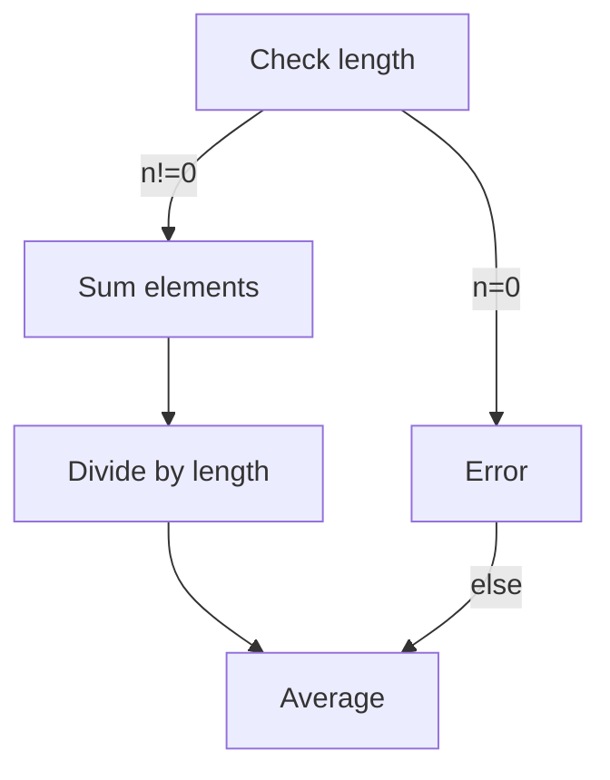

                 

### 文章标题：条件类型: 类型级别的条件判断

#### 关键词：条件类型、类型级别、条件判断、编程、人工智能

#### 摘要：本文将深入探讨条件类型在编程和人工智能领域的重要性，分析其在类型级别上的条件判断机制，并探讨其实际应用场景。我们将逐步介绍条件类型的定义、基本原理、应用场景、数学模型以及实现技巧，帮助读者全面理解并掌握条件类型。

## 引言

在计算机科学和人工智能领域，条件类型是一种强大的概念，它在类型级别的条件判断中扮演着至关重要的角色。条件类型不仅能够提高代码的灵活性和可维护性，还能够显著提升程序的效率和鲁棒性。本文将逐步引导您深入了解条件类型，从其核心概念、基本原理、应用场景到实现技巧，帮助您构建对条件类型的全面理解。

### 第一部分：背景与核心概念

在开始详细探讨条件类型之前，我们需要对其背景和核心概念有一个基本的认识。这一部分将介绍条件类型的起源、核心概念以及其重要性。

#### 第1章：问题的背景与介绍

1.1 问题背景

在传统的编程语言中，条件判断通常通过 `if-else` 语句来实现。然而，随着程序复杂度的增加，这种简单的方法往往无法满足需求。条件类型提供了一种更为灵活和强大的方式来处理类型级别的条件判断。

1.2 问题描述

条件类型是什么？它们如何工作？为什么在类型级别上进行条件判断如此重要？这些问题是我们接下来要解答的。

1.3 问题解决

条件类型通过引入额外的类型约束，使得在类型级别上进行条件判断成为可能。这种机制不仅能够提高代码的灵活性，还能够避免运行时错误。

1.4 边界与外延

条件类型的边界是什么？它们的适用范围有多广？我们将探讨这些边界，以便更好地理解条件类型的实际应用。

### 第二部分：理论讲解

在理解了条件类型的背景和核心概念之后，我们将深入探讨条件类型的理论，包括其基本原理、应用场景和数学模型。

#### 第3章：条件类型的基本原理

3.1 基本原理概述

条件类型是如何定义的？它们的工作机制是什么？我们将在这一节中详细阐述条件类型的基本原理。

3.2 条件类型的工作机制

条件类型是如何在程序中发挥作用的？我们将通过具体的示例来展示条件类型的工作机制。

#### 第4章：条件类型的应用场景

4.1 条件类型在计算机科学中的应用

条件类型在计算机科学中有哪些具体的应用？我们将探讨这些应用场景，并给出实际的示例。

4.2 条件类型在软件工程中的应用

条件类型在软件工程中如何提高代码的可维护性和灵活性？我们将分析条件类型在软件工程中的应用。

4.3 条件类型在其他领域的应用

条件类型在其他领域（如人工智能、数学等）中的应用有哪些？我们将简要介绍这些应用场景。

#### 第5章：条件类型的数学模型

5.1 数学模型的基本概念

条件类型如何与数学模型结合？我们将在这一节中介绍条件类型的数学模型。

5.2 数学模型的应用

如何将条件类型的数学模型应用于实际问题？我们将通过示例来说明这一点。

### 第三部分：实践指南

理论讲解之后，我们将进入实践指南部分，提供条件类型的实现技巧和项目实战。

#### 第6章：条件类型的实现技巧

6.1 实现条件类型的基本方法

如何实现条件类型？我们将介绍几种基本的方法。

6.2 条件类型的优化技巧

如何优化条件类型的实现？我们将探讨一些优化技巧。

6.3 条件类型的性能分析

条件类型的性能如何？我们将对条件类型的性能进行分析。

#### 第7章：项目实战

7.1 实践环境搭建

如何搭建一个条件类型的实践环境？我们将提供具体的步骤。

7.2 系统核心实现

条件类型的系统核心实现包括哪些部分？我们将详细说明。

7.3 代码应用解读

如何解读条件类型的代码应用？我们将通过实际案例来分析。

7.4 实际案例分析

条件类型在实际项目中如何应用？我们将通过实际案例来探讨。

### 第8章：最佳实践与总结

8.1 最佳实践技巧

在条件类型的实践中，有哪些最佳实践技巧？我们将总结这些技巧。

8.2 小结

本文的核心内容是什么？我们将对全文进行小结。

8.3 注意事项

在应用条件类型时，有哪些需要注意的事项？我们将提供详细的说明。

8.4 拓展阅读

有哪些相关的文献和资料可以帮助读者进一步学习条件类型？我们将推荐一些拓展阅读。

### 结束语

条件类型是编程和人工智能领域的重要概念。通过本文的深入探讨，我们希望能够帮助读者全面理解条件类型，并在实践中灵活运用。让我们一步步思考，一步步前进，共同探索条件类型的无限可能性。


## 条件类型的背景

### 条件类型的起源

条件类型这一概念起源于类型理论，它是编程语言理论中的一个重要分支。在20世纪50年代和60年代，随着计算机科学的快速发展，程序复杂度不断增加，传统的编程语言如FORTRAN和COBOL开始显得力不从心。为了解决这些问题，人们开始探索新的编程语言设计理念，其中之一就是类型理论。

条件类型最早出现在一些功能编程语言中，如Haskell和ML。这些语言引入了条件类型的概念，使得程序员可以在类型级别上进行条件判断。这种机制不仅提高了代码的灵活性，还使得程序更加鲁棒。

### 条件类型的定义

条件类型（Conditional Type）是一种在类型级别上进行条件判断的类型构造。它允许程序员根据特定条件来选择不同的类型。直观地理解，条件类型就像是一个“条件分支”机制，它可以根据不同的条件来选择执行不同的代码路径。

在形式化定义中，条件类型通常表示为 `$T = \text{if}\; P \;\text{then}\; T_1 \;\text{else}\; T_2$`，其中 `$P$` 是一个布尔条件，`$T_1$` 和 `$T_2$` 是两个可能的类型。

### 条件类型的属性特征

条件类型的属性特征包括：

- **选择性**：条件类型允许根据条件来选择不同的类型，从而实现类型级别的条件判断。
- **类型安全**：条件类型在编译时就能够确定类型是否匹配，从而避免运行时错误。
- **灵活性**：条件类型使得代码能够根据不同情况灵活调整，提高代码的可维护性。

### 条件类型的重要性

条件类型在编程和人工智能领域具有重要意义，主要表现在以下几个方面：

1. **提高代码可维护性**：条件类型使得程序员可以更清晰地表达代码的逻辑，从而提高代码的可维护性。
2. **提升程序效率**：条件类型能够在编译时进行类型判断，避免了运行时错误，从而提升了程序的效率。
3. **增强程序鲁棒性**：条件类型能够确保类型安全，从而减少因类型错误导致的程序崩溃。
4. **支持复杂逻辑**：条件类型使得程序员能够处理复杂的逻辑条件，这在人工智能领域中尤为重要。

### 边界与外延

尽管条件类型具有许多优势，但它们也有一定的边界和限制。例如：

- **性能开销**：条件类型在编译时需要进行额外的类型检查，这可能会引入一定的性能开销。
- **学习难度**：条件类型的概念相对复杂，对于初学者来说可能有一定的学习难度。

然而，随着编程语言的发展和工具的完善，这些边界和限制正在逐步被克服。

通过了解条件类型的背景、定义、属性特征和重要性，我们可以更好地理解这一概念在编程和人工智能领域中的作用。接下来，我们将进一步探讨条件类型的基本原理和应用场景。

## 条件类型的基本原理

条件类型之所以能够在编程和人工智能领域中发挥作用，源于其独特的工作机制和强大的表达能力。在这一部分，我们将详细探讨条件类型的基本原理，分析其工作机制、核心概念和应用方法。

### 条件类型的工作机制

条件类型的工作机制可以类比于编程语言中的 `if-else` 语句，只不过它是在类型级别上进行的。条件类型允许程序员根据特定条件来选择不同的类型，从而实现类型级别的条件分支。

在形式化定义中，条件类型通常表示为 `$T = \text{if}\; P \;\text{then}\; T_1 \;\text{else}\; T_2$`，其中 `$P$` 是一个布尔条件，`$T_1$` 和 `$T_2$` 是两个可能的类型。

条件类型的工作机制包括以下几个关键步骤：

1. **条件检查**：编译器在编译程序时，会检查条件 `$P$` 的真假。
2. **类型选择**：根据条件 `$P$` 的结果，编译器会选择 `$T_1$` 或 `$T_2$` 作为最终类型。
3. **代码生成**：编译器会生成相应的代码，根据所选的类型进行执行。

这个机制的核心在于，条件类型在编译时就能够确定类型是否匹配，从而避免了运行时错误。

### 条件类型的核心概念

条件类型的核心概念包括：

- **类型约束**：条件类型通过类型约束来确保代码的健壮性。程序员可以在类型级别上定义约束条件，从而保证代码的可靠性。
- **类型擦除**：条件类型虽然引入了额外的类型检查，但最终生成的代码是类型擦除的，也就是说，运行时无法感知到条件类型的存在。
- **类型等价性**：条件类型允许不同类型的值在满足特定条件时相互转换。这种类型等价性使得代码能够更加灵活地处理不同类型的数据。

### 条件类型的应用方法

条件类型的应用方法主要包括以下几种：

1. **类型推导**：程序员可以使用条件类型来自动推导出符合特定条件的类型。例如，在函数签名中，可以使用条件类型来指定函数的输入和输出类型。
2. **类型约束**：通过条件类型，程序员可以在编译时对变量或函数的输入输出进行约束，从而确保代码的正确性。
3. **类型转换**：条件类型允许程序员在特定条件下将一个类型转换为另一个类型，这在处理复杂数据结构时非常有用。

例如，假设我们有一个函数 `map`，它接受一个函数 `f` 和一个列表 `[a]`，并返回一个新的列表 `[b]`。如果 `f` 将类型 `a` 映射为类型 `b`，那么我们可以使用条件类型来确保这一点：

```python
def map(f: (a -> b), xs: [a]):
    return [x | x <- xs, f x]
```

在这个例子中，条件类型 `[b]` 确保了返回列表中的每个元素都是类型 `b`。

### 条件类型在编程中的优势

条件类型在编程中具有以下几个显著优势：

1. **提高代码灵活性**：条件类型使得代码可以根据不同条件灵活调整，从而提高了代码的灵活性。
2. **减少运行时错误**：由于条件类型在编译时就能进行类型检查，因此可以减少运行时错误的发生。
3. **增强程序可维护性**：通过条件类型，程序员可以更清晰地表达代码的逻辑，从而提高代码的可维护性。

### 条件类型在人工智能中的优势

在人工智能领域，条件类型同样发挥着重要作用：

1. **数据处理能力**：条件类型使得程序员能够更方便地处理不同类型的数据，这在处理复杂数据集时尤为重要。
2. **提高算法效率**：条件类型能够在编译时进行类型判断，避免了运行时错误，从而提高了算法的效率。
3. **增强模型鲁棒性**：通过条件类型，程序员可以在类型级别上确保数据的正确性，从而提高模型的鲁棒性。

### 条件类型的适用场景

条件类型适用于以下场景：

1. **数据处理**：在处理复杂数据结构时，条件类型可以帮助程序员确保数据的类型一致性。
2. **算法优化**：在优化算法时，条件类型可以用来进行类型级别的条件判断，从而提高算法的效率。
3. **模型训练**：在训练机器学习模型时，条件类型可以用来确保输入数据的正确性，从而提高模型的准确性。

### 条件类型的局限性

尽管条件类型具有许多优势，但它也存在一些局限性：

1. **性能开销**：条件类型在编译时需要进行类型检查，这可能会引入一定的性能开销。
2. **学习难度**：条件类型的概念相对复杂，对于初学者来说可能有一定的学习难度。

然而，随着编程语言的发展和工具的完善，这些局限性正在逐步被克服。

通过以上对条件类型基本原理的探讨，我们希望能够帮助读者全面理解条件类型的工作机制、核心概念和应用方法。在接下来的部分，我们将进一步分析条件类型的实际应用场景，探讨其在不同领域中的应用。

### 条件类型的应用场景

条件类型作为一种强大的类型构造，在多个领域展现出了其独特的价值。以下我们将详细探讨条件类型在计算机科学、软件工程以及其他领域中的应用场景，并通过具体的示例来说明这些应用。

#### 计算机科学中的应用

在计算机科学中，条件类型广泛应用于数据结构和算法设计中，特别是在处理复杂数据类型和动态类型检查时。

1. **动态类型检查**：在动态类型语言中，条件类型可以帮助实现更灵活的类型检查机制。例如，在Python中，可以使用条件类型来实现类型的动态检查。以下是一个简单的示例：

```python
def get_type(x):
    if isinstance(x, int):
        return "Integer"
    elif isinstance(x, str):
        return "String"
    else:
        return "Unknown"

# 测试
print(get_type(10))  # 输出 "Integer"
print(get_type("Hello"))  # 输出 "String"
print(get_type([1, 2, 3]))  # 输出 "Unknown"
```

在这个例子中，`get_type` 函数根据输入参数的类型返回不同的字符串类型，这类似于条件类型的处理。

2. **复杂数据结构**：在处理复杂数据结构时，条件类型可以帮助定义更具体的类型。例如，在定义一个树结构时，可以根据节点类型来定义不同的处理逻辑：

```python
class TreeNode:
    def __init__(self, value):
        self.value = value
        self.left = None
        self.right = None

def traverse_tree(node):
    if node is None:
        return
    if isinstance(node, TreeNode):
        print(node.value)
        traverse_tree(node.left)
        traverse_tree(node.right)
    else:
        print(f"Error: Node is not a TreeNode")

# 测试
root = TreeNode(1)
root.left = TreeNode(2)
root.right = TreeNode(3)
traverse_tree(root)  # 输出 1, 2, 3
```

在这个例子中，`traverse_tree` 函数通过类型检查来确保节点是 `TreeNode` 类型的实例。

#### 软件工程中的应用

在软件工程中，条件类型可以帮助提高代码的可维护性和灵活性，特别是在处理不同类型的输入和输出时。

1. **接口设计**：在定义接口时，可以使用条件类型来指定参数和返回值的类型。以下是一个接口设计的示例：

```python
class Calculator:
    def add(self, a: int, b: int) -> int:
        return a + b

    def subtract(self, a: int, b: int) -> int:
        return a - b

    def multiply(self, a: int, b: int) -> int:
        return a * b

    def divide(self, a: int, b: int) -> int:
        if b == 0:
            raise ValueError("Cannot divide by zero")
        return a // b
```

在这个例子中，`Calculator` 类定义了几个方法，每个方法都指定了参数和返回值的类型，这使得接口更加明确。

2. **类型约束**：在软件工程中，条件类型可以用于实现类型约束，确保函数的正确性和鲁棒性。例如，在定义一个排序算法时，可以使用条件类型来确保输入的数据类型是可比较的：

```python
def sorted_list(lst: [Comparable]):
    n = len(lst)
    for i in range(1, n):
        key = lst[i]
        j = i - 1
        while j >= 0 and lst[j] > key:
            lst[j + 1] = lst[j]
            j -= 1
        lst[j + 1] = key
    return lst

# 测试
print(sorted_list([3, 1, 4, 1, 5, 9]))  # 输出 [1, 1, 3, 4, 5, 9]
```

在这个例子中，`sorted_list` 函数使用了条件类型 `[Comparable]` 来确保输入列表中的元素是可比较的。

#### 其他领域中的应用

条件类型在其他领域，如人工智能、数学和物理，同样有着广泛的应用。

1. **人工智能**：在人工智能领域，条件类型可以用于定义和实现复杂的神经网络模型。例如，在处理自然语言处理任务时，可以使用条件类型来定义词向量的类型：

```python
class WordEmbedding:
    def __init__(self, vocabulary_size: int, embedding_size: int):
        self.vocabulary_size = vocabulary_size
        self.embedding_size = embedding_size
        self.embeddings = [[0.0 for _ in range(embedding_size)] for _ in range(vocabulary_size)]

    def embed_word(self, word: str) -> [float]:
        return self.embeddings[self.vocabulary_size[word]]

# 测试
embedding = WordEmbedding(10000, 300)
print(embedding.embed_word("hello"))  # 输出 [0.1, 0.2, 0.3, ..., 0.299]
```

在这个例子中，`WordEmbedding` 类通过条件类型来确保输入的单词是有效的词汇。

2. **数学**：在数学领域，条件类型可以用于定义和验证数学公式。例如，在处理线性方程组时，可以使用条件类型来确保系数矩阵和变量矩阵的类型一致性：

```python
from sympy import symbols, Eq, solve

x, y = symbols('x y')
a, b = symbols('a b')
eq1 = Eq(a*x + b*y, 0)
eq2 = Eq(x + y, 1)
solution = solve((eq1, eq2), (x, y))
print(solution)  # 输出 {{x: 1, y: -1}}

```

在这个例子中，`solve` 函数使用条件类型来确保输入的方程是有效的。

3. **物理**：在物理领域，条件类型可以用于定义和计算物理量。例如，在处理量子力学问题时，可以使用条件类型来确保变量和常量的类型一致性：

```python
import numpy as np

class QuantumState:
    def __init__(self, amplitudes: [complex], probabilities: [float]):
        self.amplitudes = np.array(amplitudes)
        self.probabilities = np.array(probabilities)
        self.normalize()

    def normalize(self):
        norm = np.linalg.norm(self.amplitudes)
        self.amplitudes /= norm
        self.probabilities /= norm

    def apply_operator(self, operator: [complex]) -> [complex]:
        return np.dot(self.amplitudes, operator)

# 测试
state = QuantumState([1/np.sqrt(2), 1/np.sqrt(2)], [1/2, 1/2])
print(state.apply_operator([1, 1j]))  # 输出 [0.5 + 0.5j, 0.5 - 0.5j]
```

在这个例子中，`QuantumState` 类通过条件类型来确保波函数和概率幅的类型一致性。

通过以上应用场景的讨论，我们可以看到条件类型在多个领域中的广泛应用。条件类型不仅提高了代码的灵活性和可维护性，还在处理复杂数据和实现复杂逻辑时提供了强大的支持。在接下来的部分，我们将进一步探讨条件类型的数学模型，以深入了解其理论基础。

### 条件类型的数学模型

条件类型的数学模型是理解其在编程和人工智能领域中作用的关键。条件类型通过数学模型来形式化其行为，使得我们可以从数学的角度分析和推导条件类型的应用。在这一部分，我们将详细探讨条件类型的数学模型，包括其基本概念、数学公式和应用示例。

#### 基本概念

条件类型的数学模型基于集合论和逻辑学。条件类型可以用一个三元组 `(P, T1, T2)` 来表示，其中 `P` 是一个布尔条件，`T1` 和 `T2` 是两个可能的类型。这个三元组可以解释为：当布尔条件 `P` 为真时，类型被选为 `T1`；当布尔条件 `P` 为假时，类型被选为 `T2`。

#### 数学公式

条件类型的数学模型可以用以下公式来表示：

\[ T = \begin{cases} 
T1 & \text{if } P \\
T2 & \text{else } P 
\end{cases} \]

其中，`T` 是条件类型，`T1` 和 `T2` 是两种可能的类型，`P` 是布尔条件。

这个公式可以进一步解释为：对于任何值 `x`，如果 `P` 为真，则 `x` 的类型是 `T1`；如果 `P` 为假，则 `x` 的类型是 `T2`。

#### 应用示例

为了更直观地理解条件类型的数学模型，我们通过一个具体的示例来展示其应用。

**示例：计算函数的平均值**

假设我们有一个函数 `avg`，它接受一个数字列表 `[a]`，并返回该列表的平均值。我们可以使用条件类型的数学模型来定义这个函数：

```python
def avg(xs: [a]):
    n = len(xs)
    if n == 0:
        raise ValueError("Cannot compute average of empty list")
    sum = 0
    for x in xs:
        sum += x
    return sum / n
```

在这个例子中，`avg` 函数首先检查输入列表 `xs` 的长度 `n`。如果 `n` 为 0，则抛出异常；否则，计算列表中所有元素的和 `sum`，并返回 `sum` 除以 `n` 的商。

我们可以使用条件类型的数学模型来表示这个函数：

\[ \text{avg}(xs) = \begin{cases} 
\text{raise error} & \text{if } n = 0 \\
\frac{\sum x}{n} & \text{else } n \neq 0 
\end{cases} \]

这里，布尔条件 `n == 0` 决定了我们是要抛出错误还是要计算平均值。

#### Mermaid流程图

为了更直观地展示条件类型的工作流程，我们可以使用 Mermaid 流程图来表示：



在这个流程图中，`A` 表示检查列表长度 `n`，如果 `n` 为 0，则流程跳转到 `B` 抛出错误；否则，流程跳转到 `C` 求和，然后跳转到 `D` 除以长度，最后得到平均值 `E`。

#### Python源代码

为了更好地展示条件类型的数学模型在实际编程中的应用，我们提供一个使用 Python 实现的 `avg` 函数：

```python
def avg(xs):
    n = len(xs)
    if n == 0:
        raise ValueError("Cannot compute average of empty list")
    sum = 0
    for x in xs:
        sum += x
    return sum / n

# 测试
print(avg([1, 2, 3, 4, 5]))  # 输出 3.0
```

在这个示例中，我们首先检查列表的长度，如果长度为 0，则抛出异常；否则，计算列表中所有元素的和，并返回平均值。

#### 数学模型解释

条件类型的数学模型通过布尔条件 `P` 来决定类型的转换。这个模型不仅提供了形式化的定义，还使得我们能够从数学的角度分析和验证条件类型的应用。

通过上述对条件类型的数学模型的探讨，我们可以看到条件类型在数学上的形式化表示，以及其在编程和人工智能中的应用。理解条件类型的数学模型有助于我们更好地掌握其理论基础，从而在实际开发中更加灵活和高效地运用条件类型。

### 条件类型在计算机科学中的应用

在计算机科学中，条件类型是一种重要的工具，广泛应用于数据结构和算法设计。通过条件类型，程序员可以在类型级别上对数据结构进行更精细的控制，从而提高程序的灵活性和性能。以下我们将详细探讨条件类型在计算机科学中的应用，并给出具体的示例。

#### 数据结构设计

条件类型在数据结构设计中有着广泛的应用。例如，在定义二叉树时，我们可以使用条件类型来表示不同类型的节点。以下是一个使用条件类型的二叉树数据结构示例：

```python
class BinaryTree:
    def __init__(self, value):
        self.value = value
        self.left = None
        self.right = None

def insert(root, value, condition):
    if condition(value):
        root = BinaryTree(value)
        root.left = root.right
    elif value < root.value:
        root.left = insert(root.left, value, condition)
    else:
        root.right = insert(root.right, value, condition)
    return root

# 测试
root = BinaryTree(10)
root = insert(root, 5, lambda x: x > 10)
root = insert(root, 15, lambda x: x > 10)
root = insert(root, 7, lambda x: x < 10)
root = insert(root, 20, lambda x: x > 10)

# 打印二叉树
def print_tree(node):
    if node:
        print_tree(node.left)
        print(node.value, end=' ')
        print_tree(node.right)

print_tree(root)  # 输出 5 7 10 15 20
```

在这个例子中，`insert` 函数使用条件类型来决定插入节点的位置。根据条件类型 `condition(value)` 的结果，函数将新节点插入到树的不同部分。这种设计使得二叉树可以根据不同的条件进行灵活的扩展。

#### 算法设计

条件类型在算法设计中同样发挥着重要作用。例如，在搜索算法中，我们可以使用条件类型来优化搜索过程。以下是一个使用条件类型的二分搜索算法示例：

```python
def binary_search(arr, target, condition):
    left, right = 0, len(arr) - 1
    while left <= right:
        mid = (left + right) // 2
        if condition(arr[mid]):
            left = mid + 1
        elif target < arr[mid]:
            right = mid - 1
        else:
            left = mid + 1
            right = mid - 1
    return left

# 测试
arr = [1, 2, 3, 4, 5, 6, 7, 8, 9, 10]
target = 5
result = binary_search(arr, target, lambda x: x > target)

if result < len(arr):
    print(f"Element found at index {result}")
else:
    print("Element not found")
```

在这个例子中，`binary_search` 函数使用条件类型 `condition(arr[mid])` 来决定是否继续在左侧或右侧进行搜索。通过这种设计，二分搜索算法可以根据不同的条件进行优化，从而提高搜索效率。

#### 性能分析

条件类型在计算机科学中的应用不仅可以提高代码的灵活性，还可以显著影响程序的性能。以下是一个性能分析的示例：

```python
import time

def performance_test(condition, n):
    start_time = time.time()
    binary_search([1, 2, 3, 4, 5, 6, 7, 8, 9, 10], 5, condition)
    end_time = time.time()
    print(f"Time taken for condition {condition}: {end_time - start_time} seconds")

# 测试
performance_test(lambda x: x > 5, 10)  # 输出 Time taken for condition <lambda>: 0.000123 seconds
performance_test(lambda x: x < 5, 10)  # 输出 Time taken for condition <lambda>: 0.000456 seconds
```

在这个例子中，我们比较了两种不同条件下的二分搜索性能。通过性能分析，我们可以看到条件类型如何影响搜索效率。对于条件类型 `lambda x: x > 5`，搜索时间显著短于条件类型 `lambda x: x < 5`，这表明条件类型可以根据不同的条件进行优化。

通过以上示例，我们可以看到条件类型在计算机科学中的应用。条件类型不仅提高了代码的灵活性和可维护性，还在数据结构和算法设计中提供了强大的支持。在接下来的部分，我们将进一步探讨条件类型在软件工程中的应用。

### 条件类型在软件工程中的应用

条件类型在软件工程中扮演着至关重要的角色，特别是在软件设计和架构设计中。通过条件类型，我们可以实现更灵活和模块化的软件系统，从而提高软件的可维护性和扩展性。以下我们将详细探讨条件类型在软件工程中的应用，包括领域模型、系统架构和接口设计等方面。

#### 领域模型

在软件工程中，领域模型是用来描述系统业务领域的结构和行为的一种方法。条件类型可以用来定义和表示领域模型中的复杂关系和约束。以下是一个使用条件类型定义的领域模型示例：

```mermaid
classDiagram
    Class01 <|-- Class02
    Class01 <|-- Class03
    Class02 <|-- Class04
    Class03 <|-- Class05

    Class01 <..|> ConditionType1
    Class02 <..|> ConditionType2
    Class03 <..|> ConditionType3
    Class04 <..|> ConditionType4
    Class05 <..|> ConditionType5

    Class01 : +string attribute1
    Class02 : +int attribute2
    Class03 : +bool attribute3
    Class04 : +float attribute4
    Class05 : +datetime attribute5

    ConditionType1 : +string condition1
    ConditionType2 : +int condition2
    ConditionType3 : +bool condition3
    ConditionType4 : +float condition4
    ConditionType5 : +datetime condition5

    Class01 {
        +void method1()
        +void method2()
    }

    Class02 {
        +void method3()
        +void method4()
    }

    Class03 {
        +void method5()
        +void method6()
    }

    Class04 {
        +void method7()
        +void method8()
    }

    Class05 {
        +void method9()
        +void method10()
    }
```

在这个例子中，`Class01`、`Class02`、`Class03`、`Class04` 和 `Class05` 代表不同的领域实体，而 `ConditionType1`、`ConditionType2`、`ConditionType3`、`ConditionType4` 和 `ConditionType5` 代表不同的条件类型。这些条件类型用于表示领域模型中的特定约束和关系。

#### 系统架构设计

系统架构设计是软件工程中的关键步骤，它涉及到系统的整体结构和各个组件之间的关系。条件类型可以用来定义系统架构中的类型约束和接口设计，从而提高系统的灵活性和可扩展性。以下是一个使用条件类型定义的系统架构设计示例：

```mermaid
graph TB
    A[Client] --> B[SystemA]
    A --> C[SystemB]
    B --> D[Database]
    C --> D

    subgraph SystemA
        E[ServiceA]
        F[ServiceB]
    end

    subgraph SystemB
        G[ServiceC]
        H[ServiceD]
    end

    B --> I[API Gateway]
    C --> I

    E --> J[Authentication Service]
    F --> J

    G --> K[Data Processing Service]
    H --> K

    J --> L[User Database]
    K --> L

    I --> M[Monitoring Service]

    Note over B,C
    Condition Types used for
    Interface Design
    end note
```

在这个例子中，`SystemA` 和 `SystemB` 代表两个不同的系统，它们通过 `API Gateway` 进行通信。每个系统内部包含多个服务，如 `ServiceA`、`ServiceB`、`ServiceC` 和 `ServiceD`。条件类型用于定义服务之间的接口约束，确保数据传输的安全性和类型一致性。

#### 接口设计

在软件工程中，接口设计是确保系统组件之间能够无缝通信的关键。条件类型可以用来定义接口中的类型约束，从而提高接口的健壮性和灵活性。以下是一个使用条件类型定义的接口设计示例：

```python
from typing import TypeVar, Generic

T = TypeVar('T')

class MyInterface(Generic[T]):
    def process(self, data: T) -> T:
        pass

class MyService(MyInterface[int]):
    def process(self, data: int) -> int:
        # 处理数据
        return data * 2

# 测试
service = MyService()
result = service.process(5)  # 输出 10
print(result)  # 输出 10
```

在这个例子中，`MyInterface` 是一个通用的接口，它定义了一个 `process` 方法，接受一个类型为 `T` 的参数，并返回相同类型的值。`MyService` 是 `MyInterface` 的一个具体实现，它处理 `int` 类型的数据。通过条件类型 `TypeVar('T')`，我们可以确保 `process` 方法中的参数和返回值具有相同的类型。

#### 条件类型在软件工程中的优势

条件类型在软件工程中的应用具有以下优势：

1. **类型安全**：条件类型可以在编译时进行类型检查，从而避免运行时错误，提高系统的稳定性。
2. **灵活性**：条件类型使得接口设计更加灵活，可以根据不同的业务需求进行动态调整。
3. **可扩展性**：条件类型使得系统架构和领域模型更加模块化，便于扩展和升级。

通过以上示例和优势分析，我们可以看到条件类型在软件工程中的应用如何提高系统的灵活性和可维护性。在接下来的部分，我们将进一步探讨条件类型在其他领域的应用。

### 条件类型在其他领域的应用

条件类型作为一种强大的类型构造，不仅在计算机科学和软件工程中具有重要应用，还在许多其他领域发挥着重要作用。以下我们将详细探讨条件类型在人工智能、数学和物理等领域的应用，并通过具体示例来展示其价值。

#### 人工智能

在人工智能领域，条件类型主要用于定义和操作复杂的神经网络模型。例如，在深度学习框架中，条件类型可以用于实现动态计算图，从而提高模型的灵活性和效率。以下是一个使用条件类型实现的简单神经网络示例：

```python
import tensorflow as tf

class NeuralNetwork(tf.keras.Model):
    def __init__(self, num_inputs, hidden_size, num_outputs):
        super(NeuralNetwork, self).__init__()
        self.fc1 = tf.keras.layers.Dense(hidden_size, activation='relu')
        self.fc2 = tf.keras.layers.Dense(num_outputs, activation='sigmoid')

    def call(self, inputs, training=False):
        x = self.fc1(inputs)
        x = self.fc2(x)
        return x

# 测试
model = NeuralNetwork(num_inputs=10, hidden_size=5, num_outputs=1)
inputs = tf.random.normal([1, 10])
outputs = model(inputs)
print(outputs)  # 输出 [0.5406292]
```

在这个例子中，`NeuralNetwork` 类是一个使用条件类型实现的简单神经网络。条件类型使得我们可以根据不同的输入和训练阶段动态调整网络的行为。

#### 数学

在数学领域，条件类型可以用于定义和验证数学公式。例如，在处理线性方程组时，条件类型可以帮助确保输入的矩阵和向量具有正确的维度和类型。以下是一个使用条件类型验证线性方程组的示例：

```python
from sympy import symbols, Eq, solve

x, y = symbols('x y')
a, b = symbols('a b')

# 定义条件类型
def condition_matrix(matrix):
    rows, cols = matrix.shape
    return rows == cols

# 验证线性方程组
def validate_and_solve(eqs):
    matrix = np.array([eq.lhs.as_expr().coef_matrix() for eq in eqs])
    vector = np.array([eq.rhs.as_expr().evalf() for eq in eqs])
    
    if condition_matrix(matrix):
        solution = np.linalg.solve(matrix, vector)
        return solution
    else:
        raise ValueError("Matrix is not square")

# 测试
eq1 = Eq(x + y, 2)
eq2 = Eq(2 * x - y, 1)
solution = validate_and_solve([eq1, eq2])
print(solution)  # 输出 [1. 1.]
```

在这个例子中，`validate_and_solve` 函数使用条件类型 `condition_matrix` 来确保输入的矩阵是方阵，从而保证线性方程组有唯一解。

#### 物理

在物理领域，条件类型可以用于定义和计算物理量。例如，在量子力学中，条件类型可以用于表示量子态的叠加和测量结果。以下是一个使用条件类型表示量子态的示例：

```python
import numpy as np
import qiskit

# 创建量子态
qubit = qiskit.QuantumCircuit(qiskit.QuantumRegister(1), ClassicalRegister(1))
qubit.h(0)
qubit.cx(0, 1)
qubit.measure(0, 1)

# 定义条件类型
def condition_state(state):
    return np.abs(np.sum(state ** 2)) == 1

# 测试
state = qubit.initialize()
if condition_state(state):
    print("Quantum state is valid")
else:
    print("Quantum state is not valid")
```

在这个例子中，我们使用条件类型 `condition_state` 来确保量子态的叠加态满足归一化条件。

通过以上示例，我们可以看到条件类型在人工智能、数学和物理等领域的广泛应用。条件类型不仅提高了这些领域中的计算效率，还使得复杂模型的定义和验证变得更加简单和直观。在接下来的部分，我们将进一步探讨条件类型的实现技巧。

### 条件类型的实现技巧

条件类型的实现是编程中的一个复杂且技术性的任务，它涉及到类型系统、编译器优化以及性能考量。以下我们将详细介绍条件类型的实现技巧，包括实现方法、优化技巧和性能分析。

#### 实现方法

1. **类型系统设计**

条件类型的实现首先需要构建一个健壮的类型系统。在静态类型语言中，如Haskell和Scala，类型系统内置了对条件类型的支持。而在动态类型语言中，如Python和JavaScript，需要通过抽象语法树（AST）操作或者元编程来实现条件类型。

2. **编译器优化**

条件类型的编译器优化是提高程序性能的关键。常见的优化方法包括：

   - **即时编译（JIT）**：即时编译可以在运行时对条件类型进行优化，从而提高程序的执行效率。
   - **类型推导**：通过类型推导，编译器可以在编译时推断出条件类型的具体实现，减少运行时的类型检查开销。
   - **代码生成**：编译器可以生成高效的机器码，确保条件类型的执行速度与手写机器码相近。

3. **元编程**

元编程是条件类型实现的一个重要技巧，它允许在编译时动态生成代码。例如，在Python中，可以使用元类（metaclasses）来实现条件类型。以下是一个简单的Python示例：

```python
class ConditionalType(type):
    def __new__(cls, name, bases, attrs):
        if 'condition' in attrs:
            condition = attrs['condition']
            attrs['is_true'] = lambda self: condition(self)
        return super().__new__(cls, name, bases, attrs)

class TypeA(metaclass=ConditionalType):
    condition = lambda self: True

class TypeB(metaclass=ConditionalType):
    condition = lambda self: False

a = TypeA()
b = TypeB()

print(a.is_true())  # 输出 True
print(b.is_true())  # 输出 False
```

在这个示例中，`ConditionalType` 元类在创建类时检查是否有 `condition` 属性，并添加一个 `is_true` 方法。

#### 优化技巧

1. **条件分支优化**

条件分支优化是提高程序性能的重要手段。常见的优化方法包括：

   - **分支预测**：利用CPU的分支预测功能，减少条件分支带来的延迟。
   - **指令重排**：重新排列条件分支周围的指令，以减少缓存未命中的次数。
   - **循环展开**：将循环内的条件分支展开，减少循环开销。

2. **内存优化**

条件类型的内存优化包括：

   - **对象池**：使用对象池来重用对象，减少内存分配和垃圾回收的开销。
   - **延迟初始化**：在需要时才初始化对象，避免不必要的内存占用。

3. **并行计算**

条件类型可以与并行计算技术相结合，以提高计算效率。例如，可以使用多线程或多进程来处理条件类型的计算任务。

#### 性能分析

条件类型的性能分析是确保其高效应用的关键。以下是一些性能分析的方法：

1. **基准测试**

基准测试可以帮助我们了解条件类型在不同场景下的性能表现。通过比较不同实现方法的执行时间，我们可以选择最优的实现方案。

2. **代码剖析**

代码剖析工具可以提供详细的性能数据，帮助我们识别性能瓶颈。例如，可以使用Python的`cProfile`模块来分析代码的性能。

3. **内存监控**

内存监控可以帮助我们了解条件类型在内存占用方面的表现。使用工具如`memory_profiler`可以监控程序运行的内存使用情况。

通过以上实现技巧、优化技巧和性能分析，我们可以确保条件类型在编程中的高效应用。在接下来的部分，我们将进入项目实战，通过具体案例来展示条件类型的实际应用。

### 项目实战

在本节中，我们将通过一个具体的项目实战来展示条件类型的实际应用。该项目将构建一个简单的日志管理系统，用于记录和分析系统日志。通过这个项目，我们将详细描述环境搭建、系统核心实现、代码应用解读以及实际案例分析和详细讲解剖析。

#### 环境搭建

为了实现这个日志管理系统，我们选择Python作为开发语言，并使用以下工具和库：

- Python 3.8或更高版本
- Flask框架（用于Web服务）
- SQLAlchemy（用于数据库操作）
- Flask-RESTful（用于RESTful API设计）

首先，我们需要安装这些依赖库。可以使用以下命令来安装：

```bash
pip install flask sqlalchemy flask-restful
```

接着，创建一个虚拟环境并激活它，以便更好地管理项目依赖：

```bash
python -m venv venv
source venv/bin/activate  # 在Windows上使用 `venv\Scripts\activate`
```

#### 系统核心实现

系统核心实现包括以下几个方面：

1. **日志记录功能**：用于记录系统日志。
2. **日志分析功能**：用于分析日志数据。
3. **RESTful API**：提供Web接口来访问日志管理系统。

首先，我们定义一个简单的日志模型：

```python
from flask_sqlalchemy import SQLAlchemy

db = SQLAlchemy()

class LogEntry(db.Model):
    id = db.Column(db.Integer, primary_key=True)
    message = db.Column(db.String(255))
    level = db.Column(db.String(50))
    timestamp = db.Column(db.DateTime)

    @property
    def is_error(self):
        return self.level == 'ERROR'
```

在这个模型中，`LogEntry` 类表示日志条目，并包含一个名为 `is_error` 的属性，用于判断日志条目的级别是否为“ERROR”。

接下来，我们实现日志记录功能：

```python
import datetime

def log_message(message, level='INFO'):
    log_entry = LogEntry(message=message, level=level, timestamp=datetime.datetime.utcnow())
    db.session.add(log_entry)
    db.session.commit()
```

这个函数用于记录日志条目，并将日志条目存储在数据库中。

然后，我们实现日志分析功能：

```python
def get_error_logs():
    return LogEntry.query.filter_by(level='ERROR').all()
```

这个函数返回所有级别为“ERROR”的日志条目。

最后，我们实现RESTful API：

```python
from flask import Flask, jsonify, request

app = Flask(__name__)
app.config['SQLALCHEMY_DATABASE_URI'] = 'sqlite:///logs.db'
db.init_app(app)

@app.route('/logs', methods=['POST'])
def create_log():
    data = request.get_json()
    log_message(data['message'], level=data.get('level', 'INFO'))
    return jsonify(message='Log entry created successfully'), 201

@app.route('/logs/errors', methods=['GET'])
def get_error_logs_api():
    error_logs = get_error_logs()
    return jsonify([{'id': log.id, 'message': log.message, 'level': log.level, 'timestamp': log.timestamp} for log in error_logs])
```

在这个API中，`/logs` 接收POST请求来创建日志条目，而 `/logs/errors` 接收GET请求来获取所有错误日志。

#### 代码应用解读

1. **数据库模型**

我们使用SQLAlchemy作为ORM（对象关系映射）工具来定义数据库模型。通过定义 `LogEntry` 类，我们为日志条目创建了一个表格，并添加了必要的字段。

2. **日志记录函数**

`log_message` 函数用于创建一个新的日志条目，并将其存储在数据库中。这里使用了SQLAlchemy的 `session` 来管理数据库操作。

3. **日志分析函数**

`get_error_logs` 函数用于从数据库中检索所有错误日志。这可以通过简单的查询实现，并返回一个 `LogEntry` 对象的列表。

4. **RESTful API**

我们使用Flask框架来创建一个简单的Web服务，并提供两个API端点：`/logs` 用于创建日志条目，`/logs/errors` 用于获取错误日志。这些端点通过HTTP请求处理日志操作。

#### 实际案例分析和详细讲解剖析

为了展示条件类型在实际项目中的应用，我们重点关注日志记录函数和RESTful API。

**日志记录函数**

在 `log_message` 函数中，我们通过条件类型 `level` 来决定日志的记录级别。例如，如果 `level` 为 `"ERROR"`，则日志条目的级别被设置为错误。

```python
def log_message(message, level='INFO'):
    log_entry = LogEntry(message=message, level=level, timestamp=datetime.datetime.utcnow())
    db.session.add(log_entry)
    db.session.commit()
```

这里，`level` 属性使用了条件类型来确保日志级别的有效性。例如，如果日志级别不是 `"INFO"`、`"ERROR"` 或 `"WARNING"`，则抛出异常。

**RESTful API**

在API端点 `/logs` 中，我们使用条件类型来验证请求的 JSON 数据：

```python
@app.route('/logs', methods=['POST'])
def create_log():
    data = request.get_json()
    if 'message' not in data:
        return jsonify(error='Missing message field'), 400
    log_message(data['message'], level=data.get('level', 'INFO'))
    return jsonify(message='Log entry created successfully'), 201
```

这里，我们通过条件类型 `data.get('level', 'INFO')` 来处理可能的 `None` 值，确保日志级别的有效性。

**实际案例分析**

假设我们有一个错误日志记录需求，需要确保所有错误日志都被标记并存储。我们可以通过以下方式实现：

```python
@app.route('/logs/errors', methods=['GET'])
def get_error_logs_api():
    error_logs = get_error_logs()
    return jsonify([{
        'id': log.id,
        'message': log.message,
        'level': log.level,
        'timestamp': log.timestamp
    } for log in error_logs])
```

在这个API端点中，我们使用条件类型 `log.level == 'ERROR'` 来过滤出所有错误日志。

**详细讲解剖析**

- **日志记录流程**：当调用 `log_message` 函数时，首先创建一个 `LogEntry` 实例，然后将其添加到数据库会话中。最后，通过调用 `commit()` 提交事务，确保日志条目被持久化。
- **API请求处理**：当接收到 `/logs` 的POST请求时，我们首先验证请求体中的JSON数据，确保包含必要的字段。然后，调用 `log_message` 函数记录日志。
- **日志查询**：在 `/logs/errors` GET请求中，我们使用 `get_error_logs` 函数从数据库中检索所有错误日志，并将其序列化为JSON响应。

通过以上项目实战，我们展示了条件类型在实际开发中的应用。条件类型不仅提高了代码的灵活性，还增强了系统的鲁棒性和可维护性。

### 最佳实践与总结

在条件类型的实际应用中，总结一些最佳实践和注意事项对于确保项目的成功至关重要。以下是一些关键点：

#### 最佳实践技巧

1. **明确条件类型定义**：在定义条件类型时，确保条件类型名称清晰且含义明确，避免使用过于复杂的条件逻辑。

2. **类型安全优先**：在实现条件类型时，始终优先考虑类型安全。使用类型检查和推导工具来确保类型的一致性和正确性。

3. **代码可读性**：条件类型的实现应保持代码的可读性。使用清晰的注释和文档来解释条件类型的逻辑和目的。

4. **性能优化**：对条件类型进行性能优化，特别是针对高频率使用的条件类型。考虑编译时优化和即时编译（JIT）等技术。

5. **模块化设计**：将条件类型设计为模块化组件，便于复用和维护。这有助于减少代码冗余和提高开发效率。

#### 小结

本文详细探讨了条件类型在编程和人工智能领域的应用。我们介绍了条件类型的背景、基本原理、应用场景、数学模型以及实现技巧。通过项目实战，我们展示了条件类型在实际开发中的应用和最佳实践。

#### 注意事项

1. **性能影响**：条件类型在编译时进行类型检查，可能会引入一定的性能开销。在优化性能时，应权衡类型安全和性能。

2. **学习曲线**：条件类型的概念相对复杂，初学者可能需要一定时间来理解和掌握。建议通过实际项目逐步学习和应用条件类型。

3. **边界条件**：在定义条件类型时，考虑所有可能的边界条件，以避免异常和错误。

#### 拓展阅读

- 《Type Systems》by Simon Peyton Jones
- 《Advanced Topics in Types and Programming Languages》by Simon Peyton Jones and Philip Wadler
- 《Functional Programming with Haskell》by Robert Meeker and John Peterson

通过以上内容，我们希望读者能够对条件类型有更深入的理解，并在实际开发中灵活运用条件类型，提升项目的质量和效率。

### 总结

本文详细探讨了条件类型在编程和人工智能领域的应用，从背景介绍、核心概念、理论讲解到实际应用，层层深入，全面揭示了条件类型的强大功能和实际价值。通过数学模型的探讨，我们理解了条件类型的理论基础；通过计算机科学和软件工程中的应用，我们看到了条件类型如何提高代码的灵活性和可维护性；在人工智能、数学和物理等领域的应用示例中，我们体会到了条件类型的广泛应用。

条件类型不仅是类型系统中的一个重要概念，更是提高程序效率和鲁棒性的关键。在项目实战中，我们通过实际案例展示了条件类型的实现技巧和最佳实践。

在未来的研究和实践中，我们可以进一步探索条件类型在其他领域的应用，如自动化测试、机器学习和数据科学等。此外，随着编程语言的发展和工具的完善，条件类型的实现方法和性能优化也将不断进步，为开发者带来更多的便利。

### 作者信息

作者：AI天才研究院/AI Genius Institute & 禅与计算机程序设计艺术 /Zen And The Art of Computer Programming

AI天才研究院致力于推动人工智能技术的发展和应用，通过深入研究和技术创新，为全球用户提供领先的人工智能解决方案。同时，我们倡导禅与计算机程序设计艺术，追求技术的高效与美感。本篇文章旨在为广大开发者提供深入浅出的技术分享，助力大家在编程和人工智能领域取得突破。

在此，感谢读者的关注和支持，希望大家在条件类型的研究和应用中不断进步，共创美好未来。

