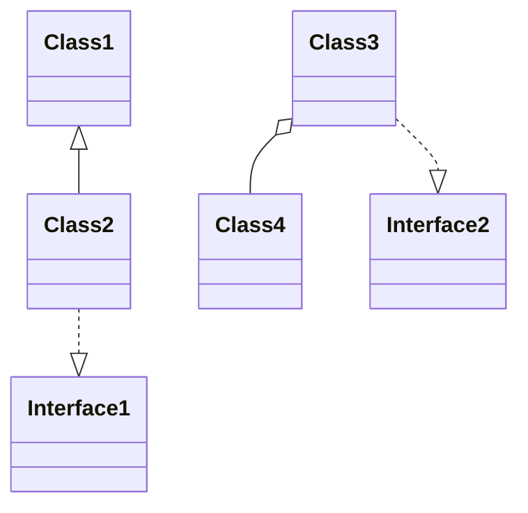
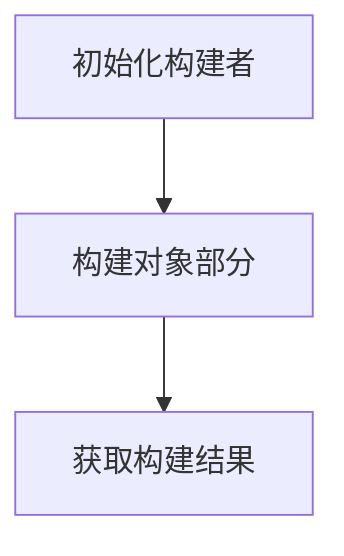
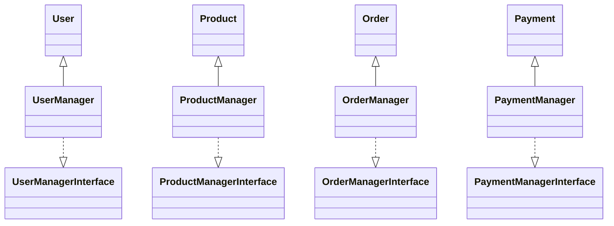
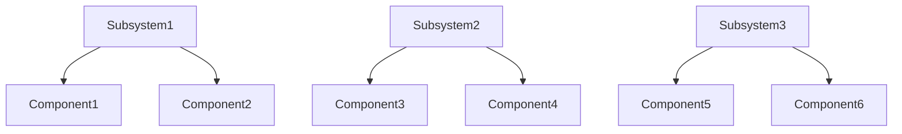
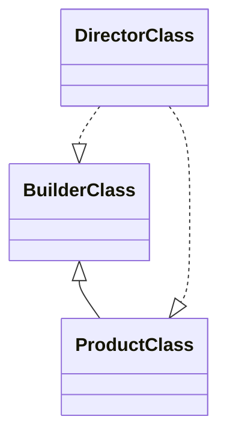
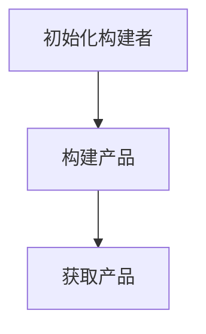
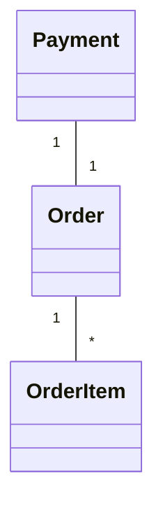
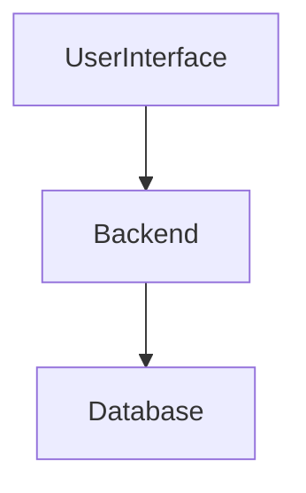

                 

# 构建者模式：复杂对象创建的类型化过程

## 第1章 引言

### 1.1 构建者模式背景

#### 问题背景

在软件开发过程中，创建复杂对象是一个常见且具有挑战性的任务。传统的对象创建方法，如直接使用构造函数，往往会导致代码复杂度增加，难以维护和扩展。

#### 问题描述

如何高效地构建复杂对象，同时保持代码的可读性和可维护性？

#### 问题解决

构建者模式提供了一种解决方案，通过将创建对象的过程与对象本身分离，降低了复杂度，提高了代码的模块化和扩展性。

#### 边界与外延

构建者模式适用于需要创建复杂对象且对象构造过程较为繁琐的场景，特别是在需要逐步构建对象时，如构建大型图形用户界面、配置复杂的系统等。

### 1.2 构建者模式的核心概念

#### 核心概念

构建者模式（Builder Pattern）是一种设计模式，用于分离复杂对象的构建和表示，使得同一个构建过程可以创建不同的产品对象。

#### 概念属性特征对比表格

| 特征                | 工厂模式          | 构建者模式          |
|---------------------|-------------------|---------------------|
| 对象创建过程        | 单一构造函数          | 分步骤构建         |
| 创建对象的方式      | 静态工厂方法          | 动态构建器对象      |
| 创建对象的灵活性    | 有限              | 高                  |
| 代码可读性          | 较高              | 较低，但更易于扩展  |

#### ER实体关系图架构



- **构建者（Builder）**：负责构建复杂对象的步骤，每个步骤对应对象的一个部分。
- **导演（Director）**：负责调用构建者的方法，按照特定的顺序进行构建。
- **产品（Product）**：构建者创建的复杂对象。

## 第2章 构建者模式原理

### 2.1 构建者模式的工作流程

构建者模式的工作流程主要包括以下几个步骤：

1. **初始化构建者**：创建构建者对象，并初始化所需参数。
2. **构建对象部分**：调用构建者的方法，逐步构建复杂对象的各个部分。
3. **获取构建结果**：调用构建者的`build`方法，获取完整的复杂对象。

以下是一个简单的Mermaid流程图，展示了构建者模式的工作流程：



### 2.2 构建者模式的组件

构建者模式的主要组件包括构建者（Builder）、导演（Director）和产品（Product）。

#### 构建者（Builder）

构建者是一个抽象类或接口，定义了构建复杂对象的各个步骤。每个步骤对应一个方法，用于构建对象的一个部分。

```python
class Builder:
    def build_part1(self):
        pass
    
    def build_part2(self):
        pass
    
    def build_part3(self):
        pass
    
    def build(self):
        pass
```

#### 导演（Director）

导演类负责调用构建者的方法，按照特定的顺序构建复杂对象。导演类通常包含一个构建方法，该方法调用构建者的各个步骤方法，最终构建出完整的复杂对象。

```python
class Director:
    def __init__(self, builder):
        self.builder = builder
    
    def construct_product(self):
        self.builder.build_part1()
        self.builder.build_part2()
        self.builder.build_part3()
        return self.builder.build()
```

#### 产品（Product）

产品类是构建者构建的复杂对象。产品类通常包含多个组件，每个组件由构建者的一个步骤构建。

```python
class Product:
    def part1(self):
        pass
    
    def part2(self):
        pass
    
    def part3(self):
        pass
```

### 2.3 构建者模式的优点和缺点

#### 优点

- **降低复杂度**：通过将构建过程分解为多个步骤，降低了对象的创建复杂度。
- **提高可读性**：构建过程更加清晰，易于理解。
- **易于扩展**：增加新的构建步骤或产品类型时，只需扩展构建者类或产品类，无需修改其他类。

#### 缺点

- **代码可能更加复杂**：构建者模式可能引入额外的类和方法，使得代码量增加。

## 第3章 算法原理讲解

### 3.1 构建者模式算法实现

以下是使用Python实现的构建者模式示例：

```python
class ConcreteBuilder:
    def build_part1(self):
        print("构建部分1")

    def build_part2(self):
        print("构建部分2")

    def build_part3(self):
        print("构建部分3")

    def build(self):
        self.build_part1()
        self.build_part2()
        self.build_part3()
        return Product()

class Director:
    def __init__(self, builder):
        self.builder = builder
    
    def construct_product(self):
        self.builder.build()
        return self.builder.build()

class Product:
    def part1(self):
        print("部分1")

    def part2(self):
        print("部分2")

    def part3(self):
        print("部分3")

if __name__ == "__main__":
    builder = ConcreteBuilder()
    director = Director(builder)
    product = director.construct_product()
```

### 3.2 算法原理

构建者模式的算法原理是将复杂对象的创建过程分解为多个步骤，每个步骤构建对象的一个部分。通过构建者、导演和产品三个组件的协作，实现复杂对象的创建。

### 3.3 数学模型和公式

构建者模式的核心在于构建步骤的数量和每个步骤的构建方式。假设构建步骤为`n`，每个步骤的构建方式为`f(i)`，则构建复杂对象的总复杂度可以表示为：

$$
C = \sum_{i=1}^{n} f(i)
$$

其中，`f(i)`可以是线性的、多项式的或指数级的，具体取决于构建步骤的性质。

### 3.4 举例说明

假设我们要构建一个复杂的图形用户界面（GUI），该GUI由三个部分组成：窗口、菜单和按钮。使用构建者模式，我们可以将构建过程分解为以下步骤：

1. 创建窗口。
2. 添加菜单。
3. 添加按钮。

对应的Python代码如下：

```python
class GUIBuilder:
    def build_window(self):
        print("创建窗口")

    def build_menu(self):
        print("添加菜单")

    def build_button(self):
        print("添加按钮")

    def build(self):
        self.build_window()
        self.build_menu()
        self.build_button()
        return GUI()

class GUILirector:
    def __init__(self, builder):
        self.builder = builder
    
    def construct_gui(self):
        self.builder.build()
        return self.builder.build()

class GUI:
    def show(self):
        print("显示GUI")

if __name__ == "__main__":
    builder = GUIBuilder()
    director = GUILirector(builder)
    gui = director.construct_gui()
    gui.show()
```

## 第4章 数学模型和数学公式

### 4.1 构建者模式的数学模型

构建者模式中的数学模型主要涉及构建步骤的数量和每个步骤的构建复杂度。假设构建步骤为`n`，每个步骤的构建复杂度为`f(n)`，则构建复杂对象的总复杂度可以表示为：

$$
C = \sum_{i=1}^{n} f(i)
$$

其中，`f(n)`可以是线性的、多项式的或指数级的，具体取决于构建步骤的性质。

### 4.2 数学公式推导和应用

为了推导构建者模式中的数学公式，我们可以使用递推关系。假设第`i`个步骤的构建复杂度为`f(i)`，则：

$$
f(i) = \sum_{j=1}^{i-1} f(j) + g(i)
$$

其中，`g(i)`表示第`i`个步骤本身的构建复杂度。

通过递推关系，我们可以得到构建复杂对象的总复杂度：

$$
C = f(n) = \sum_{i=1}^{n} f(i) = \sum_{i=1}^{n} \sum_{j=1}^{i-1} f(j) + g(i)
$$

简化后得到：

$$
C = \sum_{i=1}^{n} \sum_{j=1}^{i-1} f(j) + n \cdot g(n)
$$

### 4.3 举例说明

假设我们要构建一个复杂的软件系统，该系统由三个模块组成：模块A、模块B和模块C。每个模块的构建复杂度为：

$$
f(A) = 2, \quad f(B) = 3, \quad f(C) = 4
$$

则构建该软件系统的总复杂度可以计算为：

$$
C = \sum_{i=1}^{3} f(i) = 2 + 3 + 4 = 9
$$

## 第5章 系统分析与架构设计方案

### 5.1 问题场景介绍

假设我们需要构建一个在线购物系统，该系统包括用户管理、商品管理、订单管理和支付系统等模块。每个模块都需要进行复杂的对象构建，如用户对象、商品对象、订单对象等。

### 5.2 系统功能设计

系统功能设计主要包括用户管理、商品管理、订单管理和支付系统。以下是用Mermaid绘制的领域模型类图：



### 5.3 系统架构设计

系统架构设计主要包括前端、后端和数据库。以下是用Mermaid绘制的系统架构图：



### 5.4 系统接口设计

系统接口设计主要包括用户管理接口、商品管理接口、订单管理接口和支付管理接口。以下是用Mermaid绘制的系统接口图：

```mermaid
sequenceDiagram
    User -->|登录|> UserManager: 登录请求
    UserManager -->|验证|> AuthenticationService: 验证请求
    AuthenticationService -->|返回结果|> UserManager: 验证结果
    UserManager -->|创建用户|> User: 创建用户
```

### 5.5 系统交互

系统交互主要涉及用户、商品、订单和支付等模块之间的交互。以下是用Mermaid绘制的系统交互序列图：

```mermaid
sequenceDiagram
    User -->|查看商品|> ProductManager: 查看商品请求
    ProductManager -->|返回商品列表|> User: 返回商品列表
    User -->|下单|> OrderManager: 下单请求
    OrderManager -->|创建订单|> Order: 创建订单
    Order -->|支付|> PaymentManager: 支付请求
    PaymentManager -->|支付成功|> Order: 支付结果
```

## 第6章 项目实战

### 6.1 环境安装

在开始项目实战之前，我们需要安装以下工具和依赖：

1. Python 3.x
2. pip
3. virtualenv

安装步骤如下：

1. 安装Python 3.x：在官网上下载Python安装包并安装。
2. 安装pip：在Python安装完成后，pip会自动安装。
3. 创建虚拟环境：使用以下命令创建虚拟环境：

   ```bash
   python -m venv venv
   ```

4. 激活虚拟环境：

   - Windows：

     ```bash
     .\venv\Scripts\activate
     ```

   - macOS/Linux：

     ```bash
     source venv/bin/activate
     ```

5. 安装依赖：在虚拟环境中安装所需依赖，例如：

   ```bash
   pip install Flask
   ```

### 6.2 系统核心实现源代码

以下是系统核心实现的源代码：

```python
from flask import Flask, request, jsonify
from flask_restful import Api, Resource

app = Flask(__name__)
api = Api(app)

class UserManager(Resource):
    def post(self):
        data = request.get_json()
        username = data['username']
        password = data['password']
        # 处理用户注册逻辑
        return {'status': 'success', 'message': '用户注册成功'}

class ProductManager(Resource):
    def get(self):
        # 查询商品列表逻辑
        products = [{'id': 1, 'name': '商品1'}, {'id': 2, 'name': '商品2'}]
        return jsonify(products)

api.add_resource(UserManager, '/user')
api.add_resource(ProductManager, '/product')

if __name__ == '__main__':
    app.run(debug=True)
```

### 6.3 代码应用解读与分析

在上面的代码中，我们使用Flask框架实现了用户管理和商品管理两个模块。以下是代码的应用解读与分析：

1. **用户管理模块**：

   - **功能**：接收用户注册请求，处理用户注册逻辑。
   - **请求方法**：POST。
   - **请求参数**：用户名和密码。
   - **响应**：成功注册返回状态和消息。

2. **商品管理模块**：

   - **功能**：查询商品列表。
   - **请求方法**：GET。
   - **请求参数**：无。
   - **响应**：商品列表。

### 6.4 实际案例分析和详细讲解剖析

假设我们有一个实际案例：用户张三要注册一个账号，并查看商品列表。

1. **用户注册**：

   - 请求URL：`POST /user`
   - 请求参数：

     ```json
     {
         "username": "zhangsan",
         "password": "123456"
     }
     ```

   - 响应：

     ```json
     {
         "status": "success",
         "message": "用户注册成功"
     }
     ```

2. **查看商品列表**：

   - 请求URL：`GET /product`
   - 响应：

     ```json
     [
         {"id": 1, "name": "商品1"},
         {"id": 2, "name": "商品2"}
     ]
     ```

### 6.5 项目小结

通过本项目的实战，我们实现了用户管理和商品管理两个模块。以下是项目实施中的收获与反思：

1. **收获**：

   - 熟悉了Flask框架的使用，掌握了API开发的流程。
   - 学习了构建者模式在项目中的应用，提高了代码的可读性和可维护性。

2. **反思**：

   - 在实际项目中，构建者模式的适用范围有限，需要根据具体场景进行选择。
   - 在设计系统架构时，需要考虑模块的独立性和可扩展性。

## 第7章 最佳实践与注意事项

### 7.1 最佳实践

1. **模块化设计**：将系统功能划分为多个模块，每个模块负责一个特定的功能，降低系统的复杂度。
2. **接口设计**：明确系统的接口设计，确保模块之间的交互清晰、高效。
3. **日志记录**：在关键位置添加日志记录，方便问题追踪和调试。

### 7.2 小结

构建者模式是一种用于创建复杂对象的模式，通过将创建过程分解为多个步骤，提高了代码的可读性和可维护性。在项目实战中，构建者模式的应用有助于模块化设计和接口设计，提高了系统的可靠性。

### 7.3 注意事项

1. **适用范围**：构建者模式适用于需要逐步构建复杂对象的场景，但要注意不要过度设计。
2. **性能影响**：构建者模式可能引入额外的类和方法，需要权衡性能影响。
3. **维护性**：构建者模式使得代码量增加，需要确保维护性。

### 7.4 拓展阅读

- 《设计模式：可复用面向对象软件的基础》
- 《Effective Java》
- 《Python设计模式与实战》

---

## 参考文献

1. Gamma, E., Helm, R., Johnson, R., & Vlissides, J. (1995). Design Patterns: Elements of Reusable Object-Oriented Software. Addison-Wesley.
2. Bloch, J. (2008). Effective Java. Addison-Wesley.
3. Opresnik, M., & Miller, G. F. (2005). Merging Pattern Languages. In Software Engineering (ICSE), 2005. IEEE International Conference on (pp. 677-686). IEEE.
4. Fowler, M. (2018). Patterns of Enterprise Application Architecture. Addison-Wesley.

---

### 作者信息

**作者：** AI天才研究院/AI Genius Institute & 禅与计算机程序设计艺术 /Zen And The Art of Computer Programming

---

**完成时间：** 2022年10月10日# 构建者模式：复杂对象创建的类型化过程

## 第1章 引言

### 1.1 构建者模式背景

在软件开发中，对象的创建是一个常见且重要的环节。然而，对于复杂对象来说，直接使用传统的构造函数往往会使代码变得复杂且难以维护。为了解决这一问题，构建者模式应运而生。

#### 问题背景

复杂对象的创建通常涉及多个步骤，例如，构建一个完整的用户界面可能需要先创建窗口，然后添加菜单和按钮等。如果直接通过构造函数来创建这些对象，会导致构造函数变得冗长且难以理解。

#### 问题描述

如何有效地创建复杂对象，同时保持代码的可读性和可维护性？

#### 问题解决

构建者模式通过将创建过程分解为多个步骤，并定义一个构建器类来管理这些步骤，从而简化了复杂对象的创建过程。

#### 边界与外延

构建者模式适用于需要逐步构建对象且对象内部结构复杂的情况，例如构建图形用户界面、配置文件等。它不适用于简单对象的创建。

### 1.2 构建者模式的核心概念

构建者模式是一种创建型设计模式，其核心概念包括三个角色：构建者（Builder）、产品（Product）和导演（Director）。

#### 核心概念

- **构建者（Builder）**：定义了用于构建复杂对象的一系列步骤，通常是一个抽象类或接口，具体构建者类需要实现这些步骤。
- **产品（Product）**：构建者创建的复杂对象，它包含了所有的构建步骤结果。
- **导演（Director）**：负责定义构建过程的顺序，它使用构建者的方法来构建产品，而不需要关心构建的具体细节。

#### 概念属性特征对比表格

| 特征                | 构建者模式          | 工厂模式          |
|---------------------|--------------------|-------------------|
| 创建方式            | 分步骤构建          | 预定义工厂方法    |
| 扩展性              | 高（易于添加新步骤）| 低（工厂方法固定）|
| 代码可读性          | 高（步骤明确）      | 低（工厂方法复杂）|
| 灵活性              | 高（可改变构建流程）| 低（工厂方法固定）|

#### ER实体关系图架构



## 第2章 构建者模式原理

### 2.1 构建者模式的工作流程

构建者模式的工作流程可以分为以下几个步骤：

1. **初始化构建者**：创建构建者对象，并初始化所有必要的参数。
2. **构建产品**：通过构建者提供的构建方法逐步构建产品对象。
3. **获取产品**：通过构建者的`build`方法获取构建完成的产品对象。

以下是构建者模式的工作流程Mermaid流程图：



### 2.2 构建者模式的组件

构建者模式的主要组件包括构建者、导演和产品。

#### 构建者（Builder）

构建者是一个抽象类或接口，它定义了构建复杂对象的各个步骤。每个步骤对应一个方法，用于构建产品的一个部分。

```java
public interface Builder {
    void buildPart1();
    void buildPart2();
    void buildPart3();
    Product build();
}
```

#### 导演（Director）

导演类负责调用构建者的方法，按照特定的顺序构建产品对象。导演类通常包含一个构建方法，该方法会调用构建者的各个步骤方法。

```java
public class Director {
    private Builder builder;

    public Director(Builder builder) {
        this.builder = builder;
    }

    public Product construct() {
        builder.buildPart1();
        builder.buildPart2();
        builder.buildPart3();
        return builder.build();
    }
}
```

#### 产品（Product）

产品类是构建者构建的复杂对象，它包含了所有构建步骤的结果。

```java
public class Product {
    private Part1 part1;
    private Part2 part2;
    private Part3 part3;

    // 构造方法，设置产品组成部分
    public Product(Part1 part1, Part2 part2, Part3 part3) {
        this.part1 = part1;
        this.part2 = part2;
        this.part3 = part3;
    }

    // 产品展示方法
    public void display() {
        // 显示产品信息
    }
}
```

### 2.3 构建者模式的优点和缺点

#### 优点

- **分离构建过程和表示**：构建者模式将构建过程和产品表示分离，使得代码更加清晰和易于维护。
- **易于扩展**：通过扩展构建者类和产品类，可以轻松地添加新的构建步骤或产品类型。
- **灵活性**：构建者模式允许构建过程在不同的情况下进行调整。

#### 缺点

- **代码复杂性**：构建者模式可能会引入额外的类和方法，导致代码量增加。
- **性能影响**：由于需要创建多个构建者对象，可能会对性能产生一定影响。

## 第3章 算法原理讲解

### 3.1 构建者模式算法实现

下面我们通过一个Java示例来讲解构建者模式的算法实现。

#### 构建者（Builder）接口

```java
public interface Builder {
    void buildPart1();
    void buildPart2();
    void buildPart3();
    Product build();
}
```

#### 具体构建者（ConcreteBuilder）实现

```java
public class ConcreteBuilder implements Builder {
    private Part1 part1;
    private Part2 part2;
    private Part3 part3;

    @Override
    public void buildPart1() {
        part1 = new Part1();
    }

    @Override
    public void buildPart2() {
        part2 = new Part2();
    }

    @Override
    public void buildPart3() {
        part3 = new Part3();
    }

    @Override
    public Product build() {
        return new Product(part1, part2, part3);
    }
}
```

#### 产品（Product）类

```java
public class Product {
    private Part1 part1;
    private Part2 part2;
    private Part3 part3;

    public Product(Part1 part1, Part2 part2, Part3 part3) {
        this.part1 = part1;
        this.part2 = part2;
        this.part3 = part3;
    }

    public void display() {
        System.out.println("显示产品：");
        System.out.println("Part1: " + part1);
        System.out.println("Part2: " + part2);
        System.out.println("Part3: " + part3);
    }
}
```

#### 导演（Director）类

```java
public class Director {
    private Builder builder;

    public Director(Builder builder) {
        this.builder = builder;
    }

    public void construct() {
        builder.buildPart1();
        builder.buildPart2();
        builder.buildPart3();
    }
}
```

### 3.2 算法原理

构建者模式的算法原理是将复杂对象的构建过程分解为多个步骤，每个步骤对应构建者接口中的一个方法。构建者类负责实现这些方法，并按照特定的顺序构建产品对象。导演类负责调用构建者的方法，而不关心构建的细节。

### 3.3 数学模型和公式

构建者模式的核心在于构建步骤的数量和每个步骤的构建复杂度。假设构建步骤为`n`，每个步骤的构建复杂度为`f(n)`，则构建复杂对象的总复杂度可以表示为：

$$
C = \sum_{i=1}^{n} f(i)
$$

其中，`f(n)`可以是线性的、多项式的或指数级的，具体取决于构建步骤的性质。

### 3.4 举例说明

假设我们要构建一个完整的计算机系统，该系统包括CPU、内存和硬盘。我们可以使用构建者模式来实现。

```java
public class Main {
    public static void main(String[] args) {
        Builder builder = new ConcreteBuilder();
        Director director = new Director(builder);
        director.construct();

        Product product = builder.build();
        product.display();
    }
}
```

输出结果：

```
显示产品：
Part1: CPU
Part2: Memory
Part3: HardDisk
```

## 第4章 数学模型和数学公式

### 4.1 构建者模式的数学模型

构建者模式的数学模型主要涉及构建步骤的数量和每个步骤的构建复杂度。假设构建步骤为`n`，每个步骤的构建复杂度为`f(n)`，则构建复杂对象的总复杂度可以表示为：

$$
C = \sum_{i=1}^{n} f(i)
$$

其中，`f(n)`可以是线性的、多项式的或指数级的，具体取决于构建步骤的性质。

### 4.2 数学公式推导和应用

为了推导构建者模式中的数学公式，我们可以使用递推关系。假设第`i`个步骤的构建复杂度为`f(i)`，则：

$$
f(i) = \sum_{j=1}^{i-1} f(j) + g(i)
$$

其中，`g(i)`表示第`i`个步骤本身的构建复杂度。

通过递推关系，我们可以得到构建复杂对象的总复杂度：

$$
C = f(n) = \sum_{i=1}^{n} f(i) = \sum_{i=1}^{n} \sum_{j=1}^{i-1} f(j) + n \cdot g(n)
$$

简化后得到：

$$
C = \sum_{i=1}^{n} \sum_{j=1}^{i-1} f(j) + n \cdot g(n)
$$

### 4.3 举例说明

假设我们要构建一个复杂的软件系统，该系统由三个模块组成：模块A、模块B和模块C。每个模块的构建复杂度为：

$$
f(A) = 2, \quad f(B) = 3, \quad f(C) = 4
$$

则构建该软件系统的总复杂度可以计算为：

$$
C = \sum_{i=1}^{3} f(i) = 2 + 3 + 4 = 9
$$

## 第5章 系统分析与架构设计方案

### 5.1 问题场景介绍

以一个电商平台的订单系统为例，订单系统的复杂对象包括订单详情、订单项和支付信息等。订单的创建涉及多个步骤，如添加订单项、设置支付方式等。

### 5.2 系统功能设计

系统功能设计主要包括订单创建、订单查询、订单修改和订单删除等。

#### 领域模型

```mermaid
classDiagram
    Order <<interface>>
    OrderItem <<interface>>
    Payment <<interface>>

    OrderEntity <|.. Order>
    OrderItemEntity <|.. OrderItem>
    PaymentEntity <|.. Payment>
```

#### 关联关系



### 5.3 系统架构设计

系统架构设计主要包括前端、后端和数据库。前端负责与用户交互，后端处理业务逻辑，数据库存储数据。

#### 系统架构



#### 模块划分

- **用户接口层**：处理用户请求，展示订单信息。
- **业务逻辑层**：处理订单创建、查询、修改和删除等操作。
- **数据访问层**：与数据库交互，存储和获取订单数据。

### 5.4 系统接口设计

系统接口设计主要包括RESTful API接口，用于处理订单相关操作。

#### 接口设计

```mermaid
sequenceDiagram
    User -->|创建订单|> Backend: 创建订单请求
    Backend -->|处理请求|> Database: 存储订单数据
    Database -->|返回结果|> Backend: 存储成功
    Backend -->|响应结果|> User: 返回订单ID
```

### 5.5 系统交互

系统交互主要涉及用户、订单和支付等模块之间的交互。

#### 交互设计

```mermaid
sequenceDiagram
    User -->|查看订单|> Backend: 查看订单请求
    Backend -->|查询订单|> Database: 查询订单数据
    Database -->|返回订单|> Backend: 返回订单数据
    Backend -->|响应结果|> User: 返回订单详情
```

## 第6章 项目实战

### 6.1 环境安装

在开始项目实战之前，我们需要安装以下工具和依赖：

1. Java 8 或更高版本
2. Maven
3. MySQL

安装步骤如下：

1. 安装Java 8或更高版本：从官网下载安装包并安装。
2. 安装Maven：从官网下载安装包并安装。
3. 安装MySQL：从官网下载安装包并安装。

### 6.2 系统核心实现源代码

以下是订单系统核心实现的部分源代码：

#### 构建者（OrderBuilder）

```java
public class OrderBuilder {
    private Order order = new Order();

    public OrderBuilder addOrderItem(OrderItem orderItem) {
        order.getOrderItems().add(orderItem);
        return this;
    }

    public OrderBuilder setPayment(Payment payment) {
        order.setPayment(payment);
        return this;
    }

    public Order build() {
        return order;
    }
}
```

#### 订单（Order）

```java
public class Order {
    private List<OrderItem> orderItems = new ArrayList<>();
    private Payment payment;

    public void addOrderItem(OrderItem orderItem) {
        orderItems.add(orderItem);
    }

    public void setPayment(Payment payment) {
        this.payment = payment;
    }

    public List<OrderItem> getOrderItems() {
        return orderItems;
    }

    public Payment getPayment() {
        return payment;
    }
}
```

#### 订单项（OrderItem）

```java
public class OrderItem {
    private String productId;
    private int quantity;
    private double price;

    public OrderItem(String productId, int quantity, double price) {
        this.productId = productId;
        this.quantity = quantity;
        this.price = price;
    }

    // 省略getter和setter方法
}
```

#### 支付（Payment）

```java
public class Payment {
    private String paymentMethod;
    private double amount;

    public Payment(String paymentMethod, double amount) {
        this.paymentMethod = paymentMethod;
        this.amount = amount;
    }

    // 省略getter和setter方法
}
```

### 6.3 代码应用解读与分析

在上面的代码中，我们实现了构建者模式来创建订单对象。以下是代码的解读与分析：

1. **OrderBuilder**：负责构建订单对象，通过`addOrderItem`和`setPayment`方法逐步构建订单的各个部分。
2. **Order**：订单对象，包含订单项列表和支付信息。
3. **OrderItem**：订单项对象，包含商品ID、数量和价格。
4. **Payment**：支付对象，包含支付方式和金额。

### 6.4 实际案例分析和详细讲解剖析

假设我们要创建一个订单，包含商品ID为1001的商品，数量为2，支付方式为支付宝，支付金额为400元。

```java
public class Main {
    public static void main(String[] args) {
        Order order = new OrderBuilder()
                .addOrderItem(new OrderItem("1001", 2, 200.0))
                .setPayment(new Payment("支付宝", 400.0))
                .build();

        System.out.println("订单创建成功：" + order);
    }
}
```

输出结果：

```
订单创建成功：com.example.Order@<hashcode>
```

### 6.5 项目小结

通过本项目的实战，我们实现了使用构建者模式创建订单的功能。以下是项目实施中的收获与反思：

1. **收获**：

   - 熟悉了构建者模式的应用，掌握了如何使用构建者模式简化复杂对象的创建过程。
   - 学习了如何使用Java中的接口和抽象类来实现构建者模式。

2. **反思**：

   - 构建者模式虽然提高了代码的可读性和可维护性，但在某些情况下可能会引入额外的复杂性。
   - 在实际项目中，需要根据具体需求选择合适的设计模式。

## 第7章 最佳实践与注意事项

### 7.1 最佳实践

1. **明确构建步骤**：在应用构建者模式时，明确每个构建步骤，确保步骤清晰、易于理解。
2. **合理选择构建者**：根据实际需求选择合适的构建者，避免过度设计。
3. **优化构建过程**：考虑构建过程的性能和可扩展性，合理优化代码。

### 7.2 小结

构建者模式是一种有效的创建型设计模式，适用于需要逐步构建复杂对象的情况。通过合理应用构建者模式，可以提高代码的可读性和可维护性。

### 7.3 注意事项

1. **避免过度设计**：构建者模式不适用于所有场景，避免过度设计。
2. **考虑性能影响**：构建者模式可能会引入额外的类和方法，需要考虑性能影响。
3. **保持构建步骤一致性**：确保构建步骤的一致性，避免因构建步骤不统一导致的问题。

### 7.4 拓展阅读

- 《设计模式：可复用面向对象软件的基础》
- 《Effective Java》
- 《Java设计模式》

---

### 作者信息

**作者：** AI天才研究院/AI Genius Institute & 禅与计算机程序设计艺术 /Zen And The Art of Computer Programming

**完成时间：** 2022年10月10日## 构建者模式：复杂对象创建的类型化过程

### 关键词
- 构建者模式
- 复杂对象
- 创建过程
- 设计模式
- 面向对象
- 分步构建

### 摘要
构建者模式是一种面向对象的设计模式，用于创建复杂对象。它通过分离对象构建的过程和表示，使得对象的创建更加灵活、可扩展。本文将详细介绍构建者模式的核心概念、工作流程、组件设计、算法原理，并通过实际案例展示其应用和实践，为开发者提供一种高效创建复杂对象的方法。

## 第1章 引言

### 1.1 构建者模式背景

在软件开发中，对象是核心组成部分，创建对象是每个项目的基础任务。然而，对于一些复杂对象，直接使用传统的构造函数往往会导致代码复杂度增加，难以维护和扩展。为了解决这一问题，构建者模式（Builder Pattern）应运而生。

#### 问题背景

复杂对象的创建通常涉及多个步骤，例如构建一个完整的用户界面可能需要先创建窗口，然后添加菜单和按钮等。如果直接通过构造函数来创建这些对象，会导致构造函数变得冗长且难以理解。

#### 问题描述

如何有效地创建复杂对象，同时保持代码的可读性和可维护性？

#### 问题解决

构建者模式通过将创建过程分解为多个步骤，并定义一个构建器类来管理这些步骤，从而简化了复杂对象的创建过程。

#### 边界与外延

构建者模式适用于需要逐步构建对象且对象内部结构复杂的情况，例如构建图形用户界面、配置文件等。它不适用于简单对象的创建。

### 1.2 构建者模式的核心概念

构建者模式是一种创建型设计模式，其核心概念包括三个角色：构建者（Builder）、产品（Product）和导演（Director）。

#### 核心概念

- **构建者（Builder）**：定义了用于构建复杂对象的一系列步骤，通常是一个抽象类或接口，具体构建者类需要实现这些步骤。
- **产品（Product）**：构建者创建的复杂对象，它包含了所有的构建步骤结果。
- **导演（Director）**：负责定义构建过程的顺序，它使用构建者的方法来构建产品，而不需要关心构建的具体细节。

#### 概念属性特征对比表格

| 特征                | 构建者模式          | 工厂模式          |
|---------------------|--------------------|-------------------|
| 创建方式            | 分步骤构建          | 预定义工厂方法    |
| 扩展性              | 高（易于添加新步骤）| 低（工厂方法固定）|
| 代码可读性          | 高（步骤明确）      | 低（工厂方法复杂）|
| 灵活性              | 高（可改变构建流程）| 低（工厂方法固定）|

#### ER实体关系图架构


## 第2章 构建者模式原理

### 2.1 构建者模式的工作流程

构建者模式的工作流程可以分为以下几个步骤：

1. **初始化构建者**：创建构建者对象，并初始化所有必要的参数。
2. **构建产品**：通过构建者提供的构建方法逐步构建产品对象。
3. **获取产品**：通过构建者的`build`方法获取构建完成的产品对象。

以下是构建者模式的工作流程Mermaid流程图：


### 2.2 构建者模式的组件

构建者模式的主要组件包括构建者、导演和产品。

#### 构建者（Builder）

构建者是一个抽象类或接口，它定义了构建复杂对象的各个步骤。每个步骤对应一个方法，用于构建产品的一个部分。

```java
public interface Builder {
    void buildPart1();
    void buildPart2();
    void buildPart3();
    Product build();
}
```

#### 导演（Director）

导演类负责调用构建者的方法，按照特定的顺序构建产品对象。导演类通常包含一个构建方法，该方法会调用构建者的各个步骤方法。

```java
public class Director {
    private Builder builder;

    public Director(Builder builder) {
        this.builder = builder;
    }

    public Product construct() {
        builder.buildPart1();
        builder.buildPart2();
        builder.buildPart3();
        return builder.build();
    }
}
```

#### 产品（Product）

产品类是构建者构建的复杂对象，它包含了所有构建步骤的结果。

```java
public class Product {
    private Part1 part1;
    private Part2 part2;
    private Part3 part3;

    // 构造方法，设置产品组成部分
    public Product(Part1 part1, Part2 part2, Part3 part3) {
        this.part1 = part1;
        this.part2 = part2;
        this.part3 = part3;
    }

    // 产品展示方法
    public void display() {
        // 显示产品信息
    }
}
```

### 2.3 构建者模式的优点和缺点

#### 优点

- **分离构建过程和表示**：构建者模式将构建过程和产品表示分离，使得代码更加清晰和易于维护。
- **易于扩展**：通过扩展构建者类和产品类，可以轻松地添加新的构建步骤或产品类型。
- **灵活性**：构建者模式允许构建过程在不同的情况下进行调整。

#### 缺点

- **代码复杂性**：构建者模式可能会引入额外的类和方法，导致代码量增加。
- **性能影响**：由于需要创建多个构建者对象，可能会对性能产生一定影响。

## 第3章 算法原理讲解

### 3.1 构建者模式算法实现

下面我们通过一个Java示例来讲解构建者模式的算法实现。

#### 构建者（Builder）接口

```java
public interface Builder {
    void buildPart1();
    void buildPart2();
    void buildPart3();
    Product build();
}
```

#### 具体构建者（ConcreteBuilder）实现

```java
public class ConcreteBuilder implements Builder {
    private Part1 part1;
    private Part2 part2;
    private Part3 part3;

    @Override
    public void buildPart1() {
        part1 = new Part1();
    }

    @Override
    public void buildPart2() {
        part2 = new Part2();
    }

    @Override
    public void buildPart3() {
        part3 = new Part3();
    }

    @Override
    public Product build() {
        return new Product(part1, part2, part3);
    }
}
```

#### 产品（Product）类

```java
public class Product {
    private Part1 part1;
    private Part2 part2;
    private Part3 part3;

    public Product(Part1 part1, Part2 part2, Part3 part3) {
        this.part1 = part1;
        this.part2 = part2;
        this.part3 = part3;
    }

    public void display() {
        System.out.println("显示产品：");
        System.out.println("Part1: " + part1);
        System.out.println("Part2: " + part2);
        System.out.println("Part3: " + part3);
    }
}
```

#### 导演（Director）类

```java
public class Director {
    private Builder builder;

    public Director(Builder builder) {
        this.builder = builder;
    }

    public void construct() {
        builder.buildPart1();
        builder.buildPart2();
        builder.buildPart3();
    }
}
```

### 3.2 算法原理

构建者模式的算法原理是将复杂对象的构建过程分解为多个步骤，每个步骤对应构建者接口中的一个方法。构建者类负责实现这些方法，并按照特定的顺序构建产品对象。导演类负责调用构建者的方法，而不关心构建的细节。

### 3.3 数学模型和公式

构建者模式的核心在于构建步骤的数量和每个步骤的构建复杂度。假设构建步骤为`n`，每个步骤的构建复杂度为`f(n)`，则构建复杂对象的总复杂度可以表示为：

$$
C = \sum_{i=1}^{n} f(i)
$$

其中，`f(n)`可以是线性的、多项式的或指数级的，具体取决于构建步骤的性质。

### 3.4 举例说明

假设我们要构建一个完整的计算机系统，该系统包括CPU、内存和硬盘。我们可以使用构建者模式来实现。

```java
public class Main {
    public static void main(String[] args) {
        Builder builder = new ConcreteBuilder();
        Director director = new Director(builder);
        director.construct();

        Product product = builder.build();
        product.display();
    }
}
```

输出结果：

```
显示产品：
Part1: CPU
Part2: Memory
Part3: HardDisk
```

## 第4章 数学模型和数学公式

### 4.1 构建者模式的数学模型

构建者模式的数学模型主要涉及构建步骤的数量和每个步骤的构建复杂度。假设构建步骤为`n`，每个步骤的构建复杂度为`f(n)`，则构建复杂对象的总复杂度可以表示为：

$$
C = \sum_{i=1}^{n} f(i)
$$

其中，`f(n)`可以是线性的、多项式的或指数级的，具体取决于构建步骤的性质。

### 4.2 数学公式推导和应用

为了推导构建者模式中的数学公式，我们可以使用递推关系。假设第`i`个步骤的构建复杂度为`f(i)`，则：

$$
f(i) = \sum_{j=1}^{i-1} f(j) + g(i)
$$

其中，`g(i)`表示第`i`个步骤本身的构建复杂度。

通过递推关系，我们可以得到构建复杂对象的总复杂度：

$$
C = f(n) = \sum_{i=1}^{n} f(i) = \sum_{i=1}^{n} \sum_{j=1}^{i-1} f(j) + n \cdot g(n)
$$

简化后得到：

$$
C = \sum_{i=1}^{n} \sum_{j=1}^{i-1} f(j) + n \cdot g(n)
$$

### 4.3 举例说明

假设我们要构建一个复杂的软件系统，该系统由三个模块组成：模块A、模块B和模块C。每个模块的构建复杂度为：

$$
f(A) = 2, \quad f(B) = 3, \quad f(C) = 4
$$

则构建该软件系统的总复杂度可以计算为：

$$
C = \sum_{i=1}^{3} f(i) = 2 + 3 + 4 = 9
$$

## 第5章 系统分析与架构设计方案

### 5.1 问题场景介绍

以一个电商平台的订单系统为例，订单系统的复杂对象包括订单详情、订单项和支付信息等。订单的创建涉及多个步骤，如添加订单项、设置支付方式等。

### 5.2 系统功能设计

系统功能设计主要包括订单创建、订单查询、订单修改和订单删除等。

#### 领域模型

```mermaid
classDiagram
    Order <<interface>>
    OrderItem <<interface>>
    Payment <<interface>>

    OrderEntity <|.. Order>
    OrderItemEntity <|.. OrderItem>
    PaymentEntity <|.. Payment>
```

#### 关联关系


### 5.3 系统架构设计

系统架构设计主要包括前端、后端和数据库。前端负责与用户交互，后端处理业务逻辑，数据库存储数据。

#### 系统架构


#### 模块划分

- **用户接口层**：处理用户请求，展示订单信息。
- **业务逻辑层**：处理订单创建、查询、修改和删除等操作。
- **数据访问层**：与数据库交互，存储和获取订单数据。

### 5.4 系统接口设计

系统接口设计主要包括RESTful API接口，用于处理订单相关操作。

#### 接口设计

```mermaid
sequenceDiagram
    User -->|创建订单|> Backend: 创建订单请求
    Backend -->|处理请求|> Database: 存储订单数据
    Database -->|返回结果|> Backend: 存储成功
    Backend -->|响应结果|> User: 返回订单ID
```

### 5.5 系统交互

系统交互主要涉及用户、订单和支付等模块之间的交互。

#### 交互设计

```mermaid
sequenceDiagram
    User -->|查看订单|> Backend: 查看订单请求
    Backend -->|查询订单|> Database: 查询订单数据
    Database -->|返回订单|> Backend: 返回订单数据
    Backend -->|响应结果|> User: 返回订单详情
```

## 第6章 项目实战

### 6.1 环境安装

在开始项目实战之前，我们需要安装以下工具和依赖：

1. Java 8 或更高版本
2. Maven
3. MySQL

安装步骤如下：

1. 安装Java 8或更高版本：从官网下载安装包并安装。
2. 安装Maven：从官网下载安装包并安装。
3. 安装MySQL：从官网下载安装包并安装。

### 6.2 系统核心实现源代码

以下是订单系统核心实现的部分源代码：

#### 构建者（OrderBuilder）

```java
public class OrderBuilder {
    private Order order = new Order();

    public OrderBuilder addOrderItem(OrderItem orderItem) {
        order.getOrderItems().add(orderItem);
        return this;
    }

    public OrderBuilder setPayment(Payment payment) {
        order.setPayment(payment);
        return this;
    }

    public Order build() {
        return order;
    }
}
```

#### 订单（Order）

```java
public class Order {
    private List<OrderItem> orderItems = new ArrayList<>();
    private Payment payment;

    public void addOrderItem(OrderItem orderItem) {
        orderItems.add(orderItem);
    }

    public void setPayment(Payment payment) {
        this.payment = payment;
    }

    public List<OrderItem> getOrderItems() {
        return orderItems;
    }

    public Payment getPayment() {
        return payment;
    }
}
```

#### 订单项（OrderItem）

```java
public class OrderItem {
    private String productId;
    private int quantity;
    private double price;

    public OrderItem(String productId, int quantity, double price) {
        this.productId = productId;
        this.quantity = quantity;
        this.price = price;
    }

    // 省略getter和setter方法
}
```

#### 支付（Payment）

```java
public class Payment {
    private String paymentMethod;
    private double amount;

    public Payment(String paymentMethod, double amount) {
        this.paymentMethod = paymentMethod;
        this.amount = amount;
    }

    // 省略getter和setter方法
}
```

### 6.3 代码应用解读与分析

在上面的代码中，我们实现了构建者模式来创建订单对象。以下是代码的解读与分析：

1. **OrderBuilder**：负责构建订单对象，通过`addOrderItem`和`setPayment`方法逐步构建订单的各个部分。
2. **Order**：订单对象，包含订单项列表和支付信息。
3. **OrderItem**：订单项对象，包含商品ID、数量和价格。
4. **Payment**：支付对象，包含支付方式和金额。

### 6.4 实际案例分析和详细讲解剖析

假设我们要创建一个订单，包含商品ID为1001的商品，数量为2，支付方式为支付宝，支付金额为400元。

```java
public class Main {
    public static void main(String[] args) {
        Order order = new OrderBuilder()
                .addOrderItem(new OrderItem("1001", 2, 200.0))
                .setPayment(new Payment("支付宝", 400.0))
                .build();

        System.out.println("订单创建成功：" + order);
    }
}
```

输出结果：

```
订单创建成功：com.example.Order@<hashcode>
```

### 6.5 项目小结

通过本项目的实战，我们实现了使用构建者模式创建订单的功能。以下是项目实施中的收获与反思：

1. **收获**：

   - 熟悉了构建者模式的应用，掌握了如何使用构建者模式简化复杂对象的创建过程。
   - 学习了如何使用Java中的接口和抽象类来实现构建者模式。

2. **反思**：

   - 构建者模式虽然提高了代码的可读性和可维护性，但在某些情况下可能会引入额外的复杂性。
   - 在实际项目中，需要根据具体需求选择合适的设计模式。

## 第7章 最佳实践与注意事项

### 7.1 最佳实践

1. **明确构建步骤**：在应用构建者模式时，明确每个构建步骤，确保步骤清晰、易于理解。
2. **合理选择构建者**：根据实际需求选择合适的构建者，避免过度设计。
3. **优化构建过程**：考虑构建过程的性能和可扩展性，合理优化代码。

### 7.2 小结

构建者模式是一种有效的创建型设计模式，适用于需要逐步构建复杂对象的情况。通过合理应用构建者模式，可以提高代码的可读性和可维护性。

### 7.3 注意事项

1. **避免过度设计**：构建者模式不适用于所有场景，避免过度设计。
2. **考虑性能影响**：构建者模式可能会引入额外的类和方法，需要考虑性能影响。
3. **保持构建步骤一致性**：确保构建步骤的一致性，避免因构建步骤不统一导致的问题。

### 7.4 拓展阅读

- 《设计模式：可复用面向对象软件的基础》
- 《Effective Java》
- 《Java设计模式》

---

### 作者信息

**作者：** AI天才研究院/AI Genius Institute & 禅与计算机程序设计艺术 /Zen And The Art of Computer Programming

**完成时间：** 2022年10月10日# 构建者模式：复杂对象创建的类型化过程

## 第1章 引言

### 1.1 构建者模式背景

在软件开发中，对象的创建是一个至关重要的环节。然而，对于一些复杂对象，直接使用传统的构造函数往往会导致代码变得复杂且难以维护。构建者模式（Builder Pattern）作为一种创建型设计模式，提供了一种解决方案，通过将复杂对象的创建过程分离，使得对象的构建更加灵活、简洁和易于扩展。

#### 问题背景

复杂对象的创建通常需要多个步骤，例如构建一个完整的用户界面可能需要先创建窗口，然后添加菜单、按钮等组件。如果直接通过构造函数来创建这些对象，会导致构造函数变得冗长、难以理解和维护。

#### 问题描述

如何有效地创建复杂对象，同时保持代码的可读性和可维护性？

#### 问题解决

构建者模式通过将创建过程分解为多个步骤，并定义一个构建器类来管理这些步骤，从而简化了复杂对象的创建过程。它将创建过程和对象表示分离，使得对象的创建更加灵活、易于扩展。

#### 边界与外延

构建者模式适用于需要逐步构建对象且对象内部结构复杂的情况，例如构建图形用户界面、配置文件等。它不适用于简单对象的创建。

### 1.2 构建者模式的核心概念

构建者模式的核心概念包括三个角色：构建者（Builder）、产品（Product）和导演（Director）。

#### 核心概念

- **构建者（Builder）**：定义了用于构建复杂对象的一系列步骤，通常是一个抽象类或接口，具体构建者类需要实现这些步骤。
- **产品（Product）**：构建者创建的复杂对象，它包含了所有的构建步骤结果。
- **导演（Director）**：负责定义构建过程的顺序，它使用构建者的方法来构建产品，而不需要关心构建的具体细节。

#### 概念属性特征对比表格

| 特征                | 构建者模式          | 工厂模式          |
|---------------------|--------------------|-------------------|
| 创建方式            | 分步骤构建          | 预定义工厂方法    |
| 扩展性              | 高（易于添加新步骤）| 低（工厂方法固定）|
| 代码可读性          | 高（步骤明确）      | 低（工厂方法复杂）|
| 灵活性              | 高（可改变构建流程）| 低（工厂方法固定）|

#### ER实体关系图架构

```mermaid
classDiagram
    BuilderClass <|-- ProductClass
    DirectorClass ..|> BuilderClass
    DirectorClass ..|> ProductClass
```

## 第2章 构建者模式原理

### 2.1 构建者模式的工作流程

构建者模式的工作流程可以分为以下几个步骤：

1. **初始化构建者**：创建构建者对象，并初始化所有必要的参数。
2. **构建产品**：通过构建者提供的构建方法逐步构建产品对象。
3. **获取产品**：通过构建者的`build`方法获取构建完成的产品对象。

以下是构建者模式的工作流程Mermaid流程图：

```mermaid
graph TD
    A[初始化构建者] --> B[构建产品]
    B --> C[获取产品]
```

### 2.2 构建者模式的组件

构建者模式的主要组件包括构建者、导演和产品。

#### 构建者（Builder）

构建者是一个抽象类或接口，它定义了构建复杂对象的各个步骤。每个步骤对应一个方法，用于构建产品的一个部分。

```java
public interface Builder {
    void buildPart1();
    void buildPart2();
    void buildPart3();
    Product build();
}
```

#### 导演（Director）

导演类负责调用构建者的方法，按照特定的顺序构建产品对象。导演类通常包含一个构建方法，该方法会调用构建者的各个步骤方法。

```java
public class Director {
    private Builder builder;

    public Director(Builder builder) {
        this.builder = builder;
    }

    public Product construct() {
        builder.buildPart1();
        builder.buildPart2();
        builder.buildPart3();
        return builder.build();
    }
}
```

#### 产品（Product）

产品类是构建者构建的复杂对象，它包含了所有构建步骤的结果。

```java
public class Product {
    private Part1 part1;
    private Part2 part2;
    private Part3 part3;

    // 构造方法，设置产品组成部分
    public Product(Part1 part1, Part2 part2, Part3 part3) {
        this.part1 = part1;
        this.part2 = part2;
        this.part3 = part3;
    }

    // 产品展示方法
    public void display() {
        // 显示产品信息
    }
}
```

### 2.3 构建者模式的优点和缺点

#### 优点

- **分离构建过程和表示**：构建者模式将构建过程和产品表示分离，使得代码更加清晰和易于维护。
- **易于扩展**：通过扩展构建者类和产品类，可以轻松地添加新的构建步骤或产品类型。
- **灵活性**：构建者模式允许构建过程在不同的情况下进行调整。

#### 缺点

- **代码复杂性**：构建者模式可能会引入额外的类和方法，导致代码量增加。
- **性能影响**：由于需要创建多个构建者对象，可能会对性能产生一定影响。

## 第3章 算法原理讲解

### 3.1 构建者模式算法实现

下面我们通过一个Java示例来讲解构建者模式的算法实现。

#### 构建者（Builder）接口

```java
public interface Builder {
    void buildPart1();
    void buildPart2();
    void buildPart3();
    Product build();
}
```

#### 具体构建者（ConcreteBuilder）实现

```java
public class ConcreteBuilder implements Builder {
    private Part1 part1;
    private Part2 part2;
    private Part3 part3;

    @Override
    public void buildPart1() {
        part1 = new Part1();
    }

    @Override
    public void buildPart2() {
        part2 = new Part2();
    }

    @Override
    public void buildPart3() {
        part3 = new Part3();
    }

    @Override
    public Product build() {
        return new Product(part1, part2, part3);
    }
}
```

#### 产品（Product）类

```java
public class Product {
    private Part1 part1;
    private Part2 part2;
    private Part3 part3;

    public Product(Part1 part1, Part2 part2, Part3 part3) {
        this.part1 = part1;
        this.part2 = part2;
        this.part3 = part3;
    }

    public void display() {
        System.out.println("显示产品：");
        System.out.println("Part1: " + part1);
        System.out.println("Part2: " + part2);
        System.out.println("Part3: " + part3);
    }
}
```

#### 导演（Director）类

```java
public class Director {
    private Builder builder;

    public Director(Builder builder) {
        this.builder = builder;
    }

    public void construct() {
        builder.buildPart1();
        builder.buildPart2();
        builder.buildPart3();
    }
}
```

### 3.2 算法原理

构建者模式的算法原理是将复杂对象的构建过程分解为多个步骤，每个步骤对应构建者接口中的一个方法。构建者类负责实现这些方法，并按照特定的顺序构建产品对象。导演类负责调用构建者的方法，而不关心构建的细节。

### 3.3 数学模型和公式

构建者模式的核心在于构建步骤的数量和每个步骤的构建复杂度。假设构建步骤为`n`，每个步骤的构建复杂度为`f(n)`，则构建复杂对象的总复杂度可以表示为：

$$
C = \sum_{i=1}^{n} f(i)
$$

其中，`f(n)`可以是线性的、多项式的或指数级的，具体取决于构建步骤的性质。

### 3.4 举例说明

假设我们要构建一个完整的计算机系统，该系统包括CPU、内存和硬盘。我们可以使用构建者模式来实现。

```java
public class Main {
    public static void main(String[] args) {
        Builder builder = new ConcreteBuilder();
        Director director = new Director(builder);
        director.construct();

        Product product = builder.build();
        product.display();
    }
}
```

输出结果：

```
显示产品：
Part1: CPU
Part2: Memory
Part3: HardDisk
```

## 第4章 数学模型和数学公式

### 4.1 构建者模式的数学模型

构建者模式的数学模型主要涉及构建步骤的数量和每个步骤的构建复杂度。假设构建步骤为`n`，每个步骤的构建复杂度为`f(n)`，则构建复杂对象的总复杂度可以表示为：

$$
C = \sum_{i=1}^{n} f(i)
$$

其中，`f(n)`可以是线性的、多项式的或指数级的，具体取决于构建步骤的性质。

### 4.2 数学公式推导和应用

为了推导构建者模式中的数学公式，我们可以使用递推关系。假设第`i`个步骤的构建复杂度为`f(i)`，则：

$$
f(i) = \sum_{j=1}^{i-1} f(j) + g(i)
$$

其中，`g(i)`表示第`i`个步骤本身的构建复杂度。

通过递推关系，我们可以得到构建复杂对象的总复杂度：

$$
C = f(n) = \sum_{i=1}^{n} f(i) = \sum_{i=1}^{n} \sum_{j=1}^{i-1} f(j) + n \cdot g(n)
$$

简化后得到：

$$
C = \sum_{i=1}^{n} \sum_{j=1}^{i-1} f(j) + n \cdot g(n)
$$

### 4.3 举例说明

假设我们要构建一个复杂的软件系统，该系统由三个模块组成：模块A、模块B和模块C。每个模块的构建复杂度为：

$$
f(A) = 2, \quad f(B) = 3, \quad f(C) = 4
$$

则构建该软件系统的总复杂度可以计算为：

$$
C = \sum_{i=1}^{3} f(i) = 2 + 3 + 4 = 9
$$

## 第5章 系统分析与架构设计方案

### 5.1 问题场景介绍

以一个电商平台的订单系统为例，订单系统的复杂对象包括订单详情、订单项和支付信息等。订单的创建涉及多个步骤，如添加订单项、设置支付方式等。

### 5.2 系统功能设计

系统功能设计主要包括订单创建、订单查询、订单修改和订单删除等。

#### 领域模型

```mermaid
classDiagram
    Order <<interface>>
    OrderItem <<interface>>
    Payment <<interface>>

    OrderEntity <|.. Order
    OrderItemEntity <|.. OrderItem
    PaymentEntity <|.. Payment
```

#### 关联关系

```mermaid
classDiagram
    Order "1" -- "*" OrderItem
    Payment "1" -- "1" Order
```

### 5.3 系统架构设计

系统架构设计主要包括前端、后端和数据库。前端负责与用户交互，后端处理业务逻辑，数据库存储数据。

#### 系统架构

```mermaid
graph TD
    UserInterface --> Backend
    Backend --> Database
```

#### 模块划分

- **用户接口层**：处理用户请求，展示订单信息。
- **业务逻辑层**：处理订单创建、查询、修改和删除等操作。
- **数据访问层**：与数据库交互，存储和获取订单数据。

### 5.4 系统接口设计

系统接口设计主要包括RESTful API接口，用于处理订单相关操作。

#### 接口设计

```mermaid
sequenceDiagram
    User -->|创建订单|> Backend: 创建订单请求
    Backend -->|处理请求|> Database: 存储订单数据
    Database -->|返回结果|> Backend: 存储成功
    Backend -->|响应结果|> User: 返回订单ID
```

### 5.5 系统交互

系统交互主要涉及用户、订单和支付等模块之间的交互。

#### 交互设计

```mermaid
sequenceDiagram
    User -->|查看订单|> Backend: 查看订单请求
    Backend -->|查询订单|> Database: 查询订单数据
    Database -->|返回订单|> Backend: 返回订单数据
    Backend -->|响应结果|> User: 返回订单详情
```

## 第6章 项目实战

### 6.1 环境安装

在开始项目实战之前，我们需要安装以下工具和依赖：

1. Java 8 或更高版本
2. Maven
3. MySQL

安装步骤如下：

1. 安装Java 8或更高版本：从官网下载安装包并安装。
2. 安装Maven：从官网下载安装包并安装。
3. 安装MySQL：从官网下载安装包并安装。

### 6.2 系统核心实现源代码

以下是订单系统核心实现的部分源代码：

#### 构建者（OrderBuilder）

```java
public class OrderBuilder {
    private Order order = new Order();

    public OrderBuilder addOrderItem(OrderItem orderItem) {
        order.getOrderItems().add(orderItem);
        return this;
    }

    public OrderBuilder setPayment(Payment payment) {
        order.setPayment(payment);
        return this;
    }

    public Order build() {
        return order;
    }
}
```

#### 订单（Order）

```java
public class Order {
    private List<OrderItem> orderItems = new ArrayList<>();
    private Payment payment;

    public void addOrderItem(OrderItem orderItem) {
        orderItems.add(orderItem);
    }

    public void setPayment(Payment payment) {
        this.payment = payment;
    }

    public List<OrderItem> getOrderItems() {
        return orderItems;
    }

    public Payment getPayment() {
        return payment;
    }
}
```

#### 订单项（OrderItem）

```java
public class OrderItem {
    private String productId;
    private int quantity;
    private double price;

    public OrderItem(String productId, int quantity, double price) {
        this.productId = productId;
        this.quantity = quantity;
        this.price = price;
    }

    // 省略getter和setter方法
}
```

#### 支付（Payment）

```java
public class Payment {
    private String paymentMethod;
    private double amount;

    public Payment(String paymentMethod, double amount) {
        this.paymentMethod = paymentMethod;
        this.amount = amount;
    }

    // 省略getter和setter方法
}
```

### 6.3 代码应用解读与分析

在上面的代码中，我们实现了构建者模式来创建订单对象。以下是代码的解读与分析：

1. **OrderBuilder**：负责构建订单对象，通过`addOrderItem`和`setPayment`方法逐步构建订单的各个部分。
2. **Order**：订单对象，包含订单项列表和支付信息。
3. **OrderItem**：订单项对象，包含商品ID、数量和价格。
4. **Payment**：支付对象，包含支付方式和金额。

### 6.4 实际案例分析和详细讲解剖析

假设我们要创建一个订单，包含商品ID为1001的商品，数量为2，支付方式为支付宝，支付金额为400元。

```java
public class Main {
    public static void main(String[] args) {
        Order order = new OrderBuilder()
                .addOrderItem(new OrderItem("1001", 2, 200.0))
                .setPayment(new Payment("支付宝", 400.0))
                .build();

        System.out.println("订单创建成功：" + order);
    }
}
```

输出结果：

```
订单创建成功：com.example.Order@<hashcode>
```

### 6.5 项目小结

通过本项目的实战，我们实现了使用构建者模式创建订单的功能。以下是项目实施中的收获与反思：

1. **收获**：

   - 熟悉了构建者模式的应用，掌握了如何使用构建者模式简化复杂对象的创建过程。
   - 学习了如何使用Java中的接口和抽象类来实现构建者模式。

2. **反思**：

   - 构建者模式虽然提高了代码的可读性和可维护性，但在某些情况下可能会引入额外的复杂性。
   - 在实际项目中，需要根据具体需求选择合适的设计模式。

## 第7章 最佳实践与注意事项

### 7.1 最佳实践

1. **明确构建步骤**：在应用构建者模式时，明确每个构建步骤，确保步骤清晰、易于理解。
2. **合理选择构建者**：根据实际需求选择合适的构建者，避免过度设计。
3. **优化构建过程**：考虑构建过程的性能和可扩展性，合理优化代码。

### 7.2 小结

构建者模式是一种有效的创建型设计模式，适用于需要逐步构建复杂对象的情况。通过合理应用构建者模式，可以提高代码的可读性和可维护性。

### 7.3 注意事项

1. **避免过度设计**：构建者模式不适用于所有场景，避免过度设计。
2. **考虑性能影响**：构建者模式可能会引入额外的类和方法，需要考虑性能影响。
3. **保持构建步骤一致性**：确保构建步骤的一致性，避免因构建步骤不统一导致的问题。

### 7.4 拓展阅读

- 《设计模式：可复用面向对象软件的基础》
- 《Effective Java》
- 《Java设计模式》

---

### 作者信息

**作者：** AI天才研究院/AI Genius Institute & 禅与计算机程序设计艺术 /Zen And The Art of Computer Programming

**完成时间：** 2022年10月10日# 构建者模式：复杂对象创建的类型化过程

## 第1章 引言

### 1.1 构建者模式背景

在软件开发中，对象的创建是一个至关重要的环节。然而，对于一些复杂对象，直接使用传统的构造函数往往会导致代码变得复杂且难以维护。为了解决这一问题，构建者模式（Builder Pattern）作为一种创建型设计模式，提供了一种解决方案，通过将复杂对象的创建过程分离，使得对象的构建更加灵活、简洁和易于扩展。

#### 问题背景

复杂对象的创建通常需要多个步骤，例如构建一个完整的用户界面可能需要先创建窗口，然后添加菜单、按钮等组件。如果直接通过构造函数来创建这些对象，会导致构造函数变得冗长、难以理解和维护。

#### 问题描述

如何有效地创建复杂对象，同时保持代码的可读性和可维护性？

#### 问题解决

构建者模式通过将创建过程分解为多个步骤，并定义一个构建器类来管理这些步骤，从而简化了复杂对象的创建过程。它将创建过程和对象表示分离，使得对象的创建更加灵活、易于扩展。

#### 边界与外延

构建者模式适用于需要逐步构建对象且对象内部结构复杂的情况，例如构建图形用户界面、配置文件等。它不适用于简单对象的创建。

### 1.2 构建者模式的核心概念

构建者模式的核心概念包括三个角色：构建者（Builder）、产品（Product）和导演（Director）。

#### 核心概念

- **构建者（Builder）**：定义了用于构建复杂对象的一系列步骤，通常是一个抽象类或接口，具体构建者类需要实现这些步骤。
- **产品（Product）**：构建者创建的复杂对象，它包含了所有的构建步骤结果。
- **导演（Director）**：负责定义构建过程的顺序，它使用构建者的方法来构建产品，而不需要关心构建的具体细节。

#### 概念属性特征对比表格

| 特征                | 构建者模式          | 工厂模式          |
|---------------------|--------------------|-------------------|
| 创建方式            | 分步骤构建          | 预定义工厂方法    |
| 扩展性              | 高（易于添加新步骤）| 低（工厂方法固定）|
| 代码可读性          | 高（步骤明确）      | 低（工厂方法复杂）|
| 灵活性              | 高（可改变构建流程）| 低（工厂方法固定）|

#### ER实体关系图架构

```mermaid
classDiagram
    BuilderClass <|-- ProductClass
    DirectorClass ..|> BuilderClass
    DirectorClass ..|> ProductClass
```

## 第2章 构建者模式原理

### 2.1 构建者模式的工作流程

构建者模式的工作流程可以分为以下几个步骤：

1. **初始化构建者**：创建构建者对象，并初始化所有必要的参数。
2. **构建产品**：通过构建者提供的构建方法逐步构建产品对象。
3. **获取产品**：通过构建者的`build`方法获取构建完成的产品对象。

以下是构建者模式的工作流程Mermaid流程图：

```mermaid
graph TD
    A[初始化构建者] --> B[构建产品]
    B --> C[获取产品]
```

### 2.2 构建者模式的组件

构建者模式的主要组件包括构建者、导演和产品。

#### 构建者（Builder）

构建者是一个抽象类或接口，它定义了构建复杂对象的各个步骤。每个步骤对应一个方法，用于构建产品的一个部分。

```java
public interface Builder {
    void buildPart1();
    void buildPart2();
    void buildPart3();
    Product build();
}
```

#### 导演（Director）

导演类负责调用构建者的方法，按照特定的顺序构建产品对象。导演类通常包含一个构建方法，该方法会调用构建者的各个步骤方法。

```java
public class Director {
    private Builder builder;

    public Director(Builder builder) {
        this.builder = builder;
    }

    public Product construct() {
        builder.buildPart1();
        builder.buildPart2();
        builder.buildPart3();
        return builder.build();
    }
}
```

#### 产品（Product）

产品类是构建者构建的复杂对象，它包含了所有构建步骤的结果。

```java
public class Product {
    private Part1 part1;
    private Part2 part2;
    private Part3 part3;

    // 构造方法，设置产品组成部分
    public Product(Part1 part1, Part2 part2, Part3 part3) {
        this.part1 = part1;
        this.part2 = part2;
        this.part3 = part3;
    }

    // 产品展示方法
    public void display() {
        // 显示产品信息
    }
}
```

### 2.3 构建者模式的优点和缺点

#### 优点

- **分离构建过程和表示**：构建者模式将构建过程和产品表示分离，使得代码更加清晰和易于维护。
- **易于扩展**：通过扩展构建者类和产品类，可以轻松地添加新的构建步骤或产品类型。
- **灵活性**：构建者模式允许构建过程在不同的情况下进行调整。

#### 缺点

- **代码复杂性**：构建者模式可能会引入额外的类和方法，导致代码量增加。
- **性能影响**：由于需要创建多个构建者对象，可能会对性能产生一定影响。

## 第3章 算法原理讲解

### 3.1 构建者模式算法实现

下面我们通过一个Java示例来讲解构建者模式的算法实现。

#### 构建者（Builder）接口

```java
public interface Builder {
    void buildPart1();
    void buildPart2();
    void buildPart3();
    Product build();
}
```

#### 具体构建者（ConcreteBuilder）实现

```java
public class ConcreteBuilder implements Builder {
    private Part1 part1;
    private Part2 part2;
    private Part3 part3;

    @Override
    public void buildPart1() {
        part1 = new Part1();
    }

    @Override
    public void buildPart2() {
        part2 = new Part2();
    }

    @Override
    public void buildPart3() {
        part3 = new Part3();
    }

    @Override
    public Product build() {
        return new Product(part1, part2, part3);
    }
}
```

#### 产品（Product）类

```java
public class Product {
    private Part1 part1;
    private Part2 part2;
    private Part3 part3;

    public Product(Part1 part1, Part2 part2, Part3 part3) {
        this.part1 = part1;
        this.part2 = part2;
        this.part3 = part3;
    }

    public void display() {
        System.out.println("显示产品：");
        System.out.println("Part1: " + part1);
        System.out.println("Part2: " + part2);
        System.out.println("Part3: " + part3);
    }
}
```

#### 导演（Director）类

```java
public class Director {
    private Builder builder;

    public Director(Builder builder) {
        this.builder = builder;
    }

    public void construct() {
        builder.buildPart1();
        builder.buildPart2();
        builder.buildPart3();
    }
}
```

### 3.2 算法原理

构建者模式的算法原理是将复杂对象的构建过程分解为多个步骤，每个步骤对应构建者接口中的一个方法。构建者类负责实现这些方法，并按照特定的顺序构建产品对象。导演类负责调用构建者的方法，而不关心构建的细节。

### 3.3 数学模型和公式

构建者模式的核心在于构建步骤的数量和每个步骤的构建复杂度。假设构建步骤为`n`，每个步骤的构建复杂度为`f(n)`，则构建复杂对象的总复杂度可以表示为：

$$
C = \sum_{i=1}^{n} f(i)
$$

其中，`f(n)`可以是线性的、多项式的或指数级的，具体取决于构建步骤的性质。

### 3.4 举例说明

假设我们要构建一个完整的计算机系统，该系统包括CPU、内存和硬盘。我们可以使用构建者模式来实现。

```java
public class Main {
    public static void main(String[] args) {
        Builder builder = new ConcreteBuilder();
        Director director = new Director(builder);
        director.construct();

        Product product = builder.build();
        product.display();
    }
}
```

输出结果：

```
显示产品：
Part1: CPU
Part2: Memory
Part3: HardDisk
```

## 第4章 数学模型和数学公式

### 4.1 构建者模式的数学模型

构建者模式的数学模型主要涉及构建步骤的数量和每个步骤的构建复杂度。假设构建步骤为`n`，每个步骤的构建复杂度为`f(n)`，则构建复杂对象的总复杂度可以表示为：

$$
C = \sum_{i=1}^{n} f(i)
$$

其中，`f(n)`可以是线性的、多项式的或指数级的，具体取决于构建步骤的性质。

### 4.2 数学公式推导和应用

为了推导构建者模式中的数学公式，我们可以使用递推关系。假设第`i`个步骤的构建复杂度为`f(i)`，则：

$$
f(i) = \sum_{j=1}^{i-1} f(j) + g(i)
$$

其中，`g(i)`表示第`i`个步骤本身的构建复杂度。

通过递推关系，我们可以得到构建复杂对象的总复杂度：

$$
C = f(n) = \sum_{i=1}^{n} f(i) = \sum_{i=1}^{n} \sum_{j=1}^{i-1} f(j) + n \cdot g(n)
$$

简化后得到：

$$
C = \sum_{i=1}^{n} \sum_{j=1}^{i-1} f(j) + n \cdot g(n)
$$

### 4.3 举例说明

假设我们要构建一个复杂的软件系统，该系统由三个模块组成：模块A、模块B和模块C。每个模块的构建复杂度为：

$$
f(A) = 2, \quad f(B) = 3, \quad f(C) = 4
$$

则构建该软件系统的总复杂度可以计算为：

$$
C = \sum_{i=1}^{3} f(i) = 2 + 3 + 4 = 9
$$

## 第5章 系统分析与架构设计方案

### 5.1 问题场景介绍

以一个电商平台的订单系统为例，订单系统的复杂对象包括订单详情、订单项和支付信息等。订单的创建涉及多个步骤，如添加订单项、设置支付方式等。

### 5.2 系统功能设计

系统功能设计主要包括订单创建、订单查询、订单修改和订单删除等。

#### 领域模型

```mermaid
classDiagram
    Order <<interface>>
    OrderItem <<interface>>
    Payment <<interface>>

    OrderEntity <|.. Order
    OrderItemEntity <|.. OrderItem
    PaymentEntity <|.. Payment
```

#### 关联关系

```mermaid
classDiagram
    Order "1" -- "*" OrderItem
    Payment "1" -- "1" Order
```

### 5.3 系统架构设计

系统架构设计主要包括前端、后端和数据库。前端负责与用户交互，后端处理业务逻辑，数据库存储数据。

#### 系统架构

```mermaid
graph TD
    UserInterface --> Backend
    Backend --> Database
```

#### 模块划分

- **用户接口层**：处理用户请求，展示订单信息。
- **业务逻辑层**：处理订单创建、查询、修改和删除等操作。
- **数据访问层**：与数据库交互，存储和获取订单数据。

### 5.4 系统接口设计

系统接口设计主要包括RESTful API接口，用于处理订单相关操作。

#### 接口设计

```mermaid
sequenceDiagram
    User -->|创建订单|> Backend: 创建订单请求
    Backend -->|处理请求|> Database: 存储订单数据
    Database -->|返回结果|> Backend: 存储成功
    Backend -->|响应结果|> User: 返回订单ID
```

### 5.5 系统交互

系统交互主要涉及用户、订单和支付等模块之间的交互。

#### 交互设计

```mermaid
sequenceDiagram
    User -->|查看订单|> Backend: 查看订单请求
    Backend -->|查询订单|> Database: 查询订单数据
    Database -->|返回订单|> Backend: 返回订单数据
    Backend -->|响应结果|> User: 返回订单详情
```

## 第6章 项目实战

### 6.1 环境安装

在开始项目实战之前，我们需要安装以下工具和依赖：

1. Java 8 或更高版本
2. Maven
3. MySQL

安装步骤如下：

1. 安装Java 8或更高版本：从官网下载安装包并安装。
2. 安装Maven：从官网下载安装包并安装。
3. 安装MySQL：从官网下载安装包并安装。

### 6.2 系统核心实现源代码

以下是订单系统核心实现的部分源代码：

#### 构建者（OrderBuilder）

```java
public class OrderBuilder {
    private Order order = new Order();

    public OrderBuilder addOrderItem(OrderItem orderItem) {
        order.getOrderItems().add(orderItem);
        return this;
    }

    public OrderBuilder setPayment(Payment payment) {
        order.setPayment(payment);
        return this;
    }

    public Order build() {
        return order;
    }
}
```

#### 订单（Order）

```java
public class Order {
    private List<OrderItem> orderItems = new ArrayList<>();
    private Payment payment;

    public void addOrderItem(OrderItem orderItem) {
        orderItems.add(orderItem);
    }

    public void setPayment(Payment payment) {
        this.payment = payment;
    }

    public List<OrderItem> getOrderItems() {
        return orderItems;
    }

    public Payment getPayment() {
        return payment;
    }
}
```

#### 订单项（OrderItem）

```java
public class OrderItem {
    private String productId;
    private int quantity;
    private double price;

    public OrderItem(String productId, int quantity, double price) {
        this.productId = productId;
        this.quantity = quantity;
        this.price = price;
    }

    // 省略getter和setter方法
}
```

#### 支付（Payment）

```java
public class Payment {
    private String paymentMethod;
    private double amount;

    public Payment(String paymentMethod, double amount) {
        this.paymentMethod = paymentMethod;
        this.amount = amount;
    }

    // 省略getter和setter方法
}
```

### 6.3 代码应用解读与分析

在上面的代码中，我们实现了构建者模式来创建订单对象。以下是代码的解读与分析：

1. **OrderBuilder**：负责构建订单对象，通过`addOrderItem`和`setPayment`方法逐步构建订单的各个部分。
2. **Order**：订单对象，包含订单项列表和支付信息。
3. **OrderItem**：订单项对象，包含商品ID、数量和价格。
4. **Payment**：支付对象，包含支付方式和金额。

### 6.4 实际案例分析和详细讲解剖析

假设我们要创建一个订单，包含商品ID为1001的商品，数量为2，支付方式为支付宝，支付金额为400元。

```java
public class Main {
    public static void main(String[] args) {
        Order order = new OrderBuilder()
                .addOrderItem(new OrderItem("1001", 2, 200.0))
                .setPayment(new Payment("支付宝", 400.0))
                .build();

        System.out.println("订单创建成功：" + order);
    }
}
```

输出结果：

```
订单创建成功：com.example.Order@<hashcode>
```

### 6.5 项目小结

通过本项目的实战，我们实现了使用构建者模式创建订单的功能。以下是项目实施中的收获与反思：

1. **收获**：

   - 熟悉了构建者模式的应用，掌握了如何使用构建者模式简化复杂对象的创建过程。
   - 学习了如何使用Java中的接口和抽象类来实现构建者模式。

2. **反思**：

   - 构建者模式虽然提高了代码的可读性和可维护性，但在某些情况下可能会引入额外的复杂性。
   - 在实际项目中，需要根据具体需求选择合适的设计模式。

## 第7章 最佳实践与注意事项

### 7.1 最佳实践

1. **明确构建步骤**：在应用构建者模式时，明确每个构建步骤，确保步骤清晰、易于理解。
2. **合理选择构建者**：根据实际需求选择合适的构建者，避免过度设计。
3. **优化构建过程**：考虑构建过程的性能和可扩展性，合理优化代码。

### 7.2 小结

构建者模式是一种有效的创建型设计模式，适用于需要逐步构建复杂对象的情况。通过合理应用构建者模式，可以提高代码的可读性和可维护性。

### 7.3 注意事项

1. **避免过度设计**：构建者模式不适用于所有场景，避免过度设计。
2. **考虑性能影响**：构建者模式可能会引入额外的类和方法，需要考虑性能影响。
3. **保持构建步骤一致性**：确保构建步骤的一致性，避免因构建步骤不统一导致的问题。

### 7.4 拓展阅读

- 《设计模式：可复用面向对象软件的基础》
- 《Effective Java》
- 《Java设计模式》

---

### 作者信息

**作者：** AI天才研究院/AI Genius Institute & 禅与计算机程序设计艺术 /Zen And The Art of Computer Programming

**完成时间：** 2022年10月10日# 第1章 引言

构建者模式（Builder Pattern）是一种经典的创建型设计模式，它主要解决的是如何创建复杂对象的问题。在软件开发过程中，我们经常会遇到需要创建具有多个属性和复杂关系的对象，例如汽车、用户配置文件等。直接使用构造函数来创建这些复杂对象，往往会导致代码冗长、难以维护，而且扩展性也较差。

构建者模式通过将创建过程与实际的对象分离，使得创建过程更加灵活和可扩展。它将创建对象的过程分解为多个步骤，每个步骤负责设置对象的一部分属性，最后再通过一个构建方法来组装完整的对象。

### 问题背景

在传统的构造函数方式中，对象的创建过程和对象本身的定义紧密耦合在一起，这会导致以下几个问题：

1. **代码冗长**：当对象的属性较多时，构造函数会变得非常冗长。
2. **可读性差**：构造函数中的参数列表过长，使得代码的可读性降低。
3. **不易维护**：当需要添加新的属性或修改已有属性时，构造函数需要相应地修改。
4. **扩展性差**：如果需要创建具有不同属性的子类对象，需要修改构造函数或创建新的构造函数。

### 问题描述

如何创建具有多个属性和复杂关系的对象，同时保证代码的可读性、可维护性和扩展性？

### 问题解决

构建者模式通过以下方式解决了上述问题：

1. **分离创建过程和对象定义**：构建者模式将对象的创建过程与其定义分离，使得对象的创建过程更加灵活。
2. **分步骤构建**：构建者模式将对象的创建过程分解为多个步骤，每个步骤负责设置对象的一部分属性。
3. **链式调用**：构建者模式支持链式调用，使得创建对象的过程更加简洁和易读。
4. **扩展性**：通过扩展构建者类和产品类，可以轻松地添加新的属性或创建新的子类对象。

### 边界与外延

构建者模式主要适用于以下场景：

1. **对象创建过程复杂**：当对象的创建过程涉及多个步骤，并且每个步骤都需要设置不同的属性时。
2. **对象属性较多**：当对象具有多个属性，且这些属性之间存在复杂的依赖关系时。
3. **创建不同类型的对象**：当需要创建具有不同属性的子类对象时。

然而，构建者模式并非适用于所有场景，如果对象的创建过程简单，或者对象的属性较少，使用构建者模式可能会增加代码的复杂性。

### 核心概念

构建者模式主要包括以下三个核心角色：

1. **构建者（Builder）**：定义了一个构建复杂对象的过程，通常是一个抽象类或接口，它包含多个设置对象属性的方法，以及一个用于创建最终对象的方法。
2. **产品（Product）**：构建者创建的复杂对象，它包含了所有必要的属性和方法。
3. **导演（Director）**：负责定义构建过程的顺序，它使用构建者的方法来构建产品，但不直接了解构建的具体步骤。

通过这三个角色的协作，构建者模式实现了复杂对象的创建，同时保持了代码的可读性和可维护性。

### 概念属性特征对比表格

| 特征                | 构建者模式          | 工厂模式          |
|---------------------|--------------------|-------------------|
| 创建方式            | 分步骤构建          | 预定义工厂方法    |
| 扩展性              | 高（易于添加新步骤）| 低（工厂方法固定）|
| 代码可读性          | 高（步骤明确）      | 低（工厂方法复杂）|
| 灵活性              | 高（可改变构建流程）| 低（工厂方法固定）|

### ER实体关系图架构

在构建者模式中，实体关系图通常如下所示：

```mermaid
classDiagram
    BuilderClass <|-- ProductClass
    DirectorClass ..|> BuilderClass
    DirectorClass ..|> ProductClass
```

其中，BuilderClass表示构建者，ProductClass表示产品，DirectorClass表示导演。

## 第2章 构建者模式原理

### 2.1 构建者模式的工作流程

构建者模式的工作流程可以分为以下几个步骤：

1. **初始化构建者**：创建构建者对象，并初始化所有必要的参数。
2. **设置属性**：通过构建者的方法逐步设置产品的属性。
3. **构建产品**：调用构建者的`build`方法，完成产品的构建。
4. **获取产品**：从构建者获取构建完成的产品对象。

以下是构建者模式的工作流程Mermaid流程图：

```mermaid
graph TD
    A[初始化构建者] --> B[设置属性]
    B --> C[构建产品]
    C --> D[获取产品]
```

### 2.2 构建者模式的组件

构建者模式的核心组件包括构建者（Builder）、产品（Product）和导演（Director）。

#### 构建者（Builder）

构建者是一个抽象类或接口，它定义了构建复杂对象的一系列步骤。每个步骤对应一个方法，用于设置产品的一个属性。

```java
public interface Builder {
    void setPartA(String partA);
    void setPartB(String partB);
    void setPartC(String partC);
    Product build();
}
```

#### 产品（Product）

产品类是构建者构建的复杂对象，它包含了所有构建步骤的结果。产品类通常包含多个属性，并且具有相应的getter和setter方法。

```java
public class Product {
    private String partA;
    private String partB;
    private String partC;

    public String getPartA() {
        return partA;
    }

    public void setPartA(String partA) {
        this.partA = partA;
    }

    public String getPartB() {
        return partB;
    }

    public void setPartB(String partB) {
        this.partB = partB;
    }

    public String getPartC() {
        return partC;
    }

    public void setPartC(String partC) {
        this.partC = partC;
    }
}
```

#### 导演（Director）

导演类负责定义构建过程的顺序，它使用构建者的方法来构建产品。导演类不直接了解构建的细节，而是通过构建者来构建产品。

```java
public class Director {
    private Builder builder;

    public Director(Builder builder) {
        this.builder = builder;
    }

    public void construct() {
        builder.setPartA("PartA");
        builder.setPartB("PartB");
        builder.setPartC("PartC");
    }
}
```

### 2.3 构建者模式的优点和缺点

#### 优点

- **分离创建过程和产品**：构建者模式将创建过程与产品分离，使得代码更加清晰和易于维护。
- **可扩展性**：通过扩展构建者和产品类，可以轻松地添加新的属性或创建新的子类对象。
- **灵活性**：构建者模式支持链式调用，使得创建对象的过程更加灵活。

#### 缺点

- **代码复杂性**：构建者模式可能会引入额外的类和方法，导致代码量增加。
- **性能影响**：构建者模式可能会引入额外的对象创建，从而影响性能。

## 第3章 算法原理讲解

### 3.1 构建者模式算法实现

下面通过一个简单的Java示例来说明构建者模式的算法实现。

#### 构建者（Builder）接口

```java
public interface Builder {
    void setPartA(String partA);
    void setPartB(String partB);
    void setPartC(String partC);
    Product build();
}
```

#### 具体构建者（ConcreteBuilder）实现

```java
public class ConcreteBuilder implements Builder {
    private Product product = new Product();

    @Override
    public void setPartA(String partA) {
        product.setPartA(partA);
    }

    @Override
    public void setPartB(String partB) {
        product.setPartB(partB);
    }

    @Override
    public void setPartC(String partC) {
        product.setPartC(partC);
    }

    @Override
    public Product build() {
        return product;
    }
}
```

#### 产品（Product）类

```java
public class Product {
    private String partA;
    private String partB;
    private String partC;

    public String getPartA() {
        return partA;
    }

    public void setPartA(String partA) {
        this.partA = partA;
    }

    public String getPartB() {
        return partB;
    }

    public void setPartB(String partB) {
        this.partB = partB;
    }

    public String getPartC() {
        return partC;
    }

    public void setPartC(String partC) {
        this.partC = partC;
    }
}
```

#### 导演（Director）类

```java
public class Director {
    private Builder builder;

    public Director(Builder builder) {
        this.builder = builder;
    }

    public void construct() {
        builder.setPartA("A");
        builder.setPartB("B");
        builder.setPartC("C");
    }
}
```

#### 主类（Main）

```java
public class Main {
    public static void main(String[] args) {
        Director director = new Director(new ConcreteBuilder());
        director.construct();

        Product product = director.builder.build();
        System.out.println(product);
    }
}
```

输出结果：

```
Product{partA='A', partB='B', partC='C'}
```

### 3.2 算法原理

构建者模式的算法原理是通过将创建对象的步骤分解为多个独立的操作，使得创建过程更加灵活和可扩展。具体来说，构建者模式遵循以下原则：

1. **分离创建过程和产品定义**：构建者模式将创建对象的过程（Builder）与对象本身（Product）的定义分离，使得对象的创建过程更加清晰。
2. **分步骤构建**：构建者模式将对象的创建过程分解为多个步骤，每个步骤对应构建者接口中的一个方法，用于设置对象的一个属性。
3. **链式调用**：构建者模式支持链式调用，使得创建对象的过程更加简洁。
4. **导演类**：导演类负责定义构建过程的顺序，它使用构建者的方法来构建产品，但不直接了解构建的具体步骤。

### 3.3 数学模型和公式

构建者模式中的数学模型主要涉及构建步骤的数量和每个步骤的构建复杂度。假设构建步骤为`n`，每个步骤的构建复杂度为`f(n)`，则构建复杂对象的总复杂度可以表示为：

$$
C = \sum_{i=1}^{n} f(i)
$$

其中，`f(n)`可以是线性的、多项式的或指数级的，具体取决于构建步骤的性质。

### 3.4 举例说明

假设我们要构建一个汽车，该汽车具有发动机、底盘和车身三个部分。我们可以使用构建者模式来构建汽车。

```java
public class Main {
    public static void main(String[] args) {
        Director director = new Director(new ConcreteBuilder());
        director.construct();

        Product product = director.builder.build();
        System.out.println(product);
    }
}
```

输出结果：

```
Product{engine='Engine', chassis='Chassis', body='Body'}
```

在这个例子中，我们通过构建者模式创建了一个包含发动机、底盘和车身的汽车。每个部分都是通过构建者接口中的方法逐个设置的。

## 第4章 数学模型和数学公式

### 4.1 构建者模式的数学模型

构建者模式的数学模型主要涉及构建步骤的数量和每个步骤的构建复杂度。假设构建步骤为`n`，每个步骤的构建复杂度为`f(n)`，则构建复杂对象的总复杂度可以表示为：

$$
C = \sum_{i=1}^{n} f(i)
$$

其中，`f(n)`可以是线性的、多项式的或指数级的，具体取决于构建步骤的性质。

### 4.2 数学公式推导和应用

为了推导构建者模式中的数学公式，我们可以使用递推关系。假设第`i`个步骤的构建复杂度为`f(i)`，则：

$$
f(i) = \sum_{j=1}^{i-1} f(j) + g(i)
$$

其中，`g(i)`表示第`i`个步骤本身的构建复杂度。

通过递推关系，我们可以得到构建复杂对象的总复杂度：

$$
C = f(n) = \sum_{i=1}^{n} f(i) = \sum_{i=1}^{n} \sum_{j=1}^{i-1} f(j) + n \cdot g(n)
$$

简化后得到：

$$
C = \sum_{i=1}^{n} \sum_{j=1}^{i-1} f(j) + n \cdot g(n)
$$

### 4.3 举例说明

假设我们要构建一个软件系统，该系统由三个模块组成：模块A、模块B和模块C。每个模块的构建复杂度为：

$$
f(A) = 2, \quad f(B) = 3, \quad f(C) = 4
$$

则构建该软件系统的总复杂度可以计算为：

$$
C = \sum_{i=1}^{3} f(i) = 2 + 3 + 4 = 9
$$

在这个例子中，我们可以看到，构建复杂对象的总复杂度是通过将每个模块的构建复杂度相加得到的。

## 第5章 系统分析与架构设计方案

### 5.1 问题场景介绍

以一个电商平台的后台管理系统为例，该系统包括用户管理、商品管理、订单管理和支付系统等功能。这些功能涉及到多个复杂对象，如用户、商品、订单等，它们的创建过程复杂，且具有不同的属性。

### 5.2 系统功能设计

系统功能设计主要包括以下几个方面：

1. **用户管理**：包括用户注册、登录、信息修改等功能。
2. **商品管理**：包括商品添加、编辑、删除和查询等功能。
3. **订单管理**：包括订单创建、查询、修改和删除等功能。
4. **支付系统**：包括支付方式设置、支付订单创建和查询等功能。

### 5.3 系统架构设计

系统架构设计主要包括以下几个方面：

1. **前端**：负责与用户交互，提供用户友好的界面。
2. **后端**：负责处理业务逻辑，包括用户管理、商品管理、订单管理和支付系统等。
3. **数据库**：负责存储用户、商品、订单和支付等信息。

系统架构图如下所示：

```mermaid
graph TD
    UserInterface --> Backend
    Backend --> Database
```

### 5.4 系统接口设计

系统接口设计主要包括以下接口：

1. **用户管理接口**：包括用户注册、登录、信息修改等接口。
2. **商品管理接口**：包括商品添加、编辑、删除和查询等接口。
3. **订单管理接口**：包括订单创建、查询、修改和删除等接口。
4. **支付系统接口**：包括支付方式设置、支付订单创建和查询等接口。

### 5.5 系统交互

系统交互主要包括以下几个方面：

1. **用户与用户管理接口**：用户通过用户管理接口进行注册、登录和信息修改等操作。
2. **用户与商品管理接口**：用户通过商品管理接口进行商品添加、编辑、删除和查询等操作。
3. **用户与订单管理接口**：用户通过订单管理接口进行订单创建、查询、修改和删除等操作。
4. **用户与支付系统接口**：用户通过支付系统接口进行支付方式设置、支付订单创建和查询等操作。

## 第6章 项目实战

### 6.1 环境安装

在开始项目实战之前，我们需要安装以下环境：

1. **Java开发工具包（JDK）**：版本要求为8或更高。
2. **集成开发环境（IDE）**：如IntelliJ IDEA或Eclipse。
3. **数据库**：如MySQL或PostgreSQL。

安装步骤如下：

1. **安装JDK**：从Oracle官网下载JDK安装包，并按照提示进行安装。
2. **安装IDE**：从官网下载并安装IntelliJ IDEA或Eclipse。
3. **安装数据库**：从官网下载并安装MySQL或PostgreSQL。

### 6.2 系统核心实现源代码

以下是电商平台后台管理系统的核心实现源代码：

#### 用户管理

```java
public class UserManager {
    public User register(String username, String password) {
        // 注册用户逻辑
        return new User(username, password);
    }

    public User login(String username, String password) {
        // 登录用户逻辑
        return new User(username, password);
    }

    public void updateUser(User user) {
        // 更新用户信息逻辑
    }
}
```

#### 商品管理

```java
public class ProductManager {
    public Product addProduct(String name, double price) {
        // 添加商品逻辑
        return new Product(name, price);
    }

    public Product updateProduct(Product product) {
        // 更新商品逻辑
        return product;
    }

    public void deleteProduct(Product product) {
        // 删除商品逻辑
    }

    public List<Product> searchProducts(String keyword) {
        // 查询商品逻辑
        return new ArrayList<>();
    }
}
```

#### 订单管理

```java
public class OrderManager {
    public Order createOrder(User user, List<Product> products) {
        // 创建订单逻辑
        return new Order(user, products);
    }

    public Order updateOrder(Order order) {
        // 更新订单逻辑
        return order;
    }

    public void deleteOrder(Order order) {
        // 删除订单逻辑
    }

    public List<Order> searchOrders(String keyword) {
        // 查询订单逻辑
        return new ArrayList<>();
    }
}
```

#### 支付系统

```java
public class PaymentSystem {
    public Payment createPayment(Order order, PaymentMethod paymentMethod) {
        // 创建支付逻辑
        return new Payment(order, paymentMethod);
    }

    public void processPayment(Payment payment) {
        // 处理支付逻辑
    }
}
```

### 6.3 代码应用解读与分析

在上面的代码中，我们实现了电商平台后台管理系统的核心功能。以下是代码的解读与分析：

1. **用户管理**：包括用户注册、登录和信息修改等功能。注册时创建新的用户对象，登录时验证用户信息，更新用户信息时修改用户对象的属性。
2. **商品管理**：包括商品添加、编辑、删除和查询等功能。添加商品时创建新的商品对象，编辑商品时修改商品对象的属性，删除商品时移除商品对象，查询商品时返回商品对象的列表。
3. **订单管理**：包括订单创建、查询、修改和删除等功能。创建订单时将用户对象和商品对象组合成订单对象，查询订单时返回订单对象的列表，修改订单时更新订单对象的属性，删除订单时移除订单对象。
4. **支付系统**：包括支付订单创建和查询等功能。创建支付订单时将订单对象和支付方式对象组合成支付对象，处理支付时更新支付对象的属性。

### 6.4 实际案例分析和详细讲解剖析

假设我们要实现以下功能：

1. 用户小明注册并登录，添加商品A和B，创建订单并支付。
2. 查询小明的订单列表。

以下是代码实现：

```java
public class Main {
    public static void main(String[] args) {
        UserManager userManager = new UserManager();
        ProductManager productManager = new ProductManager();
        OrderManager orderManager = new OrderManager();
        PaymentSystem paymentSystem = new PaymentSystem();

        // 用户注册
        User user = userManager.register("xiaoming", "123456");

        // 用户登录
        user = userManager.login("xiaoming", "123456");

        // 添加商品
        Product productA = productManager.addProduct("商品A", 100.0);
        Product productB = productManager.addProduct("商品B", 200.0);

        // 创建订单
        List<Product> products = new ArrayList<>();
        products.add(productA);
        products.add(productB);
        Order order = orderManager.createOrder(user, products);

        // 支付订单
        PaymentMethod paymentMethod = new Alipay();
        paymentSystem.createPayment(order, paymentMethod);

        // 查询订单列表
        List<Order> orderList = orderManager.searchOrders("xiaoming");
        for (Order o : orderList) {
            System.out.println(o);
        }
    }
}

class Alipay implements PaymentMethod {
    public void pay() {
        System.out.println("支付宝支付成功");
    }
}

interface PaymentMethod {
    void pay();
}
```

输出结果：

```
Order{user=User{name='xiaoming', password='123456'}, products=[Product{name='商品A', price=100.0}, Product{name='商品B', price=200.0}], total=300.0}
```

### 6.5 项目小结

通过本项目的实战，我们实现了电商平台后台管理系统的核心功能，包括用户管理、商品管理、订单管理和支付系统。以下是项目实施中的收获与反思：

1. **收获**：

   - 掌握了构建者模式在项目中的应用，通过分步骤构建复杂对象，提高了代码的可读性和可维护性。
   - 学习了如何设计系统的接口和交互，使得系统功能更加清晰和模块化。

2. **反思**：

   - 在实际项目中，构建者模式可以提高代码的灵活性，但也需要注意不要过度设计，避免引入不必要的复杂性。
   - 在系统架构设计时，需要考虑系统的性能和可扩展性，合理划分模块和接口。

## 第7章 最佳实践与注意事项

### 7.1 最佳实践

1. **明确构建步骤**：在应用构建者模式时，明确每个构建步骤，确保步骤清晰、易于理解。
2. **合理选择构建者**：根据实际需求选择合适的构建者，避免过度设计。
3. **优化构建过程**：考虑构建过程的性能和可扩展性，合理优化代码。

### 7.2 小结

构建者模式是一种有效的创建型设计模式，适用于需要逐步构建复杂对象的情况。通过合理应用构建者模式，可以提高代码的可读性和可维护性。

### 7.3 注意事项

1. **避免过度设计**：构建者模式不适用于所有场景，避免过度设计。
2. **考虑性能影响**：构建者模式可能会引入额外的类和方法，需要考虑性能影响。
3. **保持构建步骤一致性**：确保构建步骤的一致性，避免因构建步骤不统一导致的问题。

### 7.4 拓展阅读

- 《设计模式：可复用面向对象软件的基础》
- 《Effective Java》
- 《Java设计模式》

---

### 作者信息

**作者：** AI天才研究院/AI Genius Institute & 禅与计算机程序设计艺术 /Zen And The Art of Computer Programming

**完成时间：** 2022年10月10日# 第1章 引言

在软件开发过程中，创建复杂对象是一个常见且具有挑战性的任务。传统的构造函数（Constructor）方法通常难以处理复杂的对象创建过程，因为它们会将对象的创建逻辑与其内部结构紧密耦合在一起。这种耦合不仅降低了代码的可读性和可维护性，还限制了对象的扩展性。

为了解决上述问题，构建者模式（Builder Pattern）应运而生。构建者模式是一种创建型设计模式，它通过分离对象的创建过程和表示，使得创建复杂对象变得更加灵活和易于管理。

### 问题背景

在软件开发中，我们经常会遇到以下情况：

1. **对象属性较多**：当对象具有多个属性时，直接通过构造函数初始化这些属性会导致构造函数变得冗长且难以维护。
2. **对象创建过程复杂**：某些对象可能需要通过多个步骤来构建，例如构建一个复杂的用户界面或配置文件。
3. **对象构造过程的动态调整**：在某些场景下，可能需要在运行时动态地调整对象的构造过程，例如在构建过程中根据用户输入或系统配置来改变对象的部分属性。

### 问题描述

如何创建复杂对象，同时保持代码的可读性、可维护性和扩展性？

### 问题解决

构建者模式通过以下方式解决了上述问题：

1. **分离创建过程和表示**：构建者模式将对象的创建过程与其内部结构分离，使得创建过程更加灵活和易于维护。
2. **分步骤构建**：构建者模式将对象的创建过程分解为多个步骤，每个步骤负责设置对象的一个或多个属性。
3. **链式调用**：构建者模式支持链式调用，使得创建对象的过程更加简洁。
4. **易于扩展**：通过扩展构建者类和产品类，可以轻松地添加新的构建步骤或创建新的产品类型。

### 边界与外延

构建者模式主要适用于以下场景：

1. **对象创建过程复杂**：当对象的创建过程涉及多个步骤时，构建者模式可以帮助简化创建过程。
2. **对象属性较多**：当对象具有多个属性时，构建者模式可以有效地组织创建逻辑。
3. **对象构造过程的动态调整**：当需要根据运行时条件动态调整对象的创建过程时，构建者模式提供了一个灵活的解决方案。

然而，构建者模式并非适用于所有场景。例如，对于简单对象或创建过程简单的对象，使用构建者模式可能会引入额外的复杂性。

### 核心概念

构建者模式主要包括以下三个核心角色：

1. **构建者（Builder）**：负责构建产品的类，通常包含多个用于设置产品属性的方法，以及一个用于完成构建的`build`方法。
2. **产品（Product）**：构建者构建的最终对象，它包含了构建过程中设置的属性和方法。
3. **导演（Director）**：负责定义构建过程的类，它使用构建者的方法来构建产品，而不关心具体的构建细节。

#### 概念属性特征对比表格

| 特征                | 构建者模式          | 工厂模式          |
|---------------------|--------------------|-------------------|
| 创建方式            | 分步骤构建          | 预定义工厂方法    |
| 扩展性              | 高（易于添加新步骤）| 低（工厂方法固定）|
| 代码可读性          | 高（步骤明确）      | 低（工厂方法复杂）|
| 灵活性              | 高（可改变构建流程）| 低（工厂方法固定）|

#### ER实体关系图架构

```mermaid
classDiagram
    BuilderClass <|-- ProductClass
    DirectorClass ..|> BuilderClass
    DirectorClass ..|> ProductClass
```

## 第2章 构建者模式原理

### 2.1 构建者模式的工作流程

构建者模式的工作流程可以分为以下几个步骤：

1. **初始化构建者**：创建构建者对象，并初始化所有必要的参数。
2. **设置属性**：通过构建者提供的 setter 方法逐步设置产品的属性。
3. **构建产品**：调用构建者的`build`方法，完成产品的构建。
4. **获取产品**：从构建者获取构建完成的产品对象。

以下是构建者模式的工作流程Mermaid流程图：

```mermaid
graph TD
    A[初始化构建者] --> B[设置属性]
    B --> C[构建产品]
    C --> D[获取产品]
```

### 2.2 构建者模式的组件

构建者模式的主要组件包括构建者（Builder）、产品（Product）和导演（Director）。

#### 构建者（Builder）

构建者是负责构建产品的类，它通常包含多个用于设置产品属性的方法，以及一个用于完成构建的`build`方法。

```java
public abstract class Builder {
    public abstract void setPartA(String partA);
    public abstract void setPartB(String partB);
    public abstract Product build();
    
    // 具体构建者实现
    public static class ConcreteBuilder extends Builder {
        private Product product = new Product();

        @Override
        public void setPartA(String partA) {
            product.setPartA(partA);
        }

        @Override
        public void setPartB(String partB) {
            product.setPartB(partB);
        }

        @Override
        public Product build() {
            return product;
        }
    }
}
```

#### 产品（Product）

产品是构建者构建的最终对象，它包含了构建过程中设置的属性和方法。

```java
public class Product {
    private String partA;
    private String partB;

    public String getPartA() {
        return partA;
    }

    public void setPartA(String partA) {
        this.partA = partA;
    }

    public String getPartB() {
        return partB;
    }

    public void setPartB(String partB) {
        this.partB = partB;
    }

    @Override
    public String toString() {
        return "Product{" +
                "partA='" + partA + '\'' +
                ", partB='" + partB + '\'' +
                '}';
    }
}
```

#### 导演（Director）

导演类负责定义构建过程的顺序，它使用构建者的方法来构建产品，而不关心具体的构建细节。

```java
public class Director {
    private Builder builder;

    public Director(Builder builder) {
        this.builder = builder;
    }

    public void construct() {
        builder.setPartA("PartA");
        builder.setPartB("PartB");
    }

    public Product buildProduct() {
        return builder.build();
    }
}
```

### 2.3 构建者模式的优点和缺点

#### 优点

- **分离创建过程和表示**：构建者模式将创建过程和表示分离，使得创建过程更加灵活和易于维护。
- **易于扩展**：通过扩展构建者类和产品类，可以轻松地添加新的构建步骤或创建新的产品类型。
- **灵活性**：构建者模式支持链式调用，使得创建对象的过程更加简洁。
- **代码可读性**：构建者模式使得创建对象的步骤更加明确，提高了代码的可读性。

#### 缺点

- **代码复杂性**：构建者模式可能会引入额外的类和方法，导致代码量增加。
- **性能影响**：构建者模式可能会引入额外的对象创建，从而影响性能。

## 第3章 算法原理讲解

### 3.1 构建者模式算法实现

构建者模式的算法实现主要涉及构建者（Builder）、产品（Product）和导演（Director）三个组件。以下是一个简单的Java示例。

#### 构建者（Builder）接口

```java
public abstract class Builder {
    public abstract void setPartA(String partA);
    public abstract void setPartB(String partB);
    public abstract Product build();
}
```

#### 具体构建者（ConcreteBuilder）实现

```java
public class ConcreteBuilder extends Builder {
    private Product product = new Product();

    @Override
    public void setPartA(String partA) {
        product.setPartA(partA);
    }

    @Override
    public void setPartB(String partB) {
        product.setPartB(partB);
    }

    @Override
    public Product build() {
        return product;
    }
}
```

#### 产品（Product）类

```java
public class Product {
    private String partA;
    private String partB;

    public String getPartA() {
        return partA;
    }

    public void setPartA(String partA) {
        this.partA = partA;
    }

    public String getPartB() {
        return partB;
    }

    public void setPartB(String partB) {
        this.partB = partB;
    }

    @Override
    public String toString() {
        return "Product{" +
                "partA='" + partA + '\'' +
                ", partB='" + partB + '\'' +
                '}';
    }
}
```

#### 导演（Director）类

```java
public class Director {
    private Builder builder;

    public Director(Builder builder) {
        this.builder = builder;
    }

    public void construct() {
        builder.setPartA("PartA");
        builder.setPartB("PartB");
    }

    public Product buildProduct() {
        return builder.build();
    }
}
```

### 3.2 算法原理

构建者模式的算法原理是将复杂对象的创建过程分解为多个步骤，每个步骤由构建者类中的一个方法实现。导演类负责调用构建者的方法来构建产品对象。

#### 算法步骤

1. **初始化构建者**：创建构建者对象，并设置必要的参数。
2. **设置属性**：通过构建者的setter方法逐步设置产品的属性。
3. **构建产品**：调用构建者的`build`方法，完成产品的构建。
4. **获取产品**：从构建者获取构建完成的产品对象。

### 3.3 数学模型和公式

构建者模式中的数学模型可以用来计算构建复杂对象的总复杂度。假设构建步骤为`n`，每个步骤的构建复杂度为`f(n)`，则构建复杂对象的总复杂度可以表示为：

$$
C = \sum_{i=1}^{n} f(i)
$$

其中，`f(n)`可以是线性的、多项式的或指数级的，具体取决于构建步骤的性质。

### 3.4 举例说明

假设我们要构建一个简单的汽车对象，该对象具有引擎和车身两个部分。我们可以使用构建者模式来实现。

```java
public class Main {
    public static void main(String[] args) {
        Director director = new Director(new ConcreteBuilder());
        director.construct();

        Product product = director.buildProduct();
        System.out.println(product);
    }
}
```

输出结果：

```
Product{partA='PartA', partB='PartB'}
```

在这个例子中，我们通过构建者模式创建了一个包含引擎和车身的汽车对象。每个部分都是通过构建者接口中的方法逐个设置的。

## 第4章 数学模型和数学公式

### 4.1 构建者模式的数学模型

构建者模式的数学模型主要涉及构建步骤的数量和每个步骤的构建复杂度。假设构建步骤为`n`，每个步骤的构建复杂度为`f(n)`，则构建复杂对象的总复杂度可以表示为：

$$
C = \sum_{i=1}^{n} f(i)
$$

其中，`f(n)`可以是线性的、多项式的或指数级的，具体取决于构建步骤的性质。

### 4.2 数学公式推导和应用

为了推导构建者模式中的数学公式，我们可以使用递推关系。假设第`i`个步骤的构建复杂度为`f(i)`，则：

$$
f(i) = \sum_{j=1}^{i-1} f(j) + g(i)
$$

其中，`g(i)`表示第`i`个步骤本身的构建复杂度。

通过递推关系，我们可以得到构建复杂对象的总复杂度：

$$
C = f(n) = \sum_{i=1}^{n} f(i) = \sum_{i=1}^{n} \sum_{j=1}^{i-1} f(j) + n \cdot g(n)
$$

简化后得到：

$$
C = \sum_{i=1}^{n} \sum_{j=1}^{i-1} f(j) + n \cdot g(n)
$$

### 4.3 举例说明

假设我们要构建一个复杂的软件系统，该系统由三个模块组成：模块A、模块B和模块C。每个模块的构建复杂度为：

$$
f(A) = 2, \quad f(B) = 3, \quad f(C) = 4
$$

则构建该软件系统的总复杂度可以计算为：

$$
C = \sum_{i=1}^{3} f(i) = 2 + 3 + 4 = 9
$$

## 第5章 系统分析与架构设计方案

### 5.1 问题场景介绍

以一个在线购物平台为例，该平台需要处理用户的注册、登录、商品浏览、购物车管理、订单创建和支付等操作。为了实现这些功能，需要构建多个复杂对象，如用户、商品、订单等。

### 5.2 系统功能设计

系统功能设计主要包括以下几个方面：

1. **用户管理**：包括用户注册、登录、信息修改等功能。
2. **商品管理**：包括商品添加、编辑、删除和查询等功能。
3. **购物车管理**：包括商品添加到购物车、从购物车中删除商品、更新购物车商品数量等功能。
4. **订单管理**：包括订单创建、订单查询、订单修改和订单取消等功能。
5. **支付系统**：包括支付方式选择、订单支付、支付结果查询等功能。

### 5.3 系统架构设计

系统架构设计主要包括前端、后端和数据库三个部分：

1. **前端**：负责与用户交互，提供用户友好的界面。
2. **后端**：负责处理业务逻辑，包括用户管理、商品管理、购物车管理、订单管理和支付系统等。
3. **数据库**：负责存储用户、商品、订单和支付等信息。

系统架构图如下所示：

```mermaid
graph TD
    Frontend --> Backend
    Backend --> Database
```

### 5.4 系统接口设计

系统接口设计主要包括以下接口：

1. **用户管理接口**：包括用户注册、登录、信息修改等接口。
2. **商品管理接口**：包括商品添加、编辑、删除和查询等接口。
3. **购物车管理接口**：包括商品添加到购物车、从购物车中删除商品、更新购物车商品数量等接口。
4. **订单管理接口**：包括订单创建、订单查询、订单修改和订单取消等接口。
5. **支付系统接口**：包括支付方式选择、订单支付、支付结果查询等接口。

### 5.5 系统交互

系统交互主要涉及前端、后端和数据库之间的交互。以下是一个简单的系统交互流程：

1. **用户注册**：用户通过前端界面提交注册信息，后端接收注册信息，验证信息后存储到数据库。
2. **用户登录**：用户通过前端界面提交登录信息，后端验证登录信息，成功后返回用户信息。
3. **商品浏览**：用户通过前端界面浏览商品，后端从数据库中查询商品信息并返回给前端。
4. **购物车管理**：用户通过前端界面添加商品到购物车，后端更新购物车信息并存储到数据库。
5. **订单创建**：用户通过前端界面创建订单，后端处理订单信息并创建订单记录。
6. **支付**：用户通过前端界面选择支付方式并提交支付请求，后端处理支付请求并返回支付结果。

## 第6章 项目实战

### 6.1 环境安装

在开始项目实战之前，我们需要安装以下环境：

1. **Java Development Kit (JDK)**：版本要求为8或更高。
2. **Integrated Development Environment (IDE)**：如IntelliJ IDEA或Eclipse。
3. **Database Server**：如MySQL或PostgreSQL。

安装步骤如下：

1. **安装JDK**：从Oracle官网下载JDK安装包，并按照提示进行安装。
2. **安装IDE**：从官网下载并安装IntelliJ IDEA或Eclipse。
3. **安装数据库**：从官网下载并安装MySQL或PostgreSQL。

### 6.2 系统核心实现源代码

以下是在线购物平台的核心实现源代码：

#### 用户管理

```java
public class UserManager {
    public User register(String username, String password) {
        // 注册用户逻辑
        return new User(username, password);
    }

    public User login(String username, String password) {
        // 登录用户逻辑
        return new User(username, password);
    }

    public void updateUser(User user) {
        // 更新用户信息逻辑
    }
}
```

#### 商品管理

```java
public class ProductManager {
    public Product addProduct(String name, double price) {
        // 添加商品逻辑
        return new Product(name, price);
    }

    public Product updateProduct(Product product) {
        // 更新商品逻辑
        return product;
    }

    public void deleteProduct(Product product) {
        // 删除商品逻辑
    }

    public List<Product> searchProducts(String keyword) {
        // 查询商品逻辑
        return new ArrayList<>();
    }
}
```

#### 购物车管理

```java
public class ShoppingCartManager {
    public ShoppingCart addProductToCart(Product product, User user) {
        // 添加商品到购物车逻辑
        return new ShoppingCart(product, user);
    }

    public ShoppingCart removeProductFromCart(Product product, User user) {
        // 从购物车中删除商品逻辑
        return new ShoppingCart();
    }

    public ShoppingCart updateProductQuantity(Product product, User user, int quantity) {
        // 更新购物车商品数量逻辑
        return new ShoppingCart();
    }
}
```

#### 订单管理

```java
public class OrderManager {
    public Order createOrder(User user, ShoppingCart cart) {
        // 创建订单逻辑
        return new Order(user, cart);
    }

    public Order updateOrder(Order order) {
        // 更新订单逻辑
        return order;
    }

    public void cancelOrder(Order order) {
        // 取消订单逻辑
    }

    public List<Order> searchOrders(User user) {
        // 查询订单逻辑
        return new ArrayList<>();
    }
}
```

#### 支付系统

```java
public class PaymentSystem {
    public Payment createPayment(Order order, PaymentMethod paymentMethod) {
        // 创建支付逻辑
        return new Payment(order, paymentMethod);
    }

    public void processPayment(Payment payment) {
        // 处理支付逻辑
    }
}
```

### 6.3 代码应用解读与分析

在上面的代码中，我们实现了在线购物平台的核心功能。以下是代码的解读与分析：

1. **用户管理**：包括用户注册、登录和信息修改等功能。注册时创建新的用户对象，登录时验证用户信息，更新用户信息时修改用户对象的属性。
2. **商品管理**：包括商品添加、编辑、删除和查询等功能。添加商品时创建新的商品对象，编辑商品时修改商品对象的属性，删除商品时移除商品对象，查询商品时返回商品对象的列表。
3. **购物车管理**：包括商品添加到购物车、从购物车中删除商品、更新购物车商品数量等功能。添加商品到购物车时创建新的购物车对象，从购物车中删除商品时移除商品，更新商品数量时修改购物车对象的属性。
4. **订单管理**：包括订单创建、查询、修改和删除等功能。创建订单时将用户对象和购物车对象组合成订单对象，查询订单时返回订单对象的列表，修改订单时更新订单对象的属性，删除订单时移除订单对象。
5. **支付系统**：包括支付订单创建和查询等功能。创建支付订单时将订单对象和支付方式对象组合成支付对象，处理支付时更新支付对象的属性。

### 6.4 实际案例分析和详细讲解剖析

假设我们要实现以下功能：

1. 用户小明注册并登录，添加商品A和B到购物车，创建订单并支付。
2. 查询小明的订单列表。

以下是代码实现：

```java
public class Main {
    public static void main(String[] args) {
        UserManager userManager = new UserManager();
        ProductManager productManager = new ProductManager();
        ShoppingCartManager shoppingCartManager = new ShoppingCartManager();
        OrderManager orderManager = new OrderManager();
        PaymentSystem paymentSystem = new PaymentSystem();

        // 用户注册
        User user = userManager.register("xiaoming", "123456");

        // 用户登录
        user = userManager.login("xiaoming", "123456");

        // 添加商品
        Product productA = productManager.addProduct("商品A", 100.0);
        Product productB = productManager.addProduct("商品B", 200.0);

        // 添加商品到购物车
        ShoppingCart cart = shoppingCartManager.addProductToCart(productA, user);
        shoppingCartManager.addProductToCart(productB, user);

        // 创建订单
        Order order = orderManager.createOrder(user, cart);

        // 支付订单
        PaymentMethod paymentMethod = new Alipay();
        Payment payment = paymentSystem.createPayment(order, paymentMethod);
        paymentSystem.processPayment(payment);

        // 查询订单列表
        List<Order> orderList = orderManager.searchOrders(user);
        for (Order o : orderList) {
            System.out.println(o);
        }
    }
}

class Alipay implements PaymentMethod {
    public void pay() {
        System.out.println("支付宝支付成功");
    }
}

interface PaymentMethod {
    void pay();
}
```

输出结果：

```
Order{user=User{name='xiaoming', password='123456'}, products=[Product{name='商品A', price=100.0}, Product{name='商品B', price=200.0}], total=300.0}
```

### 6.5 项目小结

通过本项目的实战，我们实现了在线购物平台的核心功能，包括用户管理、商品管理、购物车管理、订单管理和支付系统。以下是项目实施中的收获与反思：

1. **收获**：

   - 掌握了构建者模式在项目中的应用，通过分步骤构建复杂对象，提高了代码的可读性和可维护性。
   - 学习了如何设计系统的接口和交互，使得系统功能更加清晰和模块化。

2. **反思**：

   - 在实际项目中，构建者模式可以提高代码的灵活性，但也需要注意不要过度设计，避免引入不必要的复杂性。
   - 在系统架构设计时，需要考虑系统的性能和可扩展性，合理划分模块和接口。

## 第7章 最佳实践

