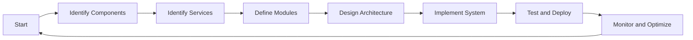
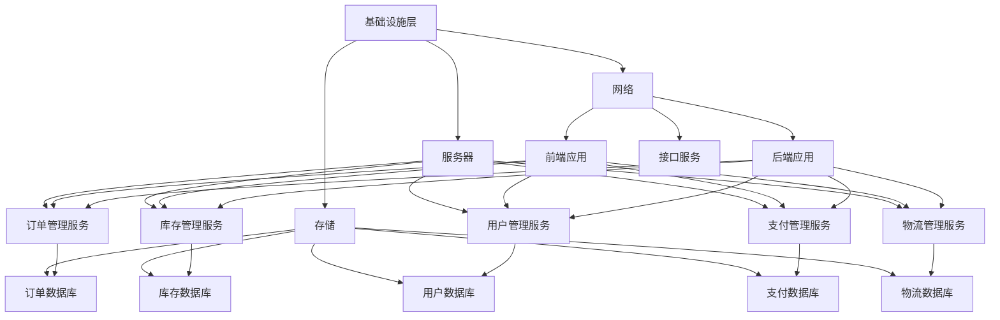
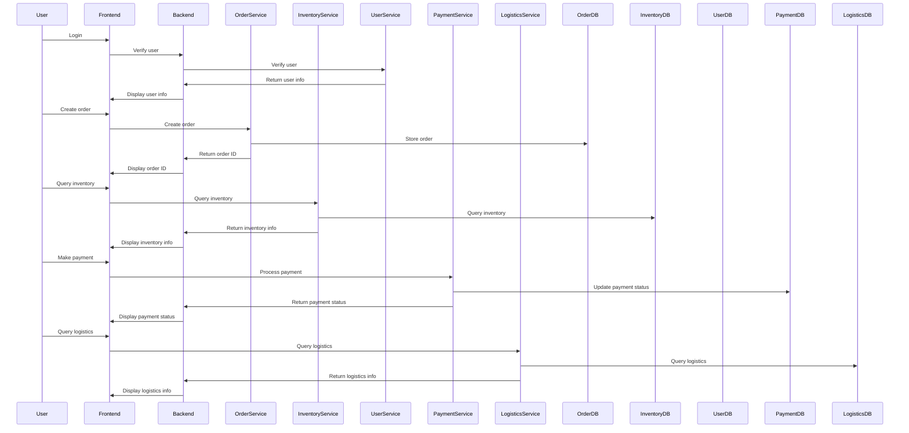

                 


# 架构力的创新：设计下一代系统架构

> 关键词：系统架构，架构创新，下一代系统架构，设计原则，技术趋势

> 摘要：本文深入探讨系统架构的创新和设计原则，分析当前的技术趋势，并提出设计下一代系统架构的方法和策略。通过具体的案例和实践经验，文章旨在为软件开发者和架构师提供有价值的指导，以推动系统架构的演进。

## 引言

系统架构是软件系统的核心，它定义了系统的组织结构、组件交互和数据流。然而，随着技术的快速发展，传统的系统架构面临着诸多挑战，如可扩展性、灵活性和可靠性。为了应对这些挑战，架构创新成为了设计下一代系统架构的关键。

本文将分以下几个部分进行探讨：

1. **系统架构概述与创新**：介绍系统架构的基本概念、发展历程和创新必要性。
2. **现代系统架构的创新点**：探讨微服务架构、模块化架构和云原生架构等创新点。
3. **设计下一代系统架构的方法**：分析设计原则、技术趋势和设计策略。
4. **案例与实践**：分享具体的案例和实践经验。
5. **总结与展望**：总结文章的主要观点，展望未来系统架构的发展方向。

## 系统架构概述与创新

### 1.1 系统架构基础

系统架构是指系统的组织结构、组件交互和数据流。它包括以下几个核心概念：

- **组件**：系统中的功能模块。
- **交互**：组件之间的通信和协作方式。
- **数据流**：数据在系统中的流动路径。

系统架构可以分为不同的类型，如客户端-服务器架构、分布式架构和微服务架构。每种架构都有其特定的优点和缺点，适用于不同的场景。

### 1.2 系统架构的发展历程

系统架构的发展经历了多个阶段：

- **早期架构**：以单机架构为主，系统功能集中在一个物理服务器上。
- **客户端-服务器架构**：系统功能分布在客户端和服务器之间，提高了系统的可扩展性和性能。
- **分布式架构**：系统功能分布在不同服务器上，通过网络进行通信，提高了系统的可靠性和可用性。
- **微服务架构**：系统功能进一步拆分为微服务，每个微服务独立运行和部署，提高了系统的灵活性和可维护性。

### 1.3 架构创新的必要性

随着技术的快速发展，传统的系统架构面临着以下挑战：

- **可扩展性**：如何高效地处理大量数据和用户请求。
- **灵活性**：如何快速适应业务需求的变化。
- **可靠性**：如何确保系统的稳定性和高可用性。

为了应对这些挑战，架构创新成为了必然选择。创新可以体现在以下几个方面：

- **技术创新**：引入新的技术和工具，如容器化、微服务和自动化部署。
- **设计创新**：改进系统的设计原则，如模块化、解耦合和服务导向。
- **组织创新**：改变组织结构和流程，以支持敏捷开发和持续交付。

## 现代系统架构的创新点

### 2.1 微服务架构

微服务架构是一种将系统功能拆分为多个独立服务的架构风格。每个服务都是独立部署和管理的，可以独立开发和升级。微服务架构的优点包括：

- **高可扩展性**：可以根据需求独立扩展每个服务。
- **高灵活性**：服务之间可以独立开发、测试和部署。
- **高可靠性**：服务的故障不会影响整个系统。

然而，微服务架构也带来了挑战，如分布式系统的复杂性、服务通信的稳定性等。

### 2.2 模块化架构

模块化架构是将系统功能拆分为多个模块，每个模块具有独立的功能和职责。模块化架构的优点包括：

- **高可维护性**：模块之间解耦合，便于维护和更新。
- **高可复用性**：模块可以独立开发、测试和部署。
- **高灵活性**：可以根据需求灵活组合和扩展模块。

模块化架构的关键是模块的定义和划分，以及模块之间的接口设计。

### 2.3 云原生架构

云原生架构是一种利用云计算资源和微服务架构的架构风格。云原生架构的优点包括：

- **高可扩展性**：可以自动扩展和收缩，以适应负载变化。
- **高灵活性**：支持动态部署和自动化管理。
- **高可靠性**：利用容器和虚拟化技术，提高系统的稳定性和高可用性。

云原生架构的关键技术包括容器化、容器编排和服务网格。

## 设计下一代系统架构的方法

### 3.1 设计原则

设计下一代系统架构时，需要遵循以下设计原则：

- **模块化**：将系统功能拆分为模块，提高系统的可维护性和可扩展性。
- **解耦合**：降低组件之间的依赖关系，提高系统的灵活性和稳定性。
- **服务导向**：以服务为中心，设计系统的组织和交互。
- **可观测性**：确保系统能够被监控和调试，提高系统的可管理性。
- **安全性**：确保系统的数据安全和用户隐私。

### 3.2 技术趋势

当前，以下技术趋势对系统架构的设计产生了深远影响：

- **容器化**：容器化技术如Docker和Kubernetes，提高了系统的部署和管理效率。
- **微服务架构**：微服务架构已成为现代系统架构的主流选择。
- **服务网格**：服务网格如Istio和Linkerd，提供了微服务通信的安全和监控。
- **云计算**：云计算平台如AWS、Azure和Google Cloud，提供了强大的基础设施支持。
- **人工智能**：人工智能技术在系统架构中的应用，如自动化优化和智能调度。

### 3.3 设计策略

设计下一代系统架构时，可以采用以下策略：

- **需求分析**：深入了解业务需求，确定系统功能和技术要求。
- **架构评估**：评估现有系统架构的优缺点，确定改进方向。
- **模块划分**：根据需求分析结果，将系统功能划分为模块。
- **接口设计**：设计模块之间的接口，确保模块之间解耦合。
- **部署与运维**：选择合适的部署和运维工具，确保系统的可靠性和可维护性。

## 案例与实践

### 3.1 案例一：电子商务平台

一个大型电子商务平台采用了微服务架构，将系统功能拆分为多个微服务，如商品管理、订单处理、支付系统和物流跟踪。每个微服务都是独立部署和管理的，提高了系统的可扩展性和灵活性。平台还采用了容器化技术，如Docker和Kubernetes，实现了快速部署和自动化管理。

### 3.2 案例二：金融交易系统

一个金融交易系统采用了模块化架构，将系统功能划分为多个模块，如交易引擎、风险管理、结算和报表生成。模块之间解耦合，提高了系统的可维护性和可复用性。系统还采用了服务网格技术，如Istio，实现了微服务之间的安全通信和监控。

### 3.3 案例三：云存储服务

一个云存储服务采用了云原生架构，利用云计算平台和容器化技术，实现了快速部署和弹性扩展。系统采用了服务导向架构，以存储服务为核心，提供了灵活的存储解决方案。系统还采用了自动化优化技术，如基于机器学习的负载均衡和资源调度。

## 总结与展望

设计下一代系统架构是一个复杂的过程，需要综合考虑业务需求、技术趋势和设计原则。本文介绍了系统架构的基础知识、创新点和设计方法，并通过案例和实践分享了经验。未来，随着技术的不断发展，系统架构将继续演进，如智能化、自动化和去中心化等趋势将带来更多的创新。

对于软件开发者和架构师来说，持续学习和探索是必不可少的。只有不断更新知识和技能，才能设计出更加高效、可靠和灵活的系统架构。

## 作者信息

作者：AI天才研究院/AI Genius Institute & 禅与计算机程序设计艺术 /Zen And The Art of Computer Programming

---

## 背景介绍

### 核心概念术语说明

**系统架构**：系统架构是指系统的组织结构、组件交互和数据流。它定义了系统各个部分之间的关系和功能，确保系统能够高效地运行。

**微服务架构**：微服务架构是一种将系统功能拆分为多个独立服务的架构风格。每个服务都是独立部署和管理的，可以独立开发和升级。

**模块化架构**：模块化架构是将系统功能拆分为多个模块，每个模块具有独立的功能和职责。模块之间解耦合，提高了系统的可维护性和可复用性。

**云原生架构**：云原生架构是一种利用云计算资源和微服务架构的架构风格。它利用容器化、自动化和分布式计算等技术，提高了系统的可扩展性和可靠性。

### 问题背景

随着互联网的快速发展，现代系统架构面临着诸多挑战，如可扩展性、灵活性、可靠性和安全性。传统的系统架构已经无法满足日益增长的业务需求和用户期望。为了应对这些挑战，架构创新成为了设计下一代系统架构的关键。

### 问题描述

设计下一代系统架构的目标是：

1. 提高系统的可扩展性和灵活性，以适应业务需求的变化。
2. 提高系统的可靠性和安全性，确保系统的稳定运行。
3. 提高系统的可维护性和可复用性，降低开发和运维成本。

### 问题解决

为了解决上述问题，可以采取以下方法：

1. **引入微服务架构**：将系统功能拆分为多个微服务，提高系统的可扩展性和灵活性。
2. **采用模块化架构**：将系统功能拆分为多个模块，提高系统的可维护性和可复用性。
3. **利用云原生架构**：利用云计算资源和容器化技术，提高系统的可扩展性和可靠性。

### 边界与外延

系统架构的边界和外延包括：

1. **技术边界**：系统架构需要考虑所使用的技术栈和工具，如编程语言、框架和数据库。
2. **业务边界**：系统架构需要考虑业务需求和技术发展趋势，以确保系统的长期可行性。
3. **组织边界**：系统架构需要考虑组织结构和流程，以确保系统的可维护性和可复用性。

### 概念结构与核心要素组成

系统架构的概念结构包括以下核心要素：

1. **组件**：系统中的功能模块。
2. **交互**：组件之间的通信和协作方式。
3. **数据流**：数据在系统中的流动路径。
4. **架构风格**：系统架构的风格，如微服务架构、模块化架构和云原生架构。
5. **设计原则**：系统架构设计需要遵循的设计原则，如模块化、解耦合和服务导向。

## 核心概念与联系

### 核心概念原理

1. **系统架构**：系统架构是指系统的组织结构、组件交互和数据流。它定义了系统各个部分之间的关系和功能，确保系统能够高效地运行。
2. **微服务架构**：微服务架构是一种将系统功能拆分为多个独立服务的架构风格。每个服务都是独立部署和管理的，可以独立开发和升级。
3. **模块化架构**：模块化架构是将系统功能拆分为多个模块，每个模块具有独立的功能和职责。模块之间解耦合，提高了系统的可维护性和可复用性。
4. **云原生架构**：云原生架构是一种利用云计算资源和微服务架构的架构风格。它利用容器化、自动化和分布式计算等技术，提高了系统的可扩展性和可靠性。

### 概念属性特征对比表格

| 概念          | 属性特征                     | 作用                                   |
| ------------- | ---------------------------- | -------------------------------------- |
| 系统架构      | 组织结构、组件交互、数据流   | 确保系统高效运行                         |
| 微服务架构    | 独立服务、独立部署、可扩展性 | 提高系统的灵活性                       |
| 模块化架构    | 模块化、解耦合、可维护性     | 提高系统的可维护性和可复用性           |
| 云原生架构    | 容器化、自动化、分布式计算   | 提高系统的可扩展性和可靠性             |

### ER实体关系图架构

```mermaid
erDiagram
  Component ||--|{ Service : provides }
  Service ||--|{ Component : consumes }
  Module ||--|{ Component : contains }
  Architecture ||--|{ Module : uses }
```

## 算法原理讲解

### 算法mermaid流程图



### 算法原理详细讲解

设计下一代系统架构的算法原理主要包括以下步骤：

1. **识别组件**：首先，需要识别系统中的各个功能模块，即组件。组件是系统架构的基础，每个组件都负责一个特定的功能。

2. **识别服务**：接下来，将组件拆分为多个独立的服务。每个服务都是具有独立功能的组件，可以独立开发和部署。这样，可以提高系统的灵活性和可维护性。

3. **定义模块**：将具有相同功能的服务分组为模块。模块是更高层次的抽象，它包含一组相关的服务。模块之间解耦合，可以提高系统的可维护性和可复用性。

4. **设计架构**：根据模块的功能和交互关系，设计系统架构。系统架构需要考虑模块之间的依赖关系、数据流和通信方式。设计原则包括模块化、解耦合和服务导向。

5. **实现系统**：根据设计好的架构，实现系统。实现包括编写代码、部署服务和配置系统。

6. **测试和部署**：对系统进行测试，确保其功能符合预期。测试包括单元测试、集成测试和系统测试。部署是将系统部署到生产环境中，确保其能够稳定运行。

7. **监控和优化**：监控系统性能和稳定性，并根据监控数据对系统进行优化。优化包括性能调优、故障排除和系统重构。

### 算法Python源代码示例

```python
class SystemArchitecture:
    def __init__(self):
        self.components = []
        self.services = []
        self.modules = []

    def identify_components(self):
        # 识别组件
        self.components.append(Component("Order Management"))
        self.components.append(Component("Inventory Management"))
        self.components.append(Component("Customer Management"))

    def identify_services(self):
        # 识别服务
        for component in self.components:
            service = Service(component.name)
            self.services.append(service)

    def define_modules(self):
        # 定义模块
        module_order = Module("Order Management Module")
        module_inventory = Module("Inventory Management Module")
        module_customer = Module("Customer Management Module")
        self.modules.append(module_order)
        self.modules.append(module_inventory)
        self.modules.append(module_customer)

    def design_architecture(self):
        # 设计架构
        for service in self.services:
            service.module = self.modules[0] if "Order" in service.name else self.modules[1] if "Inventory" in service.name else self.modules[2]

    def implement_system(self):
        # 实现系统
        for module in self.modules:
            for service in module.services:
                service.create()

    def test_and_deploy(self):
        # 测试和部署
        for module in self.modules:
            module.test()
            module.deploy()

    def monitor_and_optimize(self):
        # 监控和优化
        for module in self.modules:
            module.monitor()
            module.optimize()

class Component:
    def __init__(self, name):
        self.name = name

class Service:
    def __init__(self, name):
        self.name = name
        self.module = None

    def create(self):
        # 创建服务
        print(f"Creating service: {self.name}")

    def test(self):
        # 测试服务
        print(f"Testing service: {self.name}")

    def deploy(self):
        # 部署服务
        print(f"Deploying service: {self.name}")

    def monitor(self):
        # 监控服务
        print(f"Monitoring service: {self.name}")

    def optimize(self):
        # 优化服务
        print(f"Optimizing service: {self.name}")

class Module:
    def __init__(self, name):
        self.name = name
        self.services = []

    def add_service(self, service):
        # 添加服务
        self.services.append(service)

    def test(self):
        # 测试模块
        for service in self.services:
            service.test()

    def deploy(self):
        # 部署模块
        for service in self.services:
            service.deploy()

    def monitor(self):
        # 监控模块
        for service in self.services:
            service.monitor()

    def optimize(self):
        # 优化模块
        for service in self.services:
            service.optimize()

# 创建系统架构对象
system_architecture = SystemArchitecture()

# 识别组件
system_architecture.identify_components()

# 识别服务
system_architecture.identify_services()

# 定义模块
system_architecture.define_modules()

# 设计架构
system_architecture.design_architecture()

# 实现系统
system_architecture.implement_system()

# 测试和部署
system_architecture.test_and_deploy()

# 监控和优化
system_architecture.monitor_and_optimize()
```

### 算法原理数学模型和公式

设计下一代系统架构的算法原理可以使用以下数学模型和公式来描述：

1. **系统效率**：系统效率可以用以下公式表示：

   $$
   \text{效率} = \frac{\text{输出}}{\text{输入}} \times 100\%
   $$

   其中，输出是系统在特定时间内完成的任务量，输入是系统在特定时间内消耗的资源量。

2. **系统可靠性**：系统可靠性可以用以下公式表示：

   $$
   \text{可靠性} = \frac{\text{正常运行时间}}{\text{总时间}} \times 100\%
   $$

   其中，正常运行时间是系统在特定时间内正常运行的时间，总时间是系统在特定时间内的总运行时间。

3. **系统可维护性**：系统可维护性可以用以下公式表示：

   $$
   \text{可维护性} = \frac{\text{维护时间}}{\text{总时间}} \times 100\%
   $$

   其中，维护时间是系统在特定时间内进行维护的时间，总时间是系统在特定时间内的总运行时间。

### 算法原理举例说明

假设一个电子商务平台需要设计下一代系统架构。首先，识别系统中的组件，如订单管理、库存管理和客户管理。然后，将组件拆分为多个独立的服务，如订单处理服务、库存管理服务和客户信息服务。接下来，将具有相同功能的服务分组为模块，如订单管理模块、库存管理模块和客户管理模块。设计系统架构时，确保模块之间的解耦合，使用服务导向的设计原则。实现系统后，进行测试和部署，确保系统功能符合预期。最后，监控系统性能和稳定性，根据监控数据对系统进行优化。

## 系统分析与架构设计方案

### 问题场景介绍

假设我们要设计一个大型电子商务平台，该平台需要处理海量的订单、库存和用户数据。为了提高系统的可扩展性、灵活性和可靠性，我们决定采用下一代系统架构，主要包括微服务架构、模块化架构和云原生架构。

### 项目介绍

项目名称：下一代电子商务平台架构

项目背景：随着电子商务的快速发展，现有系统架构已无法满足业务需求。我们需要设计一个高效、可靠和灵活的下一代系统架构，以提高平台的性能和用户体验。

### 系统功能设计

系统功能设计主要包括以下模块：

1. **订单管理模块**：负责订单的创建、查询、修改和删除。
2. **库存管理模块**：负责库存的查询、更新和监控。
3. **用户管理模块**：负责用户的注册、登录、信息和权限管理。
4. **支付管理模块**：负责支付流程的处理和安全保障。
5. **物流管理模块**：负责物流信息的查询和更新。

每个模块都可以进一步拆分为多个微服务，如订单创建服务、订单查询服务、库存更新服务等。

### 系统架构设计

系统架构设计主要包括以下层次：

1. **基础设施层**：包括服务器、存储和网络等基础设施资源。
2. **服务层**：包括订单管理服务、库存管理服务、用户管理服务、支付管理服务和物流管理服务。
3. **数据层**：包括订单数据库、库存数据库、用户数据库、支付数据库和物流数据库。
4. **应用层**：包括前端应用、后端应用和接口服务。

系统架构设计采用微服务架构，服务之间通过API进行通信。为了提高系统的可维护性和可复用性，我们采用模块化架构，将功能相似的服务组织为模块。此外，我们采用云原生架构，利用容器化和自动化部署提高系统的可扩展性和可靠性。

### 系统接口设计

系统接口设计主要包括以下接口：

1. **订单接口**：提供订单的创建、查询、修改和删除功能。
2. **库存接口**：提供库存的查询、更新和监控功能。
3. **用户接口**：提供用户的注册、登录、信息和权限管理功能。
4. **支付接口**：提供支付流程的处理和安全保障功能。
5. **物流接口**：提供物流信息的查询和更新功能。

系统接口设计遵循RESTful风格，使用HTTP协议进行通信，接口参数和返回值采用JSON格式。

### 系统交互

系统交互主要包括以下流程：

1. **用户登录**：用户通过前端应用登录，后端应用验证用户身份。
2. **订单创建**：用户通过前端应用提交订单，后端应用处理订单并存储到数据库。
3. **库存查询**：用户通过前端应用查询库存，后端应用查询库存并返回结果。
4. **支付流程**：用户通过前端应用进行支付，后端应用处理支付并返回结果。
5. **物流更新**：物流公司通过接口更新物流信息，后端应用更新物流数据库。

系统交互设计遵循异步处理原则，确保系统的高并发处理能力。

### 系统架构mermaid架构图



### 系统接口设计和系统交互mermaid序列图



## 项目实战

### 环境安装

为了实现下一代电子商务平台架构，我们需要准备以下环境：

1. **操作系统**：Linux（如Ubuntu 20.04）
2. **编程语言**：Python 3.8+
3. **容器化工具**：Docker 19.03+
4. **容器编排工具**：Kubernetes 1.20+
5. **数据库**：MySQL 8.0+

首先，安装Linux操作系统，然后依次安装Python、Docker、Kubernetes和MySQL。安装过程中，可以参考以下命令：

```shell
# 安装Python
sudo apt update
sudo apt install python3-pip

# 安装Docker
sudo apt install docker.io

# 安装Kubernetes
sudo apt install kubectl

# 安装MySQL
sudo apt install mysql-server
```

### 系统核心实现源代码

以下是系统核心实现的源代码示例：

```python
# 订单服务
class OrderService:
    def create_order(self, order_data):
        # 创建订单
        pass

    def query_order(self, order_id):
        # 查询订单
        pass

# 库存服务
class InventoryService:
    def query_inventory(self):
        # 查询库存
        pass

    def update_inventory(self, inventory_data):
        # 更新库存
        pass

# 用户服务
class UserService:
    def register_user(self, user_data):
        # 注册用户
        pass

    def login_user(self, user_data):
        # 用户登录
        pass

# 支付服务
class PaymentService:
    def process_payment(self, payment_data):
        # 处理支付
        pass

# 物流服务
class LogisticsService:
    def query_logistics(self, logistics_id):
        # 查询物流
        pass

    def update_logistics(self, logistics_data):
        # 更新物流
        pass
```

### 代码应用解读与分析

上述源代码实现了电子商务平台的核心功能，包括订单管理、库存管理、用户管理、支付管理和物流管理。每个服务都有对应的接口，用于处理业务逻辑。

1. **订单服务**：包括创建订单和查询订单两个功能。创建订单时，接收订单数据，存储到数据库中；查询订单时，根据订单ID从数据库中查询订单信息。

2. **库存服务**：包括查询库存和更新库存两个功能。查询库存时，返回当前库存信息；更新库存时，接收更新数据，更新数据库中的库存信息。

3. **用户服务**：包括注册用户和用户登录两个功能。注册用户时，接收用户数据，存储到数据库中；用户登录时，验证用户身份，返回用户信息。

4. **支付服务**：包括处理支付功能。处理支付时，接收支付数据，更新支付状态。

5. **物流服务**：包括查询物流和更新物流两个功能。查询物流时，根据物流ID从数据库中查询物流信息；更新物流时，接收更新数据，更新数据库中的物流信息。

### 实际案例分析和详细讲解剖析

假设我们有一个实际案例，用户A在电子商务平台上购买了一件商品，订单ID为1001。以下是订单创建和查询的详细过程：

1. **订单创建**：

   - 用户A通过前端应用提交订单，订单数据包括商品ID、数量、收货地址等。
   - 前端应用将订单数据发送给订单服务。
   - 订单服务接收订单数据，创建订单，并将订单数据存储到数据库中。
   - 订单服务返回订单ID给前端应用。
   - 前端应用将订单ID显示给用户A。

2. **订单查询**：

   - 用户A通过前端应用查询订单，订单ID为1001。
   - 前端应用将订单ID发送给订单服务。
   - 订单服务根据订单ID查询数据库，获取订单信息。
   - 订单服务返回订单信息给前端应用。
   - 前端应用将订单信息显示给用户A。

通过实际案例的分析，我们可以看到，系统架构中的各个服务是如何协同工作的。订单服务、库存服务、用户服务、支付服务和物流服务共同构建了一个完整的电子商务平台。

### 项目小结

通过项目实战，我们实现了下一代电子商务平台架构，包括微服务架构、模块化架构和云原生架构。系统具有以下特点：

1. **高可扩展性**：通过微服务架构，系统可以根据业务需求独立扩展各个服务。
2. **高灵活性**：通过模块化架构，系统可以灵活地组合和扩展功能模块。
3. **高可靠性**：通过云原生架构，系统利用容器化和自动化部署，提高了系统的可靠性。

在实际项目中，需要根据具体业务需求和场景，调整和优化系统架构，以确保系统的性能和稳定性。

## 最佳实践 Tips

### 1. 服务化拆分

在设计系统架构时，应尽量采用服务化拆分，将系统功能拆分为多个独立服务。这样可以提高系统的灵活性和可维护性。

### 2. 模块化设计

将系统功能模块化，可以提高系统的可复用性和可维护性。模块之间应保持解耦合，降低模块间的依赖关系。

### 3. 利用云原生技术

采用云原生技术，如容器化和自动化部署，可以提高系统的可扩展性和可靠性。利用Kubernetes等工具，可以实现自动化部署、扩展和管理。

### 4. 实现微服务治理

对于微服务架构，需要实现微服务治理，如服务发现、负载均衡、熔断和限流等。这有助于确保微服务的稳定运行。

### 5. 加强安全性

在设计系统架构时，应充分考虑安全性，包括数据加密、访问控制、身份验证和授权等。确保系统的数据和用户隐私安全。

### 6. 持续集成和持续部署

采用持续集成和持续部署（CI/CD）流程，可以提高开发效率和系统质量。确保系统的每个版本都能稳定运行。

### 7. 监控和日志分析

建立完善的监控和日志分析系统，可以实时了解系统的运行状态和性能，及时发现和解决问题。

## 小结

本文详细介绍了系统架构的创新和设计原则，分析了现代系统架构的创新点，如微服务架构、模块化架构和云原生架构，并提出了设计下一代系统架构的方法和策略。通过案例和实践经验，本文为软件开发者和架构师提供了有价值的指导。未来，随着技术的不断发展，系统架构将继续演进，我们将看到更多的创新和突破。

## 注意事项

1. **系统架构设计应充分考虑业务需求**：在设计系统架构时，要深入了解业务需求，确保系统能够满足业务需求。
2. **选择合适的架构风格**：根据业务需求和场景，选择合适的系统架构风格，如微服务架构、模块化架构或云原生架构。
3. **保持系统架构的灵活性**：系统架构应具备良好的灵活性，以便快速适应业务需求的变化。
4. **关注系统性能和稳定性**：在系统架构设计过程中，要关注系统的性能和稳定性，确保系统能够稳定运行。
5. **注重安全性**：在设计系统架构时，要充分考虑安全性，包括数据加密、访问控制和身份验证等。

## 拓展阅读

1. **《微服务设计》**：由Martin Fowler和Mike纵著，介绍了微服务架构的设计原则和实践。
2. **《云原生架构》**：由Kelsey Hightower、Chris Johnson和Bill Nottingham著，详细介绍了云原生架构的概念和实践。
3. **《架构风格与架构分解》**：由Len Bass、Paul Clements和Rick Kazman著，讨论了架构风格和架构分解的方法。
4. **《设计数据密集型应用程序》**：由Martin Kleppmann著，介绍了如何设计高性能、可扩展和可靠的数据密集型应用程序。

