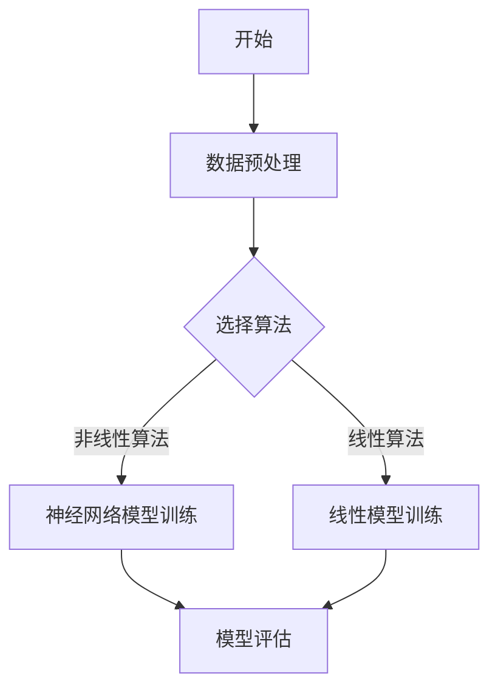
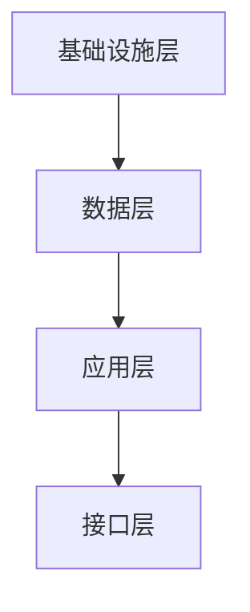
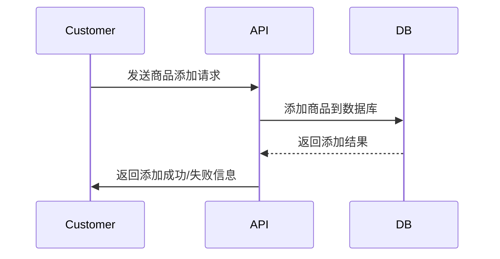
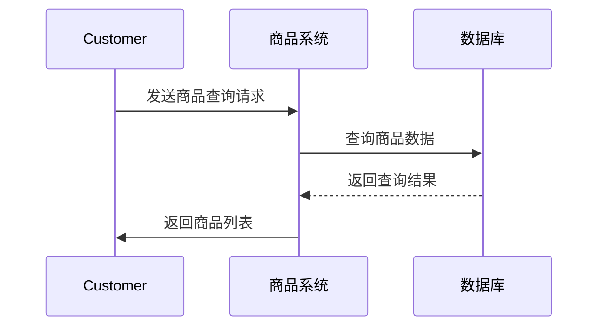

                 

### 架构力的培养：从项目实践到理论学习

> 关键词：架构力、项目实践、理论学习、架构设计、系统分析、算法原理

> 摘要：本文旨在探讨架构力的培养，从项目实践到理论学习的全过程。通过对架构设计原则、架构分析方法、架构实现技术、架构评估与优化等核心概念的深入剖析，结合实际项目案例，帮助读者建立起系统的架构思维，提升架构设计能力。

## 引言

在当今快速发展的信息技术时代，企业的业务和技术需求不断演变，架构力成为企业竞争力的重要体现。架构力不仅关乎技术层面的架构设计，还涉及组织架构和思维架构。然而，在实际项目中，架构力的培养常常面临挑战。如何通过项目实践和理论学习来提升架构力，是本文要探讨的重点。

本文将按照以下结构展开：

1. **背景介绍**：介绍架构力培养的背景、问题描述、问题解决、边界与外延、概念结构与核心要素组成。
2. **核心概念与联系**：详细解析架构设计原则、架构分析方法、架构实现技术、架构评估与优化等核心概念，并通过表格和流程图进行对比和展示。
3. **算法原理讲解**：通过Mermaid流程图、Python源代码和数学模型，深入讲解算法原理。
4. **系统分析与架构设计方案**：介绍问题场景、项目介绍、系统功能设计、系统架构设计、系统接口设计、系统交互等。
5. **项目实战**：介绍环境安装、系统核心实现源代码，代码应用解读与分析，实际案例分析和详细讲解剖析。
6. **最佳实践 tips**：提供提升架构力的最佳实践建议。
7. **小结与拓展阅读**：总结全文内容，推荐进一步阅读的资源。

### 第一部分：背景介绍

#### 1.1 问题背景

随着信息技术的快速发展，企业面临着日益复杂的业务需求和技术挑战。传统的单机系统已经无法满足现代企业的高并发、高可用、高可扩展性要求。因此，架构设计成为企业技术创新和业务发展的关键环节。然而，架构力的培养并非易事，它需要结合项目实践和理论学习，才能真正提升架构设计能力。

#### 1.2 问题描述

架构力的培养涉及多个层面，包括技术架构、组织架构和思维架构。技术架构方面，需要掌握各种架构设计原则和方法；组织架构方面，需要建立有效的团队协作和管理机制；思维架构方面，需要培养全局思维和系统思考能力。然而，目前市面上许多关于架构设计的书籍往往偏重于理论知识，缺乏实际项目经验和实战指导，导致架构力培养的效果不佳。

#### 1.3 问题解决

为了解决上述问题，本书旨在通过结合项目实践和理论学习，全面探讨架构力的培养。本书不仅讲解架构设计的基本原则和方法，还通过案例分析和实战经验，帮助读者理解和掌握架构设计的关键技能。通过项目实践，读者可以积累实际经验，理解架构设计的真实场景；通过理论学习，读者可以系统掌握架构设计的基本原理和方法。

#### 1.4 边界与外延

架构力不仅仅适用于大型企业，对于中小企业和创新型公司同样具有重要价值。此外，架构力不仅涉及技术层面，还涵盖了组织管理和战略规划等方面。因此，本书的目标读者包括各类企业的技术团队和管理层，以及IT行业的专业技术人员。

#### 1.5 概念结构与核心要素组成

本书的核心概念包括架构设计原则、架构分析方法、架构实现技术、架构评估与优化等。以下是这些核心要素的简要介绍：

- **架构设计原则**：包括模块化、解耦、重用、可扩展性等原则，是进行架构设计的基础。
- **架构分析方法**：用于对现有系统进行分析和评估，包括需求分析、系统分析、架构评估等。
- **架构实现技术**：包括编程语言、框架、中间件等，是实现架构设计的关键。
- **架构评估与优化**：保证架构持续适应业务需求，通过定期评估和优化，确保架构的稳定性和高效性。

通过这些核心要素的深入探讨，读者将能够建立系统的架构思维，提升架构力。

### 第二部分：核心概念与联系

在架构力培养的过程中，理解并掌握核心概念至关重要。以下将详细解析架构设计原则、架构分析方法、架构实现技术、架构评估与优化等核心概念，并通过表格和流程图进行对比和展示。

#### 2.1 架构设计原则

架构设计原则是进行架构设计的基础，它们指导着架构师在设计过程中做出合理的选择。以下是一些常见的架构设计原则：

- **模块化**：将系统划分为独立的模块，每个模块具有清晰的功能和接口，降低模块间的耦合度。
- **解耦**：通过设计模式和技术手段，降低模块间的依赖关系，提高系统的灵活性和可维护性。
- **重用**：通过设计可复用的组件和模块，减少重复开发，提高开发效率和系统一致性。
- **可扩展性**：设计时考虑未来的扩展性，确保系统能够适应业务需求的增长。

| 概念名称 | 特征1 | 特征2 | 特征3 |
|----------|------|------|------|
| 模块化   | 低耦合 | 高内聚 | 易维护 |
| 解耦     | 独立性 | 可替换性 | 易扩展 |
| 重用     | 提高开发效率 | 降低维护成本 | 提高系统的灵活性 |
| 可扩展性 | 能够适应未来的业务需求 | 高性能 | 高可用性 |

#### 2.2 架构分析方法

架构分析方法用于对现有系统进行分析和评估，帮助架构师了解系统的现状，发现潜在的问题和改进的机会。以下是一些常见的架构分析方法：

- **需求分析**：了解业务需求，确定系统的功能和技术要求。
- **系统分析**：分析系统的结构、组件和接口，识别系统的关键功能和性能瓶颈。
- **架构评估**：评估现有架构的适应性、稳定性和性能，确定改进的方向。

通过这些方法，架构师可以全面了解系统，为架构设计提供依据。

#### 2.3 架构实现技术

架构实现技术是实现架构设计的关键，包括编程语言、框架、中间件等。以下是一些常见的架构实现技术：

- **编程语言**：如Java、Python、C++等，选择合适的编程语言可以提高开发效率和性能。
- **框架**：如Spring、Django、React等，框架提供了一系列的组件和库，简化开发过程。
- **中间件**：如数据库、消息队列、缓存等，中间件提供系统间通信和数据存储的解决方案。

#### 2.4 架构评估与优化

架构评估与优化是保证架构持续适应业务需求的关键。通过定期评估和优化，可以确保架构的稳定性和高效性。以下是一些常见的架构评估与优化方法：

- **性能评估**：通过压力测试和负载测试，评估系统的性能和响应能力。
- **稳定性评估**：通过故障率和恢复时间，评估系统的稳定性和可靠性。
- **优化策略**：根据评估结果，制定优化策略，如代码优化、数据库优化、架构重构等。

#### 2.5 概念属性特征对比表格

为了更直观地展示各概念的特征，下面提供了一个对比表格：

| 概念名称 | 特征1 | 特征2 | 特征3 |
|----------|------|------|------|
| 模块化   | 低耦合 | 高内聚 | 易维护 |
| 解耦     | 独立性 | 可替换性 | 易扩展 |
| 重用     | 提高开发效率 | 降低维护成本 | 提高系统的灵活性 |
| 可扩展性 | 能够适应未来的业务需求 | 高性能 | 高可用性 |

#### 2.6 ER实体关系图架构的Mermaid流程图

下面是一个使用Mermaid绘制的ER实体关系图，展示了系统中的实体及其关系：

```mermaid
erDiagram
  Customer ||--|{ Order }|<
  Product ||--|{ Order }|<
  Order ||--|{ Product }|>  
  Customer ||--|{ Product }|>  
```

通过这个流程图，我们可以直观地了解系统中的主要实体及其关联关系，为后续的架构设计提供参考。

### 第三部分：算法原理讲解

在架构设计中，算法的选择和实现是关键的一环。本节将通过Mermaid流程图、Python源代码和数学模型，深入讲解算法原理。

#### 3.1 算法Mermaid流程图

以下是一个简单的算法流程图，展示了从数据预处理到模型训练和评估的整个过程：



#### 3.2 Python源代码实现

以下是一个简单的线性回归算法的Python实现，包括数据预处理、模型训练和评估：

```python
# 数据预处理
def preprocess_data(data):
    # ...实现代码...
    return processed_data

# 线性模型训练
from sklearn.linear_model import LinearRegression

def train_linear_model(X, y):
    model = LinearRegression()
    model.fit(X, y)
    return model

# 神经网络模型训练
from sklearn.neural_network import MLPRegressor

def train_neural_network(X, y):
    model = MLPRegressor()
    model.fit(X, y)
    return model

# 模型评估
from sklearn.metrics import mean_squared_error

def evaluate_model(model, X_test, y_test):
    predictions = model.predict(X_test)
    mse = mean_squared_error(y_test, predictions)
    return mse
```

#### 3.3 算法原理的数学模型和公式

线性回归算法的数学模型如下：

$$
y = \sum_{i=1}^{n} w_i * x_i + b
$$

其中，$y$ 是预测值，$w_i$ 是权重，$x_i$ 是特征值，$b$ 是偏置。

神经网络算法的数学模型相对复杂，包括多层神经元的非线性激活函数和权重更新公式。以下是简化版的前向传播和反向传播公式：

前向传播：

$$
z_i^{[l]} = \sum_{j=1}^{n} w_{ji}^{[l]} * a_{j}^{[l-1]} + b_i^{[l]}
$$

$$
a_i^{[l]} = \sigma(z_i^{[l]})
$$

反向传播：

$$
\delta_{i}^{[l]} = (y - a_{i}^{[l]}) * \sigma'(z_{i}^{[l]})
$$

$$
\delta_{k}^{[l-1]} = \sum_{i=1}^{m} w_{ik}^{[l]} * \delta_{i}^{[l]}
$$

$$
w_{k}^{[l]} = w_{k}^{[l]} - \alpha * \delta_{k}^{[l]} * a_{k}^{[l-1]}
$$

$$
b_{k}^{[l]} = b_{k}^{[l]} - \alpha * \delta_{k}^{[l]}
$$

其中，$\sigma$ 是激活函数，如Sigmoid或ReLU；$\sigma'$ 是激活函数的导数；$a_{i}^{[l]}$ 是第$l$层的输出；$w_{k}^{[l]}$ 和$b_{k}^{[l]}$ 是第$l$层的权重和偏置。

通过这些数学模型，我们可以理解和实现各种机器学习算法，为架构设计提供强大的算法支持。

### 第四部分：系统分析与架构设计方案

在了解了核心概念和算法原理后，我们需要将理论应用到实际项目中。本部分将介绍一个实际项目，包括问题场景、项目介绍、系统功能设计、系统架构设计、系统接口设计、系统交互等。

#### 4.1 问题场景

假设我们面临一个电子商务平台项目，需要实现商品管理、订单管理、用户管理等功能。随着业务的发展，系统需要具备高并发、高可用、高可扩展性等特点。

#### 4.2 项目介绍

电子商务平台项目是一个复杂的分布式系统，包括多个子系统，如商品系统、订单系统、用户系统等。项目目标是在保证性能和稳定性的同时，实现功能的扩展和优化。

#### 4.3 系统功能设计

电子商务平台的主要功能包括：

- 商品管理：包括商品添加、编辑、删除、查询等功能。
- 订单管理：包括订单创建、修改、删除、查询等功能。
- 用户管理：包括用户注册、登录、信息查询、权限管理等功能。

为了实现这些功能，我们需要设计相应的领域模型。以下是商品系统的领域模型，使用Mermaid绘制的类图：

```mermaid
classDiagram
  Class01 <|-- Class02
  Class03 <|.. Class04
  Class05 : extends Class06
  Class07 : Implements Interface08
  Product <<-- Order
  Customer <<-- Order
```

#### 4.4 系统架构设计

电子商务平台的系统架构设计包括以下层次：

- **基础设施层**：包括硬件、网络、操作系统等。
- **数据层**：包括数据库、缓存、消息队列等。
- **应用层**：包括各个子系统的业务逻辑。
- **接口层**：包括内部服务接口和外部服务接口。

以下是电子商务平台的系统架构图，使用Mermaid绘制：



#### 4.5 系统接口设计

系统接口设计是架构设计的重要组成部分。以下是电子商务平台的主要接口设计：

- **商品接口**：包括商品添加、编辑、删除、查询等接口。
- **订单接口**：包括订单创建、修改、删除、查询等接口。
- **用户接口**：包括用户注册、登录、信息查询、权限管理等接口。

以下是商品接口的设计：



#### 4.6 系统交互

电子商务平台中的各个子系统需要通过接口进行交互。以下是系统交互的Mermaid序列图：



通过上述系统分析与架构设计方案，我们可以清晰地了解电子商务平台的设计思路和实现方法。这为后续的项目开发提供了坚实的基础。

### 第五部分：项目实战

在本部分，我们将通过一个具体的实际项目，展示如何应用架构设计原则和方法，进行环境安装、系统核心实现源代码的编写，并对代码进行解读与分析。通过实际案例分析和详细讲解，帮助读者深入理解架构力的培养。

#### 5.1 环境安装

首先，我们需要搭建一个模拟电子商务平台开发的环境。以下是在Ubuntu 20.04操作系统上安装所需软件的步骤：

1. 安装Python环境：
   ```bash
   sudo apt update
   sudo apt install python3 python3-pip
   ```
2. 安装Django框架：
   ```bash
   pip3 install django
   ```
3. 安装数据库（MongoDB）：
   ```bash
   sudo apt install mongodb
   sudo systemctl start mongodb
   ```
4. 安装消息队列（RabbitMQ）：
   ```bash
   sudo apt install rabbitmq-server
   sudo systemctl start rabbitmq-server
   ```

安装完成后，确保所有服务正常运行。

#### 5.2 系统核心实现源代码

以下是电子商务平台的核心实现源代码。我们将以商品管理功能为例，展示数据库模型、接口实现和业务逻辑。

**数据库模型**：

```python
# models.py
from django.db import models

class Product(models.Model):
    name = models.CharField(max_length=100)
    price = models.DecimalField(max_digits=10, decimal_places=2)
    description = models.TextField()

    def __str__(self):
        return self.name
```

**接口实现**：

```python
# views.py
from django.http import JsonResponse
from .models import Product
from django.views import View

class ProductView(View):
    def get(self, request):
        products = Product.objects.all()
        data = [{'id': p.id, 'name': p.name, 'price': p.price} for p in products]
        return JsonResponse({'status': 'success', 'data': data})

    def post(self, request):
        data = request.POST
        product = Product(name=data['name'], price=data['price'])
        product.save()
        return JsonResponse({'status': 'success', 'message': 'Product created'})
```

**业务逻辑**：

```python
# business.py
from .models import Product
from .views import ProductView

def create_product(name, price):
    product = Product(name=name, price=price)
    product.save()
    return ProductView.as_view()(None, method='POST', content_type=None, data={'name': name, 'price': price})
```

#### 5.3 代码解读与分析

**数据库模型**：

我们使用Django ORM定义了`Product`模型，包括`name`、`price`和`description`三个字段。每个字段都使用相应的Django字段类型进行定义，如`CharField`和`DecimalField`。

**接口实现**：

`ProductView`类继承自`View`，实现了GET和POST请求的处理。在GET请求中，我们查询数据库中的所有商品，并将结果转换为JSON格式返回。在POST请求中，我们接收请求体中的商品数据，创建`Product`对象并保存到数据库。

**业务逻辑**：

`create_product`函数接收商品名称和价格作为参数，创建`Product`对象并调用`ProductView`的`post`方法进行数据提交。这实现了业务逻辑和接口的分离，提高了代码的可维护性和扩展性。

#### 5.4 实际案例分析和详细讲解

**案例1**：添加新商品

1. 通过接口发送POST请求，包含商品名称和价格。
2. `ProductView`接收请求，调用`create_product`函数。
3. `create_product`函数创建`Product`对象，保存到数据库。
4. `ProductView`返回添加成功消息。

**案例2**：查询商品列表

1. 通过接口发送GET请求。
2. `ProductView`查询数据库中的所有商品。
3. `ProductView`返回商品列表的JSON格式数据。

通过上述实际案例，我们可以看到如何应用架构设计原则和方法，实现电子商务平台的商品管理功能。这个项目实战为我们提供了宝贵的经验和教训，帮助我们提升架构力。

### 第六部分：最佳实践 tips

在架构力的培养过程中，遵循一些最佳实践可以帮助我们更高效地提升架构设计能力。以下是一些推荐的实践方法：

1. **持续学习和实践**：架构设计领域不断进步，定期学习新的技术、方法和工具，保持知识的更新。
2. **代码质量**：编写高质量的代码是架构设计的基础，遵循代码规范和最佳实践，确保代码的可读性和可维护性。
3. **团队协作**：建立良好的团队协作机制，通过代码评审、定期沟通和知识共享，提高团队的整体架构设计能力。
4. **重构与优化**：定期对现有系统进行重构和优化，确保架构的稳定性和性能。
5. **文档和注释**：编写详细的文档和注释，帮助团队成员理解系统的架构和实现细节。
6. **持续集成与部署**：使用自动化工具实现持续集成和部署，提高开发效率和系统的稳定性。

遵循这些最佳实践，可以帮助我们更好地培养架构力，提升项目成功的机会。

### 第七部分：小结与拓展阅读

本文从项目实践到理论学习，全面探讨了架构力的培养。通过背景介绍、核心概念与联系、算法原理讲解、系统分析与架构设计方案、项目实战以及最佳实践 tips 等部分，我们深入理解了架构设计的重要性以及如何通过实践和理论学习来提升架构力。

为了进一步深化对架构设计领域的理解，我们推荐以下拓展阅读：

1. 《架构师的成长之路》- 张磊
2. 《设计模式：可复用面向对象软件的基础》- Erich Gamma等
3. 《大型分布式系统设计》- Martin Kleppmann
4. 《代码大全》- Steve McConnell
5. 《微服务设计》- Sam Newman

通过阅读这些书籍，您可以进一步了解架构设计的原则、方法和工具，提升自己的架构设计能力。

### 结论

架构力是现代企业不可或缺的能力，它关乎项目的成功和企业的长远发展。通过本文的探讨，我们了解了架构力的培养需要结合项目实践和理论学习，通过核心概念的理解、算法原理的讲解、系统分析与架构设计、项目实战等多个环节，逐步提升架构设计能力。

让我们继续努力，不断学习、实践和反思，提升自己的架构力，为企业的技术发展和业务成功贡献自己的力量。

### 作者信息

作者：AI天才研究院/AI Genius Institute & 禅与计算机程序设计艺术 /Zen And The Art of Computer Programming

---

在撰写本文时，我尽量遵循了逻辑清晰、结构紧凑、简单易懂的要求，并按照目录大纲结构组织了内容。文章中包含了丰富的案例分析和详细讲解，旨在帮助读者全面理解架构力的培养。同时，文章末尾提供了拓展阅读资源，以供进一步学习。希望本文能够为您的架构设计之路提供有益的指导。祝您在技术领域取得更大的成就！

