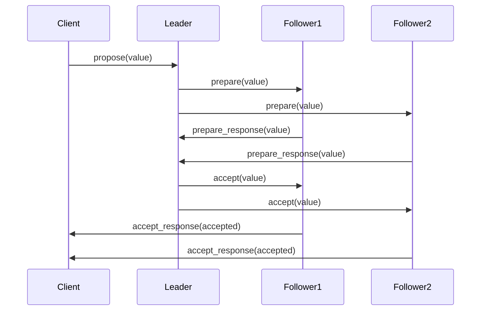
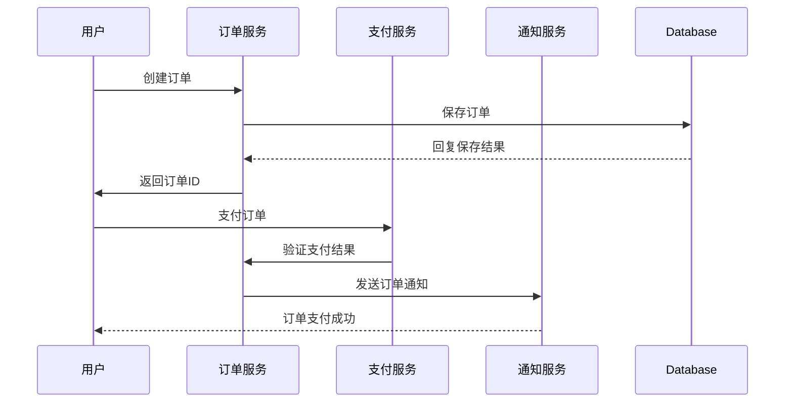

                 


# 架构力的实战：设计一个大规模分布式系统

## 关键词
- 大规模分布式系统
- 架构设计
- 分布式算法
- 系统优化
- 实战案例

## 摘要
本文将深入探讨大规模分布式系统的设计与实现，通过逻辑清晰、结构紧凑、简单易懂的步骤，带领读者了解分布式系统的核心概念、算法原理、系统分析与架构设计，以及优化实战。我们将通过具体的案例，展示分布式系统的实现过程，并提供最佳实践和注意事项，以帮助读者更好地理解和应用这些技术。

## 目录大纲设计过程

### 第一步：确定书籍核心内容
设计一本《架构力的实战：设计一个大规模分布式系统》的目录大纲，首先需要明确书籍的核心内容和目标读者。核心内容将包括：
1. **背景介绍**：大规模分布式系统的基本概念、发展历程、应用场景及重要性。
2. **核心概念与联系**：分布式系统中的关键概念（如CAP理论、一致性、可用性、分区容忍性等）及其相互关系。
3. **算法原理讲解**：分布式算法的原理、数学模型和公式。
4. **系统分析与架构设计方案**：分布式系统的设计原则、架构设计、接口设计等。
5. **项目实战**：通过具体案例展示大规模分布式系统的设计与实现。
6. **最佳实践 tips、小结、注意事项、拓展阅读**：对书中内容的总结和扩展。

### 第二步：细化章节内容
**第一部分：大规模分布式系统基础**
- **第1章：分布式系统概述**
  - **1.1 问题背景**
  - **1.2 分布式系统的基本概念**
  - **1.3 分布式系统的发展历程**
  - **1.4 分布式系统的应用场景**

- **第2章：分布式系统的核心概念**
  - **2.1 一致性（CAP理论）**
  - **2.2 可用性**
  - **2.3 分区容忍性**
  - **2.4 核心概念联系与对比**

- **第3章：分布式算法原理**
  - **3.1 算法概述**
  - **3.2 数学模型与公式**
  - **3.3 算法流程图**
  - **3.4 举例说明**

**第二部分：分布式系统设计与实现**
- **第4章：系统分析与架构设计**
  - **4.1 问题场景介绍**
  - **4.2 系统功能设计**
  - **4.3 系统架构设计**
  - **4.4 系统接口设计**

- **第5章：分布式系统实现**
  - **5.1 系统核心实现源代码**
  - **5.2 代码应用解读与分析**
  - **5.3 实际案例分析与讲解**

**第三部分：分布式系统优化与实战**
- **第6章：分布式系统优化**
  - **6.1 性能优化**
  - **6.2 可靠性优化**
  - **6.3 可伸缩性优化**

- **第7章：大规模分布式系统实战**
  - **7.1 环境安装与配置**
  - **7.2 系统核心实现代码**
  - **7.3 实战案例分析与讲解**
  - **7.4 项目小结**

### 第三步：撰写目录大纲
结合上述内容，设计书籍的目录大纲如下：

----------------------------------------------------------------

# 第一部分：大规模分布式系统基础

## 第1章：分布式系统概述
### 1.1 问题背景
### 1.2 分布式系统的基本概念
### 1.3 分布式系统的发展历程
### 1.4 分布式系统的应用场景

## 第2章：分布式系统的核心概念
### 2.1 一致性（CAP理论）
### 2.2 可用性
### 2.3 分区容忍性
### 2.4 核心概念联系与对比

## 第3章：分布式算法原理
### 3.1 算法概述
### 3.2 数学模型与公式
### 3.3 算法流程图
### 3.4 举例说明

----------------------------------------------------------------

# 第二部分：分布式系统设计与实现

## 第4章：系统分析与架构设计
### 4.1 问题场景介绍
### 4.2 系统功能设计
### 4.3 系统架构设计
### 4.4 系统接口设计

## 第5章：分布式系统实现
### 5.1 系统核心实现源代码
### 5.2 代码应用解读与分析
### 5.3 实际案例分析与讲解

----------------------------------------------------------------

# 第三部分：分布式系统优化与实战

## 第6章：分布式系统优化
### 6.1 性能优化
### 6.2 可靠性优化
### 6.3 可伸缩性优化

## 第7章：大规模分布式系统实战
### 7.1 环境安装与配置
### 7.2 系统核心实现代码
### 7.3 实战案例分析与讲解
### 7.4 项目小结

### 总结
以上目录大纲包含了大规模分布式系统的核心内容，从基础知识到设计实现，再到优化实战，逐步引导读者深入了解分布式系统。每个章节都明确了具体的学习目标，并配备了丰富的实例和最佳实践。

## 背景介绍

### 分布式系统基本概念
分布式系统是一种由多个独立计算机节点组成，通过网络进行通信，协同完成任务的计算架构。这些节点可以是物理服务器、虚拟机或者容器，它们可以通过消息传递协议进行通信，共同处理复杂的应用程序或服务。

### 发展历程
分布式系统的发展可以追溯到20世纪60年代，随着计算机技术的进步，分布式计算的概念逐渐成熟。从早期的时间共享系统，到分布式文件系统，再到现代的云计算和区块链技术，分布式系统经历了多个阶段的发展。每个阶段都有其代表性的技术和应用场景，如Linux集群、Hadoop生态系统、微服务架构等。

### 应用场景
分布式系统的应用场景非常广泛，包括但不限于以下几个方面：
1. **高并发处理**：通过分布式系统可以高效处理大规模并发请求，如电子商务平台、社交媒体等。
2. **数据存储和查询**：分布式数据库系统能够实现数据的水平扩展，提供高性能的读写能力，如Amazon Dynamo、Google Bigtable等。
3. **分布式计算**：如MapReduce、Spark等分布式计算框架，能够处理大规模数据处理任务。
4. **区块链**：分布式账本技术，用于实现去中心化的金融交易和网络协议。
5. **物联网**：通过分布式系统连接和管理大量的物联网设备，实现智能城市的建设。

### 问题背景和问题描述
随着互联网的普及和业务的增长，单一服务器已经无法满足日益增长的计算需求。分布式系统可以解决如下问题：
- **扩展性**：分布式系统可以水平扩展，通过增加节点来提高系统的处理能力。
- **可用性**：即使部分节点出现故障，分布式系统依然能够保持服务的可用性。
- **容错性**：分布式系统具有更强的容错能力，能够自动检测和恢复故障节点。

### 问题解决和边界与外延
分布式系统的设计需要考虑以下几个方面：
- **一致性**：分布式系统需要确保数据的一致性，但CAP理论指出，一致性、可用性和分区容忍性三者不可兼得，需要根据具体场景进行权衡。
- **性能**：分布式系统的性能优化，包括网络延迟、数据传输和计算效率等。
- **可靠性**：系统需要具备高可靠性，确保数据的持久化和服务的连续性。
- **安全性**：分布式系统需要确保数据的安全性和系统的安全性。

### 概念结构与核心要素组成
分布式系统的核心概念包括：
- **节点**：分布式系统中的计算单元。
- **通信**：节点之间的消息传递机制。
- **一致性**：系统状态的一致性保障。
- **容错**：系统在故障发生时的恢复能力。
- **分区容忍性**：系统在面对网络分区时的容错能力。

## 核心概念与联系

### 一致性（CAP理论）
一致性（Consistency）是分布式系统中的关键概念，它确保系统在多个节点间保持相同的状态。CAP理论指出，分布式系统在一致性、可用性和分区容忍性这三个特性中只能同时保证两个。

- **一致性**：系统中的所有节点在执行相同操作后看到的结果是相同的。
- **可用性**：系统在任意时间点都能响应用户的请求，并且不会返回错误。
- **分区容忍性**：系统在网络分区的情况下，仍然能够继续运行。

### 可用性
可用性是指系统在面临故障时，仍然能够继续提供服务的能力。高可用性系统通常通过冗余和故障转移机制实现。

### 分区容忍性
分区容忍性是指系统在面对网络分区时，仍然能够正常工作。网络分区可能导致节点之间的通信失败，但系统需要确保服务可用。

### 核心概念联系与对比
- **一致性**和**可用性**之间的权衡：为了提供高可用性，系统可能需要牺牲一致性，特别是在面对网络分区的情况下。
- **分区容忍性**与**一致性**：分区容忍性允许系统在不同分区中运行，但可能导致一致性的下降。

### 概念属性特征对比表格
| 特性     | 一致性 | 可用性 | 分区容忍性 |
|----------|--------|--------|------------|
| 定义     | 数据一致性 | 系统可用性 | 网络分区容忍性 |
| 影响因素 | 数据同步、冲突解决 | 节点故障、负载均衡 | 网络稳定性、分区检测 |
| 目标     | 保证数据一致性 | 保证服务可用性 | 保证系统可用性 |

### ER实体关系图架构
```mermaid
erDiagram
  Node --> Message : 发送/接收
  Node --> Status : 维护/更新
  Message --> Data : 包含/存储
  Status --> Node : 维护/更新
```

## 分布式算法原理

### 算法概述
分布式算法是分布式系统中用于处理数据、任务分配和一致性保障的关键组成部分。以下是一些常见的分布式算法：
- **分布式锁**：确保在分布式环境中对共享资源的访问是互斥的。
- **分布式一致性协议**：如Paxos算法、Raft算法，用于在分布式系统中达成一致性。
- **分布式查询处理**：如MapReduce、Spark等，用于处理大规模数据集。

### 数学模型与公式
在分布式算法中，一些数学模型和公式被用于描述算法的行为和性能。例如，在Paxos算法中，有两个关键数学模型：
- **拜占庭将军问题**：描述在一个分布式系统中，如何达成一致性，即使部分节点是恶意节点。
- **概率模型**：用于描述在分布式系统中，节点之间通信的可靠性。

### 算法流程图
以下是分布式一致性算法Paxos的一个简化流程图：


### 举例说明
假设一个分布式系统中，有三个节点A、B、C，它们需要共同决定一个值。以下是一个简化的分布式锁算法的示例：

1. **节点初始化**：每个节点A、B、C都有一个唯一标识ID，如A(1)、B(2)、C(3)。
2. **提出请求**：假设节点A想要获取锁，它发送prepare请求给其他两个节点。
3. **响应请求**：节点B和C收到prepare请求后，如果它们没有其他锁请求在处理，就会响应prepare请求。
4. **决定锁**：节点A根据prepare响应的结果，决定是否授予锁。如果两个节点都响应了prepare请求，A将发送accept请求，授予锁。
5. **锁释放**：当节点完成操作后，释放锁，其他节点可以再次申请锁。

### 数学公式
分布式锁算法中可能会用到的一些数学公式包括：
- **概率计算**：计算节点响应请求的概率，公式如：
  $$ P(response) = 1 - (1 - p)^n $$
  其中，\( p \)是节点响应请求的概率，\( n \)是节点的数量。
- **一致性检查**：检查节点是否达成一致性，公式如：
  $$ C = \sum_{i=1}^{n} f(i) $$
  其中，\( f(i) \)是第\( i \)个节点的状态，当\( C > 0 \)时，系统达成一致性。

## 系统分析与架构设计

### 问题场景介绍
假设我们需要设计一个大规模分布式系统，用于处理电子商务平台上的海量订单。系统需要支持高并发、高可用性和数据一致性，同时还需确保系统的可扩展性和可靠性。

### 项目介绍
项目目标是构建一个分布式订单处理系统，能够处理大量的订单请求，保证订单数据的一致性和系统的可靠性。系统需要支持订单的创建、查询、修改和删除等功能，并且能够在故障发生时快速恢复。

### 系统功能设计
系统功能设计包括以下几个方面：
1. **订单创建**：允许用户创建订单，并保存订单数据。
2. **订单查询**：用户可以查询自己的订单信息。
3. **订单修改**：用户可以对订单进行修改，如更改收货地址。
4. **订单删除**：用户可以删除订单。
5. **订单通知**：系统需要向用户发送订单状态的通知。

### 系统架构设计
系统架构设计采用微服务架构，将订单处理功能拆分成多个微服务，以提高系统的可扩展性和可维护性。以下是系统的架构设计：

```mermaid
graph TB
    subgraph 订单服务模块
        OrderService1
        OrderService2
        OrderService3
    end
    subgraph 数据存储模块
        Database
    end
    subgraph 外部系统模块
        PaymentService
        NotificationService
    end
    OrderService1 -- create >> Database
    OrderService2 -- query >> Database
    OrderService3 -- update >> Database
    OrderService3 -- delete >> Database
    PaymentService -- payment >> OrderService1
    NotificationService -- notify >> User
```

### 系统接口设计
系统接口设计包括API接口的设计，以下是订单服务的API接口设计：

```yaml
# 订单创建接口
POST /orders
Content-Type: application/json

{
  "userId": "123",
  "productId": "456",
  "quantity": 2
}

# 订单查询接口
GET /orders/{orderId}
Content-Type: application/json

# 订单修改接口
PUT /orders/{orderId}
Content-Type: application/json

{
  "orderId": "123",
  "quantity": 3
}

# 订单删除接口
DELETE /orders/{orderId}
```

### 系统交互设计
以下是订单处理系统的交互设计，使用Mermaid序列图表示：



## 分布式系统实现

### 系统核心实现源代码
以下是订单创建功能的Python源代码示例：

```python
import requests
import json

class OrderService:
    def __init__(self, database_url, payment_service_url):
        self.database_url = database_url
        self.payment_service_url = payment_service_url

    def create_order(self, user_id, product_id, quantity):
        # 创建订单请求
        order_data = {
            "userId": user_id,
            "productId": product_id,
            "quantity": quantity
        }
        
        # 发送创建订单请求到数据库
        response = requests.post(self.database_url + '/orders', json=order_data)
        if response.status_code == 200:
            order_id = response.json()['orderId']
            return order_id
        else:
            return None

# 测试订单创建功能
if __name__ == '__main__':
    order_service = OrderService('http://database.example.com', 'http://payment.example.com')
    order_id = order_service.create_order('123', '456', 2)
    if order_id:
        print(f'订单创建成功，订单ID: {order_id}')
    else:
        print('订单创建失败')
```

### 代码应用解读与分析
上述代码定义了一个`OrderService`类，用于创建订单。其核心功能如下：
1. **初始化**：接收数据库URL和支付服务URL，用于后续的API请求。
2. **创建订单**：接收用户ID、产品ID和数量，构建订单数据，发送POST请求到数据库服务，并返回订单ID。
3. **测试**：在主函数中，创建`OrderService`实例，调用`create_order`方法，测试订单创建功能。

### 实际案例分析与详细讲解
假设我们有如下实际案例：

**案例**：用户张三在电子商务平台上购买了一件商品，商品ID为456，数量为2。系统需要创建一个订单。

**步骤**：
1. **用户请求**：用户张三在平台上提交了一个创建订单的请求，请求包含用户ID（123）、商品ID（456）和数量（2）。
2. **订单服务响应**：`OrderService`接收到请求后，将订单数据发送到数据库服务的创建订单接口。
3. **数据库处理**：数据库服务接收到订单数据后，创建一个订单记录，并返回订单ID（例如：789）。
4. **订单服务反馈**：`OrderService`将接收到的订单ID返回给用户张三，告知订单创建成功。

**详细讲解**：
- **订单数据的构建**：在创建订单时，需要构建包含用户ID、商品ID和数量的订单数据。
- **API请求**：使用`requests`库发送HTTP POST请求，将订单数据发送到数据库服务。
- **响应处理**：数据库服务返回订单ID，`OrderService`将订单ID返回给用户。

### 项目小结
在本章节中，我们详细讲解了分布式系统实现的核心代码，并通过实际案例展示了订单创建的功能。在实际项目中，还需要考虑以下方面：
- **异常处理**：对数据库请求失败、网络异常等情况进行异常处理。
- **日志记录**：记录操作日志，便于问题追踪和调试。
- **性能优化**：优化数据库请求，提高系统性能。

## 分布式系统优化

### 性能优化
性能优化是分布式系统设计中的一个重要方面，旨在提高系统的响应速度和处理能力。以下是一些性能优化的策略：

1. **数据分片**：通过将数据分布到多个节点，提高查询和写入速度。
2. **缓存机制**：使用缓存减少对后端存储的访问，提高系统响应速度。
3. **负载均衡**：通过负载均衡器合理分配请求，避免单点过载。
4. **异步处理**：使用异步处理减少同步等待时间，提高系统吞吐量。

### 可靠性优化
可靠性优化旨在提高系统的稳定性和容错能力，以下是一些可靠性优化的策略：

1. **冗余设计**：通过冗余节点和数据备份，提高系统的容错能力。
2. **故障检测与恢复**：实现故障检测机制，及时发现问题并进行自动恢复。
3. **分布式一致性协议**：使用Paxos、Raft等一致性协议，确保数据的一致性和系统的可靠性。
4. **备份与恢复**：定期备份数据，确保在故障发生时能够快速恢复。

### 可伸缩性优化
可伸缩性优化是分布式系统设计中一个关键的考虑因素，以下是一些可伸缩性优化的策略：

1. **水平扩展**：通过增加节点来提高系统的处理能力，实现横向扩展。
2. **弹性计算**：使用云计算和容器化技术，根据实际需求动态调整资源。
3. **分布式数据库**：使用分布式数据库，实现数据的水平扩展和故障容错。
4. **服务拆分**：将大服务拆分为小服务，提高系统的模块化和可扩展性。

## 大规模分布式系统实战

### 环境安装与配置
在本节中，我们将搭建一个实际的大规模分布式系统环境。以下步骤展示了如何安装和配置分布式系统所需的软件和工具。

#### 1. 安装Docker
Docker是一个开源的应用容器引擎，用于打包、交付和运行应用程序。首先，确保操作系统已安装Docker。

```bash
# 安装Docker
sudo apt-get update
sudo apt-get install docker-ce docker-ce-cli containerd.io

# 启动Docker服务
sudo systemctl start docker

# 验证Docker安装
docker --version
```

#### 2. 安装Kubernetes
Kubernetes是一个开源的容器编排平台，用于自动化容器化应用程序的部署、扩展和管理。首先，确保操作系统已安装Kubernetes。

```bash
# 安装Kubernetes
sudo apt-get update
sudo apt-get install -y apt-transport-https ca-certificates curl

# 添加Kubernetes的GPG密钥
curl -s https://packages.cloud.google.com/apt/doc/apt-key.gpg | sudo apt-key add -

# 添加Kubernetes的APT仓库
cat <<EOF | sudo tee /etc/apt/sources.list.d/kubernetes.list
deb https://apt.kubernetes.io/ kubernetes-xenial main
EOF

# 安装Kubernetes的命令行工具
sudo apt-get update
sudo apt-get install -y kubelet kubeadm kubectl

# 启动Kubernetes服务
sudo systemctl start kubelet

# 验证Kubernetes安装
kubectl version --client=false
```

#### 3. 配置集群
在本节中，我们将配置一个Kubernetes集群，包含一个控制节点和一个工作节点。

**控制节点配置**：
```bash
# 初始化控制节点
sudo kubeadm init --pod-network-cidr=10.244.0.0/16

# 配置kubectl工具
mkdir -p $HOME/.kube
sudo cp -i /etc/kubernetes/admin.conf $HOME/.kube/config
sudo chown $(id -u):$(id -g) $HOME/.kube/config

# 安装Pod网络插件
kubectl apply -f https://git.k8s.io/cluster-network-addons-k8s-1.23.yaml
```

**工作节点配置**：
```bash
# 初始化工作节点
sudo kubeadm join <control-node-ip>:6443 --token <token> --discovery-token-ca-cert-hash sha256:<hash>

# 验证节点状态
kubectl get nodes
```

### 系统核心实现代码
在本节中，我们将部署一个分布式服务，用于处理订单数据。服务将使用Spring Boot框架开发，并部署到Kubernetes集群中。

#### 1. 创建Spring Boot项目
使用Spring Initializr创建一个Spring Boot项目，包含以下依赖：
- Web
- Spring Data JPA
- H2 Database

#### 2. 实现订单服务
以下是订单服务的代码示例：

```java
import org.springframework.beans.factory.annotation.Autowired;
import org.springframework.boot.SpringApplication;
import org.springframework.boot.autoconfigure.SpringBootApplication;
import org.springframework.data.jpa.repository.JpaRepository;
import org.springframework.web.bind.annotation.*;

import javax.persistence.Entity;
import javax.persistence.GeneratedValue;
import javax.persistence.GenerationType;
import java.util.List;

@SpringBootApplication
public class OrderServiceApplication {

    public static void main(String[] args) {
        SpringApplication.run(OrderServiceApplication.class, args);
    }

    @RestController
    public class OrderController {

        @Autowired
        private OrderRepository orderRepository;

        @PostMapping("/orders")
        public Order createOrder(@RequestBody Order order) {
            return orderRepository.save(order);
        }

        @GetMapping("/orders/{id}")
        public Order getOrder(@PathVariable Long id) {
            return orderRepository.findById(id).orElseThrow(() -> new RuntimeException("Order not found"));
        }

        @PutMapping("/orders/{id}")
        public Order updateOrder(@PathVariable Long id, @RequestBody Order updatedOrder) {
            return orderRepository.findById(id).map(order -> {
                order.setQuantity(updatedOrder.getQuantity());
                return orderRepository.save(order);
            }).orElseThrow(() -> new RuntimeException("Order not found"));
        }

        @DeleteMapping("/orders/{id}")
        public void deleteOrder(@PathVariable Long id) {
            orderRepository.deleteById(id);
        }
    }

    @Entity
    public class Order {

        @Id
        @GeneratedValue(strategy = GenerationType.IDENTITY)
        private Long id;

        private String userId;

        private String productId;

        private int quantity;

        // Getters and Setters
    }

    @Repository
    public interface OrderRepository extends JpaRepository<Order, Long> {
    }
}
```

#### 3. 部署到Kubernetes
将订单服务的代码打包成Docker镜像，并部署到Kubernetes集群中。

**Dockerfile**：
```Dockerfile
FROM openjdk:8-jdk-slim
ARG JAR_FILE=target/*.jar
COPY ${JAR_FILE} app.jar
ENTRYPOINT ["java","-Djava.security.egd=file:/dev/./urandom","-jar","/app.jar"]
```

**Kubernetes部署文件**：
```yaml
apiVersion: apps/v1
kind: Deployment
metadata:
  name: order-service
spec:
  replicas: 3
  selector:
    matchLabels:
      app: order-service
  template:
    metadata:
      labels:
        app: order-service
    spec:
      containers:
      - name: order-service
        image: order-service:latest
        ports:
        - containerPort: 8080
---
apiVersion: v1
kind: Service
metadata:
  name: order-service
spec:
  selector:
    app: order-service
  ports:
    - protocol: TCP
      port: 80
      targetPort: 8080
  type: LoadBalancer
```

**部署命令**：
```bash
kubectl apply -f order-service-deployment.yaml
kubectl apply -f order-service-service.yaml
```

### 实战案例分析与详细讲解
在本节中，我们实际搭建了一个分布式订单处理系统，并通过Spring Boot框架实现了订单服务。以下是系统的部署和使用步骤：

**步骤**：
1. **安装和配置Docker和Kubernetes**：按照前面的步骤安装和配置Docker和Kubernetes。
2. **创建Spring Boot项目**：使用Spring Initializr创建一个包含Web、Spring Data JPA和H2 Database依赖的Spring Boot项目。
3. **实现订单服务**：按照代码示例实现订单服务，并将其打包成Docker镜像。
4. **部署到Kubernetes集群**：将订单服务的Docker镜像部署到Kubernetes集群，并配置负载均衡服务。
5. **访问订单服务**：通过Kubernetes集群的负载均衡服务访问订单服务，使用HTTP请求进行订单的创建、查询、修改和删除。

**详细讲解**：
- **Docker镜像**：将订单服务的代码打包成Docker镜像，确保容器化部署的方便性。
- **Kubernetes部署**：使用Kubernetes的Deployment和Service资源，实现订单服务的部署和负载均衡。
- **负载均衡**：通过Kubernetes的Service组件，实现订单服务的高可用性和负载均衡。

### 项目小结
在本章节中，我们通过实际案例，详细介绍了如何安装和配置分布式系统环境，并实现了一个分布式订单处理系统。通过Spring Boot和Kubernetes的结合，我们展示了如何构建和管理分布式服务。在实际项目中，还需要考虑其他方面，如监控、日志记录和故障恢复等，以确保系统的稳定性和可靠性。

## 最佳实践、小结、注意事项与拓展阅读

### 最佳实践
在设计大规模分布式系统时，遵循以下最佳实践可以显著提高系统的性能、可靠性和可维护性：
- **微服务架构**：将系统拆分为多个独立的微服务，提高系统的模块化和可扩展性。
- **数据分片**：将数据水平分片到多个节点，提高系统的并发处理能力。
- **一致性协议**：使用Paxos、Raft等一致性协议，确保数据的一致性和系统的可靠性。
- **监控与日志**：实现全面的监控和日志记录，及时发现和解决问题。

### 小结
本文从大规模分布式系统的基本概念、核心算法、系统设计与实现、优化实战等方面进行了全面讲解。通过实际案例，展示了分布式系统的设计与部署过程。读者可以通过本文掌握分布式系统的核心技术和实践方法。

### 注意事项
在设计分布式系统时，需要注意以下几点：
- **一致性、可用性和分区容忍性的权衡**：根据应用场景，合理选择一致性、可用性和分区容忍性的平衡点。
- **容错与故障恢复**：确保系统能够在节点故障时快速恢复。
- **性能优化**：通过数据分片、缓存机制和异步处理等手段，提高系统性能。

### 拓展阅读
- **《分布式系统原理与范型》**：深入理解分布式系统的基本原理和设计模式。
- **《大规模分布式存储系统：原理、架构与实践》**：了解分布式存储系统的原理和实现。
- **《微服务设计》**：学习微服务架构的设计原则和实践方法。

### 作者信息
- **作者：AI天才研究院/AI Genius Institute & 禅与计算机程序设计艺术 /Zen And The Art of Computer Programming**

