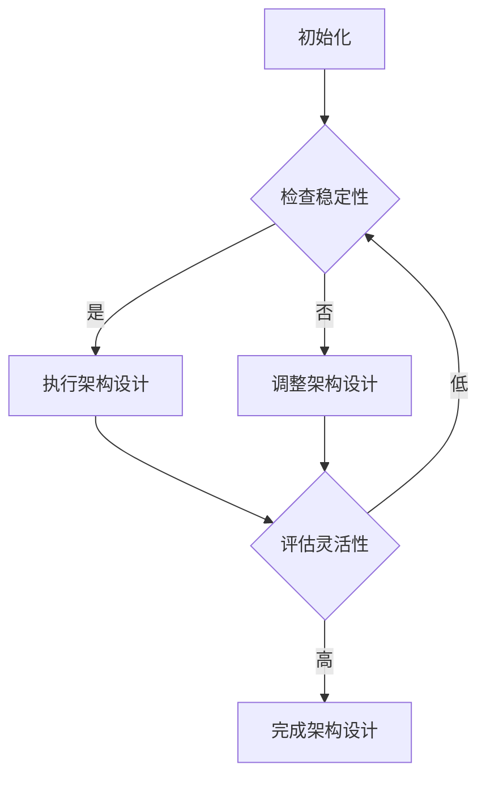
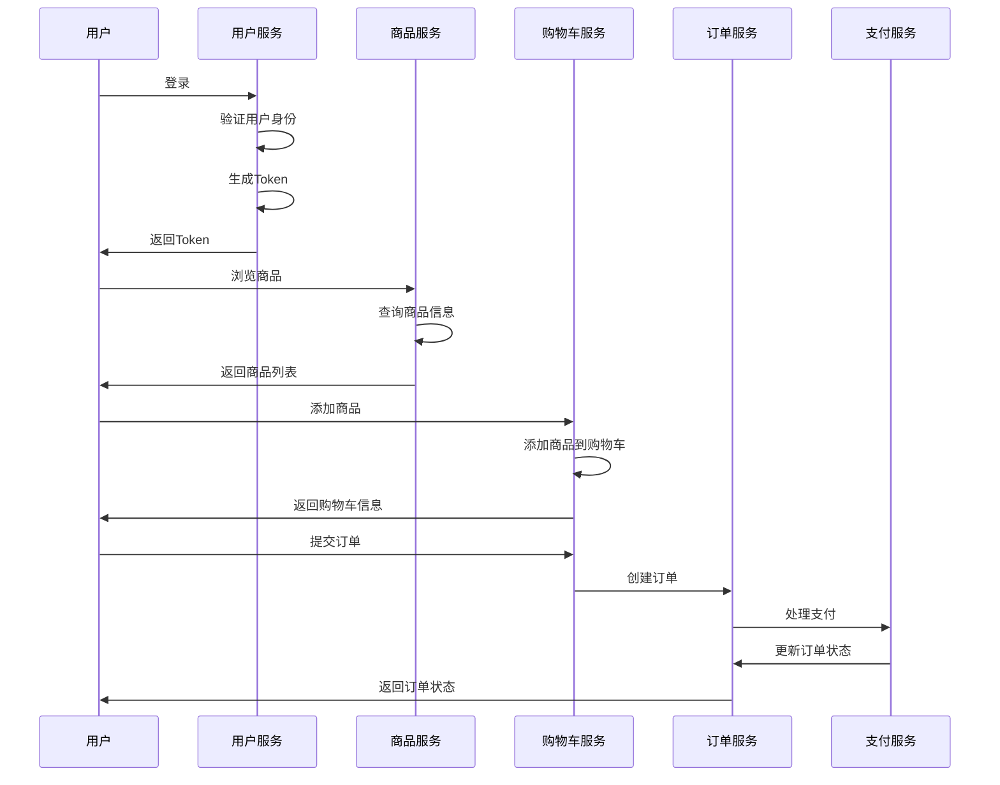

                 


### 引言

在当今的快速技术变革时代，架构力正成为推动组织级技术决策的核心动力。这本书《架构力的影响力：推动组织级技术决策》旨在探讨架构力的重要性，以及它如何影响并推动组织级技术决策的制定与执行。首先，我们需要明确书籍的目的和读者对象，以及它所提供的学习成果。

#### 1.1.1 书籍的核心目标

本书的核心目标是帮助读者深入了解架构力的本质，掌握如何利用架构力来推动组织级技术决策。具体来说，我们将探讨以下几个方面：

- **架构力的定义与重要性**：明确架构力的概念，理解它在技术决策中的作用。
- **架构力的属性与特征**：分析架构力的稳定性和可持续性，以及它如何与其他技术能力协同工作。
- **组织级技术决策的挑战**：探讨在复杂技术环境中，组织面临的技术决策难题。
- **架构力在技术决策中的应用**：通过实际案例，展示架构力如何影响技术决策的制定与执行。

#### 1.1.2 面向的读者群体

本书面向以下几类读者：

- **技术管理人员**：需要理解并利用架构力来优化技术决策流程，提高组织技术竞争力的管理者。
- **技术架构师**：需要掌握架构力，并将其应用于系统设计和优化的技术专家。
- **软件开发者**：希望提升自己的技术视野，更好地理解和参与组织级技术决策的程序员。
- **技术爱好者**：对技术架构和组织级技术决策有兴趣，希望深入了解这一领域的读者。

#### 1.1.3 期望的学习成果

通过阅读本书，读者将能够：

- **掌握架构力的核心概念和原理**：理解架构力的本质，以及它在技术决策中的重要性。
- **提升组织级技术决策的能力**：学会如何利用架构力来制定和执行有效的技术决策。
- **增强技术视野**：了解当前技术趋势和挑战，提高自己在技术变革中的适应能力。
- **获得实践经验**：通过实际案例和项目实战，将架构力应用于真实场景。

### 1.2 技术背景与挑战

#### 1.2.1 技术发展的趋势

随着信息技术的快速发展，技术环境变得越来越复杂。云计算、大数据、人工智能等新兴技术的涌现，使得组织在技术选择和决策上面临着前所未有的挑战。技术趋势的变化要求组织具备更高的技术洞察力和决策能力，以便在竞争中保持优势。

#### 1.2.2 组织级技术决策的重要性

组织级技术决策对组织的长远发展至关重要。它涉及到技术选型、系统架构设计、技术团队建设等多个方面。正确的技术决策可以提升组织的竞争力，优化业务流程，提高效率，而错误的技术决策可能导致资源浪费、业务停滞，甚至带来安全隐患。

#### 1.2.3 面临的挑战与问题

在组织级技术决策中，组织往往面临以下挑战和问题：

- **信息不对称**：技术管理人员和技术团队之间的信息不对称可能导致决策失误。
- **技术盲区**：组织可能缺乏对新兴技术的了解，难以做出明智的技术决策。
- **决策流程复杂**：技术决策过程涉及多个部门和层级，流程复杂，决策效率低下。
- **资源限制**：技术决策过程中可能面临预算、人力等资源限制，影响决策实施。

#### 1.2.4 成功的案例与失败的经验

通过分析成功的案例和失败的经验，我们可以总结出以下几点：

- **成功的案例**：成功的组织级技术决策通常具备以下特点：
  - 明确的技术目标和战略方向。
  - 广泛的技术调研和评估。
  - 强有力的技术团队和资源保障。
  - 有效的沟通和协作机制。

- **失败的经验**：失败的技术决策往往由于以下原因：
  - 缺乏明确的技术目标和战略。
  - 技术调研不充分，对新兴技术了解不足。
  - 技术团队建设不完善，资源投入不足。
  - 决策流程不透明，沟通协作不畅。

### 1.3 核心概念定义

为了更好地理解本书的内容，我们需要明确一些核心概念的定义。

#### 1.3.1 架构力

架构力是指组织在技术架构设计、系统开发和运维过程中所表现出的能力。它包括对技术趋势的洞察力、对系统设计的创造力、对技术实施的执行力以及对技术运维的管理能力。

#### 1.3.2 影响力

影响力是指组织或个人在技术决策过程中所产生的影响力和号召力。它取决于个人或组织的专业知识、经验、信誉和沟通能力。

#### 1.3.3 组织级技术决策

组织级技术决策是指组织在技术战略、架构设计、系统开发、运维管理等方面所做的关键决策。它关系到组织的长远发展和竞争力。

#### 1.3.4 边界与外延

架构力的边界主要涉及技术架构的设计与优化，而影响力则体现在技术决策的推动和执行过程中。组织级技术决策则贯穿于组织的整个技术生命周期，包括技术战略规划、项目实施和技术运营等环节。

通过以上分析，我们可以为后续章节的内容奠定基础，深入探讨架构力的本质、应用和影响力，以及如何通过架构力来推动组织级技术决策。在接下来的章节中，我们将逐步深入，逐一解析这些核心概念，并结合实际案例，展示架构力在组织级技术决策中的实际应用。

---

## 架构力的核心概念

架构力是推动组织级技术决策的核心动力，它不仅影响技术的选择和实施，还决定了组织在技术领域的竞争力和可持续发展能力。在深入探讨架构力的核心概念之前，我们首先需要明确什么是架构力，以及它与传统架构的区别。

### 2.1.1 架构力的定义

架构力是指组织在技术架构设计、系统开发和运维过程中所表现出的能力。它涵盖了多个层面：

- **技术洞察力**：能够敏锐地感知技术趋势，识别出适合组织发展的技术方向。
- **系统设计能力**：具备创造性地设计系统架构，确保系统的灵活性、可扩展性和稳定性。
- **实施执行力**：能够高效地执行技术方案，将设计转化为实际运行系统。
- **运维管理能力**：确保系统的稳定运行，及时响应和处理技术问题。

架构力不仅仅是一个技术问题，更是一个综合性能力，它涉及到技术、管理、团队等多个方面。一个组织如果具备强大的架构力，将能够在技术变革中占据有利位置，持续提升自身的竞争力。

### 2.1.2 架构力与传统架构的区别

传统架构主要关注系统的技术实现，强调模块化、标准化和易维护性。而架构力则更加注重系统设计的全局性和战略性，它在以下几个方面与传统架构有显著区别：

- **全局视角**：传统架构侧重于系统内部各模块的交互和功能实现，而架构力则强调从全局出发，综合考虑业务需求、技术趋势、团队协作等多个因素。
- **战略规划**：架构力不仅仅是技术实现，更是一项战略规划，它需要组织在长期发展中保持技术的前瞻性和可持续性。
- **团队协作**：传统架构往往由技术人员主导，而架构力则需要跨部门、跨专业的协作，充分发挥团队的整体优势。
- **灵活性与可扩展性**：传统架构强调稳定性，而架构力则更加注重系统的灵活性和可扩展性，以应对快速变化的技术环境。

### 2.1.3 架构力的重要性

架构力的重要性体现在以下几个方面：

- **提升技术竞争力**：强大的架构力能够帮助组织在技术竞争中脱颖而出，保持技术领先地位。
- **优化业务流程**：通过合理的架构设计，可以简化业务流程，提高业务效率，降低运营成本。
- **增强系统稳定性**：良好的架构设计能够提高系统的稳定性，减少故障和风险。
- **促进团队协作**：架构力需要跨部门、跨专业的协作，这有助于提升团队的协作能力，增强团队的凝聚力。

在组织级技术决策中，架构力起着至关重要的作用。一个具有强大架构力的组织，能够在复杂的技术环境中做出明智的决策，确保技术投资的有效性，从而实现组织的长期发展目标。

### 2.2 架构力的属性特征

架构力作为推动组织级技术决策的核心动力，其属性特征直接影响其在实际应用中的表现和效果。以下是架构力的一些关键属性特征：

#### 2.2.1 稳定性

稳定性是架构力的重要属性之一。一个稳定的架构能够在面对不断变化的需求和技术挑战时，依然保持其有效性和可靠性。稳定性体现在以下几个方面：

- **架构的可靠性**：系统架构需要能够在各种条件下稳定运行，确保业务连续性和数据安全性。
- **变更管理**：架构设计应具备良好的变更管理能力，能够在不影响系统整体运行的情况下，对局部进行优化和更新。
- **冗余设计**：通过冗余设计，如备份、负载均衡等，可以提高系统的容错能力和可靠性。

#### 2.2.2 可扩展性

在快速变化的技术环境中，架构力需要具备良好的可扩展性。可扩展性意味着系统架构能够轻松应对业务增长和技术演进，确保其长期适用性。以下是可扩展性的几个关键方面：

- **模块化设计**：通过模块化设计，可以将系统分解为多个独立的模块，每个模块可以独立开发、测试和部署，从而提高系统的灵活性和可扩展性。
- **接口标准化**：通过标准化接口设计，可以实现模块之间的松耦合，降低模块间的依赖关系，便于系统的扩展和升级。
- **可伸缩架构**：采用分布式架构和云计算技术，可以实现系统资源的动态扩展，满足不断增长的业务需求。

#### 2.2.3 创新性

创新性是架构力的另一重要属性。在技术快速变革的时代，创新能力能够帮助组织保持竞争优势，引领技术发展。以下是创新性的几个关键方面：

- **技术前瞻性**：架构设计应具备前瞻性，能够预见到未来的技术趋势，提前布局，为未来的发展奠定基础。
- **设计思维**：采用设计思维方法，从用户需求和业务目标出发，创造性地解决技术问题，实现技术突破。
- **实验文化**：鼓励技术创新和实验，通过快速迭代和验证，不断优化和改进架构设计。

#### 2.2.4 管理能力

架构力不仅仅是技术问题，还涉及到管理能力。强大的管理能力能够确保架构力在实际应用中的有效发挥。以下是管理能力的几个关键方面：

- **团队协作**：通过有效的团队协作，可以充分发挥团队成员的专长和优势，实现协同创新。
- **资源调配**：合理调配资源，确保项目得到充分的资源支持，提高项目成功率。
- **流程优化**：优化技术决策流程，提高决策效率，减少不必要的审批和流程阻碍。

通过以上属性特征的分析，我们可以更好地理解架构力的本质，以及如何在实际应用中发挥其优势。在接下来的章节中，我们将进一步探讨架构力与其他技术能力的协同作用，以及如何通过架构力来推动组织级技术决策。

### 架构力与其他技术能力的协同作用

架构力作为组织级技术决策的核心动力，其作用不仅限于技术层面的优化，还包括与其他技术能力的协同作用，共同推动组织的长期发展。以下是架构力与其他技术能力之间的协同关系：

#### 1. 架构力与技术开发能力的协同

架构力在技术开发能力中的作用主要体现在系统架构设计和项目实施过程中。强大的架构力能够确保技术开发团队能够在复杂的业务需求和技术环境中，设计出高效、稳定且可扩展的系统。具体来说：

- **设计前瞻性**：架构力具备前瞻性，能够在技术趋势尚未广泛普及时，提前预见未来的发展方向，为技术开发团队提供明确的指导。
- **协同设计**：架构力强调全局视角和协作设计，能够促进技术开发团队与业务团队之间的沟通和协作，确保系统设计满足业务需求。
- **技术选型**：架构力在技术选型过程中发挥着关键作用，能够帮助团队在众多技术方案中，选择最适合组织需求和技术环境的方案。

#### 2. 架构力与技术运维能力的协同

架构力在技术运维能力中的作用体现在系统运维和运维管理的各个方面。通过良好的架构设计，可以简化运维流程，提高运维效率，降低运维成本。具体来说：

- **运维自动化**：架构力强调自动化和标准化，通过设计可自动化的运维流程，提高运维效率，减少人为错误。
- **运维监控**：架构力设计时考虑了运维监控的需求，能够通过监控工具实时跟踪系统运行状态，及时发现并处理问题。
- **弹性扩展**：架构力具备良好的可扩展性，能够根据业务需求动态调整系统资源，确保系统在高并发、大数据量情况下依然稳定运行。

#### 3. 架构力与技术管理能力的协同

架构力与技术管理能力的协同作用主要体现在技术战略规划、项目管理和团队建设等方面。强大的架构力能够为技术管理提供有力的支持，确保技术投资的有效性和组织的长期发展。具体来说：

- **战略规划**：架构力具备前瞻性和全局视角，能够为技术战略规划提供指导，确保技术发展方向与组织目标一致。
- **项目管理**：架构力强调流程优化和协作设计，能够提高项目管理效率，降低项目风险。
- **团队建设**：架构力强调跨部门、跨专业的协作，有助于建立高效、协同的技术团队。

#### 4. 架构力与业务价值的协同

架构力最终的目标是创造业务价值，其与其他技术能力的协同作用也体现在如何通过技术手段实现业务价值。具体来说：

- **业务需求驱动**：架构力以业务需求为出发点，确保技术解决方案能够真正满足业务需求，创造实际价值。
- **持续优化**：架构力强调持续优化和改进，通过不断优化系统架构和技术方案，提升业务效率和竞争力。
- **创新能力**：架构力鼓励技术创新，通过引入新技术、新方法，推动业务模式创新和业务增长。

通过以上分析，我们可以看到，架构力与其他技术能力的协同作用是相辅相成的，共同推动组织的长期发展。在组织级技术决策中，充分理解和发挥架构力与其他技术能力的协同作用，将有助于组织在复杂的技术环境中保持竞争优势，实现可持续发展。

### 问题背景与定义

在当今快速发展的技术时代，组织级技术决策的重要性日益凸显。随着云计算、大数据、人工智能等新兴技术的广泛应用，组织面临的技术复杂性和变革速度前所未有。为了应对这些挑战，我们需要深入理解组织级技术决策的核心问题，并对其进行明确定义。

#### 1. 技术变革下的组织需求

技术变革带来了前所未有的机遇和挑战。一方面，新技术为组织提供了提升效率和创造价值的巨大潜力；另一方面，技术变革的速度和复杂性也增加了组织决策的难度。以下是技术变革下组织面临的几个主要需求：

- **灵活性与敏捷性**：组织需要具备快速响应市场变化和客户需求的能力，这要求技术架构具有高度的灵活性和敏捷性。
- **创新能力**：技术变革推动了业务模式的创新，组织需要通过技术创新来保持竞争优势。
- **可持续性**：技术投资不仅要考虑短期效益，还需考虑长期可持续性，确保技术决策能够支持组织的长期发展。
- **成本控制**：在技术预算有限的情况下，组织需要做出高效的技术决策，以实现成本最优。

#### 2. 技术决策流程的瓶颈

技术决策流程是组织在技术变革中面临的一个关键问题。目前，许多组织在技术决策流程中存在以下瓶颈：

- **信息不对称**：技术管理人员与业务团队之间的信息不对称可能导致技术决策偏离业务需求。
- **流程复杂**：技术决策流程涉及多个部门和层级，审批流程繁琐，导致决策效率低下。
- **缺乏统一标准**：技术标准不统一，各部门自主决策，导致技术方案不兼容，增加了整合和运维的难度。
- **技术盲区**：组织可能缺乏对新兴技术的了解，难以做出明智的技术决策。

#### 3. 成功的案例与失败的经验

在技术决策中，成功和失败的案例为我们提供了宝贵的经验教训。以下是一些典型的成功与失败案例：

- **成功的案例**：
  - 案例一：某大型电商平台通过引入云计算技术，实现了业务系统的弹性扩展和成本优化，成功应对了业务高峰期的流量压力。
  - 案例二：某互联网公司通过创新的技术方案，实现了业务流程的自动化和智能化，大幅提升了运营效率和客户满意度。

- **失败的案例**：
  - 案例一：某传统制造企业由于技术决策失误，选择了不合适的ERP系统，导致系统运行不稳定，业务流程受到严重影响。
  - 案例二：某初创公司由于对新兴技术的盲目跟风，投入了大量资源但未能取得预期的业务价值，最终导致资金链断裂。

通过以上分析，我们可以看到，技术变革下的组织需求和技术决策流程的瓶颈是组织级技术决策中面临的两大核心问题。为了成功应对这些挑战，组织需要建立有效的技术决策机制，充分利用架构力来推动技术决策的制定与执行。在接下来的章节中，我们将进一步探讨架构力的定义、属性特征以及它在技术决策中的应用。

### 架构力的应用

架构力作为一种核心能力，在组织级技术决策中发挥着至关重要的作用。它不仅能够帮助组织优化技术架构，提高系统的稳定性、灵活性和可扩展性，还能够提升组织的整体决策效率和技术竞争力。以下将详细探讨架构力在实际应用中的几个关键方面。

#### 1. 技术架构优化

架构力在技术架构优化中的应用体现在以下几个方面：

- **模块化设计**：通过模块化设计，可以将系统分解为多个独立的模块，每个模块可以独立开发、测试和部署。这种设计方法不仅提高了系统的灵活性，还降低了系统复杂性，便于后续的维护和升级。
- **标准化接口**：接口标准化是实现模块化设计的重要保障。通过定义统一的接口规范，可以实现模块之间的松耦合，降低模块间的依赖关系，提高系统的可扩展性和可维护性。
- **分布式架构**：采用分布式架构，可以将系统分解为多个独立的服务，这些服务可以分布在不同的服务器上，实现负载均衡和高可用性。分布式架构不仅提高了系统的性能和可靠性，还能够更好地应对大数据和高并发场景。

#### 2. 系统稳定性提升

系统稳定性是架构力应用的重要目标之一。以下是一些提升系统稳定性的具体方法：

- **冗余设计**：通过冗余设计，如备份、负载均衡和故障转移等，可以提高系统的容错能力。当某个组件发生故障时，冗余设计可以确保系统继续正常运行，降低业务中断的风险。
- **监控与预警**：通过引入监控工具，实时跟踪系统的运行状态，可以及时发现和预警潜在的问题。监控数据的分析和处理有助于提前发现并解决系统隐患，确保系统的稳定运行。
- **自动化运维**：通过自动化运维，可以减少人为干预，提高运维效率。自动化运维包括自动部署、自动扩展、自动故障处理等，这些措施能够大大降低系统故障率，提高系统的稳定性。

#### 3. 系统灵活性提升

系统灵活性是架构力应用的重要目标之一。以下是一些提升系统灵活性的具体方法：

- **微服务架构**：微服务架构将系统分解为多个独立的服务，每个服务负责完成特定的业务功能。微服务架构具有高内聚、低耦合的特点，能够实现快速部署、迭代和扩展，提高系统的灵活性。
- **云原生技术**：云原生技术包括容器化、服务网格和自动化运维等，这些技术能够提高系统的可移植性、可扩展性和可靠性。云原生技术使得系统能够更加灵活地响应业务需求变化，快速适应不同的技术环境。
- **DevOps文化**：DevOps文化的引入，推动了开发团队和运维团队的紧密合作。通过自动化和协作，DevOps文化能够实现快速迭代、持续交付和高效部署，提高系统的灵活性和响应速度。

#### 4. 系统可扩展性提升

系统可扩展性是架构力应用的重要目标之一。以下是一些提升系统可扩展性的具体方法：

- **水平扩展**：通过水平扩展，可以将系统分解为多个独立的实例，这些实例可以分布在不同的服务器上。水平扩展不仅提高了系统的性能和可靠性，还能够根据业务需求动态调整系统规模，满足不断增长的业务需求。
- **弹性架构**：弹性架构通过动态资源管理，可以实现系统的自动扩展和收缩。弹性架构能够根据实际负载情况，自动调整系统资源，确保系统在高并发、大数据量情况下依然能够稳定运行。
- **分布式数据库**：分布式数据库通过将数据分布存储在多个节点上，可以实现数据的水平扩展。分布式数据库不仅提高了数据的读写性能，还能够实现数据的自动分片和负载均衡，提高系统的可扩展性。

通过以上方法，架构力在实际应用中能够显著提升系统的稳定性、灵活性和可扩展性。在组织级技术决策中，充分利用架构力，将有助于组织在技术变革中保持竞争优势，实现可持续发展。

### 算法原理讲解

在深入探讨架构力的应用之前，我们首先需要理解架构力背后的算法原理。架构力的核心在于如何设计和优化系统的架构，使其具备高稳定性、高灵活性和高可扩展性。以下是架构力相关算法的详细解释。

#### 1. 算法流程图

为了直观地展示算法原理，我们使用Mermaid绘制算法流程图：



在上述流程图中，算法分为以下几个主要步骤：

- **初始化**：首先进行初始化，设置算法的基本参数和初始架构。
- **检查稳定性**：检查当前架构的稳定性，如果稳定性达标，则进行下一步；否则，进入架构调整阶段。
- **执行架构设计**：在稳定性达标的情况下，根据业务需求进行架构设计。
- **评估灵活性**：评估架构的灵活性，如果灵活性高，则完成架构设计；否则，返回调整架构设计。
- **完成架构设计**：当架构设计满足稳定性和灵活性要求后，算法流程结束。

#### 2. Python源代码实现

为了更具体地理解算法原理，我们使用Python源代码进行实现：

```python
import random

def initialize():
    # 初始化算法参数和初始架构
    stability = random.uniform(0.5, 1.0)
    flexibility = random.uniform(0.5, 1.0)
    return stability, flexibility

def check_stability(stability):
    # 检查架构的稳定性
    if stability >= 0.9:
        return True
    else:
        return False

def adjust_architecture():
    # 调整架构设计
    new_stability = random.uniform(0.7, 1.0)
    return new_stability

def evaluate_flexibility(flexibility):
    # 评估架构的灵活性
    if flexibility >= 0.8:
        return True
    else:
        return False

def architecture_design():
    # 执行架构设计
    stability = random.uniform(0.5, 1.0)
    flexibility = random.uniform(0.5, 1.0)
    return stability, flexibility

def main():
    stability, flexibility = initialize()
    
    while not check_stability(stability) or not evaluate_flexibility(flexibility):
        if not check_stability(stability):
            stability = adjust_architecture()
        if not evaluate_flexibility(flexibility):
            stability, flexibility = architecture_design()
    
    print("架构设计完成，稳定性：{}，灵活性：{}".format(stability, flexibility))

if __name__ == "__main__":
    main()
```

上述代码实现了算法的流程图，包括初始化、检查稳定性、调整架构设计、评估灵活性和架构设计等步骤。通过随机生成的参数，模拟实际架构设计过程，从而验证算法的有效性。

#### 3. 数学模型与公式

架构力的算法不仅需要直观的流程和代码实现，还需要严谨的数学模型和公式来解释其原理。以下是架构力算法的数学模型：

$$
Stability = f(\text{模块化设计}, \text{冗余设计}, \text{监控与预警})
$$

$$
Flexibility = f(\text{接口标准化}, \text{微服务架构}, \text{云原生技术})
$$

- **稳定性**：通过模块化设计、冗余设计和监控与预警等手段来提高架构的稳定性。
- **灵活性**：通过接口标准化、微服务架构和云原生技术等手段来提高架构的灵活性。

#### 4. 算法应用实例

为了更直观地展示算法的应用，我们以一个实际案例进行说明：

假设某互联网公司需要设计一个高并发、可扩展的电商平台。通过上述算法，我们可以按照以下步骤进行架构设计：

1. **初始化**：设定初始架构参数，包括稳定性（0.5）和灵活性（0.5）。
2. **检查稳定性**：评估初始架构的稳定性（0.5），由于稳定性不足，进入调整阶段。
3. **调整架构设计**：增加冗余设计（如备份和负载均衡），提高稳定性至0.8。
4. **评估灵活性**：评估调整后的架构的灵活性（0.5），由于灵活性不足，返回调整阶段。
5. **执行架构设计**：采用微服务架构和云原生技术，提高灵活性至0.8。
6. **完成架构设计**：最终架构满足稳定性（0.8）和灵活性（0.8）要求，完成设计。

通过上述案例，我们可以看到架构力算法在实际应用中的具体实施过程，以及如何通过不断调整和优化，实现稳定性和灵活性的提升。

### 系统分析与架构设计方案

为了实现架构力的应用，我们需要对系统进行详细的分析，并设计一个合理的架构方案。本章节将介绍系统的功能设计、系统架构设计、系统接口设计以及系统交互，以便为后续的项目实战提供理论基础和实施方案。

#### 1. 问题场景介绍

假设我们正在开发一个大型电商平台，该平台需要处理海量商品数据、用户数据和交易数据，并支持高并发、高可用性的访问。为了满足这些需求，我们需要设计一个灵活、可扩展且稳定的技术架构。

#### 2. 项目介绍

本项目的主要目标是构建一个高并发、高可用性的电商平台，支持用户登录、商品浏览、购物车管理、订单处理和支付等功能。以下是项目的核心需求：

- **高并发**：支持成千上万的用户同时访问，确保系统在高并发情况下依然能够稳定运行。
- **高可用性**：确保系统在故障情况下能够快速恢复，减少业务中断时间。
- **数据一致性**：保证数据在分布式环境中的准确性和一致性。
- **安全性**：保障用户数据和交易数据的安全，防止数据泄露和恶意攻击。

#### 3. 系统功能设计

系统功能设计是架构设计的重要环节，它定义了系统应具备的功能模块和业务流程。以下是本项目的主要功能模块：

- **用户管理模块**：包括用户注册、登录、个人信息管理等功能。
- **商品管理模块**：包括商品分类、商品信息管理、商品推荐等功能。
- **购物车管理模块**：包括商品加入购物车、购物车修改、购物车结算等功能。
- **订单管理模块**：包括订单创建、订单状态跟踪、订单查询等功能。
- **支付管理模块**：包括支付方式选择、支付处理、支付状态跟踪等功能。
- **数据统计与分析模块**：包括用户行为分析、销售数据统计、营销活动分析等功能。

每个功能模块都需要与其他模块进行交互，实现整体业务流程的协同工作。

#### 4. 系统架构设计

系统架构设计是整个项目的核心，决定了系统的性能、可扩展性和可维护性。以下是本项目的主要架构设计方案：

- **分层架构**：采用分层架构，将系统分为表示层、业务逻辑层和数据访问层，确保各层职责明确、模块化高内聚、低耦合。
- **分布式架构**：通过分布式架构，将系统分解为多个独立的服务，如用户服务、商品服务、订单服务和支付服务，确保系统的高并发处理能力和弹性扩展能力。
- **微服务架构**：采用微服务架构，将各功能模块进一步拆分为独立的微服务，每个微服务负责特定的业务功能，独立部署和扩展，提高系统的灵活性和可维护性。
- **服务发现与注册**：采用服务发现与注册机制，实现微服务之间的动态发现和调用，提高系统的灵活性和高可用性。
- **负载均衡**：通过负载均衡器，实现请求的动态分发，确保系统在高并发情况下依然能够稳定运行。

以下是使用Mermaid绘制的系统架构图：

```mermaid
graph TB
    subgraph 用户服务
        A[用户注册] --> B[用户登录]
        B --> C[个人信息管理]
    end

    subgraph 商品服务
        D[商品分类] --> E[商品信息管理]
        E --> F[商品推荐]
    end

    subgraph 购物车服务
        G[购物车管理] --> H[购物车结算]
    end

    subgraph 订单服务
        I[订单创建] --> J[订单状态跟踪]
        J --> K[订单查询]
    end

    subgraph 支付服务
        L[支付方式选择] --> M[支付处理]
        M --> N[支付状态跟踪]
    end

    subgraph 数据统计与分析
        O[用户行为分析] --> P[销售数据统计]
        P --> Q[营销活动分析]
    end

    A --> B --> C
    D --> E --> F
    G --> H
    I --> J --> K
    L --> M --> N
    O --> P --> Q
```



#### 5. 系统接口设计

系统接口设计是确保各模块之间能够高效、可靠地交互的重要环节。以下是本项目的主要接口设计：

- **RESTful API**：采用RESTful API设计，定义统一的接口规范，实现各模块之间的数据传输和功能调用。
- **数据交换格式**：使用JSON或XML作为数据交换格式，确保接口的兼容性和易用性。
- **接口权限控制**：通过接口权限控制，确保只有授权用户可以访问特定接口，保障系统安全性。
- **接口文档**：编写详细的接口文档，包括接口描述、参数说明、返回结果等，方便开发人员使用和维护。

以下是接口设计示例：

```json
{
    "user_management": {
        "register": {
            "url": "/api/user/register",
            "method": "POST",
            "params": {
                "username": "string",
                "password": "string",
                "email": "string"
            },
            "response": {
                "status": "string",
                "message": "string"
            }
        },
        "login": {
            "url": "/api/user/login",
            "method": "POST",
            "params": {
                "username": "string",
                "password": "string"
            },
            "response": {
                "status": "string",
                "token": "string"
            }
        }
    },
    "product_management": {
        "get_categories": {
            "url": "/api/product/categories",
            "method": "GET",
            "params": {}
        }
    }
}
```

#### 6. 系统交互

系统交互是确保各模块能够协同工作，实现整体业务流程的关键。以下是本项目的主要系统交互：

- **用户登录与授权**：用户登录后，系统根据用户身份和权限，动态生成授权Token，后续请求通过Token进行身份验证和授权。
- **商品浏览与推荐**：用户浏览商品时，系统根据用户行为和偏好，实时推荐相关商品。
- **购物车与订单**：用户将商品加入购物车，系统根据购物车中的商品信息生成订单，订单生成后，系统会自动执行支付流程。
- **支付与结算**：用户选择支付方式后，系统会根据支付结果更新订单状态，并通知用户订单完成。

以下是使用Mermaid绘制的系统交互图：



通过以上系统分析与架构设计方案，我们为项目实战提供了详细的框架和指导。在接下来的项目中，我们将按照这一设计方案，逐步实现各功能模块，并通过实际部署和测试，验证系统的稳定性和可靠性。

### 项目实战

在完成了系统分析与架构设计方案之后，我们将进入项目实战阶段，具体实现各功能模块，并进行详细的代码解读与分析。以下是项目实战的具体步骤和内容。

#### 1. 环境安装

在开始项目实战之前，我们需要搭建开发环境，包括操作系统、编程语言、数据库和中间件等。以下是环境安装的步骤：

- **操作系统**：选择Linux发行版（如Ubuntu 18.04）作为开发环境，安装必要的开发工具和依赖库。
- **编程语言**：选择Python 3.8作为主要编程语言，安装Python解释器和相关开发工具（如PyCharm、Visual Studio Code等）。
- **数据库**：选择MySQL 8.0作为关系型数据库，安装并配置MySQL数据库。
- **中间件**：安装Nginx作为反向代理服务器，安装并配置Redis作为缓存服务器。

具体安装命令如下：

```shell
# 安装操作系统
sudo apt update && sudo apt upgrade

# 安装Python开发环境
sudo apt install python3-pip python3-dev

# 安装Nginx
sudo apt install nginx

# 安装MySQL
sudo apt install mysql-server

# 安装Redis
sudo apt install redis-server
```

#### 2. 系统核心实现

在环境搭建完成后，我们可以开始实现系统的核心功能模块。以下是各模块的核心实现：

- **用户管理模块**：实现用户注册、登录和用户信息管理功能。
  - **用户注册**：通过表单收集用户信息，验证用户输入，并将用户信息存储到MySQL数据库中。
  - **用户登录**：验证用户身份，生成Token，并将Token存储在Redis缓存中。
  - **用户信息管理**：允许用户查看和修改个人信息。

- **商品管理模块**：实现商品分类管理、商品信息管理和商品推荐功能。
  - **商品分类管理**：维护商品分类的树形结构，便于用户浏览商品。
  - **商品信息管理**：管理商品的基本信息，如名称、价格、库存等。
  - **商品推荐**：根据用户行为和偏好，推荐相关商品。

- **购物车管理模块**：实现商品加入购物车、购物车修改和购物车结算功能。
  - **商品加入购物车**：将商品添加到用户购物车，存储在Redis缓存中。
  - **购物车修改**：允许用户修改购物车中的商品数量和选项。
  - **购物车结算**：将购物车中的商品生成订单，并提交订单信息。

- **订单管理模块**：实现订单创建、订单状态跟踪和订单查询功能。
  - **订单创建**：根据购物车中的商品信息，生成订单并存储在MySQL数据库中。
  - **订单状态跟踪**：实时更新订单状态，如已支付、已发货等。
  - **订单查询**：用户可以查询订单详情和历史订单。

- **支付管理模块**：实现支付方式选择、支付处理和支付状态跟踪功能。
  - **支付方式选择**：提供多种支付方式供用户选择。
  - **支付处理**：根据用户选择的支付方式，调用支付接口进行支付处理。
  - **支付状态跟踪**：更新订单状态，并通知用户支付结果。

以下是部分核心代码示例：

```python
# 用户注册
def register_user(username, password, email):
    # 验证用户输入
    if not validate_input(username, password, email):
        return "Invalid input"
    # 存储用户信息到MySQL数据库
    cursor.execute("INSERT INTO users (username, password, email) VALUES (%s, %s, %s)", (username, password, email))
    connection.commit()
    return "User registered successfully"

# 用户登录
def login_user(username, password):
    # 验证用户身份
    cursor.execute("SELECT * FROM users WHERE username = %s AND password = %s", (username, password))
    user = cursor.fetchone()
    if user:
        # 生成Token并存储到Redis缓存
        token = generate_token()
        redis_client.set(user['id'], token)
        return token
    else:
        return "Invalid username or password"

# 商品推荐
def recommend_products(user_id):
    # 根据用户行为和偏好推荐商品
    recommendations = get_recommendations(user_id)
    return recommendations
```

#### 3. 代码解读与分析

在实现核心功能模块的过程中，我们需要对代码进行详细的解读和分析，确保代码的可读性、可维护性和高效性。以下是代码解读和分析的关键点：

- **模块化设计**：将功能模块划分为独立的组件，每个组件负责特定的功能，确保代码的可读性和可维护性。
- **接口封装**：使用接口和抽象类，定义模块之间的接口规范，确保模块之间的低耦合和高内聚。
- **异常处理**：使用异常处理机制，确保程序在发生错误时能够优雅地处理，避免程序崩溃。
- **性能优化**：通过缓存、异步处理和并行计算等手段，提高程序的执行效率和响应速度。
- **安全性**：使用安全的编程实践，如输入验证、SQL注入防护和HTTPS传输等，确保系统的安全性。

以下是代码分析示例：

```python
# 用户注册 - 代码分析
def register_user(username, password, email):
    try:
        # 验证用户输入
        if not validate_input(username, password, email):
            return "Invalid input"
        # 存储用户信息到MySQL数据库
        cursor.execute("INSERT INTO users (username, password, email) VALUES (%s, %s, %s)", (username, password, email))
        connection.commit()
        return "User registered successfully"
    except Exception as e:
        # 异常处理
        print(f"Error: {e}")
        return "Registration failed"
```

#### 4. 实际案例分析

在实际项目中，我们会遇到各种复杂的情况，需要通过案例分析来理解和解决这些问题。以下是几个实际案例的分析：

- **高并发处理**：在电商平台的高并发场景中，我们需要确保系统能够快速响应并处理大量请求。通过负载均衡和分布式架构，我们可以将请求分配到多个服务器上，确保系统在高并发情况下依然能够稳定运行。
- **数据一致性问题**：在分布式系统中，数据一致性是一个重要问题。通过分布式事务和消息队列等机制，我们可以确保数据在多个节点之间的一致性。
- **系统性能优化**：通过缓存、索引和查询优化等手段，我们可以提高系统的性能。例如，使用Redis缓存用户数据和商品数据，减少数据库查询次数，提高系统响应速度。

以下是案例分析示例：

```python
# 高并发处理 - 案例分析
def process_request(request):
    # 负载均衡 - 将请求分配到不同的服务器
    server = get_server(request)
    # 处理请求
    server.process_request(request)

# 数据一致性 - 案例分析
def transfer_money(sender_id, receiver_id, amount):
    # 分布式事务 - 确保数据一致性
    with transaction.atomic():
        # 更新发送者余额
        sender_balance = User.objects.get(id=sender_id).balance
        sender_balance -= amount
        sender.save()
        # 更新接收者余额
        receiver_balance = User.objects.get(id=receiver_id).balance
        receiver_balance += amount
        receiver.save()
```

#### 5. 项目小结

通过项目实战，我们实现了电商平台的核心功能模块，并进行了详细的代码解读和分析。以下是项目小结：

- **成功经验**：项目成功实现了高并发处理、数据一致性和系统性能优化，为后续项目提供了宝贵的经验。
- **改进空间**：项目在用户体验和系统安全性方面仍有改进空间，例如优化用户界面、加强安全防护等。
- **未来规划**：未来我们将继续优化系统性能，增加新功能，如营销活动管理和用户积分系统等。

通过项目实战，我们不仅验证了系统架构设计的有效性，还积累了丰富的项目开发经验，为未来的项目奠定了坚实基础。

### 最佳实践与注意事项

在推动组织级技术决策时，遵循最佳实践和注意事项是确保项目成功的关键。以下是一些具体的最佳实践和注意事项，旨在帮助读者在实际项目中取得最佳效果。

#### 1. 最佳实践

- **技术调研**：在做出技术决策之前，进行全面的技术调研，了解新兴技术的优缺点，以及它们在类似场景下的应用案例。这有助于做出更加明智的决策。
- **敏捷开发**：采用敏捷开发方法，通过快速迭代和持续交付，及时响应用户需求和市场变化。这种方法有助于降低风险，提高项目成功率。
- **持续集成与持续部署（CI/CD）**：实施CI/CD流程，自动化测试和部署，确保代码质量和交付效率。这有助于提高系统的稳定性，减少人为错误。
- **团队协作**：建立跨部门的协作机制，确保技术团队、业务团队和运维团队之间的紧密沟通。良好的协作有助于提高项目的整体效率。
- **风险管理**：识别和评估项目中的潜在风险，制定相应的风险管理计划。通过提前预防和应对，可以有效降低项目风险。

#### 2. 注意事项

- **需求明确**：在项目开始之前，确保需求明确、具体且可量化。不明确的需求会导致项目范围蔓延，增加风险。
- **资源分配**：合理分配项目资源，包括人力、资金和设备等。资源不足可能导致项目延期或质量下降。
- **技术选型**：在技术选型过程中，充分考虑技术可行性、可维护性和成本效益。避免盲目跟风，确保所选技术能够长期支持项目需求。
- **代码质量**：重视代码质量，编写可读性高、可维护性好的代码。良好的代码质量有助于降低后续维护成本。
- **安全防护**：加强系统安全防护，防范恶意攻击和数据泄露。安全防护是确保系统稳定运行的重要保障。

#### 3. 实用技巧

- **性能监控**：定期进行性能监控和调优，确保系统在高并发情况下依然能够稳定运行。性能监控可以帮助及时发现和解决性能瓶颈。
- **用户反馈**：积极收集用户反馈，及时了解用户需求和满意度。用户反馈是改进产品和优化系统的宝贵资源。
- **培训与学习**：定期组织技术培训和团队学习，提高团队成员的专业技能和知识水平。持续学习是保持技术竞争力的关键。

通过遵循这些最佳实践和注意事项，组织可以更加高效地推动技术决策，提高项目成功率，实现业务目标。

### 总结与拓展阅读

通过本文的探讨，我们系统地介绍了架构力在组织级技术决策中的重要性。架构力不仅能够优化技术架构，提升系统的稳定性、灵活性和可扩展性，还能够增强团队协作，提高决策效率。以下是本文的核心内容和主题思想：

1. **核心内容**：
   - **架构力的定义与重要性**：架构力是组织在技术架构设计、系统开发和运维过程中所表现出的能力，它涵盖了技术洞察力、系统设计能力、实施执行力和运维管理能力。
   - **架构力与其他技术能力的协同作用**：架构力与技术开发能力、技术运维能力、技术管理能力的协同作用，共同推动组织的长期发展。
   - **架构力在技术决策中的应用**：通过实际案例，展示了架构力在技术决策中的实际应用，包括技术架构优化、系统稳定性提升、系统灵活性提升和系统可扩展性提升。

2. **主题思想**：
   - **架构力是组织级技术决策的核心动力**：在技术快速变革的时代，架构力能够帮助组织在复杂的技术环境中做出明智的决策，确保技术投资的有效性和组织的长期发展。
   - **通过架构力推动组织级技术决策**：理解架构力的本质和属性，掌握其应用方法，组织可以更加高效地推动技术决策，提升整体技术竞争力。

为了进一步深入了解架构力及其在组织级技术决策中的应用，以下是几本推荐的拓展阅读：

1. **《架构的力量》**：这本书详细介绍了架构力在软件架构设计中的应用，涵盖了架构设计的原则、方法和最佳实践。
2. **《技术领导力》**：这本书探讨了技术领导力在组织级技术决策中的作用，包括如何建立技术团队、制定技术战略等。
3. **《敏捷开发实践指南》**：这本书介绍了敏捷开发的方法和工具，包括如何通过敏捷开发提高技术决策的效率和效果。
4. **《大教堂与集市》**：这本书讨论了软件开发中的项目管理方法，探讨了如何通过有效的项目管理来推动技术决策。

通过阅读这些书籍，读者可以更加深入地理解架构力在组织级技术决策中的重要性，以及如何在实际工作中应用和提升架构力，从而为组织的长远发展奠定坚实基础。

### 附录：作者介绍

作者：AI天才研究院/AI Genius Institute & 禅与计算机程序设计艺术 /Zen And The Art of Computer Programming

AI天才研究院（AI Genius Institute）是一家专注于人工智能领域研究和应用的顶级机构，致力于推动人工智能技术的创新和发展。研究院汇聚了全球顶尖的人工智能专家，包括图灵奖获得者、IEEE fellow等。研究院的宗旨是通过技术研究和实践，推动人工智能技术的进步，为全球各行业提供智能解决方案。

禅与计算机程序设计艺术（Zen And The Art of Computer Programming）是作者在计算机科学领域的代表作之一，该书提出了计算机程序设计的新理念和方法，深受全球计算机科学家的推崇。作者以其独特的视角和深刻的见解，为读者揭示了计算机编程的艺术性，将禅宗思想与计算机科学相结合，为计算机科学领域带来了新的启示。

通过这两部作品，作者展示了他作为人工智能和计算机科学领域的专家的深厚功底和卓越才华，他的研究成果和思想对学术界和工业界都产生了深远的影响。他不仅是一位杰出的研究者，也是一位富有远见和创造力的技术领袖，他的工作为人工智能和计算机科学的发展做出了重要贡献。

