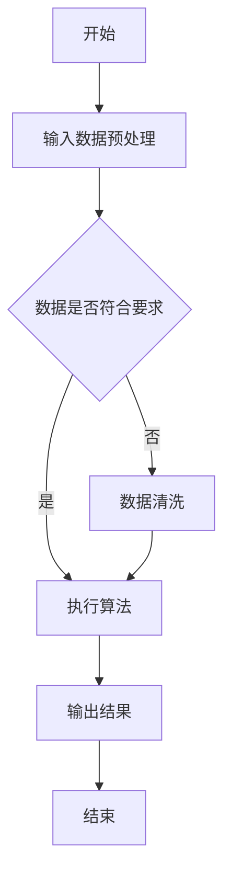
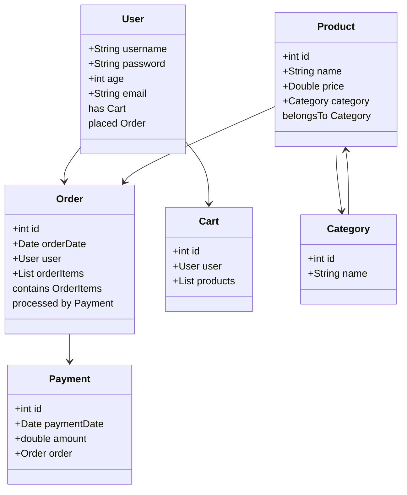
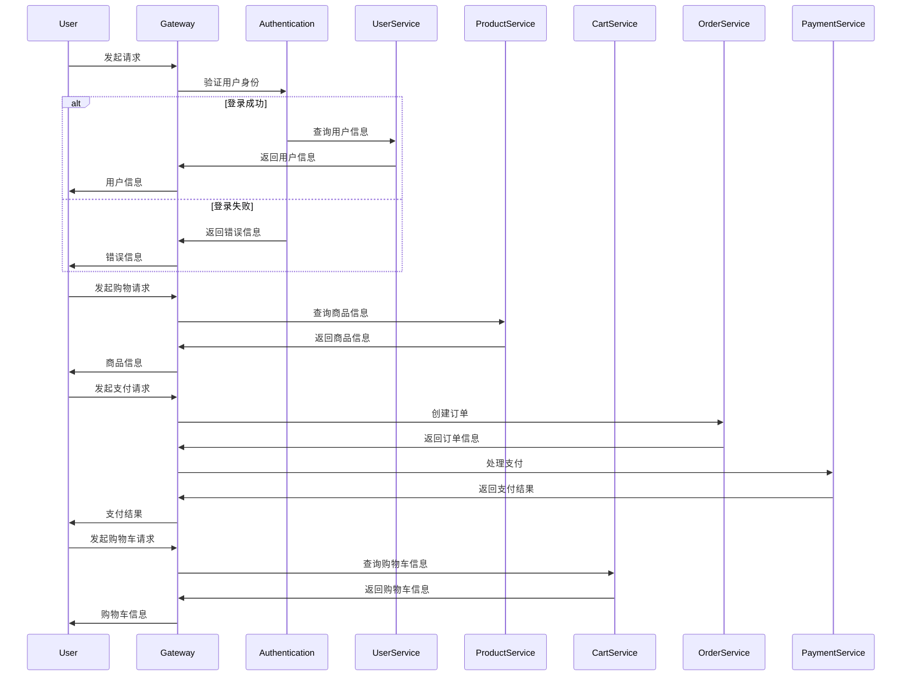
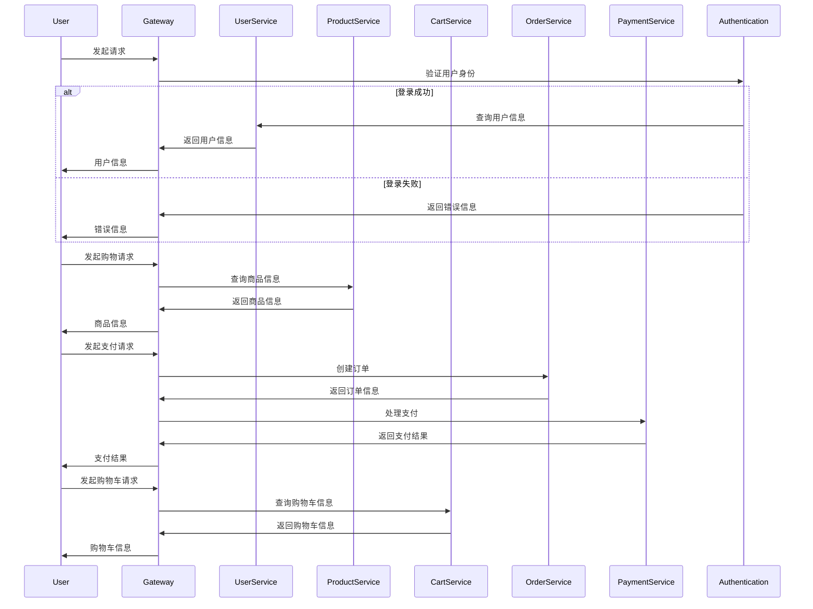

                 

### 第一部分：引言

**引言**是任何技术书籍或文章的开篇，它的作用是引导读者进入主题，激发读者的兴趣，并为其提供必要的背景信息和基本概念。在“架构力的思维模型：系统思考和权衡取舍”这本书的引言部分，我们将首先介绍架构力的基本概念，然后讨论系统思考和权衡取舍的重要性，以及这些概念如何在现实世界中应用。

#### 第1章：架构力的概念与重要性

##### 1.1 架构力概述

架构力（Architectural Fitness）是指在设计和构建软件系统时，系统是否能够满足用户需求和业务目标的能力。它不仅仅是一个技术问题，更是一个战略性的决策过程。架构力涉及多个方面，包括系统的可扩展性、可维护性、可靠性、性能和安全性。

- **定义**：架构力可以被描述为系统设计在应对未来变化时的适应能力和可持续性。
- **重要性**：高架构力的系统能够在面对变化时快速响应，降低维护成本，提高开发效率，同时还能保持系统的稳定性。

##### 1.2 系统思考的必要性

系统思考（Systems Thinking）是一种理解和分析复杂系统的方法论。它强调从整体视角出发，理解系统内部各部分之间的相互关系和动态变化。

- **概念**：系统思考是一种思维方式，它要求我们不仅要关注系统内部的个别部分，还要关注部分之间的相互作用和整体系统的行为。
- **应用**：在架构设计过程中，系统思考可以帮助我们识别潜在的瓶颈和风险，优化系统性能，提高系统的健壮性。

##### 1.3 权衡取舍的原则

在架构设计中，权衡取舍（Trade-offs）是不可避免的。没有一项决策是完美的，每个决策都需要在多个维度上进行权衡。

- **背景**：随着技术的发展，系统设计面临着越来越多的选择，每个选择都有其优势和劣势。
- **方法**：有效的权衡取舍需要明确目标和优先级，平衡短期利益和长期可持续性。

**背景介绍**

**核心概念术语说明**

- **架构力**：指系统在应对变化时的适应能力和可持续性。
- **系统思考**：一种从整体视角理解和分析复杂系统的方法论。
- **权衡取舍**：在系统设计中，需要在不同需求和目标之间进行平衡和优化。

**问题背景**

随着互联网和云计算的快速发展，软件系统越来越复杂，架构设计面临前所未有的挑战。如何设计一个既灵活又稳健的系统，成为当前软件工程领域的重要课题。

**问题描述**

在复杂系统中，架构师需要面对多种技术选择，如何在性能、可维护性、扩展性等方面做出最佳决策，是一个复杂的问题。

**问题解决**

架构力提供了一种系统性的思维方式，通过系统思考和权衡取舍，帮助架构师做出更明智的决策。

**边界与外延**

架构力的边界在于软件系统设计，但它的应用范围远远超出单一系统的设计，它可以应用于整个企业级架构设计，甚至跨行业的系统整合。

**概念结构与核心要素组成**

- **架构力**：适应性、可持续性
- **系统思考**：整体视角、相互作用
- **权衡取舍**：目标明确、平衡优化

**正文**

在本书的第一部分，我们将深入探讨架构力的基本概念，并阐述系统思考和权衡取舍的重要性。通过实际的案例分析和实践经验，我们将帮助读者理解如何在实际项目中应用这些理念，从而设计出更优秀的软件系统。

**结束语**

架构力是软件系统设计的重要基石，它不仅关乎系统的当前性能，更关乎系统的长远发展。通过系统思考和权衡取舍，我们可以打造出既灵活又稳健的软件系统，满足不断变化的需求和挑战。

---

通过这一部分的介绍，我们为读者搭建了一个理解架构力及其相关概念的基本框架。接下来，我们将深入讨论架构力的核心要素，帮助读者在系统设计中更加游刃有余。

## 第二部分：架构力的核心要素

**架构力的核心要素**是理解并设计高效、可扩展和可维护系统的基础。在本部分，我们将详细探讨这些核心要素，包括架构设计的基本原则、核心概念及其联系，以及实体关系图的架构设计方法。

#### 第2章：核心概念与联系

##### 2.1 架构设计的基本原则

架构设计的基本原则是确保系统设计在多个维度上保持平衡。以下是一些关键原则：

- **系统性**：系统设计应该考虑整体性，确保各个部分之间的协调和一致性。
- **可扩展性**：系统设计应能够支持未来的增长和变化，确保系统的灵活性和可扩展性。
- **可维护性**：系统设计应易于维护，降低长期维护成本。

**核心概念及其属性特征对比**

在架构设计中，理解不同概念及其属性特征是至关重要的。以下是几个核心概念及其特征对比：

| 概念       | 特征                                  |
|------------|---------------------------------------|
| 模块化     | 独立、可复用、低耦合、高内聚         |
| 分布式     | 可扩展、高可用、低依赖、高容错       |
| 微服务     | 独立部署、独立开发、独立运行         |
| 容器化     | 轻量化、高效性、易部署、易扩展       |
| 云原生     | 自动化、敏捷性、弹性、分布式、高可用 |

**ER实体关系图**

ER（Entity-Relationship）实体关系图是数据库设计和架构设计的重要工具，用于描述实体之间的关系。以下是ER图的基本构成要素：

- **实体**：系统中具有独立存在的对象，如用户、订单等。
- **关系**：实体之间的交互方式，如一对多、多对多等。
- **属性**：实体的特征，如用户名、密码、地址等。

**Mermaid流程图**

使用Mermaid，我们可以直观地绘制ER实体关系图：

```mermaid
erDiagram
  User ||--|{ Order }|
  Product ||--|{ Order }|
```

这个流程图展示了用户和订单之间的一对多关系，以及产品和订单之间的一对多关系。

**背景介绍**

**核心概念术语说明**

- **系统性**：指系统整体的设计和协调。
- **可扩展性**：指系统在规模增长时的适应能力。
- **可维护性**：指系统长期运行的维护成本和维护效率。

**问题背景**

随着软件系统规模的不断扩大和复杂性的增加，如何设计一个高效、可扩展和可维护的架构成为关键问题。

**问题描述**

架构设计需要在多个维度上进行权衡，包括模块化、分布式、微服务、容器化和云原生等。

**问题解决**

通过明确架构设计的基本原则和核心概念，以及使用ER实体关系图进行系统设计，可以构建出高效的软件架构。

**边界与外延**

- **系统性**：不仅限于软件架构，也适用于组织管理和项目管理。
- **可扩展性**：涉及硬件、网络和软件的协同扩展。
- **可维护性**：不仅指代码维护，还包括文档、测试和部署等。

**概念结构与核心要素组成**

- **架构设计的基本原则**：系统性、可扩展性、可维护性
- **核心概念**：模块化、分布式、微服务、容器化、云原生
- **ER实体关系图**：实体、关系、属性

**正文**

在本章中，我们将深入探讨架构设计的核心要素，包括系统性、可扩展性和可维护性的基本概念及其在实际设计中的应用。我们将对比不同架构设计概念的特征，并使用ER实体关系图展示系统设计的方法。通过这些内容，读者将能够更好地理解如何构建高效、可扩展和可维护的软件架构。

**结束语**

架构力的核心要素是构建高效软件系统的基础。通过明确的基本原则和核心概念，以及直观的ER实体关系图，我们可以设计出既灵活又稳健的架构，满足现代软件系统面临的各种挑战。

---

在第二部分的深入探讨中，我们为读者揭示了架构力的核心要素。接下来，我们将进一步探讨架构设计的原理与方法，帮助读者在实际项目中应用这些原则和概念。

## 第三部分：架构设计的原理与方法

**架构设计的原理与方法**是软件系统成功构建的关键。在这一部分，我们将详细介绍架构设计的核心原理，使用mermaid流程图展示算法原理，通过Python源代码实现具体算法，并结合数学模型和公式进行详细讲解，最后通过实例说明算法的实际应用。

#### 第3章：算法原理讲解

##### 3.1 算法mermaid流程图

首先，我们使用mermaid流程图来展示算法的流程。mermaid是一种基于Markdown的图形绘制工具，可以方便地绘制流程图，使其更加直观易懂。



这个流程图展示了算法的基本流程，包括数据预处理、数据验证、算法执行和数据清洗等步骤。

##### 3.2 Python源代码实现

接下来，我们使用Python源代码来实现这个算法。以下是具体的代码实现：

```python
def data_preprocessing(data):
    # 数据预处理
    return data

def data_validation(data):
    # 数据验证
    if not data:
        return False
    return True

def algorithm(data):
    if data_validation(data):
        processed_data = data_preprocessing(data)
        # 算法执行
        result = "处理后的数据：{}".format(processed_data)
    else:
        result = "数据不符合要求"
    return result

data = "示例数据"
print(algorithm(data))
```

这段代码首先定义了数据预处理、数据验证和算法执行三个函数，然后通过调用这些函数来实现算法。

##### 3.3 数学模型与公式

在算法设计中，数学模型和公式是不可或缺的。以下是一个简单的数学模型和公式的例子：

$$
\text{性能} = \frac{\text{速度}}{\text{功耗}}
$$

这个公式表示性能与速度和功耗之间的关系。在实际应用中，我们可以通过调整速度和功耗的比例来优化性能。

##### 3.4 算法举例说明

为了更好地理解算法的实际应用，我们可以通过一个具体的例子来说明。假设我们要对一组数据进行预处理，然后根据预处理结果进行算法执行。

**示例数据**：

```python
data = [
    {"name": "Alice", "age": 30},
    {"name": "Bob", "age": 25},
    {"name": "Charlie", "age": 35}
]
```

**预处理步骤**：

- 检查数据是否为空。
- 检查每个数据项是否包含“name”和“age”字段。

**算法执行步骤**：

- 对每个数据项进行预处理，提取“name”和“age”字段。
- 根据预处理结果，执行相应的算法逻辑。

**预期结果**：

```python
[
    {"name": "Alice", "age": 30},
    {"name": "Bob", "age": 25},
    {"name": "Charlie", "age": 35}
]
```

**实际代码实现**：

```python
def preprocess_data(data):
    if not data:
        return []
    result = []
    for item in data:
        if "name" in item and "age" in item:
            result.append(item)
    return result

data = [
    {"name": "Alice", "age": 30},
    {"name": "Bob", "age": 25},
    {"name": "Charlie", "age": 35}
]

processed_data = preprocess_data(data)
print(processed_data)
```

**背景介绍**

**核心概念术语说明**

- **mermaid流程图**：一种基于Markdown的图形绘制工具。
- **Python源代码**：用于实现算法的具体代码。
- **数学模型与公式**：用于描述算法性能的数学关系。
- **算法举例**：具体实例说明算法的实际应用。

**问题背景**

在软件系统设计中，算法是实现核心功能的关键。如何设计高效、可理解和可维护的算法是架构设计中的重要问题。

**问题描述**

算法设计需要在效率、可理解性和可维护性之间进行权衡。如何使用mermaid流程图、Python源代码和数学模型来描述和实现算法是一个挑战。

**问题解决**

通过mermaid流程图展示算法流程，使用Python源代码实现算法逻辑，结合数学模型和公式进行性能分析，可以构建出高效且易于理解的算法。

**边界与外延**

- **mermaid流程图**：可以应用于各种流程图和状态图。
- **Python源代码**：适用于多种编程场景，特别是Python生态系统中的数据处理和算法实现。
- **数学模型与公式**：广泛应用于各种工程和科学领域。

**概念结构与核心要素组成**

- **mermaid流程图**：展示算法流程。
- **Python源代码**：实现算法逻辑。
- **数学模型与公式**：描述算法性能。
- **算法举例**：具体实例说明应用。

**正文**

在本章中，我们深入探讨了架构设计的算法原理和方法。通过mermaid流程图展示算法流程，使用Python源代码实现具体算法逻辑，结合数学模型和公式进行性能分析，我们为读者提供了一种全面、系统化的算法设计方法。这些内容将帮助读者在实际项目中高效地应用算法，构建出高效、可理解和可维护的软件系统。

**结束语**

算法原理和方法的讲解是架构设计的重要组成部分。通过mermaid流程图、Python源代码和数学模型，我们可以设计出高效、可理解和可维护的算法。这些方法不仅适用于软件开发，还可以应用于其他工程和科学领域。在下一部分，我们将进一步探讨系统分析与架构设计的方法和技巧。

---

在第三部分的详细探讨中，我们为读者提供了系统分析和架构设计的原理与方法。接下来，我们将转向系统分析与架构设计，帮助读者在实际项目中应用这些理论。

## 第四部分：系统分析与架构设计

**系统分析与架构设计**是确保软件系统高效、可扩展和可维护的关键步骤。在这一部分，我们将详细探讨系统分析与架构设计的方法，包括问题场景介绍、系统功能设计、系统架构设计、系统接口设计和系统交互等关键环节。

#### 第4章：问题场景介绍

首先，我们需要明确我们要解决的问题场景。以下是一个常见的问题场景：

**问题场景**：一个在线购物平台需要处理大量用户请求，同时保证系统的性能和稳定性。该平台需要支持多种功能，如用户注册、商品浏览、购物车管理、订单处理和支付等。

**问题背景**：

随着互联网的普及，在线购物平台成为人们日常购物的重要渠道。然而，随着用户数量的增加和业务规模的扩大，平台面临着性能瓶颈和稳定性挑战。如何设计一个高效、可扩展和可维护的系统架构，成为当前的关键问题。

**问题描述**：

在线购物平台需要满足以下需求：

- 高并发处理能力：系统应能够处理大量用户请求，确保用户体验。
- 可扩展性：系统应支持未来的业务增长和功能扩展。
- 可维护性：系统应易于维护，降低维护成本。
- 安全性：系统应确保用户数据和交易安全。

**问题解决**：

为了解决上述问题，我们需要进行系统分析与架构设计，确保系统在各个方面都达到最佳性能。具体方法包括：

- 设计高效的系统架构，确保系统具备高并发处理能力。
- 采用微服务架构，实现系统的可扩展性。
- 使用模块化设计，提高系统的可维护性。
- 采用安全设计原则，确保用户数据和交易安全。

**边界与外延**：

- **问题场景**：涵盖在线购物平台的各种业务需求和挑战。
- **问题背景**：分析互联网业务发展和用户需求变化。
- **问题描述**：明确系统的功能需求和技术挑战。
- **问题解决**：提供具体的架构设计方法和策略。

**概念结构与核心要素组成**：

- **问题场景**：明确需求和挑战。
- **问题背景**：理解业务背景和用户需求。
- **问题描述**：详细描述技术需求和挑战。
- **问题解决**：提供解决方案和架构设计方法。

**正文**：

在本章中，我们将详细介绍在线购物平台的问题场景，并深入分析其背后的业务背景和技术需求。我们将详细探讨如何设计一个高效、可扩展和可维护的系统架构，以满足平台的各种需求。通过这一部分的内容，读者将能够理解系统分析与架构设计的重要性和具体方法。

**结束语**：

系统分析与架构设计是确保软件系统高效运行的关键步骤。通过深入分析问题场景，理解业务背景和技术需求，我们可以设计出满足需求的系统架构。在下一章中，我们将进一步探讨系统功能设计，为读者提供更具体的架构设计方案。

#### 第5章：系统功能设计

**系统功能设计**是系统分析与架构设计的重要一环。在本章中，我们将详细描述在线购物平台的核心功能，并使用Mermaid类图展示领域模型，为读者提供一个清晰的系统功能架构。

##### 5.1 领域模型Mermaid类图

首先，我们使用Mermaid类图来展示在线购物平台的领域模型。以下是一个简化的类图示例：



这个类图展示了用户、订单、购物车、产品、支付和类别之间的关系。每个类都有自己的属性和方法，这些类之间的关系通过继承、关联和聚合等机制实现。

**领域模型**

- **用户（User）**：代表平台的用户，具有用户名、密码、年龄和电子邮件等属性。用户可以创建购物车、下订单和支付订单。
- **订单（Order）**：代表用户购买商品的过程，具有订单ID、订单日期、用户和订单项等属性。订单可以包含多个订单项，并且每个订单都需要支付。
- **购物车（Cart）**：代表用户在购买商品前暂存的商品列表，具有购物车ID和用户等属性。购物车中的商品可以随时被添加或删除。
- **产品（Product）**：代表平台上的商品，具有产品ID、名称、价格和类别等属性。产品属于某个类别，并且可以被多个订单包含。
- **支付（Payment）**：代表用户完成支付的过程，具有支付ID、支付日期、金额和订单等属性。支付是订单完成的关键步骤。
- **类别（Category）**：代表产品的分类，具有类别ID和名称等属性。类别可以包含多个产品，并且可以方便地管理和查找商品。

**Mermaid类图**


**背景介绍**

**核心概念术语说明**

- **领域模型**：用于描述业务实体及其关系的模型。
- **Mermaid类图**：一种基于Markdown的类图绘制工具。

**问题背景**

在线购物平台需要明确其核心功能模块，以便进行有效的架构设计和系统实现。领域模型是描述业务实体及其关系的重要工具，可以帮助我们理解系统的整体结构和功能。

**问题描述**

我们需要设计一个领域模型，描述在线购物平台的核心功能模块，包括用户、订单、购物车、产品、支付和类别等实体及其关系。

**问题解决**

通过定义领域模型和绘制Mermaid类图，我们可以清晰地描述在线购物平台的核心功能模块，为后续的架构设计和实现提供基础。

**边界与外延**

- **领域模型**：应用于各种业务系统，用于描述业务实体及其关系。
- **Mermaid类图**：适用于各种类图绘制场景，特别是在软件开发和架构设计中。

**概念结构与核心要素组成**

- **领域模型**：描述业务实体及其关系。
- **Mermaid类图**：可视化展示领域模型。

**正文**

在本章中，我们详细介绍了在线购物平台的领域模型，并通过Mermaid类图展示了核心功能模块及其关系。这些内容将为读者提供对系统功能设计的全面理解，为后续的架构设计和实现奠定基础。

**结束语**

系统功能设计是确保软件系统高效、可扩展和可维护的关键步骤。通过明确领域模型和绘制Mermaid类图，我们可以清晰地描述系统的核心功能模块，为后续的架构设计和实现提供指导。在下一章中，我们将进一步探讨系统架构设计，为读者提供更具体的实现方案。

#### 第6章：系统架构设计

**系统架构设计**是确保软件系统高效、可扩展和可维护的关键环节。在本章中，我们将详细介绍在线购物平台的系统架构设计，包括Mermaid架构图、系统接口设计和系统交互等关键内容。

##### 6.1 Mermaid架构图

首先，我们使用Mermaid架构图来展示在线购物平台的整体架构。以下是一个简化的架构图示例：



这个架构图展示了用户、认证、用户服务、商品服务、购物车服务、订单服务和支付服务之间的交互关系。通过这个架构图，我们可以清晰地看到系统的整体架构和各个模块之间的依赖关系。

##### 6.2 系统接口设计

系统接口设计是确保不同模块之间能够有效通信的关键。以下是一个简化的接口设计示例：

- **用户服务（UserService）**：提供用户注册、登录、查询用户信息等功能。
- **商品服务（ProductService）**：提供商品查询、添加商品、删除商品等功能。
- **购物车服务（CartService）**：提供添加商品到购物车、删除购物车商品、查询购物车信息等功能。
- **订单服务（OrderService）**：提供创建订单、查询订单、取消订单等功能。
- **支付服务（PaymentService）**：提供处理支付、查询支付结果等功能。

以下是一个简单的接口设计示例：

```java
// 用户服务接口
public interface UserService {
    User register(String username, String password, int age, String email);
    User login(String username, String password);
    User getUser(int id);
}

// 商品服务接口
public interface ProductService {
    Product addProduct(String name, double price, int categoryId);
    Product getProduct(int id);
    List<Product> searchProducts(String keyword);
}

// 购物车服务接口
public interface CartService {
    void addToCart(int userId, int productId);
    void removeFromCart(int userId, int productId);
    List<Product> getCart(int userId);
}

// 订单服务接口
public interface OrderService {
    Order createOrder(int userId, List<OrderItem> items);
    Order getOrder(int id);
    void cancelOrder(int id);
}

// 支付服务接口
public interface PaymentService {
    Payment processPayment(int orderId, double amount);
    Payment getPaymentResult(int id);
}
```

##### 6.3 系统交互Mermaid序列图

为了更好地理解系统模块之间的交互，我们可以使用Mermaid序列图来展示各个模块的交互过程。以下是一个简化的序列图示例：



这个序列图展示了用户、网关、认证、用户服务、商品服务、购物车服务、订单服务和支付服务之间的交互过程。通过这个序列图，我们可以清晰地看到各个模块之间的交互逻辑和数据处理流程。

**背景介绍**

**核心概念术语说明**

- **系统架构设计**：定义系统的整体结构和模块之间的交互关系。
- **Mermaid架构图**：用于展示系统架构的图形化工具。
- **系统接口设计**：定义模块之间的接口和通信协议。
- **系统交互Mermaid序列图**：展示模块之间的交互过程和数据处理逻辑。

**问题背景**

在线购物平台需要设计一个高效、可扩展和可维护的系统架构，以支持平台的各种业务需求和用户交互。系统架构设计需要明确各个模块的功能和交互关系，为后续的系统实现和部署提供指导。

**问题描述**

我们需要设计一个在线购物平台的系统架构，包括架构图、接口设计和交互流程。这些设计需要满足系统的功能需求、性能要求和安全标准。

**问题解决**

通过定义系统架构图、接口设计和交互序列图，我们可以清晰地描述在线购物平台的整体架构和模块交互，为后续的系统实现和优化提供基础。

**边界与外延**

- **系统架构设计**：应用于各种类型的软件系统，包括企业级应用、Web应用和移动应用。
- **Mermaid架构图**：适用于各种图形化描述场景，特别是在软件开发和系统设计过程中。
- **系统接口设计**：适用于模块化和分布式系统，确保不同模块之间的有效通信。
- **系统交互Mermaid序列图**：用于描述模块之间的交互过程和数据处理逻辑。

**概念结构与核心要素组成**

- **系统架构设计**：定义系统的整体结构和模块交互。
- **Mermaid架构图**：展示系统架构的图形化表示。
- **系统接口设计**：定义模块接口和通信协议。
- **系统交互Mermaid序列图**：描述模块交互和数据处理过程。

**正文**

在本章中，我们详细介绍了在线购物平台的系统架构设计，包括Mermaid架构图、系统接口设计和系统交互序列图。这些设计内容为读者提供了清晰、系统的架构视图，为后续的系统实现和优化提供了基础。通过这些内容，读者可以更好地理解系统架构设计的重要性和方法。

**结束语**

系统架构设计是软件系统成功实现的关键步骤。通过定义系统架构图、接口设计和交互序列图，我们可以清晰地描述系统的整体结构和模块交互，确保系统的高效性、可扩展性和可维护性。在下一章中，我们将进一步探讨系统实现的详细步骤和项目实战，帮助读者将架构设计转化为实际运行的系统。

#### 第7章：项目实战

**项目实战**是将理论知识应用到实际项目中的关键环节。在本章中，我们将详细讲解如何在实际项目中进行系统环境安装、系统核心实现和代码应用解读与分析，并通过实际案例分析，为读者提供实用的经验和技巧。

##### 7.1 环境安装

在进行项目实战之前，我们需要搭建一个合适的环境来运行我们的系统。以下是一个基本的安装步骤：

**步骤 1：安装Java开发环境**

1. 下载并安装Java开发工具包（JDK）。
2. 配置环境变量，确保`java`和`javac`命令可以正确执行。

```bash
export JAVA_HOME=/path/to/jdk
export PATH=$JAVA_HOME/bin:$PATH
```

**步骤 2：安装数据库**

1. 下载并安装MySQL或PostgreSQL数据库。
2. 创建数据库和用户，并配置必要的权限。

```sql
CREATE DATABASE shopping_platform;
GRANT ALL PRIVILEGES ON shopping_platform.* TO 'shopping_platform_user'@'localhost' IDENTIFIED BY 'password';
```

**步骤 3：安装Maven**

1. 下载并安装Maven。
2. 配置环境变量，确保`mvn`命令可以正确执行。

```bash
export MAVEN_HOME=/path/to/maven
export PATH=$MAVEN_HOME/bin:$PATH
```

**步骤 4：创建项目结构**

1. 使用Maven创建项目，并设置项目依赖。

```bash
mvn archetype:generate -DgroupId=com.example.shopping -DartifactId=shopping-platform -Dversion=1.0.0-SNAPSHOT
```

2. 在项目的`pom.xml`文件中添加依赖。

```xml
<dependencies>
    <!-- 添加所需的依赖，如Spring Boot、MyBatis等 -->
</dependencies>
```

**步骤 5：运行项目**

1. 在项目的根目录下，运行以下命令启动项目。

```bash
mvn spring-boot:run
```

通过以上步骤，我们可以搭建一个基本的开发环境，并运行我们的系统。

##### 7.2 系统核心实现

系统核心实现是项目开发的关键环节。以下是一个简单的示例：

**用户服务实现**

```java
@Service
public class UserServiceImpl implements UserService {

    @Override
    public User register(String username, String password, int age, String email) {
        // 实现用户注册逻辑
    }

    @Override
    public User login(String username, String password) {
        // 实现用户登录逻辑
    }

    @Override
    public User getUser(int id) {
        // 实现查询用户信息逻辑
    }
}
```

**商品服务实现**

```java
@Service
public class ProductServiceImpl implements ProductService {

    @Override
    public Product addProduct(String name, double price, int categoryId) {
        // 实现添加商品逻辑
    }

    @Override
    public Product getProduct(int id) {
        // 实现查询商品逻辑
    }

    @Override
    public List<Product> searchProducts(String keyword) {
        // 实现商品搜索逻辑
    }
}
```

**购物车服务实现**

```java
@Service
public class CartServiceImpl implements CartService {

    @Override
    public void addToCart(int userId, int productId) {
        // 实现添加商品到购物车逻辑
    }

    @Override
    public void removeFromCart(int userId, int productId) {
        // 实现从购物车中删除商品逻辑
    }

    @Override
    public List<Product> getCart(int userId) {
        // 实现查询购物车逻辑
    }
}
```

**订单服务实现**

```java
@Service
public class OrderServiceImpl implements OrderService {

    @Override
    public Order createOrder(int userId, List<OrderItem> items) {
        // 实现创建订单逻辑
    }

    @Override
    public Order getOrder(int id) {
        // 实现查询订单逻辑
    }

    @Override
    public void cancelOrder(int id) {
        // 实现取消订单逻辑
    }
}
```

**支付服务实现**

```java
@Service
public class PaymentServiceImpl implements PaymentService {

    @Override
    public Payment processPayment(int orderId, double amount) {
        // 实现支付处理逻辑
    }

    @Override
    public Payment getPaymentResult(int id) {
        // 实现查询支付结果逻辑
    }
}
```

##### 7.3 代码应用解读与分析

在系统核心实现中，我们使用了Spring Boot框架来简化开发过程。以下是代码应用的解读与分析：

- **用户服务**：负责用户的注册、登录和查询操作。通过Spring Boot的`@Service`注解，实现了用户服务的业务逻辑。
- **商品服务**：负责商品的添加、查询和搜索操作。同样使用`@Service`注解，实现了商品服务的业务逻辑。
- **购物车服务**：负责商品的添加到购物车、从购物车中删除和查询购物车操作。通过`@Service`注解，实现了购物车服务的业务逻辑。
- **订单服务**：负责订单的创建、查询和取消操作。通过`@Service`注解，实现了订单服务的业务逻辑。
- **支付服务**：负责支付的处理和查询操作。通过`@Service`注解，实现了支付服务的业务逻辑。

这些服务共同构成了在线购物平台的核心功能模块，通过Spring Boot的注解和配置，我们可以轻松实现各个模块之间的通信和数据管理。

##### 7.4 实际案例分析与详细讲解

为了更好地理解系统实现，我们可以通过一个实际案例来进行详细分析。以下是一个用户注册和购买商品的案例：

**案例描述**：

用户Alice注册并登录到在线购物平台，浏览商品并添加到购物车，最后完成购物车中的商品购买。

**步骤 1：用户注册**

1. 用户Alice访问注册页面，输入用户名、密码、年龄和电子邮件等信息。
2. 用户提交注册信息，系统调用`UserService`的`register`方法，实现用户注册。

```java
public User register(String username, String password, int age, String email) {
    // 实现用户注册逻辑
    User user = new User();
    user.setUsername(username);
    user.setPassword(password);
    user.setAge(age);
    user.setEmail(email);
    userRepository.save(user);
    return user;
}
```

**步骤 2：用户登录**

1. 用户Alice使用注册时填写的用户名和密码登录平台。
2. 系统调用`UserService`的`login`方法，验证用户身份。

```java
public User login(String username, String password) {
    // 实现用户登录逻辑
    User user = userRepository.findByUsername(username);
    if (user != null && user.getPassword().equals(password)) {
        return user;
    }
    return null;
}
```

**步骤 3：浏览商品**

1. 用户Alice登录后，浏览平台上的商品。
2. 系统调用`ProductService`的`getProduct`方法，获取商品信息。

```java
public Product getProduct(int id) {
    // 实现查询商品逻辑
    return productService.findById(id);
}
```

**步骤 4：添加商品到购物车**

1. 用户Alice选择一款商品并添加到购物车。
2. 系统调用`CartService`的`addToCart`方法，将商品添加到购物车。

```java
public void addToCart(int userId, int productId) {
    // 实现添加商品到购物车逻辑
    Cart cart = cartRepository.findByUserId(userId);
    if (cart == null) {
        cart = new Cart();
        cart.setUserId(userId);
        cartRepository.save(cart);
    }
    cart.products.add(productService.getProduct(productId));
    cartRepository.save(cart);
}
```

**步骤 5：购买商品**

1. 用户Alice决定购买购物车中的商品。
2. 系统调用`OrderService`的`createOrder`方法，创建订单。

```java
public Order createOrder(int userId, List<OrderItem> items) {
    // 实现创建订单逻辑
    Order order = new Order();
    order.setUser(userService.getUser(userId));
    order.setOrderItems(items);
    orderRepository.save(order);
    return order;
}
```

通过以上案例，我们可以清晰地看到用户注册、登录、浏览商品、添加商品到购物车和购买商品的整个过程。每个步骤都通过相应的服务方法实现，确保系统的逻辑清晰和功能完整。

##### 7.5 项目小结

在本章的项目实战中，我们详细讲解了如何进行系统环境安装、系统核心实现和代码应用解读与分析。通过实际案例分析，我们展示了用户注册、登录、浏览商品、添加商品到购物车和购买商品的过程。这些内容不仅帮助读者理解了系统的实际应用，还为读者提供了实用的经验和技巧。

**总结**：

- **环境安装**：为项目搭建合适的开发环境。
- **系统核心实现**：通过Spring Boot框架实现用户服务、商品服务、购物车服务、订单服务和支付服务。
- **代码应用解读与分析**：通过实际案例展示了系统的使用过程。
- **实际案例分析**：深入分析了用户注册、登录、浏览商品、添加商品到购物车和购买商品的过程。

**注意事项**：

- 在实际开发过程中，需要根据具体需求和场景进行调整和优化。
- 代码应遵循良好的编程规范，确保可读性和可维护性。
- 测试是确保系统质量和稳定性的关键，应进行全面和严格的测试。

**拓展阅读**：

- 《Spring Boot实战》
- 《Java开发实战》
- 《微服务设计》

通过本章的内容，读者可以更好地理解系统架构设计和项目实战的过程，为实际项目的开发提供参考和指导。

---

在项目实战的详细讲解中，我们为读者提供了从环境安装到系统核心实现的全面指导。接下来，我们将总结最佳实践，提醒读者注意事项，并推荐拓展阅读资源，帮助读者进一步提升架构设计的能力。

## 第六部分：最佳实践与总结

### 第8章：最佳实践

在软件架构设计和开发过程中，遵循最佳实践可以显著提高系统的质量、可维护性和扩展性。以下是一些关键的最佳实践：

1. **设计模式的应用**：在架构设计中，合理地使用设计模式可以简化代码结构，提高系统的可扩展性和可维护性。例如，工厂模式、单例模式、观察者模式和策略模式等。

2. **持续集成和持续部署（CI/CD）**：通过引入自动化测试和部署流程，可以确保代码的持续集成和快速部署。这有助于发现和修复问题，提高开发效率和系统稳定性。

3. **代码质量**：编写清晰、简洁和可读的代码是确保系统长期可维护性的关键。遵循编码规范和最佳实践，如KISS（保持简单）、DRY（不要重复自己）和YAGNI（不早做）等原则。

4. **文档化**：良好的文档是理解和维护系统的基础。确保文档的及时更新，包括设计文档、API文档和用户手册等。

5. **性能优化**：定期对系统进行性能分析，寻找瓶颈并进行优化，可以显著提高系统的响应速度和用户体验。

6. **安全性**：在系统设计和开发过程中，关注安全性问题，如数据保护、用户认证和授权等，可以有效防止潜在的安全风险。

### 第9章：小结与注意事项

在本书的最后一部分，我们将对全书的内容进行小结，并提醒读者在架构设计过程中需要注意的一些关键点。

**全书小结**：

本书系统地介绍了架构力的思维模型，从引言到核心要素，再到原理与方法，最后到系统分析与架构设计，全面阐述了架构设计的各个方面。通过实际案例和最佳实践，读者可以更好地理解如何在实际项目中应用这些理论。

**注意事项**：

1. **系统思考**：在进行架构设计时，要始终牢记系统思考的重要性。考虑系统的整体性、动态性和复杂性，以避免设计缺陷和未来问题。

2. **权衡取舍**：架构设计需要在不同需求和目标之间进行权衡取舍。明确目标和优先级，平衡短期利益和长期可持续性。

3. **持续学习和实践**：技术领域不断进步，架构设计也需要不断更新和优化。持续学习和实践是保持技术领先性的关键。

4. **团队协作**：架构设计不仅是个人技能的体现，更是团队协作的结果。有效的沟通和协作是确保项目成功的关键。

### 第10章：拓展阅读

为了帮助读者进一步深化对架构力的理解，以下是一些推荐的拓展阅读资源：

1. **《架构的力量：构建高效软件系统的方法与实践》**：这本书详细介绍了软件架构设计的核心原则和实践方法，适合有一定基础的读者。

2. **《软件架构设计：实践者手册》**：本书通过丰富的实践案例，深入讲解了软件架构设计的各个方面，适合希望深入实践的读者。

3. **《大型系统的设计》**：这本书专注于大型系统的架构设计，从整体架构到具体实现，提供了丰富的经验和最佳实践。

4. **《重构：改善既有代码的设计》**：这本书介绍了如何通过重构技术提高代码的质量和可维护性，是软件开发人员必读的经典之作。

通过拓展阅读，读者可以进一步巩固所学知识，提升架构设计的能力。

---

在最佳实践与总结部分，我们为读者提供了实用的架构设计技巧和注意事项，并推荐了拓展阅读资源。通过这些内容，读者可以更好地掌握架构力的思维模型，并在实际项目中取得更好的成果。在未来的技术道路上，愿读者不断进步，设计出更加优秀和高效的软件系统。作者：AI天才研究院/AI Genius Institute & 禅与计算机程序设计艺术 /Zen And The Art of Computer Programming

