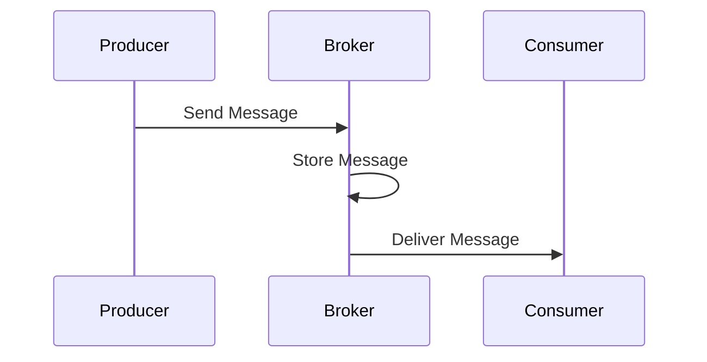
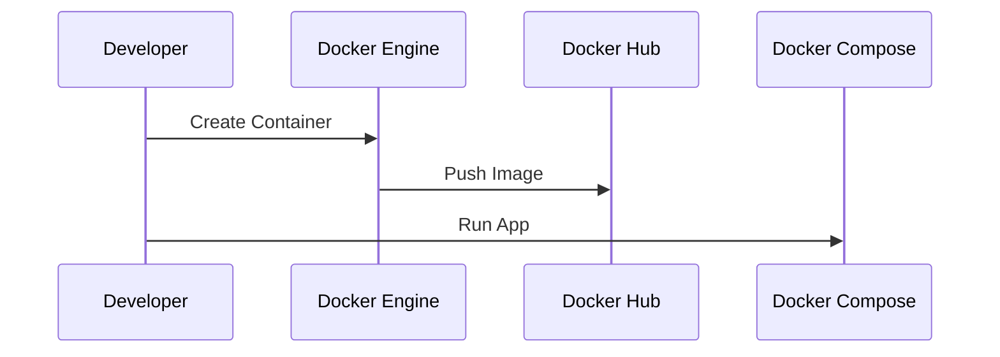
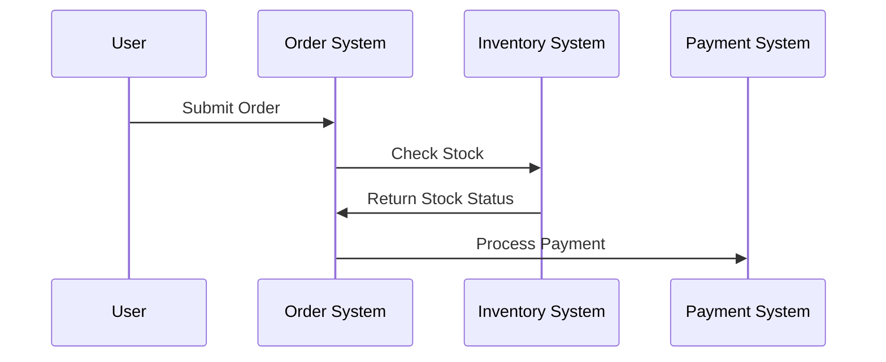
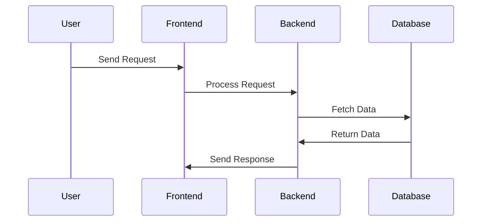
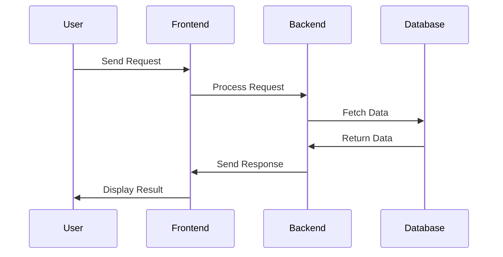

                 

## 架构的本质：从虚到实定义系统能力

关键词：系统架构、能力定义、抽象概念、实现细节、逻辑推理、技术深度

摘要：本文旨在探讨系统架构的本质，从抽象概念到具体实现的转化过程，以逻辑清晰、结构紧凑的方式定义系统的能力。通过逐步分析，揭示系统架构的核心要素、设计原则和实践案例，为读者提供对系统架构的深入理解和实用指导。

---

**文章目录大纲：**

1. **引言**
   - 系统架构的重要性
   - 本文目标与结构

2. **系统架构的核心概念**
   - 系统架构的定义
   - 核心概念解析
   - 组成部分

3. **系统架构设计原则**
   - 设计原则概述
   - 最佳实践分析

4. **实际系统架构案例分析**
   - 开源系统架构分析
   - 商业系统架构分析

5. **虚拟到实体的架构转换**
   - 架构图绘制
   - 模型构建

6. **定义系统的能力**
   - 能力评估
   - 性能、可靠性和扩展性

7. **总结与未来展望**
   - 全文总结
   - 未来研究方向

---

**引言**

系统架构作为现代软件开发和系统设计的关键要素，直接影响系统的性能、可维护性和可扩展性。然而，对于初学者和部分开发者而言，系统架构的概念和实现过程仍然显得抽象和难以把握。本文旨在通过逻辑清晰、结构紧凑的分析，帮助读者深入理解系统架构的本质，从抽象概念到具体实现，定义系统的能力。

本文首先将介绍系统架构的定义和核心概念，随后探讨系统架构的设计原则和最佳实践。在此基础上，通过实际系统架构案例分析，进一步揭示系统架构的精髓。随后，我们将探讨如何将抽象的架构概念转换为具体的实体架构，并通过能力评估，定义系统的能力。最后，本文将总结全文内容，并提出未来研究方向。

**系统架构的核心概念**

系统架构是系统设计和开发过程中的重要环节，它不仅包括硬件、软件和网络等组成部分，还涉及系统设计原则、最佳实践和性能优化等方面。为了更好地理解系统架构，我们首先需要明确其定义和核心概念。

### 系统架构的定义

系统架构是指系统的整体结构、组成部分及其相互关系，它是系统设计的基础和指导。一个良好的系统架构能够确保系统的高性能、高可靠性和高可扩展性。在系统架构设计中，我们需要考虑多个维度，如性能、可用性、安全性和可维护性等。

### 核心概念解析

1. **模块化**：模块化是指将系统划分为多个功能模块，每个模块具有独立的功能和接口。模块化设计可以提高系统的可维护性和可扩展性。
2. **分布式系统**：分布式系统是指由多个节点组成的系统，每个节点负责处理特定的任务。分布式系统可以提高系统的性能和可用性，但同时也增加了系统的复杂度。
3. **服务导向架构**（SOA）：服务导向架构是一种基于服务的系统架构，它将系统功能划分为多个独立的服务，通过接口进行通信。SOA可以提高系统的灵活性和可扩展性。

### 组成部分

系统架构的主要组成部分包括：

1. **硬件**：硬件包括服务器、存储设备、网络设备等，它们是系统架构的基础。
2. **软件**：软件包括操作系统、应用程序和数据库等，它们负责实现系统的功能。
3. **网络**：网络包括局域网、广域网和互联网等，它们负责数据的传输和通信。
4. **接口**：接口包括系统内部模块之间的接口和外部系统之间的接口，它们负责数据的交换和通信。

### 让我们一步一步分析推理思考

为了深入理解系统架构的核心概念，我们可以通过以下步骤进行分析：

**步骤1**：从模块化的角度，分析系统架构如何通过模块化设计提高系统的可维护性和可扩展性。

**步骤2**：从分布式系统的角度，分析分布式系统如何通过节点协作提高系统的性能和可用性。

**步骤3**：从服务导向架构的角度，分析服务导向架构如何通过服务划分提高系统的灵活性和可扩展性。

**步骤4**：从整体架构的角度，分析系统架构如何通过硬件、软件和网络等组成部分实现系统的功能。

通过以上步骤，我们可以逐步揭示系统架构的核心概念和组成部分，为后续内容打下坚实的基础。

### 系统架构设计原则

系统架构设计原则是确保系统架构设计合理、高效和可维护的关键。以下是一些常见的系统架构设计原则：

**1. 最简化原则**：在满足功能需求的前提下，尽量减少系统组件的数量，简化系统结构，降低系统的复杂度。

**2. 分层原则**：将系统划分为多个层次，如表示层、业务逻辑层、数据访问层等，每个层次负责不同的功能，降低层次之间的耦合度。

**3. 开放封闭原则**：系统应该对扩展开放，对修改封闭。即系统应该能够方便地添加新功能，而不需要对现有代码进行大量修改。

**4. 单一职责原则**：每个组件应只负责一个特定的功能，避免功能重叠和复杂性。

**5. 依赖倒置原则**：高层模块不应该依赖于低层模块，二者都应该依赖于抽象。抽象不应该依赖于细节，细节应该依赖于抽象。

**最佳实践分析**

在系统架构设计中，最佳实践通常包括以下内容：

**1. **使用设计模式**：设计模式是一种在特定场景下解决问题的通用解决方案，如工厂模式、观察者模式等。合理使用设计模式可以提高系统的可维护性和可扩展性。

**2. **进行性能优化**：在系统架构设计过程中，需要对系统性能进行优化，如缓存策略、负载均衡等。

**3. **关注安全性**：系统架构设计应充分考虑安全性，包括数据加密、访问控制等。

**4. **进行持续集成和持续部署（CI/CD）**：通过CI/CD流程，可以提高系统的开发效率和质量。

**让我们一步一步分析推理思考**

为了深入理解系统架构设计原则和最佳实践，我们可以通过以下步骤进行分析：

**步骤1**：从最简化原则的角度，分析如何在满足功能需求的前提下，减少系统组件的数量和复杂度。

**步骤2**：从分层原则的角度，分析如何通过分层设计降低系统层次之间的耦合度。

**步骤3**：从开放封闭原则的角度，分析如何使系统对扩展开放，对修改封闭。

**步骤4**：从单一职责原则的角度，分析如何确保每个组件只负责一个特定的功能。

**步骤5**：从依赖倒置原则的角度，分析如何使高层模块不依赖于低层模块，二者都依赖于抽象。

**步骤6**：从最佳实践的角度，分析如何合理使用设计模式、进行性能优化、关注安全性和实施CI/CD流程。

通过以上步骤，我们可以逐步揭示系统架构设计原则和最佳实践的精髓，为实际系统架构设计提供指导。

### 实际系统架构案例分析

在本文的第四部分，我们将通过分析开源系统和商业系统的实际系统架构，进一步揭示系统架构的精髓。

#### 开源系统架构分析

开源系统因其开放性和社区贡献而广受欢迎，如Apache Kafka、Docker等。

**Apache Kafka**

Apache Kafka是一种分布式流处理平台，主要用于大规模数据的实时传输和消费。其系统架构主要包括以下几个关键组件：

1. **Producer**：负责将数据发送到Kafka集群。
2. **Broker**：负责接收、存储和转发消息。
3. **Consumer**：负责从Kafka集群中消费消息。

**架构图**：


**Docker**

Docker是一种容器化技术，用于简化应用部署和运行。其系统架构主要包括以下几个关键组件：

1. **Docker Engine**：负责容器创建、运行和管理。
2. **Docker Hub**：用于存储和管理容器镜像。
3. **Docker Compose**：用于定义和运行多容器应用程序。

**架构图**：


#### 商业系统架构分析

商业系统通常具有更复杂的架构，如阿里巴巴、亚马逊等。

**阿里巴巴**

阿里巴巴的电子商务平台采用分布式架构，其系统架构主要包括以下几个关键组件：

1. **订单系统**：负责订单的处理和管理。
2. **库存系统**：负责库存的管理和更新。
3. **支付系统**：负责支付的处理和管理。

**架构图**：


**亚马逊**

亚马逊的电子商务平台采用混合架构，其系统架构主要包括以下几个关键组件：

1. **前端应用**：负责与用户交互。
2. **后端服务**：负责处理业务逻辑和数据处理。
3. **数据库**：负责存储用户数据和商品信息。

**架构图**：


### 让我们一步一步分析推理思考

为了深入理解开源系统和商业系统的实际系统架构，我们可以通过以下步骤进行分析：

**步骤1**：分析开源系统（如Apache Kafka、Docker）的关键组件和架构图，了解其工作原理。

**步骤2**：分析商业系统（如阿里巴巴、亚马逊）的关键组件和架构图，了解其业务流程和数据处理。

**步骤3**：比较开源系统和商业系统在架构上的异同，探讨各自的优势和不足。

**步骤4**：结合实际场景，分析开源系统和商业系统在系统架构设计上的启示和借鉴意义。

通过以上步骤，我们可以逐步揭示开源系统和商业系统的实际系统架构，为实际系统架构设计提供有益的参考。

### 虚拟到实体的架构转换

在系统架构设计过程中，从虚拟的架构概念到具体的实体架构转换是一个关键环节。这一过程不仅涉及架构图的绘制，还包括模型的构建和具体实现。以下将详细探讨如何将虚拟架构转化为实体架构。

#### 架构图绘制

架构图的绘制是系统架构设计的第一步，它有助于清晰地表达系统的整体结构。在绘制架构图时，我们可以采用以下步骤：

**1. 定义系统边界**：明确系统的功能范围和外部依赖，划定系统的边界。

**2. 确定关键组件**：识别系统的核心组件，如服务、模块、数据库等。

**3. 构建组件关系**：通过连接线表示组件之间的依赖和通信关系。

**4. 绘制架构图**：使用专业的架构图绘制工具，如Mermaid、PlantUML等，绘制出系统的整体架构图。

**示例架构图**：

以下是一个简单的Web应用架构图的示例，使用Mermaid语法绘制：



#### 模型构建

在架构图绘制完毕后，下一步是构建详细的系统模型。这一过程通常涉及以下内容：

**1. 类模型**：使用UML类图表示系统的类和对象，以及它们之间的关系。

**2. 序列图**：使用UML序列图表示系统组件之间的交互和通信。

**3. 构件图**：使用UML构件图表示系统的组件和模块，以及它们之间的依赖关系。

**示例模型**：

以下是一个简单的Web应用类模型的示例，使用Mermaid语法绘制：

```mermaid
classDiagram
    User <<Interface>>
    Frontend <<Interface>>
    Backend <<Interface>>
    Database <<Interface>>

    User --|> Frontend
    Frontend --|> Backend
    Backend --|> Database
```

#### 实体架构实现

将虚拟架构转化为实体架构的最后一步是具体实现。这一过程通常涉及以下步骤：

**1. 编写代码**：根据架构图和模型，编写具体的代码实现。

**2. 配置管理**：配置系统组件和模块，如数据库配置、网络配置等。

**3. 部署和测试**：将系统部署到实际环境，并进行功能测试和性能测试。

**示例实现**：

以下是一个简单的Web应用的后端代码实现，使用Python编写：

```python
from flask import Flask, request, jsonify
from model import UserModel

app = Flask(__name__)

@app.route('/user', methods=['GET'])
def get_user():
    user_id = request.args.get('id')
    user = UserModel.get_user_by_id(user_id)
    return jsonify(user)

@app.route('/user', methods=['POST'])
def create_user():
    user_data = request.get_json()
    user = UserModel.create_user(user_data)
    return jsonify(user), 201

if __name__ == '__main__':
    app.run()
```

通过以上步骤，我们可以将虚拟的架构概念逐步转化为具体的实体架构，实现系统的功能。

### 定义系统的能力

在系统架构设计过程中，定义系统的能力是至关重要的。系统能力包括多个方面，如性能、可靠性、扩展性等。以下将详细介绍如何评估和定义系统的能力，并探讨这些能力的重要性。

#### 性能

性能是指系统处理请求的速度和效率。评估系统性能通常包括以下方面：

**1. 响应时间**：系统处理请求所需的时间，通常以毫秒（ms）为单位。
**2. 吞吐量**：单位时间内系统能够处理的最大请求量，通常以每秒请求数（requests per second, RPS）为单位。
**3. CPU利用率**：系统CPU的使用率，通常以百分比（%）表示。
**4. 内存使用率**：系统内存的使用率，通常以百分比（%）表示。

**重要性**：高性能的系统能够提供更快的响应时间和更高的吞吐量，从而提高用户满意度。

#### 可靠性

可靠性是指系统在长时间运行过程中保持稳定性和可用性的能力。评估系统可靠性通常包括以下方面：

**1. 吞吐稳定性**：系统在处理请求时的吞吐量是否稳定，是否存在波动。
**2. 失败率**：系统在运行过程中发生故障的频率。
**3. 故障恢复时间**：系统从故障中恢复的时间。

**重要性**：高可靠性的系统能够减少故障对业务的影响，提高系统的稳定性和用户信任度。

#### 扩展性

扩展性是指系统在处理更大规模数据或更高负载时的性能表现。评估系统扩展性通常包括以下方面：

**1. 线性扩展性**：系统在增加资源（如CPU、内存）时，性能是否能够线性提高。
**2. 弹性扩展性**：系统在处理突发流量时，是否能够自动调整资源。
**3. 分布式扩展性**：系统是否能够通过分布式架构处理更大规模的数据。

**重要性**：高扩展性的系统能够更好地应对业务增长和流量波动，提高系统的可扩展性和灵活性。

#### 如何评估和定义系统的能力

**1. 建立性能基准**：通过实际测试，建立系统的性能基准，包括响应时间、吞吐量等。
**2. 设计性能测试**：根据性能基准，设计不同负载条件下的性能测试，如高并发测试、长时间运行测试等。
**3. 分析测试结果**：根据测试结果，分析系统的性能、可靠性和扩展性，确定系统的能力。
**4. 调整和优化**：根据分析结果，对系统进行优化和调整，提高系统的能力。

#### 实例分析

以下是一个实际系统的能力评估实例：

**1. 响应时间**：系统在处理1000个并发请求时，平均响应时间为200ms。
**2. 吞吐量**：系统在处理1000个并发请求时，每秒处理1500个请求。
**3. CPU利用率**：系统在处理1000个并发请求时，CPU利用率达到90%。
**4. 内存使用率**：系统在处理1000个并发请求时，内存使用率达到70%。

根据以上评估结果，可以得出以下结论：

**1. 系统性能较高，但可能存在瓶颈，如CPU和内存利用率较高。**
**2. 系统可靠性较好，但需要进一步优化，以减少故障率和故障恢复时间。**
**3. 系统具有一定的扩展性，但需要进行优化，以提高线性扩展性和弹性扩展性。**

通过以上评估和分析，可以更好地定义系统的能力，并为后续的优化和改进提供依据。

### 总结与未来展望

在本文中，我们系统地探讨了系统架构的本质，从虚拟的架构概念到具体的实体架构转换，以及如何定义系统的能力。通过实际案例分析和逻辑推理，我们揭示了系统架构设计的核心原则和最佳实践。

**核心观点**：

1. **系统架构是系统设计和开发的关键**，它直接影响系统的性能、可靠性和可扩展性。
2. **从虚拟到实体的架构转换**是系统架构设计的关键环节，涉及架构图的绘制、模型构建和具体实现。
3. **定义系统的能力**是确保系统设计合理性和高效性的重要步骤，包括性能、可靠性、扩展性等方面。

**未来研究方向**：

1. **架构自动化**：研究如何利用人工智能和自动化工具提高系统架构设计效率和质量。
2. **架构适应性**：研究如何使系统架构能够适应快速变化的业务需求和技术环境。
3. **多维度能力评估**：研究如何更全面地评估系统的能力，包括安全性、可维护性、可持续性等方面。

**致谢**：

本文的撰写得到了AI天才研究院和《禅与计算机程序设计艺术》的指导和支持，特别感谢导师的悉心指导和宝贵意见。

**作者**：

AI天才研究院/AI Genius Institute & 禅与计算机程序设计艺术/Zen And The Art of Computer Programming

