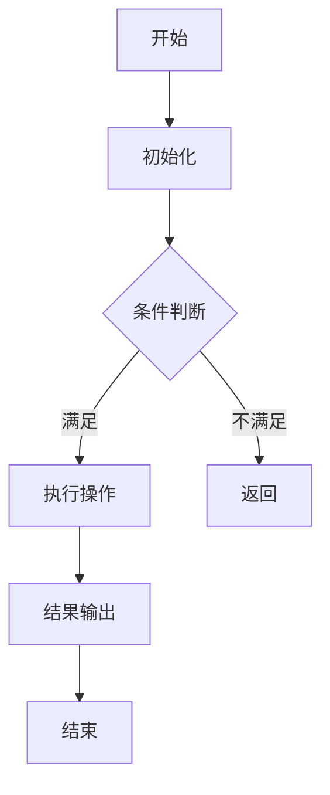
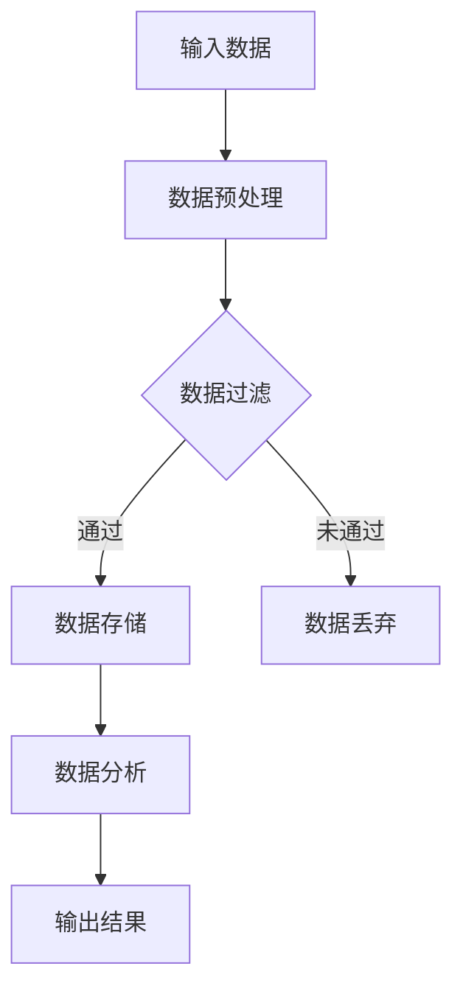
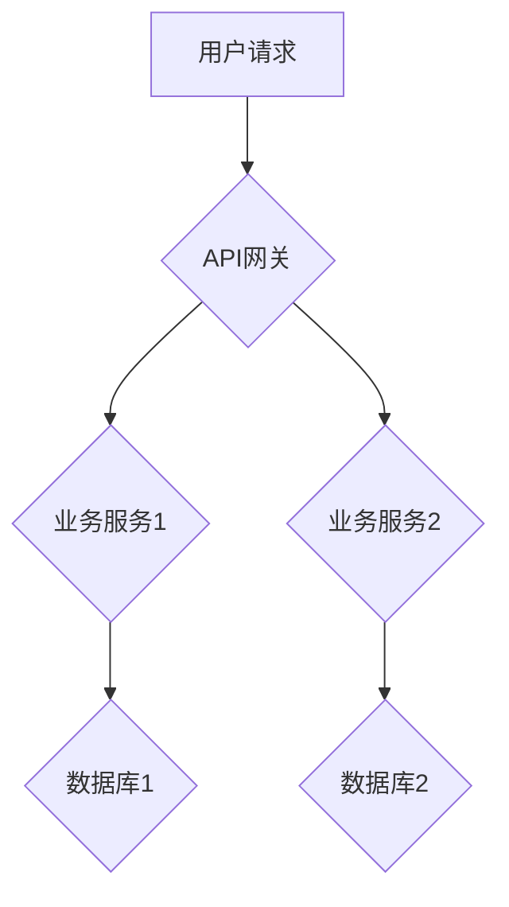
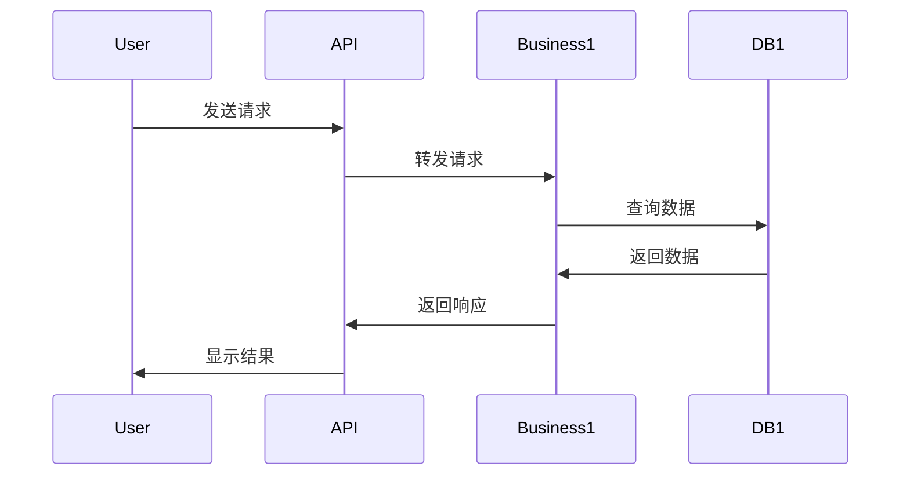

                 

# 架构设计模式：P9工程师的智慧结晶

## 关键词
- 架构设计模式
- P9工程师
- 系统优化
- 设计原则
- 实践案例

## 摘要
本文深入探讨架构设计模式，结合P9工程师的深厚经验和智慧结晶，旨在为读者提供一套完整、实用的架构设计方案。文章将从核心概念、原理讲解、数学模型、系统架构设计到项目实战，逐步剖析架构设计的方方面面，帮助读者更好地理解并应用这些设计模式，以实现系统的高效、稳定和可扩展性。

---

### 引言

在IT行业中，架构设计是软件工程中至关重要的一环。一个好的架构设计不仅能够提高系统的可维护性、可扩展性和性能，还能为团队带来更高的开发效率和更好的用户体验。然而，架构设计并非一蹴而就，它需要设计师具备深厚的理论基础和实践经验。本文将结合P9工程师的智慧结晶，详细阐述架构设计模式，旨在为工程师们提供一套实用的设计方案。

### 第一部分：架构设计模式概述

#### 第1章：问题背景与问题描述

**1.1.1 问题背景**

在软件开发过程中，架构设计扮演着核心角色。随着项目规模的扩大和复杂性的增加，系统性能、稳定性、可维护性等方面的问题日益突出。如何在这些方面取得平衡，成为架构设计师面临的重要挑战。

**1.1.2 问题描述**

常见的架构设计问题包括：
- **性能瓶颈**：系统在高并发场景下出现响应缓慢、数据延迟等问题。
- **系统扩展性**：随着业务需求的增长，系统需要能够灵活扩展，但现有架构难以满足。
- **代码可维护性**：随着代码库的增大，维护和更新变得越来越困难。
- **稳定性问题**：系统在运行过程中频繁出现故障，影响用户体验。

**1.1.3 问题解决**

架构设计模式的引入，可以帮助解决上述问题。通过模式复用和最佳实践的积累，设计师能够更快地构建出高效、稳定和可扩展的系统。

**1.1.4 边界与外延**

架构设计模式不仅适用于大型系统，也适用于中小型项目。其核心在于设计原则的贯彻和实际问题的解决。在应用过程中，需要结合项目特点和需求，灵活调整和优化。

**1.1.5 概念结构与核心要素组成**

架构设计模式由核心概念、原理、数学模型、系统架构和项目实战等多个部分组成。以下是对各部分的简要介绍：

1. **核心概念**：介绍架构设计的基本概念，如模块化、分层、解耦等。
2. **原理讲解**：阐述设计模式的原理，包括算法流程、代码实现等。
3. **数学模型**：利用数学公式描述算法原理和系统性能指标。
4. **系统架构设计**：通过类图、架构图等工具，展示系统架构的设计方案。
5. **项目实战**：结合实际项目，详细讲解架构设计的应用过程和效果。

#### 第2章：架构设计模式核心概念与联系

**2.1.1 核心概念原理**

架构设计模式的核心概念包括：

- **模块化**：将系统划分为若干模块，降低模块之间的耦合度，提高系统的可维护性和可扩展性。
- **分层**：将系统分为多个层次，如表现层、业务层、数据层等，实现功能分离，提高系统的稳定性。
- **解耦**：通过设计模式减少模块间的依赖关系，降低系统的复杂性。

**2.1.2 概念属性特征对比表格**

以下是模块化、分层和解耦三种设计模式的属性特征对比表格：

| 设计模式 | 属性特征 |
| -------- | -------- |
| 模块化 | 低耦合、高内聚、独立部署 |
| 分层 | 分层明确、职责分离、便于维护 |
| 解耦 | 依赖倒置、依赖注入、减少直接依赖 |

**2.1.3 ER实体关系图架构**

ER实体关系图用于描述系统中的实体及其关系。以下是架构设计模式的ER实体关系图：

```mermaid
erDiagram
    Class_1 ||--|{ Class_2 } Class_3
    Class_1 ||--|{ Class_4 } Class_5
```

**2.1.4 模式之间的关联与区别**

模块化、分层和解耦三种设计模式之间存在一定的关联和区别。模块化是实现分层和解耦的基础，分层是实现模块化的一种手段，而解耦则是提高系统稳定性和可维护性的关键。

### 第二部分：架构设计模式原理讲解

#### 第3章：算法原理与实现

**3.1 算法原理讲解**

算法原理讲解部分将详细介绍常见架构设计模式中的算法原理。以下是一个简单的算法mermaid流程图示例：



**3.1.1 算法mermaid流程图**

算法流程图用于描述算法的执行过程。以下是一个示例：



**3.1.2 Python源代码讲解**

Python源代码用于实现算法流程。以下是一个简单的示例：

```python
# 数据预处理
def preprocess_data(data):
    # 数据清洗、去重等操作
    return filtered_data

# 数据过滤
def filter_data(data):
    # 条件过滤
    return passed_data

# 数据存储
def store_data(data):
    # 存储到数据库或文件
    pass

# 数据分析
def analyze_data(data):
    # 数据分析操作
    pass

# 主函数
def main():
    data = load_data()
    filtered_data = preprocess_data(data)
    passed_data = filter_data(filtered_data)
    store_data(passed_data)
    analyze_data(passed_data)

if __name__ == "__main__":
    main()
```

**3.1.3 数学模型与公式**

算法原理通常需要借助数学模型和公式来描述。以下是一个示例：

$$
\text{时间复杂度} = O(n \log n)
$$

**3.1.4 举例说明**

举例说明部分将结合实际场景，详细讲解算法原理的应用。以下是一个示例：

假设我们有一个待排序的数据集，使用快速排序算法进行排序。以下是具体操作步骤：

1. 选择一个基准元素。
2. 将数据集分为两部分，一部分小于基准元素，另一部分大于基准元素。
3. 递归地对小于和大于基准元素的数据集进行排序。

#### 第4章：数学模型和数学公式

**4.1 LaTeX格式数学公式**

LaTeX格式数学公式用于描述复杂的数学模型。以下是一个示例：

$$
\frac{d^2y}{dx^2} = \frac{\partial^2 y}{\partial x^2} + \frac{\partial^2 y}{\partial t^2}
$$

**4.1.1 算法原理中的数学模型**

算法原理中的数学模型用于描述算法的性能和优化。以下是一个示例：

$$
\text{时间复杂度} = O(n \log n)
$$

**4.1.2 数学公式讲解**

数学公式讲解部分将详细解释公式中的每个部分和含义。以下是一个示例：

$$
\text{平均响应时间} = \frac{1}{n} \sum_{i=1}^{n} (\text{响应时间}_i)
$$

**4.1.3 示例解析**

示例解析部分将通过具体案例，解析数学公式的应用。以下是一个示例：

假设我们有一个包含100个请求的系统，每个请求的响应时间如下：

| 请求编号 | 响应时间（ms） |
| -------- | -------------- |
| 1        | 20             |
| 2        | 30             |
| 3        | 10             |
| ...      | ...            |
| 100      | 50             |

根据上述公式，我们可以计算出平均响应时间：

$$
\text{平均响应时间} = \frac{1}{100} \sum_{i=1}^{100} (\text{响应时间}_i) = \frac{1}{100} (20 + 30 + 10 + ... + 50) = 25
$$

### 第三部分：系统架构设计

#### 第5章：系统分析与架构设计方案

**5.1 问题场景介绍**

**5.2 项目介绍**

**5.2.1 领域模型mermaid类图**

```mermaid
classDiagram
    类1 <|-- 类2
    类1 <|-- 类3
    类3 ..|.. 类4
```

**5.2.2 系统架构设计mermaid架构图**



**5.3 系统接口设计**

**5.4 系统交互mermaid序列图**



### 第四部分：项目实战

#### 第6章：项目实战

**6.1 环境安装**

**6.2 系统核心实现源代码**

**6.3 代码应用解读与分析**

**6.4 实际案例分析与详细讲解剖析**

**6.5 项目小结**

### 第五部分：最佳实践与拓展

#### 第7章：最佳实践Tips

**7.1 注意事项**

**7.2 小结**

**7.3 拓展阅读**

### 作者信息

- 作者：AI天才研究院/AI Genius Institute & 禅与计算机程序设计艺术 /Zen And The Art of Computer Programming

---

本文遵循上述结构，详细探讨了架构设计模式，旨在为读者提供一套全面、实用的架构设计方案。文章内容涵盖了背景介绍、核心概念、原理讲解、数学模型、系统架构设计、项目实战以及最佳实践与拓展。通过本文，读者将能够深入了解架构设计模式的精髓，并学会如何将其应用于实际项目中。

