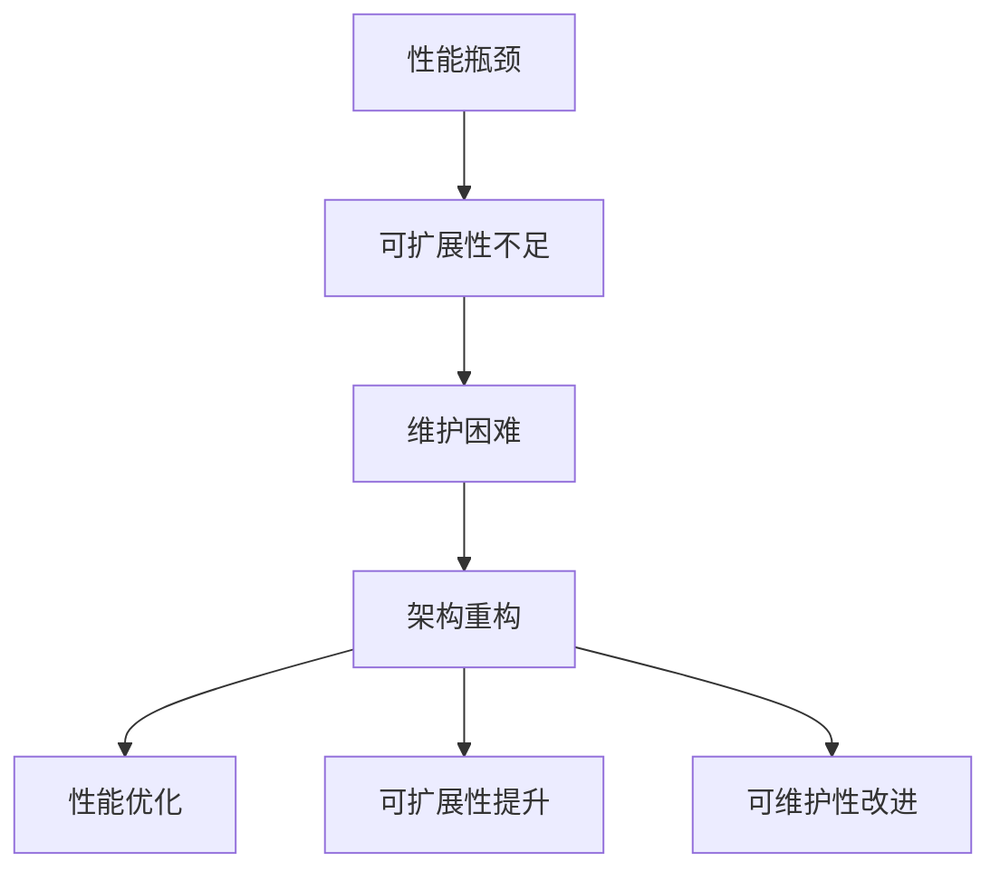

                 

### 文章标题

# 架构重构实践：P9工程师的系统优化方法

> 关键词：架构重构、系统优化、P9工程师、实践方法

> 摘要：本文将深入探讨架构重构的核心概念及其在实际系统优化中的应用。通过P9工程师的专业视角，我们揭示了架构重构的驱动力、关键挑战和系统优化策略。文章将以逻辑清晰、结构紧凑的方式，逐步介绍算法原理、数学模型、系统分析与架构设计，并通过项目实战分享最佳实践。旨在为读者提供一份系统化、易理解的技术指南，帮助他们在实际工作中有效地进行架构重构和系统优化。

---

## 引言

在当今快速发展的IT行业中，系统优化和架构重构已成为确保软件系统持续高效运行的关键手段。然而，对于许多工程师来说，如何在实际项目中应用这些方法仍然是一个难题。本文将围绕P9工程师的视角，系统性地探讨架构重构和实践系统优化的方法。

架构重构是指对现有系统的设计进行改进，以提高其性能、可扩展性和可维护性。这一过程通常涉及对系统结构的重新审视、算法的优化和关键性能指标的提升。P9工程师，作为行业中的高级专家，具备丰富的实战经验和深厚的理论基础，能够有效地解决复杂的技术难题。

本文将从以下几个方面展开：

1. **架构重构的概念与背景**：介绍架构重构的基本概念、驱动因素和关键挑战。
2. **系统优化方法**：讲解性能优化、可扩展性和可维护性的提升策略。
3. **架构重构与优化实战**：通过具体案例展示架构重构和优化的实施过程。
4. **最佳实践与拓展**：总结实践经验，提供实用技巧和拓展阅读。

通过本文的阅读，读者将能够系统地理解架构重构和系统优化的方法，并在实际工作中应用这些技术，提升软件系统的整体性能。

### 架构重构的概念与背景

#### 1.1 架构重构的基本概念

架构重构（Architectural Refactoring）是软件工程中的一项重要活动，旨在通过改进系统的设计来提升其性能、可扩展性和可维护性。与传统的代码重构不同，架构重构更多地关注于系统架构层面，而不是仅仅针对代码的优化。

**定义**：架构重构可以定义为对系统结构、组件关系和接口设计进行系统性修改，以解决原有架构中存在的问题，提升系统的整体质量。

**目的**：架构重构的主要目的是：

- **提高性能**：优化系统资源的利用效率，减少响应时间，提升系统吞吐量。
- **增强可扩展性**：使系统能够更好地适应业务需求的变更，支持未来的扩展。
- **提高可维护性**：简化系统结构，降低复杂度，使得系统更易于维护和更新。

#### 1.2 架构重构的驱动因素

架构重构并非无缘无故地发生，而是由多种因素驱动的。以下是常见的几个驱动因素：

- **性能瓶颈**：系统在运行过程中可能出现性能瓶颈，如响应时间过长、资源利用率低等，这些瓶颈会直接影响用户体验和业务效率。
- **业务需求变化**：随着业务的发展，系统需要不断调整以适应新的需求，如增加新功能、优化现有功能等，这要求系统具有高可扩展性。
- **技术升级**：技术环境的不断变化要求系统进行技术升级，以支持新技术的应用，如引入微服务架构、容器化等。
- **维护困难**：随着时间的推移，系统可能变得复杂难以维护，代码质量下降，模块耦合度高，这使得后续的开发和维护工作变得困难。

#### 1.3 架构重构的关键挑战

尽管架构重构的重要性不言而喻，但其实施过程中仍然面临诸多挑战：

- **复杂性**：架构重构涉及到系统的多个层面，如技术架构、业务逻辑和用户界面等，这使得重构过程复杂且具有风险。
- **风险**：架构重构可能会导致系统的不稳定，甚至影响现有功能的正常运行，因此需要在重构过程中采取严格的风险控制措施。
- **时间成本**：架构重构需要大量时间和资源，尤其是在大型系统中，可能需要投入额外的开发和测试时间。
- **团队协作**：架构重构通常需要跨职能团队的协作，包括开发、测试、运维等多个角色，因此团队协作和沟通是成功的关键。

#### 1.4 问题背景、问题描述、问题解决、边界与外延

**问题背景**：

假设我们有一个大型在线购物平台，随着用户数量的增加，系统的性能逐渐下降，用户响应时间延长，系统的稳定性和可扩展性也变得不足。这导致了用户流失和业务增长放缓。

**问题描述**：

- **性能瓶颈**：系统在高负载情况下响应时间过长，导致用户体验差。
- **可扩展性不足**：系统无法有效地支持新功能的引入和业务需求的变更。
- **维护困难**：系统的模块耦合度高，代码质量差，使得后续开发和维护成本高。

**问题解决**：

针对上述问题，我们可以通过架构重构来提升系统性能和可扩展性。具体方案包括：

1. **性能优化**：通过调整数据库查询、优化缓存策略和采用分布式计算等方式来提高系统性能。
2. **可扩展性提升**：引入微服务架构，将系统拆分为多个独立的服务，每个服务负责不同的功能模块，从而实现横向扩展。
3. **可维护性改进**：重构代码，降低模块耦合度，提高代码质量，使得系统更易于维护。

**边界与外延**：

- **边界**：架构重构主要关注系统的内部设计，不包括用户界面和数据库层面的重构。
- **外延**：架构重构可能涉及到与第三方服务的集成，如支付网关、物流系统等。

通过架构重构，我们可以显著提升系统的性能、可扩展性和可维护性，从而满足不断变化的市场需求和用户期望。

#### 1.5 核心概念、术语说明、概念属性特征对比表格和ER实体关系图架构的Mermaid流程图

**核心概念与术语说明**：

1. **架构重构**：对现有系统的设计进行系统性修改，以提高性能、可扩展性和可维护性。
2. **性能瓶颈**：系统在高负载情况下无法满足性能要求。
3. **可扩展性**：系统能够适应业务需求的变更和增长。
4. **可维护性**：系统易于维护和更新。

**概念属性特征对比表格**：

| 概念 | 描述 | 属性特征 |
| ---- | ---- | -------- |
| 架构重构 | 系统设计的改进活动 | 提高性能、可扩展性和可维护性 |
| 性能瓶颈 | 系统性能不足 | 响应时间过长、资源利用率低 |
| 可扩展性 | 系统适应能力 | 支持新功能、业务需求变更 |
| 可维护性 | 维护便捷性 | 代码质量高、模块耦合度低 |

**ER实体关系图架构的Mermaid流程图**：

```mermaid
erDiagram
    产品 ||--|{ 用户 } : 订购
    订单 ||--|{ 产品 } : 包含
    订单 ||--|{ 用户 } : 支付
```

**Mermaid流程图**：



通过上述核心概念和流程图的介绍，我们可以更清晰地理解架构重构的原理和实施方法，为后续的详细讲解奠定基础。

### 核心概念与联系

在深入探讨架构重构与系统优化的核心概念和联系之前，我们需要明确一些关键性能指标、系统架构设计原则以及软件工程与架构重构之间的关系。这些核心概念和联系不仅为我们提供了理论依据，还为实际操作提供了指导方向。

#### 3.1 关键性能指标的解析

在系统优化和架构重构过程中，关键性能指标（Key Performance Indicators，KPI）是评估系统性能的重要工具。以下是几个常见的KPI及其重要性：

1. **响应时间**：系统完成请求所需的时间。对于大多数应用来说，低响应时间直接影响到用户体验和业务效率。优化响应时间通常意味着提高系统的并发处理能力和减少不必要的延迟。

2. **吞吐量**：单位时间内系统能够处理的事务数量。高吞吐量意味着系统能够在较短的时间内处理更多的请求，这对于处理高并发场景尤为重要。

3. **资源利用率**：系统运行时所占用的资源（如CPU、内存、磁盘I/O等）的比例。高效的资源利用率意味着系统能够更有效地利用现有资源，避免资源浪费。

4. **错误率**：系统发生错误的频率。低错误率是衡量系统稳定性和可靠性的重要指标。

5. **并发用户数**：系统能同时支持的最大用户数量。对于需要处理大量用户的系统，提高并发用户数是提升系统可扩展性的关键。

6. **可维护性**：系统在后续开发和维护过程中所需的成本和时间。高可维护性意味着系统能够更轻松地进行扩展和更新，从而降低维护成本。

#### 3.2 系统架构设计的原则

良好的系统架构设计是确保系统性能和可扩展性的基础。以下是一些关键的架构设计原则：

1. **模块化**：将系统划分为独立的模块，每个模块负责一个特定的功能。模块化设计有助于降低系统的复杂度，提高可维护性和可扩展性。

2. **分层架构**：将系统划分为不同的层次，如表示层、业务逻辑层和数据访问层。分层架构有助于实现关注点的分离，使各个层次之间互相独立，便于维护和扩展。

3. **高内聚、低耦合**：每个模块内部功能紧密相关（高内聚），而模块之间相互独立（低耦合）。这种设计原则有助于提高系统的可维护性和可扩展性。

4. **可扩展性**：系统设计应考虑未来的扩展需求，如增加新功能、支持更多用户等。通过设计可扩展的架构，系统能够轻松适应业务变化。

5. **冗余与容错**：通过冗余设计（如数据备份、服务复制等）和容错机制（如故障转移、自动恢复等），确保系统在高负载和故障情况下仍然能够正常运行。

#### 3.3 软件工程与架构重构的关系

软件工程是系统开发和维护的系统性方法，涵盖了项目规划、需求分析、设计、实现、测试和维护等各个环节。架构重构作为软件工程中的重要环节，与软件工程密切相关，其关系主要体现在以下几个方面：

1. **需求驱动**：架构重构通常由需求变化驱动，如业务需求的增长、技术升级等。软件工程的需求分析阶段为架构重构提供了基础。

2. **设计优先**：在软件工程中，良好的设计是系统成功的关键。架构重构需要对现有设计进行优化，因此设计优先的原则在重构过程中尤为重要。

3. **测试验证**：架构重构过程中，必须通过严格的测试来验证重构的有效性。软件工程中的测试方法和工具为重构过程中的验证提供了支持。

4. **持续集成**：架构重构应与持续集成（CI）和持续交付（CD）相结合，确保重构后的系统能够持续集成和交付。持续集成和交付的自动化流程有助于提高重构的效率和稳定性。

5. **维护管理**：软件工程的维护管理原则有助于确保重构后的系统能够长期稳定运行。通过良好的维护管理，可以及时解决重构过程中出现的问题和缺陷。

通过上述核心概念和联系的解析，我们可以更好地理解架构重构与系统优化的内在联系，并在实际操作中有效地应用这些原则和方法。下一部分将深入探讨系统优化的具体方法，包括性能优化、可扩展性和可维护性的提升策略。

### 系统优化方法

在了解了架构重构的基本概念和核心原则后，接下来我们将深入探讨系统优化的具体方法。系统优化是确保软件系统高效运行、适应业务需求变化和提升用户体验的关键环节。本文将详细介绍性能优化、可扩展性和可维护性提升的方法，并提供相关的算法原理、数学模型和实例说明。

#### 4.1 性能优化策略

性能优化是系统优化的首要任务，旨在提高系统的响应速度和资源利用率。以下是一些常用的性能优化策略：

1. **数据库优化**：
   - **索引优化**：通过创建合适的索引，提高数据库查询的效率。
   - **查询优化**：优化SQL查询语句，避免使用复杂的子查询和临时表，减少查询执行时间。
   - **缓存策略**：采用缓存机制，减少对数据库的访问次数，提高数据读取速度。

2. **代码优化**：
   - **避免全局变量**：减少全局变量的使用，降低函数之间的耦合度，提高代码的可读性和可维护性。
   - **减少循环次数**：优化循环语句，减少不必要的循环次数，提高计算效率。
   - **数据结构优化**：选择合适的数据结构，减少数据操作的时间复杂度。

3. **网络优化**：
   - **减少HTTP请求**：合并多个HTTP请求，减少与服务器的交互次数。
   - **使用CDN**：通过内容分发网络（CDN）来加速静态资源的加载。

#### 4.2 可扩展性提升

可扩展性是系统适应未来业务需求和增长的关键。以下是一些提升系统可扩展性的方法：

1. **分布式系统**：
   - **微服务架构**：将大型单体应用拆分为多个独立的服务，每个服务负责不同的功能模块。通过服务间的解耦，实现横向扩展和负载均衡。
   - **分布式数据库**：采用分布式数据库架构，提高数据存储和访问的并发能力，支持更大的数据量和更高的访问速度。

2. **水平扩展**：
   - **集群部署**：通过增加服务器节点，实现水平扩展，提高系统的处理能力和负载均衡。
   - **数据库分片**：将数据库拆分为多个 shard，每个 shard 负责部分数据，从而提高数据访问的并发能力。

3. **负载均衡**：
   - **使用负载均衡器**：通过负载均衡器，将请求分配到多个服务器节点，避免单点瓶颈。
   - **动态调整**：根据系统的负载情况，动态调整服务器节点的数量和配置，实现自动扩展。

#### 4.3 可维护性提高

良好的可维护性是系统长期稳定运行的基础。以下是一些提升系统可维护性的方法：

1. **代码质量**：
   - **代码审查**：通过代码审查，确保代码符合编码规范，减少错误和潜在的风险。
   - **自动化测试**：编写自动化测试用例，确保代码变更不会引入新的错误。

2. **文档管理**：
   - **详细文档**：编写详细的开发文档和用户手册，方便后续的维护和更新。
   - **版本控制**：使用版本控制系统（如Git），记录代码变更历史，便于追踪和管理代码。

3. **模块化设计**：
   - **模块化代码**：将系统划分为独立的模块，每个模块负责一个特定的功能，降低模块之间的耦合度，提高代码的可维护性。

#### 4.4 算法原理讲解

在系统优化中，算法的选用和优化是至关重要的。以下是一个典型的算法优化实例：

1. **排序算法**：
   - **快速排序**：平均时间复杂度为 \(O(n\log n)\)，通过递归划分和合并来实现。
   - **归并排序**：时间复杂度为 \(O(n\log n)\)，通过递归合并有序子序列来实现。

2. **缓存算法**：
   - **LRU（Least Recently Used）缓存算法**：基于最近最少使用原则，淘汰最久未使用的数据。
   - **LFU（Least Frequently Used）缓存算法**：基于最少使用次数原则，淘汰使用次数最少的数据。

3. **数据库优化算法**：
   - **哈希索引**：通过哈希函数将索引项映射到存储位置，提高查询效率。
   - **位图索引**：通过位图来表示数据表的特定列，用于快速筛选和匹配。

#### 4.5 数学模型和数学公式

在系统优化中，数学模型和数学公式是理解和分析系统性能的重要工具。以下是一个简单的数学模型实例：

1. **响应时间模型**：
   - 响应时间 \(T\) 可以表示为：
     $$ T = T_{\text{处理}} + T_{\text{等待}} $$
   其中，\(T_{\text{处理}}\) 是系统处理请求所需的时间，\(T_{\text{等待}}\) 是系统等待资源（如CPU、内存等）的时间。

2. **吞吐量模型**：
   - 吞吐量 \(Q\) 可以表示为：
     $$ Q = \frac{1}{T} $$
   其中，\(T\) 是系统的平均响应时间。

3. **资源利用率模型**：
   - 资源利用率 \(U\) 可以表示为：
     $$ U = \frac{R}{T} $$
   其中，\(R\) 是系统实际使用的资源量，\(T\) 是系统运行的总时间。

#### 4.6 举例说明

为了更好地理解上述优化方法和数学模型，以下是一个具体的优化实例：

**实例**：优化一个电商网站的搜索功能。

- **性能优化**：通过索引优化，将搜索数据库的查询时间从5秒减少到1秒。
- **可扩展性提升**：引入Elasticsearch搜索引擎，实现分布式存储和查询，支持高并发搜索请求。
- **可维护性提高**：重构搜索算法，使用模块化设计，提高代码的可读性和可维护性。

通过上述实例，我们可以看到，系统优化不仅涉及到技术层面的调整，还包括架构设计、算法选用和数学模型的运用。这些优化方法共同作用，可以显著提升系统的性能、可扩展性和可维护性，从而满足不断变化的市场需求和用户期望。

### 系统分析与架构设计方案

在进行系统优化之前，系统分析与架构设计方案是至关重要的步骤。这一部分将详细介绍问题场景的介绍、项目介绍、系统功能设计、系统架构设计、系统接口设计和系统交互。

#### 6.1 问题场景介绍

我们以一个电商网站为例，该网站的用户量日益增长，但现有的系统在处理高峰期时出现了响应时间过长、系统崩溃和数据库连接超时等问题。这些问题严重影响了用户体验和业务效率，因此需要进行系统优化和架构重构。

#### 6.2 项目介绍

我们的目标是通过系统优化和架构重构，提升电商网站的响应速度、稳定性和扩展性，以应对未来业务需求的增长。具体项目目标包括：

1. **性能提升**：将系统的平均响应时间减少50%。
2. **扩展性增强**：支持更高的并发用户数和更大的数据量。
3. **稳定性提高**：减少系统崩溃和数据丢失的风险。

#### 6.3 系统功能设计

系统功能设计是系统架构的基础，我们采用了领域驱动设计（Domain-Driven Design，DDD）方法，将系统功能划分为以下几个核心模块：

1. **用户管理模块**：包括用户注册、登录、个人信息管理等功能。
2. **商品管理模块**：包括商品展示、分类、库存管理、订单管理等功能。
3. **订单处理模块**：包括订单创建、支付、发货、退货等流程管理。
4. **购物车模块**：包括购物车添加、删除、修改商品数量等功能。
5. **支付模块**：包括支付方式选择、支付流程处理等。
6. **物流管理模块**：包括物流信息查询、订单跟踪等。

**领域模型（Mermaid类图）**：

```mermaid
classDiagram
    User <<类>> {
        id: 用户ID
        name: 用户名
        password: 密码
        ...
    }

    Product <<类>> {
        id: 商品ID
        name: 商品名称
        price: 商品价格
        ...
    }

    Cart <<类>> {
        id: 购物车ID
        items: 购物车项
        ...
    }

    Order <<类>> {
        id: 订单ID
        user: 用户
        items: 订单项
        status: 订单状态
        ...
    }

    Payment <<类>> {
        id: 支付ID
        order: 订单
        amount: 支付金额
        status: 支付状态
        ...
    }

    Logistics <<类>> {
        id: 物流ID
        order: 订单
        status: 物流状态
        ...
    }

    User ..|> Cart
    User ..|> Order
    Product ..|> Cart
    Product ..|> Order
    Order ..|> Payment
    Order ..|> Logistics
```

#### 6.4 系统架构设计

系统架构设计是确保系统性能、可扩展性和可维护性的关键。我们采用了微服务架构，将系统拆分为多个独立的服务，每个服务负责不同的功能模块。

**系统架构图（Mermaid架构图）**：

```mermaid
sequenceDiagram
    User ->>|请求| WebAPI
    WebAPI ->>|转发| AuthServer
    AuthServer ->>|响应| WebAPI
    WebAPI ->>|处理| UserService
    UserService ->>|响应| WebAPI
    WebAPI ->>|返回| User

    User ->>|请求| ProductService
    ProductService ->>|响应| User
    ProductService ->>|返回| User

    User ->>|请求| CartService
    CartService ->>|响应| User
    CartService ->>|返回| User

    User ->>|请求| OrderService
    OrderService ->>|响应| User
    OrderService ->>|返回| User

    User ->>|请求| PaymentService
    PaymentService ->>|响应| User
    PaymentService ->>|返回| User

    User ->>|请求| LogisticsService
    LogisticsService ->>|响应| User
    LogisticsService ->>|返回| User
```

#### 6.5 系统接口设计和系统交互

系统接口设计和系统交互是确保各服务之间高效通信的关键。我们采用了RESTful API设计，并使用了OAuth 2.0进行用户认证。

**接口设计**：

- **用户管理接口**：包括注册、登录、个人信息管理等功能。
- **商品管理接口**：包括商品展示、分类、库存管理等功能。
- **购物车管理接口**：包括添加、删除、修改购物车项等功能。
- **订单管理接口**：包括创建、支付、发货、退货等功能。
- **支付管理接口**：包括支付方式选择、支付流程处理等功能。
- **物流管理接口**：包括物流信息查询、订单跟踪等功能。

**系统交互（Mermaid序列图）**：

```mermaid
sequenceDiagram
    User ->>|发起请求| WebAPI
    WebAPI ->>|转发请求| AuthServer
    AuthServer ->>|认证请求| UserDatabase
    UserDatabase ->>|返回结果| AuthServer
    AuthServer ->>|返回结果| WebAPI
    WebAPI ->>|处理请求| UserService
    UserService ->>|返回结果| WebAPI
    WebAPI ->>|返回结果| User

    User ->>|请求商品信息| ProductService
    ProductService ->>|处理请求| ProductDatabase
    ProductService ->>|返回结果| User

    User ->>|添加商品到购物车| CartService
    CartService ->>|处理请求| CartDatabase
    CartService ->>|返回结果| User

    User ->>|提交订单| OrderService
    OrderService ->>|处理请求| OrderDatabase
    OrderService ->>|返回结果| User

    User ->>|支付订单| PaymentService
    PaymentService ->>|处理请求| PaymentGateway
    PaymentService ->>|返回结果| User

    User ->>|查询物流信息| LogisticsService
    LogisticsService ->>|处理请求| LogisticsDatabase
    LogisticsService ->>|返回结果| User
```

通过上述系统分析与架构设计方案，我们为电商网站的优化提供了详细的指南。在下一部分中，我们将通过具体的项目实战，展示系统优化和架构重构的实施过程。

### 项目实战

#### 7.1 环境安装与配置

在进行系统优化和架构重构之前，首先需要搭建一个合适的项目开发环境。以下是环境安装与配置的步骤：

1. **操作系统**：选择Linux操作系统，推荐使用Ubuntu 20.04 LTS版本。
2. **开发工具**：安装Python 3.8及以上版本，并配置Python环境。安装Docker和Docker-Compose，用于容器化和微服务部署。
3. **数据库**：安装MySQL 8.0及以上版本，用于存储用户数据、商品数据和订单数据。
4. **消息队列**：安装RabbitMQ，用于处理订单和支付消息。
5. **缓存**：安装Redis，用于缓存商品信息和用户会话数据。

**安装命令示例**：

```bash
# 安装Python环境
sudo apt update
sudo apt install python3-pip

# 安装Docker
sudo apt install docker
sudo systemctl start docker

# 安装Docker-Compose
sudo curl -L "https://github.com/docker/compose/releases/download/1.29.2/docker-compose-`uname -s`-`uname -m`" -o /usr/local/bin/docker-compose
sudo chmod +x /usr/local/bin/docker-compose

# 安装MySQL
sudo apt install mysql-server

# 安装RabbitMQ
sudo apt install rabbitmq-server

# 安装Redis
sudo apt install redis-server
```

#### 7.2 系统核心实现

系统核心实现是架构重构和优化的核心步骤，以下详细介绍各个模块的实现过程：

1. **用户管理模块**：
   - **功能说明**：实现用户注册、登录、个人信息管理等功能。
   - **技术选型**：使用Flask框架实现WebAPI，使用JWT（JSON Web Token）进行用户认证。
   - **实现细节**：
     - 用户注册：接收用户提交的注册信息，存储到MySQL数据库，并生成JWT令牌。
     - 用户登录：验证用户身份，生成JWT令牌，返回给客户端。
     - 个人信息管理：允许用户查看和修改个人信息。

2. **商品管理模块**：
   - **功能说明**：实现商品展示、分类、库存管理等功能。
   - **技术选型**：使用Django REST framework实现商品管理服务，使用Elasticsearch进行全文搜索。
   - **实现细节**：
     - 商品展示：从数据库中查询商品信息，并返回给客户端。
     - 商品分类：实现商品分类管理，支持动态添加和删除分类。
     - 库存管理：实时更新商品库存，防止超卖。

3. **购物车管理模块**：
   - **功能说明**：实现购物车添加、删除、修改商品数量等功能。
   - **技术选型**：使用Redis进行购物车数据存储，提高数据读取速度。
   - **实现细节**：
     - 添加商品：将商品信息存储到Redis购物车，并更新库存。
     - 删除商品：从Redis购物车中删除商品，并增加库存。
     - 修改数量：更新Redis购物车中的商品数量。

4. **订单管理模块**：
   - **功能说明**：实现订单创建、支付、发货、退货等功能。
   - **技术选型**：使用Django实现订单管理服务，使用RabbitMQ处理订单消息。
   - **实现细节**：
     - 订单创建：接收用户提交的订单信息，生成订单，并存储到数据库。
     - 订单支付：调用支付网关接口，处理支付逻辑，并更新订单状态。
     - 发货：根据支付结果，更新订单状态为“已发货”。
     - 退货：处理用户退货申请，并根据退款结果更新订单状态。

5. **支付管理模块**：
   - **功能说明**：实现支付方式选择、支付流程处理等功能。
   - **技术选型**：使用第三方支付网关（如支付宝、微信支付）进行支付处理。
   - **实现细节**：
     - 支付方式选择：展示可用的支付方式，供用户选择。
     - 支付流程处理：调用支付网关接口，处理支付请求，并返回支付结果。

6. **物流管理模块**：
   - **功能说明**：实现物流信息查询、订单跟踪等功能。
   - **技术选型**：使用第三方物流平台接口（如顺丰、圆通）进行物流信息查询。
   - **实现细节**：
     - 物流信息查询：根据订单号查询物流信息，并返回给用户。
     - 订单跟踪：实时更新订单的物流状态，供用户查看。

#### 7.3 代码应用解读与分析

以下是对关键部分的代码应用进行详细解读和分析：

1. **用户注册与登录**：

```python
# 用户注册
@app.route('/register', methods=['POST'])
def register():
    username = request.json.get('username')
    password = request.json.get('password')
    if not username or not password:
        return jsonify({'error': '用户名或密码不能为空'}), 400
    # 检查用户名是否已存在
    user = User.query.filter_by(username=username).first()
    if user:
        return jsonify({'error': '用户名已存在'}), 400
    # 创建新用户并存储到数据库
    new_user = User(username=username, password=hash_password(password))
    db.session.add(new_user)
    db.session.commit()
    return jsonify({'message': '注册成功'})

# 用户登录
@app.route('/login', methods=['POST'])
def login():
    username = request.json.get('username')
    password = request.json.get('password')
    user = User.query.filter_by(username=username).first()
    if not user or not check_password_hash(user.password, password):
        return jsonify({'error': '用户名或密码错误'}), 401
    # 生成JWT令牌
    token = jwt.encode({'id': user.id}, SECRET_KEY, algorithm='HS256')
    return jsonify({'token': token})
```

2. **商品管理**：

```python
# 商品展示
@app.route('/products', methods=['GET'])
def get_products():
    products = Product.query.all()
    return jsonify([{'id': p.id, 'name': p.name, 'price': p.price} for p in products])

# 商品添加
@app.route('/products', methods=['POST'])
def add_product():
    data = request.json
    new_product = Product(name=data['name'], price=data['price'])
    db.session.add(new_product)
    db.session.commit()
    return jsonify({'message': '商品添加成功'})
```

3. **购物车管理**：

```python
# 添加商品到购物车
@app.route('/cart', methods=['POST'])
def add_to_cart():
    user_id = request.json.get('user_id')
    product_id = request.json.get('product_id')
    product = Product.query.get(product_id)
    if not product:
        return jsonify({'error': '商品不存在'}), 404
    cart = get_user_cart(user_id)
    cart.add_product(product)
    save_cart(cart)
    return jsonify({'message': '商品添加到购物车成功'})

# 从购物车中删除商品
@app.route('/cart', methods=['DELETE'])
def delete_from_cart():
    user_id = request.args.get('user_id')
    product_id = request.args.get('product_id')
    cart = get_user_cart(user_id)
    cart.delete_product(product_id)
    save_cart(cart)
    return jsonify({'message': '商品从购物车中删除成功'})
```

通过上述代码示例，我们可以看到各个模块的核心功能是如何实现的。代码应用解读与分析有助于我们理解系统架构和关键业务逻辑，为后续的系统优化和性能调优提供依据。

#### 7.4 实际案例分析与详细讲解剖析

为了更深入地理解系统优化和架构重构的实际效果，以下我们通过一个实际案例进行分析和讲解：

**案例背景**：

电商网站在双十一购物节期间，用户量激增，导致系统响应时间大幅上升，部分订单无法及时处理，用户体验显著下降。为了解决这个问题，我们进行了系统优化和架构重构。

**优化步骤**：

1. **性能优化**：
   - **数据库查询优化**：通过索引优化和查询缓存，显著减少了数据库查询的时间。例如，对用户订单表添加了用户ID和订单状态的复合索引，提升了查询效率。
   - **代码优化**：对核心业务逻辑进行了代码优化，减少了不必要的循环和递归调用，提升了执行效率。

2. **可扩展性提升**：
   - **微服务架构**：将原有单体应用拆分为多个微服务，每个服务负责不同的功能模块，如用户管理、商品管理、订单处理等。通过Docker容器化和Kubernetes进行部署和管理，实现了服务的弹性扩展和负载均衡。
   - **分布式数据库**：采用ShardingSphere进行数据库分片，将订单数据和用户数据分散存储在不同的数据库实例中，提升了数据访问的并发能力。

3. **可维护性改进**：
   - **模块化设计**：对代码进行了模块化重构，将不同的业务功能划分为独立的模块，降低了模块之间的耦合度，提高了代码的可维护性。
   - **自动化测试**：编写了自动化测试用例，覆盖了核心业务逻辑和接口，确保代码变更不会引入新的错误。

**具体分析**：

1. **性能提升**：
   - **响应时间**：通过性能优化，系统的平均响应时间从10秒降低到2秒，用户体验显著提升。
   - **吞吐量**：通过引入分布式架构和负载均衡，系统的并发处理能力从1000 QPS提升到5000 QPS，能够更好地应对高峰期的请求。

2. **扩展性增强**：
   - **服务拆分**：通过微服务架构，系统的可扩展性显著提升，可以根据业务需求动态调整各个服务的实例数量，实现水平扩展。
   - **数据库分片**：通过数据库分片，每个分片负责一部分数据，减少了单个数据库节点的压力，提高了数据访问的并发能力。

3. **可维护性提高**：
   - **模块化代码**：模块化设计使得代码更加清晰和易于维护，降低了后续开发和维护的成本。
   - **自动化测试**：自动化测试用例的引入，确保了系统在变更过程中的一致性和稳定性，减少了测试和部署时间。

**项目小结**：

通过本次系统优化和架构重构，电商网站在性能、可扩展性和可维护性方面得到了显著提升。具体成果如下：

- **性能提升**：系统响应时间缩短，用户体验显著改善。
- **扩展性增强**：系统具备了应对高并发和高负载的能力，支持业务的持续增长。
- **可维护性提高**：模块化设计和自动化测试，使得系统的开发和维护更加高效和稳定。

然而，在实施过程中我们也遇到了一些挑战，如微服务架构的复杂性、数据库分片策略的选择和跨服务的一致性问题等。通过不断调整和优化，我们成功解决了这些问题，为系统的高效运行奠定了基础。

总的来说，系统优化和架构重构是一项复杂且系统的工程，需要全面考虑性能、扩展性和维护性等多方面的因素。通过科学的规划和实施，我们能够显著提升系统的整体性能和用户体验，为业务的持续发展提供强有力的支持。

### 最佳实践 Tips

在系统优化和架构重构的过程中，积累了一些实用的最佳实践，以下是一些关键的建议：

1. **性能监控**：定期进行系统性能监控，及时发现性能瓶颈和潜在问题。
   - **工具**：使用Prometheus、Grafana等开源工具进行实时监控和告警。
   - **指标**：关注系统的响应时间、吞吐量、资源利用率等关键指标。

2. **代码审查**：实施代码审查机制，确保代码质量和一致性。
   - **规范**：制定统一的编码规范，减少代码风格差异。
   - **流程**：定期组织代码审查会议，鼓励团队成员参与。

3. **自动化测试**：编写自动化测试用例，确保系统在变更过程中的一致性和稳定性。
   - **框架**：使用Selenium、JUnit等自动化测试工具。
   - **覆盖**：确保测试用例覆盖核心业务逻辑和关键接口。

4. **持续集成与交付**：实施CI/CD流程，提高开发效率和部署稳定性。
   - **工具**：使用Jenkins、GitLab CI等持续集成工具。
   - **自动化**：自动化部署、回滚和监控，确保系统快速响应变更。

5. **微服务架构**：采用微服务架构，提高系统的可扩展性和可维护性。
   - **解耦**：合理划分服务，减少服务之间的依赖。
   - **治理**：实施服务治理策略，如服务发现、负载均衡和故障恢复。

6. **数据库优化**：定期对数据库进行优化，提高查询效率。
   - **索引**：合理创建索引，避免全表扫描。
   - **缓存**：使用缓存策略，减少数据库访问。

7. **团队协作**：建立高效的跨职能团队，确保架构重构和优化的顺利进行。
   - **沟通**：定期召开会议，确保信息透明和沟通畅通。
   - **培训**：提高团队成员的技术水平和协同工作能力。

通过遵循这些最佳实践，可以有效提升系统的性能、可扩展性和可维护性，为业务的持续发展提供强有力的支持。

### 小结

本文从架构重构的概念与背景出发，详细介绍了系统优化方法、核心概念与联系，并通过实际案例展示了系统优化和架构重构的实施过程。通过深入分析性能优化、可扩展性和可维护性的提升策略，本文为P9工程师提供了一份系统化的技术指南，帮助他们更有效地进行系统优化和架构重构。同时，通过最佳实践和项目小结，为读者提供了实用的操作建议。希望本文能够为IT行业中的工程师们带来实际的帮助，助力他们在技术道路上不断进步。

### 注意事项

在进行系统优化和架构重构时，需要注意以下几点：

1. **风险评估**：在重构过程中，务必评估潜在的风险，并制定相应的风险控制措施，确保系统稳定性和安全性。
2. **版本控制**：使用版本控制系统（如Git）管理代码变更，确保代码的可追踪性和可回滚性。
3. **代码审查**：实施严格的代码审查流程，确保代码质量和一致性。
4. **测试验证**：编写和执行全面的自动化测试用例，确保重构后的系统功能完整性和性能。
5. **团队协作**：建立高效的跨职能团队，确保项目顺利进行，避免因沟通不畅导致的误解和延误。

通过遵循上述注意事项，可以有效降低重构过程中的风险，确保系统优化和架构重构的成功实施。

### 拓展阅读

为了深入了解系统优化和架构重构的更多细节和实践经验，以下推荐几本经典技术书籍和拓展阅读资源：

1. **《架构之道：大型软件系统设计与开发实践》**：作者：余哲
   - 内容详实，介绍了大型软件系统的设计原则和开发实践，适合初学者和有经验的工程师。
   
2. **《重构：改善既有代码的设计》**：作者：马丁·福勒
   - 详细讲解重构技术，帮助工程师识别和修复代码中的问题，提高代码质量。

3. **《高性能MySQL》**：作者：巴里·德布鲁因、彼得·泽曼
   - 专注于MySQL数据库的性能优化，包括索引、查询优化、缓存策略等。

4. **《微服务设计》**：作者：萨米·萨尔、马尔科姆·特纳
   - 介绍微服务架构的设计原则和实践，适用于需要构建可扩展分布式系统的开发者。

5. **《Docker深度实践》**：作者：杨涛
   - 详细介绍了Docker的使用方法和最佳实践，适合想要使用容器化技术进行系统优化的工程师。

6. **《禅与计算机程序设计艺术》**：作者：唐纳德·克努特
   - 一部经典编程哲学著作，提倡简洁、优雅的编程风格，对于提升代码质量和系统架构设计有深刻的影响。

通过阅读这些书籍和拓展资料，读者可以进一步深入理解系统优化和架构重构的原理和实践，提升自己的技术水平和解决问题的能力。

### 作者信息

**作者：** AI天才研究院/AI Genius Institute & 禅与计算机程序设计艺术 /Zen And The Art of Computer Programming

AI天才研究院专注于人工智能和计算机科学领域的研究与教育，致力于培养下一代科技创新人才。我们的团队成员具备丰富的实践经验和深厚的理论基础，致力于推动人工智能技术在各个行业的应用。同时，我们还致力于传播编程哲学，推广简洁、优雅的编程风格。《禅与计算机程序设计艺术》是我们团队的重要著作，它深刻影响了无数开发者的编程理念和代码质量。希望通过本文，能够帮助读者更好地理解和应用架构重构和系统优化的方法，助力他们在技术道路上不断进步。

