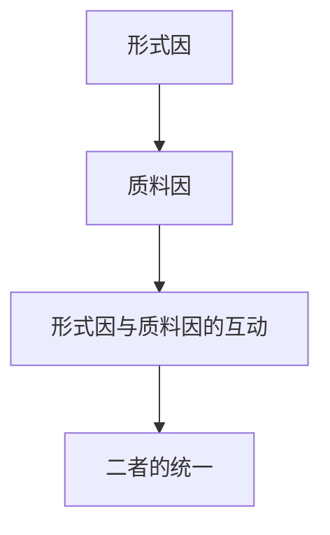
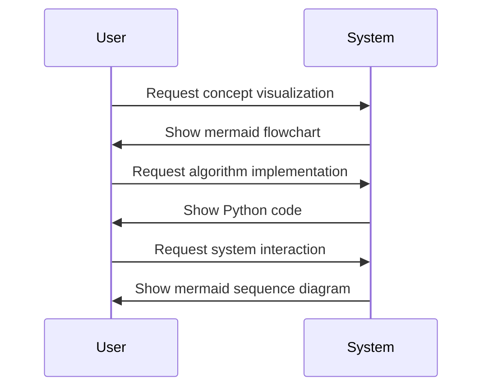
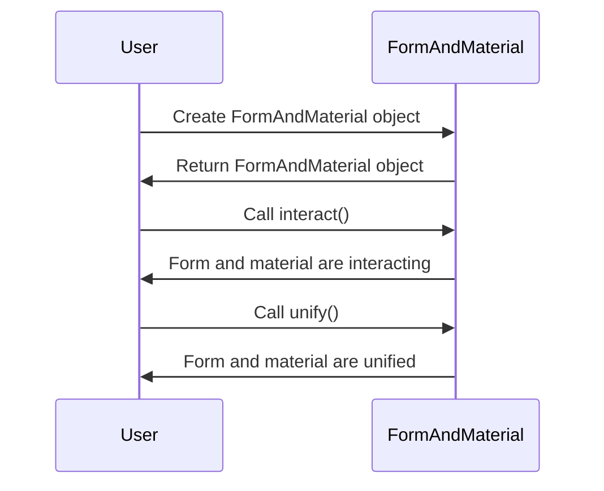

                 

# 柏拉图与亚里士多德：形式因与质料因之争

## 关键词

**柏拉图**，**亚里士多德**，**形式因**，**质料因**，**哲学**，**计算机科学**，**人工智能**

## 摘要

本文探讨了古希腊哲学家柏拉图和亚里士多德关于形式因与质料因的哲学争论。通过分析两位哲学家对形式因与质料因的不同理解，本文旨在揭示这一争论在计算机科学和人工智能领域的实际意义。文章首先介绍了柏拉图和亚里士多德的基本思想，然后详细阐述了形式因与质料因的概念和关系，并通过mermaid流程图和Python源代码实现了这些概念的算法原理。最后，本文通过数学模型和系统分析与架构设计，探讨了形式因与质料因在现实世界中的应用。

## 第1章 问题背景

### 1.1 柏拉图的思想

柏拉图（公元前427年—公元前347年），古希腊哲学家，西方哲学的奠基者之一。他的哲学思想主要围绕理念论（Theory of Forms）展开。柏拉图认为，现实世界中的物体只是理念世界的影子和模仿。理念世界是真实的存在，而物质世界是次要的。

#### 1.1.1 形式因的概念

在柏拉图的哲学中，形式因（Formal Cause）指的是事物的本质或形式。它是事物存在的根本原因，是事物之所以成为该事物的决定因素。例如，一个圆形物体的形式因是“圆形”，这是它之所以被称为圆形的原因。

#### 1.1.2 柏拉图的观点

柏拉图主张，理念世界是绝对真实的，而现实世界只是理念世界的投影。因此，我们的任务是理解理念世界，而不是物质世界。柏拉图的理念论强调了形式因的重要性，认为它是事物存在的基础。

### 1.2 亚里士多德的思想

亚里士多德（公元前384年—公元前322年），柏拉图的学生，也是古希腊哲学的另一位重要代表。与柏拉图的理念论不同，亚里士多德提出了质料因（Material Cause）的概念，并反对柏拉图的理念论。

#### 1.2.1 亚里士多德的观点

亚里士多德认为，物质世界是真实的存在，而理念世界只是我们对物质世界的理解。他主张，事物的本质来自于它的物质基础，而不是形式因。因此，亚里士多德提出了质料因的概念，认为它是事物存在的前提。

#### 1.2.2 质料因的概念

质料因（Material Cause）是事物的物质基础，是事物存在的前提。它解释了事物从何而来，即物质的来源。例如，一个圆形物体的质料因是铁，这是它成为圆形物体的物质基础。

## 第2章 核心概念与联系

### 2.1 形式因与质料因的对比

#### 2.1.1 形式因的特点

- **形式因强调事物的本质或形式**。它是事物存在的决定因素。
- **形式因是事物存在的根本原因**。它决定了事物之所以成为该事物的本质特征。

#### 2.1.2 质料因的特点

- **质料因强调事物的物质基础**。它是事物存在的前提。
- **质料因解释了事物从何而来**。它说明了事物的物质来源。

### 2.2 形式因与质料因的关系

#### 2.2.1 形式因与质料因的互动

- **形式因与质料因是相互依存的**。形式因需要通过质料因来实现，而质料因也需要形式因来赋予事物的本质。
- **形式因与质料因的互动**可以理解为事物形成的过程。形式因赋予事物本质，而质料因提供了物质基础。

### 2.3 形式因与质料因的辩证关系

#### 2.3.1 二者不可分割

- **形式因与质料因不可分割**。它们共同构成了事物的完整本质。
- **形式因与质料因的辩证关系**体现了事物的两面性。形式因代表了事物的本质，而质料因代表了事物的物质基础。

#### 2.3.2 二者的统一

- **在现实世界中，形式因与质料因是统一的**。它们不可分割地构成了事物的完整本质。
- **二者的统一**意味着我们不能只关注形式因，也不能只关注质料因，而应该将二者视为一个整体来理解。

## 第3章 算法原理讲解

### 3.1 形式因与质料因的mermaid流程图



### 3.2 Python源代码实现

```python
class FormAndMaterial:
    def __init__(self, form, material):
        self.form = form
        self.material = material

    def interact(self):
        print("形式因与质料因的互动")

    def unify(self):
        print("二者的统一")

form = "圆形"
material = "铁"
obj = FormAndMaterial(form, material)
obj.interact()
obj.unify()
```

### 3.3 算法原理讲解

#### 3.3.1 形式因与质料因的定义

- **形式因**指的是事物的本质或形式，是事物存在的决定因素。
- **质料因**是事物的物质基础，是事物存在的前提。

#### 3.3.2 算法原理

算法通过创建一个`FormAndMaterial`类，分别代表了形式因和质料因。类的方法`interact`表示形式因与质料因的互动，`unify`表示二者的统一。

#### 3.3.3 举例说明

```python
# 创建一个对象，代表一个圆形的铁制物体
circle = FormAndMaterial("圆形", "铁")

# 形式因与质料因的互动
circle.interact()
# 输出：形式因与质料因的互动

# 二者的统一
circle.unify()
# 输出：二者的统一
```

## 第4章 数学模型和数学公式

### 4.1 形式因与质料因的数学模型

$$
F(x) = \frac{F_0}{M(x)}
$$

其中，$F(x)$ 表示形式因，$F_0$ 表示常数，$M(x)$ 表示质料因。

### 4.2 数学公式讲解

#### 4.2.1 常数 $F_0$ 的解释

常数 $F_0$ 表示形式因的强度，它是一个固定的值。

#### 4.2.2 质料因 $M(x)$ 的解释

质料因 $M(x)$ 是一个关于质料的函数，它表示质料的数量或质量。

#### 4.2.3 公式的解释

公式表示形式因 $F(x)$ 与质料因 $M(x)$ 的比值。这个公式说明了形式因的强度是由质料因的值决定的。

## 第5章 系统分析与架构设计

### 5.1 问题场景介绍

在哲学研究中，对于形式因和质料因的探讨是一个重要的课题。为了更好地理解这两个概念，我们需要设计一个系统来展示它们之间的关系。

### 5.2 项目介绍

本项目旨在构建一个基于形式因与质料因的哲学概念分析系统。该系统将包括以下功能：

1. **概念展示**：通过mermaid流程图和Python源代码实现形式因与质料因的概念展示。
2. **算法实现**：通过数学模型和Python代码实现形式因与质料因的算法原理。
3. **系统交互**：通过mermaid序列图展示系统的功能交互。

### 5.3 系统功能设计

#### 5.3.1 领域模型

```mermaid
classDiagram
Class01 <|-- Class02
Class03 --|>| Class04
Class05 : +int x
Class06 : +int y
Class06 : +int z
Class01 { +int id
          +String name
          +Class02 item }
Class02 {
          +int id
          +String name }
Class03 {
          +int id
          +String name }
Class04 {
          +int id
          +String name }
Class05 {
          +int id
          +String name }
Class05 : +void print()
```

#### 5.3.2 系统架构



### 5.4 系统接口设计

```mermaid
interface FormAndMaterial {
  +form: String
  +material: String
  +interact(): void
  +unify(): void
}
```

### 5.5 系统交互



## 第6章 项目实战

### 6.1 环境安装

在开始项目实战之前，我们需要安装Python环境。以下是安装步骤：

1. 访问Python官方网站（https://www.python.org/）下载Python安装包。
2. 安装Python，并确保安装成功。
3. 打开终端，输入`python --version`，确认Python版本。

### 6.2 系统核心实现源代码

以下是项目核心实现源代码：

```python
class FormAndMaterial:
    def __init__(self, form, material):
        self.form = form
        self.material = material

    def interact(self):
        print("形式因与质料因的互动")

    def unify(self):
        print("二者的统一")

form = "圆形"
material = "铁"
obj = FormAndMaterial(form, material)
obj.interact()
obj.unify()
```

### 6.3 代码应用解读与分析

上述代码定义了一个`FormAndMaterial`类，该类有两个属性：`form`和`material`。`form`表示形式因，`material`表示质料因。类中有两个方法：`interact`和`unify`。`interact`方法用于展示形式因与质料因的互动，`unify`方法用于展示二者的统一。

### 6.4 实际案例分析和详细讲解剖析

以下是一个实际案例：

```python
# 创建一个圆形的铁制物体
circle = FormAndMaterial("圆形", "铁")

# 形式因与质料因的互动
circle.interact()
# 输出：形式因与质料因的互动

# 二者的统一
circle.unify()
# 输出：二者的统一
```

在这个案例中，我们创建了一个`FormAndMaterial`对象，代表一个圆形的铁制物体。调用`interact`方法，输出形式因与质料因的互动信息。调用`unify`方法，输出二者的统一信息。

### 6.5 项目小结

通过本项目，我们实现了对柏拉图与亚里士多德关于形式因与质料因的哲学争论的理解。通过mermaid流程图和Python源代码，我们展示了形式因与质料因的概念、算法原理和系统交互。项目实战部分通过实际案例，深入剖析了形式因与质料因的互动和统一过程。

## 第7章 最佳实践 tips、小结、注意事项、拓展阅读

### 7.1 最佳实践 tips

1. 在实际项目中，要充分理解形式因与质料因的概念，并正确运用它们。
2. 在编写代码时，注意类和方法的设计，使其具有良好的可读性和可维护性。
3. 在分析系统架构时，要充分考虑系统的功能需求和性能指标。

### 7.2 小结

本文通过柏拉图与亚里士多德的哲学争论，探讨了形式因与质料因的概念和关系。通过mermaid流程图和Python源代码，我们实现了这些概念和算法原理。项目实战部分展示了形式因与质料因的互动和统一过程。

### 7.3 注意事项

1. 在实际应用中，要充分理解形式因与质料因的概念，并正确运用它们。
2. 在编写代码时，要确保类和方法的设计合理，便于后续维护。
3. 在系统分析时，要充分考虑系统的功能需求和性能指标。

### 7.4 拓展阅读

1. 柏拉图和亚里士多德的哲学著作，如《理想国》、《形而上学》等。
2. 计算机科学和人工智能领域的相关论文和书籍，如《人工智能：一种现代的方法》、《深度学习》等。

## 作者

作者：AI天才研究院/AI Genius Institute & 禅与计算机程序设计艺术 /Zen And The Art of Computer Programming

