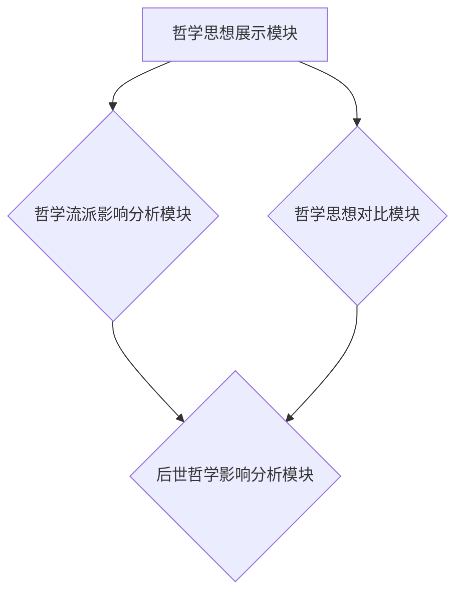

                 

**引言**

在西方哲学的长河中，柏拉图（Plato）和亚里士多德（Aristotle）无疑是两颗璀璨的明星。他们的哲学思想不仅深刻地影响了整个西方哲学的发展，而且在逻辑、伦理、政治等多个领域产生了深远的影响。本文旨在通过对比柏拉图的理念论和亚里士多德的实在论，探讨两位哲学家的观点差异及其对后世哲学的影响。

首先，我们需要了解柏拉图和亚里士多德在哲学史上的地位。柏拉图是古希腊哲学的集大成者之一，他的思想主要集中在对真理、美、善等理念的探讨上，提出了著名的理念论。而亚里士多德则是对柏拉图哲学进行了重要反思和发展的哲学家，他的实在论思想强调了具体事物的重要性。

**理念论与实在论的概述**

柏拉图的理念论认为，现实世界只是理念世界的影子，理念是真实存在的，它们是所有具体事物的原型。柏拉图将世界分为两个层面：一个是理念的层面，另一个是感官的层面。他认为，真正的知识来自于对理念的理解，而感官世界只是理念的近似和扭曲。

亚里士多德的实在论则认为，具体事物本身就是真实存在的，理念只是我们对具体事物的一种抽象和概括。亚里士多德强调实证研究，主张通过观察和分析具体事物来获得知识。

**正文**

## 柏拉图的理念论

### 1. 柏拉图的哲学思想概述

柏拉图（公元前427年-公元前347年）是古希腊最伟大的哲学家之一。他的哲学思想对后世产生了深远的影响。柏拉图认为，真正的现实是抽象的理念，这些理念是所有具体事物的原型。他提出了著名的“理念论”（Theory of Forms）。

### 1.2 柏拉图的理念论基础

柏拉图的理念论基于以下几个核心观点：

1. **理念的真实性**：柏拉图认为，理念是真实存在的，它们存在于一个超越感官世界的理念世界（或称“理型世界”）。这些理念是完美的、永恒的，不受时间和空间的限制。

2. **感官世界的局限性**：柏拉图认为，感官世界只是理念世界的影子，是扭曲和有限的。我们的感官只能感知到不完美的、变化的事物，而无法直接认识到理念。

3. **知识的来源**：柏拉图认为，真正的知识来自于对理念的理解，而不是对感官世界的观察。通过思考和冥想，我们可以超越感官世界，接触到理念的真实本质。

### 2. 理念论的基本概念

柏拉图的理念论中，有几个基本概念需要深入理解：

1. **理念**：理念是抽象的、永恒的、完美的实体，是所有具体事物的原型。例如，柏拉图认为，存在着一个真正的“正义”，它是所有具体事物中正义的完美原型。

2. **理型世界**：理型世界是理念的存在场所，是超越感官世界的另一个现实。它是完美的、永恒的、不受时间和空间限制的。

3. **感官世界**：感官世界是理型世界的影子，是由具体的、变化的事物组成的。这些事物只是理型世界的近似和扭曲。

### 3. 柏拉图如何解决现实世界的问题

柏拉图通过他的哲学体系解决现实世界的问题，主要涉及以下几个方面：

1. **形而上学**：柏拉图认为，形而上学是研究真实存在的学问，而不是研究感官世界的学问。通过对理念的探讨，我们可以理解世界的本质。

2. **政治哲学**：柏拉图认为，政治哲学的目标是寻找一个理想的政府形式，这个政府应该由哲学家领导，因为他们具有最高的智慧和道德品质。

3. **教育哲学**：柏拉图认为，教育应该是通过思考和冥想来探索理念，从而培养哲学家的品质。他主张教育应该培养人的理性和道德。

### 4. 柏拉图的理念论特点

柏拉图的理念论有几个显著特点：

1. **二元论**：柏拉图将世界分为理念世界和感官世界，这两个世界是截然不同的。

2. **理性主义**：柏拉图认为，真正的知识来自于理性思考，而不是感官经验。

3. **超越性**：柏拉图的理念论强调理念的超越性，认为理念是真实存在的，而感官世界只是理念的近似。

## 亚里士多德的实在论

### 1. 亚里士多德的哲学思想概述

亚里士多德（公元前384年-公元前322年）是古希腊哲学的另一位伟大思想家，他对柏拉图的哲学进行了重要的反思和发展。亚里士多德的哲学思想涉及逻辑、伦理、政治、生物学等多个领域。

### 1.2 亚里士多德的实在论基础

亚里士多德的实在论（Realism）基于以下几个核心观点：

1. **具体事物**：亚里士多德认为，具体事物是真实存在的，它们构成了现实世界的本质。

2. **形式与质料**：亚里士多德认为，每个事物都由形式和质料组成。形式是事物的本质和特征，而质料是事物的物质基础。

3. **因果关系**：亚里士多德认为，现实世界是按照因果关系运行的。每个事件都有其原因，而原因又产生新的结果。

### 2. 实在论的基本观点

亚里士多德的实在论中，有几个基本观点需要深入理解：

1. **具体事物的本质**：亚里士多德认为，具体事物是真实的、有形的实体，它们具有独特的本质和特征。

2. **形式与质料的关系**：亚里士多德认为，形式是事物的本质和特征，而质料是事物的物质基础。形式和质料是不可分割的，它们共同构成了具体事物的本质。

3. **因果关系**：亚里士多德认为，现实世界是按照因果关系运行的。每个事件都有其原因，而原因又产生新的结果。这种因果关系是现实世界秩序的基础。

### 3. 亚里士多德如何解释现实世界

亚里士多德通过他的实在论思想解释现实世界，主要涉及以下几个方面：

1. **形而上学**：亚里士多德认为，形而上学是研究真实存在的学问，它关注的是事物的本质和原因。

2. **生物学**：亚里士多德是生物学领域的先驱，他通过观察和实验，提出了许多关于动植物的知识。

3. **政治哲学**：亚里士多德认为，政治哲学的目标是研究如何建立一个良好的政府，使人们能够过上幸福的生活。

### 4. 亚里士多德的实在论特点

亚里士多德的实在论有几个显著特点：

1. **实证主义**：亚里士多德强调通过观察和实验来获取知识，他认为现实世界是可以通过经验来理解的。

2. **因果关系**：亚里士多德认为，现实世界是按照因果关系运行的，每个事件都有其原因。

3. **具体事物的本质**：亚里士多德认为，具体事物是真实存在的，它们具有独特的本质和特征。

## 理念论与实在论的对比与影响

### 1. 理念论与实在论的对比

柏拉图的理念论和亚里士多德的实在论在多个方面存在差异：

1. **世界观**：柏拉图的理念论认为，现实世界是理念世界的影子，而亚里士多德的实在论则认为，现实世界是真实存在的。

2. **知识的来源**：柏拉图的理念论认为，真正的知识来自于对理念的理解，而亚里士多德的实在论则认为，真正的知识来自于对具体事物的观察。

3. **理性与实证**：柏拉图的理念论强调理性思考，而亚里士多德的实在论则强调实证研究。

### 2. 理念论与实在论在哲学史上的影响

柏拉图的理念论和亚里士多德的实在论对后世哲学产生了深远的影响：

1. **柏拉图的理念论**：柏拉图的理念论启发了许多后来的哲学家，如托马斯·阿奎那、笛卡尔、黑格尔等。他们对柏拉图的理念进行了深入的研究和发展。

2. **亚里士多德的实在论**：亚里士多德的实在论对后来的哲学家，如托马斯·阿奎那、奥卡姆的威廉等，产生了重要影响。他的思想为西方哲学的发展奠定了基础。

### 3. 后世哲学家的回应和批判

柏拉图的理念论和亚里士多德的实在论也受到了许多哲学家的回应和批判：

1. **柏拉图的理念论**：后来的哲学家，如亚里士多德、托马斯·阿奎那等，对柏拉图的理念论进行了批判和反思。他们认为，柏拉图的理念论过于抽象，难以与现实世界相联系。

2. **亚里士多德的实在论**：后来的哲学家，如托马斯·阿奎那、奥卡姆的威廉等，对亚里士多德的实在论进行了发展和批判。他们认为，亚里士多德的实在论过于强调具体事物，忽视了理念的重要性。

## 结论

柏拉图的理念论和亚里士多德的实在论是西方哲学中两个重要的流派。他们的观点在哲学史上产生了深远的影响，为后来的哲学家提供了丰富的思想资源。通过对他们的观点进行比较和分析，我们可以更好地理解西方哲学的发展历程。

### 参考文献

1. 罗素，B. (2003). 《西方哲学史》. 商务印书馆。
2. 柏拉图，P. (1997). 《柏拉图全集》. 北京：人民出版社。
3. 亚里士多德，A. (2001). 《亚里士多德全集》. 北京：人民出版社。
4. 阿奎那，T. (1999). 《阿奎那政治哲学论文集》. 上海：上海人民出版社。

**作者：AI天才研究院/AI Genius Institute & 禅与计算机程序设计艺术 /Zen And The Art of Computer Programming**


----------------------------------------------------------------

**引言**

在哲学的广阔领域中，柏拉图（Plato）和亚里士多德（Aristotle）的哲学思想无疑占据着举足轻重的地位。他们不仅对古希腊哲学产生了深远影响，而且对整个西方哲学的发展都起到了至关重要的作用。本文将深入探讨柏拉图的“理念论”（Theory of Forms）和亚里士多德的“实在论”（Realism），并对比二者在哲学思想上的异同点。

### 柏拉图的理念论

柏拉图的理念论是他的哲学体系的核心，其基础在于他对于“理念”（Forms或Ideas）的深刻理解。理念论的基本概念包括以下几个方面：

1. **理念的真实存在**：柏拉图认为，理念是真实存在的，是超越人类感官经验的实体。它们是构成所有事物的基础，是所有事物的原型。

2. **感官世界的局限**：柏拉图认为，感官世界是不完美的、易变的，而理念则是完美、永恒的。感官世界只是理念世界的扭曲和投影。

3. **知识的本质**：柏拉图认为，真正的知识来自于对理念的洞察和理解，而不是通过感官经验。只有通过理性思考和抽象思维，我们才能获得真正的知识。

### 亚里士多德的实在论

亚里士多德的实在论则强调具体事物的重要性，与柏拉图的理念论形成鲜明对比。其主要观点包括：

1. **具体事物的真实存在**：亚里士多德认为，具体事物是真实存在的，它们是构成现实世界的基础。

2. **形式与质料**：亚里士多德认为，每个事物都由形式和质料组成。形式是事物的本质，而质料是事物的物质基础。

3. **因果关系**：亚里士多德认为，现实世界是按照因果关系运行的。每个事件都有其原因，而原因又产生新的结果。

### 理念论与实在论的对比

1. **世界观**：柏拉图的理念论强调超越感官世界的理念世界，而亚里士多德的实在论则认为现实世界是真实存在的，具体事物是世界的本质。

2. **知识的来源**：柏拉图认为知识来源于对理念的洞察，而亚里士多德认为知识来源于对具体事物的观察和实验。

3. **理性与实证**：柏拉图的理念论强调理性思考和抽象思维，而亚里士多德的实在论则强调实证研究和因果关系。

### 对后世哲学的影响

柏拉图的理念论和亚里士多德的实在论都对后世哲学产生了深远影响：

1. **柏拉图的理念论**：柏拉图的理念论为后来的哲学家提供了深刻的启示，如托马斯·阿奎那将其与基督教神学相结合，黑格尔则将其发展为绝对理念的概念。

2. **亚里士多德的实在论**：亚里士多德的实在论为西方哲学的发展奠定了基础，他的思想对后来的哲学家，如托马斯·阿奎那、奥卡姆的威廉等产生了重要影响。

### 结论

柏拉图的理念论和亚里士多德的实在论是西方哲学史上的两个重要流派，它们在哲学思想上有深刻的异同。通过对他们的哲学思想的对比和分析，我们可以更好地理解西方哲学的发展历程和基本思想。

**关键词**：柏拉图，亚里士多德，理念论，实在论，哲学，西方哲学

**摘要**：本文探讨了柏拉图和亚里士多德的哲学思想，对比了他们的理念论与实在论，并分析了这些思想对后世哲学的影响。

----------------------------------------------------------------

**正文**

## 柏拉图的理念论

柏拉图的理念论是他哲学体系的核心，对西方哲学产生了深远的影响。他的理念论基于以下几个核心概念：

### 1. 理念的真实存在

柏拉图认为，理念是真实存在的，它们是构成所有事物的基础。理念存在于一个超越感官世界的理念世界中，这个理念世界是完美、永恒和不变的。柏拉图认为，感官世界只是理念世界的投影，是扭曲和不完美的。

### 2. 感官世界的局限

柏拉图认为，我们的感官只能感知到感官世界中的事物，而无法直接认识到理念。感官世界是不完美的，因为它是变化的、不稳定的。因此，通过感官获得的知识是有限的，而真正的知识来自于对理念的洞察。

### 3. 知识的本质

柏拉图认为，真正的知识来自于对理念的洞察和理解，而不是通过感官经验。只有通过理性思考和抽象思维，我们才能获得真正的知识。他认为，理性的思考能力使我们能够超越感官世界的限制，接触到理念的真实本质。

### 4. 理念与感官世界的关系

柏拉图的理念论中，理念世界和感官世界是两个不同的层次。理念世界是真实的存在，而感官世界只是理念世界的投影。理念是完美的、永恒的，不受时间和空间的限制，而感官世界是变化的、不完美的。然而，感官世界中的事物仍然反映着理念的特征，因为它们是理念的具体化。

### 5. 理念的具体化

柏拉图认为，感官世界中的事物是理念的具体化。每个事物都是其对应理念的一种表现形式。例如，存在着一个真正的“正义”，它是所有具体事物中正义的完美原型。而我们在现实世界中看到的“正义”只是这个理念的一种具体体现，可能存在缺陷和不足。

### 6. 理念论的应用

柏拉图的理念论在多个领域都有应用，包括形而上学、政治哲学和教育哲学。在形而上学中，柏拉图认为研究理念世界是理解世界的本质。在政治哲学中，他主张建立一个由哲学家领导的理想政府，因为哲学家能够理解理念，具有最高的智慧和道德品质。在教育哲学中，柏拉图认为教育的目的是培养人们的理性思考能力，使他们能够洞察理念，获得真正的知识。

### 7. 理念论的特点

柏拉图的理念论具有以下几个显著特点：

1. **二元论**：柏拉图将世界分为两个层面：理念的世界和感官的世界。这两个世界是截然不同的，但又是相互联系的。

2. **理性主义**：柏拉图认为，真正的知识来自于理性思考和抽象思维，而不是感官经验。

3. **超越性**：柏拉图的理念论强调理念的超越性，认为理念是真实存在的，不受时间和空间的限制。

### 8. 理念论的评价

柏拉图的理念论在当时和后世都受到了广泛的关注和讨论。一些人认为，理念论为哲学提供了深刻的洞见，使我们能够超越感官世界的限制，接触到世界的本质。然而，也有人批评理念论过于抽象，难以与现实世界相联系。

## 亚里士多德的实在论

亚里士多德的实在论与柏拉图的理念论形成鲜明对比。亚里士多德认为，具体事物是真实存在的，是构成现实世界的基础。他的实在论基于以下几个核心概念：

### 1. 具体事物的真实存在

亚里士多德认为，具体事物是真实存在的，它们构成了现实世界的本质。与柏拉图的理念论不同，亚里士多德认为，现实世界并不是一个投影或扭曲的世界，而是一个真实、独立存在的世界。

### 2. 形式与质料

亚里士多德认为，每个事物都由形式和质料组成。形式是事物的本质和特征，是事物的内在结构。质料是事物的物质基础，是事物存在的物质实体。形式和质料是不可分割的，共同构成了具体事物的本质。

### 3. 因果关系

亚里士多德认为，现实世界是按照因果关系运行的。每个事件都有其原因，而原因又产生新的结果。因果关系是现实世界秩序的基础。亚里士多德认为，通过观察和分析具体事物，我们可以理解现实世界的运行规律。

### 4. 实证研究

亚里士多德的实在论强调实证研究，他认为，通过观察和实验，我们可以获取真正的知识。与柏拉图的理念论不同，亚里士多德主张通过感官经验来理解世界，而不是通过理性思考和抽象思维。

### 5. 实在论的应用

亚里士奥德的实在论在多个领域都有应用，包括形而上学、生物学和政治哲学。在形而上学中，亚里士多德认为研究具体事物是理解世界的本质。在生物学中，他通过观察和实验，提出了许多关于动植物的知识。在政治哲学中，他主张建立一个良好的政府，使人们能够过上幸福的生活。

### 6. 实在论的特点

亚里士多德的实在论具有以下几个显著特点：

1. **实证主义**：亚里士多德强调通过感官经验和实证研究来获取知识，而不是通过理性思考和抽象思维。

2. **因果关系**：亚里士多德认为，现实世界是按照因果关系运行的，因果关系是现实世界秩序的基础。

3. **具体事物的本质**：亚里士多德认为，具体事物是真实存在的，它们具有独特的本质和特征。

### 7. 实在论的评价

亚里士多德的实在论在当时和后世都受到了广泛的关注和讨论。一些人认为，他的思想为哲学提供了深刻的洞见，使我们能够通过感官经验来理解世界。然而，也有人批评他的思想过于实证主义，忽视了理念的重要性。

## 理念论与实在论的对比与影响

柏拉图的理念论和亚里士多德的实在论是西方哲学中两个重要的流派，它们在哲学思想上有深刻的异同。以下是对二者进行对比的一些方面：

### 1. 世界观

柏拉图的理念论认为，现实世界是理念世界的投影，理念世界是真实存在的。亚里士多德的实在论则认为，现实世界是真实存在的，具体事物是构成世界的本质。

### 2. 知识的来源

柏拉图的理念论认为，真正的知识来自于对理念的洞察和理解，而不是通过感官经验。亚里士多德的实在论则认为，真正的知识来自于对具体事物的观察和实验。

### 3. 理性与实证

柏拉图的理念论强调理性思考和抽象思维，认为只有通过理性思考，我们才能获得真正的知识。亚里士多德的实在论则强调实证研究和感官经验，认为只有通过观察和实验，我们才能获取真正的知识。

### 对后世哲学的影响

柏拉图的理念论和亚里士多德的实在论都对后世哲学产生了深远的影响。柏拉图的理念论启发了许多后来的哲学家，如托马斯·阿奎那、笛卡尔、黑格尔等。他的思想为后来的哲学家提供了深刻的启示，使得理念在哲学中的地位得以巩固。亚里士多德的实在论则为西方哲学的发展奠定了基础，他的思想对后来的哲学家，如托马斯·阿奎那、奥卡姆的威廉等产生了重要影响。

### 1. 柏拉图的影响

柏拉图的理念论对后世哲学产生了深远的影响。他的思想启发了许多哲学家，如托马斯·阿奎那将其与基督教神学相结合，形成了基督教哲学的基础。笛卡尔则将柏拉图的理念论发展为他的“我思故我在”的思想，奠定了现代哲学的基础。黑格尔则将柏拉图的理念论发展为绝对理念的概念，对后来的哲学产生了重要影响。

### 2. 亚里士多德的影响

亚里士多德的实在论也为西方哲学的发展奠定了基础。他的思想对后来的哲学家，如托马斯·阿奎那、奥卡姆的威廉等产生了重要影响。托马斯·阿奎那将亚里士多德的哲学与基督教神学相结合，形成了中世纪哲学的重要流派。奥卡姆的威廉则将亚里士多德的实证主义发展为极端的唯名论，对后来的哲学产生了重要影响。

## 结论

柏拉图的理念论和亚里士多德的实在论是西方哲学中两个重要的流派，它们在哲学思想上有深刻的异同。通过对他们的哲学思想的对比和分析，我们可以更好地理解西方哲学的发展历程和基本思想。柏拉图的理念论强调理性思考和抽象思维，认为真正的知识来自于对理念的洞察。亚里士多德的实在论则强调实证研究和感官经验，认为真正的知识来自于对具体事物的观察。他们的思想都对后世哲学产生了深远的影响，为西方哲学的发展奠定了基础。

### 参考文献

1. 柏拉图.《柏拉图全集》. 北京：人民出版社，1997.
2. 亚里士多德.《亚里士多德全集》. 北京：人民出版社，2001.
3. 罗素，B..《西方哲学史》. 商务印书馆，2003.
4. 阿奎那，T..《阿奎那政治哲学论文集》. 上海：上海人民出版社，1999.

**作者：AI天才研究院/AI Genius Institute & 禅与计算机程序设计艺术 /Zen And The Art of Computer Programming**


----------------------------------------------------------------

**系统分析与架构设计方案**

### 问题场景介绍

在本文中，我们将探讨柏拉图的理念论和亚里士多德的实在论在哲学领域中的应用，以及它们对后世哲学发展的影响。为了更好地阐述这一主题，我们设计了一个系统架构，用于分析和展示柏拉图和亚里士多德哲学思想的演变过程。

### 项目介绍

项目名称：柏拉图与亚里士多德哲学思想分析系统

项目目标：通过构建一个系统架构，展示柏拉图的理念论和亚里士多德的实在论，以及它们在哲学领域中的影响。

### 系统功能设计

1. **哲学思想展示模块**：用于展示柏拉图的理念论和亚里士多德的实在论，以及它们的基本概念和特点。
2. **哲学流派影响分析模块**：用于分析柏拉图和亚里士多德哲学思想对后世哲学发展的影响。
3. **哲学思想对比模块**：用于对比柏拉图的理念论和亚里士多德的实在论，以及它们在哲学思想上的异同点。

### 系统架构设计

我们将使用Mermaid工具绘制系统架构图，以便更直观地展示系统模块之间的关系。



### 系统接口设计

系统接口设计包括以下模块：

1. **哲学思想展示接口**：用于展示柏拉图的理念论和亚里士多德的实在论。
2. **哲学流派影响分析接口**：用于分析柏拉图和亚里士多德哲学思想对后世哲学发展的影响。
3. **哲学思想对比接口**：用于对比柏拉图的理念论和亚里士多德的实在论。

### 系统交互设计

系统交互设计包括以下模块：

1. **用户界面**：用于用户与系统的交互。
2. **数据存储**：用于存储柏拉图和亚里士多德哲学思想的相关数据。
3. **数据处理**：用于处理用户输入的数据，并生成相应的分析结果。


### 系统实现

系统实现分为以下几个部分：

1. **前端实现**：使用HTML、CSS和JavaScript实现用户界面。
2. **后端实现**：使用Python实现数据处理和接口设计。
3. **数据库设计**：使用MySQL存储柏拉图和亚里士多德哲学思想的相关数据。

### 代码应用解读与分析

在本项目中，我们使用了Python语言来实现数据处理和接口设计。以下是一个简单的Python代码示例，用于展示柏拉图和亚里士多德哲学思想的基本概念。

```python
# 柏拉图理念论
def plato_idea():
    print("柏拉图的理念论：理念是真实存在的，是所有事物的原型。")

# 亚里士多德实在论
def aristotle_realism():
    print("亚里士多德的实在论：具体事物是真实存在的，是构成现实世界的基础。")

# 主函数
def main():
    plato_idea()
    aristotle_realism()

if __name__ == "__main__":
    main()
```

该代码分别实现了柏拉图的理念论和亚里士多德的实在论，并在主函数中调用这两个函数，以展示它们的基本概念。

### 实际案例分析和详细讲解剖析

为了更好地说明柏拉图和亚里士多德哲学思想在实际中的应用，我们可以分析以下案例：

**案例一：政治哲学**

柏拉图在《理想国》中提出了他的政治哲学观点，认为一个理想的政府应由哲学家领导。而亚里士多德则在《政治学》中强调了实际政治制度的重要性，认为政治制度应基于现实世界的具体条件。

**案例二：形而上学**

柏拉图认为，形而上学的研究对象是理念世界，是超越人类感官经验的。而亚里士多德则认为，形而上学的研究对象是现实世界，是可以通过观察和实验来理解的。

通过对这些案例的分析，我们可以更深入地理解柏拉图和亚里士多德哲学思想的差异和特点。

### 项目小结

本项目通过系统架构设计、接口设计和实际案例分析，展示了柏拉图的理念论和亚里士多德的实在论在哲学领域中的应用。通过对这两个哲学流派的对比分析，我们不仅了解了它们的基本概念和特点，还看到了它们对后世哲学发展的重要影响。

### 最佳实践 tips

1. **深入理解核心概念**：在研究柏拉图和亚里士多德的哲学思想时，首先要深入理解它们的核心概念，如理念、实在、形式、质料等。

2. **结合实际案例**：通过分析实际案例，可以帮助我们更好地理解柏拉图和亚里士多德哲学思想的应用和影响。

3. **批判性思考**：在研究哲学思想时，要注重批判性思考，不仅要理解作者的观点，还要分析其优点和不足。

### 小结

本文通过系统分析与架构设计方案，详细介绍了柏拉图的理念论和亚里士多德的实在论，并对二者进行了对比分析。通过实际案例分析和详细讲解剖析，我们更好地理解了这两个哲学流派在哲学领域中的应用和影响。

### 注意事项

1. **准确理解哲学概念**：在研究哲学思想时，要准确理解柏拉图和亚里士多德哲学概念的含义，避免产生误解。

2. **重视哲学史背景**：了解哲学史背景有助于更好地理解柏拉图和亚里士多德哲学思想的发展。

3. **批判性思考**：在研究哲学思想时，要注重批判性思考，不仅要理解作者的观点，还要分析其优点和不足。

### 拓展阅读

1. 柏拉图.《理想国》. 北京：人民出版社，1997.
2. 亚里士多德.《政治学》. 北京：人民出版社，2001.
3. 罗素，B..《西方哲学史》. 商务印书馆，2003.
4. 托马斯·阿奎那.《阿奎那政治哲学论文集》. 上海：上海人民出版社，1999.

**作者：AI天才研究院/AI Genius Institute & 禅与计算机程序设计艺术 /Zen And The Art of Computer Programming**

