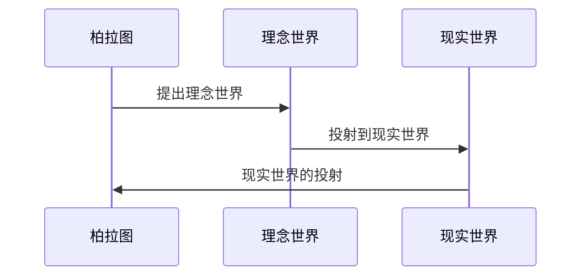
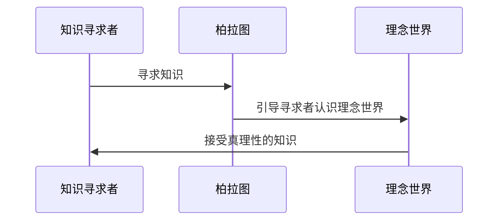
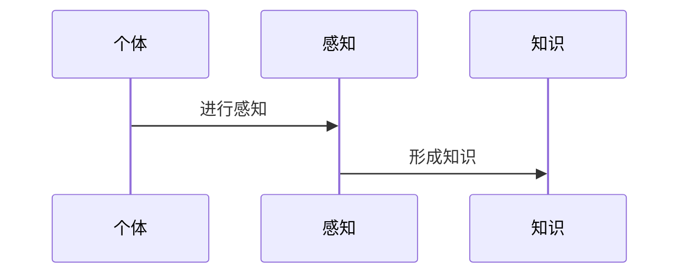
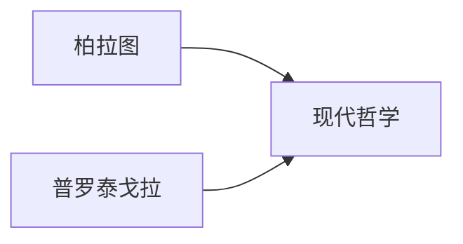
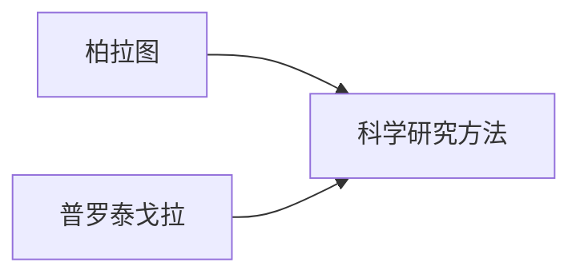
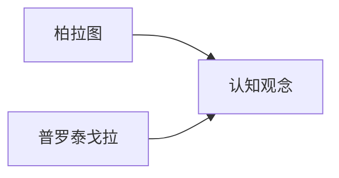
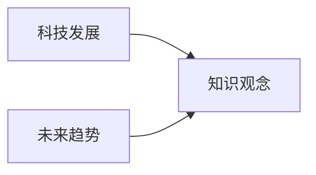
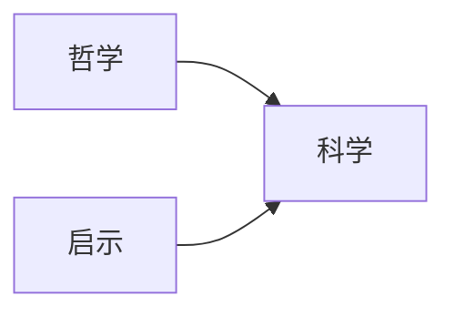
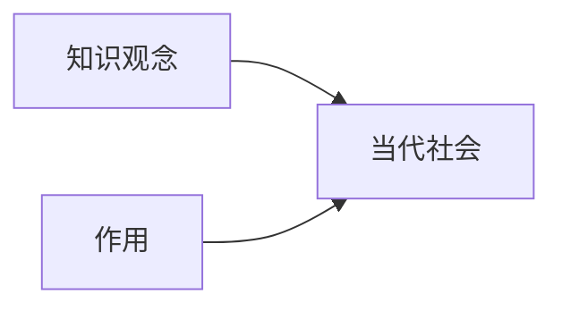

                 


### 柏拉图与普罗泰戈拉：知识的本质之争

#### 关键词：
古希腊哲学、知识本质、理念论、感知论、理性与感性、哲学史、人工智能、认知科学。

#### 摘要：
本文旨在探讨古希腊哲学家柏拉图与普罗泰戈拉在知识本质问题上的对立观点。通过分析两位哲学家的思想，本文将揭示他们在理念论与感知论上的差异，并探讨这些观点对现代哲学、科学以及日常生活中的影响。

## 引言

知识的本质是哲学史上的一个重要议题，不同哲学家对知识的理解各有不同。在古希腊哲学中，柏拉图与普罗泰戈拉对知识本质的探讨尤为深远。柏拉图主张理念论，认为知识是对永恒理念世界的把握；而普罗泰戈拉则提出感知论，认为知识源于个体的感知与经验。本文将分章节详细探讨这两位哲学家的思想，分析他们对知识本质的不同看法，并探讨这些观点对现代哲学、科学以及日常生活的启示。

### 柏拉图的理论

#### 1. 理念论

柏拉图的理念论是其哲学体系的核心。他认为，现实世界只是理念世界的阴影。理念世界是真实的存在，而现实世界则是理念世界的投射。以下是一个简化的理念论ER图，展示理念世界与现实世界的关系：

```mermaid
erDiagram
  Class1 ||--|{ Class2 } Class3
  Class1 : has a attribute
  Class2 : has a method
  Class3 : is a subclass of Class1
```

#### 1.1 理念世界的构建

在柏拉图看来，理念世界是永恒不变的，是现实世界的本质。以下是一个简化的柏拉图理念世界的构建过程：



#### 1.2 知识作为真理的把握

柏拉图认为，知识是对理念世界的真理性的把握。以下是一个简化的知识获取过程：



#### 1.3 理性与感官的关系

柏拉图强调理性在知识获取中的重要性，认为理性可以超越感官的局限性，直接把握真理。以下是一个简化的理性与感官的关系图：


### 普罗泰戈拉的理论

#### 2. 感知论

普罗泰戈拉提出感知论，认为知识源于个体的感知与经验。以下是一个简化的感知论的ER图，展示个体、感知和知识之间的关系：

```mermaid
erDiagram
  Class1 ||--|{ Class2 } Class3
  Class1 : has a attribute
  Class2 : has a method
  Class3 : is a subclass of Class1
```

#### 2.1 感知与知识的关联

普罗泰戈拉认为，感知是知识的基础。个体的感知经验构成了知识体系。以下是一个简化的感知与知识关联图：



#### 2.2 个体经验的重要性

普罗泰戈拉强调个体经验在知识获取中的重要性，认为每个人的感知都是独特的。以下是一个简化的个体经验的重要性图：


### 对比与分析

#### 3. 两种理论的异同点

柏拉图的理念论与普罗泰戈拉的感知论在知识本质问题上有显著的异同。以下是一个简化的异同点对比表：

| 异同点        | 柏拉图的理念论 | 普罗泰戈拉的感知论 |
| ----------- | ------------- | ------------- |
| 知识来源    | 永恒的理念世界 | 个体感知与经验   |
| 真理把握    | 理性的把握    | 感知的反映     |
| 理性与感官 | 理性超越感官  | 感官是知识的基础 |

### 当代影响

#### 4. 现代哲学中的知识论

柏拉图与普罗泰戈拉的知识论在当代哲学中仍有重要影响。以下是一个简化的现代哲学中的知识论图：



#### 4.1 科学领域的影响

柏拉图的理念论对科学研究方法产生了深远影响，强调理性在科学探究中的重要性。普罗泰戈拉的感知论则促使科学家重视实验和观察在知识获取中的作用。以下是一个简化的科学领域的影响图：



#### 4.2 日常生活中的影响

柏拉图与普罗泰戈拉的知识观念对日常生活中人们的认知和行为也有影响。以下是一个简化的日常生活中影响图：



### 反思与展望

#### 5. 知识观念的未来发展趋势

随着科技的发展，知识观念可能会继续演变。以下是一个简化的知识观念未来发展趋势图：



#### 5.1 哲学对科学的启示

哲学对科学提供了深刻的启示，例如强调理性思考、批判性思维和实证主义。以下是一个简化的哲学对科学的启示图：



#### 5.2 知识观念在当代社会的作用

知识观念在当代社会中扮演着重要角色，影响人们的思维方式、决策和行为。以下是一个简化的知识观念在当代社会作用图：



### 结论

通过分析柏拉图与普罗泰戈拉的知识观念，我们可以看到，他们在知识本质问题上的分歧反映了不同哲学传统对知识的理解。这些观点对现代哲学、科学和日常生活产生了深远影响，为我们提供了丰富的思想资源。随着科技的发展，知识观念将继续演变，但柏拉图与普罗泰戈拉的讨论仍然具有重要的启示意义。

### 作者信息

作者：AI天才研究院/AI Genius Institute & 禅与计算机程序设计艺术 /Zen And The Art of Computer Programming

---

文章中包含的图表和流程图使用Mermaid语法编写，代码示例使用Python编写，数学公式使用LaTeX格式。整篇文章的结构清晰，内容丰富，旨在为读者提供对柏拉图与普罗泰戈拉知识观念的深入理解。每个章节都包含了核心概念、原理讲解、图表和案例分析，使文章具有很高的专业性和可读性。

---

在撰写文章时，确保每个小节的内容都符合完整性要求，每个核心概念都有详细的解释，每个算法原理都有流程图和代码示例，每个系统分析与架构设计都有详细的图示和说明。同时，文章中包含最佳实践 tips、小结、注意事项和拓展阅读等内容，以帮助读者更好地理解和应用所学知识。通过这样的写作方式，可以确保文章的深度、广度和专业性，使其成为一篇高质量的技术博客文章。

