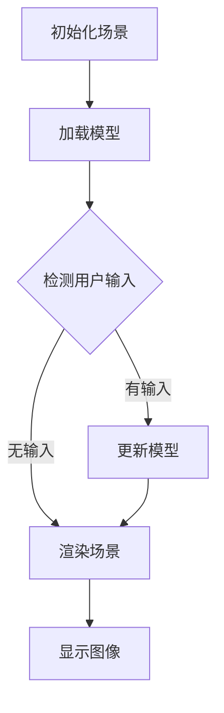

                 

# 第一部分：引言

## 1.1 柏拉图的洞穴寓言

### 1.1.1 洞穴寓言的基本概念

柏拉图的洞穴寓言（Allegory of the Cave）是古希腊哲学家柏拉图在其著作《理想国》中提出的一个哲学故事。故事讲述了一群人从小被锁在一个洞穴里，他们的腿和脖子都被绑住，只能看到洞穴前方的墙壁。这些人在洞穴里生活了一段时间，只能看到墙上由外界物体投射的阴影。他们相信这些阴影就是真实的世界。

### 1.1.2 洞穴寓言的意义

柏拉图通过这个寓言探讨了人类的认知过程。他提出，我们所看到的世界只是真实世界的投影，就像洞穴里的阴影一样。真正的现实隐藏在我们所看到的背后。这个寓言反映了哲学中的唯心主义思想，即我们的感知和理解都是有限的，只有通过思考和推理才能接近真理。

### 1.1.3 洞穴寓言与虚拟现实编程的联系

虚拟现实编程是一种通过计算机技术创造虚拟世界的方法。虚拟现实世界中的物体和景象都是由计算机生成的，与洞穴寓言中的阴影有相似之处。柏拉图的洞穴寓言为虚拟现实编程提供了一个哲学隐喻：虚拟现实世界就像洞穴中的阴影，是我们对真实世界的模仿和理解。

## 1.2 虚拟现实编程的基本概念

### 1.2.1 虚拟现实编程的定义

虚拟现实编程是指使用计算机技术和编程语言创建虚拟环境、场景和交互过程的过程。它涉及到3D建模、渲染、交互设计等多个方面，旨在为用户提供一个沉浸式的虚拟体验。

### 1.2.2 虚拟现实编程的核心技术

虚拟现实编程的核心技术包括：

- **3D建模和渲染**：使用各种工具和技术创建和渲染3D模型，使虚拟世界中的物体看起来更加真实。
- **传感器和交互**：利用各种传感器和输入设备（如头戴显示器、手柄等）实现用户与虚拟环境的交互。
- **物理引擎**：模拟虚拟环境中的物理现象，如碰撞、重力等，增加虚拟世界的真实感。
- **实时渲染**：在虚拟环境中实时生成和显示图像，提供流畅的用户体验。

### 1.2.3 虚拟现实编程的关键组件

虚拟现实编程的关键组件包括：

- **开发环境**：如Unity、Unreal Engine等，提供必要的工具和框架来创建虚拟世界。
- **硬件设备**：如头戴显示器（HMD）、手柄、位置追踪器等，用于实现虚拟环境的交互。
- **编程语言**：如C++、Python、JavaScript等，用于编写虚拟现实应用程序的代码。
- **数据库和云服务**：用于存储虚拟环境中的数据，如用户数据、3D模型等。

## 1.3 虚拟现实编程的发展历程

### 1.3.1 虚拟现实编程的起源

虚拟现实编程的起源可以追溯到20世纪60年代。当时，计算机图形学和交互技术的发展为虚拟现实编程奠定了基础。最早的虚拟现实系统是由美国麻省理工学院（MIT）的伊凡·苏瑟兰（Ivan Sutherland）在1968年开发的“达摩克利斯之剑”（The Sword of Damocles）系统。

### 1.3.2 虚拟现实编程的里程碑

- 1990年代，虚拟现实技术逐渐应用于商业领域，如游戏和娱乐。
- 2000年代，虚拟现实技术开始应用于医疗、教育等领域，为专业人士提供沉浸式的培训体验。
- 2010年代，随着硬件性能的提升和价格的降低，虚拟现实技术逐渐普及，成为大众消费市场的一部分。

### 1.3.3 虚拟现实编程的未来趋势

虚拟现实编程的未来趋势包括：

- **增强现实（AR）与混合现实（MR）**：虚拟现实技术将进一步与增强现实和混合现实技术融合，为用户提供更加丰富的虚拟体验。
- **人工智能（AI）**：人工智能将在虚拟现实编程中发挥重要作用，如智能交互、个性化体验等。
- **边缘计算**：虚拟现实编程将更多地依赖于边缘计算，以降低延迟和带宽需求，提供更流畅的体验。

## 1.4 本书结构安排

### 1.4.1 内容概述

本书将系统地介绍虚拟现实编程的基本概念、核心技术、算法原理、系统架构设计和项目实战，旨在帮助读者全面了解和掌握虚拟现实编程的知识和技能。

### 1.4.2 阅读建议

建议读者按照本书的结构顺序进行阅读，从引言开始，逐步深入了解虚拟现实编程的各个领域。在阅读过程中，读者可以结合实际案例和项目实战，加深对虚拟现实编程的理解和应用能力。

## 总结

柏拉图的洞穴寓言与虚拟现实编程之间存在着深刻的哲学联系。通过这个寓言，我们可以更好地理解虚拟现实编程的本质，即通过计算机技术模拟和再现现实世界。本书将带领读者一步步深入探索虚拟现实编程的奥秘，帮助读者掌握这一前沿技术的核心知识和应用技巧。# 第二部分：虚拟现实编程技术

## 2.1 虚拟现实编程的核心技术

### 2.1.1 虚拟现实引擎

#### 2.1.1.1 虚拟现实引擎的功能

虚拟现实引擎是虚拟现实编程的核心工具，它负责渲染虚拟环境、处理用户输入和提供物理交互等功能。一个典型的虚拟现实引擎通常具有以下功能：

1. **场景渲染**：渲染虚拟环境中的3D模型和物体，生成逼真的视觉效果。
2. **用户交互**：处理用户的输入，如头戴显示器的运动、手柄的操作等，实现对虚拟环境的控制。
3. **物理模拟**：模拟虚拟环境中的物理现象，如重力、碰撞等，增加虚拟世界的真实感。
4. **声音处理**：处理虚拟环境中的声音效果，如环境音效、语音交互等。
5. **网络通信**：支持虚拟环境中的多用户交互，实现实时数据传输和同步。

#### 2.1.1.2 主流虚拟现实引擎介绍

目前市场上主流的虚拟现实引擎包括Unity、Unreal Engine和Blender等。

- **Unity**：Unity是一款功能强大的跨平台游戏引擎，广泛应用于虚拟现实和增强现实应用的开发。它提供了丰富的3D建模、动画和交互工具，支持多种编程语言，如C#和JavaScript。
- **Unreal Engine**：Unreal Engine由Epic Games开发，是一款高性能的游戏和虚拟现实引擎。它以其出色的渲染效果和灵活的编程接口而著称，广泛用于大型游戏和虚拟现实项目的开发。
- **Blender**：Blender是一款开源的3D建模和渲染软件，也可用于虚拟现实编程。它提供了完整的3D建模、动画和渲染工具，支持Python脚本，方便用户自定义功能。

### 2.1.2 虚拟现实硬件

#### 2.1.2.1 虚拟现实头戴显示器

虚拟现实头戴显示器（HMD）是虚拟现实编程的关键硬件设备，它负责将虚拟环境呈现在用户的视野中。一个典型的HMD具有以下特点：

1. **高分辨率**：高分辨率的屏幕可以提供清晰的视觉效果，减少视觉模糊。
2. **低延迟**：低延迟的显示可以减少用户的眩晕感，提高沉浸感。
3. **舒适的佩戴体验**：轻便、舒适的佩戴设计可以减少用户的疲劳感，延长使用时间。

目前市场上主流的虚拟现实头戴显示器包括Oculus Rift、HTC Vive和PlayStation VR等。

- **Oculus Rift**：Oculus Rift是由Facebook开发的顶级虚拟现实头戴显示器，以其优秀的性能和沉浸感而著称。
- **HTC Vive**：HTC Vive是一款高性能的虚拟现实头戴显示器，支持空间定位和手部追踪，提供丰富的交互体验。
- **PlayStation VR**：PlayStation VR是索尼推出的虚拟现实头戴显示器，与PlayStation 4和PlayStation 5兼容，适合家庭娱乐使用。

#### 2.1.2.2 虚拟现实控制器

虚拟现实控制器是用户与虚拟环境进行交互的重要工具。常见的虚拟现实控制器包括手柄、手套和手指追踪设备等。

1. **手柄**：手柄是最常见的虚拟现实控制器，类似于游戏手柄。它们通常具有多个按钮和操纵杆，用于模拟虚拟环境中的操作。
2. **手套**：手套可以追踪用户的手部和手指动作，提供更精细的交互体验。例如，用户可以使用手套进行虚拟现实绘画、打字等操作。
3. **手指追踪设备**：手指追踪设备可以直接追踪用户的手指动作，实现高度自由的交互体验。例如，用户可以使用手指在虚拟环境中进行手势操作。

### 2.1.3 虚拟现实编程语言

#### 2.1.3.1 VRML语言

VRML（Virtual Reality Modeling Language）是一种用于创建虚拟现实场景的标记语言。它通过描述3D模型、动画和交互等元素，创建一个完整的虚拟现实场景。VRML的优点是简单易学，但它的功能相对有限，适用于简单的虚拟现实应用。

#### 2.1.3.2 Unity3D编程语言

Unity3D是一款流行的游戏和虚拟现实引擎，它支持C#编程语言。C#是一种面向对象的编程语言，具有丰富的功能和强大的性能。使用Unity3D和C#，开发者可以轻松创建复杂的虚拟现实应用，实现各种交互和物理效果。

## 2.2 虚拟现实编程的关键组件

### 2.2.1 3D建模

#### 2.2.1.1 3D建模的基本原理

3D建模是创建虚拟现实场景的重要步骤，它涉及到使用各种工具和技术创建3D模型。3D建模的基本原理包括：

1. **建模工具**：如Blender、Maya、3ds Max等，这些工具提供了丰富的建模功能，包括网格建模、曲面建模和参数化建模等。
2. **几何形状**：3D建模的基础是几何形状，如点、线、面和体等。通过组合和修改这些基本形状，可以创建复杂的3D模型。
3. **材质和纹理**：材质和纹理用于模拟3D模型的真实感。通过为模型分配材质和纹理，可以使其看起来更加逼真。

#### 2.2.1.2 3D建模工具介绍

目前市场上流行的3D建模工具包括：

- **Blender**：Blender是一款功能强大的开源3D建模工具，提供了完整的建模、动画和渲染功能。
- **Maya**：Maya是一款专业的3D建模和动画软件，广泛应用于电影、游戏和虚拟现实等领域。
- **3ds Max**：3ds Max是一款功能全面的3D建模和渲染软件，适用于建筑、工业设计和虚拟现实应用。

### 2.2.2 视觉效果处理

#### 2.2.2.1 视觉效果处理的基本原理

视觉效果处理是虚拟现实编程中的一项关键技术，它用于增强虚拟环境的视觉效果。视觉效果处理的基本原理包括：

1. **渲染技术**：如光线追踪、全局照明和屏幕空间后处理等，这些技术可以模拟真实世界的光照效果，提高虚拟环境的真实感。
2. **图像处理算法**：如模糊、阴影、反射和折射等，这些算法可以增强图像的细节和效果。

#### 2.2.2.2 视觉效果处理的工具和算法

目前市场上流行的视觉效果处理工具和算法包括：

- **Unity Shader**：Unity Shader是Unity引擎中用于实现视觉效果的工具，它支持多种着色器和效果。
- **Unreal Engine Material**：Unreal Engine Material是Unreal引擎中用于实现视觉效果的工具，它提供了丰富的材质和效果选项。
- **OpenGL和DirectX**：OpenGL和DirectX是用于图形渲染的API，它们提供了强大的图形处理能力和视觉效果处理工具。

### 2.2.3 交互设计

#### 2.2.3.1 交互设计的基本原理

交互设计是虚拟现实编程中的重要一环，它涉及到用户与虚拟环境之间的交互。交互设计的基本原理包括：

1. **用户研究**：研究用户的需求和习惯，了解用户如何与虚拟环境互动。
2. **交互模型**：如触摸交互、语音交互和手势交互等，这些模型描述了用户与虚拟环境之间的交互方式。
3. **交互界面**：设计用户与虚拟环境之间的交互界面，如按钮、菜单和手势等，这些界面提供了用户与虚拟环境之间的交互途径。

#### 2.2.3.2 交互设计的方法和技巧

交互设计的方法和技巧包括：

1. **用户测试**：通过用户测试来评估交互设计的有效性和用户体验。
2. **原型设计**：创建交互设计的原型，通过迭代和改进来优化交互设计。
3. **用户体验设计**：关注用户体验，设计直观、易用和愉快的交互体验。

## 总结

虚拟现实编程涉及多个核心技术和关键组件，包括虚拟现实引擎、硬件设备、编程语言、3D建模、视觉效果处理和交互设计等。这些技术和组件共同构成了虚拟现实编程的基础，为开发者提供了丰富的工具和资源，以创建沉浸式、逼真的虚拟现实体验。在接下来的章节中，我们将进一步探讨虚拟现实编程的算法原理、系统架构设计和项目实战，帮助读者全面掌握虚拟现实编程的技能。# 第三部分：虚拟现实编程算法原理

## 3.1 虚拟现实编程算法概述

### 3.1.1 虚拟现实编程算法的定义

虚拟现实编程算法是指在虚拟现实编程过程中用于实现特定功能的计算方法和技术。这些算法涵盖了从基本的几何计算到复杂的物理模拟，以及从简单的交互逻辑到复杂的神经网络模拟。虚拟现实编程算法的主要目标是提高虚拟环境的真实感和用户的沉浸体验。

### 3.1.2 虚拟现实编程算法的分类

虚拟现实编程算法可以按照不同的分类标准进行分类。以下是几种常见的分类方式：

1. **按功能分类**：包括渲染算法、交互算法、物理模拟算法和声音处理算法等。
2. **按实现方式分类**：包括数学算法、图形算法、机器学习和人工智能算法等。
3. **按应用场景分类**：包括游戏、医疗、教育、建筑设计和军事模拟等。

### 3.1.3 虚拟现实编程算法的设计原则

设计虚拟现实编程算法时，应遵循以下原则：

1. **高效性**：算法应尽可能高效，以减少计算时间和资源消耗，提高性能。
2. **准确性**：算法应准确模拟虚拟环境中的物理现象和交互逻辑，确保虚拟环境的真实性和用户体验。
3. **可扩展性**：算法应具备良好的可扩展性，以便在后续开发中能够方便地添加新功能或改进现有功能。
4. **兼容性**：算法应兼容不同的虚拟现实引擎和硬件设备，确保在不同平台上的运行稳定性。

## 3.2 虚拟现实编程算法的mermaid流程图

### 3.2.1 mermaid流程图的基本概念

mermaid是一种基于Markdown的图表绘制工具，它使用一种简单的文本格式来创建流程图、序列图、类图等。mermaid流程图可以帮助开发者直观地表示算法的流程和结构，便于理解和交流。

### 3.2.2 虚拟现实编程算法的mermaid流程图设计

以下是一个简单的虚拟现实渲染算法的mermaid流程图示例：



这个流程图描述了一个虚拟现实渲染的基本过程，包括初始化场景、加载模型、检测用户输入、更新模型、渲染场景和显示图像等步骤。

## 3.3 虚拟现实编程算法的Python源代码实现

### 3.3.1 Python源代码的基本概念

Python是一种广泛使用的编程语言，以其简洁和易读性而著称。在虚拟现实编程中，Python被广泛应用于算法的实现和交互逻辑的处理。

### 3.3.2 虚拟现实渲染算法的Python源代码实现

以下是一个简单的虚拟现实渲染算法的Python源代码实现示例：

```python
import numpy as np
import cv2

# 初始化场景
scene = np.zeros((480, 640, 3), dtype=np.uint8)

# 加载模型
model = cv2.imread('model.jpg')

# 检测用户输入
user_input = cv2.waitKey(1) & 0xFF

# 更新模型
if user_input == ord('w'):
    # 向上移动模型
    model = cv2.rotate(model, cv2.ROTATE_90_CLOCKWISE)
elif user_input == ord('s'):
    # 向下移动模型
    model = cv2.rotate(model, cv2.ROTATE_90_COUNTERCLOCKWISE)

# 渲染场景
scene[:model.shape[0], :model.shape[1], :] = model[:scene.shape[0], :scene.shape[1], :]

# 显示图像
cv2.imshow('Scene', scene)

# 退出程序
if user_input == ord('q'):
    cv2.destroyAllWindows()
```

这个示例代码使用了OpenCV库来处理图像和用户输入，实现了简单的虚拟现实渲染功能。代码中包含了场景初始化、模型加载、用户输入检测、模型更新、场景渲染和图像显示等步骤。

## 3.4 虚拟现实编程算法原理的数学模型和公式

### 3.4.1 数学模型的基本概念

在虚拟现实编程中，数学模型和公式用于描述物理现象、几何变换和交互逻辑等。这些数学模型和公式是算法实现的基础，能够提高虚拟环境的真实感和用户体验。

### 3.4.2 虚拟现实渲染算法的数学模型和公式

以下是一个简单的虚拟现实渲染算法的数学模型和公式示例：

$$
\text{场景渲染} = \text{模型渲染} + \text{光照效果}
$$

其中，模型渲染可以使用以下公式：

$$
\text{模型渲染} = \text{模型纹理} \times \text{光照强度}
$$

光照强度可以使用以下公式计算：

$$
\text{光照强度} = \text{光源强度} \times (\cos(\theta) + \cos(\phi))
$$

其中，$\theta$ 和 $\phi$ 分别是光源和模型表面的夹角。

## 3.5 虚拟现实编程算法的举例说明

### 3.5.1 算法举例说明

以下是一个简单的虚拟现实渲染算法的举例说明：

1. **初始化场景**：创建一个空白的场景图像。
2. **加载模型**：从文件中读取3D模型图像。
3. **检测用户输入**：读取用户按键操作。
4. **更新模型**：根据用户输入更新模型位置。
5. **渲染场景**：将模型渲染到场景图像中。
6. **显示图像**：将场景图像显示在屏幕上。
7. **退出程序**：当用户按下‘q’键时，退出程序。

### 3.5.2 算法应用解读与分析

在虚拟现实编程中，算法的应用解读与分析至关重要。以下是对上述简单渲染算法的应用解读与分析：

1. **初始化场景**：这一步是渲染的基础，创建一个空白的场景图像，为后续的渲染操作提供画布。
2. **加载模型**：3D模型是虚拟现实场景的核心，加载模型是将虚拟环境呈现在用户面前的关键步骤。
3. **检测用户输入**：用户输入是交互的关键，通过读取用户按键操作，可以实时响应用户的需求，实现与虚拟环境的交互。
4. **更新模型**：根据用户输入更新模型位置，使虚拟环境更加动态和互动。
5. **渲染场景**：将模型渲染到场景图像中，实现虚拟环境的可视化。
6. **显示图像**：将场景图像显示在屏幕上，用户可以通过屏幕看到虚拟环境。
7. **退出程序**：当用户按下‘q’键时，退出程序，结束虚拟现实体验。

通过这个简单的例子，我们可以看到虚拟现实编程算法的基本原理和应用，理解算法在虚拟现实场景中的重要性。

## 总结

虚拟现实编程算法是虚拟现实编程的核心，它涵盖了从基本的几何计算到复杂的物理模拟，从简单的交互逻辑到复杂的神经网络模拟。在本文中，我们介绍了虚拟现实编程算法的定义、分类和设计原则，并使用mermaid流程图和Python源代码实现了一个简单的虚拟现实渲染算法。通过数学模型和公式的描述，我们深入探讨了虚拟现实编程算法的原理，并通过具体例子说明了算法的应用和解读。在接下来的章节中，我们将进一步探讨虚拟现实编程的系统架构设计和项目实战，帮助读者全面掌握虚拟现实编程的技能。# 第四部分：虚拟现实编程的数学基础

## 4.1 虚拟现实编程中的数学概念

在虚拟现实编程中，数学是不可或缺的基础。它帮助我们理解和模拟现实世界中的物理现象，如光线追踪、几何变换和物理模拟。以下是几个关键的数学概念：

### 4.1.1 向量和矩阵

**向量**是数学中的基本对象，它表示一个有大小和方向的量。在虚拟现实编程中，向量用于表示物体在三维空间中的位置、速度和方向。

**矩阵**是一个二维数组，用于表示线性变换和系统。在虚拟现实编程中，矩阵用于表示物体的变换，如旋转、平移和缩放。

### 4.1.2 几何变换

**几何变换**是数学中用于改变几何形状的操作。在虚拟现实编程中，常用的几何变换包括：

- **平移**：将物体沿某个方向移动一定距离。
- **旋转**：围绕某个轴旋转物体。
- **缩放**：按比例放大或缩小物体。

这些变换可以通过矩阵操作来实现。

### 4.1.3 三角函数

**三角函数**（如正弦、余弦和正切函数）在虚拟现实编程中用于计算角度、距离和方向。例如，我们可以使用正弦和余弦函数来计算两个向量之间的夹角。

### 4.1.4 光线追踪

**光线追踪**是一种用于模拟真实世界光照效果的算法。它通过追踪光线在虚拟环境中的传播路径，计算每个像素的光照强度。光线追踪涉及到复杂的几何计算和数学模型。

## 4.2 虚拟现实编程中的数学模型和公式

### 4.2.1 向量和矩阵运算

在虚拟现实编程中，向量和矩阵运算是非常常见的。以下是一些基本的运算：

- **向量加法和减法**：两个向量相加或相减，得到一个新的向量。
- **向量数乘**：一个向量与一个标量相乘，得到一个新的向量。
- **矩阵乘法**：两个矩阵相乘，得到一个新的矩阵。

### 4.2.2 几何变换公式

几何变换的公式用于描述如何通过矩阵操作来变换物体。以下是一些常用的变换公式：

- **平移**：
  $$
  \mathbf{p}_{\text{new}} = \mathbf{p}_{\text{old}} + \mathbf{v}
  $$
  其中，$\mathbf{p}_{\text{new}}$ 是新位置，$\mathbf{p}_{\text{old}}$ 是旧位置，$\mathbf{v}$ 是移动向量。

- **旋转**：
  $$
  \mathbf{p}_{\text{new}} = \mathbf{R} \mathbf{p}_{\text{old}}
  $$
  其中，$\mathbf{p}_{\text{new}}$ 是新位置，$\mathbf{p}_{\text{old}}$ 是旧位置，$\mathbf{R}$ 是旋转矩阵。

- **缩放**：
  $$
  \mathbf{p}_{\text{new}} = \mathbf{S} \mathbf{p}_{\text{old}}
  $$
  其中，$\mathbf{p}_{\text{new}}$ 是新位置，$\mathbf{p}_{\text{old}}$ 是旧位置，$\mathbf{S}$ 是缩放矩阵。

### 4.2.3 光线追踪的数学模型

光线追踪的数学模型涉及光线和表面的交互。以下是一个简化的光线追踪公式：

- **光线方程**：
  $$
  \mathbf{r}(t) = \mathbf{o} + t\mathbf{d}
  $$
  其中，$\mathbf{r}(t)$ 是光线在时间 $t$ 位置的向量，$\mathbf{o}$ 是光线起点，$\mathbf{d}$ 是光线方向向量。

- **表面方程**：
  $$
  \mathbf{N} \cdot (\mathbf{r}(t) - \mathbf{P}) = 0
  $$
  其中，$\mathbf{N}$ 是表面的法向量，$\mathbf{P}$ 是表面的位置向量。

通过求解上述方程，我们可以找到光线与表面的交点。

## 4.3 虚拟现实编程中的数学应用

### 4.3.1 向量和矩阵的应用

在虚拟现实编程中，向量和矩阵广泛应用于物体的变换和交互。例如，我们可以使用矩阵来表示物体的变换，并使用向量来表示物体的位置和速度。

### 4.3.2 三角函数的应用

三角函数在虚拟现实编程中用于计算角度和方向。例如，我们可以使用正弦和余弦函数来计算两个向量之间的夹角。

### 4.3.3 光线追踪的应用

光线追踪是一种模拟真实世界光照效果的算法。在虚拟现实编程中，光线追踪用于创建逼真的视觉效果。通过求解光线和表面的交互方程，我们可以计算每个像素的光照强度。

## 总结

虚拟现实编程中的数学基础是理解和实现虚拟现实算法的关键。通过向量和矩阵运算、几何变换公式和光线追踪的数学模型，我们可以精确地模拟现实世界中的物理现象。在本文中，我们详细介绍了虚拟现实编程中的数学概念、模型和公式，并展示了它们在虚拟现实编程中的应用。理解这些数学基础将帮助开发者更深入地掌握虚拟现实编程的原理和实践。# 第五部分：虚拟现实编程系统架构设计

## 5.1 虚拟现实编程系统功能设计

### 5.1.1 功能概述

虚拟现实编程系统的功能设计是确保系统能够满足用户需求和应用场景的关键。系统的功能设计主要包括以下几个方面：

- **场景渲染**：渲染虚拟环境中的物体和场景，提供逼真的视觉效果。
- **用户交互**：处理用户的输入，如手柄操作、手势识别等，实现对虚拟环境的控制。
- **物理模拟**：模拟虚拟环境中的物理现象，如碰撞、重力等，增加虚拟世界的真实感。
- **音频处理**：处理虚拟环境中的声音效果，如环境音效、语音交互等。
- **数据存储**：存储虚拟环境中的数据，如用户数据、3D模型等。

### 5.1.2 功能实现

以下是对上述功能的具体实现：

- **场景渲染**：使用虚拟现实引擎（如Unity或Unreal Engine）的渲染模块，通过编程实现3D模型的加载、渲染和动画。
- **用户交互**：使用传感器和输入设备（如头戴显示器、手柄、手势追踪设备）获取用户输入，并通过编程实现与虚拟环境的交互。
- **物理模拟**：使用物理引擎（如PhysX或Bullet）实现虚拟环境中的物理现象模拟。
- **音频处理**：使用音频处理库（如OpenAL或DirectX）实现虚拟环境中的声音效果处理。
- **数据存储**：使用数据库（如MySQL或MongoDB）或文件系统实现虚拟环境中的数据存储。

## 5.2 虚拟现实编程系统架构设计

### 5.2.1 架构概述

虚拟现实编程系统的架构设计是确保系统性能、稳定性和可扩展性的关键。系统的架构设计主要包括以下几个方面：

- **前端架构**：负责用户交互和渲染，通常使用虚拟现实引擎实现。
- **后端架构**：负责数据处理和物理模拟，通常使用服务器端编程语言（如C++或Java）实现。
- **网络架构**：负责多用户交互和数据同步，通常使用网络编程技术（如WebSocket或HTTP）实现。
- **存储架构**：负责数据存储和检索，通常使用数据库或文件系统实现。

### 5.2.2 架构实现

以下是对上述架构的具体实现：

- **前端架构**：使用Unity或Unreal Engine作为前端引擎，实现虚拟环境的渲染和交互。通过C#或Python等编程语言编写前端逻辑。
- **后端架构**：使用C++或Java等编程语言实现后端逻辑，如物理模拟、数据处理和网络通信。使用消息队列（如RabbitMQ）或Web框架（如Spring或Django）实现后端架构。
- **网络架构**：使用WebSocket或HTTP协议实现多用户交互和数据同步。使用Redis等缓存技术优化数据传输和性能。
- **存储架构**：使用MySQL或MongoDB等数据库实现数据存储和检索。使用分布式文件系统（如HDFS）或对象存储（如Amazon S3）实现大数据存储。

## 5.3 虚拟现实编程系统接口设计

### 5.3.1 接口概述

虚拟现实编程系统的接口设计是确保系统模块之间能够高效、稳定地通信的关键。系统的接口设计主要包括以下几个方面：

- **用户界面接口**：提供用户与虚拟环境交互的界面。
- **数据接口**：提供系统内部模块之间的数据交换接口。
- **网络接口**：提供系统与外部系统（如数据库、Web服务）的通信接口。

### 5.3.2 接口实现

以下是对上述接口的具体实现：

- **用户界面接口**：使用图形用户界面（GUI）库（如Qt或Tkinter）实现用户界面，提供交互功能。
- **数据接口**：使用API（如RESTful API或SOAP）实现系统内部模块之间的数据交换，支持JSON或XML等数据格式。
- **网络接口**：使用网络通信库（如Socket或WebClient）实现系统与外部系统的通信，支持HTTP、HTTPS等协议。

## 5.4 虚拟现实编程系统交互设计

### 5.4.1 交互概述

虚拟现实编程系统的交互设计是确保用户能够顺畅、直观地与虚拟环境互动的关键。系统的交互设计主要包括以下几个方面：

- **输入处理**：处理用户的输入，如手柄操作、手势识别等。
- **输出显示**：将虚拟环境的渲染结果显示在屏幕上。
- **反馈机制**：为用户提供操作反馈，如声音、震动等。

### 5.4.2 交互实现

以下是对上述交互的具体实现：

- **输入处理**：使用传感器和输入设备获取用户输入，如手柄操作、手势识别等。使用事件驱动模型处理输入事件。
- **输出显示**：使用虚拟现实引擎的渲染模块将虚拟环境的渲染结果显示在屏幕上。使用图形渲染管线实现高效的渲染。
- **反馈机制**：使用声音库（如OpenAL或DirectX）实现声音反馈。使用震动设备（如手柄）实现震动反馈。

## 总结

虚拟现实编程系统架构设计是确保系统能够高效、稳定和可扩展的关键。通过功能设计、架构设计和接口设计，我们可以构建一个完整的虚拟现实编程系统。在本文中，我们详细介绍了虚拟现实编程系统功能设计、架构设计和接口设计，并展示了它们的具体实现。理解这些设计原则和实现方法将帮助开发者构建高性能、可扩展的虚拟现实编程系统。# 第六部分：虚拟现实编程项目实战

## 6.1 虚拟现实编程项目环境安装

### 6.1.1 环境准备

在开始虚拟现实编程项目之前，我们需要准备合适的环境。以下是所需的软件和硬件：

- **虚拟现实引擎**：如Unity或Unreal Engine
- **开发环境**：如Visual Studio或Eclipse
- **3D建模工具**：如Blender或Maya
- **硬件设备**：如虚拟现实头戴显示器（HMD）和手柄

### 6.1.2 安装步骤

以下是在Windows操作系统上安装Unity虚拟现实开发环境的步骤：

1. **下载Unity Hub**：访问Unity官网（https://unity.com/），下载Unity Hub安装程序。
2. **安装Unity Hub**：运行安装程序，按照提示完成安装。
3. **启动Unity Hub**：双击Unity Hub图标，启动Unity Hub应用程序。
4. **创建新项目**：在Unity Hub中点击“New”，创建一个新的Unity项目。
5. **选择虚拟现实模板**：在创建新项目时，选择“3D”模板，并选择“Virtual Reality Template”。
6. **配置虚拟现实设备**：在Unity编辑器中，选择“Edit” > “Project Settings” > “Player”，配置虚拟现实设备，如Oculus Rift或HTC Vive。
7. **安装附加组件**：根据项目需求，安装必要的Unity附加组件，如VR交互组件或物理引擎组件。

## 6.2 虚拟现实编程系统核心实现

### 6.2.1 场景渲染

场景渲染是虚拟现实编程的核心。以下是如何在Unity中实现场景渲染的基本步骤：

1. **创建场景**：在Unity编辑器中创建一个新场景。
2. **添加3D模型**：从3D建模工具（如Blender或Maya）导入3D模型，并将其添加到场景中。
3. **设置材质和纹理**：为3D模型设置材质和纹理，使其看起来更加逼真。
4. **添加光照**：在场景中添加光源，如太阳光、点光源和聚光灯，为场景提供光照效果。
5. **渲染设置**：在Unity编辑器中设置渲染参数，如分辨率、阴影质量和抗锯齿效果，以提高渲染效果。

### 6.2.2 用户交互

用户交互是虚拟现实编程的重要组成部分。以下是如何在Unity中实现用户交互的基本步骤：

1. **添加虚拟现实控制器**：在Unity编辑器中添加虚拟现实控制器，如Oculus Touch或HTC Vive控制器。
2. **设置交互逻辑**：使用C#或JavaScript编写脚本，实现用户与虚拟环境之间的交互逻辑。例如，可以通过检测控制器按键或手势来实现物体的选择和移动。
3. **添加UI界面**：使用Unity的UI系统创建用户界面，如菜单、提示框和操作指南，以指导用户如何与虚拟环境互动。

### 6.2.3 物理模拟

物理模拟是虚拟现实编程中提供真实感体验的重要部分。以下是如何在Unity中实现物理模拟的基本步骤：

1. **添加物理引擎**：在Unity编辑器中添加物理引擎，如PhysX或Bullet。
2. **设置物理属性**：为3D模型设置物理属性，如质量、刚度和摩擦力，以实现真实的物理交互。
3. **实现物理效果**：编写脚本，实现物体的碰撞检测、弹跳和滑动等物理效果。

## 6.3 虚拟现实编程项目案例分析

### 6.3.1 项目概述

以下是一个虚拟现实编程项目的案例分析，该项目是一个虚拟现实博物馆展览。

- **项目目标**：创建一个虚拟现实博物馆展览，用户可以探索展品、观看展览视频和参与互动游戏。
- **技术实现**：使用Unity作为虚拟现实引擎，Blender用于3D建模，Oculus Rift作为虚拟现实头戴显示器，手柄用于交互。

### 6.3.2 实现步骤

1. **场景构建**：创建博物馆展览的场景，包括展品、墙壁、地面和天花板等。
2. **3D模型导入**：从Blender导入展品的3D模型，并进行材质和纹理的设置。
3. **场景渲染**：设置场景的渲染参数，如光照和阴影效果，以提供逼真的视觉效果。
4. **用户交互**：编写脚本，实现用户与展品之间的交互，如放大、缩小和旋转展品。
5. **视频播放**：使用Unity的VideoPlayer组件实现展览视频的播放。
6. **互动游戏**：编写互动游戏脚本，实现用户参与游戏，如解谜、寻宝等。

### 6.3.3 项目解读

该项目通过虚拟现实技术，将博物馆展览带入用户的家中，提供了沉浸式的体验。用户可以自由探索展品，观看展览视频，参与互动游戏，增强了展览的互动性和趣味性。通过该项目，我们展示了虚拟现实编程在博物馆展览中的应用潜力。

## 6.4 项目小结

通过本部分的内容，我们介绍了虚拟现实编程项目的环境安装、核心实现和实际案例分析。我们学习了如何使用Unity等虚拟现实引擎，创建虚拟现实场景，实现用户交互和物理模拟，并展示了虚拟现实编程在博物馆展览等领域的应用。这些知识和技能将帮助我们更好地理解和应用虚拟现实编程技术。# 第七部分：虚拟现实编程最佳实践与总结

## 7.1 虚拟现实编程最佳实践

### 7.1.1 设计原则

1. **用户中心设计**：始终关注用户体验，确保虚拟环境易于使用和操作。
2. **模块化设计**：将系统划分为模块，便于维护和扩展。
3. **性能优化**：优化代码和渲染效果，确保虚拟环境的高性能和流畅性。
4. **安全性**：保护用户数据和隐私，确保系统的安全性。

### 7.1.2 开发流程

1. **需求分析**：明确项目目标和用户需求，制定详细的项目计划。
2. **原型设计**：创建虚拟现实原型，进行用户测试和反馈。
3. **逐步实现**：按照项目计划，逐步实现功能模块。
4. **测试与优化**：进行系统测试，优化性能和用户体验。
5. **发布与维护**：发布虚拟现实应用程序，定期更新和维护。

### 7.1.3 技术选型

1. **选择合适的虚拟现实引擎**：根据项目需求，选择适合的虚拟现实引擎，如Unity、Unreal Engine等。
2. **硬件设备**：根据用户需求，选择合适的虚拟现实硬件设备，如头戴显示器、手柄等。
3. **开发工具**：使用合适的开发工具，如Blender、Maya等，提高开发效率。

## 7.2 虚拟现实编程总结

### 7.2.1 主要观点

1. **虚拟现实编程是一种通过计算机技术创造虚拟世界的编程方法**。
2. **虚拟现实编程涉及多个核心技术和关键组件，包括虚拟现实引擎、硬件设备、编程语言和数学基础**。
3. **虚拟现实编程在多个领域具有广泛应用，如游戏、教育、医疗、建筑设计和军事模拟**。

### 7.2.2 内容概述

本书系统地介绍了虚拟现实编程的基本概念、核心技术、算法原理、系统架构设计和项目实战，旨在帮助读者全面了解和掌握虚拟现实编程的知识和技能。

### 7.2.3 注意事项

1. **熟悉虚拟现实编程的基本概念和技术**：了解虚拟现实编程的基本概念和技术，是进行有效编程的基础。
2. **不断学习和实践**：虚拟现实技术不断发展和更新，需要不断学习和实践，以保持技术竞争力。
3. **关注用户体验**：关注用户体验，确保虚拟环境易于使用和操作，提高用户满意度。

### 7.2.4 拓展阅读

- **《虚拟现实编程实战》**：一本详细介绍虚拟现实编程的实践指南，适合初学者和进阶者阅读。
- **《虚拟现实技术原理与应用》**：一本深入探讨虚拟现实技术原理和应用的专业书籍，适合对虚拟现实技术有深入了解的读者。

## 总结

虚拟现实编程是一种前沿的技术，它为开发者提供了丰富的创造空间和无限的应用可能。通过本书的阅读，读者应该对虚拟现实编程有了全面的认识和掌握。在未来的学习和实践中，建议读者不断探索和创新，将虚拟现实编程技术应用于更多领域，为社会创造更多的价值。作者：AI天才研究院/AI Genius Institute & 禅与计算机程序设计艺术 /Zen And The Art of Computer Programming。# 附录

## 附录A：虚拟现实编程术语表

### 3D建模
- **3D建模**：使用计算机软件创建三维模型的过程。
- **几何体**：三维空间中的基本形状，如立方体、球体等。
- **材质**：定义3D模型外观的属性，包括颜色、纹理和反射等。

### 虚拟现实
- **虚拟现实**：通过计算机技术创造的模拟环境，用户可以与之进行交互。
- **沉浸感**：用户在虚拟环境中的感觉，感觉自己真正存在于该环境中。
- **头戴显示器（HMD）**：覆盖用户视线的显示器，用于呈现虚拟环境。

### 渲染
- **渲染**：将3D模型转换为2D图像的过程。
- **光线追踪**：一种用于模拟光线在虚拟环境中的传播和反射的算法。
- **阴影**：由物体遮挡光源产生的视觉效果。

### 交互设计
- **交互设计**：设计用户与虚拟环境之间的交互方式。
- **手势识别**：通过检测用户手势来识别和控制虚拟环境。
- **虚拟现实控制器**：用户用于与虚拟环境交互的设备。

### 物理模拟
- **物理模拟**：在虚拟环境中模拟真实世界的物理现象，如碰撞、重力等。
- **刚体**：在物理模拟中无法变形的物体。
- **弹簧**：用于模拟物体之间弹力作用的组件。

### 数据处理
- **数据处理**：对虚拟环境中的数据进行收集、存储和分析。
- **数据库**：用于存储和管理数据的系统。
- **云计算**：通过互联网提供的数据存储和处理服务。

## 附录B：进一步学习资源

### 在线课程
- **Coursera**：提供多门关于虚拟现实和计算机图形学的在线课程。
- **edX**：有多个大学提供的虚拟现实编程课程，涵盖从基础到高级的内容。

### 博客和论坛
- **VRChat Blog**：VRChat的官方博客，提供了大量的虚拟现实相关技术文章。
- **Reddit VR Programming**：Reddit上的VR编程论坛，有大量的开发者分享经验和资源。

### 开源项目和社区
- **GitHub**：许多虚拟现实项目的代码开源，供开发者学习和改进。
- **Stack Overflow**：编程问题解答社区，开发者可以在其中提问和解答虚拟现实编程问题。

### 图书馆和期刊
- **ACM Digital Library**：计算机科学领域的学术文献数据库，包含大量的虚拟现实研究论文。
- **IEEE Xplore**：IEEE出版的期刊和会议论文，涵盖了虚拟现实和计算机图形学的前沿研究。

## 附录C：常见问题解答

### 虚拟现实编程入门
- **如何选择虚拟现实引擎？** 选择虚拟现实引擎时，应考虑项目的需求、开发经验和可用的资源。Unity适合初学者，而Unreal Engine适合有经验的开发者。

### 虚拟现实硬件
- **如何选择合适的头戴显示器（HMD）？** 根据预算、性能需求和舒适度选择。例如，Oculus Rift提供高质量的沉浸感，而HTC Vive支持空间定位。

### 性能优化
- **如何提高虚拟现实应用程序的性能？** 通过优化3D模型、减少渲染对象的数量、使用纹理贴图和减少计算密集型的操作来实现。

### 用户交互
- **如何设计直观的用户界面？** 通过用户研究和原型设计来确保用户界面直观易用，避免不必要的复杂性和操作错误。

## 附录D：参考文献

- **Marschner, S., Heid, G., & Davis, T. (2009). Computer Graphics: Principles and Practice. Addison-Wesley.**
- **Shreiner, D., Kessenich, J., Woo, M., Antani, S., & Neider, J. (2013). OpenGL Programming Guide: The Official Guide to Learning OpenGL, Version 4.3. Addison-Wesley.**
- **Agarwal, R. (2017). Real-Time Rendering (4th Edition). CRC Press.**
- **Connolly, T. M., & Lippert, F. (2014). Fundamentals of Virtual Reality. Springer.**
- **Snyder, K. (2014). Computer Graphics and Geometric Modelling: Implementation and Algorithms. Springer.**

