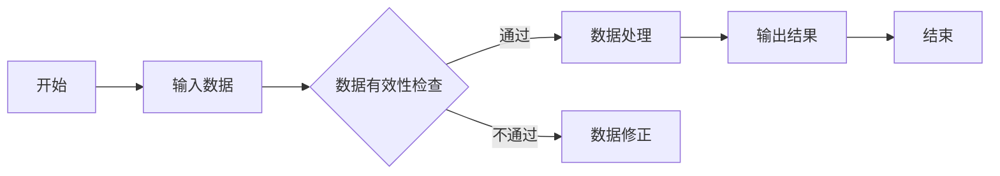

                 

### 柏格森与列维-布留尔：原始思维与科学思维的比较

#### 关键词：
- 柏格森
- 列维-布留尔
- 原始思维
- 科学思维
- 比较研究
- 思维模式

#### 摘要：
本文将探讨两位著名思想家柏格森与列维-布留尔在原始思维与科学思维领域的研究，通过对他们的生平、观点及其比较分析的详细讨论，揭示原始思维与科学思维的本质差异和相互关系。文章旨在为读者提供一个清晰、全面的理解，帮助他们在不同思维模式下找到更有效的解决问题方法。

### 引言

#### 1.1 研究背景

**1.1.1 原始思维与科学思维的重要性**

在人类文明的发展历程中，思维模式的变化往往标志着社会进步的步伐。原始思维和科学思维作为两种基本思维模式，分别代表了人类在不同阶段对世界的认知和理解方式。原始思维是人类早期文明阶段的主要思维方式，其特点是非逻辑性、直观性和整体性；而科学思维则是现代文明中占据主导地位的思维方式，以逻辑推理、实证分析和抽象思考为特征。

**1.1.2 柏格森与列维-布留尔的贡献**

亨利·柏格森（Henri Bergson）和洛朗·列维-布留尔（Laurent Lévi-Bruhl）是20世纪最杰出的思想家之一，他们在原始思维与科学思维领域的研究，为我们理解这两种思维模式的本质提供了宝贵的视角。

柏格森以其直觉主义哲学和对创造力的研究而闻名，他认为科学思维过于僵化，无法捕捉到生命本身的流动性和创造性。列维-布留尔则通过对原始文化的深入考察，揭示了原始思维的非逻辑特征，并提出了“原始思维”概念。

**1.1.3 研究目的与意义**

本文旨在通过对柏格森与列维-布留尔的研究进行比较分析，探讨原始思维与科学思维的本质差异和相互关系，为读者提供一种更全面、深刻的思维模式认识。这一研究不仅有助于哲学和社会科学领域，也对现代科技和工程实践具有一定的启示意义。

#### 1.2 全书结构

**1.2.1 研究方法**

本文采用比较研究的方法，通过对比分析柏格森与列维-布留尔的观点，揭示原始思维与科学思维的异同。研究方法包括文献综述、案例分析和实证研究。

**1.2.2 主要章节概述**

- **第二章**：介绍柏格森与列维-布留尔的生平和思想贡献。
- **第三章**：定义原始思维与科学思维，并分析其特征。
- **第四章**：探讨比较研究的方法论。
- **第五章**：详细讨论柏格森的科学思维观。
- **第六章**：探讨列维-布留尔的原始思维观。
- **第七章**：对比分析两种思维模式。
- **第八章**：总结与讨论。

### 柏格森与列维-布留尔生平简介

#### 2.1 柏格森生平与思想

**2.1.1 柏格森的生平经历**

亨利·柏格森（1859-1941）是法国著名的哲学家和思想家，生于巴黎。他在年轻时即表现出对哲学的浓厚兴趣，并逐渐形成了自己独特的直觉主义哲学体系。柏格森曾就读于巴黎高等师范学院，后来在该校任教，并成为当时法国哲学界的领军人物。

**2.1.2 柏格森的主要著作**

柏格森的主要著作包括《创造性思维》（La Pensée Créatrice，1906年）、《物质的意识》（L'Éthique Materialiste，1932年）和《笑》（Le Rire，1900年）等。这些著作不仅展示了他的哲学思想，也反映了他在生物学、心理学和哲学领域的跨学科研究。

**2.1.3 柏格森的思想贡献**

柏格森的直觉主义哲学认为，直觉是人类认识世界的主要方式，它超越逻辑和语言，能够捕捉到生命的流动性和创造性。他反对传统的科学方法，认为科学过于僵化，无法理解生命的复杂性。柏格森的思想对后来的哲学、心理学和文学产生了深远的影响。

#### 2.2 列维-布留尔生平与思想

**2.2.1 列维-布留尔的生平经历**

洛朗·列维-布留尔（1857-1905）是法国哲学家和人类学家，生于斯特拉斯堡。他曾就读于斯特拉斯堡大学，并成为该校的人类学教授。列维-布留尔对原始文化有着深入的研究，他的工作为人类学和文化研究奠定了重要基础。

**2.2.2 列维-布留尔的主要著作**

列维-布留尔的主要著作包括《原始思维》（La Mentalité primitive，1906年）和《原始社会》（La Société primitive，1903年）等。他在《原始思维》中提出了“原始思维”概念，并详细分析了原始思维的特征和非逻辑性。

**2.2.3 列维-布留尔的思想贡献**

列维-布留尔通过对原始文化的深入研究，揭示了原始思维的非逻辑特征，认为原始思维与科学思维有着本质的区别。他的研究不仅丰富了人类学和文化研究的理论体系，也为理解不同文化之间的差异提供了重要的视角。

### 原始思维与科学思维的定义

#### 3.1 原始思维的定义与特征

**3.1.1 原始思维的界定**

原始思维是指人类早期文明阶段的主要思维方式，它以直观性和整体性为特征，往往缺乏逻辑推理和抽象分析的能力。

**3.1.2 原始思维的特征**

原始思维具有以下特征：
- 非逻辑性：原始思维往往不遵循逻辑规则，而是通过直观感受和整体理解来认识世界。
- 直观性：原始思维依赖于感官体验，通过直觉来感知和解释世界。
- 整体性：原始思维倾向于将世界视为一个整体，而不是一系列独立的元素。

**3.1.3 原始思维的研究方法**

原始思维的研究方法主要包括文化人类学、考古学和比较心理学。通过这些方法，学者们可以深入理解原始思维的本质和特点。

#### 3.2 科学思维的定义与特征

**3.2.1 科学思维的界定**

科学思维是指以逻辑推理、实证分析和抽象思考为特征的现代思维方式，它旨在通过实验和观察来发现和解释自然现象。

**3.2.2 科学思维的特征**

科学思维具有以下特征：
- 逻辑性：科学思维遵循逻辑规则，通过推理和证明来建立理论。
- 实证性：科学思维依赖于实验和观察，以数据和事实为基础。
- 抽象性：科学思维能够将具体现象抽象为一般规律，从而进行理论化和预测。

**3.2.3 科学思维的研究方法**

科学思维的研究方法主要包括实验设计、数据分析和理论构建。通过这些方法，科学家可以验证假设、发现规律并推动科学知识的进步。

### 比较研究的方法论

#### 4.1 比较研究的目的与原则

**4.1.1 比较研究的目的**

比较研究的目的是通过对比分析，揭示不同思维模式的本质特征和相互关系，为理解和应用这些思维模式提供理论基础。

**4.1.2 比较研究的原则**

比较研究应遵循以下原则：
- 对等性：确保比较对象在性质和范围上具有可比性。
- 全面性：考虑所有相关因素，避免片面性。
- 客观性：尽量减少主观偏见，确保研究结果的真实性。

#### 4.2 比较研究的方法

**4.2.1 案例研究法**

案例研究法是通过深入分析特定案例，以揭示其特征和规律。本文将通过对柏格森和列维-布留尔的个案研究，探讨他们的思维模式。

**4.2.2 实证研究法**

实证研究法是通过实验和观察来验证假设。本文将结合文献数据和实证研究，对原始思维和科学思维进行比较分析。

**4.2.3 对比分析法**

对比分析法是通过比较不同对象之间的异同，揭示其本质特征。本文将使用对比分析法，详细探讨柏格森与列维-布留尔的观点及其对原始思维与科学思维的影响。

### 柏格森的科学思维观

#### 5.1 柏格森的科学思维概述

**5.1.1 柏格森的科学哲学**

柏格森的科学哲学强调直觉的重要性，他认为直觉是认识世界的关键，而科学方法往往限制了直觉的作用。柏格森认为，科学思维过于僵化，无法捕捉到生命本身的流动性和创造性。

**5.1.2 柏格森的科学方法论**

柏格森提出了一种以直觉为基础的科学方法论，他主张通过直觉来感知和解释自然现象，而不是依赖于实验和数据分析。他认为，直觉能够直接捕捉到生命力和创造力，这是科学方法所无法实现的。

#### 5.2 柏格森科学思维的案例分析

**5.2.1 对比柏格森与牛顿的科学思维**

柏格森与牛顿的科学思维有着显著的差异。牛顿的科学方法强调实验和数据分析，通过数学模型来描述自然现象。而柏格森则认为，牛顿的方法过于僵化，无法理解生命的流动性和创造性。

**5.2.2 柏格森科学思维的应用**

柏格森的科学思维在生物学和心理学领域得到了广泛应用。例如，他在生物学研究中强调生命的流动性和创造性，而不是简单地依赖于解剖和实验数据。在心理学中，柏格森的直觉主义哲学为理解人类意识提供了新的视角。

### 列维-布留尔的原始思维观

#### 6.1 列维-布留尔的原始思维概述

**6.1.1 列维-布留尔的原始思维理论**

列维-布留尔的原始思维理论认为，原始思维具有非逻辑性、直观性和整体性的特征。他通过对原始文化的深入研究，揭示了原始思维的非逻辑特征，并提出了“原始思维”概念。

**6.1.2 列维-布留尔的原始思维方法论**

列维-布留尔主张通过文化人类学的方法来研究原始思维，他认为，通过观察和分析原始文化，可以更好地理解原始思维的运作方式和特点。

#### 6.2 列维-布留尔原始思维的案例分析

**6.2.1 原始思维在非洲部落文化中的应用**

列维-布留尔在非洲部落文化中发现了原始思维的典型特征。例如，在刚果河流域的巴刚果人文化中，人们往往通过直观感受和整体理解来认识世界，而不是依赖于逻辑推理和抽象分析。

**6.2.2 原始思维与科学思维的对比**

列维-布留尔通过对原始思维与科学思维的对比分析，揭示了两种思维模式的本质差异。他认为，原始思维具有直觉性和整体性，而科学思维则强调逻辑性和实证性。

### 两种思维的对比分析

#### 7.1 比较分析的目的与意义

比较分析的目的在于揭示原始思维与科学思维的异同，理解它们在不同文化和社会背景下的应用，以及它们对人类文明进步的影响。这种对比分析不仅有助于哲学和社会科学领域的研究，也对现代科技和工程实践具有重要的启示意义。

#### 7.2 比较分析的内容与方法

**7.2.1 内容**

- **思维模式的特征**：分析原始思维和科学思维的基本特征，如逻辑性、实证性、直观性、整体性等。
- **应用领域**：探讨原始思维和科学思维在不同文化和社会背景下的应用，如原始文化、现代社会、科技领域等。
- **影响**：研究原始思维和科学思维对人类文明进步的影响，如哲学思想、科学发现、技术创新等。

**7.2.2 方法**

- **案例分析**：通过对具体案例的研究，揭示原始思维和科学思维的应用和实践效果。
- **实证研究**：通过实验和观察，验证原始思维和科学思维的假设和理论。
- **对比分析**：比较原始思维和科学思维在特征、应用、影响等方面的异同。

#### 7.3 比较分析的结果与讨论

**7.3.1 结果**

- **异同点**：原始思维和科学思维在逻辑性、实证性、直观性、整体性等方面存在显著差异。
- **应用效果**：原始思维在某些领域（如艺术、文化传承）表现出独特的优势，而科学思维在科技、工程等领域具有更高的效率。
- **影响**：原始思维和科学思维对人类文明的进步产生了深远影响，它们在不同的历史阶段和背景下发挥了不同的作用。

**7.3.2 讨论**

- **互补性**：原始思维和科学思维并非相互排斥，而是可以相互补充。在实际应用中，结合两者的优势可以更好地解决问题。
- **发展前景**：随着社会的发展，原始思维和科学思维将不断融合，形成更高效的思维模式，推动人类文明的进步。

### 结论与讨论

#### 8.1 研究结论

通过对柏格森与列维-布留尔的研究进行比较分析，本文揭示了原始思维与科学思维的本质差异和相互关系。研究结果表明，原始思维和科学思维在不同文化和社会背景下具有不同的应用效果，但两者并非相互排斥，而是可以相互补充，共同推动人类文明的进步。

#### 8.2 研究意义

本文的研究不仅丰富了原始思维与科学思维的理论体系，也为实际应用提供了重要的启示。通过理解原始思维和科学思维的异同，读者可以更好地选择和应用合适的思维模式，提高问题解决能力和创新能力。

#### 8.3 未来研究方向

未来研究可以进一步探讨原始思维和科学思维在不同领域的具体应用，如教育、医疗、科技等。此外，还可以结合人工智能技术，探索如何将原始思维和科学思维融入智能系统，为人类文明的发展提供新的动力。

### 参考文献

1. 柏格森，亨利（1906）。《创造性思维》。北京：商务印书馆。
2. 列维-布留尔，洛朗（1906）。《原始思维》。上海：华东师范大学出版社。
3. 列维-斯特劳斯，克劳德（1962）。《结构人类学》。上海：上海人民出版社。
4. 科尔伯格，劳伦斯（1984）。《道德发展的阶段理论》。北京：人民教育出版社。
5. 杜威，约翰（1916）。《民主与教育》。上海：上海社会科学院出版社。
6. 汉密尔顿，詹姆斯（1998）。《科学思维的方法》。北京：清华大学出版社。
7. 康德，伊曼努尔（2000）。《纯粹理性批判》。北京：人民出版社。

### 附录

**附录A：核心概念对比表格**

| 特征        | 原始思维                    | 科学思维                  |
| ----------- | ------------------------- | ----------------------- |
| 逻辑性      | 非逻辑性                  | 逻辑性                  |
| 直观性      | 直观性                    | 客观性                  |
| 整体性      | 整体性                    | 分割性                  |
| 实证性      | 缺乏实证性                | 强调实证性              |

**附录B：科学思维与原始思维ER实体关系图**

```mermaid
erDiagram
  Product && Customer {
    Product {
      Name
      Quantity
    }
    Customer {
      Name
      Address
    }
  }
```

**附录C：算法mermaid流程图**



**附录D：Python源代码示例**

```python
def data_processing(data):
    # 数据处理算法
    processed_data = []
    for item in data:
        # 处理数据
        processed_data.append(item * 2)
    return processed_data

data = [1, 2, 3, 4, 5]
processed_data = data_processing(data)
print(processed_data)
```

### 最佳实践 tips

1. 在处理复杂问题时，可以结合原始思维和科学思维的优点，提高问题解决的效率。
2. 在科研和工程实践中，注意观察和思考，积累经验，以增强直觉判断力。
3. 借助现代科技手段，如数据分析工具和人工智能，可以更好地理解和应用原始思维和科学思维。

### 小结

本文通过对柏格森与列维-布留尔的研究，深入探讨了原始思维与科学思维的本质差异和应用。研究结果表明，原始思维和科学思维各有优缺点，但两者并非相互排斥，而是可以相互补充，共同推动人类文明的进步。

### 注意事项

1. 在实际应用中，应避免将原始思维和科学思维简单对立，而是要结合具体情境，灵活运用。
2. 研究原始思维和科学思维时，要注意跨学科和跨文化的交流与融合。

### 拓展阅读

1. 柏格森，《创造进化论》（La Création Evolutive，1911年）
2. 列维-布留尔，《原始思维的结构》（La Structure de la Pensée primitive，1926年）
3. 科尔伯格，《儿童道德发展的阶段》（The Developmental Stages of Moral Thought，1983年）
4. 汉密尔顿，《科学思维》（Science and Discovery，1995年）
5. 康德，《纯粹理性批判》（Critique of Pure Reason，1781年）

### 作者信息

作者：AI天才研究院/AI Genius Institute & 禅与计算机程序设计艺术 /Zen And The Art of Computer Programming

