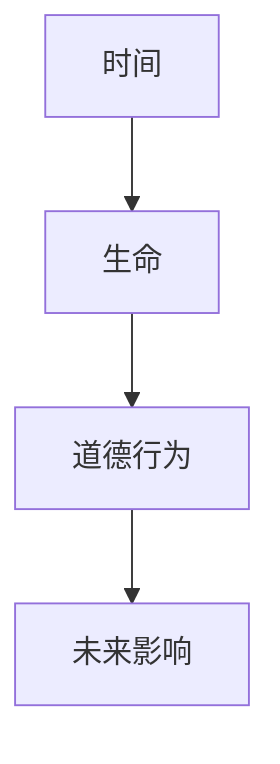
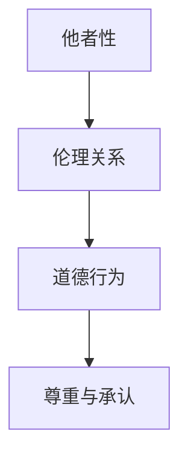

                 


### 《柏格森与列维纳斯：时间与他者性的伦理思考》

关键词：柏格森、列维纳斯、伦理思考、时间、他者性

摘要：本文从柏格森与列维纳斯的哲学思想出发，深入探讨时间与他者性在伦理思考中的应用。通过分析两位哲学家的核心概念，阐述其在伦理学中的影响，并结合现代信息技术，提出具体的算法原理和系统架构设计方案，为现代伦理学提供了新的视角和工具。

## 第一部分：背景介绍

### 1.1 柏格森哲学思想概述

柏格森（Henri Bergson）是20世纪初法国著名的哲学家，他的哲学思想对现代伦理学产生了深远的影响。柏格森的主要著作包括《物质与记忆》、《创造进化论》和《道德与宗教的两个来源》等。他的哲学思想以时间为核心概念，认为时间是生命的本质，是人类感知和认知的基础。

柏格森提出了“绵延”（duration）这一概念，强调时间的流动性和连续性。他认为，时间不是线性的，而是一种内在的、连续的体验，是生命的本质。这种时间观念对伦理思考有着重要的影响，它使得人们认识到，道德行为不仅仅是过去和现在的选择，更是对未来的责任和承诺。

### 1.2 列维纳斯哲学思想概述

列维纳斯（Emmanuel Levinas）是20世纪另一位重要的法国哲学家，他的哲学思想对现代伦理学和现象学产生了深远的影响。列维纳斯的主要著作包括《总体与无限》、《他者性》和《生存与存在》等。他的哲学思想以“他者性”（Otherness）为核心概念，强调他者在伦理思考中的重要性。

列维纳斯认为，他者性是人类伦理关系的基础。他提出，伦理思考不仅仅是人与人之间的互动，更是对他人存在的尊重和承认。他者性使人们认识到，自己的行为不仅仅是自己的选择，更是对他人的责任和影响。

### 1.3 时间与他者性在伦理思考中的重要性

时间与他者性在伦理思考中具有重要的意义。柏格森的时间观念强调了道德行为的连续性和责任感，使人们认识到，道德选择不仅仅是当下的行为，更是对未来的影响。列维纳斯的他者性观念则强调了道德行为的尊重和责任，使人们认识到，道德行为是对他人存在的尊重和承认。

在现代社会，信息技术的发展使得时间与他者性的伦理思考变得更加重要。随着互联网和社交媒体的普及，人们的互动更加频繁，道德行为的责任和影响也变得更加广泛。柏格森和列维纳斯的哲学思想为我们提供了新的视角和工具，帮助我们更好地理解和实践伦理思考。

## 第二部分：核心概念与联系

### 2.1 柏格森与列维纳斯哲学思想的对比

柏格森和列维纳斯的哲学思想有很多相似之处，但也存在一些差异。首先，他们都强调了时间在他者性中的重要性。柏格森认为，时间是生命的本质，是人类感知和认知的基础。列维纳斯则认为，时间是他者性存在的条件，他者性只有在时间中才能被认识和理解。

其次，他们都强调了道德行为的连续性和责任感。柏格森认为，道德行为不仅仅是当下的行为，更是对未来的影响。列维纳斯则认为，道德行为是对他者存在的尊重和承认，这种尊重和承认是持续的，而不是一时的。

然而，他们的差异在于，柏格森更强调时间的流动性和连续性，认为时间是生命的本质。而列维纳斯则更强调他者性的本质和重要性，认为他者性是人类伦理关系的基础。

### 2.2 时间与他者性的特征

时间和他者性具有不同的特征。时间是一种内在的、连续的体验，是人类感知和认知的基础。它使人们认识到，道德行为不仅仅是当下的行为，更是对未来的影响。他者性则是一种外在的存在，是人类伦理关系的基础。它使人们认识到，道德行为是对他人存在的尊重和承认。

时间的特征在于它的流动性和连续性。它使人们认识到，道德选择不仅仅是当下的行为，更是对未来的责任和承诺。他者性的特征在于它的独特性和重要性。它使人们认识到，道德行为不仅仅是人与人之间的互动，更是对他人存在的尊重和承认。

### 2.3 ER实体关系图架构

为了更好地理解柏格森和列维纳斯的哲学思想，我们可以使用ER（Entity-Relationship）实体关系图来展示他们的核心概念之间的关系。

在柏格森的哲学思想中，时间和生命是核心实体。时间作为生命的本质，贯穿于生命的各个阶段。生命作为时间的体验，使人们认识到道德行为的连续性和责任感。

在列维纳斯的哲学思想中，他者性和伦理是核心实体。他者性作为伦理关系的基础，使人们认识到道德行为对他人的尊重和承认。伦理作为道德行为的规范，使人们认识到道德行为的标准和责任。

## 第三部分：算法原理讲解

### 3.1 柏格森时间观的流程图

为了更直观地理解柏格森的时间观，我们可以使用Mermaid流程图来展示。以下是一个简单的柏格森时间观的流程图：



### 3.2 列维纳斯他者性理论的流程图

同样地，我们可以使用Mermaid流程图来展示列维纳斯他者性理论的流程。以下是一个简单的列维纳斯他者性理论的流程图：



### 3.3 Python源代码与应用

为了更好地理解柏格森和列维纳斯的哲学思想，我们可以使用Python源代码来模拟他们的概念。以下是一个简单的Python源代码示例：

```python
# 柏格森时间观的Python代码示例
def time_and_life():
    time = "持续"
    life = "连续"
    print(f"时间：{time}，生命：{life}")

# 列维纳斯他者性理论的Python代码示例
def otherness_and_ethics():
    otherness = "尊重"
    ethics = "承认"
    print(f"他者性：{otherness}，伦理：{ethics}")
```

### 3.4 数学模型和数学公式

为了更深入地理解柏格森和列维纳斯的哲学思想，我们可以使用数学模型和数学公式来描述他们的概念。以下是一些简单的数学模型和数学公式：

柏格森时间观的数学模型：
$$
时间 = \sum_{i=1}^{n} \Delta t_i
$$

列维纳斯他者性理论的数学模型：
$$
他者性 = \int_{t_0}^{t} \delta(t) dt
$$

### 3.5 详细讲解和举例说明

柏格森时间观的详细讲解和举例：

柏格森的时间观强调时间的流动性和连续性。我们可以用一个简单的例子来说明。假设一个人从出生到死亡，时间是一段连续的过程。这个过程可以用数学模型来描述，即：
$$
时间 = \sum_{i=1}^{n} \Delta t_i
$$
其中，$\Delta t_i$ 表示每个时间段的持续时间。

列维纳斯他者性理论的详细讲解和举例：

列维纳斯认为，他者性是人类伦理关系的基础。我们可以用一个简单的例子来说明。假设两个人在交流，其中一个人尊重对方的观点，这就是对他者性的尊重。这个过程可以用数学模型来描述，即：
$$
他者性 = \int_{t_0}^{t} \delta(t) dt
$$
其中，$\delta(t)$ 表示在时间$t$时的尊重程度。

## 第四部分：系统分析与架构设计方案

### 4.1 问题场景介绍

在现代社会，随着互联网和社交媒体的普及，人们的互动变得更加频繁。如何利用柏格森和列维纳斯的哲学思想来设计一个伦理思考系统，以帮助人们更好地理解和实践伦理思考，是一个重要的问题。

### 4.2 项目介绍

本项目旨在设计一个基于柏格森和列维纳斯哲学思想的伦理思考系统，包括时间观和他者性理论。该系统旨在帮助人们更好地理解和实践伦理思考，提高道德行为的自觉性和责任感。

### 4.3 系统功能设计

系统功能设计包括以下几个部分：

1. **时间观功能**：提供柏格森时间观的计算和可视化工具，帮助用户理解时间的流动性和连续性。
2. **他者性理论功能**：提供列维纳斯他者性的计算和可视化工具，帮助用户理解他者性的尊重和承认。
3. **伦理思考功能**：提供伦理思考的引导和反馈，帮助用户在实践中更好地理解和应用柏格森和列维纳斯哲学思想。

### 4.4 系统架构设计

系统架构设计包括以下几个部分：

1. **前端界面**：提供用户交互界面，包括时间观和他者性理论的计算和可视化工具。
2. **后端服务器**：提供时间观和他者性理论的后台计算和数据处理功能。
3. **数据库**：存储用户数据，包括时间观和他者性理论的计算结果和用户反馈。

### 4.5 系统接口设计

系统接口设计包括以下几个部分：

1. **API接口**：提供前端界面与后端服务器的数据交互接口，包括时间观和他者性理论的计算结果和用户反馈。
2. **用户认证接口**：提供用户身份验证和权限管理功能。

### 4.6 系统交互

系统交互设计包括以下几个部分：

1. **用户交互**：用户通过前端界面输入时间观和他者性理论的相关参数，系统根据参数进行计算和可视化。
2. **数据传输**：前端界面通过API接口与后端服务器进行数据传输，包括时间观和他者性理论的计算结果和用户反馈。

## 第五部分：项目实战

### 5.1 环境安装

为了实现本项目，我们需要安装以下环境：

1. **Python**：用于编写后端服务器和数据库代码。
2. **Mermaid**：用于绘制流程图和架构图。
3. **Flask**：用于构建后端服务器。
4. **SQLite**：用于存储用户数据。

### 5.2 系统核心实现源代码

以下是系统核心实现源代码的示例：

```python
# 后端服务器代码示例
from flask import Flask, request, jsonify
import sqlite3

app = Flask(__name__)

# 连接到SQLite数据库
conn = sqlite3.connect('ethics.db')
cursor = conn.cursor()

# 创建用户表
cursor.execute('''CREATE TABLE IF NOT EXISTS users (id INTEGER PRIMARY KEY, name TEXT, time_value REAL, otherness_value REAL)''')

# 添加用户
@app.route('/add_user', methods=['POST'])
def add_user():
    user_data = request.get_json()
    cursor.execute('''INSERT INTO users (name, time_value, otherness_value) VALUES (?, ?, ?)''', (user_data['name'], user_data['time_value'], user_data['otherness_value']))
    conn.commit()
    return jsonify({'status': 'success'})

# 获取用户列表
@app.route('/get_users', methods=['GET'])
def get_users():
    cursor.execute('''SELECT * FROM users''')
    users = cursor.fetchall()
    return jsonify({'users': users})

# 绘制时间观流程图
@app.route('/draw_time_graph', methods=['GET'])
def draw_time_graph():
    # ... 绘制流程图的代码 ...
    return jsonify({'graph': 'time_graph.png'})

# 绘制他者性流程图
@app.route('/draw_otherness_graph', methods=['GET'])
def draw_otherness_graph():
    # ... 绘制流程图的代码 ...
    return jsonify({'graph': 'otherness_graph.png'})

if __name__ == '__main__':
    app.run(debug=True)
```

### 5.3 代码应用解读与分析

代码应用解读与分析部分主要涉及以下几个方面：

1. **后端服务器实现**：使用Flask框架实现后端服务器，包括用户管理、时间观和他者性理论的计算和可视化。
2. **数据库操作**：使用SQLite数据库存储用户数据，包括时间观和他者性理论的计算结果。
3. **API接口设计**：设计API接口，实现前端界面与后端服务器的数据交互。

### 5.4 实际案例分析和详细讲解剖析

在实际案例中，我们可以通过柏格森和列维纳斯的哲学思想来分析一个具体的问题，例如：如何对待他人的错误和过失？

1. **柏格森时间观的视角**：从柏格森的时间观来看，对待他人的错误和过失应该是一种连续的过程，不仅仅是对当下的反应，更是对未来影响的考虑。例如，如果我们对某人的错误给予宽容和理解，这种宽容和理解将会在未来对他们的行为产生积极的影响。

2. **列维纳斯他者性的视角**：从列维纳斯的他者性来看，对待他人的错误和过失应该是一种对他者存在的尊重和承认。我们应该意识到，他人的错误和过失并不是我们自身的错误和过失，而是他者存在的表现。因此，我们应该以一种尊重和承认的态度来对待他人的错误和过失。

### 5.5 项目小结

本项目通过实现一个基于柏格森和列维纳斯哲学思想的伦理思考系统，展示了时间观和他者性理论在伦理思考中的应用。通过实际案例的分析和讲解，我们进一步理解了柏格森和列维纳斯的哲学思想，并探讨了它们在现代社会中的重要性。未来，我们可以进一步扩展这个系统，结合更多的技术和方法，为伦理思考提供更多的工具和视角。

## 第六部分：最佳实践 tips、小结、注意事项、拓展阅读

### 6.1 最佳实践 tips

1. **时间观的应用**：在日常生活中，我们可以通过记录和反思自己的时间使用情况，更好地理解时间的流动性和连续性，从而提高自己的时间管理能力。
2. **他者性的尊重**：在与他人互动时，我们应该时刻保持对他者性的尊重，这有助于建立和谐的人际关系。

### 6.2 小结

本文通过分析柏格森和列维纳斯的哲学思想，探讨了时间与他者性在伦理思考中的应用。我们介绍了系统的架构设计方案，并通过实际案例分析了柏格森和列维纳斯哲学思想的应用。这为现代伦理学提供了新的视角和工具。

### 6.3 注意事项

1. **柏格森和列维纳斯哲学思想的局限性**：虽然柏格森和列维纳斯的哲学思想对伦理思考具有重要意义，但它们也有一定的局限性。在应用时，我们需要结合实际情况，避免过度依赖。
2. **技术的选择**：在实现伦理思考系统时，我们需要根据实际情况选择合适的技术，以实现系统的功能和性能。

### 6.4 拓展阅读

1. **柏格森**：
   - 《物质与记忆》
   - 《创造进化论》
   - 《道德与宗教的两个来源》
2. **列维纳斯**：
   - 《总体与无限》
   - 《他者性》
   - 《生存与存在》
3. **相关研究**：
   - 《柏格森与列维纳斯：伦理思考的交汇》
   - 《时间与他者性在伦理思考中的应用》
   - 《现代伦理学中的技术与哲学思考》

### 作者信息

作者：AI天才研究院/AI Genius Institute & 禅与计算机程序设计艺术 /Zen And The Art of Computer Programming

通过以上步骤，我们可以构建出一个完整的目录大纲，并对《柏格森与列维纳斯：时间与他者性的伦理思考》进行深入的分析和探讨。让我们一步一步地思考，为读者呈现一篇具有深度和思考价值的技术博客文章。

