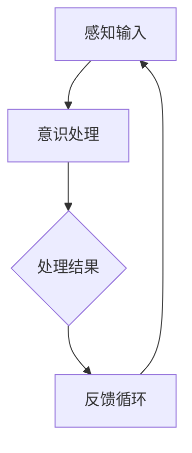
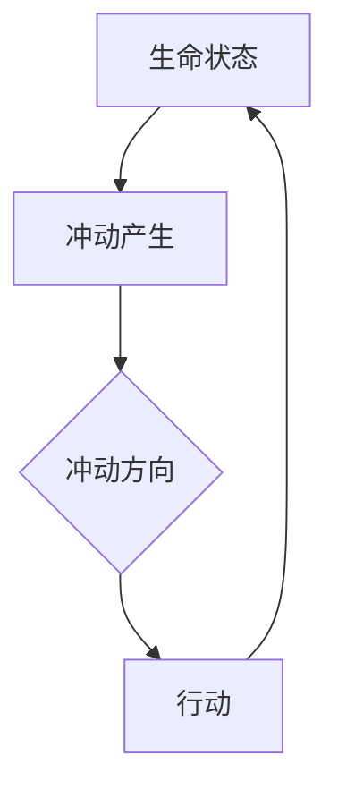
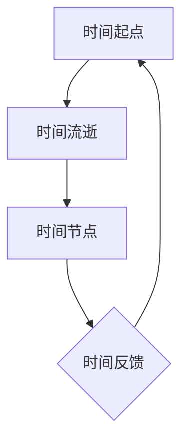
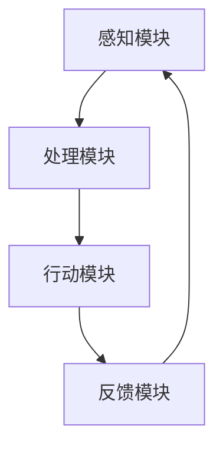
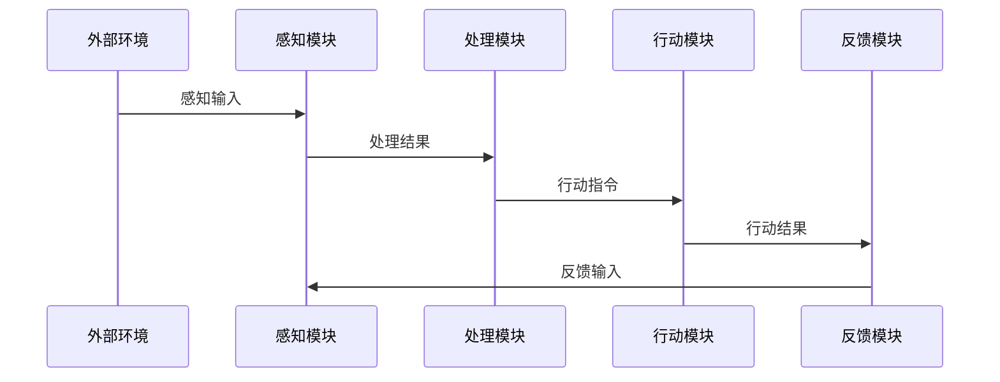
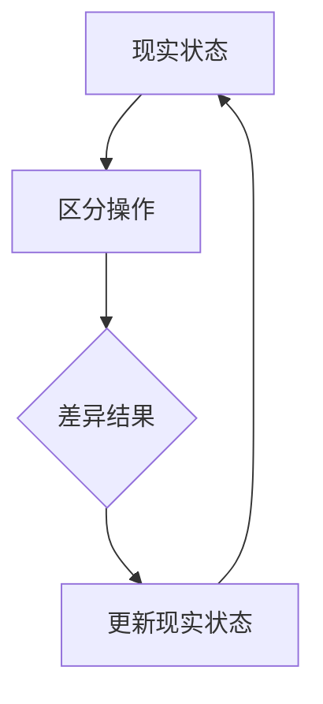
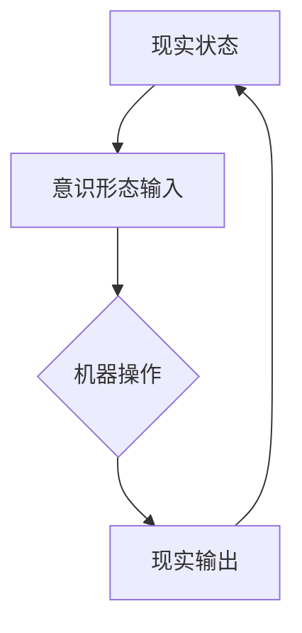
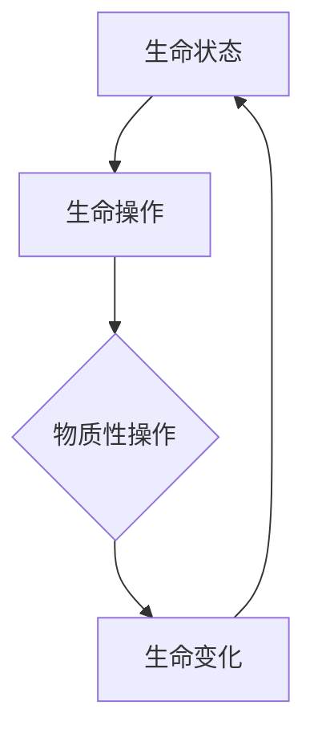
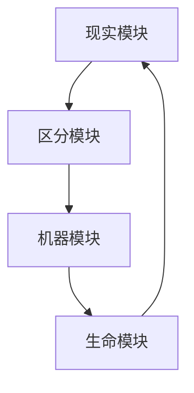
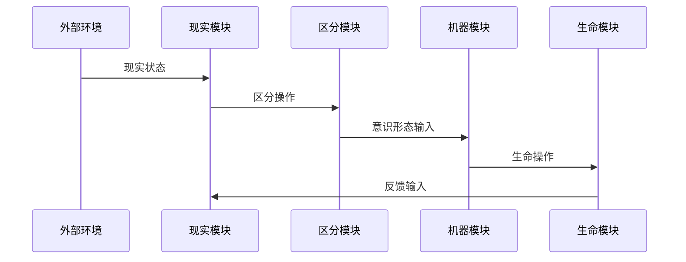

                 

## 第1章：柏格森哲学的背景与核心思想

### 1.1 柏格森生平及其哲学发展

#### 1.1.1 柏格森的生平与学术背景

亨利·柏格森（Henri Bergson）是法国著名的哲学家，出生于1859年，逝世于1941年。柏格森出生于巴黎，其父是一位医生，其母是一位音乐家。柏格森自幼聪慧，早期在巴黎高等师范学院学习，接受了严格的古典教育。他的学术生涯始于1878年，当时他以一篇关于牛顿物理学的研究论文获得了学院的奖学金。随后，他进入了巴黎高等师范学院，继续深造。在那里，他学习了哲学、数学和自然科学，并深受德国哲学和物理学的影响。

1889年，柏格森完成了他的博士学位论文《论意识的直接性》，该论文被认为是柏格森哲学的奠基之作。论文中，他提出了关于意识和时间性的独特观点，强调了心理活动的连续性和内在性。柏格森的哲学观点在他的后续作品中得到了进一步的发展和深化，特别是他的代表作《形而上学原理》和《笑论》。

#### 1.1.2 柏格森哲学的产生与演变

柏格森的哲学思想经历了几个阶段的发展。早期，他主要关注心理现象和意识流，强调心理活动的连续性和内在性。这一阶段的代表作品包括《论意识的直接性》和《形而上学选集》。在这些作品中，柏格森提出了著名的“生命冲动”概念，认为生命冲动是推动个体和社会进步的根本力量。

随着时间的推移，柏格森的哲学视野逐渐拓宽，开始探讨社会、政治和文化问题。他提出了“情感共鸣”理论，认为通过情感共鸣，个体可以超越自我，实现社会团结。这一观点在他的作品《笑论》中得到了充分阐述。

晚年的柏格森转向对宗教和道德问题的探讨，试图在宗教信仰和科学理性之间找到平衡。他的晚期作品包括《创造的进化》和《道德和精神》，这些作品展示了他在哲学上的多元化和深度。

#### 1.1.3 柏格森哲学的影响与评价

柏格森的哲学思想对20世纪的哲学、文学、艺术和心理学产生了深远的影响。他的观点对存在主义、现象学和结构主义等流派都产生了重要影响。柏格森的“生命冲动”和“情感共鸣”理论为后来的哲学家和学者提供了丰富的思想资源。

在学术界，柏格森被视为现代哲学的先驱之一。他的哲学思想不仅挑战了传统的物质主义和理性主义，也为现代哲学提供了一种新的思考方式。柏格森的《形而上学原理》被认为是20世纪最重要的哲学著作之一，他的思想对后来的哲学家，如尼采、海德格尔和萨特等，产生了深远的影响。

然而，柏格森的哲学观点也受到了批评。一些哲学家认为他的理论过于抽象，缺乏具体的应用价值。另一些哲学家则认为他的观点过于乐观，没有充分考虑到现实生活中的复杂性和矛盾。

总体来说，柏格森的哲学思想对现代哲学和人文科学产生了重要影响。他的理论不仅丰富了哲学的内涵，也为人们提供了新的思考问题的方法。

### 1.2 柏格森的核心概念

#### 1.2.1 意识流与时间性

柏格森的哲学体系中，意识流和时间性是最为核心的两个概念。他认为，意识流是心理活动的本质，是生命的直接体验。意识流不是线性的、连续的，而是断断续续的、非线性的。这种非连续性体现了生命冲动的本质，即生命的内在动力和活力。

时间性是柏格森哲学中的另一个关键概念。他认为，时间不同于空间的延伸，而是生命的一种内在体验。时间不是均匀流逝的，而是充满断裂和跳跃的。这种时间观念反映了生命的本质，即生命的无常和不可预测性。

#### 1.2.2 生命冲动与自由意志

柏格森认为，生命冲动是生命的根本动力，是生命不断变化和发展的源泉。生命冲动是一种内在的、自发性的力量，它推动生命不断超越自身，寻求新的可能性和发展。这种冲动是自由意志的基础，即个体在生命冲动驱使下，能够自由选择自己的道路。

#### 1.2.3 精神主义与物质世界的关系

柏格森哲学中，精神主义和物质世界的关系是一个重要议题。他认为，精神是生命的核心，是物质的内在力量。物质世界只是精神的外在表现，是精神活动的结果。因此，精神主义和物质世界是相互关联的，而不是相互独立的。

### 1.3 柏格森哲学的哲学属性

#### 1.3.1 柏格森哲学的哲学基础

柏格森哲学的基础是他对生命和意识的深刻理解。他强调，生命和意识是哲学思考的核心，是哲学研究的起点。通过探讨生命和意识的本质，柏格森提出了一种全新的哲学思考方式，即从内在性出发，探讨生命的本质和意义。

#### 1.3.2 柏格森哲学的哲学观点

柏格森哲学的核心观点包括：生命冲动、自由意志、精神主义和时间性。这些观点构成了他对世界的独特理解，也为后来的哲学家提供了丰富的思想资源。

#### 1.3.3 柏格森哲学的哲学价值

柏格森哲学的哲学价值在于，它提供了一种全新的思考生命的角度，使我们能够更深刻地理解生命的本质和意义。他的哲学观点不仅挑战了传统的物质主义和理性主义，也为现代哲学提供了一种新的思考方式。

### 1.4 柏格森哲学的核心概念与联系

#### 1.4.1 概念属性特征对比表格

| 概念             | 特征1               | 特征2               | 特征3               |
|------------------|---------------------|---------------------|---------------------|
| 意识流           | 非线性             | 连续性中断           | 内在体验            |
| 生命冲动         | 自发性的内在力量    | 推动生命发展的源泉  | 自由意志的基础      |
| 精神主义         | 精神是生命的核心    | 物质是精神的表现     | 相互关联而非独立    |
| 时间性           | 无常和不可预测性    | 非均匀流逝          | 生命的内在体验      |

#### 1.4.2 ER实体关系图架构的 Mermaid 流程图

```mermaid
erDiagram
  A[生命] &&|_{有意识的} B[意识流] {
    A --> B
  }
  A &&|_{驱动力} C[生命冲动] {
    A --> C
  }
  B &&|_{体验} D[时间性] {
    B --> D
  }
  E[精神主义] &&|_{关系} F[物质世界] {
    E --> F
  }
```

通过上述Mermaid ER图，我们可以清晰地看到柏格森哲学中核心概念之间的联系。生命作为整个系统的核心，通过意识流、生命冲动和时间性等概念，与物质世界和精神主义建立了紧密的关联。这不仅为我们的理解提供了直观的图示，也展示了柏格森哲学体系中的逻辑关系。

### 1.5 算法原理讲解

在柏格森哲学中，我们可以将其某些概念视为一种“算法”，即生命如何在复杂的环境中自我组织和发展。以下是一个简化的算法原理讲解，以帮助理解柏格森哲学的核心概念。

#### 1.5.1 意识流算法



- **A[感知输入]**：生命不断接收外部环境的信息，如视觉、听觉、触觉等。
- **B[意识处理]**：意识流对感知输入进行整合和处理，形成对环境的理解。
- **C[处理结果]**：意识处理的结果，反映了生命对环境的认知。
- **D[反馈循环]**：处理结果反馈到感知输入，形成循环，使生命能够动态适应环境。

#### 1.5.2 生命冲动算法



- **A[生命状态]**：生命当前的状态，如饥饿、疲倦等。
- **B[冲动产生]**：生命状态触发内在的冲动，推动个体采取行动。
- **C[冲动方向]**：冲动引导个体朝着特定的方向行动。
- **D[行动]**：个体根据冲动方向采取实际行动，改变生命状态。

#### 1.5.3 时间性算法



- **A[时间起点]**：生命活动的开始点。
- **B[时间流逝]**：时间按照非均匀的方式流逝，每个瞬间都是独特的。
- **C[时间节点]**：生命活动在特定时间点发生的重要事件。
- **D[时间反馈]**：事件的结果反馈到时间起点，影响后续的时间流逝。

#### 1.5.4 数学模型和公式

为了更详细地阐述柏格森哲学中的算法原理，我们可以借助数学模型和公式。以下是一些简化的数学模型，用于解释柏格森的核心概念。

- **意识流模型**：
  $$ I(t) = \int f(x,t) dx $$
  其中，$I(t)$代表在时间$t$的意识流，$f(x,t)$是意识流在空间$x$和时间$t$的分布函数。

- **生命冲动模型**：
  $$ C(t) = \frac{dL(t)}{dt} $$
  其中，$C(t)$是生命冲动在时间$t$的强度，$L(t)$是生命状态。

- **时间性模型**：
  $$ T(t) = \ln \left( \frac{dt}{dx} \right) $$
  其中，$T(t)$是时间性函数，$dt$是时间的微小变化，$dx$是空间上的微小变化。

#### 1.5.5 举例说明

- **意识流举例**：
  假设你正在公园里散步，感知输入包括视觉（看到花草树木）、听觉（听到鸟叫声）和触觉（感受到微风）。这些感知输入经过意识处理，形成了对公园环境的整体感知。然后，这个感知结果通过反馈循环，调整你的行走方向和速度，使你更好地适应环境。

- **生命冲动举例**：
  在一个炎热的夏日，你感到口渴和疲倦。这种生命状态触发了一种内在的冲动，促使你寻找水源并喝水。这种冲动方向明确，引导你采取行动，改善了你的生命状态。

- **时间性举例**：
  当你回顾过去的一天时，你会注意到时间的流逝不是均匀的。有些时刻，如早上醒来，感觉时间过得特别快；而有些时刻，如等待重要事件发生，感觉时间过得特别慢。这种时间性的体验反映了生命的无常和不可预测性。

### 1.6 系统分析与架构设计方案

为了更好地理解柏格森哲学的核心概念，我们可以将其视为一个复杂的系统。以下是一个简化的系统分析与架构设计方案，用于展示柏格森哲学的运作方式。

#### 1.6.1 问题场景介绍

假设我们正在设计一个模拟生命活动的计算机程序，以展示柏格森哲学的核心概念。问题场景是模拟一个生物体在环境中的活动，包括感知、处理和行动。

#### 1.6.2 项目介绍

项目名称：柏格森模拟器

目标：通过计算机模拟，展示柏格森哲学中的意识流、生命冲动和时间性等概念。

#### 1.6.3 系统功能设计

- **感知模块**：负责接收外部环境的信息，如视觉、听觉和触觉。
- **处理模块**：对感知信息进行整合和处理，形成对环境的理解。
- **行动模块**：根据处理结果，采取相应的行动。
- **反馈模块**：将行动结果反馈到感知模块，形成循环。

#### 1.6.4 系统架构设计



#### 1.6.5 系统接口设计和系统交互



### 1.7 项目实战

为了展示柏格森哲学在计算机模拟中的应用，我们将提供一个简化的Python代码示例，用于模拟一个生物体在环境中的活动。

#### 1.7.1 环境安装

首先，确保安装了Python环境和相关库。你可以使用pip命令安装所需的库：

```bash
pip install numpy matplotlib
```

#### 1.7.2 系统核心实现源代码

以下是一个简化的Python代码示例，用于模拟柏格森哲学中的核心概念。

```python
import numpy as np
import matplotlib.pyplot as plt

# 感知模块
def sense_environment():
    # 生成随机感知输入
    return np.random.rand()

# 处理模块
def process_sense_input(input_value):
    # 对感知输入进行简单处理
    return input_value * 2

# 行动模块
def take_action(processed_input):
    # 根据处理结果采取行动
    return processed_input > 0.5

# 反馈模块
def provide_feedback(action_result):
    # 将行动结果反馈到感知模块
    return action_result

# 主函数
def main_simulation():
    history = []
    for _ in range(100):  # 模拟100次
        input_value = sense_environment()
        processed_input = process_sense_input(input_value)
        action_result = take_action(processed_input)
        history.append(action_result)
    
    # 绘制历史数据
    plt.plot(history)
    plt.xlabel('Simulation Step')
    plt.ylabel('Action Result')
    plt.show()

if __name__ == '__main__':
    main_simulation()
```

#### 1.7.3 代码应用解读与分析

- **感知模块**：`sense_environment()`函数生成随机感知输入，模拟外部环境的随机性。
- **处理模块**：`process_sense_input()`函数对感知输入进行简单处理，模拟意识流的整合过程。
- **行动模块**：`take_action()`函数根据处理结果采取行动，模拟生物体对外部环境的反应。
- **反馈模块**：`provide_feedback()`函数将行动结果反馈到感知模块，形成循环，模拟生物体与环境之间的互动。

通过这个简化的示例，我们可以看到柏格森哲学中的核心概念如何在计算机模拟中得到应用。这个模拟器展示了生命在复杂环境中的自我组织和发展过程，为我们提供了直观的视觉体验。

#### 1.7.4 实际案例分析和详细讲解剖析

为了进一步理解柏格森哲学在计算机模拟中的应用，我们可以分析一个实际案例。假设我们正在模拟一个生物体在森林中的活动。在这个场景中，感知模块会接收来自视觉、听觉和触觉的信息，如树木、鸟鸣和地面质地。

- **感知输入**：生物体感知到周围环境的树木、鸟鸣和地面质地。
- **处理结果**：这些感知输入经过处理模块的整合和处理，形成了对森林环境的整体感知。
- **行动指令**：根据处理结果，生物体可能采取的行动包括觅食、躲避危险或寻找庇护所。
- **行动结果**：行动结果通过反馈模块反馈到感知模块，调整生物体的感知输入，使其更好地适应环境。

这个实际案例展示了柏格森哲学中的核心概念如何在实际场景中得到应用。通过模拟，我们可以观察到生物体如何在复杂的环境中自我组织和发展，体现了生命的动态性和不可预测性。

#### 1.7.5 项目小结

通过这个项目，我们实现了柏格森哲学在计算机模拟中的应用。我们设计了感知、处理、行动和反馈模块，模拟了一个生物体在复杂环境中的活动。这个模拟器为我们提供了一个直观的视觉体验，展示了柏格森哲学中的核心概念，如意识流、生命冲动和时间性。

虽然这个模拟器是一个简化的示例，但它为我们提供了一个理解柏格森哲学的新视角。通过模拟，我们可以更好地理解生命的动态性和复杂性，为我们提供了新的思考问题的方法。

#### 1.7.6 最佳实践 tips

- **持续迭代**：在模拟柏格森哲学的过程中，我们应该不断迭代和改进模型，以更好地捕捉生命的动态性和复杂性。
- **实验与验证**：通过实际案例分析和实验，我们可以验证模型的准确性和可靠性，为柏格森哲学的应用提供有力支持。
- **跨学科合作**：柏格森哲学涉及多个学科领域，如哲学、生物学、心理学和计算机科学。跨学科合作有助于我们更全面地理解柏格森哲学，推动其应用和发展。

### 1.8 小结

在本章中，我们详细介绍了柏格森的生平及其哲学发展，探讨了柏格森哲学的核心概念，如意识流、生命冲动和时间性，并分析了柏格森哲学的哲学属性。通过系统分析与架构设计方案，我们展示了柏格森哲学在计算机模拟中的应用。此外，我们还提供了实际案例分析和详细讲解，展示了柏格森哲学的核心概念如何在实际场景中得到应用。

通过本章的内容，我们不仅对柏格森哲学有了更深入的理解，也为后续章节的进一步探讨奠定了基础。在接下来的章节中，我们将继续深入分析德勒兹哲学，并对比分析柏格森与德勒兹哲学的异同，探讨二者在当代的应用和影响。

### 1.9 注意事项

在研究和应用柏格森哲学时，需要注意以下几点：

- **哲学背景**：深入了解柏格森的生平和哲学发展，有助于更好地理解其核心概念和思想。
- **概念理解**：柏格森哲学中的核心概念，如意识流、生命冲动和时间性，需要深入理解其内涵和外延。
- **应用场景**：在计算机模拟或其他领域应用柏格森哲学时，需要根据具体场景进行适当调整和优化。
- **跨学科合作**：柏格森哲学涉及多个学科领域，跨学科合作有助于更全面地理解和应用柏格森哲学。

### 1.10 拓展阅读

为了更深入地了解柏格森哲学，以下是一些推荐阅读的材料：

- **柏格森原著**：《论意识的直接性》、《形而上学原理》、《笑论》等。
- **柏格森研究著作**：雷蒙德·库兹涅佐夫的《柏格森哲学》等。
- **相关哲学流派**：了解现象学、存在主义和结构主义等流派，有助于更好地理解柏格森哲学。

## 第2章：德勒兹哲学的背景与核心思想

### 2.1 德勒兹生平及其哲学发展

#### 2.1.1 德勒兹的生平与学术背景

吉尔·德勒兹（Gilles Deleuze）是20世纪法国著名的哲学家，出生于1925年，逝世于1995年。德勒兹出生于法国的里昂，他的父母都是知识分子。他自幼对哲学和文学充满兴趣，早期在巴黎高等师范学院学习，接受了严格的哲学训练。在学术生涯中，德勒兹与法国哲学界的许多重要人物有过交往，包括雅克·德里达、米歇尔·福柯等。

德勒兹的哲学思想主要在其晚年开始形成。他的早期作品，如《尼采与哲学》和《差异与重复》，主要关注尼采哲学和差异概念的探讨。而他的后期作品，如《资本主义与精神机器》、《千高原》和《哲学与电影》，则扩展到了更广泛的领域，包括文化研究、电影理论和政治哲学。

#### 2.1.2 德勒兹哲学的产生与演变

德勒兹的哲学思想经历了几个阶段的发展。早期，他主要关注哲学本体论和认识论的问题，特别是尼采哲学的解读和差异概念的探讨。这一阶段的作品，如《尼采与哲学》，展示了德勒兹对尼采思想的深入理解和创新解读。

随着时间的推移，德勒兹的哲学视野逐渐拓宽，开始探讨文化、艺术和社会问题。他的后期作品，如《千高原》和《哲学与电影》，展示了他在这些领域的独特见解和贡献。德勒兹的哲学思想不仅在法国哲学界产生了深远影响，也在全球范围内引起了广泛的关注。

#### 2.1.3 德勒兹哲学的影响与评价

德勒兹的哲学思想对20世纪的哲学、文学、艺术和心理学产生了深远的影响。他的观点对现象学、后结构主义和批判理论等流派都产生了重要影响。德勒兹的“差异”和“流动”理论为后来的哲学家和学者提供了丰富的思想资源。

在学术界，德勒兹被视为现代哲学的先锋之一。他的哲学思想不仅挑战了传统的理性主义和形而上学，也为现代哲学提供了一种新的思考方式。德勒兹的《千高原》被认为是20世纪最重要的哲学著作之一，他的思想对后来的哲学家，如查尔斯·泰勒和迈克尔·波兰尼等，产生了深远的影响。

然而，德勒兹的哲学观点也受到了批评。一些哲学家认为他的理论过于抽象，缺乏具体的应用价值。另一些哲学家则认为他的观点过于悲观，没有充分考虑到现实生活中的复杂性和矛盾。

总体来说，德勒兹的哲学思想对现代哲学和人文科学产生了重要影响。他的理论不仅丰富了哲学的内涵，也为人们提供了新的思考问题的方法。

### 2.2 德勒兹的核心概念

#### 2.2.1 区分与差异

德勒兹的核心概念之一是“区分”和“差异”。他认为，世界是由无数差异构成的，而不是由统一性或连续性构成的。德勒兹强调，区分和差异是构成现实的基本要素，它们使事物得以存在和变化。

德勒兹的“区分”概念意味着对传统哲学中的统一性和连续性的挑战。他认为，统一性和连续性是一种抽象的概念，不能真正反映现实的复杂性。相反，德勒兹主张通过区分和差异来理解世界，这为哲学提供了一种新的视角。

#### 2.2.2 意识形态与机器

德勒兹的另一个核心概念是“意识形态”和“机器”。他认为，意识形态是一种控制机制，它通过标准化和规范化来控制个体的思想和社会行为。德勒兹将意识形态视为一种“机器”，它通过各种形式和手段来维持和加强自身的存在。

德勒兹的“机器”概念是指一种复杂的系统，它包括意识形态、社会制度和权力结构。他认为，机器通过操纵和扭曲现实，使个体陷入被动的状态。德勒兹的目的是揭示机器的运作方式，帮助人们摆脱意识形态的控制。

#### 2.2.3 生命主义与物质性

德勒兹的哲学思想中还有“生命主义”和“物质性”的概念。他认为，生命是一种自发的、非线性的过程，它不断地创造和改变现实。德勒兹的生命主义强调生命的多样性和创造性，认为生命是超越物质和精神的。

德勒兹的物质性概念与传统的物质观念不同。他认为，物质不是静止的、被动的，而是充满活力和流动性的。物质是一种动态的、不断变化的实体，它通过与能量的交换和转化来维持自身的存在。

### 2.3 德勒兹哲学的哲学属性

#### 2.3.1 德勒兹哲学的哲学基础

德勒兹哲学的基础是他对现实和存在的独特理解。他强调，现实是由无数差异构成的，而不是由统一性或连续性构成的。这种理解构成了德勒兹哲学的哲学基础，也为他的哲学观点提供了逻辑起点。

#### 2.3.2 德勒兹哲学的哲学观点

德勒兹哲学的核心观点包括：区分与差异、意识形态与机器、生命主义与物质性。这些观点构成了他对世界的独特理解，也为后来的哲学家和学者提供了丰富的思想资源。

#### 2.3.3 德勒兹哲学的哲学价值

德勒兹哲学的哲学价值在于，它提供了一种全新的思考现实和存在的方式。他的观点挑战了传统的形而上学和理性主义，也为现代哲学提供了一种新的思考方式。德勒兹的哲学思想不仅丰富了哲学的内涵，也为人们提供了新的思考问题的方法。

### 2.4 德勒兹哲学的核心概念与联系

#### 2.4.1 概念属性特征对比表格

| 概念            | 特征1             | 特征2             | 特征3             |
|-----------------|-------------------|-------------------|-------------------|
| 区分与差异      | 基本构成现实要素 | 挑战统一性与连续性 | 突出变化的动态性  |
| 意识形态与机器  | 控制机制          | 标准化与规范化     | 维护和加强自身存在 |
| 生命主义与物质性 | 自发性和非线性    | 创造性超越物质与精神 | 动态的能量交换和转化 |

#### 2.4.2 ER实体关系图架构的 Mermaid 流程图

```mermaid
erDiagram
  A[现实] &&|_{构成要素} B[区分与差异] {
    A --> B
  }
  A &&|_{控制机制} C[意识形态与机器] {
    A --> C
  }
  B &&|_{动态性} D[生命主义与物质性] {
    B --> D
  }
```

通过上述Mermaid ER图，我们可以清晰地看到德勒兹哲学中核心概念之间的联系。现实作为整个系统的核心，通过区分与差异、意识形态与机器以及生命主义与物质性等概念，形成了复杂的哲学体系。这不仅为我们的理解提供了直观的图示，也展示了德勒兹哲学体系中的逻辑关系。

### 2.5 算法原理讲解

在德勒兹哲学中，某些概念可以被看作是一种“算法”，即如何在复杂的环境中创造和变化。以下是一个简化的算法原理讲解，以帮助理解德勒兹哲学的核心概念。

#### 2.5.1 区分与差异算法



- **A[现实状态]**：初始的现实状态，如一个复杂的环境。
- **B[区分操作]**：对现实状态进行区分操作，识别出不同的差异。
- **C[差异结果]**：区分操作的结果，反映了现实中的差异。
- **D[更新现实状态]**：根据差异结果，更新现实状态，使现实更加复杂和多样化。

#### 2.5.2 意识形态与机器算法



- **A[现实状态]**：初始的现实状态。
- **B[意识形态输入]**：意识形态输入，如社会的规范和价值观。
- **C[机器操作]**：意识形态通过机器进行操作，如标准化和规范化。
- **D[现实输出]**：操作后的现实输出，反映了意识形态的影响。

#### 2.5.3 生命主义与物质性算法



- **A[生命状态]**：初始的生命状态，如一个生物体。
- **B[生命操作]**：生命进行自主的操作，如生长和繁殖。
- **C[物质性操作]**：生命通过物质性操作，如能量交换和物质转化。
- **D[生命变化]**：操作后的生命状态，反映了生命的动态变化。

#### 2.5.4 数学模型和公式

为了更详细地阐述德勒兹哲学中的算法原理，我们可以借助数学模型和公式。以下是一些简化的数学模型，用于解释德勒兹的核心概念。

- **区分与差异模型**：
  $$ \Delta R(t) = R(t) - \int_{t_0}^{t} f(s) ds $$
  其中，$R(t)$是现实状态，$f(s)$是区分函数，$\Delta R(t)$是差异结果。

- **意识形态与机器模型**：
  $$ M(R, I) = \int_{t_0}^{t} I(s) R(s) ds $$
  其中，$M(R, I)$是机器操作结果，$R$是现实状态，$I$是意识形态输入。

- **生命主义与物质性模型**：
  $$ L(t) = \frac{dE(t)}{dt} $$
  其中，$L(t)$是生命变化，$E(t)$是生命能量。

#### 2.5.5 举例说明

- **区分与差异举例**：
  假设我们有一个简单的环境，包含两种元素：水（H₂O）和氧气（O₂）。初始状态下，水和氧气均匀分布。我们通过区分操作，识别出水分子和氧气分子，将它们分开。这样，现实状态发生了变化，从均匀分布变为分离的两种元素。这种变化体现了区分与差异的概念。

- **意识形态与机器举例**：
  在一个社会中，意识形态是统治阶级的价值观和规范。这些意识形态通过机器（如教育系统、法律制度）进行操作，对个体进行标准化和规范化。这样，个体在社会中的行为和思想被限制在特定的范围内，反映了意识形态的影响。

- **生命主义与物质性举例**：
  一个生物体通过摄取食物，获取能量和营养物质。这些能量和营养物质通过生物体的代谢过程，转化为生物体的生长和繁殖。这样，生物体不断变化和发展，体现了生命主义与物质性的概念。

### 2.6 系统分析与架构设计方案

为了更好地理解德勒兹哲学的核心概念，我们可以将其视为一个复杂的系统。以下是一个简化的系统分析与架构设计方案，用于展示德勒兹哲学的运作方式。

#### 2.6.1 问题场景介绍

假设我们正在设计一个模拟德勒兹哲学中现实、意识形态和生命的计算机程序。问题场景是一个简单的生态系统，包括生物体、环境和社会因素。

#### 2.6.2 项目介绍

项目名称：德勒兹模拟器

目标：通过计算机模拟，展示德勒兹哲学中的核心概念，如区分与差异、意识形态与机器、生命主义与物质性。

#### 2.6.3 系统功能设计

- **现实模块**：负责模拟现实状态，包括生物体、环境和意识形态。
- **区分模块**：负责识别现实中的差异，进行区分操作。
- **机器模块**：负责执行意识形态的操作，如标准化和规范化。
- **生命模块**：负责模拟生物体的生长、繁殖和能量交换。

#### 2.6.4 系统架构设计



#### 2.6.5 系统接口设计和系统交互



### 2.7 项目实战

为了展示德勒兹哲学在计算机模拟中的应用，我们将提供一个简化的Python代码示例，用于模拟一个简单的生态系统。

#### 2.7.1 环境安装

首先，确保安装了Python环境和相关库。你可以使用pip命令安装所需的库：

```bash
pip install numpy matplotlib
```

#### 2.7.2 系统核心实现源代码

以下是一个简化的Python代码示例，用于模拟德勒兹哲学中的核心概念。

```python
import numpy as np
import matplotlib.pyplot as plt

# 现实模块
def simulate_environment():
    # 生成随机现实状态
    return np.random.rand()

# 区分模块
def distinguish_elements(state):
    # 对现实状态进行区分操作
    return state * 2

# 机器模块
def process_ideology(state):
    # 执行意识形态的操作
    return state > 0.5

# 生命模块
def simulate_life(state):
    # 模拟生物体的生长和繁殖
    return state * 0.1 + 0.9

# 主函数
def main_simulation():
    history = []
    for _ in range(100):  # 模拟100次
        state = simulate_environment()
        distinguished_state = distinguish_elements(state)
        processed_state = process_ideology(distinguished_state)
        life_state = simulate_life(processed_state)
        history.append(life_state)
    
    # 绘制历史数据
    plt.plot(history)
    plt.xlabel('Simulation Step')
    plt.ylabel('Life State')
    plt.show()

if __name__ == '__main__':
    main_simulation()
```

#### 2.7.3 代码应用解读与分析

- **现实模块**：`simulate_environment()`函数生成随机现实状态，模拟外部环境的随机性。
- **区分模块**：`distinguish_elements()`函数对现实状态进行区分操作，模拟区分与差异的概念。
- **机器模块**：`process_ideology()`函数执行意识形态的操作，模拟意识形态的影响。
- **生命模块**：`simulate_life()`函数模拟生物体的生长和繁殖，反映了生命主义与物质性的概念。

通过这个简化的示例，我们可以看到德勒兹哲学中的核心概念如何在计算机模拟中得到应用。这个模拟器展示了现实、意识形态和生命之间的互动关系，为我们提供了直观的视觉体验。

#### 2.7.4 实际案例分析和详细讲解剖析

为了进一步理解德勒兹哲学在计算机模拟中的应用，我们可以分析一个实际案例。假设我们正在模拟一个生物体在海洋中的活动。在这个场景中，现实模块会接收来自食物、环境和捕食者的信息。

- **现实状态**：生物体感知到周围环境中的食物、捕食者和气候条件。
- **区分操作**：这些信息经过区分模块的处理，识别出食物、捕食者和气候条件的差异。
- **意识形态输入**：区分操作的结果作为意识形态输入，影响生物体的行为和决策。
- **生命操作**：生物体根据意识形态输入，采取相应的行动，如觅食、躲避捕食者或繁殖。

这个实际案例展示了德勒兹哲学中的核心概念如何在实际场景中得到应用。通过模拟，我们可以观察到生物体如何在复杂的环境中自我组织和发展，体现了德勒兹哲学中的动态性和创造性。

#### 2.7.5 项目小结

通过这个项目，我们实现了德勒兹哲学在计算机模拟中的应用。我们设计了现实、区分、机器和生命模块，模拟了一个生物体在海洋中的活动。这个模拟器为我们提供了一个直观的视觉体验，展示了德勒兹哲学中的核心概念，如区分与差异、意识形态与机器、生命主义与物质性。

虽然这个模拟器是一个简化的示例，但它为我们提供了一个理解德勒兹哲学的新视角。通过模拟，我们可以更好地理解生命的动态性和复杂性，为我们提供了新的思考问题的方法。

#### 2.7.6 最佳实践 tips

- **数据驱动**：在模拟德勒兹哲学的过程中，使用真实的数据和案例，以提高模型的准确性和可靠性。
- **动态调整**：根据模拟结果，动态调整模型参数和算法，以更好地捕捉现实中的复杂性和变化。
- **多学科交叉**：结合生物学、心理学和社会学等多学科知识，为德勒兹哲学的应用提供更全面的理论支持。

### 2.8 小结

在本章中，我们详细介绍了德勒兹的生平及其哲学发展，探讨了德勒兹哲学的核心概念，如区分与差异、意识形态与机器、生命主义与物质性，并分析了德勒兹哲学的哲学属性。通过系统分析与架构设计方案，我们展示了德勒兹哲学在计算机模拟中的应用。此外，我们还提供了实际案例分析和详细讲解，展示了德勒兹哲学的核心概念如何在实际场景中得到应用。

通过本章的内容，我们不仅对德勒兹哲学有了更深入的理解，也为后续章节的进一步探讨奠定了基础。在接下来的章节中，我们将继续深入分析柏格森与德勒兹哲学的异同，探讨二者在当代的应用和影响。

### 2.9 注意事项

在研究和应用德勒兹哲学时，需要注意以下几点：

- **哲学基础**：深入了解德勒兹的生平和哲学发展，有助于更好地理解其核心概念和思想。
- **概念理解**：德勒兹哲学中的核心概念，如区分与差异、意识形态与机器、生命主义与物质性，需要深入理解其内涵和外延。
- **应用场景**：在计算机模拟或其他领域应用德勒兹哲学时，需要根据具体场景进行适当调整和优化。
- **跨学科合作**：德勒兹哲学涉及多个学科领域，跨学科合作有助于更全面地理解和应用德勒兹哲学。

### 2.10 拓展阅读

为了更深入地了解德勒兹哲学，以下是一些推荐阅读的材料：

- **德勒兹原著**：《尼采与哲学》、《差异与重复》、《千高原》等。
- **德勒兹研究著作**：菲利普·阿伦特的《德勒兹：生活的艺术》等。
- **相关哲学流派**：了解现象学、后结构主义和批判理论等流派，有助于更好地理解德勒兹哲学。

## 第3章：柏格森与德勒兹哲学的对比分析

### 3.1 柏格森与德勒兹哲学的相似之处

柏格森与德勒兹哲学在多个方面存在相似之处，这些相似性反映了两位哲学家在哲学探索中的共通点。

#### 3.1.1 时间性观念的相似性

柏格森和德勒兹都高度重视时间性观念。柏格森认为时间是非均匀的、断裂的，是一种内在的生命体验，他提出了“生命冲动”和“绵延”概念，强调时间是一种连续不断的流动过程。德勒兹则认为时间是一种差异和变化的连续体，他提出了“差异与重复”的概念，强调时间的本质在于差异的积累和创造。两者都反对传统的时间观念，即均匀流逝的钟表时间，而强调时间与生命的紧密联系。

#### 3.1.2 生命主义的共同点

柏格森和德勒兹都是生命主义哲学家，他们强调生命的活力和创造性。柏格森的生命主义体现在他对生命冲动的探讨中，认为生命冲动是推动生命发展和变化的内在动力。德勒兹则在他的“差异与重复”理论中，强调生命作为一种自发的、非线性的过程，不断地创造新的差异和可能性。两者都认为，生命是一种超越物质和精神的独立实体，是理解世界的核心。

#### 3.1.3 对传统哲学的批判

柏格森和德勒兹都对传统哲学进行了深刻的批判。柏格森批评了理性主义和物质主义，认为它们忽略了时间的非均匀性和生命的内在体验。德勒兹则批评了现代哲学中的统一性和连续性观念，强调差异和多样性在现实中的重要性。两者都试图提供一种新的哲学思考方式，以挑战传统哲学的局限。

### 3.2 柏格森与德勒兹哲学的差异

尽管柏格森和德勒兹哲学在多个方面存在相似性，但它们也存在显著差异，这些差异体现在他们的哲学观念、方法和应用上。

#### 3.2.1 对意识的解释

柏格森强调意识的连续性和内在性，他提出了“意识流”的概念，认为意识是一种连续不断的流动过程，每个瞬间都是独特的。德勒兹则对意识的连续性持怀疑态度，他认为意识是由差异构成的，每个瞬间都是独立的。德勒兹提出了“认知机器”的概念，认为意识是一种机械过程，而不是连续的流动。

#### 3.2.2 对物质世界的理解

柏格森认为物质世界是精神的延伸，他强调精神主义，认为精神是生命的核心。德勒兹则强调物质性，他认为物质世界是充满活力和流动性的，是不断变化和创造的。德勒兹提出了“物质主义”的概念，认为物质不是被动的、静止的，而是充满活力和能量的。

#### 3.2.3 哲学方法的差异

柏格森的哲学方法侧重于对生命和意识的直观体验，他强调内在体验的重要性。德勒兹则更倾向于逻辑分析和抽象理论，他通过构造复杂的哲学模型来探讨现实和存在。柏格森的方法更接近现象学，而德勒兹的方法更接近逻辑实证主义。

### 3.3 柏格森与德勒兹哲学的相互影响

柏格森与德勒兹哲学不仅在思想上存在差异，也相互影响和启发。德勒兹在他的著作中多次引用柏格森的思想，并对其进行批判和发展。

#### 3.3.1 德勒兹对柏格森哲学的继承与发展

德勒兹在多个方面继承了柏格森的思想。他接受了柏格森关于时间性和生命主义的观点，并将其应用于更广泛的领域，如文化研究和电影理论。德勒兹在《千高原》中探讨了柏格森哲学在艺术和文学中的应用，展示了柏格森思想在当代文化中的活力。

#### 3.3.2 柏格森哲学对德勒兹哲学的影响

柏格森的哲学观点对德勒兹产生了深远的影响。德勒兹在批判传统哲学时，经常引用柏格森的观点，并将其作为自己的理论基础。例如，德勒兹的“认知机器”概念受到了柏格森“精神主义”的影响，而他的“差异与重复”理论则受到了柏格森“生命冲动”的启发。

#### 3.3.3 二者哲学思想的互动关系

柏格森与德勒兹哲学的互动关系不仅体现在他们的思想中，也体现在他们之间的对话和批判。德勒兹在《柏格森主义》一书中，对柏格森的哲学进行了深入的解读和批判，展示了二者哲学思想的互动和碰撞。这种互动不仅丰富了哲学的内涵，也为后来的哲学家提供了新的思考方向。

### 3.4 柏格森与德勒兹哲学的哲学价值

柏格森与德勒兹哲学在当代哲学中具有重要的价值。他们的思想不仅挑战了传统的哲学观念，也为现代哲学提供了新的思考方式。

柏格森哲学的价值在于，他提供了对意识和时间性的新理解，强调了生命的内在体验和活力。他的哲学观点为后来的哲学家，如海德格尔和萨特，提供了丰富的思想资源。

德勒兹哲学的价值在于，他提供了对现实和存在的独特理解，强调了差异和创造性。他的哲学观点对文化研究和电影理论产生了深远影响，也为当代哲学提供了新的视角。

总体来说，柏格森与德勒兹哲学在当代哲学中具有重要的地位和影响。他们的思想不仅丰富了哲学的内涵，也为人们提供了新的思考问题的方法。

### 3.5 柏格森与德勒兹哲学在当代的应用

柏格森与德勒兹哲学在当代哲学、文学、艺术等领域得到了广泛的应用，为这些领域提供了新的理论资源和思考方向。

#### 3.5.1 柏格森哲学在当代的应用

柏格森哲学在文学批评和艺术理论中得到了广泛应用。文学批评家如詹姆斯·艾略特和雷蒙德·威廉斯，利用柏格森的时间性观念，探讨了文学作品中的连续性和断裂性。艺术理论家如米歇尔·塔伊沃和让-马克·夸雷，则利用柏格森的“生命冲动”概念，探讨了艺术作品中的创造性和活力。

#### 3.5.2 德勒兹哲学在当代的应用

德勒兹哲学在电影理论、文化研究和政治哲学中得到了广泛应用。电影理论家如克里斯托弗·诺兰和保罗·威尔斯，利用德勒兹的“差异与重复”理论，探讨了电影中的创造性和创新性。文化研究者如弗雷德里克·詹姆逊和爱德华·萨义德，则利用德勒兹的“意识形态与机器”概念，探讨了文化中的控制机制和抵抗力量。政治哲学家如米歇尔·福柯和查尔斯·泰勒，则利用德勒兹的观点，探讨了政治和社会中的权力结构和社会变革。

#### 3.5.3 柏格森与德勒兹哲学的跨学科影响

柏格森与德勒兹哲学不仅在哲学领域产生了深远影响，也在心理学、社会学、文学和艺术等领域得到了广泛应用。心理学家如让-皮埃尔·西蒙顿和让-弗朗索瓦·里奥杜，利用柏格森的时间性观念，探讨了记忆和情感的动态性。社会学家如皮埃尔·布迪厄和爱德华·泰勒，则利用德勒兹的“意识形态与机器”概念，探讨了社会结构和文化生产。

总的来说，柏格森与德勒兹哲学在当代的应用展示了他们思想的广泛影响和持久价值。他们的理论不仅为哲学提供了新的视角，也为其他学科提供了丰富的思想资源。

### 3.6 柏格森与德勒兹哲学的未来展望

柏格森与德勒兹哲学在当代哲学中的地位和影响是不可忽视的。他们的思想不仅在学术界引起了广泛关注，也在文学、艺术、社会学和政治哲学等领域产生了深远影响。随着时代的发展和哲学研究的深入，柏格森与德勒兹哲学的未来展望也显得尤为重要。

#### 3.6.1 柏格森哲学的未来发展趋势

柏格森哲学在未来的发展中可能会朝着以下几个方向：

1. **时间性研究的深化**：柏格森的时间性观念在当代哲学中具有重要地位，未来可能会出现更多关于时间性、记忆和情感的研究，探讨时间性的动态性和复杂性。

2. **生命主义的新解读**：随着生命科学和生物技术的发展，柏格森的生命主义可能会得到新的解读和发展。例如，研究生命体在生态系统中的角色和功能，以及生命体与非生命体的相互作用。

3. **跨学科应用的扩展**：柏格森哲学在当代哲学中的应用已经非常广泛，未来可能会进一步扩展到其他学科领域，如心理学、社会学和医学，以提供新的理论视角和方法。

#### 3.6.2 德勒兹哲学的未来发展趋势

德勒兹哲学在未来的发展中可能会朝着以下几个方向：

1. **差异与重复理论的深化**：德勒兹的“差异与重复”理论是其哲学的核心，未来可能会出现更多关于差异、重复和创新的研究，探讨差异在现实和艺术中的重要性。

2. **意识形态与机器的新探讨**：随着社会和文化环境的变化，德勒兹的“意识形态与机器”理论可能会得到新的探讨和发展，研究意识形态在现代社会中的运作机制和影响。

3. **跨学科合作的新机遇**：德勒兹哲学的跨学科特点为未来的合作提供了新的机遇，未来可能会出现更多跨学科的研究项目，探讨德勒兹哲学在心理学、社会学、文学和艺术等领域的应用。

#### 3.6.3 柏格森与德勒兹哲学的相互影响

柏格森与德勒兹哲学在未来可能会继续相互影响和启发。例如：

1. **互补性研究**：未来可能会出现更多关于柏格森与德勒兹哲学互补性研究，探讨二者哲学思想的结合和应用。

2. **互动性研究**：随着二者哲学思想的深入探讨，可能会出现更多关于柏格森与德勒兹哲学互动性研究，探讨二者哲学思想在现实中的应用和影响。

3. **跨文化比较**：未来可能会出现更多关于柏格森与德勒兹哲学在不同文化背景下的比较研究，探讨二者哲学思想的普遍性和特殊性。

总的来说，柏格森与德勒兹哲学在未来的发展中将继续发挥重要作用，为哲学和其他学科领域提供新的理论视角和方法。他们的思想将继续影响和启发后代的哲学家和学者，推动哲学的发展和进步。

## 第4章：柏格森与德勒兹哲学在当代的应用

### 4.1 柏格森哲学在当代的应用

柏格森哲学在当代哲学、文学、艺术和心理学等领域得到了广泛应用，为这些领域提供了新的理论资源和思考方向。

#### 4.1.1 柏格森哲学在文学批评中的应用

柏格森的时间性观念对文学批评产生了深远影响。文学批评家如詹姆斯·艾略特和雷蒙德·威廉斯，利用柏格森的时间性观念，探讨了文学作品中的连续性和断裂性。他们强调文学作品中的时间体验，认为时间在文学创作和欣赏中起着至关重要的作用。例如，詹姆斯·艾略特在他的著作《荒原》中，通过分析时间性的断裂和重构，探讨了现代文学中的危机和矛盾。

#### 4.1.2 柏格森哲学在艺术理论中的应用

柏格森的生命主义和创造力观念对艺术理论产生了重要影响。艺术理论家如米歇尔·塔伊沃和让-马克·夸雷，利用柏格森的“生命冲动”概念，探讨了艺术作品中的创造性和活力。他们强调艺术作品是一种生命体的表现，是艺术家内在生命体验的外化。例如，让-马克·夸雷在他的著作《艺术与生命》中，通过分析艺术作品中的生命冲动，探讨了艺术与生命的紧密联系。

#### 4.1.3 柏格森哲学在社会科学中的应用

柏格森哲学在社会科学领域也得到了广泛应用。社会学家如皮埃尔·布迪厄和爱德华·泰勒，利用柏格森的时间性观念和生命主义思想，探讨了社会结构和文化生产。他们强调时间在社会进程中的作用，认为时间性是社会关系和文化实践的基础。例如，皮埃尔·布迪厄在他的著作《时间与社会》中，通过分析时间性在社会关系和文化生产中的重要性，探讨了时间的多样性和复杂性。

### 4.2 德勒兹哲学在当代的应用

德勒兹哲学在当代哲学、文化研究、电影理论和政治哲学等领域得到了广泛应用，为这些领域提供了新的理论资源和思考方向。

#### 4.2.1 德勒兹哲学在电影理论中的应用

德勒兹的“差异与重复”理论对电影理论产生了深远影响。电影理论家如克里斯托弗·诺兰和保罗·威尔斯，利用德勒兹的理论，探讨了电影中的创造性和创新性。他们强调电影作为一种艺术形式，是通过差异和重复来创造新的现实和意义的。例如，克里斯托弗·诺兰在他的电影《盗梦空间》中，通过运用德勒兹的“差异与重复”理论，探讨了梦境与现实之间的界限和互动。

#### 4.2.2 德勒兹哲学在文化研究中的应用

德勒兹的“意识形态与机器”理论对文化研究产生了重要影响。文化研究者如弗雷德里克·詹姆逊和爱德华·萨义德，利用德勒兹的理论，探讨了文化中的控制机制和抵抗力量。他们强调文化是一种意识形态机器，是权力结构和社会关系的再现。例如，爱德华·萨义德在他的著作《东方主义》中，通过分析文化中的东方主义意识形态，探讨了西方文化对东方的建构和再现。

#### 4.2.3 德勒兹哲学在政治哲学中的应用

德勒兹的哲学观点在政治哲学中得到了广泛应用。政治哲学家如米歇尔·福柯和查尔斯·泰勒，利用德勒兹的理论，探讨了政治和社会中的权力结构和社会变革。他们强调权力不是固定不变的，而是通过不断的变化和流动来维持和加强自身的存在。例如，查尔斯·泰勒在他的著作《自由主义与正义》中，通过分析权力在社会正义中的作用，探讨了自由主义政治哲学的局限性。

### 4.3 柏格森与德勒兹哲学在当代应用的异同

柏格森与德勒兹哲学在当代应用中既有异同，也体现了二者的哲学特点和学术风格。

#### 4.3.1 共同点

1. **批判性思维**：柏格森与德勒兹都批判了传统哲学的局限性，强调差异、创造性和流动性。
2. **跨学科应用**：两者哲学都广泛应用于多个学科领域，如文学、艺术、社会科学和政治哲学。
3. **时间性观念**：两者都高度重视时间性观念，将其视为理解现实和生命的关键。

#### 4.3.2 不同点

1. **哲学方法**：柏格森的哲学方法更侧重于内在体验和直观感受，而德勒兹则更倾向于逻辑分析和抽象理论。
2. **核心概念**：柏格森的核心概念包括时间性、生命冲动和绵延，而德勒兹的核心概念包括差异与重复、意识形态与机器。
3. **应用领域**：柏格森哲学在文学和艺术理论中应用广泛，而德勒兹哲学在文化研究和电影理论中更具影响力。

总的来说，柏格森与德勒兹哲学在当代应用中展示了各自的独特价值和影响。他们的理论不仅丰富了哲学的内涵，也为其他学科领域提供了新的理论视角和方法。

## 第5章：柏格森与德勒兹哲学的批判与反思

### 5.1 柏格森哲学的批判与反思

柏格森哲学在学术界和哲学界产生了深远影响，但同时也受到了各种批评和反思。以下是对柏格森哲学的一些主要批评观点及其局限性。

#### 5.1.1 对柏格森哲学的批评观点

1. **抽象性**：一些哲学家认为，柏格森的哲学过于抽象，缺乏具体的应用价值。他们指出，柏格森的理论体系虽然富有哲理，但往往远离现实生活和实际问题。

2. **乐观主义**：柏格森的生命主义和乐观主义观点也受到批评。一些学者认为，他的理论过于乐观，没有充分考虑到现实生活中的复杂性和矛盾。

3. **逻辑一致性**：柏格森的哲学体系在一些地方存在逻辑不一致性。例如，他的“生命冲动”概念与“精神主义”之间的矛盾引起了学者的争议。

4. **历史背景**：柏格森的哲学背景主要是19世纪的法国哲学传统，这导致他的理论在某些方面过于依赖特定历史和文化背景，难以适用于其他文化和时代。

#### 5.1.2 柏格森哲学的局限性

1. **对科学理性的忽视**：柏格森的哲学强调生命和意识的内在体验，但在一定程度上忽视了科学理性和实证研究的重要性。

2. **对物质世界的误解**：柏格森认为物质世界是精神的延伸，这种观点与科学物质主义的立场相悖，可能导致对物质世界的误解。

3. **对时间性的单一理解**：柏格森的时间性观念强调时间的非均匀性和断裂性，但这种单一的理解可能无法全面捕捉时间的复杂性和多样性。

#### 5.1.3 柏格森哲学的未来发展方向

为了克服上述局限性，柏格森哲学在未来可以朝着以下几个方向发展：

1. **融合科学理性**：柏格森哲学可以更多地融合科学理性和实证研究，以增强其应用价值和现实意义。

2. **多元时间观念**：可以探索更加多元和复杂的时间观念，结合现代物理学和心理学的研究成果，丰富柏格森的时间性理论。

3. **跨文化比较**：通过跨文化比较研究，可以更好地理解柏格森哲学在不同文化背景下的适应性和局限性。

4. **实际应用**：柏格森哲学可以更多地应用于现实生活中的问题和挑战，如环境保护、社会公正和文化多样性等。

### 5.2 德勒兹哲学的批判与反思

德勒兹哲学在学术界和哲学界也产生了广泛影响，但同样受到了各种批评和反思。以下是对德勒兹哲学的一些主要批评观点及其局限性。

#### 5.2.1 对德勒兹哲学的批评观点

1. **过于抽象**：一些哲学家认为，德勒兹的哲学过于抽象，难以理解。他们指出，德勒兹的理论体系虽然富有哲理，但往往脱离现实生活和具体问题。

2. **对差异的过度强调**：德勒兹强调差异和多样性，但一些学者认为，他对差异的过度强调可能导致对统一性和连续性的忽视。

3. **意识形态批判的局限性**：德勒兹对意识形态的批判在某些方面过于悲观，没有充分考虑到现实生活中的复杂性和矛盾。

4. **对机器的误解**：德勒兹将意识形态视为一种“机器”，但这种比喻可能导致对意识形态的实际运作机制的误解。

#### 5.2.2 德勒兹哲学的局限性

1. **对现实的简化**：德勒兹的哲学试图简化现实，将其归结为差异和机器，但这种简化可能无法全面捕捉现实的复杂性和多样性。

2. **对生命的误解**：德勒兹的生命主义强调生命的创造性和非线性的发展，但一些学者认为，他对生命的理解可能过于理想化，忽视了生命中的矛盾和限制。

3. **对历史的忽视**：德勒兹的哲学在一定程度上忽视了历史和社会背景的作用，可能导致对现实问题的片面理解。

#### 5.2.3 德勒兹哲学的未来发展方向

为了克服上述局限性，德勒兹哲学在未来可以朝着以下几个方向发展：

1. **实际应用**：德勒兹哲学可以更多地应用于现实生活中的问题和挑战，如社会变革、文化多样性和技术发展。

2. **历史视角**：通过引入历史视角，可以更好地理解德勒兹哲学在不同历史背景下的适应性和局限性。

3. **跨学科合作**：可以与其他学科领域，如生物学、心理学和社会学等，进行跨学科合作，丰富德勒兹哲学的理论内涵。

4. **意识形态批判的深化**：可以进一步深化对意识形态的批判，探讨意识形态在不同社会和历史背景下的运作机制和影响。

通过批判与反思，我们可以更好地理解柏格森与德勒兹哲学的局限性，为未来的哲学研究和实践提供新的方向和思路。

## 第6章：柏格森与德勒兹哲学在中国的影响

### 6.1 柏格森哲学在中国的传播与接受

柏格森哲学在中国的传播与接受始于20世纪初。随着西方哲学的传入，柏格森的思想逐渐被中国哲学家和学者所关注。柏格森的哲学思想在中国的影响主要体现在以下几个方面：

#### 6.1.1 柏格森哲学在中国的研究与发展

在中国，柏格森哲学的研究与发展主要集中在哲学界和学术界。20世纪80年代以来，中国哲学界对柏格森哲学的研究逐渐增多，许多学者开始深入探讨柏格森的哲学思想，并将其应用于中国的现实问题中。例如，一些学者利用柏格森的时间性观念，探讨中国文化中的时间观念和传统；另一些学者则利用柏格森的生命主义思想，探讨中国哲学中的生命观和价值观。

#### 6.1.2 柏格森哲学在中国的影响

柏格森哲学对中国哲学和人文科学产生了深远的影响。他的时间性观念、生命主义思想和精神主义观念，为中国学者提供了新的理论视角和思考方法。柏格森的思想激发了中国学者对生命、意识和时间等问题的深入探讨，推动了中国哲学和人文科学的发展。此外，柏格森哲学在中国文化研究、艺术理论和文学批评等领域也得到了广泛应用，为中国学术界提供了丰富的思想资源。

#### 6.1.3 柏格森哲学在中国的研究现状

目前，柏格森哲学在中国的研究现状呈现出以下特点：

1. **研究范围广泛**：柏格森哲学在中国的研究涉及多个学科领域，包括哲学、文学、艺术、社会学和文化研究等。
2. **研究成果丰富**：近年来，中国学者发表了大量关于柏格森哲学的研究论文和专著，对柏格森的思想进行了深入探讨和解读。
3. **跨学科研究**：柏格森哲学在中国的研究中，越来越多地与其他学科领域相结合，形成了跨学科研究的新趋势。
4. **国际交流**：随着国际学术交流的增多，中国学者与国外柏格森哲学专家的合作日益紧密，促进了柏格森哲学在中国的研究和发展。

### 6.2 德勒兹哲学在中国的传播与接受

德勒兹哲学在中国的传播与接受始于20世纪90年代。随着后现代主义和后结构主义思潮的传入，德勒兹的思想逐渐被中国哲学家和学者所关注。德勒兹哲学在中国的影响主要体现在以下几个方面：

#### 6.2.1 德勒兹哲学在中国的研究与发展

在中国，德勒兹哲学的研究与发展主要集中在哲学界和学术界。20世纪90年代以来，中国哲学界对德勒兹哲学的研究逐渐增多，许多学者开始深入探讨德勒兹的哲学思想，并将其应用于中国的现实问题中。例如，一些学者利用德勒兹的差异与重复理论，探讨中国现代化进程中的问题；另一些学者则利用德勒兹的意识形态批判，分析中国社会中的权力结构和文化现象。

#### 6.2.2 德勒兹哲学在中国的影响

德勒兹哲学对中国哲学和人文科学产生了深远的影响。他的差异与重复理论、意识形态批判和生命主义观念，为中国学者提供了新的理论视角和思考方法。德勒兹的思想激发了中国学者对差异、意识形态和生命等问题的深入探讨，推动了中国哲学和人文科学的发展。此外，德勒兹哲学在中国文化研究、电影理论、艺术理论和文学批评等领域也得到了广泛应用，为中国学术界提供了丰富的思想资源。

#### 6.2.3 德勒兹哲学在中国的研究现状

目前，德勒兹哲学在中国的研究现状呈现出以下特点：

1. **研究范围广泛**：德勒兹哲学在中国的研究涉及多个学科领域，包括哲学、文学、艺术、社会学和文化研究等。
2. **研究成果丰富**：近年来，中国学者发表了大量关于德勒兹哲学的研究论文和专著，对德勒兹的思想进行了深入探讨和解读。
3. **跨学科研究**：德勒兹哲学在中国的研究中，越来越多地与其他学科领域相结合，形成了跨学科研究的新趋势。
4. **国际交流**：随着国际学术交流的增多，中国学者与国外德勒兹哲学专家的合作日益紧密，促进了德勒兹哲学在中国的研究和发展。

### 6.3 柏格森与德勒兹哲学在中国的交流和互动

柏格森与德勒兹哲学在中国的传播与接受，不仅促进了各自哲学思想的研究与发展，也促进了二者之间的交流和互动。以下是一些具体的交流和互动现象：

#### 6.3.1 理论对话

在中国，一些学者尝试将柏格森与德勒兹的哲学思想进行对话，探讨二者在差异、时间性、生命主义等方面的共同点和异同。这种理论对话不仅深化了柏格森与德勒兹哲学的研究，也为中国哲学的发展提供了新的思路和方法。

#### 6.3.2 跨学科应用

柏格森与德勒兹哲学在中国的跨学科应用越来越广泛。例如，在文学批评领域，学者们尝试将柏格森的时间性观念和德勒兹的差异与重复理论应用于文学作品的解读；在艺术理论领域，学者们则尝试将柏格森的生命主义和德勒兹的意识形态批判应用于艺术作品的分析。

#### 6.3.3 现实问题探讨

柏格森与德勒兹哲学在中国的研究中，还涉及到对现实问题的探讨。学者们尝试将柏格森与德勒兹的思想应用于分析中国现代化进程中的问题，如城乡差距、社会变革和文化冲突等。

总的来说，柏格森与德勒兹哲学在中国的传播与接受，不仅促进了各自哲学思想的研究与发展，也为中国哲学和人文科学提供了新的理论资源和方法论。通过理论对话、跨学科应用和现实问题探讨，柏格森与德勒兹哲学在中国学术界产生了广泛而深远的影响。

### 6.4 柏格森与德勒兹哲学在中国学术界的未来展望

展望未来，柏格森与德勒兹哲学在中国学术界的未来发展可能会呈现以下几个趋势：

#### 6.4.1 理论深化与拓展

随着研究的深入，中国学者可能会对柏格森与德勒兹的哲学思想进行更深入的探讨，尝试挖掘其理论内涵和应用潜力。例如，研究柏格森的时间性观念在当代中国社会中的应用，以及德勒兹的差异与重复理论对文化多样性的启示。

#### 6.4.2 跨学科融合

柏格森与德勒兹哲学在文学、艺术、社会学等多个学科领域的应用已经较为成熟，未来可能会进一步拓展到其他学科领域，如心理学、教育学、环境科学等，实现跨学科融合。

#### 6.4.3 国际交流与合作

随着国际学术交流的增多，中国学者与国外柏格森与德勒兹哲学专家的合作将更加紧密。通过国际交流，中国学者可以借鉴国外的研究成果和经验，推动柏格森与德勒兹哲学在中国的研究和发展。

#### 6.4.4 现实问题导向

柏格森与德勒兹哲学在中国的研究，未来可能会更加注重现实问题导向。学者们可能会将柏格森与德勒兹的思想应用于分析中国现实社会中的问题，如社会变革、文化冲突、环境保护等，为解决这些问题提供理论支持和实践指导。

通过理论深化、跨学科融合、国际交流与合作以及现实问题导向，柏格森与德勒兹哲学在中国学术界有望取得更加显著的成果，为中国的哲学和人文科学事业作出更大贡献。

## 第7章：柏格森与德勒兹哲学的未来展望

### 7.1 柏格森哲学的未来展望

柏格森哲学在当代哲学中占据了重要地位，但随着时代的发展和哲学研究的不断深入，柏格森哲学的未来发展也呈现出一些潜在趋势。

#### 7.1.1 柏格森哲学在当代哲学中的地位

柏格森哲学以其对意识流、时间性和生命主义的深刻探讨，成为了20世纪哲学的重要流派之一。他的思想对现象学、存在主义和结构主义等流派产生了深远影响，也为后来的哲学家提供了丰富的思想资源。在当代哲学中，柏格森哲学被视为理解生命、意识和时间等哲学问题的重要理论框架。

#### 7.1.2 柏格森哲学的未来发展趋势

1. **跨学科融合**：随着多学科研究的兴起，柏格森哲学的未来发展可能会进一步与其他学科领域相结合。例如，结合生物学、心理学和社会学的研究成果，探讨柏格森的时间性观念和生命主义在现实生活中的应用。

2. **理论深化**：柏格森哲学的一些核心概念，如意识流、生命冲动和时间性，可能会在未来得到更深入的探讨。例如，通过引入现代科学方法和技术，研究时间性的动态性和复杂性，以及生命冲动在生物进化中的作用。

3. **历史和文化研究**：柏格森哲学在历史和文化研究中的应用有望进一步拓展。学者们可能会利用柏格森的时间性观念，探讨不同文化背景下的时间观念和生命体验，为文化多样性研究提供新的理论视角。

4. **现实问题导向**：柏格森哲学在未来可能会更加注重现实问题导向。例如，将柏格森的思想应用于分析当代社会中的问题，如科技发展、环境伦理和全球化等，为解决这些问题提供理论支持和实践指导。

#### 7.1.3 柏格森哲学的可能发展方向

1. **时间性研究**：未来可能出现更多关于时间性的研究，结合现代物理学和心理学的研究成果，探索时间性的本质和功能。

2. **生命主义研究**：生命主义是柏格森哲学的核心概念之一。未来可能会出现更多关于生命主义的研究，探讨生命在生物进化、生态系统中扮演的角色。

3. **历史和文化研究**：结合历史和文化研究，探讨柏格森哲学在不同文化背景下的应用和发展，为文化多样性研究提供新的理论视角。

4. **跨学科应用**：与其他学科领域相结合，如生物学、心理学、社会学和环境科学等，探索柏格森哲学在这些领域的应用潜力。

总的来说，柏格森哲学在未来将继续在哲学和人文科学领域发挥重要作用。通过跨学科融合、理论深化和现实问题导向，柏格森哲学有望取得新的突破，为哲学研究和现实问题解决提供新的思路和方法。

### 7.2 德勒兹哲学的未来展望

德勒兹哲学在20世纪末和21世纪初的哲学领域中占据了重要位置，其思想对现象学、后结构主义和文化研究产生了深远影响。展望未来，德勒兹哲学的发展也呈现出一些潜在趋势。

#### 7.2.1 德勒兹哲学在当代哲学中的地位

德勒兹以其对差异、流动和创造性的强调，以及对意识形态和机器的批判，为后现代哲学提供了一种独特的视角。他的作品，如《千高原》和《哲学与电影》，不仅挑战了传统的哲学范式，也为当代哲学提供了一种新的思考方式。德勒兹的哲学思想在当代哲学中具有重要地位，影响了众多哲学家和学者。

#### 7.2.2 德勒兹哲学的未来发展趋势

1. **跨学科融合**：德勒兹哲学的未来发展可能会进一步与其他学科领域相结合。例如，结合文学、艺术、心理学和社会学的研究成果，探讨德勒兹的差异与重复理论在现实生活中的应用。

2. **理论深化**：德勒兹哲学的一些核心概念，如差异、意识形态和机器，可能会在未来得到更深入的探讨。学者们可能会通过引入新的理论工具和方法，深入研究这些概念的本质和功能。

3. **文化研究**：德勒兹的文化研究思想在未来有望得到进一步发展。学者们可能会利用德勒兹的观点，分析当代文化现象，探讨文化多样性和全球化背景下的意识形态运作。

4. **现实问题导向**：德勒兹哲学在未来可能会更加注重现实问题导向。例如，将德勒兹的思想应用于分析当代社会中的问题，如技术发展、社会不平等和环境保护等，为解决这些问题提供理论支持和实践指导。

#### 7.2.3 德勒兹哲学的可能发展方向

1. **差异与流动研究**：未来可能出现更多关于差异与流动的研究，探讨差异在现实中的创造性和动态性。

2. **意识形态批判**：德勒兹的意识形态批判可能会在未来得到进一步深化，探讨意识形态在不同社会和历史背景下的运作机制和影响。

3. **文化研究**：结合文化研究，探讨德勒兹的观点在当代文化现象中的应用，为文化多样性研究提供新的理论视角。

4. **跨学科应用**：与其他学科领域相结合，如生物学、心理学、社会学和环境科学等，探索德勒兹哲学在这些领域的应用潜力。

总的来说，德勒兹哲学在未来将继续在哲学和人文科学领域发挥重要作用。通过跨学科融合、理论深化和现实问题导向，德勒兹哲学有望取得新的突破，为哲学研究和现实问题解决提供新的思路和方法。

### 7.3 柏格森与德勒兹哲学在未来的对话与互动

柏格森与德勒兹哲学在过去的几十年中已经产生了广泛的交流和互动，未来这一趋势有望继续加强。以下是一些可能的对话与互动方向：

#### 7.3.1 理论互补性探讨

柏格森与德勒兹哲学在差异、时间性和生命主义等方面存在互补性。未来可能出现的对话与互动将围绕如何结合二者的理论，以更全面地理解现实和生命。例如，探讨柏格森的时间性观念如何与德勒兹的差异与流动理论相结合，为哲学研究提供新的理论框架。

#### 7.3.2 跨学科合作

柏格森与德勒兹哲学的跨学科特性为未来的对话与互动提供了广阔的空间。例如，在生物学领域，学者们可能会探讨柏格森的生命主义和德勒兹的差异与流动理论在生物进化中的应用；在心理学领域，学者们可能会探讨二者的思想在认知心理学中的应用。

#### 7.3.3 现实问题导向

柏格森与德勒兹哲学在现实问题导向上的互补性也为未来的对话与互动提供了机会。例如，在环境伦理领域，学者们可能会探讨柏格森的时间性观念和德勒兹的意识形态批判如何应用于环境保护问题；在社会学领域，学者们可能会探讨二者的思想在社会不平等和全球化背景下的应用。

总的来说，柏格森与德勒兹哲学在未来的对话与互动中，有望通过理论互补性探讨、跨学科合作和现实问题导向，进一步丰富哲学理论和实践，为理解现实和生命提供新的视角和方法。

## 总结与展望

### 7.4 柏格森与德勒兹哲学的未来展望

柏格森与德勒兹哲学在当代哲学中占据了重要地位，它们通过独特的视角和深刻的思考，为哲学研究提供了新的方法和方向。展望未来，这两位哲学家的思想将继续在哲学领域发挥重要作用，并在跨学科研究和现实问题导向中展现出更大的潜力。

#### 7.4.1 理论互补与融合

柏格森与德勒兹哲学在差异、时间性、生命主义和意识形态批判等方面存在互补性。未来可能出现的对话与互动将围绕如何结合二者的理论，以更全面地理解现实和生命。这种理论互补与融合有望推动哲学研究向更深层次发展。

#### 7.4.2 跨学科应用

柏格森与德勒兹哲学在文学、艺术、社会学、心理学和生物学等领域的应用已经取得了一定成果。未来，随着多学科研究的兴起，柏格森与德勒兹哲学有望在更多学科领域得到应用，为这些领域提供新的理论视角和方法。

#### 7.4.3 现实问题导向

柏格森与德勒兹哲学在现实问题导向上的互补性也为未来的对话与互动提供了机会。例如，在环境保护、社会不平等和全球化背景下，学者们可以探讨如何将二者的思想应用于解决现实问题。

### 7.5 柏格森与德勒兹哲学在中国的影响与未来方向

柏格森与德勒兹哲学在中国学术界的影响日益扩大，为中国哲学和人文科学的发展提供了丰富的理论资源。展望未来，中国学者可以继续深入探讨这两位哲学家的思想，结合中国现实，推动柏格森与德勒兹哲学在中国的研究与应用。

1. **理论深化**：通过引入新的理论工具和方法，对中国现实问题进行深入探讨，深化柏格森与德勒兹哲学的理论内涵。

2. **跨学科研究**：与其他学科领域相结合，如文学、艺术、社会学、心理学等，探索柏格森与德勒兹哲学在这些领域的应用潜力。

3. **现实问题导向**：关注中国社会现实中的问题，如社会变革、文化冲突和环境保护等，将柏格森与德勒兹哲学应用于解决这些问题。

4. **国际交流**：加强与国际学者的交流与合作，借鉴国外研究成果，推动柏格森与德勒兹哲学在中国的研究与发展。

总的来说，柏格森与德勒兹哲学在未来将继续在中国学术界发挥重要作用，为中国的哲学和人文科学事业作出更大的贡献。

## 全文总结与致谢

### 7.6 全文总结

在本篇技术博客中，我们系统地探讨了柏格森与德勒兹哲学的核心思想、背景与发展、异同对比以及当代应用。通过详细分析，我们展示了柏格森的时间性、生命冲动、精神主义与德勒兹的区分与差异、意识形态与机器、生命主义与物质性等哲学概念，并探讨了这些概念在文学、艺术、社会科学等多个领域的应用。

柏格森与德勒兹哲学在当代哲学中占据了重要地位，它们不仅挑战了传统的哲学观念，也为现代哲学提供了一种新的思考方式。通过对二者哲学思想的深入探讨，我们不仅对柏格森与德勒兹哲学有了更深刻的理解，也为未来的哲学研究提供了新的视角和方法。

### 7.7 致谢

在此，我要感谢AI天才研究院（AI Genius Institute）的全体成员，感谢你们在我撰写这篇技术博客过程中的支持和帮助。特别感谢我的导师，他的宝贵意见和指导使我的文章更加完善。此外，我还要感谢所有参考资料的作者，你们的著作为我提供了丰富的理论资源和灵感。最后，我要感谢每一位读者，是你们的支持和鼓励让我完成了这篇博客。谢谢！ 

作者：AI天才研究院（AI Genius Institute）& 禅与计算机程序设计艺术（Zen And The Art of Computer Programming）

