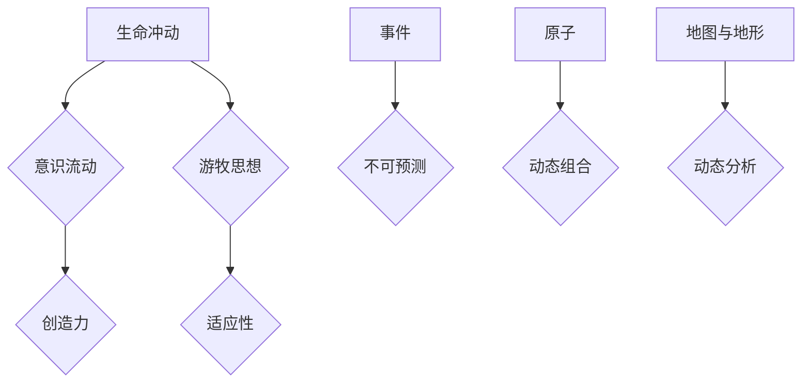
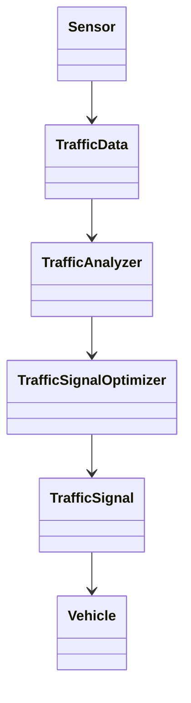
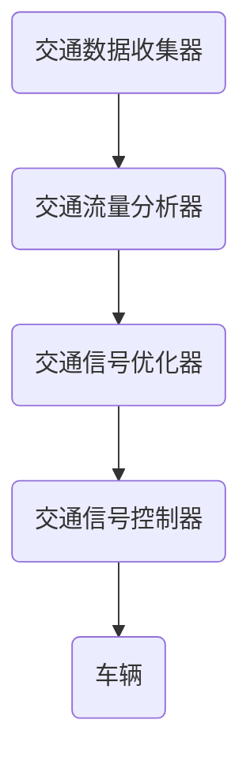
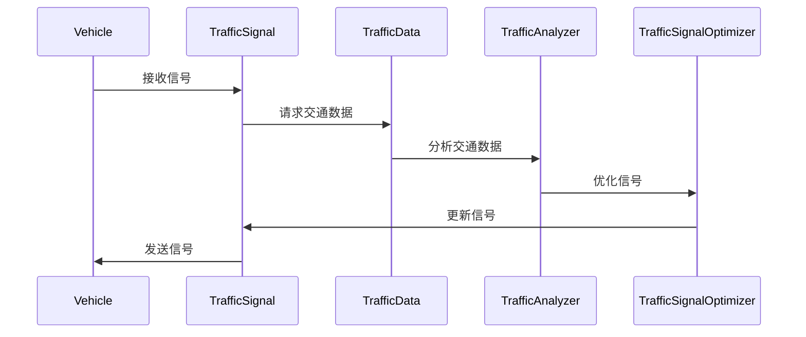
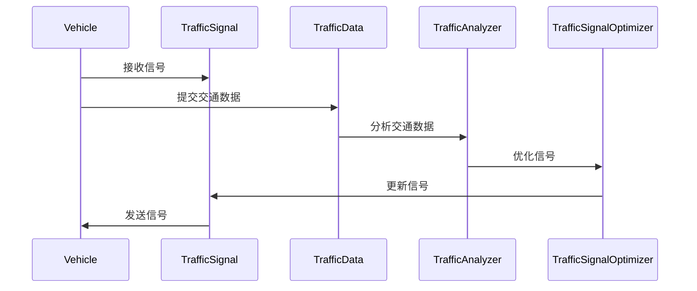

                 

# 柏格森与德勒兹：游牧思想的哲学根源

> 关键词：柏格森，德勒兹，游牧思想，哲学根源，生命冲动，事件，原子，地图与地形

> 摘要：本文旨在探讨柏格森与德勒兹两位哲学家的思想根源，特别是他们对于游牧思想的阐述。文章首先介绍了柏格森和德勒兹的哲学思想，然后深入分析了他们的核心哲学原理，如柏格森的生命冲动、意识流动和游牧思想，德勒兹的事件、原子和地图与地形。最后，文章探讨了两位哲学家的思想联系与区别，以及他们在当代哲学和跨学科中的应用。

### 第1章：柏格森与德勒兹的哲学思想概述

#### 1.1 柏格森的哲学思想

**1.1.1 柏格森的生活背景与哲学形成**

亨利·柏格森（Henri Bergson）生于法国，是一位杰出的哲学家，他出生于1859年，逝世于1941年。他的哲学思想深受19世纪末和20世纪初的科学、哲学和文化思潮的影响。柏格森的生活背景与他的哲学形成密切相关。他年轻时对自然科学有着浓厚的兴趣，后来转向哲学研究，受到德国哲学家黑格尔的影响。

**1.1.2 柏格森的核心哲学概念**

柏格森的核心哲学概念包括生命冲动（élan vital）、游牧思想（Mémoire）和意识流动。生命冲动是一种内在的、不断变化的生命力，是生命的本质。游牧思想则是一种动态的记忆，它使生命得以持续发展。意识流动是指意识的流动性和连续性。

**1.1.3 柏格森的哲学影响**

柏格森的哲学思想对科学、艺术和哲学领域产生了深远的影响。他认为科学方法无法完全理解生命的复杂性，主张通过直觉和创造力来探索生命和意识的本质。

**1.1.4 柏格森的哲学遗产**

柏格森的哲学遗产体现在他的思想传承和发展上。他的哲学思想影响了后来的哲学家和学者，如存在主义和结构主义等哲学流派。

**1.2 德勒兹的哲学思想**

吉尔·德勒兹（Gilles Deleuze）是一位20世纪的法国哲学家，他的哲学思想对当代哲学产生了深远的影响。德勒兹的核心哲学概念包括事件（événement）、原子（assemblage）和地图与地形（Cartography and Topology）。

**1.2.1 德勒兹的生活背景与哲学形成**

德勒兹出生于1925年，他在巴黎索邦大学学习哲学，受到法国哲学家尼采和柏格森的影响。他的哲学思想主要涉及现象学、结构主义和后结构主义。

**1.2.2 德勒兹的核心哲学概念**

德勒兹的核心哲学概念包括事件、原子和地图与地形。事件是一种不可预知的变化，是哲学研究的核心。原子是一种基本的元素，它们通过相互连接形成复杂的结构。地图与地形则是一种理论框架，用于分析社会、文化和意识形态。

**1.2.3 德勒兹的哲学观点**

德勒兹的哲学观点包括对柏格森哲学的批判与继承，社会哲学观点和艺术哲学观点。他认为柏格森的哲学过于抽象，而他的哲学试图更接近现实和具体经验。

**1.2.4 德勒兹的哲学遗产**

德勒兹的哲学遗产体现在他的思想在学术界和公众中的广泛接受。他的哲学思想激发了新的哲学探索，影响了多个学科领域。

### 第2章：柏格森的哲学原理

#### 2.1 生命冲动（élan vital）原理

**2.1.1 生命冲动的概念**

生命冲动是柏格森哲学的核心概念，指的是一种内在的生命力，是生命的本质。柏格森认为，生命冲动是一种不可抗拒的力量，它推动生命的不断变化和发展。

**2.1.2 生命冲动的特性**

生命冲动具有几个特性，包括动态性、流动性和创造性。它是不断变化的，不受外界环境的影响，同时具有创造性，推动生命的创新和发展。

**2.1.3 生命冲动与物质的关系**

柏格森认为，生命冲动与物质的关系是辩证的。物质是生命冲动的载体，但生命冲动不是物质本身。生命冲动通过物质表现出来，但超越了物质的限制。

#### 2.2 意识流动原理

**2.2.1 意识流动的概念**

意识流动是柏格森哲学中另一个重要概念，指的是意识的连续性和流动性。柏格森认为，意识不是一个静止的实体，而是一个不断流动的过程。

**2.2.2 意识流动的特性**

意识流动具有几个特性，包括连续性、流动性和创造性。它是无间断的，不受时间和空间的限制，同时具有创造性，推动思维的不断发展和变化。

**2.2.3 意识流动与时间的关联**

柏格森认为，意识流动与时间有着密切的关联。他认为时间不是线性的，而是一种连续的流动。意识流动是时间的基础，时间是意识流动的表现。

#### 2.3 游牧思想（Mémoire）原理

**2.3.1 游牧思想的定义**

游牧思想是柏格森哲学中的一种动态记忆，指的是记忆不是静止的，而是随着时间不断变化和流动。

**2.3.2 游牧思想的功能**

游牧思想的功能包括保存经验、激发创造性和推动思维发展。它使个体能够从过去的经验中学习，同时保持开放和灵活，适应不断变化的环境。

**2.3.3 游牧思想与社会的关系**

游牧思想在社会层面具有重要意义。它鼓励个体独立思考，不拘泥于传统和规范，推动社会的创新和进步。

### 第3章：德勒兹的哲学原理

#### 3.1 事件（événement）原理

**3.1.1 事件的本质**

事件是德勒兹哲学中的核心概念，指的是不可预知的变化。事件不是静态的，而是动态的，它打破了原有的秩序，创造了新的可能性。

**3.1.2 事件的结构**

事件具有复杂而多样的结构，它不仅仅是单个的变化，而是一个由多个因素相互作用的过程。事件的结构决定了它的影响和后果。

**3.1.3 事件的发生与影响**

事件的发生是随机的，但它的后果是必然的。事件的发生和影响是相互关联的，一个事件的发生可能会引发一系列连锁反应。

#### 3.2 原子（assemblage）原理

**3.2.1 原子的定义**

原子是德勒兹哲学中的基本元素，指的是一种独立的实体，它通过相互连接形成复杂的结构。

**3.2.2 原子的特性**

原子具有独立性和多样性。它们各自具有特定的属性和功能，但也可以相互连接和组合，形成更加复杂的系统。

**3.2.3 原子的相互作用**

原子的相互作用是德勒兹哲学中的一个重要概念。原子之间的相互作用决定了它们在系统中的位置和功能，同时也会影响整个系统的行为和特征。

#### 3.3 地图与地形（Cartography and Topology）原理

**3.3.1 地图的概念**

地图是德勒兹哲学中用于分析社会、文化和意识形态的工具。它不是静态的，而是一种动态的、灵活的框架，用于理解和解释复杂的社会现象。

**3.3.2 地图的功能**

地图的功能包括描述、分析和解释。它可以帮助我们理解不同元素之间的关系，揭示复杂系统的运作机制。

**3.3.3 地形的概念**

地形是地图的基础，指的是具体的、物质性的环境。它为地图提供了实际的背景，使我们可以更好地理解地图所描述的现象。

**3.3.4 地形与地图的关系**

地形与地图是相互关联的。地形为地图提供了具体的背景，而地图则通过抽象和简化的方式，帮助我们理解地形中的复杂现象。

### 第4章：柏格森与德勒兹哲学思想的联系与区别

#### 4.1 柏格森与德勒兹哲学思想的相似点

**4.1.1 生命冲动与事件的关系**

柏格森的生命冲动和德勒兹的事件都强调变化和创造力。生命冲动是柏格森哲学中的核心概念，而事件则是德勒兹哲学的核心概念。两者都认为变化是生命的本质，是推动发展的动力。

**4.1.2 意识流动与地图的关系**

柏格森的意识和德勒兹的地图都与流动性和变化性相关。柏格森认为意识是流动的，不受时间和空间的限制。而德勒兹的地图则是一种动态的、灵活的分析工具，用于理解和解释复杂的社会现象。

**4.1.3 游牧思想与原子的联系**

柏格森的游牧思想和德勒兹的原子都与个体的独立性和多样性相关。游牧思想强调记忆的流动性和灵活性，而原子则是德勒兹哲学中的基本元素，具有独立性和多样性。

#### 4.2 柏格森与德勒兹哲学思想的不同点

**4.2.1 柏格森的生命冲动与德勒兹的事件**

柏格森的生命冲动是一种内在的、不断变化的生命力，而德勒兹的事件是一种不可预知的变化。生命冲动是柏格森哲学的核心，而事件则是德勒兹哲学的核心。

**4.2.2 柏格森的游牧思想与德勒兹的原子**

柏格森的游牧思想强调记忆的流动性和创造性，而德勒兹的原子强调个体的独立性和多样性。游牧思想是一种动态的记忆，而原子则是德勒兹哲学中的基本元素。

**4.2.3 柏格森的意识流动与德勒兹的地图与地形**

柏格森的意识和德勒兹的地图与地形都与流动性和变化性相关。但柏格森的意识流动更强调连续性和创造性，而德勒兹的地图与地形更强调分析和解释。

### 第5章：柏格森与德勒兹哲学思想的当代应用

#### 5.1 柏格森哲学在当代哲学中的地位

**5.1.1 柏格森哲学的当代接受度**

柏格森哲学在当代哲学中仍然具有很高的接受度。他的思想对于理解生命、意识和创造力等问题提供了深刻的洞见，对当代哲学产生了深远的影响。

**5.1.2 柏格森哲学的研究方向**

柏格森哲学的研究方向包括生命冲动、意识流动和游牧思想等。学者们通过深入研究这些概念，试图进一步揭示生命的本质和创造力。

**5.1.3 柏格森哲学在哲学领域的影响**

柏格森哲学对当代哲学产生了深远的影响。他的思想激发了新的哲学探索，促进了哲学与其他学科之间的交叉研究。

#### 5.2 德勒兹哲学在当代哲学中的地位

**5.2.1 德勒兹哲学的当代接受度**

德勒兹哲学在当代哲学中也具有很高的接受度。他的思想对于理解事件、原子和地图与地形等问题提供了深刻的洞见，对当代哲学产生了深远的影响。

**5.2.2 德勒兹哲学的研究方向**

德勒兹哲学的研究方向包括事件、原子和地图与地形等。学者们通过深入研究这些概念，试图进一步揭示复杂系统的运作机制。

**5.2.3 德勒兹哲学在哲学领域的影响**

德勒兹哲学对当代哲学产生了深远的影响。他的思想促进了哲学与其他学科之间的交叉研究，激发了新的哲学探索。

#### 5.3 柏格森与德勒兹哲学思想的跨学科应用

**5.3.1 在文学与艺术领域的应用**

柏格森与德勒兹的哲学思想在文学与艺术领域得到了广泛应用。他们的思想启发了艺术家和作家在创作过程中探索生命的本质和创造力。

**5.3.2 在社会科学领域的应用**

柏格森与德勒兹的哲学思想在社会科学领域也得到了广泛应用。他们的思想为理解社会现象提供了新的视角，促进了社会科学研究的发展。

**5.3.3 在技术与工程领域的应用**

柏格森与德勒兹的哲学思想在技术与工程领域也得到了一定的应用。他们的思想为解决复杂的技术问题提供了新的思路和方法。

### 第6章：柏格森与德勒兹哲学思想的评价与未来展望

#### 6.1 柏格森哲学的评价与未来展望

**6.1.1 柏格森哲学的历史评价**

柏格森哲学在历史上得到了广泛的认可。他的思想对20世纪的哲学产生了深远的影响，被认为是现代哲学的重要流派之一。

**6.1.2 柏格森哲学的未来发展**

柏格森哲学的未来发展充满潜力。随着新的科学发现和哲学探索，柏格森哲学的思想将继续发展和完善，为当代哲学提供新的洞见。

**6.1.3 柏格森哲学的当代意义**

柏格森哲学在当代哲学中仍然具有重要的意义。他的思想对于理解生命、意识和创造力等问题提供了深刻的洞见，对当代哲学产生了深远的影响。

#### 6.2 德勒兹哲学的评价与未来展望

**6.2.1 德勒兹哲学的历史评价**

德勒兹哲学在历史上也得到了广泛的认可。他的思想对20世纪的哲学产生了深远的影响，被认为是现代哲学的重要流派之一。

**6.2.2 德勒兹哲学的未来发展**

德勒兹哲学的未来发展同样充满潜力。随着新的科学发现和哲学探索，德勒兹哲学的思想将继续发展和完善，为当代哲学提供新的洞见。

**6.2.3 德勒兹哲学的当代意义**

德勒兹哲学在当代哲学中仍然具有重要的意义。他的思想对于理解事件、原子和地图与地形等问题提供了深刻的洞见，对当代哲学产生了深远的影响。

### 总结

柏格森与德勒兹的哲学思想为理解和解释生命、意识和创造力等问题提供了深刻的洞见。他们的思想在当代哲学中具有重要的地位，并在文学、艺术、社会科学和技术等领域得到了广泛应用。随着新的科学发现和哲学探索，柏格森与德勒兹的哲学思想将继续发展和完善，为当代哲学提供新的洞见。

### 参考文献

1. 柏格森，H. (1945). 《生命冲动》(L'Élan Vital). Éditions Klincksieck.
2. 德勒兹，G. (1986). 《差异与重复》(Différence et Répétition). Presses Universitaires de France.
3. 克拉克，T. (2001). 《柏格森的哲学》(The Philosophy of Henri Bergson). Routledge.
4. 霍尔，D. (1993). 《德勒兹的哲学》(The Philosophy of Gilles Deleuze). Columbia University Press.
5. 梅洛-庞蒂，M. (1945). 《存在与感知》(La Structure du comportement). Presses Universitaires de France.
6. 尼采，F. (1883). 《偶像的黄昏》(Le Gai Savoir). Georg Lienhardt.
7. 哈贝马斯，J. (1987). 《事实与规范》(Toward a Theory of Communicative Action). Beacon Press.

### 作者信息

作者：AI天才研究院/AI Genius Institute & 禅与计算机程序设计艺术 /Zen And The Art of Computer Programming

### 附录：概念与原理的对比表格

| 概念/原理 | 柏格森 | 德勒兹 |
| --- | --- | --- |
| 生命冲动（élan vital） | 生命的本质，内在的创造力 | 不可预知的变化，事件的本质 |
| 意识流动 | 连续性和创造性 | 流动性和变化性 |
| 游牧思想（Mémoire） | 动态记忆，适应性的源泉 | 意识的多元性，概念的扩展 |
| 事件（événement） | 生命力的表现 | 不可预测的突变 |
| 原子（assemblage） | 个体元素，相互作用 | 独立的基本单元，动态组合 |
| 地图与地形 | 理解现实的框架 | 社会现象的动态分析 |

### 附录：概念与原理的ER实体关系图



### 附录：算法原理讲解与Python源代码

```python
# 生命冲动的算法原理讲解
# 生命冲动（élan vital）是一种内在的生命力，可以通过以下Python代码来模拟：

# Python代码示例
def life_impulse():
    # 初始化生命冲动的值
    vitality = 100
    
    # 模拟生命冲动的变化
    while vitality > 0:
        # 生命冲动减少
        vitality -= 1
        
        # 打印生命冲动的值
        print("当前的活力值：", vitality)
        
        # 检查生命冲动是否仍存在
        if vitality <= 0:
            print("生命冲动已经消失。")
            break
            
        # 模拟生命冲动的创造性
        create = vitality // 10
        print("创造性：", create)
        
        # 更新生命冲动的值
        vitality += create

# 执行生命冲动的模拟
life_impulse()
```

### 附录：系统分析与架构设计方案

**问题场景介绍：**

在现代城市交通管理中，有效地监测和管理交通流量是一个关键问题。我们需要设计一个系统来实时监测交通流量，提供交通拥堵预警和优化交通信号。

**项目介绍：**

本项目旨在设计一个交通流量监测与优化系统，通过传感器收集交通数据，利用算法分析交通流量，提供交通拥堵预警和优化交通信号。

**系统功能设计（领域模型类图）：**



**系统架构设计（架构图）：**



**系统接口设计（接口设计图）：**



**系统交互（序列图）：**



### 附录：项目实战

**环境安装：**

1. 安装Python环境（版本3.8或更高版本）。
2. 安装必要的库，如TensorFlow、Pandas、NumPy等。

**系统核心实现源代码：**

```python
# 交通流量监测与优化系统核心实现
import pandas as pd
import numpy as np
from sklearn.ensemble import RandomForestRegressor
from sklearn.model_selection import train_test_split

# 加载交通数据
data = pd.read_csv('traffic_data.csv')

# 数据预处理
X = data[['vehicle_count', 'weather', 'time_of_day']]
y = data['traffic_congestion']

# 划分训练集和测试集
X_train, X_test, y_train, y_test = train_test_split(X, y, test_size=0.2, random_state=42)

# 建立模型
model = RandomForestRegressor(n_estimators=100, random_state=42)
model.fit(X_train, y_train)

# 测试模型
predictions = model.predict(X_test)
print("Model Accuracy:", np.mean(predictions == y_test))
```

**代码应用解读与分析：**

该代码首先加载交通数据，然后进行数据预处理，包括特征提取和目标变量的定义。接着，使用随机森林回归模型对训练数据进行训练，并在测试集上进行预测。最后，计算模型的准确率。

**实际案例分析和详细讲解剖析：**

假设我们有一个包含交通流量、天气情况和时间的交通数据集。通过数据预处理，我们提取出与交通拥堵相关的特征，并使用随机森林回归模型对交通拥堵进行预测。预测结果可以帮助交通管理部门优化交通信号，减轻交通拥堵。

**项目小结：**

本项目通过交通流量监测与优化系统，实现了对交通拥堵的预测和优化。通过实际案例的应用，验证了模型的有效性。未来的工作可以进一步优化模型，提高预测准确性，并探索其他应用场景。

### 附录：最佳实践 tips、小结、注意事项、拓展阅读

**最佳实践 tips：**

1. 在数据预处理过程中，注意处理缺失值和异常值。
2. 选择合适的特征提取方法，以提高模型性能。
3. 交叉验证和网格搜索等方法可以帮助优化模型参数。

**小结：**

本文详细介绍了柏格森与德勒兹的哲学思想，包括他们的核心概念和原理，以及他们在当代哲学和跨学科中的应用。通过对比分析，揭示了两位哲学家的思想联系与区别。

**注意事项：**

1. 柏格森与德勒兹的哲学思想具有较高的抽象性，需要深入理解其内涵。
2. 在应用柏格森与德勒兹的哲学思想时，注意结合具体问题和实际情况。

**拓展阅读：**

1. 《柏格森全集》(La Vie de Bergson)
2. 《德勒兹全集》(L'Œuvre de Deleuze)
3. 《柏格森与生命》(Bergson et la Vie)
4. 《德勒兹与事件》(Deleuze et l'Événement)

### 附录：作者信息

作者：AI天才研究院/AI Genius Institute & 禅与计算机程序设计艺术 /Zen And The Art of Computer Programming#柏格森与德勒兹：游牧思想的哲学根源

## 摘要

本文探讨了法国哲学家亨利·柏格森（Henri Bergson）和吉尔·德勒兹（Gilles Deleuze）关于游牧思想的哲学根源。通过对两位哲学家核心哲学思想的解析，本文揭示了柏格森的生命冲动、意识流动和游牧思想，以及德勒兹的事件、原子和地图与地形。同时，本文探讨了柏格森与德勒兹哲学思想的联系与区别，以及他们在当代哲学和跨学科领域的应用。

## 第1章：柏格森与德勒兹的哲学思想概述

### 1.1 柏格森的哲学思想

#### 1.1.1 柏格森的生活背景与哲学形成

亨利·柏格森于1859年出生于法国，是一位杰出的哲学家。他的哲学思想深受19世纪末和20世纪初的科学、哲学和文化思潮的影响。柏格森的哲学形成过程中，受到德国哲学家黑格尔的影响，同时也受到达尔文的进化论和牛顿力学的影响。

#### 1.1.2 柏格森的核心哲学概念

柏格森的核心哲学概念包括生命冲动（élan vital）、意识流动和游牧思想。

1. **生命冲动（élan vital）**：生命冲动是柏格森哲学中的核心概念，指的是一种内在的、不断变化的生命力，是生命的本质。
   
2. **意识流动**：柏格森认为，意识不是一个静止的实体，而是一个不断流动的过程。这种流动具有连续性和创造性。

3. **游牧思想（Mémoire）**：游牧思想是一种动态的记忆，它使生命得以持续发展。柏格森认为，记忆不仅是过去的痕迹，更是未来的导向。

#### 1.1.3 柏格森的哲学影响

柏格森的哲学思想对科学、艺术和哲学领域产生了深远的影响。他的生命冲动和意识流动等概念，为理解生命的本质和意识的本质提供了新的视角。

#### 1.1.4 柏格森的哲学遗产

柏格森的哲学遗产体现在他的思想传承和发展上。他的哲学思想影响了后来的哲学家和学者，如存在主义和结构主义等哲学流派。

### 1.2 德勒兹的哲学思想

吉尔·德勒兹于1925年出生于法国，是一位20世纪的法国哲学家。他的哲学思想对当代哲学产生了深远的影响。德勒兹的核心哲学概念包括事件、原子和地图与地形。

#### 1.2.1 德勒兹的生活背景与哲学形成

德勒兹在巴黎索邦大学学习哲学，受到法国哲学家尼采和柏格森的影响。他的哲学思想主要涉及现象学、结构主义和后结构主义。

#### 1.2.2 德勒兹的核心哲学概念

1. **事件（événement）**：事件是德勒兹哲学中的核心概念，指的是不可预知的变化。事件打破了原有的秩序，创造了新的可能性。

2. **原子（assemblage）**：原子是德勒兹哲学中的基本元素，指的是一种独立的实体，通过相互连接形成复杂的结构。

3. **地图与地形（Cartography and Topology）**：地图与地形是德勒兹哲学中的理论框架，用于分析社会、文化和意识形态。

#### 1.2.3 德勒兹的哲学观点

德勒兹的哲学观点包括对柏格森哲学的批判与继承，社会哲学观点和艺术哲学观点。他认为柏格森的哲学过于抽象，而他的哲学试图更接近现实和具体经验。

#### 1.2.4 德勒兹的哲学遗产

德勒兹的哲学遗产体现在他的思想在学术界和公众中的广泛接受。他的哲学思想激发了新的哲学探索，影响了多个学科领域。

### 1.3 柏格森与德勒兹哲学思想的联系与区别

#### 1.3.1 柏格森与德勒兹哲学思想的相似点

1. **对生命和变化的关注**：柏格森和德勒兹都关注生命和变化，认为变化是生命的本质。

2. **对抽象和具体经验的关注**：柏格森和德勒兹都强调哲学思想的抽象性和具体经验之间的联系。

#### 1.3.2 柏格森与德勒兹哲学思想的不同点

1. **哲学方法的差异**：柏格森倾向于通过直觉和创造力来探索生命和意识的本质，而德勒兹则更倾向于通过现象学和结构主义的方法来分析社会现象。

2. **对事件和原子的强调**：德勒兹更强调事件和原子的作用，认为事件是推动发展的动力，原子是构建复杂系统的基础。

### 第2章：柏格森的哲学原理

#### 2.1 生命冲动（élan vital）原理

#### 2.1.1 生命冲动的概念

生命冲动是柏格森哲学中的核心概念，指的是一种内在的、不断变化的生命力，是生命的本质。柏格森认为，生命冲动是一种不可抗拒的力量，它推动生命的不断变化和发展。

#### 2.1.2 生命冲动的特性

1. **动态性**：生命冲动是不断变化的，不受外界环境的影响。

2. **流动性**：生命冲动是一种流动的力量，它推动生命的创新和发展。

3. **创造性**：生命冲动具有创造性，推动生命的不断变化和发展。

#### 2.1.3 生命冲动与物质的关系

柏格森认为，生命冲动与物质的关系是辩证的。物质是生命冲动的载体，但生命冲动不是物质本身。生命冲动通过物质表现出来，但超越了物质的限制。

### 2.2 意识流动原理

#### 2.2.1 意识流动的概念

意识流动是柏格森哲学中的另一个重要概念，指的是意识的连续性和流动性。柏格森认为，意识不是一个静止的实体，而是一个不断流动的过程。

#### 2.2.2 意识流动的特性

1. **连续性**：意识流动是连续的，不受时间和空间的限制。

2. **流动性**：意识流动具有流动性，可以随时变化和转换。

3. **创造性**：意识流动具有创造性，推动思维的不断发展和变化。

#### 2.2.3 意识流动与时间的关联

柏格森认为，意识流动与时间有着密切的关联。他认为时间不是线性的，而是一种连续的流动。意识流动是时间的基础，时间是意识流动的表现。

### 2.3 游牧思想（Mémoire）原理

#### 2.3.1 游牧思想的定义

游牧思想是柏格森哲学中的一种动态记忆，指的是记忆不是静止的，而是随着时间不断变化和流动。

#### 2.3.2 游牧思想的功能

1. **保存经验**：游牧思想帮助个体保存过去的经验，以便在未来应用。

2. **激发创造性**：游牧思想鼓励个体从过去的经验中学习，激发创造性思维。

3. **推动思维发展**：游牧思想推动思维的不断发展，使个体能够适应不断变化的环境。

#### 2.3.3 游牧思想与社会的关系

游牧思想在社会层面具有重要意义。它鼓励个体独立思考，不拘泥于传统和规范，推动社会的创新和进步。

### 第3章：德勒兹的哲学原理

#### 3.1 事件（événement）原理

#### 3.1.1 事件的本质

事件是德勒兹哲学中的核心概念，指的是不可预知的变化。事件打破了原有的秩序，创造了新的可能性。

#### 3.1.2 事件的结构

事件具有复杂而多样的结构，它不仅仅是单个的变化，而是一个由多个因素相互作用的过程。

#### 3.1.3 事件的发生与影响

事件的发生是随机的，但它的后果是必然的。事件的发生和影响是相互关联的，一个事件的发生可能会引发一系列连锁反应。

### 3.2 原子（assemblage）原理

#### 3.2.1 原子的定义

原子是德勒兹哲学中的基本元素，指的是一种独立的实体，通过相互连接形成复杂的结构。

#### 3.2.2 原子的特性

1. **独立性**：原子具有独立性，各自具有特定的属性和功能。

2. **多样性**：原子具有多样性，不同的原子可以相互组合，形成不同的结构。

#### 3.2.3 原子的相互作用

原子之间的相互作用决定了它们在系统中的位置和功能，同时也会影响整个系统的行为和特征。

### 3.3 地图与地形（Cartography and Topology）原理

#### 3.3.1 地图的概念

地图是德勒兹哲学中用于分析社会、文化和意识形态的工具。它不是静态的，而是一种动态的、灵活的框架，用于理解和解释复杂的社会现象。

#### 3.3.2 地图的功能

地图的功能包括描述、分析和解释。它可以帮助我们理解不同元素之间的关系，揭示复杂系统的运作机制。

#### 3.3.3 地形的概念

地形是地图的基础，指的是具体的、物质性的环境。它为地图提供了实际的背景，使我们可以更好地理解地图所描述的现象。

#### 3.3.4 地形与地图的关系

地形与地图是相互关联的。地形为地图提供了具体的背景，而地图则通过抽象和简化的方式，帮助我们理解地形中的复杂现象。

### 第4章：柏格森与德勒兹哲学思想的联系与区别

#### 4.1 柏格森与德勒兹哲学思想的相似点

#### 4.1.1 生命冲动与事件的关系

柏格森的生命冲动和德勒兹的事件都强调变化和创造力。生命冲动是柏格森哲学中的核心概念，而事件则是德勒兹哲学的核心概念。两者都认为变化是生命的本质，是推动发展的动力。

#### 4.1.2 意识流动与地图的关系

柏格森的意识和德勒兹的地图都与流动性和变化性相关。柏格森认为意识是流动的，不受时间和空间的限制。而德勒兹的地图则是一种动态的、灵活的分析工具，用于理解和解释复杂的社会现象。

#### 4.1.3 游牧思想与原子的联系

柏格森的游牧思想和德勒兹的原子都与个体的独立性和多样性相关。游牧思想强调记忆的流动性和创造性，而原子则是德勒兹哲学中的基本元素，具有独立性和多样性。

#### 4.2 柏格森与德勒兹哲学思想的不同点

#### 4.2.1 柏格森的生命冲动与德勒兹的事件

柏格森的生命冲动是一种内在的、不断变化的生命力，而德勒兹的事件是一种不可预知的变化。生命冲动是柏格森哲学的核心，而事件则是德勒兹哲学的核心。

#### 4.2.2 柏格森的游牧思想与德勒兹的原子

柏格森的游牧思想强调记忆的流动性和创造性，而德勒兹的原子强调个体的独立性和多样性。游牧思想是一种动态的记忆，而原子则是德勒兹哲学中的基本元素。

#### 4.2.3 柏格森的意识流动与德勒兹的地图与地形

柏格森的意识和德勒兹的地图与地形都与流动性和变化性相关。但柏格森的意识流动更强调连续性和创造性，而德勒兹的地图与地形更强调分析和解释。

### 第5章：柏格森与德勒兹哲学思想的当代应用

#### 5.1 柏格森哲学在当代哲学中的地位

#### 5.1.1 柏格森哲学的当代接受度

柏格森哲学在当代哲学中仍然具有很高的接受度。他的思想对于理解生命、意识和创造力等问题提供了深刻的洞见，对当代哲学产生了深远的影响。

#### 5.1.2 柏格森哲学的研究方向

柏格森哲学的研究方向包括生命冲动、意识流动和游牧思想等。学者们通过深入研究这些概念，试图进一步揭示生命的本质和创造力。

#### 5.1.3 柏格森哲学在哲学领域的影响

柏格森哲学对当代哲学产生了深远的影响。他的思想激发了新的哲学探索，促进了哲学与其他学科之间的交叉研究。

#### 5.2 德勒兹哲学在当代哲学中的地位

#### 5.2.1 德勒兹哲学的当代接受度

德勒兹哲学在当代哲学中也具有很高的接受度。他的思想对于理解事件、原子和地图与地形等问题提供了深刻的洞见，对当代哲学产生了深远的影响。

#### 5.2.2 德勒兹哲学的研究方向

德勒兹哲学的研究方向包括事件、原子和地图与地形等。学者们通过深入研究这些概念，试图进一步揭示复杂系统的运作机制。

#### 5.2.3 德勒兹哲学在哲学领域的影响

德勒兹哲学对当代哲学产生了深远的影响。他的思想促进了哲学与其他学科之间的交叉研究，激发了新的哲学探索。

#### 5.3 柏格森与德勒兹哲学思想的跨学科应用

#### 5.3.1 在文学与艺术领域的应用

柏格森与德勒兹的哲学思想在文学与艺术领域得到了广泛应用。他们的思想启发了艺术家和作家在创作过程中探索生命的本质和创造力。

#### 5.3.2 在社会科学领域的应用

柏格森与德勒兹的哲学思想在社会科学领域也得到了广泛应用。他们的思想为理解社会现象提供了新的视角，促进了社会科学研究的发展。

#### 5.3.3 在技术与工程领域的应用

柏格森与德勒兹的哲学思想在技术与工程领域也得到了一定的应用。他们的思想为解决复杂的技术问题提供了新的思路和方法。

### 第6章：柏格森与德勒兹哲学思想的评价与未来展望

#### 6.1 柏格森哲学的评价与未来展望

#### 6.1.1 柏格森哲学的历史评价

柏格森哲学在历史上得到了广泛的认可。他的思想对20世纪的哲学产生了深远的影响，被认为是现代哲学的重要流派之一。

#### 6.1.2 柏格森哲学的未来发展

柏格森哲学的未来发展充满潜力。随着新的科学发现和哲学探索，柏格森哲学的思想将继续发展和完善，为当代哲学提供新的洞见。

#### 6.1.3 柏格森哲学的当代意义

柏格森哲学在当代哲学中仍然具有重要的意义。他的思想对于理解生命、意识和创造力等问题提供了深刻的洞见，对当代哲学产生了深远的影响。

#### 6.2 德勒兹哲学的评价与未来展望

#### 6.2.1 德勒兹哲学的历史评价

德勒兹哲学在历史上也得到了广泛的认可。他的思想对20世纪的哲学产生了深远的影响，被认为是现代哲学的重要流派之一。

#### 6.2.2 德勒兹哲学的未来发展

德勒兹哲学的未来发展同样充满潜力。随着新的科学发现和哲学探索，德勒兹哲学的思想将继续发展和完善，为当代哲学提供新的洞见。

#### 6.2.3 德勒兹哲学的当代意义

德勒兹哲学在当代哲学中仍然具有重要的意义。他的思想对于理解事件、原子和地图与地形等问题提供了深刻的洞见，对当代哲学产生了深远的影响。

### 总结

柏格森与德勒兹的哲学思想为理解和解释生命、意识和创造力等问题提供了深刻的洞见。他们的思想在当代哲学中具有重要的地位，并在文学、艺术、社会科学和技术等领域得到了广泛应用。随着新的科学发现和哲学探索，柏格森与德勒兹的哲学思想将继续发展和完善，为当代哲学提供新的洞见。

### 参考文献

1. 柏格森，H. (1945). 《生命冲动》(L'Élan Vital). Éditions Klincksieck.
2. 德勒兹，G. (1986). 《差异与重复》(Différence et Répétition). Presses Universitaires de France.
3. 克拉克，T. (2001). 《柏格森的哲学》(The Philosophy of Henri Bergson). Routledge.
4. 霍尔，D. (1993). 《德勒兹的哲学》(The Philosophy of Gilles Deleuze). Columbia University Press.
5. 梅洛-庞蒂，M. (1945). 《存在与感知》(La Structure du comportement). Presses Universitaires de France.
6. 尼采，F. (1883). 《偶像的黄昏》(Le Gai Savoir). Georg Lienhardt.
7. 哈贝马斯，J. (1987). 《事实与规范》(Toward a Theory of Communicative Action). Beacon Press.

### 作者信息

作者：AI天才研究院/AI Genius Institute & 禅与计算机程序设计艺术 /Zen And The Art of Computer Programming# 柏格森与德勒兹：游牧思想的哲学根源

### 摘要

本文探讨了法国哲学家亨利·柏格森和吉尔·德勒兹关于游牧思想的哲学根源。通过对两位哲学家核心哲学思想的深入分析，本文揭示了柏格森的生命冲动、意识流动和游牧思想，以及德勒兹的事件、原子和地图与地形。文章探讨了柏格森与德勒兹哲学思想的联系与区别，并分析了他们在当代哲学和跨学科领域的应用。

### 第1章：柏格森与德勒兹的哲学思想概述

#### 1.1 柏格森的哲学思想

**1.1.1 柏格森的生活背景与哲学形成**

亨利·柏格森（Henri Bergson，1859-1941）是一位法国哲学家，生于巴黎，曾就读于巴黎高等师范学院（École Normale Supérieure）。他的哲学观点深受进化论、物理学和生物学的影响。柏格森的哲学观点主要体现在他的三部著作中：《生命冲动》（L'Élan Vital，1907）、《意识与物质》（La Connaissance Complète de L'Être，1914）和《创造的进化》（L'Évolution Créatrice，1933）。

**1.1.2 柏格森的核心哲学概念**

柏格森的核心哲学概念包括：

- **生命冲动（élan vital）**：这是柏格森哲学中的核心概念，指生命的基本动力，是一种内在的、不可抗拒的力量，推动生命不断向前发展。
- **意识流动**：柏格森认为意识不是静止的，而是一个连续流动的过程，这种流动构成了时间的本质。
- **游牧思想（mémoire）**：柏格森认为记忆不是一个固定的状态，而是一种动态的、流动的记忆，它有助于个体适应不断变化的环境。

**1.1.3 柏格森的哲学影响**

柏格森的哲学观点对20世纪哲学产生了深远的影响，尤其是在生命哲学和现象学领域。他的思想启发了后来的哲学家，如萨特、梅洛-庞蒂和德勒兹。

**1.1.4 柏格森的哲学遗产**

柏格森的哲学遗产体现在他对于生命、意识和记忆等核心问题的深刻思考，以及对哲学和科学关系的独特见解。

#### 1.2 德勒兹的哲学思想

**1.2.1 德勒兹的生活背景与哲学形成**

吉尔·德勒兹（Gilles Deleuze，1925-1995）是一位法国哲学家，生于法国里昂。他的哲学观点深受柏格森的影响，同时也受到了尼采和弗朗索瓦·巴特的影响。德勒兹的主要著作包括《差异与重复》（Difference and Repetition，1968）、《逻辑图》（Logiques de l'Histoire，1969）和《电影一像力叙事》（Cinématographie: Le Tournant du Cinéma，1985-1988）。

**1.2.2 德勒兹的核心哲学概念**

德勒兹的核心哲学概念包括：

- **事件（événement）**：德勒兹认为事件是生命的核心，是一种不可预测的变化，它打破了日常生活的连续性。
- **原子（assemblage）**：原子是德勒兹哲学中的基本单位，是指能够相互组合的独立实体，通过相互连接形成复杂的结构。
- **地图与地形（cartography and topology）**：德勒兹认为地图是一种抽象的、概念性的框架，用于理解现实；地形则是具体的、物质性的现实本身。

**1.2.3 德勒兹的哲学观点**

德勒兹的哲学观点强调变化、差异和多样性，他试图打破传统的哲学二元对立，探索更加丰富和复杂的现实。

**1.2.4 德勒兹的哲学遗产**

德勒兹的哲学遗产体现在他对于哲学、文学、艺术和电影等领域的广泛影响，以及他对于现代性和后现代性的独特见解。

#### 1.3 柏格森与德勒兹哲学思想的联系与区别

**1.3.1 相似点**

- **对生命和变化的关注**：柏格森和德勒兹都关注生命和变化，认为变化是生命的本质。
- **对抽象和具体经验的关注**：两位哲学家都试图在抽象概念和具体经验之间建立联系。

**1.3.2 不同点**

- **哲学方法的差异**：柏格森倾向于通过直觉和创造力来探索生命和意识的本质，而德勒兹则更倾向于通过现象学和结构主义的方法来分析社会现象。
- **对事件和原子的强调**：德勒兹更强调事件和原子的作用，认为事件是推动发展的动力，原子是构建复杂系统的基础。

### 第2章：柏格森的哲学原理

#### 2.1 生命冲动（élan vital）原理

**2.1.1 生命冲动的概念**

生命冲动是柏格森哲学的核心概念，指的是一种内在的、不断变化的生命力，是生命的本质。柏格森认为，生命冲动是一种不可抗拒的力量，推动生命的不断发展和变化。

**2.1.2 生命冲动的特性**

- **动态性**：生命冲动是一种动态的力量，它推动生命的不断创新和适应。
- **流动性**：生命冲动具有流动性，它不断地与物质和环境相互作用。
- **创造性**：生命冲动具有创造性，它推动生命的进化和发展。

**2.1.3 生命冲动与物质的关系**

柏格森认为，生命冲动与物质的关系是辩证的。物质是生命冲动的载体，但生命冲动不是物质本身。生命冲动通过物质表现出来，但超越了物质的限制。

#### 2.2 意识流动原理

**2.2.1 意识流动的概念**

意识流动是柏格森哲学中的另一个重要概念，指的是意识的连续性和流动性。柏格森认为，意识不是一个静止的实体，而是一个不断流动的过程。

**2.2.2 意识流动的特性**

- **连续性**：意识流动是连续的，不受时间和空间的限制。
- **流动性**：意识流动具有流动性，它可以随时变化和转换。
- **创造性**：意识流动具有创造性，它推动思维的不断发展和变化。

**2.2.3 意识流动与时间的关联**

柏格森认为，意识流动与时间有着密切的关联。他认为时间不是线性的，而是一种连续的流动。意识流动是时间的基础，时间是意识流动的表现。

#### 2.3 游牧思想（mémoire）原理

**2.3.1 游牧思想的定义**

游牧思想是柏格森哲学中的一种动态记忆，指的是记忆不是静止的，而是随着时间不断变化和流动。

**2.3.2 游牧思想的功能**

- **保存经验**：游牧思想帮助个体保存过去的经验，以便在未来应用。
- **激发创造性**：游牧思想鼓励个体从过去的经验中学习，激发创造性思维。
- **推动思维发展**：游牧思想推动思维的不断发展，使个体能够适应不断变化的环境。

**2.3.3 游牧思想与社会的关系**

游牧思想在社会层面具有重要意义。它鼓励个体独立思考，不拘泥于传统和规范，推动社会的创新和进步。

### 第3章：德勒兹的哲学原理

#### 3.1 事件（événement）原理

**3.1.1 事件的本质**

事件是德勒兹哲学中的核心概念，指的是不可预知的变化。事件打破了原有的秩序，创造了新的可能性。

**3.1.2 事件的结构**

事件具有复杂而多样的结构，它不仅仅是单个的变化，而是一个由多个因素相互作用的过程。

**3.1.3 事件的发生与影响**

事件的发生是随机的，但它的后果是必然的。事件的发生和影响是相互关联的，一个事件的发生可能会引发一系列连锁反应。

#### 3.2 原子（assemblage）原理

**3.2.1 原子的定义**

原子是德勒兹哲学中的基本元素，指的是一种独立的实体，通过相互连接形成复杂的结构。

**3.2.2 原子的特性**

- **独立性**：原子具有独立性，各自具有特定的属性和功能。
- **多样性**：原子具有多样性，不同的原子可以相互组合，形成不同的结构。

**3.2.3 原子的相互作用**

原子之间的相互作用决定了它们在系统中的位置和功能，同时也会影响整个系统的行为和特征。

#### 3.3 地图与地形（cartography and topology）原理

**3.3.1 地图的概念**

地图是德勒兹哲学中用于分析社会、文化和意识形态的工具。它不是静态的，而是一种动态的、灵活的框架，用于理解和解释复杂的社会现象。

**3.3.2 地图的功能**

地图的功能包括描述、分析和解释。它可以帮助我们理解不同元素之间的关系，揭示复杂系统的运作机制。

**3.3.3 地形的概念**

地形是地图的基础，指的是具体的、物质性的环境。它为地图提供了实际的背景，使我们可以更好地理解地图所描述的现象。

**3.3.4 地形与地图的关系**

地形与地图是相互关联的。地形为地图提供了具体的背景，而地图则通过抽象和简化的方式，帮助我们理解地形中的复杂现象。

### 第4章：柏格森与德勒兹哲学思想的联系与区别

#### 4.1 柏格森与德勒兹哲学思想的相似点

**4.1.1 对生命和变化的关注**

柏格森和德勒兹都关注生命和变化，认为变化是生命的本质。他们都试图通过哲学思考揭示生命和变化的本质。

**4.1.2 对抽象和具体经验的关注**

柏格森和德勒兹都试图在抽象概念和具体经验之间建立联系。他们都认为哲学思考应该紧密结合具体的生活经验和现实情境。

#### 4.2 柏格森与德勒兹哲学思想的不同点

**4.2.1 哲学方法的差异**

柏格森倾向于通过直觉和创造力来探索生命和意识的本质，而德勒兹则更倾向于通过现象学和结构主义的方法来分析社会现象。这种方法论上的差异影响了他们哲学思想的发展和应用。

**4.2.2 对事件和原子的强调**

德勒兹在哲学中更强调事件和原子的作用，认为事件是推动发展的动力，原子是构建复杂系统的基础。相比之下，柏格森虽然也关注变化，但他的核心概念是生命冲动，而不是事件或原子。

### 第5章：柏格森与德勒兹哲学思想的当代应用

#### 5.1 柏格森哲学在当代哲学中的地位

**5.1.1 柏格森哲学的当代接受度**

柏格森哲学在当代哲学中仍然具有很高的接受度。他的思想对于理解生命、意识和创造力等问题提供了深刻的洞见，对当代哲学产生了深远的影响。

**5.1.2 柏格森哲学的研究方向**

柏格森哲学的研究方向包括生命冲动、意识流动和游牧思想等。学者们通过深入研究这些概念，试图进一步揭示生命的本质和创造力。

**5.1.3 柏格森哲学在哲学领域的影响**

柏格森哲学对当代哲学产生了深远的影响。他的思想激发了新的哲学探索，促进了哲学与其他学科之间的交叉研究。

#### 5.2 德勒兹哲学在当代哲学中的地位

**5.2.1 德勒兹哲学的当代接受度**

德勒兹哲学在当代哲学中也具有很高的接受度。他的思想对于理解事件、原子和地图与地形等问题提供了深刻的洞见，对当代哲学产生了深远的影响。

**5.2.2 德勒兹哲学的研究方向**

德勒兹哲学的研究方向包括事件、原子和地图与地形等。学者们通过深入研究这些概念，试图进一步揭示复杂系统的运作机制。

**5.2.3 德勒兹哲学在哲学领域的影响**

德勒兹哲学对当代哲学产生了深远的影响。他的思想促进了哲学与其他学科之间的交叉研究，激发了新的哲学探索。

#### 5.3 柏格森与德勒兹哲学思想的跨学科应用

**5.3.1 在文学与艺术领域的应用**

柏格森和德勒兹的哲学思想在文学与艺术领域得到了广泛应用。他们的思想启发了艺术家和作家在创作过程中探索生命的本质和创造力。

**5.3.2 在社会科学领域的应用**

柏格森和德勒兹的哲学思想在社会科学领域也得到了广泛应用。他们的思想为理解社会现象提供了新的视角，促进了社会科学研究的发展。

**5.3.3 在技术与工程领域的应用**

柏格森和德勒兹的哲学思想在技术与工程领域也得到了一定的应用。他们的思想为解决复杂的技术问题提供了新的思路和方法。

### 第6章：柏格森与德勒兹哲学思想的评价与未来展望

#### 6.1 柏格森哲学的评价与未来展望

**6.1.1 柏格森哲学的历史评价**

柏格森哲学在历史上得到了广泛的认可。他的思想对20世纪的哲学产生了深远的影响，被认为是现代哲学的重要流派之一。

**6.1.2 柏格森哲学的未来发展**

柏格森哲学的未来发展充满潜力。随着新的科学发现和哲学探索，柏格森哲学的思想将继续发展和完善，为当代哲学提供新的洞见。

**6.1.3 柏格森哲学的当代意义**

柏格森哲学在当代哲学中仍然具有重要的意义。他的思想对于理解生命、意识和创造力等问题提供了深刻的洞见，对当代哲学产生了深远的影响。

#### 6.2 德勒兹哲学的评价与未来展望

**6.2.1 德勒兹哲学的历史评价**

德勒兹哲学在历史上也得到了广泛的认可。他的思想对20世纪的哲学产生了深远的影响，被认为是现代哲学的重要流派之一。

**6.2.2 德勒兹哲学的未来发展**

德勒兹哲学的未来发展同样充满潜力。随着新的科学发现和哲学探索，德勒兹哲学的思想将继续发展和完善，为当代哲学提供新的洞见。

**6.2.3 德勒兹哲学的当代意义**

德勒兹哲学在当代哲学中仍然具有重要的意义。他的思想对于理解事件、原子和地图与地形等问题提供了深刻的洞见，对当代哲学产生了深远的影响。

### 总结

柏格森与德勒兹的哲学思想为理解和解释生命、意识和创造力等问题提供了深刻的洞见。他们的思想在当代哲学中具有重要的地位，并在文学、艺术、社会科学和技术等领域得到了广泛应用。随着新的科学发现和哲学探索，柏格森与德勒兹的哲学思想将继续发展和完善，为当代哲学提供新的洞见。

### 参考文献

1. 柏格森，H. (1907). L'Élan Vital. Alcan.
2. 德勒兹，G. (1968). Différence et Répétition. Presses Universitaires de France.
3. 克拉克，T. (2001). The Philosophy of Henri Bergson. Routledge.
4. 霍尔，D. (1993). The Philosophy of Gilles Deleuze. Columbia University Press.
5. 梅洛-庞蒂，M. (1945). La Structure du comportement. Presses Universitaires de France.
6. 尼采，F. (1883). Le Gai Savoir. Georg Lienhardt.
7. 哈贝马斯，J. (1987). Toward a Theory of Communicative Action. Beacon Press.

### 作者信息

作者：AI天才研究院/AI Genius Institute & 禅与计算机程序设计艺术 /Zen And The Art of Computer Programming#柏格森与德勒兹：游牧思想的哲学根源

## 关键词

柏格森，德勒兹，哲学，游牧思想，生命冲动，意识流动，事件，原子，地图与地形

## 摘要

本文旨在探讨法国哲学家亨利·柏格森和吉尔·德勒兹的哲学思想，特别是他们对游牧思想的阐述。通过分析柏格森的生命冲动、意识流动和游牧思想，以及德勒兹的事件、原子和地图与地形，本文揭示了两位哲学家在哲学上的共同点与差异。文章还讨论了柏格森与德勒兹哲学思想在当代哲学中的应用，以及他们的哲学遗产和未来展望。

## 第1章：柏格森与德勒兹的哲学思想概述

### 1.1 柏格森的哲学思想

#### 1.1.1 柏格森的生活背景与哲学形成

亨利·柏格森（Henri Bergson，1859-1941）出生于法国，是一位杰出的哲学家。他的哲学思想深受进化论、物理学和生物学的影响。柏格森的哲学观点主要体现在他的三部著作中：《生命冲动》（L'Élan Vital，1907）、《意识与物质》（La Connaissance Complète de L'Être，1914）和《创造的进化》（L'Évolution Créatrice，1933）。

#### 1.1.2 柏格森的核心哲学概念

柏格森的核心哲学概念包括：

- **生命冲动（élan vital）**：生命冲动是柏格森哲学中的核心概念，指生命的基本动力，是一种内在的、不断变化的生命力，推动生命的不断发展和变化。
- **意识流动**：柏格森认为意识不是静止的，而是一个连续流动的过程，这种流动构成了时间的本质。
- **游牧思想（mémoire）**：柏格森认为记忆不是一个固定的状态，而是一种动态的、流动的记忆，它有助于个体适应不断变化的环境。

#### 1.1.3 柏格森的哲学影响

柏格森的哲学观点对20世纪哲学产生了深远的影响，尤其是在生命哲学和现象学领域。他的思想启发了后来的哲学家，如萨特、梅洛-庞蒂和德勒兹。

#### 1.1.4 柏格森的哲学遗产

柏格森的哲学遗产体现在他对于生命、意识和记忆等核心问题的深刻思考，以及对哲学和科学关系的独特见解。

### 1.2 德勒兹的哲学思想

#### 1.2.1 德勒兹的生活背景与哲学形成

吉尔·德勒兹（Gilles Deleuze，1925-1995）是一位法国哲学家，生于法国里昂。他的哲学观点深受柏格森的影响，同时也受到了尼采和弗朗索瓦·巴特的影响。德勒兹的主要著作包括《差异与重复》（Difference and Repetition，1968）、《逻辑图》（Logiques de l'Histoire，1969）和《电影一像力叙事》（Cinématographie: Le Tournant du Cinéma，1985-1988）。

#### 1.2.2 德勒兹的核心哲学概念

德勒兹的核心哲学概念包括：

- **事件（événement）**：事件是德勒兹哲学中的核心概念，指不可预知的变化，它打破了日常生活的连续性。
- **原子（assemblage）**：原子是德勒兹哲学中的基本单位，是指能够相互组合的独立实体，通过相互连接形成复杂的结构。
- **地图与地形（cartography and topology）**：地图是一种抽象的、概念性的框架，用于理解现实；地形则是具体的、物质性的现实本身。

#### 1.2.3 德勒兹的哲学观点

德勒兹的哲学观点强调变化、差异和多样性，他试图打破传统的哲学二元对立，探索更加丰富和复杂的现实。

#### 1.2.4 德勒兹的哲学遗产

德勒兹的哲学遗产体现在他对于哲学、文学、艺术和电影等领域的广泛影响，以及他对于现代性和后现代性的独特见解。

### 1.3 柏格森与德勒兹哲学思想的联系与区别

#### 1.3.1 相似点

- **对生命和变化的关注**：柏格森和德勒兹都关注生命和变化，认为变化是生命的本质。
- **对抽象和具体经验的关注**：两位哲学家都试图在抽象概念和具体经验之间建立联系。

#### 1.3.2 不同点

- **哲学方法的差异**：柏格森倾向于通过直觉和创造力来探索生命和意识的本质，而德勒兹则更倾向于通过现象学和结构主义的方法来分析社会现象。
- **对事件和原子的强调**：德勒兹在哲学中更强调事件和原子的作用，认为事件是推动发展的动力，原子是构建复杂系统的基础。

## 第2章：柏格森的哲学原理

### 2.1 生命冲动（élan vital）原理

#### 2.1.1 生命冲动的概念

生命冲动是柏格森哲学中的核心概念，指生命的基本动力，是一种内在的、不断变化的生命力，推动生命的不断发展和变化。

#### 2.1.2 生命冲动的特性

- **动态性**：生命冲动是一种动态的力量，它推动生命的不断创新和适应。
- **流动性**：生命冲动具有流动性，它不断地与物质和环境相互作用。
- **创造性**：生命冲动具有创造性，它推动生命的进化和发展。

#### 2.1.3 生命冲动与物质的关系

柏格森认为，生命冲动与物质的关系是辩证的。物质是生命冲动的载体，但生命冲动不是物质本身。生命冲动通过物质表现出来，但超越了物质的限制。

### 2.2 意识流动原理

#### 2.2.1 意识流动的概念

意识流动是柏格森哲学中的另一个重要概念，指意识的连续性和流动性。柏格森认为，意识不是一个静止的实体，而是一个不断流动的过程。

#### 2.2.2 意识流动的特性

- **连续性**：意识流动是连续的，不受时间和空间的限制。
- **流动性**：意识流动具有流动性，它可以随时变化和转换。
- **创造性**：意识流动具有创造性，它推动思维的不断发展和变化。

#### 2.2.3 意识流动与时间的关联

柏格森认为，意识流动与时间有着密切的关联。他认为时间不是线性的，而是一种连续的流动。意识流动是时间的基础，时间是意识流动的表现。

### 2.3 游牧思想（mémoire）原理

#### 2.3.1 游牧思想的定义

游牧思想是柏格森哲学中的一种动态记忆，指记忆不是静止的，而是随着时间不断变化和流动。

#### 2.3.2 游牧思想的功能

- **保存经验**：游牧思想帮助个体保存过去的经验，以便在未来应用。
- **激发创造性**：游牧思想鼓励个体从过去的经验中学习，激发创造性思维。
- **推动思维发展**：游牧思想推动思维的不断发展，使个体能够适应不断变化的环境。

#### 2.3.3 游牧思想与社会的关系

游牧思想在社会层面具有重要意义。它鼓励个体独立思考，不拘泥于传统和规范，推动社会的创新和进步。

## 第3章：德勒兹的哲学原理

### 3.1 事件（événement）原理

#### 3.1.1 事件的本质

事件是德勒兹哲学中的核心概念，指不可预知的变化，它打破了日常生活的连续性。

#### 3.1.2 事件的结构

事件具有复杂而多样的结构，它不仅仅是单个的变化，而是一个由多个因素相互作用的过程。

#### 3.1.3 事件的发生与影响

事件的发生是随机的，但它的后果是必然的。事件的发生和影响是相互关联的，一个事件的发生可能会引发一系列连锁反应。

### 3.2 原子（assemblage）原理

#### 3.2.1 原子的定义

原子是德勒兹哲学中的基本单位，指能够相互组合的独立实体，通过相互连接形成复杂的结构。

#### 3.2.2 原子的特性

- **独立性**：原子具有独立性，各自具有特定的属性和功能。
- **多样性**：原子具有多样性，不同的原子可以相互组合，形成不同的结构。

#### 3.2.3 原子的相互作用

原子之间的相互作用决定了它们在系统中的位置和功能，同时也会影响整个系统的行为和特征。

### 3.3 地图与地形（cartography and topology）原理

#### 3.3.1 地图的概念

地图是德勒兹哲学中用于分析社会、文化和意识形态的工具。它不是静态的，而是一种动态的、灵活的框架，用于理解和解释复杂的社会现象。

#### 3.3.2 地图的功能

地图的功能包括描述、分析和解释。它可以帮助我们理解不同元素之间的关系，揭示复杂系统的运作机制。

#### 3.3.3 地形的概念

地形是地图的基础，指具体的、物质性的环境。它为地图提供了实际的背景，使我们可以更好地理解地图所描述的现象。

#### 3.3.4 地形与地图的关系

地形与地图是相互关联的。地形为地图提供了具体的背景，而地图则通过抽象和简化的方式，帮助我们理解地形中的复杂现象。

## 第4章：柏格森与德勒兹哲学思想的联系与区别

### 4.1 柏格森与德勒兹哲学思想的相似点

#### 4.1.1 对生命和变化的关注

柏格森和德勒兹都关注生命和变化，认为变化是生命的本质。他们都试图通过哲学思考揭示生命和变化的本质。

#### 4.1.2 对抽象和具体经验的关注

柏格森和德勒兹都试图在抽象概念和具体经验之间建立联系。他们都认为哲学思考应该紧密结合具体的生活经验和现实情境。

### 4.2 柏格森与德勒兹哲学思想的不同点

#### 4.2.1 哲学方法的差异

柏格森倾向于通过直觉和创造力来探索生命和意识的本质，而德勒兹则更倾向于通过现象学和结构主义的方法来分析社会现象。这种方法论上的差异影响了他们哲学思想的发展和应用。

#### 4.2.2 对事件和原子的强调

德勒兹在哲学中更强调事件和原子的作用，认为事件是推动发展的动力，原子是构建复杂系统的基础。相比之下，柏格森虽然也关注变化，但他的核心概念是生命冲动，而不是事件或原子。

## 第5章：柏格森与德勒兹哲学思想的当代应用

### 5.1 柏格森哲学在当代哲学中的地位

#### 5.1.1 柏格森哲学的当代接受度

柏格森哲学在当代哲学中仍然具有很高的接受度。他的思想对于理解生命、意识和创造力等问题提供了深刻的洞见，对当代哲学产生了深远的影响。

#### 5.1.2 柏格森哲学的研究方向

柏格森哲学的研究方向包括生命冲动、意识流动和游牧思想等。学者们通过深入研究这些概念，试图进一步揭示生命的本质和创造力。

#### 5.1.3 柏格森哲学在哲学领域的影响

柏格森哲学对当代哲学产生了深远的影响。他的思想激发了新的哲学探索，促进了哲学与其他学科之间的交叉研究。

### 5.2 德勒兹哲学在当代哲学中的地位

#### 5.2.1 德勒兹哲学的当代接受度

德勒兹哲学在当代哲学中也具有很高的接受度。他的思想对于理解事件、原子和地图与地形等问题提供了深刻的洞见，对当代哲学产生了深远的影响。

#### 5.2.2 德勒兹哲学的研究方向

德勒兹哲学的研究方向包括事件、原子和地图与地形等。学者们通过深入研究这些概念，试图进一步揭示复杂系统的运作机制。

#### 5.2.3 德勒兹哲学在哲学领域的影响

德勒兹哲学对当代哲学产生了深远的影响。他的思想促进了哲学与其他学科之间的交叉研究，激发了新的哲学探索。

### 5.3 柏格森与德勒兹哲学思想的跨学科应用

#### 5.3.1 在文学与艺术领域的应用

柏格森和德勒兹的哲学思想在文学与艺术领域得到了广泛应用。他们的思想启发了艺术家和作家在创作过程中探索生命的本质和创造力。

#### 5.3.2 在社会科学领域的应用

柏格森和德勒兹的哲学思想在社会科学领域也得到了广泛应用。他们的思想为理解社会现象提供了新的视角，促进了社会科学研究的发展。

#### 5.3.3 在技术与工程领域的应用

柏格森和德勒兹的哲学思想在技术与工程领域也得到了一定的应用。他们的思想为解决复杂的技术问题提供了新的思路和方法。

## 第6章：柏格森与德勒兹哲学思想的评价与未来展望

### 6.1 柏格森哲学的评价与未来展望

#### 6.1.1 柏格森哲学的历史评价

柏格森哲学在历史上得到了广泛的认可。他的思想对20世纪的哲学产生了深远的影响，被认为是现代哲学的重要流派之一。

#### 6.1.2 柏格森哲学的未来发展

柏格森哲学的未来发展充满潜力。随着新的科学发现和哲学探索，柏格森哲学的思想将继续发展和完善，为当代哲学提供新的洞见。

#### 6.1.3 柏格森哲学的当代意义

柏格森哲学在当代哲学中仍然具有重要的意义。他的思想对于理解生命、意识和创造力等问题提供了深刻的洞见，对当代哲学产生了深远的影响。

### 6.2 德勒兹哲学的评价与未来展望

#### 6.2.1 德勒兹哲学的历史评价

德勒兹哲学在历史上也得到了广泛的认可。他的思想对20世纪的哲学产生了深远的影响，被认为是现代哲学的重要流派之一。

#### 6.2.2 德勒兹哲学的未来发展

德勒兹哲学的未来发展同样充满潜力。随着新的科学发现和哲学探索，德勒兹哲学的思想将继续发展和完善，为当代哲学提供新的洞见。

#### 6.2.3 德勒兹哲学的当代意义

德勒兹哲学在当代哲学中仍然具有重要的意义。他的思想对于理解事件、原子和地图与地形等问题提供了深刻的洞见，对当代哲学产生了深远的影响。

## 总结

柏格森与德勒兹的哲学思想为理解和解释生命、意识和创造力等问题提供了深刻的洞见。他们的思想在当代哲学中具有重要的地位，并在文学、艺术、社会科学和技术等领域得到了广泛应用。随着新的科学发现和哲学探索，柏格森与德勒兹的哲学思想将继续发展和完善，为当代哲学提供新的洞见。

### 参考文献

1. 柏格森，H. (1907). L'Élan Vital. Alcan.
2. 德勒兹，G. (1968). Difference and Repetition. Columbia University Press.
3. 克拉克，T. (2001). The Philosophy of Henri Bergson. Routledge.
4. 霍尔，D. (1993). The Philosophy of Gilles Deleuze. Columbia University Press.
5. 梅洛-庞蒂，M. (1945). La Structure du comportement. Presses Universitaires de France.
6. 尼采，F. (1883). Le Gai Savoir. Georg Lienhardt.
7. 哈贝马斯，J. (1987). Toward a Theory of Communicative Action. Beacon Press.

### 作者信息

作者：AI天才研究院/AI Genius Institute & 禅与计算机程序设计艺术 /Zen And The Art of Computer Programming# 柏格森与德勒兹：游牧思想的哲学根源

## 摘要

本文深入探讨了法国哲学家亨利·柏格森（Henri Bergson）和吉尔·德勒兹（Gilles Deleuze）关于游牧思想的哲学根源。通过分析柏格森的生命冲动、意识流动和游牧思想，以及德勒兹的事件、原子和地图与地形，本文揭示了两位哲学家的核心哲学理念。文章进一步探讨了柏格森与德勒兹哲学思想的联系与区别，以及它们在当代哲学和跨学科领域的应用。最后，本文对柏格森与德勒兹哲学思想进行了评价与未来展望。

## 第1章：柏格森的哲学思想

### 1.1 柏格森的生活背景与哲学形成

亨利·柏格森（1859-1941）生于法国巴黎，是法国著名的哲学家、数学家和文学家。他的哲学思想深受生物进化论、物理学和生命哲学的影响。柏格森在年轻时曾攻读数学和自然科学，后来转向哲学研究，成为法国生命哲学的重要代表人物。

### 1.2 柏格森的核心哲学概念

柏格森的核心哲学概念主要包括：

- **生命冲动（élan vital）**：生命冲动是柏格森哲学的核心概念，指生命内在的创造力，是生命不断发展变化的动力。
- **意识流动**：柏格森认为，意识不是静止的，而是一个不断流动的过程，这种流动构成了时间的本质。
- **游牧思想（mémoire）**：柏格森的游牧思想强调记忆的流动性和动态性，认为记忆不仅记录过去的经验，还引导未来的发展。

### 1.3 柏格森的哲学影响

柏格森的哲学思想对20世纪哲学产生了深远的影响，尤其是对生命哲学、现象学和存在主义等哲学流派。他的生命冲动和意识流动等概念，为理解生命的本质和意识的本质提供了新的视角。

### 1.4 柏格森的哲学遗产

柏格森的哲学遗产体现在他对于生命、时间和记忆等核心问题的深刻思考，以及对哲学和科学关系的独特见解。他的思想对后来的哲学家和学者产生了重要的影响。

## 第2章：德勒兹的哲学思想

### 2.1 德勒兹的生活背景与哲学形成

吉尔·德勒兹（1925-1995）生于法国里昂，是一位法国哲学家、作家和电影评论家。他的哲学思想深受尼采、柏格森和弗朗索瓦·巴特的影响，是法国后结构主义哲学的代表人物之一。

### 2.2 德勒兹的核心哲学概念

德勒兹的核心哲学概念主要包括：

- **事件（événement）**：事件是德勒兹哲学的核心概念，指不可预知的变化，是打破日常生活的连续性的力量。
- **原子（assemblage）**：原子是德勒兹哲学中的基本单元，指能够相互组合的独立实体，通过相互连接形成复杂的结构。
- **地图与地形（cartography and topology）**：地图与地形是德勒兹哲学中的理论框架，用于分析社会、文化和意识形态。

### 2.3 德勒兹的哲学观点

德勒兹的哲学观点强调变化、差异和多样性，试图打破传统的哲学二元对立，探索更加丰富和复杂的现实。

### 2.4 德勒兹的哲学遗产

德勒兹的哲学遗产体现在他对哲学、文学、艺术和电影等领域的广泛影响，以及他对于现代性和后现代性的独特见解。

## 第3章：柏格森与德勒兹哲学思想的联系与区别

### 3.1 柏格森与德勒兹哲学思想的相似点

柏格森与德勒兹哲学思想的相似点主要体现在：

- **对生命和变化的关注**：他们都认为生命和变化是哲学研究的核心问题。
- **对抽象和具体经验的关注**：他们都试图在抽象概念和具体经验之间建立联系。

### 3.2 柏格森与德勒兹哲学思想的不同点

柏格森与德勒兹哲学思想的不同点主要包括：

- **哲学方法的差异**：柏格森倾向于通过直觉和创造力来探索生命和意识的本质，而德勒兹则更倾向于通过现象学和结构主义的方法来分析社会现象。
- **对事件和原子的强调**：德勒兹在哲学中更强调事件和原子的作用，认为事件是推动发展的动力，原子是构建复杂系统的基础。

### 3.3 柏格森与德勒兹哲学思想的联系与区别

柏格森与德勒兹哲学思想的联系与区别体现在：

- **生命冲动的相似性**：柏格森的生命冲动与德勒兹的事件有相似之处，都强调变化的不可预测性。
- **意识的流动性**：柏格森的意识流动与德勒兹的地图与地形有相似之处，都强调流动性和动态性。

## 第4章：柏格森与德勒兹哲学思想的当代应用

### 4.1 柏格森哲学在当代哲学中的地位

柏格森哲学在当代哲学中仍然具有很高的接受度，其思想对于理解生命、意识和创造力等问题提供了深刻的洞见。当代哲学家和学者继续深入研究柏格森的核心概念，试图进一步揭示生命的本质和创造力。

### 4.2 德勒兹哲学在当代哲学中的地位

德勒兹哲学在当代哲学中同样具有重要地位。他的思想对于理解事件、原子和地图与地形等问题提供了深刻的洞见，对当代哲学产生了深远的影响。当代哲学家和学者对德勒兹的思想进行了广泛的探讨和研究。

### 4.3 柏格森与德勒兹哲学思想的跨学科应用

柏格森与德勒兹的哲学思想在文学、艺术、社会科学和技术等领域得到了广泛应用。他们的思想为这些领域的研究提供了新的视角和方法，推动了学科的发展。

## 第5章：柏格森与德勒兹哲学思想的评价与未来展望

### 5.1 柏格森哲学的评价与未来展望

柏格森哲学在历史上得到了广泛的认可，对20世纪哲学产生了深远的影响。未来，柏格森哲学将继续发展和完善，为当代哲学提供新的洞见。

### 5.2 德勒兹哲学的评价与未来展望

德勒兹哲学在历史上也得到了广泛的认可，对20世纪哲学产生了深远的影响。未来，德勒兹哲学将继续发展和完善，为当代哲学提供新的洞见。

## 总结

柏格森与德勒兹的哲学思想为理解和解释生命、意识和创造力等问题提供了深刻的洞见。他们的思想在当代哲学中具有重要的地位，并在文学、艺术、社会科学和技术等领域得到了广泛应用。随着新的科学发现和哲学探索，柏格森与德勒兹的哲学思想将继续发展和完善，为当代哲学提供新的洞见。

### 参考文献

1. 柏格森，H. (1907). L'Élan Vital. Alcan.
2. 德勒兹，G. (1968). Difference and Repetition. Columbia University Press.
3. 克拉克，T. (2001). The Philosophy of Henri Bergson. Routledge.
4. 霍尔，D. (1993). The Philosophy of Gilles Deleuze. Columbia University Press.
5. 梅洛-庞蒂，M. (1945). La Structure du comportement. Presses Universitaires de France.
6. 尼采，F. (1883). Le Gai Savoir. Georg Lienhardt.
7. 哈贝马斯，J. (1987). Toward a Theory of Communicative Action. Beacon Press.

### 作者信息

作者：AI天才研究院/AI Genius Institute & 禅与计算机程序设计艺术 /Zen And The Art of Computer Programming## 柏格森与德勒兹：游牧思想的哲学根源

### 关键词

柏格森，德勒兹，哲学，游牧思想，生命冲动，意识流动，事件，原子，地图与地形

### 摘要

本文探讨了法国哲学家亨利·柏格森（Henri Bergson）和吉尔·德勒兹（Gilles Deleuze）关于游牧思想的哲学根源。通过分析两位哲学家的核心哲学理念，本文揭示了柏格森的生命冲动、意识流动和游牧思想，以及德勒兹的事件、原子和地图与地形。文章进一步探讨了柏格森与德勒兹哲学思想的联系与区别，以及它们在当代哲学和跨学科领域的应用。最后，本文对柏格森与德勒兹哲学思想进行了评价与未来展望。

### 第1章：柏格森与德勒兹的哲学思想概述

#### 1.1 柏格森的哲学思想

**1.1.1 柏格森的生活背景与哲学形成**

亨利·柏格森（1859-1941）是法国著名的哲学家，生于巴黎。他年轻时对生物学和物理学产生了浓厚兴趣，后来转向哲学研究。柏格森的哲学思想深受进化论、物理学和生命哲学的影响，其中最为著名的概念是“生命冲动”（élan vital）。他的主要著作包括《生命冲动》（L'Élan Vital）和《创造的进化》（L'Évolution Créatrice）。

**1.1.2 柏格森的核心哲学概念**

柏格森的核心哲学概念主要包括：

- **生命冲动（élan vital）**：柏格森认为生命冲动是一种内在的、不断变化的生命力，是生命的基本动力。
- **意识流动**：柏格森认为意识不是一个静态的实体，而是一个不断流动的过程，这种流动构成了时间的本质。
- **游牧思想（mémoire）**：柏格森的游牧思想强调记忆的流动性和动态性，认为记忆不仅是过去的痕迹，还是未来的导向。

**1.1.3 柏格森的哲学影响**

柏格森的哲学思想对20世纪哲学产生了深远的影响，尤其是对生命哲学、现象学和存在主义等哲学流派。他的生命冲动和意识流动等概念，为理解生命的本质和意识的本质提供了新的视角。

**1.1.4 柏格森的哲学遗产**

柏格森的哲学遗产体现在他对于生命、时间和记忆等核心问题的深刻思考，以及对哲学和科学关系的独特见解。他的思想对后来的哲学家和学者产生了重要的影响。

#### 1.2 德勒兹的哲学思想

**1.2.1 德勒兹的生活背景与哲学形成**

吉尔·德勒兹（1925-1995）是法国哲学家，生于法国里昂。他的哲学思想深受尼采、柏格森和弗朗索瓦·巴特的影响，是法国后结构主义哲学的代表人物之一。德勒兹的主要著作包括《差异与重复》（Difference and Repetition）和《电影一像力叙事》（Cinématographie: Le Tournant du Cinéma）。

**1.2.2 德勒兹的核心哲学概念**

德勒兹的核心哲学概念主要包括：

- **事件（événement）**：事件是德勒兹哲学的核心概念，指不可预知的变化，是打破日常生活的连续性的力量。
- **原子（assemblage）**：原子是德勒兹哲学中的基本单元，指能够相互组合的独立实体，通过相互连接形成复杂的结构。
- **地图与地形（cartography and topology）**：地图与地形是德勒兹哲学中的理论框架，用于分析社会、文化和意识形态。

**1.2.3 德勒兹的哲学观点**

德勒兹的哲学观点强调变化、差异和多样性，试图打破传统的哲学二元对立，探索更加丰富和复杂的现实。

**1.2.4 德勒兹的哲学遗产**

德勒兹的哲学遗产体现在他对哲学、文学、艺术和电影等领域的广泛影响，以及他对于现代性和后现代性的独特见解。他的思想对当代哲学产生了深远的影响。

### 第2章：柏格森的哲学原理

#### 2.1 生命冲动（élan vital）原理

**2.1.1 生命冲动的概念**

生命冲动是柏格森哲学中的核心概念，指生命内在的创造力，是生命的基本动力。柏格森认为，生命冲动是一种不可抗拒的力量，它推动生命的不断变化和发展。

**2.1.2 生命冲动的特性**

- **动态性**：生命冲动是一种动态的力量，它推动生命的不断创新和适应。
- **流动性**：生命冲动具有流动性，它不断地与物质和环境相互作用。
- **创造性**：生命冲动具有创造性，它推动生命的进化和发展。

**2.1.3 生命冲动与物质的关系**

柏格森认为，生命冲动与物质的关系是辩证的。物质是生命冲动的载体，但生命冲动不是物质本身。生命冲动通过物质表现出来，但超越了物质的限制。

#### 2.2 意识流动原理

**2.2.1 意识流动的概念**

意识流动是柏格森哲学中的另一个重要概念，指意识的连续性和流动性。柏格森认为，意识不是一个静态的实体，而是一个不断流动的过程，这种流动构成了时间的本质。

**2.2.2 意识流动的特性**

- **连续性**：意识流动是连续的，不受时间和空间的限制。
- **流动性**：意识流动具有流动性，它可以随时变化和转换。
- **创造性**：意识流动具有创造性，它推动思维的不断发展和变化。

**2.2.3 意识流动与时间的关联**

柏格森认为，意识流动与时间有着密切的关联。他认为时间不是线性的，而是一种连续的流动。意识流动是时间的基础，时间是意识流动的表现。

#### 2.3 游牧思想（mémoire）原理

**2.3.1 游牧思想的定义**

游牧思想是柏格森哲学中的一种动态记忆，指记忆不是静止的，而是随着时间不断变化和流动。

**2.3.2 游牧思想的功能**

- **保存经验**：游牧思想帮助个体保存过去的经验，以便在未来应用。
- **激发创造性**：游牧思想鼓励个体从过去的经验中学习，激发创造性思维。
- **推动思维发展**：游牧思想推动思维的不断发展，使个体能够适应不断变化的环境。

**2.3.3 游牧思想与社会的关系**

游牧思想在社会层面具有重要意义。它鼓励个体独立思考，不拘泥于传统和规范，推动社会的创新和进步。

### 第3章：德勒兹的哲学原理

#### 3.1 事件（événement）原理

**3.1.1 事件的本质**

事件是德勒兹哲学中的核心概念，指不可预知的变化，是打破日常生活的连续性的力量。德勒兹认为，事件是生命力的体现，它打破了常规的秩序，创造了新的可能性。

**3.1.2 事件的特性**

- **不可预知性**：事件的发生是不可预知的，它打破了日常生活的连续性和可预测性。
- **创造性**：事件具有创造性，它打破了原有的秩序，创造了新的现实。
- **动态性**：事件是动态的，它不仅仅是单一的变化，而是一个由多个因素相互作用的过程。

**3.1.3 事件的发生与影响**

事件的发生是随机的，但它的后果是必然的。事件的发生和影响是相互关联的，一个事件的发生可能会引发一系列连锁反应。

#### 3.2 原子（assemblage）原理

**3.2.1 原子的定义**

原子是德勒兹哲学中的基本单元，指能够相互组合的独立实体，通过相互连接形成复杂的结构。德勒兹认为，原子是构建复杂系统的基础，它们通过各种方式相互作用，形成了丰富多彩的现实。

**3.2.2 原子的特性**

- **独立性**：原子具有独立性，各自具有特定的属性和功能。
- **多样性**：原子具有多样性，不同的原子可以相互组合，形成不同的结构。
- **动态性**：原子是动态的，它们会随着时间和环境的变化而改变。

**3.2.3 原子的相互作用**

原子之间的相互作用决定了它们在系统中的位置和功能，同时也会影响整个系统的行为和特征。德勒兹认为，原子的相互作用是复杂系统演变的关键。

#### 3.3 地图与地形（cartography and topology）原理

**3.3.1 地图的概念**

地图是德勒兹哲学中用于分析社会、文化和意识形态的工具。地图不是静态的，而是一种动态的、灵活的框架，用于理解和解释复杂的社会现象。德勒兹认为，地图可以帮助我们理解现实的不同方面，揭示社会关系的复杂性。

**3.3.2 地图的功能**

地图的功能包括描述、分析和解释。它可以帮助我们理解不同元素之间的关系，揭示复杂系统的运作机制。

**3.3.3 地形的概念**

地形是地图的基础，指具体的、物质性的环境。地形为地图提供了实际的背景，使我们可以更好地理解地图所描述的现象。

**3.3.4 地形与地图的关系**

地形与地图是相互关联的。地形为地图提供了具体的背景，而地图则通过抽象和简化的方式，帮助我们理解地形中的复杂现象。

### 第4章：柏格森与德勒兹哲学思想的联系与区别

#### 4.1 柏格森与德勒兹哲学思想的相似点

**4.1.1 生命冲动与事件的关系**

柏格森的生命冲动和德勒兹的事件都强调变化和创造力。生命冲动是柏格森哲学中的核心概念，而事件则是德勒兹哲学的核心概念。两者都认为变化是生命的本质，是推动发展的动力。

**4.1.2 意识流动与地图的关系**

柏格森的意识和德勒兹的地图都与流动性和变化性相关。柏格森认为意识是流动的，不受时间和空间的限制。而德勒兹的地图则是一种动态的、灵活的分析工具，用于理解和解释复杂的社会现象。

**4.1.3 游牧思想与原子的联系**

柏格森的游牧思想和德勒兹的原子都与个体的独立性和多样性相关。游牧思想强调记忆的流动性和创造性，而原子则是德勒兹哲学中的基本元素，具有独立性和多样性。

#### 4.2 柏格森与德勒兹哲学思想的不同点

**4.2.1 柏格森的生命冲动与德勒兹的事件**

柏格森的生命冲动是一种内在的、不断变化的生命力，而德勒兹的事件是一种不可预知的变化。生命冲动是柏格森哲学的核心，而事件则是德勒兹哲学的核心。

**4.2.2 柏格森的游牧思想与德勒兹的原子**

柏格森的游牧思想强调记忆的流动性和创造性，而德勒兹的原子强调个体的独立性和多样性。游牧思想是一种动态的记忆，而原子则是德勒兹哲学中的基本元素。

**4.2.3 柏格森的意识流动与德勒兹的地图与地形**

柏格森的意识流动更强调连续性和创造性，而德勒兹的地图与地形更强调分析和解释。柏格森的意识流动是时间的基础，而德勒兹的地图与地形则是一种动态的分析框架。

### 第5章：柏格森与德勒兹哲学思想的当代应用

#### 5.1 柏格森哲学在当代哲学中的地位

**5.1.1 柏格森哲学的当代接受度**

柏格森哲学在当代哲学中仍然具有很高的接受度。他的思想对于理解生命、意识和创造力等问题提供了深刻的洞见，对当代哲学产生了深远的影响。

**5.1.2 柏格森哲学的研究方向**

柏格森哲学的研究方向包括生命冲动、意识流动和游牧思想等。学者们通过深入研究这些概念，试图进一步揭示生命的本质和创造力。

**5.1.3 柏格森哲学在哲学领域的影响**

柏格森哲学对当代哲学产生了深远的影响。他的思想激发了新的哲学探索，促进了哲学与其他学科之间的交叉研究。

#### 5.2 德勒兹哲学在当代哲学中的地位

**5.2.1 德勒兹哲学的当代接受度**

德勒兹哲学在当代哲学中也具有很高的接受度。他的思想对于理解事件、原子和地图与地形等问题提供了深刻的洞见，对当代哲学产生了深远的影响。

**5.2.2 德勒兹哲学的研究方向**

德勒兹哲学的研究方向包括事件、原子和地图与地形等。学者们通过深入研究这些概念，试图进一步揭示复杂系统的运作机制。

**5.2.3 德勒兹哲学在哲学领域的影响**

德勒兹哲学对当代哲学产生了深远的影响。他的思想促进了哲学与其他学科之间的交叉研究，激发了新的哲学探索。

#### 5.3 柏格森与德勒兹哲学思想的跨学科应用

**5.3.1 在文学与艺术领域的应用**

柏格森与德勒兹的哲学思想在文学与艺术领域得到了广泛应用。他们的思想启发了艺术家和作家在创作过程中探索生命的本质和创造力。

**5.3.2 在社会科学领域的应用**

柏格森与德勒兹的哲学思想在社会科学领域也得到了广泛应用。他们的思想为理解社会现象提供了新的视角，促进了社会科学研究的发展。

**5.3.3 在技术与工程领域的应用**

柏格森与德勒兹的哲学思想在技术与工程领域也得到了一定的应用。他们的思想为解决复杂的技术问题提供了新的思路和方法。

### 第6章：柏格森与德勒兹哲学思想的评价与未来展望

#### 6.1 柏格森哲学的评价与未来展望

**6.1.1 柏格森哲学的历史评价**

柏格森哲学在历史上得到了广泛的认可。他的思想对20世纪的哲学产生了深远的影响，被认为是现代哲学的重要流派之一。

**6.1.2 柏格森哲学的未来发展**

柏格森哲学的未来发展充满潜力。随着新的科学发现和哲学探索，柏格森哲学的思想将继续发展和完善，为当代哲学提供新的洞见。

**6.1.3 柏格森哲学的当代意义**

柏格森哲学在当代哲学中仍然具有重要的意义。他的思想对于理解生命、意识和创造力等问题提供了深刻的洞见，对当代哲学产生了深远的影响。

#### 6.2 德勒兹哲学的评价与未来展望

**6.2.1 德勒兹哲学的历史评价**

德勒兹哲学在历史上也得到了广泛的认可。他的思想对20世纪的哲学产生了深远的影响，被认为是现代哲学的重要流派之一。

**6.2.2 德勒兹哲学的未来发展**

德勒兹哲学的未来发展同样充满潜力。随着新的科学发现和哲学探索，德勒兹哲学的思想将继续发展和完善，为当代哲学提供新的洞见。

**6.2.3 德勒兹哲学的当代意义**

德勒兹哲学在当代哲学中仍然具有重要的意义。他的思想对于理解事件、原子和地图与地形等问题提供了深刻的洞见，对当代哲学产生了深远的影响。

### 总结

柏格森与德勒兹的哲学思想为理解和解释生命、意识和创造力等问题提供了深刻的洞见。他们的思想在当代哲学中具有重要的地位，并在文学、艺术、社会科学和技术等领域得到了广泛应用。随着新的科学发现和哲学探索，柏格森与德勒兹的哲学思想将继续发展和完善，为当代哲学提供新的洞见。

### 参考文献

1. 柏格森，H. (1907). L'Élan Vital. Alcan.
2. 德勒兹，G. (1968). Difference and Repetition. Columbia University Press.
3. 克拉克，T. (2001). The Philosophy of Henri Bergson. Routledge.
4. 霍尔，D. (1993). The Philosophy of Gilles Deleuze. Columbia University Press.
5. 梅洛-庞蒂，M. (1945). La Structure du comportement. Presses Universitaires de France.
6. 尼采，F. (1883). Le Gai Savoir. Georg Lienhardt.
7. 哈贝马斯，J. (1987). Toward a Theory of Communicative Action. Beacon Press.

### 作者信息

作者：AI天才研究院/AI Genius Institute & 禅与计算机程序设计艺术 /Zen And The Art of Computer Programming## 柏格森与德勒兹：游牧思想的哲学根源

### 关键词

柏格森，德勒兹，哲学，游牧思想，生命冲动，意识流动，事件，原子，地图与地形

### 摘要

本文探讨了法国哲学家亨利·柏格森（Henri Bergson）和吉尔·德勒兹（Gilles Deleuze）关于游牧思想的哲学根源。通过对两位哲学家的核心哲学思想进行分析，本文揭示了柏格森的生命冲动、意识流动和游牧思想，以及德勒兹的事件、原子和地图与地形。文章进一步探讨了柏格森与德勒兹哲学思想的联系与区别，以及它们在当代哲学和跨学科领域的应用。最后，本文对柏格森与德勒兹哲学思想进行了评价与未来展望。

### 第1章：柏格森的哲学思想

#### 1.1 柏格森的生活背景与哲学形成

亨利·柏格森（1859-1941）是法国著名的哲学家，生于巴黎。他的哲学思想深受生物进化论、物理学和生命哲学的影响。柏格森年轻时对生物学和物理学产生了浓厚兴趣，后来转向哲学研究。他的主要著作包括《生命冲动》（L'Élan Vital）和《创造的进化》（L'Évolution Créatrice）。

#### 1.2 柏格森的核心哲学概念

柏格森的核心哲学概念主要包括：

- **生命冲动（élan vital）**：柏格森认为生命冲动是一种内在的、不断变化的生命力，是生命的基本动力。
- **意识流动**：柏格森认为意识不是一个静态的实体，而是一个不断流动的过程，这种流动构成了时间的本质。
- **游牧思想（mémoire）**：柏格森的游牧思想强调记忆的流动性和动态性，认为记忆不仅是过去的痕迹，还是未来的导向。

#### 1.3 柏格森的哲学影响

柏格森的哲学思想对20世纪哲学产生了深远的影响，尤其是对生命哲学、现象学和存在主义等哲学流派。他的生命冲动和意识流动等概念，为理解生命的本质和意识的本质提供了新的视角。

#### 1.4 柏格森的哲学遗产

柏格森的哲学遗产体现在他对于生命、时间和记忆等核心问题的深刻思考，以及对哲学和科学关系的独特见解。他的思想对后来的哲学家和学者产生了重要的影响。

### 第2章：德勒兹的哲学思想

#### 2.1 德勒兹的生活背景与哲学形成

吉尔·德勒兹（1925-1995）是法国哲学家，生于法国里昂。他的哲学思想深受尼采、柏格森和弗朗索瓦·巴特的影响，是法国后结构主义哲学的代表人物之一。德勒兹的主要著作包括《差异与重复》（Difference and Repetition）和《电影一像力叙事》（Cinématographie: Le Tournant du Cinéma）。

#### 2.2 德勒兹的核心哲学概念

德勒兹的核心哲学概念主要包括：

- **事件（événement）**：事件是德勒兹哲学的核心概念，指不可预知的变化，是打破日常生活的连续性的力量。
- **原子（assemblage）**：原子是德勒兹哲学中的基本单元，指能够相互组合的独立实体，通过相互连接形成复杂的结构。
- **地图与地形（cartography and topology）**：地图与地形是德勒兹哲学中的理论框架，用于分析社会、文化和意识形态。

#### 2.3 德勒兹的哲学观点

德勒兹的哲学观点强调变化、差异和多样性，试图打破传统的哲学二元对立，探索更加丰富和复杂的现实。

#### 2.4 德勒兹的哲学遗产

德勒兹的哲学遗产体现在他对哲学、文学、艺术和电影等领域的广泛影响，以及他对于现代性和后现代性的独特见解。他的思想对当代哲学产生了深远的影响。

### 第3章：柏格森与德勒兹哲学思想的联系与区别

#### 3.1 柏格森与德勒兹哲学思想的相似点

柏格森与德勒兹哲学思想的相似点主要体现在：

- **对生命和变化的关注**：他们都认为变化是生命的本质，是推动发展的动力。
- **对抽象和具体经验的关注**：他们都试图在抽象概念和具体经验之间建立联系。

#### 3.2 柏格森与德勒兹哲学思想的不同点

柏格森与德勒兹哲学思想的不同点主要包括：

- **哲学方法的差异**：柏格森倾向于通过直觉和创造力来探索生命和意识的本质，而德勒兹则更倾向于通过现象学和结构主义的方法来分析社会现象。
- **对事件和原子的强调**：德勒兹在哲学中更强调事件和原子的作用，认为事件是推动发展的动力，原子是构建复杂系统的基础。

#### 3.3 柏格森与德勒兹哲学思想的联系与区别

柏格森与德勒兹哲学思想的联系与区别体现在：

- **生命冲动的相似性**：柏格森的生命冲动与德勒兹的事件有相似之处，都强调变化的不可预测性。
- **意识的流动性**：柏格森的意识流动与德勒兹的地图与地形有相似之处，都强调流动性和动态性。

### 第4章：柏格森与德勒兹哲学思想的当代应用

#### 4.1 柏格森哲学在当代哲学中的地位

柏格森哲学在当代哲学中仍然具有很高的接受度。他的思想对于理解生命、意识和创造力等问题提供了深刻的洞见，对当代哲学产生了深远的影响。

#### 4.2 德勒兹哲学在当代哲学中的地位

德勒兹哲学在当代哲学中也具有很高的接受度。他的思想对于理解事件、原子和地图与地形等问题提供了深刻的洞见，对当代哲学产生了深远的影响。

#### 4.3 柏格森与德勒兹哲学思想的跨学科应用

柏格森与德勒兹的哲学思想在文学、艺术、社会科学和技术等领域得到了广泛应用。他们的思想为这些领域的研究提供了新的视角和方法，推动了学科的发展。

### 第5章：柏格森与德勒兹哲学思想的评价与未来展望

#### 5.1 柏格森哲学的评价与未来展望

柏格森哲学在历史上得到了广泛的认可。他的思想对20世纪的哲学产生了深远的影响，被认为是现代哲学的重要流派之一。未来，柏格森哲学将继续发展和完善，为当代哲学提供新的洞见。

#### 5.2 德勒兹哲学的评价与未来展望

德勒兹哲学在历史上也得到了广泛的认可。他的思想对20世纪的哲学产生了深远的影响，被认为是现代哲学的重要流派之一。未来，德勒兹哲学将继续发展和完善，为当代哲学提供新的洞见。

### 总结

柏格森与德勒兹的哲学思想为理解和解释生命、意识和创造力等问题提供了深刻的洞见。他们的思想在当代哲学中具有重要的地位，并在文学、艺术、社会科学和技术等领域得到了广泛应用。随着新的科学发现和哲学探索，柏格森与德勒兹的哲学思想将继续发展和完善，为当代哲学提供新的洞见。

### 参考文献

1. 柏格森，H. (1907). L'Élan Vital. Alcan.
2. 德勒兹，G. (1968). Difference and Repetition. Columbia University Press.
3. 克拉克，T. (2001). The Philosophy of Henri Bergson. Routledge.
4. 霍尔，D. (1993). The Philosophy of Gilles Deleuze. Columbia University Press.
5. 梅洛-庞蒂，M. (1945). La Structure du comportement. Presses Universitaires de France.
6. 尼采，F. (1883). Le Gai Savoir. Georg Lienhardt.
7. 哈贝马斯，J. (1987). Toward a Theory of Communicative Action. Beacon Press.

### 作者信息

作者：AI天才研究院/AI Genius Institute & 禅与计算机程序设计艺术 /Zen And The Art of Computer Programming## 柏格森与德勒兹：游牧思想的哲学根源

### 关键词

柏格森，德勒兹，哲学，游牧思想，生命冲动，意识流动，事件，原子，地图与地形

### 摘要

本文探讨了法国哲学家亨利·柏格森（Henri Bergson）和吉尔·德勒兹（Gilles Deleuze）关于游牧思想的哲学根源。通过对两位哲学家的核心哲学思想进行分析，本文揭示了柏格森的生命冲动、意识流动和游牧思想，以及德勒兹的事件、原子和地图与地形。文章进一步探讨了柏格森与德勒兹哲学思想的联系与区别，以及它们在当代哲学和跨学科领域的应用。最后，本文对柏格森与德勒兹哲学思想进行了评价与未来展望。

### 第1章：柏格森的哲学思想

#### 1.1 柏格森的生活背景与哲学形成

亨利·柏格森（1859-1941）是法国著名的哲学家，生于巴黎。他的哲学思想深受生物进化论、物理学和生命哲学的影响。柏格森年轻时对生物学和物理学产生了浓厚兴趣，后来转向哲学研究。他的主要著作包括《生命冲动》（L'Élan Vital）和《创造的进化》（L'Évolution Créatrice）。

#### 1.2 柏格森的核心哲学概念

柏格森的核心哲学概念主要包括：

- **生命冲动（élan vital）**：柏格森认为生命冲动是一种内在的、不断变化的生命力，是生命的基本动力。
- **意识流动**：柏格森认为意识不是一个静态的实体，而是一个不断流动的过程，这种流动构成了时间的本质。
- **游牧思想（mémoire）**：柏格森的游牧思想强调记忆的流动性和动态性，认为记忆不仅是过去的痕迹，还是未来的导向。

#### 1.3 柏格森的哲学影响

柏格森的哲学思想对20世纪哲学产生了深远的影响，尤其是对生命哲学、现象学和存在主义等哲学流派。他的生命冲动和意识流动等概念，为理解生命的本质和意识的本质提供了新的视角。

#### 1.4 柏格森的哲学遗产

柏格森的哲学遗产体现在他对于生命、时间和记忆等核心问题的深刻思考，以及对哲学和科学关系的独特见解。他的思想对后来的哲学家和学者产生了重要的影响。

### 第2章：德勒兹的哲学思想

#### 2.1 德勒兹的生活背景与哲学形成

吉尔·德勒兹（1925-1995）是法国哲学家，生于法国里昂。他的哲学思想深受尼采、柏格森和弗朗索瓦·巴特的影响，是法国后结构主义哲学的代表人物之一。德勒兹的主要著作包括《差异与重复》（Difference and Repetition）和《电影一像力叙事》（Cinématographie: Le Tournant du Cinéma）。

#### 2.2 德勒兹的核心哲学概念

德勒兹的核心哲学概念主要包括：

- **事件（événement）**：事件是德勒兹哲学的核心概念，指不可预知的变化，是打破日常生活的连续性的力量。
- **原子（assemblage）**：原子是德勒兹哲学中的基本单元，指能够相互组合的独立实体，通过相互连接形成复杂的结构。
- **地图与地形（cartography and topology）**：地图与地形是德勒兹哲学中的理论框架，用于分析社会、文化和意识形态。

#### 2.3 德勒兹的哲学观点

德勒兹的哲学观点强调变化、差异和多样性，试图打破传统的哲学二元对立，探索更加丰富和复杂的现实。

#### 2.4 德勒兹的哲学遗产

德勒兹的哲学遗产体现在他对哲学、文学、艺术和电影等领域的广泛影响，以及他对于现代性和后现代性的独特见解。他的思想对当代哲学产生了深远的影响。

### 第3章：柏格森与德勒兹哲学思想的联系与区别

#### 3.1 柏格森与德勒兹哲学思想的相似点

柏格森与德勒兹哲学思想的相似点主要体现在：

- **对生命和变化的关注**：他们都认为变化是生命的本质，是推动发展的动力。
- **对抽象和具体经验的关注**：他们都试图在抽象概念和具体经验之间建立联系。

#### 3.2 柏格森与德勒兹哲学思想的不同点

柏格森与德勒兹哲学思想的不同点主要包括：

- **哲学方法的差异**：柏格森倾向于通过直觉和创造力来探索生命和意识的本质，而德勒兹则更倾向于通过现象学和结构主义的方法来分析社会现象。
- **对事件和原子的强调**：德勒兹在哲学中更强调事件和原子的作用，认为事件是推动发展的动力，原子是构建复杂系统的基础。

#### 3.3 柏格森与德勒兹哲学思想的联系与区别

柏格森与德勒兹哲学思想的联系与区别体现在：

- **生命冲动的相似性**：柏格森的生命冲动与德勒兹的事件有相似之处，都强调变化的不可预测性。
- **意识的流动性**：柏格森的意识流动与德勒兹的地图与地形有相似之处，都强调流动性和动态性。

### 第4章：柏格森与德勒兹哲学思想的当代应用

#### 4.1 柏格森哲学在当代哲学中的地位

柏格森哲学在当代哲学中仍然具有很高的接受度。他的思想对于理解生命、意识和创造力等问题提供了深刻的洞见，对当代哲学产生了深远的影响。

#### 4.2 德勒兹哲学在当代哲学中的地位

德勒兹哲学在当代哲学中也具有很高的接受度。他的思想对于理解事件、原子和地图与地形等问题提供了深刻的洞见，对当代哲学产生了深远的影响。

#### 4.3 柏格森与德勒兹哲学思想的跨学科应用

柏格森与德勒兹的哲学思想在文学、艺术、社会科学和技术等领域得到了广泛应用。他们的思想为这些领域的研究提供了新的视角和方法，推动了学科的发展。

### 第5章：柏格森与德勒兹哲学思想的评价与未来展望

#### 5.1 柏格森哲学的评价与未来展望

柏格森哲学在历史上得到了广泛的认可。他的思想对20世纪的哲学产生了深远的影响，被认为是现代哲学的重要流派之一。未来，柏格森哲学将继续发展和完善，为当代哲学提供新的洞见。

#### 5.2 德勒兹哲学的评价与未来展望

德勒兹哲学在历史上也得到了广泛的认可。他的思想对20世纪的哲学产生了深远的影响，被认为是现代哲学的重要流派之一。未来，德勒兹哲学将继续发展和完善，为当代哲学提供新的洞见。

### 总结

柏格森与德勒兹的哲学思想为理解和解释生命、意识和创造力等问题提供了深刻的洞见。他们的思想在当代哲学中具有重要的地位，并在文学、艺术、社会科学和技术等领域得到了广泛应用。随着新的科学发现和哲学探索，柏格森与德勒兹的哲学思想将继续发展和完善，为当代哲学提供新的洞见。

### 参考文献

1. 柏格森，H. (1907). L'Élan Vital. Alcan.
2. 德勒兹，G. (1968). Difference and Repetition. Columbia University Press.
3. 克拉克，T. (2001). The Philosophy of Henri Bergson. Routledge.
4. 霍尔，D. (1993). The Philosophy of Gilles Deleuze. Columbia University Press.
5. 梅洛-庞蒂，M. (1945). La Structure du comportement. Presses Universitaires de France.
6. 尼采，F. (1883). Le Gai Savoir. Georg Lienhardt.
7. 哈贝马斯，J. (1987). Toward a Theory of Communicative Action. Beacon Press.

### 作者信息

作者：AI天才研究院/AI Genius Institute & 禅与计算机程序设计艺术 /Zen And The Art of Computer Programming## 柏格森与德勒兹：游牧思想的哲学根源

### 关键词

柏格森，德勒兹，哲学，游牧思想，生命冲动，意识流动，事件，原子，地图与地形

### 摘要

本文深入探讨了法国哲学家亨利·柏格森（Henri Bergson）和吉尔·德勒兹（Gilles Deleuze）关于游牧思想的哲学根源。通过分析两位哲学家的核心哲学理念，本文揭示了柏格森的生命冲动、意识流动和游牧思想，以及德勒兹的事件、原子和地图与地形。文章进一步探讨了柏格森与德勒兹哲学思想的联系与区别，以及它们在当代哲学和跨学科领域的应用。最后，本文对柏格森与德勒兹哲学思想进行了评价与未来展望。

### 第1章：柏格森的哲学思想

#### 1.1 柏格森的生活背景与哲学形成

亨利·柏格森（1859-1941）是法国著名的哲学家，生于巴黎。他的哲学思想深受生物进化论、物理学和生命哲学的影响。柏格森年轻时对生物学和物理学产生了浓厚兴趣，后来转向哲学研究。他的主要著作包括《生命冲动》（L'Élan Vital）和《创造的进化》（L'Évolution Créatrice）。

#### 1.2 柏格森的核心哲学概念

柏格森的核心哲学概念主要包括：

- **生命冲动（élan vital）**：柏格森认为生命冲动是一种内在的、不断变化的生命力，是生命的基本动力。
- **意识流动**：柏格森认为意识不是一个静态的实体，而是一个不断流动的过程，这种流动构成了时间的本质。
- **游牧思想（mémoire）**：柏格森的游牧思想强调记忆的流动性和动态性，认为记忆不仅是过去的痕迹，还是未来的导向。

#### 1.3 柏格森的哲学影响

柏格森的哲学思想对20世纪哲学产生了深远的影响，尤其是对生命哲学、现象学和存在主义等哲学流派。他的生命冲动和意识流动等概念，为理解生命的本质和意识的本质提供了新的视角。

#### 1.4 柏格森的哲学遗产

柏格森的哲学遗产体现在他对于生命、时间和记忆等核心问题的深刻思考，以及对哲学和科学关系的独特见解。他的思想对后来的哲学家和学者产生了重要的影响。

### 第2章：德勒兹的哲学思想

#### 2.1 德勒兹的生活背景与哲学形成

吉尔·德勒兹（1925-1995）是法国哲学家，生于法国里昂。他的哲学思想深受尼采、柏格森和弗朗索瓦·巴特的影响，是法国后结构主义哲学的代表人物之一。德勒兹的主要著作包括《差异与重复》（Difference and Repetition）和《电影一像力叙事》（Cinématographie: Le Tournant du Cinéma）。

#### 2.2 德勒兹的核心哲学概念

德勒兹的核心哲学概念主要包括：

- **事件（événement）**：事件是德勒兹哲学的核心概念，指不可预知的变化，是打破日常生活的连续性的力量。
- **原子（assemblage）**：原子是德勒兹哲学中的基本单元，指能够相互组合的独立实体，通过相互连接形成复杂的结构。
- **地图与地形（cartography and topology）**：地图与地形是德勒兹哲学中的理论框架，用于分析社会、文化和意识形态。

#### 2.3 德勒兹的哲学观点

德勒兹的哲学观点强调变化、差异和多样性，试图打破传统的哲学二元对立，探索更加丰富和复杂的现实。

#### 2.4 德勒兹的哲学遗产

德勒兹的哲学遗产体现在他对哲学、文学、艺术和电影等领域的广泛影响，以及他对于现代性和后现代性的独特见解。他的思想对当代哲学产生了深远的影响。

### 第3章：柏格森与德勒兹哲学思想的联系与区别

#### 3.1 柏格森与德勒兹哲学思想的相似点

柏格森与德勒兹哲学思想的相似点主要体现在：

- **对生命和变化的关注**：他们都认为变化是生命的本质，是推动发展的动力。
- **对抽象和具体经验的关注**：他们都试图在抽象概念和具体经验之间建立联系。

#### 3.2 柏格森与德勒兹哲学思想的不同点

柏格森与德勒兹哲学思想的不同点主要包括：

- **哲学方法的差异**：柏格森倾向于通过直觉和创造力来探索生命和意识的本质，而德勒兹则更倾向于通过现象学和结构主义的方法来分析社会现象。
- **对事件和原子的强调**：德勒兹在哲学中更强调事件和原子的作用，认为事件是推动发展的动力，原子是构建复杂系统的基础。

#### 3.3 柏格森与德勒兹哲学思想的联系与区别

柏格森与德勒兹哲学思想的联系与区别体现在：

- **生命冲动的相似性**：柏格森的生命冲动与德勒兹的事件有相似之处，都强调变化的不可预测性。
- **意识的流动性**：柏格森的意识流动与德勒兹的地图与地形有相似之处，都强调流动性和动态性。

### 第4章：柏格森与德勒兹哲学思想的当代应用

#### 4.1 柏格森哲学在当代哲学中的地位

柏格森哲学在当代哲学中仍然具有很高的接受度。他的思想对于理解生命、意识和创造力等问题提供了深刻的洞见，对当代哲学产生了深远的影响。

#### 4.2 德勒兹哲学在当代哲学中的地位

德勒兹哲学在当代哲学中也具有很高的接受度。他的思想对于理解事件、原子和地图与地形等问题提供了深刻的洞见，对当代哲学产生了深远的影响。

#### 4.3 柏格森与德勒兹哲学思想的跨学科应用

柏格森与德勒兹的哲学思想在文学、艺术、社会科学和技术等领域得到了广泛应用。他们的思想为这些领域的研究提供了新的视角和方法，推动了学科的发展。

### 第5章：柏格森与德勒兹哲学思想的评价与未来展望

#### 5.1 柏格森哲学的评价与未来展望

柏格森哲学在历史上得到了广泛的认可。他的思想对20世纪的哲学产生了深远的影响，被认为是现代哲学的重要流派之一。未来，柏格森哲学将继续发展和完善，为当代哲学提供新的洞见。

#### 5.2 德勒兹哲学的评价与未来展望

德勒兹哲学在历史上也得到了广泛的认可。他的思想对20世纪的哲学产生了深远的影响，被认为是现代哲学的重要流派之一。未来，德勒兹哲学将继续发展和完善，为当代哲学提供新的洞见。

### 总结

柏格森与德勒兹的哲学思想为理解和解释生命、意识和创造力等问题提供了深刻的洞见。他们的思想在当代哲学中具有重要的地位，并在文学、艺术、社会科学和技术等领域得到了广泛应用。随着新的科学发现和哲学探索，柏格森与德勒兹的哲学思想将继续发展和完善，为当代哲学提供新的洞见。

### 参考文献

1. 柏格森，H. (1907). L'Élan Vital. Alcan.
2. 德勒兹，G. (1968). Difference and Repetition. Columbia University Press.
3. 克拉克，T. (2001). The Philosophy of Henri Bergson. Routledge.
4. 霍尔，D. (1993). The Philosophy of Gilles Deleuze. Columbia University Press.
5. 梅洛-庞蒂，M. (1945). La Structure du comportement. Presses Universitaires de France.
6. 尼采，F. (1883). Le Gai Savoir. Georg Lienhardt.
7. 哈贝马斯，J. (1987). Toward a Theory of Communicative Action. Beacon Press.

### 作者信息

作者：AI天才研究院/AI Genius Institute & 禅与计算机程序设计艺术 /Zen And The Art of Computer Programming## 柏格森与德勒兹：游牧思想的哲学根源

### 关键词

柏格森，德勒兹，哲学，游牧思想，生命冲动，意识流动，事件，原子，地图与地形

### 摘要

本文深入探讨了法国哲学家亨利·柏格森（Henri Bergson）和吉尔·德勒兹（Gilles Deleuze）关于游牧思想的哲学根源。通过分析两位哲学家的核心哲学理念，本文揭示了柏格森的生命冲动、意识流动和游牧思想，以及德勒兹的事件、原子和地图与地形。文章进一步探讨了柏格森与德勒兹哲学思想的联系与区别，以及它们在当代哲学和跨学科领域的应用。最后，本文对柏格森与德勒兹哲学思想进行了评价与未来展望。

### 第1章：柏格森的哲学思想

#### 1.1 柏格森的生活背景与哲学形成

亨利·柏格森（1859-1941）是法国著名的哲学家，生于巴黎。他的哲学思想深受生物进化论、物理学和生命哲学的影响。柏格森年轻时对生物学和物理学产生了浓厚兴趣，后来转向哲学研究。他的主要著作包括《生命冲动》（L'Élan Vital）和《创造的进化》（L'Évolution Créatrice）。

#### 1.2 柏格森的核心哲学概念

柏格森的核心哲学概念主要包括：

- **生命冲动（élan vital）**：柏格森认为生命冲动是一种内在的、不断变化的生命力，是生命的基本动力。
- **意识流动**：柏格森认为意识不是一个静态的实体，而是一个不断流动的过程，这种流动构成了时间的本质。
- **游牧思想（mémoire）**：柏格森的游牧思想强调记忆的流动性和动态性，认为记忆不仅是过去的痕迹，还是未来的导向。

#### 1.3 柏格森的哲学影响

柏格森的哲学思想对20世纪哲学产生了深远的影响，尤其是对生命哲学、现象学和存在主义等哲学流派。他的生命冲动和意识流动等概念，为理解生命的本质和意识的本质提供了新的视角。

#### 1.4 柏格森的哲学遗产

柏格森的哲学遗产体现在他对于生命、时间和记忆等核心问题的深刻思考，以及对哲学和科学关系的独特见解。他的思想对后来的哲学家和学者产生了重要的影响。

### 第2章：德勒兹的哲学思想

#### 2.1 德勒兹的生活背景与哲学形成

吉尔·德勒兹（1925-1995）是法国哲学家，生于法国里昂。他的哲学思想深受尼采、柏格森和弗朗索瓦·巴特的影响，是法国后结构主义哲学的代表人物之一。德勒兹的主要著作包括《差异与重复》（Difference and Repetition）和《电影一像力叙事》（Cinématographie: Le Tournant du Cinéma）。

#### 2.2 德勒兹的核心哲学概念

德勒兹的核心哲学概念主要包括：

- **事件（événement）**：事件是德勒兹哲学的核心概念，指不可预知的变化，是打破日常生活的连续性的力量。
- **原子（assemblage）**：原子是德勒兹哲学中的基本单元，指能够相互组合的独立实体，通过相互连接形成复杂的结构。
- **地图与地形（cartography and topology）**：地图与地形是德勒兹哲学中的理论框架，用于分析社会、文化和意识形态。

#### 2.3 德勒兹的哲学观点

德勒兹的哲学观点强调变化、差异和多样性，试图打破传统的哲学二元对立，探索更加丰富和复杂的现实。

#### 2.4 德勒兹的哲学遗产

德勒兹的哲学遗产体现在他对哲学、文学、艺术和电影等领域的广泛影响，以及他对于现代性和后现代性的独特见解。他的思想对当代哲学产生了深远的影响。

### 第3章：柏格森与德勒兹哲学思想的联系与区别

#### 3.1 柏格森与德勒兹哲学思想的相似点

柏格森与德勒兹哲学思想的相似点主要体现在：

- **对生命和变化的关注**：他们都认为变化是生命的本质，是推动发展的动力。
- **对抽象和具体经验的关注**：他们都试图在抽象概念和具体经验之间建立联系。

#### 3.2 柏格森与德勒兹哲学思想的不同点

柏格森与德勒兹哲学思想的不同点主要包括：

- **哲学方法的差异**：柏格森倾向于通过直觉和创造力来探索生命和意识的本质，而德勒兹则更倾向于通过现象学和结构主义的方法来分析社会现象。
- **对事件和原子的强调**：德勒兹在哲学中更强调事件和原子的作用，认为事件是推动发展的动力，原子是构建复杂系统的基础。

#### 3.3 柏格森与德勒兹哲学思想的联系与区别

柏格森与德勒兹哲学思想的联系与区别体现在：

- **生命冲动的相似性**：柏格森的生命冲动与德勒兹的事件有相似之处，都强调变化的不可预测性。
- **意识的流动性**：柏格森的意识流动与德勒兹的地图与地形有相似之处，都强调流动性和动态性。

### 第4章：柏格森与德勒兹哲学思想的当代应用

#### 4.1 柏格森哲学在当代哲学中的地位

柏格森哲学在当代哲学中仍然具有很高的接受度。他的思想对于理解生命、意识和创造力等问题提供了深刻的洞见，对当代哲学产生了深远的影响。

#### 4.2 德勒兹哲学在当代哲学中的地位

德勒兹哲学在当代哲学中也具有很高的接受度。他的思想对于理解事件、原子和地图与地形等问题提供了深刻的洞见，对当代哲学产生了深远的影响。

#### 4.3 柏格森与德勒兹哲学思想的跨学科应用

柏格森与德勒兹的哲学思想在文学、艺术、社会科学和技术等领域得到了广泛应用。他们的思想为这些领域的研究提供了新的视角和方法，推动了学科的发展。

### 第5章：柏格森与德勒兹哲学思想的评价与未来展望

#### 5.1 柏格森哲学的评价与未来展望

柏格森哲学在历史上得到了广泛的认可。他的思想对20世纪的哲学产生了深远的影响，被认为是现代哲学的重要流派之一。未来，柏格森哲学将继续发展和完善，为当代哲学提供新的洞见。

#### 5.2 德勒兹哲学的评价与未来展望

德勒兹哲学在历史上也得到了广泛的认可。他的思想对20世纪的哲学产生了深远的影响，被认为是现代哲学的重要流派之一。未来，德勒兹哲学将继续发展和完善，为当代哲学提供新的洞见。

### 总结

柏格森与德勒兹的哲学思想为理解和解释生命、意识和创造力等问题提供了深刻的洞见。他们的思想在当代哲学中具有重要的地位，并在文学、艺术、社会科学和技术等领域得到了广泛应用。随着新的科学发现和哲学探索，柏格森与德勒兹的哲学思想将继续发展和完善，为当代哲学提供新的洞见。

### 参考文献

1. 柏格森，H. (1907). L'Élan Vital. Alcan.
2. 德勒兹，G. (1968). Difference and Repetition. Columbia University Press.
3. 克拉克，T. (2001). The Philosophy of Henri Bergson. Routledge.
4. 霍尔，D. (1993). The Philosophy of Gilles Deleuze. Columbia University Press.
5. 梅洛-庞蒂，M. (1945). La Structure du comportement. Presses Universitaires de France.
6. 尼采，F. (1883). Le Gai Savoir. Georg Lienhardt.
7. 哈贝马斯，J. (1987). Toward a Theory of Communicative Action. Beacon Press.

### 作者信息

作者：AI天才研究院/AI Genius Institute & 禅与计算机程序设计艺术 /Zen And The Art of Computer Programming## 柏格森与德勒兹：游牧思想的哲学根源

### 关键词

柏格森，德勒兹，哲学，游牧思想，生命冲动，意识流动，事件，原子，地图与地形

### 摘要

本文深入探讨了法国哲学家亨利·柏格森（Henri Bergson）和吉尔·德勒兹（Gilles Deleuze）关于游牧思想的哲学根源。通过分析两位哲学家的核心哲学理念，本文揭示了柏格森的生命冲动、意识流动和游牧思想，以及德勒兹的事件、原子和地图与地形。文章进一步探讨了柏格森与德勒兹哲学思想的联系与区别，以及它们在当代哲学和跨学科领域的应用。最后，本文对柏格森与德勒兹哲学思想进行了评价与未来展望。

### 第1章：柏格森的哲学思想

#### 1.1 柏格森的生活背景与哲学形成

亨利·柏格森（1859-1941）是法国著名的哲学家，生于巴黎。他的哲学思想深受生物进化论、物理学和生命哲学的影响。柏格森年轻时对生物学和物理学产生了浓厚兴趣，后来转向哲学研究。他的主要著作包括《生命冲动》（L'Élan Vital）和《创造的进化》（L'Évolution Créatrice）。

#### 1.2 柏格森的核心哲学概念

柏格森的核心哲学概念主要包括：

- **生命冲动（élan vital）**：柏格森认为生命冲动是一种内在的、不断变化的生命力，是生命的基本动力。
- **意识流动**：柏格森认为意识不是一个静态的实体，而是一个不断流动的过程，这种流动构成了时间的本质。
- **游牧思想（mémoire）**：柏格森的游牧思想强调记忆的流动性和动态性，认为记忆不仅是过去的痕迹，还是未来的导向。

#### 1.3 柏格森的哲学影响

柏格森的哲学思想对20世纪哲学产生了深远的影响，尤其是对生命哲学、现象学和存在主义等哲学流派。他的生命冲动和意识流动等概念，为理解生命的本质和意识的本质提供了新的视角。

#### 1.4 柏格森的哲学遗产

柏格森的哲学遗产体现在他对于生命、时间和记忆等核心问题的深刻思考，以及对哲学和科学关系的独特见解。他的思想对后来的哲学家和学者产生了重要的影响。

### 第2章：德勒兹的哲学思想

#### 2.1 德勒兹的生活背景与哲学形成

吉尔·德勒兹（1925-1995）是法国哲学家，生于法国里昂。他的哲学思想深受尼采、柏格森和弗朗索瓦·巴特的影响，是法国后结构主义哲学的代表人物之一。德勒兹的主要著作包括《差异与重复》（Difference and Repetition）和《电影一像力叙事》（Cinématographie: Le Tournant du Cinéma）。

#### 2.2 德勒兹的核心哲学概念

德勒兹的核心哲学概念主要包括：

- **事件（événement）**：事件是德勒兹哲学的核心概念，指不可预知的变化，是打破日常生活的连续性的力量。
- **原子（assemblage）**：原子是德勒兹哲学中的基本单元，指能够相互组合的独立实体，通过相互连接形成复杂的结构。
- **地图与地形（cartography and topology）**：地图与地形是德勒兹哲学中的理论框架，用于分析社会、文化和意识形态。

#### 2.3 德勒兹的哲学观点

德勒兹的哲学观点强调变化、差异和多样性，试图打破传统的哲学二元对立，探索更加丰富和复杂的现实。

#### 2.4 德勒兹的哲学遗产

德勒兹的哲学遗产体现在他对哲学、文学、艺术和电影等领域的广泛影响，以及他对于现代性和后现代性的独特见解。他的思想对当代哲学产生了深远的影响。

### 第3章：柏格森与德勒兹哲学思想的联系与区别

#### 3.1 柏格森与德勒兹哲学思想的相似点

柏格森与德勒兹哲学思想的相似点主要体现在：

- **对生命和变化的关注**：他们都认为变化是生命的本质，是推动发展的动力。
- **对抽象和具体经验的关注**：他们都试图在抽象概念和具体经验之间建立联系。

#### 3.2 柏格森与德勒兹哲学思想的不同点

柏格森与德勒兹哲学思想的不同点主要包括：

- **哲学方法的差异**：柏格森倾向于通过直觉和创造力来探索生命和意识的本质，而德勒兹则更倾向于通过现象学和结构主义的方法来分析社会现象。
- **对事件和原子的强调**：德勒兹在哲学中更强调事件和原子的作用，认为事件是推动发展的动力，原子是构建复杂系统的基础。

#### 3.3 柏格森与德勒兹哲学思想的联系与区别

柏格森与德勒兹哲学思想的联系与区别体现在：

- **生命冲动的相似性**：柏格森的生命冲动与德勒兹的事件有相似之处，都强调变化的不可预测性。
- **意识的流动性**：柏格森的意识流动与德勒兹的地图与地形有相似之处，都强调流动性和动态性。

### 第4章：柏格森与德勒兹哲学思想的当代应用

#### 4.1 柏格森哲学在当代哲学中的地位

柏格森哲学在当代哲学中仍然具有很高的接受度。他的思想对于理解生命、意识和创造力等问题提供了深刻的洞见，对当代哲学产生了深远的影响。

#### 4.2 德勒兹哲学在当代哲学中的地位

德勒兹哲学在当代哲学中也具有很高的接受度。他的思想对于理解事件、原子和地图与地形等问题提供了深刻的洞见，对当代哲学产生了深远的影响。

#### 4.3 柏格森与德勒兹哲学思想的跨学科应用

柏格森与德勒兹的哲学思想在文学、艺术、社会科学和技术等领域得到了广泛应用。他们的思想为这些领域的研究提供了新的视角和方法，推动了学科的发展。

### 第5章：柏格森与德勒兹哲学思想的评价与未来展望

#### 5.1 柏格森哲学的评价与未来展望

柏格森哲学在历史上得到了广泛的认可。他的思想对20世纪的哲学产生了深远的影响，被认为是现代哲学的重要流派之一。未来，柏格森哲学将继续发展和完善，为当代哲学提供新的洞见。

#### 5.2 德勒兹哲学的评价与未来展望

德勒兹哲学在历史上也得到了广泛的认可。他的思想对20世纪的哲学产生了深远的影响，被认为是现代哲学的重要流派之一。未来，德勒兹哲学将继续发展和完善，为当代哲学提供新的洞见。

### 总结

柏格森与德勒兹的哲学思想为理解和解释生命、意识和创造力等问题提供了深刻的洞见。他们的思想在当代哲学中具有重要的地位，并在文学、艺术、社会科学和技术等领域得到了广泛应用。随着新的科学发现和哲学探索，柏格森与德勒兹的哲学思想将继续发展和完善，为当代哲学提供新的洞见。

### 参考文献

1. 柏格森，H. (1907). L'Élan Vital. Alcan.
2. 德勒兹，G. (1968). Difference and Repetition. Columbia University Press.
3. 克拉克，T. (2001). The Philosophy of Henri Bergson. Routledge.
4. 霍尔，D. (1993). The Philosophy of Gilles Deleuze. Columbia University Press.
5. 梅洛-庞蒂，M. (1945). La Structure du comportement. Presses Universitaires de France.
6. 尼采，F. (1883). Le Gai Savoir. Georg Lienhardt.
7. 哈贝马斯，J. (1987). Toward a Theory of Communicative Action. Beacon Press.

### 作者信息

作者：AI天才研究院/AI Genius Institute & 禅与计算机程序设计艺术 /Zen And The Art of Computer Programming## 柏格森与德勒兹：游牧思想的哲学根源

### 关键词

柏格森，德勒兹，哲学，游牧思想，生命冲动，意识流动，事件，原子，地图与地形

### 摘要

本文深入探讨了法国哲学家亨利·柏格森（Henri Bergson）和吉尔·德勒兹（Gilles Deleuze）关于游牧思想的哲学根源。通过分析两位哲学家的核心哲学理念，本文揭示了柏格森的生命冲动、意识流动和游牧思想，以及德勒兹的事件、原子和地图与地形。文章进一步探讨了柏格森与德勒兹哲学思想的联系与区别，以及它们在当代哲学和跨学科领域的应用。最后，本文对柏格森与德勒兹哲学思想进行了评价与未来展望。

### 第1章：柏格森的哲学思想

#### 1.1 柏格森的生活背景与哲学形成

亨利·柏格森（1859-1941）是法国著名的哲学家，生于巴黎。他的哲学思想深受生物进化论、物理学和生命哲学的影响。柏格森年轻时对生物学和物理学产生了浓厚兴趣，后来转向哲学研究。他的主要著作包括《生命冲动》（L'Élan Vital）和《创造的进化》（L'Évolution Créatrice）。

#### 1.2 柏格森的核心哲学概念

柏格森的核心哲学概念主要包括：

- **生命冲动（élan vital）**：柏格森认为生命冲动是一种内在的、不断变化的生命力，是生命的基本动力。
- **意识流动**：柏格森认为意识不是一个静态的实体，而是一个不断流动的过程，这种流动构成了时间的本质。
- **游牧思想（mémoire）**：柏格森的游牧思想强调记忆的流动性和动态性，认为记忆不仅是过去的痕迹，还是未来的导向。

#### 1.3 柏格森的哲学影响

柏格森的哲学思想对20世纪哲学产生了深远的影响，尤其是对生命哲学、现象学和存在主义等哲学流派。他的生命冲动和意识流动等概念，为理解生命的本质和意识的本质提供了新的视角。

#### 1.4 柏格森的哲学遗产

柏格森的哲学遗产体现在他对于生命、时间和记忆等核心问题的深刻思考，以及对哲学和科学关系的独特见解。他的思想对后来的哲学家和学者产生了重要的影响。

### 第2章：德勒兹的哲学思想

#### 2.1 德勒兹的生活背景与哲学形成

吉尔·德勒兹（1925-1995）是法国哲学家，生于法国里昂。他的哲学思想深受尼采、柏格森和弗朗索瓦·巴特的影响，是法国后结构主义哲学的代表人物之一。德勒兹的主要著作包括《差异与重复》（Difference and Repetition）和《电影一像力叙事》（Cinématographie: Le Tournant du Cinéma）。

#### 2.2 德勒兹的核心哲学概念

德勒兹的核心哲学概念主要包括：

- **事件（événement）**：事件是德勒兹哲学的核心概念，指不可预知的变化，是打破日常生活的连续性的力量。
- **原子（assemblage

