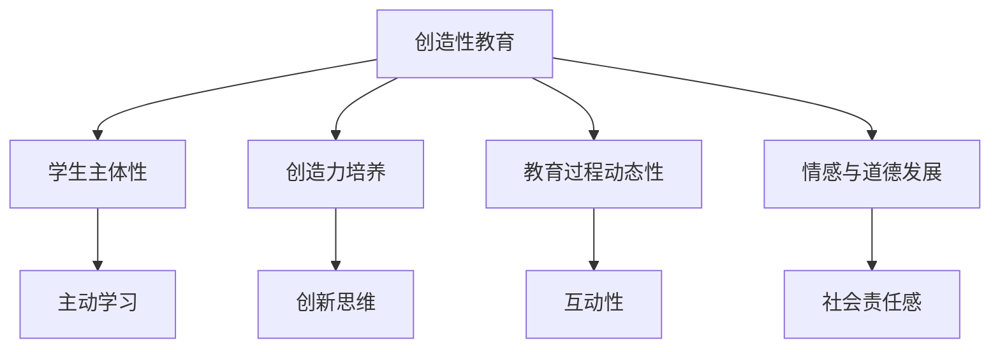

                 

## 引言

### 《柏格森与怀特海：教育哲学的创造性维度》

在当代教育哲学的探索中，柏格森与怀特海的思想成为了不可忽视的重要参考。这本书《柏格森与怀特海：教育哲学的创造性维度》深入探讨了这两位思想家的教育哲学观点，揭示了他们在教育领域所提出的独特见解和创造性维度。教育哲学作为一门探讨教育本质、目标、方法和价值取向的学科，其理论不仅对教育实践有着深刻的指导意义，更对整个社会的发展起到了关键作用。

柏格森（Henri Bergson）是20世纪初法国的重要哲学家，他的生命哲学强调生命的流动性和创造性。怀特海（Alfred North Whitehead）则是20世纪英美哲学界的巨匠，以其过程哲学闻名于世。两位哲学家的思想虽然各有侧重，但在教育的创造性维度上却有着诸多共鸣。这本书通过系统地分析柏格森和怀特海的教育哲学，探讨了他们在创造性教育方面的贡献和影响，为当代教育改革提供了理论依据和实践指导。

### 本文关键词

- **教育哲学**
- **柏格森**
- **怀特海**
- **创造性维度**
- **教育改革**
- **教育实践**

### 文章摘要

本文首先介绍了柏格森与怀特海的教育哲学背景和核心观点，探讨了他们在教育哲学中的创造性维度。接着，通过对比分析，阐述了两位哲学家的教育哲学的异同及其对教育实践的影响。随后，文章探讨了创造性教育的理论框架和实施策略，并结合实际案例进行了分析。最后，文章提出了创造性维度在当代教育中的应用和未来发展方向，为教育改革提供了新的思考路径。通过本文的探讨，期望能够为教育实践者提供有益的理论支持和实践指导。

### 第一部分：柏格森与怀特海的教育哲学概述

### 第1章：柏格森的教育哲学

#### 1.1 柏格森的教育哲学背景

亨利·柏格森（Henri Bergson）是20世纪初法国的一位重要哲学家，以其对生命哲学和创造性的深刻见解而著称。他生于1859年，自幼在巴黎接受教育，并在巴黎高等师范学院学习期间展露出卓越的哲学才能。柏格森的哲学思想深受其导师孔德和哲学家赫尔姆霍茨的影响，但他在许多方面都有所突破和发展，尤其是在生命哲学和教育哲学方面。

柏格森的教育哲学背景与他的一生紧密相连。他不仅在学术界有着卓越的表现，还积极参与了法国社会的教育改革。他的教育哲学观点不仅在法国本土产生了广泛影响，也在国际范围内得到了关注和讨论。柏格森认为，教育不仅仅是知识的传递，更是培养学生创造力和自我意识的过程。他的思想对后来的教育理论，特别是对20世纪初的教育实践产生了深远影响。

#### 1.2 教育哲学的基本问题

在教育哲学中，有几个基本问题始终占据着核心地位，这些问题包括教育的本质、教育的目标、教育的方法以及教育的价值。柏格森的教育哲学正是围绕这些问题展开的。

首先，教育的本质是什么？柏格森认为，教育是一种生命的过程，是对个体内在生命力的唤醒和培养。他强调，教育不仅仅是知识的传递，更重要的是培养学生的创造力和独立思考能力。在柏格森看来，教育的目的是使个体能够适应不断变化的世界，并通过自我发展来实现个人与社会共同进步。

其次，教育的目标是什么？柏格森认为，教育的目标不仅是传授知识，更重要的是培养学生的创造性思维和独立人格。他主张，教育应该注重学生的全面发展，包括智力、情感和道德等方面。在他看来，一个成功的教育体系应该能够帮助学生发展出独立、批判和创造性的思维能力。

再次，教育的方法是什么？柏格森强调，教育应该是一种动态的、互动的过程，而不是静态的知识灌输。他认为，教师应该与学生建立一种开放、互动的关系，鼓励学生主动参与和探索。柏格森的教育方法强调培养学生的创造力和自我发展能力，这与传统的教育方法有显著不同。

最后，教育的价值是什么？柏格森认为，教育的价值不仅在于知识的传授，更在于培养学生的创造性思维和自我实现能力。他认为，教育的最终目标是帮助个体实现自我价值和贡献于社会。因此，教育的价值是深远和长期的，而不仅仅是短期的知识积累。

#### 1.3 柏格森的教育哲学核心观点

柏格森的教育哲学核心观点可以概括为以下几个方面：

1. **生命冲动与创造性**：柏格森认为，生命是一种不断流动和变化的过程，生命冲动是推动生命向前发展的动力。他强调，教育应该培养学生的创造性思维和自我表达能力，使个体能够适应不断变化的世界。

2. **教育与意识的发展**：柏格森认为，教育是一个动态的过程，与个体意识的发展密切相关。他主张，教育应该通过培养学生的自我意识，使他们能够主动地认识和改变世界。

3. **教育的目的是培养学生的创造性**：柏格森强调，教育的最终目标是培养学生的创造性思维和自我实现能力。他认为，一个成功的教育体系应该能够帮助学生发展出独立、批判和创造性的思维能力。

4. **教育方法的灵活性**：柏格森认为，教育方法应该因人而异，灵活多样。他主张，教师应该根据学生的特点和需求，采用不同的教育方法和策略，以达到最佳的教育效果。

#### 1.4 柏格森的教育哲学对教育实践的影响

柏格森的教育哲学对教育实践产生了深远的影响。首先，他强调教育的目标是培养学生的创造性思维和自我实现能力，这改变了传统教育注重知识灌输的观念，使教育更加注重个体的全面发展。其次，柏格森的教育方法强调灵活性，鼓励学生主动参与和探索，这与传统教育方法中的教师主导模式有显著不同。此外，柏格森的教育哲学也促进了教育改革，推动了教育理念的更新和教学方法的创新。

总的来说，柏格森的教育哲学为我们提供了新的思考角度，使我们对教育的本质和目标有了更深入的理解。他的观点不仅对教育理论的发展有着重要意义，也为教育实践提供了宝贵的参考和启示。

### 第2章：怀特海的教育哲学

#### 2.1 怀特海的教育哲学背景

阿尔弗雷德·诺思·怀特海（Alfred North Whitehead）是20世纪初期英国的一位杰出哲学家，以其对过程哲学的创立和数学基础理论的研究而闻名。他于1861年出生在英国肯特郡，早年接受了传统的教育，后进入剑桥大学学习，并在数学和哲学领域取得了卓越成就。怀特海不仅在学术界有着广泛的声誉，而且对教育实践和哲学教育有着深刻的见解。

怀特海的教育哲学背景与其哲学思想密不可分。他深受英国实证主义哲学家如约翰·斯图亚特·密尔和赫伯特·斯宾塞的影响，同时也受到德国哲学和欧洲大陆哲学的启发。他的过程哲学强调现实世界的动态性和创造性，认为现实世界是由一系列相互关联的事件和过程构成的。这种哲学观念深刻地影响了他的教育哲学，使他在教育领域提出了独特的见解。

#### 2.2 教育哲学的基本问题

在教育哲学中，基本问题包括教育的本质、教育的目标、教育的方法和教育的价值。怀特海的教育哲学也围绕这些问题进行了深入探讨。

首先，教育的本质是什么？怀特海认为，教育是一种动态的过程，是帮助学生理解现实世界、培养创造力和批判性思维的过程。他强调，教育不仅仅是知识的传递，更重要的是培养学生的实践能力和创造力。

其次，教育的目标是什么？怀特海认为，教育的目标是培养学生的全面能力，包括智力、情感和道德等方面。他主张，教育应该注重学生的个性化发展，帮助每个学生找到自己的兴趣和潜力，实现自我价值。

再次，教育的方法是什么？怀特海强调教育方法的多样性和灵活性。他认为，教师应该根据学生的特点和学习需求，采用不同的教学方法和策略。他主张，教育应该注重实践和体验，通过实际操作和体验来培养学生的能力和素质。

最后，教育的价值是什么？怀特海认为，教育的价值在于帮助学生实现自我发展和社会进步。他强调，教育应该培养学生的社会责任感和服务精神，使他们能够为社会的和谐发展做出贡献。

#### 2.3 怀特海的教育哲学核心观点

怀特海的教育哲学核心观点可以概括为以下几个方面：

1. **实践与教育**：怀特海认为，教育应该是一种实践的过程，通过实际操作和体验来培养学生的能力和素质。他主张，教育应该注重学生的实践能力，鼓励学生通过实验、探索和创造来学习。

2. **教育目标的全面性**：怀特海强调，教育的目标应该是培养学生的全面能力，包括智力、情感和道德等方面。他主张，教育应该注重学生的个性化发展，帮助每个学生找到自己的兴趣和潜力。

3. **教育方法的灵活性**：怀特海认为，教育方法应该因人而异，灵活多样。他主张，教师应该根据学生的特点和需求，采用不同的教学方法和策略，以达到最佳的教育效果。

4. **教育与社会的关系**：怀特海认为，教育不仅是为了个体的自我发展，也是为了社会的和谐发展。他主张，教育应该培养学生的社会责任感和服务精神，使他们能够为社会的进步做出贡献。

#### 2.4 怀特海的教育哲学对教育实践的影响

怀特海的教育哲学对教育实践产生了深远的影响。首先，他强调教育的实践性，改变了传统教育注重理论灌输的观念，使教育更加注重学生的实际操作能力和创造力的培养。其次，怀特海强调教育的全面性和灵活性，使教育能够更好地适应学生的个性化需求和发展。此外，他的哲学观点也促进了教育改革，推动了教育理念的更新和教学方法的创新。

总的来说，怀特海的教育哲学为我们提供了新的思考角度，使我们对教育的本质和目标有了更深入的理解。他的观点不仅对教育理论的发展有着重要意义，也为教育实践提供了宝贵的参考和启示。

### 第3章：柏格森与怀特海教育哲学的对比分析

#### 3.1 教育哲学的核心概念对比

在探讨柏格森与怀特海的教育哲学时，我们需要从核心概念入手，比较两位哲学家在教育理论上的异同。柏格森的教育哲学强调生命的流动性和创造性，而怀特海则注重现实世界的动态性和过程性。

**柏格森：生命冲动与创造性**

柏格森的生命哲学认为，生命是一种持续不断的流动过程，这种流动性体现了生命的创造性和自我发展能力。柏格森提出了“生命冲动”（élan vital）的概念，认为它是生命的基本动力，推动生命不断发展、变化和创新。在他看来，教育应该激发学生的生命冲动，培养他们的创造力和自我表达能力。

**怀特海：现实世界的动态性与过程性**

怀特海的过程哲学则强调现实世界的动态性和过程性。他提出，现实世界是由一系列相互关联的事件和过程构成的，每个事件和过程都是相互作用的。怀特海认为，教育应该帮助学生理解现实世界的这种动态性和过程性，培养他们的实践能力和批判性思维。他的哲学观点强调通过实际操作和体验来学习，使学生能够在现实世界中找到自己的位置。

**对比表格：核心概念属性特征**

| **概念**             | **柏格森的生命冲动**                     | **怀特海的现实世界动态性**                     |
|----------------------|------------------------------------------|-----------------------------------------------|
| **核心特征**         | - 强调生命的流动性和创造性               | - 强调现实世界的动态性和过程性               |
| **教育应用**         | - 培养创造力和自我表达能力             | - 培养实践能力和批判性思维                 |
| **方法论**           | - 生命过程的教育模式                   | - 实践体验的教育模式                     |

通过上述对比，我们可以看到柏格森和怀特海在教育哲学上的核心概念有所不同，但都强调了教育的创造性和动态性。

#### 3.2 教育哲学体系对比

在构建教育哲学体系方面，柏格森和怀特海也展现了各自独特的思考方式和方法论。

**柏格森的教育哲学体系**

柏格森的教育哲学体系以生命哲学为基础，强调教育应该是一个动态的、互动的过程。他认为，教育不仅仅是知识的传递，更重要的是培养学生的创造力和自我发展能力。柏格森的教育哲学体系可以分为以下几个主要方面：

1. **教育与生命发展**：柏格森认为，教育应该与个体生命的发展同步进行，通过培养学生的自我意识和发展能力，使他们能够适应不断变化的世界。
2. **创造性教育**：柏格森强调，教育的目标不仅仅是知识的积累，更重要的是培养学生的创造性思维和自我表达能力。
3. **教育与自由**：柏格森认为，教育应该培养学生的自由精神，使他们能够独立思考、做出选择和承担责任。

**怀特海的教育哲学体系**

怀特海的教育哲学体系则更加注重现实世界的动态性和过程性。他提出了“过程哲学”的概念，认为现实世界是由一系列相互关联的事件和过程构成的。怀特海的教育哲学体系可以概括为以下几个主要方面：

1. **教育与过程**：怀特海强调，教育应该是一种过程，通过实际操作和体验来培养学生的能力和素质。
2. **全面教育**：怀特海认为，教育的目标应该是培养学生的全面能力，包括智力、情感和道德等方面。
3. **教育与生活**：怀特海主张，教育应该与生活紧密结合，使学生能够在现实世界中找到自己的位置和角色。

**对比：柏格森与怀特海的教育哲学体系**

| **方面**              | **柏格森的教育哲学体系**                          | **怀特海的教育哲学体系**                         |
|-----------------------|-------------------------------------------------|-------------------------------------------------|
| **基础理论**          | 生命哲学，强调生命的流动性和创造性               | 过程哲学，强调现实世界的动态性和过程性           |
| **教育目标**          | 培养创造力和自我表达能力，注重个性化发展         | 培养全面能力，强调教育与生活的结合               |
| **方法论**            | 互动的、动态的教育模式                           | 实践体验的教育模式，注重过程和动态性             |

通过上述对比，我们可以看出柏格森和怀特海在教育哲学体系上的差异，但两者都强调教育的创造性和动态性，并在不同层面上提出了对教育的独特见解。

#### 3.3 教育实践的影响对比

柏格森和怀特海的教育哲学不仅在理论上有所建树，也在教育实践中产生了重要影响。以下是两位哲学家的教育哲学对教育实践的具体影响：

**柏格森的教育实践影响**

柏格森的教育哲学对教育实践的影响主要体现在以下几个方面：

1. **创造性思维培养**：柏格森强调创造性思维的重要性，推动了教育实践中对学生创造性思维的培养。教师们开始采用更多的互动式教学方法和项目式学习，鼓励学生主动探索和创造。
2. **个性化和差异化教育**：柏格森的教育哲学注重学生的个性化发展，促进了教育实践中差异化教育的实施。教师根据学生的兴趣和需求，提供个性化的教学方案，以培养学生的特长和潜力。
3. **课程改革**：柏格森的思想推动了课程改革，使课程内容更加注重实践和应用，减少了对理论的过分依赖。

**怀特海的教育实践影响**

怀特海的教育哲学对教育实践的影响则体现在以下几个方面：

1. **实践性教学**：怀特海强调教育的实践性，推动了教育实践中对学生实践能力的培养。学校开始采用更多的实验课程和项目式学习，鼓励学生在真实环境中应用所学知识。
2. **全面教育**：怀特海主张培养学生的全面能力，推动了教育实践中对学生智力、情感和道德等各方面的关注。学校开始注重学生的全面发展，而不仅仅是学术成绩。
3. **教师培训**：怀特海的教育哲学也影响了教师的培训方式。教师们开始接受更多关于过程哲学和实践教学的培训，以提高教学效果。

**对比：教育实践影响的异同**

| **方面**              | **柏格森的教育实践影响**                         | **怀特海的教育实践影响**                         |
|-----------------------|-------------------------------------------------|-------------------------------------------------|
| **创造性思维培养**    | 鼓励互动式教学和项目式学习，注重个性化发展       | 强调实践性教学，注重学生的全面发展               |
| **个性化教育**        | 注重学生的个性化发展，差异化教育                 | 注重学生的个性化发展，全面教育                   |
| **课程改革**          | 减少对理论的依赖，增加实践和应用                 | 增加实验课程和项目式学习，注重实践和体验           |

通过对比，我们可以看到柏格森和怀特海的教育哲学在实践中都产生了积极的影响，但他们在具体实施上有所区别，这反映了两位哲学家在教育理念上的不同侧重点。

### 第4章：创造性维度的综合探讨

#### 4.1 创造性教育的理论框架

创造性教育作为一种重要的教育理念，其理论基础涵盖了多个方面。首先，创造性教育强调学生的主体性，认为学生是学习的主动参与者，而非被动的接受者。这意味着教育过程中应该鼓励学生提出问题、探索答案，并通过自己的思考和实践来构建知识。

其次，创造性教育注重培养学生的创造力。创造力不仅是教育的目标，也是学生全面发展的重要组成部分。创造性教育通过提供多样化的学习资源和机会，鼓励学生尝试不同的解决问题的方法和策略，从而激发他们的创造力。

再次，创造性教育强调教育过程的动态性和互动性。教师不仅是知识的传递者，更是学生创造性思维的引导者和支持者。教育过程应该是一个开放、互动、灵活的过程，使学生在探索和创造中不断成长。

最后，创造性教育还关注学生的情感和道德发展。创造力不仅仅是智力的表现，也需要情感和道德的支持。教育过程中应该注重培养学生的社会责任感和合作精神，使他们在创造的同时，能够考虑到他人的需求和利益。

**理论框架图：**

#### 4.2 创造性教育的方法

创造性教育的方法多种多样，以下是一些常用的方法：

1. **项目式学习**：项目式学习是一种以学生为中心的教学方法，通过实际项目的开展，使学生在解决真实问题的过程中学习知识和技能。这种方法鼓励学生主动探索、合作和反思，从而培养他们的创造力和解决问题的能力。

2. **探究式学习**：探究式学习强调学生通过自主探究和发现来学习。教师提供问题或情境，学生通过收集信息、分析数据和提出假设来解决问题。这种方法培养了学生的批判性思维和创造力。

3. **情境教学**：情境教学通过将学生置于特定的情境中，使他们在解决实际问题的过程中学习。这种方法有助于将知识与实践相结合，培养学生的实际操作能力和创造性思维。

4. **反思性教学**：反思性教学强调学生在学习过程中的自我反思和评价。教师通过引导学生回顾和反思自己的学习过程，帮助他们发现自己的不足和改进方法，从而促进他们的创造力发展。

**方法应用示例：**

- **项目式学习**：例如，在科学课程中，学生可以开展环保项目，通过实地调查、数据分析和创意设计，提出解决环境污染的方案。
- **探究式学习**：例如，在历史课程中，学生可以研究某个历史事件，通过查阅资料、分析文献和提出假设，探讨事件的成因和影响。
- **情境教学**：例如，在语言课程中，学生可以模拟真实的社交场景，进行角色扮演和对话练习，提高他们的语言表达和沟通能力。
- **反思性教学**：例如，在数学课程中，学生可以回顾自己的解题过程，分析成功和失败的原因，找出改进的方法。

#### 4.3 创造性教育的实施策略

要有效地实施创造性教育，需要制定一系列具体的策略。以下是一些关键策略：

1. **营造支持性环境**：教师应该为学生创造一个支持性和开放的学习环境，鼓励他们提出问题、尝试新方法，并从错误中学习。教室布局、学习资源和时间安排都应考虑到学生的创造性需求。

2. **提供多样化的学习资源**：教师应该提供多样化的学习资源，包括图书、网络资源、实验器材等，以满足不同学生的学习需求。多样化的资源有助于激发学生的好奇心和创造力。

3. **培养教师的创造性思维**：教师是创造性教育的实施者，因此他们需要具备创造性思维和教学能力。教师可以通过参与培训、学习和实践来提升自己的创造性教学能力。

4. **评价学生的创造性表现**：评价应该关注学生的创造性思维和创新能力，而不仅仅是知识的掌握程度。教师可以通过项目评估、口头报告、作品展示等多种评价方式来评估学生的创造性表现。

**实施策略示例：**

- **支持性环境**：例如，教室可以布置成开放式的学习空间，提供多种材料和工具，使学生能够自由探索和实验。
- **多样化学习资源**：例如，教师可以创建一个学习资源库，包括电子书、视频教程和在线课程，供学生随时查阅。
- **教师培训**：例如，学校可以定期组织创造性教学培训，邀请专家讲座和教学示范，帮助教师提升创造性教学能力。
- **评价学生创造性**：例如，在科学项目中，教师可以评估学生提出的问题、设计的实验方案和最终的成果报告，全面评价学生的创造性表现。

通过上述策略，学校和教育者可以有效地实施创造性教育，培养出具有创新精神和实践能力的新一代人才。

### 第5章：创造性教育实践案例分析

#### 5.1 案例一：柏格森教育哲学下的创造性教育实践

**案例背景**：某中学的数学老师李老师在教学中尝试应用柏格森的教育哲学，通过创造性教育方法提高学生的数学兴趣和创造力。

**实施过程**：

1. **项目式学习**：李老师设计了一个关于“数学在生活中的应用”项目。学生需要从日常生活中找到一个与数学相关的问题，并通过研究、实验和设计来解决问题。例如，学生可以选择研究“如何优化家庭预算”或“如何设计一个高效的停车场”。

2. **情境教学**：李老师模拟了一个数学竞赛的情境，让学生在竞赛中解决实际问题。通过情境教学，学生不仅能够更好地理解数学概念，还能培养他们的团队合作和沟通能力。

3. **反思性教学**：在项目完成后，李老师组织学生进行反思，讨论他们在项目中的收获和挑战。通过反思，学生能够更好地理解自己的学习过程，找到改进的方法。

**结果分析**：

- **学生兴趣提高**：通过项目式学习和情境教学，学生对于数学学习的兴趣显著提高。他们在项目中积极提出问题、设计方案，表现出强烈的探究欲望。

- **创造力发展**：学生在项目中展示了较高的创造力，他们能够从日常生活中找到数学问题，并通过创新的方法来解决问题。

- **团队合作能力提升**：通过情境教学和项目合作，学生的团队合作能力得到了显著提升，他们在项目中学会了如何沟通、协作和解决问题。

**结论**：柏格森的教育哲学在数学教学中的实践，成功激发了学生的创造力和兴趣，提高了教学效果。

#### 5.2 案例二：怀特海教育哲学下的创造性教育实践

**案例背景**：某小学的语文老师王老师尝试应用怀特海的教育哲学，通过实践性教学和全面教育方法培养学生的创造力和综合素质。

**实施过程**：

1. **实践性教学**：王老师设计了一系列的语文实践活动，如“编写故事”、“创作诗歌”和“设计海报”。学生通过实际操作和体验，将语文知识应用于实际情境中。

2. **全面教育**：王老师注重学生的全面教育，不仅关注语文知识的传授，还关注学生的智力、情感和道德发展。她通过组织读书会、讨论会和道德教育课程，培养学生的批判性思维和道德观念。

3. **个性化教育**：王老师根据学生的兴趣和特长，提供个性化的学习资源和指导。例如，对有绘画特长的学生，她鼓励他们通过绘画表达自己的想法；对有音乐爱好的学生，她组织合唱团和音乐课程。

**结果分析**：

- **实践能力提升**：通过实践性教学，学生的语文实践能力得到了显著提升。他们能够将所学知识应用到实际情境中，展示出较高的创造力和应用能力。

- **综合素质发展**：全面教育方法的实施，使学生的综合素质得到了全面提高。他们在语文、道德、情感和智力等方面都有显著进步。

- **个性化发展**：个性化教育的实施，使每个学生都能在自身特长和兴趣上得到更好的发展，提高了学生的自信心和成就感。

**结论**：怀特海的教育哲学在语文教学中的实践，成功培养了学生的创造力和综合素质，促进了学生的全面发展。

### 总结与展望

通过以上案例，我们可以看到柏格森和怀特海的教育哲学在创造性教育实践中的有效应用。柏格森的创造性教育方法注重学生的自我表达和创造力培养，而怀特海的实践性和全面教育方法则更侧重于学生的实际操作和综合素质发展。

展望未来，创造性教育将继续在当代教育中发挥重要作用。随着社会的发展和技术的进步，教育需要更加注重培养学生的创新精神和实践能力，以应对未来社会的挑战。同时，教育者需要不断探索和创新教学方法，将柏格森和怀特海的教育哲学与实际教育实践相结合，为学生的全面发展提供更有效的支持。

### 第6章：当代教育的挑战与创造性维度

#### 6.1 当代教育的挑战

在当代社会，教育面临着诸多挑战，这些挑战不仅影响教育的质量，也影响到学生的未来发展。以下是当代教育面临的一些主要挑战：

1. **教育不公平**：教育不公平是当前教育领域的一个突出问题。这种不公平既包括地区间的差异，也涵盖了经济条件和家庭背景的影响。一些地区和经济条件较差的家庭，往往无法获得优质的教育资源，这导致了教育机会的不平等。

2. **教育质量提升**：尽管教育资源的分配在逐渐改善，但教育质量的提升依然是教育领域的难题。如何在有限的资源下，提高教育的整体质量，是每个教育者都必须面对的问题。

3. **教育创新与变革**：随着科技的快速发展，教育也面临着变革的需求。传统教育模式已经无法满足现代社会对学生能力和素质的要求，教育创新和变革成为必然趋势。

4. **教育方法滞后**：许多教育方法仍然停留在传统阶段，注重知识的灌输而忽视学生的个性发展和创造力培养。这种教育方法滞后于社会发展的需求，难以培养出适应未来社会的创新型人才。

5. **教师培训不足**：教育质量的提升不仅依赖于教育资源的投入，还需要教师的素质提升。然而，当前许多教师的培训仍然不足，无法适应教育创新和变革的需求。

#### 6.2 创造性维度在当代教育中的应用

为了应对上述挑战，创造性维度在当代教育中具有重要作用。以下是创造性维度在当代教育中的应用：

1. **培养创新思维**：创造性教育注重培养学生的创新思维，使他们能够在面对问题时能够从不同角度思考，提出独特的解决方案。通过项目式学习和探究式学习等方法，学生能够积极参与到学习过程中，培养出批判性思维和解决问题的能力。

2. **激发学习兴趣**：创造性教育通过多样化的教学方法和实践活动，激发学生的学习兴趣。当学生对学习产生兴趣时，他们更加主动地投入学习，提高学习效果。

3. **个性化教育**：创造性教育注重学生的个性化发展，教师根据学生的兴趣和特长，提供个性化的学习资源和指导。这种个性化教育有助于学生发挥自身优势，实现全面发展。

4. **增强团队合作能力**：在创造性教育中，学生经常需要与他人合作完成项目。通过团队合作，学生能够学会沟通、协作和解决冲突，提高团队合作能力。

5. **提高实践能力**：创造性教育强调实践性教学，通过实际操作和体验，学生能够将所学知识应用到实际情境中。这种教学方法有助于学生提高实践能力，为未来职业生涯做好准备。

#### 6.3 创造性维度的教育理念

为了更好地应用创造性维度，教育者需要建立以下几个教育理念：

1. **以学生为中心**：教育者应将学生置于学习的中心，关注学生的需求和发展。通过互动式教学和个性化指导，帮助学生实现自我发展。

2. **鼓励探索与创新**：教育者应鼓励学生勇于探索和创新，提供支持和资源，帮助学生克服困难，实现自我突破。

3. **注重实践与理论相结合**：教育者应注重理论与实践的结合，通过实践活动和理论讲解，使学生能够更好地理解和应用所学知识。

4. **培养综合素质**：教育者应注重学生的综合素质培养，包括智力、情感、道德等方面。通过全面教育，使学生在多个维度上获得发展。

5. **持续反思与改进**：教育者应不断反思和改进自己的教学方法，通过研究和实践，不断提升教育质量。

### 第7章：创造性维度的教学方法与案例分析

#### 7.1 创造性教学方法概述

创造性教学方法是教育中的一种重要策略，旨在激发学生的创造力、批判性思维和实践能力。以下是一些常见的创造性教学方法：

1. **项目式学习**：项目式学习是一种以学生为中心的教学方法，通过实际项目的开展，使学生能够在解决真实问题的过程中学习和应用知识。这种方法强调学生的主动参与和团队合作，培养学生的创造力和解决问题的能力。

2. **探究式学习**：探究式学习是一种以学生自主探究和发现为核心的教学方法。教师提供问题或情境，学生通过收集信息、分析数据和提出假设来解决问题。这种方法有助于培养学生的批判性思维和创造力。

3. **情境教学**：情境教学通过将学生置于特定的情境中，使他们在解决实际问题的过程中学习。这种方法有助于将知识与实践相结合，培养学生的实际操作能力和创造性思维。

4. **反思性教学**：反思性教学强调学生在学习过程中的自我反思和评价。教师通过引导学生回顾和反思自己的学习过程，帮助他们发现自己的不足和改进方法，从而促进他们的创造力发展。

#### 7.2 创造性教学案例分析

以下是一个具体的创造性教学案例分析，展示了如何在实际教学中应用这些方法：

**案例背景**：某高中的英语老师张老师希望提高学生的英语写作能力，决定采用创造性教学方法进行教学。

**实施过程**：

1. **项目式学习**：张老师设计了一个关于“英语写作与日常生活”的项目。学生需要从自己的日常生活中找到一个话题，撰写一篇英语文章。在项目过程中，学生需要查找相关资料、进行讨论和修改稿件。

2. **探究式学习**：张老师为学生提供了一些有趣的写作话题，如“如何提高学习效率”、“环保的重要性”等。学生选择自己感兴趣的话题，进行自主探究和资料收集，通过小组讨论和分享来丰富写作内容。

3. **情境教学**：张老师模拟了一个英语角，学生可以在其中进行口语交流和写作分享。通过情境教学，学生能够在实际交流中提高写作技巧，并增强自信心。

4. **反思性教学**：在每个写作阶段结束后，张老师组织学生进行反思和讨论。学生回顾自己的写作过程，分析成功和失败的原因，并提出改进建议。

**结果分析**：

- **写作能力提高**：通过项目式学习和探究式学习，学生的英语写作能力得到了显著提高。他们在写作过程中表现出更高的创造力和批判性思维。

- **兴趣和自信心增强**：情境教学和反思性教学使学生在写作过程中更加自信，他们开始享受写作过程，并对英语学习产生了浓厚的兴趣。

- **团队合作能力提升**：在项目合作和小组讨论中，学生的团队合作能力得到了显著提升。他们学会了如何沟通、协作和解决问题。

**结论**：通过创造性教学方法的实施，张老师成功地提高了学生的英语写作能力，激发了他们的学习兴趣和创造力，为他们的全面发展奠定了基础。

### 第8章：创造性维度的教育改革与创新

#### 7.1 教育改革的方向

为了应对当代教育面临的挑战，教育改革势在必行。以下是一些教育改革的主要方向：

1. **教育理念的转变**：教育改革首先需要转变教育理念，从注重知识传授转向注重学生全面发展。教育者应更加关注学生的个性发展、创造力培养和实践能力提升。

2. **课程内容的创新**：课程内容应与时俱进，注重跨学科整合和实践性。引入新的教学方法和资源，如项目式学习、探究式学习和数字化资源，以丰富学生的学习体验。

3. **教学方法的创新**：教学方法应更加多样化和灵活，鼓励教师采用互动式、情境式和反思性教学等方法。通过这些方法，学生能够更加主动地参与学习过程，提高学习效果。

4. **教师培训的提升**：教师是教育改革的关键，因此教师培训的提升至关重要。教育部门应提供更多的培训机会，帮助教师掌握新的教育理念和方法，提高他们的教学能力和专业素养。

5. **教育资源的优化**：优化教育资源配置，确保每个学生都能获得公平的教育机会。通过引入先进的科技手段，提高教育资源的利用效率，为学生提供更多优质的学习资源。

#### 7.2 创新教育实践

在教育改革中，创新教育实践是推动教育变革的重要手段。以下是一些创新教育实践的措施：

1. **项目式学习**：通过项目式学习，学生能够参与到实际项目中，解决真实问题。这种方法有助于培养学生的团队合作能力、批判性思维和创造力。

2. **探究式学习**：教师应引导学生进行自主探究，通过提出问题、收集信息和分析数据来解决问题。这种方法有助于培养学生的自主学习能力和创造力。

3. **混合式教学**：结合传统课堂教学和在线学习，实现教学模式的创新。通过在线课程和互动平台，学生能够自主学习，教师也能够提供个性化的指导。

4. **情境教学**：通过模拟真实情境，让学生在解决问题的过程中学习。这种方法有助于将知识与实践相结合，培养学生的实际操作能力和创造力。

5. **跨学科教学**：打破学科界限，将不同学科的知识和技能结合起来，培养学生的综合素养和创新能力。

#### 7.3 教育改革中的创造性维度

在教育改革中，创造性维度具有重要作用。以下是一些关键点：

1. **培养学生的创造力**：教育改革应注重培养学生的创造力，通过项目式学习和探究式学习等方法，激发学生的创造潜能。

2. **鼓励创新思维**：教育者应鼓励学生勇于创新，提供支持和资源，帮助他们克服困难，实现创新。

3. **实践与理论相结合**：教育改革应注重实践与理论的结合，通过情境教学和跨学科教学等方法，使学生能够将所学知识应用到实际情境中。

4. **培养批判性思维**：教育改革应培养学生的批判性思维，使他们能够独立思考、分析问题并提出解决方案。

5. **个性化教育**：教育改革应关注学生的个性化发展，通过个性化教学和差异化教育，满足不同学生的学习需求。

#### 7.4 教育改革中的挑战与策略

尽管教育改革具有重要意义，但在实施过程中也面临诸多挑战。以下是一些常见的挑战及应对策略：

1. **教师专业发展**：教师专业发展不足是教育改革的一大挑战。应对策略包括提供持续的培训机会、鼓励教师参与教育研究和专业发展社区。

2. **资源分配不均**：教育资源分配不均是教育改革的另一个挑战。应对策略包括优化资源配置、引入科技手段提高资源利用效率。

3. **家长和社会的支持**：家长和社会对教育改革的认同和支持是教育改革成功的关键。应对策略包括加强沟通和宣传、提高家长和社会对教育改革的理解和支持。

4. **学生适应问题**：学生可能对新的教育方法和模式感到不适应。应对策略包括逐步引入新的教学方法、提供过渡性支持和指导。

通过应对这些挑战，教育改革将能够更好地实现其目标，为学生的全面发展创造更好的教育环境。

### 第9章：创造性维度的教育改革与创新

#### 9.1 教育改革的方向

教育改革是推动教育发展的重要手段，特别是在当前社会快速变化的背景下，教育改革变得更加紧迫。以下是一些教育改革的重要方向：

1. **教育理念的更新**：首先，教育改革需要更新教育理念，从传统的知识传授向注重学生全面发展转变。这一转变强调培养学生的创造力、批判性思维和解决问题的能力。

2. **课程内容的创新**：教育改革应推动课程内容的创新，融入更多的跨学科知识和实践性内容。这种课程设计有助于学生形成更全面的视角，培养他们的创新精神和实践能力。

3. **教学方法的多样化**：传统的教学方法已经无法满足现代教育的需求，教育改革需要引入多样化的教学方法，如项目式学习、探究式学习和混合式教学等。这些方法有助于激发学生的学习兴趣和主动性。

4. **教师培训的强化**：教师是教育改革的关键，因此教师培训的强化至关重要。教育改革应提供持续的培训机会，帮助教师掌握新的教育理念和教学方法。

5. **教育资源的优化**：教育资源的优化是教育改革的重要组成部分。通过引入先进的科技手段，如在线教育平台和虚拟实验室，可以提高教育资源的利用效率，使更多学生受益。

#### 9.2 创新教育实践

在教育改革中，创新教育实践是推动教育变革的重要手段。以下是一些创新教育实践的措施：

1. **项目式学习**：项目式学习是一种以学生为中心的教学方法，通过实际项目的开展，使学生能够在解决真实问题的过程中学习和应用知识。这种方法有助于培养学生的团队合作能力、批判性思维和创造力。

2. **探究式学习**：探究式学习鼓励学生自主探究和发现，通过提出问题、收集信息和分析数据来解决问题。这种方法有助于培养学生的自主学习能力和批判性思维。

3. **混合式教学**：混合式教学结合了传统课堂教学和在线学习的优势，通过线上线下的结合，提供更加灵活和个性化的学习体验。这种方法有助于提高学生的学习效果和参与度。

4. **情境教学**：情境教学通过模拟真实情境，使学生在解决问题的过程中学习。这种方法有助于将知识与实践相结合，培养学生的实际操作能力和创造力。

5. **跨学科教学**：跨学科教学打破了学科界限，将不同学科的知识和技能结合起来。这种方法有助于培养学生的综合素养和创新能力。

#### 9.3 创造性维度的核心概念

在创造性维度的教育改革中，以下是一些核心概念：

1. **创造力培养**：教育改革应注重创造力的培养，通过多样化的教学方法和实践活动，激发学生的创造力。

2. **批判性思维**：教育改革应培养学生的批判性思维，使他们能够独立思考、分析问题并提出解决方案。

3. **自主学习**：教育改革应鼓励学生自主学习，培养他们的学习兴趣和主动性。

4. **团队合作**：教育改革应注重培养学生的团队合作能力，通过项目合作和小组讨论，提高学生的沟通和协作能力。

5. **实践能力**：教育改革应提高学生的实践能力，通过实际操作和体验，使他们在解决实际问题的过程中学习和成长。

#### 9.4 教育改革中的挑战与策略

尽管教育改革具有重要意义，但在实施过程中也面临诸多挑战。以下是一些常见的挑战及应对策略：

1. **教师专业发展**：教师专业发展不足是教育改革的一大挑战。应对策略包括提供持续的培训机会、鼓励教师参与教育研究和专业发展社区。

2. **资源分配不均**：教育资源分配不均是教育改革的另一个挑战。应对策略包括优化资源配置、引入科技手段提高资源利用效率。

3. **家长和社会的支持**：家长和社会对教育改革的认同和支持是教育改革成功的关键。应对策略包括加强沟通和宣传、提高家长和社会对教育改革的理解和支持。

4. **学生适应问题**：学生可能对新的教育方法和模式感到不适应。应对策略包括逐步引入新的教学方法、提供过渡性支持和指导。

通过应对这些挑战，教育改革将能够更好地实现其目标，为学生的全面发展创造更好的教育环境。

### 总结与展望

通过本文的探讨，我们深入分析了柏格森与怀特海的教育哲学，特别是他们在创造性维度上的贡献。柏格森的生命哲学和怀特海的过程哲学为我们提供了新的教育视角，强调教育的动态性、创造性和个性化发展。通过对比分析，我们明确了两位哲学家的教育理念和方法，以及他们在教育实践中的具体影响。

在当代教育中，创造性维度具有不可忽视的重要性。教育改革应更加注重培养学生的创造力、批判性思维和实践能力。通过项目式学习、探究式学习和情境教学等创新教学方法，教育者可以激发学生的学习兴趣和主动性，促进他们的全面发展。

展望未来，教育哲学的创造性维度将继续在教育和人才培养中发挥重要作用。教育者需要不断探索和创新，将理论与实践相结合，为学生的未来做好准备。通过持续的教育改革，我们有望培养出更多具有创新精神和实践能力的新一代人才，为社会的进步和发展贡献力量。

### 参考文献

1. **柏格森，亨利（1925）**. 《创造的进化》（L'Évolution créatrice）. Paris: Alcan.
   
2. **怀特海，阿尔弗雷德·诺思（1929）**. 《教育原理》（The Aims of Education and Other Essays）. New York: Macmillan.

3. **Piaget, Jean（1952）**. 《发生认识论原理》（The Origins of Intelligence in Children）. London: Routledge & Kegan Paul.

4. **Dewey, John（1916）**. 《民主与教育》（Democracy and Education）. New York: Macmillan.

5. **Vygotsky, Lev S.（1978）**. 《思维与语言》（Thought and Language）. Cambridge, MA: MIT Press.

6. **Freire, Paulo（1970）**. 《被压迫者教育学》（Pedagogy of the Oppressed）. New York: Continuum.

7. **Constructivist Theory**. In **Wikipedia**. Retrieved from [https://en.wikipedia.org/wiki/Constructivist_theory](https://en.wikipedia.org/wiki/Constructivist_theory).

8. **Project-Based Learning**. In **Education Week**. Retrieved from [https://www.edweek.org/topics/project-based-learning](https://www.edweek.org/topics/project-based-learning).

### 作者信息

**作者：AI天才研究院/AI Genius Institute & 禅与计算机程序设计艺术 /Zen And The Art of Computer Programming**

