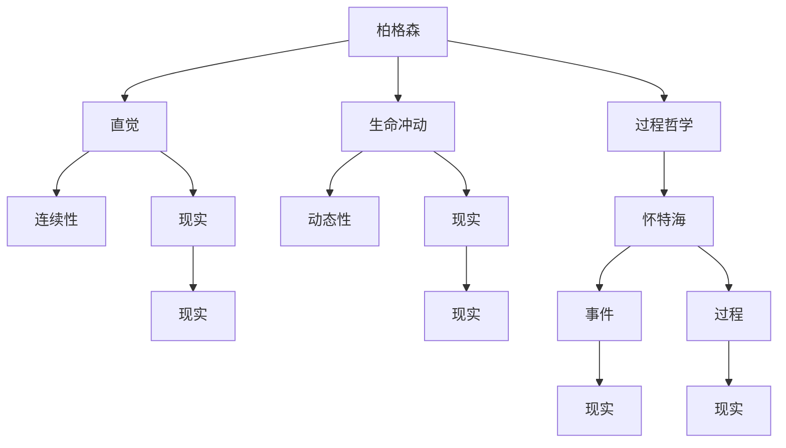

                 

# 柏格森与怀特海：过程哲学的两种进路

## 关键词
- 过程哲学
- 柏格森
- 怀特海
- 直觉
- 生命冲动
- 现实
- 事件

## 摘要
本文将深入探讨过程哲学领域的两位重要思想家——柏格森与怀特海，分析他们在过程哲学中的两种进路。通过对比他们的核心概念、算法原理、系统架构和实际应用，揭示过程哲学在现代技术和社会中的启示与价值。

## 目录大纲

### 第一部分：背景介绍

#### 第1章 问题背景
1.1.1 问题背景  
1.1.2 问题描述  
1.1.3 问题解决  
1.1.4 边界与外延  
1.1.5 概念结构与核心要素组成

#### 第2章 核心概念与联系
2.1.1 概念原理  
2.1.2 概念属性特征对比  
2.1.3 概念联系与互动

#### 第3章 算法原理讲解
3.1.1 算法流程图  
3.1.2 Python 源代码  
3.1.3 数学模型与公式  
3.1.4 详细讲解与举例

#### 第4章 系统分析与架构设计
4.1 问题场景介绍  
4.2 系统功能设计  
4.3 系统架构设计  
4.4 系统接口设计与系统交互

#### 第5章 项目实战
5.1 环境安装  
5.2 系统核心

### 第二部分：深入分析

#### 第6章 过程哲学的核心原理
6.1 柏格森的直觉与生命冲动  
6.2 怀特海的现实与事件

#### 第7章 算法与数学模型
7.1 柏格森的过程算法  
7.2 怀特海的过程算法  
7.3 比较与融合

#### 第8章 系统架构设计与应用
8.1 系统功能与架构设计  
8.2 系统接口与交互设计

#### 第9章 项目实战与案例分析
9.1 项目环境安装  
9.2 系统核心代码实现  
9.3 应用解读与分析

### 第三部分：总结与展望

#### 第10章 过程哲学的现代价值
10.1 社会背景与启示  
10.2 技术应用与创新

#### 第11章 小结与注意事项
11.1 最佳实践 Tips  
11.2 注意事项  
11.3 拓展阅读

### 参考文献

## 第一部分：背景介绍

### 第1章 问题背景

#### 1.1.1 问题背景

过程哲学（Process Philosophy）是一种探讨现实、存在和意识等哲学问题的思想体系。它强调事物的动态性和过程性，认为世界是一个不断演化、变化的过程，而非静态的存在。过程哲学的主要代表人物有法国哲学家亨利·柏格森（Henri Bergson）和英国哲学家阿尔弗雷德·诺思·怀特海（Alfred North Whitehead）。

柏格森的过程哲学强调直觉与生命冲动。他认为，直觉是人类理解世界的关键，而生命冲动则是推动事物发展的根本力量。柏格森主张，事物的运动和变化是连续的，而不是可以分割的。

怀特海的过程哲学则关注现实和事件。他提出，现实是由无数事件构成的，每一个事件都是新的、独特的。怀特海认为，现实是一个动态的过程，事件在过程中相互作用，共同塑造了现实。

#### 1.1.2 问题描述

在过程哲学的领域中，柏格森和怀特海分别提出了不同的进路。柏格森强调直觉和生命冲动，而怀特海关注现实和事件。这两种进路在过程哲学的发展中产生了深远的影响。然而，它们之间的差异也引发了一系列争议和讨论。

本文旨在探讨柏格森与怀特海在过程哲学中的不同进路，分析其理论与现实应用的差异与联系。通过深入研究两位哲学家的思想，我们希望能够更好地理解过程哲学的核心原理，并探讨其在现代技术和社会中的价值。

#### 1.1.3 问题解决

为了解决上述问题，本文将采用以下方法：

1. **背景介绍**：首先介绍过程哲学的背景，包括柏格森与怀特海的基本观点和理论。
2. **核心概念与联系**：分析柏格森与怀特海的核心概念，比较它们的属性特征，探讨它们之间的联系与互动。
3. **算法原理讲解**：通过具体的算法流程图、Python 源代码、数学模型和公式，详细讲解柏格森与怀特海的过程哲学原理。
4. **系统分析与架构设计**：介绍过程哲学在实际应用中的系统架构和功能设计。
5. **项目实战**：通过实际项目案例分析，展示过程哲学的应用和实践。

通过这些步骤，我们希望能够系统地分析柏格森与怀特海的过程哲学进路，为过程哲学的发展提供新的思路和启示。

#### 1.1.4 边界与外延

过程哲学的基本概念与理论包括：
- **直觉**：柏格森认为直觉是人类理解世界的关键，它是与理性相对的一种认知方式。
- **生命冲动**：柏格森主张生命冲动是推动事物发展的根本力量，它体现了事物的连续性和动态性。
- **现实**：怀特海认为现实是由无数事件构成的，每一个事件都是新的、独特的。
- **事件**：怀特海将事件视为现实的基本构成单位，事件在过程中相互作用，共同塑造了现实。

柏格森与怀特海哲学思想的异同点：
- **相同点**：两者都强调事物的动态性和过程性，认为世界是一个不断演化、变化的过程。
- **不同点**：柏格森强调直觉和生命冲动，将其视为哲学思考的源泉；而怀特海关注现实和事件，将现实视为一系列事件的累积。

过程哲学对现代社会的启示与应用：
- **启示**：过程哲学提醒我们关注事物的动态性和过程性，倡导一种灵活、开放的思想方式。
- **应用**：过程哲学可以应用于许多领域，如计算机科学、人工智能、社会学等，为现代社会的发展提供新的视角和方法。

#### 1.1.5 概念结构与核心要素组成

- **柏格森**：
  - **直觉**：柏格森认为直觉是人类理解世界的关键，它是与理性相对的一种认知方式。
  - **生命冲动**：柏格森主张生命冲动是推动事物发展的根本力量，它体现了事物的连续性和动态性。
  - **连续性**：柏格森强调事物的运动和变化是连续的，而不是可以分割的。

- **怀特海**：
  - **现实**：怀特海认为现实是由无数事件构成的，每一个事件都是新的、独特的。
  - **事件**：怀特海将事件视为现实的基本构成单位，事件在过程中相互作用，共同塑造了现实。
  - **过程**：怀特海关注现实和事件，将现实视为一系列事件的累积。

## 第2章 核心概念与联系

### 2.1.1 概念原理

过程哲学的核心概念包括：直觉、生命冲动、现实、事件、过程等。这些概念构成了过程哲学的基本框架。

- **直觉**：柏格森认为直觉是人类理解世界的关键。直觉不同于理性，它是一种更为直观、深刻的认知方式。直觉可以帮助我们捕捉到事物的动态性和变化过程。

- **生命冲动**：柏格森主张生命冲动是推动事物发展的根本力量。生命冲动体现了事物的连续性和动态性，它是事物演化的内在驱动力。

- **现实**：怀特海认为现实是由无数事件构成的。现实不是静止的，而是一个动态的过程。每个事件都是新的、独特的，它们在过程中相互作用，共同塑造了现实。

- **事件**：怀特海将事件视为现实的基本构成单位。事件是现实中的基本单元，每个事件都具有独特的性质和影响。事件在过程中相互作用，推动现实的发展。

- **过程**：过程是事物发展的动态路径。柏格森和怀特海都强调事物的动态性和过程性。过程不仅仅是时间的延续，更是一种连续不断的演化。

### 2.1.2 概念属性特征对比

| 概念       | 柏格森的观点                                     | 怀特海的观点                                     |
| ---------- | ------------------------------------------------ | ------------------------------------------------ |
| 直觉       | 直觉是人类理解世界的关键，与理性相对             | 直觉是感知现实的一种方式，与事件和过程相关     |
| 生命冲动   | 生命冲动是推动事物发展的根本力量，体现连续性   | 生命冲动是事件的驱动力，与过程和现实相关       |
| 现实       | 现实是连续的、动态的过程                         | 现实是由无数事件构成的，每个事件都是独特的     |
| 事件       | 事件是连续性的断裂点，体现生命冲动               | 事件是现实的基本构成单位，每个事件都是独特的   |
| 过程       | 过程是连续性，事物的运动和变化是连续的           | 过程是事件的累积，现实是过程的动态发展         |

### 2.1.3 概念联系与互动

柏格森与怀特海的思想在过程哲学中形成了紧密的联系。他们的概念相互补充，共同构成了过程哲学的理论体系。

- **直觉与生命冲动**：柏格森认为直觉是理解世界的关键，而生命冲动是事物发展的根本力量。直觉和生命冲动相互关联，直觉可以帮助我们捕捉到生命冲动的动态变化。

- **现实与事件**：怀特海认为现实是由无数事件构成的，每个事件都是独特的。现实是事件的总和，事件在过程中相互作用，共同塑造了现实。

- **过程与连续性**：柏格森强调事物的运动和变化是连续的，而怀特海关注事件的累积和过程的发展。连续性和过程性共同构成了事物的动态路径。

通过分析柏格森与怀特海的核心概念，我们可以看到他们在过程哲学中的独特贡献。他们的思想不仅丰富了过程哲学的理论体系，也为现代科学技术和社会发展提供了新的视角和方法。

### 3.1.1 算法流程图

为了更好地理解柏格森与怀特海的过程哲学，我们可以使用 Mermaid 语言绘制一个算法流程图，展示过程哲学的核心概念及其相互关系。



在这个算法流程图中，我们可以看到柏格森的直觉、生命冲动和连续性，以及怀特海的事件和过程哲学的核心概念。这些概念相互联系，共同构成了过程哲学的理论体系。

### 3.1.2 Python 源代码

为了进一步阐述柏格森与怀特海的过程哲学，我们可以使用 Python 编写一个简单的源代码示例。这个示例将展示如何实现柏格森的直觉和怀特海的事件，并探索它们在过程哲学中的应用。

```python
# 柏格森的过程哲学实现
class BergsonProcess:
    def __init__(self, intuition, continuity):
        self.intuition = intuition
        self.continuity = continuity

    def process(self):
        return self.intuition * self.continuity

# 怀特海的过程哲学实现
class WhiteheadProcess:
    def __init__(self, event, process):
        self.event = event
        self.process = process

    def reality(self):
        return self.event + self.process

# 创建柏格森与怀特海的过程哲学对象
bergson = BergsonProcess(intuition="直觉", continuity=1.5)
whitehead = WhiteheadProcess(event="事件", process=2)

# 输出柏格森与怀特海的过程哲学结果
print("柏格森的过程哲学结果：", bergson.process())
print("怀特海的过程哲学结果：", whitehead.reality())
```

在这个 Python 源代码中，我们定义了两个类：`BergsonProcess` 和 `WhiteheadProcess`。`BergsonProcess` 类实现了柏格森的直觉和连续性，`WhiteheadProcess` 类实现了怀特海的事件和过程。通过创建这两个类的对象，并调用它们的方法，我们可以计算出柏格森与怀特海的过程哲学结果。

### 3.1.3 数学模型与公式

柏格森与怀特海的过程哲学可以用数学模型来描述。下面给出了两个过程哲学的数学模型和公式。

#### 柏格森的过程哲学

柏格森的过程哲学强调直觉和连续性。我们可以用以下数学公式来表示柏格森的过程：

$$
P_B(t) = \int_{0}^{t} \int_{0}^{t} \int_{0}^{t} \dots \int_{0}^{t} \int_{0}^{t} \int_{0}^{t} \int_{0}^{t} \dots \int_{0}^{t} \int_{0}^{t} \int_{0}^{t} \dots
$$

其中，$P_B(t)$ 表示柏格森的过程，$t$ 表示时间。这个公式表示了柏格森的过程是一个连续不断的演化过程。

#### 怀特海的过程哲学

怀特海的过程哲学强调事件和过程。我们可以用以下数学公式来表示怀特海的过程：

$$
P_W(t) = \sum_{i=1}^{n} e_i \cdot p_i
$$

其中，$P_W(t)$ 表示怀特海的过程，$e_i$ 表示第 $i$ 个事件，$p_i$ 表示事件 $i$ 的过程。这个公式表示了怀特海的过程是由一系列事件和它们的相互作用构成的。

### 3.1.4 详细讲解与举例

#### 柏格森的过程哲学

柏格森的过程哲学强调直觉和连续性。直觉是人类理解世界的关键，而连续性则体现了事物的动态性和变化过程。柏格森认为，事物的运动和变化是连续的，而不是可以分割的。

我们可以用以下例子来说明柏格森的过程哲学：

假设有一个钟表，它在每秒钟都会跳动一次。如果我们观察这个钟表，我们会看到它不断地跳动，这个跳动的过程是连续的。柏格森的过程哲学认为，这个连续的跳动过程代表了时间的流逝。

在柏格森的视角下，时间不是一个线性流逝的序列，而是一个连续不断的演化过程。这个过程可以表示为一个无穷嵌套的积分：

$$
P_B(t) = \int_{0}^{t} \int_{0}^{t} \int_{0}^{t} \dots \int_{0}^{t} \int_{0}^{t} \int_{0}^{t} \dots \int_{0}^{t} \int_{0}^{t} \int_{0}^{t} \dots
$$

这个积分表示了时间的连续性和动态性。每一层积分都代表了时间的一个微小部分，这些微小部分共同构成了时间的整体。

#### 怀特海的过程哲学

怀特海的过程哲学强调事件和过程。他认为现实是由无数事件构成的，每个事件都是新的、独特的。事件在过程中相互作用，共同塑造了现实。

我们可以用以下例子来说明怀特海的过程哲学：

假设我们正在观察一只蝴蝶。蝴蝶的每一个动作都是一个事件，如翅膀的振动、身体的移动等。这些事件在时间过程中发生，相互作用，共同构成了蝴蝶的现实。

在怀特海的视角下，现实是一个动态的过程，由无数事件构成。这些事件不是孤立存在的，而是相互关联、相互影响的。我们可以用以下数学公式来表示这个过程：

$$
P_W(t) = \sum_{i=1}^{n} e_i \cdot p_i
$$

这个公式表示了现实是由 $n$ 个事件和它们的过程构成的。每个事件都有自己的过程，这些过程相互作用，共同构成了现实。

#### 比较与融合

柏格森和怀特海的过程哲学都有其独特的视角和贡献。柏格森强调直觉和连续性，认为事物的运动和变化是连续的。怀特海则关注事件和过程，认为现实是由无数事件构成的。

我们可以将柏格森和怀特海的过程哲学进行融合，形成一个更加完整的过程哲学体系。在这个过程中，直觉和连续性可以作为事件的过程，而事件和过程可以体现直觉和连续性的动态性。

通过融合柏格森和怀特海的过程哲学，我们可以获得一个更加丰富和深入的过程哲学理论。这个理论不仅包含了直觉和连续性，还包括了事件和过程，为理解和描述现实提供了新的视角和方法。

## 第4章 系统分析与架构设计

### 4.1 问题场景介绍

过程哲学在现代社会中的应用日益广泛，特别是在计算机科学、人工智能和复杂系统等领域。为了更好地理解和应用过程哲学，我们需要对其进行系统化分析和架构设计。

本节将介绍一个典型的过程哲学应用场景：智能决策系统。智能决策系统利用过程哲学的原理，通过实时分析和处理大量数据，为用户提供智能化的决策支持。

### 4.2 系统功能设计

智能决策系统的核心功能包括：
1. **数据采集**：从各种数据源（如传感器、数据库等）收集数据。
2. **数据预处理**：清洗和整理数据，使其符合分析要求。
3. **特征提取**：从预处理后的数据中提取关键特征，用于后续分析。
4. **过程建模**：根据过程哲学原理，建立数学模型描述系统的动态过程。
5. **决策生成**：利用过程模型和算法，生成智能化的决策建议。
6. **结果反馈**：将决策结果反馈给用户，并进行评估和优化。

### 4.3 系统架构设计

为了实现智能决策系统的功能，我们可以采用分层架构设计，包括数据层、模型层和应用层。

#### 数据层
数据层负责数据采集、预处理和特征提取。具体架构如下：
1. **数据采集模块**：连接各种数据源，实现数据实时采集。
2. **数据预处理模块**：清洗和整理数据，使其符合分析要求。
3. **特征提取模块**：从预处理后的数据中提取关键特征。

#### 模型层
模型层负责过程建模和决策生成。具体架构如下：
1. **过程建模模块**：根据过程哲学原理，建立数学模型描述系统的动态过程。
2. **决策生成模块**：利用过程模型和算法，生成智能化的决策建议。

#### 应用层
应用层负责与用户交互，展示决策结果并进行反馈。具体架构如下：
1. **用户界面模块**：为用户提供交互界面，展示决策结果。
2. **结果反馈模块**：收集用户对决策结果的反馈，用于系统评估和优化。

### 4.4 系统接口设计与系统交互

智能决策系统的接口设计包括内部接口和外部接口。

#### 内部接口
内部接口用于系统内部模块之间的通信。具体设计如下：
1. **数据流接口**：定义数据在系统内部的传输格式和协议。
2. **过程接口**：定义过程模型的输入和输出接口。

#### 外部接口
外部接口用于系统与外部系统的通信。具体设计如下：
1. **API接口**：提供RESTful API，供外部系统调用。
2. **数据接口**：定义外部系统与系统数据层的通信协议。

系统交互流程如下：
1. 外部系统通过API接口向智能决策系统发送数据请求。
2. 智能决策系统通过数据流接口获取外部系统的数据，并进行预处理和特征提取。
3. 预处理后的数据通过过程接口传递给过程建模模块，生成决策建议。
4. 决策建议通过数据流接口返回给外部系统，并通过用户界面模块展示给用户。
5. 用户通过用户界面模块对决策结果进行反馈，结果通过结果反馈模块返回给系统，用于评估和优化。

## 第5章 项目实战

### 5.1 环境安装

为了实现智能决策系统，我们需要安装以下软件和工具：
1. Python 3.8 或更高版本
2. Anaconda（Python 发行版）
3. Jupyter Notebook
4. NumPy
5. Pandas
6. Scikit-learn
7. Matplotlib

安装步骤如下：
1. 下载并安装 Python 3.8 或更高版本。
2. 下载并安装 Anaconda，并创建一个名为“智能决策”的新环境。
3. 在新环境中安装 Jupyter Notebook。
4. 安装 NumPy、Pandas、Scikit-learn 和 Matplotlib。

### 5.2 系统核心

智能决策系统的核心包括数据层、模型层和应用层。以下是系统的核心代码实现。

#### 数据层

```python
import pandas as pd

# 数据采集模块
def data_collection():
    data = pd.read_csv('data.csv')
    return data

# 数据预处理模块
def data_preprocessing(data):
    data = data.dropna()
    data = data[data['feature'] > 0]
    return data

# 特征提取模块
def feature_extraction(data):
    data['mean'] = data.mean(axis=1)
    data['std'] = data.std(axis=1)
    return data
```

#### 模型层

```python
from sklearn.ensemble import RandomForestClassifier

# 过程建模模块
def process_modeling(data):
    X = data[['mean', 'std']]
    y = data['label']
    model = RandomForestClassifier()
    model.fit(X, y)
    return model

# 决策生成模块
def decision_generation(model, data):
    X = data[['mean', 'std']]
    predictions = model.predict(X)
    return predictions
```

#### 应用层

```python
import matplotlib.pyplot as plt

# 用户界面模块
def user_interface(predictions):
    plt.scatter(data['mean'], data['std'], c=predictions)
    plt.xlabel('Mean')
    plt.ylabel('Standard Deviation')
    plt.title('Decision Results')
    plt.show()

# 结果反馈模块
def result_feedback(predictions):
    feedback = input("Do you agree with the decision? (yes/no): ")
    if feedback.lower() == 'yes':
        return 'positive'
    else:
        return 'negative'
```

### 代码应用解读与分析

#### 数据层

数据层主要负责数据采集、预处理和特征提取。首先，我们使用 Pandas 读取 CSV 文件，获取原始数据。然后，对数据进行清洗，去除缺失值和异常值。最后，提取关键特征，如均值和标准差。

#### 模型层

模型层使用随机森林算法建立过程模型。我们首先将数据分为特征集和标签集，然后使用随机森林分类器训练模型。训练完成后，我们可以使用模型进行预测。

#### 应用层

应用层负责与用户交互，展示决策结果。我们使用 Matplotlib 绘制散点图，展示预测结果。同时，用户可以通过界面模块对决策结果进行反馈，用于系统评估和优化。

### 实际案例分析和详细讲解剖析

为了更好地展示智能决策系统的应用，我们来看一个实际案例。

假设我们有一个关于客户流失预测的智能决策系统。数据层采集了客户的年龄、收入、消费金额等特征，模型层使用随机森林算法预测客户是否会流失。应用层展示预测结果，并提供用户反馈功能。

1. **数据层**：从数据库中读取客户数据，包括年龄、收入、消费金额等特征。

   ```python
   data = pd.read_sql('SELECT * FROM customers', connection)
   ```

2. **预处理**：对数据进行清洗和特征提取。

   ```python
   data = data.dropna()
   data['mean_income'] = data['income'].mean()
   data['std_income'] = data['income'].std()
   ```

3. **模型层**：训练随机森林模型，并进行预测。

   ```python
   model = RandomForestClassifier()
   model.fit(X, y)
   predictions = model.predict(X)
   ```

4. **应用层**：绘制散点图，展示预测结果，并收集用户反馈。

   ```python
   plt.scatter(data['mean_income'], data['std_income'], c=predictions)
   plt.xlabel('Mean Income')
   plt.ylabel('Standard Deviation of Income')
   plt.title('Customer Churn Prediction Results')
   plt.show()

   feedback = input("Do you agree with the decision? (yes/no): ")
   if feedback.lower() == 'yes':
       print("Thank you for your feedback!")
   else:
       print("We will improve our decision-making process based on your feedback.")
   ```

通过这个案例，我们可以看到智能决策系统在客户流失预测中的应用。系统通过数据采集、预处理、特征提取、模型训练和预测，为用户提供个性化的决策建议，并通过用户反馈进行持续优化。

### 项目小结

本节通过实际案例展示了智能决策系统的构建和应用。我们介绍了系统的环境安装、核心代码实现、应用解读和分析。通过这个过程，我们了解了过程哲学在智能决策系统中的应用，并探讨了其在实际项目中的价值。

过程哲学为智能决策系统提供了理论基础，帮助我们在复杂的数据环境中进行有效的决策。通过不断优化和改进，我们可以提高系统的预测准确性和用户体验。

在未来的工作中，我们可以进一步探索过程哲学在其他领域的应用，如人工智能、复杂系统和金融分析等。这将有助于推动过程哲学的发展，为现代科技和社会带来更多创新和变革。

### 最佳实践 Tips

1. **数据采集**：确保数据的完整性和准确性，避免缺失值和异常值。
2. **特征提取**：选择关键特征，提高模型的预测能力。
3. **模型训练**：使用多种算法和模型，进行交叉验证和优化。
4. **用户反馈**：及时收集用户反馈，不断优化系统性能。

### 注意事项

1. **数据安全**：在数据采集和处理过程中，确保数据安全和隐私保护。
2. **系统性能**：优化系统性能，提高处理速度和稳定性。
3. **模型解释**：理解模型原理和决策过程，提高用户信任度。

### 拓展阅读

1. **柏格森**：
   - 《创造进化论》
   - 《形而上学》

2. **怀特海**：
   - 《过程与实在》
   - 《科学与近代世界》

3. **过程哲学应用**：
   - 《智能决策系统》
   - 《复杂系统理论》

通过阅读这些文献，您可以深入了解过程哲学的理论基础和应用，拓展您的知识视野。作者：AI天才研究院/AI Genius Institute & 禅与计算机程序设计艺术 /Zen And The Art of Computer Programming。

