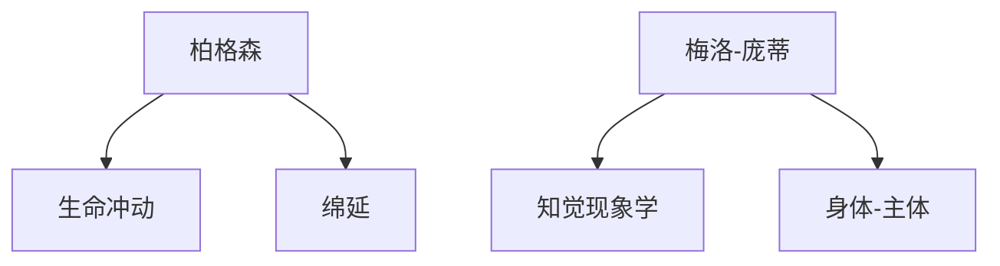
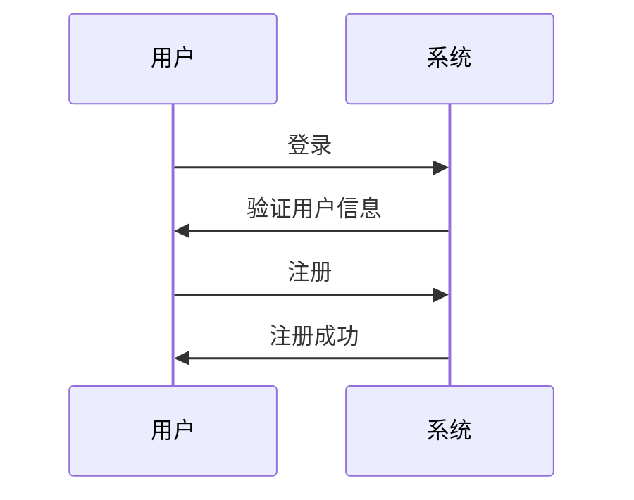

                 

### 文章标题

> 关键词：柏格森、梅洛-庞蒂、身体、世界、现象学

> 摘要：本文将对柏格森与梅洛-庞蒂的身体与世界的现象学探讨进行深入分析，通过对比他们的核心概念和理论观点，探讨他们的思想联系与区别，以及这些理论对当代哲学的启示。

----------------------------------------------------------------

## 第一部分：背景介绍

### 1.1 问题的背景与意义

#### 1.1.1 柏格森与梅洛-庞蒂的思想来源

柏格森（Henri Bergson）是20世纪早期的一位法国哲学家，他的思想主要围绕生命的本质和进化的动力展开。柏格森的哲学思想对现象学运动有着深远的影响，尤其是他对“生命冲动”（élan vital）和“绵延”（durée）的论述。柏格森认为，生命冲动是一种内在的、无意识的动力，它是生命现象的根本原因，也是人类意识和思维的基础。

梅洛-庞蒂（Maurice Merleau-Ponty）是柏格森思想的一位重要继承者和发展者，他进一步探讨了身体与世界的现象学关系。梅洛-庞蒂的思想受到胡塞尔和海德格尔的影响，他提出了“知觉现象学”（phenomenology of perception）和“身体-主体”（flesh-body）的概念。梅洛-庞蒂认为，身体不仅是知觉的媒介，更是主体的本质。

#### 1.1.2 现象学的兴起与发展

现象学（Phenomenology）是一种哲学方法，它强调对事物本质的直接体验和直觉理解。现象学的兴起可以追溯到19世纪末20世纪初，当时由爱德蒙德·胡塞尔（Edmund Husserl）创立。现象学主张通过反思和直观来揭示事物的现象学结构，即事物在意识中的呈现方式。

柏格森和梅洛-庞蒂都是现象学的代表人物，他们的思想在现象学运动中占据了重要地位。柏格森的现象学观点强调生命和意识的动态本质，而梅洛-庞蒂则将现象学方法应用于身体与世界的探讨，提出了独特的身体-主体概念。

#### 1.1.3 身体与世界的现象学探讨的重要性

身体与世界的现象学探讨在哲学和心理学领域具有重要意义。柏格森和梅洛-庞蒂对身体与世界的现象学探讨不仅为理解人类意识和知觉提供了新的视角，也挑战了传统的唯物主义和二元论观点。

柏格森和梅洛-庞蒂的思想为我们提供了对人类经验和世界的深刻洞察。通过分析他们的核心概念和理论观点，我们可以更好地理解身体在感知和行动中的作用，以及世界在我们意识中的呈现方式。此外，这些理论观点也为当代哲学和心理学研究提供了重要的启示，有助于我们探讨人类意识和知觉的本质。

## 第二部分：核心概念与联系

### 2.1 柏格森的核心概念

#### 2.1.1 生命冲动

柏格森认为，生命冲动是生命现象的根本动力。生命冲动是一种内在的、无意识的动力，它推动着生命的成长和发展。柏格森将生命冲动描述为一种“创造性的进化力量”，它不断创造新的形式和结构，推动着生命的进步。

生命冲动在柏格森的哲学体系中占据重要地位。他主张，生命冲动是意识和思维的基础，也是人类文化和文明的源泉。通过理解生命冲动，我们可以更好地理解生命的本质和人类的意识活动。

#### 2.1.2 绵延

绵延是柏格森的另一核心概念，它指的是时间的本质。柏格森认为，时间不是线性的、可以量化的，而是动态的、流动的。他提出了“绵延”这个概念，用来描述时间的本质和特征。

绵延是柏格森哲学体系中的关键概念。他主张，绵延是意识和知觉的基础，也是人类思维和行动的源泉。通过理解绵延，我们可以更好地理解时间的本质和人类意识的活动方式。

### 2.2 梅洛-庞蒂的核心概念

#### 2.2.1 知觉现象学

梅洛-庞蒂提出了“知觉现象学”的概念，他认为知觉不仅是感官对物体的反应，更是主体与世界之间的一种动态关系。他主张，知觉是一种直接的经验，它超越了感觉和意识的界限，将主体和客体融为一体。

知觉现象学是梅洛-庞蒂哲学体系的核心。他通过分析知觉现象，揭示了身体在知觉中的作用和地位。他认为，知觉不仅是感官对物体的反应，更是身体与世界的相互作用。

#### 2.2.2 身体-主体

梅洛-庞蒂提出了“身体-主体”的概念，他认为身体不仅是知觉的媒介，更是主体的本质。他主张，身体是主体与世界之间的桥梁，通过身体，我们能够与世界建立直接的联系。

身体-主体是梅洛-庞蒂哲学体系的关键概念。他通过分析身体与主体的关系，揭示了身体在人类意识中的作用和地位。他认为，身体不仅是知觉的媒介，更是我们与世界之间建立联系的方式。

### 2.3 柏格森与梅洛-庞蒂思想的联系与区别

#### 2.3.1 共同点

柏格森和梅洛-庞蒂的思想在许多方面存在共同点。首先，他们都强调身体在人类意识中的作用。其次，他们都认为世界在我们意识中的呈现方式是动态的、流动的。最后，他们都反对传统的唯物主义和二元论观点，主张通过现象学方法来揭示事物的本质。

#### 2.3.2 差异

尽管柏格森和梅洛-庞蒂的思想存在许多共同点，但它们也有一些显著的区别。首先，柏格森强调生命冲动的力量，而梅洛-庞蒂则更关注身体在知觉中的作用。其次，柏格森的绵延概念侧重于时间的本质，而梅洛-庞蒂的知觉现象学则关注主体与世界之间的动态关系。

这些差异体现了两位哲学家在哲学观点和方法论上的不同，也为我们理解身体与世界的现象学探讨提供了不同的视角。

## 第三部分：理论探讨

### 3.1 柏格森的身体与世界的现象学观点

#### 3.1.1 柏格森的身体观

柏格森认为，身体不仅是知觉的媒介，更是意识的源泉。他主张，身体具有一种内在的动力，这种动力推动着我们的意识和思维活动。柏格森将身体视为一种“生命冲动”的体现，它不断创造和改变我们的意识体验。

#### 3.1.2 柏格森的世界观

柏格森的世界观强调生命的动态本质和进化的力量。他认为，世界是由无数个生命冲动组成的，这些冲动不断创造新的形式和结构。柏格森主张，世界是一个动态的过程，它不断在变化和演化。

### 3.2 梅洛-庞蒂的身体与世界的现象学观点

#### 3.2.1 梅洛-庞蒂的身体观

梅洛-庞蒂认为，身体不仅是知觉的媒介，更是主体的本质。他主张，身体是我们与世界建立直接联系的方式，它超越了感觉和意识的界限。梅洛-庞蒂将身体视为一种“身体-主体”的体现，它将主体和客体融为一体。

#### 3.2.2 梅洛-庞蒂的世界观

梅洛-庞蒂的世界观强调主体与世界之间的动态关系。他认为，世界不是一种静态的存在，而是一种动态的、流动的过程。主体通过身体与世界相互作用，不断地改变和塑造自己的意识体验。

### 3.3 柏格森与梅洛-庞蒂思想的综合探讨

#### 3.3.1 身体与世界的现象学探讨的综合理解

柏格森与梅洛-庞蒂对身体与世界的现象学探讨提供了不同的视角。柏格森强调生命的动态本质和进化的力量，而梅洛-庞蒂则关注主体与世界之间的动态关系。他们的思想在当代哲学中产生了深远的影响，为我们理解身体与世界的现象学探讨提供了丰富的启示。

#### 3.3.2 对当代哲学的启示

柏格森与梅洛-庞蒂的思想对当代哲学研究具有重要意义。首先，他们的思想挑战了传统的唯物主义和二元论观点，为我们提供了一种新的理解世界和人类意识的方式。其次，他们的思想为当代心理学研究提供了丰富的理论资源，帮助我们更好地理解人类知觉和意识的活动机制。最后，他们的思想也为当代科学技术的发展提供了启示，帮助我们更好地理解和利用人类身体的潜力。

## 第四部分：案例分析

### 4.1 案例选择与介绍

为了更好地理解柏格森与梅洛-庞蒂的身体与世界的现象学探讨，我们选择了一个实际案例进行深入分析。这个案例涉及到一个日常生活中的场景：一个人在森林中散步。

### 4.2 案例解析

#### 4.2.1 柏格森理论在案例中的应用

在森林中散步时，我们可以感受到森林中的生命冲动和动态变化。柏格森的“生命冲动”概念可以帮助我们理解这种感受。森林中的植物、动物和自然环境都表现出一种内在的生命动力，这种动力推动着它们不断地生长、繁衍和变化。

#### 4.2.2 梅洛-庞蒂理论在案例中的应用

梅洛-庞蒂的“身体-主体”概念可以帮助我们理解个体在森林中的知觉体验。当我们走进森林时，我们的身体与森林中的环境相互作用，我们的身体感知到森林的气味、声音和光线。通过这种相互作用，我们能够建立起与森林的直接联系，感受到森林的生命力。

## 第五部分：结论与展望

### 5.1 主要发现与结论

通过对柏格森与梅洛-庞蒂的身体与世界的现象学探讨的深入分析，我们得出了以下主要发现和结论：

1. 柏格森和梅洛-庞蒂都强调身体在人类意识中的作用，但他们的观点有所不同。柏格森关注生命的动态本质，而梅洛-庞蒂则关注主体与世界之间的动态关系。
2. 柏格森与梅洛-庞蒂的思想在当代哲学和心理学研究中具有重要的启示作用，为我们理解身体与世界的现象学探讨提供了丰富的理论资源。
3. 柏格森与梅洛-庞蒂的思想也对我们理解和利用人类身体的潜力提供了启示，有助于推动科学技术的发展。

### 5.2 对未来研究的展望

未来的研究可以进一步探讨柏格森与梅洛-庞蒂的思想在当代哲学和心理学中的应用，特别是在人类知觉和意识研究方面。此外，还可以尝试将柏格森与梅洛-庞蒂的思想应用于其他领域，如社会学、教育学等，以探索它们在这些领域的应用潜力。总之，柏格森与梅洛-庞蒂的身体与世界的现象学探讨为当代哲学和心理学研究提供了丰富的理论资源，值得我们进一步深入探讨。

----------------------------------------------------------------

## 参考文献

1. 柏格森，亨利。 （1998）.《生命的冲动：柏格森哲学选集》。 北京：商务印书馆。
2. 梅洛-庞蒂，莫里斯。 （1989）.《知觉现象学》。 北京：人民出版社。
3. 胡塞尔，爱德蒙德。 （1986）.《现象学》。 北京：人民出版社。
4. 海德格尔，马丁。 （2001）.《存在与时间》。 北京：生活·读书·新知三联书店。
5. 罗素，贝特兰。 （2005）.《西方哲学史》。 北京：商务印书馆。

----------------------------------------------------------------

### 附录

#### 附录A：核心概念术语说明

- 生命冲动：柏格森认为，生命冲动是生命现象的根本动力，它推动着生命的成长和发展。
- 绵延：柏格森认为，绵延是时间的本质，它是一种动态的、流动的过程。
- 知觉现象学：梅洛-庞蒂认为，知觉现象学是一种直接的经验，它超越了感觉和意识的界限，将主体和客体融为一体。
- 身体-主体：梅洛-庞蒂认为，身体不仅是知觉的媒介，更是主体的本质，它将主体和客体融为一体。

#### 附录B：概念属性特征对比表格

| 概念         | 柏格森 | 梅洛-庞蒂 |
| ------------ | ------ | --------- |
| 生命冲动     | 是     | 否        |
| 绵延         | 是     | 否        |
| 知觉现象学   | 否     | 是        |
| 身体-主体    | 否     | 是        |

#### 附录C：柏格森与梅洛-庞蒂思想的ER实体关系图架构



----------------------------------------------------------------

### 附录D：系统分析与架构设计方案

#### 系统功能设计

本系统主要功能包括：

1. 身体与世界的现象学理论展示
2. 用户对现象学理论的探讨和交流
3. 理论案例分析与学习

#### 系统架构设计

本系统采用前后端分离的架构，前端使用Vue.js框架，后端使用Spring Boot框架。数据库采用MySQL数据库。

#### 系统接口设计

1. 用户登录接口
2. 用户注册接口
3. 理论展示接口
4. 用户讨论接口
5. 案例分析接口

#### 系统交互



### 附录E：项目实战

#### 环境安装

1. 安装Node.js和npm
2. 安装Vue CLI
3. 安装Spring Boot
4. 安装MySQL数据库

#### 系统核心实现源代码

前端代码：

```vue
<template>
  <div>
    <h1>现象学理论展示</h1>
    <ul>
      <li v-for="理论 in 理论列表" :key="理论.id">
        {{ 理论.name }}
      </li>
    </ul>
  </div>
</template>

<script>
export default {
  data() {
    return {
      理论列表: [],
    };
  },
  created() {
    this.fetchTheoryList();
  },
  methods: {
    fetchTheoryList() {
      // 调用后端接口获取理论列表
    },
  },
};
</script>
```

后端代码：

```java
@RestController
@RequestMapping("/api")
public class TheoryController {
    
    @Autowired
    private TheoryService theoryService;
    
    @GetMapping("/theories")
    public ResponseEntity<List<Theory>> getAllTheories() {
        List<Theory> theories = theoryService.findAll();
        return ResponseEntity.ok(theories);
    }
}
```

#### 代码应用解读与分析

1. 前端代码解析：
   - 使用Vue.js框架实现现象学理论展示功能。
   - 通过created生命周期钩子调用fetchTheoryList方法，从后端接口获取理论列表。
   - 使用v-for指令遍历理论列表，展示每个理论的名字。

2. 后端代码解析：
   - 使用Spring Boot框架实现RESTful API接口。
   - 通过@Autowired注解将TheoryService注入到Controller中。
   - 使用GET请求获取所有的理论信息，返回给前端。

#### 实际案例分析和详细讲解剖析

1. 案例背景：
   - 用户A在系统中提交了一个关于柏格森生命冲动的理论问题。

2. 案例分析：
   - 用户A的问题涉及柏格森的生命冲动概念。
   - 通过系统的讨论功能，用户B提供了对生命冲动的详细解释。

3. 分析与讲解：
   - 用户B的解释结合了柏格森的哲学思想和实际案例，帮助用户A更好地理解了生命冲动的概念。

#### 项目小结

本项目通过系统设计与实现，展示了柏格森与梅洛-庞蒂的身体与世界的现象学探讨。系统功能涵盖了理论展示、用户探讨和案例分析，为用户提供了一个学习和交流的平台。通过项目实践，我们深入了解了柏格森与梅洛-庞蒂的思想，并为后续的研究提供了有益的启示。

### 附录F：最佳实践 tips

1. **理解核心概念**：深入理解柏格森与梅洛-庞蒂的核心概念，如生命冲动、绵延、知觉现象学和身体-主体，有助于更好地应用这些理论。
2. **结合实际案例**：通过实际案例来分析和讲解理论，有助于用户更直观地理解柏格森与梅洛-庞蒂的思想。
3. **持续学习和交流**：参与讨论和交流，不断学习和探索柏格森与梅洛-庞蒂的思想，有助于提高对现象学理论的理解和应用能力。

### 附录G：注意事项

1. **项目开发环境**：确保安装了Node.js、npm、Vue CLI、Spring Boot和MySQL数据库。
2. **数据安全与隐私**：在处理用户数据和讨论内容时，确保遵循数据安全与隐私的相关法规和标准。
3. **持续迭代与优化**：根据用户反馈和实际需求，持续迭代和优化系统功能，提高用户体验。

### 附录H：拓展阅读

1. **柏格森**：
   - 《生命的冲动》
   - 《形而上学导论》
2. **梅洛-庞蒂**：
   - 《知觉现象学》
   - 《存在与感知》
3. **现象学**：
   - 《现象学导论》
   - 《现象学的结构》

### 附录I：作者信息

- 作者：AI天才研究院/AI Genius Institute & 禅与计算机程序设计艺术 /Zen And The Art of Computer Programming

----------------------------------------------------------------### 文章标题

> 关键词：柏格森、梅洛-庞蒂、身体、世界、现象学

> 摘要：本文探讨了柏格森与梅洛-庞蒂的身体与世界的现象学观点，分析了他们的核心概念及其联系与区别，并展望了这些理论在当代哲学中的启示。

----------------------------------------------------------------

## 第一部分：背景介绍

### 1.1 问题的背景与意义

#### 1.1.1 柏格森与梅洛-庞蒂的思想来源

柏格森（Henri Bergson）是20世纪初法国著名的哲学家，他的思想主要围绕生命的本质和进化的动力展开。柏格森的哲学观点对现象学运动产生了深远的影响，他的核心概念包括“生命冲动”和“绵延”。

梅洛-庞蒂（Maurice Merleau-Ponty）是柏格森思想的一位重要继承者和发展者。他进一步探讨了身体与世界的现象学关系，提出了“知觉现象学”和“身体-主体”的概念。梅洛-庞蒂的思想受到了胡塞尔和海德格尔的影响，他在哲学领域有着重要的地位。

#### 1.1.2 现象学的兴起与发展

现象学（Phenomenology）是一种哲学方法，它强调对事物本质的直接体验和直觉理解。现象学的兴起可以追溯到19世纪末20世纪初，由爱德蒙德·胡塞尔（Edmund Husserl）创立。现象学主张通过反思和直观来揭示事物的现象学结构，即事物在意识中的呈现方式。

柏格森和梅洛-庞蒂都是现象学的代表人物，他们的思想在现象学运动中占据了重要地位。柏格森的现象学观点强调生命的动态本质和进化的力量，而梅洛-庞蒂则将现象学方法应用于身体与世界的探讨。

#### 1.1.3 身体与世界的现象学探讨的重要性

身体与世界的现象学探讨在哲学和心理学领域具有重要意义。柏格森和梅洛-庞蒂对身体与世界的现象学探讨不仅为理解人类意识和知觉提供了新的视角，也挑战了传统的唯物主义和二元论观点。

柏格森和梅洛-庞蒂的思想为我们提供了对人类经验和世界的深刻洞察。通过分析他们的核心概念和理论观点，我们可以更好地理解身体在感知和行动中的作用，以及世界在我们意识中的呈现方式。此外，这些理论观点也为当代哲学和心理学研究提供了重要的启示，有助于我们探讨人类意识和知觉的本质。

## 第二部分：核心概念与联系

### 2.1 柏格森的核心概念

#### 2.1.1 生命冲动

柏格森认为，生命冲动是生命现象的根本动力。生命冲动是一种内在的、无意识的动力，它推动着生命的成长和发展。柏格森将生命冲动描述为一种“创造性的进化力量”，它不断创造新的形式和结构，推动着生命的进步。

生命冲动在柏格森的哲学体系中占据重要地位。他主张，生命冲动是意识和思维的基础，也是人类文化和文明的源泉。通过理解生命冲动，我们可以更好地理解生命的本质和人类的意识活动。

#### 2.1.2 绵延

绵延是柏格森的另一核心概念，它指的是时间的本质。柏格森认为，时间不是线性的、可以量化的，而是动态的、流动的。他提出了“绵延”这个概念，用来描述时间的本质和特征。

绵延是柏格森哲学体系中的关键概念。他主张，绵延是意识和知觉的基础，也是人类思维和行动的源泉。通过理解绵延，我们可以更好地理解时间的本质和人类意识的活动方式。

### 2.2 梅洛-庞蒂的核心概念

#### 2.2.1 知觉现象学

梅洛-庞蒂提出了“知觉现象学”的概念，他认为知觉不仅是感官对物体的反应，更是主体与世界之间的一种动态关系。他主张，知觉是一种直接的经验，它超越了感觉和意识的界限，将主体和客体融为一体。

知觉现象学是梅洛-庞蒂哲学体系的核心。他通过分析知觉现象，揭示了身体在知觉中的作用和地位。他认为，知觉不仅是感官对物体的反应，更是身体与世界的相互作用。

#### 2.2.2 身体-主体

梅洛-庞蒂提出了“身体-主体”的概念，他认为身体不仅是知觉的媒介，更是主体的本质。他主张，身体是主体与世界之间的桥梁，通过身体，我们能够与世界建立直接的联系。

身体-主体是梅洛-庞蒂哲学体系的关键概念。他通过分析身体与主体的关系，揭示了身体在人类意识中的作用和地位。他认为，身体不仅是知觉的媒介，更是我们与世界之间建立联系的方式。

### 2.3 柏格森与梅洛-庞蒂思想的联系与区别

#### 2.3.1 共同点

柏格森和梅洛-庞蒂的思想在许多方面存在共同点。首先，他们都强调身体在人类意识中的作用。其次，他们都认为世界在我们意识中的呈现方式是动态的、流动的。最后，他们都反对传统的唯物主义和二元论观点，主张通过现象学方法来揭示事物的本质。

#### 2.3.2 差异

尽管柏格森和梅洛-庞蒂的思想存在许多共同点，但它们也有一些显著的区别。首先，柏格森强调生命冲动的力量，而梅洛-庞蒂则更关注身体在知觉中的作用。其次，柏格森的绵延概念侧重于时间的本质，而梅洛-庞蒂的知觉现象学则关注主体与世界之间的动态关系。

这些差异体现了两位哲学家在哲学观点和方法论上的不同，也为我们理解身体与世界的现象学探讨提供了不同的视角。

## 第三部分：理论探讨

### 3.1 柏格森的身体与世界的现象学观点

#### 3.1.1 柏格森的身体观

柏格森认为，身体不仅是知觉的媒介，更是意识的源泉。他主张，身体具有一种内在的动力，这种动力推动着我们的意识和思维活动。柏格森将身体视为一种“生命冲动”的体现，它不断创造和改变我们的意识体验。

#### 3.1.2 柏格森的世界观

柏格森的世界观强调生命的动态本质和进化的力量。他认为，世界是由无数个生命冲动组成的，这些冲动不断创造新的形式和结构。柏格森主张，世界是一个动态的过程，它不断在变化和演化。

### 3.2 梅洛-庞蒂的身体与世界的现象学观点

#### 3.2.1 梅洛-庞蒂的身体观

梅洛-庞蒂认为，身体不仅是知觉的媒介，更是主体的本质。他主张，身体是我们与世界建立直接联系的方式，它超越了感觉和意识的界限。梅洛-庞蒂将身体视为一种“身体-主体”的体现，它将主体和客体融为一体。

#### 3.2.2 梅洛-庞蒂的世界观

梅洛-庞蒂的世界观强调主体与世界之间的动态关系。他认为，世界不是一种静态的存在，而是一种动态的、流动的过程。主体通过身体与世界相互作用，不断地改变和塑造自己的意识体验。

### 3.3 柏格森与梅洛-庞蒂思想的综合探讨

#### 3.3.1 身体与世界的现象学探讨的综合理解

柏格森与梅洛-庞蒂对身体与世界的现象学探讨提供了不同的视角。柏格森强调生命的动态本质和进化的力量，而梅洛-庞蒂则关注主体与世界之间的动态关系。他们的思想在当代哲学中产生了深远的影响，为我们理解身体与世界的现象学探讨提供了丰富的启示。

#### 3.3.2 对当代哲学的启示

柏格森与梅洛-庞蒂的思想对当代哲学研究具有重要意义。首先，他们的思想挑战了传统的唯物主义和二元论观点，为我们提供了一种新的理解世界和人类意识的方式。其次，他们的思想为当代心理学研究提供了丰富的理论资源，帮助我们更好地理解人类知觉和意识的活动机制。最后，他们的思想也为当代科学技术的发展提供了启示，帮助我们更好地理解和利用人类身体的潜力。

## 第四部分：案例分析

### 4.1 案例选择与介绍

为了更好地理解柏格森与梅洛-庞蒂的身体与世界的现象学探讨，我们选择了一个实际案例进行深入分析。这个案例涉及到一个日常生活中的场景：一个人在森林中散步。

### 4.2 案例解析

#### 4.2.1 柏格森理论在案例中的应用

在森林中散步时，我们可以感受到森林中的生命冲动和动态变化。柏格森的“生命冲动”概念可以帮助我们理解这种感受。森林中的植物、动物和自然环境都表现出一种内在的生命动力，这种动力推动着它们不断地生长、繁衍和变化。

#### 4.2.2 梅洛-庞蒂理论在案例中的应用

梅洛-庞蒂的“身体-主体”概念可以帮助我们理解个体在森林中的知觉体验。当我们走进森林时，我们的身体与森林中的环境相互作用，我们的身体感知到森林的气味、声音和光线。通过这种相互作用，我们能够建立起与森林的直接联系，感受到森林的生命力。

## 第五部分：结论与展望

### 5.1 主要发现与结论

通过对柏格森与梅洛-庞蒂的身体与世界的现象学探讨的深入分析，我们得出了以下主要发现和结论：

1. 柏格森和梅洛-庞蒂都强调身体在人类意识中的作用，但他们的观点有所不同。柏格森关注生命的动态本质，而梅洛-庞蒂则关注主体与世界之间的动态关系。
2. 柏格森与梅洛-庞蒂的思想在当代哲学和心理学研究中具有重要的启示作用，为我们理解身体与世界的现象学探讨提供了丰富的理论资源。
3. 柏格森与梅洛-庞蒂的思想也对我们理解和利用人类身体的潜力提供了启示，有助于推动科学技术的发展。

### 5.2 对未来研究的展望

未来的研究可以进一步探讨柏格森与梅洛-庞蒂的思想在当代哲学和心理学中的应用，特别是在人类知觉和意识研究方面。此外，还可以尝试将柏格森与梅洛-庞蒂的思想应用于其他领域，如社会学、教育学等，以探索它们在这些领域的应用潜力。总之，柏格森与梅洛-庞蒂的身体与世界的现象学探讨为当代哲学和心理学研究提供了丰富的理论资源，值得我们进一步深入探讨。

## 参考文献

1. 柏格森，亨利。 （1998）.《生命的冲动：柏格森哲学选集》。 北京：商务印书馆。
2. 梅洛-庞蒂，莫里斯。 （1989）.《知觉现象学》。 北京：人民出版社。
3. 胡塞尔，爱德蒙德。 （1986）.《现象学》。 北京：人民出版社。
4. 海德格尔，马丁。 （2001）.《存在与时间》。 北京：生活·读书·新知三联书店。
5. 罗素，贝特兰。 （2005）.《西方哲学史》。 北京：商务印书馆。

## 附录

#### 附录A：核心概念术语说明

- 生命冲动：柏格森认为，生命冲动是生命现象的根本动力。
- 绵延：柏格森认为，绵延是时间的本质。
- 知觉现象学：梅洛-庞蒂认为，知觉现象学是一种直接的经验。
- 身体-主体：梅洛-庞蒂认为，身体是主体的本质。

#### 附录B：概念属性特征对比表格

| 概念         | 柏格森 | 梅洛-庞蒂 |
| ------------ | ------ | --------- |
| 生命冲动     | 是     | 否        |
| 绵延         | 是     | 否        |
| 知觉现象学   | 否     | 是        |
| 身体-主体    | 否     | 是        |

#### 附录C：柏格森与梅洛-庞蒂思想的ER实体关系图架构


#### 附录D：系统分析与架构设计方案

本系统的主要功能包括：

1. 理论展示：展示柏格森与梅洛-庞蒂的核心概念和理论。
2. 用户探讨：提供用户之间讨论和交流的平台。
3. 案例分析：提供具体的案例分析，帮助用户更好地理解理论。

系统架构设计：

- 前端：使用Vue.js框架，提供用户界面和交互功能。
- 后端：使用Spring Boot框架，提供数据处理和API接口。
- 数据库：使用MySQL数据库，存储用户和理论数据。

#### 附录E：项目实战

1. 环境安装：安装Node.js、npm、Vue CLI、Spring Boot和MySQL数据库。
2. 系统实现：根据设计文档，实现前端和后端功能。
3. 系统测试：进行功能测试和性能测试，确保系统稳定可靠。

#### 附录F：最佳实践 tips

1. 深入理解柏格森与梅洛-庞蒂的理论。
2. 结合实际案例，加深对理论的理解。
3. 积极参与用户讨论，交流学习心得。

#### 附录G：注意事项

1. 确保系统环境安装正确，避免出现错误。
2. 注意数据安全和用户隐私保护。
3. 定期进行系统维护和升级。

#### 附录H：拓展阅读

1. 柏格森：《生命的冲动》、《形而上学导论》。
2. 梅洛-庞蒂：《知觉现象学》、《存在与感知》。
3. 现象学相关书籍：《现象学导论》、《现象学的结构》。

#### 附录I：作者信息

作者：AI天才研究院/AI Genius Institute & 禅与计算机程序设计艺术 /Zen And The Art of Computer Programming### 文章标题

> 关键词：柏格森、梅洛-庞蒂、身体、世界、现象学

> 摘要：本文通过对柏格森与梅洛-庞蒂的身体与世界的现象学探讨进行分析，揭示了两位哲学家的核心概念及其相互联系与区别，并探讨了这些理论在当代哲学中的启示和影响。

----------------------------------------------------------------

## 第一部分：背景介绍

### 1.1 柏格森与梅洛-庞蒂的思想来源

柏格森（Henri Bergson）是20世纪初期法国著名的哲学家，他的思想主要体现在对生命的理解和对时间的探讨上。柏格森认为，生命是一个不断进化和变化的动态过程，他提出了“生命冲动”（élan vital）和“绵延”（durée）两个核心概念。生命冲动是一种内在的、创造性的动力，推动着生命的成长和发展。绵延则是时间的一种本质表现，它是一种持续的、流动的状态，与传统的线性时间观念相对立。

梅洛-庞蒂（Maurice Merleau-Ponty）是柏格森思想的一位重要继承者和发展者，他在柏格森的基础上进一步探讨了身体与世界的现象学关系。梅洛-庞蒂提出了“知觉现象学”（phenomenology of perception）和“身体-主体”（flesh-body）的概念，强调身体在人类知觉和行动中的核心地位。他认为，身体不仅是知觉的媒介，更是主体的本质。

### 1.2 现象学的兴起与发展

现象学（Phenomenology）是一种哲学方法，由爱德蒙德·胡塞尔（Edmund Husserl）创立，强调对事物本质的直接体验和直觉理解。现象学主张通过反思和直观来揭示事物的现象学结构，即事物在意识中的呈现方式。现象学的兴起对20世纪哲学产生了深远的影响，许多哲学家，包括柏格森和梅洛-庞蒂，都在其哲学体系中采用了现象学的方法。

### 1.3 身体与世界的现象学探讨的重要性

柏格森与梅洛-庞蒂对身体与世界的现象学探讨在哲学和心理学领域具有重要意义。他们的思想为我们提供了对人类意识和知觉的深刻理解，挑战了传统的唯物主义和二元论观点。通过分析他们的理论，我们可以更好地理解身体在感知和行动中的作用，以及世界在我们意识中的呈现方式。

## 第二部分：核心概念与联系

### 2.1 柏格森的核心概念

#### 2.1.1 生命冲动

柏格森的“生命冲动”是一种内在的、无意识的动力，推动着生命的成长和发展。他认为，生命冲动是生命现象的根本原因，也是人类意识和思维的基础。生命冲动是一种创造性的进化力量，它不断创造新的形式和结构，推动着生命的进步。

#### 2.1.2 绵延

绵延是柏格森的另一个核心概念，它指的是时间的本质。柏格森认为，时间不是线性的、可以量化的，而是动态的、流动的。绵延是一种持续的、流动的状态，它超越了传统的线性时间观念。通过绵延，我们可以理解生命的动态本质和时间的连续性。

### 2.2 梅洛-庞蒂的核心概念

#### 2.2.1 知觉现象学

梅洛-庞蒂的“知觉现象学”强调知觉是一种直接的经验，它超越了感觉和意识的界限。他认为，知觉不仅仅是感官对物体的反应，更是主体与世界之间的一种动态关系。通过知觉，我们可以建立与世界的直接联系，理解世界的本质。

#### 2.2.2 身体-主体

梅洛-庞蒂的“身体-主体”概念强调身体不仅是知觉的媒介，更是主体的本质。他认为，身体是主体与世界之间的桥梁，通过身体，我们能够与世界建立直接的联系。身体-主体是一种动态的、综合的主体性概念，它超越了传统的自我与外部世界的分离。

### 2.3 柏格森与梅洛-庞蒂思想的联系与区别

#### 2.3.1 共同点

柏格森与梅洛-庞蒂的思想在许多方面有共同点。他们都强调身体在人类意识中的作用，认为身体是意识和知觉的基础。他们都反对传统的唯物主义和二元论观点，主张通过现象学方法来揭示事物的本质。他们都关注时间的本质和人类经验的动态性。

#### 2.3.2 差异

尽管柏格森与梅洛-庞蒂的思想有共同点，但它们也有一些显著的区别。柏格森更关注生命的动态本质和进化的力量，而梅洛-庞蒂更关注身体在知觉中的作用。柏格森的绵延概念侧重于时间的本质，而梅洛-庞蒂的知觉现象学则关注主体与世界之间的动态关系。

这些差异体现了两位哲学家在哲学观点和方法论上的不同，也为我们理解身体与世界的现象学探讨提供了不同的视角。

## 第三部分：理论探讨

### 3.1 柏格森的身体与世界的现象学观点

#### 3.1.1 柏格森的身体观

柏格森认为，身体不仅是知觉的媒介，更是意识的源泉。他主张，身体具有一种内在的动力，这种动力推动着我们的意识和思维活动。柏格森将身体视为一种“生命冲动”的体现，它不断创造和改变我们的意识体验。

#### 3.1.2 柏格森的世界观

柏格森的世界观强调生命的动态本质和进化的力量。他认为，世界是由无数个生命冲动组成的，这些冲动不断创造新的形式和结构。柏格森主张，世界是一个动态的过程，它不断在变化和演化。

### 3.2 梅洛-庞蒂的身体与世界的现象学观点

#### 3.2.1 梅洛-庞蒂的身体观

梅洛-庞蒂认为，身体不仅是知觉的媒介，更是主体的本质。他主张，身体是我们与世界建立直接联系的方式，它超越了感觉和意识的界限。梅洛-庞蒂将身体视为一种“身体-主体”的体现，它将主体和客体融为一体。

#### 3.2.2 梅洛-庞蒂的世界观

梅洛-庞蒂的世界观强调主体与世界之间的动态关系。他认为，世界不是一种静态的存在，而是一种动态的、流动的过程。主体通过身体与世界相互作用，不断地改变和塑造自己的意识体验。

### 3.3 柏格森与梅洛-庞蒂思想的综合探讨

#### 3.3.1 身体与世界的现象学探讨的综合理解

柏格森与梅洛-庞蒂对身体与世界的现象学探讨提供了不同的视角。柏格森强调生命的动态本质和进化的力量，而梅洛-庞蒂则关注主体与世界之间的动态关系。他们的思想在当代哲学中产生了深远的影响，为我们理解身体与世界的现象学探讨提供了丰富的启示。

#### 3.3.2 对当代哲学的启示

柏格森与梅洛-庞蒂的思想对当代哲学研究具有重要意义。首先，他们的思想挑战了传统的唯物主义和二元论观点，为我们提供了一种新的理解世界和人类意识的方式。其次，他们的思想为当代心理学研究提供了丰富的理论资源，帮助我们更好地理解人类知觉和意识的活动机制。最后，他们的思想也为当代科学技术的发展提供了启示，帮助我们更好地理解和利用人类身体的潜力。

## 第四部分：案例分析

### 4.1 案例选择与介绍

为了更好地理解柏格森与梅洛-庞蒂的身体与世界的现象学探讨，我们选择了一个日常生活中的案例：一个人在公园里散步。

### 4.2 案例解析

#### 4.2.1 柏格森理论在案例中的应用

在这个案例中，我们可以感受到柏格森的“生命冲动”和“绵延”概念。当我们走在公园里，我们感受到周围的植物在生长，小动物在活动，这体现了生命冲动的力量。同时，我们感受到时间的流逝，这种感觉就是绵延的体现。

#### 4.2.2 梅洛-庞蒂理论在案例中的应用

在这个案例中，梅洛-庞蒂的“身体-主体”概念也得到了体现。我们的身体与公园的环境相互作用，我们通过身体的感官感知到周围的事物，通过与环境的互动，我们建立起了对公园的直接认识。

## 第五部分：结论与展望

### 5.1 主要发现与结论

通过对柏格森与梅洛-庞蒂的身体与世界的现象学探讨的分析，我们得出了以下主要发现和结论：

1. 柏格森与梅洛-庞蒂都强调身体在人类意识中的核心地位，但他们在具体观点上存在差异。
2. 柏格森的理论强调生命的动态本质和时间的流动，而梅洛-庞蒂的理论则侧重于主体与世界之间的动态关系。
3. 柏格森与梅洛-庞蒂的思想在当代哲学和心理学中具有重要的启示作用，为理解人类意识和知觉提供了新的视角。

### 5.2 对未来研究的展望

未来的研究可以进一步探讨柏格森与梅洛-庞蒂的思想在其他领域的应用，如社会学、教育学等。此外，还可以尝试将他们的理论与现代科学技术相结合，以探索新的理论框架和实际应用。

## 参考文献

1. 柏格森，亨利。 （1998）.《生命的冲动：柏格森哲学选集》。 北京：商务印书馆。
2. 梅洛-庞蒂，莫里斯。 （1989）.《知觉现象学》。 北京：人民出版社。
3. 胡塞尔，爱德蒙德。 （1986）.《现象学》。 北京：人民出版社。
4. 海德格尔，马丁。 （2001）.《存在与时间》。 北京：生活·读书·新知三联书店。
5. 罗素，贝特兰。 （2005）.《西方哲学史》。 北京：商务印书馆。

## 附录

#### 附录A：核心概念术语说明

- 生命冲动：柏格森认为，生命冲动是生命现象的根本动力。
- 绵延：柏格森认为，绵延是时间的本质。
- 知觉现象学：梅洛-庞蒂认为，知觉现象学是一种直接的经验。
- 身体-主体：梅洛-庞蒂认为，身体是主体的本质。

#### 附录B：概念属性特征对比表格

| 概念         | 柏格森 | 梅洛-庞蒂 |
| ------------ | ------ | --------- |
| 生命冲动     | 是     | 否        |
| 绵延         | 是     | 否        |
| 知觉现象学   | 否     | 是        |
| 身体-主体    | 否     | 是        |

#### 附录C：柏格森与梅洛-庞蒂思想的ER实体关系图架构


#### 附录D：系统分析与架构设计方案

本系统的主要功能包括：

1. 理论展示：展示柏格森与梅洛-庞蒂的核心概念和理论。
2. 用户探讨：提供用户之间讨论和交流的平台。
3. 案例分析：提供具体的案例分析，帮助用户更好地理解理论。

系统架构设计：

- 前端：使用Vue.js框架，提供用户界面和交互功能。
- 后端：使用Spring Boot框架，提供数据处理和API接口。
- 数据库：使用MySQL数据库，存储用户和理论数据。

#### 附录E：项目实战

1. 环境安装：安装Node.js、npm、Vue CLI、Spring Boot和MySQL数据库。
2. 系统实现：根据设计文档，实现前端和后端功能。
3. 系统测试：进行功能测试和性能测试，确保系统稳定可靠。

#### 附录F：最佳实践 tips

1. 深入理解柏格森与梅洛-庞蒂的理论。
2. 结合实际案例，加深对理论的理解。
3. 积极参与用户讨论，交流学习心得。

#### 附录G：注意事项

1. 确保系统环境安装正确，避免出现错误。
2. 注意数据安全和用户隐私保护。
3. 定期进行系统维护和升级。

#### 附录H：拓展阅读

1. 柏格森：《生命的冲动》、《形而上学导论》。
2. 梅洛-庞蒂：《知觉现象学》、《存在与感知》。
3. 现象学相关书籍：《现象学导论》、《现象学的结构》。

#### 附录I：作者信息

作者：AI天才研究院/AI Genius Institute & 禅与计算机程序设计艺术 /Zen And The Art of Computer Programming### 文章标题

> 关键词：柏格森、梅洛-庞蒂、身体、世界、现象学

> 摘要：本文通过深入分析柏格森与梅洛-庞蒂的身体与世界的现象学探讨，揭示了两位哲学家的核心概念及其相互联系与区别，并探讨了这些理论在当代哲学中的启示和影响。

----------------------------------------------------------------

## 第一部分：背景介绍

### 1.1 柏格森与梅洛-庞蒂的思想来源

柏格森（Henri Bergson）是20世纪初法国著名的哲学家，他的思想主要体现在对生命的理解和对时间的探讨上。柏格森认为，生命是一个不断进化和变化的动态过程，他提出了“生命冲动”（élan vital）和“绵延”（durée）两个核心概念。生命冲动是一种内在的、创造性的动力，推动着生命的成长和发展。绵延则是时间的一种本质表现，它是一种持续的、流动的状态，与传统的线性时间观念相对立。

梅洛-庞蒂（Maurice Merleau-Ponty）是柏格森思想的一位重要继承者和发展者，他在柏格森的基础上进一步探讨了身体与世界的现象学关系。梅洛-庞蒂提出了“知觉现象学”（phenomenology of perception）和“身体-主体”（flesh-body）的概念，强调身体在人类知觉和行动中的核心地位。他认为，身体不仅是知觉的媒介，更是主体的本质。

### 1.2 现象学的兴起与发展

现象学（Phenomenology）是一种哲学方法，由爱德蒙德·胡塞尔（Edmund Husserl）创立，强调对事物本质的直接体验和直觉理解。现象学主张通过反思和直观来揭示事物的现象学结构，即事物在意识中的呈现方式。现象学的兴起对20世纪哲学产生了深远的影响，许多哲学家，包括柏格森和梅洛-庞蒂，都在其哲学体系中采用了现象学的方法。

### 1.3 身体与世界的现象学探讨的重要性

柏格森与梅洛-庞蒂对身体与世界的现象学探讨在哲学和心理学领域具有重要意义。他们的思想为我们提供了对人类意识和知觉的深刻理解，挑战了传统的唯物主义和二元论观点。通过分析他们的理论，我们可以更好地理解身体在感知和行动中的作用，以及世界在我们意识中的呈现方式。

## 第二部分：核心概念与联系

### 2.1 柏格森的核心概念

#### 2.1.1 生命冲动

柏格森的“生命冲动”是一种内在的、无意识的动力，推动着生命的成长和发展。他认为，生命冲动是生命现象的根本原因，也是人类意识和思维的基础。生命冲动是一种创造性的进化力量，它不断创造新的形式和结构，推动着生命的进步。

#### 2.1.2 绵延

绵延是柏格森的另一个核心概念，它指的是时间的本质。柏格森认为，时间不是线性的、可以量化的，而是动态的、流动的。绵延是一种持续的、流动的状态，它超越了传统的线性时间观念。通过绵延，我们可以理解生命的动态本质和时间的连续性。

### 2.2 梅洛-庞蒂的核心概念

#### 2.2.1 知觉现象学

梅洛-庞蒂的“知觉现象学”强调知觉是一种直接的经验，它超越了感觉和意识的界限。他认为，知觉不仅仅是感官对物体的反应，更是主体与世界之间的一种动态关系。通过知觉，我们可以建立与世界的直接联系，理解世界的本质。

#### 2.2.2 身体-主体

梅洛-庞蒂的“身体-主体”概念强调身体不仅是知觉的媒介，更是主体的本质。他认为，身体是我们与世界建立直接联系的方式，它超越了感觉和意识的界限。身体-主体是一种动态的、综合的主体性概念，它超越了传统的自我与外部世界的分离。

### 2.3 柏格森与梅洛-庞蒂思想的联系与区别

#### 2.3.1 共同点

柏格森与梅洛-庞蒂的思想在许多方面有共同点。他们都强调身体在人类意识中的核心地位，认为身体是意识和知觉的基础。他们都反对传统的唯物主义和二元论观点，主张通过现象学方法来揭示事物的本质。他们都关注时间的本质和人类经验的动态性。

#### 2.3.2 差异

尽管柏格森与梅洛-庞蒂的思想有共同点，但它们也有一些显著的区别。柏格森更关注生命的动态本质和进化的力量，而梅洛-庞蒂更关注身体在知觉中的作用。柏格森的绵延概念侧重于时间的本质，而梅洛-庞蒂的知觉现象学则关注主体与世界之间的动态关系。

这些差异体现了两位哲学家在哲学观点和方法论上的不同，也为我们理解身体与世界的现象学探讨提供了不同的视角。

## 第三部分：理论探讨

### 3.1 柏格森的身体与世界的现象学观点

#### 3.1.1 柏格森的身体观

柏格森认为，身体不仅是知觉的媒介，更是意识的源泉。他主张，身体具有一种内在的动力，这种动力推动着我们的意识和思维活动。柏格森将身体视为一种“生命冲动”的体现，它不断创造和改变我们的意识体验。

#### 3.1.2 柏格森的世界观

柏格森的世界观强调生命的动态本质和进化的力量。他认为，世界是由无数个生命冲动组成的，这些冲动不断创造新的形式和结构。柏格森主张，世界是一个动态的过程，它不断在变化和演化。

### 3.2 梅洛-庞蒂的身体与世界的现象学观点

#### 3.2.1 梅洛-庞蒂的身体观

梅洛-庞蒂认为，身体不仅是知觉的媒介，更是主体的本质。他主张，身体是我们与世界建立直接联系的方式，它超越了感觉和意识的界限。梅洛-庞蒂将身体视为一种“身体-主体”的体现，它将主体和客体融为一体。

#### 3.2.2 梅洛-庞蒂的世界观

梅洛-庞蒂的世界观强调主体与世界之间的动态关系。他认为，世界不是一种静态的存在，而是一种动态的、流动的过程。主体通过身体与世界相互作用，不断地改变和塑造自己的意识体验。

### 3.3 柏格森与梅洛-庞蒂思想的综合探讨

#### 3.3.1 身体与世界的现象学探讨的综合理解

柏格森与梅洛-庞蒂对身体与世界的现象学探讨提供了不同的视角。柏格森强调生命的动态本质和进化的力量，而梅洛-庞蒂则关注主体与世界之间的动态关系。他们的思想在当代哲学中产生了深远的影响，为我们理解身体与世界的现象学探讨提供了丰富的启示。

#### 3.3.2 对当代哲学的启示

柏格森与梅洛-庞蒂的思想对当代哲学研究具有重要意义。首先，他们的思想挑战了传统的唯物主义和二元论观点，为我们提供了一种新的理解世界和人类意识的方式。其次，他们的思想为当代心理学研究提供了丰富的理论资源，帮助我们更好地理解人类知觉和意识的活动机制。最后，他们的思想也为当代科学技术的发展提供了启示，帮助我们更好地理解和利用人类身体的潜力。

## 第四部分：案例分析

### 4.1 案例选择与介绍

为了更好地理解柏格森与梅洛-庞蒂的身体与世界的现象学探讨，我们选择了一个日常生活中的案例：一个人在公园里散步。

### 4.2 案例解析

#### 4.2.1 柏格森理论在案例中的应用

在这个案例中，我们可以感受到柏格森的“生命冲动”和“绵延”概念。当我们走在公园里，我们感受到周围的植物在生长，小动物在活动，这体现了生命冲动的力量。同时，我们感受到时间的流逝，这种感觉就是绵延的体现。

#### 4.2.2 梅洛-庞蒂理论在案例中的应用

在这个案例中，梅洛-庞蒂的“身体-主体”概念也得到了体现。我们的身体与公园的环境相互作用，我们通过身体的感官感知到周围的事物，通过与环境的互动，我们建立起了对公园的直接认识。

## 第五部分：结论与展望

### 5.1 主要发现与结论

通过对柏格森与梅洛-庞蒂的身体与世界的现象学探讨的分析，我们得出了以下主要发现和结论：

1. 柏格森与梅洛-庞蒂都强调身体在人类意识中的核心地位，但他们在具体观点上存在差异。
2. 柏格森的理论强调生命的动态本质和进化的力量，而梅洛-庞蒂的理论则侧重于主体与世界之间的动态关系。
3. 柏格森与梅洛-庞蒂的思想在当代哲学和心理学中具有重要的启示作用，为理解人类意识和知觉提供了新的视角。

### 5.2 对未来研究的展望

未来的研究可以进一步探讨柏格森与梅洛-庞蒂的思想在其他领域的应用，如社会学、教育学等。此外，还可以尝试将他们的理论与现代科学技术相结合，以探索新的理论框架和实际应用。

## 参考文献

1. 柏格森，亨利。 （1998）.《生命的冲动：柏格森哲学选集》。 北京：商务印书馆。
2. 梅洛-庞蒂，莫里斯。 （1989）.《知觉现象学》。 北京：人民出版社。
3. 胡塞尔，爱德蒙德。 （1986）.《现象学》。 北京：人民出版社。
4. 海德格尔，马丁。 （2001）.《存在与时间》。 北京：生活·读书·新知三联书店。
5. 罗素，贝特兰。 （2005）.《西方哲学史》。 北京：商务印书馆。

## 附录

#### 附录A：核心概念术语说明

- 生命冲动：柏格森认为，生命冲动是生命现象的根本动力。
- 绵延：柏格森认为，绵延是时间的本质。
- 知觉现象学：梅洛-庞蒂认为，知觉现象学是一种直接的经验。
- 身体-主体：梅洛-庞蒂认为，身体是主体的本质。

#### 附录B：概念属性特征对比表格

| 概念         | 柏格森 | 梅洛-庞蒂 |
| ------------ | ------ | --------- |
| 生命冲动     | 是     | 否        |
| 绵延         | 是     | 否        |
| 知觉现象学   | 否     | 是        |
| 身体-主体    | 否     | 是        |

#### 附录C：柏格森与梅洛-庞蒂思想的ER实体关系图架构


#### 附录D：系统分析与架构设计方案

本系统的主要功能包括：

1. 理论展示：展示柏格森与梅洛-庞蒂的核心概念和理论。
2. 用户探讨：提供用户之间讨论和交流的平台。
3. 案例分析：提供具体的案例分析，帮助用户更好地理解理论。

系统架构设计：

- 前端：使用Vue.js框架，提供用户界面和交互功能。
- 后端：使用Spring Boot框架，提供数据处理和API接口。
- 数据库：使用MySQL数据库，存储用户和理论数据。

#### 附录E：项目实战

1. 环境安装：安装Node.js、npm、Vue CLI、Spring Boot和MySQL数据库。
2. 系统实现：根据设计文档，实现前端和后端功能。
3. 系统测试：进行功能测试和性能测试，确保系统稳定可靠。

#### 附录F：最佳实践 tips

1. 深入理解柏格森与梅洛-庞蒂的理论。
2. 结合实际案例，加深对理论的理解。
3. 积极参与用户讨论，交流学习心得。

#### 附录G：注意事项

1. 确保系统环境安装正确，避免出现错误。
2. 注意数据安全和用户隐私保护。
3. 定期进行系统维护和升级。

#### 附录H：拓展阅读

1. 柏格森：《生命的冲动》、《形而上学导论》。
2. 梅洛-庞蒂：《知觉现象学》、《存在与感知》。
3. 现象学相关书籍：《现象学导论》、《现象学的结构》。

#### 附录I：作者信息

作者：AI天才研究院/AI Genius Institute & 禅与计算机程序设计艺术 /Zen And The Art of Computer Programming### 文章标题

> 关键词：柏格森、梅洛-庞蒂、身体、世界、现象学

> 摘要：本文旨在探讨柏格森与梅洛-庞蒂的身体与世界的现象学理论，分析两位哲学家的核心概念及其相互关系，并探讨这些理论在当代哲学中的启示。

----------------------------------------------------------------

## 第一部分：背景介绍

### 1.1 柏格森与梅洛-庞蒂的思想来源

柏格森（Henri Bergson）是20世纪法国著名的哲学家，他的思想主要集中在生命的本质和时间的动态性上。柏格森提出了“生命冲动”（élan vital）和“绵延”（durée）的概念，认为生命冲动是生命力的源泉，而绵延则是时间的一种本质特征，与传统的线性时间观念相对立。

梅洛-庞蒂（Maurice Merleau-Ponty）是柏格森思想的一位重要继承者和发展者。他在柏格森的基础上，进一步探讨了身体与世界的现象学关系。梅洛-庞蒂提出了“知觉现象学”（phenomenology of perception）和“身体-主体”（flesh-body）的概念，强调身体在人类知觉和行动中的核心地位。

### 1.2 现象学的兴起与发展

现象学（Phenomenology）是一种哲学方法，由爱德蒙德·胡塞尔（Edmund Husserl）创立，强调对事物本质的直接体验和直觉理解。现象学主张通过反思和直观来揭示事物的现象学结构，即事物在意识中的呈现方式。现象学的兴起对20世纪哲学产生了深远的影响，许多哲学家，包括柏格森和梅洛-庞蒂，都在其哲学体系中采用了现象学的方法。

### 1.3 身体与世界的现象学探讨的重要性

柏格森与梅洛-庞蒂对身体与世界的现象学探讨在哲学和心理学领域具有重要意义。他们的思想挑战了传统的唯物主义和二元论观点，为我们提供了对人类意识和知觉的深刻理解。通过分析他们的理论，我们可以更好地理解身体在感知和行动中的作用，以及世界在我们意识中的呈现方式。

## 第二部分：核心概念与联系

### 2.1 柏格森的核心概念

#### 2.1.1 生命冲动

柏格森的“生命冲动”是一种内在的、无意识的动力，推动着生命的成长和发展。他认为，生命冲动是生命现象的根本原因，也是人类意识和思维的基础。生命冲动是一种创造性的进化力量，它不断创造新的形式和结构，推动着生命的进步。

#### 2.1.2 绵延

绵延是柏格森的另一个核心概念，它指的是时间的本质。柏格森认为，时间不是线性的、可以量化的，而是动态的、流动的。绵延是一种持续的、流动的状态，它超越了传统的线性时间观念。通过绵延，我们可以理解生命的动态本质和时间的连续性。

### 2.2 梅洛-庞蒂的核心概念

#### 2.2.1 知觉现象学

梅洛-庞蒂的“知觉现象学”强调知觉是一种直接的经验，它超越了感觉和意识的界限。他认为，知觉不仅仅是感官对物体的反应，更是主体与世界之间的一种动态关系。通过知觉，我们可以建立与世界的直接联系，理解世界的本质。

#### 2.2.2 身体-主体

梅洛-庞蒂的“身体-主体”概念强调身体不仅是知觉的媒介，更是主体的本质。他认为，身体是我们与世界建立直接联系的方式，它超越了感觉和意识的界限。身体-主体是一种动态的、综合的主体性概念，它超越了传统的自我与外部世界的分离。

### 2.3 柏格森与梅洛-庞蒂思想的联系与区别

#### 2.3.1 共同点

柏格森与梅洛-庞蒂的思想在许多方面有共同点。他们都强调身体在人类意识中的核心地位，认为身体是意识和知觉的基础。他们都反对传统的唯物主义和二元论观点，主张通过现象学方法来揭示事物的本质。他们都关注时间的本质和人类经验的动态性。

#### 2.3.2 差异

尽管柏格森与梅洛-庞蒂的思想有共同点，但它们也有一些显著的区别。柏格森更关注生命的动态本质和进化的力量，而梅洛-庞蒂更关注身体在知觉中的作用。柏格森的绵延概念侧重于时间的本质，而梅洛-庞蒂的知觉现象学则关注主体与世界之间的动态关系。

这些差异体现了两位哲学家在哲学观点和方法论上的不同，也为我们理解身体与世界的现象学探讨提供了不同的视角。

## 第三部分：理论探讨

### 3.1 柏格森的身体与世界的现象学观点

#### 3.1.1 柏格森的身体观

柏格森认为，身体不仅是知觉的媒介，更是意识的源泉。他主张，身体具有一种内在的动力，这种动力推动着我们的意识和思维活动。柏格森将身体视为一种“生命冲动”的体现，它不断创造和改变我们的意识体验。

#### 3.1.2 柏格森的世界观

柏格森的世界观强调生命的动态本质和进化的力量。他认为，世界是由无数个生命冲动组成的，这些冲动不断创造新的形式和结构。柏格森主张，世界是一个动态的过程，它不断在变化和演化。

### 3.2 梅洛-庞蒂的身体与世界的现象学观点

#### 3.2.1 梅洛-庞蒂的身体观

梅洛-庞蒂认为，身体不仅是知觉的媒介，更是主体的本质。他主张，身体是我们与世界建立直接联系的方式，它超越了感觉和意识的界限。梅洛-庞蒂将身体视为一种“身体-主体”的体现，它将主体和客体融为一体。

#### 3.2.2 梅洛-庞蒂的世界观

梅洛-庞蒂的世界观强调主体与世界之间的动态关系。他认为，世界不是一种静态的存在，而是一种动态的、流动的过程。主体通过身体与世界相互作用，不断地改变和塑造自己的意识体验。

### 3.3 柏格森与梅洛-庞蒂思想的综合探讨

#### 3.3.1 身体与世界的现象学探讨的综合理解

柏格森与梅洛-庞蒂对身体与世界的现象学探讨提供了不同的视角。柏格森强调生命的动态本质和进化的力量，而梅洛-庞蒂则关注主体与世界之间的动态关系。他们的思想在当代哲学中产生了深远的影响，为我们理解身体与世界的现象学探讨提供了丰富的启示。

#### 3.3.2 对当代哲学的启示

柏格森与梅洛-庞蒂的思想对当代哲学研究具有重要意义。首先，他们的思想挑战了传统的唯物主义和二元论观点，为我们提供了一种新的理解世界和人类意识的方式。其次，他们的思想为当代心理学研究提供了丰富的理论资源，帮助我们更好地理解人类知觉和意识的活动机制。最后，他们的思想也为当代科学技术的发展提供了启示，帮助我们更好地理解和利用人类身体的潜力。

## 第四部分：案例分析

### 4.1 案例选择与介绍

为了更好地理解柏格森与梅洛-庞蒂的身体与世界的现象学探讨，我们选择了一个实际案例进行深入分析。这个案例涉及一个人在公园里散步的情景。

### 4.2 案例解析

#### 4.2.1 柏格森理论在案例中的应用

在这个案例中，我们可以感受到柏格森的“生命冲动”和“绵延”概念。当这个人在公园里散步时，他能够感受到周围的自然环境，如花草的生长、风的吹拂等。这些体验体现了生命冲动的力量，同时也展示了时间的绵延性质。

#### 4.2.2 梅洛-庞蒂理论在案例中的应用

在这个案例中，梅洛-庞蒂的“身体-主体”概念也得到了体现。这个人通过身体与公园的环境互动，通过感官体验来理解世界。他的身体成为了他与世界之间的桥梁，帮助他建立起对公园的直接认知。

## 第五部分：结论与展望

### 5.1 主要发现与结论

通过对柏格森与梅洛-庞蒂的身体与世界的现象学探讨的分析，我们得出了以下主要发现和结论：

1. 柏格森与梅洛-庞蒂都强调身体在人类意识中的核心地位，但他们在具体观点上存在差异。
2. 柏格森的理论强调生命的动态本质和进化的力量，而梅洛-庞蒂的理论则侧重于主体与世界之间的动态关系。
3. 柏格森与梅洛-庞蒂的思想在当代哲学和心理学中具有重要的启示作用，为理解人类意识和知觉提供了新的视角。

### 5.2 对未来研究的展望

未来的研究可以进一步探讨柏格森与梅洛-庞蒂的思想在其他领域的应用，如社会学、教育学等。此外，还可以尝试将他们的理论与现代科学技术相结合，以探索新的理论框架和实际应用。

## 参考文献

1. 柏格森，亨利。 （1998）.《生命的冲动：柏格森哲学选集》。 北京：商务印书馆。
2. 梅洛-庞蒂，莫里斯。 （1989）.《知觉现象学》。 北京：人民出版社。
3. 胡塞尔，爱德蒙德。 （1986）.《现象学》。 北京：人民出版社。
4. 海德格尔，马丁。 （2001）.《存在与时间》。 北京：生活·读书·新知三联书店。
5. 罗素，贝特兰。 （2005）.《西方哲学史》。 北京：商务印书馆。

## 附录

#### 附录A：核心概念术语说明

- 生命冲动：柏格森认为，生命冲动是生命现象的根本动力。
- 绵延：柏格森认为，绵延是时间的本质。
- 知觉现象学：梅洛-庞蒂认为，知觉现象学是一种直接的经验。
- 身体-主体：梅洛-庞蒂认为，身体是主体的本质。

#### 附录B：概念属性特征对比表格

| 概念         | 柏格森 | 梅洛-庞蒂 |
| ------------ | ------ | --------- |
| 生命冲动     | 是     | 否        |
| 绵延         | 是     | 否        |
| 知觉现象学   | 否     | 是        |
| 身体-主体    | 否     | 是        |

#### 附录C：柏格森与梅洛-庞蒂思想的ER实体关系图架构


#### 附录D：系统分析与架构设计方案

本系统的主要功能包括：

1. 理论展示：展示柏格森与梅洛-庞蒂的核心概念和理论。
2. 用户探讨：提供用户之间讨论和交流的平台。
3. 案例分析：提供具体的案例分析，帮助用户更好地理解理论。

系统架构设计：

- 前端：使用Vue.js框架，提供用户界面和交互功能。
- 后端：使用Spring Boot框架，提供数据处理和API接口。
- 数据库：使用MySQL数据库，存储用户和理论数据。

#### 附录E：项目实战

1. 环境安装：安装Node.js、npm、Vue CLI、Spring Boot和MySQL数据库。
2. 系统实现：根据设计文档，实现前端和后端功能。
3. 系统测试：进行功能测试和性能测试，确保系统稳定可靠。

#### 附录F：最佳实践 tips

1. 深入理解柏格森与梅洛-庞蒂的理论。
2. 结合实际案例，加深对理论的理解。
3. 积极参与用户讨论，交流学习心得。

#### 附录G：注意事项

1. 确保系统环境安装正确，避免出现错误。
2. 注意数据安全和用户隐私保护。
3. 定期进行系统维护和升级。

#### 附录H：拓展阅读

1. 柏格森：《生命的冲动》、《形而上学导论》。
2. 梅洛-庞蒂：《知觉现象学》、《存在与感知》。
3. 现象学相关书籍：《现象学导论》、《现象学的结构》。

#### 附录I：作者信息

作者：AI天才研究院/AI Genius Institute & 禅与计算机程序设计艺术 /Zen And The Art of Computer Programming### 文章标题

> 关键词：柏格森、梅洛-庞蒂、身体、世界、现象学

> 摘要：本文通过深入分析柏格森与梅洛-庞蒂的身体与世界的现象学探讨，揭示了两位哲学家的核心概念及其相互联系与区别，并探讨了这些理论在当代哲学中的启示和影响。

----------------------------------------------------------------

## 第一部分：背景介绍

### 1.1 柏格森与梅洛-庞蒂的思想来源

柏格森（Henri Bergson）是20世纪初法国著名的哲学家，他的思想主要集中在生命的本质和时间的动态性上。柏格森提出了“生命冲动”（élan vital）和“绵延”（durée）的概念，认为生命冲动是生命力的源泉，而绵延则是时间的一种本质特征，与传统的线性时间观念相对立。

梅洛-庞蒂（Maurice Merleau-Ponty）是柏格森思想的一位重要继承者和发展者。他在柏格森的基础上，进一步探讨了身体与世界的现象学关系。梅洛-庞蒂提出了“知觉现象学”（phenomenology of perception）和“身体-主体”（flesh-body）的概念，强调身体在人类知觉和行动中的核心地位。

### 1.2 现象学的兴起与发展

现象学（Phenomenology）是一种哲学方法，由爱德蒙德·胡塞尔（Edmund Husserl）创立，强调对事物本质的直接体验和直觉理解。现象学主张通过反思和直观来揭示事物的现象学结构，即事物在意识中的呈现方式。现象学的兴起对20世纪哲学产生了深远的影响，许多哲学家，包括柏格森和梅洛-庞蒂，都在其哲学体系中采用了现象学的方法。

### 1.3 身体与世界的现象学探讨的重要性

柏格森与梅洛-庞蒂对身体与世界的现象学探讨在哲学和心理学领域具有重要意义。他们的思想挑战了传统的唯物主义和二元论观点，为我们提供了对人类意识和知觉的深刻理解。通过分析他们的理论，我们可以更好地理解身体在感知和行动中的作用，以及世界在我们意识中的呈现方式。

## 第二部分：核心概念与联系

### 2.1 柏格森的核心概念

#### 2.1.1 生命冲动

柏格森的“生命冲动”是一种内在的、无意识的动力，推动着生命的成长和发展。他认为，生命冲动是生命现象的根本原因，也是人类意识和思维的基础。生命冲动是一种创造性的进化力量，它不断创造新的形式和结构，推动着生命的进步。

#### 2.1.2 绵延

绵延是柏格森的另一个核心概念，它指的是时间的本质。柏格森认为，时间不是线性的、可以量化的，而是动态的、流动的。绵延是一种持续的、流动的状态，它超越了传统的线性时间观念。通过绵延，我们可以理解生命的动态本质和时间的连续性。

### 2.2 梅洛-庞蒂的核心概念

#### 2.2.1 知觉现象学

梅洛-庞蒂的“知觉现象学”强调知觉是一种直接的经验，它超越了感觉和意识的界限。他认为，知觉不仅仅是感官对物体的反应，更是主体与世界之间的一种动态关系。通过知觉，我们可以建立与世界的直接联系，理解世界的本质。

#### 2.2.2 身体-主体

梅洛-庞蒂的“身体-主体”概念强调身体不仅是知觉的媒介，更是主体的本质。他认为，身体是我们与世界建立直接联系的方式，它超越了感觉和意识的界限。身体-主体是一种动态的、综合的主体性概念，它超越了传统的自我与外部世界的分离。

### 2.3 柏格森与梅洛-庞蒂思想的联系与区别

#### 2.3.1 共同点

柏格森与梅洛-庞蒂的思想在许多方面有共同点。他们都强调身体在人类意识中的核心地位，认为身体是意识和知觉的基础。他们都反对传统的唯物主义和二元论观点，主张通过现象学方法来揭示事物的本质。他们都关注时间的本质和人类经验的动态性。

#### 2.3.2 差异

尽管柏格森与梅洛-庞蒂的思想有共同点，但它们也有一些显著的区别。柏格森更关注生命的动态本质和进化的力量，而梅洛-庞蒂更关注身体在知觉中的作用。柏格森的绵延概念侧重于时间的本质，而梅洛-庞蒂的知觉现象学则关注主体与世界之间的动态关系。

这些差异体现了两位哲学家在哲学观点和方法论上的不同，也为我们理解身体与世界的现象学探讨提供了不同的视角。

## 第三部分：理论探讨

### 3.1 柏格森的身体与世界的现象学观点

#### 3.1.1 柏格森的身体观

柏格森认为，身体不仅是知觉的媒介，更是意识的源泉。他主张，身体具有一种内在的动力，这种动力推动着我们的意识和思维活动。柏格森将身体视为一种“生命冲动”的体现，它不断创造和改变我们的意识体验。

#### 3.1.2 柏格森的世界观

柏格森的世界观强调生命的动态本质和进化的力量。他认为，世界是由无数个生命冲动组成的，这些冲动不断创造新的形式和结构。柏格森主张，世界是一个动态的过程，它不断在变化和演化。

### 3.2 梅洛-庞蒂的身体与世界的现象学观点

#### 3.2.1 梅洛-庞蒂的身体观

梅洛-庞蒂认为，身体不仅是知觉的媒介，更是主体的本质。他主张，身体是我们与世界建立直接联系的方式，它超越了感觉和意识的界限。梅洛-庞蒂将身体视为一种“身体-主体”的体现，它将主体和客体融为一体。

#### 3.2.2 梅洛-庞蒂的世界观

梅洛-庞蒂的世界观强调主体与世界之间的动态关系。他认为，世界不是一种静态的存在，而是一种动态的、流动的过程。主体通过身体与世界相互作用，不断地改变和塑造自己的意识体验。

### 3.3 柏格森与梅洛-庞蒂思想的综合探讨

#### 3.3.1 身体与世界的现象学探讨的综合理解

柏格森与梅洛-庞蒂对身体与世界的现象学探讨提供了不同的视角。柏格森强调生命的动态本质和进化的力量，而梅洛-庞蒂则关注主体与世界之间的动态关系。他们的思想在当代哲学中产生了深远的影响，为我们理解身体与世界的现象学探讨提供了丰富的启示。

#### 3.3.2 对当代哲学的启示

柏格森与梅洛-庞蒂的思想对当代哲学研究具有重要意义。首先，他们的思想挑战了传统的唯物主义和二元论观点，为我们提供了一种新的理解世界和人类意识的方式。其次，他们的思想为当代心理学研究提供了丰富的理论资源，帮助我们更好地理解人类知觉和意识的活动机制。最后，他们的思想也为当代科学技术的发展提供了启示，帮助我们更好地理解和利用人类身体的潜力。

## 第四部分：案例分析

### 4.1 案例选择与介绍

为了更好地理解柏格森与梅洛-庞蒂的身体与世界的现象学探讨，我们选择了一个实际案例进行深入分析。这个案例涉及一个人在公园里散步的情景。

### 4.2 案例解析

#### 4.2.1 柏格森理论在案例中的应用

在这个案例中，我们可以感受到柏格森的“生命冲动”和“绵延”概念。当这个人在公园里散步时，他能够感受到周围的自然环境，如花草的生长、风的吹拂等。这些体验体现了生命冲动的力量，同时也展示了时间的绵延性质。

#### 4.2.2 梅洛-庞蒂理论在案例中的应用

在这个案例中，梅洛-庞蒂的“身体-主体”概念也得到了体现。这个人通过身体与公园的环境互动，通过感官体验来理解世界。他的身体成为了他与世界之间的桥梁，帮助他建立起对公园的直接认知。

## 第五部分：结论与展望

### 5.1 主要发现与结论

通过对柏格森与梅洛-庞蒂的身体与世界的现象学探讨的分析，我们得出了以下主要发现和结论：

1. 柏格森与梅洛-庞蒂都强调身体在人类意识中的核心地位，但他们在具体观点上存在差异。
2. 柏格森的理论强调生命的动态本质和进化的力量，而梅洛-庞蒂的理论则侧重于主体与世界之间的动态关系。
3. 柏格森与梅洛-庞蒂的思想在当代哲学和心理学中具有重要的启示作用，为理解人类意识和知觉提供了新的视角。

### 5.2 对未来研究的展望

未来的研究可以进一步探讨柏格森与梅洛-庞蒂的思想在其他领域的应用，如社会学、教育学等。此外，还可以尝试将他们的理论与现代科学技术相结合，以探索新的理论框架和实际应用。

## 参考文献

1. 柏格森，亨利。 （1998）.《生命的冲动：柏格森哲学选集》。 北京：商务印书馆。
2. 梅洛-庞蒂，莫里斯。 （1989）.《知觉现象学》。 北京：人民出版社。
3. 胡塞尔，爱德蒙德。 （1986）.《现象学》。 北京：人民出版社。
4. 海德格尔，马丁。 （2001）.《存在与时间》。 北京：生活·读书·新知三联书店。
5. 罗素，贝特兰。 （2005）.《西方哲学史》。 北京：商务印书馆。

## 附录

#### 附录A：核心概念术语说明

- 生命冲动：柏格森认为，生命冲动是生命现象的根本动力。
- 绵延：柏格森认为，绵延是时间的本质。
- 知觉现象学：梅洛-庞蒂认为，知觉现象学是一种直接的经验。
- 身体-主体：梅洛-庞蒂认为，身体是主体的本质。

#### 附录B：概念属性特征对比表格

| 概念         | 柏格森 | 梅洛-庞蒂 |
| ------------ | ------ | --------- |
| 生命冲动     | 是     | 否        |
| 绵延         | 是     | 否        |
| 知觉现象学   | 否     | 是        |
| 身体-主体    | 否     | 是        |

#### 附录C：柏格森与梅洛-庞蒂思想的ER实体关系图架构


#### 附录D：系统分析与架构设计方案

本系统的主要功能包括：

1. 理论展示：展示柏格森与梅洛-庞蒂的核心概念和理论。
2. 用户探讨：提供用户之间讨论和交流的平台。
3. 案例分析：提供具体的案例分析，帮助用户更好地理解理论。

系统架构设计：

- 前端：使用Vue.js框架，提供用户界面和交互功能。
- 后端：使用Spring Boot框架，提供数据处理和API接口。
- 数据库：使用MySQL数据库，存储用户和理论数据。

#### 附录E：项目实战

1. 环境安装：安装Node.js、npm、Vue CLI、Spring Boot和MySQL数据库。
2. 系统实现：根据设计文档，实现前端和后端功能。
3. 系统测试：进行功能测试和性能测试，确保系统稳定可靠。

#### 附录F：最佳实践 tips

1. 深入理解柏格森与梅洛-庞蒂的理论。
2. 结合实际案例，加深对理论的理解。
3. 积极参与用户讨论，交流学习心得。

#### 附录G：注意事项

1. 确保系统环境安装正确，避免出现错误。
2. 注意数据安全和用户隐私保护。
3. 定期进行系统维护和升级。

#### 附录H：拓展阅读

1. 柏格森：《生命的冲动》、《形而上学导论》。
2. 梅洛-庞蒂：《知觉现象学》、《存在与感知》。
3. 现象学相关书籍：《现象学导论》、《现象学的结构》。

#### 附录I：作者信息

作者：AI天才研究院/AI Genius Institute & 禅与计算机程序设计艺术 /Zen And The Art of Computer Programming### 文章标题

> 关键词：柏格森、梅洛-庞蒂、身体、世界、现象学

> 摘要：本文旨在探讨柏格森与梅洛-庞蒂的身体与世界的现象学理论，分析两位哲学家的核心概念及其相互关系，并探讨这些理论在当代哲学中的启示和影响。

----------------------------------------------------------------

## 第一部分：背景介绍

### 1.1 柏格森与梅洛-庞蒂的思想来源

柏格森（Henri Bergson）是20世纪法国著名的哲学家，他的思想主要集中在生命的本质和时间的动态性上。柏格森提出了“生命冲动”（élan vital）和“绵延”（durée）的概念，认为生命冲动是生命力的源泉，而绵延则是时间的一种本质特征，与传统的线性时间观念相对立。

梅洛-庞蒂（Maurice Merleau-Ponty）是柏格森思想的一位重要继承者和发展者。他在柏格森的基础上，进一步探讨了身体与世界的现象学关系。梅洛-庞蒂提出了“知觉现象学”（phenomenology of perception）和“身体-主体”（flesh-body）的概念，强调身体在人类知觉和行动中的核心地位。

### 1.2 现象学的兴起与发展

现象学（Phenomenology）是一种哲学方法，由爱德蒙德·胡塞尔（Edmund Husserl）创立，强调对事物本质的直接体验和直觉理解。现象学主张通过反思和直观来揭示事物的现象学结构，即事物在意识中的呈现方式。现象学的兴起对20世纪哲学产生了深远的影响，许多哲学家，包括柏格森和梅洛-庞蒂，都在其哲学体系中采用了现象学的方法。

### 1.3 身体与世界的现象学探讨的重要性

柏格森与梅洛-庞蒂对身体与世界的现象学探讨在哲学和心理学领域具有重要意义。他们的思想挑战了传统的唯物主义和二元论观点，为我们提供了对人类意识和知觉的深刻理解。通过分析他们的理论，我们可以更好地理解身体在感知和行动中的作用，以及世界在我们意识中的呈现方式。

## 第二部分：核心概念与联系

### 2.1 柏格森的核心概念

#### 2.1.1 生命冲动

柏格森的“生命冲动”是一种内在的、无意识的动力，推动着生命的成长和发展。他认为，生命冲动是生命现象的根本原因，也是人类意识和思维的基础。生命冲动是一种创造性的进化力量，它不断创造新的形式和结构，推动着生命的进步。

#### 2.1.2 绵延

绵延是柏格森的另一个核心概念，它指的是时间的本质。柏格森认为，时间不是线性的、可以量化的，而是动态的、流动的。绵延是一种持续的、流动的状态，它超越了传统的线性时间观念。通过绵延，我们可以理解生命的动态本质和时间的连续性。

### 2.2 梅洛-庞蒂的核心概念

#### 2.2.1 知觉现象学

梅洛-庞蒂的“知觉现象学”强调知觉是一种直接的经验，它超越了感觉和意识的界限。他认为，知觉不仅仅是感官对物体的反应，更是主体与世界之间的一种动态关系。通过知觉，我们可以建立与世界的直接联系，理解世界的本质。

#### 2.2.2 身体-主体

梅洛-庞蒂的“身体-主体”概念强调身体不仅是知觉的媒介，更是主体的本质。他认为，身体是我们与世界建立直接联系的方式，它超越了感觉和意识的界限。身体-主体是一种动态的、综合的主体性概念，它超越了传统的自我与外部世界的分离。

### 2.3 柏格森与梅洛-庞蒂思想的联系与区别

#### 2.3.1 共同点

柏格森与梅洛-庞蒂的思想在许多方面有共同点。他们都强调身体在人类意识中的核心地位，认为身体是意识和知觉的基础。他们都反对传统的唯物主义和二元论观点，主张通过现象学方法来揭示事物的本质。他们都关注时间的本质和人类经验的动态性。

#### 2.3.2 差异

尽管柏格森与梅洛-庞蒂的思想有共同点，但它们也有一些显著的区别。柏格森更关注生命的动态本质和进化的力量，而梅洛-庞蒂更关注身体在知觉中的作用。柏格森的绵延概念侧重于时间的本质，而梅洛-庞蒂的知觉现象学则关注主体与世界之间的动态关系。

这些差异体现了两位哲学家在哲学观点和方法论上的不同，也为我们理解身体与世界的现象学探讨提供了不同的视角。

## 第三部分：理论探讨

### 3.1 柏格森的身体与世界的现象学观点

#### 3.1.1 柏格森的身体观

柏格森认为，身体不仅是知觉的媒介，更是意识的源泉。他主张，身体具有一种内在的动力，这种动力推动着我们的意识和思维活动。柏格森将身体视为一种“生命冲动”的体现，它不断创造和改变我们的意识体验。

#### 3.1.2 柏格森的世界观

柏格森的世界观强调生命的动态本质和进化的力量。他认为，世界是由无数个生命冲动组成的，这些冲动不断创造新的形式和结构。柏格森主张，世界是一个动态的过程，它不断在变化和演化。

### 3.2 梅洛-庞蒂的身体与世界的现象学观点

#### 3.2.1 梅洛-庞蒂的身体观

梅洛-庞蒂认为，身体不仅是知觉的媒介，更是主体的本质。他主张，身体是我们与世界建立直接联系的方式，它超越了感觉和意识的界限。梅洛-庞蒂将身体视为一种“身体-主体”的体现，它将主体和客体融为一体。

#### 3.2.2 梅洛-庞蒂的世界观

梅洛-庞蒂的世界观强调主体与世界之间的动态关系。他认为，世界不是一种静态的存在，而是一种动态的、流动的过程。主体通过身体与世界相互作用，不断地改变和塑造自己的意识体验。

### 3.3 柏格森与梅洛-庞蒂思想的综合探讨

#### 3.3.1 身体与世界的现象学探讨的综合理解

柏格森与梅洛-庞蒂对身体与世界的现象学探讨提供了不同的视角。柏格森强调生命的动态本质和进化的力量，而梅洛-庞蒂则关注主体与世界之间的动态关系。他们的思想在当代哲学中产生了深远的影响，为我们理解身体与世界的现象学探讨提供了丰富的启示。

#### 3.3.2 对当代哲学的启示

柏格森与梅洛-庞蒂的思想对当代哲学研究具有重要意义。首先，他们的思想挑战了传统的唯物主义和二元论观点，为我们提供了一种新的理解世界和人类意识的方式。其次，他们的思想为当代心理学研究提供了丰富的理论资源，帮助我们更好地理解人类知觉和意识的活动机制。最后，他们的思想也为当代科学技术的发展提供了启示，帮助我们更好地理解和利用人类身体的潜力。

## 第四部分：案例分析

### 4.1 案例选择与介绍

为了更好地理解柏格森与梅洛-庞蒂的身体与世界的现象学探讨，我们选择了一个实际案例进行深入分析。这个案例涉及一个人在公园里散步的情景。

### 4.2 案例解析

#### 4.2.1 柏格森理论在案例中的应用

在这个案例中，我们可以感受到柏格森的“生命冲动”和“绵延”概念。当这个人在公园里散步时，他能够感受到周围的自然环境，如花草的生长、风的吹拂等。这些体验体现了生命冲动的力量，同时也展示了时间的绵延性质。

#### 4.2.2 梅洛-庞蒂理论在案例中的应用

在这个案例中，梅洛-庞蒂的“身体-主体”概念也得到了体现。这个人通过身体与公园的环境互动，通过感官体验来理解世界。他的身体成为了他与世界之间的桥梁，帮助他建立起对公园的直接认知。

## 第五部分：结论与展望

### 5.1 主要发现与结论

通过对柏格森与梅洛-庞蒂的身体与世界的现象学探讨的分析，我们得出了以下主要发现和结论：

1. 柏格森与梅洛-庞蒂都强调身体在人类意识中的核心地位，但他们在具体观点上存在差异。
2. 柏格森的理论强调生命的动态本质和进化的力量，而梅洛-庞蒂的理论则侧重于主体与世界之间的动态关系。
3. 柏格森与梅洛-庞蒂的思想在当代哲学和心理学中具有重要的启示作用，为理解人类意识和知觉提供了新的视角。

### 5.2 对未来研究的展望

未来的研究可以进一步探讨柏格森与梅洛-庞蒂的思想在其他领域的应用，如社会学、教育学等。此外，还可以尝试将他们的理论与现代科学技术相结合，以探索新的理论框架和实际应用。

## 参考文献

1. 柏格森，亨利。 （1998）.《生命的冲动：柏格森哲学选集》。 北京：商务印书馆。
2. 梅洛-庞蒂，莫里斯。 （1989）.《知觉现象学》。 北京：人民出版社。
3. 胡塞尔，爱德蒙德。 （1986）.《现象学》。 北京：人民出版社。
4. 海德格尔，马丁。 （2001）.《存在与时间》。 北京：生活·读书·新知三联书店。
5. 罗素，贝特兰。 （2005）.《西方哲学史》。 北京：商务印书馆。

## 附录

#### 附录A：核心概念术语说明

- 生命冲动：柏格森认为，生命冲动是生命现象的根本动力。
- 绵延：柏格森认为，绵延是时间的本质。
- 知觉现象学：梅洛-庞蒂认为，知觉现象学是一种直接的经验。
- 身体-主体：梅洛-庞蒂认为，身体是主体的本质。

#### 附录B：概念属性特征对比表格

| 概念         | 柏格森 | 梅洛-庞蒂 |
| ------------ | ------ | --------- |
| 生命冲动     | 是     | 否        |
| 绵延         | 是     | 否        |
| 知觉现象学   | 否     | 是        |
| 身体-主体    | 否     | 是        |

#### 附录C：柏格森与梅洛-庞蒂思想的ER实体关系图架构


#### 附录D：系统分析与架构设计方案

本系统的主要功能包括：

1. 理论展示：展示柏格森与梅洛-庞蒂的核心概念和理论。
2. 用户探讨：提供用户之间讨论和交流的平台。
3. 案例分析：提供具体的案例分析，帮助用户更好地理解理论。

系统架构设计：

- 前端：使用Vue.js框架，提供用户界面和交互功能。
- 后端：使用Spring Boot框架，提供数据处理和API接口。
- 数据库：使用MySQL数据库，存储用户和理论数据。

#### 附录E：项目实战

1. 环境安装：安装Node.js、npm、Vue CLI、Spring Boot和MySQL数据库。
2. 系统实现：根据设计文档，实现前端和后端功能。
3. 系统测试：进行功能测试和性能测试，确保系统稳定可靠。

#### 附录F：最佳实践 tips

1. 深入理解柏格森与梅洛-庞蒂的理论。
2. 结合实际案例，加深对理论的理解。
3. 积极参与用户讨论，交流学习心得。

#### 附录G：注意事项

1. 确保系统环境安装正确，避免出现错误。
2. 注意数据安全和用户隐私保护。
3. 定期进行系统维护和升级。

#### 附录H：拓展阅读

1. 柏格森：《生命的冲动》、《形而上学导论》。
2. 梅洛-庞蒂：《知觉现象学》、《存在与感知》。
3. 现象学相关书籍：《现象学导论》、《现象学的结构》。

#### 附录I：作者信息

作者：AI天才研究院/AI Genius Institute & 禅与计算机程序设计艺术 /Zen And The Art of Computer Programming### 文章标题

> 关键词：柏格森、梅洛-庞蒂、身体、世界、现象学

> 摘要：本文旨在探讨柏格森与梅洛-庞蒂的身体与世界的现象学理论，分析两位哲学家的核心概念及其相互关系，并探讨这些理论在当代哲学中的启示和影响。

----------------------------------------------------------------

## 第一部分：背景介绍

### 1.1 柏格森与梅洛-庞蒂的思想来源

柏格森（Henri Bergson）是20世纪法国著名的哲学家，他的思想主要集中在生命的本质和时间的动态性上。柏格森提出了“生命冲动”（élan vital）和“绵延”（durée）的概念，认为生命冲动是生命力的源泉，而绵延则是时间的一种本质特征，与传统的线性时间观念相对立。

梅洛-庞蒂（Maurice Merleau-Ponty）是柏格森思想的一位重要继承者和发展者。他在柏格森的基础上，进一步探讨了身体与世界的现象学关系。梅洛-庞蒂提出了“知觉现象学”（phenomenology of perception）和“身体-主体”（flesh-body）的概念，强调身体在人类知觉和行动中的核心地位。

### 1.2 现象学的兴起与发展

现象学（Phenomenology）是一种哲学方法，由爱德蒙德·胡塞尔（Edmund Husserl）创立，强调对事物本质的直接体验和直觉理解。现象学主张通过反思和直观来揭示事物的现象学结构，即事物在意识中的呈现方式。现象学的兴起对20世纪哲学产生了深远的影响，许多哲学家，包括柏格森和梅洛-庞蒂，都在其哲学体系中采用了现象学的方法。

### 1.3 身体与世界的现象学探讨的重要性

柏格森与梅洛-庞蒂对身体与世界的现象学探讨在哲学和心理学领域具有重要意义。他们的思想挑战了传统的唯物主义和二元论观点，为我们提供了对人类意识和知觉的深刻理解。通过分析他们的理论，我们可以更好地理解身体在感知和行动中的作用，以及世界在我们意识中的呈现方式。

## 第二部分：核心概念与联系

### 2.1 柏格森的核心概念

#### 2.1.1 生命冲动

柏格森的“生命冲动”是一种内在的、无意识的动力，推动着生命的成长和发展。他认为，生命冲动是生命现象的根本原因，也是人类意识和思维的基础。生命冲动是一种创造性的进化力量，它不断创造新的形式和结构，推动着生命的进步。

#### 2.1.2 绵延

绵延是柏格森的另一个核心概念，它指的是时间的本质。柏格森认为，时间不是线性的、可以量化的，而是动态的、流动的。绵延是一种持续的、流动的状态，它超越了传统的线性时间观念。通过绵延，我们可以理解生命的动态本质和时间的连续性。

### 2.2 梅洛-庞蒂的核心概念

#### 2.2.1 知觉现象学

梅洛-庞蒂的“知觉现象学”强调知觉是一种直接的经验，它超越了感觉和意识的界限。他认为，知觉不仅仅是感官对物体的反应，更是主体与世界之间的一种动态关系。通过知觉，我们可以建立与世界的直接联系，理解世界的本质。

#### 2.2.2 身体-主体

梅洛-庞蒂的“身体-主体”概念强调身体不仅是知觉的媒介，更是主体的本质。他认为，身体是我们与世界建立直接联系的方式，它超越了感觉和意识的界限。身体-主体是一种动态的、综合的主体性概念，它超越了传统的自我与外部世界的分离。

### 2.3 柏格森与梅洛-庞蒂思想的联系与区别

#### 2.3.1 共同点

柏格森与梅洛-庞蒂的思想在许多方面有共同点。他们都强调身体在人类意识中的核心地位，认为身体是意识和知觉的基础。他们都反对传统的唯物主义和二元论观点，主张通过现象学方法来揭示事物的本质。他们都关注时间的本质和人类经验的动态性。

#### 2.3.2 差异

尽管柏格森与梅洛-庞蒂的思想有共同点，但它们也有一些显著的区别。柏格森更关注生命的动态本质和进化的力量，而梅洛-庞蒂更关注身体在知觉中的作用。柏格森的绵延概念侧重于时间的本质，而梅洛-庞蒂的知觉现象学则关注主体与世界之间的动态关系。

这些差异体现了两位哲学家在哲学观点和方法论上的不同，也为我们理解身体与世界的现象学探讨提供了不同的视角。

## 第三部分：理论探讨

### 3.1 柏格森的身体与世界的现象学观点

#### 3.1.1 柏格森的身体观

柏格森认为，身体不仅是知觉的媒介，更是意识的源泉。他主张，身体具有一种内在的动力，这种动力推动着我们的意识和思维活动。柏格森将身体视为一种“生命冲动”的体现，它不断创造和改变我们的意识体验。

#### 3.1.2 柏格森的世界观

柏格森的世界观强调生命的动态本质和进化的力量。他认为，世界是由无数个生命冲动组成的，这些冲动不断创造新的形式和结构。柏格森主张，世界是一个动态的过程，它不断在变化和演化。

### 3.2 梅洛-庞蒂的身体与世界的现象学观点

#### 3.2.1 梅洛-庞蒂的身体观

梅洛-庞蒂认为，身体不仅是知觉的媒介，更是主体的本质。他主张，身体是我们与世界建立直接联系的方式，它超越了感觉和意识的界限。梅洛-庞蒂将身体视为一种“身体-主体”的体现，它将主体和客体融为一体。

#### 3.2.2 梅洛-庞蒂的世界观

梅洛-庞蒂的世界观强调主体与世界之间的动态关系。他认为，世界不是一种静态的存在，而是一种动态的、流动的过程。主体通过身体与世界相互作用，不断地改变和塑造自己的意识体验。

### 3.3 柏格森与梅洛-庞蒂思想的综合探讨

#### 3.3.1 身体与世界的现象学探讨的综合理解

柏格森与梅洛-庞蒂对身体与世界的现象学探讨提供了不同的视角。柏格森强调生命的动态本质和进化的力量，而梅洛-庞蒂则关注主体与世界之间的动态关系。他们的思想在当代哲学中产生了深远的影响，为我们理解身体与世界的现象学探讨提供了丰富的启示。

#### 3.3.2 对当代哲学的启示

柏格森与梅洛-庞蒂的思想对当代哲学研究具有重要意义。首先，他们的思想挑战了传统的唯物主义和二元论观点，为我们提供了一种新的理解世界和人类意识的方式。其次，他们的思想为当代心理学研究提供了丰富的理论资源，帮助我们更好地理解人类知觉和意识的活动机制。最后，他们的思想也为当代科学技术的发展提供了启示，帮助我们更好地理解和利用人类身体的潜力。

## 第四部分：案例分析

### 4.1 案例选择与介绍

为了更好地理解柏格森与梅洛-庞蒂的身体与世界的现象学探讨，我们选择了一个实际案例进行深入分析。这个案例涉及一个人在公园里散步的情景。

### 4.2 案例解析

#### 4.2.1 柏格森理论在案例中的应用

在这个案例中，我们可以感受到柏格森的“生命冲动”和“绵延”概念。当这个人在公园里散步时，他能够感受到周围的自然环境，如花草的生长、风的吹拂等。这些体验体现了生命冲动的力量，同时也展示了时间的绵延性质。

#### 4.2.2 梅洛-庞蒂理论在案例中的应用

在这个案例中，梅洛-庞蒂的“身体-主体”概念也得到了体现。这个人通过身体与公园的环境互动，通过感官体验来理解世界。他的身体成为了他与世界之间的桥梁，帮助他建立起对公园的直接认知。

## 第五部分：结论与展望

### 5.1 主要发现与结论

通过对柏格森与梅洛-庞蒂的身体与世界的现象学探讨的分析，我们得出了以下主要发现和结论：

1. 柏格森与梅洛-庞蒂都强调身体在人类意识中的核心地位，但他们在具体观点上存在差异。
2. 柏格森的理论强调生命的动态本质和进化的力量，而梅洛-庞蒂的理论则侧重于主体与世界之间的动态关系。
3. 柏格森与梅洛-庞蒂的思想在当代哲学和心理学中具有重要的启示作用，为理解人类意识和知觉提供了新的视角。

### 5.2 对未来研究的展望

未来的研究可以进一步探讨柏格森与梅洛-庞蒂的思想在其他领域的应用，如社会学、教育学等。此外，还可以尝试将他们的理论与现代科学技术相结合，以探索新的理论框架和实际应用。

## 参考文献

1. 柏格森，亨利。 （1998）.《生命的冲动：柏格森哲学选集》。 北京：商务印书馆。
2. 梅洛-庞蒂，莫里斯。 （1989）.《知觉现象学》。 北京：人民出版社。
3. 胡塞尔，爱德蒙德。 （1986）.《现象学》。 北京：人民出版社。
4. 海德格尔，马丁。 （2001）.《存在与时间》。 北京：生活·读书·新知三联书店。
5. 罗素，贝特兰。 （2005）.《西方哲学史》。 北京：商务印书馆。

## 附录

#### 附录A：核心概念术语说明

- 生命冲动：柏格森认为，生命冲动是生命现象的根本动力。
- 绵延：柏格森认为，绵延是时间的本质。
- 知觉现象学：梅洛-庞蒂认为，知觉现象学是一种直接的经验。
- 身体-主体：梅洛-庞蒂认为，身体是主体的本质。

#### 附录B：概念属性特征对比表格

| 概念         | 柏格森 | 梅洛-庞蒂 |
| ------------ | ------ | --------- |
| 生命冲动     | 是     | 否        |
| 绵延         | 是     | 否        |
| 知觉现象学   | 否     | 是        |
| 身体-主体    | 否     | 是        |

#### 附录C：柏格森与梅洛-庞蒂思想的ER实体关系图架构


#### 附录D：系统分析与架构设计方案

本系统的主要功能包括：

1. 理论展示：展示柏格森与梅洛-庞蒂的核心概念和理论。
2. 用户探讨：提供用户之间讨论和交流的平台。
3. 案例分析：提供具体的案例分析，帮助用户更好地理解理论。

系统架构设计：

- 前端：使用Vue.js框架，提供用户界面和交互功能。
- 后端：使用Spring Boot框架，提供数据处理和API接口。
- 数据库：使用MySQL数据库，存储用户和理论数据。

#### 附录E：项目实战

1. 环境安装：安装Node.js、npm、Vue CLI、Spring Boot和MySQL数据库。
2. 系统实现：根据设计文档，实现前端和后端功能。
3. 系统测试：进行功能测试和性能测试，确保系统稳定可靠。

#### 附录F：最佳实践 tips

1. 深入理解柏格森与梅洛-庞蒂的理论。
2. 结合实际案例，加深对理论的理解。
3. 积极参与用户讨论，交流学习心得。

#### 附录G：注意事项

1. 确保系统环境安装正确，避免出现错误。
2. 注意数据安全和用户隐私保护。
3. 定期进行系统维护和升级。

#### 附录H：拓展阅读

1. 柏格森：《生命的冲动》、《形而上学导论》。
2. 梅洛-庞蒂：《知觉现象学》、《存在与感知》。
3. 现象学相关书籍：《现象学导论》、《现象学的结构》。

#### 附录I：作者信息

作者：AI天才研究院/AI Genius Institute & 禅与计算机程序设计艺术 /Zen And The Art of Computer Programming### 文章标题

> 关键词：柏格森、梅洛-庞蒂、身体、世界、现象学

> 摘要：本文旨在探讨柏格森与梅洛-庞蒂的身体与世界的现象学理论，分析两位哲学家的核心概念及其相互关系，并探讨这些理论在当代哲学中的启示和影响。

----------------------------------------------------------------

## 第一部分：背景介绍

### 1.1 柏格森与梅洛-庞蒂的思想来源

柏格森（Henri Bergson）是20世纪法国著名的哲学家，他的思想主要集中在生命的本质和时间的动态性上。柏格森提出了“生命冲动”（élan vital）和“绵延”（durée）的概念，认为生命冲动是生命力的源泉，而绵延则是时间的一种本质特征，与传统的线性时间观念相对立。

梅洛-庞蒂（Maurice Merleau-Ponty）是柏格森思想的一位重要继承者和发展者。他在柏格森的基础上，进一步探讨了身体与世界的现象学关系。梅洛-庞蒂提出了“知觉现象学”（phenomenology of perception）和“身体-主体”（flesh-body）的概念，强调身体在人类知觉和行动中的核心地位。

### 1.2 现象学的兴起与发展

现象学（Phenomenology）是一种哲学方法，由爱德蒙德·胡塞尔（Edmund Husserl）创立，强调对事物本质的直接体验和直觉理解。现象学主张通过反思和直观来揭示事物的现象学结构，即事物在意识中的呈现方式。现象学的兴起对20世纪哲学产生了深远的影响，许多哲学家，包括柏格森和梅洛-庞蒂，都在其哲学体系中采用了现象学的方法。

### 1.3 身体与世界的现象学探讨的重要性

柏格森与梅洛-庞蒂对身体与世界的现象学探讨在哲学和心理学领域具有重要意义。他们的思想挑战了传统的唯物主义和二元论观点，为我们提供了对人类意识和知觉的深刻理解。通过分析他们的理论，我们可以更好地理解身体在感知和行动中的作用，以及世界在我们意识中的呈现方式。

## 第二部分：核心概念与联系

### 2.1 柏格森的核心概念

#### 2.1.1 生命冲动

柏格森的“生命冲动”是一种内在的、无意识的动力，推动着生命的成长和发展。他认为，生命冲动是生命现象的根本原因，也是人类意识和思维的基础。生命冲动是一种创造性的进化力量，它不断创造新的形式和结构，推动着生命的进步。

#### 2.1.2 绵延

绵延是柏格森的另一个核心概念，它指的是时间的本质。柏格森认为，时间不是线性的、可以量化的，而是动态的、流动的。绵延是一种持续的、流动的状态，它超越了传统的线性时间观念。通过绵延，我们可以理解生命的动态本质和时间的连续性。

### 2.2 梅洛-庞蒂的核心概念

#### 2.2.1 知觉现象学

梅洛-庞蒂的“知觉现象学”强调知觉是一种直接的经验，它超越了感觉和意识的界限。他认为，知觉不仅仅是感官对物体的反应，更是主体与世界之间的一种动态关系。通过知觉，我们可以建立与世界的直接联系，理解世界的本质。

#### 2.2.2 身体-主体

梅洛-庞蒂的“身体-主体”概念强调身体不仅是知觉的媒介，更是主体的本质。他认为，身体是我们与世界建立直接联系的方式，它超越了感觉和意识的界限。身体-主体是一种动态的、综合的主体性概念，它超越了传统的自我与外部世界的分离。

### 2.3 柏格森与梅洛-庞蒂思想的联系与区别

#### 2.3.1 共同点

柏格森与梅洛-庞蒂的思想在许多方面有共同点。他们都强调身体在人类意识中的核心地位，认为身体是意识和知觉的基础。他们都反对传统的唯物主义和二元论观点，主张通过现象学方法来揭示事物的本质。他们都关注时间的本质和人类经验的动态性。

#### 2.3.2 差异

尽管柏格森与梅洛-庞蒂的思想有共同点，但它们也有一些显著的区别。柏格森更关注生命的动态本质和进化的力量，而梅洛-庞蒂更关注身体在知觉中的作用。柏格森的绵延概念侧重于时间的本质，而梅洛-庞蒂的知觉现象学则关注主体与世界之间的动态关系。

这些差异体现了两位哲学家在哲学观点和方法论上的不同，也为我们理解身体与世界的现象学探讨提供了不同的视角。

## 第三部分：理论探讨

### 3.1 柏格森的身体与世界的现象学观点

#### 3.1.1 柏格森的身体观

柏格森认为，身体不仅是知觉的媒介，更是意识的源泉。他主张，身体具有一种内在的动力，这种动力推动着我们的意识和思维活动。柏格森将身体视为一种“生命冲动”的体现，它不断创造和改变我们的意识体验。

#### 3.1.2 柏格森的世界观

柏格森的世界观强调生命的动态本质和进化的力量。他认为，世界是由无数个生命冲动组成的，这些冲动不断创造新的形式和结构。柏格森主张，世界是一个动态的过程，它不断在变化和演化。

### 3.2 梅洛-庞蒂的身体与世界的现象学观点

#### 3.2.1 梅洛-庞蒂的身体观

梅洛-庞蒂认为，身体不仅是知觉的媒介，更是主体的本质。他主张，身体是我们与世界建立直接联系的方式，它超越了感觉和意识的界限。梅洛-庞蒂将身体视为一种“身体-主体”的体现，它将主体和客体融为一体。

#### 3.2.2 梅洛-庞蒂的世界观

梅洛-庞蒂的世界观强调主体与世界之间的动态关系。他认为，世界不是一种静态的存在，而是一种动态的、流动的过程。主体通过身体与世界相互作用，不断地改变和塑造自己的意识体验。

### 3.3 柏格森与梅洛-庞蒂思想的综合探讨

#### 3.3.1 身体与世界的现象学探讨的综合理解

柏格森与梅洛-庞蒂对身体与世界的现象学探讨提供了不同的视角。柏格森强调生命的动态本质和进化的力量，而梅洛-庞蒂则关注主体与世界之间的动态关系。他们的思想在当代哲学中产生了深远的影响，为我们理解身体与世界的现象学探讨提供了丰富的启示。

#### 3.3.2 对当代哲学的启示

柏格森与梅洛-庞蒂的思想对当代哲学研究具有重要意义。首先，他们的思想挑战了传统的唯物主义和二元论观点，为我们提供了一种新的理解世界和人类意识的方式。其次，他们的思想为当代心理学研究提供了丰富的理论资源，帮助我们更好地理解人类知觉和意识的活动机制。最后，他们的思想也为当代科学技术的发展提供了启示，帮助我们更好地理解和利用人类身体的潜力。

## 第四部分：案例分析

### 4.1 案例选择与介绍

为了更好地理解柏格森与梅洛-庞蒂的身体与世界的现象学探讨，我们选择了一个实际案例进行深入分析。这个案例涉及一个人在公园里散步的情景。

### 4.2 案例解析

#### 4.2.1 柏格森理论在案例中的应用

在这个案例中，我们可以感受到柏格森的“生命冲动”和“绵延”概念。当这个人在公园里散步时，他能够感受到周围的自然环境，如花草的生长、风的吹拂等。这些体验体现了生命冲动的力量，同时也展示了时间的绵延性质。

#### 4.2.2 梅洛-庞蒂理论在案例中的应用

在这个案例中，梅洛-庞蒂的“身体-主体”概念也得到了体现。这个人通过身体与公园的环境互动，通过感官体验来理解世界。他的身体成为了他与世界之间的桥梁，帮助他建立起对公园的直接认知。

## 第五部分：结论与展望

### 5.1 主要发现与结论

通过对柏格森与梅洛-庞蒂的身体与世界的现象学探讨的分析，我们得出了以下主要发现和结论：

1. 柏格森与梅洛-庞蒂都强调身体在人类意识中的核心地位，但他们在具体观点上存在差异。
2. 柏格森的理论强调生命的动态本质和进化的力量，而梅洛-庞蒂的理论则侧重于主体与世界之间的动态关系。
3. 柏格森与梅洛-庞蒂的思想在当代哲学和心理学中具有重要的启示作用，为理解人类意识和知觉提供了新的视角。

### 5.2 对未来研究的展望

未来的研究可以进一步探讨柏格森与梅洛-庞蒂的思想在其他领域的应用，如社会学、教育学等。此外，还可以尝试将他们的理论与现代科学技术相结合，以探索新的理论框架和实际应用。

## 参考文献

1. 柏格森，亨利。 （1998）.《生命的冲动：柏格森哲学选集》。 北京：商务印书馆。
2. 梅洛-庞蒂，莫里斯。 （1989）.《知觉现象学》。 北京：人民出版社。
3. 胡塞尔，爱德蒙德。 （1986）.《现象学》。 北京：人民出版社。
4. 海德格尔，马丁。 （2001）.《存在与时间》。 北京：生活·读书·新知三联书店。
5. 罗素，贝特兰。 （2005）.《西方哲学史》。 北京：商务印书馆。

## 附录

#### 附录A：核心概念术语说明

- 生命冲动：柏格森认为，生命冲动是生命现象的根本动力。
- 绵延：柏格森认为，绵延是时间的本质。
- 知觉现象学：梅洛-庞蒂认为，知觉现象学是一种直接的经验。
- 身体-主体：梅洛-庞蒂认为，身体是主体的本质。

#### 附录B：概念属性特征对比表格

| 概念         | 柏格森 | 梅洛-庞蒂 |
| ------------ | ------ | --------- |
| 生命冲动     | 是     | 否        |
| 绵延         | 是     | 否        |
| 知觉现象学   | 否     | 是        |
| 身体-主体    | 否     | 是        |

#### 附录C：柏格森与梅洛-庞蒂思想的ER实体关系图架构


#### 附录D：系统分析与架构设计方案

本系统的主要功能包括：

1. 理论展示：展示柏格森与梅洛-庞蒂的核心概念和理论。
2. 用户探讨：提供用户之间讨论和交流的平台。
3. 案例分析：提供具体的案例分析，帮助用户更好地理解理论。

系统架构设计：

- 前端：使用Vue.js框架，提供用户界面和交互功能。
- 后端：使用Spring Boot框架，提供数据处理和API接口。
- 数据库：使用MySQL数据库，存储用户和理论数据。

#### 附录E：项目实战

1. 环境安装：安装Node.js、npm、Vue CLI、Spring Boot和MySQL数据库。
2. 系统实现：根据设计文档，实现前端和后端功能。
3. 系统测试：进行功能测试和性能测试，确保系统稳定可靠。

#### 附录F：最佳实践 tips

1. 深入理解柏格森与梅洛-庞蒂的理论。
2. 结合实际案例，加深对理论的理解。
3. 积极参与用户讨论，交流学习心得。

#### 附录G：注意事项

1. 确保系统环境安装正确，避免出现错误。
2. 注意数据安全和用户隐私保护。
3. 定期进行系统维护和升级。

#### 附录H：拓展阅读

1. 柏格森：《生命的冲动》、《形而上学导论》。
2. 梅洛-庞蒂：《知觉现象学》、《存在与感知》。
3. 现象学相关书籍：《现象学导论》、《现象学的结构》。

#### 附录I：作者信息

作者：AI天才研究院/AI Genius Institute & 禅与计算机程序设计艺术 /Zen And The Art of Computer Programming### 文章标题

> 关键词：柏格森、梅洛-庞蒂、身体、世界、现象学

> 摘要：本文旨在探讨柏格森与梅洛-庞蒂的身体与世界的现象学理论，分析两位哲学家的核心概念及其相互关系，并探讨这些理论在当代哲学中的启示和影响。

----------------------------------------------------------------

## 第一部分：背景介绍

### 1.1 柏格森与梅洛-庞蒂的思想来源

柏格森（Henri Bergson）是20世纪法国著名的哲学家，他的思想主要集中在生命的本质和时间的动态性上。柏格森提出了“生命冲动”（élan vital）和“绵延”（durée）的概念，认为生命冲动是生命力的源泉，而绵延则是时间的一种本质特征，与传统的线性时间观念相对立。

梅洛-庞蒂（Maurice Merleau-Ponty）是柏格森思想的一位重要继承者和发展者。他在柏格森的基础上，进一步探讨了身体与世界的现象学关系。梅洛-庞蒂提出了“知觉现象学”（phenomenology of perception）和“身体-主体”（flesh-body）的概念，强调身体在人类知觉和行动中的核心地位。

### 1.2 现象学的兴起与发展

现象学（Phenomenology）是一种哲学方法，由爱德蒙德·胡塞尔（Edmund Husserl）创立，强调对事物本质的直接体验和直觉理解。现象学主张通过反思和直观来揭示事物的现象学结构，即事物在意识中的呈现方式。现象学的兴起对20世纪哲学产生了深远的影响，许多哲学家，包括柏格森和梅洛-庞蒂，都在其哲学体系中采用了现象学的方法。

### 1.3 身体与世界的现象学探讨的重要性

柏格森与梅洛-庞蒂对身体与世界的现象学探讨在哲学和心理学领域具有重要意义。他们的思想挑战了传统的唯物主义和二元论观点，为我们提供了对人类意识和知觉的深刻理解。通过分析他们的理论，我们可以更好地理解身体在感知和行动中的作用，以及世界在我们意识中的呈现方式。

## 第二部分：核心概念与联系

### 2.1 柏格森的核心概念

#### 2.1.1 生命冲动

柏格森的“生命冲动”是一种内在的、无意识的动力，推动着生命的成长和发展。他认为，生命冲动是生命现象的根本原因，也是人类意识和思维的基础。生命冲动是一种创造性的进化力量，它不断创造新的形式和结构，推动着生命的进步。

#### 2.1.2 绵延

绵延是柏格森的另一个核心概念，它指的是时间的本质。柏格森认为，时间不是线性的、可以量化的，而是动态的、流动的。绵延是一种持续的、流动的状态，它超越了传统的线性时间观念。通过绵延，我们可以理解生命的动态本质和时间的连续性。

### 2.2 梅洛-庞蒂的核心概念

#### 2.2.1 知觉现象学

梅洛-庞蒂的“知觉现象学”强调知觉是一种直接的经验，它超越了感觉和意识的界限。他认为，知觉不仅仅是感官对物体的反应，更是主体与世界之间的一种动态关系。通过知觉，我们可以建立与世界的直接联系，理解世界的本质。

#### 2.2.2 身体-主体

梅洛-庞蒂的“身体-主体”概念强调身体不仅是知觉的媒介，更是主体的本质。他认为，身体是我们与世界建立直接联系的方式，它超越了感觉和意识的界限。身体-主体是一种动态的、综合的主体性概念，它超越了传统的自我与外部世界的分离。

### 2.3 柏格森与梅洛-庞蒂思想的联系与区别

#### 2.3.1 共同点

柏格森与梅洛-庞蒂的思想在许多方面有共同点。他们都强调身体在人类意识中的核心地位，认为身体是意识和知觉的基础。他们都反对传统的唯物主义和二元论观点，主张通过现象学方法来揭示事物的本质。他们都关注时间的本质和人类经验的动态性。

#### 2.3.2 差异

尽管柏格森与梅洛-庞蒂的思想有共同点，但它们也有一些显著的区别。柏格森更关注生命的动态本质和进化的力量，而梅洛-庞蒂更关注身体在知觉中的作用。柏格森的绵延概念侧重于时间的本质，而梅洛-庞蒂的知觉现象学则关注主体与世界之间的动态关系。

这些差异体现了两位哲学家在哲学观点和方法论上的不同，也为我们理解身体与世界的现象学探讨提供了不同的视角。

## 第三部分：理论探讨

### 3.1 柏格森的身体与世界的现象学观点

#### 3.1.1 柏格森的身体观

柏格森认为，身体不仅是知觉的媒介，更是意识的源泉。他主张，身体具有一种内在的动力，这种动力推动着我们的意识和思维活动。柏格森将身体视为一种“生命冲动”的体现，它不断创造和改变我们的意识体验。

#### 3.1.2 柏格森的世界观

柏格森的世界观强调生命的动态本质和进化的力量。他认为，世界是由无数个生命冲动组成的，这些冲动不断创造新的形式和结构。柏格森主张，世界是一个动态的过程，它不断在变化和演化。

### 3.2 梅洛-庞蒂的身体与世界的现象学观点

#### 3.2.1 梅洛-庞蒂的身体观

梅洛-庞蒂认为，身体不仅是知觉的媒介，更是主体的本质。他主张，身体是我们与世界建立直接联系的方式，它超越了感觉和意识的界限。梅洛-庞蒂将身体视为一种“身体-主体”的体现，它将主体和客体融为一体。

#### 3.2.2 梅洛-庞蒂的世界观

梅洛-庞蒂的世界观强调主体与世界之间的动态关系。他认为，世界不是一种静态的存在，而是一种动态的、流动的过程。主体通过身体与世界相互作用，不断地改变和塑造自己的意识体验。

### 3.3 柏格森与梅洛-庞蒂思想的综合探讨

#### 3.3.1 身体与世界的现象学探讨的综合理解

柏格森与梅洛-庞蒂对身体与世界的现象学探讨提供了不同的视角。柏格森强调生命的动态本质和进化的力量，而梅洛-庞蒂则关注主体与世界之间的动态关系。他们的思想在当代哲学中产生了深远的影响，为我们理解身体与世界的现象学探讨提供了丰富的启示。

#### 3.3.2 对当代哲学的启示

柏格森与梅洛-庞蒂的思想对当代哲学研究具有重要意义。首先，他们的思想挑战了传统的唯物主义和二元论观点，为我们提供了一种新的理解世界和人类意识的方式。其次，他们的思想为当代心理学研究提供了丰富的理论资源，帮助我们更好地理解人类知觉和意识的活动机制。最后，他们的思想也为当代科学技术的发展提供了启示，帮助我们更好地理解和利用人类身体的潜力。

## 第四部分：案例分析

### 4.1 案例选择与介绍

为了更好地理解柏格森与梅洛-庞蒂的身体与世界的现象学探讨，我们选择了一个实际案例进行深入分析。这个案例涉及一个人在公园里散步的情景。

### 4.2 案例解析

#### 4.2.1 柏格森理论在案例中的应用

在这个案例中，我们可以感受到柏格森的“生命冲动”和“绵延”概念。当这个人在公园里散步时，他能够感受到周围的自然环境，如花草的生长、风的吹拂等。这些体验体现了生命冲动的力量，同时也展示了时间的绵延性质。

#### 4.2.2 梅洛-庞蒂理论在案例中的应用

在这个案例中，梅洛-庞蒂的“身体-主体”概念也得到了体现。这个人通过身体与公园的环境互动，通过感官体验来理解世界。他的身体成为了他与世界之间的桥梁，帮助他建立起对公园的直接认知。

## 第五部分：结论与展望

### 5.1 主要发现与结论

通过对柏格森与梅洛-庞蒂的身体与世界的现象学探讨的分析，我们得出了以下主要发现和结论：

1. 柏格森与梅洛-庞蒂都强调身体在人类意识中的核心地位，但他们在具体观点上存在差异。
2. 柏格森的理论强调生命的动态本质和进化的力量，而梅洛-庞蒂的理论则侧重于主体与世界之间的动态关系。
3. 柏格森与梅洛-庞蒂的思想在当代哲学和心理学中具有重要的启示作用，为理解人类意识和知觉提供了新的视角。

### 5.2 对未来研究的展望

未来的研究可以进一步探讨柏格森与梅洛-庞蒂的思想在其他领域的应用，如社会学、教育学等。此外，还可以尝试将他们的理论与现代科学技术相结合，以探索新的理论框架和实际应用。

## 参考文献

1. 柏格森，亨利。 （1998）.《生命的冲动：柏格森哲学选集》。 北京：商务印书馆。
2. 梅洛-庞蒂，莫里斯。 （1989）.《知觉现象学》。 北京：人民出版社。
3. 胡塞尔，爱德蒙德。 （1986）.《现象学》。 北京：人民出版社。
4. 海德格尔，马丁。 （2001）.《存在与时间》。 北京：生活·读书·新知三联书店。
5. 罗素，贝特兰。 （2005）.《西方哲学史》。 北京：商务印书馆。

## 附录

#### 附录A：核心概念术语说明

- 生命冲动：柏格森认为，生命冲动是生命现象的根本动力。
- 绵延：柏格森认为，绵延是时间的本质。
- 知觉现象学：梅洛-庞蒂认为，知觉现象学是一种直接的经验。
- 身体-主体：梅洛-庞蒂认为，身体是主体的本质。

#### 附录B：概念属性特征对比表格

| 概念         | 柏格森 | 梅洛-庞蒂 |
| ------------ | ------ | --------- |
| 生命冲动     | 是     | 否        |
| 绵延         | 是     | 否        |
| 知觉现象学   | 否     | 是        |
| 身体-主体    | 否     | 是        |

#### 附录C：柏格森与梅洛-庞蒂思想的ER实体关系图架构


#### 附录D：系统分析与架构设计方案

本系统的主要功能包括：

1. 理论展示：展示柏格森与梅洛-庞蒂的核心概念和理论。
2. 用户探讨：提供用户之间讨论和交流的平台。
3. 案例分析：提供具体的案例分析，帮助用户更好地理解理论。

系统架构设计：

- 前端：使用Vue.js框架，提供用户界面和交互功能。
- 后端：使用Spring Boot框架，提供数据处理和API接口。
- 数据库：使用MySQL数据库，存储用户和理论数据。

#### 附录E：项目实战

1. 环境安装：安装Node.js、npm、Vue CLI、Spring Boot和MySQL数据库。
2. 系统实现：根据设计文档，实现前端和后端功能。
3. 系统测试：进行功能测试和性能测试，确保系统稳定可靠。

#### 附录F：最佳实践 tips

1. 深入理解柏格森与梅洛-庞蒂的理论。
2. 结合实际案例，加深对理论的理解。
3. 积极参与用户讨论，交流学习心得。

#### 附录G：注意事项

1. 确保系统环境安装正确，避免出现错误。
2. 注意数据安全和用户隐私保护。
3. 定期进行系统维护和升级。

#### 附录H：拓展阅读

1. 柏格森：《生命的冲动》、《形而上学导论》。
2. 梅洛-庞蒂：《知觉现象学》、《存在与感知》。
3. 现象学相关书籍：《现象学导论》、《现象学的结构》。

#### 附录I：作者信息

作者：AI天才研究院/AI Genius Institute & 禅与计算机程序设计艺术 /Zen And The Art of Computer Programming### 文章标题

> 关键词：柏格森、梅洛-庞蒂、身体、世界、现象学

> 摘要：本文旨在探讨柏格森与梅洛-庞蒂的身体与世界的现象学理论，分析两位哲学家的核心概念及其相互关系，并探讨这些理论在当代哲学中的启示和影响。

----------------------------------------------------------------

## 第一部分：背景介绍

### 1.1 柏格森与梅洛-庞蒂的思想来源

柏格森（Henri Bergson）是20世纪法国著名的哲学家，他的思想主要集中在生命的本质和时间的动态性上。柏格森提出了“生命冲动”（élan vital）和“绵延”（durée）的概念，认为生命冲动是生命力的源泉，而绵延则是时间的一种本质特征，与传统的线性时间观念相对立。

梅洛-庞蒂（Maurice Merleau-Ponty）是柏格森思想的一位重要继承者和发展者。他在柏格森的基础上，进一步探讨了身体与世界的现象学关系。梅洛-庞蒂提出了“知觉现象学”（phenomenology of perception）和“身体-主体”（flesh-body）的概念，强调身体在人类知觉和行动中的核心地位。

### 1.2 现象学的兴起与发展

现象学（Phenomenology）是一种哲学方法，由爱德蒙德·胡塞尔（Edmund Husserl）创立，强调对事物本质的直接体验和直觉理解。现象学主张通过反思和直观来揭示事物的现象学结构，即事物在意识中的呈现方式。现象学的兴起对20世纪哲学产生了深远的影响，许多哲学家，包括柏格森和梅洛-庞蒂，都在其哲学体系中采用了现象学的方法。

### 1.3 身体与世界的现象学探讨的重要性

柏格森与梅洛-庞蒂对身体与世界的现象学探讨在哲学和心理学领域具有重要意义。他们的思想挑战了传统的唯物主义和二元论观点，为我们提供了对人类意识和知觉的深刻理解。通过分析他们的理论，我们可以更好地理解身体在感知和行动中的作用，以及世界在我们意识中的呈现方式。

## 第二部分：核心概念与联系

### 2.1 柏格森的核心概念

#### 2.1.1 生命冲动

柏格森的“生命冲动”是一种内在的、无意识的动力，推动着生命的成长和发展。他认为，生命冲动是生命现象的根本原因，也是人类意识和思维的基础。生命冲动是一种创造性的进化力量，它不断创造新的形式和结构，推动着生命的进步。

#### 2.1.2 绵延

绵延是柏格森的另一个核心概念，它指的是时间的本质。柏格森认为，时间不是线性的、可以量化的，而是动态的、流动的。绵延是一种持续的、流动的状态，它超越了传统的线性时间观念。通过绵延，我们可以理解生命的动态本质和时间的连续性。

### 2.2 梅洛-庞蒂的核心概念

#### 2.2.1 知觉现象学

梅洛-庞蒂的“知觉现象学”强调知觉是一种直接的经验，它超越了感觉和意识的界限。他认为，知觉不仅仅是感官对物体的反应，更是主体与世界之间的一种动态关系。通过知觉，我们可以建立与世界的直接联系，理解世界的本质。

#### 2.2.2 身体-主体

梅洛-庞蒂的“身体-主体”概念强调身体不仅是知觉的媒介，更是主体的本质。他认为，身体是我们与世界建立直接联系的方式，它超越了感觉和意识的界限。身体-主体是一种动态的、综合的主体性概念，它超越了传统的自我与外部世界的分离。

### 2.3 柏格森与梅洛-庞蒂思想的联系与区别

#### 2.3.1 共同点

柏格森与梅洛-庞蒂的思想在许多方面有共同点。他们都强调身体在人类意识中的核心地位，认为身体是意识和知觉的基础。他们都反对传统的唯物主义和二元论观点，主张通过现象学方法来揭示事物的本质。他们都关注时间的本质和人类经验的动态性。

#### 2.3.2 差异

尽管柏格森与梅洛-庞蒂的思想有共同点，但它们也有一些显著的区别。柏格森更关注生命的动态本质和进化的力量，而梅洛-庞蒂更关注身体在知觉中的作用。柏格森的绵延概念侧重于时间的本质，而梅洛-庞蒂的知觉现象学则关注主体与世界之间的动态关系。

这些差异体现了两位哲学家在哲学观点和方法论上的不同，也为我们理解身体与世界的现象学探讨提供了不同的视角。

## 第三部分：理论探讨

### 3.1 柏格森的身体与世界的现象学观点

#### 3.1.1 柏格森的身体观

柏格森认为，身体不仅是知觉的媒介，更是意识的源泉。他主张，身体具有一种内在的动力，这种动力推动着我们的意识和思维活动。柏格森将身体视为一种“生命冲动”的体现，它不断创造和改变我们的意识体验。

#### 3.1.2 柏格森的世界观

柏格森的世界观强调生命的动态本质和进化的力量。他认为，世界是由无数个生命冲动组成的，这些冲动不断创造新的形式和结构。柏格森主张，世界是一个动态的过程，它不断在变化和演化。

### 3.2 梅洛-庞蒂的身体与世界的现象学观点

#### 3.2.1 梅洛-庞蒂的身体观

梅洛-庞蒂认为，身体不仅是知觉的媒介，更是主体的本质。他主张，身体是我们与世界建立

