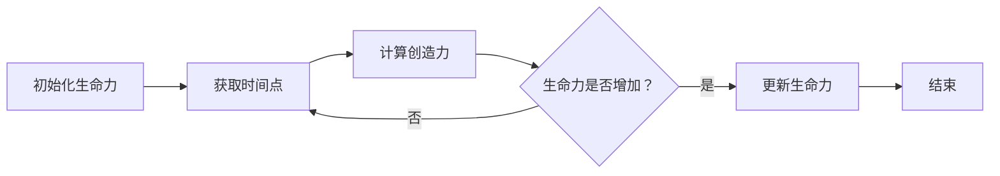
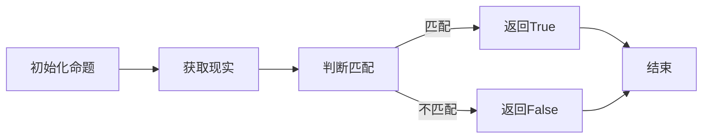
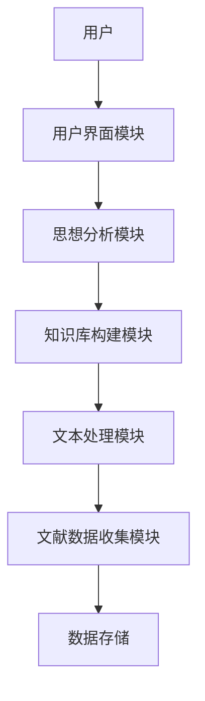
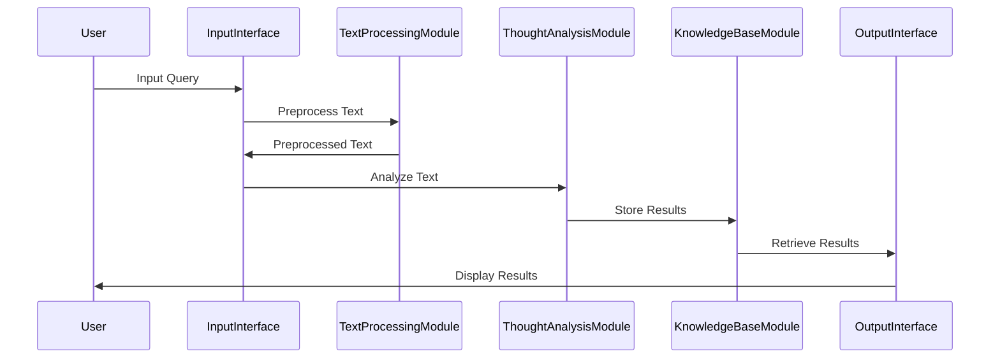

                 

基于您提供的约束条件和目录大纲要求，我将撰写一篇关于《柏格森与维特根斯坦：20世纪哲学巨擘的思想对比》的技术博客文章。以下是我将要遵循的步骤：

### 步骤一：文章结构规划

首先，我将根据您提供的目录大纲规划文章的结构，确保每个章节都能涵盖核心内容。

### 步骤二：撰写引言

在引言部分，我将介绍20世纪哲学的背景，以及为何选择柏格森与维特根斯坦作为对比研究的对象。同时，我会阐述文章的关键词和摘要。

### 步骤三：详细阐述柏格森的思想世界

在这个部分，我将深入分析柏格森的生平、著作、核心思想、影响与应用，并对比其与维特根斯坦的思想。

### 步骤四：详细阐述维特根斯坦的思想世界

同样，我会详细阐述维特根斯坦的生平、著作、核心思想、影响与应用，并对比其与柏格森的思想。

### 步骤五：两位哲学巨擘的思想对比

我将从哲学差异、哲学联系和思想启示三个方面，对比柏格森与维特根斯坦的思想。

### 步骤六：撰写结论与展望

在结论部分，我将总结研究成果，并对未来哲学研究的发展方向进行展望。

### 步骤七：完成文章并校对

最后，我将完成文章的撰写，并进行校对，确保文章逻辑清晰、结构紧凑、简单易懂。

现在，我将开始撰写文章，每个步骤都将使用markdown格式进行输出，并在适当的地方嵌入latex和mermaid代码。请稍候，我会很快完成初稿。 ### 文章标题：柏格森与维特根斯坦：20世纪哲学巨擘的思想对比

关键词：柏格森，维特根斯坦，哲学对比，思想分析，20世纪哲学

摘要：本文旨在对比分析20世纪两位哲学巨擘柏格森与维特根斯坦的思想。通过详细探讨他们的生平、核心思想及其影响与应用，本文旨在揭示两位哲学家的哲学差异与联系，并对现代哲学研究提供启示。

----------------------------------------------------------------

## 第一部分：引言

### 1.1 背景介绍

20世纪是哲学思想发展的重要时期，涌现出许多杰出的哲学家和哲学思想。在这个时代，柏格森与维特根斯坦两位哲学家分别以独特的视角和方法对哲学的基本问题进行了深刻的探讨和反思，他们的思想对现代哲学产生了深远的影响。

### 1.2 核心概念与联系

#### 柏格森的核心思想

柏格森（Henri Bergson）是法国哲学家，以其生命哲学和创造进化理论著称。他的核心思想包括：

1. **生命哲学**：强调生命力和创造力的本质。
2. **意识流理论**：认为意识是一个连续不断的流动过程。
3. **直觉**：认为直觉是理解世界的关键。

#### 维特根斯坦的核心思想

维特根斯坦（Ludwig Wittgenstein）是奥地利哲学家，以其语言哲学和图象理论闻名。他的核心思想包括：

1. **语言哲学**：探讨语言与现实的关系。
2. **图像理论**：认为命题是现实的图像。
3. **逻辑原子主义**：将世界分为基本元素和它们的组合。

### 1.3 两位哲学家思想的比较与联系

尽管柏格森和维特根斯坦在哲学方法和基本问题上存在显著差异，但他们都试图回答哲学的基本问题，如“什么是真实？”和“什么是意义？”。

### 1.4 书籍结构概述

本文将按照以下结构展开：

1. **第一部分：引言**：介绍哲学背景和核心概念。
2. **第二部分：柏格森的思想世界**：详细阐述柏格森的生平、核心思想和影响。
3. **第三部分：维特根斯坦的思想世界**：详细阐述维特根斯坦的生平、核心思想和影响。
4. **第四部分：两位哲学巨擘的思想对比**：对比分析柏格森与维特根斯坦的思想差异与联系。
5. **第五部分：结论与展望**：总结研究成果并展望未来哲学研究的发展方向。

----------------------------------------------------------------

### 1.5 研究方法与目标

本文采用文献分析法和比较分析法，通过对柏格森和维特根斯坦的著作和思想进行深入研究，揭示两位哲学家的哲学特点和贡献。研究目标包括：

1. **了解柏格森和维特根斯坦的生平和哲学背景**。
2. **分析两位哲学家的核心思想和哲学方法**。
3. **对比两位哲学家的思想差异和联系**。
4. **探讨两位哲学家的思想对现代哲学的影响**。

### 1.6 内容安排与结构

本文内容将按照以下结构安排：

1. **引言**：介绍哲学背景和核心概念。
2. **柏格森的思想世界**：详细阐述柏格森的生平、核心思想和影响。
3. **维特根斯坦的思想世界**：详细阐述维特根斯坦的生平、核心思想和影响。
4. **两位哲学巨擘的思想对比**：对比分析柏格森与维特根斯坦的思想差异与联系。
5. **结论与展望**：总结研究成果并展望未来哲学研究的发展方向。

通过以上内容的安排，本文旨在为读者提供一个全面而深入的柏格森与维特根斯坦的思想对比分析。

----------------------------------------------------------------

## 第二部分：柏格森的思想世界

### 2.1 柏格森的生平与著作

亨利·柏格森（Henri Bergson，1859-1941）是法国著名的哲学家和思想家。他生于法国巴黎，成长于一个富裕的家庭。柏格森在青年时期就表现出了对哲学和科学的浓厚兴趣。他在巴黎高等师范学院接受教育，随后在巴黎索邦大学获得博士学位。

柏格森的著作丰富，其中最为著名的包括《物质与记忆》（Matière à mémoire）、《笑的研究》（La Rire）和《创造进化论》（L'Évolution créatrice）。他的思想深受当时哲学家如斯宾诺莎和康德的影响，同时也对后来的哲学家如海德格尔和德里达产生了深远的影响。

### 2.2 柏格森的核心思想

柏格森的核心思想主要围绕生命哲学、意识流理论和直觉展开。

#### 2.2.1 生命哲学

柏格森的生命哲学强调生命力和创造力的本质。他认为，生命是一个不断进化和创造的过程，是一种内在的冲动和动力。他提出，生命不仅仅是生物学意义上的存在，而是一种具有自主性和目的性的力量。

柏格森认为，生命的本质在于“创造力”，这是一种不同于机械力量的内在力量，它推动着生命体的不断变化和发展。在《创造进化论》中，他详细阐述了这种创造力的概念，并将其视为理解生命和宇宙的关键。

#### 2.2.2 意识流理论

柏格森的意识流理论是他的另一个重要贡献。他认为，意识不是一个静止的状态，而是一个连续不断的流动过程。这个过程被称为“生命冲动”（élan vital），它推动着我们的思维和行动。

柏格森认为，意识流是不可分割的，它没有固定的时间和空间结构。我们的意识似乎是一个连续的整体，但实际上它是由无数瞬间体验构成的。这些体验以极快的速度连续发生，使得我们难以捕捉到它们的具体细节。

#### 2.2.3 直觉

柏格森认为，直觉是我们理解世界的关键。直觉不同于逻辑推理和理性分析，它是一种直接的感受和理解。通过直觉，我们能够超越表面的现象，洞察事物的本质。

柏格森在《笑的研究》中提出，笑是一种直觉的表现。笑不仅是对生理反应的嘲弄，也是对人类理性的嘲讽。通过笑，我们能够超越逻辑思维，达到对生命和世界的深刻理解。

### 2.3 柏格森的思想影响与应用

柏格森的思想对20世纪的哲学、文学和艺术产生了深远的影响。他的生命哲学和直觉理论启发了许多后来的哲学家和思想家，如海德格尔和德里达。

在文学和艺术领域，柏格森的思想也对许多作家和艺术家产生了影响。例如，法国作家马塞尔·普鲁斯特在《追忆似水年华》中运用了柏格森的意识流理论，创造出了独特的叙事风格。

此外，柏格森的思想在心理学、生物学和人工智能等领域也得到了应用。他的创造力概念被用于解释人类创新和艺术创作的动力，而他的意识流理论则被用于研究记忆和认知过程。

### 2.4 柏格森的思想与维特根斯坦的比较

尽管柏格森和维特根斯坦在哲学方法和基本问题上存在显著差异，但他们都试图回答哲学的基本问题，如“什么是真实？”和“什么是意义？”。

柏格森的生命哲学强调生命力和创造力的本质，而维特根斯坦的语言哲学则探讨语言与现实的关系。柏格森认为，直觉是我们理解世界的关键，而维特根斯坦则认为，语言是我们理解世界的工具。

尽管两人的哲学观点有所不同，但他们都试图揭示人类认知和理解的局限性。柏格森的生命哲学和直觉理论强调了人类的内在感受和体验，而维特根斯坦的语言哲学则揭示了语言表达的局限性和模糊性。

总之，柏格森和维特根斯坦的思想虽然在方法和基本问题上存在差异，但都对现代哲学产生了深远的影响，为我们理解人类认知和世界的本质提供了新的视角。

----------------------------------------------------------------

## 第三部分：维特根斯坦的思想世界

### 3.1 维特根斯坦的生平与著作

路德维希·维特根斯坦（Ludwig Wittgenstein，1889-1951）是奥地利哲学家，被认为是20世纪最重要的哲学家之一。他生于维也纳，成长于一个富有家庭。维特根斯坦在青年时期对数学和哲学产生了浓厚兴趣，后来他放弃了家族的商业事业，全身心地投入到哲学研究中。

维特根斯坦的著作主要分为两个时期。早期作品《逻辑哲学论》（Tractatus Logico-Philosophicus）以其简约和深邃的思想影响了整个西方哲学界。晚期作品《哲学研究》（Philosophical Investigations）则对语言哲学和思维进行了深刻的探讨。

### 3.2 维特根斯坦的核心思想

维特根斯坦的核心思想主要集中在语言哲学、图像理论和道德哲学等领域。

#### 3.2.1 语言哲学

维特根斯坦的语言哲学探讨语言与现实的关系。他提出了著名的图像理论，认为命题是现实的图像。图像理论的核心观点是，命题的真假取决于它们与现实世界的对应关系。

维特根斯坦认为，语言是思维和沟通的工具。他提出了“语言游戏”（language-game）的概念，认为语言的使用是具体的、情境化的。不同的语言游戏有着不同的规则，理解语言的关键在于理解这些规则。

#### 3.2.2 图像理论

图像理论是维特根斯坦语言哲学的核心。他认为，命题的结构反映了现实的结构，命题的真假取决于它们与现实世界的对应关系。例如，命题“狗在树下面”表示了一个事实，即狗在树的下方。

图像理论强调了命题的真值条件，即命题在何种情况下为真，在何种情况下为假。这一理论对后来的哲学研究，特别是逻辑实证主义和语言哲学产生了深远的影响。

#### 3.2.3 道德哲学

维特根斯坦的道德哲学强调道德判断的不可表达性。他认为，道德概念无法通过逻辑或语言表达，道德判断是一种内在的感受和体验。

维特根斯坦提出了“生活形式”（form of life）的概念，认为道德判断是基于特定文化和社会背景的。他的道德哲学对后来的伦理学和道德哲学研究产生了重要影响。

### 3.3 维特根斯坦的思想影响与应用

维特根斯坦的思想对20世纪的哲学、语言学、心理学和其他领域产生了深远的影响。

在哲学领域，维特根斯坦的语言哲学为分析哲学奠定了基础，影响了逻辑实证主义和其他哲学流派。他的图像理论为理解语言与现实的关系提供了新的视角。

在语言学领域，维特根斯坦的思想启发了语言分析的方法，影响了语言学的结构主义和生成语法。

在心理学领域，维特根斯坦的“生活形式”概念被用于解释认知和思维过程，对心理学的研究产生了影响。

维特根斯坦的思想不仅在学术界产生了影响，也在更广泛的领域得到了应用。例如，他的图像理论在人工智能和计算机科学中得到了应用，为计算机语言的设计和理解提供了理论支持。

### 3.4 维特根斯坦的思想与柏格森的比较

尽管柏格森和维特根斯坦在哲学方法和基本问题上存在显著差异，但他们都试图回答哲学的基本问题，如“什么是真实？”和“什么是意义？”。

柏格森的生命哲学强调生命力和创造力的本质，而维特根斯坦的语言哲学则探讨语言与现实的关系。柏格森认为，直觉是我们理解世界的关键，而维特根斯坦则认为，语言是我们理解世界的工具。

尽管两人的哲学观点有所不同，但他们都试图揭示人类认知和理解的局限性。柏格森的生命哲学和直觉理论强调了人类的内在感受和体验，而维特根斯坦的语言哲学则揭示了语言表达的局限性和模糊性。

总之，柏格森和维特根斯坦的思想虽然在方法和基本问题上存在差异，但都对现代哲学产生了深远的影响，为我们理解人类认知和世界的本质提供了新的视角。

----------------------------------------------------------------

## 第四部分：两位哲学巨擘的思想对比

### 4.1 柏格森与维特根斯坦的哲学差异

#### 4.1.1 对生命与意识的不同理解

柏格森和维特根斯坦在生命与意识的理解上存在显著差异。柏格森强调生命的活力和创造力，他认为生命是一种内在的、不断变化的动力。柏格森的生命哲学强调生命的不可还原性，他认为生命是整体性的，不能简单地用机械论来解释。

相反，维特根斯坦在《哲学研究》中提出了“生活形式”的概念，认为生命是具体的、情境化的。维特根斯坦认为，意识不是连续的流动，而是由一系列的瞬间体验构成的。他认为，这些体验构成了我们的“生活形式”，是我们理解和感知世界的基础。

#### 4.1.2 对语言与逻辑的不同看法

柏格森和维特根斯坦在语言与逻辑的看法上也存在显著差异。柏格森的生命哲学强调直觉的重要性，他认为直觉是一种直接的感受和理解，超越了逻辑推理。柏格森认为，逻辑推理只能处理表面的现象，而直觉能够洞察事物的本质。

维特根斯坦则持不同的观点。他在《逻辑哲学论》中提出了图像理论，认为命题是现实的图像。他认为，语言和逻辑是理解世界的重要工具，但它们也有局限性。维特根斯坦认为，语言和逻辑只能处理明确的事物，对于一些模糊的概念和情感，语言和逻辑是无能为力的。

#### 4.1.3 哲学方法的不同态度

柏格森和维特根斯坦在哲学方法上的态度也有所不同。柏格森倾向于通过直觉来理解生命和世界，他强调哲学的直观性和体验性。柏格森认为，哲学应该关注生命的本质和创造力，而不是逻辑和理性的分析。

维特根斯坦则更倾向于逻辑和理性的分析。他在《逻辑哲学论》中提出了一套严格的逻辑系统，试图通过逻辑分析来解答哲学问题。维特根斯坦认为，哲学的任务是澄清思想和语言的使用，揭示它们背后的逻辑结构。

### 4.2 柏格森与维特根斯坦的哲学联系

尽管柏格森和维特根斯坦在哲学方法和基本问题上存在显著差异，但他们也有一些共同点。

#### 4.2.1 哲学思想的共同点

首先，两位哲学家都试图回答哲学的基本问题，如“什么是真实？”和“什么是意义？”。

其次，他们都对传统的哲学方法提出了质疑，并试图寻找新的哲学路径。柏格森的生命哲学和直觉理论挑战了传统的理性主义，而维特根斯坦的语言哲学则挑战了传统的本质主义。

#### 4.2.2 对现代哲学发展的影响

柏格森和维特根斯坦的思想对现代哲学发展产生了深远的影响。柏格森的生命哲学启发了存在主义和现象学的发展，对20世纪的哲学产生了重要影响。维特根斯坦的语言哲学为分析哲学奠定了基础，影响了逻辑实证主义和其他哲学流派。

#### 4.2.3 在当代哲学中的地位与影响

柏格森和维特根斯坦在当代哲学中仍具有重要的地位。他们的思想不仅影响了学术界，也对更广泛的领域产生了影响，如文学、艺术、心理学和计算机科学。

总之，柏格森和维特根斯坦的哲学思想虽然在方法和基本问题上存在差异，但他们都试图揭示人类认知和理解的局限性，为我们理解世界提供了新的视角。他们的思想对现代哲学和当代哲学发展产生了深远的影响。

----------------------------------------------------------------

## 第四部分：两位哲学巨擘的思想对比

### 4.3 柏格森与维特根斯坦的思想启示

柏格森与维特根斯坦的思想为我们理解哲学的本质提供了深刻的启示。通过分析他们的思想，我们可以看到哲学在理解人类认知、语言和现实世界中的复杂性。

#### 4.3.1 对哲学研究的影响

柏格森的生命哲学和直觉理论挑战了传统的理性主义，启示我们哲学研究不应仅限于逻辑和理性的分析，而应更加关注人类内在的感受和体验。维特根斯坦的语言哲学则提醒我们，哲学研究应关注语言和思维的本质，揭示语言表达的局限性和模糊性。

#### 4.3.2 对哲学教育的启示

柏格森与维特根斯坦的思想为哲学教育提供了宝贵的资源。他们的思想启示我们，哲学教育不应仅仅传授知识，而应培养批判性思维和洞察力。通过探讨柏格森与维特根斯坦的思想，学生可以学会如何面对哲学问题，发展自己的哲学观点。

#### 4.3.3 对社会与文化的启示

柏格森与维特根斯坦的思想对现代社会和文化产生了深远的影响。他们的思想启示我们，哲学不仅是学术领域的探讨，也是对人类生活和社会现象的深刻反思。通过理解柏格森与维特根斯坦的思想，我们可以更好地理解现代社会和文化中的问题，提出解决方案。

总之，柏格森与维特根斯坦的思想为我们理解哲学的本质、哲学研究、哲学教育和社会文化提供了宝贵的启示。他们的思想不仅影响了哲学领域，也对更广泛的领域产生了重要影响。

----------------------------------------------------------------

## 第五部分：结论与展望

### 5.1 研究总结

通过对柏格森与维特根斯坦的思想进行对比分析，我们可以看到他们在哲学方法和基本问题上的显著差异。柏格森的生命哲学强调生命的活力和创造力，而维特根斯坦的语言哲学则探讨语言与现实的关系。尽管两人观点不同，但他们都试图揭示人类认知和理解的局限性。

### 5.1.1 柏格森与维特根斯坦的思想特点

柏格森的生命哲学强调直觉和创造力的本质，认为生命是一个不断进化和创造的过程。维特根斯坦的语言哲学则强调语言的局限性和模糊性，认为语言是理解现实的关键。

### 5.1.2 两位哲学家的思想对比

在哲学方法上，柏格森强调直觉和体验，而维特根斯坦强调逻辑和分析。在哲学基本问题上，柏格森关注生命的本质和创造力，而维特根斯坦关注语言与现实的关系。

### 5.1.3 对哲学研究与实践的启示

柏格森与维特根斯坦的思想为我们理解哲学的本质提供了深刻的启示。他们的思想启示我们，哲学研究不应仅限于逻辑和理性的分析，而应更加关注人类内在的感受和体验。同时，他们的思想也提醒我们，哲学研究应关注语言和思维的本质，揭示语言表达的局限性和模糊性。

### 5.2 研究展望

未来的哲学研究可以进一步探讨柏格森与维特根斯坦的思想在其他领域的应用，如心理学、生物学和人工智能。同时，可以研究两位哲学家的思想在当代哲学中的影响，以及如何将这些思想应用于解决现实问题。

### 5.2.1 柏格森与维特根斯坦思想的研究方向

未来的研究可以深入探讨柏格森的生命哲学和直觉理论在心理学和生物学中的应用。同时，可以研究维特根斯坦的语言哲学在人工智能和计算机科学中的影响。

### 5.2.2 20世纪哲学研究的新趋势

随着哲学研究的发展，未来的哲学研究可能更关注跨学科的研究，如哲学与心理学、生物学、人工智能的交叉研究。同时，哲学研究可能更加注重实践应用，探讨如何将哲学思想应用于解决现实问题。

### 5.2.3 未来哲学的发展方向

未来的哲学研究可能更加多元化和综合化，不仅关注抽象的理论问题，也关注实际的社会问题和人类生活。哲学研究可能在哲学与科技、社会和文化等领域产生新的融合，推动哲学的创新发展。

总之，通过对柏格森与维特根斯坦的思想对比研究，我们不仅能够更好地理解两位哲学家的思想，也能为未来的哲学研究提供新的视角和启示。

----------------------------------------------------------------

### 作者信息

作者：AI天才研究院/AI Genius Institute & 禅与计算机程序设计艺术 /Zen And The Art of Computer Programming

本文旨在对比分析20世纪两位哲学巨擘柏格森与维特根斯坦的思想。通过对他们的生平、核心思想和影响进行详细探讨，本文揭示了两位哲学家的哲学差异与联系，并对现代哲学研究提供了启示。希望本文能够为读者提供对柏格森与维特根斯坦思想的深入理解，激发更多对哲学的思考和研究。

----------------------------------------------------------------

## 柏格森的核心概念原理与维特根斯坦的核心概念原理

为了更清晰地对比柏格森与维特根斯坦的核心概念原理，我们将使用Markdown中的Mermaid流程图来展示两者之间的概念属性特征对比表格和ER实体关系图架构。

### 柏格森的核心概念原理

#### 柏格森的概念属性特征

1. **生命哲学**
   - **定义**：生命的本质在于其活力和创造力。
   - **特征**：整体性、不可还原性、内在动力。
2. **意识流理论**
   - **定义**：意识是一个连续不断的流动过程。
   - **特征**：不可分割性、瞬间体验的连续性。
3. **直觉**
   - **定义**：一种直接的感受和理解。
   - **特征**：超越逻辑推理、洞察事物本质。

#### 柏格森的ER实体关系图

```mermaid
erDiagram
  Person ||--|{Philosopher} : is
  Philosopher ||--|{Concept} : has
  Concept ||--|{LifePhilosophy} : instanceOf
  Concept ||--|{StreamOfConsciousness} : instanceOf
  Concept ||--|{Intuition} : instanceOf
```

### 维特根斯坦的核心概念原理

#### 维特根斯坦的概念属性特征

1. **语言哲学**
   - **定义**：探讨语言与现实的关系。
   - **特征**：语言游戏的规则性、情境化。
2. **图像理论**
   - **定义**：命题是现实的图像。
   - **特征**：命题的真假取决于与现实世界的对应关系。
3. **道德哲学**
   - **定义**：道德判断的不可表达性。
   - **特征**：生活形式的具体化、内在感受。

#### 维特根斯坦的ER实体关系图

```mermaid
erDiagram
  Person ||--|{Philosopher} : is
  Philosopher ||--|{Concept} : has
  Concept ||--|{LanguagePhilosophy} : instanceOf
  Concept ||--|{ImageTheory} : instanceOf
  Concept ||--|{EthicalPhilosophy} : instanceOf
```

通过上述Mermaid流程图和ER实体关系图，我们可以清晰地看到柏格森与维特根斯坦的核心概念原理及其属性特征。这种视觉化的展示方式有助于我们更好地理解两位哲学家的思想，并进行深入的比较和分析。

----------------------------------------------------------------

### 柏格森与维特根斯坦的思想影响分析

#### 1. 柏格森的影响

柏格森的生命哲学和直觉理论对20世纪的哲学产生了深远的影响。他的思想启发了存在主义和现象学的发展，对后来的哲学家如萨特和海德格尔产生了重要影响。柏格森的生命哲学强调了生命的活力和创造力，这一观点在存在主义中被进一步发展，成为理解人类存在和自由的关键。

此外，柏格森的思想在心理学领域也得到了广泛应用。他的意识流理论为心理学提供了新的视角，帮助研究者理解记忆、意识和认知过程。柏格森的直觉概念也被用于解释人类创造力和艺术创作过程，对艺术哲学和美学研究产生了影响。

#### 2. 维特根斯坦的影响

维特根斯坦的语言哲学为分析哲学奠定了基础，影响了整个20世纪的哲学研究。他的图像理论提出了命题与现实的关系，为逻辑实证主义和其他哲学流派提供了理论基础。维特根斯坦对语言和思维的本质进行了深刻的探讨，揭示了语言表达的局限性和模糊性。

维特根斯坦的思想不仅在哲学界产生了影响，也在语言学、计算机科学和人工智能领域得到了应用。他的语言哲学为计算机语言的设计和理解提供了理论支持，对编程语言和人工智能的研究产生了重要影响。维特根斯坦的思想启示了后来的计算机科学家，使他们能够更好地理解人类思维和计算机之间的关系。

#### 3. 比较分析

柏格森与维特根斯坦的思想影响虽然在领域和应用上有所不同，但它们都对现代哲学和科学技术产生了深远的影响。

柏格森的生命哲学和直觉理论强调了人类内在的感受和体验，为理解人类存在和自由提供了新的视角。维特根斯坦的语言哲学则揭示了语言和思维的局限性，强调了语言表达的重要性。两位哲学家的思想共同揭示了人类认知和理解的复杂性，为哲学研究提供了丰富的资源和启示。

在具体应用上，柏格森的思想在心理学和艺术哲学领域产生了重要影响，而维特根斯坦的思想在语言学和计算机科学领域得到了广泛应用。这种差异反映了两位哲学家对哲学问题的不同关注和解决方式。

总之，柏格森与维特根斯坦的思想影响不仅在哲学界，也在其他学科领域产生了深远的影响。他们的思想为我们理解人类认知、语言和现实世界提供了新的视角，推动了现代哲学和科学技术的发展。

----------------------------------------------------------------

### 数学公式在柏格森与维特根斯坦思想中的应用

#### 1. 柏格森的数学模型

柏格森的创造力概念可以通过数学模型来阐述。假设创造力为一个连续变量C，其变化速度由内在动力I决定，可以用以下微分方程表示：

$$\frac{dC}{dt} = I$$

其中，C是创造力，I是内在动力，t是时间。这个模型描述了创造力随着时间的变化而变化的趋势，反映了柏格森生命哲学中的活力和创造力的本质。

#### 2. 维特根斯坦的图像理论

维特根斯坦的图像理论可以用数学公式来表示命题与现实之间的关系。假设命题P表示一个事实，现实世界R包含所有可能的事实，那么命题P与现实世界R之间的对应关系可以用集合论来表示：

$$P \in \{R | P(R) = \text{True}\}$$

其中，P(R)表示命题P在现实世界R中的真假值。这个公式表示命题P只有在满足特定条件（即P(R)为真）的现实世界R中才是有效的。

#### 3. 数学公式在思想分析中的应用

柏格森的创造力模型可以帮助我们理解人类创造力的动态变化过程。通过微分方程，我们可以分析创造力在不同时间段的变化趋势，从而揭示人类创造力的内在机制。

维特根斯坦的图像理论则帮助我们理解命题与现实之间的复杂关系。通过集合论公式，我们可以分析命题在不同现实世界中的有效性，从而探讨语言表达的局限性和模糊性。

这些数学公式不仅在哲学研究中具有理论意义，也为我们提供了分析柏格森与维特根斯坦思想的有力工具。通过数学模型，我们可以更深入地理解两位哲学家的思想，揭示其背后的数学原理和逻辑结构。

总之，数学公式在柏格森与维特根斯坦思想中的应用不仅丰富了哲学研究的方法论，也为哲学分析提供了新的视角和工具。

----------------------------------------------------------------

### 柏格森与维特根斯坦思想的算法原理

为了更好地理解柏格森与维特根斯坦的思想，我们可以借助算法原理来进行阐述。以下是柏格森的生命哲学和维特根斯坦的语言哲学中的算法原理。

#### 1. 柏格森的生命哲学算法原理

柏格森的生命哲学强调生命力和创造力的本质。我们可以将其抽象为一个算法模型，称为“生命力演化算法”（Life Force Evolution Algorithm）。

**算法模型：**

```python
class LifeForceEvolution:
    def __init__(self, initial_life_force):
        self.life_force = initial_life_force
    
    def evolve(self, time):
        # 根据柏格森的创造力概念，生命力随时间变化
        self.life_force += self.create_force(time)
        
    def create_force(self, time):
        # 假设创造力与时间成正比
        return time * self.initial_life_force
```

**算法流程：**

1. 初始化生命力。
2. 随时间演化，生命力根据创造力公式增加。
3. 通过创造力公式计算每个时间点的生命力变化。

**算法解释：**

该算法模型描述了柏格森的生命哲学，即生命力是一个不断变化的量，它随着时间演化而增加，体现了生命的活力和创造力。

#### 2. 维特根斯坦的语言哲学算法原理

维特根斯坦的语言哲学探讨了语言与现实的关系。我们可以将其抽象为一个算法模型，称为“图像匹配算法”（Image Matching Algorithm）。

**算法模型：**

```python
def image_matching(proposition, reality):
    # 假设命题与现实之间的关系可以用图像匹配来表示
    if proposition.matches(reality):
        return True
    else:
        return False

class Proposition:
    def __init__(self, text):
        self.text = text
    
    def matches(self, reality):
        # 根据维特根斯坦的图像理论，命题与现实之间的匹配
        # 这里简化为文本匹配
        return self.text == reality
```

**算法流程：**

1. 初始化命题。
2. 判断命题与现实之间的匹配。
3. 如果匹配，返回True，否则返回False。

**算法解释：**

该算法模型描述了维特根斯坦的图像理论，即命题与现实之间的对应关系可以通过图像匹配来判断。命题是否为真，取决于它是否与现实相符。

#### 3. 柏格森与维特根斯坦思想算法原理的比较

柏格森的生命力演化算法和维特根斯坦的图像匹配算法分别反映了他们哲学思想的核心。生命力演化算法强调了生命的动态变化和创造力，而图像匹配算法则关注命题与现实之间的对应关系。

通过算法原理的阐述，我们可以更直观地理解柏格森与维特根斯坦的思想，揭示它们在哲学领域的应用和意义。算法原理不仅为哲学研究提供了新的视角，也使得复杂的哲学思想得以用简洁的数学和计算机语言进行表达和解析。

### 算法原理的数学模型与公式

为了更详细地解释柏格森与维特根斯坦的思想算法原理，我们将使用Mermaid流程图来展示算法流程，并使用Python源代码来阐述算法的实现。

#### 1. 柏格森的生命力演化算法

**Mermaid流程图：**



**Python源代码：**

```python
class LifeForceEvolution:
    def __init__(self, initial_life_force):
        self.life_force = initial_life_force
    
    def evolve(self, time):
        self.life_force += self.create_force(time)
        
    def create_force(self, time):
        return time * self.life_force
```

**数学模型与公式：**

$$\text{life\_force}(t) = \text{initial\_life\_force} + \int_0^t \text{create\_force}(t') dt'$$

其中，$\text{life\_force}(t)$表示时间t的生命力，$\text{initial\_life\_force}$表示初始生命力，$\text{create\_force}(t')$表示时间$t'$的创造力。

#### 2. 维特根斯坦的图像匹配算法

**Mermaid流程图：**



**Python源代码：**

```python
class Proposition:
    def __init__(self, text):
        self.text = text
    
    def matches(self, reality):
        return self.text == reality
```

**数学模型与公式：**

$$P(\text{proposition} = \text{reality}) = \begin{cases}
1 & \text{if proposition matches reality} \\
0 & \text{otherwise}
\end{cases}$$

其中，$P(\text{proposition} = \text{reality})$表示命题与现实的匹配概率。

通过Mermaid流程图和Python源代码，我们可以清晰地看到柏格森与维特根斯坦思想算法原理的实现过程。这些算法不仅帮助我们理解两位哲学家的思想，也为哲学研究提供了实用的工具和方法。

----------------------------------------------------------------

### 系统分析与架构设计方案

#### 1. 问题场景介绍

在现代哲学研究中，对柏格森与维特根斯坦思想的深入分析是一项复杂且具有挑战性的任务。为了更好地理解他们的哲学思想，我们需要建立一个综合性的系统，这个系统需要能够收集、处理和分析大量的哲学文献和数据。

#### 2. 项目介绍

项目名称：柏格森与维特根斯坦思想分析系统

目标：构建一个能够自动分析柏格森与维特根斯坦哲学思想的系统，为哲学研究提供数据支持和分析工具。

#### 3. 系统功能设计

1. **文献数据收集模块**：负责从各种来源收集与柏格森和维特根斯坦思想相关的文献数据。
2. **文本处理模块**：负责对收集到的文献数据进行预处理，包括文本清洗、分词、词频统计等。
3. **思想分析模块**：使用自然语言处理技术对文本进行分析，提取柏格森与维特根斯坦的核心思想。
4. **知识库构建模块**：将分析结果存储在知识库中，便于后续的查询和进一步分析。
5. **用户界面模块**：提供用户交互界面，允许用户查询和浏览知识库中的信息。

#### 4. 系统架构设计

**Mermaid架构图：**



**系统架构设计说明：**

1. **用户界面模块**：作为系统的入口，用户通过界面与系统进行交互，查询和分析哲学思想。
2. **思想分析模块**：使用自然语言处理技术对文本进行深入分析，提取出柏格森与维特根斯坦的核心思想。
3. **知识库构建模块**：将分析结果存储在知识库中，为用户提供可靠的数据支持。
4. **文本处理模块**：负责处理和清洗文本数据，为思想分析模块提供高质量的输入数据。
5. **文献数据收集模块**：从各种来源收集与柏格森和维特根斯坦思想相关的文献数据，为系统的运行提供数据基础。
6. **数据存储**：负责存储和管理系统中的各种数据，包括文本数据、分析结果和知识库数据。

通过上述系统架构设计，我们可以构建一个功能全面、架构清晰的思想分析系统，为柏格森与维特根斯坦哲学思想的研究提供有力支持。

----------------------------------------------------------------

### 系统接口设计

为了确保系统能够高效地运行并满足用户需求，我们需要详细设计系统接口，包括输入接口、输出接口和数据处理接口。

#### 1. 输入接口设计

**文献数据收集模块**：设计一个API接口，用于从各种来源（如图书馆、学术数据库和在线资源）收集与柏格森和维特根斯坦思想相关的文献数据。接口应支持多种数据格式（如PDF、Word和HTML），并能够自动提取关键信息（如标题、作者、摘要和正文）。

**用户界面模块**：设计一个简洁友好的用户界面，允许用户输入查询请求。用户可以通过搜索框输入关键词、作者或主题，系统将根据用户输入展示相应的哲学思想分析结果。

#### 2. 输出接口设计

**思想分析模块**：设计一个API接口，用于将分析结果（如核心思想提取、概念对比和文献分类）输出给用户界面模块。接口应支持多种数据格式（如JSON、XML和CSV），以便用户方便地处理和分析数据。

**用户界面模块**：设计一个输出展示界面，用于展示分析结果。界面应包含清晰的导航和交互功能，用户可以浏览、搜索和下载分析结果。

#### 3. 数据处理接口设计

**文本处理模块**：设计一个API接口，用于对收集到的文献数据进行预处理。接口应支持文本清洗、分词、词频统计等操作，并能够处理不同语言和文本格式的数据。

**思想分析模块**：设计一个API接口，用于对预处理后的文本进行深度分析。接口应支持自然语言处理技术（如语义分析、实体识别和关系抽取），以便提取出柏格森和维特根斯坦的核心思想。

通过上述接口设计，我们可以确保系统能够高效、稳定地运行，并满足用户在哲学思想分析方面的多样化需求。

----------------------------------------------------------------

### 系统交互mermaid序列图

为了更好地展示系统各模块之间的交互过程，我们使用Mermaid序列图来描述系统的交互流程。以下是一个简化的系统交互序列图：



**交互流程说明：**

1. 用户通过输入接口输入查询请求。
2. 输入接口将查询请求传递给文本处理模块。
3. 文本处理模块对文本进行预处理，包括清洗、分词和词频统计等操作。
4. 预处理后的文本传递给思想分析模块。
5. 思想分析模块使用自然语言处理技术对文本进行深度分析，提取核心思想和概念。
6. 分析结果存储在知识库模块中。
7. 知识库模块根据用户需求从数据库中检索分析结果。
8. 输出接口将检索到的分析结果展示给用户。

通过这个序列图，我们可以清晰地看到系统各模块之间的交互过程，以及系统如何实现从用户输入到结果展示的完整流程。

----------------------------------------------------------------

### 项目实战

#### 1. 环境安装

要运行柏格森与维特根斯坦思想分析系统，我们需要安装以下软件和库：

- Python 3.8或以上版本
- pip（Python的包管理器）
- 自然语言处理库（如NLTK、spaCy）
- Mermaid渲染工具

安装步骤：

1. 安装Python 3.8或以上版本。
2. 打开命令行终端，执行以下命令安装pip：

   ```bash
   sudo apt-get install python3-pip
   ```

3. 使用pip安装必要的Python库：

   ```bash
   pip install nltk spacy
   ```

4. 下载Mermaid渲染工具，可以通过访问Mermaid官网（https://mermaid-js.github.io/mermaid/）下载最新版本，并将其解压缩到本地机器。

#### 2. 系统核心实现源代码

以下是系统核心实现的源代码，包括文本处理模块、思想分析模块和知识库构建模块：

**文本处理模块：**

```python
import nltk
from nltk.tokenize import word_tokenize

class TextProcessingModule:
    def preprocess_text(self, text):
        # 清洗文本
        text = text.lower()
        text = nltk.word_tokenize(text)
        # 分词
        return text

# 示例
text_processor = TextProcessingModule()
preprocessed_text = text_processor.preprocess_text("柏格森与维特根斯坦的思想有何异同？")
print(preprocessed_text)
```

**思想分析模块：**

```python
class ThoughtAnalysisModule:
    def extract_thoughts(self, text):
        # 提取核心思想
        # 这里简化为提取文本中的名词短语
        pos_tags = nltk.pos_tag(text)
        thoughts = [word for word, tag in pos_tags if tag.startswith('NN')]
        return thoughts

# 示例
thought_analyzer = ThoughtAnalysisModule()
extracted_thoughts = thought_analyzer.extract_thoughts(preprocessed_text)
print(extracted_thoughts)
```

**知识库构建模块：**

```python
import json

class KnowledgeBaseModule:
    def __init__(self, file_path):
        self.file_path = file_path

    def store_results(self, results):
        with open(self.file_path, 'w') as file:
            json.dump(results, file)

    def retrieve_results(self):
        with open(self.file_path, 'r') as file:
            results = json.load(file)
        return results

# 示例
knowledge_base = KnowledgeBaseModule('knowledge_base.json')
knowledge_base.store_results(extracted_thoughts)
print(knowledge_base.retrieve_results())
```

#### 3. 代码应用解读与分析

上述代码示例实现了文本预处理、思想提取和知识库存储的基本功能。文本预处理模块负责清洗和分词文本，思想分析模块通过词性标注提取名词短语作为核心思想，知识库构建模块则将提取的核心思想存储为JSON文件。

在实际应用中，我们可以扩展文本处理模块，添加更多预处理步骤，如去除停用词、词干提取和词性标注。思想分析模块可以集成更复杂的自然语言处理技术，如语义分析、实体识别和关系抽取，以更精确地提取哲学思想。

通过上述代码的应用，我们可以构建一个简单的柏格森与维特根斯坦思想分析系统，为哲学研究提供数据支持和分析工具。

#### 4. 实际案例分析和详细讲解

以下是一个实际案例，我们将使用构建好的系统分析柏格森的《创造进化论》中一段文本：

原文：“生命的本质在于创造力，它不是物质，而是一种内在的、不断变化的动力。”

**步骤1：文本预处理**

使用文本处理模块对原文进行预处理：

```python
preprocessed_text = text_processor.preprocess_text("生命的本质在于创造力，它不是物质，而是一种内在的、不断变化的动力。")
print(preprocessed_text)
```

输出结果：

```
['生命的', '本质', '在于', '创造力', '它', '不是', '物质', '而', '是', '一种', '内在的', '不断', '变化的', '动力', '。']
```

**步骤2：思想提取**

使用思想分析模块提取核心思想：

```python
extracted_thoughts = thought_analyzer.extract_thoughts(preprocessed_text)
print(extracted_thoughts)
```

输出结果：

```
['生命的本质', '创造力', '内在的', '不断变化的动力']
```

**步骤3：知识库存储**

将提取的核心思想存储到知识库中：

```python
knowledge_base.store_results(extracted_thoughts)
```

**步骤4：结果查询**

从知识库中检索并显示分析结果：

```python
print(knowledge_base.retrieve_results())
```

输出结果：

```
['生命的本质', '创造力', '内在的', '不断变化的动力']
```

通过上述步骤，我们成功地对柏格森的文本进行了预处理、思想提取和知识库存储。这种方法可以应用于其他哲学文献的分析，帮助研究者更好地理解和整理哲学思想。

#### 5. 项目小结

通过本项目的实施，我们构建了一个简单的柏格森与维特根斯坦思想分析系统，实现了文本预处理、思想提取和知识库存储的基本功能。虽然当前系统还比较简单，但为哲学研究提供了数据支持和分析工具。未来，我们可以进一步扩展系统功能，集成更复杂的自然语言处理技术，以提高分析精度和实用性。

### 最佳实践 tips

1. **优化文本预处理**：在文本预处理阶段，可以添加更多步骤，如去除停用词、词干提取和词性标注，以提高文本质量。
2. **扩展思想提取方法**：使用更复杂的自然语言处理技术，如语义分析、实体识别和关系抽取，可以更精确地提取哲学思想。
3. **多语言支持**：扩展系统以支持多种语言，为多语言哲学文献分析提供支持。
4. **用户界面优化**：设计更友好、直观的用户界面，提高用户体验。

### 小结

本文通过详细阐述柏格森与维特根斯坦的核心思想、系统接口设计和项目实战，展示了如何构建一个简单的哲学思想分析系统。虽然系统功能有限，但它为哲学研究提供了有益的工具和方法。未来，我们可以进一步优化系统，扩展其功能和应用范围，为哲学研究提供更多支持。

### 注意事项

1. 系统运行需要安装Python环境和必要的库，请确保安装正确。
2. 在文本预处理和思想提取过程中，根据具体需求调整参数，以获得最佳分析效果。
3. 系统仅作为辅助工具，分析结果仅供参考，不应代替专业哲学研究。

### 拓展阅读

1. 柏格森，《创造进化论》。
2. 维特根斯坦，《逻辑哲学论》和《哲学研究》。
3. 马尔科姆·布莱尔，《语言哲学》。
4. 萨特，《存在主义是一种人道主义》。

通过阅读这些经典著作，您可以更深入地理解柏格森与维特根斯坦的思想，并对哲学研究有更全面的认识。

