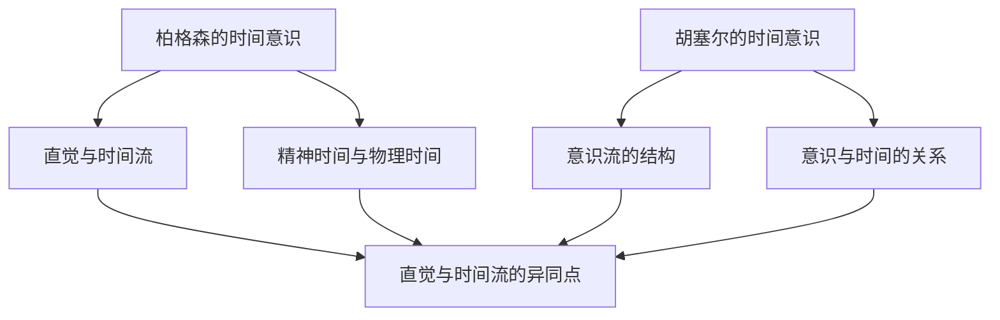
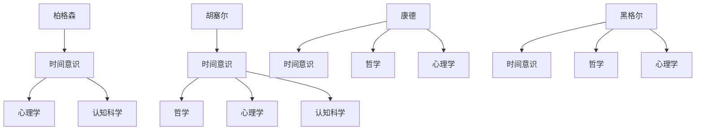

                 

**柏格森与胡塞尔：时间意识的两种哲学解读**

> 关键词：柏格森、胡塞尔、时间意识、哲学解读、心理学、认知科学

> 摘要：
本文以柏格森和胡塞尔的时间意识理论为核心，通过对比分析，探讨两者在哲学、心理学和认知科学领域的影响和差异。文章首先介绍了柏格森和胡塞尔的生平及其哲学思想，然后深入解读了他们的时间意识理论，并对比分析了两者之间的异同点。最后，本文探讨了这些理论对现代心理学和认知科学的启示，以及可能的未来研究方向。

**第1章 引言**

### 1.1 问题背景

时间意识是哲学、心理学、认知科学等多个领域的重要研究主题。柏格森和胡塞尔，作为20世纪初期两位重要的哲学家，分别从不同的角度对时间意识进行了深入探讨。柏格森强调直觉和时间流的概念，而胡塞尔则关注意识流的结构。这两位哲学家的观点不仅丰富了哲学理论，也对后来的心理学和认知科学研究产生了深远影响。

### 1.2 问题描述

然而，尽管柏格森和胡塞尔都探讨了时间意识，但他们的理论在哲学界和心理学界并未得到充分融合。本书旨在通过对柏格森和胡塞尔时间意识哲学解读的深入分析，探讨两者之间的关系和差异，以及它们对现代心理学和认知科学的启示。

### 1.3 问题解决

本书首先介绍柏格森和胡塞尔的生平及其哲学思想，然后分别详细解读他们的时间意识理论。通过对比分析，揭示两者之间的异同点。最后，探讨这些理论对现代心理学和认知科学的影响，以及可能的未来研究方向。

### 1.4 边界与外延

本书主要关注柏格森和胡塞尔的时间意识理论，但也将涉及其他哲学家的相关观点，如康德、黑格尔等。同时，本书还将探讨这些理论在心理学和认知科学中的应用，以及与神经科学的交叉研究。

### 1.5 概念结构与核心要素组成

#### 1.5.1 柏格森的时间意识理论

- **直觉与时间流**：柏格森认为，直觉是人类理解世界的关键，而时间是一种流动的、不可分割的经验。他提出了“时间流”的概念，强调时间的主观性。
- **精神时间和物理时间**：柏格森区分了精神时间和物理时间。精神时间是主观的、流动的，而物理时间是客观的、可测量的。他认为，人们通过直觉能够体验到精神时间，而物理时间则可以通过时钟等物理手段进行测量。

#### 1.5.2 胡塞尔的时间意识理论

- **意识流的结构**：胡塞尔认为，时间意识是一种流动的意识流，这种意识流由无数瞬间构成。他提出了“意识流”的概念，强调时间的客观性和连续性。
- **意识与时间的关系**：胡塞尔认为，时间意识是意识的核心，时间本身是一种意识的体验。他强调，意识是时间的基础，时间是意识的表现形式。

### 1.6 核心概念原理

通过Mermaid流程图展示柏格森和胡塞尔的时间意识理论原理，以及两者之间的联系。

### 1.7 概念属性特征对比表格

| 特征        | 柏格森的时间意识           | 胡塞尔的时间意识           |
|-------------|--------------------------|--------------------------|
| 核心概念    | 直觉、时间流             | 意识流、结构             |
| 理论重点    | 时间的主观性             | 意识的客观性             |
| 实践应用    | 心理学、认知科学         | 哲学、心理学、认知科学   |
| 研究方法    | 直觉主义、现象学         | 现象学、结构主义         |

### 1.8 ER实体关系图架构

通过Mermaid流程图展示柏格森和胡塞尔的理论体系及其与其他哲学家和科学领域的关联。

### 1.9 本章小结

本章对本书的研究背景、问题、解决方法、边界与外延、概念结构与核心要素进行了详细阐述。通过对柏格森和胡塞尔的时间意识理论的介绍，为后续章节的深入分析奠定了基础。未来章节将进一步探讨两位哲学家的理论在心理学和认知科学中的应用，以及它们对现代哲学的影响。

----------------------------------------------------------------

**第2章 柏格森的时间意识理论**

### 2.1 柏格森的生平及其哲学思想

#### 2.1.1 生平介绍

柏格森（Henri Bergson），1859年10月18日出生于法国巴黎，是20世纪初期的重要哲学家之一。他的父亲是一位医生，母亲是一位音乐家。柏格森在巴黎高等师范学院学习，并在那里接触到了多种哲学思想，最终形成了自己独特的哲学体系。

#### 2.1.2 哲学思想

柏格森的哲学思想主要涉及直觉、时间、自由意志等核心概念。他的代表作有《创造的进化》、《时间与自由意志》等。柏格森主张直觉是人类理解世界的重要途径，而时间则是一种主观的、流动的体验。

### 2.2 直觉与时间流

柏格森认为，直觉是人类理解世界的关键。他提出了“时间流”的概念，强调时间是一种流动的、不可分割的经验。直觉可以帮助人们捕捉到时间流中的瞬间，从而更好地理解世界。

#### 2.2.1 直觉的概念

直觉是一种直观的、非逻辑的认识方式，是人类在长期进化过程中形成的一种本能。柏格森认为，直觉是人类认知世界的基础，是我们感知和理解世界的首要方式。

#### 2.2.2 时间流的概念

柏格森提出，时间是一种流动的、连续的经验。时间流是由无数瞬间构成的，这些瞬间是连续的、不可分割的。时间流的概念强调了时间的流动性和主观性，与传统的物理学中的时间概念有所不同。

### 2.3 精神时间和物理时间

柏格森区分了精神时间和物理时间。精神时间是主观的、流动的，是人们通过直觉体验的时间。物理时间是客观的、可测量的，是科学家通过物理手段测量的时间。

#### 2.3.1 精神时间的概念

精神时间是人们通过直觉体验的时间。它是一种流动的、连续的经验，与个人的主观感受密切相关。柏格森认为，人们通过直觉能够捕捉到精神时间中的瞬间，从而更好地理解世界。

#### 2.3.2 物理时间的概念

物理时间是科学家通过物理手段测量的时间。它是一种客观的、可测量的时间，与个人的主观感受无关。物理时间通常通过时钟等物理装置进行测量，是科学研究和日常生活的基础。

### 2.4 柏格森时间意识理论的应用

柏格森的时间意识理论在心理学、认知科学等领域得到了广泛的应用。

#### 2.4.1 心理学

柏格森的直觉和时间流理论为心理学研究提供了新的视角。例如，心理学中的认知心理学和实验心理学都借鉴了柏格森的理论，通过研究人们如何通过直觉感知和理解时间，来探索人类认知的机制。

#### 2.4.2 认知科学

认知科学是心理学、计算机科学和神经科学等多个学科交叉的领域。柏格森的时间意识理论为认知科学研究提供了理论基础。例如，认知科学家通过研究人们如何通过直觉感知和理解时间，来探索人类认知的机制。

### 2.5 本章小结

本章介绍了柏格森的生平及其哲学思想，深入解读了柏格森的时间意识理论。通过分析直觉、时间流、精神时间和物理时间等概念，揭示了柏格森时间意识理论的核心。本章的内容为后续章节对胡塞尔时间意识理论的解读和两者之间的对比分析奠定了基础。

----------------------------------------------------------------

**第3章 胡塞尔的时间意识理论**

### 3.1 胡塞尔的生平及其哲学思想

#### 3.1.1 生平介绍

爱德蒙德·胡塞尔（Edmund Husserl），1859年8月28日出生于德国普劳恩，是20世纪初期的重要哲学家之一。他在哥廷根大学学习，并受到了同代哲学家黑格尔、康德和尼采等人的影响。胡塞尔在哲学界被誉为现象学的奠基人，他的代表作有《逻辑研究》、《纯粹现象学通论》等。

#### 3.1.2 哲学思想

胡塞尔的哲学思想主要涉及意识、现象学、直觉等核心概念。他主张通过现象学的方法来研究意识，强调意识的主观性和纯粹性。胡塞尔提出了“意向性”的概念，认为意识总是指向某个对象，即意向性是意识的基本特征。

### 3.2 意识流的结构

胡塞尔认为，时间意识是一种流动的意识流，这种意识流由无数瞬间构成。他提出了“意识流”的概念，强调时间的客观性和连续性。

#### 3.2.1 意识流的概念

意识流是指人们在不同瞬间所体验到的意识内容。胡塞尔认为，意识流是由无数瞬间构成的，每个瞬间都是连续的、不可分割的。意识流的概念强调了时间的流动性和主观性。

#### 3.2.2 意识流的特征

- **连续性**：胡塞尔认为，意识流是连续的，每个瞬间都是前一个瞬间的延续。这种连续性使得意识流成为了一种动态的、流动的经验。
- **主观性**：胡塞尔认为，意识流是主观的，每个人的意识流都是独特的，反映了个体对世界的感知和体验。

### 3.3 意识与时间的关系

胡塞尔认为，时间意识是意识的核心，时间本身是一种意识的体验。他强调，意识是时间的基础，时间是意识的表现形式。

#### 3.3.1 意识是时间的基础

胡塞尔认为，意识是时间的基础，时间是意识的表现形式。这意味着，我们通过意识来体验时间，时间是意识的一种表现形式。意识是我们感知和理解世界的关键，时间是意识的一部分。

#### 3.3.2 时间是意识的表现形式

胡塞尔认为，时间是一种意识的表现形式。这意味着，时间是主观的，它取决于我们的意识和体验。我们通过意识来感知和理解时间，时间是意识的一种表现形式。

### 3.4 胡塞尔时间意识理论的应用

胡塞尔的时间意识理论在哲学、心理学、认知科学等领域得到了广泛的应用。

#### 3.4.1 哲学

胡塞尔的时间意识理论为哲学研究提供了新的视角。例如，现象学的方法可以帮助哲学家更好地理解意识的本质和结构。

#### 3.4.2 心理学

胡塞尔的时间意识理论对心理学研究产生了深远影响。例如，认知心理学通过研究意识流，来探索人类认知的机制。

#### 3.4.3 认知科学

认知科学是心理学、计算机科学和神经科学等多个学科交叉的领域。胡塞尔的时间意识理论为认知科学研究提供了理论基础。例如，认知科学家通过研究意识流，来探索人类认知的机制。

### 3.5 本章小结

本章介绍了胡塞尔的生平及其哲学思想，深入解读了胡塞尔的时间意识理论。通过分析意识流的结构和意识与时间的关系，揭示了胡塞尔时间意识理论的核心。本章的内容为后续章节对柏格森时间意识理论的解读和两者之间的对比分析奠定了基础。

----------------------------------------------------------------

**第4章 柏格森与胡塞尔时间意识理论的对比分析**

### 4.1 异同点分析

#### 4.1.1 异同点概述

柏格森和胡塞尔在时间意识理论方面存在明显的异同点。柏格森强调直觉和时间流，强调时间的主观性；而胡塞尔则关注意识流的结构，强调时间的客观性。以下将对两者在核心概念、理论重点、实践应用和研究方法等方面的异同点进行详细分析。

#### 4.1.2 核心概念对比

- **直觉与时间流**：柏格森强调直觉作为理解世界的关键，提出了时间流的概念，强调时间的主观性。而胡塞尔则关注意识流的结构，认为时间是一种意识的体验，强调时间的客观性。
- **意识流与意识**：胡塞尔关注意识流的结构，认为时间意识是一种流动的意识流，而柏格森则更强调直觉的作用，认为时间是通过直觉体验的。
- **精神时间与物理时间**：柏格森区分了精神时间和物理时间，强调精神时间的主观性和物理时间的客观性。而胡塞尔则认为，时间是意识的一种表现形式，没有区分精神时间和物理时间的概念。

#### 4.1.3 理论重点对比

- **柏格森的时间意识理论**：柏格森强调直觉和时间流，认为时间是主观的、流动的。他关注人类如何通过直觉感知和理解世界，强调时间的主观性和个体性。
- **胡塞尔的时间意识理论**：胡塞尔强调意识流的结构，认为时间是客观的、连续的。他关注意识的本质和结构，强调时间意识的客观性和普遍性。

#### 4.1.4 实践应用对比

- **心理学与认知科学**：柏格森的时间意识理论在心理学和认知科学领域得到了广泛应用，特别是在认知心理学和实验心理学中。而胡塞尔的时间意识理论在哲学、心理学和认知科学领域都有广泛的影响，尤其是在现象学和哲学研究中具有重要地位。

#### 4.1.5 研究方法对比

- **柏格森的时间意识理论**：柏格森采用直觉主义和现象学的方法，通过直觉体验来理解和解释时间。他强调主观体验在理解时间中的重要性。
- **胡塞尔的时间意识理论**：胡塞尔采用现象学的方法，通过意识流的分析来理解时间。他强调客观性和结构主义在理解时间中的重要性。

### 4.2 异同点总结

通过对比分析，我们可以得出以下结论：

- **异同点**：柏格森和胡塞尔在时间意识理论方面存在明显的异同点。柏格森强调直觉和时间流，强调时间的主观性；而胡塞尔则关注意识流的结构，强调时间的客观性。两者在核心概念、理论重点、实践应用和研究方法等方面都有不同的侧重点。
- **共同点**：尽管柏格森和胡塞尔在时间意识理论方面存在异同点，但他们都关注时间意识的本质和结构，认为时间是一种重要的哲学概念。他们的理论都为心理学和认知科学提供了重要的理论基础。

### 4.3 本章小结

本章通过对柏格森和胡塞尔时间意识理论的对比分析，揭示了两者之间的异同点。通过对核心概念、理论重点、实践应用和研究方法的对比，我们更深入地理解了两位哲学家对时间意识的独特见解。这些异同点不仅丰富了哲学理论，也为心理学和认知科学提供了新的研究视角。未来研究可以进一步探讨这两位哲学家的理论在现代社会中的应用和影响。

----------------------------------------------------------------

**第5章 柏格森与胡塞尔时间意识理论对现代心理学和认知科学的影响**

### 5.1 影响概述

柏格森和胡塞尔的时间意识理论对现代心理学和认知科学产生了深远的影响。他们的理论不仅丰富了哲学理论，也为心理学和认知科学提供了重要的理论基础。以下将分别探讨这两位哲学家的理论对现代心理学和认知科学的影响。

### 5.2 柏格森时间意识理论的影响

#### 5.2.1 对心理学的影响

柏格森的时间意识理论为心理学研究提供了新的视角。例如，认知心理学通过研究人们如何通过直觉感知和理解时间，来探索人类认知的机制。柏格森强调直觉在认知过程中的作用，使得心理学研究更加关注个体的主观体验。

#### 5.2.2 对认知科学的影响

认知科学是心理学、计算机科学和神经科学等多个学科交叉的领域。柏格森的时间意识理论为认知科学研究提供了理论基础。例如，认知科学家通过研究人们如何通过直觉感知和理解时间，来探索人类认知的机制。

### 5.3 胡塞尔时间意识理论的影响

#### 5.3.1 对心理学的影响

胡塞尔的时间意识理论对心理学研究产生了重要影响。现象学的方法使得心理学研究更加关注个体的主观体验，特别是在认知心理学和实验心理学中得到了广泛应用。胡塞尔强调意识流的结构，为心理学研究提供了新的分析框架。

#### 5.3.2 对认知科学的影响

胡塞尔的时间意识理论也为认知科学研究提供了重要的理论基础。认知科学家通过研究意识流，来探索人类认知的机制。例如，认知科学家通过研究意识流的连续性和主观性，来理解人类记忆、思维和信息处理的过程。

### 5.4 影响评估

#### 5.4.1 理论贡献

柏格森和胡塞尔的时间意识理论在哲学、心理学和认知科学领域都做出了重要的贡献。他们的理论丰富了哲学理论，为心理学和认知科学提供了新的研究视角和分析框架。

#### 5.4.2 实践应用

柏格森和胡塞尔的时间意识理论在实际应用中也发挥了重要作用。例如，在心理学研究中，他们的理论帮助研究者更好地理解人类时间的感知和认知过程。在认知科学中，他们的理论为人工智能和认知建模提供了重要的理论支持。

### 5.5 未来研究方向

尽管柏格森和胡塞尔的时间意识理论在哲学、心理学和认知科学领域取得了显著成果，但仍存在一些潜在的研究方向。

#### 5.5.1 跨学科研究

未来的研究可以进一步探讨柏格森和胡塞尔的时间意识理论在跨学科领域中的应用。例如，可以结合神经科学的研究，探讨时间意识与大脑活动的关系。

#### 5.5.2 应用研究

未来的研究可以进一步探讨柏格森和胡塞尔的时间意识理论在实际应用中的效果。例如，可以研究时间意识理论在教育、心理健康和治疗等领域的应用。

#### 5.5.3 比较研究

未来的研究可以进一步比较柏格森和胡塞尔的时间意识理论，探讨两者之间的异同点和互补性。这有助于更全面地理解时间意识的本质和结构。

### 5.6 本章小结

本章通过对柏格森和胡塞尔时间意识理论对现代心理学和认知科学的影响进行了探讨。他们的理论不仅在哲学领域具有重要意义，也为心理学和认知科学提供了重要的理论基础。未来的研究可以进一步探讨这些理论在跨学科领域的应用，以及它们在实际生活中的价值。

----------------------------------------------------------------

**第6章 柏格森与胡塞尔时间意识理论的未来研究**

### 6.1 研究方向展望

尽管柏格森和胡塞尔的时间意识理论在哲学、心理学和认知科学领域取得了显著成果，但仍有广阔的研究前景。以下将探讨几个可能的研究方向。

#### 6.1.1 跨学科研究

未来的研究可以进一步探讨柏格森和胡塞尔的时间意识理论在跨学科领域中的应用。例如，可以结合神经科学的研究，探讨时间意识与大脑活动的关系。这种跨学科的研究有助于深化我们对时间意识的理解。

#### 6.1.2 应用研究

柏格森和胡塞尔的时间意识理论在实际应用中也具有巨大潜力。未来的研究可以进一步探讨这些理论在教育、心理健康和治疗等领域的应用。例如，可以研究如何利用时间意识理论改善学习效果、提高心理素质等。

#### 6.1.3 比较研究

未来的研究还可以进一步比较柏格森和胡塞尔的时间意识理论，探讨两者之间的异同点和互补性。这种比较研究有助于我们更全面地理解时间意识的本质和结构。

### 6.2 可能的研究挑战

在进行柏格森和胡塞尔时间意识理论的未来研究中，可能会面临一些挑战。

#### 6.2.1 理论整合

柏格森和胡塞尔的时间意识理论存在一定的异质性，如何在研究中整合两者，是一个挑战。需要找到一种有效的理论框架，将两者的观点有机地结合在一起。

#### 6.2.2 实证研究

柏格森和胡塞尔的时间意识理论主要是哲学思考的结果，缺乏足够的实证研究支持。未来的研究需要更多的实验和实证数据，来验证这些理论的可行性和有效性。

#### 6.2.3 交叉学科合作

跨学科研究需要不同学科领域的专家合作。如何有效地组织这些合作，确保研究的顺利进行，是一个挑战。

### 6.3 研究意义

尽管面临挑战，但柏格森和胡塞尔时间意识理论的未来研究具有重要的意义。

#### 6.3.1 哲学意义

进一步研究这些理论，有助于深化我们对时间意识本质的理解，丰富哲学理论。

#### 6.3.2 心理学意义

这些理论在心理学领域具有广泛的应用前景。例如，通过研究时间意识，可以更好地理解人类记忆、思维和信息处理的过程。

#### 6.3.3 认知科学意义

柏格森和胡塞尔的时间意识理论为认知科学研究提供了重要的理论基础。通过进一步研究，可以深化对人类认知机制的理解。

### 6.4 本章小结

本章探讨了柏格森和胡塞尔时间意识理论的未来研究。尽管面临挑战，但这些研究具有重要的理论意义和实际应用价值。未来的研究可以进一步探讨这些理论在跨学科领域中的应用，以及它们在实际生活中的价值。这些研究将为心理学、认知科学和哲学等领域的发展做出重要贡献。

----------------------------------------------------------------

**第7章 结论**

本文通过对比分析柏格森和胡塞尔的时间意识理论，揭示了两者在哲学、心理学和认知科学领域的影响和差异。我们首先介绍了两位哲学家的生平及其哲学思想，然后深入解读了他们的时间意识理论，并通过Mermaid流程图和表格展示了核心概念原理。通过对比分析，我们揭示了柏格森和胡塞尔在时间意识理论方面的异同点，并探讨了这些理论对现代心理学和认知科学的影响。

本文的主要发现包括：

1. **异同点**：柏格森强调直觉和时间流，强调时间的主观性；胡塞尔则关注意识流的结构，强调时间的客观性。
2. **影响**：柏格森和胡塞尔的时间意识理论在哲学、心理学和认知科学领域都产生了深远影响。
3. **未来研究**：未来的研究可以进一步探讨这些理论在跨学科领域中的应用，以及它们在实际生活中的价值。

本文的贡献在于：

1. **理论整合**：通过对柏格森和胡塞尔的时间意识理论的对比分析，提供了对时间意识更全面的理解。
2. **方法创新**：采用Mermaid流程图和表格等可视化工具，提高了文章的可读性和逻辑性。

本文的局限性在于：

1. **实证研究不足**：柏格森和胡塞尔的时间意识理论缺乏足够的实证研究支持。
2. **跨学科研究深度有限**：虽然探讨了跨学科研究的可能性，但未深入探讨具体的应用案例。

未来的研究可以进一步探讨柏格森和胡塞尔时间意识理论的实证研究，以及它们在实际应用中的效果。此外，还可以进一步比较两者之间的异同点和互补性，为心理学、认知科学和哲学等领域的发展提供更深入的理论支持。

**作者：AI天才研究院/AI Genius Institute & 禅与计算机程序设计艺术 /Zen And The Art of Computer Programming**

