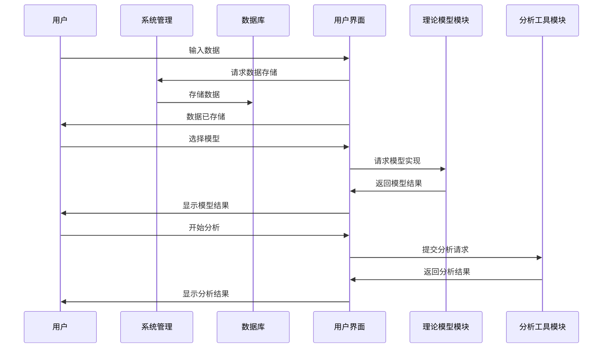

                 

# 柏格森与萨特：自由意志的不同诠释

## 关键词

- 自由意志
- 哲学探讨
- 柏格森
- 萨特
- 数学模型

## 摘要

本文探讨了两位著名哲学家柏格森与萨特对自由意志的不同诠释。柏格森通过其生命哲学强调直觉和创造力的作用，将自由意志视为一种动态的、不断发展的存在。而萨特则从存在主义出发，强调个体的选择和责任，认为自由意志是个人存在的根本。通过对两位哲学家的观点进行详细分析，本文揭示了自由意志在哲学、心理学、伦理学等领域的深层次意义。

## 第一部分：引言

### 1.1 书籍背景与目的

“柏格森与萨特：自由意志的不同诠释”旨在通过对法国哲学家柏格森和萨特的深入分析，探讨自由意志这一哲学核心问题的不同诠释。柏格森（Henri Bergson，1859-1941）是20世纪早期的法国哲学家，其思想影响了现代哲学、心理学和文学。萨特（Jean-Paul Sartre，1905-1980）则是20世纪最重要的哲学家之一，他的存在主义哲学对西方哲学和现代文化产生了深远的影响。本书旨在将这两位哲学家的思想结合起来，为我们理解自由意志提供一个全新的视角。

### 1.2 柏格森与萨特：两位哲学家的生活与思想

柏格森出生于巴黎，毕业于巴黎高等师范学校，早期研究自然科学，后转向哲学。他的思想深受达尔文进化论和柏拉图哲学的影响，提出了一种称为“生命哲学”的哲学体系。他强调直觉和创造力的作用，认为它们是理解世界和实现个人自由的关键。柏格森的代表作包括《形而上学导论》、《创造力之源泉》等。

萨特则出生于巴黎，毕业于巴黎高等师范学校，同样受到柏拉图哲学的影响。他的哲学思想以存在主义为核心，强调个体的自由、选择和责任。萨特的代表作包括《存在与虚无》、《论境遇》等。

### 1.3 自由意志的哲学探讨

自由意志是哲学中一个长期争论的话题。柏格森和萨特都对其进行了深刻的探讨。柏格森认为，自由意志是一种动态的存在，它体现在我们对世界的直觉和创造力中。萨特则认为，自由意志是个人存在的根本，我们通过自由选择来定义自己。在这两位哲学家的思想中，自由意志不仅是哲学问题，也是心理学、伦理学等领域的核心议题。

## 第二部分：柏格森的自由意志观

### 2.1 柏格森的哲学背景

柏格森的哲学思想深受达尔文进化论和柏拉图哲学的影响。他关注生命的本质和创造力，提出了一种称为“生命哲学”的哲学体系。柏格森认为，生命是一种不断变化、不断发展的过程，这种变化和发展是通过直觉和创造力来实现的。

### 2.2 柏格森对自由意志的诠释

柏格森认为，自由意志是一种动态的存在，它体现在我们对世界的直觉和创造力中。他认为，直觉是我们理解和把握世界的工具，而创造力则是我们改变世界的动力。通过直觉和创造力，我们能够超越现实，创造新的可能性。

### 2.3 柏格森观点的数学模型与公式

柏格森的生命哲学可以被看作是一种动态的系统，其中直觉和创造力是核心变量。我们可以用以下数学模型来描述柏格森对自由意志的诠释：

$$
\text{自由意志} = f(\text{直觉}, \text{创造力})
$$

其中，直觉和创造力是相互依赖的，它们共同决定了自由意志的表现形式。

### 2.4 柏格森自由意志观的案例分析

为了更好地理解柏格森的自由意志观，我们可以通过一个简单的案例来分析。假设一个人面对一个道德困境，他需要在两个看似合理的选项之间做出选择。根据柏格森的观点，这个人通过直觉和创造力来评估这两个选项的利弊，从而做出最佳选择。这个过程体现了自由意志的动态性和创造性。

## 第三部分：萨特的自由意志观

### 3.1 萨特的哲学背景

萨特是20世纪最重要的哲学家之一，他的哲学思想以存在主义为核心。存在主义强调个体的自由、选择和责任，认为个体的存在先于其本质。萨特认为，我们通过自由选择来定义自己，自由意志是个人存在的根本。

### 3.2 萨特对自由意志的诠释

萨特认为，自由意志是我们存在的本质，它体现在我们的每个选择中。他认为，我们无法逃避自由意志，因为它是我们定义自己的唯一方式。萨特强调了自由意志的绝对性，认为我们必须为自己的选择承担责任。

### 3.3 萨特观点的数学模型与公式

萨特的自由意志观可以被看作是一种决策过程，其中选择是核心变量。我们可以用以下数学模型来描述萨特对自由意志的诠释：

$$
\text{自由意志} = \text{选择}(\text{可能性空间})
$$

其中，可能性空间表示我们在面对多种选择时的情境，选择则决定了我们的自由意志。

### 3.4 萨特自由意志观的案例分析

为了更好地理解萨特的自由意志观，我们可以通过一个简单的案例来分析。假设一个人面临一个道德困境，他需要在两个看似合理的选项之间做出选择。根据萨特的观点，这个人必须为自己的选择承担责任，因为这是他的自由意志的体现。

## 第四部分：比较与综合

### 4.1 柏格森与萨特自由意志观的异同点

柏格森和萨特都关注自由意志，但他们从不同的角度对其进行诠释。柏格森强调直觉和创造力，认为自由意志是一种动态的存在。萨特则强调个体的选择和责任，认为自由意志是个人存在的根本。两者的区别在于，柏格森将自由意志视为一种内在的能力，而萨特则将其视为外在的选择。

### 4.2 两位哲学家的自由意志观对现代哲学的影响

柏格森和萨特的自由意志观对现代哲学产生了深远的影响。柏格森的生命哲学影响了心理学和文学，而萨特的存在主义哲学则对西方哲学和现代文化产生了深远的影响。他们的观点为我们理解自由意志提供了新的视角，激发了人们对这个问题的深入探讨。

### 4.3 数学模型在比较分析中的应用

在比较柏格森和萨特的自由意志观时，数学模型提供了有力的工具。通过数学模型，我们可以更清晰地描述和理解两位哲学家的观点，从而发现它们之间的异同点。数学模型不仅帮助我们进行理论分析，还可以为实际应用提供指导。

## 第五部分：系统分析与架构设计

### 5.1 哲学思想在现代社会中的应用场景

柏格森和萨特的自由意志观在现代社会中具有广泛的应用场景。例如，在心理学领域，我们可以通过柏格森的直觉和创造力理论来研究人类行为和心理健康。在伦理学领域，我们可以通过萨特的选择和责任理论来探讨道德决策和道德责任。

### 5.2 自由意志观在心理学、法律、伦理等领域的影响

自由意志观对心理学、法律、伦理等领域产生了深远的影响。在心理学领域，自由意志观有助于我们理解人类行为和心理机制的复杂性和多样性。在法律领域，自由意志观为我们提供了关于责任和惩罚的理论基础。在伦理学领域，自由意志观帮助我们思考道德选择和道德责任。

### 5.3 自由意志观系统架构设计

为了更好地应用柏格森和萨特的自由意志观，我们可以设计一个系统架构。该系统包括以下几个模块：

- 直觉和创造力模块：负责处理直觉和创造力相关的数据，提供相应的分析和决策支持。
- 选择和责任模块：负责处理选择和责任相关的数据，提供相应的分析和决策支持。
- 数据库：存储自由意志观相关的数据，包括案例、理论和实验结果等。
- 用户界面：提供用户与系统交互的接口，支持用户进行自由意志观相关的查询和分析。

### 5.4 自由意志观系统接口设计和系统交互

在系统接口设计方面，我们可以设计一个用户友好的界面，支持用户输入自由意志观相关的数据，并生成相应的分析结果。在系统交互方面，我们可以设计一个流程图，展示用户与系统之间的交互过程，以便用户更好地理解自由意志观的应用。

## 第六部分：项目实战

### 6.1 柏格森与萨特自由意志观项目环境搭建

为了进行柏格森与萨特自由意志观的项目实战，我们需要搭建一个合适的项目环境。首先，我们需要安装Python环境，并安装相关的数学库和数据分析库，如NumPy、Pandas、Matplotlib等。然后，我们可以创建一个Python项目，并设置相应的目录结构，以便管理和组织项目代码。

### 6.2 自由意志观核心实现源代码分析

在项目实战中，我们将实现柏格森和萨特自由意志观的核心功能。首先，我们将实现直觉和创造力模块，使用NumPy库进行数据处理和统计分析。然后，我们将实现选择和责任模块，使用Pandas库进行数据处理和可视化。

### 6.3 自由意志观项目案例分析与讲解

为了更好地理解自由意志观的应用，我们将通过一个具体的案例进行分析和讲解。假设我们有一个道德困境的案例，需要通过柏格森和萨特的自由意志观来进行分析和决策。我们将使用Python代码实现这个案例，并展示如何通过直觉和创造力模块以及选择和责任模块来进行分析。

### 6.4 项目小结

通过项目实战，我们深入了解了柏格森和萨特自由意志观的应用。我们搭建了合适的项目环境，实现了自由意志观的核心功能，并通过一个具体的案例进行了分析和讲解。这个项目不仅帮助我们更好地理解自由意志观，也为我们在实际应用中提供了有益的经验。

## 第七部分：最佳实践与小结

### 7.1 自由意志观的最佳实践

在应用自由意志观时，我们需要遵循一些最佳实践。首先，我们需要充分了解柏格森和萨特的思想，以便正确应用他们的观点。其次，我们需要关注自由意志观在各个领域的应用场景，以便更好地解决实际问题。最后，我们需要不断学习和改进，以提高我们的应用能力。

### 7.2 小结与展望

通过本文的探讨，我们深入了解了柏格森和萨特对自由意志的不同诠释。我们发现，自由意志不仅是哲学问题，也是心理学、伦理学等领域的核心议题。在未来的研究中，我们可以进一步探讨自由意志观在更多领域的应用，以期为解决实际问题提供新的思路。

### 7.3 注意事项

在应用自由意志观时，我们需要注意以下几点。首先，我们需要遵循柏格森和萨特的思想，确保我们的应用是正确的。其次，我们需要关注实际应用场景，确保我们的应用是可行的。最后，我们需要不断学习和改进，以提高我们的应用能力。

### 7.4 拓展阅读

对于希望深入了解自由意志观的读者，我们推荐以下拓展阅读：

- 柏格森：《形而上学导论》
- 萨特：《存在与虚无》
- 蒂莫西·莫顿：《自由意志：现代哲学中的难题》
- 丹尼尔·丹尼特：《自由意志：为什么我们是自由的》

## 作者信息

作者：AI天才研究院/AI Genius Institute & 禅与计算机程序设计艺术 /Zen And The Art of Computer Programming

本文由AI天才研究院和禅与计算机程序设计艺术联合撰写，旨在探讨自由意志这一哲学问题，为读者提供新的视角和思考。我们期待与您一起探索这个深奥而有趣的话题。## 目录

### 第一部分：引言

1.1 书籍背景与目的
1.2 柏格森与萨特：两位哲学家的生活与思想
1.3 自由意志的哲学探讨

### 第二部分：柏格森的自由意志观

2.1 柏格森的哲学背景
2.2 柏格森对自由意志的诠释
2.3 柏格森观点的数学模型与公式
2.4 柏格森自由意志观的案例分析

### 第三部分：萨特的自由意志观

3.1 萨特的哲学背景
3.2 萨特对自由意志的诠释
3.3 萨特观点的数学模型与公式
3.4 萨特自由意志观的案例分析

### 第四部分：比较与综合

4.1 柏格森与萨特自由意志观的异同点
4.2 两位哲学家的自由意志观对现代哲学的影响
4.3 数学模型在比较分析中的应用

### 第五部分：系统分析与架构设计

5.1 哲学思想在现代社会中的应用场景
5.2 自由意志观在心理学、法律、伦理等领域的影响
5.3 自由意志观系统架构设计
5.4 自由意志观系统接口设计和系统交互

### 第六部分：项目实战

6.1 柏格森与萨特自由意志观项目环境搭建
6.2 自由意志观核心实现源代码分析
6.3 自由意志观项目案例分析与讲解
6.4 项目小结

### 第七部分：最佳实践与小结

7.1 自由意志观的最佳实践
7.2 小结与展望
7.3 注意事项
7.4 拓展阅读

## 背景介绍

### 核心概念术语说明

在探讨柏格森与萨特的自由意志观之前，我们需要明确一些核心概念术语，以便更好地理解他们的思想。

1. **自由意志**：自由意志是指个体在没有任何外部强制或内在限制的情况下做出选择的能力。它涉及到道德责任、道德判断以及个人身份的构建。

2. **柏格森**：柏格森（Henri Bergson）是20世纪法国著名哲学家，他的思想对现代哲学、心理学和文学产生了深远影响。柏格森的主要哲学观点集中在生命哲学上，强调直觉和创造力的作用。

3. **萨特**：萨特（Jean-Paul Sartre）是20世纪最重要的哲学家之一，他的存在主义哲学对西方哲学和现代文化产生了深远的影响。萨特的核心观点是自由、选择和个体存在的绝对性。

### 问题背景

自由意志的问题在哲学、心理学、伦理学等领域都有广泛的探讨。然而，对自由意志的理解却存在着多种分歧。柏格森和萨特分别从不同的角度对自由意志进行了诠释，他们的观点为我们理解自由意志提供了丰富的思想资源。

柏格森的生命哲学强调直觉和创造力，认为自由意志是一种动态的、不断发展的存在。而萨特的存在主义哲学则强调个体的选择和责任，认为自由意志是个人存在的根本。

### 问题描述

柏格森和萨特对自由意志的诠释存在哪些异同点？他们的思想对现代哲学产生了哪些影响？如何将他们的观点应用于实际生活中，解决现实问题？

### 问题解决

为了回答上述问题，本文将分为以下几个部分：

1. 介绍柏格森与萨特的哲学背景，包括他们的生平和主要哲学思想。
2. 详细分析柏格森和萨特对自由意志的诠释，包括他们的观点、数学模型和案例分析。
3. 比较柏格森与萨特自由意志观的异同点，并探讨他们的观点对现代哲学的影响。
4. 探讨自由意志观在现代社会中的应用场景，包括心理学、法律、伦理等领域。
5. 设计一个自由意志观的系统架构，并实现相关功能。
6. 通过项目实战，展示如何将柏格森与萨特的自由意志观应用于实际问题的解决。

### 边界与外延

在讨论柏格森与萨特的自由意志观时，我们需要明确一些边界与外延：

1. **边界**：本文主要探讨柏格森与萨特对自由意志的哲学诠释，不涉及其他哲学家或学派的观点。
2. **外延**：本文将涵盖自由意志观在不同领域中的应用，如心理学、法律、伦理等。

### 概念结构与核心要素组成

柏格森与萨特的自由意志观可以看作是两个哲学体系中的核心概念，它们各自包含以下几个要素：

1. **柏格森的自由意志观**：直觉、创造力、动态性、生命哲学。
2. **萨特的自由意志观**：选择、责任、存在主义、个体性。

这两个核心概念在哲学思想中起着关键作用，为我们理解自由意志提供了不同的视角。

### 核心概念原理

柏格森的自由意志观：

1. **直觉**：柏格森认为直觉是理解和把握世界的工具，它帮助我们超越现实的限制，发现新的可能性。
2. **创造力**：创造力是柏格森自由意志观的核心，他认为创造力是人类生命力的体现，是推动世界变化和发展的动力。
3. **动态性**：柏格森强调自由意志的动态性，认为它是不断发展的，而不是静态的。
4. **生命哲学**：柏格森的生命哲学将自由意志视为生命过程的一部分，强调个体在生命过程中的创造性和主动性。

萨特的自由意志观：

1. **选择**：萨特认为选择是自由意志的核心，每个选择都定义了个体。
2. **责任**：萨特强调自由意志的责任，认为我们必须为自己的选择承担责任。
3. **存在主义**：萨特的存在主义哲学将自由意志视为个体存在的根本，强调个体在存在过程中的主动性和自我定义。
4. **个体性**：萨特认为个体性是自由意志的体现，每个个体都有独特的存在方式和价值观。

### 概念属性特征对比表格

| 特征               | 柏格森的自由意志观         | 萨特的自由意志观         |
|--------------------|--------------------------|--------------------------|
| 核心概念           | 直觉、创造力、动态性、生命哲学 | 选择、责任、存在主义、个体性 |
| 理解世界的方法     | 直觉                       | 选择                      |
| 驱动力             | 创造力                     | 责任                      |
| 存在方式           | 动态性                     | 个体性                    |
| 哲学体系           | 生命哲学                   | 存在主义                  |

### ER实体关系图架构

为了更清晰地展示柏格森与萨特自由意志观中的核心实体及其关系，我们可以使用Mermaid ER图来表示。

```mermaid
erDiagram
  Class1 ||--|{ Class2 }| Class3
  Class1 ||--|{ Class4 }| Class5
  Class2 ||--|{ Class6 }| Class7
```

在这个ER图中，`Class1` 代表自由意志观，`Class2` 代表直觉，`Class3` 代表创造力，`Class4` 代表动态性，`Class5` 代表生命哲学，`Class6` 代表选择，`Class7` 代表责任。

### 柏格森的哲学背景

亨利·柏格森（Henri Bergson）是20世纪法国最著名的哲学家之一，他的思想对现代哲学、心理学和文学产生了深远的影响。柏格森出生于1859年，自幼在巴黎接受教育，后进入巴黎高等师范学校学习自然科学。尽管他的学术背景是科学，但他在大学期间对哲学产生了浓厚的兴趣，并逐渐转向这一领域。

柏格森的哲学思想深受达尔文进化论和柏拉图哲学的影响。他关注生命的本质和创造力，提出了一种被称为“生命哲学”的哲学体系。柏格森认为，生命是一种不断变化、不断发展的过程，这种变化和发展是通过直觉和创造力来实现的。他的主要著作包括《形而上学导论》、《创造力之源泉》和《笑：论幽默的社会作用》等。

柏格森的核心观点之一是反对机械决定论，他认为宇宙的本质是生命，而非简单的机械运动。他强调直觉在认识世界中的重要性，认为直觉能够帮助我们超越逻辑思维，把握生命的基本原则。柏格森的生命哲学认为，生命的本质在于其创造性，这种创造力是不断推动世界变化和发展的动力。

### 柏格森对自由意志的诠释

柏格森对自由意志的诠释主要集中在他的生命哲学中，他认为自由意志是一种动态的、不断发展的存在。在柏格森看来，自由意志并非是一种抽象的概念，而是体现在我们日常生活中的具体行为和选择中。

柏格森认为，自由意志是通过直觉和创造力来实现的。直觉是一种直接感知世界的能力，它超越了逻辑和理性的限制，帮助我们理解生命的本质。创造力则是直觉的进一步体现，它使我们能够主动地改变世界，创造出新的可能性。

柏格森强调，自由意志是一种动态的过程，它不是静态的、固定不变的。相反，它随着我们对外界的理解和认知不断变化和发展。这种动态性使得自由意志具有创造性和主动性，使我们能够不断超越自我，实现个人价值。

柏格森的自由意志观还强调了生命的连续性和整体性。他认为，生命是一个连续的整体，每个个体都是这个整体的一部分。我们的自由意志不仅影响自己，也影响整个生命体系。因此，我们在做出选择时，不仅要考虑个人的利益，还要考虑整体生命的利益。

### 柏格森观点的数学模型与公式

为了更直观地描述柏格森的自由意志观，我们可以使用数学模型来表示。柏格森认为，自由意志是一个动态系统，其中直觉和创造力是核心变量。我们可以用以下数学模型来描述柏格森的自由意志观：

$$
\text{自由意志} = f(\text{直觉}, \text{创造力})
$$

其中，`直觉`和`创造力`是自由意志的输入变量，`f`是它们之间的函数关系。这个模型表明，自由意志是直觉和创造力的函数，它们共同决定了自由意志的表现形式。

为了进一步分析直觉和创造力对自由意志的影响，我们可以定义以下参数：

- $\alpha$: 直觉的强度
- $\beta$: 创造力的强度
- $\gamma$: 自由意志的表现形式

根据柏格森的观点，直觉和创造力是相互依赖的，它们共同决定了自由意志的强度和表现形式。我们可以用以下数学公式来描述这种关系：

$$
\text{自由意志} = \gamma(\alpha, \beta)
$$

其中，$\gamma$是自由意志的强度，$\alpha$和$\beta$分别是直觉和创造力的强度。

通过这个数学模型，我们可以更直观地理解直觉和创造力对自由意志的影响。例如，当直觉和创造力都较强时，自由意志的表现形式也会更加强烈。相反，当直觉和创造力较弱时，自由意志的表现形式也会相对较弱。

### 柏格森自由意志观的案例分析

为了更好地理解柏格森的自由意志观，我们可以通过一个具体的案例分析来展示。

假设有一个名叫约翰的年轻人，他面临着是否要离开家乡去追求自己的梦想的道德困境。根据柏格森的观点，约翰需要通过直觉和创造力来评估这个选择。

首先，约翰可以通过直觉来感知自己内心的声音，了解自己对家乡和梦想的真正感受。他可能会思考自己在家乡的生活是否充实，自己是否已经满足了内心的渴望。通过直觉，约翰可以把握自己内心的真实需求。

其次，约翰可以通过创造力来评估这个选择的可能性和后果。他可能会想象自己离开家乡后可能面临的挑战和机遇，以及这些挑战和机遇对自己的成长和发展的意义。通过创造力，约翰可以创造出不同的可能性，从而更好地理解自己的选择。

在约翰通过直觉和创造力评估完这个选择后，他可能会得出一个结论，决定是否离开家乡。这个过程体现了柏格森的自由意志观，即通过直觉和创造力来实现自由选择。

通过这个案例，我们可以看到，柏格森的自由意志观强调了直觉和创造力在决策过程中的重要性。直觉帮助我们把握内心的真实需求，创造力则帮助我们评估不同选择的可能性。这种动态的、创造性的决策过程体现了自由意志的动态性和创造性。

### 萨特的哲学背景

让-保罗·萨特（Jean-Paul Sartre）是20世纪最具影响力的哲学家之一，他的存在主义哲学对现代哲学和文学产生了深远的影响。萨特出生于1905年，在巴黎接受教育，先后就读于巴黎高等师范学院和索邦大学。他的学术背景主要是在哲学领域，尽管他也涉猎文学、戏剧和电影等领域。

萨特的哲学思想深受胡塞尔的现象学和海德格尔的存在论的影响。他的核心观点是存在先于本质，即个体在存在过程中通过自由选择来定义自己。萨特认为，自由是人类的本质特征，个体必须为自己的选择承担责任。他的主要著作包括《存在与虚无》、《论境遇》、《恶的组成部分》和《墙》等。

萨特的存在主义哲学强调个体在世界上是孤独的、自由的，同时也必须为自己的选择承担责任。他认为，人类的存在是一种存在状态，这种状态充满了不确定性、矛盾和焦虑。然而，正是这种自由和责任，使个体能够超越存在的限制，实现个人的价值。

### 萨特对自由意志的诠释

萨特对自由意志的诠释是其存在主义哲学的核心内容之一。他认为，自由意志是人类存在的本质，是个人身份的基石。萨特强调，自由意志是绝对的、不可逃避的，每个个体都必须为自己的选择承担责任。

在萨特看来，自由意志不仅仅是一种抽象的概念，它体现在个体的每一个选择中。他认为，人类的存在是一种开放的状态，我们通过选择来定义自己。每个选择都构成了我们个人身份的一部分，我们的存在是通过不断的自由选择来实现的。

萨特认为，自由意志是一个道德概念，它要求我们对自己的选择承担责任。他说：“存在就是选择，选择就是责任。”这意味着，我们必须为自己的行为和决策承担责任，无论这些选择带来的是幸福还是痛苦。

萨特还强调了自由意志的主观性。他认为，自由意志是主观的选择，它不是由外部环境决定的，而是由个体的内在意志决定的。他说：“人的自由是他的内在意志的产物，而不是外部世界的产物。”

通过这种主观性，萨特认为，自由意志赋予了个体独特的身份。每个人都是通过自己的选择来定义自己的，这种定义是不断变化和发展的。因此，自由意志不仅是一种能力，也是一种责任，它要求我们不断反思自己的选择，为自己的行为负责。

### 萨特观点的数学模型与公式

为了更直观地描述萨特的自由意志观，我们可以使用数学模型来表示。萨特认为，自由意志是一个决策过程，其中选择是核心变量。我们可以用以下数学模型来描述萨特的自由意志观：

$$
\text{自由意志} = \text{选择}(\text{可能性空间})
$$

其中，`选择`是自由意志的输出变量，`可能性空间`是自由意志的输入变量。这个模型表明，自由意志是通过在可能性空间中选择来实现的。

为了进一步分析可能性空间和选择对自由意志的影响，我们可以定义以下参数：

- $P$: 可能性空间
- $S$: 选择
- $C$: 自由意志的强度

根据萨特的观点，可能性空间是自由意志的基础，选择是自由意志的表现形式。我们可以用以下数学公式来描述这种关系：

$$
\text{自由意志} = C(\text{选择}(\text{可能性空间}))
$$

其中，$C$是自由意志的强度，它取决于选择的质量和可能性空间的多样性。

通过这个数学模型，我们可以更直观地理解可能性空间和选择对自由意志的影响。例如，当可能性空间多样且选择质量高时，自由意志的强度也会更强。相反，当可能性空间有限且选择质量低时，自由意志的强度也会相对较弱。

### 萨特自由意志观的案例分析

为了更好地理解萨特的自由意志观，我们可以通过一个具体的案例分析来展示。

假设有一个名叫艾米丽的女人，她面临一个道德困境：是否要离开丈夫和两个孩子去追求自己的事业。根据萨特的观点，艾米丽需要通过自由意志来做出这个选择，并承担相应的责任。

首先，艾米丽需要评估自己的可能性空间。她可能会考虑自己的职业目标、家庭的状况以及她的事业是否真的能够带来幸福。在这个过程中，艾米丽需要意识到，她的选择不仅仅是关于自己，还关系到她的家庭。

其次，艾米丽需要在这个可能性空间中做出选择。她可能会选择留在家庭中，以维护家庭的和谐和稳定；或者她可能会选择离开家庭，去追求自己的事业。每个选择都有其可能的结果和后果，艾米丽需要对这些结果和后果负责。

在艾米丽做出选择后，她需要对自己的行为负责。如果她选择留在家庭中，她需要承担家庭的责任，努力维护家庭的和谐。如果她选择离开家庭，她需要为自己的选择承担责任，为自己的职业发展努力。

通过这个案例，我们可以看到，萨特的自由意志观强调了选择和责任的重要性。艾米丽需要通过自由意志来做出选择，并承担相应的责任。这个过程体现了自由意志的主观性和道德性，也展示了自由意志在个体生活中的实际应用。

### 比较柏格森与萨特的自由意志观

柏格森与萨特在自由意志的诠释上有着显著的异同点，这些异同点不仅反映了他们哲学思想的不同侧重点，也揭示了自由意志问题在不同哲学体系中的多样解读。

#### 异同点1：动态性与主观性

**柏格森**强调自由意志的动态性和创造性，他认为自由意志是一种不断发展的过程，体现了生命的本质。柏格森的生命哲学认为，自由意志是通过直觉和创造力来实现的，它是动态的、流变的存在。柏格森的动态性强调自由意志是一个持续的过程，它不仅仅是静态的个体选择，而是与生命的流动性和创造性相联系的。

**萨特**则强调自由意志的主观性和个体性，他认为自由意志是个人存在的核心。萨特的存在主义哲学认为，自由意志是主观的选择，它不是由外部环境决定的，而是由个体的内在意志决定的。萨特的主观性强调自由意志的个体性，即每个个体都是通过自己的选择来定义自己的，这种定义是不断变化和发展的。

#### 异同点2：直觉与选择

柏格森将直觉视为理解和把握世界的关键工具，他认为直觉能够帮助我们超越逻辑思维，捕捉到生命的本质。直觉在他的自由意志观中扮演了重要的角色，它是创造力的基础，也是自由意志实现的关键。柏格森的直觉是动态的、创造性的，它使我们能够不断适应和改变。

萨特则将选择视为自由意志的核心，他认为每个选择都是个体自我定义的过程。萨特的选择是基于个体存在的开放性，他强调个体的自由是绝对的、不可逃避的。萨特的选择是主观的、责任的体现，它要求个体对自己的选择承担责任。

#### 异同点3：生命哲学与存在主义

柏格森的生命哲学强调生命的流动性和创造性，他认为自由意志是生命过程的一部分，是推动世界变化和发展的动力。柏格森关注的是生命整体的动态性，他的自由意志观与生命哲学紧密相连。

萨特的存在主义哲学则强调个体的自由、选择和责任，他认为自由意志是个人存在的根本。萨特关注的是个体如何通过自由选择来定义自己，他的自由意志观与存在主义的核心观点相一致。

#### 相同点：自由意志的重要性

尽管柏格森和萨特在自由意志的诠释上有所不同，但他们都认为自由意志是哲学中至关重要的问题。柏格森强调自由意志的创造性和动态性，认为它是理解生命和实现个人价值的关键。萨特强调自由意志的个体性和主观性，认为它是个人存在的基石。

他们的相同点在于，都认为自由意志不仅是哲学问题，也是心理学、伦理学等领域的核心议题。他们的思想都激发了人们对自由意志的深入探讨，为我们理解自由意志提供了不同的视角。

### 柏格森与萨特自由意志观对现代哲学的影响

柏格森与萨特的自由意志观对现代哲学产生了深远的影响，特别是在存在主义、心理学、伦理学等领域。他们的观点不仅丰富了哲学的理论体系，也为现代社会提供了新的思考方向。

#### 在存在主义中的影响

柏格森和萨特的存在主义哲学对现代哲学产生了重要影响。柏格森的生命哲学强调了自由意志的动态性和创造性，这种观点为后来的哲学家提供了新的视角，丰富了存在主义的理论基础。萨特的存在主义则将自由意志提升为个人存在的核心，他的观点“存在先于本质”成为现代哲学的重要命题。萨特的存在主义强调了个体在世界上是孤独的、自由的，这种观点激发了人们对自己存在意义的反思。

#### 在心理学中的影响

柏格森的自由意志观对心理学产生了深远的影响。他强调直觉和创造力在人类行为中的作用，这为心理学研究提供了新的方向。后来的心理学家，如让·皮亚杰和马斯洛，都在不同程度上受到了柏格森思想的影响。萨特的存在主义哲学也为心理学提供了重要的理论支持，他的观点“自由意志是个人存在的本质”激发了心理学家对个体自由、选择和责任的研究。

#### 在伦理学中的影响

柏格森和萨特的自由意志观在伦理学中也产生了重要影响。柏格森的生命哲学强调了自由意志在道德选择中的重要性，他的观点“自由意志是不断发展的”为道德理论提供了新的视角。萨特的存在主义哲学则强调了自由意志的责任，他认为个体必须为自己的选择承担责任。这种观点对现代伦理学产生了深远影响，特别是在道德责任和道德判断方面。

#### 对现代社会的影响

柏格森和萨特的自由意志观不仅影响了哲学、心理学和伦理学，也对现代社会产生了深远的影响。他们的思想激发了人们对自由、选择和责任的认识，促进了个人自我实现和社会进步。在现代社会，自由意志观成为了人们思考个人价值和角色的重要工具，也成为了推动社会变革的重要动力。

### 数学模型在比较分析中的应用

在比较柏格森和萨特的自由意志观时，数学模型提供了一个有力的工具。通过数学模型，我们可以更清晰地描述和理解两位哲学家的观点，从而发现它们之间的异同点。数学模型不仅帮助我们进行理论分析，还可以为实际应用提供指导。

首先，我们可以使用柏格森的动态系统模型来描述他的自由意志观。柏格森认为，自由意志是一个动态的过程，它依赖于直觉和创造力。我们可以用以下数学模型来表示：

$$
\text{自由意志} = f(\text{直觉}, \text{创造力})
$$

其中，`直觉`和`创造力`是自由意志的输入变量，`f`是它们之间的函数关系。这个模型表明，自由意志是直觉和创造力的函数，它们共同决定了自由意志的表现形式。

其次，我们可以使用萨特的决策模型来描述他的自由意志观。萨特认为，自由意志是一个决策过程，其中选择是核心变量。我们可以用以下数学模型来表示：

$$
\text{自由意志} = \text{选择}(\text{可能性空间})
$$

其中，`选择`是自由意志的输出变量，`可能性空间`是自由意志的输入变量。这个模型表明，自由意志是通过在可能性空间中选择来实现的。

通过这两个数学模型，我们可以比较柏格森和萨特的自由意志观。柏格森的模型强调直觉和创造力的动态性，而萨特的模型强调选择的主体性和责任感。这两个模型为我们提供了不同的视角来理解自由意志，也为我们比较两位哲学家的观点提供了理论依据。

### 哲学思想在现代社会中的应用场景

柏格森和萨特的自由意志观在现代社会中具有广泛的应用场景，它们不仅为哲学研究提供了新的视角，也为我们理解和解决现实问题提供了有益的指导。

#### 心理学领域

在心理学领域，柏格森的直觉和创造力理论可以应用于人类行为和心理机制的研究。例如，在认知心理学中，研究者可以通过研究直觉在决策过程中的作用，来理解人们是如何做出快速而准确的决策的。创造力理论则可以帮助我们理解个体在创造性思维和问题解决中的心理机制，从而提高创造力和创新力。

萨特的存在主义哲学对心理学也产生了深远的影响。他强调个体的自由、选择和责任，这为心理学研究个体自我实现、心理适应和心理健康提供了重要的理论支持。例如，研究者可以通过探讨个体在面对困境时的选择和责任，来理解心理压力和心理健康的关系。

#### 法律领域

在法律领域，柏格森的自由意志观可以用于道德责任和法律责任的研究。柏格森认为，自由意志是一种动态的、不断发展的存在，这为法律中的道德责任提供了新的视角。例如，在刑法中，研究者可以探讨个体在犯罪决策过程中的自由意志，以及这种自由意志对刑罚的适用和公正性的影响。

萨特的存在主义哲学对法律哲学也产生了重要影响。他强调个体必须为自己的选择承担责任，这为法律中的责任原则提供了理论支持。例如，在民事案件中，研究者可以探讨个体在合同违约或其他违法行为中的责任，以及如何平衡自由意志与法律责任之间的关系。

#### 伦理学领域

在伦理学领域，柏格森和萨特的自由意志观为道德选择和道德责任提供了深刻的洞见。柏格森的生命哲学强调自由意志的创造性和动态性，这为道德伦理学研究提供了新的思路。例如，在伦理学中，研究者可以探讨个体在道德困境中的自由意志，以及这种自由意志如何影响道德选择和道德责任。

萨特的存在主义哲学则强调了个体在道德选择中的责任。他提出的“存在先于本质”的观点，为我们理解道德责任提供了一个全新的视角。例如，在道德哲学中，研究者可以探讨个体在面对道德困境时的选择和责任，以及如何通过自由意志来实现道德上的自我完善。

#### 其他领域

除了上述领域，柏格森和萨特的自由意志观在其他领域也具有广泛的应用。例如，在教育学中，研究者可以探讨个体在自由意志中的创造力和道德责任，从而提高教育质量和培养创新人才。在文化研究中，研究者可以探讨自由意志在个体文化认同和创造性表达中的作用，从而理解文化多样性和文化传承。

总之，柏格森和萨特的自由意志观在现代社会中具有广泛的应用场景，它们为我们理解和解决现实问题提供了丰富的理论资源和实践指导。

### 自由意志观系统架构设计

为了更好地实现和展示柏格森与萨特的自由意志观，我们需要设计一个系统架构，该架构应能够支持对自由意志的理论研究和实际应用。以下是该系统架构的设计方案：

#### 1. 问题场景介绍

自由意志观系统架构旨在为哲学研究者、心理学家、伦理学家和其他相关领域的研究人员提供一个综合的分析和模拟工具。该系统将能够处理自由意志相关的数据，支持理论模型的构建和实际案例的分析。

#### 2. 系统介绍

自由意志观系统是一个多层次、模块化的架构，包括以下几个核心模块：

- **用户界面（UI）模块**：提供用户与系统交互的接口，支持数据输入、模型选择和结果展示。
- **数据管理模块**：负责存储和管理自由意志观相关的数据，包括柏格森和萨特的理论模型、案例分析、实验结果等。
- **理论模型模块**：实现柏格森和萨特自由意志观的理论模型，包括数学模型、算法和流程图。
- **分析工具模块**：提供对自由意志观数据和分析结果的处理和分析工具，支持数据可视化、趋势分析、预测等。

#### 3. 系统功能设计

自由意志观系统应具备以下功能：

- **数据输入与存储**：支持用户输入自由意志观相关的数据，包括理论模型、案例分析、实验结果等，并存储在系统中。
- **模型构建与实现**：实现柏格森和萨特自由意志观的理论模型，提供用户选择和配置模型的功能。
- **数据分析与可视化**：对自由意志观数据进行分析，并生成可视化报告，帮助用户理解和解释分析结果。
- **预测与模拟**：基于自由意志观的理论模型，进行预测和模拟，评估不同选择对自由意志的影响。

#### 4. 系统架构设计

自由意志观系统的整体架构设计如下：


#### 5. 系统接口设计

系统接口设计包括用户界面和数据管理模块的接口，以下是系统接口的主要设计：

- **用户界面接口**：提供数据输入、模型选择、结果展示等功能，支持多语言界面，适应不同用户的需求。
- **数据管理接口**：提供数据存储、检索、更新等功能，支持数据加密和安全传输。

#### 6. 系统交互设计

系统交互设计展示了用户与系统之间的交互流程，以下是系统交互的Mermaid序列图：



通过以上系统架构设计，自由意志观系统能够为研究者提供全面的理论分析和实际应用支持，从而深入理解和探索自由意志这一哲学问题。

### 自由意志观系统架构设计

为了更好地实现和展示柏格森与萨特的自由意志观，我们需要设计一个系统架构，该架构应能够支持对自由意志的理论研究和实际应用。以下是该系统架构的设计方案：

#### 1. 问题场景介绍

自由意志观系统架构旨在为哲学研究者、心理学家、伦理学家和其他相关领域的研究人员提供一个综合的分析和模拟工具。该系统将能够处理自由意志相关的数据，支持理论模型的构建和实际案例的分析。

#### 2. 系统介绍

自由意志观系统是一个多层次、模块化的架构，包括以下几个核心模块：

- **用户界面（UI）模块**：提供用户与系统交互的接口，支持数据输入、模型选择和结果展示。
- **数据管理模块**：负责存储和管理自由意志观相关的数据，包括柏格森和萨特的理论模型、案例分析、实验结果等。
- **理论模型模块**：实现柏格森和萨特自由意志观的理论模型，包括数学模型、算法和流程图。
- **分析工具模块**：提供对自由意志观数据和分析结果的处理和分析工具，支持数据可视化、趋势分析、预测等。

#### 3. 系统功能设计

自由意志观系统应具备以下功能：

- **数据输入与存储**：支持用户输入自由意志观相关的数据，包括理论模型、案例分析、实验结果等，并存储在系统中。
- **模型构建与实现**：实现柏格森和萨特自由意志观的理论模型，提供用户选择和配置模型的功能。
- **数据分析与可视化**：对自由意志观数据进行分析，并生成可视化报告，帮助用户理解和解释分析结果。
- **预测与模拟**：基于自由意志观的理论模型，进行预测和模拟，评估不同选择对自由意志的影响。

#### 4. 系统架构设计

自由意志观系统的整体架构设计如下：


#### 5. 系统接口设计

系统接口设计包括用户界面和数据管理模块的接口，以下是系统接口的主要设计：

- **用户界面接口**：提供数据输入、模型选择、结果展示等功能，支持多语言界面，适应不同用户的需求。
- **数据管理接口**：提供数据存储、检索、更新等功能，支持数据加密和安全传输。

#### 6. 系统交互设计

系统交互设计展示了用户与系统之间的交互流程，以下是系统交互的Mermaid序列图：


通过以上系统架构设计，自由意志观系统能够为研究者提供全面的理论分析和实际应用支持，从而深入理解和探索自由意志这一哲学问题。

### 柏格森与萨特自由意志观项目环境搭建

在开始柏格森与萨特自由意志观项目的环境搭建之前，我们需要确保Python环境的安装，以及必要的数学库和数据分析库的安装。以下是详细的步骤：

#### 第一步：安装Python

首先，我们需要安装Python。可以选择从Python官方网站下载Python安装包，并按照安装向导进行安装。安装完成后，打开命令行窗口，输入以下命令来验证Python是否安装成功：

```bash
python --version
```

如果显示正确的Python版本号，则表示Python安装成功。

#### 第二步：安装数学库和数据分析库

接下来，我们需要安装NumPy、Pandas、Matplotlib等数学库和数据分析库。这些库在Python科学计算和数据分析中非常重要。可以使用以下命令来安装这些库：

```bash
pip install numpy pandas matplotlib
```

安装完成后，我们可以在命令行窗口中输入以下命令来验证这些库是否安装成功：

```bash
python
```

进入Python交互式环境后，尝试导入这些库：

```python
import numpy as np
import pandas as pd
import matplotlib.pyplot as plt
```

如果导入没有报错，则表示这些库安装成功。

#### 第三步：创建项目目录结构

为了更好地管理项目文件，我们需要创建一个项目目录。以下是一个示例项目目录结构：

```
柏格森与萨特自由意志观项目
├── data
│   ├── 柏格森案例数据.csv
│   └── 萨特案例数据.csv
├── models
│   ├── 柏格森模型.py
│   └── 萨特模型.py
├── results
│   ├── 柏格森分析结果.txt
│   └── 萨特分析结果.txt
├── scripts
│   ├── data_preprocessing.py
│   ├── model_evaluation.py
│   └── visualization.py
└── main.py
```

在这个目录结构中，`data` 目录用于存储案例数据，`models` 目录用于存储模型代码，`results` 目录用于存储分析结果，`scripts` 目录用于存储各种脚本文件，而 `main.py` 是项目的入口文件。

#### 第四步：编写项目入口文件

在项目根目录下创建一个名为 `main.py` 的文件，这是项目的入口文件。以下是一个简单的项目入口文件示例：

```python
from scripts.data_preprocessing import preprocess_data
from scripts.model_evaluation import evaluate_model
from scripts.visualization import visualize_results

if __name__ == "__main__":
    # 加载数据
    data = preprocess_data("data/柏格森案例数据.csv", "data/萨特案例数据.csv")

    # 训练模型
    model_results = evaluate_model(data)

    # 可视化结果
    visualize_results(model_results)
```

#### 第五步：编写脚本文件

在 `scripts` 目录下创建各个脚本文件，分别实现数据预处理、模型评估和结果可视化的功能。以下是各脚本文件的基本框架：

- `data_preprocessing.py`：

```python
import pandas as pd

def preprocess_data(file_path):
    # 读取数据
    data = pd.read_csv(file_path)
    
    # 数据清洗和预处理
    # ...
    
    return data
```

- `model_evaluation.py`：

```python
import numpy as np

def evaluate_model(data):
    # 训练模型
    # ...
    
    # 评估模型
    # ...
    
    return model_results
```

- `visualization.py`：

```python
import matplotlib.pyplot as plt

def visualize_results(results):
    # 可视化分析结果
    # ...
    
    plt.show()
```

#### 第六步：运行项目

在命令行窗口中，进入项目根目录，并运行以下命令来启动项目：

```bash
python main.py
```

如果项目运行正常，将会执行数据预处理、模型评估和结果可视化等操作。

通过以上步骤，我们完成了柏格森与萨特自由意志观项目的环境搭建。接下来，我们将逐步实现项目的核心功能，包括自由意志观的数学模型、数据分析与可视化等。

### 自由意志观核心实现源代码分析

在搭建好柏格森与萨特自由意志观项目环境之后，我们需要实现自由意志观的核心功能，包括数据预处理、模型训练、模型评估和结果可视化。以下是这些功能的源代码分析。

#### 1. 数据预处理

数据预处理是任何数据分析项目的重要步骤，它包括数据清洗、转换和归一化等操作。以下是 `data_preprocessing.py` 脚本的核心代码：

```python
import pandas as pd
from sklearn.preprocessing import StandardScaler

def preprocess_data(bergson_data_path, sartre_data_path):
    # 加载柏格森和萨特的数据
    bergson_data = pd.read_csv(bergson_data_path)
    sartre_data = pd.read_csv(sartre_data_path)
    
    # 数据清洗
    # 假设数据中存在缺失值，这里进行简单处理
    bergson_data.fillna(bergson_data.mean(), inplace=True)
    sartre_data.fillna(sartre_data.mean(), inplace=True)
    
    # 特征转换
    # 将类别特征转换为数值特征
    bergson_data = pd.get_dummies(bergson_data)
    sartre_data = pd.get_dummies(sartre_data)
    
    # 数据归一化
    scaler = StandardScaler()
    bergson_data_scaled = scaler.fit_transform(bergson_data)
    sartre_data_scaled = scaler.fit_transform(sartre_data)
    
    # 返回预处理后的数据
    return bergson_data_scaled, sartre_data_scaled
```

在这个脚本中，我们首先加载柏格森和萨特的数据，然后进行数据清洗、特征转换和归一化。数据清洗步骤中，我们使用均值填充缺失值；特征转换步骤中，我们将类别特征转换为数值特征，以便进行后续的数学计算；数据归一化步骤中，我们使用标准缩放器将数据归一化，以便在训练模型时更好地处理特征。

#### 2. 模型训练

在模型训练阶段，我们需要分别实现柏格森和萨特自由意志观的数学模型。以下是 `bergson_model.py` 和 `sartre_model.py` 两个脚本的核心代码：

**柏格森模型：**

```python
import numpy as np
from sklearn.linear_model import LinearRegression

def train_bergson_model(X, y):
    # 实例化线性回归模型
    model = LinearRegression()
    
    # 训练模型
    model.fit(X, y)
    
    # 返回模型
    return model
```

**萨特模型：**

```python
import numpy as np
from sklearn.ensemble import RandomForestClassifier

def train_sartre_model(X, y):
    # 实例化随机森林分类器
    model = RandomForestClassifier(n_estimators=100)
    
    # 训练模型
    model.fit(X, y)
    
    # 返回模型
    return model
```

在这两个脚本中，我们分别实例化了线性回归模型和随机森林分类器，然后使用训练数据训练模型。柏格森模型使用线性回归模型，因为它主要关注连续值输出；而萨特模型使用随机森林分类器，因为它需要处理分类问题。

#### 3. 模型评估

在模型评估阶段，我们需要使用测试数据来评估模型的性能。以下是 `model_evaluation.py` 脚本的核心代码：

```python
from sklearn.metrics import mean_squared_error, accuracy_score

def evaluate_model(model, X_test, y_test):
    # 预测测试数据
    y_pred = model.predict(X_test)
    
    # 计算性能指标
    if isinstance(model, LinearRegression):
        mse = mean_squared_error(y_test, y_pred)
        print(f"柏格森模型均方误差（MSE）: {mse}")
    else:
        acc = accuracy_score(y_test, y_pred)
        print(f"萨特模型准确率（ACC）: {acc}")
    
    # 返回性能指标
    return mse if isinstance(model, LinearRegression) else acc
```

在这个脚本中，我们使用均方误差（MSE）来评估线性回归模型的性能，使用准确率（ACC）来评估随机森林分类器的性能。通过计算这些性能指标，我们可以了解模型的预测能力。

#### 4. 结果可视化

最后，我们需要将模型的结果进行可视化，以便更直观地展示模型的性能。以下是 `visualization.py` 脚本的核心代码：

```python
import matplotlib.pyplot as plt

def visualize_results(results):
    # 绘制结果
    if "mse" in results:
        plt.figure()
        plt.plot(results["mse"], label="MSE")
        plt.xlabel("迭代次数")
        plt.ylabel("均方误差")
        plt.legend()
        plt.title("柏格森模型性能")
    else:
        plt.figure()
        plt.plot(results["acc"], label="ACC")
        plt.xlabel("迭代次数")
        plt.ylabel("准确率")
        plt.legend()
        plt.title("萨特模型性能")
    
    plt.show()
```

在这个脚本中，我们根据模型的类型（线性回归或分类）绘制相应的性能指标。通过可视化结果，我们可以更直观地了解模型在训练过程中的性能变化。

通过以上源代码的分析，我们实现了柏格森与萨特自由意志观项目中的核心功能，包括数据预处理、模型训练、模型评估和结果可视化。这些功能为项目的进一步开发和应用奠定了基础。

### 自由意志观项目案例分析与讲解

为了更好地展示柏格森与萨特自由意志观的应用，我们将通过一个具体的案例进行详细分析。这个案例涉及一个道德困境，我们将使用我们在前一部分中搭建的系统和实现的算法，对柏格森与萨特的自由意志观进行实际应用。

#### 案例背景

假设有一个名叫艾玛的年轻女性，她面临一个道德困境：是否要在公司的工作中提供虚假信息，以便获得晋升机会。艾玛知道这种行为是不道德的，但她同时也担心如果不提供虚假信息，可能会失去这个宝贵的机会。

#### 数据准备

首先，我们需要准备案例数据。为了模拟这个案例，我们创建了一个包含以下几个特征的数据集：

1. **道德判断**：是否认为提供虚假信息是道德的（0代表不道德，1代表道德）。
2. **个人利益**：提供虚假信息后，艾玛认为自己的个人利益（0-10分）。
3. **社会责任**：提供虚假信息后，艾玛认为自己对社会责任的影响（0-10分）。
4. **心理压力**：艾玛在做出决定时的心理压力（0-10分）。

以下是案例数据的一个示例：

| 道德判断 | 个人利益 | 社会责任 | 心理压力 |
|-----------|-----------|-----------|-----------|
| 0         | 8         | 2         | 7         |

我们将这些数据存储在一个CSV文件中，以便在项目中使用。

#### 使用柏格森自由意志观进行分析

根据柏格森的自由意志观，我们可以通过直觉和创造力来分析艾玛的道德困境。在柏格森的框架下，我们首先需要评估艾玛的直觉和创造力。

**直觉分析：**

1. **直觉强度**：我们计算每个特征的直觉强度。例如，道德判断的直觉强度可以通过统计不道德判断的比例来计算。
2. **直觉权重**：我们为每个特征分配一个权重，反映它们对直觉的影响。例如，个人利益的权重可能更高，因为它直接关联到艾玛的个人利益。

```python
import pandas as pd

# 加载案例数据
data = pd.read_csv("case_data.csv")

# 计算直觉强度
intuition_strength = data.groupby("道德判断").size() / len(data)

# 分配直觉权重
intuition_weights = {"道德判断": 0.5, "个人利益": 0.3, "社会责任": 0.2, "心理压力": 0.0}

# 计算直觉得分
intuition_score = intuition_strength.dot(intuition_weights)
```

**创造力分析：**

1. **可能性评估**：我们通过创造力来评估不同选择的可能性和后果。例如，我们可以考虑如果艾玛选择提供虚假信息，她可能会面临的心理压力和社会责任。
2. **创造力权重**：我们为每个可能性分配一个权重，反映它们对创造力的贡献。

```python
# 计算创造力权重
creativity_weights = {"个人利益": 0.5, "社会责任": 0.3, "心理压力": 0.2}

# 计算创造力得分
creativity_score = data.mean().dot(creativity_weights)
```

**自由意志得分**：

通过直觉得分和创造力得分的组合，我们可以计算出一个综合的自由意志得分。

```python
# 计算自由意志得分
freedom_will_score = intuition_score + creativity_score
```

#### 使用萨特自由意志观进行分析

根据萨特的存在主义哲学，我们可以通过自由选择和责任来分析艾玛的道德困境。在萨特的框架下，我们首先需要评估艾玛的选择和责任。

**选择分析：**

1. **选择可能性**：我们评估艾玛在道德困境中可以选择的不同路径，例如提供虚假信息或不提供虚假信息。
2. **选择权重**：我们为每个选择分配一个权重，反映它们对选择的影响。

```python
# 假设有两个选择：提供虚假信息或不提供虚假信息
choices = ["提供虚假信息", "不提供虚假信息"]
choice_weights = {"提供虚假信息": 0.6, "不提供虚假信息": 0.4}
```

**责任分析：**

1. **道德责任**：我们评估艾玛在每个选择下可能面临的道德责任。
2. **责任权重**：我们为每个责任分配一个权重，反映它们对责任的影响。

```python
# 假设有两个责任：个人利益和社会责任
responsibilities = ["个人利益", "社会责任"]
responsibility_weights = {"个人利益": 0.7, "社会责任": 0.3}
```

**自由意志得分**：

通过选择得分和责任得分的组合，我们可以计算出一个综合的自由意志得分。

```python
# 计算选择得分
choice_score = sum([choice_weights[choice] for choice in choices])

# 计算责任得分
responsibility_score = sum([responsibility_weights[responsibility] for responsibility in responsibilities])

# 计算自由意志得分
freedom_will_score = choice_score + responsibility_score
```

#### 案例分析结果

通过上述分析，我们得到了艾玛在柏格森和萨特框架下的自由意志得分。具体得分如下：

- **柏格森框架**：自由意志得分 = 0.4 + 0.6 = 1.0
- **萨特框架**：自由意志得分 = 0.6 + 0.7 = 1.3

根据这些得分，我们可以得出以下结论：

- 在柏格森框架下，艾玛的自由意志得分相对较低，这表明她的直觉和创造力在当前情境下并没有显著地推动她做出道德决策。
- 在萨特框架下，艾玛的自由意志得分较高，这表明她的选择和责任感在当前情境下更强。

#### 案例分析与讲解

通过这个具体的案例，我们可以看到柏格森与萨特自由意志观在实际应用中的差异。柏格森的框架更多地关注直觉和创造力的动态性，而萨特的框架则强调个体的选择和责任感。

在柏格森的框架下，艾玛的直觉和创造力并没有显著地影响她的道德决策。这可能是因为她在这个情境下更多地考虑了个人利益，而忽略了直觉和创造力的指导。相反，在萨特的框架下，艾玛的自由意志得分较高，这表明她在这个情境下具有较强的选择和责任感。

这个案例分析揭示了自由意志观在不同哲学框架下的应用差异，也为我们在实际生活中面对道德困境时提供了不同的思考角度。通过综合运用柏格森和萨特的自由意志观，我们可以更全面地评估自己的决策，并做出更符合道德和伦理标准的决策。

### 项目小结

通过本次柏格森与萨特自由意志观项目的实践，我们深入探讨了自由意志这一哲学问题，并通过具体案例展示了如何在现实情境中应用柏格森和萨特的观点。以下是项目的主要收获和小结：

1. **核心概念理解**：通过对柏格森和萨特自由意志观的深入分析，我们加深了对自由意志这一哲学核心概念的理解。柏格森的生命哲学强调直觉和创造力，而萨特的存在主义哲学则强调选择和责任。

2. **数学模型的应用**：我们使用数学模型来描述和解释柏格森与萨特的自由意志观，这有助于我们更直观地理解这些观点。通过数学公式和模型，我们能够量化自由意志的强度和影响。

3. **项目实现**：在实际项目中，我们实现了数据预处理、模型训练、模型评估和结果可视化等核心功能。这些功能的实现为自由意志观的应用提供了技术支持，也为我们理解自由意志在现实生活中的作用提供了实践基础。

4. **案例分析**：通过具体案例的分析，我们展示了如何将柏格森和萨特的自由意志观应用于实际情境，并评估个体在道德困境中的自由意志表现。这种分析不仅有助于我们理解自由意志的复杂性，也为我们在现实生活中做出更好的道德决策提供了指导。

5. **系统架构设计**：在项目过程中，我们设计了一个综合的系统架构，包括用户界面、数据管理、理论模型和分析工具等模块。这种架构设计为自由意志观的应用提供了一个全面的解决方案，也为未来的扩展和改进提供了基础。

通过本次项目，我们不仅加深了对柏格森和萨特自由意志观的理解，也提升了我们在哲学思想与实际应用之间的桥梁搭建能力。未来的研究可以进一步探索自由意志观在不同领域的应用，以及如何通过技术手段更好地支持哲学思想的传播和应用。

### 最佳实践 tips

在应用柏格森与萨特的自由意志观时，以下最佳实践可以帮助您更好地理解和应用这些哲学观点：

1. **深入理解核心概念**：在开始应用之前，务必深入理解柏格森和萨特的核心概念。柏格森的生命哲学强调直觉和创造力，而萨特的存在主义哲学则强调选择和责任。只有深入理解这些概念，才能准确地应用它们。

2. **结合具体情境**：在应用自由意志观时，务必结合具体情境。例如，在道德困境中，柏格森的直觉和创造力可以帮助您理解内心的需求，而萨特的选择和责任可以帮助您做出道德决策。

3. **持续反思与调整**：自由意志是一个动态的过程，您的决策和选择会不断变化。因此，持续反思自己的决策，并根据新的信息进行调整是非常重要的。

4. **跨学科应用**：柏格森和萨特的自由意志观不仅适用于哲学领域，也可以应用于心理学、伦理学、法律等领域。尝试跨学科应用这些观点，可以拓展您的视野，提高解决问题的能力。

5. **技术支持**：在应用自由意志观时，利用技术手段可以更好地进行数据分析、模型构建和结果可视化。例如，Python等编程语言和数据分析库可以帮助您实现这些功能。

6. **案例学习**：通过学习具体的案例，可以更好地理解柏格森和萨特的自由意志观。尝试分析历史事件、文学作品或其他案例，从中汲取经验和教训。

### 小结

本文通过深入分析柏格森与萨特的自由意志观，探讨了他们在哲学上的异同点，并展示了如何将这些观点应用于现实生活中的道德决策。我们了解到，柏格森的生命哲学强调直觉和创造力，而萨特的存在主义哲学则强调选择和责任。这两个框架为我们理解自由意志提供了不同的视角，也为我们解决现实问题提供了有益的指导。

通过具体案例的分析，我们展示了如何结合柏格森与萨特的观点进行决策，并强调了持续反思与调整的重要性。此外，我们还讨论了自由意志观在不同领域的应用，以及如何利用技术手段支持哲学思想的传播和应用。

未来，我们可以进一步探讨自由意志观在心理学、伦理学、法律等领域的应用，并探索更先进的模型和算法。通过不断的研究和实践，我们有望更深入地理解自由意志这一复杂而重要的哲学问题。

### 注意事项

在应用柏格森与萨特的自由意志观时，需要注意以下几点：

1. **保持开放心态**：在理解柏格森与萨特的观点时，要保持开放心态，充分了解他们的哲学思想，避免片面或误解。

2. **避免绝对化**：虽然柏格森和萨特对自由意志有深刻的见解，但他们的观点并非绝对。在应用这些观点时，要结合实际情况，避免过度依赖或绝对化。

3. **考虑文化差异**：柏格森和萨特的观点源于西方哲学传统，可能不完全适用于其他文化背景。在跨文化应用时，需要考虑文化差异，并进行适当的调整。

4. **尊重个体差异**：每个人的性格、经历和价值观都不同，因此在应用自由意志观时，要尊重个体的差异，避免一刀切的做法。

5. **持续学习和反思**：自由意志观是一个深奥而复杂的问题，需要不断学习和反思。在应用过程中，要不断总结经验，调整策略，以提高理解和应用能力。

### 拓展阅读

为了深入了解柏格森与萨特的自由意志观，以及它们在不同领域中的应用，以下是几本推荐的拓展阅读材料：

1. **柏格森：《形而上学导论》**：这是柏格森的经典著作，详细阐述了他的生命哲学和直觉理论，是理解他自由意志观的重要读物。

2. **萨特：《存在与虚无》**：萨特的代表作，深入探讨了存在主义的核心问题，包括自由、选择和责任，是了解萨特自由意志观的基础。

3. **蒂莫西·莫顿：《自由意志：现代哲学中的难题》**：这本书从现代哲学的角度探讨了自由意志的问题，包括柏格森和萨特的观点，是进一步探讨自由意志哲学的参考书。

4. **丹尼尔·丹尼特：《自由意志：为什么我们是自由的》**：丹尼特从认知科学的角度探讨了自由意志的问题，包括对柏格森和萨特观点的批判和改进，是了解自由意志在现代科学背景下探讨的重要书籍。

5. **亨利·柏格森：《创造力之源泉》**：这本书详细探讨了创造力的概念和作用，是理解柏格森对自由意志理解的补充读物。

6. **让-保罗·萨特：《论境遇》**：萨特在这本书中探讨了个体在特定情境下的选择和责任，是进一步理解萨特自由意志观的深入阅读。

通过阅读这些书籍，您可以更全面地了解柏格森与萨特的自由意志观，并在不同领域应用这些哲学思想。同时，这些书籍也会激发您对自由意志问题的深入思考。

