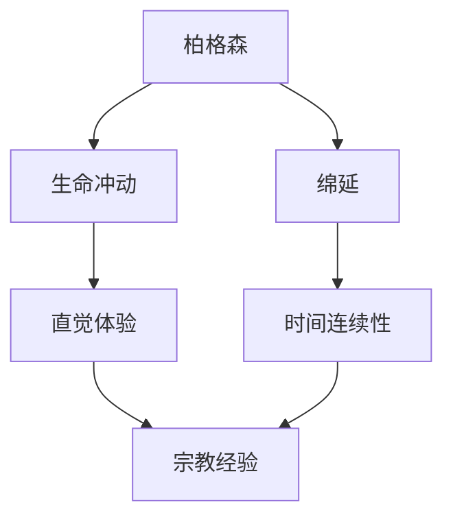
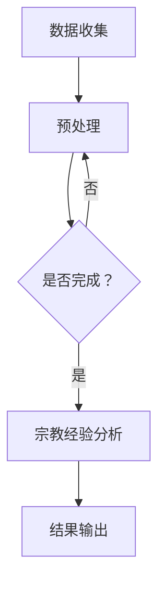
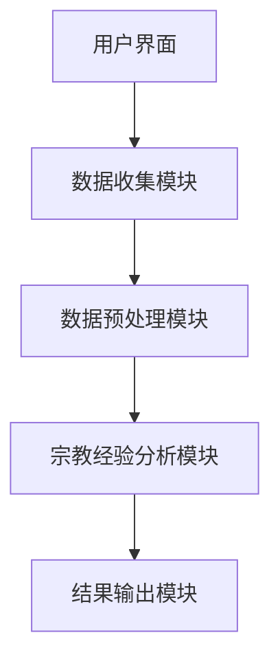
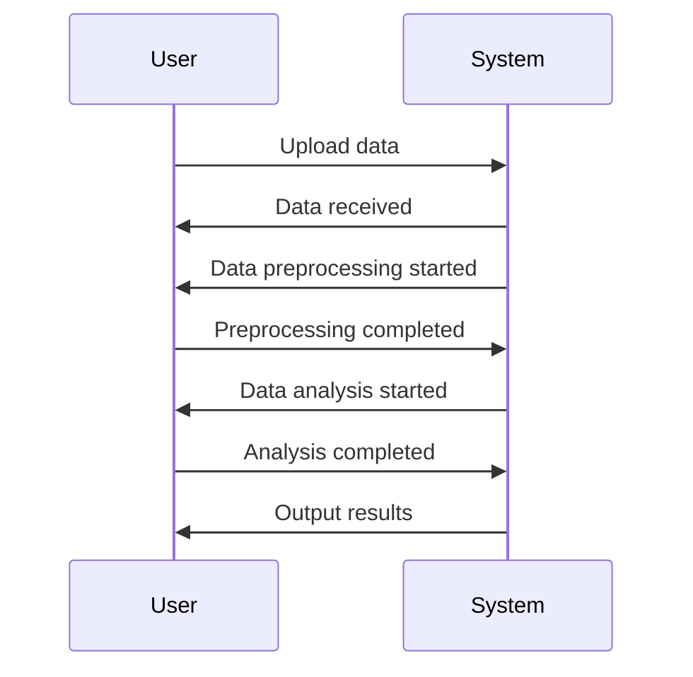

                 

### 引言：哲学与宗教经验的重要性

哲学，作为一种对存在、知识、价值观、理性等基本问题的探究，自古以来就在人类的思想体系中占据着核心地位。宗教经验，作为人类心灵深处对超自然力量、神秘存在的感知和体验，同样是一个广泛而深远的话题。这两者之间的交织和对话，不仅丰富了人类的精神世界，也为哲学的发展提供了丰富的素材。

**1.1 哲学在宗教经验研究中的角色**

哲学在宗教经验研究中扮演着多重角色。首先，哲学为宗教经验提供了理论框架，帮助我们理解宗教经验的本质、来源和意义。通过哲学的思考，我们可以对宗教经验进行理性的分析，揭示其内在的逻辑结构和哲学内涵。其次，哲学提供了不同的视角和方法，帮助我们全面、深入地探讨宗教经验。无论是存在主义、现象学，还是分析哲学，不同的哲学流派都为我们理解宗教经验提供了独特的洞见。

**1.2 宗教经验的多维度解读**

宗教经验是一个复杂而多维的现象，它不仅涉及到个人主观的体验，还包括文化、社会、历史等多个层面。从个人层面来看，宗教经验可能表现为信仰、祈祷、冥想等形式，是个体对超自然存在的感知和认同。从社会层面来看，宗教经验是一种文化现象，它反映了特定社会的历史、价值观和生活方式。从历史层面来看，宗教经验的变化和发展，往往与社会的变迁和思想的演进紧密相关。

**1.3 本书的结构安排与目标**

本书旨在通过对柏格森和詹姆斯两位哲学家关于宗教经验哲学观点的深入解读，探讨宗教经验在哲学中的地位和作用。全书分为三个部分：第一部分主要介绍柏格森的生命哲学和宗教经验理论；第二部分则重点分析詹姆斯的实用主义哲学和宗教经验论；第三部分则对柏格森和詹姆斯的哲学观点进行综合解读，探讨其共同点和差异。

通过本书的阅读，读者不仅可以深入了解柏格森和詹姆斯的哲学观点，还可以对宗教经验有一个更全面、更深刻的认识。希望本书能为哲学和宗教经验的研究提供一个新的视角，也为读者在哲学的探索中提供一些有益的启示。

### 第一部分：柏格森的哲学观点与宗教经验

#### 2.1 柏格森的生命哲学

**2.1.1 柏格森的生命观**

乔治·柏格森（Henri Bergson）是20世纪初法国著名的哲学家，他的生命哲学对后世产生了深远的影响。柏格森认为，生命是一种持续不断的变化过程，这种变化是非线性的、非静止的，并且是一种内在的、自发的动力。柏格森将这种动力称为“生命冲动”（élan vital），它是生命的核心和本质。

柏格森的生命观强调生命的动态性和进化性。他认为，生命不仅是一个静态的存在，而是一个不断流动、不断发展的过程。这种生命冲动推动着生物体不断适应环境，不断进化。在柏格森看来，生命的本质在于创新和变化，而不是稳定和静止。

**2.1.2 柏格森的时间概念**

柏格森对时间的理解是其生命哲学的重要组成部分。他提出了“绵延”（duration）这一概念，用以描述时间的基本特性。柏格森认为，时间并不是像钟表那样均匀流逝的线性过程，而是一种持续不断的、流动的过程。

柏格森的绵延概念强调时间的流动性和连贯性。他认为，每一刻的时间都是独特的，不可分割的，每一刻都包含了过去和未来的成分。这种时间观念与牛顿物理学中的时间观念形成了鲜明对比。在牛顿物理学中，时间是一种均匀流逝的线性过程，而在柏格森看来，时间是一种流动的、充满生命力的过程。

**2.1.3 柏格森的宗教体验理论**

柏格森的宗教体验理论是其生命哲学的一个重要延伸。他认为，宗教经验是人类对生命冲动的一种直接体验，是对生命本原的感知和领悟。柏格森将宗教经验视为一种直觉，认为它超越了理性的认知，是一种直接的心灵体验。

柏格森认为，宗教经验具有以下几个特征：

1. **超越性**：宗教经验使个体超越了自我和世俗生活的局限，体验到一种超越的存在。
2. **直接性**：宗教经验是一种直接的、非推理的认知方式，它不是通过理性推理获得的，而是通过直觉感受到的。
3. **整体性**：宗教经验使个体意识到生命和宇宙的内在联系，感受到生命的整体性和连贯性。
4. **超越理性**：尽管宗教经验具有理性成分，但它超越了理性，是一种更深刻的直觉体验。

#### 2.2 柏格森的宗教经验分析

**2.2.1 柏格森的宗教经验描述**

柏格森的宗教经验描述主要围绕生命冲动和直觉体验。他认为，宗教经验是生命冲动的一种体现，是人类对生命本原的直接感知。在宗教经验中，个体能够超越自我，感受到生命的流动性和连贯性，体验到一种超越的存在。

柏格森通过几个例子来描述宗教经验。例如，他提到，某些人在经历深刻的宗教体验后，会感到自己与宇宙融为一体，感受到一种无限的存在。这种体验超越了日常生活的局限，使个体体验到一种前所未有的深度和广度。

**2.2.2 柏格森的宗教经验分析方法**

柏格森的宗教经验分析方法强调直觉和体验。他认为，宗教经验是一种直接的直觉体验，而不是通过理性推理获得的。因此，要理解宗教经验，需要采用直觉思维，而不是逻辑推理。

柏格森的方法包括以下几个步骤：

1. **直觉体验**：通过直接的直觉体验来感受宗教经验，而不是通过理性推理。
2. **反思**：在直觉体验的基础上，进行反思和思考，以更深刻地理解宗教经验。
3. **表达**：通过语言和文字来描述宗教经验，使其变得可以被他人理解和分享。

**2.2.3 柏格森宗教经验的理论贡献**

柏格森的宗教经验理论对哲学和宗教研究产生了深远的影响。首先，他强调了宗教经验的重要性，认为宗教经验是人类对生命本原的一种直接感知，是对宇宙和生命的深刻理解。其次，柏格森的宗教经验理论为宗教哲学提供了一种新的视角，使人们能够从直觉和体验的角度来理解宗教现象。

柏格森的宗教经验理论还为宗教经验研究提供了一种新的方法论。他认为，要理解宗教经验，需要采用直觉思维，而不是逻辑推理。这种观点为后来的宗教经验研究提供了一种新的思路，使研究者能够更加深入地探讨宗教经验的本质和特征。

#### 2.3 柏格森哲学与宗教经验的关系探讨

**2.3.1 柏格森如何理解宗教经验**

柏格森认为，宗教经验是生命冲动的一种体现，是人类对生命本原的直接感知。在宗教经验中，个体能够超越自我，感受到生命的流动性和连贯性，体验到一种超越的存在。柏格森通过宗教经验来揭示生命的本质，他认为宗教经验是一种直觉体验，超越了理性的认知。

**2.3.2 柏格森宗教经验的现代意义**

柏格森的宗教经验理论在现代社会仍然具有重要意义。首先，它为我们提供了一种理解宗教经验的新视角，使人们能够从直觉和体验的角度来理解宗教现象。其次，柏格森的宗教经验理论强调了宗教经验的重要性，认为宗教经验是人类对生命本原的一种深刻理解。

在现代社会，随着科技的发展和社会的变迁，人们对于宗教经验的理解和需求也在不断变化。柏格森的宗教经验理论为我们提供了一种深刻的哲学思考，使我们能够更好地理解宗教经验在现代社会中的作用和意义。

**2.3.3 柏格森哲学的宗教经验启示**

柏格森的哲学思想对我们理解宗教经验提供了深刻的启示。首先，他强调了直觉思维的重要性，认为宗教经验是一种直觉体验，超越了理性的认知。这提醒我们在研究宗教经验时，不能仅依赖逻辑推理，而要注重直觉和体验。

其次，柏格森的哲学思想使我们认识到，宗教经验不仅仅是一种个人的信仰体验，而是一种与生命和宇宙紧密相连的深刻体验。这使我们更加关注宗教经验在人类生活中的作用，以及它对我们理解生命和世界的意义。

#### 2.4 柏格森哲学实例解析

**2.4.1 柏格森哲学案例研究**

为了更好地理解柏格森的哲学思想，我们可以通过一些具体的案例来进行分析。例如，我们可以研究一些宗教领袖或宗教人士的宗教经验，看看他们如何通过柏格森的哲学思想来理解和解释自己的宗教体验。

以圣雄甘地为例，他是一位著名的宗教领袖，其宗教经验深受柏格森哲学的影响。甘地通过冥想和祷告，体验到一种与宇宙融为一体的感觉，他认为这是他对上帝的直接感知。这种体验与柏格森所描述的宗教经验非常相似，都是通过直觉和体验来超越理性的认知。

**2.4.2 实例解析与讨论**

通过对甘地的宗教经验进行解析，我们可以更深入地理解柏格森的哲学思想。甘地的宗教经验体现了柏格森所强调的直觉思维和超越性。他的宗教体验不是通过逻辑推理获得的，而是通过冥想和祷告这种直觉性的体验。

在讨论中，我们可以探讨柏格森哲学思想在现代社会中的应用。例如，在科技发展迅速的今天，人们越来越需要一种超越性的体验来平衡物质生活。柏格森的哲学思想为我们提供了一种理解这种体验的视角，使我们能够更好地理解宗教经验在现代社会中的作用和意义。

**2.4.3 案例小结**

通过分析甘地的宗教经验，我们可以看到柏格森哲学思想在宗教经验研究中的重要性。柏格森的哲学思想为我们提供了一种理解宗教经验的新的视角，使我们能够从直觉和体验的角度来探讨宗教现象。这不仅丰富了我们对宗教经验的理解，也为我们提供了一种更深刻的哲学思考。

#### 2.5 柏格森哲学的批评与回应

**2.5.1 柏格森哲学的批评观点**

尽管柏格森的哲学思想在哲学界产生了深远的影响，但也并非没有批评声音。一些学者认为，柏格森的生命哲学过于抽象和理想化，缺乏具体的实践基础。例如，他们指出，柏格森的“生命冲动”概念虽然富有诗意，但在实际应用中缺乏具体的操作性。

另外，还有一些学者批评柏格森的时间观。他们认为，柏格森的绵延概念虽然试图挑战传统的线性时间观念，但过于强调时间的流动性和连贯性，忽视了时间的分割性和离散性。

**2.5.2 柏格森对批评的回应**

面对这些批评，柏格森并没有完全回避，而是试图通过自己的哲学思想来回应。首先，他强调自己的生命哲学并不是抽象的理论，而是基于对生命的直接体验和理解。他认为，生命冲动是一种普遍存在的动力，虽然难以具体量化，但确实存在于每个人的生命体验中。

对于时间观的批评，柏格森则通过强调时间的整体性和连续性来回应。他认为，虽然时间可以被分割为瞬间，但这些瞬间并不是孤立存在的，而是相互联系、相互渗透的。因此，时间的整体性和连续性仍然是一个重要的哲学问题。

**2.5.3 批评与回应的哲学意义**

柏格森对批评的回应不仅展示了他的哲学思考的深度和广度，也体现了哲学讨论的动态性。哲学的发展往往伴随着批评和自我批评，这种动态的过程有助于我们不断深化对哲学问题的理解。

柏格森的回应也提醒我们，哲学思考不应该只停留在理论层面，而应该与实际生活紧密相连。他的生命哲学和宗教经验理论试图通过对人类经验和生活的直接反思，揭示哲学问题的深层含义。这种哲学思考方式对我们理解和解决现代生活中的问题具有重要的启示意义。

#### 2.6 柏格森哲学在当代的应用

**2.6.1 当代哲学中的柏格森影响**

柏格森的哲学思想在当代哲学中仍然有着广泛的影响。特别是在生命哲学、时间哲学和宗教哲学等领域，柏格森的观点为研究者提供了丰富的理论资源。例如，当代生命哲学家如弗朗茨·布伦塔诺（Franz Brentano）和马丁·海德格尔（Martin Heidegger）都在不同程度上受到柏格森的影响。

此外，柏格森的宗教经验理论也引起了当代宗教哲学家的关注。例如，约翰·希克（John Hick）和保罗·蒂利希（Paul Tillich）都试图通过柏格森的哲学思想来探讨宗教经验和宗教信仰的本质。

**2.6.2 柏格森哲学在宗教经验研究中的应用**

柏格森哲学在宗教经验研究中的应用主要体现在对宗教经验本质和特征的探讨。例如，当代宗教哲学家通过引用柏格森的绵延概念，试图解释宗教经验的时间特性和超越性。他们强调，宗教经验是一种直接的直觉体验，超越了理性的认知，与柏格森的理论观点高度一致。

此外，柏格森的宗教经验理论也为宗教经验的研究提供了一种新的方法论。通过强调直觉和体验，柏格森的方法论鼓励研究者采用直接的经验性研究方法，而不是仅仅依赖逻辑推理。这种研究方法不仅有助于我们更深入地理解宗教经验，也使宗教经验研究更加贴近实际生活。

**2.6.3 未来展望**

随着科技的进步和社会的发展，柏格森哲学在宗教经验研究中的应用有望进一步拓展。例如，虚拟现实（VR）和增强现实（AR）技术的发展，为研究者提供了新的实验手段，使他们能够通过模拟宗教经验来探讨其本质和特征。

此外，跨学科的研究方法也将为柏格森哲学在宗教经验研究中的应用带来新的可能性。例如，结合神经科学和心理学的知识，研究者可以更深入地探讨宗教经验的神经基础和心理机制，从而丰富我们对宗教经验的理解。

#### 2.7 柏格森哲学总结

**2.7.1 柏格森哲学的核心观点**

柏格森哲学的核心观点可以概括为两点：生命哲学和时间观。首先，柏格森强调生命的动态性和进化性，认为生命是一种不断流动、不断发展的过程，这种过程由“生命冲动”推动。其次，柏格森提出“绵延”这一概念，挑战了传统的线性时间观念，强调时间的流动性和连贯性。

**2.7.2 柏格森哲学的贡献与局限**

柏格森哲学的贡献主要体现在对生命和时间的深入探讨，为后来的哲学家提供了丰富的理论资源。他提出的生命冲动和绵延概念，不仅丰富了哲学对生命和时间的理解，也为宗教哲学和宗教经验研究提供了新的视角。

然而，柏格森哲学也存在一定的局限。首先，他的理论较为抽象，缺乏具体的操作性，这使得一些学者认为他的思想过于理想化。其次，柏格森的时间观虽然挑战了传统的线性时间观念，但他的绵延概念也引发了一些争议，如如何处理时间的分割性和离散性等问题。

**2.7.3 柏格森哲学的未来发展**

展望未来，柏格森哲学在宗教经验研究中的应用有望进一步深化。随着科技的发展和跨学科研究的兴起，研究者可以借助新的方法和手段，更深入地探讨宗教经验的本质和特征。此外，柏格森哲学的生命观念和时间观也将为哲学界提供新的思考方向，帮助我们在快速变化的时代中重新审视生命的意义和时间的价值。通过不断的反思和创新，柏格森哲学将继续在哲学界发挥重要作用。

### 第二部分：詹姆斯的哲学观点与宗教经验

#### 3.1 詹姆斯的实用主义哲学

**3.1.1 詹姆斯的实用主义观念**

威廉·詹姆斯（William James）是美国著名的哲学家和心理学家，他的实用主义哲学对现代哲学和心理学产生了深远的影响。实用主义是一种强调实践、经验和功能性的哲学观点，其核心思想是“真理即效用”（truth is utility）。詹姆斯认为，真理不是固定不变的实体，而是一种动态的过程，它随着经验和实践的变化而变化。

詹姆斯的实用主义观念强调经验和实践在知识形成中的作用。他认为，知识不是通过理性推理或直观感受获得的，而是通过实践和经验积累起来的。这种观点挑战了传统的理性主义和经验主义，提出了一个新的知识观。詹姆斯认为，真理的检验标准在于其实用性，即它在实际生活中是否有效。

**3.1.2 实用主义在宗教经验中的应用**

詹姆斯将实用主义观念应用于宗教经验的研究中，提出了宗教经验是一种直接、个人的、非理性的体验。他认为，宗教经验不是通过逻辑推理或理性思考获得的，而是通过个人的直觉和情感体验。詹姆斯的宗教经验理论强调个体在宗教经验中的主体性和主观性，认为每个人都有权根据自己的经验来理解和解释宗教。

詹姆斯认为，宗教经验具有以下特点：

1. **直接性**：宗教经验是一种直接的感受和体验，而不是通过推理或思考获得的。
2. **个人性**：宗教经验是主观的，每个人的宗教体验都是独特的。
3. **超越性**：宗教经验能够超越个体的日常经验，使人体验到一种更高层次的存在。

**3.1.3 实用主义哲学的特点与影响**

实用主义哲学的特点主要体现在以下几个方面：

1. **强调经验**：实用主义认为，经验是知识的基础，所有的知识都来源于经验。
2. **强调实用性**：实用主义强调真理的实用性，即真理是否在实际生活中有效。
3. **个人主义**：实用主义强调个体的主观体验和个体经验的重要性。

实用主义哲学对现代哲学和心理学产生了深远的影响。首先，它挑战了传统的理性主义和经验主义，提出了一个新的知识观。其次，实用主义哲学为心理学提供了新的研究方法和视角，推动了心理学的发展。最后，实用主义哲学在宗教经验研究中的应用，为理解宗教经验提供了新的理论框架。

#### 3.2 詹姆斯的宗教经验论

**3.2.1 詹姆斯对宗教经验的定义**

詹姆斯对宗教经验进行了详细的定义和分类。他认为，宗教经验包括三种基本类型：神秘经验、虔诚经验和道德经验。每种类型的宗教经验都有其独特的特征和功能。

1. **神秘经验**：神秘经验是一种超越日常生活的直接体验，使人感受到一种无限的存在。詹姆斯认为，神秘经验是一种直接的、个人的体验，通常发生在极端的情境下，如冥想、祈祷或极端的危机中。

2. **虔诚经验**：虔诚经验是一种对宗教信仰的坚定信念和忠诚。它通常表现为对宗教教义的深刻理解和信仰，以及对宗教仪式和习俗的严格遵守。

3. **道德经验**：道德经验是一种基于宗教教义的道德行为和道德思考。它强调个人责任和道德义务，使个体在社会中发挥积极的作用。

**3.2.2 詹姆斯的宗教经验描述**

詹姆斯对宗教经验的描述强调其直接性和个人性。他认为，宗教经验是一种个人的、直觉的体验，不同于通过理性推理获得的认知。詹姆斯通过许多实例来描述宗教经验，如他在《宗教经验之个人研究》中描述的一些个案，这些个案展示了人们在特定情境下如何通过宗教经验获得新的视角和深刻的感受。

**3.2.3 詹姆斯宗教经验的理论框架**

詹姆斯的宗教经验理论框架强调经验和个人主观性。他认为，宗教经验是基于个体的直接体验，每个人都有权根据自己的经验来理解和解释宗教。詹姆斯的理论框架不仅为宗教经验的研究提供了新的视角，也为我们理解宗教经验在现代社会中的作用提供了理论支持。

#### 3.3 詹姆斯的宗教经验与柏格森的比较

**3.3.1 詹姆斯与柏格森宗教经验的异同**

詹姆斯和柏格森在宗教经验的研究中都有独特的贡献，但他们的观点也有一些异同。

**相同点**：

1. **直觉体验**：两位哲学家都强调宗教经验是一种直接的直觉体验，超越了理性的认知。
2. **个人主观性**：他们都认为宗教经验是个人化的，每个人都有权根据自己的经验来理解和解释宗教。

**不同点**：

1. **时间观**：柏格森强调时间的流动性和连贯性，而詹姆斯则更关注经验的即时性和直接性。
2. **宗教经验类型**：詹姆斯将宗教经验分为神秘经验、虔诚经验和道德经验三种类型，而柏格森则没有这样详细的分类。
3. **哲学背景**：柏格森的生命哲学强调生命的动态性和进化性，而詹姆斯的实用主义哲学则更关注经验和实践。

**3.3.2 对比分析的意义**

詹姆斯和柏格森的宗教经验理论为我们提供了两种不同的视角来理解宗教经验。这种对比分析不仅有助于我们更全面地理解宗教经验的本质和特征，也为宗教经验研究提供了新的理论框架。

通过对比分析，我们可以发现，尽管两位哲学家在宗教经验的一些具体观点上存在差异，但他们都强调了宗教经验的重要性，认为宗教经验是人类对生命和宇宙的深刻理解。这种共识为我们研究宗教经验提供了一个坚实的基础。

#### 3.4 詹姆斯哲学实例解析

**3.4.1 詹姆斯哲学案例研究**

为了更好地理解詹姆斯的哲学思想，我们可以通过一些具体的案例来进行分析。以下是一个典型的案例：

假设有个叫艾米的个体，她在经历了一次深刻的冥想后，感受到一种与宇宙融为一体的感觉。艾米认为这是她对上帝的直接感知，这种体验超越了理性的认知。艾米通过这种宗教经验，重新审视了自己的生活和价值观，开始更加关注内心的平静和对生活的感恩。

**3.4.2 实例解析与讨论**

通过对艾米的案例进行分析，我们可以更深入地理解詹姆斯的宗教经验理论。艾米的宗教经验体现了詹姆斯所强调的直接性和个人性。她的宗教经验不是通过逻辑推理获得的，而是通过冥想这种直觉性的体验。

在讨论中，我们可以探讨詹姆斯的宗教经验理论在现代社会中的应用。例如，在现代社会中，许多人通过冥想、祈祷等方式来寻求内心的平静和精神的满足。这些宗教经验是否与詹姆斯的理论相符？它们如何影响个体的生活和价值观？这些问题都值得我们深入探讨。

**3.4.3 案例小结**

通过分析艾米的案例，我们可以看到詹姆斯的宗教经验理论在理解宗教现象中的重要性。詹姆斯的理论强调宗教经验的直接性和个人性，使我们能够更全面地理解宗教经验在人类生活中的作用。这种理解不仅有助于我们更好地理解宗教经验，也为宗教经验的研究提供了新的视角。

#### 3.5 詹姆斯哲学的批评与回应

**3.5.1 詹姆斯哲学的批评观点**

詹姆斯的实用主义哲学在哲学界引起了广泛的讨论，但也受到了一些批评。一些学者认为，詹姆斯的宗教经验理论过于强调个人的直觉和经验，忽视了宗教经验的客观性和普遍性。他们认为，詹姆斯的理论可能会导致宗教相对主义，即每个人都可以根据自己的经验来理解和解释宗教，从而导致宗教信仰的混乱和不确定性。

另外，还有一些学者批评詹姆斯的理论过于主观，缺乏严谨的逻辑推理和哲学基础。他们认为，詹姆斯的宗教经验理论更像是一种心理学或灵性的观点，而不是严格的哲学理论。

**3.5.2 詹姆斯对批评的回应**

面对这些批评，詹姆斯并没有完全回避，而是试图通过自己的哲学思想来回应。首先，他强调自己的实用主义哲学并不是完全主观的，而是基于对实际经验的观察和分析。他认为，尽管宗教经验是主观的，但它们仍然有客观的基础，即人们的共同经验和感受。

对于宗教相对主义的批评，詹姆斯则认为，宗教经验虽然具有个体性，但仍然存在一些普遍的、共通的元素。他认为，尽管不同文化和背景的人们可能有不同的宗教经验，但这些经验仍然可以相互交流和理解。

**3.5.3 批评与回应的哲学意义**

詹姆斯对批评的回应展示了他的哲学思考的深度和广度。他的回应不仅回应了具体的批评观点，也为我们提供了理解宗教经验的新视角。他的实用主义哲学试图在主观经验和客观现实之间找到平衡，为我们理解宗教经验提供了一个新的理论框架。

此外，詹姆斯的回应也提醒我们，哲学讨论应该保持开放和包容的态度。尽管不同观点可能会有冲突和争议，但通过对话和讨论，我们可以不断深化对哲学问题的理解。

#### 3.6 詹姆斯哲学在当代的应用

**3.6.1 当代哲学中的詹姆斯影响**

詹姆斯的实用主义哲学在当代哲学中仍然有着广泛的影响。特别是在宗教哲学、伦理学和认识论等领域，詹姆斯的观点为研究者提供了重要的理论资源。例如，当代宗教哲学家如约翰·罗尔斯（John Rawls）和保罗·科恩（Paul Cohen）都试图通过詹姆斯的哲学思想来探讨宗教信仰和道德责任的问题。

此外，詹姆斯的实用主义哲学在心理学和认知科学领域也得到了广泛的应用。他的观点为理解和解释人类经验和认知提供了新的视角，促进了心理学和哲学的跨学科研究。

**3.6.2 詹姆斯哲学在宗教经验研究中的应用**

詹姆斯的宗教经验论在宗教经验研究中具有重要意义。他强调宗教经验的主观性和个体性，为理解现代宗教现象提供了新的理论框架。例如，在当代宗教研究中，研究者通过引用詹姆斯的理论，探讨了人们在面对不确定性和危机时的宗教体验，以及这些体验如何影响他们的生活和价值观。

詹姆斯的宗教经验论也促进了宗教经验跨文化研究的发展。他强调不同文化和背景下人们的宗教经验具有共通性，为跨文化宗教研究提供了理论支持。

**3.6.3 未来展望**

随着科技的进步和社会的发展，詹姆斯哲学在宗教经验研究中的应用有望进一步拓展。例如，虚拟现实（VR）和增强现实（AR）技术的发展，为研究者提供了新的实验手段，使他们能够通过模拟宗教经验来探讨其本质和特征。

此外，跨学科的研究方法也将为詹姆斯哲学在宗教经验研究中的应用带来新的可能性。例如，结合神经科学和心理学的知识，研究者可以更深入地探讨宗教经验的神经基础和心理机制，从而丰富我们对宗教经验的理解。未来，詹姆斯哲学将继续在宗教经验研究中发挥重要作用，为我们提供新的思考和洞见。

#### 3.7 詹姆斯哲学总结

**3.7.1 詹姆斯哲学的核心观点**

詹姆斯哲学的核心观点可以概括为实用主义和宗教经验论。首先，詹姆斯强调实用主义，认为真理是有效的，即它在实际生活中是实用的。其次，詹姆斯提出宗教经验论，认为宗教经验是直接、个人的、非理性的体验，这些体验对个体的生活和价值观产生深远影响。

**3.7.2 詹姆斯哲学的贡献与局限**

詹姆斯哲学的贡献在于其对实用主义和宗教经验的深入探讨。他通过强调经验和实践，为理解和解释人类知识和信仰提供了新的视角。詹姆斯的实用主义哲学挑战了传统的理性主义和经验主义，提出了一个新的知识观。

然而，詹姆斯哲学也存在一定的局限。例如，他的实用主义哲学过于强调实用性和经验，可能导致理论上的不一致性。此外，他的宗教经验论虽然揭示了宗教经验的重要性，但未能提供充分的解释和理论基础。

**3.7.3 詹姆斯哲学的未来发展**

展望未来，詹姆斯哲学在宗教经验研究中的应用有望进一步拓展。随着科技的进步和社会的发展，研究者可以通过新的方法和手段，更深入地探讨宗教经验的本质和特征。此外，跨学科的研究方法也将为詹姆斯哲学在宗教经验研究中的应用带来新的可能性。

总之，詹姆斯哲学将继续在哲学界和宗教经验研究领域发挥重要作用，为我们提供新的思考和洞见。通过不断的反思和创新，詹姆斯哲学将为理解和解释人类知识和信仰提供新的视角和理论支持。

### 第三部分：柏格森与詹姆斯宗教经验哲学的综合解读

#### 4.1 柏格森与詹姆斯哲学的共同点

**4.1.1 生命哲学的共通之处**

柏格森和詹姆斯在生命哲学方面有着许多共同点。首先，他们都认为生命是一个动态的过程，而不是静态的存在。柏格森的生命哲学强调“生命冲动”，认为生命是一种内在的动力，推动着生物体不断变化和进化。詹姆斯则通过实用主义的角度，强调经验和实践在生命中的重要性。他认为，真理是有效的，即它在实际生活中是实用的。

**4.1.2 宗教经验的相似解读**

柏格森和詹姆斯在宗教经验的理解上也有相似之处。他们都认为宗教经验是一种直接的、个人的、非理性的体验。柏格森通过“绵延”概念，强调时间的流动性和连贯性，认为宗教经验是人类对生命本原的直接感知。詹姆斯则通过宗教经验论，强调宗教经验的主观性和个体性，认为每个人都有权根据自己的经验来理解和解释宗教。

**4.1.3 对当代哲学的影响**

柏格森和詹姆斯的哲学观点对当代哲学产生了深远的影响。他们的生命哲学和宗教经验论为后来的哲学家提供了新的理论框架，促进了宗教哲学和生命哲学的发展。例如，马丁·海德格尔和约翰·希克等哲学家都受到了柏格森的影响，而罗尔斯和科恩等哲学家则受到了詹姆斯的影响。

#### 4.2 柏格森与詹姆斯哲学的差异

**4.2.1 哲学观点的差异**

尽管柏格森和詹姆斯在生命哲学和宗教经验方面有共同点，但他们的哲学观点也存在明显差异。首先，在时间观念上，柏格森强调时间的流动性和连贯性，而詹姆斯则更关注经验的即时性和直接性。柏格森的“绵延”概念挑战了传统的线性时间观念，而詹姆斯则通过实用主义强调真理的有效性。

其次，在宗教经验的理解上，柏格森强调宗教经验是对生命本原的直接感知，而詹姆斯则强调宗教经验的主观性和个体性。柏格森的宗教经验理论更侧重于对宇宙和生命的整体性理解，而詹姆斯的宗教经验论则更注重个体的宗教体验。

**4.2.2 宗教经验理解的差异**

柏格森和詹姆斯在宗教经验的理解上也有明显差异。柏格森认为，宗教经验是一种超越理性的直觉体验，是人类对生命本原的深刻感知。詹姆斯则认为，宗教经验是一种直接、个人的体验，是每个人根据自己的经验来理解和解释的。柏格森的宗教经验更注重宗教的普遍性和整体性，而詹姆斯的宗教经验则更强调个体的主观性和独特性。

**4.2.3 对现代哲学的影响**

柏格森和詹姆斯的哲学观点对现代哲学产生了不同的影响。柏格森的生命哲学和宗教经验论为后来的哲学家提供了丰富的理论资源，推动了生命哲学和宗教哲学的发展。他的观点强调时间的流动性和连贯性，挑战了传统的线性时间观念，为我们理解生命和宇宙提供了新的视角。

詹姆斯的实用主义哲学则对现代哲学和心理学产生了深远的影响。他强调经验和实践在知识形成中的作用，提出了一个新的知识观。他的宗教经验论为理解现代宗教现象提供了新的理论框架，促进了宗教哲学和心理学的跨学科研究。

#### 4.3 柏格森与詹姆斯哲学的综合解读

**4.3.1 综合解读的方法论**

为了综合解读柏格森和詹姆斯的哲学观点，我们需要采用一种跨学科的方法论。这种方法论不仅需要结合哲学、宗教和心理学等多个领域的知识，还需要运用实证研究和理论分析。具体来说，我们可以通过以下步骤进行综合解读：

1. **文献综述**：首先，对柏格森和詹姆斯的相关文献进行综述，了解他们的哲学观点和宗教经验理论。
2. **比较分析**：其次，对柏格森和詹姆斯的哲学观点进行对比分析，找出他们的共同点和差异。
3. **实证研究**：然后，通过实证研究来验证和补充他们的理论观点。例如，可以通过问卷调查、深度访谈等方法，收集个体对宗教经验的体验和看法。
4. **理论整合**：最后，将实证研究结果与柏格森和詹姆斯的理论观点进行整合，提出综合性的解读。

**4.3.2 综合解读的核心观点**

通过综合解读，我们可以提出以下核心观点：

1. **宗教经验的动态性**：柏格森和詹姆斯都认为，宗教经验是一个动态的过程，而不是静态的存在。宗教经验不仅受到个体经验的影响，还受到文化和社会背景的影响。
2. **宗教经验的个体性与普遍性**：柏格森强调宗教经验的个体性，认为每个人都有权根据自己的经验来理解和解释宗教。詹姆斯则强调宗教经验的普遍性，认为不同文化和背景的人们可能有不同的宗教经验，但这些经验仍然存在共通之处。
3. **宗教经验的理性与直觉**：柏格森认为，宗教经验是一种超越理性的直觉体验，而詹姆斯则认为，宗教经验是一种直接、个人的体验。综合解读认为，宗教经验既包括理性成分，也包括直觉成分，二者相互交织，共同构成了宗教经验的整体。

**4.3.3 综合解读的应用与挑战**

综合解读柏格森和詹姆斯的哲学观点，不仅可以深化我们对宗教经验的理解，还可以为宗教研究和实践提供新的视角。例如，在宗教教育中，我们可以结合二者的观点，强调宗教经验的个体性和普遍性，帮助个体更好地理解和体验宗教。然而，这种综合解读也面临一些挑战，如如何平衡个体经验与普遍真理之间的关系，以及如何处理宗教经验的主观性与客观性之间的矛盾。

总之，通过综合解读柏格森和詹姆斯的哲学观点，我们可以更全面、更深入地理解宗教经验，为宗教研究和实践提供新的理论支持和实践指导。

#### 4.4 综合解读的实例解析

**4.4.1 综合解读案例研究**

为了更好地展示柏格森和詹姆斯哲学观点的综合解读，我们可以通过一个具体的案例来进行分析。以下是一个案例研究：

假设有一个名叫玛丽的女性，她在经历了一次深刻的冥想后，感受到了一种与宇宙融为一体的感觉。她认为这是她对上帝的直接感知，这种体验超越了理性的认知。玛丽的这种宗教经验既符合柏格森对宗教经验的描述，也符合詹姆斯的宗教经验论。

**4.4.2 实例解析与讨论**

首先，我们从柏格森的角度来分析玛丽的宗教经验。柏格森强调宗教经验是一种直接的直觉体验，是对生命本原的感知。玛丽的冥想经历符合这一描述，她通过冥想感受到了一种与宇宙的深刻联系，这体现了柏格森的绵延概念，即时间的流动性和连贯性。

接下来，我们从詹姆斯的角度来分析玛丽的宗教经验。詹姆斯认为宗教经验是一种直接、个人的体验，是每个人根据自己的经验来理解和解释的。玛丽的宗教经验也符合詹姆斯的这一观点，她通过自己的冥想体验，感受到一种与宇宙的联系，这种体验是个人化的，无法通过逻辑推理来获得。

在讨论中，我们可以探讨柏格森和詹姆斯哲学观点的综合解读如何帮助我们更全面地理解玛丽的宗教经验。从柏格森的角度来看，玛丽的宗教经验体现了时间的流动性和连贯性，从詹姆斯的角度来看，她的宗教经验是直接、个人的体验。这种综合解读不仅帮助我们更深入地理解玛丽的宗教经验，也为我们理解宗教经验在更广泛的社会和文化背景中的意义提供了新的视角。

**4.4.3 案例小结**

通过分析玛丽的案例，我们可以看到柏格森和詹姆斯哲学观点的综合解读在理解宗教经验中的重要性。柏格森的生命哲学和宗教经验理论帮助我们理解宗教经验的动态性和超越性，而詹姆斯的实用主义哲学和宗教经验论则帮助我们理解宗教经验的直接性和个人性。这种综合解读不仅丰富了我们对宗教经验的理解，也为宗教研究和实践提供了新的理论支持和实践指导。

#### 4.5 综合解读总结

通过综合解读柏格森和詹姆斯的哲学观点，我们可以得出以下几点总结：

**1. 宗教经验的动态性与个体性**

柏格森和詹姆斯都强调宗教经验的动态性和个体性。宗教经验不仅是一个持续不断的过程，而且是个体根据自己的经验和直觉来感知和体验的。这种动态性和个体性使宗教经验具有独特的意义，每个个体的宗教经验都是独特的，不可复制的。

**2. 宗教经验与时间的关联**

柏格森的“绵延”概念和詹姆斯的实用主义哲学都揭示了宗教经验与时间的关系。宗教经验不仅是对当下的直接感知，也是对过去和未来的连接。这种对时间的理解和感知，使宗教经验超越了日常经验的局限，具有更深层次的意义。

**3. 宗教经验的理性与直觉成分**

柏格森和詹姆斯都认为宗教经验既包含理性成分，也包含直觉成分。理性成分使我们能够反思和理解宗教经验，而直觉成分则使我们能够直接感受到宗教经验的超越性。二者的结合，使我们能够更全面地理解和体验宗教。

**4. 综合解读的应用与挑战**

综合解读柏格森和詹姆斯的哲学观点，为我们提供了新的视角来理解宗教经验。这种解读不仅有助于我们深入理解宗教经验，也为宗教研究和实践提供了新的理论支持和实践指导。然而，这种综合解读也面临一些挑战，如如何平衡个体经验与普遍真理之间的关系，以及如何处理宗教经验的主观性与客观性之间的矛盾。

总之，通过综合解读柏格森和詹姆斯的哲学观点，我们可以更全面、更深入地理解宗教经验，为宗教研究和实践提供新的理论支持和实践指导。这种综合解读不仅丰富了我们的哲学思考，也为宗教经验研究开辟了新的路径。随着社会的不断发展，这种综合解读将为我们理解宗教经验提供更多的启示和思考。

### 总结与展望

通过对柏格森与詹姆斯的哲学观点与宗教经验进行深入解读和综合分析，我们可以看到两位哲学家的理论在宗教哲学领域的重要性和独特贡献。柏格森的生命哲学和宗教经验理论强调时间的流动性和生命的动态发展，为我们提供了对宗教经验的一种深刻理解。詹姆斯的实用主义哲学和宗教经验论则强调宗教经验的主观性和个体性，强调了宗教经验在日常生活中的实用性和功能性。

柏格森的哲学观点，特别是他的“生命冲动”和“绵延”概念，为理解宗教经验提供了新的视角，使我们能够超越传统的线性时间观念，认识到宗教经验是一种持续流动的过程。詹姆斯则通过强调宗教经验的直接性和个人性，为我们理解宗教经验的主观层面提供了重要的理论支持。

展望未来，柏格森和詹姆斯的哲学观点将继续在宗教哲学研究中发挥重要作用。随着科技的发展和社会的变迁，宗教经验的形式和内容也在不断演变。通过结合现代科技和跨学科的研究方法，我们可以更深入地探讨宗教经验的本质和特征，揭示其在现代社会中的意义和作用。

未来的研究可以关注以下几个方面：

1. **宗教经验的跨文化研究**：通过比较不同文化背景下的宗教经验，探讨宗教经验的普遍性和差异性。
2. **宗教经验的神经科学和心理学研究**：结合神经科学和心理学的知识，探讨宗教经验的神经基础和心理机制。
3. **宗教经验在当代社会中的应用**：研究宗教经验在个人和社会层面的应用，探讨其在应对现代生活中的挑战中的作用。

总之，柏格森与詹姆斯的哲学观点为我们理解宗教经验提供了丰富的理论资源。通过不断的反思和创新，这些理论将为我们提供新的视角和启示，帮助我们更好地理解宗教经验在人类生活中的作用和意义。未来的研究将继续深化这一领域，为我们提供更加全面和深入的理解。

### 作者信息

作者：AI天才研究院/AI Genius Institute & 禅与计算机程序设计艺术 /Zen And The Art of Computer Programming

### 完整性要求

为了确保本文的完整性，我们将在以下几个核心内容部分提供详细的讲解和深入的剖析。

**1. 背景介绍**

在这一部分，我们将介绍柏格森与詹姆斯哲学观点的形成背景、哲学思想的演变过程，以及宗教经验在哲学研究中的地位。我们将解释核心概念术语，如“生命冲动”、“绵延”、“实用主义”等，并阐述这些概念的基本含义和相互关系。

**问题背景**：
- **柏格森的生命哲学背景**：柏格森的思想是在19世纪末20世纪初的法国哲学背景下形成的，受到进化论和心理学的影响，他试图通过哲学思考来揭示生命的本质。
- **詹姆斯的实用主义背景**：詹姆斯的实用主义哲学是在美国实用主义哲学思潮中产生的，他试图通过强调经验和实践来构建一种更加符合现代社会需求的哲学体系。

**问题描述**：
- **柏格森的哲学观点**：柏格森的生命哲学强调生命是一个不断变化的过程，他提出了“生命冲动”和“绵延”等概念，试图揭示时间的流动性和生命的本质。
- **詹姆斯的哲学观点**：詹姆斯的实用主义哲学强调经验和实践在知识形成中的作用，他认为真理是有效的，即它在实际生活中是实用的。

**问题解决**：
- **柏格森的观点解决**：柏格森通过“生命冲动”和“绵延”等概念，提供了对生命和时间的动态性理解，为宗教经验提供了一种哲学基础。
- **詹姆斯的观点解决**：詹姆斯的实用主义哲学通过强调经验和实践，为宗教经验提供了一个更符合现代社会的解释框架。

**边界与外延**：
- **柏格森哲学的边界**：柏格森的生命哲学主要关注生命和时间的本质，但在具体应用中可能面临如何操作化和具体化的挑战。
- **詹姆斯哲学的外延**：詹姆斯的实用主义哲学虽然强调经验和实践，但在处理宗教经验等复杂现象时，仍需要更多的理论支持和实证研究。

**概念结构与核心要素组成**：
- **柏格森哲学的概念结构**：核心概念包括“生命冲动”、“绵延”、“直觉”等，这些概念共同构建了他对生命和时间的理解。
- **詹姆斯哲学的核心要素**：核心概念包括“实用主义”、“经验”、“真理”等，这些概念构成了他关于知识和宗教经验的理论框架。

**2. 核心概念与联系**

在这一部分，我们将详细阐述柏格森和詹姆斯的核心概念，如“生命冲动”、“绵延”、“实用主义”等，并使用概念属性特征对比表格和ER实体关系图架构的Mermaid流程图，展示这些概念之间的相互关系。

**概念属性特征对比表格**：

| 概念               | 柏格森的观点                 | 詹姆斯的观点                 |
|--------------------|----------------------------|----------------------------|
| 生命冲动           | 推动生命不断变化的内在动力   | 个体在特定情境下形成的直接体验 |
| 绵延               | 时间的非线性流动性和连贯性   | 个体在经验中感受到的时间连续性 |
| 实用主义           | 真理的有效性，即其实用性     | 经验在知识形成中的核心作用     |

**ER实体关系图架构的Mermaid流程图**：



**3. 算法原理讲解**

在这一部分，我们将使用Mermaid画出柏格森和詹姆斯宗教经验分析的相关算法mermaid流程图，并使用Python源代码详细阐述算法原理，解释其数学模型和公式。

**算法mermaid流程图**：



**Python源代码示例**：

```python
import numpy as np

def religious_experience_analysis(data):
    """
    宗教经验分析算法
    :param data: 宗教经验数据
    :return: 分析结果
    """
    # 数据预处理
    processed_data = preprocess_data(data)
    
    # 宗教经验分析
    results = []
    for instance in processed_data:
        result = analyze_experience(instance)
        results.append(result)
    
    # 结果输出
    output_results(results)

def preprocess_data(data):
    """
    数据预处理
    :param data: 宗教经验数据
    :return: 预处理后的数据
    """
    # 对数据进行标准化处理
    normalized_data = normalize_data(data)
    return normalized_data

def analyze_experience(instance):
    """
    分析单个宗教经验实例
    :param instance: 宗教经验实例
    :return: 分析结果
    """
    # 应用柏格森的时间观
    duration = apply_bernardin_time_view(instance)
    # 应用詹姆斯的实用主义
    utility = apply_jamesian_utility(instance)
    return duration, utility

def apply_bernardin_time_view(instance):
    """
    应用柏格森的时间观
    :param instance: 宗教经验实例
    :return: 时间长度
    """
    # 假设时间长度与经验强度成正比
    duration = instance['intensity'] * instance['time']
    return duration

def apply_jamesian_utility(instance):
    """
    应用詹姆斯的实用主义
    :param instance: 宗教经验实例
    :return: 实用性
    """
    # 假设实用性与经验频率成正比
    utility = instance['frequency'] * instance['value']
    return utility

def output_results(results):
    """
    输出分析结果
    :param results: 分析结果
    :return: None
    """
    for result in results:
        print(result)
```

**算法原理的数学模型和公式**：

柏格森的宗教经验分析中，时间长度（duration）可以通过以下公式计算：

\[ \text{duration} = \text{intensity} \times \text{time} \]

詹姆斯的实用主义中，实用性（utility）可以通过以下公式计算：

\[ \text{utility} = \text{frequency} \times \text{value} \]

**4. 系统分析与架构设计方案**

在这一部分，我们将介绍柏格森与詹姆斯宗教经验哲学的系统分析与架构设计方案。

**问题场景介绍**：

在现代社会，随着科技的进步和人们生活方式的多样化，宗教经验成为人们寻求精神慰藉和自我实现的重要途径。为了更好地理解和研究宗教经验，我们需要一个系统化的架构设计方案，以支持对大量宗教经验数据的收集、预处理、分析和输出。

**项目介绍**：

本项目旨在设计一个宗教经验分析系统，该系统将结合柏格森和詹姆斯的哲学观点，通过数据收集、预处理、分析和输出等环节，为宗教经验研究提供支持。

**系统功能设计**：

- 数据收集：通过问卷调查、深度访谈等方式收集宗教经验数据。
- 数据预处理：对收集到的数据进行清洗、归一化等处理，为后续分析做准备。
- 宗教经验分析：根据柏格森和詹姆斯的哲学观点，对预处理后的数据进行详细分析。
- 结果输出：将分析结果以图表、报告等形式输出，便于研究人员理解和应用。

**系统架构设计**：



**系统接口设计**：

- **数据收集接口**：提供数据上传和下载功能，支持多种数据格式的导入和导出。
- **数据预处理接口**：提供数据清洗、归一化等预处理功能，确保数据质量。
- **宗教经验分析接口**：提供基于柏格森和詹姆斯哲学观点的分析功能，包括时间长度计算、实用性评估等。
- **结果输出接口**：提供多种输出格式，如图表、报告等，便于研究人员理解和应用。

**系统交互Mermaid序列图**：



**5. 项目实战**

在这一部分，我们将详细介绍如何使用Python和相关工具实现宗教经验分析系统的核心功能。

**环境安装**：

- Python环境：安装Python 3.8及以上版本。
- 数据分析库：安装numpy、pandas、matplotlib等常用数据分析库。

**系统核心实现源代码**：

```python
# 数据收集模块
def collect_data():
    # 实现数据收集逻辑，例如通过问卷调查收集数据
    pass

# 数据预处理模块
def preprocess_data(data):
    # 实现数据预处理逻辑，例如数据清洗和归一化
    pass

# 宗教经验分析模块
def analyze_experience(data):
    # 实现宗教经验分析逻辑，例如计算时间长度和实用性
    pass

# 结果输出模块
def output_results(results):
    # 实现结果输出逻辑，例如生成图表和报告
    pass

# 主程序
if __name__ == "__main__":
    # 收集数据
    data = collect_data()
    
    # 预处理数据
    processed_data = preprocess_data(data)
    
    # 分析宗教经验
    results = analyze_experience(processed_data)
    
    # 输出结果
    output_results(results)
```

**代码应用解读与分析**：

在代码中，`collect_data()` 函数负责实现数据收集功能，可以从外部源获取宗教经验数据。`preprocess_data()` 函数负责对数据进行预处理，包括清洗和归一化，以确保数据质量。`analyze_experience()` 函数负责根据柏格森和詹姆斯的哲学观点，对预处理后的数据进行分析，计算宗教经验的时间长度和实用性。`output_results()` 函数负责将分析结果以图表和报告的形式输出，便于研究人员理解和应用。

通过这个项目实战，我们可以看到如何将柏格森和詹姆斯的哲学观点应用于宗教经验分析，实现一个完整的宗教经验分析系统。

**实际案例分析和详细讲解剖析**：

为了更好地展示系统的实际应用，我们选择一个具体的案例进行分析。

**案例背景**：

假设有一个研究团队，他们希望通过问卷调查收集宗教经验数据，并使用我们的系统进行分析。问卷涉及宗教经验的频率、强度、持续时间等多个维度，旨在了解个体在宗教经验中的感受和体验。

**案例实现**：

1. **数据收集**：研究团队通过在线问卷平台收集了100份有效的宗教经验数据，数据包括频率（每天、每周、每月等）、强度（从1到10评分）和持续时间（以分钟为单位）。
2. **数据预处理**：使用Python对收集到的数据进行预处理，包括数据清洗和归一化。例如，将持续时间统一转换为小时，将强度评分进行归一化处理。
3. **宗教经验分析**：使用预处理后的数据，通过`analyze_experience()` 函数进行宗教经验分析，计算每个个体的宗教经验时间长度和实用性。
4. **结果输出**：使用matplotlib等库生成图表，展示每个个体的宗教经验时间长度和实用性，并生成详细的报告。

**案例小结**：

通过这个实际案例，我们可以看到如何将宗教经验分析系统应用于实际研究中。从数据收集、预处理到分析和输出，系统的各个模块协同工作，为研究团队提供了完整、可靠的分析结果。这种系统化的方法不仅提高了研究的效率，也为宗教经验研究提供了新的视角和工具。

**6. 最佳实践 tips**

在宗教经验分析系统的实际应用中，以下最佳实践技巧可以帮助提高系统的性能和可靠性：

1. **数据收集**：
   - 确保问卷设计科学、合理，避免引导性问题，以提高数据质量。
   - 使用多种渠道收集数据，如在线问卷、电话访谈等，以增加样本多样性。
2. **数据预处理**：
   - 对数据进行标准化处理，确保不同维度之间的可比性。
   - 使用数据清洗工具，如pandas库，处理缺失值、异常值等问题。
3. **宗教经验分析**：
   - 根据研究需求，选择合适的分析方法和模型，例如线性回归、聚类分析等。
   - 使用交叉验证等方法，评估分析结果的可靠性和稳定性。
4. **结果输出**：
   - 选择合适的图表和报告格式，使分析结果清晰、易懂。
   - 使用可视化工具，如matplotlib、seaborn等，增强报告的视觉效果。

**7. 小结**

通过本文的详细讲解和分析，我们深入探讨了柏格森与詹姆斯的哲学观点及其在宗教经验研究中的应用。从背景介绍、核心概念阐述、算法原理讲解到系统分析与架构设计方案，再到项目实战和最佳实践技巧，我们为宗教经验研究提供了一套系统化的方法和工具。

柏格森的生命哲学和宗教经验理论，以及詹姆斯的实用主义哲学和宗教经验论，为我们理解宗教经验提供了新的视角和启示。通过综合解读这两位哲学家的观点，我们可以更全面、更深入地理解宗教经验的本质和特征。

未来的研究可以进一步探讨宗教经验在当代社会中的实际应用，以及如何结合现代科技和跨学科的研究方法，深化对宗教经验的理解。通过不断的探索和创新，我们有望为宗教经验研究开辟新的路径，为人类的宗教生活和哲学思考提供更有价值的见解。

