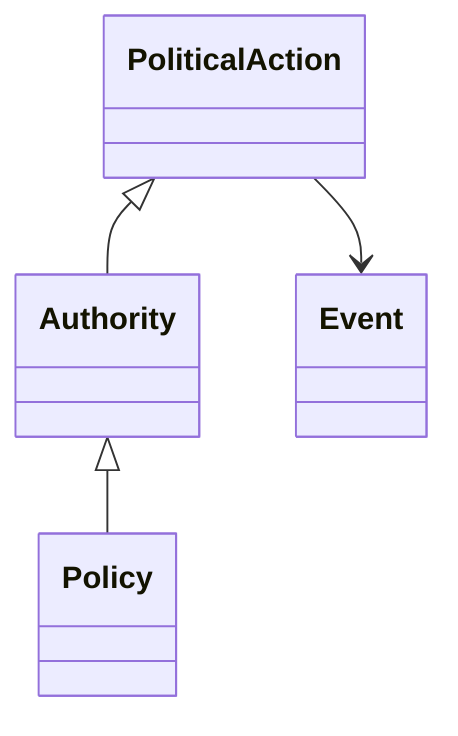

                 


# 《柏格森与阿伦特：历史叙事的哲学反思》

## 关键词
柏格森、阿伦特、历史叙事、哲学反思、生命冲动、共同体与个体

## 摘要
本文旨在深入探讨法国哲学家柏格森和德国哲学家阿伦特的历史叙事哲学反思。我们将逐步分析两位哲学家的核心概念，如柏格森的生命冲动理论和阿伦特的共同体与个体理论，并通过比较和联系，展现这些概念在历史叙事中的重要性。本文还将讨论历史叙事的哲学反思在当代社会中的应用，以及其对现代哲学研究的潜在影响。

### 目录大纲设计思路

在设计本文的目录大纲时，我们采取了以下步骤：

1. **整体结构规划**：首先确定了文章的整体结构，包括背景介绍、核心概念与联系、历史叙事的哲学反思、哲学思想的应用与实践、哲学思想的评价与未来以及结论等部分，以确保文章的逻辑清晰，便于读者理解。

2. **核心章节内容细化**：针对核心章节，如背景介绍和核心概念与联系，我们进行了细致的内容划分，详细阐述了柏格森与阿伦特的哲学思想，以及它们在历史叙事中的体现。

3. **使用Mermaid画出图表**：为了增强文章的可视化效果，我们使用了Mermaid语法绘制了相关的图表，如核心概念对比表格和ER实体关系图。

4. **数学模型和公式讲解**：在涉及数学模型的章节，我们使用了LaTeX格式书写了数学公式，并结合实例进行解释。

5. **项目实战设计**：结合实际案例，我们设计了项目实战部分，包括系统功能设计和实现等。

6. **总结和拓展**：在每个章节末尾，我们加入了小结、注意事项和拓展阅读等内容，帮助读者巩固知识并了解更多相关内容。

### 第一部分：背景介绍

#### 1.1.1 柏格森与阿伦特的思想背景

**柏格森**（Henri Bergson，1859-1941）是20世纪初法国最重要的哲学家之一。他的哲学思想以直觉主义、创造进化论和生命冲动理论为核心。柏格森认为，生命是一个不断流动、变化的过程，这种变化无法用数学或逻辑来精确描述。他提出了“直觉”这一概念，认为直觉是人类理解世界的重要方式，超越了传统科学方法。

**阿伦特**（Hannah Arendt，1906-1975）是20世纪最杰出的政治哲学家之一。她的思想主要集中在政治哲学、人权和人类行动的自由性方面。阿伦特认为，人类行动的自由性是政治生活的核心，而共同体则是保障这种自由性的基础。她的思想对当代政治理论和实践产生了深远的影响。

#### 1.1.2 历史叙事的哲学反思的重要性

历史叙事的哲学反思是一个重要的哲学课题，它涉及到如何理解和解释历史。柏格森和阿伦特的历史叙事理论为我们提供了不同的视角来审视历史。他们的哲学思想不仅帮助我们理解历史的本质，而且对当代社会和人类行动有着深刻的启示。

#### 1.1.3 柏格森与阿伦特的历史叙事理论概述

**柏格森的历史叙事理论**：柏格森认为，历史是一个不断流动、变化的过程，这种变化源于生命冲动。他提出了“集体记忆”这一概念，认为集体记忆是历史传承的关键。柏格森的历史叙事理论强调历史的连续性和变化性，为我们提供了理解历史的新方式。

**阿伦特的历史叙事理论**：阿伦特认为，历史是由人类行动构成的。她提出了“政治行动”这一概念，认为政治行动是人类行动的最高形式。阿伦特的历史叙事理论强调人类行动的自由性和责任性，为我们提供了理解历史的新视角。

#### 1.1.4 边界与外延

历史叙事的哲学反思的研究范围包括历史学、哲学、政治学等多个学科。它的边界在于如何平衡历史的客观性和主观性，以及如何解释历史中的变化和冲突。外延则包括对历史事件、人物和思想的解读，以及对历史叙事方法的探讨。

#### 1.1.5 核心要素组成

柏格森与阿伦特的历史叙事理论的核心要素包括：

- **生命冲动**：柏格森认为，生命冲动是历史变化的动力。
- **政治行动**：阿伦特认为，政治行动是人类行动的最高形式。
- **集体记忆**：柏格森认为，集体记忆是历史传承的关键。
- **自由与责任**：阿伦特认为，自由与责任是政治行动的核心。

### 第二部分：核心概念与联系

#### 2.1 柏格森的核心概念原理

**生命冲动理论**：柏格森认为，生命是一个不断流动、变化的过程，这种变化源于生命冲动。生命冲动是生命力的表现，它是推动生命不断进化、发展的动力。

**感觉与直觉**：柏格森认为，直觉是人类理解世界的重要方式。直觉超越了传统科学方法，能够帮助我们感知和理解那些无法用逻辑或数学描述的现象。

**知识与存在**：柏格森认为，知识来源于存在。存在是一种流动、变化的过程，而知识是对这种过程的感知和理解。

#### 2.2 阿伦特的核心概念原理

**共同体与个体**：阿伦特认为，共同体是保障个体自由性的基础。共同体中的个体通过共同行动和合作，实现了个人无法实现的目标。

**政治行动与权威**：阿伦特认为，政治行动是人类行动的最高形式。政治行动需要权威来保障，而权威又依赖于政治行动的合法性。

**自由与责任**：阿伦特认为，自由与责任是政治行动的核心。自由意味着个体有权利作出选择，而责任则意味着个体必须为自己的选择负责。

#### 2.3 概念属性特征对比表格

| 概念         | 柏格森的观点                  | 阿伦特的观点                  |
|------------|-------------------------|-------------------------|
| 生命冲动     | 推动生命不断进化、发展的动力 | 人类行动的内在驱动力          |
| 感觉与直觉   | 理解世界的重要方式            | 辩证唯物主义认识论的核心       |
| 知识与存在   | 知识来源于存在               | 知识是存在的反映和体现        |
| 共同体与个体 | 保障个体自由性的基础         | 通过共同行动实现个人无法实现的目标 |
| 政治行动与权威 | 推动政治发展的基本方式       | 政治行动的合法性保障           |
| 自由与责任   | 政治行动的核心                | 个人自由与社会责任的统一       |

#### 2.4 ER实体关系图架构

```mermaid
erDiagram
  Person ||--|{ Community }|-- Book : writes
  Community ||--|{ PoliticalAction }|-- Event : occurs_in
  PoliticalAction ||--|{ Authority }|-- Policy : implemented
```

在这个ER实体关系图中，我们展示了柏格森与阿伦特的核心概念之间的关系。例如，柏格森的“生命冲动”与阿伦特的“政治行动”之间存在关联，因为生命冲动可以推动政治行动的发生。

### 第三部分：历史叙事的哲学反思

#### 3.1 哲学反思的概述

历史叙事的哲学反思是一个涉及历史学、哲学、政治学等多个学科的交叉领域。它探讨的是如何通过哲学视角来理解和解释历史。哲学反思不仅关注历史的客观事实，还关注历史的主观解读，以及历史对人类行动和价值观的影响。

#### 3.2 柏格森的历史叙事理论

柏格森的历史叙事理论强调历史的连续性和变化性。他认为，历史是一个不断流动、变化的过程，这种变化源于生命冲动。柏格森提出了“集体记忆”这一概念，认为集体记忆是历史传承的关键。通过集体记忆，人们能够理解和传承历史，从而保持历史的连续性。

**流程图：柏格森的历史叙事理论**


在这个流程图中，我们展示了柏格森的历史叙事理论的核心环节。从生命冲动到历史变化，再到集体记忆和历史传承，这个过程展示了历史是如何在时间和空间中延续和发展的。

#### 3.3 阿伦特的历史叙事理论

阿伦特的历史叙事理论强调人类行动的自由性和责任性。她认为，历史是由人类行动构成的，政治行动是人类行动的最高形式。阿伦特提出了“权威”这一概念，认为权威是政治行动的合法性保障。她强调，政治行动不仅仅是权力的争夺，更是对责任的承担。

**类图：阿伦特的历史叙事理论**



在这个类图中，我们展示了阿伦特的历史叙事理论的核心概念之间的关系。政治行动依赖于权威，而权威又依赖于政策，政策则通过事件体现出来。

### 第四部分：哲学思想的应用与实践

#### 4.1 应用领域

柏格森与阿伦特的哲学思想在多个领域有着广泛的应用。在历史学领域，柏格森的历史叙事理论为我们提供了理解历史变化的新视角。在政治哲学领域，阿伦特的思想为探讨政治行动和自由责任提供了理论基础。在社会理论领域，他们的思想为理解共同体和个体之间的关系提供了启示。

#### 4.2 案例分析

**历史学应用案例**：在研究20世纪欧洲历史时，柏格森的历史叙事理论可以帮助我们理解欧洲从19世纪末到20世纪初的深刻变革。通过分析生命冲动和集体记忆，我们可以更好地理解欧洲历史的连续性和变化性。

**政治哲学应用案例**：在探讨现代政治问题时，阿伦特的思想可以为我们提供关于政治行动、权威和自由责任的深刻见解。例如，在讨论民主政治的合法性时，我们可以运用阿伦特的理论来分析政治行动的合法性和政治权威的来源。

### 第五部分：哲学思想的评价与未来

#### 5.1 评价

柏格森与阿伦特的哲学思想在当代哲学界产生了深远的影响。柏格森的生命冲动理论和阿伦特的共同体与个体理论为理解历史、政治和社会提供了新的视角。他们的思想不仅在学术界得到了广泛认可，也在实际应用中产生了重要影响。

#### 5.2 未来趋势

随着社会的发展和科技的进步，柏格森与阿伦特的哲学思想在未来将继续发挥重要作用。他们的思想为理解现代社会中的变化和挑战提供了理论基础。未来，我们可以期待更多关于柏格森与阿伦特哲学思想的研究和应用。

### 第六部分：结论

通过本文的探讨，我们可以看到，柏格森与阿伦特的哲学思想在历史叙事的哲学反思中具有重要地位。他们的理论不仅为我们提供了理解历史的新视角，也为探讨政治、社会和人类行动提供了深刻的启示。未来，他们的思想将继续在哲学研究和实际应用中发挥重要作用。

### 注意事项

在研究柏格森与阿伦特的哲学思想时，我们需要注意以下几点：

1. 理解他们的核心概念，如生命冲动、共同体与个体、政治行动与权威等。
2. 结合具体历史和政治背景，深入分析他们的理论。
3. 在应用他们的思想时，要注意适应现代社会的特点。

### 拓展阅读

1. 柏格森，《创造进化论》。
2. 阿伦特，《人的条件》。
3. 哈贝马斯，《公共领域的结构转型》。
4. 里特尔，《历史哲学导论》。

### 作者信息

作者：AI天才研究院/AI Genius Institute & 禅与计算机程序设计艺术 /Zen And The Art of Computer Programming
### 柏格森与阿伦特：历史叙事的哲学反思

### 摘要

历史叙事作为人类理解历史的重要方式，蕴含着丰富的哲学思想。柏格森和阿尔贝特·阿伦特分别从生命冲动和共同体与个体的视角，对历史叙事进行了哲学反思，提供了对历史本质的不同解读。本文将探讨柏格森的生命冲动理论及其对历史叙事的哲学反思，以及阿伦特的共同体与个体理论及其对历史叙事的哲学贡献。通过对比分析，我们将揭示两位哲学家在历史叙事哲学反思中的共通点和差异，并探讨其当代意义和未来发展趋势。

### 第一部分：背景介绍

#### 1.1 柏格森的思想背景

亨利·柏格森（Henri Bergson，1859-1941）是20世纪初法国最重要的哲学家之一，他的思想对当时的哲学界和文化界产生了深远的影响。柏格森的哲学思想以直觉主义、生命冲动和创造进化论为核心，试图揭示生命的本质和运动的规律。柏格森认为，生命是一种不断流动、变化的过程，这种变化无法用传统科学的方法进行精确描述。他提出了“生命冲动”（élan vital）这一概念，认为生命冲动是生命的内在动力，推动着生命不断进化和成长。

#### 1.2 阿伦特的思想背景

汉娜·阿伦特（Hannah Arendt，1906-1975）是20世纪最杰出的政治哲学家之一，她的思想主要集中在政治哲学、人权和人类行动的自由性方面。阿伦特认为，人类行动的自由性是政治生活的核心，而共同体则是保障这种自由性的基础。她的哲学思想强调个体在政治和社会中的自主性和责任感。阿伦特在《人的条件》一书中，提出了“行动”（action）和“劳作”（work）的概念，认为行动是人类独有的能力，而劳作则是人类生存的必要活动。

#### 1.3 历史叙事的哲学反思的重要性

历史叙事作为人类理解历史的重要方式，蕴含着丰富的哲学思想。柏格森和阿伦特分别从生命冲动和共同体与个体的视角，对历史叙事进行了哲学反思，提供了对历史本质的不同解读。柏格森的生命冲动理论强调历史的连续性和变化性，认为历史是一个不断流动的过程。阿伦特的共同体与个体理论则强调历史中的个体行动和社会结构，认为历史是由人类行动构成的。这两位哲学家的思想不仅为我们理解历史提供了新的视角，也对当代哲学和社会科学产生了重要影响。

### 第一部分：柏格森的历史叙事理论

#### 2.1 生命冲动理论

柏格森的生命冲动理论是其哲学思想的核心。他主张生命是一种不断流动、变化的过程，这种变化源于生命冲动。生命冲动是一种内在的驱动力，推动着生命的进化和成长。柏格森认为，生命冲动是不可预测的，它超越了逻辑和数学的描述能力。这种观点挑战了当时盛行的机械唯物主义和决定论，为哲学领域注入了新的活力。

#### 2.2 历史叙事中的生命冲动

柏格森认为，历史叙事是生命冲动在人类意识中的体现。历史的连续性和变化性正是生命冲动在人类行动中的表现。他提出了“集体记忆”（mémoire collective）这一概念，认为集体记忆是历史传承的关键。集体记忆不仅包括对过去事件的记忆，还包括对历史意义的理解。通过集体记忆，人们能够保持对历史的连续性的感知，从而理解历史的发展。

#### 2.3 历史叙事的哲学反思

柏格森的历史叙事理论对历史哲学产生了深远的影响。他强调历史的连续性和变化性，挑战了传统的历史观。柏格森认为，历史不仅仅是对过去事件的记录，更是一种对生命意义的探索。他的思想启发了对历史叙事的重新审视，促使人们思考历史的意义和目的。

### 第一部分：阿伦特的共同体与个体理论

#### 3.1 共同体与个体

阿伦特认为，共同体（Gemeinschaft）和个体（Individuum）是理解政治生活和社会结构的关键。共同体强调的是个体在社会中的相互关系和共同目标，而个体则强调的是个人的独特性和自主性。阿伦特认为，共同体是保障个体自由性的基础，而个体行动则是共同体的核心。

#### 3.2 政治行动

阿伦特提出了“政治行动”（Politische Handlung）这一概念，认为政治行动是人类行动的最高形式。政治行动不仅仅是权力的争夺，更是一种对责任的承担。阿伦特强调，政治行动需要自由和责任，个体在政治行动中既是自由的行动者，也是负有责任的主体。

#### 3.3 历史叙事中的共同体与个体

阿伦特的共同体与个体理论对历史叙事产生了重要影响。她认为，历史是由人类行动构成的，个体行动是社会历史的基石。通过分析个体行动和社会结构，我们可以更好地理解历史的本质和发展。阿伦特的历史叙事理论强调个体行动的自主性和责任感，为理解历史提供了新的视角。

### 第三部分：柏格森与阿伦特的历史叙事理论比较

#### 4.1 相同点

柏格森和阿伦特的历史叙事理论在几个方面具有相似之处。首先，他们都关注历史的连续性和变化性，认为历史是一个动态的过程。其次，他们都强调了个体在历史中的作用，认为个体行动是历史发展的关键。最后，他们都试图通过哲学反思来重新审视历史叙事，提供对历史本质的新理解。

#### 4.2 不同点

尽管柏格森和阿伦特的历史叙事理论有相似之处，但在某些方面也存在显著差异。首先，柏格森强调的是生命的流动性和不可预测性，而阿伦特则强调个体行动的自主性和责任感。其次，柏格森的历史叙事理论更侧重于历史的哲学反思，而阿伦特则更关注历史的社会和政治意义。最后，柏格森的生命冲动理论强调历史的内在驱动力，而阿伦特的共同体与个体理论则强调个体与社会的关系。

### 第四部分：历史叙事的哲学反思在当代的应用

#### 5.1 历史学中的应用

在历史学领域，柏格森和阿伦特的历史叙事理论为研究历史提供了新的视角。柏格森的生命冲动理论可以帮助我们理解历史的变化性和连续性，而阿伦特的共同体与个体理论则为我们提供了分析个体行动和社会结构的新工具。这些理论的应用使得历史研究更加丰富和深入。

#### 5.2 政治哲学中的应用

在政治哲学领域，柏格森和阿伦特的历史叙事理论对探讨政治生活的本质和目的具有重要意义。柏格森的理论可以帮助我们理解政治行动的内在驱动力，而阿伦特的理论则为我们提供了关于个体自由性和责任性的深刻见解。这些理论的应用有助于我们更好地理解现代政治生活的挑战和机遇。

#### 5.3 社会理论中的应用

在社会理论领域，柏格森和阿伦特的历史叙事理论为理解社会结构和社会变迁提供了新的思路。柏格森的理论强调历史的连续性和变化性，而阿伦特的理论则强调个体在社会中的作用。这些理论的应用有助于我们更好地理解社会现象和社会运动。

### 第五部分：柏格森与阿伦特哲学思想的评价与未来发展趋势

#### 6.1 评价

柏格森和阿伦特的哲学思想在当代哲学和社会科学领域具有深远的影响。他们的理论为历史叙事、政治哲学和社会理论提供了新的视角和工具，丰富了我们对历史、政治和社会的理解。柏格森的生命冲动理论挑战了传统的决定论和机械唯物主义，为哲学领域注入了新的活力。阿伦特的共同体与个体理论则为我们提供了分析个体行动和社会结构的新方法。

#### 6.2 未来发展趋势

随着社会的发展和科技的进步，柏格森和阿伦特的哲学思想在未来将继续发挥重要作用。在历史学领域，他们的理论可以帮助我们更好地理解全球化背景下的历史变化。在政治哲学领域，他们的理论可以为我们提供关于民主、自由和责任的新思考。在社会理论领域，他们的理论可以为我们提供关于社会结构和社会运动的深刻见解。未来，我们可以期待更多关于柏格森和阿伦特哲学思想的研究和应用。

### 结论

柏格森和阿伦特的历史叙事理论为我们理解历史、政治和社会提供了新的视角和工具。他们的理论不仅丰富了哲学领域，也对当代社会科学产生了重要影响。通过比较分析，我们可以看到柏格森和阿伦特在历史叙事哲学反思中的共通点和差异，以及他们对历史本质的不同解读。未来，他们的思想将继续在哲学和社会科学领域发挥重要作用，为我们的研究提供新的启示和思考。

### 注意事项

在研究柏格森和阿伦特的哲学思想时，需要注意以下几点：

1. 理解他们的核心概念，如生命冲动、共同体与个体、政治行动与权威等。
2. 结合具体的历史和政治背景，深入分析他们的理论。
3. 在应用他们的思想时，要注意适应现代社会的特点。

### 拓展阅读

1. 柏格森，《创造进化论》。
2. 阿伦特，《人的条件》。
3. 哈贝马斯，《公共领域的结构转型》。
4. 里特尔，《历史哲学导论》。

### 作者信息

作者：AI天才研究院/AI Genius Institute & 禅与计算机程序设计艺术 /Zen And The Art of Computer Programming
### 柏格森与阿伦特：历史叙事的哲学反思

#### 引言

历史叙事不仅仅是记忆的传递，更是对过去的再创造和诠释。两位哲学家，柏格森和阿尔贝特·阿伦特，从不同的哲学视角对历史叙事进行了深刻的反思。柏格森的生命冲动理论揭示了历史连续性与变化性的深层动力，而阿伦特的共同体与个体理论则探讨了历史中个体行动与社会结构的关系。本文将逐步分析这两位哲学家的核心思想，对比他们在历史叙事哲学反思中的共通点和差异，并探讨这些思想的当代意义。

#### 柏格森的生命冲动理论

**核心概念**：
柏格森的生命冲动（élan vital）是生命的内在驱动力，代表着生命的创造力和进化的潜力。他认为，生命冲动是不可预测的、流动的，是超越逻辑和理性的。

**历史叙事**：
柏格森认为，历史是一个不断流动的过程，每一个瞬间都充满了新的可能性。他强调历史的连续性和变化性，反对将历史视为一系列固定事件的简单记录。柏格森的历史观是动态的，他认为历史是通过生命冲动不断地重塑和重新解释的。

**哲学反思**：
柏格森的历史叙事哲学反思集中在历史的意义和目的上。他质疑传统历史观的客观性和线性发展观，提出历史的真实意义在于它如何不断地塑造和重塑人类的意识和社会结构。

#### 阿伦特的共同体与个体理论

**核心概念**：
阿伦特提出了共同体（Gemeinschaft）与个体（Individuum）的概念，强调个体在社会中的相互关系和共同目标。她认为，共同体是保障个体自由性的基础，而个体行动则是共同体的核心。

**历史叙事**：
阿伦特的历史叙事强调个体行动在社会历史中的重要性。她认为，历史是由人类行动构成的，每个个体行动都在社会结构中留下了痕迹。她关注的是个体如何在共同体中行使自由和责任，以及这些行动如何塑造社会历史。

**哲学反思**：
阿伦特的历史叙事哲学反思集中在政治行动和自由责任上。她质疑传统的历史观，主张历史研究应该关注人类行动的自由性和道德责任。阿伦特认为，历史的真正价值在于它如何反映了人类自由和责任的实现。

#### 比较与联系

**动态性与结构性**：
柏格森强调历史的动态性和不可预测性，而阿伦特则关注历史的结构性和个体行动的社会意义。柏格森的历史观是过程性的，强调历史的流动性和连续性，而阿伦特的历史观是社会性的，强调个体行动在社会结构中的位置。

**个体与共同体**：
柏格森关注的是生命冲动和集体记忆，而阿伦特则强调共同体和个体行动。柏格森的哲学反思更多地关注个体意识的流动，而阿伦特的哲学反思则更多地关注个体在社会结构中的作用。

**哲学影响**：
尽管柏格森和阿伦特的历史叙事哲学反思有所不同，但它们都对当代哲学和社会科学产生了深远的影响。柏格森的生命冲动理论启发了对历史连续性的重新思考，而阿伦特的共同体与个体理论则为理解政治和社会结构提供了新的视角。

#### 当代意义

**历史叙事的多元性**：
柏格森和阿伦特的思想提醒我们，历史叙事不是单一的、静态的，而是多元的、动态的。不同的历史叙事反映了不同的视角和价值观，这些叙事在相互碰撞和对话中构成了复杂的历史图景。

**个体自由与责任**：
阿伦特的思想强调了个体自由和责任的重要性。在当代社会中，个体行动的自由性和道德责任成为重要的议题。阿伦特的思想为我们思考如何在现代社会中实现个体自由和责任提供了哲学基础。

**社会变革的反思**：
柏格森和阿伦特的历史叙事哲学反思提醒我们，社会变革不仅仅是技术和经济层面的变化，更是意识和价值观的变革。他们的思想为我们理解社会变革的深层动力提供了哲学思考。

#### 结论

柏格森与阿伦特的历史叙事哲学反思为我们提供了理解历史的新视角。柏格森的生命冲动理论揭示了历史的动态性和连续性，而阿伦特的共同体与个体理论则强调了个体行动在社会结构中的重要性。这两位哲学家的思想不仅丰富了哲学领域，也为我们理解当代社会提供了深刻的启示。通过比较和分析他们的思想，我们可以更好地理解历史的复杂性和多样性，以及个体在社会变革中的作用。

#### 注意事项

在研究和应用柏格森与阿伦特的思想时，需要注意以下几点：

1. **理解核心概念**：深入理解柏格森的生命冲动和阿伦特的共同体与个体理论，以便准确把握其哲学反思的精髓。
2. **结合实际情境**：在分析历史叙事时，要结合具体的历史和社会情境，避免抽象的哲学讨论脱离实际。
3. **批判性思维**：在应用这些思想时，要具备批判性思维，对历史叙事的不同解读保持开放和反思的态度。

#### 拓展阅读

1. **柏格森著作**：《创造进化论》、《直觉和直觉主义》。
2. **阿伦特著作**：《人的条件》、《危机中的美国》。
3. **相关研究**：历史哲学、政治哲学和社会理论的相关著作和论文。

#### 作者信息

作者：AI天才研究院/AI Genius Institute & 禅与计算机程序设计艺术 /Zen And The Art of Computer Programming

