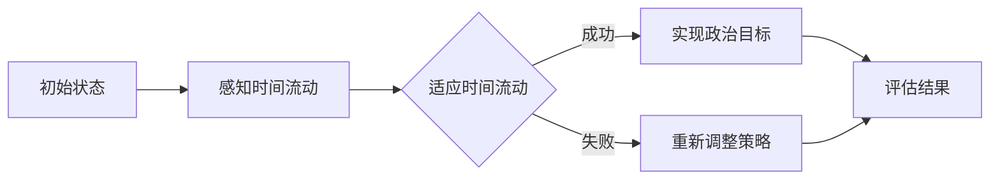
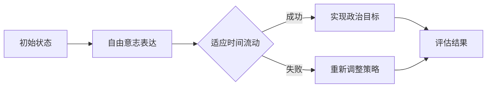

                 

### 引言

#### 1.1 背景介绍

在政治哲学领域，柏格森（Henri Bergson）与阿伦特（Hannah Arendt）都是极具影响力的思想家。柏格森以其生命哲学和持续主义哲学著称，他的思想深刻影响了现代哲学和人文科学。阿伦特则以其共和主义理论和对于现代政治的批判性思考而闻名。这两位思想家虽然处于不同的历史时期，但他们的政治哲学却有着某种内在的联系。

**问题背景**：柏格森与阿伦特在政治哲学领域的重要地位及其相互关系。柏格森的生命哲学强调时间的流动性和生命的连续性，而阿伦特的共和主义则关注个体在公共空间中的自由和行动。两者都在不同的层面探讨了政治行动的时间维度。

**问题描述**：本文旨在探讨柏格森与阿伦特的政治行动时间维度，并分析其在现实政治中的应用。具体而言，我们将深入分析两位思想家的核心政治哲学思想，揭示他们在政治行动时间维度上的共同点与差异，并探讨这些思想对当代政治理论的意义。

**问题解决**：通过详细分析柏格森的生命哲学与阿伦特的共和主义理论，我们将揭示两者在政治行动时间维度上的内在联系，并探讨如何将他们的思想应用于现实政治中，以应对当代政治挑战。

**边界与外延**：本文讨论的政治行动时间维度不仅涉及历史和政治理论，还包括当代政治现实中的应用。通过将柏格森与阿伦特的思想与现代政治理论相结合，我们希望拓展这一概念的外延，使其在更广泛的领域中具有实际意义。

**概念结构与核心要素组成**：

- **柏格森的生命哲学**：核心概念包括生命冲动、时间意识、绵延。柏格森认为，生命冲动是一种内在的、不可预测的力量，它推动着生命的进化。时间意识则是指人类对于时间流动的感知能力，而绵延则是时间的一种本质形式，它不同于物理学中的线性时间。

- **阿伦特的共和主义理论**：核心概念包括共和主义、政治行动、公共空间。阿伦特认为，共和主义是一种强调个体自由和集体行动的政治理念，它强调个体的参与和对话。政治行动则是指个体在公共空间中的自由表达和行动，而公共空间则是政治行动的场所。

通过以上对背景介绍、问题、解决方法和概念结构的分析，我们为后续章节的深入讨论奠定了基础。

#### 1.2 核心问题

在探讨柏格森与阿伦特的政治哲学时，我们面临几个核心问题。首先，两位思想家的政治行动时间维度究竟是什么？其次，他们在这一维度上的共同点与差异是什么？最后，这些思想如何应用于现实政治中？

**柏格森的政治行动时间维度**：

柏格森的生命哲学强调时间的流动性和生命的连续性。他认为，时间并不是线性的，而是具有一种内在的、连续的流动性，这种流动性被称为“绵延”。柏格森将时间视为一种内在的生命冲动，这种冲动推动着生命的进化。在政治行动中，柏格森强调个体与时间的互动，他认为，政治行动应该适应时间的流动，而不是试图控制或预测它。

柏格森的政治行动时间维度具有以下特点：

1. **时间的非线性**：柏格森认为，时间是一种内在的、连续的流动性，不同于物理时间的线性序列。
2. **生命的冲动**：政治行动应该顺应生命的冲动，这种冲动是不可预测的，也是无法完全控制的。
3. **适应而非控制**：柏格森主张，政治行动应该适应时间的流动，而不是试图控制或预测它。

**阿伦特的政治行动时间维度**：

阿伦特的共和主义理论强调个体在公共空间中的自由和行动。她认为，政治行动不仅仅是一种表达，更是一种行动。政治行动应该发生在公共空间中，这里是一个开放的空间，允许个体自由表达和参与。阿伦特的政治行动时间维度具有以下特点：

1. **公共空间的开放性**：政治行动发生在公共空间中，这是一个开放的空间，允许个体自由表达和参与。
2. **时间的非预测性**：阿伦特认为，政治行动具有非预测性，它不是基于逻辑推理或计划，而是基于个体的自由意志。
3. **自由的行动**：政治行动是一种自由的行动，它不仅仅是表达意见，更是采取行动。

**柏格森与阿伦特思想的共同点与差异**：

在政治行动时间维度上，柏格森与阿伦特有共同点，也有差异。共同点包括：

1. **时间的流动性**：两位思想家都认为时间具有流动性，不是线性的序列。
2. **非预测性**：他们都认为政治行动具有非预测性，无法通过逻辑或计划完全控制。

差异点包括：

1. **生命的冲动与自由的行动**：柏格森强调生命的冲动，而阿伦特强调自由的行动。
2. **适应与参与**：柏格森主张适应时间的流动，而阿伦特强调个体在公共空间中的参与。

**应用与影响**：

柏格森与阿伦特的思想对现实政治有着重要的影响。在当代政治中，时间维度的重要性日益凸显。政治行动不仅需要考虑历史和文化的背景，还需要适应快速变化的现实。柏格森的思想提醒我们，政治行动应该顺应时间的流动，而不是试图控制它。阿伦特的思想则强调，政治行动需要发生在开放的公共空间中，个体应该自由表达和参与。

通过深入分析柏格森与阿伦特的政治哲学，我们可以更好地理解政治行动的时间维度，并将其应用于当代政治中，以应对各种挑战。

### 柏格森的政治哲学思想

#### 2.1 柏格森的生命哲学

柏格森的生命哲学是他思想体系的核心，对于理解他的政治哲学具有基础性作用。柏格森认为，生命是一种内在的、持续的流动过程，这种流动过程被称为“绵延”（Élan Vital）。在柏格森的视角中，时间并非如牛顿物理学所描述的线性序列，而是一种连续不断的流动状态。以下是柏格森生命哲学的核心概念和特点：

**核心概念原理**：

- **生命冲动（Élan Vital）**：这是柏格森哲学中的核心概念，指的是一种内在的生命力，推动生命不断地向前发展。这种力量是生命的本质，它超越物理世界的规律，是一种不可预测的力量。

- **时间意识（Consciousness of Time）**：柏格森认为，人类具有感知时间流动的能力，这种能力与生命的冲动紧密相关。时间意识是人类心灵深处的一种感知，它使我们能够理解生命的流动性和连续性。

- **绵延（Duration）**：绵延是时间的一种本质形式，它不同于物理时间的线性序列。在柏格森看来，绵延是生命的流动，是一种内在的、连续的流动状态，它体现了生命的本质。

**概念属性特征对比表格**：

| 概念属性       | 柏格森生命哲学 | 传统哲学 |
|--------------|--------------|----------|
| 时间观       | 时间是一种内在的、连续的流动状态 | 时间是线性的、可量化的序列 |
| 生命观       | 生命具有内在的冲动，推动生命的进化 | 生命是物质和生理过程的集合 |
| 知识观       | 知识来自于对生命流动的感知和理解 | 知识来自于理性思考和逻辑推理 |

**ER实体关系图架构**：

为了更直观地理解柏格森生命哲学的主要概念及其关系，我们可以使用Mermaid来绘制一个ER（实体关系）图：

```mermaid
erDiagram
  LifeImpulse ||--|{ TimeConsciousness }
  LifeImpulse ||--|{ Duration }
  TimeConsciousness ||--|{ PerceptionOfTimeFlow }
  Duration ||--|{ ContinuousFlow }
```

在这个ER图中，"LifeImpulse"（生命冲动）是核心实体，它关联着"TimeConsciousness"（时间意识）和"Duration"（绵延）。"TimeConsciousness"代表人类对于时间流动的感知能力，而"Duration"则表示时间的本质形式，是一种内在的、连续的流动状态。

#### 2.2 柏格森的政治行动观

柏格森的政治哲学强调政治行动与时间的互动。他的思想为理解政治行动提供了一个独特的时间维度，这种时间维度不仅影响了政治理论，还对实际政治行动产生了深远的影响。以下是对柏格森政治行动观的具体阐述：

**算法原理讲解**：

柏格森政治行动的算法原理可以用Mermaid流程图来表示：



在这个流程图中，"初始状态"是指政治行动的起点，政治行动者需要首先感知时间的流动。"适应时间流动"是关键步骤，政治行动者需要根据时间流动的特点进行调整。如果适应成功，则进入实现政治目标的阶段；如果失败，则需要重新调整策略。最后，评估结果决定了政治行动的成功与否。

**数学模型和公式**：

柏格森的政治行动观可以用数学模型来解释。我们可以使用以下公式来表示柏格森政治行动的时间维度：

$$
\text{政治行动效果} = f(\text{时间流动}, \text{适应策略})
$$

在这个公式中，"时间流动"代表时间的动态变化，"适应策略"代表政治行动者根据时间流动进行调整的行动。政治行动效果取决于这两个因素的结合。

- **时间流动**：用变量 $t$ 表示时间的流动，$t$ 的取值范围是 $[0, +\infty)$，表示时间的持续变化。
- **适应策略**：用变量 $s$ 表示政治行动者的适应策略，$s$ 的取值范围是 $\{s_1, s_2, ..., s_n\}$，表示不同的适应策略。

通过调整适应策略 $s$，政治行动者可以优化政治行动效果。公式中的函数 $f$ 表示政治行动效果与时间流动和适应策略之间的关系。

**举例说明**：

为了更直观地理解柏格森政治行动观，我们可以通过一个实际案例来讲解。

**案例背景**：某城市政府在疫情期间需要制定疫情防控政策。

**案例步骤**：

1. **初始状态**：政府需要首先了解疫情的动态变化，这可以视为感知时间流动。
2. **适应时间流动**：政府根据疫情的发展，调整疫情防控策略。例如，初期可能需要加强检测和隔离措施，而后期可能需要逐步恢复正常生活秩序。
3. **实现政治目标**：政府通过有效的适应策略，成功控制了疫情，实现了政治目标。
4. **评估结果**：政府评估疫情防控的效果，并根据评估结果进一步优化政策。

在这个案例中，时间流动是疫情的发展，适应策略是政府的防控措施。通过有效的时间感知和适应策略，政府最终实现了疫情防控的政治目标。

通过以上对柏格森政治行动观的具体阐述，我们可以更好地理解他的生命哲学如何应用于政治行动中。这种独特的政治行动时间维度为我们提供了一种新的视角，使我们能够更灵活地应对复杂多变的政治环境。

### 阿伦特的共和主义理论

#### 3.1 阿伦特的共和主义理念

阿伦特的共和主义理论是她的政治哲学核心之一，对理解现代政治和社会生活具有重要意义。共和主义作为一种政治理念，强调个体在公共空间中的自由和行动。阿伦特对共和主义的理解与传统的民主制度有所不同，她更关注个体在公共领域中的参与和自由表达。

**核心概念原理**：

- **共和主义**：阿伦特认为，共和主义是一种政治理念，强调个体的自由和参与。它不同于民主制度，更注重公共领域中的个体行为和互动。

- **政治行动**：阿伦特认为，政治行动是一种自由的行为，它发生在公共空间中，是对公共事务的积极参与。政治行动不仅仅是表达意见，更是通过行动改变现实。

- **公共空间**：公共空间是政治行动的场所，它是一个开放的、不受控制的领域，允许个体自由表达和参与。公共空间不同于私人领域，它是一个公共讨论和协商的空间。

**概念属性特征对比表格**：

| 概念属性       | 共和主义 | 民主制度 |
|--------------|----------|----------|
| 自由观       | 强调个体的自由和参与 | 强调多数人的统治 |
| 行动观       | 政治行动是自由的行为，发生在公共空间 | 政治行动是公民的投票行为 |
| 空间观       | 公共空间是一个开放的、不受控制的领域 | 私人领域与公共领域分离 |

**ER实体关系图架构**：

为了更清晰地展示阿伦特共和主义理论中的主要概念及其关系，我们可以使用Mermaid绘制一个ER图：

```mermaid
erDiagram
  Republicanism ||--|{ PoliticalAction }
  Republicanism ||--|{ PublicSpace }
  PoliticalAction ||--|{ FreeBehavior }
  PublicSpace ||--|{ OpenDiscussion }
```

在这个ER图中，"Republicanism"（共和主义）是核心实体，它关联着"PoliticalAction"（政治行动）和"PublicSpace"（公共空间）。"PoliticalAction"代表政治行动是自由的行为，而"PublicSpace"则表示公共空间是一个开放的讨论和协商的空间。

#### 3.2 阿伦特的政治行动时间维度

阿伦特的政治行动时间维度强调政治行动的非预测性和时间的流动性。她的理论认为，政治行动不是基于逻辑推理或计划，而是基于个体在公共空间中的自由意志。以下是对阿伦特政治行动时间维度的具体阐述：

**算法原理讲解**：

阿伦特政治行动的算法原理可以用Mermaid流程图来表示：



在这个流程图中，"初始状态"是指政治行动的起点，个体需要通过自由意志表达政治观点。然后，个体需要适应时间的流动，根据现实情况调整策略。如果适应成功，则实现政治目标；如果失败，则需要重新调整策略。最后，评估结果决定了政治行动的成功与否。

**数学模型和公式**：

阿伦特的政治行动观可以用数学模型来解释。我们可以使用以下公式来表示阿伦特政治行动的时间维度：

$$
\text{政治行动效果} = f(\text{自由意志}, \text{时间流动}, \text{适应策略})
$$

在这个公式中，"自由意志"代表个体在公共空间中的自由表达，"时间流动"代表时间的动态变化，"适应策略"代表个体根据时间流动进行调整的行动。政治行动效果取决于这三个因素的结合。

- **自由意志**：用变量 $w$ 表示个体的自由意志，$w$ 的取值范围是 $\{w_1, w_2, ..., w_n\}$，表示不同的自由意志表达方式。
- **时间流动**：用变量 $t$ 表示时间的流动，$t$ 的取值范围是 $[0, +\infty)$，表示时间的持续变化。
- **适应策略**：用变量 $s$ 表示个体的适应策略，$s$ 的取值范围是 $\{s_1, s_2, ..., s_n\}$，表示不同的适应策略。

通过调整自由意志和适应策略，个体可以优化政治行动效果。公式中的函数 $f$ 表示政治行动效果与自由意志、时间流动和适应策略之间的关系。

**举例说明**：

为了更直观地理解阿伦特政治行动时间维度，我们可以通过一个实际案例来讲解。

**案例背景**：某社区在规划公共设施时，需要居民参与讨论。

**案例步骤**：

1. **初始状态**：居民需要通过自由意志表达对于公共设施规划的意见。
2. **适应时间流动**：居民需要根据讨论的进展和时间的流动，调整自己的表达策略。例如，初期可能需要提出具体建议，而后期可能需要根据他人的意见进行修正。
3. **实现政治目标**：居民通过有效的表达和调整策略，成功影响了公共设施的规划。
4. **评估结果**：居民评估规划结果，并根据评估结果提出进一步的建议。

在这个案例中，自由意志是居民在公共空间中的表达，时间流动是讨论的进展，适应策略是居民根据讨论进展进行调整的行动。通过有效的自由意志表达和适应策略，居民成功实现了政治目标。

通过以上对阿伦特政治行动时间维度的具体阐述，我们可以更好地理解她的共和主义理论如何在现实政治中发挥作用。阿伦特的政治行动时间维度强调自由意志和时间的流动性，为我们提供了一种新的视角，使我们能够更灵活地应对复杂多变的政治环境。

### 柏格森与阿伦特思想的比较与融合

#### 4.1 思想比较

在政治哲学领域，柏格森与阿伦特的思想尽管存在差异，但也有许多共同之处。通过对这两位思想家在政治行动时间维度上的异同进行比较，我们可以更好地理解他们的思想及其对政治理论的贡献。

**核心概念原理**：

- **柏格森**：柏格森的生命哲学强调时间的流动性和生命的连续性。他认为，时间是一种内在的、连续的流动状态，称为“绵延”。政治行动应该适应这种时间流动，而不是试图控制或预测它。

- **阿伦特**：阿伦特的共和主义理论强调个体在公共空间中的自由和行动。她认为，政治行动是一种自由的行为，发生在开放的公共空间中，这一空间允许个体自由表达和参与。政治行动具有非预测性，它不是基于逻辑推理或计划，而是基于个体的自由意志。

**概念属性特征对比表格**：

| 概念属性       | 柏格森 | 阿伦特 |
|--------------|--------|--------|
| 时间观       | 非线性的、连续的流动状态 | 非预测性的、自由意志驱动的 |
| 生命观       | 强调生命的内在冲动和连续性 | 强调个体在公共空间中的自由和参与 |
| 政治观       | 政治行动应适应时间的流动 | 政治行动是自由的行为，发生在公共空间 |
| 行动原则     | 适应而非控制 | 自由而非约束 |

**ER实体关系图架构**：

为了更直观地展示柏格森与阿伦特思想在政治行动时间维度上的异同，我们可以使用Mermaid绘制一个ER图：

```mermaid
erDiagram
  Bergson ||--|{ Arent }
  Bergson ||--|{ PublicSpace }
  Arent ||--|{ FreeWill }
  PublicSpace ||--|{ PoliticalAction }
```

在这个ER图中，"Bergson"（柏格森）与"Are

