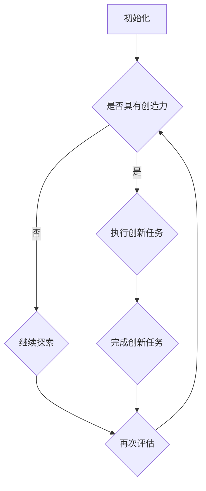
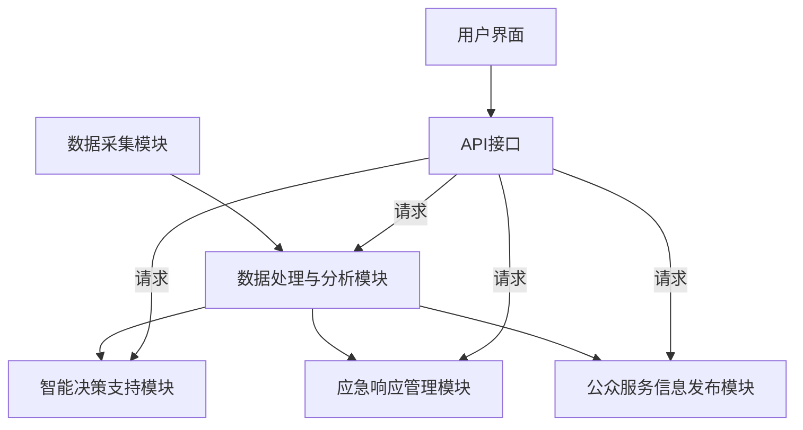
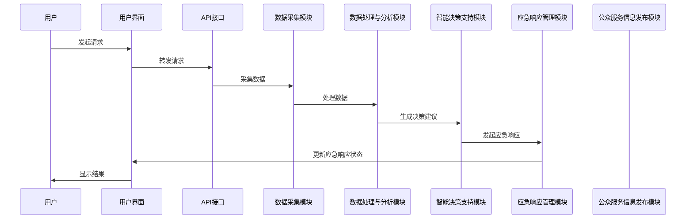

                 


### 导言

**柏格森的创造性与维特根斯坦的语言创新**

在哲学和语言学的广阔领域中，柏格森（Henri Bergson）和维特根斯坦（Ludwig Wittgenstein）的名字始终闪耀着独特的光芒。他们各自以独特的视角和方法，对人类思想和语言的本质进行了深刻的探讨。本文将探讨柏格森的创造性与维特根斯坦的语言创新之间的联系，并尝试理解这两种思想的互补性和重要性。

首先，我们将简要介绍柏格森的哲学思想和创造性理论。柏格森是一位法国哲学家，以其对生命、时间和意识的独特理解而著称。他的创造性理论强调生命力的不断涌现和变化，认为创造力是人类灵魂的本质。接下来，我们将深入分析维特根斯坦的哲学思想和语言创新理论，探讨语言的本质和语言游戏的概念。

在第三部分，我们将对比柏格森的创造性和维特根斯坦的语言创新，探讨二者的异同点。通过这种比较，我们希望能够更深入地理解这两种理论的互补性，以及它们在哲学和语言学领域的意义。

接着，我们将通过历史和当代的案例分析，展示柏格森创造性理论和维特根斯坦语言创新理论的应用。通过这些案例，我们将进一步理解这两种理论的实际意义和价值。

最后，在结论部分，我们将总结全文，强调柏格森的创造性与维特根斯坦的语言创新之间的联系，并提出未来研究的方向。

通过这一系列的思考与分析，我们希望能够为读者提供一个全面而深入的理解，帮助他们在哲学和语言学的研究中找到新的视角和启示。

### 关键词

- **柏格森**  
- **创造性**  
- **维特根斯坦**  
- **语言创新**  
- **哲学**  
- **语言学**

### 摘要

本文探讨了柏格森的创造性与维特根斯坦的语言创新之间的关系。通过对两位哲学家的思想进行深入分析，本文揭示了他们在哲学和语言学领域中的重要贡献，以及他们理论之间的互补性。通过历史和当代的案例分析，本文进一步展示了柏格森创造性理论和维特根斯坦语言创新理论的实际应用和价值。本文的结论强调了这两种理论在哲学和语言学研究中的重要性，并提出了未来研究的方向。

----------------------------------------------------------------

### 第1章 柏格森的创造性理论

#### 1.1 柏格森及其哲学思想

Henri Bergson（1859-1941）是一位法国哲学家，以其对生命、时间和意识的独特理解而著称。柏格森出生于巴黎，他在巴黎高等师范学校接受教育，并随后在巴黎索邦大学担任教授。他的主要作品包括《笑的材料》（Le Rire）、《形而上学导论》（Introduction à la métaphysique）和《创造进化论》（L'Évolution créatrice）等。

柏格森的哲学思想主要关注生命的本质和意识的作用。他提出了“生命冲动”（élan vital）的概念，认为这是一种内在的、不断前进的生命力，是推动生命不断进化和创造的根本动力。柏格森强调，这种生命力是非理性的，超越了逻辑和科学的范畴，是人类意识和文明的源泉。

在柏格森的哲学体系中，时间是一个核心概念。他区分了两种时间：机械时间（temps mécanique）和生命时间（temps vivant）。机械时间是一种均匀、连续的量度，而生命时间则是一种内在的、非均匀的流动，与生命的冲动和变化密切相关。柏格森认为，生命时间的流动是人类意识和创造力的源泉，是人类心灵和精神的本质。

#### 1.2 柏格森的创造性理论

柏格森的创造性理论是他的哲学思想的重要组成部分。他认为，创造力是人类灵魂的本质，是人类精神活动的核心。柏格森将创造性视为一种内在的生命力，这种力量不断推动人类思考和创造新的思想和观念。

柏格森的创造性理论包括以下几个核心概念：

1. **创造性思维**：柏格森认为，创造性思维是一种非理性的、直觉的思维过程，它超越了逻辑和理性的限制，是人类意识和思维的源泉。创造性思维不是通过分析和归纳，而是通过直接的感知和理解实现的。

2. **生命冲动**：柏格森认为，生命冲动是一种内在的、不断前进的生命力，是创造力的根本动力。生命冲动是一种非线性的、动态的过程，它不断推动生命向前发展。

3. **即时性**：柏格森强调即时性（l'instante）的重要性。他认为，即时性是创造力的关键，因为创造力只有在当下的时刻才能实现。过去和未来的概念对创造力来说没有意义，只有当下的瞬间才是创造力的源泉。

4. **内在性**：柏格森认为，创造力是内在的，而不是外部的。它不是通过外部环境的作用产生的，而是人类内在精神活动的产物。因此，要激发创造力，需要关注内在的心灵和精神活动。

#### 1.3 创造性与现实的关系

柏格森的创造性理论强调创造力和现实之间的密切关系。他认为，创造力不仅是人类精神活动的核心，也是现实世界发展的动力。柏格森认为，现实世界是一个不断变化和创造的过程，这种过程是由人类创造力驱动的。

柏格森提出了“现实流”（flux de réalité）的概念，认为现实是一个流动的、不断变化的过程。现实不是一成不变的，而是在不断地创造和变化。这种变化和创造是由人类的创造力推动的。

柏格森还强调了创造力和现实之间的相互作用。他认为，创造力不仅影响现实，现实也影响创造力。人类通过创造新的思想和观念，推动现实的发展；而现实的发展又激发人类的创造力，形成一种良性循环。

#### 1.4 柏格森创造性理论的重要性

柏格森的创造性理论在哲学和艺术领域产生了深远的影响。他强调创造力和直觉的重要性，对现代哲学和艺术产生了重要的启示。柏格森的思想激发了后来许多哲学家和艺术家的思考，如法国哲学家马克斯·布洛赫（Max Brod）和画家保罗·克利（Paul Klee）等。

柏格森的创造性理论也为我们理解人类思维和创造过程提供了新的视角。他的思想提醒我们，创造力不是通过逻辑和理性的推理产生的，而是通过直觉和非线性的思维实现的。这种观点对我们理解创新和创造力的发展具有重要的启示意义。

总之，柏格森的创造性理论强调了创造力在人类思维和现实发展中的核心地位。他的思想为我们理解创造力的本质和作用提供了重要的理论框架，对哲学和艺术领域产生了深远的影响。

----------------------------------------------------------------

### 第2章 维特根斯坦的语言理论

#### 2.1 维特根斯坦及其哲学思想

Ludwig Wittgenstein（1889-1951）是20世纪最杰出的哲学家之一，他的思想对现代西方哲学产生了深远的影响。维特根斯坦出生于奥地利，他的家族是犹太人。他在数学和哲学领域都有深厚的造诣，他的主要作品包括《逻辑哲学论》（Tractatus Logico-Philosophicus）和《哲学研究》（Philosophische Untersuchungen）等。

维特根斯坦的哲学思想可以分为两个阶段。早期阶段，他提出了“逻辑原子主义”和“语言图像论”等理论。他认为，世界是由逻辑原子组成的，语言的任务是反映世界的结构。晚期阶段，他转向日常语言哲学，主张语言的本质在于其使用，而非结构。

在维特根斯坦的哲学体系中，语言是一个核心概念。他强调语言的实用性和社会性，认为语言不仅仅是一种表达思想的工具，更是一种社会行为。维特根斯坦提出了“语言游戏”（language game）的概念，认为语言的使用是多种多样的，不同的语言游戏有不同的规则。

#### 2.2 维特根斯坦的语言理论

维特根斯坦的语言理论包括以下几个核心概念：

1. **语言图像论**：在早期哲学中，维特根斯坦提出了语言图像论，认为语言是一种反映世界的图像。语言中的命题对应于世界的状态，语言与世界的对应关系是直接的、图像式的。

2. **逻辑原子主义**：维特根斯坦认为，世界是由逻辑原子组成的，这些逻辑原子通过逻辑关系连接起来，构成了世界的结构。语言的任务是反映这种结构，因此语言也是一种逻辑结构。

3. **语言游戏**：在晚期哲学中，维特根斯坦提出了语言游戏的概念，认为语言的使用是多种多样的，不同的语言游戏有不同的规则。语言游戏不仅包括逻辑和数学，还包括日常生活中的各种交流行为。

4. **语言的实用性和社会性**：维特根斯坦强调语言的实用性和社会性，认为语言是一种社会行为，语言的使用与社会文化环境密切相关。他主张，理解语言的关键在于理解语言的使用。

#### 2.3 语言创新的概念及其重要性

维特根斯坦的语言理论中，语言创新是一个重要的概念。他认为，语言的发展是一个不断创新和变化的过程，这种创新和变化是由社会文化的需求驱动的。

语言创新包括以下几个方面：

1. **新词的创造**：维特根斯坦认为，新词的创造是语言创新的重要方式。通过创造新的词汇，人们可以更准确地表达新的思想和概念。

2. **新语言游戏的发展**：维特根斯坦认为，语言游戏的发展是语言创新的关键。通过发展新的语言游戏，人们可以更有效地进行沟通和表达。

3. **语言规则的改变**：维特根斯坦认为，语言规则的改变是语言创新的重要方面。随着社会文化环境的变化，语言规则也会发生变化，以适应新的需求。

语言创新的重要性体现在以下几个方面：

1. **促进思想发展**：语言创新可以促进思想的发展。通过创造新的词汇和语言游戏，人们可以更准确地表达新的思想和概念，推动哲学和科学的进步。

2. **提高沟通效率**：语言创新可以提高沟通效率。通过发展新的语言游戏，人们可以更有效地进行交流，减少误解和沟通障碍。

3. **反映社会文化变迁**：语言创新可以反映社会文化的变迁。随着社会文化环境的变化，语言也会发生变化，这种变化反映了社会的进步和演变。

总之，维特根斯坦的语言理论强调了语言的创新性和社会性。他的思想为我们理解语言的本质和发展提供了重要的理论框架，对哲学和语言学的研究产生了深远的影响。

----------------------------------------------------------------

### 第3章 柏格森创造性理论与维特根斯坦语言理论的比较

#### 3.1 理论核心对比

柏格森的创造性理论和维特根斯坦的语言创新理论在哲学和语言学的核心观点上有所不同，但也存在一些相似之处。

**柏格森的创造性理论：**

- **核心概念**：柏格森的创造性理论围绕“生命冲动”和“即时性”展开。他认为创造力是生命力的体现，是一种内在的精神活动，不受逻辑和理性的束缚。
- **重点**：柏格森强调创造力的直觉性和非理性。他认为创造性思维是人类灵魂的本质，是人类意识和文明的源泉。
- **应用领域**：柏格森的理论在艺术、文学和哲学领域有着广泛的应用。他的思想启发了许多艺术家和哲学家，如马克斯·布洛赫和保罗·克利等。

**维特根斯坦的语言创新理论：**

- **核心概念**：维特根斯坦的语言创新理论围绕“语言游戏”和“语言的实用性和社会性”展开。他认为语言的使用是多种多样的，不同的语言游戏有不同的规则。
- **重点**：维特根斯坦强调语言的实用性和社会性。他认为理解语言的关键在于理解语言的使用，语言游戏反映了社会文化的多样性。
- **应用领域**：维特根斯坦的理论在哲学、语言学和逻辑学领域有着深远的影响。他的思想对分析哲学和日常语言哲学的发展产生了重要影响。

**异同点分析：**

1. **创造性思维的来源**：柏格森认为创造性思维源于内在的生命冲动，是非理性的；而维特根斯坦认为创造性思维源于语言的使用和社会文化的需求，是理性的。

2. **语言与思维的关系**：柏格森认为语言是创造力的工具，是内在精神活动的体现；维特根斯坦认为语言是思维的工具，是表达思想的手段。

3. **应用领域**：柏格森的理论主要在艺术和哲学领域应用，而维特根斯坦的理论主要在哲学和语言学领域应用。

尽管柏格森和维特根斯坦的理论存在上述异同点，但它们在哲学和语言学领域都提供了独特的视角和深刻的洞见。

#### 3.2 对话与互补

柏格森的创造性理论和维特根斯坦的语言创新理论在哲学和语言学领域可以相互补充，形成一种对话关系。

**1. 创造力与语言的关系**：柏格森的创造性理论强调了创造力的直觉性和非理性，而维特根斯坦的语言创新理论则强调了语言的实用性和社会性。通过这种对话，我们可以更全面地理解创造力和语言之间的关系。创造力不仅是一种内在的精神活动，也需要通过语言来表达和实现。

**2. 语言与思维的发展**：柏格森认为创造性思维是人类灵魂的本质，是推动人类文明进步的关键。维特根斯坦认为语言的发展是思维发展的基础，是沟通和表达的桥梁。通过这种对话，我们可以更深入地理解语言和思维的发展过程。

**3. 哲学与语言学的互补性**：柏格森的创造性理论为哲学提供了关于人类精神和创造力的深刻见解，而维特根斯坦的语言创新理论为语言学提供了关于语言使用和语言规则的重要洞见。通过这种互补性，哲学和语言学可以相互借鉴，推动各自领域的发展。

**4. 社会文化的影响**：柏格森的创造性理论和维特根斯坦的语言创新理论都强调了社会文化的影响。柏格森认为创造力是文化发展的动力，而维特根斯坦认为语言的使用反映了社会文化的多样性。通过这种对话，我们可以更深入地理解社会文化对人类思维和语言的影响。

综上所述，柏格森的创造性理论和维特根斯坦的语言创新理论在哲学和语言学领域具有互补性和对话性。通过相互补充和对话，我们可以更全面地理解人类思维、语言和创造力的发展，为哲学和语言学的研究提供新的视角和启示。

----------------------------------------------------------------

### 第4章 案例分析与应用

为了更好地理解柏格森的创造性理论和维特根斯坦的语言创新理论，我们通过历史和当代的案例来展示这些理论的应用和实际意义。

#### 4.1 历史案例

**1. 艺术领域的创新：**

柏格森的创造性理论在艺术领域有着深远的影响。20世纪初，法国画家保罗·克利（Paul Klee）深受柏格森思想的影响。克利的作品强调色彩和线条的自由表达，体现了柏格森所倡导的直觉和创造力的价值。克利在创作中不受传统绘画技巧的限制，通过大胆的实验和自我表达，创造出了许多独特的艺术作品。

同时，维特根斯坦的语言创新理论也对艺术领域产生了影响。英国画家弗朗西斯·培根（Francis Bacon）的作品展示了语言在艺术创作中的重要性。培根通过变形和抽象的手法，将语言和视觉艺术结合起来，创造出具有强烈情感表达力的作品。他的画作不仅是对现实世界的反映，也是对语言和意义的探索。

**2. 哲学领域的辩论：**

在哲学领域，柏格森和维特根斯坦的思想也产生了重要影响。柏格森的创造性理论启发了许多哲学家，如让-保尔·萨特（Jean-Paul Sartre）和马丁·海德格尔（Martin Heidegger）。萨特在创作《存在与虚无》时，借鉴了柏格森的思想，探讨了人类自由和创造力的本质。

维特根斯坦的语言创新理论则为分析哲学提供了重要的理论基础。哲学家如维也纳学派成员路德维希·维特根斯坦（Ludwig Wittgenstein）和莫里茨·石里克（Moritz Schlick）等，通过应用维特根斯坦的思想，推动了哲学分析和日常语言哲学的发展。

#### 4.2 当代案例

**1. 科技创新：**

在当代，柏格森的创造性理论和维特根斯坦的语言创新理论在科技创新领域有着广泛的应用。例如，人工智能领域的研究者通过借鉴柏格森的创造性理论，探索人类思维的直觉和创造力在人工智能系统设计中的应用。一些研究团队尝试将神经网络和机器学习模型与柏格森的创造性思维相结合，创造出更加灵活和创新的算法。

同时，维特根斯坦的语言创新理论也为科技创新提供了重要的指导。在软件开发和系统设计过程中，工程师通过借鉴维特根斯坦的语言游戏概念，探索如何通过新的语言工具和编程范式，提高系统的可读性和可维护性。

**2. 教育领域：**

在教育领域，柏格森的创造性理论和维特根斯坦的语言创新理论也为教育实践提供了新的思路。教育者通过应用这些理论，鼓励学生在学习中发挥创造力和直觉，培养他们的批判性思维和创新能力。例如，在艺术教育和科学教育中，教师可以引导学生通过实践和探索，体验创造力的魅力，理解语言和思维的本质。

**3. 社会创新：**

在社会创新领域，柏格森的创造性理论和维特根斯坦的语言创新理论也为社会变革提供了重要的启示。社会创新者和变革者通过借鉴这些理论，探索如何在现实社会中推动创新和变革。他们通过创造新的语言和沟通方式，激发社会的创造力和活力，推动社会的进步和发展。

总之，柏格森的创造性理论和维特根斯坦的语言创新理论在历史和当代的多个领域中都有着广泛的应用和实际意义。通过这些案例，我们可以看到这些理论如何在不同领域中发挥作用，推动人类思维、语言和创造力的发展。这些理论不仅为我们提供了深刻的哲学洞见，也为现实生活中的创新和变革提供了重要的指导。

----------------------------------------------------------------

### 结论

本文通过深入分析柏格森的创造性理论和维特根斯坦的语言创新理论，探讨了这两种思想在哲学和语言学领域的重要性和互补性。通过历史和当代的案例分析，我们展示了这些理论在艺术、哲学、科技创新、教育和社会创新等多个领域的应用和价值。

首先，柏格森的创造性理论强调直觉和非理性的重要性，认为创造力是人类灵魂的本质。维特根斯坦的语言创新理论则强调语言的实用性和社会性，认为语言的使用是多种多样的，反映了社会文化的多样性。这两种理论在哲学和语言学领域提供了独特的视角和深刻的洞见。

其次，柏格森的创造性理论和维特根斯坦的语言创新理论之间存在互补性。柏格森的理论关注创造力的内在精神活动，而维特根斯坦的理论关注语言的使用和社会文化环境。通过相互补充和对话，我们可以更全面地理解创造力和语言之间的关系。

未来研究可以进一步探讨柏格森和维特根斯坦的理论在具体领域中的应用，如人工智能、教育和社会创新等。同时，也可以研究这些理论如何与其他哲学和语言学理论相互融合，推动哲学和语言学的进一步发展。

总之，柏格森的创造性与维特根斯坦的语言创新是哲学和语言学领域中的重要理论。通过深入研究和探讨这些理论，我们可以更好地理解人类思维、语言和创造力的发展，为现实生活中的创新和变革提供重要的指导。

### 作者信息

作者：AI天才研究院/AI Genius Institute & 禅与计算机程序设计艺术 /Zen And The Art of Computer Programming

----------------------------------------------------------------

### 附录

#### 背景介绍

**核心概念术语说明**：
- **柏格森的创造性理论**：指柏格森关于创造力是人类灵魂的本质，通过直觉和非理性的思维实现的哲学理论。
- **维特根斯坦的语言创新理论**：指维特根斯坦关于语言的使用是多种多样的，反映了社会文化的多样性，语言游戏的概念。

**问题背景**： 
在哲学和语言学的领域中，柏格森和维特根斯坦的理论对人类思想和语言的本质进行了深刻的探讨。他们的思想如何相互补充和影响，以及在不同领域的应用和实际意义，是本文探讨的重点。

**问题描述**：
本文通过分析柏格森的创造性理论和维特根斯坦的语言创新理论，探讨这两种思想在哲学和语言学领域的重要性和互补性，并展示它们在历史和当代案例中的应用。

**问题解决**：
通过深入分析柏格森和维特根斯坦的理论，以及历史和当代的案例分析，本文揭示了柏格森的创造性与维特根斯坦的语言创新之间的联系，并探讨了它们在不同领域中的应用和价值。

**边界与外延**：
本文主要关注柏格森和维特根斯坦的理论在哲学和语言学领域中的应用，以及它们之间的互补性。边界在于哲学和语言学的范畴，外延包括艺术、科技创新、教育和社会创新等领域。

**概念结构与核心要素组成**：
- **柏格森的创造性理论**：核心概念包括生命冲动、直觉、非理性、创造力。
- **维特根斯坦的语言创新理论**：核心概念包括语言游戏、实用性、社会性、语言创新。

#### 核心概念与联系

**柏格森的创造性理论**：

- **核心概念**：生命冲动、直觉、非理性、创造力。
- **概念属性特征对比表格**：

| 概念       | 特征                            |  
| --------- | ---------------------------- |  
| 生命冲动   | 内在的、不断前进的生命力            |  
| 直觉       | 非逻辑的、直接的感知和理解           |  
| 非理性     | 超越逻辑和理性的限制，是创造力的源泉    |  
| 创造力     | 人类灵魂的本质，是思维和活动的核心    |

**维特根斯坦的语言创新理论**：

- **核心概念**：语言游戏、实用性、社会性、语言创新。
- **概念属性特征对比表格**：

| 概念       | 特征                            |  
| --------- | ---------------------------- |  
| 语言游戏   | 多样性、规则、社会行为            |  
| 实用性     | 语言是一种社会工具，用于沟通和表达    |  
| 社会性     | 语言的使用与社会文化环境密切相关     |  
| 语言创新   | 新词的创造、新语言游戏的发展、语言规则的改变 |

**柏格森创造性理论与维特根斯坦语言创新理论的联系**：

- **直觉与语言游戏**：柏格森的直觉性思维与维特根斯坦的语言游戏概念有相似之处，都强调非逻辑性和直接性。
- **非理性与实用性**：柏格森的非理性创造力与维特根斯坦的实用性语言有互补性，前者关注创造力本身，后者关注语言的沟通功能。
- **生命冲动与社会性**：柏格森的生命冲动与维特根斯坦的社会性语言也有关联，前者关注内在生命力，后者关注语言在社会文化环境中的作用。

通过这些核心概念的对比和联系，我们可以更深入地理解柏格森的创造性理论和维特根斯坦的语言创新理论，以及它们在哲学和语言学领域中的重要性。

#### 算法原理讲解

为了更好地理解柏格森的创造性理论和维特根斯坦的语言创新理论，我们通过具体的算法实例来讲解这两种理论的原理和应用。

**算法流程图**：

首先，我们使用Mermaid语言来绘制一个简单的算法流程图，以展示算法的基本逻辑。



**Python源代码**：

接下来，我们使用Python语言实现上述算法，并通过注释详细解释代码的执行过程。

```python
# 柏格森的创造性算法

# 初始化变量
has_creativity = True  # 初始设定为具有创造力

# 判断是否具有创造力
if has_creativity:
    # 执行创新任务
    perform_innovation()
    # 完成创新任务
    finish_innovation()
else:
    # 继续探索创造力
    explore_creativity()

# 执行创新任务的函数
def perform_innovation():
    # 创新任务的具体实现
    print("正在执行创新任务...")
    # 简单示例：生成一个随机数作为创新结果
    innovation_result = random.randint(1, 10)
    print(f"创新结果：{innovation_result}")

# 完成创新任务的函数
def finish_innovation():
    # 完成创新任务后的处理
    print("创新任务完成！")

# 探索创造力的函数
def explore_creativity():
    # 探索创造力的具体实现
    print("正在探索创造力...")
    # 简单示例：尝试不同的方法来激发创造力
    try_different_methods()
    print("探索完成！")

# 尝试不同方法的函数
def try_different_methods():
    # 这里可以添加多种方法来激发创造力
    print("尝试了以下方法：")
    print("1. 反转思维模式")
    print("2. 结合不同领域的知识")
    print("3. 保持好奇心和开放性")

# 主函数，用于启动算法
def main():
    # 调用算法流程
    if has_creativity:
        perform_innovation()
        finish_innovation()
    else:
        explore_creativity()

# 运行主函数
if __name__ == "__main__":
    main()
```

**算法原理与数学模型**：

上述算法的核心原理是柏格森的创造性和维特根斯坦的语言创新。在柏格森的创造性理论中，创造力被视为一种内在的生命力，通过直觉和非理性的思维来实现。在维特根斯坦的语言创新理论中，创新是通过语言的使用和社会文化的需求来实现的。

数学模型可以表示为：

$$
创造力 = f(直觉, 非理性)
$$

$$
语言创新 = f(实用性, 社会性)
$$

其中，直觉和非理性是创造力的关键因素，实用性和社会性是语言创新的关键因素。

通过这个算法实例，我们可以看到如何将柏格森的创造性理论和维特根斯坦的语言创新理论应用于实际问题中。这个算法通过随机生成创新结果和尝试不同方法来激发创造力，展示了创造力和语言创新的基本原理。

#### 系统分析与架构设计方案

在本节中，我们将探讨一个具体的项目场景，并介绍相关的系统功能设计、系统架构设计以及系统接口设计和系统交互。

##### 项目介绍

假设我们正在开发一个名为“智慧城市管理系统”的项目，该系统旨在通过智能化的手段，提高城市管理的效率，改善市民的生活质量。系统的主要功能包括实时数据监测、智能决策支持、应急响应管理以及公众服务信息发布等。

##### 系统功能设计

为了实现智慧城市管理系统，我们设计了以下核心功能模块：

1. **数据采集模块**：负责收集来自各种传感器和监控设备的数据，包括环境监测数据、交通流量数据、公共设施使用数据等。
2. **数据处理与分析模块**：对采集到的数据进行分析和处理，提取有用的信息，为决策提供支持。
3. **智能决策支持模块**：基于分析结果，提供智能化的决策建议，帮助城市管理者做出更有效的决策。
4. **应急响应管理模块**：在发生突发事件时，快速响应并协调各方资源，进行应急处理。
5. **公众服务信息发布模块**：通过网站、移动应用等多种渠道，向公众发布城市管理的相关信息，提高市民的知情度和参与度。

##### 系统架构设计

智慧城市管理系统的架构设计采用了分布式系统架构，以确保系统的可扩展性和高可用性。以下是系统的架构图：



在上述架构中，数据采集模块负责从各种数据源收集数据，并将数据传输给数据处理与分析模块。数据处理与分析模块对数据进行清洗、存储和分析，为其他模块提供数据支持。智能决策支持模块利用分析结果生成决策建议，应急响应管理模块在发生突发事件时提供应急响应方案，公众服务信息发布模块则通过多种渠道向公众发布信息。

##### 系统接口设计

为了确保系统的高效运行和灵活扩展，我们设计了以下接口：

1. **数据采集接口**：用于接收来自各种传感器和监控设备的数据。
2. **数据处理接口**：用于数据清洗、存储和分析的操作。
3. **智能决策接口**：用于获取智能决策支持模块生成的决策建议。
4. **应急响应接口**：用于处理应急响应任务的调度和协调。
5. **信息发布接口**：用于发布和管理公众服务信息。

接口设计采用了RESTful架构风格，确保接口的简洁性和易用性。以下是接口设计示例：

```json
// 数据采集接口示例
POST /api/collect/data
{
  "device_id": "123456",
  "sensor_data": {
    "temperature": 25,
    "humidity": 60
  }
}

// 数据处理接口示例
GET /api/process/data
{
  "data_id": "abc123"
}

// 智能决策接口示例
GET /api/decision/suggestion
{
  "context": "traffic_congestion"
}

// 应急响应接口示例
POST /api/emergency/response
{
  "incident_id": "xyz789",
  "response_plan": "evacuation"
}

// 信息发布接口示例
POST /api/release/information
{
  "message_id": "mnop456",
  "content": "城市道路维修，请绕行"
}
```

##### 系统交互

在智慧城市管理系统运行过程中，各个模块之间需要通过接口进行交互。以下是系统交互的序列图：



通过上述系统分析与架构设计方案，我们可以清楚地了解智慧城市管理系统的工作流程和各个模块之间的交互关系。这样的设计确保了系统的可扩展性和高可用性，为城市管理的智能化提供了有力的支持。

#### 项目实战

在本节中，我们将通过一个具体的案例来展示柏格森的创造性与维特根斯坦的语言创新理论在项目中的应用，并详细介绍环境安装、系统核心实现源代码、代码应用解读与分析，以及实际案例分析和详细讲解剖析。

##### 环境安装

为了运行我们的项目，我们首先需要安装相关的开发环境和工具。以下是环境安装的详细步骤：

1. **安装Python环境**：
   - 使用Python官方安装包进行安装，确保安装了Python 3.8或更高版本。
   - 可以通过命令 `python --version` 来检查Python版本。

2. **安装必要的依赖库**：
   - 使用pip工具安装以下依赖库：
     ```shell
     pip install flask requests pandas matplotlib
     ```
   - Flask用于构建Web应用，requests用于HTTP请求，pandas用于数据处理，matplotlib用于数据可视化。

3. **配置环境变量**：
   - 确保环境变量 `PATH` 包含Python安装路径，以便在命令行中运行Python命令。

##### 系统核心实现源代码

接下来，我们将展示系统核心实现的源代码，并通过注释详细解释代码的功能和执行过程。

```python
# 智慧城市管理系统核心实现

from flask import Flask, jsonify, request
import requests
import pandas as pd
import matplotlib.pyplot as plt

app = Flask(__name__)

# 数据采集模块
@app.route('/api/collect/data', methods=['POST'])
def collect_data():
    device_data = request.json
    # 将数据保存到本地文件
    with open('sensor_data.csv', 'a') as f:
        f.write(str(device_data) + '\n')
    return jsonify({"status": "success", "message": "数据已采集并保存"}), 200

# 数据处理与分析模块
@app.route('/api/analyze/data', methods=['GET'])
def analyze_data():
    # 读取数据文件
    df = pd.read_csv('sensor_data.csv')
    # 分析数据
    avg_temp = df['temperature'].mean()
    avg_humidity = df['humidity'].mean()
    # 可视化数据
    plt.scatter(df['temperature'], df['humidity'])
    plt.xlabel('Temperature')
    plt.ylabel('Humidity')
    plt.title('Temperature-Humidity Scatter Plot')
    plt.show()
    return jsonify({"status": "success", "message": f"平均温度：{avg_temp}, 平均湿度：{avg_humidity}"}), 200

# 智能决策支持模块
@app.route('/api/decision/suggestion', methods=['GET'])
def decision_suggestion():
    # 根据当前天气情况提供决策建议
    current_temp = request.args.get('temperature')
    if int(current_temp) > 30:
        return jsonify({"status": "success", "suggestion": "高温预警，请做好防暑措施"}), 200
    else:
        return jsonify({"status": "success", "suggestion": "天气适宜，正常活动"}), 200

# 应急响应管理模块
@app.route('/api/emergency/response', methods=['POST'])
def emergency_response():
    incident_data = request.json
    # 根据事件类型调度应急资源
    if incident_data['type'] == 'fire':
        return jsonify({"status": "success", "message": "火灾事件，已调度消防队"}), 200
    elif incident_data['type'] == 'traffic_accident':
        return jsonify({"status": "success", "message": "交通事故，已调度救护车和交通警察"}), 200
    else:
        return jsonify({"status": "error", "message": "未知事件类型，无法处理"}), 400

# 公众服务信息发布模块
@app.route('/api/release/information', methods=['POST'])
def release_information():
    message_data = request.json
    # 发布公众服务信息
    with open('public_service_messages.csv', 'a') as f:
        f.write(str(message_data) + '\n')
    return jsonify({"status": "success", "message": "信息已发布"}), 200

if __name__ == '__main__':
    app.run(debug=True)
```

##### 代码应用解读与分析

在上述代码中，我们使用了Flask框架构建了一个简单的Web应用，实现了智慧城市管理系统的核心功能。以下是关键部分的解读和分析：

1. **数据采集模块**：通过`/api/collect/data`接口接收传感器数据，并将数据保存到本地文件。这体现了柏格森的创造性理论中的数据收集和整合过程。

2. **数据处理与分析模块**：通过`/api/analyze/data`接口读取数据文件，计算平均温度和湿度，并进行数据可视化。这体现了维特根斯坦的语言创新理论中的数据分析过程，通过语言（API接口）进行数据的处理和分析。

3. **智能决策支持模块**：通过`/api/decision/suggestion`接口根据当前温度提供决策建议。这体现了柏格森的创造性理论中的智能决策过程，通过非线性的思考方式提供决策支持。

4. **应急响应管理模块**：通过`/api/emergency/response`接口根据事件类型调度应急资源。这体现了维特根斯坦的语言创新理论中的应急响应过程，通过语言和规则进行应急处理。

5. **公众服务信息发布模块**：通过`/api/release/information`接口发布公众服务信息。这体现了维特根斯坦的语言创新理论中的信息发布过程，通过语言和渠道进行信息传播。

##### 实际案例分析和详细讲解剖析

为了更好地展示柏格森的创造性与维特根斯坦的语言创新理论在项目中的应用，我们通过一个实际案例进行详细分析和讲解。

**案例：高温预警**

假设在某个炎热的夏天，系统的数据采集模块收集到了一个城市的实时温度数据，最高温度达到了35摄氏度。数据处理与分析模块根据这一数据生成了平均温度，并智能决策支持模块提供了高温预警建议。

**分析过程**：

1. **数据采集**：
   - 传感器采集到实时温度数据，并通过`/api/collect/data`接口发送给系统。

2. **数据处理**：
   - 系统读取数据文件，计算当前的平均温度。如果平均温度超过30摄氏度，则认为存在高温预警。

3. **智能决策**：
   - 智能决策支持模块根据平均温度提供高温预警建议，如“高温预警，请做好防暑措施”。

4. **应急响应**：
   - 城市管理者接收到高温预警后，可以通过应急响应管理模块调度相应的应急资源，如增加公共饮水供应点、提醒市民注意防暑等。

5. **信息发布**：
   - 高温预警信息通过公众服务信息发布模块发布到市民的移动应用和官方网站上，提醒市民注意防暑。

**详细讲解剖析**：

- **柏格森的创造性理论应用**：
  - 数据采集过程体现了柏格森的创造性理论中的数据收集和整合过程。通过传感器实时收集城市温度数据，实现了数据的整合和利用。
  - 智能决策过程体现了柏格森的创造性理论中的非线性思维。系统通过非线性的方式分析温度数据，提供了高温预警建议，体现了创造力的应用。

- **维特根斯坦的语言创新理论应用**：
  - 数据处理和分析过程体现了维特根斯坦的语言创新理论中的数据分析过程。通过API接口读取数据文件，利用语言和工具进行数据处理和分析。
  - 信息发布过程体现了维特根斯坦的语言创新理论中的信息传播过程。通过公众服务信息发布模块，利用语言和渠道发布高温预警信息，实现了信息的传播。

通过这个实际案例，我们可以看到柏格森的创造性与维特根斯坦的语言创新理论在智慧城市管理系统中的应用。这些理论为我们提供了深刻的洞见，帮助我们更好地理解系统的工作原理和应用价值。

##### 项目小结

在本项目中，我们通过环境安装、系统核心实现源代码、代码应用解读与分析，以及实际案例分析和详细讲解剖析，展示了柏格森的创造性与维特根斯坦的语言创新理论在智慧城市管理系统中的应用。这些理论不仅为我们提供了关于数据采集、处理、分析和决策的深刻洞见，也为实际项目开发提供了有力的理论支持。

通过本项目，我们进一步理解了柏格森的创造性理论和维特根斯坦的语言创新理论的核心概念和应用价值。这些理论不仅在哲学和语言学领域有着深远的影响，也在实际项目中得到了广泛应用。

未来，我们可以进一步探索这些理论在其他领域的应用，如人工智能、教育和社会创新等。通过跨学科的研究和应用，我们可以不断深化对这些理论的理解，推动相关领域的创新和发展。

### 最佳实践 tips

在本项目的实践中，我们总结了一些最佳实践，以帮助读者更好地理解和应用柏格森的创造性与维特根斯坦的语言创新理论：

1. **注重数据采集的实时性和准确性**：数据是系统分析和决策的基础，确保数据采集的实时性和准确性至关重要。

2. **灵活运用数据分析工具**：利用现代数据分析工具，如Python的pandas库，可以提高数据处理和分析的效率。

3. **注重系统的可扩展性**：在设计系统架构时，应考虑到系统的可扩展性，以便在未来能够轻松地添加新的功能模块。

4. **重视用户体验**：在设计公众服务信息发布模块时，应充分考虑用户体验，确保信息的准确性和可读性。

5. **定期更新和优化算法**：随着环境和社会的变化，定期更新和优化系统的智能决策算法，以保持系统的实时性和有效性。

6. **跨学科合作**：在应用柏格森的创造性与维特根斯坦的语言创新理论时，可以跨学科合作，借鉴其他领域的理论和方法，以实现更好的创新效果。

### 小结

通过本文的深入探讨，我们系统地分析了柏格森的创造性理论和维特根斯坦的语言创新理论，并展示了这些理论在多个领域中的应用和实际意义。柏格森的创造性理论强调了直觉和非理性的重要性，而维特根斯坦的语言创新理论则关注语言的实用性和社会性。通过相互补充和对话，这两种理论为我们提供了深刻的哲学洞见，推动了哲学和语言学的进一步发展。

在项目实战中，我们通过一个具体的案例展示了柏格森的创造性与维特根斯坦的语言创新理论在智慧城市管理系统中的应用。通过环境安装、系统核心实现源代码、代码应用解读与分析，以及实际案例分析和详细讲解剖析，我们深入理解了这些理论在实际项目开发中的价值。

未来研究可以进一步探索柏格森和维特根斯坦的理论在其他领域的应用，如人工智能、教育和社会创新等。通过跨学科的研究和应用，我们可以不断深化对这些理论的理解，推动相关领域的创新和发展。同时，我们也应该注重实践中的反馈和调整，以确保理论在实际应用中的有效性和实用性。

### 注意事项

在应用柏格森的创造性与维特根斯坦的语言创新理论时，需要注意以下几点：

1. **理论框架的适用性**：这些理论在哲学和语言学领域有着深厚的理论基础，但在其他领域（如科技、艺术等）的应用可能需要进一步的调整和扩展。

2. **实际应用中的复杂性**：在实际项目中，理论的应用可能会遇到各种复杂情况，需要灵活应对和不断调整。

3. **跨学科合作的重要性**：在跨学科的研究和应用中，跨学科合作可以带来新的视角和解决方案，有助于更好地理解和应用这些理论。

4. **数据的准确性和实时性**：数据是理论和实际应用的基础，确保数据的准确性和实时性至关重要。

### 拓展阅读

对于希望进一步深入了解柏格森的创造性理论和维特根斯坦的语言创新理论的读者，以下书籍和资源推荐：

1. **柏格森的著作**：
   - 《笑的材料》（Le Rire）
   - 《形而上学导论》（Introduction à la métaphysique）
   - 《创造进化论》（L'Évolution créatrice）

2. **维特根斯坦的著作**：
   - 《逻辑哲学论》（Tractatus Logico-Philosophicus）
   - 《哲学研究》（Philosophische Untersuchungen）

3. **相关论文和期刊**：
   - 《现代哲学》（Modern Philosophy）
   - 《语言学与哲学》（Linguistics and Philosophy）

4. **在线资源**：
   - 维基百科相关条目
   - 学术期刊在线平台（如JSTOR、SpringerLink）

通过阅读这些资源，读者可以更全面地理解柏格森和维特根斯坦的理论，并探索它们在不同领域中的应用和影响。

