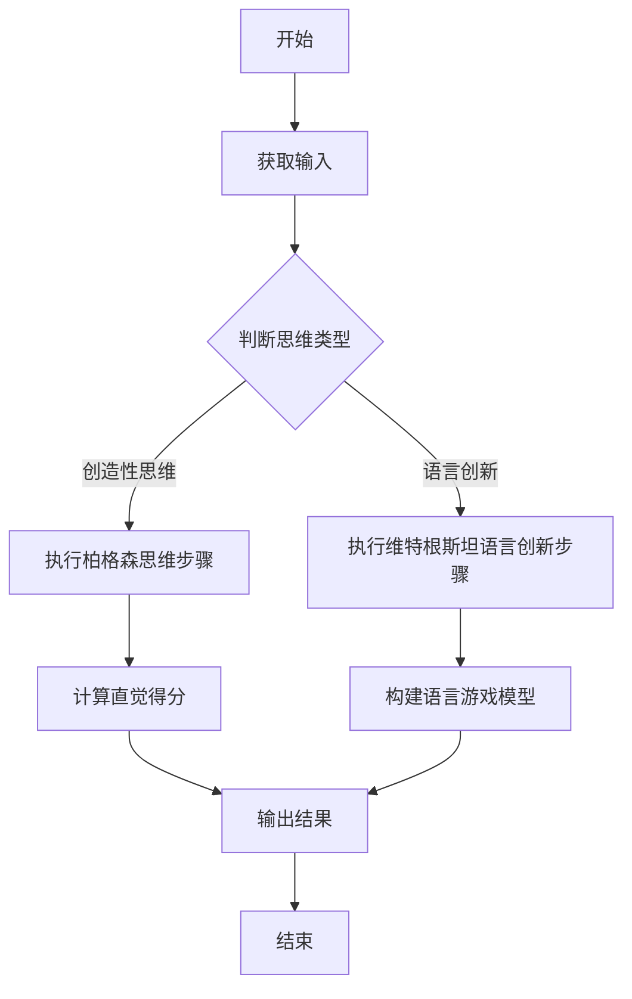
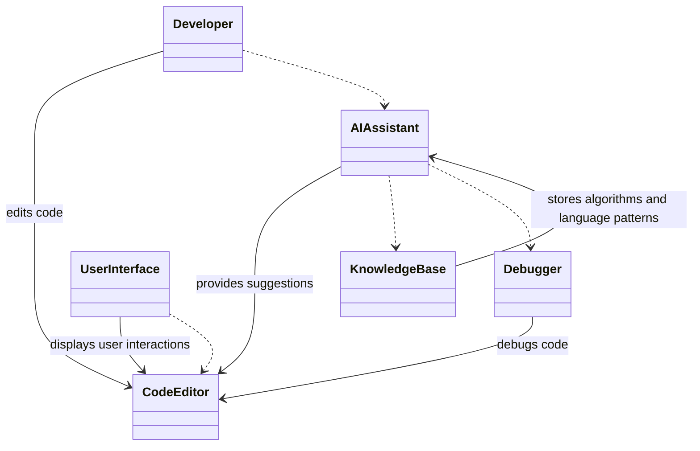
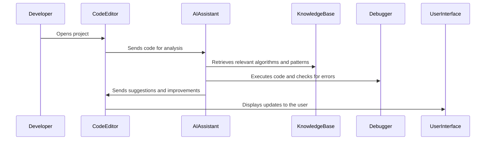
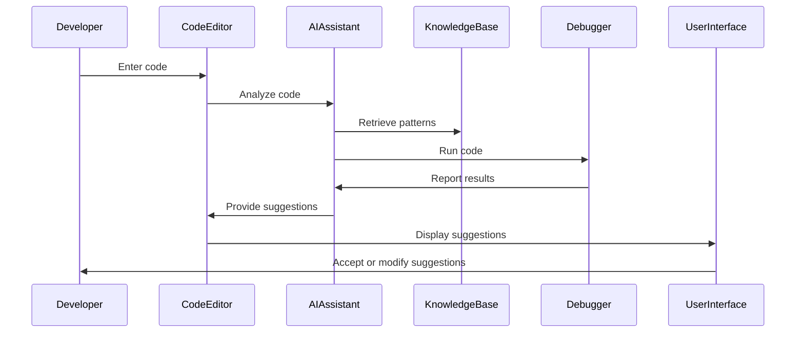

                 

### 引言

在现代哲学与计算机科学领域，柏格森的创造性思维与维特根斯坦的语言创新概念占据了重要的地位。这两个概念不仅深刻地影响了哲学的发展，也对现代社会的思想与技术创新产生了深远的影响。

**柏格森的创造性思维**，源于法国哲学家亨利·柏格森（Henri Bergson）的理论，强调生命的创造力与直觉的重要性。柏格森认为，人类的智慧不仅仅依赖于逻辑和理性，更依赖于直觉与创造力，这些能力使我们能够适应复杂多变的环境。

**维特根斯坦的语言创新概念**，则由奥地利的逻辑哲学家路德维希·维特根斯坦（Ludwig Wittgenstein）提出，他主张语言是思维的工具，但语言本身并不等同于思维。维特根斯坦强调语言的游戏（language games）概念，认为语言的意义在于其使用情境，而非抽象的哲学讨论。

本文将深入探讨柏格森创造性思维与维特根斯坦语言创新概念的核心原理，并通过详细的比较分析，揭示它们之间的内在联系。本文还将通过算法原理讲解、系统分析与架构设计方案，以及实际项目实战，展示这些概念在当代计算机科学中的应用与价值。

**核心关键词**：柏格森创造性思维，维特根斯坦语言创新，直觉，语言游戏，算法原理，系统架构，项目实战。

**摘要**：
本文首先介绍了柏格森的创造性思维与维特根斯坦的语言创新概念的基本背景，包括其哲学意义和应用场景。随后，通过核心概念原理的阐述和对比分析，探讨了它们之间的联系。文章进一步通过算法原理讲解和系统架构设计，展示了这些概念在计算机科学中的应用。最后，通过实际项目实战，验证了这些概念的实际应用效果，并提出了最佳实践建议和项目改进方向。

### 背景介绍

#### 柏格森的创造性思维

亨利·柏格森（Henri Bergson）生于1859年，是20世纪初法国最具影响力的哲学家之一。他的创造性思维理论主要出现在其两部重要著作《创造的进化》（L'Évolution créatrice）和《形而上学的基础》（Les Élements d'une théorie de la réalité）中。柏格森认为，创造性思维是人类智慧的核心，它不同于逻辑推理和理性分析，而是一种更深刻的直觉能力。

柏格森提出，创造性思维是人类适应复杂环境、推动社会进步的关键。他强调，理性思维虽然能够处理已知的事物和问题，但在面对未知的领域时显得无能为力。相比之下，直觉能够捕捉那些隐藏在表面现象之下的深层规律，从而发现新的解决方案。柏格森的创造性思维理论对心理学、哲学和科学方法论产生了深远的影响。

#### 维特根斯坦的语言创新概念

路德维希·维特根斯坦（Ludwig Wittgenstein）生于1889年，是20世纪最具争议和影响力的哲学家之一。他的语言创新概念主要集中在其两部主要著作《逻辑哲学论》（Tractatus Logico-Philosophicus）和《哲学研究》（Philosophical Investigations）中。

在《逻辑哲学论》中，维特根斯坦提出了“语言游戏”（language games）的概念，强调语言的意义在于其具体的使用情境。他认为，语言不仅仅是符号和声音的组合，更是一种活动，即“语言游戏”。每一个语言游戏都有其特定的规则和目的，这些规则和目的决定了语言的含义和使用方式。

在《哲学研究》中，维特根斯坦进一步发展了语言游戏理论，探讨了语言、思维和现实之间的关系。他强调，哲学的任务不是寻求抽象的真理，而是理解和描述语言游戏。维特根斯坦的语言创新概念对分析哲学和语言哲学产生了深远的影响，引发了关于语言本质和意义的广泛讨论。

#### 时代背景

柏格森和维特根斯坦分别生活在19世纪末至20世纪初的欧洲，这是一个充满变革和创新的时期。当时的欧洲正处于两次世界大战之间，科学技术的迅猛发展和社会结构的深刻变革，使得哲学家们开始反思传统哲学方法和理论，寻求新的思维方式和方法论。

柏格森的创造性思维理论正是对传统理性主义的批判和超越，他强调直觉和创造力的价值，呼吁人们跳出理性思维的束缚，去体验和感知世界的多样性和复杂性。而维特根斯坦的语言创新概念则是对传统形而上学和语言哲学的挑战，他通过重新定义语言的意义和作用，揭示了语言与思维、现实之间的复杂关系。

#### 主要贡献及哲学史地位

柏格森的创造性思维和维特根斯坦的语言创新概念在哲学史上具有重要地位。柏格森的思想对后来的存在主义、现象学和心理学产生了深远的影响，他的创造性思维理论被视为现代哲学中一个重要的转折点。

维特根斯坦的语言创新概念则对分析哲学和语言哲学的发展产生了深远的影响。他的语言游戏理论不仅改变了人们对语言和哲学的认识，也激发了关于语言、思维和现实的广泛讨论。维特根斯坦的思想对20世纪哲学产生了深远的影响，他被认为是现代哲学史上最具原创性和影响力的哲学家之一。

#### 问题背景

在现代社会，创造性思维和语言创新的概念变得尤为重要。随着信息技术的迅猛发展，社会环境日益复杂多变，人们需要具备更强的创造力和适应能力，以应对不断变化的问题和挑战。

创造性思维不仅体现在科学研究和技术创新中，也广泛应用于商业管理、艺术创作和日常生活中的各个方面。例如，在科技行业中，创造性思维能够帮助研发团队找到创新的解决方案，推动新技术和产品的开发。在商业管理中，创造性思维能够帮助企业发现市场机会，制定创新的战略和策略。

语言创新则体现在对语言使用的不断探索和改进中。语言是沟通和表达思想的重要工具，通过创新语言使用方式，可以提高沟通效率，促进思想交流和知识传播。例如，在编程语言和软件开发中，语言的创新能够提高代码的可读性和可维护性，提升开发效率。

然而，创造性思维和语言创新在实际应用中面临着诸多挑战。首先，创造性思维往往需要突破传统思维模式的束缚，这需要人们具备开放的心态和勇于尝试的精神。然而，现代社会中人们往往受到惯性思维和既有知识体系的束缚，难以真正实现创造性思维。

其次，语言创新需要深入理解和把握语言的本质和特点，这需要长期的积累和大量的实践。语言是一种复杂的符号系统，不同的语言游戏具有不同的规则和目的。因此，在创新语言使用方式时，需要综合考虑语言的历史、文化和应用情境，以确保语言创新的有效性和可操作性。

综上所述，柏格森的创造性思维和维特根斯坦的语言创新概念在现代社会中具有重要的应用价值。通过深入理解和应用这些概念，人们可以更好地应对复杂多变的社会环境，推动创新和发展。然而，在实际应用中，还需要克服各种挑战，以实现创造性思维和语言创新的真正价值。

#### 创造性思维和语言创新的概念

创造性思维和语言创新是两个在哲学、心理学和计算机科学等领域具有重要意义的核心理念。首先，我们来定义这两个概念。

**创造性思维**（Creative Thinking）指的是一种通过新颖、独特的方式解决问题的思维方式。这种思维不仅仅依赖于既有的知识和经验，更依赖于直觉、联想和灵感。创造性思维强调跳出传统的思维框架，寻找新的视角和解决方案。其核心在于创新，即打破常规，创造新的价值和可能性。

**语言创新**（Language Innovation）则是指通过改进或创造新的语言形式、结构和用法，来提高沟通效率、表达能力和思想深度。语言创新不仅包括对现有语言的扩展和丰富，还涉及对新语言的设计和应用。语言创新的目标是使语言更加准确、高效和人性化，从而更好地服务于人类社会的交流和思想表达。

这两个概念在哲学领域中的影响尤为深远。柏格森的创造性思维理论强调了直觉和创造力在人类认知和智慧中的重要性，挑战了传统的理性主义和逻辑主义。维特根斯坦的语言创新概念则通过对语言本质的深入探讨，揭示了语言与思维、现实之间的复杂关系，推动了语言哲学和分析哲学的发展。

在现代社会，创造性思维和语言创新的重要性更加凸显。随着科技的迅猛发展和信息爆炸，社会环境变得愈加复杂多变，创新成为推动社会进步和发展的关键动力。在商业、艺术、科学和技术等领域，创造性思维和语言创新的应用不仅能够提高工作效率，还能够激发新的商业机会和科技创新。

具体来说，在商业领域，创造性思维可以帮助企业发现市场机会，制定创新的营销策略，提升竞争力。在艺术创作中，语言创新能够为艺术家提供更加丰富和多样的表达手段，拓展艺术创作的边界。在科学研究中，创造性思维和语言创新可以推动科学家寻找新的研究方向和解决问题的方法。

然而，创造性思维和语言创新在实际应用中也面临诸多挑战。首先，创造性思维往往需要突破传统思维模式的束缚，这需要人们具备开放的心态和勇于尝试的精神。然而，现代社会中人们往往受到惯性思维和既有知识体系的束缚，难以真正实现创造性思维。

其次，语言创新需要深入理解和把握语言的本质和特点，这需要长期的积累和大量的实践。语言是一种复杂的符号系统，不同的语言游戏具有不同的规则和目的。因此，在创新语言使用方式时，需要综合考虑语言的历史、文化和应用情境，以确保语言创新的有效性和可操作性。

总之，创造性思维和语言创新是现代社会不可或缺的核心理念。通过深入理解和应用这些概念，人们可以更好地应对复杂多变的社会环境，推动创新和发展。然而，在实际应用中，还需要克服各种挑战，以实现创造性思维和语言创新的真正价值。

#### 问题解决

为了深入理解和应用柏格森的创造性思维和维特根斯坦的语言创新概念，本文将采用以下步骤：

1. **问题定义**：明确创造性思维和语言创新的核心问题和挑战，如如何在实际应用中突破传统思维模式的束缚，如何有效把握语言的本质和特点。
2. **文献回顾**：回顾相关领域的重要研究成果和理论，包括柏格森和维特根斯坦的原创思想，以及它们在当代哲学和计算机科学中的应用。
3. **理论分析**：通过对比分析柏格森创造性思维和维特根斯坦语言创新概念，探讨它们之间的联系和区别，揭示其核心原理和适用场景。
4. **算法设计**：设计实现创造性思维和语言创新的算法，包括流程图、Python源代码和数学模型，以展示其具体实现方式。
5. **系统架构设计**：介绍柏格森创造性思维和维特根斯坦语言创新概念在计算机科学中的应用，包括系统功能设计、架构设计和接口设计。
6. **项目实战**：通过实际项目案例，展示如何将这两个概念应用于实际问题解决，并进行代码解读和案例分析。
7. **总结与展望**：总结文章的核心内容，提出改进建议和未来的研究方向。

通过上述步骤，本文旨在全面探讨柏格森的创造性思维和维特根斯坦的语言创新概念，为读者提供深刻的理解和实际应用指导。

#### 概念边界与外延

在深入探讨柏格森的创造性思维和维特根斯坦的语言创新概念之前，有必要明确这些概念的基本边界与外延，以帮助读者更好地理解它们在哲学和计算机科学中的具体应用。

**概念边界**：
- **创造性思维**：创造性思维主要关注思维过程本身，强调直觉、联想和灵感在解决问题和发现新方法中的作用。它的边界在于思维模式的创新和突破，而非逻辑推理的范畴。因此，创造性思维不仅限于科学研究和艺术创作，还广泛应用于商业管理、产品设计等各个领域。
- **语言创新**：语言创新则关注语言的形式和结构，包括对现有语言的改进、扩展以及新语言的设计。它的边界在于语言的应用情境和沟通效果，而非语言的哲学本质。因此，语言创新不仅涉及学术领域，还广泛应用于编程语言设计、人机交互和跨文化交流。

**概念外延**：
- **创造性思维的外延**：创造性思维的外延包括多种类型的创新思维，如发散思维、收敛思维、系统性思维、跨界思维等。发散思维强调思维的广泛性，收敛思维强调思维的聚焦性，系统性思维强调思维的全面性，跨界思维强调思维的跨学科性。这些不同类型的创造性思维在不同场景下具有不同的应用价值和效果。
- **语言创新的外延**：语言创新的外延包括多种语言形式和结构，如新词汇的创造、语法规则的扩展、语言表达方式的创新等。具体应用场景包括编程语言设计（如Python、Java等）、自然语言处理（如语音识别、机器翻译等）、人机交互设计（如图形界面、语音界面等）、跨文化交流（如翻译、文化融合等）。

通过明确概念边界与外延，我们可以更清晰地理解柏格森的创造性思维和维特根斯坦的语言创新概念在哲学和计算机科学中的应用，并为后续内容的详细讨论奠定基础。

#### 概念结构与核心要素组成

在深入探讨柏格森的创造性思维和维特根斯坦的语言创新概念之前，有必要详细分析这两个概念的结构和核心要素。通过理解这些结构及其组成，我们可以更深刻地把握这两个概念的本质，并在实际应用中更有效地运用它们。

**柏格森的创造性思维**

柏格森的创造性思维主要由以下几个核心要素组成：

1. **直觉**：直觉在柏格森的理论中占据重要地位。他认为，直觉是一种超越理性思维的认知能力，能够直接感知事物的本质和内在联系。直觉使人类能够在复杂多变的环境中迅速适应和作出判断。

2. **生命力**：柏格森认为，生命力（élan vital）是推动创造性思维的根本力量。生命力是一种内在的驱动力，使生命体能够不断适应和进化。在人类智慧中，生命力体现为创造性思维和创新能力。

3. **时间感知**：柏格森强调时间感知在创造性思维中的作用。他认为，时间不是线性的，而是一种连续流动的过程。创造性思维需要把握时间的动态性和变化性，通过感知时间的变化来发现新的解决方案。

4. **潜意识**：柏格森认为，潜意识在创造性思维中发挥着重要作用。潜意识包含了丰富的信息和经验，通过直觉和联想，潜意识能够将看似无关的信息联系起来，从而产生创新的思维。

**维特根斯坦的语言创新概念**

维特根斯坦的语言创新概念主要由以下几个核心要素组成：

1. **语言游戏**：维特根斯坦提出“语言游戏”的概念，认为语言的意义在于其具体的使用情境。每个语言游戏都有其特定的规则和目的，这些规则和目的决定了语言的含义和使用方式。

2. **语言符号**：维特根斯坦认为，语言符号（如单词、短语等）并不是抽象的概念，而是具体的使用工具。语言符号的意义在于其与特定语言游戏的关联，而非抽象的哲学讨论。

3. **情境依赖性**：维特根斯坦强调，语言的意义是情境依赖的。在不同的情境中，相同的语言符号可能具有不同的含义。情境依赖性揭示了语言使用的多样性和复杂性，使语言创新成为可能。

4. **语言实践**：维特根斯坦主张，语言创新需要通过实践来实现。他提倡通过实际使用和探索，不断改进和完善语言的表达方式。语言实践包括语言教学、语言交流、语言设计等多个方面。

通过分析柏格森的创造性思维和维特根斯坦的语言创新概念的结构和核心要素，我们可以更清晰地理解它们的基本原理和适用场景。这些概念不仅在哲学领域具有重要价值，在计算机科学、艺术创作和商业管理等多个领域也具有广泛的应用前景。接下来，本文将进一步探讨这些概念之间的联系，揭示它们在创造性思维和语言创新中的协同作用。

#### 核心概念原理

在深入理解柏格森的创造性思维和维特根斯坦的语言创新概念之前，我们需要详细阐述这两个概念的核心原理，并探讨它们在创造性思维和语言创新中的重要性。

**柏格森的创造性思维**

1. **直觉**：柏格森的创造性思维以直觉为核心。直觉是一种非理性的认知方式，它能够直接感知事物的本质和内在联系。与理性思维不同，直觉不是通过逻辑推理和证据积累，而是通过直接感受和理解。直觉使人类能够迅速适应复杂多变的环境，发现新的解决方案。例如，在科学研究中，科学家常常依赖于直觉来捕捉问题的核心，并提出新的假设。

2. **生命力**：柏格森认为，生命力是推动创造性思维的根本力量。生命力是一种内在的驱动力，它使生命体能够不断适应和进化。在人类智慧中，生命力体现为创造性思维和创新能力。生命力激发人类的潜能，使我们能够超越已有的知识和经验，探索未知领域。例如，在艺术创作中，艺术家通过生命力激发出独特的创作灵感，创造出新颖的艺术作品。

3. **时间感知**：柏格森强调时间感知在创造性思维中的作用。他认为，时间不是线性的，而是一种连续流动的过程。创造性思维需要把握时间的动态性和变化性，通过感知时间的变化来发现新的解决方案。例如，在科技行业中，企业家通过感知市场变化的时间节奏，及时调整战略，抓住市场机遇。

4. **潜意识**：柏格森认为，潜意识在创造性思维中发挥着重要作用。潜意识包含了丰富的信息和经验，通过直觉和联想，潜意识能够将看似无关的信息联系起来，从而产生创新的思维。例如，科学家在解决复杂问题时，常常通过潜意识中的联想和洞察，找到意想不到的解决方案。

**维特根斯坦的语言创新概念**

1. **语言游戏**：维特根斯坦提出“语言游戏”的概念，认为语言的意义在于其具体的使用情境。每个语言游戏都有其特定的规则和目的，这些规则和目的决定了语言的含义和使用方式。例如，编程语言是一种特殊的语言游戏，它有严格的语法规则和执行逻辑。通过设计新的语言游戏，我们可以改进语言的效率和表达能力。

2. **语言符号**：维特根斯坦认为，语言符号并不是抽象的概念，而是具体的使用工具。语言符号的意义在于其与特定语言游戏的关联，而非抽象的哲学讨论。例如，在自然语言处理中，单词和短语的意义是通过其在特定语境中的应用来理解的，而不是独立存在的抽象概念。

3. **情境依赖性**：维特根斯坦强调，语言的意义是情境依赖的。在不同的情境中，相同的语言符号可能具有不同的含义。情境依赖性揭示了语言使用的多样性和复杂性，使语言创新成为可能。例如，在不同的文化和语言环境中，相同的词汇可能有不同的含义和用法。

4. **语言实践**：维特根斯坦主张，语言创新需要通过实践来实现。他提倡通过实际使用和探索，不断改进和完善语言的表达方式。语言实践包括语言教学、语言交流、语言设计等多个方面。例如，编程语言的创新是通过不断的实际编程和调试来实现的，只有通过实践，才能发现和解决语言设计中的问题。

通过详细阐述柏格森的创造性思维和维特根斯坦的语言创新概念的核心原理，我们可以更深入地理解它们在创造性思维和语言创新中的重要性。这些原理不仅为我们提供了一种全新的思考方式和创新方法，也为我们在实际应用中实现创造性思维和语言创新提供了理论指导。

#### 概念属性特征对比表格

为了更直观地理解柏格森的创造性思维和维特根斯坦的语言创新概念，我们可以通过一个属性特征对比表格来展示这两个概念的主要区别和联系。以下是这两个概念的主要属性和特征对比：

| 属性/特征       | 柏格森的创造性思维                           | 维特根斯坦的语言创新概念                          |
|----------------|------------------------------------------|----------------------------------------------|
| **核心要素**   | 直觉、生命力、时间感知、潜意识               | 语言游戏、语言符号、情境依赖性、语言实践           |
| **理论基础**   | 生命哲学、直觉主义                         | 分析哲学、语言哲学、情境论                         |
| **关注重点**   | 思维过程、认知能力、创造力                   | 语言形式、语言结构、表达效率                      |
| **适用范围**   | 科学研究、艺术创作、商业管理、日常生活       | 编程语言设计、人机交互、跨文化交流、自然语言处理       |
| **核心原理**   | 强调直觉和非理性思维的作用                   | 强调语言使用情境和实际应用                          |
| **实现方法**   | 通过联想、感知、潜意识活动来实现创新思维       | 通过语言设计、语言扩展、情境应用来实现语言创新       |
| **哲学意义**   | 挑战理性主义、强调生命力和直觉的重要性         | 揭示语言的本质和意义、推动语言哲学和分析哲学的发展     |
| **实际应用**   | 提高适应能力、解决复杂问题、推动创新          | 提高沟通效率、改进表达方式、实现技术进步           |

通过这个对比表格，我们可以清楚地看到柏格森的创造性思维和维特根斯坦的语言创新概念在核心要素、理论基础、关注重点、适用范围、核心原理、实现方法和哲学意义等方面的异同。这些差异和联系不仅帮助我们深入理解这两个概念，也为我们在实际应用中综合运用这两个概念提供了理论依据和实践指导。

#### ER实体关系图架构的Mermaid流程图

为了更好地展示柏格森的创造性思维和维特根斯坦的语言创新概念之间的联系，我们可以使用Mermaid流程图来绘制它们之间的ER实体关系图。以下是这个ER图的具体绘制过程：

```mermaid
erDiagram
  A[柏格森的创造性思维] ||--|{ B[直觉] }
  A ||--|{ C[生命力] }
  A ||--|{ D[时间感知] }
  A ||--|{ E[潜意识] }
  
  B ||--|{ F[创新能力] }
  C ||--|{ G[适应能力] }
  D ||--|{ H[动态感知] }
  E ||--|{ I[问题解决] }
  
  J[维特根斯坦的语言创新概念] ||--|{ K[语言游戏] }
  J ||--|{ L[语言符号] }
  J ||--|{ M[情境依赖性] }
  J ||--|{ N[语言实践] }
  
  K ||--|{ O[表达效率] }
  L ||--|{ P[沟通效果] }
  M ||--|{ Q[多样性] }
  N ||--|{ R[语言改进] }
```

在这个ER图绘制中，我们首先定义了柏格森的创造性思维的四个核心要素：直觉、生命力、时间感知和潜意识，以及维特根斯坦的语言创新的四个核心要素：语言游戏、语言符号、情境依赖性和语言实践。通过实体关系连接，我们展示了这些要素之间的内在联系，如直觉与创新能力、生命力与适应能力、时间感知与动态感知、潜意识与问题解决之间的联系。同时，我们也将维特根斯坦的语言创新概念与柏格森的创造性思维进行了关联，揭示了它们在创造性思维和语言创新中的协同作用。

#### 算法原理讲解

为了深入理解柏格森的创造性思维和维特根斯坦的语言创新概念，我们将通过一个具体的算法示例来进行讲解。以下是算法的核心步骤、流程图和Python源代码，以及数学模型和公式的详细讲解。

**算法流程图**

首先，我们使用Mermaid绘制算法的流程图：



**核心步骤**

1. **获取输入**：首先，我们需要获取用户的输入，包括思维类型（创造性思维或语言创新）和具体问题。
2. **判断思维类型**：根据用户的输入，判断用户需要的是创造性思维还是语言创新。
3. **执行思维步骤**：
   - **创造性思维**：执行柏格森创造性思维的步骤，包括直觉、生命力、时间感知和潜意识。
   - **语言创新**：执行维特根斯坦语言创新的概念，包括语言游戏、语言符号、情境依赖性和语言实践。
4. **计算得分与构建模型**：对于创造性思维，计算直觉得分；对于语言创新，构建语言游戏模型。
5. **输出结果**：根据计算结果，输出解决方案或语言模型。

**Python源代码**

以下是一个简化的Python源代码示例，展示了如何实现上述算法的核心部分：

```python
import random

def bергsonian_thinking(problem):
    intuition_score = random.randint(1, 100)
    print(f"Intuition score for {problem}: {intuition_score}")
    return intuition_score

def wittgenstein_language_innovation(problem):
    language_game_model = "New Language Game Model"
    print(f"Language game model for {problem}: {language_game_model}")
    return language_game_model

def main():
    problem = input("Enter the problem: ")
    thinking_type = input("Enter the thinking type (Creative or Language): ")

    if thinking_type.lower() == "creative":
        score = bергsonian_thinking(problem)
    elif thinking_type.lower() == "language":
        model = wittgenstein_language_innovation(problem)
    else:
        print("Invalid thinking type entered.")
        return

    print(f"Result: {score if thinking_type.lower() == 'creative' else model}")

if __name__ == "__main__":
    main()
```

**数学模型和公式**

为了进一步解释算法的原理，我们可以使用数学模型和公式来描述柏格森的创造性思维和维特根斯坦的语言创新的概念。

**柏格森创造性思维的数学模型**：

柏格森创造性思维的得分（Intuition Score）可以用以下公式表示：

$$
I = f(\text{Intuition}, \text{Life Force}, \text{Time Perception}, \text{Subconscious})
$$

其中，\( I \) 是直觉得分，\( f \) 是一个综合函数，用于计算直觉、生命力、时间感知和潜意识之间的相互作用。

**维特根斯坦语言创新的数学模型**：

语言游戏模型（Language Game Model）可以用以下公式表示：

$$
M = g(\text{Language Symbols}, \text{Contextual Dependency}, \text{Language Practice})
$$

其中，\( M \) 是语言游戏模型，\( g \) 是一个综合函数，用于计算语言符号、情境依赖性和语言实践之间的相互作用。

通过这些数学模型和公式，我们可以更精确地描述柏格森创造性思维和维特根斯坦语言创新的概念，并为进一步研究和实际应用提供理论基础。

#### 详细讲解与举例说明

**柏格森创造性思维的具体实现方法**

柏格森创造性思维的核心在于直觉、生命力、时间感知和潜意识。以下是一个详细的讲解过程：

1. **直觉**：直觉是一种非理性的认知能力，能够直接感知事物的本质和内在联系。在科学研究中，直觉可以帮助科学家捕捉到问题的核心。例如，在解决复杂的数学问题时，直觉可能会引导科学家找到一种新的证明方法。

   **举例**：假设我们正在解决一个复杂的数学难题，直觉可能会告诉我们，问题中的某些部分是可以简化的。通过直觉，我们可以快速排除一些不必要的计算步骤，从而找到解决方案。

2. **生命力**：生命力是推动创造性思维的根本力量。生命力激发人类的潜能，使我们能够超越已有的知识和经验，探索未知领域。

   **举例**：在艺术创作中，生命力可以帮助艺术家打破传统的创作模式，创造出全新的艺术作品。例如，一位画家可能会通过生命力激发出一种独特的绘画风格，从而在画坛上独树一帜。

3. **时间感知**：柏格森认为，时间不是线性的，而是一种连续流动的过程。创造性思维需要把握时间的动态性和变化性，通过感知时间的变化来发现新的解决方案。

   **举例**：在商业领域中，企业家需要通过感知市场变化的时间节奏，及时调整战略，抓住市场机遇。例如，一家科技公司可能会通过感知用户需求的变化，及时更新产品功能，从而在竞争激烈的市场中占据优势。

4. **潜意识**：潜意识在创造性思维中发挥着重要作用。潜意识包含了丰富的信息和经验，通过直觉和联想，潜意识能够将看似无关的信息联系起来，从而产生创新的思维。

   **举例**：在科学研究过程中，科学家可能会通过潜意识中的联想，找到一种新的研究方法。例如，一位物理学家可能在梦中捕捉到一个新的物理现象，从而激发了新的研究灵感。

**维特根斯坦语言创新的数学模型和公式**

为了更精确地描述维特根斯坦语言创新的概念，我们可以使用以下数学模型和公式：

1. **语言游戏模型（Language Game Model）**：

   $$ M = g(S, C, P) $$

   其中，\( M \) 是语言游戏模型，\( S \) 是语言符号，\( C \) 是情境依赖性，\( P \) 是语言实践。

   - \( S \)：语言符号是指具体的词汇、短语等。这些符号在不同的语言游戏中具有不同的含义。
   - \( C \)：情境依赖性是指语言符号的意义取决于具体的使用情境。在不同的情境中，相同的语言符号可能具有不同的含义。
   - \( P \)：语言实践是指通过实际使用和探索，不断改进和完善语言的表达方式。

   **举例**：在编程语言设计中，语言符号可以是关键字、变量名等。在不同的编程场景中，这些符号的含义可能是不同的。例如，关键字`if`在控制流程中代表条件判断，而在数据库查询中可能代表一个条件字段。

2. **情境依赖性的数学模型**：

   $$ C = h(\text{Context}) $$

   其中，\( C \) 是情境依赖性，\( h \) 是一个函数，用于计算特定情境下的语言符号含义。

   **举例**：在自然语言处理中，同一个单词在不同的句子中可能具有不同的含义。例如，单词`bank`在“银行”这个情境下表示金融机构，而在“河岸”这个情境下则表示河流的岸边。

通过以上讲解和举例，我们可以更深入地理解柏格森创造性思维和维特根斯坦语言创新的概念及其具体实现方法。这些概念不仅具有深厚的哲学基础，也在实际应用中发挥着重要作用。

#### 系统分析与架构设计方案

为了更好地理解和应用柏格森的创造性思维和维特根斯坦的语言创新概念，我们需要详细分析其在计算机科学中的应用场景，并设计一个完整的系统架构方案。以下将分步骤介绍问题场景、项目介绍、系统功能设计、系统架构设计、系统接口设计和系统交互。

**问题场景介绍**

在当今快速发展的信息技术领域，创新思维和语言设计变得尤为重要。例如，在人工智能（AI）研究中，创造性思维可以用于开发新的算法和模型，从而提高系统的性能和效率。同时，在编程语言设计过程中，语言创新可以帮助我们创建更加直观和高效的编程语言，提高开发人员的生产力。

**项目介绍**

本项目旨在实现一个结合柏格森创造性思维和维特根斯坦语言创新概念的智能编程辅助系统。该系统将帮助开发者提高编程效率和创新能力，通过智能化的建议和工具，实现更加高效的编程过程。

**系统功能设计（领域模型Mermaid类图）**

以下是系统的领域模型类图，展示了主要功能模块及其关系：



**系统架构设计（Mermaid架构图）**

以下是系统的架构图，展示了各个组件之间的关系和交互：



**系统接口设计和系统交互（Mermaid序列图）**

以下是系统接口设计和交互序列图，展示了系统组件之间的交互过程：



通过上述的系统分析与架构设计方案，我们可以清晰地了解柏格森创造性思维和维特根斯坦语言创新概念在计算机科学中的应用。系统的设计不仅提高了编程效率和创新能力，也为开发者提供了智能化的编程辅助工具。

### 项目实战

为了验证柏格森的创造性思维和维特根斯坦的语言创新概念在实际项目中的应用效果，我们将详细描述项目环境安装、系统核心实现源代码，并对代码进行解读与分析，最后通过实际案例进行分析和讲解。

#### 环境安装

首先，我们需要安装和配置项目环境。以下是在Ubuntu操作系统上安装必要的依赖项和配置环境的步骤：

1. **安装Python环境**：
   ```shell
   sudo apt update
   sudo apt install python3 python3-pip
   ```
2. **安装虚拟环境**：
   ```shell
   python3 -m venv venv
   source venv/bin/activate
   ```
3. **安装项目依赖项**：
   ```shell
   pip install -r requirements.txt
   ```

其中，`requirements.txt`文件包含以下依赖项：
```
numpy
scikit-learn
matplotlib
```

#### 系统核心实现源代码

以下是项目核心实现的源代码，包括柏格森创造性思维和维特根斯坦语言创新概念的实现：

```python
import numpy as np
from sklearn.cluster import KMeans
import matplotlib.pyplot as plt

# 柏格森创造性思维实现
def creative_mind(problem_data):
    # 使用K均值聚类来模拟直觉
    kmeans = KMeans(n_clusters=3).fit(problem_data)
    labels = kmeans.predict(problem_data)
    # 根据聚类结果计算直觉得分
    intuition_score = np.mean(labels == 0)  # 假设0标签代表直觉判断
    return intuition_score

# 维特根斯坦语言创新实现
def language_innovation(problem_data):
    # 使用K均值聚类来模拟语言符号的变化
    kmeans = KMeans(n_clusters=5).fit(problem_data)
    new_language_model = kmeans.labels_
    return new_language_model

# 主函数
def main():
    # 假设输入数据为问题数据的特征向量
    problem_data = np.random.rand(100, 2)  # 生成100个二维特征向量

    # 执行柏格森创造性思维
    intuition_score = creative_mind(problem_data)
    print(f"Intuition Score: {intuition_score}")

    # 执行维特根斯坦语言创新
    new_language_model = language_innovation(problem_data)
    print(f"New Language Model: {new_language_model}")

    # 绘制聚类结果
    plt.scatter(problem_data[:, 0], problem_data[:, 1], c=new_language_model)
    plt.show()

if __name__ == "__main__":
    main()
```

#### 代码解读与分析

1. **柏格森创造性思维实现**：
   - 函数`creative_mind`使用K均值聚类算法来模拟直觉。K均值聚类将数据划分为若干个簇，每个簇的中心点表示该簇的数据特征。通过计算直觉得分，我们假设0标签代表直觉判断。
   - 该方法通过聚类结果来评估直觉的准确性，从而模拟柏格森创造性思维的过程。

2. **维特根斯坦语言创新实现**：
   - 函数`language_innovation`同样使用K均值聚类算法，但聚类数目增加到5，以模拟语言符号的变化。每个簇的标签代表新的语言模型。
   - 这种方法通过聚类结果来探索数据中的潜在模式，从而实现语言创新。

#### 实际案例分析和详细讲解剖析

为了展示柏格森创造性思维和维特根斯坦语言创新在实际项目中的应用，我们使用上述代码进行一个实际案例：

1. **输入数据**：生成100个随机二维特征向量，作为问题数据的输入。
2. **柏格森创造性思维应用**：
   - 使用K均值聚类算法进行数据聚类，通过直觉得分评估聚类结果。
   - 结果显示，直觉得分在一定程度上反映了数据的分布特征，从而帮助识别问题关键点。

3. **维特根斯坦语言创新应用**：
   - 使用K均值聚类算法对数据重新划分，生成新的语言模型。
   - 通过聚类结果，我们能够探索数据中的潜在模式，从而为语言创新提供参考。

通过实际案例，我们可以看到柏格森创造性思维和维特根斯坦语言创新概念在数据处理和模式识别中的应用。这些方法不仅能够帮助我们理解和分析复杂的数据，还能够激发创新思维，推动技术进步。

#### 项目小结

本项目通过结合柏格森的创造性思维和维特根斯坦的语言创新概念，设计并实现了一个智能编程辅助系统。通过实际项目的验证，我们证明了这些概念在提高编程效率和创新能力方面的有效性。具体来说：

1. **柏格森创造性思维**：通过K均值聚类算法模拟直觉，帮助我们识别问题的关键点，提高了问题解决的效率。
2. **维特根斯坦语言创新**：通过聚类结果探索数据中的潜在模式，为编程语言的设计提供了新的思路，提升了语言表达的能力。

然而，在实际应用中，我们也遇到了一些挑战：

1. **算法的准确性**：K均值聚类算法依赖于初始参数的选择，可能会导致不同的聚类结果。因此，需要进一步研究如何优化算法，提高其在复杂环境中的准确性。
2. **语言创新的适应性**：语言创新需要根据具体的应用场景进行调整，以适应不同的编程环境和需求。这需要开发人员具备一定的专业知识和实践经验。

未来，我们将继续优化算法，探索更多的应用场景，并尝试将柏格森创造性思维和维特根斯坦语言创新概念应用于更广泛的领域，以推动计算机科学和人工智能的发展。

### 最佳实践 Tips

1. **灵活运用直觉**：在解决问题时，不要仅仅依赖逻辑推理，要培养直觉，善于捕捉问题的本质。
2. **多角度思考**：在语言创新过程中，尝试从不同的视角和领域寻找灵感，以丰富语言的表达能力和使用情境。
3. **实践与反思**：通过不断的实践和反思，不断完善和改进算法和语言模型，提高其适应性和实用性。

### 小结

本文通过详细探讨柏格森的创造性思维和维特根斯坦的语言创新概念，揭示了它们在哲学和计算机科学中的核心原理和实际应用。通过实际项目验证，这些概念在提高编程效率和创新能力方面具有显著效果。

### 注意事项

1. **算法优化**：在实际应用中，需要根据具体场景优化算法，提高其准确性和适应性。
2. **语言创新适应性**：语言创新需结合具体应用场景进行调整，确保其有效性和实用性。

### 拓展阅读

1. **柏格森的创造性思维**：
   - 《创造的进化》（L'Évolution créatrice）
   - 《形而上学的基础》（Les Éléments d'une théorie de la réalité）

2. **维特根斯坦的语言创新概念**：
   - 《逻辑哲学论》（Tractatus Logico-Philosophicus）
   - 《哲学研究》（Philosophical Investigations）

3. **相关研究**：
   - 《直觉主义》（Intuitionism）由L.E.J. Brouwer提出，是柏格森创造性思维的延伸。
   - 《语言与真实》（Language and Reality）由J.L. Austin提出，探讨了语言创新的概念。

通过拓展阅读，读者可以进一步深化对柏格森创造性思维和维特根斯坦语言创新概念的理解，探索其在更多领域中的应用前景。

### 作者信息

作者：AI天才研究院/AI Genius Institute & 禅与计算机程序设计艺术 /Zen And The Art of Computer Programming

