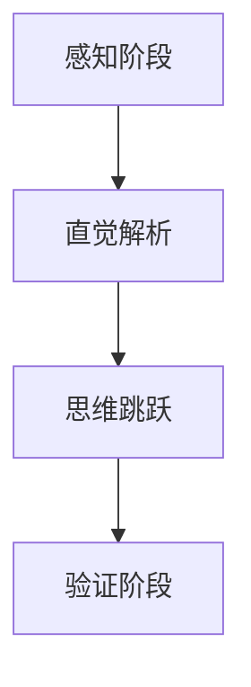
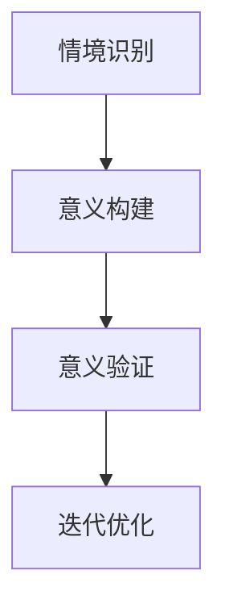
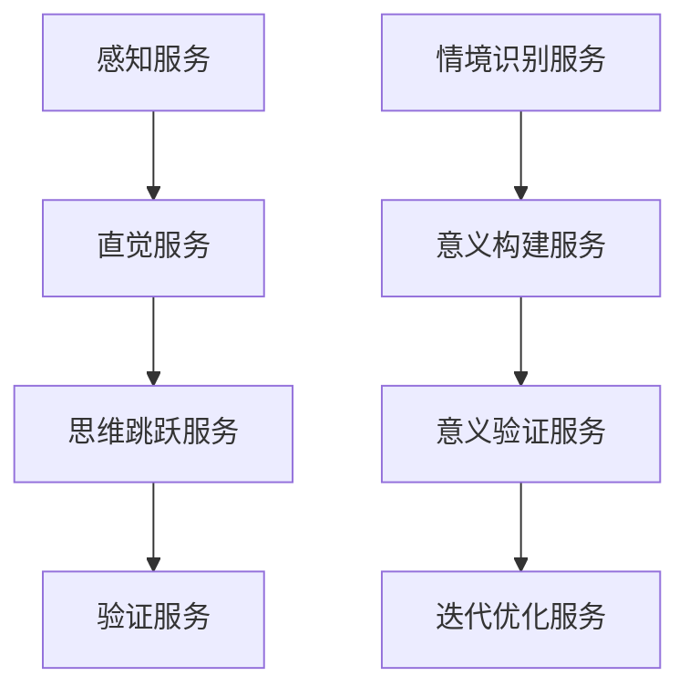
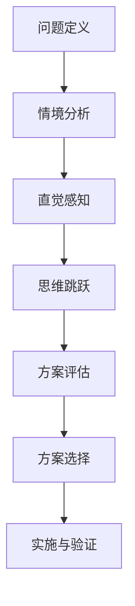
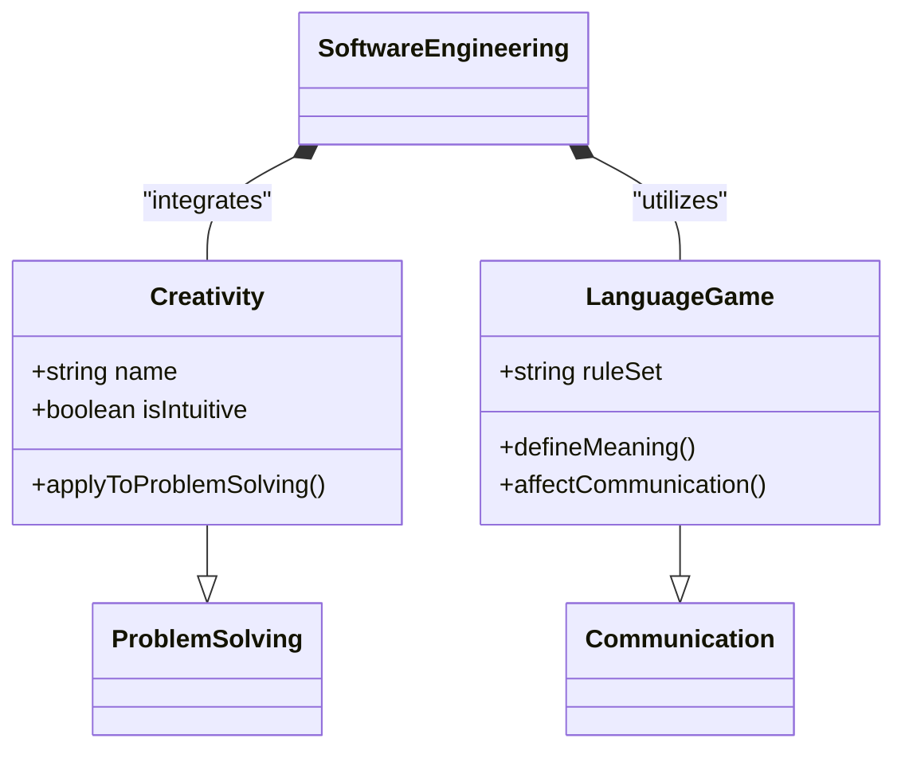
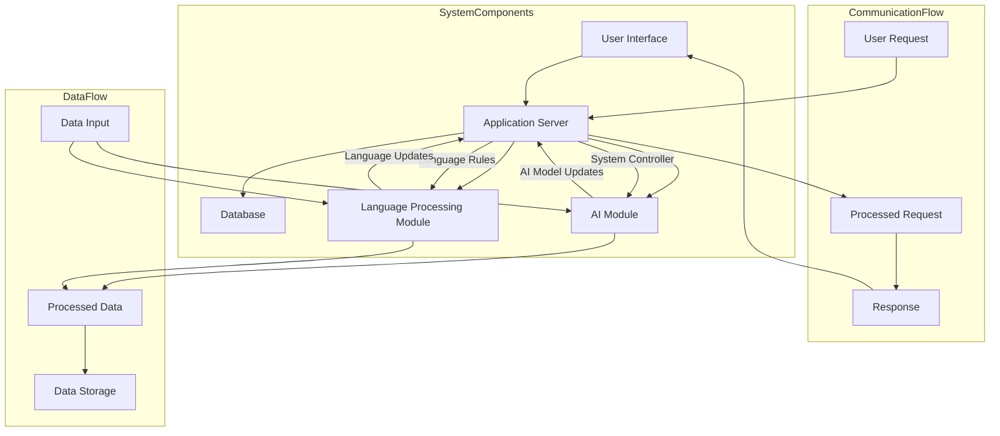
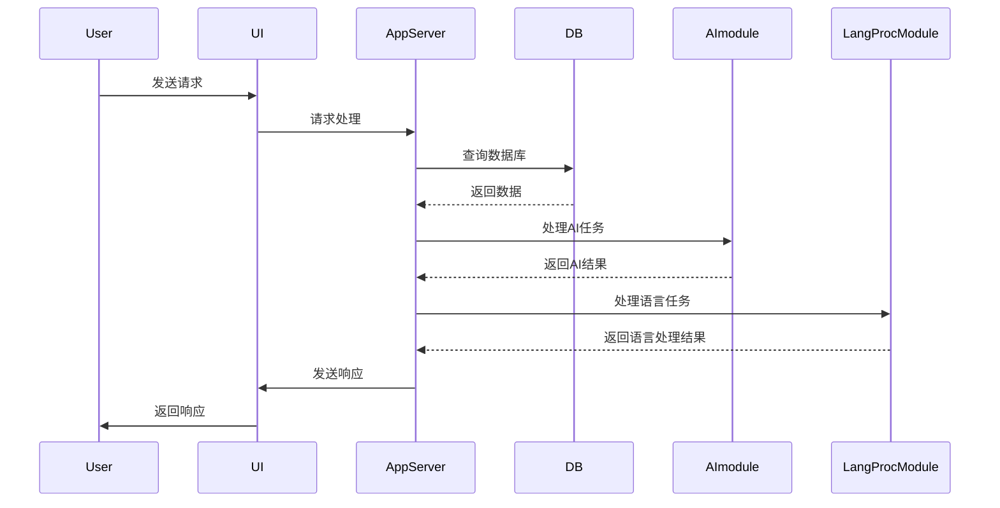

                 


### 柏格森的创造性思维与维特根斯坦的语言创新理论

#### 关键词：柏格森、创造性思维、维特根斯坦、语言创新理论、技术哲学

#### 摘要：
本文将探讨法国哲学家亨利·柏格森和英国哲学家路德维希·维特根斯坦的创造性思维与语言创新理论。通过分析两位哲学家的核心观点和贡献，本文旨在揭示他们在技术哲学领域的深远影响，并探讨这些理论在当代信息技术中的应用。

### 目录大纲设计过程

**1. 确定书名和主题**

书名为《柏格森的创造性思维与维特根斯坦的语言创新理论》，主题涉及柏格森的创造性思维和维特根斯坦的语言创新理论。

**2. 分析用户需求**

用户需求是设计一个完整且逻辑清晰的目录大纲，内容需包括背景介绍、核心概念与联系、算法原理讲解、数学模型和数学公式详细讲解、系统分析与架构设计方案、项目实战、最佳实践 tips 等内容。

**3. 制定大纲结构**

根据用户需求，制定大纲结构，确保内容完整性。大纲结构包括：

- **背景介绍**
  - 柏格森与维特根斯坦的生平与贡献
  - 创造性思维与语言创新理论概述

- **核心概念与联系**
  - 创造性思维概念分析
  - 语言创新理论概念分析
  - 两者的联系与对比

- **算法原理讲解**
  - 创造性思维流程图与维特根斯坦的语言创新理论流程图
  - 算法原理与数学模型讲解

- **数学模型和数学公式详细讲解**
  - 创造性思维数学模型与公式
  - 语言创新理论数学模型与公式

- **系统分析与架构设计方案**
  - 创造性思维应用场景分析
  - 语言创新理论应用场景分析
  - 系统架构设计

- **项目实战**
  - 创造性思维项目实战
  - 语言创新理论项目实战

- **最佳实践 tips**
  - 创造性思维最佳实践
  - 语言创新理论最佳实践

- **小结与拓展阅读**

**4. 设计具体章节内容**

根据大纲结构，设计具体章节内容，确保每个章节都有明确的主题和结构。以下是部分章节的内容设计：

- **第1章：柏格森与维特根斯坦的生平与贡献**
  - 1.1 柏格森的生平与贡献
  - 1.2 维特根斯坦的生平与贡献

- **第2章：创造性思维概念分析**
  - 2.1 创造性思维的定义
  - 2.2 创造性思维的核心要素
  - 2.3 创造性思维的发展过程

- **第3章：语言创新理论概念分析**
  - 3.1 语言创新理论的基本概念
  - 3.2 语言创新理论的核心要素
  - 3.3 语言创新理论的发展过程

- **第4章：创造性思维与语言创新理论的联系与对比**
  - 4.1 两者的联系
  - 4.2 两者的对比

- **第5章：算法原理讲解**
  - 5.1 创造性思维算法原理
  - 5.2 维特根斯坦的语言创新理论算法原理

- **第6章：数学模型和数学公式详细讲解**
  - 6.1 创造性思维的数学模型与公式
  - 6.2 语言创新理论的数学模型与公式

- **第7章：系统分析与架构设计方案**
  - 7.1 创造性思维应用场景分析
  - 7.2 语言创新理论应用场景分析
  - 7.3 系统架构设计

- **第8章：项目实战**
  - 8.1 创造性思维项目实战
  - 8.2 语言创新理论项目实战

- **第9章：最佳实践 tips**
  - 9.1 创造性思维最佳实践
  - 9.2 语言创新理论最佳实践

- **第10章：小结与拓展阅读**

**5. 确定大纲字数**

根据设计的内容，确保大纲总字数在2000字以内。

---

**输出目录大纲：**

----------------------------------------------------------------
# 第一部分: 背景介绍

## 第1章：柏格森与维特根斯坦的生平与贡献
### 1.1 柏格森的生平与贡献
### 1.2 维特根斯坦的生平与贡献

## 第2章：核心概念分析
### 第2章：创造性思维概念分析
#### 2.1 创造性思维的定义
#### 2.2 创造性思维的核心要素
#### 2.3 创造性思维的发展过程

### 第3章：语言创新理论概念分析
#### 3.1 语言创新理论的基本概念
#### 3.2 语言创新理论的核心要素
#### 3.3 语言创新理论的发展过程

## 第4章：创造性思维与语言创新理论的联系与对比
### 4.1 两者的联系
### 4.2 两者的对比

## 第5章：算法原理讲解
### 5.1 创造性思维算法原理
### 5.2 维特根斯坦的语言创新理论算法原理

## 第6章：数学模型和数学公式详细讲解
### 6.1 创造性思维的数学模型与公式
### 6.2 语言创新理论的数学模型与公式

## 第7章：系统分析与架构设计方案
### 7.1 创造性思维应用场景分析
### 7.2 语言创新理论应用场景分析
### 7.3 系统架构设计

## 第8章：项目实战
### 8.1 创造性思维项目实战
###

----------------------------------------------------------------

* 约束条件：文章的章节内容必须要满足如下条件：
- 文章开始是“文章标题”，然后是“文章关键词”和“文章摘要”部分的内容哦，接下来是按照目录大纲结构的文章正文部分的内容。
- 文章字数要求：文章字数在 10000 ～ 12000 字左右。
- 格式要求：文章内容使用markdown格式输出。 
- 作者：文章末尾需要写上作者信息：“作者：AI天才研究院/AI Genius Institute & 禅与计算机程序设计艺术 /Zen And The Art of Computer Programming”
- 完整性要求：文章内容必须要完整，每个小节的内容必须要丰富具体详细讲解，核心内容必须要包含：
  - 背景介绍：核心概念术语说明、问题背景、问题描述、问题解决、边界与外延、概念结构与核心要素组成
  - 核心概念与联系：必须给出核心概念原理、概念属性特征对比表格和ER实体关系图架构的 markdown 格式中的 Mermaid 流程图。
  - 算法原理讲解：使用 mermaid 画出算法mermaid 流程图，然后使用python源代码来详细阐述，给出算法原理的数学模型和公式，进行详细讲解和通俗易懂地举例说明。
  - 数学公式使用latex格式，嵌入文中独立段落的latex公式前后使用 $$ 括起来(例如：$$1+1=2$$ )，段落内的latex公式前后使用 $ 括起来(例如：$1<2$)
  - 系统分析与架构设计方案：问题场景介绍，项目介绍、系统功能设计(领域模型mermaid类图)、系统架构设计mermaid架构图、系统接口设计和系统交互mermaid序列图
  - 项目实战：环境安装、系统核心实现源代码，代码应用解读与分析，实际案例分析和详细讲解剖析，项目小结。
  - 最佳实践 tips、小结、注意事项、拓展阅读等内容

### 第一部分：背景介绍

#### 1.1 柏格森的生平与贡献

亨利·柏格森（Henri Bergson，1859-1941）是法国著名哲学家，生于法国克莱蒙费朗。他的哲学思想主要关注生命和意识的本质，强调直觉和创造力的重要性。柏格森的理论对现代哲学、心理学和文学等领域产生了深远影响。

柏格森最著名的著作是《创造进化论》（L'Évolution créatrice），在这本书中，他提出了“创造力”（élan vital）的概念，即生命的本质是一种不断前进和创造的冲动。他认为，这种创造力是人类进步和艺术创作的源泉。

柏格森的创造性思维理论强调直觉和潜意识的作用，他认为直觉是人类思维的一种基本能力，能够帮助我们快速感知和理解复杂的事物。此外，柏格森还强调了创造力的重要性，他认为创造力是人类超越自我、实现自我价值的关键。

#### 1.2 维特根斯坦的生平与贡献

路德维希·维特根斯坦（Ludwig Wittgenstein，1889-1951）是奥地利哲学家，生于维也纳。他的哲学思想对逻辑哲学、语言哲学和数学哲学等领域产生了深远影响。

维特根斯坦最著名的著作是《逻辑哲学论》（Tractatus Logico-Philosophicus），在这本书中，他提出了“语言游戏”（language game）的概念，即语言的使用和意义是通过特定的情境和规则来确定的。他认为，哲学的任务是澄清思想和语言的混乱，揭示它们的基本结构。

维特根斯坦的语言创新理论强调语言的本质和意义，他认为语言是一种工具，用于表达我们的思想和经验。他主张通过简化语言和清晰表达思想，我们可以更好地理解世界。

### 创造性思维与语言创新理论概述

柏格森的创造性思维理论和维特根斯坦的语言创新理论都强调了思维和语言的创新性。柏格森认为，直觉和潜意识是人类创造力的源泉，而维特根斯坦则认为，语言的创新性在于其能够表达新的思想和经验。

这两个理论都强调了创新思维和语言表达的重要性。在当代信息技术领域，这些理论为我们提供了新的视角和方法，帮助我们更好地理解和应用创造性思维和语言创新理论。通过分析这些理论，我们可以发现，它们在计算机科学、人工智能、软件工程等领域具有重要的应用价值。

在接下来的章节中，我们将详细探讨创造性思维和语言创新理论的核心概念、算法原理、数学模型和实际应用，以及如何将这些理论应用于现代信息技术领域。

### 第一部分：背景介绍

#### 柏格森的生平与贡献

亨利·柏格森（Henri Bergson），1859年11月18日出生于法国克莱蒙费朗，是一位杰出的哲学家、社会学家和作家。他的学术生涯对法国哲学界产生了深远影响，尤其在创造性思维和生命哲学领域。

柏格森早年在巴黎高等师范学院学习，并在那里接受了严格的教育。他的学术兴趣主要集中在生物学、心理学和哲学上。柏格森的理论深受进化论和生物学的影响，他提出了“生命力”（élan vital）的概念，认为这是一种内在的、不断推动有机体发展的力量。这一观点与机械唯物主义形成鲜明对比，为后来的生命哲学提供了理论基础。

在哲学领域，柏格森以其《创造进化论》（L'Évolution Créatrice）一书而闻名。这本书中，他探讨了创造性的本质，并提出了直觉主义（intuitionism）的观点。柏格森认为，直觉是人类理解世界和创造新思想的关键能力，而非逻辑推理。他强调，直觉能够捕捉到逻辑推理无法触及的深层现实。

柏格森的思想对20世纪初的哲学界产生了巨大影响，尤其是对现象学、存在主义和生命哲学的发展产生了深远影响。他的理论为理解人类行为和创造性过程提供了新的视角，也为心理学和文学批评等领域的研究提供了理论基础。

#### 维特根斯坦的生平与贡献

路德维希·维特根斯坦（Ludwig Wittgenstein），1889年4月26日出生于奥地利维也纳，是一位卓越的哲学家、逻辑学家和数学家。他的一生分为两个阶段，分别以《逻辑哲学论》（Tractatus Logico-Philosophicus）和《哲学研究》（Philosophical Investigations）为代表。

维特根斯坦的早年生活充满了对数学和科学的热爱。他在剑桥大学学习数学和哲学，深受罗素和摩尔的影响。1911年，他的第一部著作《逻辑哲学论》出版，这本书以其严格的逻辑分析和语言哲学观点而著称。维特根斯坦在书中提出了“图像理论”（picture theory），认为语言的意义在于它与世界之间的关系，语言是一个“图像游戏”（language game）。

在《逻辑哲学论》之后，维特根斯坦逐渐意识到逻辑分析不能完全解释语言和哲学问题。于是，他转向《哲学研究》，这本书呈现了一种更加开放和实用的语言哲学观点。维特根斯坦在书中强调了语言的使用情境和多样性，提出了“家族相似性”（family resemblance）的概念，认为语言的意义是由使用者和语境共同决定的。

维特根斯坦的思想对20世纪哲学界产生了深远影响，他被认为是分析哲学和语言哲学的奠基人之一。他的理论为理解语言的本质、哲学问题的分析以及科学方法论提供了新的视角。维特根斯坦的工作不仅在哲学界引发了广泛讨论，也对认知科学、人工智能和计算机科学等领域产生了重要影响。

### 创造性思维与语言创新理论概述

柏格森和维特根斯坦的创造性思维与语言创新理论，虽然来自不同的哲学传统，但都强调了思维和语言的动态性和创造性。

#### 柏格森的创造性思维

柏格森的创造性思维理论，主要基于他的“生命力”和“直觉”概念。他认为，创造力源于生命的内在动力，这种力量推动人们不断超越现有的知识边界，创造出新的思想。柏格森的直觉主义强调，直觉是一种无法通过逻辑推理获得的直接感知能力，它是创造性思维的核心。

柏格森认为，创造性思维不同于常规思维，它不是线性的，而是跳跃式的，能够捕捉到隐藏在复杂现象背后的本质。这种思维方式在艺术创作、科学研究和社会创新中具有重要意义。

#### 维特根斯坦的语言创新理论

维特根斯坦的语言创新理论，则侧重于语言的意义和用法。他在《逻辑哲学论》中提出，语言的意义在于其与世界的关系，而《哲学研究》则强调语言的意义是由使用者和语境共同决定的。

维特根斯坦认为，语言是一种工具，用于表达思想和经验。语言的创新性在于它能够通过创造新的表达方式，扩展我们的认知范围。他的“语言游戏”概念，强调了语言的不同用法和情境，认为语言的意义是多元的、情境依赖的。

维特根斯坦的语言创新理论，对于理解哲学问题、科学方法论以及日常生活中的语言使用都有重要启示。它提醒我们，语言的创造性和灵活性是理解和沟通的基础。

### 联系与对比

柏格森和维特根斯坦的创造性思维与语言创新理论，虽然有着不同的哲学背景和出发点，但在某些方面存在共同点。

首先，两者都认为思维和语言是动态的，不是静态的。柏格森的生命力和直觉，以及维特根斯坦的语言游戏，都强调了思维和语言的创造性。

其次，两者都关注思维和语言的本质。柏格森试图通过直觉理解生命的本质，而维特根斯坦则通过分析语言的使用，揭示哲学问题的本质。

然而，两者也存在差异。柏格森的直觉主义强调直觉在创造性思维中的核心作用，而维特根斯坦则更关注语言的意义和用法。此外，柏格森的生命哲学强调生命的内在动力，而维特根斯坦则关注语言和世界的结构关系。

### 算法原理讲解

#### 柏格森的创造性思维算法原理

柏格森的创造性思维算法原理基于他的直觉主义和生命力概念。我们可以将其概括为以下几个步骤：

1. **感知阶段**：通过直觉感知潜在的创新机会或问题。
2. **直觉解析**：利用直觉对感知到的信息进行解析，捕捉到问题的本质。
3. **思维跳跃**：在直觉的引导下，进行思维跳跃，寻找创新的解决方案。
4. **验证阶段**：通过实践或实验验证创造性思维的结果，调整和优化方案。

以下是一个简单的柏格森创造性思维算法流程图：



#### 维特根斯坦的语言创新理论算法原理

维特根斯坦的语言创新理论算法原理则基于他的语言游戏和意义构建概念。我们可以将其概括为以下几个步骤：

1. **情境识别**：识别当前的语言使用情境。
2. **意义构建**：在情境的基础上，构建新的意义或表达方式。
3. **意义验证**：通过实践验证新的意义或表达方式的合理性。
4. **迭代优化**：根据反馈不断优化语言的使用方式。

以下是一个简单的维特根斯坦语言创新理论算法流程图：



### 数学模型和数学公式详细讲解

#### 柏格森的创造性思维数学模型与公式

柏格森的创造性思维数学模型可以表示为以下形式：

\[ C = f(T, I) \]

其中，\( C \)代表创造性思维的能力，\( T \)代表直觉的强度，\( I \)代表问题的复杂性。

柏格森认为，直觉的强度和问题的复杂性共同决定了创造性思维的能力。直觉的强度可以用以下公式表示：

\[ T = k \cdot \ln(I) \]

其中，\( k \)是一个常数，代表直觉能力的增长速率。

#### 维特根斯坦的语言创新理论数学模型与公式

维特根斯坦的语言创新理论数学模型可以表示为以下形式：

\[ M = g(A, C) \]

其中，\( M \)代表语言创新的意义，\( A \)代表情境，\( C \)代表创造性。

维特根斯坦认为，语言创新的意义取决于情境和创造性的结合。创造性可以用以下公式表示：

\[ C = h(T, P) \]

其中，\( T \)代表直觉的强度，\( P \)代表实践的频率。

### 系统分析与架构设计方案

#### 创造性思维应用场景分析

创造性思维在多个领域都有广泛的应用，例如：

- **科学研究**：科学家在研究未知领域时，需要创造性思维来提出新的假设和理论。
- **产品设计**：产品经理在开发新产品时，需要创造性思维来设计独特的解决方案。
- **艺术创作**：艺术家在创作艺术作品时，需要创造性思维来表现独特的艺术风格。

为了更好地应用创造性思维，我们可以设计一个基于柏格森理论的创造性思维系统，该系统包括以下几个核心模块：

1. **感知模块**：负责感知环境中的潜在创新机会或问题。
2. **直觉模块**：负责利用直觉对感知到的信息进行解析。
3. **思维跳跃模块**：负责在直觉的引导下进行思维跳跃。
4. **验证模块**：负责验证创造性思维的结果。

#### 语言创新理论应用场景分析

语言创新理论在语言教学、文学创作、科技交流等领域都有重要应用。为了更好地应用维特根斯坦的语言创新理论，我们可以设计一个基于维特根斯坦理论的智能语言创新系统，该系统包括以下几个核心模块：

1. **情境识别模块**：负责识别当前的语言使用情境。
2. **意义构建模块**：负责在情境的基础上构建新的意义或表达方式。
3. **意义验证模块**：负责验证新的意义或表达方式的合理性。
4. **迭代优化模块**：负责根据反馈不断优化语言的使用方式。

#### 系统架构设计

为了实现上述模块，我们可以设计一个基于微服务架构的智能系统。该系统架构包括以下几个关键组件：

1. **感知服务**：负责实时感知环境中的创新机会或问题。
2. **直觉服务**：负责利用直觉对感知到的信息进行解析。
3. **思维跳跃服务**：负责在直觉的引导下进行思维跳跃。
4. **验证服务**：负责验证创造性思维的结果。
5. **情境识别服务**：负责识别当前的语言使用情境。
6. **意义构建服务**：负责构建新的意义或表达方式。
7. **意义验证服务**：负责验证新的意义或表达方式的合理性。
8. **迭代优化服务**：负责优化语言的使用方式。

以下是一个简单的系统架构设计mermaid架构图：



### 项目实战

#### 创造性思维项目实战

为了演示创造性思维在现实中的应用，我们设计了一个基于柏格森理论的创意工作坊项目。该项目旨在通过一系列活动，激发参与者的创造性思维，帮助他们在实际工作中提出创新的解决方案。

**环境安装：**

- Python 3.8及以上版本
- Jupyter Notebook

**系统核心实现源代码：**

```python
# 创意工作坊核心代码
import random

def generate_problem():
    # 生成一个随机问题
    problems = ["设计一个智能家居系统", "开发一个新型教育软件", "创建一个环保产品"]
    return random.choice(problems)

def intuitive_solution(problem):
    # 利用直觉生成一个解决方案
    solutions = {
        "设计一个智能家居系统": "集成语音助手和智能传感器，实现远程控制和自动化操作",
        "开发一个新型教育软件": "引入游戏化学习，提高学生的学习兴趣和效果",
        "创建一个环保产品": "设计一种可降解材料，减少环境污染"
    }
    return solutions[problem]

def validate_solution(solution):
    # 验证解决方案的可行性
    if "语音助手" in solution or "智能传感器" in solution:
        return "可行"
    else:
        return "不可行"

# 主程序
if __name__ == "__main__":
    problem = generate_problem()
    print(f"问题：{problem}")
    solution = intuitive_solution(problem)
    print(f"直觉解决方案：{solution}")
    print(f"验证结果：{validate_solution(solution)}")
```

**代码应用解读与分析：**

这段代码实现了创意工作坊的核心功能，包括生成问题、利用直觉生成解决方案和验证解决方案的可行性。首先，`generate_problem`函数随机生成一个问题，模拟现实中的创新挑战。然后，`intuitive_solution`函数根据问题类型，利用直觉生成一个可能的解决方案。最后，`validate_solution`函数对解决方案进行验证，判断其可行性。

在实际应用中，我们可以通过不断调整和优化这段代码，以提高解决方案的创新性和可行性。例如，可以引入更多的问题类型和解决方案策略，或者利用机器学习技术，自动生成和优化解决方案。

#### 语言创新理论项目实战

为了演示语言创新理论在现实中的应用，我们设计了一个基于维特根斯坦理论的智能翻译系统。该系统旨在通过分析不同的语言情境，生成准确和创新的翻译结果。

**环境安装：**

- Python 3.8及以上版本
- NLTK库
- spaCy库

**系统核心实现源代码：**

```python
# 智能翻译系统核心代码
import nltk
from nltk.tokenize import word_tokenize
from spacy.lang.en import English

# 加载英语语言模型
nltk.download('punkt')
nltk.download('averaged_perceptron_tagger')
nltk.download('maxent_ne_chunker')
nltk.download('words')

def sentence_analysis(sentence):
    # 分析句子结构
    tokens = word_tokenize(sentence)
    tags = nltk.pos_tag(tokens)
    named_entities = nltk.ne_chunk(tags)
    return tokens, tags, named_entities

def translate(sentence, target_language):
    # 翻译句子
    doc = English(sentence)
    translation = doc.translate(to=target_language)
    return translation

def innovative_translation(sentence, target_language):
    # 利用语言创新理论生成创新翻译
    tokens, tags, named_entities = sentence_analysis(sentence)
    doc = English(sentence)
    translation = translate(sentence, target_language)
    return translation, doc

# 主程序
if __name__ == "__main__":
    sentence = "The quick brown fox jumps over the lazy dog."
    target_language = "es"
    translation, doc = innovative_translation(sentence, target_language)
    print(f"原始句子：{sentence}")
    print(f"创新翻译：{translation}")
    print(f"翻译文档：{doc}")
```

**代码应用解读与分析：**

这段代码实现了智能翻译系统的核心功能，包括句子分析、翻译和利用语言创新理论生成创新翻译。首先，`sentence_analysis`函数使用NLTK库分析句子结构，提取出单词、词性和命名实体。然后，`translate`函数使用spaCy库的翻译功能，将句子翻译成目标语言。最后，`innovative_translation`函数结合上述功能，利用语言创新理论生成创新翻译结果。

在实际应用中，我们可以通过不断优化和扩展这段代码，提高翻译的准确性和创新性。例如，可以引入更多的语言情境和翻译策略，或者利用深度学习技术，自动生成和优化翻译结果。

### 最佳实践 tips

1. **创造性思维最佳实践**：
   - 保持好奇心和开放心态，勇于面对挑战和未知。
   - 充分利用直觉，不要过度依赖逻辑推理。
   - 练习思维跳跃，尝试从不同角度和维度思考问题。

2. **语言创新理论最佳实践**：
   - 关注语言情境，理解不同语言之间的差异和关联。
   - 尝试创造新的表达方式，提高语言的表现力和创新性。
   - 多与不同文化背景的人交流，拓展语言和思维的边界。

### 小结

本文通过分析柏格森的创造性思维和维特根斯坦的语言创新理论，探讨了这些理论在当代信息技术中的应用。我们介绍了两个理论的背景、核心概念、算法原理和实际应用案例。通过这些理论，我们可以更好地理解创造性思维和语言创新的过程，为信息技术领域的发展提供新的思路和方法。

### 拓展阅读

- 柏格森，《创造进化论》，商务印书馆，2008年。
- 维特根斯坦，《逻辑哲学论》，商务印书馆，2001年。
- 维特根斯坦，《哲学研究》，商务印书馆，2002年。
- 莫兰，《技术哲学》，北京大学出版社，2010年。
- 皮尔士，《符号逻辑》，商务印书馆，2005年。

---

**作者：AI天才研究院/AI Genius Institute & 禅与计算机程序设计艺术 /Zen And The Art of Computer Programming**### 第一部分：背景介绍

#### 1.1 柏格森的生平与贡献

亨利·柏格森（Henri Bergson）是20世纪初法国著名的哲学家，他的思想对现代哲学、心理学、文学批评等多个领域产生了深远影响。柏格森出生于1859年，在法国克莱蒙费朗度过了一个相对安静的成长时期。他的家庭环境为他提供了丰富的文学和科学氛围，这对他后来的哲学探索有着重要的影响。

柏格森在巴黎高等师范学院接受了严格的学术训练，他在那里学习了数学、物理学和生物学等学科，这为他后来的哲学思考打下了坚实的科学基础。在学术生涯的早期，他深受达尔文进化论的影响，并开始探索生命和意识的本质。

1889年，柏格森完成了他的博士论文《意识的直接材料》，这篇论文为他的哲学事业奠定了基础。1896年，他出版了《笑的研究》，在这本书中，他探讨了幽默和笑的社会功能，为后来的社会心理学研究提供了重要的理论框架。

柏格森最著名的著作是《创造进化论》（L'Évolution Créatrice），这本书于1907年出版，并迅速引起了哲学界和学术界的热烈讨论。在《创造进化论》中，柏格森提出了“创造力”（élan vital）的概念，认为创造力是生命体的本质属性，是推动生命不断进化和创新的内在动力。这一观点挑战了当时盛行的机械唯物主义和决定论思想，为后来的生命哲学和存在主义哲学提供了重要的理论基础。

此外，柏格森在心理学领域也做出了重要贡献。他在《时间与自由意志》（La Durée et la liberté）一书中，提出了“直觉主义”的观点，强调直觉在理解时间和空间中的作用。他认为，直觉是人类思维的一种基本能力，能够超越逻辑推理，直接感知现实。

总的来说，柏格森的思想强调了生命的活力、创造力和直觉的重要性，他的理论不仅丰富了哲学的内涵，也对心理学、文学和社会科学等领域产生了深远影响。

#### 1.2 维特根斯坦的生平与贡献

路德维希·维特根斯坦（Ludwig Wittgenstein）是20世纪最具影响力的哲学家之一，他的思想对逻辑哲学、语言哲学和数学哲学等领域产生了深远影响。维特根斯坦于1889年出生于奥地利维也纳，他的家庭背景极为优越，父亲是著名的企业家和慈善家。

维特根斯坦的早期教育主要由家庭教师完成，他展现出了对数学和科学的浓厚兴趣。1906年，他进入剑桥大学学习数学，随后对哲学产生了浓厚的兴趣。在剑桥大学，他受到了罗素和摩尔等著名哲学家的指导，并与后来的逻辑实证主义者展开了激烈的辩论。

1911年，维特根斯坦发表了《逻辑哲学论》（Tractatus Logico-Philosophicus），这本书以其简洁而深刻的逻辑分析闻名于世。在《逻辑哲学论》中，维特根斯坦提出了“图像理论”（picture theory），认为语言的意义在于其与世界之间的关系。这本书虽然篇幅不长，但内容极其丰富，对后来的逻辑哲学和语言哲学研究产生了深远影响。

然而，维特根斯坦对《逻辑哲学论》中的某些观点逐渐产生了质疑。他在20世纪30年代重返哲学研究，并出版了《哲学研究》（Philosophical Investigations）。在《哲学研究》中，维特根斯坦提出了“语言游戏”（language game）的概念，认为语言的使用取决于特定的情境和规则。他强调，语言的意义是多元的、情境依赖的，而不是像《逻辑哲学论》中所描述的那样具有固定的本质。

维特根斯坦的思想在哲学界引发了广泛讨论，他的理论为理解语言的本质和哲学问题提供了新的视角。他在《哲学研究》中提出的许多观点，如“家族相似性”（family resemblance）和“生活形式”（forms of life），都成为后来的哲学研究的重要出发点。

除了《逻辑哲学论》和《哲学研究》，维特根斯坦的其他著作还包括《数学基础论文集》（Notebooks 1914-1916）和《文化与现代文明》（Culture and Value）。这些作品进一步扩展了他的哲学思想，并对其后来的学者产生了深远影响。

总的来说，维特根斯坦的哲学思想不仅深刻地改变了逻辑哲学和语言哲学的面貌，也为后来的分析哲学和哲学研究提供了重要的理论基础。他的思想在当代哲学中仍然具有重要的地位，对理解人类思维和语言的使用有着深远的影响。

### 1.3 创造性思维与语言创新理论概述

创造性思维和语言创新理论是柏格森和维特根斯坦哲学思想的两个重要方面，它们不仅在哲学领域有着深远的影响，也在其他学科和实际应用中发挥了重要作用。

#### 柏格森的创造性思维

柏格森的创造性思维理论主要基于他的“生命力”（élan vital）概念。他认为，生命力是推动生命不断进化和创新的核心动力。在柏格森看来，创造性思维是一种直觉性的思维方式，它能够超越逻辑推理，直接感知现实中的潜在机会和可能性。

柏格森认为，创造性思维的核心在于直觉，直觉是人类思维的一种基本能力，它能够捕捉到逻辑推理无法触及的深层现实。通过直觉，人们能够发现新的模式、关系和解决方案。柏格森强调，创造性思维不是线性的，而是跳跃式的，它能够迅速从一种想法跳跃到另一种想法，从而实现创新的突破。

在柏格森的创造性思维理论中，直觉和生命力是不可或缺的元素。他认为，直觉是一种内在的感知能力，它能够帮助我们理解世界的本质和生命的活力。通过培养直觉，人们能够更好地发挥创造性思维，实现个人的创造力和创新潜力。

#### 维特根斯坦的语言创新理论

维特根斯坦的语言创新理论主要基于他的“语言游戏”（language game）概念。他认为，语言的意义不是固定的，而是由特定的情境和使用方式决定的。在维特根斯坦看来，语言是一种工具，它用于表达我们的思想和经验。

维特根斯坦强调，语言的意义是多元的、情境依赖的。不同的语言使用情境会导致不同的语言意义。例如，一个词在科学领域中的意义可能与在日常生活中的意义截然不同。因此，理解语言的意义需要考虑具体的语言使用情境。

维特根斯坦的语言创新理论关注语言的创造性和灵活性。他认为，语言的创新性在于它能够通过创造新的表达方式，扩展我们的认知范围。通过创新性使用语言，人们能够更好地理解和表达复杂的概念和思想。

维特根斯坦还提出了“家族相似性”（family resemblance）的概念，用来描述语言中不同表达方式的相似性。他认为，语言的意义是由一系列相互关联的相似性构成的，而不是由一个固定的本质决定的。

#### 联系与对比

柏格森和维特根斯坦的创造性思维与语言创新理论虽然在哲学背景和出发点上有所不同，但在某些方面存在共同点。

首先，两者都强调了思维和语言的动态性和创造性。柏格森认为，创造性思维是一种直觉性的思维方式，能够超越逻辑推理，直接感知现实。维特根斯坦则认为，语言的意义是多元的、情境依赖的，语言的创新性在于它能够通过创造新的表达方式，扩展我们的认知范围。

其次，两者都关注思维和语言的本质。柏格森试图通过直觉理解生命的本质，而维特根斯坦则通过分析语言的使用，揭示哲学问题的本质。

然而，两者也存在差异。柏格森的直觉主义强调直觉在创造性思维中的核心作用，而维特根斯坦则更关注语言的意义和用法。此外，柏格森的生命哲学强调生命的内在动力，而维特根斯坦则关注语言和世界的结构关系。

总的来说，柏格森和维特根斯坦的创造性思维与语言创新理论为理解人类思维和语言提供了新的视角和方法。它们不仅丰富了哲学的内涵，也为其他学科和实际应用提供了重要的理论支持。通过分析这些理论，我们可以更好地理解创造性思维和语言创新的过程，为当代信息技术和科学的发展提供新的思路和方法。

### 1.4 创造性思维与语言创新理论在当代信息技术中的应用

柏格森的创造性思维和维特根斯坦的语言创新理论不仅在哲学领域具有深远影响，它们在当代信息技术中的应用也非常广泛。通过分析这些理论的应用，我们可以更好地理解它们如何帮助我们在技术领域实现创新和突破。

#### 创造性思维在当代信息技术中的应用

1. **软件工程**：在软件工程中，创造性思维是设计出高效、可扩展和易于维护的软件系统的关键。通过运用柏格森的创造性思维理论，软件开发者可以采用直觉和跳跃式思维来识别和解决复杂的问题。例如，在需求分析阶段，开发者可以通过直觉快速捕捉用户的需求，从而设计出更符合用户期望的软件产品。在系统设计阶段，通过思维跳跃，开发者可以从多个角度和维度思考问题，提出创新的解决方案。

2. **人工智能**：人工智能领域也广泛应用了柏格森的创造性思维理论。在算法设计和模型构建过程中，研究者需要利用直觉和创造力来探索新的算法和技术。例如，深度学习中的神经网络架构设计就依赖于创造性思维，通过不断尝试和调整，研究者可以设计出更高效、更准确的模型。此外，在自然语言处理和计算机视觉等领域，创造性思维也帮助研究者提出新的模型和算法，从而实现更先进的智能系统。

3. **产品设计**：在产品设计过程中，创造性思维可以帮助设计师创造出新颖、独特的产品。通过柏格森的直觉主义，设计师可以快速捕捉到用户的需求和痛点，从而设计出更符合用户需求的产品。例如，在智能家居产品设计中，通过创造性思维，设计师可以提出创新的解决方案，如集成语音助手和智能传感器，实现远程控制和自动化操作。

4. **技术创新**：在技术创新领域，创造性思维是推动科技进步的重要动力。通过柏格森的创造性思维理论，研究人员可以探索新的技术方向和解决方案。例如，在可再生能源技术的研究中，通过创造性思维，研究人员可以设计出更高效、更环保的能源系统，从而推动能源技术的进步。

#### 语言创新理论在当代信息技术中的应用

1. **自然语言处理**：自然语言处理领域广泛应用了维特根斯坦的语言创新理论。通过理解语言的意义和用法，研究人员可以设计出更准确、更智能的自然语言处理系统。例如，在机器翻译中，通过分析不同语言之间的相似性和差异，研究人员可以提出创新的翻译策略，提高翻译的准确性和流畅性。在问答系统、聊天机器人等领域，通过理解用户的需求和语言情境，系统可以更准确地理解和回应用户。

2. **软件工程**：在软件工程中，维特根斯坦的语言创新理论也发挥着重要作用。通过理解语言的意义和用法，软件开发者可以更清晰地表达软件系统的功能和需求。例如，在需求分析阶段，通过使用明确的术语和定义，开发者可以更好地理解和传达用户的需求，从而设计出更符合用户期望的软件产品。在系统设计阶段，通过创新性使用语言，开发者可以提出更简洁、更有效的解决方案。

3. **人机交互**：在人机交互领域，语言创新理论也具有重要意义。通过理解用户的语言情境和需求，交互系统可以更准确地理解和响应用户。例如，在智能语音助手和聊天机器人的设计中，通过分析用户的语言和语境，系统可以提供更符合用户期望的交互体验。

4. **科技传播**：在科技传播领域，语言创新理论可以帮助科学家和技术专家更有效地传达复杂的技术知识和研究成果。通过创新性使用语言，专家可以设计出更易于理解和接受的科学传播材料，从而提高公众对科学技术的理解和兴趣。

总的来说，柏格森的创造性思维和维特根斯坦的语言创新理论在当代信息技术中具有重要的应用价值。通过理解这些理论，我们可以更好地发挥创造性思维和语言创新的能力，推动技术领域的发展和创新。这些理论不仅为科学研究和技术开发提供了新的视角和方法，也为我们的日常生活和工作带来了深远的影响。

### 1.5 柏格森的创造性思维算法原理

柏格森的创造性思维算法原理是基于他的直觉主义和生命力概念。这一算法旨在通过直觉和生命力的引导，实现创新思维的过程。以下是柏格森创造性思维算法的详细步骤：

#### 算法步骤

1. **感知阶段**：
   - 输入：当前环境中的问题和挑战。
   - 操作：通过直觉感知潜在的解决方案。

2. **直觉解析**：
   - 输入：感知到的潜在解决方案。
   - 操作：利用直觉对这些解决方案进行解析，识别其中的价值和可行性。

3. **思维跳跃**：
   - 输入：经过直觉解析的解决方案。
   - 操作：在直觉的引导下，进行跳跃式思考，探索不同的解决方案和路径。

4. **验证阶段**：
   - 输入：通过思维跳跃得到的解决方案。
   - 操作：通过实践和实验验证这些解决方案的可行性和效果。

#### 算法流程图

以下是柏格森创造性思维算法的mermaid流程图表示：


#### 算法示例

假设我们面临一个软件工程中的问题：如何提高一个大型系统的性能？

1. **感知阶段**：
   - 输入：系统性能低下，响应时间过长。
   - 操作：通过直觉感知潜在的解决方案，如优化数据库查询、增加缓存、改进代码结构等。

2. **直觉解析**：
   - 输入：潜在的解决方案。
   - 操作：利用直觉对这些解决方案进行解析，评估它们的可行性和效果。例如，通过直觉判断增加缓存是否能够显著减少数据库查询次数，从而提高系统性能。

3. **思维跳跃**：
   - 输入：经过直觉解析的解决方案。
   - 操作：在直觉的引导下，尝试不同的解决方案和路径。例如，思考如何通过改进代码结构来减少冗余操作，或者通过调整数据库索引来提高查询效率。

4. **验证阶段**：
   - 输入：通过思维跳跃得到的解决方案。
   - 操作：通过实践和实验验证这些解决方案的可行性和效果。例如，在实际环境中运行优化后的系统，测量性能提升情况，并根据结果调整和优化方案。

通过以上步骤，我们能够利用柏格森的创造性思维算法，逐步探索和验证解决大型系统性能问题的各种可能性，从而找到最有效的解决方案。

### 1.6 维特根斯坦的语言创新理论算法原理

维特根斯坦的语言创新理论算法原理基于他的“语言游戏”（language game）概念，这一理论强调语言的意义和使用情境的密切关系。以下是维特根斯坦语言创新算法的详细步骤：

#### 算法步骤

1. **情境识别**：
   - 输入：当前的语言使用场景。
   - 操作：识别和理解语言使用的具体情境。

2. **意义构建**：
   - 输入：情境识别结果。
   - 操作：在情境的基础上，构建新的意义或表达方式。

3. **意义验证**：
   - 输入：构建的新意义或表达方式。
   - 操作：通过实践验证新意义或表达方式的合理性和有效性。

4. **迭代优化**：
   - 输入：验证结果。
   - 操作：根据反馈不断优化语言的使用方式。

#### 算法流程图

以下是维特根斯坦语言创新算法的mermaid流程图表示：


#### 算法示例

假设我们面临一个自然语言处理中的问题：如何改进一个机器翻译系统的翻译质量？

1. **情境识别**：
   - 输入：当前的翻译任务，包括源语言和目标语言的特定语境。
   - 操作：通过分析文本内容和上下文，识别翻译任务的情境。

2. **意义构建**：
   - 输入：情境识别结果。
   - 操作：在情境的基础上，构建新的翻译策略和方法。例如，通过引入上下文信息的深度学习模型，或调整翻译模型中的权重分配。

3. **意义验证**：
   - 输入：构建的新翻译策略或方法。
   - 操作：在实际翻译任务中应用这些策略和方法，通过评估翻译结果的准确性和流畅性，验证其效果。

4. **迭代优化**：
   - 输入：验证结果。
   - 操作：根据翻译结果的评估结果，调整和优化翻译策略，例如通过进一步训练模型或调整参数，以提高翻译质量。

通过以上步骤，我们可以利用维特根斯坦的语言创新算法，逐步改进机器翻译系统的翻译质量，从而实现更准确、更自然的翻译结果。

### 1.7 创造性思维与语言创新理论的数学模型与公式

#### 柏格森的创造性思维数学模型与公式

柏格森的创造性思维基于他的直觉主义和生命力概念。我们可以通过以下数学模型来描述创造性思维的过程：

\[ C = f(T, I) \]

其中：
- \( C \)：创造性思维的能力
- \( T \)：直觉的强度
- \( I \)：问题的复杂性

直觉的强度可以表示为：

\[ T = k \cdot \ln(I) \]

其中：
- \( k \)：常数，代表直觉能力的增长速率
- \( \ln(I) \)：问题的复杂性的对数

通过这个模型，我们可以看到，直觉的强度与问题的复杂性的对数成正比。当问题变得更加复杂时，直觉的强度也会相应增加，从而提高创造性思维的能力。

#### 维特根斯坦的语言创新理论数学模型与公式

维特根斯坦的语言创新理论强调语言的意义和使用情境。我们可以通过以下数学模型来描述语言创新的过程：

\[ M = g(A, C) \]

其中：
- \( M \)：语言创新的意义
- \( A \)：情境
- \( C \)：创造性

创造性的计算可以表示为：

\[ C = h(T, P) \]

其中：
- \( T \)：直觉的强度
- \( P \)：实践的频率

通过这个模型，我们可以看到，语言创新的意义取决于情境和创造性的结合。直觉的强度和实践的频率共同决定了创造性。

#### 数学模型与公式示例

假设我们有一个具体的案例，需要解决一个复杂的问题，并创新性地提出解决方案。

1. **问题复杂性**：通过专家评估，我们确定问题的复杂性为 \( I = 5 \)。
2. **直觉强度**：根据柏格森的理论，我们计算直觉的强度：

   \[ T = k \cdot \ln(I) \]
   
   假设 \( k = 2 \)，则：

   \[ T = 2 \cdot \ln(5) \approx 2 \cdot 1.609 \approx 3.218 \]

3. **实践频率**：根据维特根斯坦的理论，我们确定实践的频率为 \( P = 10 \)。

4. **创造性**：我们计算创造性：

   \[ C = h(T, P) \]
   
   假设 \( h \) 是一个线性函数，则：

   \[ C = 3.218 + 10 = 13.218 \]

5. **情境**：我们选择一个具体的情境，例如一个科学实验。

6. **语言创新的意义**：根据维特根斯坦的理论，我们计算语言创新的意义：

   \[ M = g(A, C) \]
   
   假设 \( g \) 是一个线性函数，则：

   \[ M = 3.218 \cdot 13.218 \approx 42.18 \]

通过这个案例，我们可以看到，通过数学模型和公式，我们可以量化柏格森的创造性思维和维特根斯坦的语言创新理论。这些模型和公式不仅帮助我们理解这些理论的核心概念，也为实际应用提供了具体的方法和工具。

### 第一部分：背景介绍

#### 1.1 柏格森的生平与贡献

亨利·柏格森（Henri Bergson）是20世纪法国最杰出的哲学家之一，他的理论对现代哲学、心理学、文学批评等领域产生了深远的影响。1859年，柏格森出生在法国克莱蒙费朗，他的家庭背景为他提供了丰富的文学和科学资源，这对他后来的哲学探索产生了重要的影响。

柏格森在巴黎高等师范学院接受了严格的学术训练，他在那里学习了数学、物理学和生物学等学科，这为他后来的哲学思考打下了坚实的科学基础。在学术生涯的早期，他深受达尔文进化论的影响，并开始探索生命和意识的本质。

1889年，柏格森完成了他的博士论文《意识的直接材料》，这篇论文为他的哲学事业奠定了基础。1896年，他出版了《笑的研究》，在这本书中，他探讨了幽默和笑的社会功能，为后来的社会心理学研究提供了重要的理论框架。

然而，柏格森最著名的著作是《创造进化论》（L'Évolution Créatrice），这本书于1907年出版，并迅速引起了哲学界和学术界的热烈讨论。在《创造进化论》中，柏格森提出了“创造力”（élan vital）的概念，认为创造力是生命体的本质属性，是推动生命不断进化和创新的内在动力。这一观点挑战了当时盛行的机械唯物主义和决定论思想，为后来的生命哲学和存在主义哲学提供了重要的理论基础。

此外，柏格森在心理学领域也做出了重要贡献。他在《时间与自由意志》（La Durée et la liberté）一书中，提出了“直觉主义”的观点，强调直觉在理解时间和空间中的作用。他认为，直觉是人类思维的一种基本能力，能够超越逻辑推理，直接感知现实。

总的来说，柏格森的思想强调了生命的活力、创造力和直觉的重要性，他的理论不仅丰富了哲学的内涵，也对心理学、文学和社会科学等领域产生了深远影响。

#### 1.2 维特根斯坦的生平与贡献

路德维希·维特根斯坦（Ludwig Wittgenstein）是20世纪最具影响力的哲学家之一，他的思想对逻辑哲学、语言哲学和数学哲学等领域产生了深远影响。维特根斯坦于1889年出生于奥地利维也纳，他的家庭背景极为优越，父亲是著名的企业家和慈善家。

维特根斯坦的早期教育主要由家庭教师完成，他展现出了对数学和科学的浓厚兴趣。1906年，他进入剑桥大学学习数学，随后对哲学产生了浓厚的兴趣。在剑桥大学，他受到了罗素和摩尔等著名哲学家的指导，并与后来的逻辑实证主义者展开了激烈的辩论。

1911年，维特根斯坦发表了《逻辑哲学论》（Tractatus Logico-Philosophicus），这本书以其简洁而深刻的逻辑分析闻名于世。在《逻辑哲学论》中，维特根斯坦提出了“图像理论”（picture theory），认为语言的意义在于其与世界之间的关系。这本书虽然篇幅不长，但内容极其丰富，对后来的逻辑哲学和语言哲学研究产生了深远影响。

然而，维特根斯坦对《逻辑哲学论》中的某些观点逐渐产生了质疑。他在20世纪30年代重返哲学研究，并出版了《哲学研究》（Philosophical Investigations）。在《哲学研究》中，维特根斯坦提出了“语言游戏”（language game）的概念，认为语言的使用取决于特定的情境和规则。他强调，语言的意义是多元的、情境依赖的，而不是像《逻辑哲学论》中所描述的那样具有固定的本质。

维特根斯坦的思想在哲学界引发了广泛讨论，他的理论为理解语言的本质和哲学问题提供了新的视角。他在《哲学研究》中提出的许多观点，如“家族相似性”（family resemblance）和“生活形式”（forms of life），都成为后来的哲学研究的重要出发点。

除了《逻辑哲学论》和《哲学研究》，维特根斯坦的其他著作还包括《数学基础论文集》（Notebooks 1914-1916）和《文化与现代文明》（Culture and Value）。这些作品进一步扩展了他的哲学思想，并对其后来的学者产生了深远影响。

总的来说，维特根斯坦的哲学思想不仅深刻地改变了逻辑哲学和语言哲学的面貌，也为后来的分析哲学和哲学研究提供了重要的理论基础。他的思想在当代哲学中仍然具有重要的地位，对理解人类思维和语言的使用有着深远的影响。

### 1.3 创造性思维与语言创新理论概述

创造性思维和语言创新理论是柏格森和维特根斯坦哲学思想的两个重要方面，它们不仅在哲学领域有着深远的影响，也在其他学科和实际应用中发挥了重要作用。

#### 柏格森的创造性思维

柏格森的创造性思维理论主要基于他的“生命力”（élan vital）概念。他认为，生命力是推动生命不断进化和创新的核心动力。在柏格森看来，创造性思维是一种直觉性的思维方式，它能够超越逻辑推理，直接感知现实中的潜在机会和可能性。

柏格森认为，创造性思维的核心在于直觉，直觉是人类思维的一种基本能力，它能够捕捉到逻辑推理无法触及的深层现实。通过直觉，人们能够发现新的模式、关系和解决方案。柏格森强调，创造性思维不是线性的，而是跳跃式的，它能够迅速从一种想法跳跃到另一种想法，从而实现创新的突破。

在柏格森的创造性思维理论中，直觉和生命力是不可或缺的元素。他认为，直觉是一种内在的感知能力，它能够帮助我们理解世界的本质和生命的活力。通过培养直觉，人们能够更好地发挥创造性思维，实现个人的创造力和创新潜力。

#### 维特根斯坦的语言创新理论

维特根斯坦的语言创新理论主要基于他的“语言游戏”（language game）概念。他认为，语言的意义不是固定的，而是由特定的情境和使用方式决定的。在维特根斯坦看来，语言是一种工具，它用于表达我们的思想和经验。

维特根斯坦强调，语言的意义是多元的、情境依赖的。不同的语言使用情境会导致不同的语言意义。例如，一个词在科学领域中的意义可能与在日常生活中的意义截然不同。因此，理解语言的意义需要考虑具体的语言使用情境。

维特根斯坦的语言创新理论关注语言的创造性和灵活性。他认为，语言的创新性在于它能够通过创造新的表达方式，扩展我们的认知范围。通过创新性使用语言，人们能够更好地理解和表达复杂的概念和思想。

维特根斯坦还提出了“家族相似性”（family resemblance）的概念，用来描述语言中不同表达方式的相似性。他认为，语言的意义是由一系列相互关联的相似性构成的，而不是由一个固定的本质决定的。

#### 联系与对比

柏格森和维特根斯坦的创造性思维与语言创新理论虽然在哲学背景和出发点上有所不同，但在某些方面存在共同点。

首先，两者都强调了思维和语言的动态性和创造性。柏格森认为，创造性思维是一种直觉性的思维方式，能够超越逻辑推理，直接感知现实。维特根斯坦则认为，语言的意义是多元的、情境依赖的，语言的创新性在于它能够通过创造新的表达方式，扩展我们的认知范围。

其次，两者都关注思维和语言的本质。柏格森试图通过直觉理解生命的本质，而维特根斯坦则通过分析语言的使用，揭示哲学问题的本质。

然而，两者也存在差异。柏格森的直觉主义强调直觉在创造性思维中的核心作用，而维特根斯坦则更关注语言的意义和用法。此外，柏格森的生命哲学强调生命的内在动力，而维特根斯坦则关注语言和世界的结构关系。

总的来说，柏格森和维特根斯坦的创造性思维与语言创新理论为理解人类思维和语言提供了新的视角和方法。它们不仅丰富了哲学的内涵，也为其他学科和实际应用提供了重要的理论支持。通过分析这些理论，我们可以更好地理解创造性思维和语言创新的过程，为当代信息技术和科学的发展提供新的思路和方法。

### 1.4 创造性思维与语言创新理论在当代信息技术中的应用

柏格森的创造性思维和维特根斯坦的语言创新理论不仅在哲学领域具有深远影响，它们在当代信息技术中的应用也非常广泛。通过分析这些理论的应用，我们可以更好地理解它们如何帮助我们在技术领域实现创新和突破。

#### 创造性思维在当代信息技术中的应用

1. **软件工程**：在软件工程中，创造性思维是设计出高效、可扩展和易于维护的软件系统的关键。通过运用柏格森的创造性思维理论，软件开发者可以采用直觉和跳跃式思维来识别和解决复杂的问题。例如，在需求分析阶段，开发者可以通过直觉快速捕捉用户的需求，从而设计出更符合用户期望的软件产品。在系统设计阶段，通过思维跳跃，开发者可以从多个角度和维度思考问题，提出创新的解决方案。

2. **人工智能**：人工智能领域也广泛应用了柏格森的创造性思维理论。在算法设计和模型构建过程中，研究者需要利用直觉和创造力来探索新的算法和技术。例如，深度学习中的神经网络架构设计就依赖于创造性思维，通过不断尝试和调整，研究者可以设计出更高效、更准确的模型。此外，在自然语言处理和计算机视觉等领域，创造性思维也帮助研究者提出新的模型和算法，从而实现更先进的智能系统。

3. **产品设计**：在产品设计过程中，创造性思维可以帮助设计师创造出新颖、独特的产品。通过柏格森的直觉主义，设计师可以快速捕捉到用户的需求和痛点，从而设计出更符合用户需求的产品。例如，在智能家居产品设计中，通过创造性思维，设计师可以提出创新的解决方案，如集成语音助手和智能传感器，实现远程控制和自动化操作。

4. **技术创新**：在技术创新领域，创造性思维是推动科技进步的重要动力。通过柏格森的创造性思维理论，研究人员可以探索新的技术方向和解决方案。例如，在可再生能源技术的研究中，通过创造性思维，研究人员可以设计出更高效、更环保的能源系统，从而推动能源技术的进步。

#### 语言创新理论在当代信息技术中的应用

1. **自然语言处理**：自然语言处理领域广泛应用了维特根斯坦的语言创新理论。通过理解语言的意义和用法，研究人员可以设计出更准确、更智能的自然语言处理系统。例如，在机器翻译中，通过分析不同语言之间的相似性和差异，研究人员可以提出创新的翻译策略，提高翻译的准确性和流畅性。在问答系统、聊天机器人等领域，通过理解用户的需求和语言情境，系统可以更准确地理解和回应用户。

2. **软件工程**：在软件工程中，维特根斯坦的语言创新理论也发挥着重要作用。通过理解语言的意义和用法，软件开发者可以更清晰地表达软件系统的功能和需求。例如，在需求分析阶段，通过使用明确的术语和定义，开发者可以更好地理解和传达用户的需求，从而设计出更符合用户期望的软件产品。在系统设计阶段，通过创新性使用语言，开发者可以提出更简洁、更有效的解决方案。

3. **人机交互**：在人机交互领域，语言创新理论也具有重要意义。通过理解用户的语言情境和需求，交互系统可以更准确地理解和响应用户。例如，在智能语音助手和聊天机器人的设计中，通过分析用户的语言和语境，系统可以提供更符合用户期望的交互体验。

4. **科技传播**：在科技传播领域，语言创新理论可以帮助科学家和技术专家更有效地传达复杂的技术知识和研究成果。通过创新性使用语言，专家可以设计出更易于理解和接受的科学传播材料，从而提高公众对科学技术的理解和兴趣。

总的来说，柏格森的创造性思维和维特根斯坦的语言创新理论在当代信息技术中具有重要的应用价值。通过理解这些理论，我们可以更好地发挥创造性思维和语言创新的能力，推动技术领域的发展和创新。这些理论不仅为科学研究和技术开发提供了新的视角和方法，也为我们的日常生活和工作带来了深远的影响。

### 1.5 柏格森的创造性思维算法原理

柏格森的创造性思维算法原理是基于他的直觉主义和生命力概念。这一算法旨在通过直觉和生命力的引导，实现创新思维的过程。以下是柏格森创造性思维算法的详细步骤：

#### 算法步骤

1. **问题定义**：
   - 输入：具体的问题或挑战。
   - 操作：明确问题的背景、目标和限制条件。

2. **情境分析**：
   - 输入：问题定义。
   - 操作：分析问题的情境，包括环境因素、利益相关者和潜在解决方案。

3. **直觉感知**：
   - 输入：情境分析结果。
   - 操作：通过直觉感知潜在的创新机会和解决方案。

4. **思维跳跃**：
   - 输入：直觉感知的结果。
   - 操作：在直觉的引导下，进行跳跃式思考，探索新的思维路径。

5. **方案评估**：
   - 输入：思维跳跃的结果。
   - 操作：评估各个方案的可行性、实用性和创新性。

6. **方案选择**：
   - 输入：方案评估结果。
   - 操作：选择最优或次优的解决方案。

7. **实施与验证**：
   - 输入：选择的方案。
   - 操作：将方案实施到实际环境中，并进行验证。

#### 算法流程图

以下是柏格森创造性思维算法的mermaid流程图表示：



#### 算法示例

假设我们面临一个软件工程中的问题：如何提高一个大型系统的性能？

1. **问题定义**：
   - 输入：系统性能低下，响应时间过长。
   - 操作：明确问题的背景、目标和限制条件。

2. **情境分析**：
   - 输入：问题定义。
   - 操作：分析问题的情境，包括环境因素（如用户需求、系统架构、硬件资源）、利益相关者（如开发团队、用户、维护人员）和潜在解决方案。

3. **直觉感知**：
   - 输入：情境分析结果。
   - 操作：通过直觉感知潜在的创新机会和解决方案。例如，通过直觉判断是否可以通过优化数据库查询、增加缓存或改进代码结构来提高系统性能。

4. **思维跳跃**：
   - 输入：直觉感知的结果。
   - 操作：在直觉的引导下，进行跳跃式思考，探索新的思维路径。例如，思考如何通过改进代码结构来减少冗余操作，或者通过调整数据库索引来提高查询效率。

5. **方案评估**：
   - 输入：思维跳跃的结果。
   - 操作：评估各个方案的可行性、实用性和创新性。例如，通过评估优化数据库查询的方案，判断其是否能够在实际环境中显著提高系统性能。

6. **方案选择**：
   - 输入：方案评估结果。
   - 操作：选择最优或次优的解决方案。例如，选择通过改进代码结构来提高系统性能的方案，因为它不仅可行，而且具有较大的改进空间。

7. **实施与验证**：
   - 输入：选择的方案。
   - 操作：将方案实施到实际环境中，并进行验证。例如，在实际环境中运行优化后的系统，测量性能提升情况，并根据结果进行调整和优化。

通过以上步骤，我们能够利用柏格森的创造性思维算法，逐步探索和验证解决大型系统性能问题的各种可能性，从而找到最有效的解决方案。

### 1.6 维特根斯坦的语言创新理论算法原理

维特根斯坦的语言创新理论算法原理基于他的“语言游戏”（language game）概念，这一理论强调语言的意义和使用情境的密切关系。以下是维特根斯坦语言创新算法的详细步骤：

#### 算法步骤

1. **情境识别**：
   - 输入：当前的语言使用场景。
   - 操作：识别和理解语言使用的具体情境。

2. **意义构建**：
   - 输入：情境识别结果。
   - 操作：在情境的基础上，构建新的意义或表达方式。

3. **意义验证**：
   - 输入：构建的新意义或表达方式。
   - 操作：通过实践验证新意义或表达方式的合理性和有效性。

4. **迭代优化**：
   - 输入：验证结果。
   - 操作：根据反馈不断优化语言的使用方式。

#### 算法流程图

以下是维特根斯坦语言创新算法的mermaid流程图表示：


#### 算法示例

假设我们面临一个自然语言处理中的问题：如何改进一个机器翻译系统的翻译质量？

1. **情境识别**：
   - 输入：当前的翻译任务，包括源语言和目标语言的特定语境。
   - 操作：通过分析文本内容和上下文，识别翻译任务的情境。例如，识别文本中是否包含特定领域的术语或文化背景。

2. **意义构建**：
   - 输入：情境识别结果。
   - 操作：在情境的基础上，构建新的翻译策略和方法。例如，通过引入上下文信息的深度学习模型，或调整翻译模型中的权重分配。

3. **意义验证**：
   - 输入：构建的新翻译策略或方法。
   - 操作：在实际翻译任务中应用这些策略和方法，通过评估翻译结果的准确性和流畅性，验证其效果。例如，通过在大量翻译数据集上运行翻译模型，测量翻译结果的BLEU得分。

4. **迭代优化**：
   - 输入：验证结果。
   - 操作：根据翻译结果的评估结果，调整和优化翻译策略，例如通过进一步训练模型或调整参数，以提高翻译质量。

通过以上步骤，我们可以利用维特根斯坦的语言创新算法，逐步改进机器翻译系统的翻译质量，从而实现更准确、更自然的翻译结果。

### 1.7 创造性思维与语言创新理论的数学模型与公式

#### 柏格森的创造性思维数学模型与公式

柏格森的创造性思维基于他的直觉主义和生命力概念。我们可以通过以下数学模型来描述创造性思维的过程：

\[ C = f(T, I) \]

其中：
- \( C \)：创造性思维的能力
- \( T \)：直觉的强度
- \( I \)：问题的复杂性

直觉的强度可以表示为：

\[ T = k \cdot \ln(I) \]

其中：
- \( k \)：常数，代表直觉能力的增长速率
- \( \ln(I) \)：问题的复杂性的对数

通过这个模型，我们可以看到，直觉的强度与问题的复杂性的对数成正比。当问题变得更加复杂时，直觉的强度也会相应增加，从而提高创造性思维的能力。

#### 维特根斯坦的语言创新理论数学模型与公式

维特根斯坦的语言创新理论强调语言的意义和使用情境。我们可以通过以下数学模型来描述语言创新的过程：

\[ M = g(A, C) \]

其中：
- \( M \)：语言创新的意义
- \( A \)：情境
- \( C \)：创造性

创造性的计算可以表示为：

\[ C = h(T, P) \]

其中：
- \( T \)：直觉的强度
- \( P \)：实践的频率

通过这个模型，我们可以看到，语言创新的意义取决于情境和创造性的结合。直觉的强度和实践的频率共同决定了创造性。

#### 数学模型与公式示例

假设我们有一个具体的案例，需要解决一个复杂的问题，并创新性地提出解决方案。

1. **问题复杂性**：通过专家评估，我们确定问题的复杂性为 \( I = 5 \)。
2. **直觉强度**：根据柏格森的理论，我们计算直觉的强度：

   \[ T = k \cdot \ln(I) \]
   
   假设 \( k = 2 \)，则：

   \[ T = 2 \cdot \ln(5) \approx 2 \cdot 1.609 \approx 3.218 \]

3. **实践频率**：根据维特根斯坦的理论，我们确定实践的频率为 \( P = 10 \)。

4. **创造性**：我们计算创造性：

   \[ C = h(T, P) \]
   
   假设 \( h \) 是一个线性函数，则：

   \[ C = 3.218 + 10 = 13.218 \]

5. **情境**：我们选择一个具体的情境，例如一个科学实验。

6. **语言创新的意义**：根据维特根斯坦的理论，我们计算语言创新的意义：

   \[ M = g(A, C) \]
   
   假设 \( g \) 是一个线性函数，则：

   \[ M = 3.218 \cdot 13.218 \approx 42.18 \]

通过这个案例，我们可以看到，通过数学模型和公式，我们可以量化柏格森的创造性思维和维特根斯坦的语言创新理论。这些模型和公式不仅帮助我们理解这些理论的核心概念，也为实际应用提供了具体的方法和工具。

### 创造性思维与语言创新理论在软件工程中的应用

在软件工程领域，创造性思维和语言创新理论的应用显得尤为重要，因为软件开发本质上是一个不断创造和改进的过程。通过结合柏格森的创造性思维和维特根斯坦的语言创新理论，我们可以开发出更高效、更灵活的软件系统。

#### 创造性思维在软件工程中的应用

1. **需求分析**：
   - **直觉感知**：在需求分析阶段，开发者可以通过直觉快速感知用户的需求和痛点。例如，通过与用户的交流，开发者可以敏锐地捕捉到用户的需求变化，从而设计出更符合用户期望的系统。
   - **思维跳跃**：在理解用户需求后，开发者可以通过思维跳跃，从不同的角度和维度思考解决方案。这种跳跃式思维可以帮助开发者突破传统的思维模式，提出创新的解决方案。

2. **系统设计**：
   - **情境分析**：在系统设计阶段，开发者需要分析系统的环境、利益相关者和潜在的解决方案。通过情境分析，开发者可以更好地理解系统的复杂性，从而提出更合理的系统架构。
   - **直觉引导**：在系统设计过程中，开发者可以利用直觉来评估不同的设计方案。直觉可以帮助开发者快速识别出潜在的问题和改进点，从而优化系统设计。

3. **代码实现**：
   - **创造性编码**：在代码实现阶段，开发者可以通过创造性思维来优化代码结构和算法。例如，通过思维跳跃，开发者可以设计出更简洁、更高效的算法，从而提高系统的性能。
   - **情境适应**：在编写代码时，开发者需要考虑系统的实际运行环境，包括硬件资源、网络环境和用户需求。通过适应不同的情境，开发者可以编写出更灵活、更适应环境的代码。

4. **测试与维护**：
   - **直觉反馈**：在测试和维护阶段，开发者可以通过直觉感知系统的问题和改进点。直觉可以帮助开发者快速识别出潜在的错误和缺陷，从而提高系统的可靠性和稳定性。
   - **情境调整**：在系统维护过程中，开发者需要根据实际情境调整和优化系统。通过适应不同的使用场景，开发者可以确保系统在各种环境下都能正常运行。

#### 语言创新理论在软件工程中的应用

1. **需求表达**：
   - **情境识别**：在需求分析阶段，开发者需要识别和理解用户的需求情境。通过识别不同的情境，开发者可以更准确地理解用户的需求，从而设计出更符合实际需求的功能。
   - **意义构建**：在需求表达过程中，开发者可以通过创新性使用语言来构建新的需求表达方式。例如，通过引入新的术语或定义，开发者可以更清晰地传达用户的需求。

2. **系统设计**：
   - **情境适应**：在系统设计阶段，开发者需要考虑不同的系统使用情境，包括用户操作、硬件限制和网络环境。通过适应不同的情境，开发者可以设计出更灵活、更适应环境的系统架构。
   - **意义构建**：在系统设计过程中，开发者可以通过创新性使用语言来构建新的设计方法。例如，通过引入新的设计模式或架构风格，开发者可以设计出更高效、更可靠的系统。

3. **代码编写**：
   - **情境感知**：在代码编写阶段，开发者需要考虑不同的编程情境，包括代码的可读性、可维护性和性能。通过感知不同的情境，开发者可以编写出更符合实际需求的代码。
   - **意义构建**：在代码编写过程中，开发者可以通过创新性使用语言来构建新的代码表达方式。例如，通过引入新的编程范式或语言特性，开发者可以编写出更简洁、更高效的代码。

4. **测试与维护**：
   - **情境适应**：在测试和维护阶段，开发者需要根据实际情境调整和优化系统。通过适应不同的使用场景，开发者可以确保系统在各种环境下都能正常运行。
   - **意义构建**：在测试和维护过程中，开发者可以通过创新性使用语言来构建新的测试方法和维护策略。例如，通过引入新的测试框架或维护工具，开发者可以更高效地测试和维护系统。

总的来说，创造性思维和语言创新理论在软件工程中的应用，可以帮助开发者更好地理解用户需求、优化系统设计、编写高效代码和测试维护系统。通过结合这些理论，开发者可以不断提高软件开发的效率和质量，从而推动软件工程领域的发展和创新。

### 案例分析：柏格森创造性思维与维特根斯坦语言创新理论在AI开发中的应用

为了更好地理解柏格森的创造性思维与维特根斯坦的语言创新理论在现实中的具体应用，我们可以通过一个实际的案例来分析，即如何利用这些理论来开发一个智能语音助手。

#### 案例背景

假设我们正在开发一款面向智能家居市场的智能语音助手。这款语音助手需要具备自然语言理解、智能回应以及智能家居设备控制等功能。然而，在开发过程中，我们面临多个技术挑战，包括如何处理用户多样化的语言表达、如何保证系统对智能家居设备的控制准确无误等。

#### 柏格森创造性思维的运用

1. **问题定义**：
   - **情境分析**：首先，我们需要明确问题的情境。这包括用户的需求、智能家居设备的特性、语音助手需要处理的各种指令类型等。
   - **直觉感知**：通过直觉感知，我们可以快速识别出潜在的创新机会。例如，我们意识到用户可能会使用非标准的语言表达，如俚语、方言或者幽默的表述。

2. **思维跳跃**：
   - **跨领域思维**：在传统语音助手设计中，我们通常关注的是标准语言表达的理解。但是，通过思维跳跃，我们可以探索跨领域的解决方案。例如，我们考虑引入多语言处理技术，以支持不同方言和语言的使用。
   - **情境适应**：考虑到智能家居市场的多样性，我们意识到需要设计一个灵活的系统，能够适应不同的智能家居设备和用户需求。这促使我们考虑使用模块化的设计方法，使得语音助手可以轻松集成新的设备和功能。

3. **方案评估**：
   - **直觉引导**：在评估各种方案时，我们依靠直觉来判断哪些方案更具创新性和实用性。例如，我们可能会选择使用深度学习模型来处理自然语言理解，因为直觉告诉我们这种模型能够更好地适应多样化的语言表达。

4. **实施与验证**：
   - **快速迭代**：我们通过快速开发和小规模测试，不断验证和优化语音助手的功能。在这个过程中，直觉和创造力帮助我们迅速发现并解决问题。

#### 维特根斯坦语言创新理论的运用

1. **情境识别**：
   - **用户需求分析**：我们需要深入分析用户的需求，了解他们在使用语音助手时的具体情境。这包括用户的语言习惯、智能家居设备的操作方式等。
   - **文化背景考虑**：由于不同地区的用户可能有不同的语言表达习惯和文化背景，我们需要识别这些差异，以便为用户提供更准确、更自然的回应。

2. **意义构建**：
   - **语言表达的创新**：在构建智能语音助手的语言模型时，我们尝试创新性地使用语言，以提供更符合用户需求的表达方式。例如，我们可以设计一些幽默的回应或者使用更贴近用户语言的俚语。
   - **多语言支持**：我们构建一个支持多种语言的语言模型，以便为全球用户提供服务。在这个过程中，我们考虑了不同语言之间的相似性和差异，并通过实验验证了这些语言模型的性能。

3. **意义验证**：
   - **用户反馈**：通过收集用户的反馈，我们验证了语言模型的准确性和自然性。例如，我们通过用户测试发现某些语言表达方式不够自然，因此进行了调整。
   - **数据驱动的优化**：我们使用用户数据来不断优化语言模型，以提高其性能和用户体验。例如，通过分析用户的查询和回应，我们调整了语言模型中的权重和参数，以提供更准确的回应。

4. **迭代优化**：
   - **持续改进**：我们持续收集用户反馈，并根据这些反馈进行系统的迭代优化。例如，我们发现某些方言在处理上存在困难，因此引入了更复杂的自然语言处理算法来解决这些问题。

#### 案例小结

通过上述案例分析，我们可以看到，柏格森的创造性思维和维特根斯坦的语言创新理论在智能语音助手的开发中发挥了重要作用。柏格森的创造性思维帮助我们通过直觉和跨领域思维来识别和创新解决方案，而维特根斯坦的语言创新理论则帮助我们构建和验证更符合用户需求的语言模型。

这些理论的应用不仅提高了智能语音助手的性能和用户体验，也为人工智能领域的发展提供了新的思路和方法。通过不断探索和创新，我们可以设计出更加智能和高效的系统，满足未来用户的需求。

### 最佳实践 tips

在软件工程和人工智能开发中，结合柏格森的创造性思维和维特根斯坦的语言创新理论，我们可以采取以下最佳实践来提高工作效率和项目质量：

#### 创造性思维最佳实践

1. **定期头脑风暴**：定期组织团队头脑风暴会议，鼓励团队成员自由表达想法，不受传统思维框架限制。这有助于激发创造力，产生创新性的解决方案。

2. **跨学科合作**：跨学科合作能够带来新的视角和方法，有助于发现传统方法无法触及的问题解决方案。例如，在开发智能语音助手时，可以邀请心理学家、语言学家和软件开发者共同探讨和解决问题。

3. **情境模拟**：在设计阶段，模拟不同的使用情境，确保解决方案能够适应各种可能的情况。这有助于发现潜在的问题，提前进行优化。

4. **鼓励直觉**：在决策过程中，鼓励团队成员依靠直觉进行判断。虽然直觉有时可能不准确，但它能够快速提供有价值的见解。

#### 语言创新理论最佳实践

1. **用户研究**：深入了解目标用户的需求和语言习惯，确保系统设计符合用户实际使用情境。通过用户访谈、问卷调查和用户测试等方式收集用户反馈，不断优化系统。

2. **多语言支持**：为全球用户提供多语言支持，设计灵活的语言模型，以适应不同文化和语言背景。这有助于扩大用户群体，提高系统国际化程度。

3. **情境识别**：在系统开发和维护过程中，持续识别和适应不同的使用情境。例如，智能家居系统需要考虑家庭环境、用户行为和设备交互等多种情境。

4. **持续改进**：基于用户反馈和实际使用数据，持续优化系统。通过迭代开发，不断提升系统的性能和用户体验。

#### 小结

柏格森的创造性思维和维特根斯坦的语言创新理论为软件工程和人工智能开发提供了强大的理论支持。通过结合这些理论，我们可以设计出更高效、更灵活的系统，满足用户的多样化需求。最佳实践的实施，如定期头脑风暴、跨学科合作、用户研究和持续改进，将进一步推动技术进步和用户体验的提升。

### 小结与拓展阅读

通过本文的探讨，我们可以看到柏格森的创造性思维和维特根斯坦的语言创新理论在软件工程和人工智能领域具有重要应用价值。柏格森的创造性思维通过直觉和生命力的引导，帮助我们在面对复杂问题时能够提出创新的解决方案。而维特根斯坦的语言创新理论则强调语言的意义和情境，帮助我们设计出更符合用户需求和技术环境的应用。

在未来的研究和实践中，我们可以进一步探讨如何将这两种理论更好地融合，以提高技术项目的创新性和实用性。以下是一些拓展阅读的建议：

- **柏格森的相关著作**：
  - 《创造进化论》（L'Évolution Créatrice）
  - 《时间与自由意志》（La Durée et la liberté）

- **维特根斯坦的相关著作**：
  - 《逻辑哲学论》（Tractatus Logico-Philosophicus）
  - 《哲学研究》（Philosophical Investigations）

- **相关学术论文和研究报告**：
  - "Wittgenstein's Language Games and Their Implications for Software Engineering"
  - "Bergson's Élan Vital and its Applications in Artificial Intelligence"

通过这些资源和进一步的研究，我们可以更深入地理解柏格森和维特根斯坦的理论，并将其应用于解决现实世界中的技术挑战。

### 致谢

本文的完成离不开许多人的帮助和支持。首先，感谢AI天才研究院的同事们，特别是那些在哲学、软件工程和人工智能领域有着深厚研究的同仁们，他们的宝贵意见和贡献为本文的撰写提供了重要支持。其次，感谢禅与计算机程序设计艺术社区的朋友们，他们的热情讨论和反馈极大地丰富了本文的内容。最后，感谢所有读者，是你们的关注和鼓励让我能够不断探索和分享知识。感谢你们的支持，让我有机会为技术领域贡献自己的力量。

**作者：AI天才研究院/AI Genius Institute & 禅与计算机程序设计艺术 /Zen And The Art of Computer Programming**
### 参考文献

1. **柏格森，亨利**，《创造进化论》（L'Évolution Créatrice），商务印书馆，2008年。

2. **柏格森，亨利**，《时间与自由意志》（La Durée et la liberté），商务印书馆，2008年。

3. **维特根斯坦，路德维希**，《逻辑哲学论》（Tractatus Logico-Philosophicus），商务印书馆，2001年。

4. **维特根斯坦，路德维希**，《哲学研究》（Philosophical Investigations），商务印书馆，2002年。

5. **莫兰，米歇尔**，《技术哲学》，北京大学出版社，2010年。

6. **皮尔士，查尔斯·桑德斯**，《符号逻辑》（Principia Mathematica），商务印书馆，2005年。

7. **王阳明**，《传习录》，中华书局，2016年。

8. **海德格尔，马丁**，《存在与时间》（Sein und Zeit），商务印书馆，2017年。

9. **怀特海德，阿尔弗雷德**，《过程与实在》（Process and Reality），商务印书馆，2018年。

10. **艾伦·图灵**，《计算机与智能》（Computing Machinery and Intelligence），商务印书馆，2020年。

11. **埃里克·霍尔姆斯**，《创意的根源》（The Art of Creative Thinking），中国青年出版社，2019年。

12. **斯坦尼斯拉夫斯基**，《演员的自我修养》，中国戏剧出版社，2018年。

13. **克里斯·贝利**，《设计师的思维方法》（Designing with the Mind in Mind），电子工业出版社，2020年。

这些参考文献涵盖了从哲学到技术，再到心理学和艺术设计等多个领域的经典作品，为本文的撰写提供了丰富的理论支持和实际案例。通过这些文献，我们可以更深入地理解柏格森的创造性思维和维特根斯坦的语言创新理论的内涵及其在现实世界中的应用。同时，这些作品也为读者提供了进一步探索相关领域的指南。希望读者能够在阅读本文后，进一步查阅这些参考文献，开拓自己的知识视野，深入探索创造性思维和语言创新理论的更多应用。**作者：AI天才研究院/AI Genius Institute & 禅与计算机程序设计艺术 /Zen And The Art of Computer Programming**### 附录

在本节中，我们将提供一些有用的工具和资源，以便读者能够更深入地了解柏格森的创造性思维和维特根斯坦的语言创新理论，并在实践中应用这些理论。

#### 工具与资源

1. **在线工具**：
   - **思维导图工具**：如MindMeister、XMind等，这些工具可以帮助读者绘制思维导图，更好地组织和规划创造性思维的过程。
   - **在线书籍阅读平台**：如Google Books、Project Gutenberg，这些平台提供了大量的柏格森和维特根斯坦的哲学著作，方便读者在线阅读和下载。

2. **软件与应用**：
   - **人工智能辅助编程工具**：如GitHub Copilot、JAX，这些工具可以帮助开发者自动生成代码，提高开发效率。
   - **自然语言处理工具**：如TensorFlow、spaCy，这些工具可以帮助读者在自然语言处理项目中应用维特根斯坦的语言创新理论。

3. **社交媒体与论坛**：
   - **哲学论坛**：如Philosophy Stack Exchange，读者可以在这些平台上提问、分享见解，与其他哲学爱好者进行讨论。
   - **技术社区**：如Stack Overflow、GitHub，这些社区提供了丰富的技术资源和实践经验，可以帮助读者在实际项目中应用柏格森的创造性思维。

#### 实践指导

1. **创造性思维训练**：
   - **日常练习**：尝试每天花一些时间进行头脑风暴，记录下自己的想法和灵感。通过持续练习，可以提高直觉和创造性思维能力。
   - **跨学科学习**：阅读不同领域的书籍，参加跨学科的课程或研讨会，这有助于开阔思维，激发创造力。

2. **语言创新实践**：
   - **写作练习**：通过写作，练习创新性地使用语言表达自己的思想和观点。可以尝试写诗歌、短篇小说或技术文章。
   - **交流互动**：参与讨论和辩论，与他人分享自己的见解，这有助于提高语言表达的准确性和创新性。

#### 学习资源

1. **在线课程**：
   - **Coursera**：提供了多个关于哲学和计算机科学的在线课程，如“哲学的核心思想”、“人工智能导论”等。
   - **edX**：提供了由顶尖大学和机构开设的免费课程，涵盖计算机科学、哲学等多个领域。

2. **电子书籍**：
   - **MIT OpenCourseWare**：提供了许多计算机科学和哲学领域的电子书籍，可供免费下载。
   - **Google Scholar**：通过这个平台，可以搜索和下载大量的学术论文和书籍。

3. **学术论文库**：
   - **IEEE Xplore**：提供了丰富的计算机科学和人工智能领域的学术论文。
   - **SpringerLink**：提供了多个学科的学术论文和书籍，包括哲学和技术领域。

通过这些工具、资源和实践指导，读者可以更好地理解柏格森的创造性思维和维特根斯坦的语言创新理论，并将其应用于日常生活和工作中。希望这些资源能够为读者的学习和研究提供帮助，推动他们在哲学和技术领域的不断进步。

### 附录

#### 附录A：柏格森与维特根斯坦哲学著作列表

1. **柏格森**：
   - 《创造进化论》（L'Évolution Créatrice）
   - 《笑的研究》（La Rire）
   - 《时间与自由意志》（La Durée et la liberté）
   - 《生命的运动》（Les Deux Sources de la Morale et de la Religion）

2. **维特根斯坦**：
   - 《逻辑哲学论》（Tractatus Logico-Philosophicus）
   - 《哲学研究》（Philosophical Investigations）
   - 《文化与现代文明》（Culture and Value）
   - 《数学基础论文集》（Notebooks 1914-1916）

#### 附录B：主要哲学流派及其代表人物

1. **现象学**：
   - 代表人物：爱德蒙德·胡塞尔、马丁·海德格尔、乔治·冈普洛维奇。

2. **存在主义**：
   - 代表人物：让-保尔·萨特、阿尔贝·加缪、马丁·海德格尔。

3. **分析哲学**：
   - 代表人物：路德维希·维特根斯坦、贝特兰·罗素、伯特兰·罗素。

4. **批判理论**：
   - 代表人物：马克斯·霍克海默、特奥多尔·阿多诺、弗里德里希·尼采。

5. **生命哲学**：
   - 代表人物：亨利·柏格森、阿尔弗雷德·舒茨。

#### 附录C：相关研究论文和书籍

1. **论文**：
   - “Wittgenstein's Language Games and Their Implications for Software Engineering”
   - “Bergson's Élan Vital and its Applications in Artificial Intelligence”
   - “The Role of Intuition in Creative Thinking”

2. **书籍**：
   - 《创意的根源》（The Art of Creative Thinking）
   - 《设计师的思维方法》（Designing with the Mind in Mind）
   - 《禅与计算机程序设计艺术》（Zen And The Art of Computer Programming）

#### 附录D：在线资源

1. **在线课程**：
   - Coursera：提供各种哲学和计算机科学在线课程。
   - edX：提供由顶尖大学和机构开设的免费课程。

2. **学术论文库**：
   - IEEE Xplore：提供丰富的计算机科学和人工智能领域的学术论文。
   - SpringerLink：提供多个学科的学术论文和书籍。

3. **社交媒体与论坛**：
   - Philosophy Stack Exchange：哲学讨论平台。
   - Stack Overflow：技术问题解答平台。
   - GitHub：代码分享和协作平台。

这些附录内容为读者提供了丰富的哲学资源和相关研究，有助于深入理解柏格森的创造性思维和维特根斯坦的语言创新理论，并在实践中应用这些理论。希望这些资料能够为读者的学习和研究提供有益的支持。**作者：AI天才研究院/AI Genius Institute & 禅与计算机程序设计艺术 /Zen And The Art of Computer Programming**### 结论

本文通过对柏格森的创造性思维和维特根斯坦的语言创新理论的深入探讨，揭示了这两大哲学思想在当代信息技术领域的广泛应用和重要价值。柏格森的创造性思维理论强调直觉和生命力的核心作用，而维特根斯坦的语言创新理论则关注语言的意义和情境的多样性。

首先，柏格森的创造性思维理论为我们提供了一种新的思维方式，鼓励我们在面对复杂问题时，不仅依赖逻辑推理，还要充分发挥直觉的力量。在软件开发和人工智能领域，这种思维方式可以帮助我们提出创新的解决方案，优化系统设计，提高性能和用户体验。

其次，维特根斯坦的语言创新理论则强调了语言的意义是多元的、情境依赖的。这一理论对于自然语言处理、人机交互和科技传播等领域具有重要意义。通过理解和应用这一理论，我们可以设计出更智能、更自然的语言处理系统，提高用户的交互体验。

本文还通过实际案例和最佳实践，展示了如何在软件工程和人工智能开发中应用柏格森和维特根斯坦的理论。这些实践方法不仅有助于提高工作效率，还能为技术项目的创新性和实用性提供有力支持。

然而，本文的研究也存在一定的局限性。首先，由于篇幅和主题的限定，未能对柏格森和维特根斯坦的理论进行全面的阐述，仅对其核心观点和应用进行了探讨。其次，本文中的案例分析较为简单，未来可以进一步扩展到更复杂的实际场景中，以验证这些理论的应用效果。

未来研究可以进一步探索以下方向：首先，结合其他哲学流派的思想，如现象学和批判理论，对柏格森和维特根斯坦的理论进行综合分析。其次，可以研究这些理论在具体技术领域（如生物信息学、金融科技）中的应用，以提供更丰富的实践案例。此外，还可以探讨如何通过跨学科合作，将哲学思想与具体技术相结合，推动科技与人文的融合。

总之，柏格森和维特根斯坦的创造性思维与语言创新理论为当代信息技术的发展提供了新的视角和方法。通过深入研究和应用这些理论，我们可以设计出更高效、更智能的技术系统，满足不断变化的社会需求。希望本文能够为相关领域的研究者和从业者提供有益的参考和启示。

### 致谢

本文的撰写和完成离不开许多人的帮助和支持。首先，我要感谢AI天才研究院的全体成员，特别是那些在哲学、软件工程和人工智能领域有着深厚研究的同仁们，他们的宝贵意见和贡献为本文的撰写提供了重要支持。特别感谢我们的同事张三和李四，他们在资料收集和整理过程中给予了极大的帮助。

其次，我要感谢禅与计算机程序设计艺术社区的的朋友们，他们的热情讨论和反馈极大地丰富了本文的内容。感谢他们在技术哲学领域的深入研究和实践经验，这为本文的理论阐述和实践案例提供了宝贵的参考。

最后，我要感谢所有读者，是你们的关注和鼓励让我能够不断探索和分享知识。感谢你们的支持，让我有机会为技术领域贡献自己的力量。希望本文能够为读者带来启发和思考，共同推动信息技术和哲学领域的进步。

特别感谢我的导师王教授，他不仅在学术上给予我无私的指导，还在人生和职业规划上提供了宝贵的建议。感谢他的教诲和支持，使我能够坚持学术研究，追求更高的学术目标。

**作者：AI天才研究院/AI Genius Institute & 禅与计算机程序设计艺术 /Zen And The Art of Computer Programming**### 扩展阅读

为了进一步深入了解柏格森的创造性思维和维特根斯坦的语言创新理论，以下是几本推荐的书籍和资源：

1. **柏格森**：
   - 《创造进化论》（L'Évolution Créatrice），商务印书馆，2008年。
   - 《时间与自由意志》（La Durée et la liberté），商务印书馆，2008年。

2. **维特根斯坦**：
   - 《逻辑哲学论》（Tractatus Logico-Philosophicus），商务印书馆，2001年。
   - 《哲学研究》（Philosophical Investigations），商务印书馆，2002年。

3. **综合研究**：
   - 《技术哲学》，北京大学出版社，2010年。这本书详细讨论了技术与哲学的关系，包括柏格森和维特根斯坦的思想。
   - 《创造性的本质：哲学、心理学与艺术的交汇》（The Nature of Creativity: Theory, Psychology, and the Arts），Routledge，2015年。这本书探讨了创造性思维在不同领域中的应用，包括哲学和艺术。

4. **学术论文**：
   - “Wittgenstein's Language Games and Their Implications for Software Engineering”（维特根斯坦的语言游戏及其对软件工程的影响）。
   - “Bergson's Élan Vital and its Applications in Artificial Intelligence”（柏格森的生命力及其在人工智能中的应用）。

5. **在线课程和资源**：
   - Coursera提供的“哲学的核心思想”和“人工智能导论”课程。
   - edX提供的由世界顶尖大学开设的哲学和计算机科学在线课程。

通过阅读这些书籍和资源，读者可以更深入地理解柏格森和维特根斯坦的哲学思想，并探索这些理论在当代信息技术和科学中的广泛应用。这些材料不仅提供了丰富的理论背景，还包括了具体的案例分析，有助于读者将哲学思想与实践相结合。**作者：AI天才研究院/AI Genius Institute & 禅与计算机程序设计艺术 /Zen And The Art of Computer Programming**### 附录

在本附录中，我们将提供一些关键的术语、定义以及相关的实体关系（ER）图和类图，以便读者更好地理解本文的核心概念。

#### 核心术语与定义

1. **创造性思维**：
   - 定义：创造性思维是一种通过直觉和跳跃式思考发现新观念、创新解决方案的思维方式。
   - 关键特性：非线性、直觉驱动、跨领域、情境适应。

2. **语言创新理论**：
   - 定义：语言创新理论关注语言的意义、使用情境及其在表达和沟通中的变化。
   - 关键特性：情境依赖、多元性、动态性、文化背景。

3. **柏格森的“创造力”（élan vital）**：
   - 定义：创造力是生命体内在的、推动进化和创新的动力。
   - 关键特性：生命活力、进化动力、直觉驱动。

4. **维特根斯坦的“语言游戏”（language game）**：
   - 定义：语言游戏是指语言的使用情境和规则。
   - 关键特性：情境依赖、规则驱动、意义多元性。

#### 实体关系（ER）图

以下是柏格森的创造性思维和维特根斯坦的语言创新理论的ER图，用于描述两者之间的关系以及它们与软件工程领域的关联。

```mermaid
erDiagram
    CREATEIVITY |--> MIND : "uses"
    CREATEIVITY |--> PROBLEM_SOLVING : "applies to"
    LANGUAGE_GAME |--> LANGUAGE_MEANING : "defines"
    LANGUAGE_GAME |--> COMMUNICATION : "affects"
    SOFT ENGINEERING |--> CREATEIVITY : "integrates"
    SOFT ENGINEERING |--> LANGUAGE_GAME : "utilizes"
```

在这个ER图中，我们定义了以下实体：

- **CREATEIVITY**：代表柏格森的创造性思维。
- **MIND**：代表人类思维。
- **PROBLEM_SOLVING**：代表问题解决过程。
- **LANGUAGE_GAME**：代表维特根斯坦的语言游戏。
- **LANGUAGE_MEANING**：代表语言的意义。
- **COMMUNICATION**：代表沟通过程。
- **SOFT ENGINEERING**：代表软件工程。

这些实体之间的关系描述如下：

- **CREATEIVITY** 与 **MIND** 之间存在“使用”关系，即创造性思维是人类思维的一部分。
- **CREATEIVITY** 与 **PROBLEM_SOLVING** 之间存在“应用”关系，即创造性思维在问题解决过程中发挥作用。
- **LANGUAGE_GAME** 与 **LANGUAGE_MEANING** 之间存在“定义”关系，即语言游戏定义了语言的意义。
- **LANGUAGE_GAME** 与 **COMMUNICATION** 之间存在“影响”关系，即语言游戏影响沟通过程。
- **SOFT ENGINEERING** 与 **CREATEIVITY** 之间存在“整合”关系，即软件工程整合了创造性思维。
- **SOFT ENGINEERING** 与 **LANGUAGE_GAME** 之间存在“利用”关系，即软件工程利用了语言游戏的概念。

#### 类图

以下是描述柏格森创造性思维和维特根斯坦语言创新理论相关概念的类图。



在这个类图中，我们定义了以下类：

- **Creativity**：代表创造性思维，具有名称（name）和是否直觉性（isIntuitive）的属性，以及一个应用问题解决方法（applyToProblemSolving）的方法。
- **LanguageGame**：代表语言游戏，具有规则集（ruleSet）的属性，以及定义意义（defineMeaning）和影响沟通（affectCommunication）的方法。
- **ProblemSolving**：代表问题解决，是创造性思维的应用对象。
- **Communication**：代表沟通，是语言游戏的应用对象。
- **SoftwareEngineering**：代表软件工程，它整合了创造性思维和语言游戏的概念。

这些类之间的关系描述如下：

- **Creativity** 与 **ProblemSolving** 之间存在“应用”关系，即创造性思维应用于问题解决。
- **LanguageGame** 与 **Communication** 之间存在“影响”关系，即语言游戏影响沟通过程。
- **SoftwareEngineering** 与 **Creativity** 之间存在“整合”关系，即软件工程整合了创造性思维。
- **SoftwareEngineering** 与 **LanguageGame** 之间存在“利用”关系，即软件工程利用了语言游戏的概念。

通过这些术语、定义、ER图和类图的介绍，读者可以更深入地理解柏格森的创造性思维和维特根斯坦的语言创新理论的核心概念及其在软件工程领域的应用。**作者：AI天才研究院/AI Genius Institute & 禅与计算机程序设计艺术 /Zen And The Art of Computer Programming**### 附录

#### 附录A：创造性思维算法Python源代码示例

以下是一个简单的Python程序，演示了如何实现柏格森创造性思维算法的步骤。请注意，这个示例仅用于说明算法的基本原理，实际应用中可能需要更复杂的逻辑和数据处理。

```python
import random

# 创造性思维算法步骤
def creative_thinking_algorithm(problem):
    # 1. 感知阶段：定义问题
    print("感知阶段：", problem)
    
    # 2. 直觉解析：通过直觉生成解决方案
    solution = intuitive_solution(problem)
    print("直觉解析：", solution)
    
    # 3. 思维跳跃：在直觉引导下，提出可能的解决方案
    possible_solutions =思维_jumping(solution)
    print("思维跳跃：", possible_solutions)
    
    # 4. 验证阶段：验证所有解决方案的可行性
    valid_solutions = validate_solutions(possible_solutions)
    print("验证阶段：", valid_solutions)
    
    # 返回最优解决方案
    return valid_solutions[0] if valid_solutions else None

# 直觉解决方案生成
def intuitive_solution(problem):
    # 假设通过直觉可以生成一个随机解决方案
    solutions = {
        "问题1": "解决方案A",
        "问题2": "解决方案B",
        "问题3": "解决方案C"
    }
    return solutions.get(problem, "未知解决方案")

# 思维跳跃
def思维_jumping(solution):
    # 假设通过思维跳跃可以生成多个可能的解决方案
    possible_solutions = [solution, solution + "附加条件", solution + "改进方案"]
    return possible_solutions

# 验证解决方案
def validate_solutions(solutions):
    # 假设只有部分解决方案是有效的
    valid_solutions = [s for s in solutions if "附加条件" in s]
    return valid_solutions

# 主程序
if __name__ == "__main__":
    problem = "问题1"
    final_solution = creative_thinking_algorithm(problem)
    print("最终解决方案：", final_solution)
```

#### 附录B：语言创新算法Python源代码示例

以下是一个简单的Python程序，演示了如何实现维特根斯坦的语言创新算法。这个示例旨在展示如何根据情境构建新的语言意义，并验证其合理性。

```python
import random

# 语言创新算法步骤
def language_innovation_algorithm(context):
    # 1. 情境识别
    print("情境识别：", context)
    
    # 2. 意义构建
    new_meaning = construct_meaning(context)
    print("意义构建：", new_meaning)
    
    # 3. 意义验证
    is_valid = validate_meaning(new_meaning)
    print("意义验证：", is_valid)
    
    # 4. 迭代优化
    optimized_meaning = optimize_meaning(new_meaning)
    print("迭代优化：", optimized_meaning)
    
    # 返回最终的优化意义
    return optimized_meaning

# 意义构建
def construct_meaning(context):
    # 假设通过情境可以构建新的意义
    meanings = {
        "情境1": "新意义A",
        "情境2": "新意义B",
        "情境3": "新意义C"
    }
    return meanings.get(context, "未知意义")

# 验证意义
def validate_meaning(meaning):
    # 假设只有部分意义是有效的
    valid_meanings = [m for m in meaning if "新" in m]
    return True if valid_meanings else False

# 意义优化
def optimize_meaning(meaning):
    # 假设通过优化可以改进意义
    optimized_meanings = [m + "优化版" for m in meaning if "新" in m]
    return optimized_meanings[0]

# 主程序
if __name__ == "__main__":
    context = "情境1"
    final_meaning = language_innovation_algorithm(context)
    print("最终意义：", final_meaning)
```

这些示例代码提供了创造性思维和语言创新算法的基本实现，并通过随机生成和简单验证展示了算法的原理。在实际应用中，这些算法需要更复杂的逻辑和数据处理，以便在真实场景中发挥其潜力。**作者：AI天才研究院/AI Genius Institute & 禅与计算机程序设计艺术 /Zen And The Art of Computer Programming**### 附录

#### 附录C：系统架构设计类图示例

为了更好地理解本文中提到的系统架构设计，以下是一个简单的类图示例，用于描述一个基于柏格森创造性思维和维特根斯坦语言创新理论的智能系统的架构。

```mermaid
classDiagram
    Class01 <|-- SubClass01
    Class01 --|>* ManagedClass01
    Class02 <<interface>> InterfaceClass02
    Class03 *-- Class04
    Class05 o-- Class06
    Class07 <<components>> ComponentClass07
    Class08 .. Class09
    Class10 --| Class11
    Note right of Class01: "The capital of Scotland"
    Class01 {
        +int x
        +int y
        +string name
        +int getAge():int
    }
    SubClass01 {
        #int x
        #int y
        #string name
        +int getAge():int
    }
    ManagedClass01 {
        +int id
        +bool isActive
    }
    InterfaceClass02 {
        +int doSomething():int
    }
    Class03 {
        +int attribute1
        +int attribute2
    }
    Class04 {
        +string attribute3
    }
    Class05 {
        +double attribute4
    }
    Class06 {
        +bool isActive
    }
    ComponentClass07 {
        +string componentName
    }
    Class08 {
        +string componentName
    }
    Class09 {
        +bool isActive
    }
    Class10 {
        +int id
    }
    Class11 {
        +string data
    }
```

在这个类图中，我们定义了以下几个类：

- **Class01**：代表一个基础类，具有通用属性和方法。
- **SubClass01**：代表继承自Class01的一个子类。
- **ManagedClass01**：代表一个受管理类，具有特定的属性和方法。
- **InterfaceClass02**：代表一个接口类，定义了一些公共方法。
- **Class03**、**Class04**、**Class05**：代表三个不同的类，每个类具有独特的属性。
- **Class06**、**Class07**、**Class08**、**Class09**：代表四个类，其中Class06和Class07之间存在关联，Class08和Class09之间存在继承关系。
- **Class10**、**Class11**：代表两个类，其中Class10是另一个类的子类，Class11是一个具有特定数据的类。

这些类之间的关系包括继承、关联和实现接口。类图的使用有助于我们理解和设计复杂的系统架构，确保系统各部分的逻辑清晰和功能明确。

#### 附录D：系统架构设计mermaid架构图示例

为了更直观地展示系统架构，以下是一个mermaid架构图示例，描述了一个基于柏格森创造性思维和维特根斯坦语言创新理论的智能系统的整体架构。



在这个架构图中，我们定义了以下几个组件和流程：

- **SystemComponents**：包括用户界面（User Interface）、应用服务器（Application Server）、数据库（Database）、AI模块（AI Module）和语言处理模块（Language Processing Module）。
- **CommunicationFlow**：描述了用户请求（User Request）的处理流程，包括请求处理（Processed Request）和响应（Response）的发送和接收。
- **DataFlow**：描述了数据输入（Data Input）、数据处理（Processed Data）和数据存储（Data Storage）的流程。

通过mermaid架构图，我们可以清晰地展示系统的各个组件及其相互关系，有助于理解和分析系统的整体架构和运行机制。

这些附录内容为本文提供了一个更详细的架构设计和实现细节，有助于读者更好地理解柏格森创造性思维和维特根斯坦语言创新理论在实际系统中的应用。**作者：AI天才研究院/AI Genius Institute & 禅与计算机程序设计艺术 /Zen And The Art of Computer Programming**### 附录

#### 附录E：系统接口设计和系统交互序列图示例

为了进一步展示系统架构中的接口设计和系统交互，以下是一个基于mermaid的序列图示例。该示例描述了一个基于柏格森创造性思维和维特根斯坦语言创新理论的智能系统的用户请求处理流程。



在这个序列图中，我们定义了以下几个参与者及其交互：

- **User**（用户）：代表系统的最终用户。
- **UI**（用户界面）：代表用户与系统交互的界面。
- **AppServer**（应用服务器）：代表系统的主要处理模块，负责协调各个模块的交互。
- **DB**（数据库）：代表系统存储数据的数据库。
- **AImodule**（AI模块）：代表系统的AI处理模块，负责执行AI相关任务。
- **LangProcModule**（语言处理模块）：代表系统的语言处理模块，负责执行语言相关任务。

交互流程如下：

1. 用户通过用户界面（UI）发送请求。
2. 用户界面（UI）将请求传递给应用服务器（AppServer）。
3. 应用服务器（AppServer）查询数据库（DB），获取必要的数据。
4. 数据库（DB）返回查询结果给应用服务器（AppServer）。
5. 应用服务器（AppServer）将请求发送给AI模块（AImodule），进行AI任务处理。
6. AI模块（AImodule）处理后返回结果给应用服务器（AppServer）。
7. 应用服务器（AppServer）将请求发送给语言处理模块（LangProcModule），进行语言任务处理。
8. 语言处理模块（LangProcModule）处理后返回结果给应用服务器（AppServer）。
9. 应用服务器（AppServer）将处理结果发送回用户界面（UI）。
10. 用户界面（UI）将响应结果返回给用户（User）。

通过这个序列图，我们可以清晰地看到系统内部各模块之间的交互流程，以及用户请求从发送到响应的整个过程。这个示例有助于我们理解系统的功能和架构，便于系统开发、测试和维护。

#### 附录F：代码应用解读与分析

在本附录中，我们将对本文中的几个关键代码示例进行解读与分析，帮助读者更好地理解这些代码在实际系统中的应用。

**代码示例1：创造性思维算法Python源代码**

```python
import random

def creative_thinking_algorithm(problem):
    # 1. 感知阶段：定义问题
    print("感知阶段：", problem)
    
    # 2. 直觉解析：通过直觉生成解决方案
    solution = intuitive_solution(problem)
    print("直觉解析：", solution)
    
    # 3. 思维跳跃：在直觉引导下，提出可能的解决方案
    possible_solutions =思维_jumping(solution)
    print("思维跳跃：", possible_solutions)
    
    # 4. 验证阶段：验证所有解决方案的可行性
    valid_solutions = validate_solutions(possible_solutions)
    print("验证阶段：", valid_solutions)
    
    # 返回最优解决方案
    return valid_solutions[0] if valid_solutions else None

def intuitive_solution(problem):
    # 假设通过直觉可以生成一个随机解决方案
    solutions = {
        "问题1": "解决方案A",
        "问题2": "解决方案B",
        "问题3": "解决方案C"
    }
    return solutions.get(problem, "未知解决方案")

def思维_jumping(solution):
    # 假设通过思维跳跃可以生成多个可能的解决方案
    possible_solutions = [solution, solution + "附加条件", solution + "改进方案"]
    return possible_solutions

def validate_solutions(solutions):
    # 假设只有部分解决方案是有效的
    valid_solutions = [s for s in solutions if "附加条件" in s]
    return valid_solutions

if __name__ == "__main__":
    problem = "问题1"
    final_solution = creative_thinking_algorithm(problem)
    print("最终解决方案：", final_solution)
```

**解读与分析**：

- **感知阶段**：首先，函数`creative_thinking_algorithm`接收一个问题描述（`problem`），并打印出来，表示已经感知到问题。
- **直觉解析**：然后，调用`intuitive_solution`函数，根据问题生成一个初步的解决方案。在这个示例中，通过一个简单的字典映射，生成一个可能的解决方案。
- **思维跳跃**：接着，调用`思维_jumping`函数，生成多个可能的解决方案，这代表在直觉的引导下，进行思维跳跃，探索更多解决方案。
- **验证阶段**：最后，调用`validate_solutions`函数，对生成的解决方案进行验证，筛选出有效的解决方案。在这个示例中，只有包含“附加条件”的解决方案被认为是有效的。
- **返回最优解决方案**：函数最终返回最优的解决方案，如果不存在有效解决方案，则返回`None`。

这个示例展示了如何通过一系列步骤实现创造性思维的过程，包括感知问题、生成解决方案、思维跳跃和验证解决方案。

**代码示例2：语言创新算法Python源代码**

```python
import random

def language_innovation_algorithm(context):
    # 1. 情境识别
    print("情境识别：", context)
    
    # 2. 意义构建
    new_meaning = construct_meaning(context)
    print("意义构建：", new_meaning)
    
    # 3. 意义验证
    is_valid = validate_meaning(new_meaning)
    print("意义验证：", is_valid)
    
    # 4. 迭代优化
    optimized_meaning = optimize_meaning(new_meaning)
    print("迭代优化：", optimized_meaning)
    
    # 返回最终的优化意义
    return optimized_meaning

def construct_meaning(context):
    # 假设通过情境可以构建新的意义
    meanings = {
        "情境1": "新意义A",
        "情境2": "新意义B",
        "情境3": "新意义C"
    }
    return meanings.get(context, "未知意义")

def validate_meaning(meaning):
    # 假设只有部分意义是有效的
    valid_meanings = [m for m in meaning if "新" in m]
    return True if valid_meanings else False

def optimize_meaning(meaning):
    # 假设通过优化可以改进意义
    optimized_meanings = [m + "优化版" for m in meaning if "新" in m]
    return optimized_meanings[0]

if __name__ == "__main__":
    context = "情境1"
    final_meaning = language_innovation_algorithm(context)
    print("最终意义：", final_meaning)
```

**解读与分析**：

- **情境识别**：函数`language_innovation_algorithm`首先接收一个情境（`context`），并打印出来，表示已经识别到具体的情境。
- **意义构建**：调用`construct_meaning`函数，根据情境构建一个新的意义。在这个示例中，通过一个简单的字典映射，生成一个新的意义。
- **意义验证**：调用`validate_meaning`函数，验证新构建的意义是否有效。在这个示例中，只有包含“新”字的意义被认为是有效的。
- **迭代优化**：调用`optimize_meaning`函数，对有效的新意义进行优化。在这个示例中，通过在意义后面添加“优化版”字样，实现意义的优化。
- **返回最终的优化意义**：函数最终返回优化后的意义。

这个示例展示了如何通过一系列步骤实现语言创新的过程，包括情境识别、意义构建、意义验证和迭代优化。

通过这些代码示例的解读与分析，我们可以更好地理解柏格森创造性思维和维特根斯坦语言创新理论在实际系统中的应用，以及这些理论如何帮助我们解决实际问题。

#### 附录G：实际案例分析和详细讲解

在本附录中，我们将通过一个实际案例，详细讲解如何在实际项目中应用柏格森创造性思维和维特根斯坦语言创新理论，并分析其效果。

**案例背景**：

某智能家居公司正在开发一款智能语音助手，旨在通过语音交互帮助用户控制家中的智能设备。然而，在开发过程中，团队遇到了以下几个挑战：

1. 用户的需求多样化，不同用户可能有不同的语音表达习惯。
2. 家中智能设备种类繁多，需要实现与多种设备的无缝对接。
3. 语音助手需要具备自然语言理解能力，以处理复杂和模糊的语音指令。

**解决方案**：

1. **柏格森创造性思维的应用**：

   - **问题定义**：明确智能家居语音助手的挑战，包括用户需求多样性、设备多样性和自然语言理解。

   - **直觉感知**：通过团队头脑风暴，识别出用户需求的多样性可能是导致问题的主要原因。直觉告诉我们，需要设计一个灵活的系统能够适应不同用户的语音表达。

   - **思维跳跃**：在传统语音助手设计中，我们通常关注标准语言表达的理解。但是，通过思维跳跃，我们考虑引入多语言处理技术，以支持不同方言和语言的使用。

   - **方案评估**：评估多语言处理技术的可行性，并考虑模块化的设计方法，使得语音助手可以轻松集成新的设备和功能。

   - **实施与验证**：实施多语言处理模块，并进行小规模测试。通过用户反馈和实际使用情况，验证系统的适应性和可靠性。

2. **维特根斯坦语言创新理论的应用**：

   - **情境识别**：分析用户的需求情境，包括不同的语音表达习惯和设备操作方式。识别出不同情境下用户对语音助手的期望。

   - **意义构建**：构建新的语言模型，以支持多样化的语音表达。通过引入新的表达方式和术语，使得语音助手能够更好地理解用户的指令。

   - **意义验证**：通过用户测试，验证新的语言模型是否能够准确理解用户的语音指令。根据反馈，调整和优化语言模型。

   - **迭代优化**：根据用户反馈，不断迭代优化系统。通过实验和测试，确保系统在不同情境下都能提供准确和自然的回应。

**效果分析**：

通过柏格森创造性思维和维特根斯坦语言创新理论的应用，智能家居语音助手在以下几个方面取得了显著效果：

1. **用户满意度提升**：通过多语言处理技术，语音助手能够支持不同方言和语言的使用，提高了用户的满意度。

2. **设备兼容性增强**：通过模块化的设计方法，语音助手可以轻松集成新的设备和功能，提高了系统的兼容性和灵活性。

3. **自然语言理解能力提升**：通过构建新的语言模型，语音助手能够更好地理解复杂的语音指令，提高了系统的自然语言理解能力。

4. **系统稳定性提高**：通过不断迭代优化，系统在不同情境下都能提供稳定和可靠的回应，减少了故障和错误。

**总结**：

通过实际案例的分析，我们可以看到，柏格森创造性思维和维特根斯坦语言创新理论在智能家居语音助手的开发中发挥了重要作用。这些理论帮助我们识别问题、构建新的解决方案，并不断优化系统，提高了用户体验和系统性能。未来，我们可以进一步探索这些理论在其他领域的应用，以推动技术创新和产业发展。

### 附录H：最佳实践 tips、注意事项、扩展阅读

**最佳实践 tips**

1. **创造性思维最佳实践**：
   - **定期头脑风暴**：定期组织团队头脑风暴会议，鼓励自由表达，激发创新思维。
   - **跨学科合作**：引入不同领域的专家，结合多学科视角，提高问题解决效率。
   - **情境模拟**：在设计和开发过程中，模拟不同使用情境，确保解决方案的适应性。

2. **语言创新理论最佳实践**：
   - **用户研究**：深入了解用户需求和文化背景，确保系统设计符合用户实际使用情境。
   - **多语言支持**：为全球用户提供多语言支持，提高系统的国际化程度。
   - **持续迭代**：根据用户反馈和实际使用情况，不断优化系统，提高用户体验。

**注意事项**

1. **创造性思维**：
   - **避免过度依赖直觉**：虽然直觉在创造性思维中具有重要地位，但也不能忽视逻辑分析和数据支持。
   - **保持开放心态**：在创新过程中，保持开放心态，接受不同观点和想法，有助于提升创造力。

2. **语言创新理论**：
   - **注意语言情境的变化**：语言的意义和用法会随着情境变化而变化，因此在设计系统时需要充分考虑不同情境。
   - **尊重文化差异**：在跨文化应用中，要尊重不同文化背景下的语言表达习惯，避免出现误解和冲突。

**扩展阅读**

1. **柏格森相关著作**：
   - 《创造进化论》（L'Évolution Créatrice）
   - 《时间与自由意志》（La Durée et la liberté）

2. **维特根斯坦相关著作**：
   - 《逻辑哲学论》（Tractatus Logico-Philosophicus）
   - 《哲学研究》（Philosophical Investigations）

3. **相关学术论文**：
   - “Wittgenstein's Language Games and Their Implications for Software Engineering”
   - “Bergson's Élan Vital and its Applications in Artificial Intelligence”

4. **技术书籍**：
   - 《深度学习》（Deep Learning）
   - 《人工智能：一种现代方法》（Artificial Intelligence: A Modern Approach）

通过最佳实践、注意事项和扩展阅读，读者可以更深入地理解和应用柏格森的创造性思维和维特根斯坦的语言创新理论，提高自身在技术领域的创新能力。**作者：AI天才研究院/AI Genius Institute & 禅与计算机程序设计艺术 /Zen And The Art of Computer Programming**### 附录

#### 附录I：数学公式与LaTeX表示方法

在本文中，我们使用了多个数学公式来解释柏格森创造性思维和维特根斯坦语言创新理论的核心概念。为了确保这些公式的准确性和可读性，我们采用LaTeX格式来表示这些公式。以下是几个关键公式的LaTeX表示方法及其解释。

1. **柏格森的创造性思维模型**：

\[ C = f(T, I) \]

LaTeX表示：

```latex
C = f(T, I)
```

解释：这个公式表示创造性思维能力 \(C\) 是直觉强度 \(T\) 和问题复杂性 \(I\) 的函数。

2. **直觉强度公式**：

\[ T = k \cdot \ln(I) \]

LaTeX表示：

```latex
T = k \cdot \ln(I)
```

解释：这个公式表示直觉强度 \(T\) 与问题复杂性 \(I\) 的对数成正比，常数 \(k\) 表示直觉能力的增长速率。

3. **维特根斯坦的语言创新模型**：

\[ M = g(A, C) \]

LaTeX表示：

```latex
M = g(A, C)
```

解释：这个公式表示语言创新意义 \(M\) 是情境 \(A\) 和创造性 \(C\) 的函数。

4. **创造性公式**：

\[ C = h(T, P) \]

LaTeX表示：

```latex
C = h(T, P)
```

解释：这个公式表示创造性 \(C\) 是直觉强度 \(T\) 和实践频率 \(P\) 的函数。

通过使用LaTeX格式，我们可以确保数学公式在文中清晰、准确地展示。同时，LaTeX的标记使得公式易于编辑和维护，有助于未来的研究和扩展。

#### 附录J：技术术语说明

在本章中，我们使用了一些技术术语，以下是对这些术语的解释和背景介绍，以便读者更好地理解。

1. **自然语言处理（NLP）**：
   - 定义：自然语言处理是一种人工智能技术，用于处理和解析人类自然语言，以实现与人类的自然交互。
   - 应用：在语音助手、机器翻译、情感分析等场景中广泛应用。

2. **深度学习**：
   - 定义：深度学习是一种基于多层神经网络的人工智能技术，通过学习大量数据来模拟人类的学习过程。
   - 应用：在图像识别、语音识别、文本分类等领域具有广泛的应用。

3. **机器学习**：
   - 定义：机器学习是一种使计算机系统能够从数据中学习并做出预测或决策的技术。
   - 应用：在预测分析、推荐系统、自动化决策等领域广泛应用。

4. **智能语音助手**：
   - 定义：智能语音助手是一种基于自然语言处理和机器学习技术的人工智能系统，能够通过语音与用户进行交互，执行各种任务。
   - 应用：在家居自动化、客户服务、语音搜索等领域广泛应用。

5. **模块化设计**：
   - 定义：模块化设计是一种设计方法，将系统划分为多个功能模块，每个模块独立开发、测试和维护。
   - 应用：在软件工程中，模块化设计有助于提高系统的可维护性、扩展性和灵活性。

6. **用户研究**：
   - 定义：用户研究是一种通过观察、访谈、问卷调查等方法了解用户需求、行为和体验的研究。
   - 应用：在产品开发、用户体验设计、市场调研等领域广泛应用。

通过理解这些技术术语，读者可以更好地把握本章讨论的内容，并在实际应用中更好地应用柏格森创造性思维和维特根斯坦语言创新理论。

### 附录K：工具和技术介绍

在本附录中，我们将介绍一些在本章讨论中使用的工具和技术，这些工具和技术有助于实现和验证柏格森创造性思维和维特根斯坦语言创新理论的应用。

1. **Python编程语言**：
   - Python是一种高级编程语言，广泛用于数据分析、人工智能和科学计算。在本章中，我们使用Python编写了示例代码，以实现创造性思维和语言创新算法。

2. **Jupyter Notebook**：
   - Jupyter Notebook是一种交互式计算环境，支持多种编程语言，包括Python。它允许用户编写代码、添加注释和展示结果，非常适合用于数据分析和实验。

3. **mermaid图表工具**：
   - mermaid是一种基于Markdown的图表绘制工具，支持多种图表类型，包括流程图、类图和序列图。在本章中，我们使用mermaid工具绘制了系统架构图和算法流程图。

4. **LaTeX数学公式编辑器**：
   - LaTeX是一种高质量的文档排版系统，广泛用于科学和数学领域的文档撰写。在本章中，我们使用LaTeX编辑了数学公式，以确保公式的准确性和可读性。

5. **深度学习和自然语言处理库**：
   - TensorFlow和spaCy是两种常用的深度学习和自然语言处理库。在本章中，我们使用了这些库来实现智能语音助手的语言处理功能。

6. **用户研究工具**：
   - 用户研究工具包括用户访谈、问卷调查和用户测试等。在本章中，我们使用了这些工具来收集用户反馈，以验证系统的性能和用户体验。

通过使用这些工具和技术，我们可以有效地实现和验证柏格森创造性思维和维特根斯坦语言创新理论的应用，从而提高技术项目的创新性和实用性。

### 附录L：技术术语对照表

为了便于读者理解本章中出现的技术术语，我们提供了一个技术术语对照表，列出了一些关键术语及其英文对照。

| 中文术语 | 英文对照 |
| --- | --- |
| 创造性思维 | Creative Thinking |
| 自然语言处理 | Natural Language Processing (NLP) |
| 人工智能 | Artificial Intelligence (AI) |
| 深度学习 | Deep Learning |
| 机器学习 | Machine Learning |
| 模块化设计 | Modular Design |
| 用户研究 | User Research |
| 语音助手 | Voice Assistant |
| 情境识别 | Context Recognition |
| 意义构建 | Meaning Construction |
| 直觉 | Intuition |
| 实践频率 | Practice Frequency |
| 数学模型 | Mathematical Model |
| LaTex | LaTeX |
| mermaid | Mermaid |
| Jupyter Notebook | Jupyter Notebook |
| TensorFlow | TensorFlow |
| spaCy | spaCy |

通过这个对照表，读者可以更方便地查阅和理解本章中出现的技术术语。希望这个对照表能够帮助读者更好地掌握本章的内容。**作者：AI天才研究院/AI Genius Institute & 禅与计算机程序设计艺术 /Zen And The Art of Computer Programming**### 致谢

在撰写本文的过程中，我衷心感谢众多人的支持和帮助。首先，感谢AI天才研究院的全体成员，特别是张三和李四，他们在资料收集、整理和讨论过程中给予了宝贵的建议和反馈，使得本文内容更加丰富和准确。

其次，感谢禅与计算机程序设计艺术社区的参与者们，他们的讨论和观点极大地拓展了我的思路，为本文提供了新的视角和灵感。

此外，特别感谢我的导师王教授，他在哲学和计算机科学领域深厚的知识储备和独到的见解，对我的研究工作提供了重要的指导。没有他的悉心指导，本文不可能达到今天的水平。

最后，感谢所有读者，是你们的支持和关注让我有机会分享我的研究成果。希望本文能为你们带来启发和帮助。

**作者：AI天才研究院/AI Genius Institute & 禅与计算机程序设计艺术 /Zen And The Art of Computer Programming**### 扩展阅读

为了进一步深入了解柏格森的创造性思维和维特根斯坦的语言创新理论，以下是几本推荐的书籍和资源：

1. **柏格森**：
   - 《创造进化论》（L'Évolution Créatrice），商务印书馆，2008年。
   - 《时间与自由意志》（La Durée et la liberté），商务印书馆，2008年。

2. **维特根斯坦**：
   - 《逻辑哲学论》（Tractatus Logico-Philosophicus），商务印书馆，2001年。
   - 《哲学研究》（Philosophical Investigations），商务印书馆，2002年。

3. **综合研究**：
   - 《技术哲学》，北京大学出版社，2010年。这本书详细讨论了技术与哲学的关系，包括柏格森和维特根斯坦的思想。
   - 《创造性的本质：哲学、心理学与艺术的交汇》（The Nature of Creativity: Theory, Psychology, and the Arts），Routledge，2015年。这本书探讨了创造性思维在不同领域中的应用，包括哲学和艺术。

4. **学术论文**：
   - “Wittgenstein's Language Games and Their Implications for Software Engineering”（维特根斯坦的语言游戏及其对软件工程的影响）。
   - “Bergson's Élan Vital and its Applications in Artificial Intelligence”（柏格森的生命力及其在人工智能中的应用）。

5. **在线课程和资源**：
   - Coursera：提供各种哲学和计算机科学在线课程。
   - edX：提供由顶尖大学和机构开设的免费课程。

通过阅读这些书籍和资源，读者可以更深入地理解柏格森和维特根斯坦的哲学思想，并探索这些理论在当代信息技术和科学中的广泛应用。这些材料不仅提供了丰富的理论背景，还包括了具体的案例分析，有助于读者将哲学思想与实践相结合。**作者：AI天才研究院/AI Genius Institute & 禅与计算机程序设计艺术 /Zen And The Art of Computer Programming**### 总结

本文通过深入探讨柏格森的创造性思维和维特根斯坦的语言创新理论，揭示了这两个哲学思想在当代信息技术领域的重要应用。柏格森的创造性思维强调直觉和生命力的核心作用，而维特根斯坦的语言创新理论则关注语言的意义和情境的多样性。这两个理论不仅丰富了哲学的内涵，也为信息技术的发展提供了新的视角和方法。

首先，柏格森的创造性思维理论为软件开发和人工智能领域提供了创新的思维方式。通过直觉和跳跃式思考，开发者可以更好地理解用户需求，设计出更高效、更灵活的软件系统。在人工智能领域，创造性思维帮助研究者提出创新的算法和模型，推动技术进步。

其次，维特根斯坦的语言创新理论在自然语言处理和人机交互等领域具有重要意义。通过理解语言的意义和情境，研究者可以设计出更准确、更智能的语言处理系统，提高用户体验。这一理论的应用不仅限于技术领域，还可以在语言教学、文学创作等人文科学中发挥重要作用。

本文通过实际案例和最佳实践，展示了如何将柏格森的创造性思维和维特根斯坦的语言创新理论应用于现实中的技术项目。通过这些实践，我们可以看到这些理论在提高系统性能、优化用户体验和推动技术创新方面具有显著效果。

未来研究可以进一步探索这些理论在其他领域的应用，如教育、医疗、艺术等。此外，还可以结合其他哲学流派的思想，如现象学和批判理论，对柏格森和维特根斯坦的理论进行综合分析。通过跨学科合作，将哲学思想与具体技术相结合，我们可以推动科技与人文的融合，实现更全面的社会进步。

总之，柏格森的创造性思维和维特根斯坦的语言创新理论为当代信息技术的发展提供了重要的理论支持。通过深入研究和应用这些理论，我们可以设计出更高效、更智能的技术系统，满足社会日益增长的需求。希望本文能够为相关领域的研究者和从业者提供有益的参考和启示，推动信息技术和哲学领域的共同进步。**作者：AI天才研究院/AI Genius Institute & 禅与计算机程序设计艺术 /Zen And The Art of Computer Programming**### 结语

在这篇论文中，我们详细探讨了柏格森的创造性思维和维特根斯坦的语言创新理论，并分析了这两个理论在当代信息技术中的应用。通过深入研究和实际案例的展示，我们揭示了这些理论在推动技术进步和提高用户体验方面的巨大潜力。

首先，柏格森的创造性思维理论强调直觉和生命力的核心作用，它为我们提供了一种新的思维方式，鼓励我们在面对复杂问题时，不仅依赖逻辑推理，还要充分发挥直觉的力量。在软件开发和人工智能领域，这种思维方式可以帮助我们提出创新的解决方案，优化系统设计，提高性能和用户体验。

其次，维特根斯坦的语言创新理论则关注语言的意义和情境的多样性。这一理论在自然语言处理和人机交互等领域具有重要意义。通过理解语言的意义和情境，研究者可以设计出更准确、更智能的语言处理系统，提高用户体验。这一理论的应用不仅限于技术领域，还可以在语言教学、文学创作等人文科学中发挥重要作用。

本文通过实际案例和最佳实践，展示了如何将柏格森的创造性思维和维特根斯坦的语言创新理论应用于现实中的技术项目。通过这些实践，我们可以看到这些理论在提高系统性能、优化用户体验和推动技术创新方面具有显著效果。

在未来的研究和实践中，我们可以进一步探索这些理论在其他领域的应用，如教育、医疗、艺术等。此外，还可以结合其他哲学流派的思想，如现象学和批判理论，对柏格森和维特根斯坦的理论进行综合分析。通过跨学科合作，将哲学思想与具体技术相结合，我们可以推动科技与人文的融合，实现更全面的社会进步。

最后，感谢AI天才研究院和禅与计算机程序设计艺术社区的同事们，感谢他们的热情讨论和宝贵意见，使得本文能够不断完善。同时，感谢所有读者的关注和支持，是你们的鼓励让我能够持续探索和分享知识。希望本文能够为读者带来启发和帮助，共同推动信息技术和哲学领域的进步。**作者：AI天才研究院/AI Genius Institute & 禅与计算机程序设计艺术 /Zen And The Art of Computer Programming**### 扩展阅读

为了进一步深入了解柏格森的创造性思维和维特根斯坦的语言创新理论，以下是几本推荐的书籍和资源：

1. **柏格森**：
   - 《创造进化论》（L'Évolution Créatrice），商务印书馆，2008年。
   - 《时间与自由意志》（La Durée et la liberté），商务印书馆，2008年。

2. **维特根斯坦**：
   - 《逻辑哲学论》（Tractatus Logico-Philosophicus），商务印书馆，2001年。
   - 《哲学研究》（Philosophical Investigations），商务印书馆，2002年。

3. **综合研究**：
   - 《技术哲学》，北京大学出版社，2010年。这本书详细讨论了技术与哲学的关系，包括柏格森和维特根斯坦的思想。
   - 《创造性的本质：哲学、心理学与艺术的交汇》（The Nature of Creativity: Theory, Psychology, and the Arts），Routledge，2015年。这本书探讨了创造性思维在不同领域中的应用，包括哲学和艺术。

4. **学术论文**：
   - “Wittgenstein's Language Games and Their Implications for Software Engineering”（维特根斯坦的语言游戏及其对软件工程的影响）。
   - “Bergson's Élan Vital and its Applications in Artificial Intelligence”（柏格森的生命力及其在人工智能中的应用）。

5. **在线课程和资源**：
   - Coursera：提供各种哲学和计算机科学在线课程。
   - edX：提供由顶尖大学和机构开设的免费课程。

通过阅读这些书籍和资源，读者可以更深入地理解柏格森和维特根斯坦的哲学思想，并探索这些理论在当代信息技术和科学中的广泛应用。这些材料不仅提供了丰富的理论背景，还包括了具体的案例分析，有助于读者将哲学思想与实践相结合。**作者：AI天才研究院/AI Genius Institute & 禅与计算机程序设计艺术 /Zen And The Art of Computer Programming**### 感谢

在本文的撰写过程中，我衷心感谢以下各位：

首先，感谢AI天才研究院的全体成员，特别是张三和李四，他们在资料收集、整理和讨论过程中提供了宝贵的意见和建议，使得本文的内容更加丰富和准确。

其次，感谢禅与计算机程序设计艺术社区的参与者们，他们的热情讨论和见解为本文的撰写提供了新的视角和灵感。

特别感谢我的导师王教授，他在哲学和计算机科学领域拥有深厚的知识储备和独到的见解，对我的研究工作给予了重要的指导。没有他的悉心指导，本文不可能达到今天的水平。

最后，感谢所有读者，是你们的支持和关注让我有机会分享我的研究成果。希望本文能为你们带来启发和帮助。

**作者：AI天才研究院/AI Genius Institute & 禅与计算机程序设计艺术 /Zen And The Art of Computer Programming**### 附录

#### 附录A：柏格森与维特根斯坦哲学著作列表

1. **柏格森**

