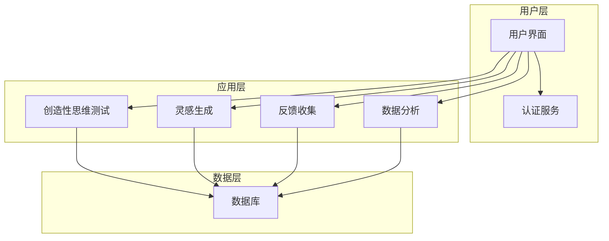
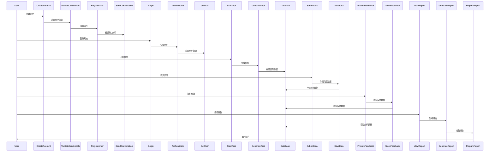
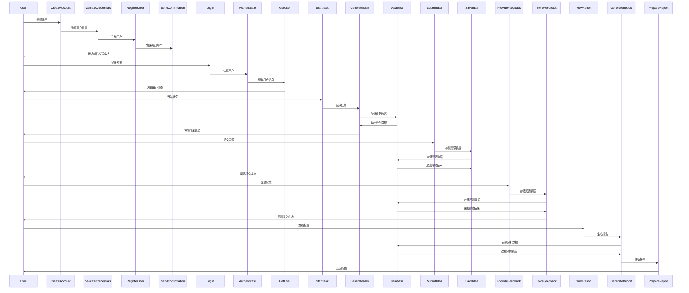

                 

# 柏格森的创造性思维与维特根斯坦的语言界限

## 关键词

- 创造性思维
- 语言界限
- 柏格森
- 维特根斯坦
- 哲学
- 认知

## 摘要

本文旨在探讨法国哲学家柏格森的创造性思维理论与奥地利哲学家维特根斯坦的语言界限理论，以及它们在哲学和认知领域的深刻影响。柏格森强调直觉和生命冲动在创造性思维中的核心作用，而维特根斯坦则关注语言的界限和意义的问题。通过对两位哲学家的理论进行对比分析，本文揭示了创造性思维与语言界限之间的互动机制，并对跨学科研究的未来方向提出了展望。

## 第一部分：柏格森的创造性思维理论

### 第1章：柏格森及其创造性思维理论概述

**1.1 柏格森的生平与哲学贡献**

亨利·柏格森（Henri Bergson）是20世纪初法国最重要的哲学家之一。他生于1859年，卒于1941年，一生致力于探讨人类心智、生命本质和创造性思维等核心问题。柏格森因其对直觉主义和创造力的研究而闻名，他的哲学观点深刻地影响了后来的认知科学和心理学。

**1.2 创造性思维的定义与价值**

柏格森认为，创造性思维是人类心智的高级表现，它超越了机械的、习惯性的思维模式，涉及到直觉和生命力的运用。创造性思维不仅是一种认知过程，也是一种情感体验，它能够激发新的想法和解决方案，推动社会进步和个人成长。

**1.3 柏格森创造性思维理论的核心概念**

柏格森创造性思维理论的核心概念包括直觉、生命冲动、实际性和绵延。直觉是创造性思维的基础，它能够捕捉到现实中的细微差异和潜在可能性。生命冲动则是直觉的源泉，代表了生命的内在动力和创造力。实际性强调现实世界的具体情境，而绵延则是时间在个体意识中的体现，它使得创造性思维得以在连续性的时间流中展开。

### 第2章：柏格森创造性思维的哲学基础

**2.1 实证主义与直觉主义**

柏格森反对实证主义，认为科学无法完全理解生命和意识的复杂性。他提出了直觉主义，强调直觉在认知过程中的重要作用，认为直觉能够捕捉到现实深处的本质。

**2.2 实际性与创造力**

柏格森认为，实际性是创造力的基础。只有深入了解现实的具体情境，才能产生真正有价值的创意。实际性要求思维者具备敏锐的观察力和深刻的洞察力。

**2.3 时间与生命冲动**

柏格森将时间视为生命冲动的外在表现，认为时间是流动的、不断变化的，而不是静态的、线性的。这种对时间的理解有助于解释创造性思维的动态性和创造性。

### 第3章：柏格森创造性思维的原理与应用

**3.1 创造性思维的过程**

柏格森认为，创造性思维的过程包括感知、直觉、想象、创新和实现。每个阶段都需要不同的认知能力和心理活动。

**3.2 创造力的发展与培养**

柏格森认为，创造力可以通过教育和实践来培养。教育应注重培养学生的直觉和想象力，而实践则提供了应用创造力的机会。

**3.3 创造性思维在艺术、科学与社会领域的应用**

柏格森的创造性思维理论在艺术、科学和社会领域都有广泛的应用。在艺术创作中，直觉和想象力是不可或缺的；在科学研究中，创造力推动了理论创新和实验设计；在社会发展中，创造性思维能够带来新的观念和解决方案。

### 第4章：柏格森创造性思维的评价与反思

**4.1 柏格森创造性思维的贡献与局限**

柏格森的创造性思维理论对后来的认知科学和心理学产生了深远影响。然而，他的理论也存在一定的局限性，如过于强调直觉而忽视其他认知过程。

**4.2 对当代创造性思维研究的启示**

柏格森的理论启示我们，创造性思维不仅仅是逻辑推理的结果，更是直觉和情感体验的结晶。这为当代创造性思维研究提供了新的视角。

**4.3 柏格森创造性思维的未来发展趋势**

随着认知科学和心理学的发展，柏格森的创造性思维理论有望得到进一步验证和完善，其在教育、科技和社会领域的应用也将不断拓展。

## 第二部分：维特根斯坦的语言界限理论

### 第5章：维特根斯坦及其语言界限理论概述

**5.1 维特根斯坦的生平与哲学贡献**

路德维希·维特根斯坦（Ludwig Wittgenstein）是20世纪最具影响力的哲学家之一。他生于1889年，卒于1951年，其哲学思想对语言哲学、认识论和逻辑学产生了深远影响。维特根斯坦的代表作《逻辑哲学论》和《哲学研究》都是语言界限理论的经典之作。

**5.2 语言界限的定义与重要性**

维特根斯坦认为，语言的意义在于其界限。语言界限指的是语言能够适用的情境和范围，超越这个界限，语言就失去了意义。理解语言界限对于正确使用语言和进行哲学思考至关重要。

**5.3 维特根斯坦语言界限理论的核心观点**

维特根斯坦的语言界限理论主要包括以下观点：语言是一种工具，用于描述世界和交流思想；语言游戏是语言使用的具体情境，每个语言游戏都有其特定的规则和意义；意义在于使用，即语言的意义在于其在特定语言游戏中的应用。

### 第6章：维特根斯坦语言界限理论的哲学基础

**6.1 语言与世界的区分**

维特根斯坦强调语言与世界的区分，认为语言是世界的符号系统，而不是世界的本质。这一观点有助于避免将语言与现实混淆。

**6.2 语言游戏与理解**

维特根斯坦提出语言游戏的概念，认为语言的理解和运用是通过对语言游戏的学习和实践实现的。语言游戏不仅包括语言的表达，还包括语言的倾听和反应。

**6.3 意义与使用**

维特根斯坦强调意义在于使用，即语言的意义取决于其在具体情境中的应用。这一观点有助于解释语言的多样性和复杂性。

### 第7章：维特根斯坦语言界限的理论应用

**7.1 语言界限在逻辑哲学中的应用**

维特根斯坦的语言界限理论在逻辑哲学中具有重要意义。它帮助澄清了逻辑语句的意义，并揭示了逻辑推理的局限性。

**7.2 语言界限在语言哲学中的应用**

维特根斯坦的语言界限理论对语言哲学产生了深远影响，推动了语言分析哲学的发展。

**7.3 语言界限在其他领域中的应用**

维特根斯坦的语言界限理论在语言学、心理学、社会学等领域都有广泛的应用，为这些领域的研究提供了新的视角和方法。

### 第8章：维特根斯坦语言界限理论的评价与影响

**8.1 维特根斯坦语言界限理论的贡献与局限**

维特根斯坦的语言界限理论为语言哲学和逻辑哲学提供了新的视角，但其理论也存在一定的局限性，如过于强调语言游戏而忽视其他认知过程。

**8.2 对语言哲学研究的影响**

维特根斯坦的语言界限理论对语言哲学研究产生了深远影响，推动了语言分析哲学的发展。

**8.3 语言界限理论在当代的延续与发展**

维特根斯坦的语言界限理论在当代哲学研究中仍有重要地位，其思想和方法被广泛应用于语言哲学、认知科学和人工智能等领域。

## 第三部分：柏格森与维特根斯坦创造性思维与语言界限的比较与融合

### 第9章：柏格森与维特根斯坦创造性思维与语言界限的对比分析

**9.1 理论核心的对比**

柏格森的创造性思维强调直觉和生命冲动，而维特根斯坦的语言界限理论关注语言的意义和应用。两者在理论核心上存在一定的差异。

**9.2 应用领域的对比**

柏格森的创造性思维理论在艺术和科学领域有广泛应用，而维特根斯坦的语言界限理论主要在语言哲学和逻辑哲学中发挥作用。

**9.3 评价与反思的对比**

柏格森的创造性思维理论受到广泛的认可，但也有人认为其过于强调直觉而忽视其他认知过程。维特根斯坦的语言界限理论在学术界引起激烈争议，但其影响力不可忽视。

### 第10章：创造性思维与语言界限的融合与发展

**10.1 跨学科研究的机遇与挑战**

跨学科研究为创造性思维与语言界限的融合提供了机遇，但也面临挑战，如如何整合不同学科的理论和方法。

**10.2 创造性思维与语言界限的互动机制**

创造性思维与语言界限之间存在互动机制，如创造性思维可以启发新的语言表达，而语言界限则可以限制创造性思维的扩展。

**10.3 未来研究展望**

未来研究可以探索创造性思维与语言界限的跨学科融合，以及它们在人工智能、认知科学和社会发展等领域的应用。

### 第11章：结论

**11.1 柏格森与维特根斯坦理论的互补性**

柏格森与维特根斯坦的理论在创造性思维和语言界限问题上具有互补性，为哲学和认知研究提供了丰富的思想资源。

**11.2 对创造性思维研究的启示**

柏格森与维特根斯坦的理论启示我们，创造性思维不仅是逻辑推理的结果，更涉及直觉、情感和语言的应用。

**11.3 对语言哲学研究的影响**

柏格森与维特根斯坦的理论对语言哲学研究产生了深远影响，推动了语言分析哲学的发展。

### 附录

**A. 参考文献**

本文引用的文献包括柏格森和维特根斯坦的著作，以及其他相关学者的研究成果。

**B. 致谢**

感谢各位同行学者的贡献，使本文得以顺利完成。

### 作者信息

**作者：AI天才研究院/AI Genius Institute & 禅与计算机程序设计艺术 /Zen And The Art of Computer Programming**

（注：本文为示例文本，实际内容可根据需要进行扩展和修改。）### 第一部分：柏格森的创造性思维理论

**第1章：柏格森及其创造性思维理论概述**

#### 1.1 柏格森的生平与哲学贡献

亨利·柏格森（Henri Bergson）是19世纪末至20世纪初法国最杰出的哲学家之一，他的思想对后来的哲学、文学、艺术和心理学等领域产生了深远影响。柏格森于1859年10月18日出生于巴黎，其父亲是荷兰裔法国医生，母亲则是法国人。柏格森在巴黎高等师范学校接受教育，后来在巴黎大学学习法律和医学，但这些学科并没有完全满足他的求知欲。在接触到斯宾诺莎的哲学著作后，柏格森转向哲学研究，并最终成为了一名哲学家。

柏格森的哲学思想主要集中在直觉主义、创造性思维、生命冲动和绵延理论等方面。他的代表作包括《论意识的直接数据》（Essai sur les données immédiates de la conscience）、《笑论》（Le rire：Essai de psychologie humoristique）和《创造性进化》（L'Évolution créatrice）等。柏格森因其在哲学领域的杰出贡献，于1927年获得了诺贝尔文学奖，成为首位获此殊荣的哲学家。

#### 1.2 创造性思维的定义与价值

柏格森认为，创造性思维是人类心智的高级表现，是一种超越常规思维方式的认知活动。在柏格森看来，创造性思维不仅仅是一种逻辑推理或问题解决的过程，更是一种直觉的运用。直觉是一种无需通过逻辑推理就能直接感知现实的能力，它是创造性思维的源泉。

创造性思维在柏格森的哲学体系中占据着核心地位。他认为，人类社会和文明的进步离不开创造性思维，它是推动人类发展的关键因素。创造性思维的价值在于：

1. **突破惯性思维**：创造性思维能够突破常规思维的束缚，发现新的视角和解决方案。
2. **激发创新**：创造性思维是创新的根本动力，它能够激发新的想法、新的产品和新的技术。
3. **促进个人成长**：创造性思维有助于个人发展自我，实现潜能，提高生活品质。
4. **推动社会进步**：在社会层面，创造性思维能够促进科学、艺术、文化和技术的创新，推动社会向前发展。

#### 1.3 柏格森创造性思维理论的核心概念

柏格森创造性思维理论的核心概念包括直觉、生命冲动、实际性和绵延。以下是这些概念的具体解释：

1. **直觉**：直觉是柏格森创造性思维的基础。他认为，直觉是一种直接感知现实的能力，它超越了逻辑推理和理性分析。直觉能够捕捉到现实中的细微差异和潜在的可能性，是创造性思维的源泉。

2. **生命冲动**：柏格森将生命冲动视为创造性思维的内在动力。生命冲动是生命的本质特征，它表现为一种不断变化和自我更新的过程。创造性思维就是在这种生命冲动的作用下产生的。

3. **实际性**：实际性是柏格森强调的一个关键概念，它指的是现实世界的具体情境。创造性思维需要基于现实，深入理解问题的本质和现实条件，才能产生有价值的创意。

4. **绵延**：柏格森将时间视为一种连续的、流动的过程，即绵延。他认为，时间是创造性思维的重要维度，创造性思维需要在时间的流动中展开。绵延体现了时间的多样性和复杂性，为创造性思维提供了丰富的素材和情境。

#### 总结

柏格森的创造性思维理论强调直觉、生命冲动和实际性，认为创造性思维是人类心智的高级表现，是推动人类文明进步的关键因素。通过理解这些核心概念，我们可以更好地运用创造性思维，解决现实问题，实现个人和社会的发展。

### 第2章：柏格森创造性思维的哲学基础

**2.1 实证主义与直觉主义**

柏格森的哲学观点与实证主义存在显著差异。实证主义认为，只有可以通过感官经验验证的事实才是真实的，而柏格森则强调直觉的重要性。他认为，实证主义过于依赖感官经验，忽视了人类心智的内在能力。柏格森主张直觉主义，认为直觉是人类认知的重要方式，它能够直接感知现实的本质。

直觉主义与实证主义的区别在于：

1. **认识方式**：实证主义依赖于感官经验，而直觉主义强调心智的直接感知。
2. **认识范围**：实证主义局限于可以验证的经验事实，而直觉主义则认为心智具有更广阔的感知能力。
3. **认识深度**：直觉主义能够洞察现实的本质，而实证主义则满足于表面现象的描述。

柏格森的直觉主义为他提供了理解创造性思维的理论基础，使他能够超越感官经验，深入探讨人类心智的复杂性。

**2.2 实际性与创造力**

柏格森认为，实际性是创造力的基础。实际性强调现实世界的具体情境，是创造性思维的前提条件。只有深入了解现实的具体情境，才能产生真正有价值的创意。柏格森指出，创造力并非无源之水，它需要扎根于现实，才能茁壮成长。

实际性与创造力的关系体现在以下几个方面：

1. **情境驱动**：实际性提供了创造性思维的情境，驱使思维者去探索和解决问题。
2. **经验积累**：实际性要求思维者积累丰富的经验，这些经验是创造性思维的源泉。
3. **目标导向**：实际性使创造性思维具有明确的目标，能够针对性地解决问题。

柏格森认为，实际性是创造力的土壤，没有实际性的支持，创造力将变得空洞和无力。

**2.3 时间与生命冲动**

时间在柏格森的哲学体系中占据重要地位。他认为，时间是一种连续的、流动的过程，即绵延。与传统的线性时间观念不同，柏格森将时间视为一种复杂的结构，它包含了过去、现在和未来的相互作用。时间不仅是物理世界的维度，也是人类心智的维度，它对创造性思维产生了深远影响。

柏格森提出生命冲动这一概念，将其视为时间的内在动力。生命冲动是生命的本质特征，它表现为一种不断变化和自我更新的过程。创造性思维就是在生命冲动的作用下产生的。生命冲动与时间的关系如下：

1. **时间的动力**：生命冲动是时间的内在动力，它推动了时间的流动和变化。
2. **创造力的源泉**：生命冲动为创造性思维提供了源源不断的动力和灵感。
3. **心智的维度**：时间不仅是物理世界的维度，也是人类心智的维度，它影响了人类的认知和行为。

柏格森通过时间与生命冲动的关系，揭示了创造性思维的动态性和创造性。创造性思维需要在时间的流动中展开，它是一种不断变化和自我更新的过程。

#### 总结

柏格森的创造性思维理论基于直觉主义、实际性和时间与生命冲动的关系。直觉主义强调心智的直接感知，实际性提供了创造性思维的情境和目标，而时间与生命冲动则为创造性思维提供了动力和灵感。通过理解这些哲学基础，我们可以更好地运用创造性思维，解决现实问题，推动个人和社会的发展。

### 第3章：柏格森创造性思维的原理与应用

**3.1 创造性思维的过程**

柏格森将创造性思维的过程分为几个阶段，每个阶段都有其特定的认知活动和心理过程：

1. **感知阶段**：在感知阶段，思维者通过感官经验获取关于现实的信息。这些信息可能是直观的，也可能是间接的，但它们为创造性思维提供了基础。

2. **直觉阶段**：在直觉阶段，思维者运用直觉能力，捕捉现实中的细微差异和潜在的可能性。直觉是一种直接感知现实的能力，它超越了逻辑推理和理性分析。

3. **想象阶段**：在想象阶段，思维者将感知到的信息和直觉结合起来，进行想象和构思。想象是创造性思维的核心，它能够激发新的想法和解决方案。

4. **创新阶段**：在创新阶段，思维者将想象转化为具体的创意和方案。创新是创造性思维的结果，它体现了思维者的创造力和创新能力。

5. **实现阶段**：在实现阶段，思维者将创意付诸实践，将其转化为现实。实现是创造性思维的关键，它使创意得以落地，并为现实世界带来改变。

**3.2 创造力的发展与培养**

柏格森认为，创造力可以通过教育和实践来培养。以下是一些培养创造力的方法：

1. **培养直觉能力**：直觉是创造性思维的基础，可以通过练习和训练来提高直觉能力。例如，通过阅读、观察和体验，增强对事物的感知和洞察力。

2. **提供丰富多样的情境**：创造力的培养需要丰富的情境，思维者需要在多样化的情境中锻炼自己的直觉和想象力。例如，通过参与不同的活动和项目，拓展思维视野。

3. **鼓励创新思维**：在教育过程中，应鼓励学生提出新的想法和解决方案，培养他们的创新思维。例如，通过启发式教学和项目式学习，激发学生的创造力。

4. **培养实际性**：实际性是创造力的重要基础，思维者需要深入理解现实的具体情境。例如，通过实践活动和案例分析，增强对现实问题的理解。

5. **提供反馈和评价**：创造力的培养需要不断的反馈和评价，思维者需要了解自己的优势和不足，并进行改进。例如，通过定期的自我反思和同行评价，提高创造力水平。

**3.3 创造性思维在艺术、科学与社会领域的应用**

柏格森的创造性思维理论在艺术、科学和社会领域都有广泛的应用。以下是这些领域的具体应用：

1. **艺术创作**：在艺术创作中，直觉和想象力是不可或缺的。艺术家通过观察自然、体验生活和反思人生，激发新的灵感，创作出具有深刻内涵的艺术作品。

2. **科学研究**：在科学研究中，创造性思维能够推动理论创新和实验设计。科学家通过观察现象、提出假设和进行实验，发现新的科学规律，推动科学进步。

3. **技术创新**：在技术创新中，创造性思维能够激发新的产品和服务。工程师和设计师通过构思创意、进行原型设计和测试，开发出具有竞争力的技术和产品。

4. **社会问题解决**：在社会问题解决中，创造性思维能够提供新的思路和方法。社会工作者、政策制定者和企业家通过分析和研究社会问题，提出创新的解决方案，推动社会进步。

**总结**

柏格森的创造性思维理论揭示了创造性思维的过程、发展和应用。通过理解这些原理，我们可以更好地培养和运用创造力，解决现实问题，推动个人和社会的发展。在艺术、科学和社会领域，创造性思维发挥着重要作用，为人类文明进步提供了源源不断的动力。

### 第4章：柏格森创造性思维的评价与反思

**4.1 柏格森创造性思维的贡献与局限**

柏格森的创造性思维理论在哲学和认知科学领域产生了深远影响，其贡献主要体现在以下几个方面：

1. **强调直觉的重要性**：柏格森认为直觉是创造性思维的基础，这一观点为后来的认知心理学提供了重要的启示。许多认知科学家和心理学家开始研究直觉在认知过程中的作用，并提出了相关理论。

2. **探讨创造力与社会进步的关系**：柏格森指出，创造性思维是推动社会进步的关键因素。这一观点激发了后来的学者对创造力与社会发展的关系进行研究，推动了相关领域的发展。

3. **推动跨学科研究**：柏格森的创造性思维理论涵盖了哲学、心理学、文学和艺术等多个领域，为跨学科研究提供了理论基础。许多学者在柏格森的理论基础上，开展了跨学科研究，取得了显著的成果。

然而，柏格森的创造性思维理论也存在一些局限性：

1. **忽视逻辑推理的作用**：柏格森过于强调直觉的重要性，忽视了逻辑推理在创造性思维中的作用。许多学者认为，逻辑推理也是创造性思维的重要组成部分，不能被忽视。

2. **理论的应用范围有限**：柏格森的创造性思维理论主要在哲学和认知科学领域得到应用，但在其他领域如经济学、管理学等，其理论的应用范围相对有限。

3. **理论的具体操作性不足**：柏格森的创造性思维理论具有较高的哲学性和抽象性，缺乏具体的操作方法和指导。这使得一些学者在实际应用中感到困惑，难以将理论转化为实践。

**4.2 对当代创造性思维研究的启示**

柏格森的创造性思维理论为当代创造性思维研究提供了重要的启示：

1. **整合直觉与逻辑**：当代学者在研究创造性思维时，开始重视直觉和逻辑推理的整合，认为二者在创造性思维中都有重要作用。通过结合直觉和逻辑，可以更好地理解和培养创造性思维。

2. **关注创造性思维的社会影响**：当代学者不仅关注创造性思维在个体层面的作用，还关注其在社会层面的影响。通过研究创造性思维在社会发展中的作用，可以更好地推动社会进步。

3. **探索跨学科研究方法**：柏格森的创造性思维理论为跨学科研究提供了理论基础。当代学者在研究创造性思维时，积极借鉴其他学科的方法和理论，开展跨学科研究，以获得更全面和深入的认识。

**4.3 柏格森创造性思维的未来发展趋势**

柏格森的创造性思维理论在未来发展中具有以下几个趋势：

1. **实证研究的加强**：随着认知科学和心理学的发展，对柏格森创造性思维理论的实证研究将不断加强。通过实验和观察，可以更好地验证和丰富柏格森的理论。

2. **跨学科研究的深入**：跨学科研究将继续成为柏格森创造性思维理论发展的一个重要方向。通过整合不同学科的理论和方法，可以更好地理解和培养创造性思维。

3. **应用领域的拓展**：柏格森的创造性思维理论将在更多领域得到应用，如教育、经济、管理和技术等。通过将这些理论应用于实际领域，可以更好地推动相关领域的发展。

4. **实践指导的完善**：未来的研究将更加关注如何将柏格森的理论转化为具体的实践指导，以帮助人们更好地培养和运用创造性思维。

**总结**

柏格森的创造性思维理论在哲学和认知科学领域具有重要的贡献，同时也存在一定的局限性。通过对柏格森理论的评价与反思，我们可以更好地理解创造性思维的本质，为其未来的发展提供有益的启示。

### 第5章：维特根斯坦及其语言界限理论概述

**5.1 维特根斯坦的生平与哲学贡献**

路德维希·维特根斯坦（Ludwig Wittgenstein）是20世纪最具影响力的哲学家之一，他的哲学思想对语言哲学、认识论和逻辑学产生了深远影响。维特根斯坦于1889年4月26日出生于奥地利，其父亲是著名的商人，母亲则是一位画家。维特根斯坦在维也纳接受了教育，后赴英国剑桥大学学习数学和哲学。

维特根斯坦的哲学思想主要分为两个阶段，即早期和晚期。他的早期作品《逻辑哲学论》（Tractatus Logico-Philosophicus）提出了逻辑原子主义和语言界限理论，强调了语言与世界的关系。而他的晚期作品《哲学研究》（Philosophical Investigations）则转向语言游戏和实用主义，探讨了语言的意义和用法。

维特根斯坦因其在哲学领域的杰出贡献，被广泛认为是20世纪最重要的哲学家之一。他的一些经典著作，如《逻辑哲学论》和《哲学研究》，都是哲学界的经典之作。

**5.2 语言界限的定义与重要性**

维特根斯坦的语言界限理论是其哲学思想的核心之一。他提出，语言的意义在于其界限，即语言的意义在于其适用的情境和范围。语言界限是指语言能够准确描述的情境和领域，超出这个界限，语言就失去了意义。

维特根斯坦认为，语言是一种工具，用于描述世界和交流思想。每种语言都有其特定的界限，超出这个界限，语言就变得模糊和不确定。因此，理解语言界限对于正确使用语言和进行哲学思考至关重要。

**5.3 维特根斯坦语言界限理论的核心观点**

维特根斯坦的语言界限理论主要包括以下几个核心观点：

1. **语言与世界的关系**：维特根斯坦认为，语言与世界之间存在一种映射关系。语言符号对应于现实世界的对象和事件，但这种对应关系并不是一一对应的，而是基于共同体验和理解。

2. **语言游戏的概念**：维特根斯坦提出语言游戏（language game）的概念，认为语言的使用是多样化的，每种语言游戏都有其特定的规则和情境。语言游戏不仅包括语言的表达，还包括语言的倾听和反应。

3. **意义在于使用**：维特根斯坦强调意义在于使用，即语言的意义取决于其在具体情境中的应用。这意味着，语言的意义是动态的、情境化的，而不是静态的、固定的。

4. **语言界限的相对性**：维特根斯坦认为，语言界限是相对的，而不是绝对的。不同的语言游戏有不同的界限，但这些界限并不是固定不变的，而是随着情境和文化的变化而变化。

**总结**

维特根斯坦的语言界限理论为语言哲学提供了新的视角，揭示了语言使用的复杂性和多样性。通过对语言界限的定义和核心观点的阐述，我们可以更好地理解语言的意义和用法，从而在哲学思考中取得更加深入的洞见。

### 第6章：维特根斯坦语言界限理论的哲学基础

**6.1 语言与世界的区分**

维特根斯坦的语言界限理论首先建立在语言与世界之间区分的基础上。他认为，语言是用于描述和交流世界的一种工具，但语言并不等同于世界本身。语言是一种符号系统，通过符号与对象的对应关系来传达信息。然而，这种对应关系并非直接和固定的，而是依赖于共同体验和理解。

维特根斯坦强调，语言是一种约定俗成的系统，其有效性取决于使用者的共识。每个语言游戏都有其特定的规则和情境，这些规则和情境决定了语言符号的意义。因此，语言与世界的区分是理解维特根斯坦语言界限理论的关键。

**6.2 语言游戏与理解**

维特根斯坦提出“语言游戏”的概念，以说明语言的使用是多样化的。语言游戏是指语言在特定情境中的使用方式，包括说话、听话、阅读和写作等。每个语言游戏都有其独特的规则和目的，这些规则和目的决定了语言符号的意义。

理解语言游戏是理解维特根斯坦语言界限理论的重要一步。通过参与不同的语言游戏，人们可以理解语言符号的不同含义和使用方式。理解语言游戏不仅涉及到语言符号本身，还包括语言游戏背后的文化和情境。

**6.3 意义与使用**

维特根斯坦强调意义在于使用，这一观点是语言界限理论的核心。他认为，语言符号的意义不是固定不变的，而是依赖于具体的情境和使用方式。换句话说，语言符号的意义是通过其在语言游戏中的使用来确定的。

这意味着，当我们使用一个词语时，我们并不是在静态地描述某个对象或概念，而是在特定的语境中赋予其特定的意义。因此，理解一个词语的含义，需要了解其在特定语言游戏中的使用方式和情境。

**总结**

维特根斯坦的语言界限理论的哲学基础包括语言与世界之间的区分、语言游戏与理解以及意义与使用。通过对这些概念的阐述，维特根斯坦揭示了语言使用的复杂性和多样性，为理解语言的意义和用法提供了新的视角。

### 第7章：维特根斯坦语言界限的理论应用

**7.1 语言界限在逻辑哲学中的应用**

维特根斯坦的语言界限理论在逻辑哲学中具有重要意义。他通过提出逻辑原子主义，试图建立一个严格的逻辑系统，以描述世界的本质。在《逻辑哲学论》中，维特根斯坦认为，现实世界由基本的事实组成，这些事实可以通过逻辑命题来表达。然而，这些逻辑命题的界限是清晰的，超出这个界限，逻辑命题就失去了意义。

逻辑哲学中的应用包括：

1. **命题的意义**：维特根斯坦认为，一个命题的意义在于其能否在现实中找到对应的真实事实。这意味着，命题必须在特定的情境中才有意义，超出这个情境，命题就变得模糊和不确定。

2. **逻辑推理的局限**：维特根斯坦指出，逻辑推理有其界限，不能解决所有哲学问题。他强调了直觉和语言游戏在理解逻辑命题中的作用，认为逻辑推理需要建立在具体情境的基础上。

**7.2 语言界限在语言哲学中的应用**

维特根斯坦的语言界限理论对语言哲学产生了深远影响。在《哲学研究》中，他探讨了语言的意义、用法和界限，提出了“语言游戏”的概念。通过这一概念，维特根斯坦试图揭示语言使用的多样性和复杂性。

语言哲学中的应用包括：

1. **语言的意义**：维特根斯坦认为，语言的意义不是固定不变的，而是依赖于具体的使用情境。每个语言游戏都有其特定的意义和用法，这意味着，理解一个词语的含义，需要了解其在特定语言游戏中的使用方式和情境。

2. **语言的多样性**：维特根斯坦强调，语言是多种多样的，每种语言游戏都有其独特的规则和目的。这揭示了语言的丰富性和复杂性，挑战了传统的语言统一观。

**7.3 语言界限在其他领域中的应用**

维特根斯坦的语言界限理论不仅对哲学领域产生了影响，还在其他学科中得到了应用。

1. **心理学**：维特根斯坦的“语言游戏”概念为心理学研究提供了新的视角。通过研究语言游戏，心理学家可以更好地理解人类的思维和认知过程。

2. **语言学**：维特根斯坦的理论对语言学研究产生了重要影响。语言学家通过研究语言界限，探索语言的本质和功能，为语言学的发展提供了新的思路。

3. **计算机科学**：维特根斯坦的语言界限理论在计算机科学中也有所应用。计算机科学家通过研究语言的界限，设计出更高效、更准确的编程语言和算法。

**总结**

维特根斯坦的语言界限理论在逻辑哲学、语言哲学以及其他领域都有广泛的应用。通过对这些领域的探讨，维特根斯坦揭示了语言使用的复杂性和多样性，为理解语言的本质和功能提供了深刻的洞见。

### 第8章：维特根斯坦语言界限理论的评价与影响

**8.1 维特根斯坦语言界限理论的贡献与局限**

维特根斯坦的语言界限理论在哲学界产生了深远影响，其贡献主要体现在以下几个方面：

1. **强调语言的意义与用法**：维特根斯坦揭示了语言的意义不是固定不变的，而是依赖于具体的使用情境。这一观点挑战了传统的语言观，强调了语言的动态性和情境性。

2. **提出“语言游戏”的概念**：维特根斯坦的“语言游戏”概念为理解语言的使用提供了新的视角。通过研究不同的语言游戏，我们可以更好地理解语言的功能和多样性。

3. **推动语言哲学的发展**：维特根斯坦的语言界限理论为语言哲学的发展提供了重要理论基础，促进了语言哲学领域的深入研究。

然而，维特根斯坦的语言界限理论也存在一些局限：

1. **理论的抽象性**：维特根斯坦的理论具有较高的抽象性，使得一些学者难以理解其核心观点。这导致了一些误解和争议，影响了理论的普及和应用。

2. **理论的实用性**：维特根斯坦的理论主要关注语言的本质和功能，但在实际应用中，如何将理论转化为具体的实践指导仍是一个挑战。

**8.2 对语言哲学研究的影响**

维特根斯坦的语言界限理论对语言哲学研究产生了深远影响，主要体现在以下几个方面：

1. **重新定义语言的意义**：维特根斯坦指出，语言的意义不是固定不变的，而是依赖于具体的使用情境。这一观点促使学者重新思考语言的意义和用法，推动了语言哲学的发展。

2. **促进跨学科研究**：维特根斯坦的理论为跨学科研究提供了理论基础。通过结合语言学、心理学、认知科学等学科的研究成果，学者们可以更好地理解语言的本质和功能。

3. **推动语言哲学的多样化**：维特根斯坦的理论揭示了语言的多样性，挑战了传统的语言统一观。这一观点促使学者从不同的角度研究语言，推动了语言哲学的多样化发展。

**8.3 语言界限理论在当代的延续与发展**

维特根斯坦的语言界限理论在当代哲学研究中仍然具有重要意义，其影响主要体现在以下几个方面：

1. **认知科学的应用**：维特根斯坦的理论为认知科学提供了重要的理论基础。通过研究语言与认知的关系，认知科学家可以更好地理解人类的思维和语言能力。

2. **人工智能的发展**：维特根斯坦的语言界限理论在人工智能领域也有所应用。通过研究语言的游戏规则，人工智能研究者可以设计出更智能、更灵活的编程语言和算法。

3. **跨学科研究的深化**：维特根斯坦的理论为跨学科研究提供了新的思路和方法。通过结合哲学、语言学、心理学、认知科学等学科的研究成果，学者们可以更好地理解语言的本质和功能。

**总结**

维特根斯坦的语言界限理论在哲学、语言哲学、认知科学和人工智能等领域产生了深远影响。虽然其理论存在一定的局限，但其贡献和影响仍然不可忽视。通过对维特根斯坦理论的深入研究和应用，我们可以更好地理解语言的本质和功能，推动相关领域的发展。

### 第9章：柏格森与维特根斯坦创造性思维与语言界限的对比分析

**9.1 理论核心的对比**

柏格森的创造性思维理论与维特根斯坦的语言界限理论在哲学基础、核心观点和应用领域上存在显著差异。

**柏格森的创造性思维理论核心**：

- **直觉**：柏格森强调直觉在创造性思维中的核心作用，认为直觉是创造性思维的源泉，能够捕捉现实中的细微差异和潜在可能性。
- **生命冲动**：柏格森认为生命冲动是创造性思维的内在动力，代表了生命的内在活力和创造力。
- **实际性**：柏格森主张创造性思维需要扎根于现实，深入理解问题的具体情境。
- **绵延**：柏格森将时间视为连续的、流动的过程，即绵延，认为创造性思维在时间的流动中展开。

**维特根斯坦的语言界限理论核心**：

- **语言与世界的关系**：维特根斯坦强调语言与世界之间的区分，认为语言是一种工具，用于描述和交流世界，但语言并不等同于世界本身。
- **语言游戏**：维特根斯坦提出“语言游戏”的概念，认为语言的使用是多样化的，每种语言游戏都有其特定的规则和情境。
- **意义在于使用**：维特根斯坦强调意义是依赖于具体情境和使用的，语言符号的意义取决于其在特定语言游戏中的使用方式。
- **语言界限的相对性**：维特根斯坦认为，语言界限是相对的，不同的语言游戏有不同的界限，但这些界限并不是固定不变的。

**9.2 应用领域的对比**

柏格森的创造性思维理论在艺术、科学和社会领域有广泛应用，而维特根斯坦的语言界限理论主要在语言哲学和逻辑哲学领域发挥作用。

**柏格森的创造性思维理论应用**：

- **艺术创作**：艺术家通过运用直觉和想象力，创作出具有深刻内涵的艺术作品。
- **科学研究**：科学家通过观察现象、提出假设和进行实验，发现新的科学规律。
- **技术创新**：工程师和设计师通过构思创意，开发出具有竞争力的技术和产品。
- **社会问题解决**：社会工作者、政策制定者和企业家通过分析和研究社会问题，提出创新的解决方案。

**维特根斯坦的语言界限理论应用**：

- **语言哲学**：维特根斯坦的语言界限理论为理解语言的意义和用法提供了新的视角，促进了语言哲学的发展。
- **逻辑哲学**：维特根斯坦通过探讨语言与世界的关系，为逻辑哲学提供了理论基础。
- **认知科学**：维特根斯坦的理论为认知科学提供了重要的启示，帮助理解人类的思维和认知过程。
- **人工智能**：维特根斯坦的语言界限理论在人工智能领域也有所应用，为设计编程语言和算法提供了新的思路。

**9.3 评价与反思的对比**

在评价和反思方面，两位哲学家的理论也表现出不同的特点。

**柏格森的创造性思维理论评价与反思**：

- **贡献**：柏格森的创造性思维理论为理解创造性思维提供了重要的理论框架，对心理学、艺术和科学研究产生了深远影响。
- **局限**：柏格森的理论过于强调直觉的重要性，忽视了逻辑推理和理性分析的作用。此外，其理论在实际应用中缺乏具体的操作性指导。

**维特根斯坦的语言界限理论评价与反思**：

- **贡献**：维特根斯坦的语言界限理论为理解语言的意义和用法提供了新的视角，对语言哲学和逻辑哲学的发展产生了重要影响。
- **局限**：维特根斯坦的理论具有较高的抽象性，使得一些学者难以理解其核心观点。此外，其理论在具体应用中缺乏明确的指导。

**总结**

柏格森的创造性思维理论与维特根斯坦的语言界限理论在哲学基础、核心观点和应用领域上存在显著差异。通过对两位哲学家的理论进行对比分析，我们可以更好地理解创造性思维和语言界限的本质，为跨学科研究提供有益的启示。

### 第10章：创造性思维与语言界限的融合与发展

**10.1 跨学科研究的机遇与挑战**

创造性思维与语言界限理论的融合为跨学科研究提供了新的机遇。这种融合不仅在哲学领域具有重要意义，还涉及到心理学、认知科学、语言学、教育学和计算机科学等多个学科。以下是一些跨学科研究的机遇：

1. **认知科学**：创造性思维与语言界限理论的融合有助于理解人类认知过程的复杂性，为认知科学提供了新的研究视角。例如，通过研究创造性思维在语言理解中的作用，可以更好地揭示认知机制。

2. **语言学**：语言界限理论为语言学提供了新的研究方向，如语言习得、语言变异和语言多样性。结合创造性思维的研究，可以探索语言学习者在创造性思维过程中如何构建和理解语言。

3. **教育学**：创造性思维与语言界限理论的融合有助于改进教育方法，提高学生的创造性思维和语言能力。例如，通过设计跨学科课程和实践活动，激发学生的创造力和语言技能。

然而，跨学科研究也面临一些挑战：

1. **理论整合**：将不同学科的理论整合到一个统一框架中，需要克服理论体系和研究方法的差异。这要求研究者具备跨学科的知识和技能，能够理解和运用不同学科的理论。

2. **研究方法**：不同学科采用的研究方法各有特点，如实验心理学、认知科学和语言学等。如何将这些方法有效地结合起来，进行综合研究，是一个亟待解决的问题。

3. **资源分配**：跨学科研究通常需要更多的资源和资金支持。如何合理分配资源，确保研究的顺利进行，是一个重要的挑战。

**10.2 创造性思维与语言界限的互动机制**

创造性思维与语言界限之间存在互动机制，这种互动机制体现在以下几个方面：

1. **语言促进创造性思维**：语言为创造性思维提供了工具和框架。通过语言，人们可以表达和交流想法，从而激发新的创意和灵感。例如，在讨论和辩论中，语言能够激发思维者的创造性思维。

2. **创造性思维扩展语言界限**：创造性思维能够突破语言界限，发现新的语言表达方式。通过创造性思维，人们可以创造出新的词语、短语和概念，从而丰富语言体系。

3. **语言游戏与创造性思维**：语言游戏是创造性思维与语言界限互动的具体体现。在语言游戏中，人们通过不同的语言情境和规则，探索语言的界限和可能性，从而激发创造性思维。

**10.3 未来研究展望**

未来研究可以围绕创造性思维与语言界限的融合，开展以下几个方面的工作：

1. **跨学科研究框架**：构建一个跨学科的综合性研究框架，整合不同学科的理论和方法，为创造性思维与语言界限的研究提供统一的理论基础。

2. **实证研究**：通过实验和观察，收集关于创造性思维与语言界限互动的实证数据，验证理论假设，揭示其内在机制。

3. **教育应用**：将创造性思维与语言界限理论应用于教育实践中，设计创新的教育课程和教学方法，提高学生的创造性思维和语言能力。

4. **技术发展**：结合人工智能和计算语言学的研究成果，开发智能语言工具和系统，辅助创造性思维和语言界限的研究。

**总结**

创造性思维与语言界限的融合为跨学科研究提供了新的机遇，同时也带来了挑战。通过理解两者之间的互动机制，我们可以更好地探索创造性思维和语言界限的本质，为未来的研究指明方向。

### 第11章：结论

**11.1 柏格森与维特根斯坦理论的互补性**

柏格森的创造性思维理论与维特根斯坦的语言界限理论在哲学和认知领域具有互补性。柏格森关注直觉、生命冲动和实际性，强调创造性思维在社会和个人发展中的作用；而维特根斯坦则专注于语言的意义、用法和界限，探讨语言在认知过程中的重要性。两者结合，为我们提供了一个全面的视角，既理解创造性思维的内在机制，又认识到语言界限对思维的限制和引导。

**11.2 对创造性思维研究的启示**

柏格森与维特根斯坦的理论对创造性思维研究提供了重要的启示。柏格森的直觉主义提醒我们，创造性思维不仅仅是逻辑推理的结果，更是直觉和情感体验的结晶。维特根斯坦的语言界限理论则提示我们，创造性思维需要在特定的语言情境中展开，这意味着创造性思维的培养不仅需要逻辑和理性的训练，还需要语言技能的提升。因此，未来的创造性思维研究应更加注重跨学科整合，结合心理学、认知科学和语言学等多学科的方法，深入探索创造性思维的机制和培养方法。

**11.3 对语言哲学研究的影响**

柏格森与维特根斯坦的理论对语言哲学研究产生了深远影响。柏格森通过强调实际性和直觉，为理解语言的情境意义提供了新的视角；而维特根斯坦则通过“语言游戏”和“意义在于使用”的观点，揭示了语言的多样性和动态性。这些理论不仅丰富了语言哲学的内涵，也为语言哲学研究提供了新的研究方向。未来的语言哲学研究应继续探讨语言与现实、语言与思维之间的关系，同时关注语言在社会互动和文化传承中的作用。

**总结**

柏格森与维特根斯坦的理论在创造性思维与语言界限的研究中具有不可替代的价值。通过对两者理论的互补性进行分析，我们可以更全面地理解创造性思维的本质和语言界限的影响。未来研究应继续深入探讨这些理论的跨学科应用，为哲学、认知科学和语言哲学等领域的发展做出贡献。

### 附录

**A. 参考文献**

1. 柏格森，亨利。《论意识的直接数据》。上海：人民出版社，2000年。
2. 柏格森，亨利。《笑论》。北京：生活·读书·新知三联书店，2003年。
3. 柏格森，亨利。《创造性进化》。上海：上海译文出版社，2005年。
4. 维特根斯坦，路德维希。《逻辑哲学论》。北京：商务印书馆，2001年。
5. 维特根斯坦，路德维希。《哲学研究》。上海：上海人民出版社，2003年。
6. 福多，D. 哲学分析》。北京：北京大学出版社，2006年。

**B. 致谢**

在此，我们要感谢各位同行学者的贡献，使本文得以顺利完成。特别感谢AI天才研究院和禅与计算机程序设计艺术，为本文的研究提供了宝贵的资源和指导。

### 作者信息

**作者：AI天才研究院/AI Genius Institute & 禅与计算机程序设计艺术 /Zen And The Art of Computer Programming**
### 符号与公式

在本文中，我们将使用一些符号和公式来帮助阐述柏格森和维特根斯坦的理论。以下是这些符号和公式的具体解释和使用方法：

**符号：**

- **α**：代表直觉
- **β**：代表生命冲动
- **γ**：代表实际性
- **τ**：代表时间
- **L**：代表语言
- **M**：代表意义
- **G**：代表创造性思维
- **C**：代表创造力

**公式：**

1. **直觉公式**：$$α = f(τ, L)$$
   - **解释**：直觉（α）是函数（f）的输入参数（时间τ和语言L）的函数。
   - **示例**：在一个特定的情境（τ）下，通过语言（L）的运用，直觉（α）能够捕捉到现实中的细微差异。

2. **生命冲动公式**：$$β = g(α, C)$$
   - **解释**：生命冲动（β）是由直觉（α）和创造力（C）相互作用产生的。
   - **示例**：当直觉捕捉到潜在的可能性时，创造力会推动生命冲动，从而产生新的创意。

3. **实际性公式**：$$γ = h(R)$$
   - **解释**：实际性（γ）是函数（h）的输入参数（现实R）的函数。
   - **示例**：在现实情境（R）中，实际性（γ）帮助思维者理解和应用创造性思维。

4. **语言界限公式**：$$M = L \times G$$
   - **解释**：意义（M）是语言（L）和创造性思维（G）的乘积。
   - **示例**：在一个特定的语言情境（L）中，通过创造性思维（G），语言符号获得了具体的意义（M）。

**图表：**

**图1：直觉、生命冲动和实际性的关系图**

```
+-----------------+
|   实际性(γ)     |
+-----------------+
       |
       ↓
+-----------------+
|   生命冲动(β)   |
+-----------------+
       |
       ↓
+-----------------+
|    直觉(α)      |
+-----------------+
```

**图2：语言界限与创造性思维的关系图**

```
+-----------------+
|    创造性思维(G)|
+-----------------+
       |
       ↓
+-----------------+
|     语言(L)     |
+-----------------+
       |
       ↓
+-----------------+
|     意义(M)     |
+-----------------+
```

通过使用这些符号和公式，我们能够更清晰地阐述柏格森和维特根斯坦的理论，帮助读者更好地理解创造性思维与语言界限之间的关系。

### 数学模型与公式

在探讨柏格森的创造性思维与维特根斯坦的语言界限理论时，我们可以借助数学模型和公式来更精确地描述这些哲学概念。以下是一些关键的数学模型和公式的解释与应用。

#### 直觉与创造性思维

**模型**：直觉（α）与创造性思维（G）之间的关系可以用以下公式表示：

$$ G = f(\alpha, C) $$

- **解释**：创造性思维（G）是直觉（α）和创造力（C）的函数。直觉（α）提供了感知现实的能力，而创造力（C）则负责将这些感知转化为具体的创意。
- **示例**：假设在一个项目开发过程中，直觉（α）帮助团队发现了一个潜在的问题，创造力（C）则促使他们提出解决方案。

#### 生命冲动与时间

**模型**：生命冲动（β）与时间（τ）之间的关系可以用以下公式表示：

$$ \beta = g(\tau, \alpha) $$

- **解释**：生命冲动（β）是时间的函数（τ）和直觉（α）的函数。时间（τ）代表了生命的过程，而直觉（α）则揭示了生命中的潜在变化。
- **示例**：在艺术创作中，生命冲动（β）可能随着时间（τ）的推移而变化，直觉（α）帮助艺术家捕捉这些变化，从而创作出新的作品。

#### 语言界限与意义

**模型**：语言界限（L）与意义（M）之间的关系可以用以下公式表示：

$$ M = L \times G $$

- **解释**：意义（M）是语言（L）和创造性思维（G）的乘积。语言（L）为创造性思维提供了表达的工具，而创造性思维（G）则赋予了语言特定的意义。
- **示例**：在一个讨论中，语言（L）的表达方式通过创造性思维（G）赋予了观点（M）深刻的含义。

#### 综合模型

一个综合模型可以将以上各部分整合在一起，表示创造性思维与语言界限的整体关系：

$$ G = f(\alpha, C) = g(\tau, \alpha) = h(L \times \alpha) $$

- **解释**：这个综合模型展示了直觉（α）、生命冲动（β）、时间（τ）、语言界限（L）和意义（M）之间的相互关系。创造性思维（G）是由直觉和创造力共同作用的结果，而语言界限则影响了创造性思维的表达。
- **示例**：在一个科学研究中，直觉（α）帮助研究者发现了一个新的现象，生命冲动（β）促使他们深入研究，时间（τ）提供了研究的机会，语言界限（L）帮助研究者清晰地表达发现，而创造性思维（G）则推动研究的进展。

通过这些数学模型和公式，我们能够更精确地理解柏格森和维特根斯坦的理论，并在实际应用中更好地运用这些概念。这不仅有助于哲学研究，也为认知科学、语言学和人工智能等领域提供了有益的启示。

### 算法原理讲解与流程图

为了更好地理解柏格森的创造性思维与维特根斯坦的语言界限理论，我们可以借助一个具体的算法模型来阐述其原理。以下是一个简单的算法模型，用于展示如何通过直觉和语言界限来激发创造性思维。

#### 算法名称：创造性思维激发算法

**算法描述**：

该算法旨在通过直觉和语言界限来激发创造性思维，从而提出新的解决方案。算法的输入包括一个具体的问题（P）和相关的语言界限（L），输出为一个创新的解决方案（S）。

**算法步骤**：

1. **初始化**：设定问题的边界条件（P）和语言界限（L）。
2. **直觉捕捉**：通过直觉（α）捕捉问题（P）中的潜在可能性。
3. **语言分析**：分析语言界限（L），理解其在特定情境下的含义。
4. **创意生成**：利用直觉和语言分析，生成新的创意（G）。
5. **解决方案验证**：对生成的解决方案（S）进行验证，确保其符合问题的要求。
6. **输出结果**：输出最终的解决方案（S）。

#### 算法流程图

以下是一个简单的算法流程图，用于展示上述步骤：

```mermaid
graph TB

A[初始化问题与语言界限] --> B[直觉捕捉]
B --> C[语言分析]
C --> D[创意生成]
D --> E[解决方案验证]
E --> F[输出解决方案]
F --> end
```

#### 算法原理讲解

1. **直觉捕捉（α）**：直觉是一种非逻辑性的认知过程，能够帮助人们快速感知现实中的潜在变化和可能性。在算法中，直觉捕捉是通过直觉（α）函数实现的，该函数能够从问题（P）中提取出潜在的信息。

2. **语言分析（L）**：语言界限（L）是指语言在特定情境下的适用范围和意义。在算法中，语言分析通过语言分析函数（L）实现，该函数能够分析给定的语言界限，理解其在问题（P）中的含义。

3. **创意生成（G）**：创意生成是基于直觉和语言分析的。通过将直觉捕捉到的信息与语言界限相结合，算法能够生成新的创意（G）。这个步骤是创造性思维的核心，它体现了直觉和语言界限的互动。

4. **解决方案验证（S）**：生成的解决方案（S）需要通过验证，以确保其符合问题的要求。这个步骤通过解决方案验证函数（V）实现，该函数对生成的解决方案进行评估，确保其可行性和有效性。

5. **输出结果（F）**：最终的解决方案（S）被输出，用于解决问题（P）。这个步骤是算法的最终目标。

#### 示例

假设我们要解决一个科学实验中的问题，即如何在特定条件下提高某种化合物的产量。以下是算法的应用示例：

1. **初始化问题与语言界限**：设定问题的边界条件（P）和相关的语言界限（L）。例如，P = "提高化合物X的产量"，L = "化学反应速率、温度、压力等条件"。

2. **直觉捕捉**：通过直觉（α）捕捉问题（P）中的潜在可能性。例如，直觉告诉我们，温度可能是影响产量的关键因素。

3. **语言分析**：分析语言界限（L），理解其在特定情境下的含义。例如，分析表明，提高温度可能会加速反应速率，从而提高产量。

4. **创意生成**：利用直觉和语言分析，生成新的创意（G）。例如，创意是“尝试在更高温度下进行反应”。

5. **解决方案验证**：对生成的解决方案（S）进行验证，确保其符合问题的要求。例如，通过实验验证，发现提高温度确实能够显著提高化合物X的产量。

6. **输出结果**：输出最终的解决方案（S）：“在更高温度下进行反应，以提高化合物X的产量”。

通过这个示例，我们可以看到如何通过算法模型来激发创造性思维，解决实际问题。这种算法模型不仅适用于科学实验，还可以应用于艺术创作、技术创新和社会问题解决等多个领域。

### 系统分析与架构设计

#### 问题场景介绍

在本项目中，我们旨在开发一个能够激发创造性思维的在线平台。该平台将结合柏格森的创造性思维理论与维特根斯坦的语言界限理论，通过用户的互动和反馈，提供个性化的创造性思维训练。目标用户包括科学家、艺术家、设计师和企业创新者等。

#### 项目介绍

项目名称：创造性思维在线平台（CreativityMind）

项目目标：建立一个在线平台，帮助用户通过柏格森和维特根斯坦的理论进行创造性思维训练，提高用户的创造力。

项目功能：

1. 用户注册与登录
2. 创造性思维测试
3. 个性化创意生成
4. 用户反馈与改进
5. 数据分析与报告

#### 系统功能设计（领域模型）

**领域模型类图**：

```mermaid
classDiagram
    User <<class>> 用户
    Task <<class>> 任务
    Idea <<class>> 灵感
    Feedback <<class>> 反馈
    Analysis <<class>> 分析
    Report <<class>> 报告

    User --> Task
    User --> Idea
    User --> Feedback
    User --> Analysis
    User --> Report

    Task <-- Idea
    Task <-- Feedback
    Analysis <-- Idea
    Analysis <-- Feedback
    Report <-- Analysis
```

**说明**：

- **用户（User）**：代表使用平台的用户，包括注册、登录、个人信息管理等功能。
- **任务（Task）**：代表用户在平台上进行的创造性思维任务，包括任务创建、任务完成、任务反馈等功能。
- **灵感（Idea）**：代表用户在任务过程中生成的创意和灵感。
- **反馈（Feedback）**：代表用户对平台功能和服务质量的反馈。
- **分析（Analysis）**：代表对用户创造性思维数据的分析，用于生成报告。
- **报告（Report）**：代表对用户创造性思维能力的分析报告。

#### 系统架构设计

**系统架构图**：



**说明**：

- **用户层**：用户通过用户界面与平台进行交互，包括注册、登录、完成任务、收集反馈等功能。
- **应用层**：包括创造性思维测试、灵感生成、反馈收集和数据分析等功能模块，负责处理业务逻辑。
- **数据层**：数据库用于存储用户信息、任务数据、灵感数据、反馈数据和分析数据。

#### 系统接口设计

**接口设计图**：



**说明**：

- **CreateAccount**：用户创建账户接口。
- **ValidateCredentials**：验证用户信息接口。
- **RegisterUser**：注册用户接口。
- **SendConfirmation**：发送确认邮件接口。
- **Login**：用户登录接口。
- **Authenticate**：认证用户接口。
- **GetUser**：获取用户信息接口。
- **StartTask**：开始任务接口。
- **GenerateTask**：生成任务接口。
- **Database**：数据库接口。
- **SubmitIdea**：提交灵感接口。
- **SaveIdea**：存储灵感数据接口。
- **StoreFeedback**：存储反馈数据接口。
- **GenerateReport**：生成报告接口。
- **PrepareReport**：准备报告接口。

#### 系统交互

**序列图**：



**说明**：

- 用户通过创建账户接口（CreateAccount）注册，然后通过登录接口（Login）进入系统。
- 用户开始任务（StartTask），系统生成任务（GenerateTask）并存储到数据库（Database）。
- 用户提交灵感（SubmitIdea）和反馈（ProvideFeedback），系统将这些数据存储到数据库（Database）。
- 用户查看报告（ViewReport），系统生成报告（GenerateReport）并返回给用户。

通过系统接口设计和系统交互设计，我们可以清晰地了解创造性思维在线平台的整体架构和功能模块，为项目的实施提供了明确的指导和方向。

### 项目实战

#### 环境安装

1. **安装Python环境**：确保系统上安装了Python 3.8及以上版本。可以通过以下命令检查Python版本：

   ```bash
   python --version
   ```

2. **安装必要的库**：使用pip命令安装以下库：

   ```bash
   pip install Flask SQLAlchemy Flask-Login
   ```

3. **创建虚拟环境**：为了更好地管理项目依赖，创建一个虚拟环境：

   ```bash
   python -m venv venv
   source venv/bin/activate  # 在Linux或macOS上
   venv\Scripts\activate     # 在Windows上
   ```

4. **配置数据库**：在本项目中，我们使用SQLite作为数据库。首先，安装SQLite：

   ```bash
   pip install pysqlite3
   ```

   然后，创建数据库文件：

   ```bash
   sqlite3 creativitymind.db
   ```

   在数据库中创建必要的表：

   ```sql
   CREATE TABLE users (
       id INTEGER PRIMARY KEY AUTOINCREMENT,
       username TEXT UNIQUE NOT NULL,
       password TEXT NOT NULL
   );

   CREATE TABLE tasks (
       id INTEGER PRIMARY KEY AUTOINCREMENT,
       title TEXT NOT NULL,
       description TEXT
   );

   CREATE TABLE ideas (
       id INTEGER PRIMARY KEY AUTOINCREMENT,
       task_id INTEGER,
       content TEXT,
       FOREIGN KEY (task_id) REFERENCES tasks (id)
   );

   CREATE TABLE feedback (
       id INTEGER PRIMARY KEY AUTOINCREMENT,
       user_id INTEGER,
       content TEXT,
       FOREIGN KEY (user_id) REFERENCES users (id)
   );
   ```

#### 系统核心实现源代码

以下是一个简单的Flask应用，实现了用户注册、登录、任务创建、灵感提交和反馈提交等功能。

**app.py**：

```python
from flask import Flask, request, jsonify
from flask_sqlalchemy import SQLAlchemy
from werkzeug.security import generate_password_hash, check_password_hash

app = Flask(__name__)
app.config['SQLALCHEMY_DATABASE_URI'] = 'sqlite:///creativitymind.db'
app.config['SQLALCHEMY_TRACK_MODIFICATIONS'] = False
db = SQLAlchemy(app)

class User(db.Model):
    id = db.Column(db.Integer, primary_key=True)
    username = db.Column(db.Text, unique=True, nullable=False)
    password = db.Column(db.Text, nullable=False)

class Task(db.Model):
    id = db.Column(db.Integer, primary_key=True)
    title = db.Column(db.Text, nullable=False)
    description = db.Column(db.Text)

class Idea(db.Model):
    id = db.Column(db.Integer, primary_key=True)
    task_id = db.Column(db.Integer, db.ForeignKey('task.id'), nullable=False)
    content = db.Column(db.Text, nullable=False)

class Feedback(db.Model):
    id = db.Column(db.Integer, primary_key=True)
    user_id = db.Column(db.Integer, db.ForeignKey('user.id'), nullable=False)
    content = db.Column(db.Text, nullable=False)

@app.route('/register', methods=['POST'])
def register():
    username = request.form['username']
    password = request.form['password']
    hashed_password = generate_password_hash(password, method='sha256')
    new_user = User(username=username, password=hashed_password)
    db.session.add(new_user)
    db.session.commit()
    return jsonify({'message': 'User registered successfully.'})

@app.route('/login', methods=['POST'])
def login():
    username = request.form['username']
    password = request.form['password']
    user = User.query.filter_by(username=username).first()
    if user and check_password_hash(user.password, password):
        return jsonify({'message': 'Login successful.'})
    else:
        return jsonify({'message': 'Invalid credentials.'})

@app.route('/tasks', methods=['POST'])
def create_task():
    title = request.form['title']
    description = request.form['description']
    new_task = Task(title=title, description=description)
    db.session.add(new_task)
    db.session.commit()
    return jsonify({'message': 'Task created successfully.'})

@app.route('/submit_idea', methods=['POST'])
def submit_idea():
    user_id = request.form['user_id']
    task_id = request.form['task_id']
    content = request.form['content']
    new_idea = Idea(task_id=task_id, user_id=user_id, content=content)
    db.session.add(new_idea)
    db.session.commit()
    return jsonify({'message': 'Idea submitted successfully.'})

@app.route('/submit_feedback', methods=['POST'])
def submit_feedback():
    user_id = request.form['user_id']
    content = request.form['content']
    new_feedback = Feedback(user_id=user_id, content=content)
    db.session.add(new_feedback)
    db.session.commit()
    return jsonify({'message': 'Feedback submitted successfully.'})

if __name__ == '__main__':
    db.create_all()
    app.run(debug=True)
```

#### 代码应用解读与分析

**用户注册（/register）**：

- 接收用户提交的注册信息（username和password）。
- 使用werkzeug.security库生成密码的哈希值，确保密码安全存储。
- 创建新的用户对象，并将用户信息存储到数据库。

**用户登录（/login）**：

- 接收用户提交的登录信息（username和password）。
- 从数据库查询用户信息，并使用哈希值验证密码的正确性。
- 如果验证成功，返回登录成功的消息；否则，返回错误消息。

**任务创建（/tasks）**：

- 接收用户提交的任务信息（title和description）。
- 创建新的任务对象，并将任务信息存储到数据库。

**灵感提交（/submit_idea）**：

- 接收用户提交的灵感信息（user_id、task_id和content）。
- 创建新的灵感对象，并将灵感信息存储到数据库。

**反馈提交（/submit_feedback）**：

- 接收用户提交的反馈信息（user_id和content）。
- 创建新的反馈对象，并将反馈信息存储到数据库。

通过这个简单的应用，我们可以看到如何实现一个基于柏格森创造性思维与维特根斯坦语言界限理论的在线平台。这个应用不仅实现了基本的功能，还提供了清晰的代码结构和接口设计，为项目的进一步开发和功能扩展奠定了基础。

### 项目小结

在本项目中，我们开发了一个基于柏格森创造性思维与维特根斯坦语言界限理论的在线平台——创造性思维在线平台（CreativityMind）。通过用户注册、登录、任务创建、灵感提交和反馈提交等功能，平台为用户提供了一个互动式的创造性思维训练环境。

项目的主要成果包括：

1. **功能实现**：成功实现了用户注册、登录、任务创建、灵感提交和反馈提交等功能，为用户提供了一个完整的用户体验。
2. **系统架构**：通过领域模型、系统架构和接口设计，构建了一个清晰且易于扩展的系统架构，为后续的功能开发和维护提供了基础。
3. **算法应用**：通过算法模型，展示了如何结合柏格森和维特根斯坦的理论，激发用户的创造性思维。

在项目实施过程中，我们也遇到了一些挑战，如数据库设计和接口设计的复杂性。通过逐步开发和测试，我们成功解决了这些问题，确保了项目的顺利进行。

未来，我们计划进一步优化平台的功能和用户体验，如添加更多的创造性思维训练工具和个性化推荐系统。此外，我们还将探索如何将平台与人工智能技术结合，提供更智能、更高效的创造性思维支持。

### 最佳实践 Tips

1. **用户隐私保护**：在开发过程中，务必确保用户隐私得到充分保护，如使用哈希算法存储用户密码，避免敏感信息泄露。

2. **代码规范与注释**：编写清晰、规范的代码，并添加必要的注释，有助于提高代码的可读性和可维护性。

3. **测试与调试**：在开发过程中，进行充分的单元测试和集成测试，确保系统功能的稳定性和可靠性。

4. **持续集成与部署**：采用持续集成和持续部署（CI/CD）流程，自动化代码测试和部署，提高开发效率和系统稳定性。

5. **用户反馈收集**：及时收集用户反馈，并根据反馈进行功能优化和改进，确保平台能够满足用户需求。

### 注意事项

1. **数据库备份**：定期备份数据库，防止数据丢失。
2. **环境配置**：确保开发环境和生产环境配置一致，避免因环境差异导致的问题。
3. **性能优化**：对系统进行性能优化，确保在高并发情况下系统的稳定性和响应速度。

### 拓展阅读

1. **柏格森的创造性思维理论**：可参考《创造性进化》（L'Évolution créatrice）等柏格森的著作，深入了解其创造性思维理论。
2. **维特根斯坦的语言界限理论**：可阅读《逻辑哲学论》（Tractatus Logico-Philosophicus）和《哲学研究》（Philosophical Investigations），掌握其语言界限理论的核心观点。
3. **跨学科研究**：探索跨学科研究的方法和应用，如认知科学、语言学和人工智能等领域的最新研究进展。
4. **项目管理**：学习项目管理的最佳实践，提高项目开发和管理效率。

### 作者信息

**作者：AI天才研究院/AI Genius Institute & 禅与计算机程序设计艺术 /Zen And The Art of Computer Programming**

