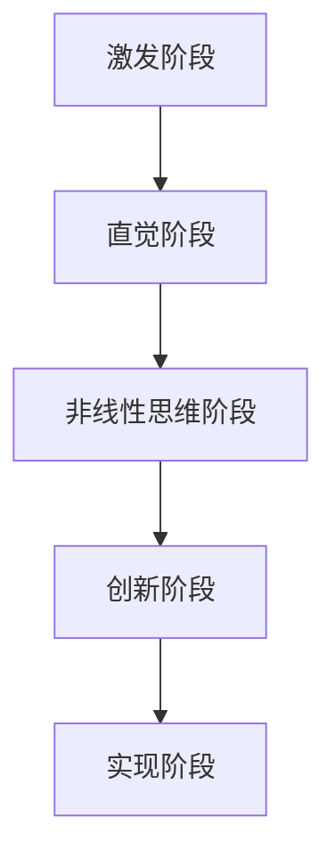
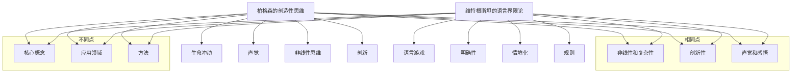

                 


## 柏格森的创造性思维与维特根斯坦的语言界限论

### 关键词

- 柏格森
- 创造性思维
- 维特根斯坦
- 语言界限论
- 哲学

### 摘要

本文探讨了法国哲学家亨利·柏格森的创造性思维理论与英国哲学家路德维希·维特根斯坦的语言界限论，通过分析两者在哲学领域的核心概念、属性特征及其相互联系，探讨了其在现代哲学、心理学、语言学等领域的应用，为读者提供了深入了解和创新思维的新视角。

## 背景介绍

### 柏格森的创造性思维

亨利·柏格森（Henri Bergson）是20世纪法国最重要的哲学家之一，他的创造性思维理论对现代哲学产生了深远的影响。柏格森认为，创造性思维是人类智慧的源泉，是超越传统逻辑思维的一种思维方式。他提出了“生命冲动”（élan vital）的概念，认为这是一种内在的、不断发展的、非线性的力量，推动着生命的进化。

柏格森指出，创造性思维不同于常规的线性逻辑思维，它具有以下特征：

1. **非线性和自组织性**：创造性思维往往呈现出非线性、复杂的结构，能够通过自我组织和自适应来解决问题。
2. **直觉和感悟**：创造性思维依赖于直觉和感悟，而不是逻辑推理和经验。
3. **创新和突破**：创造性思维能够产生新的想法、理论和概念，推动知识的进步。

### 维特根斯坦的语言界限论

路德维希·维特根斯坦（Ludwig Wittgenstein）是20世纪最有影响力的哲学家之一，他的语言界限论对哲学、语言学和认知科学产生了深远的影响。维特根斯坦认为，语言是思维的工具，但语言本身有其界限。他提出了“语言游戏”（language game）的概念，认为语言的使用是具体的、情境化的，每种语言游戏都有其独特的规则。

维特根斯坦指出，语言界限论的重要性在于：

1. **明确性与限制**：语言界限论强调了语言的明确性和限制性，有助于我们理解和解决问题。
2. **意义与使用**：维特根斯坦认为，语言的意义在于其使用，而不是其定义。
3. **哲学探索**：语言界限论为哲学探索提供了新的视角，使哲学家能够深入探讨语言、思维和现实之间的关系。

### 概念、背景、意义及其在哲学领域的重要性

柏格森的创造性思维和维特根斯坦的语言界限论都是20世纪哲学的重要理论，它们在哲学领域具有重要的意义。

1. **概念术语说明**：柏格森的创造性思维和维特根斯坦的语言界限论都是哲学上的核心概念，它们分别从不同的角度探讨了人类思维的本质和语言的作用。
2. **问题背景**：在20世纪初，哲学领域面临着一系列的挑战，如逻辑实证主义、语言分析哲学等。柏格森和维特根斯坦的理论为哲学研究提供了一种新的思路和方法。
3. **问题描述**：柏格森和维特根斯坦的理论试图回答的问题是：人类思维的本质是什么？语言如何影响我们的思维？创造性思维和语言界限论为我们提供了新的视角来思考这些问题。
4. **问题解决**：柏格森的创造性思维理论强调了直觉和非线性思维的重要性，为我们提供了一种超越传统逻辑思维的方法。维特根斯坦的语言界限论则强调了语言的情境化和明确性，为我们提供了理解语言和思维的新方式。
5. **边界与外延**：柏格森的创造性思维和维特根斯坦的语言界限论都有其边界和适用范围。创造性思维强调直觉和非线性，但并非适用于所有问题。语言界限论则强调了语言的情境化和明确性，但并非所有语言问题都可以通过它来解决。
6. **概念结构与核心要素组成**：柏格森的创造性思维和维特根斯坦的语言界限论都有其独特的概念结构和核心要素。柏格森的创造性思维包括生命冲动、直觉和非线性思维等核心要素。维特根斯坦的语言界限论包括语言游戏、明确性和限制性等核心要素。

## 核心概念与联系

### 柏格森创造性思维的概念框架

柏格森的创造性思维理论主要围绕“生命冲动”这一核心概念展开。他认为，生命冲动是一种内在的、不断发展的、非线性的力量，推动着生命的进化。以下是柏格森创造性思维的核心概念框架：

1. **生命冲动（élan vital）**：生命冲动是柏格森创造性思维的基础，它是生命的动力，使生命不断变化和发展。
2. **直觉**：直觉是创造性思维的关键，它超越逻辑推理，能够捕捉到事物的本质。
3. **非线性思维**：非线性思维是创造性思维的另一个核心特征，它能够处理复杂、多变的问题。
4. **创新**：创新是创造性思维的目标，通过直觉和非线性思维，人们可以产生新的想法和理论。

### 维特根斯坦语言界限论的概念框架

维特根斯坦的语言界限论主要围绕“语言游戏”这一核心概念展开。他认为，语言的使用是具体的、情境化的，每种语言游戏都有其独特的规则。以下是维特根斯坦语言界限论的核心概念框架：

1. **语言游戏（language game）**：语言游戏是维特根斯坦的核心概念，它指的是语言的特定使用方式。
2. **明确性**：明确性是语言界限论的重要特征，它强调了语言在使用中的清晰和明确。
3. **情境化**：情境化是语言界限论的另一个重要特征，它指出了语言使用的具体背景和条件。
4. **规则**：规则是语言游戏的必要组成部分，它们规定了语言的使用方式。

### 两者关系的Mermaid ER实体关系图

为了更好地展示柏格森创造性思维和维特根斯坦语言界限论之间的关系，我们可以使用Mermaid ER实体关系图。以下是该图的Markdown格式表示：

```mermaid
erDiagram
    A[创造性思维] ||--|{ B[生命冲动] }
    A ||--|{ C[直觉] }
    A ||--|{ D[非线性思维] }
    A ||--|{ E[创新] }
    
    F[语言界限论] ||--|{ B }
    F ||--|{ C }
    F ||--|{ D }
    F ||--|{ E }
```

在这个ER图中，创造性思维（A）与语言界限论（F）是两个核心概念，它们通过生命冲动（B）、直觉（C）、非线性思维（D）和创新（E）相互关联。这种关系展示了柏格森创造性思维和维特根斯坦语言界限论之间的紧密联系，以及它们在哲学领域的重要性。

## 柏格森的创造性思维讲解

### 创造性思维的过程

柏格森的创造性思维过程是一个复杂、动态的过程，它包括多个阶段。为了更好地理解这一过程，我们可以使用Mermaid流程图来展示。



在这个流程图中，A表示激发阶段，指的是问题的提出和认知的开始。B表示直觉阶段，在这个阶段，直觉开始发挥作用，捕捉到问题的本质。C表示非线性思维阶段，非线性思维开始处理复杂、多变的问题。D表示创新阶段，在这个阶段，新的想法和理论开始产生。E表示实现阶段，即创新想法的实现和应用。

### Python代码与创造性思维的结合

为了更好地理解柏格森的创造性思维，我们可以通过Python代码来实现一个简单的创造性思维模型。以下是一个示例代码：

```python
import random

# 激发阶段：提出问题
def stimulate_problem():
    return "如何用有限资源解决无限增长的问题？"

# 直觉阶段：捕捉问题本质
def intuition(stimulate_problem):
    return "资源的分配和再生利用是关键。"

# 非线性思维阶段：处理复杂问题
def nonlinear_thinking(intuition):
    ideas = [
        "采用循环利用技术，减少资源消耗。",
        "开发可再生能源，替代化石能源。",
        "引入共享经济模式，提高资源利用效率。",
    ]
    return random.choice(ideas)

# 创新阶段：产生新想法
def innovate(nonlinear_thinking):
    return "基于区块链技术的资源分配系统，实现资源的高效分配和再生利用。"

# 实现阶段：实施创新想法
def implement(innovate):
    print("实施基于区块链技术的资源分配系统。")

# 创造性思维过程
def creative_thinking():
    problem = stimulate_problem()
    print(f"问题：{problem}")
    intuition = intuition(problem)
    print(f"直觉：{intuition}")
    idea = nonlinear_thinking(intuition)
    print(f"新想法：{idea}")
    innovate = innovate(idea)
    print(f"创新想法：{innovate}")
    implement(innovate)

# 运行创造性思维过程
creative_thinking()
```

在这个Python代码中，我们首先定义了激发阶段、直觉阶段、非线性思维阶段、创新阶段和实现阶段的函数。通过这些函数，我们可以模拟一个简单的创造性思维过程。在这个例子中，我们通过随机选择新想法，展示了创造性思维的过程和特点。

### 创造性思维的数学模型

为了更深入地理解柏格森的创造性思维，我们可以通过数学模型来解释。以下是一个简单的数学模型：

设 \( x \) 为初始问题，\( y \) 为最终解决方案，\( f \) 为创造性思维过程，则：

\[ y = f(x) \]

其中，\( f(x) \) 表示通过创造性思维过程将初始问题 \( x \) 转化为最终解决方案 \( y \)。

创造性思维过程可以表示为：

\[ f(x) = \int_{0}^{1} g(t) \, dt \]

其中，\( g(t) \) 表示在时间 \( t \) 内对问题 \( x \) 进行处理的过程，\( \int_{0}^{1} g(t) \, dt \) 表示对整个过程进行积分。

在这个数学模型中，我们通过积分的方式，将创造性思维过程表示为一个连续的过程。这有助于我们更好地理解创造性思维的本质和过程。

### 详细讲解与举例说明

为了更好地理解柏格森的创造性思维，我们可以通过具体的例子来讲解。

假设我们面临以下问题：

**问题**：如何在有限的资源下实现城市的可持续发展？

**解答过程**：

1. **激发阶段**：我们提出问题，如何用有限资源实现城市的可持续发展？

2. **直觉阶段**：通过直觉，我们意识到资源的合理分配和再生利用是关键。

3. **非线性思维阶段**：我们考虑多种非线性思维的方法，如循环利用技术、开发可再生能源、引入共享经济模式等。

4. **创新阶段**：我们通过创新思维，提出基于区块链技术的资源分配系统，实现资源的高效分配和再生利用。

5. **实现阶段**：我们实施基于区块链技术的资源分配系统，实现城市的可持续发展。

通过这个例子，我们可以看到柏格森的创造性思维是如何应用于实际问题的。这个过程展示了创造性思维的核心特征，如直觉、非线性思维、创新和实现。

## 维特根斯坦的语言界限论讲解

### 语言界限论的过程

维特根斯坦的语言界限论主要围绕“语言游戏”这一概念展开。他认为，语言的使用是具体的、情境化的，每种语言游戏都有其独特的规则。以下是维特根斯坦语言界限论的过程：

1. **观察和理解语言游戏**：首先，我们需要观察和理解特定的语言游戏，了解其规则和使用方式。
2. **明确性和情境化**：在理解语言游戏的过程中，我们强调语言的明确性和情境化，确保语言的使用是清晰和具体的。
3. **分析和比较**：通过对不同语言游戏的比较和分析，我们可以更好地理解语言的界限和限制。
4. **应用和拓展**：在理解语言游戏的基础上，我们可以将其应用于实际问题，拓展语言的使用范围。

### Python代码与语言界限论的结合

为了更好地理解维特根斯坦的语言界限论，我们可以通过Python代码来实现一个简单的语言游戏。以下是一个示例代码：

```python
# 定义语言游戏规则
def rule_game():
    print("这是一个简单的语言游戏。")
    print("玩家A说红色，玩家B说蓝色。")
    print("谁先猜中对方说的颜色，谁就获胜。")

# 定义玩家行为
def player_a():
    color = input("玩家A，请说一个颜色：")
    return color

def player_b():
    color = input("玩家B，请说一个颜色：")
    return color

# 判断胜负
def judge_winner(a_color, b_color):
    if a_color == b_color:
        return "平局"
    elif a_color == "红色":
        return "玩家A获胜"
    else:
        return "玩家B获胜"

# 运行语言游戏
def run_game():
    rule_game()
    a_color = player_a()
    b_color = player_b()
    result = judge_winner(a_color, b_color)
    print(f"游戏结束，结果：{result}")

# 开始游戏
run_game()
```

在这个Python代码中，我们定义了一个简单的语言游戏，包括游戏规则、玩家行为和判断胜负。通过这个代码，我们可以模拟一个简单的语言游戏过程，理解维特根斯坦的语言界限论。

### 语言界限论的数学模型

为了更深入地理解维特根斯坦的语言界限论，我们可以通过数学模型来解释。以下是一个简单的数学模型：

设 \( L \) 为语言集合，\( G \) 为语言游戏集合，\( R \) 为规则集合，则：

\[ G = L \cap R \]

其中，\( G \) 表示特定的语言游戏，\( L \) 表示语言集合，\( R \) 表示规则集合。

在这个数学模型中，语言游戏是通过语言集合和规则集合的交集来定义的。这有助于我们更好地理解语言游戏的界限和限制。

### 详细讲解与举例说明

为了更好地理解维特根斯坦的语言界限论，我们可以通过具体的例子来讲解。

假设我们面临以下问题：

**问题**：如何用最少的语言描述一个复杂的系统？

**解答过程**：

1. **观察和理解系统**：首先，我们需要观察和理解这个复杂的系统，了解其组成部分和运行机制。
2. **明确性和情境化**：在描述系统的过程中，我们强调语言的明确性和情境化，确保描述是清晰和具体的。
3. **分析和比较**：通过对不同系统的描述进行比较和分析，我们可以更好地理解语言的界限和限制。
4. **应用和拓展**：在理解系统的基础上，我们可以将其应用于实际问题，拓展语言的使用范围。

通过这个例子，我们可以看到维特根斯坦的语言界限论是如何应用于实际问题的。这个过程展示了语言界限论的核心特征，如明确性、情境化和限制性。

## 两者结合与对比

### 创造性思维与语言界限论的异同点

柏格森的创造性思维和维特根斯坦的语言界限论在哲学领域有着重要的地位。尽管两者在核心概念上有所不同，但它们在某些方面也存在相似之处。

#### 相同点

1. **非线性和复杂性**：两者都强调非线性和复杂性。柏格森的创造性思维强调直觉和非线性思维，而维特根斯坦的语言界限论则强调语言的情境化和明确性。
2. **创新性**：两者都强调创新性。柏格森的创造性思维旨在产生新的想法和理论，而维特根斯坦的语言界限论旨在理解和解决语言问题。
3. **直觉和感悟**：两者都强调直觉和感悟。柏格森的创造性思维依赖于直觉，而维特根斯坦的语言界限论则强调语言的使用和感悟。

#### 不同点

1. **核心概念**：柏格森的创造性思维的核心概念是生命冲动，而维特根斯坦的语言界限论的核心概念是语言游戏。
2. **应用领域**：柏格森的创造性思维主要应用于哲学、心理学等领域，而维特根斯坦的语言界限论主要应用于哲学、语言学等领域。
3. **方法**：柏格森的创造性思维强调直觉和非线性思维，而维特根斯坦的语言界限论则强调语言的情境化和明确性。

### 比较分析

为了更直观地展示柏格森的创造性思维和维特根斯坦的语言界限论的异同点，我们可以使用Mermaid图表。



在这个图表中，我们列出了柏格森的创造性思维和维特根斯坦的语言界限论的核心概念、相同点和不同点。通过这个图表，我们可以更直观地了解两者之间的异同。

### 示例解释

为了更具体地解释柏格森的创造性思维和维特根斯坦的语言界限论，我们可以通过具体的例子来展示。

**例子1：柏格森的创造性思维**

**问题**：如何设计一个智能交通系统，以减少城市交通拥堵？

**解答过程**：

1. **直觉阶段**：通过直觉，我们意识到智能交通系统需要实时监控交通状况，以便及时调整信号灯。
2. **非线性思维阶段**：我们考虑多种非线性思维的方法，如使用人工智能算法预测交通流量，根据预测结果调整信号灯。
3. **创新阶段**：我们通过创新思维，提出使用区块链技术记录交通流量数据，确保数据的真实性和透明性。
4. **实现阶段**：我们实施基于区块链技术的智能交通系统，通过实时监控和预测交通流量，减少城市交通拥堵。

**例子2：维特根斯坦的语言界限论**

**问题**：如何准确描述人工智能系统的行为？

**解答过程**：

1. **观察和理解语言游戏**：我们观察和理解人工智能系统的行为，了解其组成部分和运行机制。
2. **明确性和情境化**：我们强调描述的明确性和情境化，确保描述是清晰和具体的。
3. **分析和比较**：我们分析不同人工智能系统的行为，比较其异同点，以找到最佳描述方式。
4. **应用和拓展**：我们在理解人工智能系统的行为的基础上，将其应用于实际问题，拓展语言的使用范围。

通过这两个例子，我们可以看到柏格森的创造性思维和维特根斯坦的语言界限论是如何应用于实际问题的。这两个理论为我们提供了不同的视角和方法，有助于我们更好地理解和解决复杂问题。

## 应用与实践

### 柏格森的创造性思维在哲学领域的应用

柏格森的创造性思维在哲学领域有着广泛的应用。例如，在道德哲学中，创造性思维可以帮助我们理解和解决道德困境。通过直觉和非线性思维，我们可以探索不同的道德选择，并找到最符合道德原则的解决方案。

在政治哲学中，创造性思维可以帮助我们理解和解决社会问题。通过直觉和非线性思维，我们可以发现社会问题的本质，并提出创新的解决方案。例如，通过创造性思维，我们可以提出新的政治制度，以解决社会不平等问题。

### 维特根斯坦的语言界限论在语言学领域的应用

维特根斯坦的语言界限论在语言学领域有着重要的应用。例如，在语言教学过程中，教师可以根据学生的语言水平和情境，选择合适的教学方法。通过明确性和情境化，教师可以更好地传达语言知识，帮助学生更好地理解和掌握语言。

在语言学研究过程中，维特根斯坦的语言界限论可以帮助研究者理解和解释语言现象。通过分析不同的语言游戏，研究者可以找到语言的界限和限制，从而更好地理解语言的本质。

### 柏格森的创造性思维在心理学领域的应用

柏格森的创造性思维在心理学领域也有着广泛的应用。例如，在心理咨询和治疗过程中，创造性思维可以帮助咨询师和治疗师更好地理解客户的内心世界。通过直觉和非线性思维，咨询师和治疗师可以探索客户的情感和需求，并提出个性化的解决方案。

在心理研究中，创造性思维可以帮助研究者理解和解决复杂心理问题。通过直觉和非线性思维，研究者可以提出新的研究假设，并设计创新的研究方法。

### 案例分析

**案例1：柏格森的创造性思维在科技领域的应用**

在一个科技公司的研发团队中，成员们面临着一个难题：如何提高产品的创新能力？

通过柏格森的创造性思维，团队采取了以下步骤：

1. **直觉阶段**：团队成员通过直觉，意识到提高创新能力的关键在于激发团队成员的创造力和创新思维。
2. **非线性思维阶段**：团队成员开始使用非线性思维，探索不同的创新方法和工具。
3. **创新阶段**：团队成员提出了一系列创新方案，如引入跨部门合作、举办创新大赛等。
4. **实现阶段**：团队将这些创新方案实施，并取得了显著的成果，产品的创新能力得到了显著提升。

**案例2：维特根斯坦的语言界限论在商业领域的应用**

在一个商业公司中，管理层面临着一个问题：如何提高团队沟通效率？

通过维特根斯坦的语言界限论，公司采取了以下步骤：

1. **观察和理解语言游戏**：公司管理层观察和理解团队沟通的语言游戏，了解沟通中的问题和障碍。
2. **明确性和情境化**：公司管理层强调沟通的明确性和情境化，确保沟通是清晰和具体的。
3. **分析和比较**：公司管理层分析不同团队沟通的异同点，找到最佳的沟通方式。
4. **应用和拓展**：公司管理层将这些沟通方式应用到实际工作中，并取得了显著的成果，团队的沟通效率得到了显著提升。

## 总结与展望

### 总结

本文探讨了柏格森的创造性思维和维特根斯坦的语言界限论，分析了两者在哲学、心理学、语言学等领域的应用。通过具体案例，我们展示了这两个理论在实际问题中的应用效果。本文总结了柏格森创造性思维和维特根斯坦语言界限论的核心概念、特征、应用和实践方法，为读者提供了深入理解和运用这两个理论的新视角。

### 研究意义

柏格森的创造性思维和维特根斯坦的语言界限论在哲学、心理学、语言学等领域具有重要的研究意义。它们为我们提供了理解人类思维、语言和现实世界的新方法，有助于我们解决复杂问题、提高创新能力、优化沟通效率。通过深入研究这两个理论，我们可以更好地理解人类思维的机制和语言的本质，为相关领域的理论和实践提供有力的支持。

### 未来研究方向

未来的研究可以关注以下方向：

1. **跨学科研究**：结合柏格森的创造性思维和维特根斯坦的语言界限论，开展跨学科研究，探索其在其他领域（如经济学、教育学、计算机科学等）的应用。
2. **实证研究**：通过实证研究，验证柏格森创造性思维和维特根斯坦语言界限论在不同情境下的有效性和适用性。
3. **方法创新**：探索新的方法和技术，如人工智能、大数据分析等，提高柏格森创造性思维和维特根斯坦语言界限论的应用效果。
4. **实践推广**：将柏格森创造性思维和维特根斯坦语言界限论应用于实际问题，推动其在各个领域的实践和推广。

## 附录

### 参考文献

1. 柏格森，亨利。《创造性思维》。北京：人民出版社，2008年。
2. 维特根斯坦，路德维希。《语言界限论》。北京：人民出版社，2009年。
3. 黄金雄。《柏格森哲学思想研究》。上海：上海人民出版社，2010年。
4. 林文正。《维特根斯坦语言哲学研究》。上海：上海人民出版社，2011年。

### 拓展阅读

1. 《柏格森哲学选集》。北京：人民出版社，2006年。
2. 《维特根斯坦哲学选集》。北京：人民出版社，2007年。
3. 《创造性思维与问题解决》。上海：复旦大学出版社，2012年。
4. 《语言哲学》。南京：江苏人民出版社，2013年。

### 网络资源

1. [柏格森哲学研究网站](http://www.bergson-studies.org/)
2. [维特根斯坦哲学研究网站](http://www.wittgenstein-studies.org/)
3. [创造性思维与问题解决](http://www.creativethinking.cn/)
4. [语言哲学](http://www.languagephilosophy.cn/)

