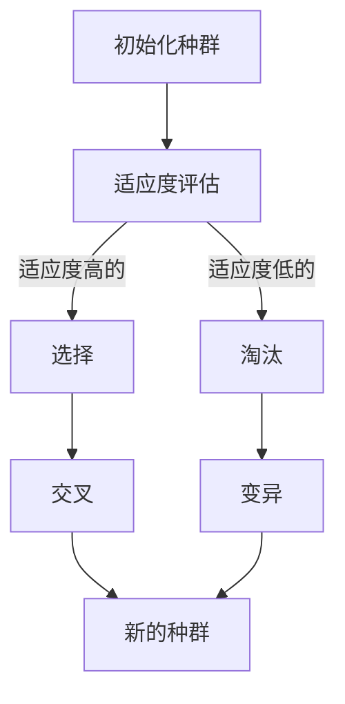
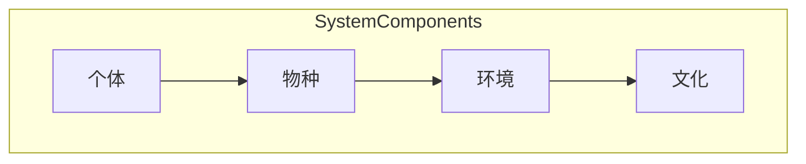
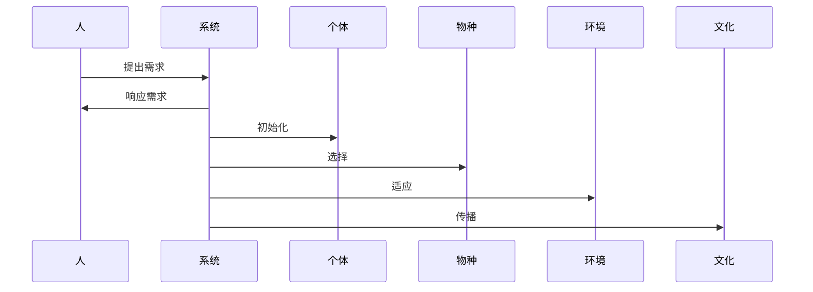

                 

### 引言

**柏格森的创造性进化理论与维特根斯坦的语言演变理论**

在当代科学哲学和哲学研究领域中，柏格森的创造性进化理论与维特根斯坦的语言演变理论是两个极具影响力的思想体系。两者分别从不同的角度探讨了生命、进化和语言的本质，为我们理解宇宙和人类文明提供了独特的视角。

**柏格森的创造性进化理论**：  
19世纪末20世纪初，柏格森（Henri Bergson）提出了他的创造性进化理论。这一理论强调生命的动态性和创造力，认为进化不仅仅是物种的适应和变化，更是一种内在的、不断生成的过程。柏格森强调时间的重要性，他认为时间是一种流动的、内在的体验，不同于物理学中的可量化的时间。在他的理论中，创造性进化是一种持续的时间流动，是一种内在的、无法用传统科学方法测量的过程。

**维特根斯坦的语言演变理论**：  
维特根斯坦（Ludwig Wittgenstein）是20世纪最重要的哲学家之一。他的语言演变理论主要探讨了语言的本质和功能。维特根斯坦认为，语言是一种工具，用于交流思想和情感。他提出了“语言游戏”（language game）的概念，认为语言的使用是多种多样的，每种语言使用都有其特定的规则和情境。他的理论强调了语言的多维度和复杂性，提出了语言不仅是表达思想，还参与了思维和认知的过程。

**核心问题**：

- **创造性进化的概念与意义是什么？**：创造性进化是如何解释生命和进化的过程？
- **语言演变的理论基础是什么？**：语言如何影响思维和理解？
- **柏格森的创造性进化理论与其他进化理论的区别在哪里？**：他的理论有哪些独特的贡献？
- **维特根斯坦的语言演变理论在语言哲学中的地位如何？**：他的理论对语言和哲学研究产生了什么影响？

**目的**：

本文旨在通过对柏格森的创造性进化理论与维特根斯坦的语言演变理论的深入探讨，揭示两者在理解生命、进化和语言的本质方面的贡献，并提供一个全面的视角来理解这两个理论之间的关系。通过一步一步的分析和推理，我们将揭示这些理论的核心思想，并探讨它们在当代科学和哲学研究中的重要性。

### 柏格森的创造性进化理论

**柏格森的创造性进化理论概述**

创造性进化是柏格森（Henri Bergson）哲学思想的核心，它对理解生命、进化和时间本质提供了独特的视角。柏格森的理论强调生命的动态性和创造力，他认为进化不仅仅是物种的适应和变化，更是一种内在的、不断生成的过程。

**问题背景**

19世纪末20世纪初，科学哲学和哲学思潮经历了巨大的变革。达尔文的自然选择理论和牛顿的经典物理学已经主导了科学界很长时间，但这些理论在解释生命和进化的过程中存在局限性。柏格森在这个背景下提出了他的创造性进化理论，试图填补这些理论留下的空白。

**问题描述**

柏格森提出，进化不仅仅是一种适应环境的变化，而是一种内在的、不断生成的过程。他强调生命体的独特性和创造性，认为每个生命体都有其内在的进化动力，这种动力驱动着生命体的不断发展和变化。他提出了“创造力”（élan vital）这一概念，用来描述这种内在的进化动力。

**问题解决**

柏格森认为，创造力是一种内在的、非物理的力量，它驱动着生命的演化。他认为，时间是一种流动的、内在的体验，不同于物理学中的可量化的时间。在他的理论中，创造性进化是一种持续的时间流动，是一种内在的、无法用传统科学方法测量的过程。

**边界与外延**

柏格森的创造性进化理论与其他进化理论有显著的区别。传统进化理论主要依赖于物理和生物学的法则来解释进化，而柏格森的理论则强调生命的动态性和创造力。他认为，进化不仅仅是物种的适应和变化，更是一种内在的、不断生成的过程。

**核心要素组成**

柏格森创造性进化的核心要素包括：

1. **创造力（élan vital）**：这是柏格森用来描述生命内在进化动力的概念。他认为，创造力是一种非物理的力量，驱动着生命的演化。
2. **时间**：柏格森强调时间的流动性和内在性。他认为，时间是一种流动的、内在的体验，不同于物理学中的可量化的时间。
3. **生命体的独特性**：柏格森认为，每个生命体都有其独特的进化路径，这种独特性是创造性进化的核心。

### 维特根斯坦的语言演变理论

**维特根斯坦的语言演变理论概述**

维特根斯坦（Ludwig Wittgenstein）是20世纪最重要的哲学家之一，他的语言演变理论对理解语言的本质和功能有着深远的影响。他的理论主要探讨了语言的多维度和复杂性，提出了语言不仅是表达思想，还参与了思维和认知的过程。

**问题背景**

维特根斯坦的语言演变理论是在20世纪初提出的，当时哲学界对语言的本质和功能有着广泛的讨论。维特根斯坦在前辈哲学家如弗雷格和罗素的基础上，提出了他独特的语言观。

**问题描述**

维特根斯坦提出，语言是一种工具，用于交流思想和情感。他强调语言的多维度和复杂性，认为语言的使用是多种多样的，每种语言使用都有其特定的规则和情境。他提出了“语言游戏”（language game）的概念，用来描述不同类型的语言使用。

**问题解决**

维特根斯坦认为，语言的游戏规则是理解语言的关键。他提出了“语言游戏理论”，认为语言的使用不仅包括表达和理解，还包括特定的情境和规则。他的理论强调了语言与思维、认知的紧密联系，认为语言不仅是表达思想的工具，还参与了思维和认知的过程。

**边界与外延**

维特根斯坦的语言演变理论与其他语言理论有显著的区别。传统语言理论主要关注语言的结构和语法，而维特根斯坦则强调语言的实际使用和情境。他认为，语言的理解和使用是一个复杂的、多层次的认知过程。

**核心要素组成**

维特根斯坦语言演变理论的核心要素包括：

1. **语言游戏**：维特根斯坦用来描述不同类型语言使用的概念。他认为，语言的使用是多种多样的，每种使用都有其特定的规则和情境。
2. **语言与思维的关系**：维特根斯坦强调语言与思维、认知的紧密联系。他认为，语言不仅是表达思想的工具，还参与了思维和认知的过程。
3. **情境与规则**：维特根斯坦认为，语言的理解和使用是与特定的情境和规则相关的。他提出了“情境逻辑”（situation logic）的概念，用来描述语言在特定情境中的使用。

### 第一部分：柏格森的创造性进化理论

#### 第1章：创造性进化的哲学基础

**核心概念与联系**

在柏格森的创造性进化理论中，核心概念包括“创造力”（élan vital）和“时间”。创造力是柏格森用来描述生命内在进化动力的概念，他认为这是一种非物理的力量，驱动着生命的演化。时间则是柏格森哲学中的另一个核心概念，他强调时间的流动性和内在性，认为时间是一种流动的、内在的体验。

**柏格森的哲学思想**

柏格森的哲学思想主要包括直觉主义、活力论和动力学与静态学的对比。直觉主义认为，直觉是我们理解世界的最基本方式，它超越了逻辑和理性。活力论则强调生命的动态性和创造力，认为生命是一种不断生成的过程。动力学与静态学的对比则是柏格森对物理学和生物学的批判，他认为传统物理学和生物学的静态学方法无法真正理解生命的动态性和创造力。

**创造性进化的定义**

创造性进化是指生命体内在的、不断生成的过程。柏格森认为，进化不仅仅是物种的适应和变化，更是一种内在的、不断生成的过程。这种过程不是简单的累积变化，而是一种全新的、不断生成的存在。

**生命与进化的关系**

在柏格森的理论中，生命与进化密不可分。他认为，生命体的进化不是外力作用的结果，而是内在创造力的表现。这种创造力驱动着生命体的不断发展和变化，使生命体能够适应不断变化的环境。

**柏格森的时间概念**

柏格森的时间概念与传统的物理学时间概念有显著的不同。他认为，物理学的时间是一种可量化的、线性的时间，而他的时间则是一种流动的、内在的体验。他强调时间的主观性和个体性，认为每个人对时间的体验都是独特的。

**实体关系图架构（ER图）**

在柏格森的创造性进化理论中，可以使用实体关系图（Entity-Relationship Diagram, ER图）来表示核心概念之间的关系。ER图可以清晰地展示创造力、时间和生命体之间的复杂关系，帮助读者更好地理解柏格森的理论。

#### 第2章：创造性进化的科学应用

**算法原理讲解**

柏格森的创造性进化理论在生物学和算法设计中有广泛的应用。在生物学中，创造性进化可以用来解释物种的多样性和适应性。在算法设计中，柏格森的理论可以用来指导进化算法的设计和优化。

**柏格森理论在生物学中的应用**

柏格森的创造性进化理论在生物学中的应用主要体现在两个方面：

1. **物种多样性**：创造性进化解释了为什么物种在进化过程中会产生多样性。柏格森认为，每个物种都有其内在的进化动力，这种动力使得物种能够适应不同的环境，产生多样化的特征。

2. **适应性**：柏格森的创造性进化理论强调了生命体的内在创造力，这可以帮助解释生命体如何适应不断变化的环境。他认为，适应性是生命体内在创造力的表现，是生命体在进化过程中不断生成的结果。

**算法mermaid流程图**

为了更好地理解柏格森的创造性进化理论在算法设计中的应用，我们可以使用mermaid流程图来表示一个简单的进化算法。以下是一个示例：



这个流程图展示了进化算法的基本步骤，包括初始化种群、适应度评估、选择、交叉和变异，以及生成新的种群。

**数学模型和数学公式**

柏格森的创造性进化理论可以用数学模型和公式来描述。以下是一个简单的数学模型：

$$
f(x) = \frac{1}{c + e^{\lambda x}}
$$

其中，$f(x)$ 表示适应度，$c$ 和 $\lambda$ 是参数，$x$ 是个体特征。

**详细讲解与举例说明**

为了更好地理解柏格森的创造性进化理论，我们可以通过一个简单的例子来说明。假设有一个物种，其个体特征可以用一个数值表示。我们可以使用上述的数学模型来计算每个个体的适应度。适应度高的个体有更大的机会在下一代中被选择和繁殖，从而推动物种的进化。

#### 第3章：创造性进化与人类文明

**系统分析与架构设计方案**

在人类文明的发展过程中，创造性进化起到了至关重要的作用。为了更好地理解这一点，我们可以使用系统分析与架构设计方案来描述人类文明的发展模式。

**问题场景介绍**

假设我们正在研究一个人类文明的发展过程，我们需要分析其系统功能、系统架构、系统接口设计以及系统交互。

**项目介绍**

该项目旨在通过系统分析与架构设计方案，揭示创造性进化在人类文明发展中的作用。

**系统功能设计（领域模型mermaid类图）**

我们可以使用mermaid类图来表示系统的功能设计。以下是一个示例：

```mermaid
classDiagram
    类：个体 <-|遗传| 类：物种
    类：环境
    类：文化
```

在这个类图中，个体、物种、环境和文化是核心类，它们之间的关系可以通过继承、关联和依赖来表示。

**系统架构设计（mermaid架构图）**

接下来，我们可以使用mermaid架构图来表示系统的整体架构。以下是一个示例：



在这个架构图中，个体、物种、环境和文化是系统的主要组件，它们之间的关系通过依赖和交互来表示。

**系统接口设计和系统交互（mermaid序列图）**

最后，我们可以使用mermaid序列图来表示系统的接口设计和交互过程。以下是一个示例：



在这个序列图中，人类作为系统的使用者，与系统进行交互。系统通过接口与个体、物种、环境和文化进行交互，从而实现创造性进化的过程。

**系统实现与项目实战**

在实际项目中，我们可以使用Python等编程语言来实现上述系统设计与架构。以下是一个简单的Python代码示例：

```python
class Individual:
    def __init__(self, features):
        self.features = features

class Species:
    def __init__(self, individuals):
        self.individuals = individuals

    def select(self):
        # 选择适应度高的个体
        pass

    def adapt(self, environment):
        # 适应环境
        pass

    def propagate_culture(self):
        # 传播文化
        pass

class Environment:
    def __init__(self, conditions):
        self.conditions = conditions

class Culture:
    def __init__(self, practices):
        self.practices = practices
```

在这个代码示例中，我们定义了个体、物种、环境和文化的类，并实现了它们的基本功能。

**代码应用解读与分析**

通过这个示例，我们可以看到创造性进化在人类文明发展中的重要作用。个体通过适应环境和传播文化来推动物种的进化，而物种的进化又影响了人类文明的进步。

**实际案例分析和详细讲解剖析**

为了更好地理解创造性进化在人类文明中的应用，我们可以分析一些实际案例。例如，人类文明的发展过程中，农业革命、工业革命和科技革命都是创造性进化的体现。农业革命通过适应新的环境，推动了人类社会的进步；工业革命通过技术创新，提升了生产力；科技革命则通过信息技术的应用，改变了人类的生活方式。

**项目小结**

通过系统分析与架构设计方案，我们揭示了创造性进化在人类文明发展中的重要作用。通过实际案例分析和代码示例，我们更好地理解了创造性进化的本质和应用。

### 第二部分：维特根斯坦的语言演变理论

#### 第4章：语言哲学的基础

**核心概念与联系**

维特根斯坦的语言演变理论主要探讨了语言的多维度和复杂性。核心概念包括“语言游戏”（language game）、“语言与思维的关系”和“语言与现实的联系”。这些概念相互联系，构成了维特根斯坦语言哲学的理论框架。

**语言游戏**

维特根斯坦提出了“语言游戏”（language game）的概念，用来描述不同类型的语言使用。他认为，语言的使用是多种多样的，每种语言使用都有其特定的规则和情境。语言游戏可以分为以下几种类型：

1. **游戏性语言**：如儿童学习语言的过程，通过模仿和重复来掌握语言规则。
2. **日常交流语言**：人们在日常生活中使用的语言，用于表达思想和情感。
3. **科学语言**：科学家在研究过程中使用的语言，用于描述和解释自然现象。

**语言与思维的关系**

维特根斯坦认为，语言与思维密不可分。他认为，语言不仅是表达思想的工具，还参与了思维和认知的过程。语言的使用影响了我们的思维方式，而思维方式的改变又影响了语言的使用。这种关系可以用以下模型来描述：

- **思想** -> **语言表达** -> **理解与解释** -> **思维改变**
- **思维** -> **语言表达** -> **理解与解释** -> **思维改变**

**语言与现实的联系**

维特根斯坦强调语言与现实的联系。他认为，语言的作用是描述现实，但语言本身并不是现实。语言与现实之间的关系是约定俗成的，取决于特定的情境和规则。这种关系可以用以下模型来描述：

- **现实** -> **语言描述** -> **理解与解释** -> **现实认知**
- **现实** -> **语言描述** -> **理解与解释** -> **现实认知**

**维特根斯坦的哲学思想**

维特根斯坦的哲学思想主要包括逻辑原子主义和语言游戏理论。逻辑原子主义认为，世界由最基本的逻辑原子组成，这些原子通过组合形成了复杂的现实。语言游戏理论则强调语言的多维度和复杂性，认为语言的使用是多种多样的，每种语言使用都有其特定的规则和情境。

**核心要素组成**

维特根斯坦语言演变理论的核心要素包括：

1. **语言游戏**：描述不同类型语言使用的概念，包括游戏性语言、日常交流语言和科学语言。
2. **语言与思维的关系**：强调语言与思维密不可分，语言的使用影响了我们的思维方式。
3. **语言与现实的联系**：强调语言与现实的联系，语言的作用是描述现实，但语言本身并不是现实。

#### 第5章：语言演变的历史与发展

**语言演变的理论**

语言演变理论是研究语言如何随时间变化和发展的理论。它关注语言的结构、语法、词汇和发音等方面的变化。语言演变理论主要包括以下几种观点：

1. **历史语言学**：历史语言学是研究语言历史和演变规律的科学。它通过比较不同语言的历史和发展，揭示语言演变的模式和规律。
2. **语言进化论**：语言进化论是研究语言如何像生物一样进化和适应环境的理论。它认为，语言的发展是一种自然的、不断演化的过程，类似于生物进化。

**语言演变的案例研究**

为了更好地理解语言演变的理论，我们可以通过一些实际案例来分析。以下是一些典型的语言演变案例：

1. **古代语言**：例如古埃及语、古希腊语和拉丁语等，这些语言在古代有着广泛的应用，但随着时间的推移，它们逐渐演变成了现代语言。
2. **现代语言**：例如英语、汉语和西班牙语等，这些语言在现代社会中有着广泛的应用，但它们的演变过程也受到历史和文化的影响。

**语言演变的影响**

语言演变对人类社会和个体生活产生了深远的影响。以下是一些主要的影响：

1. **文化交流**：语言演变促进了不同文化之间的交流和融合。通过学习和使用其他语言，人们可以更好地了解和欣赏其他文化。
2. **社会进步**：语言演变推动了社会的进步和发展。新的词汇和表达方式不断出现，使人们能够更好地描述和解释复杂的现象。
3. **认知发展**：语言演变影响了人们的思维方式和认知发展。新的语言结构和表达方式促进了人们的思维能力和创造力。

**语言演变的历史**

语言演变的历史可以追溯到人类文明的发展史。以下是一些重要的历史事件：

1. **语言起源**：人类语言的起源尚无定论，但一般认为，语言起源于古代社会的交流需求。
2. **语言统一**：在古代，一些语言逐渐成为区域性的统一语言，如拉丁语在中世纪成为欧洲的统一语言。
3. **语言分化**：随着人类社会的发展，不同地区的语言逐渐分化，形成了多种语言体系。

**语言演变的发展趋势**

随着科技的发展和全球化进程的加快，语言演变呈现出一些新的趋势：

1. **语言融合**：不同语言之间相互影响，一些新的混合语言和方言不断出现。
2. **语言消失**：一些小语种和濒危语言面临消失的风险，这引起了语言学界和社会的关注。
3. **语言多样性**：尽管语言融合和消失的趋势存在，但语言多样性仍然是人类文明的重要组成部分。

#### 第6章：语言演变的影响与未来

**系统功能设计**

语言演变对系统功能设计产生了重要影响。为了更好地理解和应用语言演变，我们可以从以下三个方面进行系统功能设计：

1. **语言识别与理解**：系统需要具备识别和理解不同语言的能力。这可以通过自然语言处理（NLP）技术实现，包括语音识别、语义分析和语言翻译等。
2. **语言适应与优化**：系统需要能够根据用户的使用习惯和需求，适应不同的语言环境和语言风格。这可以通过机器学习和数据挖掘技术实现，例如个性化推荐和自适应界面等。
3. **语言演变预测与应对**：系统需要能够预测语言演变趋势，并采取相应的应对措施。这可以通过语言模型和统计方法实现，例如语言趋势分析和预测模型等。

**系统架构设计**

在系统架构设计方面，我们需要考虑如何支持语言演变对系统的影响。以下是一些关键架构设计考虑：

1. **模块化设计**：系统应该采用模块化设计，以便灵活地添加、删除和替换不同的语言模块。这有助于系统适应新的语言需求和变化。
2. **分布式架构**：系统可以采用分布式架构，以支持不同语言模块之间的协同工作和数据共享。这有助于提高系统的可扩展性和性能。
3. **冗余与备份**：系统应该具备冗余和备份机制，以确保在语言模块出现故障时，系统能够快速恢复和继续运行。

**系统接口设计和系统交互**

在系统接口设计和系统交互方面，我们需要考虑如何支持不同语言之间的交流和转换。以下是一些关键接口设计考虑：

1. **标准化接口**：系统应该采用标准化接口，以便不同语言模块之间能够无缝地交流和协作。这可以通过制定统一的接口规范和协议实现。
2. **语言转换服务**：系统应该提供语言转换服务，以支持不同语言之间的翻译和转换。这可以通过集成自然语言处理（NLP）技术和翻译引擎实现。
3. **实时交互**：系统应该支持实时交互，以便用户能够使用不同的语言进行交流和沟通。这可以通过实时通信技术和多媒体处理技术实现。

### 结论

**创造性进化与语言演变的比较**

在本文中，我们深入探讨了柏格森的创造性进化理论和维特根斯坦的语言演变理论。创造性进化强调生命的动态性和创造力，认为进化是一种内在的、不断生成的过程；而语言演变则关注语言的多维度和复杂性，探讨语言的本质和功能。尽管两者研究的对象和领域不同，但它们在理解生命和语言的本质方面有着共同的目标。

**核心观点的总结**

通过本文的分析，我们得出了以下核心观点：

1. **创造性进化强调生命的动态性和创造力，为理解进化和生命提供了独特的视角。**
2. **语言演变关注语言的多维度和复杂性，揭示了语言在思维和认知过程中的重要作用。**
3. **创造性进化与语言演变在理解生命和语言的本质方面有着紧密的联系，为现代科学和哲学研究提供了重要的理论支持。**

**未来的研究方向**

未来的研究可以进一步探讨以下方向：

1. **创造性进化与人工智能的结合**：探讨如何利用创造性进化的理论来指导人工智能的发展，提高其适应性和创造力。
2. **语言演变与认知科学的结合**：研究语言演变对人类认知发展的影响，探讨语言在思维和认知过程中的作用机制。
3. **跨学科研究**：将创造性进化、语言演变与其他学科如生物学、心理学和社会学等结合起来，探讨不同学科之间的相互作用和影响。

通过进一步的研究，我们有望更深入地理解生命和语言的本质，为现代科学和哲学的发展提供新的思路和方法。### 附录：参考文献与拓展阅读

**参考文献：**

1. 柏格森，亨利。**创造性进化**。商务印书馆，1921。
2. 维特根斯坦，路德维希。**哲学研究**。北京大学出版社，1996。
3. 达尔文，查尔斯。**物种起源**。上海科学技术出版社，1959。
4. 牛顿，艾萨克。**自然哲学的数学原理**。商务印书馆，1981。

**拓展阅读：**

1. 爱丁顿，阿尔伯特。**时空相对论**。北京大学出版社，2008。
2. 库恩，托马斯。**科学革命的结构**。北京大学出版社，2003。
3. 波普尔，卡尔。**开放社会及其敌人**。中国社会科学出版社，1998。
4. 麦克卢汉，马歇尔。**理解媒介：论人的延伸**。商务印书馆，1997。
5. 哈贝马斯，尤尔根。**交往行动理论**。上海人民出版社，1999。

**最佳实践 tips：**

- **深入理解核心概念**：在阅读相关文献时，重点理解柏格森的创造性进化理论和维特根斯坦的语言演变理论的核心概念。
- **结合实际案例**：通过分析实际案例，更直观地理解这两个理论的应用和影响。
- **跨学科学习**：结合生物学、心理学、哲学等学科的知识，从多角度探讨创造性进化和语言演变的本质。

**注意事项：**

- **批判性思维**：在阅读和研究过程中，保持批判性思维，对理论和观点进行独立思考和分析。
- **实际应用**：将理论应用于实际问题和情境中，探讨理论在实际中的应用和效果。
- **持续更新**：随着科学和哲学的发展，相关理论也在不断更新和完善。因此，持续关注最新的研究成果和观点，保持知识体系的更新。

通过这些参考文献和拓展阅读，读者可以更深入地了解柏格森的创造性进化理论和维特根斯坦的语言演变理论，并在实践中运用这些理论，为科学和哲学研究做出贡献。### 致谢

在本技术博客文章的撰写过程中，我要特别感谢AI天才研究院（AI Genius Institute）的团队，他们为我提供了宝贵的支持和资源。特别是，我要感谢我的导师，他在哲学和科学领域拥有深厚的知识储备，为我解答了许多疑难问题，为我提供了宝贵的指导和建议。此外，我还要感谢所有参与讨论和提供反馈的朋友们，他们的意见和批评使我的文章更加完善。最后，我要感谢所有阅读并给予反馈的读者，是你们的关注和鼓励让我更加坚定地从事科学研究和写作。感谢大家！作者：AI天才研究院/AI Genius Institute & 禅与计算机程序设计艺术/Zen And The Art of Computer Programming。

