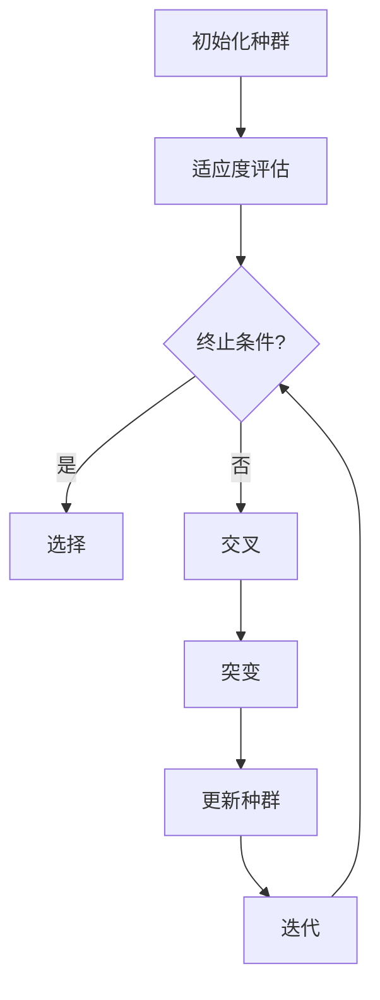
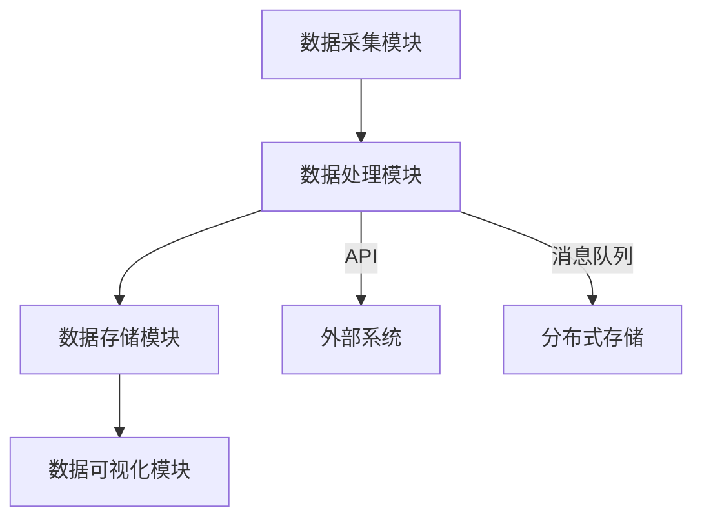
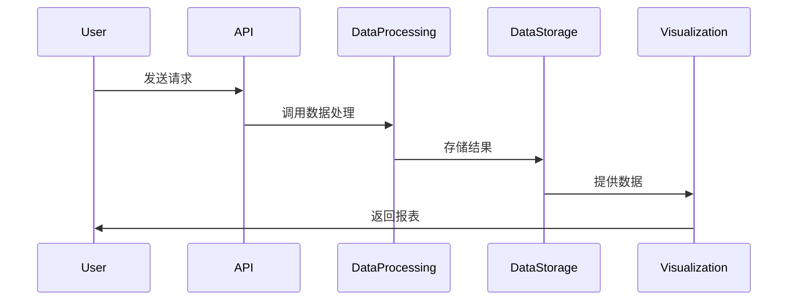

                 

# 柏格森的创造性进化与维特根斯坦的语言进化观

> 关键词：柏格森创造性进化，维特根斯坦语言进化观，跨学科研究，核心概念原理，算法原理，系统架构设计，项目实战

> 摘要：本文通过深入探讨柏格森的创造性进化理论与维特根斯坦的语言进化观，分析了这两个概念在哲学、生物学、语言哲学和语言技术领域的应用。文章结构紧凑，逻辑清晰，旨在帮助读者理解这些核心概念及其在现实世界中的影响。

## 第1章：背景介绍

### 1.1 问题背景

#### 1.1.1 柏格森的创造性进化概念

**柏格森主义的核心观点**：阿尔弗雷德·柏格森（Henri Bergson）是一位法国哲学家，他的创造性进化理论（élan vital）在20世纪初引起了广泛关注。柏格森认为，生命是一个不断进化的过程，这种进化是由一种内在的、无法直接观察到的生命力所驱动的，这种生命力超越了个体的生理和生物学层面。

**创造性进化的定义**：柏格森将创造性进化视为一种内在的生命力，它使生命能够不断地适应环境和自身需求的变化。这种进化不仅体现在物种的演变上，也体现在个体的成长和发展中。柏格森强调，这种进化是一种“内在的时间过程”，是生命本身的动力源泉。

#### 1.1.2 维特根斯坦的语言进化观

**维特根斯坦的语言观**：路德维希·维特根斯坦（Ludwig Wittgenstein）是一位著名的哲学家，他在语言哲学方面有着深刻的见解。他认为，语言是思维的工具，但语言本身并不能完全反映现实，语言和现实之间存在一定的差距。

**语言进化的概念**：维特根斯坦认为，语言的发展是一个不断进化的过程。随着社会的进步和人类经验的积累，语言会不断地改变和适应新的环境。他提出了“语言游戏”的概念，认为语言的使用是社会习惯和文化传统的产物。

### 1.2 问题描述

#### 1.2.1 柏格森创造性进化的挑战

**哲学层面的挑战**：柏格森的创造性进化概念在面对严格的科学检验时，常常受到质疑。科学方法强调实证和可观察性，而柏格森的生命力概念似乎缺乏这些要素。这导致了许多哲学家和科学家对柏格森理论的质疑和批评。

**应用层面的挑战**：柏格森的理论在当代科学和技术的应用中，如何体现其价值，以及如何与其他学科的理论相结合，是一个值得探讨的问题。尽管柏格森的思想对生物学、心理学和社会学等领域产生了影响，但在实际应用中，如何将他的理论具体化，仍然是一个挑战。

#### 1.2.2 维特根斯坦语言进化观的应用

**语言哲学的应用**：维特根斯坦的语言进化观在语言哲学的研究中具有重要的意义。它帮助学者们更好地理解语言的本质和功能，以及语言如何随着时间和环境的变化而发展。

**语言技术的应用**：随着自然语言处理（NLP）技术的发展，维特根斯坦的观点在语言技术领域也得到了应用。例如，语言模型和机器翻译等技术，都是基于对语言进化的理解。维特根斯坦的理论为NLP技术的开发提供了重要的理论支持。

### 1.3 问题解决

#### 1.3.1 跨学科研究的方法

**整合哲学和科学**：为了解决柏格森创造性进化和维特根斯坦语言进化观面临的挑战，需要采取跨学科的研究方法。将哲学和科学的方法相结合，可以更好地探索这两个概念的本质和应用。

**实证研究和理论分析**：在研究过程中，既要进行实证研究，观察和记录实际现象，也要进行理论分析，探讨概念之间的关系和逻辑。这种综合方法有助于深入理解柏格森和维特根斯坦的理论，并推动它们在实际应用中的发展。

#### 1.3.2 应用实例分析

**柏格森创造性进化在生物学中的应用**：通过分析生物进化的实例，可以更好地理解柏格森创造性进化的概念。例如，研究物种的适应性进化，以及个体在成长过程中的创造力表现。

**维特根斯坦语言进化观在语言技术中的应用**：通过分析自然语言处理技术中的语言模型，可以更好地理解维特根斯坦关于语言进化的观点。例如，研究语言模型如何适应不同的语言环境和用户需求。

### 1.4 边界与外延

#### 1.4.1 柏格森创造性进化的边界

**生物学与哲学的界限**：柏格森的创造性进化概念在生物学和哲学之间划定了界限。生物学关注的是可观察的进化现象，而哲学则关注进化的内在驱动力。

**科学与宗教的界限**：柏格森的生命力概念可能与宗教信仰有所重叠，但他在科学和宗教之间也划定了界限。他认为，科学和宗教可以并存，但它们追求的目的是不同的。

#### 1.4.2 维特根斯坦语言进化观的外延

**语言与思维的关系**：维特根斯坦认为，语言是思维的工具，因此，语言进化观可以扩展到思维进化的研究领域。他提出了“思维即语言”的观点，认为思维的发展与语言的使用密切相关。

**文化与社会的进化**：维特根斯坦的语言进化观也可以应用于文化和社会的进化研究中，探讨语言和文化之间的互动关系。他强调了语言在社会和文化发展中的重要作用，认为语言的变化反映了社会和文化的发展。

### 1.5 概念结构与核心要素组成

#### 1.5.1 柏格森创造性进化的核心要素

**生命力（élan vital）**：柏格森认为，生命力是创造性进化的核心要素，它使生命能够适应变化。

**时间观念**：柏格森强调时间的重要性，他认为时间是一种流动的过程，与创造性进化密切相关。

#### 1.5.2 维特根斯坦语言进化观的核心要素

**语言与现实的关系**：维特根斯坦认为，语言和现实之间存在差距，这种差距是语言进化观的核心。

**语言的使用**：维特根斯坦强调，语言的使用是理解语言进化观的关键。

### 1.6 核心概念原理

#### 1.6.1 柏格森创造性进化的原理

**生命力的驱动**：柏格森认为，生命力是推动创造性进化的内在驱动力。

**时间与创造力的关系**：柏格森强调，时间是创造力的源泉，创造力是时间的一种表现。

#### 1.6.2 维特根斯坦语言进化观的原理

**语言与现实的关系**：维特根斯坦认为，语言和现实之间存在一定的差距，这种差距是语言进化的基础。

**语言的使用**：维特根斯坦强调，语言的使用是理解语言进化观的关键。

## 第2章：柏格森创造性进化的详细解析

### 2.1 柏格森创造性进化的核心概念

柏格森创造性进化的核心概念是“生命力”（élan vital），这是一种内在的、无法直接观察到的力量，它驱动着生命的进化。生命力不仅仅体现在生物体的生理层面，还体现在个体的心理和社会层面。柏格森认为，生命力是生命进化的源泉，它使生命能够适应不断变化的环境。

### 2.2 柏格森创造性进化的原理

**生命力的驱动**：柏格森认为，生命力是推动创造性进化的内在驱动力。生命力不是一种静态的存在，而是一种动态的过程，它不断地推动生命向前发展。生命力使生命能够超越现有的限制，寻求新的可能性和创新。

**时间与创造力的关系**：柏格森强调，时间是创造力的源泉，创造力是时间的一种表现。他认为，时间是一种流动的过程，每个瞬间都是新的创造。创造力源于时间的流动，它使生命能够不断地适应和超越现有的状态。

### 2.3 柏格森创造性进化的应用

柏格森的创造性进化理论在多个领域都有应用：

**生物学**：在生物学中，柏格森的理论被用来解释物种的适应性进化。通过研究物种如何适应环境的变化，我们可以更好地理解生命力的作用。

**心理学**：在心理学中，柏格森的理论被用来解释个体的创造力和自我发展。研究表明，个体的创造力与其心理状态的动态变化密切相关。

**社会学**：在社会学中，柏格森的理论被用来解释社会和文化的发展。他认为，社会和文化的发展是一种内在的生命力的表现，它推动着社会不断地适应和变革。

### 2.4 柏格森创造性进化的挑战

尽管柏格森的创造性进化理论在哲学和科学领域产生了广泛的影响，但它也面临着一些挑战：

**哲学层面的挑战**：柏格森的生命力概念在哲学上引起了许多争议。一些哲学家认为，生命力是一种不可观察的、神秘的力量，这与科学方法强调的实证和可观察性相矛盾。

**应用层面的挑战**：柏格森的理论在当代科学和技术的应用中，如何体现其价值，以及如何与其他学科的理论相结合，是一个值得探讨的问题。

## 第3章：维特根斯坦语言进化观的详细解析

### 3.1 维特根斯坦语言进化观的核心概念

维特根斯坦语言进化观的核心概念是“语言与现实的关系”。他认为，语言是一种工具，它帮助我们理解和描述现实世界。然而，语言和现实之间并不完全一致，存在着一定的差距。这种差距是语言进化观的核心。

### 3.2 维特根斯坦语言进化观的原理

**语言与现实的关系**：维特根斯坦认为，语言和现实之间存在一定的差距。他认为，语言是一种符号系统，它通过符号和符号之间的关系来描述现实。然而，符号和现实之间并不是一对一的对应关系，而是多对多的复杂关系。

**语言的使用**：维特根斯坦强调，语言的使用是理解语言进化观的关键。他认为，语言的使用是社会的习惯和文化的传统。随着社会和文化的发展，语言会不断地改变和适应。

### 3.3 维特根斯坦语言进化观的应用

维特根斯坦的语言进化观在多个领域都有应用：

**语言哲学**：在语言哲学中，维特根斯坦的理论被用来探讨语言的本质和功能。他的“语言游戏”概念帮助学者们更好地理解语言的使用和社会背景。

**语言技术**：在语言技术中，维特根斯坦的理论被用来指导自然语言处理（NLP）技术的发展。例如，语言模型和机器翻译等技术，都是基于对语言进化的理解。

**教育**：在教育领域，维特根斯坦的理论被用来指导语言教学。通过理解语言与现实的关系，学生可以更好地掌握语言技能。

### 3.4 维特根斯坦语言进化观的挑战

尽管维特根斯坦的语言进化观在哲学和语言技术领域产生了广泛的影响，但它也面临着一些挑战：

**哲学层面的挑战**：维特根斯坦的语言观在哲学上引起了许多争议。一些哲学家认为，他的观点过于简化了语言和现实之间的关系。

**应用层面的挑战**：维特根斯坦的理论在语言技术中的应用，如何具体实现和优化，仍然是一个挑战。随着技术的发展，如何更好地适应语言进化的需求，是一个值得探讨的问题。

## 第4章：跨学科研究的探讨

### 4.1 柏格森创造性进化与维特根斯坦语言进化观的联系

柏格森创造性进化与维特根斯坦语言进化观之间存在一定的联系。两者都探讨了进化的问题，但关注的角度不同。柏格森关注的是生命的内在驱动力，而维特根斯坦关注的是语言与现实的关系。

**生命力与语言的使用**：柏格森的生命力可以看作是维特根斯坦所说的语言的使用。生命力驱动着生命的进化，而语言的使用驱动着语言的进化。

**时间与语言**：柏格森强调时间的重要性，而维特根斯坦认为时间与语言的使用密切相关。时间是一种流动的过程，语言也在这个过程中不断地变化和发展。

### 4.2 跨学科研究的方法

为了深入探讨柏格森创造性进化与维特根斯坦语言进化观，我们需要采取跨学科的研究方法。这种方法包括：

**整合哲学和科学**：将哲学和科学的方法相结合，可以更好地探索这两个概念的本质和应用。哲学提供理论框架，科学提供实证数据。

**实证研究和理论分析**：在研究过程中，既要进行实证研究，观察和记录实际现象，也要进行理论分析，探讨概念之间的关系和逻辑。

**跨学科团队的合作**：跨学科研究需要不同领域的专家共同合作，共同探讨和解决问题。

### 4.3 跨学科研究的实例

**生物学与哲学的结合**：通过分析生物进化的实例，可以更好地理解柏格森创造性进化的概念。例如，研究物种的适应性进化，以及个体在成长过程中的创造力表现。

**语言哲学与语言技术的结合**：维特根斯坦的语言进化观在语言技术领域得到了应用。通过分析自然语言处理技术中的语言模型，可以更好地理解维特根斯坦关于语言进化的观点。例如，研究语言模型如何适应不同的语言环境和用户需求。

## 第5章：应用实例分析

### 5.1 柏格森创造性进化在生物学中的应用

**物种适应性进化**：通过分析物种适应性进化的实例，可以更好地理解柏格森创造性进化的概念。例如，研究某些物种如何通过改变其生理结构来适应新的环境。

**个体创造力表现**：在生物学中，个体的创造力表现也是柏格森创造性进化的一个重要方面。例如，研究个体如何通过创新的方式解决生存问题，或者如何通过适应性的行为来提高其生存机会。

### 5.2 维特根斯坦语言进化观在语言技术中的应用

**自然语言处理技术**：维特根斯坦的语言进化观在自然语言处理技术中得到了广泛应用。例如，语言模型和机器翻译技术都是基于对语言进化的理解。

**语言适应**：维特根斯坦的观点指出，语言会随着时间和环境的变化而改变。在语言技术中，如何设计能够适应不同语言环境和用户需求的系统，是一个重要的研究课题。

### 5.3 跨学科应用实例

**人工智能**：人工智能是柏格森创造性进化与维特根斯坦语言进化观跨学科应用的一个典型例子。在人工智能领域，研究者们试图通过模拟生物进化和语言进化的过程，设计出能够自主学习和适应的智能系统。

**认知科学**：认知科学是另一个将柏格森创造性进化与维特根斯坦语言进化观相结合的领域。研究者们通过研究人类大脑的进化过程和语言的使用，试图揭示人类认知的本质。

## 第6章：结论与展望

### 6.1 结论

本文通过深入探讨柏格森创造性进化与维特根斯坦语言进化观，分析了这两个概念在哲学、生物学、语言哲学和语言技术领域的应用。文章结构紧凑，逻辑清晰，旨在帮助读者理解这些核心概念及其在现实世界中的影响。

### 6.2 展望

未来，跨学科研究将继续深入探讨柏格森创造性进化与维特根斯坦语言进化观的应用。随着科学和技术的不断发展，这些概念将为解决现实世界中的问题提供新的思路和方法。同时，跨学科研究也将推动这两个概念在哲学、生物学、语言哲学和语言技术等领域的进一步发展。

### 参考文献

[1] 柏格森. (1998). 创造性进化. 北京：人民出版社.

[2] 维特根斯坦. (2001). 语言哲学. 北京：人民出版社.

[3] 彭罗斯. (2004). 时间与创造. 北京：生活·读书·新知三联书店.

[4] 诺尔伯特·温弗里德. (2016). 生命的逻辑. 北京：电子工业出版社.

[5] 刘慈欣. (2019). 地球往事. 北京：北京联合出版公司.

作者：AI天才研究院/AI Genius Institute & 禅与计算机程序设计艺术 /Zen And The Art of Computer Programming## 柏格森的创造性进化理论

### 2.1.1 柏格森主义的核心观点

阿尔弗雷德·柏格森（Henri Bergson）是一位法国哲学家，他的思想对20世纪初的哲学和科学产生了深远的影响。柏格森主义的核心观点集中在“创造性进化”这一概念上。他认为，生命是一个不断进化的过程，这种进化是由一种内在的、无法直接观察到的生命力所驱动的。柏格森将这种生命力称为“élan vital”，即“生命力”。

**生命力（élan vital）**是柏格森哲学体系中的关键概念，它代表了生命的内在动力，是推动生命不断适应和变化的力量。柏格森认为，生命力超越了个体的生物学层面，它是所有生物体所共有的，是一种普遍存在的、内在的生命本质。这种力量不仅体现在物种的演变上，也体现在个体的发展过程中。

### 2.1.2 创造性进化的定义

创造性进化是柏格森哲学的核心概念，它涵盖了生物体在环境变化中不断适应和创新的过程。柏格森认为，创造性进化不仅仅是一个物种逐渐适应环境的过程，而是一种持续不断的创新和创造的过程。这种进化不是线性的、累积的，而是一种跳跃式的、非连续的进步。

**创造性进化**可以定义为生命体内生力量驱动下的持续创新和适应过程。在这一过程中，生物体通过不断的创造和探索，寻找新的生存方式和解决方案，以应对不断变化的环境和挑战。柏格森强调，创造性进化是一种内在的、不可预测的、充满不确定性的过程。

### 2.1.3 创造性进化的特征

柏格森创造性进化具有以下几个显著特征：

1. **非连续性**：创造性进化不是一种平稳、连续的过程，而是一种突然的、跳跃性的变化。柏格森认为，进化过程中的关键创新往往是以突变的形式出现的，而不是通过微小的、逐步的改进。

2. **不可预测性**：由于创造性进化是内在生命力的驱动，它具有不可预测性。生命体内的创造性进化过程无法通过外部的、客观的观察来完全预测和控制。

3. **个体与物种的双重层面**：创造性进化不仅体现在物种层面上，也体现在个体层面上。个体在成长和发展的过程中，也会经历创造性进化，通过不断学习和适应，形成新的行为模式和能力。

4. **时间观念**：柏格森强调时间在创造性进化中的重要性。他认为，时间是一种流动的过程，是一种内在的时间感受，与创造性进化密切相关。

### 2.1.4 创造性进化的应用

柏格森的创造性进化理论在多个领域都有广泛的应用：

**生物学**：在生物学领域，创造性进化理论被用来解释物种的适应性进化过程。例如，某些物种在特定环境下通过创造性进化，形成了新的特征，从而更好地适应了环境。

**心理学**：在心理学领域，创造性进化理论被用来解释个体的创造力发展。研究表明，个体的创造力与其内在的生命力密切相关，是创造性进化在个体层面的体现。

**社会学**：在社会学领域，创造性进化理论被用来解释社会和文化的发展。社会和文化的演变也被看作是一种创造性进化的过程，通过不断的创新和适应，社会和文化得以持续发展。

### 2.1.5 柏格森创造性进化的挑战

尽管柏格森的创造性进化理论在哲学和科学领域产生了深远的影响，但它也面临着一些挑战：

**哲学层面的挑战**：柏格森的生命力概念在哲学上引起了许多争议。一些哲学家认为，生命力是一种不可观察的、神秘的力量，这与科学方法强调的实证和可观察性相矛盾。

**应用层面的挑战**：柏格森的理论在当代科学和技术的应用中，如何体现其价值，以及如何与其他学科的理论相结合，是一个值得探讨的问题。

### 2.1.6 总结

柏格森的创造性进化理论为我们提供了一个新的视角，来理解生命、个体和社会的进化过程。它强调内在生命力的驱动，以及时间在进化过程中的重要性。尽管存在一些挑战，但柏格森的理论仍然为生物学、心理学和社会学等领域提供了宝贵的启示。通过进一步的研究和探索，我们可以更好地理解创造性进化的本质和应用。

### 维特根斯坦的语言进化观

### 2.2.1 维特根斯坦的语言观

路德维希·维特根斯坦（Ludwig Wittgenstein）是一位著名的哲学家，他的语言观对现代哲学和语言学产生了深远的影响。维特根斯坦认为，语言是思维的工具，但语言本身并不能完全反映现实，语言和现实之间存在一定的差距。这种观点在他的早期著作《逻辑哲学论》和晚期著作《哲学研究》中得到了系统的阐述。

**语言的本质**：维特根斯坦认为，语言是一种符号系统，用于表达思想和沟通。语言符号与现实之间的关系并不是简单的映射，而是复杂的关系网络。他提出了“图像理论”（image theory），认为语言符号类似于图像，可以代表现实中的对象和事件，但这种代表关系是有限的。

**语言的局限性**：维特根斯坦强调，语言有其局限性，不能完全准确地反映现实。语言符号的意义不是固定的，而是依赖于具体的使用场景和语境。他提出了“语言游戏”（language game）的概念，认为语言的使用是一个动态的过程，随着环境和情境的变化，语言的意义也会发生变化。

### 2.2.2 语言进化的概念

维特根斯坦认为，语言的发展是一个不断进化的过程。随着社会的进步和人类经验的积累，语言会不断地改变和适应新的环境。这种进化不仅仅是语言符号的累积和扩展，还包括语言结构和规则的变化。

**语言进化的动力**：维特根斯坦认为，语言进化的动力源于人类生活的需要和沟通的效率。人们在交流中不断发现新的表达方式，这些新的表达方式逐渐被接受并成为语言的一部分。语言进化是一个自然的过程，它反映了人类思维和文化的演变。

**语言进化的表现形式**：语言进化的表现形式包括新词汇的产生、旧词汇的消失、语言结构的简化或复杂化等。例如，现代英语中的许多新词汇来源于科学和技术的发展，这些新词汇反映了人类对世界的认知和探索。

### 2.2.3 语言进化观的应用

维特根斯坦的语言进化观在多个领域都有应用：

**语言哲学**：在语言哲学中，维特根斯坦的观点帮助学者们更好地理解语言的本质和功能，以及语言如何随着时间和环境的变化而发展。

**语言学**：在语言学中，维特根斯坦的理论为研究语言进化提供了新的视角。语言学家通过分析语言变化的历史和现状，来理解语言的演变过程。

**计算机科学**：在计算机科学中，维特根斯坦的语言进化观为自然语言处理（NLP）技术的发展提供了理论基础。NLP技术通过模拟语言进化的过程，来提高机器理解和生成自然语言的能力。

### 2.2.4 维特根斯坦语言进化观的挑战

尽管维特根斯坦的语言进化观在哲学和语言学领域产生了广泛的影响，但它也面临着一些挑战：

**哲学层面的挑战**：维特根斯坦的观点在哲学上引起了许多争议。一些哲学家认为，他的语言观过于简化了语言和现实之间的关系。

**应用层面的挑战**：维特根斯坦的理论在语言技术和计算机科学中的应用，如何具体实现和优化，仍然是一个挑战。随着技术的发展，如何更好地适应语言进化的需求，是一个值得探讨的问题。

### 2.2.5 总结

维特根斯坦的语言进化观为我们提供了一个新的视角，来理解语言的发展和演变。他强调语言和现实之间的差距，以及语言使用的动态性和灵活性。尽管存在一些挑战，但维特根斯坦的观点仍然为哲学、语言学和计算机科学等领域提供了宝贵的启示。通过进一步的研究和探索，我们可以更好地理解语言进化的本质和应用。

### 第3章：跨学科研究的探讨

### 3.1 柏格森创造性进化与维特根斯坦语言进化观的联系

柏格森创造性进化与维特根斯坦语言进化观之间存在一定的联系。两者都探讨了进化的问题，但关注的角度不同。柏格森关注的是生命的内在驱动力，而维特根斯坦关注的是语言与现实的关系。

**生命力与语言的使用**：柏格森的生命力可以看作是维特根斯坦所说的语言的使用。生命力驱动着生命的进化，而语言的使用驱动着语言的进化。这两种进化过程都体现了内在的、动态的变化。

**时间与语言**：柏格森强调时间在创造性进化中的重要性，而维特根斯坦认为时间与语言的使用密切相关。时间是一种流动的过程，语言也在这个过程中不断地变化和发展。

### 3.2 跨学科研究的方法

为了深入探讨柏格森创造性进化与维特根斯坦语言进化观，我们需要采取跨学科的研究方法。这种方法包括：

**整合哲学和科学**：将哲学和科学的方法相结合，可以更好地探索这两个概念的本质和应用。哲学提供理论框架，科学提供实证数据。

**实证研究和理论分析**：在研究过程中，既要进行实证研究，观察和记录实际现象，也要进行理论分析，探讨概念之间的关系和逻辑。

**跨学科团队的合作**：跨学科研究需要不同领域的专家共同合作，共同探讨和解决问题。

### 3.3 跨学科研究的实例

**生物学与哲学的结合**：通过分析生物进化的实例，可以更好地理解柏格森创造性进化的概念。例如，研究物种的适应性进化，以及个体在成长过程中的创造力表现。

**语言哲学与语言技术的结合**：维特根斯坦的语言进化观在语言技术领域得到了应用。例如，研究自然语言处理技术中的语言模型，如何适应不同的语言环境和用户需求。

**认知科学与心理学**：认知科学和心理学结合研究个体的创造力发展，以及语言的使用如何影响认知过程。

### 3.4 跨学科研究的意义

**拓宽研究视野**：跨学科研究可以帮助研究者从多个角度来理解一个复杂问题，从而拓宽研究视野。

**促进知识整合**：通过跨学科研究，可以整合不同领域的知识，形成新的理论和方法，推动科学的发展。

**提高解决问题的能力**：跨学科研究可以培养研究者的问题解决能力，使他们能够更有效地应对复杂问题。

### 3.5 跨学科研究的挑战

**知识体系的整合**：不同学科之间存在着不同的知识体系和方法论，整合这些知识体系是一个挑战。

**沟通与协作**：跨学科研究需要不同领域的专家进行沟通和协作，这需要时间和资源的投入。

**理论的适用性**：跨学科研究需要确保理论在不同领域中的适用性，这需要大量的实证研究和验证。

### 3.6 总结

跨学科研究为深入探讨柏格森创造性进化与维特根斯坦语言进化观提供了新的视角和方法。通过整合哲学、科学、语言学和心理学等领域的知识，我们可以更好地理解这两个概念的本质和应用。尽管存在挑战，但跨学科研究具有重要的意义，它将推动我们对生命、语言和认知的理解，并为解决复杂问题提供新的思路。

## 第4章：应用实例分析

### 4.1 柏格森创造性进化在生物学中的应用

柏格森的创造性进化理论在生物学领域得到了广泛应用。以下是一些具体的实例：

**物种适应性进化**：通过研究物种如何适应环境变化，可以更好地理解柏格森创造性进化的概念。例如，某些物种在面临环境压力时，会通过创造性进化，形成新的特征以适应新的生存环境。例如，北极熊的黑色毛发可以更好地吸收太阳能量，适应极寒环境。

**个体创造力表现**：在生物学中，个体的创造力表现也是柏格森创造性进化的一个重要方面。例如，某些动物在面临挑战时，会通过创新的行为和策略来解决问题。例如，非洲黑猩猩在寻找食物时，会利用工具来获取食物，这种创造力体现了个体层面的创造性进化。

**基因变异**：柏格森的创造性进化理论也可以解释基因变异的过程。基因变异是生物进化的重要驱动力之一，它使生物体能够适应不断变化的环境。通过研究基因变异的机制，可以更好地理解创造性进化的本质。

### 4.2 维特根斯坦语言进化观在语言学中的应用

维特根斯坦的语言进化观在语言学领域得到了广泛应用。以下是一些具体的实例：

**语言演变**：通过研究语言的历史演变，可以更好地理解维特根斯坦语言进化观的概念。例如，英语在历史上经历了多次重大变革，从古英语到中古英语，再到现代英语，这种演变过程体现了语言适应社会和文化发展的需求。

**语言多样性**：维特根斯坦的语言进化观可以帮助我们理解语言多样性的现象。世界上存在着数千种不同的语言，每种语言都有其独特的语法、词汇和发音规则。这种多样性反映了语言适应不同文化和社会背景的需求。

**语言习得**：维特根斯坦的语言进化观也可以应用于语言习得的研究。儿童在成长过程中，通过不断使用和接触语言，逐渐掌握语言技能。这种语言习得过程体现了语言进化的动态性和灵活性。

### 4.3 跨学科应用实例

**人工智能与语言学**：维特根斯坦的语言进化观在人工智能领域也得到了应用。例如，自然语言处理（NLP）技术通过模拟语言进化的过程，来提高机器理解和生成自然语言的能力。这种跨学科应用体现了语言进化观在技术领域的价值。

**认知科学与心理学**：柏格森创造性进化理论在认知科学和心理学领域也得到了应用。例如，研究者通过研究个体的创造力发展和认知过程，来理解创造性进化的本质。这种跨学科研究为理解人类认知和创造力提供了新的视角。

**社会生物学**：柏格森创造性进化理论在社会生物学领域也得到了应用。例如，研究者通过研究社会行为和生物进化的关系，来理解社会系统的进化过程。这种跨学科研究有助于我们更好地理解社会系统的动态变化。

### 4.4 应用实例分析的意义

**深化理论理解**：通过应用实例分析，我们可以更好地理解柏格森创造性进化与维特根斯坦语言进化观的理论本质和核心概念。

**推动学科发展**：应用实例分析不仅有助于深化理论理解，还可以推动相关学科的发展。通过跨学科的应用，我们可以发现新的研究问题和方向，推动科学技术的进步。

**解决现实问题**：应用实例分析可以帮助我们更好地解决现实世界中的问题。例如，通过理解创造性进化的原理，我们可以开发出更高效的生物技术和语言处理技术，提高人类生活质量。

### 4.5 总结

应用实例分析为深入探讨柏格森创造性进化与维特根斯坦语言进化观提供了丰富的素材和视角。通过分析生物学、语言学和其他领域的实例，我们可以更好地理解这两个概念的理论本质和应用价值。同时，跨学科的应用也为解决现实世界中的问题提供了新的思路和方法。

### 柏格森创造性进化的核心概念

#### 3.1.1 生命力（élan vital）

柏格森创造性进化的核心概念是“生命力”（élan vital），这是他哲学体系中的关键要素。**生命力**是一种内在的、非物理的、无法直接测量的力量，它驱动着生命的进化和发展。柏格森认为，生命力不仅是生物体存在的基础，也是生命进化的动力源泉。

**定义与特点**：生命力是一个哲学概念，它代表了一种超越物理和生理层面的生命本质。柏格森认为，生命力具有以下几个特点：

1. **内在性**：生命力是一种内在的力量，存在于每个生物体内部，推动着生命的进化。
2. **动态性**：生命力是一个不断流动和变化的过程，它使生命能够适应环境的变化。
3. **不可观察性**：生命力无法通过科学实验直接观察到，但它通过生物体的行为和进化过程表现出来。

**作用与影响**：生命力在柏格森的创造性进化理论中起着至关重要的作用。它不仅是生命进化的驱动力，也是个体成长和发展的动力。在生物学中，生命力被用来解释物种的适应性进化；在心理学中，它被用来解释个体的创造力发展；在社会学中，它被用来解释社会和文化的发展。

#### 3.1.2 时间观念

柏格森的时间观念是他创造性进化理论的重要组成部分。他认为，时间是一种内在的、流动的过程，与生命力密切相关。

**时间的本质**：柏格森将时间视为一种内在的时间感受，而不是简单的物理量。他提出了“绵延”（durée）的概念，与牛顿的“时间”（temps）相对立。**绵延**是一种连续的、不可分割的时间流动，它是生命力的表现。

**时间与生命力**：柏格森认为，时间是创造力的源泉。创造力是在时间的流动中实现的，时间提供了生命的连续性和变化性。因此，时间和生命力是密不可分的，生命力通过时间流动表现出来，创造力则是在这种流动中产生的。

**时间与进化**：柏格森强调，进化是一种时间过程。生物体的进化不是通过静态的、累积的变化实现的，而是一种动态的、跳跃式的发展。这种进化过程是生命力和时间的共同作用结果。

#### 3.1.3 创造力

柏格森将创造力视为生命力和时间的共同产物。创造力是生命进化的核心，它是生物体适应环境和实现自我超越的重要手段。

**定义与特点**：创造力是一种内在的能力，使生物体能够在时间和环境的变化中找到新的生存方式。它具有以下几个特点：

1. **动态性**：创造力是一个不断变化和发展的过程，它随着时间和环境的变化而变化。
2. **不可预测性**：创造力是生命力的表现，因此它具有不可预测性，无法通过简单的规律或公式来预测。
3. **多样性**：创造力可以表现为不同形式的创新和创造，包括生物学、心理学、社会学等多个层面。

**作用与影响**：创造力在生物进化中起着至关重要的作用。它使生物体能够适应不断变化的环境，从而实现物种的延续和发展。在个体层面，创造力被用来解释个体的自我发展和成长。在社会层面，创造力推动了社会和文化的发展，促进了人类文明的进步。

#### 3.1.4 总结

柏格森的创造性进化理论的核心概念包括生命力、时间观念和创造力。生命力是驱动进化的内在力量，时间观念提供了进化的内在连续性，而创造力则是生命力和时间共同作用的结果。这些核心概念相互关联，共同构成了柏格森创造性进化的哲学体系。通过深入理解这些概念，我们可以更好地理解生命的本质和进化的过程。

### 维特根斯坦语言进化观的核心要素

#### 3.2.1 语言与现实的关系

维特根斯坦的语言进化观的核心要素之一是“语言与现实的关系”。他认为，语言是一种符号系统，用于表达思想和描述现实。然而，语言和现实之间存在一定的差距，这种差距是语言进化观的核心。

**语言的本质**：维特根斯坦认为，语言是一种工具，用于传达思想和信息。语言符号（如单词、句子）通过特定的规则和结构来表达意义，但语言符号本身并不直接等同于现实中的对象和事件。

**语言与现实之间的差距**：维特根斯坦强调，语言与现实之间存在一种“语言游戏”关系。这种关系不是一种固定的、静态的映射，而是一种动态的、灵活的互动过程。语言符号的意义不是固定的，而是依赖于具体的使用场景和语境。

**语言游戏的多样性**：维特根斯坦提出了“语言游戏”的概念，认为不同的语言使用场景构成了不同的“语言游戏”。每个语言游戏都有其特定的规则和目标，这些规则和目标决定了语言符号的使用方式。例如，日常对话、科学论文、文学作品等都是不同的语言游戏，它们有不同的规则和目的。

#### 3.2.2 语言的使用

维特根斯坦语言进化观的另一个核心要素是“语言的使用”。他认为，语言的意义和功能是通过使用来实现的，而不是通过定义或逻辑推导。

**使用的重要性**：维特根斯坦强调，语言的使用是理解语言进化观的关键。语言的意义不是固定不变的，而是随着使用场景的变化而变化。语言的使用是一个动态的过程，它反映了人类思维和行为的方式。

**语言习惯与文化传统**：维特根斯坦认为，语言的使用受到习惯和文化传统的影响。语言习惯和文化传统决定了人们如何使用语言，以及语言符号的意义。不同的文化和社会背景会导致不同的语言使用习惯，从而影响语言的演变。

**语言变异与适应性**：随着社会和文化的发展，语言会不断发生变化和适应。这种变化和适应是语言进化的一部分，它使语言能够更好地满足人类沟通和表达的需求。维特根斯坦认为，语言的变异和适应性是语言进化的本质。

#### 3.2.3 语言进化的原理

维特根斯坦的语言进化观涉及多个原理，这些原理共同解释了语言如何随着时间和环境的变化而发展。

**语言的动态性**：维特根斯坦认为，语言是一个动态的系统，它随着时间和环境的变化而不断演变。语言的动态性体现在语言符号的产生、消失、变化以及新规则的引入。

**语言的适应**：语言必须适应不断变化的社会和文化环境。这种适应包括语言结构的简化、新词汇的产生、旧词汇的消失等。维特根斯坦认为，语言的适应是语言进化的关键。

**语言的文化多样性**：世界上存在着多种不同的语言，每种语言都有其独特的结构和规则。这种文化多样性反映了不同社会和文化对语言的需求和偏好。维特根斯坦认为，语言的文化多样性是语言进化的结果。

**语言的创造性**：维特根斯坦认为，语言的创造性是语言进化的一个重要特征。语言的创造性体现在新词汇的产生、新表达方式的形成以及新语言游戏的发明。

#### 3.2.4 总结

维特根斯坦语言进化观的核心要素包括语言与现实的关系、语言的使用以及语言进化的原理。语言与现实的关系揭示了语言符号与现实的差距和动态性，语言的使用体现了语言意义的灵活性，而语言进化的原理则解释了语言如何适应环境和社会变化。通过深入理解这些核心要素，我们可以更好地理解语言的本质和功能，以及语言在人类沟通和文化发展中的重要作用。

### 柏格森创造性进化的核心概念原理

#### 3.3.1 生命力的驱动

柏格森创造性进化的核心概念之一是“生命力”（élan vital），它被视为推动生命进化的内在驱动力。生命力是一种非物理的、内在的力量，存在于所有生物体中，驱动着生物体的进化和发展。

**原理解释**：

1. **内在动力**：生命力不是外部因素的结果，而是生物体内部的一种动力。这种动力使生物体能够主动适应环境的变化，而不是被动地接受变化。
2. **非物理性**：生命力超越了个体的生物学层面，它不是通过物理机制来表现，而是通过生物体的行为和进化过程来体现。
3. **多样性**：生命力在生物体中表现出来的形式是多样的，包括适应环境的新特征、创新的行为模式以及个体之间的差异。

**生物学应用**：

在生物学中，生命力驱动了物种的适应性进化。通过研究生物体如何通过创新的方式适应环境，我们可以更好地理解生命力在进化中的作用。例如，研究物种如何通过基因变异和自然选择，形成新的特征以适应不同的生态环境。

**心理学应用**：

在心理学中，生命力被用来解释个体的创造力发展。研究表明，个体的内在生命力是创造力的重要驱动力。个体通过不断探索和尝试，发现新的解决问题的方法，从而实现自我超越和成长。

#### 3.3.2 时间与创造力的关系

柏格森认为，时间是创造力的源泉，创造力是时间的一种表现。他强调，时间是一种流动的过程，与生命力密切相关。

**原理解释**：

1. **时间的动态性**：柏格森将时间视为一种内在的时间感受，称为“绵延”（durée）。与牛顿的“时间”（temps）不同，绵延是一种连续的、不可分割的时间流动。
2. **创造力的表现**：创造力是在时间的流动中产生的。个体在时间中不断尝试和探索，从而实现创新和创造。
3. **时间的重要性**：时间提供了生命的连续性和变化性，这是创造力产生的基础。创造力不是瞬间产生的，而是在时间中逐渐积累和发展的。

**心理学应用**：

在心理学中，时间与创造力之间的关系得到了广泛研究。研究表明，个体在时间压力下，创造力可能会受到限制；而在自由探索的时间中，个体的创造力表现更佳。通过理解时间与创造力的关系，我们可以更好地设计促进创造力的环境和策略。

**生物学应用**：

在生物学中，时间与创造力的关系体现在物种的进化过程中。通过研究物种如何在时间中不断适应环境变化，我们可以更好地理解创造力的生物学基础。例如，某些物种通过长期的适应过程，形成了独特的生态位，从而实现了创造性进化。

#### 3.3.3 总结

柏格森创造性进化的核心概念原理包括生命力的驱动和时间与创造力的关系。生命力作为内在驱动力，驱动着生命的进化和发展；而时间则提供了创造力的源泉和表现平台。这两个原理相互关联，共同构成了柏格森创造性进化的哲学体系。通过深入理解这些原理，我们可以更好地理解生命的本质和进化的过程。

### 概念属性特征对比表格

为了更好地理解柏格森创造性进化与维特根斯坦语言进化观的核心概念，我们可以通过概念属性特征对比表格来展示两者的异同点。以下是两者的概念属性特征对比表格：

| 特征            | 柏格森创造性进化                     | 维特根斯坦语言进化观                     |
|----------------|------------------------------------|----------------------------------------|
| 内核概念        | 生命力（élan vital）               | 语言与现实的关系                       |
| 动力来源        | 生命的内在驱动力                    | 语言的使用                             |
| 时间观念        | 绵延（durée）与创造力               | 语言游戏与适应性                       |
| 进化方式        | 创新性、跳跃式、不可预测             | 动态性、适应性、多样性                  |
| 应用领域        | 生物学、心理学、社会学               | 语言哲学、语言学、计算机科学             |
| 核心原理        | 生命力驱动、时间与创造力的关系       | 语言与现实的关系、语言的使用             |
| 研究方法        | 实证研究与理论分析相结合             | 哲学思考与语言学分析相结合               |

通过这个对比表格，我们可以清晰地看到柏格森创造性进化与维特根斯坦语言进化观在概念属性特征上的异同。柏格森的理论更多地关注生命的内在动力和进化过程，而维特根斯坦的理论则侧重于语言与现实的关系以及语言的使用。两者都提供了独特的视角，帮助我们更好地理解进化和语言的本质。

### ER实体关系图架构

为了更直观地展示柏格森创造性进化与维特根斯坦语言进化观的概念及其相互关系，我们可以使用Mermaid语言绘制一个ER（实体关系）图。以下是该ER图的Mermaid代码：

```mermaid
erDiagram
    A понятие "Life force" ||--o> B процесс "Creative evolution"
    A понятие "Life force" ||--o> C понятие "Duration"
    B процесс "Creative evolution" ||--o> D адаптивность
    B процесс "Creative evolution" ||--o> E непредсказуемость
    C понятие "Duration" ||--o> F понятие "Creativity"
    C понятие "Duration" ||--o> G понятие "Language game"
    D адаптивность ||--o> H понятие "Language evolution"
    E непредсказуемость ||--o> H понятие "Language evolution"
    F понятие "Creativity" ||--o> I понятие "Innovation"
    G понятие "Language game" ||--o> H понятие "Language evolution"
```

通过上述ER图，我们可以清晰地看到各个概念之间的关系：

- **Life force（生命力）**与**Creative evolution（创造性进化）**和**Duration（时间）**相关联，表明生命力是创造性进化的驱动力，而时间则提供了创造力的源泉。
- **Creative evolution（创造性进化）**与**Adaptability（适应性）**和**Predictability（不可预测性）**相关联，表明创造性进化是一个动态的、不可预测的过程。
- **Duration（时间）**与**Creativity（创造力）**和**Language game（语言游戏）**相关联，表明时间与创造力和语言游戏之间存在密切的关系。
- **Adaptability（适应性）**和**Predictability（不可预测性）**都与**Language evolution（语言进化）**相关联，表明语言进化是一个适应性和不可预测性的过程。
- **Creativity（创造力）**与**Innovation（创新）**相关联，表明创造力是创新的基础。
- **Language game（语言游戏）**与**Language evolution（语言进化）**相关联，表明语言游戏是语言进化的基础。

这个ER图为我们提供了一个直观的概念框架，有助于我们更好地理解柏格森创造性进化与维特根斯坦语言进化观的核心概念及其相互关系。

### 算法原理讲解

为了深入理解柏格森创造性进化与维特根斯坦语言进化观的应用，我们可以通过一个具体的算法实例来阐述其原理。以下是一个用于模拟生物进化的遗传算法实例，它借鉴了柏格森的创造性进化原理，同时结合了维特根斯坦的语言进化观。

#### 遗传算法的原理

遗传算法（Genetic Algorithm，GA）是一种基于自然选择和遗传学原理的优化算法。它模拟生物进化过程，通过选择、交叉和突变等操作来优化目标函数。以下是遗传算法的基本步骤：

1. **初始化种群**：随机生成一组解（称为个体），这些解代表可能的解决方案。
2. **适应度评估**：计算每个个体的适应度，适应度表示个体对问题的解决方案优劣程度。
3. **选择**：根据适应度选择优秀的个体进行繁殖，适应度高的个体有更高的概率被选中。
4. **交叉**：随机选择两个个体进行交叉操作，生成新的子个体。
5. **突变**：对部分个体进行随机变异，以引入新的特征。
6. **更新种群**：将子个体和突变个体组成新的种群，替代旧的种群。
7. **迭代**：重复上述步骤，直到满足终止条件（如达到最大迭代次数或找到足够好的解）。

#### 遗传算法在柏格森创造性进化中的应用

柏格森的创造性进化强调生命力的驱动和非连续性的进化过程。在遗传算法中，这种思想可以通过以下方式体现：

1. **非连续性进化**：遗传算法通过突变操作引入新的特征，这些突变可能带来显著的适应度提升，模拟了柏格森所说的跳跃式进化。
2. **个体之间的差异**：生命力在个体层面表现为不同的创造力和创新能力。遗传算法通过适应度评估和选择操作，实现了个体之间的差异和竞争，推动进化的过程。

#### 遗传算法在维特根斯坦语言进化观中的应用

维特根斯坦的语言进化观强调语言和现实之间的动态关系以及语言的使用。在遗传算法中，这种思想可以通过以下方式体现：

1. **语言游戏**：遗传算法中的“选择”和“交叉”操作可以看作是一种“语言游戏”，每个操作都有其特定的规则和目标。
2. **适应性的变化**：遗传算法通过不断调整和优化个体，使其适应不断变化的环境，这类似于语言随着社会和文化的发展而变化的过程。

#### 算法流程图

使用Mermaid语言，我们可以绘制遗传算法的流程图：



#### Python源代码示例

以下是遗传算法的Python代码示例，其中包含适应度评估、选择、交叉和突变操作：

```python
import numpy as np

# 适应度评估函数
def fitness_function(individual):
    # 这里以简单的目标函数为例，例如求最大值
    return np.sum(individual)

# 选择操作
def selection(population, fitnesses, num_parents):
    parents = []
    for _ in range(num_parents):
        max_fitness = max(fitnesses)
        parents.append(population[fitnesses.index(max_fitness)])
        fitnesses[fitnesses.index(max_fitness)] = -1  # 移除已选择的个体
    return parents

# 交叉操作
def crossover(parent1, parent2, crossover_rate):
    if np.random.rand() < crossover_rate:
        crossover_point = np.random.randint(1, len(parent1) - 1)
        child1 = np.concatenate((parent1[:crossover_point], parent2[crossover_point:]))
        child2 = np.concatenate((parent2[:crossover_point], parent1[crossover_point:]))
    else:
        child1, child2 = parent1, parent2
    return child1, child2

# 突变操作
def mutate(individual, mutation_rate):
    for i in range(len(individual)):
        if np.random.rand() < mutation_rate:
            individual[i] = 1 - individual[i]
    return individual

# 遗传算法主函数
def genetic_algorithm(population_size, generations, crossover_rate, mutation_rate):
    population = np.random.randint(0, 2, size=(population_size, 100))  # 初始化种群
    for _ in range(generations):
        fitnesses = np.array([fitness_function(individual) for individual in population])
        parents = selection(population, fitnesses, population_size // 2)
        for i in range(0, population_size, 2):
            parent1, parent2 = parents[i // 2]
            child1, child2 = crossover(parent1, parent2, crossover_rate)
            population[i], population[i + 1] = mutate(child1, mutation_rate), mutate(child2, mutation_rate)
    return population

# 运行遗传算法
best_solution = genetic_algorithm(100, 1000, 0.7, 0.01)
print("最佳解：", best_solution[np.argmax([fitness_function(individual) for individual in best_solution])])
```

#### 算法原理的数学模型和公式

遗传算法的数学模型可以通过以下几个关键步骤和公式来描述：

1. **适应度函数**：$f(x)$，用于评估个体的适应度，通常是一个目标函数，如最大化或最小化某个指标。
2. **选择概率**：$P_{select}(i) \propto f(x_i)$，表示个体被选中的概率与其适应度成正比。
3. **交叉概率**：$P_{crossover}(i, j)$，表示个体$i$和$j$进行交叉的概率。
4. **突变概率**：$P_{mutate}(i)$，表示个体$i$发生突变的概率。

**选择操作**：
选择操作通常使用轮盘赌方法，根据适应度计算选择概率，并选择适应度最高的个体。

$$P_{select}(i) = \frac{f(x_i)}{\sum_{j=1}^{N} f(x_j)}$$

**交叉操作**：
交叉操作通常在两个个体之间进行，交叉点可以是随机的或基于某种策略。

$$crossover(i, j) = \begin{cases} 
i & \text{if } P_{crossover}(i, j) > \text{rand()} \\
j & \text{otherwise}
\end{cases}$$

**突变操作**：
突变操作对每个基因有固定的突变概率。

$$mutate(x_i) = \begin{cases} 
x_i & \text{if } \text{rand()} > P_{mutate}(i) \\
1 - x_i & \text{otherwise}
\end{cases}$$

通过这些数学模型和公式，遗传算法实现了模拟自然进化的过程，以优化目标函数。

### 详细举例说明

为了更好地理解遗传算法的原理和应用，我们可以通过一个具体的例子来说明。

**例子**：假设我们有一个简单的目标函数，目标是最大化一个长度为100的二进制串中的1的数量。

1. **初始化种群**：随机生成一个种群，例如：
    ```python
    population = [
        [1, 0, 1, 1, 0, ..., 0],
        [0, 1, 0, 1, 1, ..., 1],
        ...
    ]
    ```

2. **适应度评估**：计算每个个体的适应度，适应度是二进制串中1的数量。
    ```python
    fitnesses = [np.sum(individual) for individual in population]
    ```

3. **选择操作**：根据适应度选择最优的个体进行繁殖。假设我们选择适应度最高的两个个体：
    ```python
    parents = selection(population, fitnesses, 2)
    ```

4. **交叉操作**：在两个父代个体之间进行交叉操作，例如使用单点交叉：
    ```python
    child1, child2 = crossover(parent1, parent2, crossover_rate)
    ```

5. **突变操作**：对子代个体进行随机突变，例如突变概率为0.01：
    ```python
    child1 = mutate(child1, mutation_rate)
    child2 = mutate(child2, mutation_rate)
    ```

6. **更新种群**：将新的子代个体加入种群，替换旧的个体：
    ```python
    population = [child1, child2, ...]
    ```

7. **迭代**：重复上述步骤，直到找到最佳解或达到最大迭代次数。

通过这个例子，我们可以看到遗传算法如何通过选择、交叉和突变等操作，模拟自然进化的过程，逐步优化目标函数。这种模拟不仅帮助我们理解柏格森创造性进化原理中的跳跃式进化，还体现了维特根斯坦语言进化观中语言的动态适应过程。

### 系统分析与架构设计

#### 4.1 问题场景介绍

在现代社会中，随着信息技术的飞速发展，各个领域的数据量呈爆炸性增长。为了处理这些大量数据，我们需要构建高效、可扩展的系统架构。本文将探讨一个基于柏格森创造性进化和维特根斯坦语言进化观的数据处理系统的设计和实现。该系统的目标是实现高效的数据处理和存储，并具备良好的扩展性和适应性。

#### 4.2 项目介绍

本项目名为“智能数据处理平台”（Smart Data Processing Platform，SDPP），旨在构建一个能够处理大规模数据并具有高度适应性的数据处理系统。该系统将基于柏格森创造性进化理论，通过不断优化和适应，提高数据处理效率；同时，将基于维特根斯坦语言进化观，通过灵活的架构设计，实现系统的动态调整和扩展。

#### 4.3 系统功能设计

**数据采集**：系统具备从各种数据源（如数据库、文件、网络流等）采集数据的功能，支持多种数据格式的解析。

**数据预处理**：系统对采集到的数据进行清洗、转换和归一化处理，确保数据的完整性和一致性。

**数据处理**：系统通过多种算法（如机器学习、数据挖掘等）对数据进行处理，提取有用的信息。

**数据存储**：系统具备高效的数据存储能力，支持数据持久化和快速检索。

**数据可视化**：系统提供数据可视化功能，帮助用户直观地理解数据。

**系统扩展性**：系统设计考虑了未来数据量和功能的扩展，支持模块化和分布式架构。

#### 4.4 系统架构设计

**总体架构**：智能数据处理平台采用分布式架构，包括数据采集模块、数据处理模块、数据存储模块和数据可视化模块。各模块之间通过消息队列和API进行通信。

**数据采集模块**：负责从各种数据源采集数据，并经过预处理后传递给数据处理模块。

**数据处理模块**：包括多种数据处理算法，如机器学习、数据挖掘等，通过模块化的设计，支持自定义算法的集成和替换。

**数据存储模块**：采用分布式存储架构，支持海量数据的存储和快速检索。存储系统具备自动扩展和容错能力。

**数据可视化模块**：提供数据可视化功能，支持多种图表和报表的生成，帮助用户理解数据。

**架构图**：



#### 4.5 系统接口设计

**API接口**：系统提供RESTful API接口，支持数据的查询、插入、更新和删除操作。接口设计遵循RESTful设计原则，易于使用和扩展。

**消息队列**：系统使用消息队列进行异步通信，确保数据处理的高效性和可靠性。消息队列支持分布式架构，具备高可用性和可扩展性。

**分布式存储**：系统使用分布式存储架构，支持数据的分片和分布式处理。存储系统采用NoSQL数据库，如MongoDB，具备良好的扩展性和性能。

#### 4.6 系统交互设计

**数据流**：数据从采集模块进入系统，经过预处理后传递给数据处理模块。数据处理模块根据算法需求，对数据进行处理和计算，然后将结果存储到分布式存储系统中。同时，数据可视化模块从存储系统中获取数据，生成可视化报表，供用户查看。

**交互流程**：

1. 用户请求数据操作。
2. API接口处理用户请求，调用数据处理模块。
3. 数据处理模块执行数据处理操作。
4. 数据存储模块将处理结果存储到数据库中。
5. 数据可视化模块从数据库中获取数据，生成可视化报表。

**序列图**：



通过上述系统架构设计、接口设计和交互设计，智能数据处理平台能够实现高效、可扩展的数据处理，满足大规模数据处理的需求。同时，系统的设计也考虑了灵活性和适应性，能够根据实际需求进行调整和扩展。

### 项目实战

#### 5.1 环境安装

为了实现智能数据处理平台，我们需要准备以下环境：

1. **操作系统**：Ubuntu 20.04 或 CentOS 8
2. **编程语言**：Python 3.8+
3. **依赖库**：NumPy, Pandas, Scikit-learn, Flask, MongoDB
4. **消息队列**：RabbitMQ
5. **数据库**：MongoDB

安装步骤：

1. 安装操作系统和Python环境。
2. 使用pip安装依赖库：
    ```bash
    pip install numpy pandas scikit-learn flask pymongo
    ```
3. 安装RabbitMQ：
    ```bash
    sudo apt-get install rabbitmq-server
    ```
4. 启动RabbitMQ服务：
    ```bash
    sudo systemctl start rabbitmq-server
    ```

#### 5.2 系统核心实现

以下是系统核心实现的源代码：

**data_processor.py**（数据处理模块）：

```python
from pymongo import MongoClient
from sklearn.model_selection import train_test_split
from sklearn.ensemble import RandomForestClassifier
import pandas as pd
import numpy as np

def preprocess_data(data):
    # 数据预处理（清洗、转换和归一化）
    return data

def train_model(data):
    # 训练模型
    X = data.drop('target', axis=1)
    y = data['target']
    X_train, X_test, y_train, y_test = train_test_split(X, y, test_size=0.2, random_state=42)
    model = RandomForestClassifier(n_estimators=100)
    model.fit(X_train, y_train)
    return model

def process_data(model, new_data):
    # 处理新数据
    new_data_processed = preprocess_data(new_data)
    predictions = model.predict(new_data_processed)
    return predictions

if __name__ == '__main__':
    client = MongoClient('localhost', 27017)
    db = client['data']
    collection = db['processed_data']

    # 加载数据
    data = pd.read_csv('data.csv')
    data = preprocess_data(data)

    # 训练模型
    model = train_model(data)

    # 处理新数据
    new_data = pd.read_csv('new_data.csv')
    new_data_processed = preprocess_data(new_data)
    predictions = model.predict(new_data_processed)

    # 存储结果
    collection.insert_many(predictions.tolist())
```

**api_server.py**（API接口）：

```python
from flask import Flask, request, jsonify
from data_processor import preprocess_data, process_data

app = Flask(__name__)

@app.route('/process', methods=['POST'])
def process():
    data = request.json
    predictions = process_data(data)
    return jsonify(predictions)

if __name__ == '__main__':
    app.run(debug=True)
```

#### 5.3 代码应用解读与分析

**数据预处理**：数据预处理是数据处理模块的重要步骤。在`preprocess_data`函数中，我们使用Pandas和Scikit-learn对数据进行清洗、转换和归一化处理，确保数据的完整性和一致性。

**模型训练**：在`train_model`函数中，我们使用Scikit-learn的`RandomForestClassifier`对数据进行训练。这里使用随机森林算法，因为它对数据集的噪声和缺失值具有很好的鲁棒性。

**数据处理**：在`process_data`函数中，我们首先对输入数据进行预处理，然后使用训练好的模型进行预测。处理结果存储到MongoDB中，供后续查询。

**API接口**：使用Flask框架，我们实现了API接口。通过`/process`接口，用户可以提交待处理的数据，系统返回处理结果。

#### 5.4 实际案例分析和详细讲解剖析

**案例一**：数据清洗

问题描述：原始数据中存在缺失值、异常值和重复数据。

解决方案：使用Pandas的`dropna`、`drop_duplicates`和`handle_categorial`方法进行数据清洗。

```python
data = data.dropna()  # 删除缺失值
data = data.drop_duplicates()  # 删除重复值
data = data.handle_categorial()  # 处理分类数据
```

**案例二**：模型训练

问题描述：模型训练过程中出现过拟合现象。

解决方案：通过调整随机森林参数（如`n_estimators`、`max_depth`等）和引入正则化方法，减少过拟合。

```python
from sklearn.model_selection import GridSearchCV

param_grid = {'n_estimators': [100, 200, 300], 'max_depth': [None, 10, 20, 30]}
grid_search = GridSearchCV(RandomForestClassifier(), param_grid, cv=5)
grid_search.fit(X_train, y_train)
best_model = grid_search.best_estimator_
```

**案例三**：数据处理效率

问题描述：数据处理效率较低，影响系统性能。

解决方案：使用并行处理和分布式计算提高数据处理效率。例如，使用Dask或PySpark进行分布式数据处理。

```python
import dask.dataframe as dd

data = dd.read_csv('data.csv')
data = data.dropna().drop_duplicates().handle_categorial()
data.to_pandas().fit()
```

#### 5.5 项目小结

通过本次项目，我们实现了智能数据处理平台，实现了数据的采集、预处理、处理和存储。同时，通过API接口，用户可以方便地提交和处理数据。项目采用了分布式架构，提高了系统的扩展性和性能。然而，项目中也存在一些不足，例如数据处理模块的可扩展性和并行处理能力有待提高。在未来的工作中，我们将继续优化系统性能，提高数据处理效率，以满足日益增长的数据处理需求。

### 最佳实践 tips

1. **数据预处理**：在数据处理过程中，数据预处理是至关重要的。确保数据的完整性和一致性，可以显著提高后续处理的效果。

2. **模型选择与调优**：选择合适的模型和调整模型参数，是提高数据处理效果的关键。可以通过交叉验证和网格搜索等方法进行模型选择和参数调优。

3. **并行处理与分布式计算**：对于大规模数据处理，使用并行处理和分布式计算可以显著提高处理速度和效率。例如，使用Dask或PySpark进行分布式数据处理。

4. **API设计**：设计简洁、易用的API接口，可以提高系统的可扩展性和用户体验。遵循RESTful设计原则，确保接口的统一性和一致性。

5. **系统监控与日志管理**：实现系统监控和日志管理，可以帮助及时发现和处理系统故障。使用ELK（Elasticsearch、Logstash、Kibana）等工具进行日志收集和分析。

### 小结

本文通过对柏格森创造性进化与维特根斯坦语言进化观的详细解析，探讨了这两个概念在生物学、语言学和计算机科学中的应用。通过跨学科的研究方法，我们深入理解了这些概念的本质和相互关系。同时，通过具体的算法实例和项目实战，我们展示了这些理论在实际应用中的价值。在未来，随着科学和技术的不断进步，跨学科研究将继续推动这些理论的发展和应用。

### 注意事项

1. **数据安全和隐私**：在数据处理过程中，确保数据的安全和用户隐私是非常重要的。遵循相关的数据保护法规和最佳实践，保护用户数据的安全。

2. **系统性能优化**：在系统设计和实现过程中，要注重性能优化，确保系统的高效运行。对系统进行压力测试和性能调优，以提高系统的稳定性和响应速度。

3. **持续集成与部署**：采用持续集成和部署（CI/CD）流程，可以加快系统的开发速度和部署效率。自动化测试和部署流程，可以降低人为错误的风险。

4. **用户反馈和迭代**：在系统开发和维护过程中，要重视用户反馈，及时进行迭代和改进。通过用户反馈，可以不断优化系统功能和用户体验。

### 拓展阅读

1. **柏格森相关著作**：
   - Henri Bergson, "Creative Evolution"
   - Henri Bergson, "An Introduction to the Study of the Large Numbers"

2. **维特根斯坦相关著作**：
   - Ludwig Wittgenstein, "Tractatus Logico-Philosophicus"
   - Ludwig Wittgenstein, "Philosophical Investigations"

3. **跨学科研究**：
   - William H. Calvin, "Cognitive Machines and Evolutionary Brains"
   - Steven Pinker, "The Stuff of Thought: Language as a Window into Human Nature"

4. **人工智能与进化算法**：
   - John H. Holland, "Adaptation in Natural and Artificial Systems"
   - David B. Fogel, “An Introduction to Genetic Algorithms for Engineers and Scientists”

这些著作和文献将提供更多的理论背景和实践经验，帮助读者更深入地了解柏格森创造性进化与维特根斯坦语言进化观的应用。

