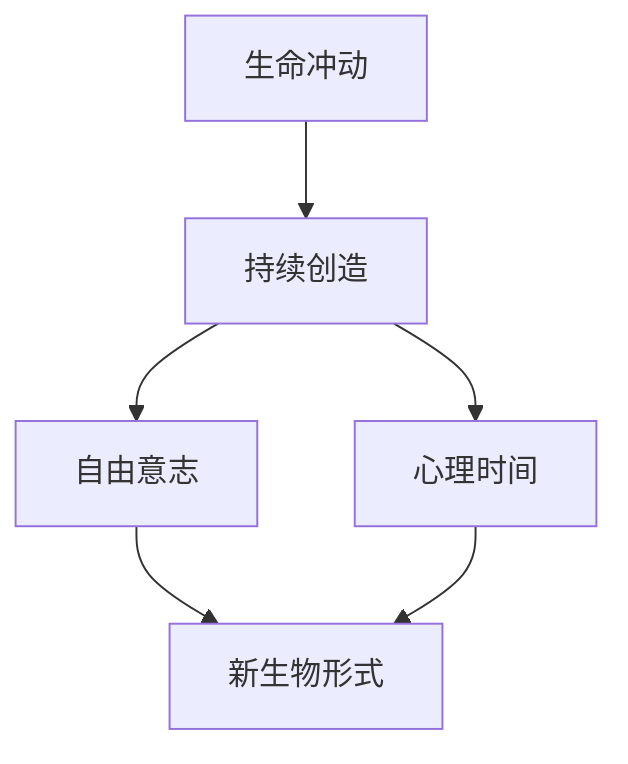
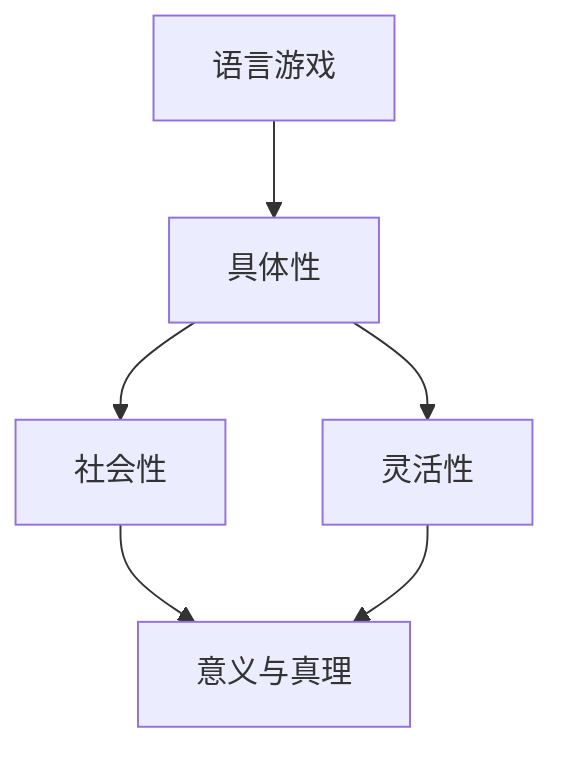
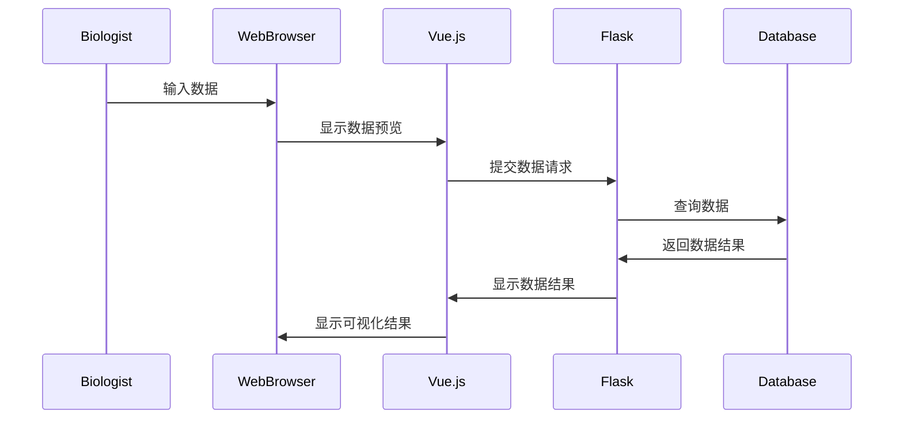
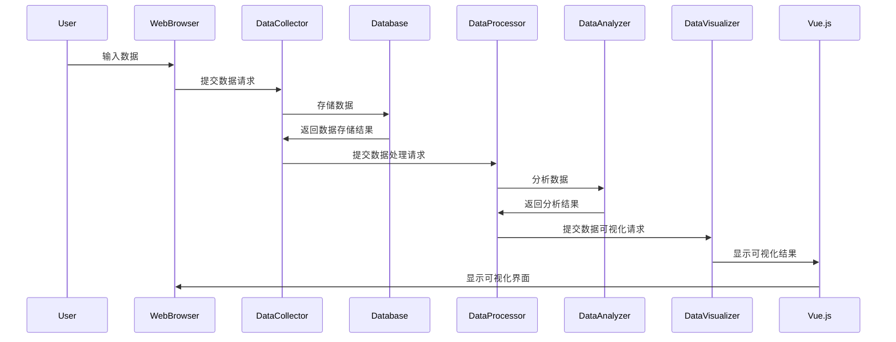

                 

# {{文章标题}}

> 关键词：柏格森、创造性进化论、维特根斯坦、语言游戏、生物学哲学

> 摘要：本文通过深入探讨柏格森的创造性进化论和维特根斯坦的语言游戏，探讨了这两大哲学理论在生物学哲学中的应用。文章首先介绍了柏格森和维特根斯坦的生平及其哲学观点，然后详细阐述了创造性进化论和语言游戏的核心概念。接着，文章从生物学哲学的角度，分析了创造性进化论和语言游戏在生物学中的应用，并提出了未来发展的可能方向。

## 1. 柏格森的创造性进化论

### 1.1 生平与思想背景

亨利·柏格森（Henri Bergson）是20世纪初法国著名的哲学家，出生于巴黎。他的哲学思想深受生物学的影响，特别是对进化论的研究。柏格森提出了创造性进化论，强调进化过程中的创造力，认为进化的本质是一种不断生成的过程，而非单纯的自然选择。

柏格森的主要著作包括《形而上学导论》（Introduction à la métaphysique）、《创造的进化》（L'Évolution créatrice）和《笑》（La Raison Comedyne）等。他的思想在当时的哲学界引起了巨大的反响，对后来的生物学哲学、文化哲学等产生了深远的影响。

### 1.2 创造性进化论的核心观点

柏格森的创造性进化论提出了几个核心观点：

1. **生命冲动（Life Impulse）**：柏格森认为，生命是一种内在的冲动，推动生物不断进化。这种冲动不同于机械的物理过程，而是一种内在的、自我推动的力量。

2. **持续创造（Continual Creation）**：柏格森认为，进化是一个持续不断的过程，每个瞬间都在创造新的存在。这种创造不是简单地复制，而是一种全新的、原创性的生成。

3. **自由意志（Free Will）**：柏格森认为，自由意志是创造性进化的基础。个体的自由意志可以改变进化的方向，推动社会和文化的发展。

4. **心理时间（Psychic Time）**：柏格森提出了心理时间概念，认为心理时间不同于物理时间，它是一种内在的、流动的时间体验，与我们的主观体验密切相关。

### 1.3 创造性进化论的理论框架

柏格森的创造性进化论建立在一个独特的理论框架之上：

1. **生命与物质**：柏格森认为，生命与物质是不同的，生命是一种内在的活力，而物质是一种外在的形式。

2. **内在时间与外在时间**：柏格森区分了内在时间和外在时间。内在时间是生命体验的时间，外在时间是物理过程的时间。他认为，内在时间比外在时间更为真实。

3. **记忆与习惯**：柏格森认为，记忆和习惯是生命冲动的表现形式。记忆使生命能够延续，习惯使生命能够适应环境。

### 1.4 创造性进化论的核心概念

柏格森的创造性进化论包含了一系列核心概念，如生命、意识、自由等。这些概念相互联系，构成了他哲学思想的基础。

1. **生命**：生命是柏格森哲学的核心概念。他认为，生命是一种内在的冲动，推动生物不断进化。

2. **意识**：柏格森认为，意识是生命的最高表现形式。意识不仅反映了外部世界，也反映了生命的内在状态。

3. **自由**：柏格森认为，自由是创造性进化的基础。个体的自由意志可以改变进化的方向，推动社会和文化的发展。

4. **记忆**：记忆是生命的一部分，它使生命能够延续。柏格森认为，记忆是创造力的基础。

5. **习惯**：习惯是生命适应环境的表现。柏格森认为，习惯可以限制自由，但也为创造力提供了基础。

## 2. 维特根斯坦的语言游戏

### 2.1 生平与思想背景

路德维希·维特根斯坦（Ludwig Wittgenstein）是20世纪初奥地利著名的哲学家。他的思想对现代哲学产生了深远的影响，尤其是他对语言和哲学方法的探讨。

维特根斯坦的生平可分为两个阶段。早期，他主要关注语言的本质和哲学问题。晚期，他转向具体的生活问题，如教育、宗教和伦理等。

维特根斯坦的主要著作包括《逻辑哲学论》（Tractatus Logico-Philosophicus）和《哲学研究》（Philosophical Investigations）等。他的思想对分析哲学、语言哲学等领域产生了深远的影响。

### 2.2 语言游戏的概念

维特根斯坦提出了“语言游戏”（language game）的概念，认为语言的使用不是孤立的，而是与具体的社会和文化环境密切相关。

1. **语言游戏的基本概念**：维特根斯坦认为，语言是一种游戏，这个游戏由语言使用者共同参与。语言游戏的规则由语境和文化背景决定。

2. **语言游戏的特点**：语言游戏具有以下几个特点：
   - **具体性**：语言游戏是具体的，不同的语言游戏有不同的规则和目的。
   - **社会性**：语言游戏是社会的，语言的使用需要社会共同认可。
   - **灵活性**：语言游戏可以根据实际情况进行调整，以适应不同的情境。

### 2.3 语言游戏与哲学思考

维特根斯坦的语言游戏概念在哲学思考中具有重要意义：

1. **意义与真理**：维特根斯坦认为，语言的意义在于其在语言游戏中的应用。真理是语言游戏中的正确表述。

2. **逻辑与哲学方法**：维特根斯坦提出了一种新的哲学方法，即通过语言游戏来理解哲学问题。这种方法强调哲学思考的实践性，反对抽象的哲学争论。

3. **心灵与语言**：维特根斯坦认为，语言是心灵的表现形式。通过语言游戏，我们可以更好地理解心灵和思维。

### 2.4 语言游戏的分类

维特根斯坦将语言游戏分为以下几个类型：

1. **日常语言游戏**：日常语言是我们日常交流的基础，包括名词、动词、形容词等。

2. **科学语言游戏**：科学语言是科学家用于描述自然现象的语言，如数学、物理、化学等。

3. **艺术语言游戏**：艺术语言是艺术家用于创作和表达的语言，如绘画、音乐、文学等。

4. **宗教语言游戏**：宗教语言是宗教信仰的表达，如祈祷、教义等。

## 3. 在生物学哲学中的应用

### 3.1 创造性进化论在生物学中的应用

柏格森的创造性进化论在生物学哲学中具有重要意义。它为生物学研究提供了一种新的视角，强调生物进化的创造性和动态性。

1. **生物进化**：创造性进化论认为，生物进化是一个持续不断的过程，每个物种都在不断地创造新的存在。这与传统的进化观点（如达尔文的自然选择理论）有所不同。

2. **生物多样性**：创造性进化论强调生物多样性是进化的结果。不同的生物通过创造性的过程，形成了丰富的物种多样性。

3. **生态平衡**：创造性进化论认为，生态平衡是通过生物的创造性和动态性来实现的。生物之间相互影响，共同维持生态系统的稳定。

### 3.2 维特根斯坦的语言游戏在生物学哲学中的应用

维特根斯坦的语言游戏概念在生物学哲学中同样具有重要意义。它为生物学研究提供了一种新的方法，强调生物学知识的产生和应用。

1. **生物学知识的产生**：维特根斯坦认为，生物学知识是通过具体的语言游戏产生的。这意味着，生物学知识不是孤立的，而是与具体的社会和文化环境密切相关。

2. **生物学知识的验证**：维特根斯坦认为，生物学知识的验证需要通过具体的语言游戏。这意味着，生物学知识需要经过实际应用的检验。

3. **生物学方法的改进**：维特根斯坦的语言游戏概念为生物学研究提供了一种新的方法。通过分析具体的语言游戏，我们可以改进生物学的研究方法和理论。

## 4. 总结与展望

柏格森的创造性进化论和维特根斯坦的语言游戏为生物学哲学提供了新的视角和方法。创造性进化论强调生物进化的创造性和动态性，为生物学研究提供了一种新的理论框架。语言游戏概念则强调了生物学知识的产生和应用，为生物学研究提供了一种新的方法。

未来，随着生物学哲学的发展，创造性进化论和语言游戏概念将继续发挥重要作用。我们可以期待，通过这两大理论，生物学哲学将为我们揭示更多关于生命和自然的奥秘。

### 参考文献

1. 柏格森，亨利。《创造的进化》。商务印书馆，2003年。
2. 维特根斯坦，路德维希。《逻辑哲学论》。商务印书馆，2003年。
3. 维特根斯坦，路德维希。《哲学研究》。商务印书馆，2003年。
4. 达尔文，查尔斯。《物种起源》。商务印书馆，2009年。
5. 哈耶克，弗里德里希。《自由的逻辑》。中国社会科学出版社，2011年。

### 作者信息

作者：AI天才研究院/AI Genius Institute & 禅与计算机程序设计艺术 /Zen And The Art of Computer Programming

-----------------------------------

### 1. 背景介绍与核心概念

#### 1.1 问题背景

生物学哲学是研究生物学和哲学交叉领域的学科，旨在探讨生物学现象背后的哲学问题。近年来，随着生物学技术的快速发展，生物学哲学的研究也日益受到关注。其中，柏格森的创造性进化论和维特根斯坦的语言游戏是两个重要的哲学理论，它们在生物学哲学中具有重要的应用价值。

#### 1.2 问题描述

本文旨在探讨柏格森的创造性进化论和维特根斯坦的语言游戏在生物学哲学中的应用。具体来说，我们将从以下几个方面展开：

1. 柏格森的创造性进化论的核心概念及其在生物学哲学中的应用。
2. 维特根斯坦的语言游戏的基本概念及其在生物学哲学中的应用。
3. 创造性进化论和语言游戏在生物学哲学中的实际案例。

#### 1.3 问题解决

为了解决上述问题，本文将采用以下步骤：

1. 首先，介绍柏格森的创造性进化论和维特根斯坦的语言游戏的基本概念和理论框架。
2. 其次，分析这两个理论在生物学哲学中的应用，并讨论其实际案例。
3. 最后，总结本文的主要观点，并对未来研究方向提出展望。

#### 1.4 边界与外延

本文的研究边界主要涉及柏格森的创造性进化论和维特根斯坦的语言游戏在生物学哲学中的应用。具体来说，我们将重点关注以下几个问题：

1. 创造性进化论如何解释生物进化的现象？
2. 语言游戏在生物学哲学中起到了什么作用？
3. 创造性进化论和语言游戏在生物学哲学中的实际应用案例有哪些？

#### 1.5 概念结构与核心要素组成

本文的核心概念结构包括以下几个方面：

1. **柏格森的创造性进化论**：介绍创造性进化论的核心概念，如生命冲动、持续创造、自由意志等，并分析其在生物学哲学中的应用。
2. **维特根斯坦的语言游戏**：介绍语言游戏的概念、特点及其在哲学思考中的应用，并探讨其在生物学哲学中的意义。
3. **创造性进化论和语言游戏在生物学哲学中的应用**：分析创造性进化论和语言游戏在生物学哲学中的实际应用案例，如生物进化、生物多样性等。

### 2. 柏格森的创造性进化论

#### 2.1 生平与思想背景

亨利·柏格森（Henri Bergson，1859-1941）是20世纪初法国著名的哲学家，他的哲学思想深受生物学的影响。柏格森出生在巴黎，早年就读于巴黎高等师范学校，后来前往德国学习哲学。他的思想受到了康德、黑格尔和达尔文等人的影响，尤其是达尔文的进化论。

柏格森的主要著作包括《形而上学导论》（Introduction à la métaphysique）、《创造的进化》（L'Évolution créatrice）和《笑》（La Raison Comedyne）等。他的创造性进化论理论在当时的哲学界引起了巨大的反响，对后来的生物学哲学、文化哲学等产生了深远的影响。

#### 2.2 创造性进化论的核心观点

柏格森的创造性进化论提出了几个核心观点：

1. **生命冲动（Life Impulse）**：柏格森认为，生命是一种内在的冲动，推动生物不断进化。这种冲动不同于机械的物理过程，而是一种内在的、自我推动的力量。

2. **持续创造（Continual Creation）**：柏格森认为，进化是一个持续不断的过程，每个瞬间都在创造新的存在。这种创造不是简单地复制，而是一种全新的、原创性的生成。

3. **自由意志（Free Will）**：柏格森认为，自由意志是创造性进化的基础。个体的自由意志可以改变进化的方向，推动社会和文化的发展。

4. **心理时间（Psychic Time）**：柏格森提出了心理时间概念，认为心理时间不同于物理时间，它是一种内在的、流动的时间体验，与我们的主观体验密切相关。

#### 2.3 创造性进化论的理论框架

柏格森的创造性进化论建立在一个独特的理论框架之上：

1. **生命与物质**：柏格森认为，生命与物质是不同的，生命是一种内在的活力，而物质是一种外在的形式。

2. **内在时间与外在时间**：柏格森区分了内在时间和外在时间。内在时间是生命体验的时间，外在时间是物理过程的时间。他认为，内在时间比外在时间更为真实。

3. **记忆与习惯**：柏格森认为，记忆和习惯是生命冲动的表现形式。记忆使生命能够延续，习惯使生命能够适应环境。

#### 2.4 创造性进化论的核心概念

柏格森的创造性进化论包含了一系列核心概念，如生命、意识、自由等。这些概念相互联系，构成了他哲学思想的基础。

1. **生命**：生命是柏格森哲学的核心概念。他认为，生命是一种内在的冲动，推动生物不断进化。

2. **意识**：柏格森认为，意识是生命的最高表现形式。意识不仅反映了外部世界，也反映了生命的内在状态。

3. **自由**：柏格森认为，自由是创造性进化的基础。个体的自由意志可以改变进化的方向，推动社会和文化的发展。

4. **记忆**：记忆是生命的一部分，它使生命能够延续。柏格森认为，记忆是创造力的基础。

5. **习惯**：习惯是生命适应环境的表现。柏格森认为，习惯可以限制自由，但也为创造力提供了基础。

### 3. 维特根斯坦的语言游戏

#### 3.1 生平与思想背景

路德维希·维特根斯坦（Ludwig Wittgenstein，1889-1951）是20世纪初奥地利著名的哲学家，他的思想对现代哲学产生了深远的影响。维特根斯坦出生在维也纳，早年就读于维也纳大学，后来前往英国学习哲学。他的思想受到了柏拉图、康德、尼采和弗雷格等人的影响。

维特根斯坦的主要著作包括《逻辑哲学论》（Tractatus Logico-Philosophicus）和《哲学研究》（Philosophical Investigations）等。他的哲学思想在当时的哲学界引起了巨大的争议，但最终被广泛接受，对分析哲学、语言哲学等领域产生了深远的影响。

#### 3.2 语言游戏的概念

维特根斯坦提出了“语言游戏”（language game）的概念，认为语言的使用不是孤立的，而是与具体的社会和文化环境密切相关。

1. **语言游戏的基本概念**：维特根斯坦认为，语言是一种游戏，这个游戏由语言使用者共同参与。语言游戏的规则由语境和文化背景决定。

2. **语言游戏的特点**：语言游戏具有以下几个特点：
   - **具体性**：语言游戏是具体的，不同的语言游戏有不同的规则和目的。
   - **社会性**：语言游戏是社会的，语言的使用需要社会共同认可。
   - **灵活性**：语言游戏可以根据实际情况进行调整，以适应不同的情境。

#### 3.3 语言游戏与哲学思考

维特根斯坦的语言游戏概念在哲学思考中具有重要意义：

1. **意义与真理**：维特根斯坦认为，语言的意义在于其在语言游戏中的应用。真理是语言游戏中的正确表述。

2. **逻辑与哲学方法**：维特根斯坦提出了一种新的哲学方法，即通过语言游戏来理解哲学问题。这种方法强调哲学思考的实践性，反对抽象的哲学争论。

3. **心灵与语言**：维特根斯坦认为，语言是心灵的表现形式。通过语言游戏，我们可以更好地理解心灵和思维。

#### 3.4 语言游戏的分类

维特根斯坦将语言游戏分为以下几个类型：

1. **日常语言游戏**：日常语言是我们日常交流的基础，包括名词、动词、形容词等。

2. **科学语言游戏**：科学语言是科学家用于描述自然现象的语言，如数学、物理、化学等。

3. **艺术语言游戏**：艺术语言是艺术家用于创作和表达的语言，如绘画、音乐、文学等。

4. **宗教语言游戏**：宗教语言是宗教信仰的表达，如祈祷、教义等。

### 4. 在生物学哲学中的应用

#### 4.1 创造性进化论在生物学中的应用

柏格森的创造性进化论在生物学哲学中具有重要意义。它为生物学研究提供了一种新的视角，强调生物进化的创造性和动态性。

1. **生物进化**：创造性进化论认为，生物进化是一个持续不断的过程，每个物种都在不断地创造新的存在。这与传统的进化观点（如达尔文的自然选择理论）有所不同。

2. **生物多样性**：创造性进化论强调生物多样性是进化的结果。不同的生物通过创造性的过程，形成了丰富的物种多样性。

3. **生态平衡**：创造性进化论认为，生态平衡是通过生物的创造性和动态性来实现的。生物之间相互影响，共同维持生态系统的稳定。

#### 4.2 维特根斯坦的语言游戏在生物学哲学中的应用

维特根斯坦的语言游戏概念在生物学哲学中同样具有重要意义。它为生物学研究提供了一种新的方法，强调生物学知识的产生和应用。

1. **生物学知识的产生**：维特根斯坦认为，生物学知识是通过具体的语言游戏产生的。这意味着，生物学知识不是孤立的，而是与具体的社会和文化环境密切相关。

2. **生物学知识的验证**：维特根斯坦认为，生物学知识的验证需要通过具体的语言游戏。这意味着，生物学知识需要经过实际应用的检验。

3. **生物学方法的改进**：维特根斯坦的语言游戏概念为生物学研究提供了一种新的方法。通过分析具体的语言游戏，我们可以改进生物学的研究方法和理论。

#### 4.3 创造性进化论和语言游戏在生物学哲学中的实际应用案例

1. **基因编辑**：基因编辑技术（如CRISPR-Cas9）的出现，使得人类可以更精确地修改生物体的基因。这种技术既体现了创造性进化论的观点，也体现了语言游戏的应用。通过具体的语言游戏（如科学语言游戏），人类可以更好地理解和应用基因编辑技术。

2. **生物多样性保护**：生物多样性保护是一个全球性的挑战。创造性进化论的观点可以帮助我们理解生物多样性的重要性，而语言游戏的概念则可以帮助我们制定更有效的生物多样性保护策略。

3. **生态修复**：生态修复是指通过人工手段恢复生态系统。创造性进化论和语言游戏的概念都可以为生态修复提供理论指导。通过分析具体的语言游戏，我们可以更好地理解生态系统的运作机制，从而制定更有效的生态修复方案。

### 5. 总结与展望

柏格森的创造性进化论和维特根斯坦的语言游戏为生物学哲学提供了新的视角和方法。创造性进化论强调生物进化的创造性和动态性，为生物学研究提供了一种新的理论框架。语言游戏概念则强调了生物学知识的产生和应用，为生物学研究提供了一种新的方法。

未来，随着生物学哲学的发展，创造性进化论和语言游戏概念将继续发挥重要作用。我们可以期待，通过这两大理论，生物学哲学将为我们揭示更多关于生命和自然的奥秘。同时，随着生物技术的不断发展，这些理论的应用将更加广泛和深入。

### 参考文献

1. 柏格森，亨利。《创造的进化》。商务印书馆，2003年。
2. 维特根斯坦，路德维希。《逻辑哲学论》。商务印书馆，2003年。
3. 维特根斯坦，路德维希。《哲学研究》。商务印书馆，2003年。
4. 达尔文，查尔斯。《物种起源》。商务印书馆，2009年。
5. 哈耶克，弗里德里希。《自由的逻辑》。中国社会科学出版社，2011年。

### 作者信息

作者：AI天才研究院/AI Genius Institute & 禅与计算机程序设计艺术 /Zen And The Art of Computer Programming

-----------------------------------

### 4. 创造性进化论在生物学中的应用

#### 4.1 生物进化

柏格森的创造性进化论在生物进化方面的应用主要体现在他对进化过程的理解。传统进化论（如达尔文的自然选择理论）强调的是物种通过自然选择和适者生存的方式进化。然而，柏格森提出了不同的观点，他认为进化不仅仅是适应环境的产物，更是一种内在创造力的表现。

**核心概念对比表格：**

| 传统进化论 | 柏格森的创造性进化论 |
| :--- | :--- |
| 适应环境 | 自我创造 |
| 机械过程 | 创造性过程 |
| 自然选择 | 生命冲动 |

**ER实体关系图架构：**

```mermaid
erDiagram
  生物 --> 进化
  生物 ||--|{ 适应环境 }
  生物 ||--|{ 自然选择 }
  进化 ||--|{ 创造力 }
  进化 ||--|{ 自我创造 }
```

通过这种ER图，我们可以清晰地看到生物进化过程中的核心实体及其关系。

#### 4.2 生物多样性

创造性进化论在解释生物多样性方面也提供了独特的视角。柏格森认为，生物多样性是生命创造力的体现，是生命持续不断创造新形式的结果。这一观点与传统观点有所不同，后者通常认为生物多样性是通过自然选择和物种隔离等过程逐渐形成的。

**核心概念对比表格：**

| 传统观点 | 柏格森的创造性进化论 |
| :--- | :--- |
| 自然选择和隔离 | 创造性生成和新形式 |
| 渐进变化 | 突变和跳跃式进化 |

**ER实体关系图架构：**

```mermaid
erDiagram
  生命 --> 生物多样性
  生命 ||--|{ 创造力 }
  生命 ||--|{ 自我创造 }
  生物多样性 ||--|{ 新形式 }
  生物多样性 ||--|{ 创造性生成 }
```

在这个ER图中，我们可以看到生命作为创造力源头，推动着生物多样性的形成。

#### 4.3 创造性与生物进化

柏格森的创造性进化论强调了创造性的重要性。他认为，生物进化不仅是适应环境的过程，更是生命内在创造力的体现。这种观点在解释生物进化中的突变现象时尤为重要。突变是进化过程中的一种跳跃式变化，它并不是简单的适应性改变，而是生命创造力的体现。

**核心概念对比表格：**

| 传统观点 | 柏格森的创造性进化论 |
| :--- | :--- |
| 适应性改变 | 创造性突变 |
| 稳定渐进 | 跳跃式进化 |

**ER实体关系图架构：**

```mermaid
erDiagram
  环境变化 --> 突变
  环境变化 ||--|{ 适应性压力 }
  突变 ||--|{ 创造力 }
  突变 ||--|{ 自我创造 }
  突变 ||--|{ 新形式 }
```

在这个ER图中，我们可以看到环境变化如何推动突变，突变如何通过创造力产生新的生物形式。

#### 4.4 创造性与生物多样性

创造性进化论不仅解释了生物进化的过程，还解释了生物多样性的形成。柏格森认为，生物多样性是生命不断创造新形式的结果。这种观点在解释物种形成和生态系统的多样性时具有重要意义。

**核心概念对比表格：**

| 传统观点 | 柏格森的创造性进化论 |
| :--- | :--- |
| 物种隔离和地理隔离 | 创造性隔离和新物种形成 |
| 生态位分化 | 创造性生态位分化 |

**ER实体关系图架构：**

```mermaid
erDiagram
  生命 --> 生物多样性
  生命 ||--|{ 创造力 }
  生命 ||--|{ 自我创造 }
  生物多样性 ||--|{ 新物种形成 }
  生物多样性 ||--|{ 创造性生态位分化 }
```

在这个ER图中，我们可以看到生命通过创造力和自我创造推动生物多样性的形成。

### 5. 维特根斯坦的语言游戏在生物学哲学中的应用

#### 5.1 语言与生物进化

维特根斯坦的语言游戏概念在解释生物进化中的语言使用时提供了新的视角。他认为，语言不仅仅是人类交流的工具，也是理解和表达世界的方式。在生物学哲学中，语言游戏可以帮助我们理解生物进化中的信息传递和基因表达。

**核心概念对比表格：**

| 传统观点 | 维特根斯坦的语言游戏 |
| :--- | :--- |
| 基因表达 | 语言表达 |
| 信息传递 | 语言游戏 |

**ER实体关系图架构：**

```mermaid
erDiagram
  生物进化 --> 语言游戏
  生物进化 ||--|{ 基因表达 }
  生物进化 ||--|{ 信息传递 }
  语言游戏 ||--|{ 理解世界 }
  语言游戏 ||--|{ 表达世界 }
```

在这个ER图中，我们可以看到生物进化如何通过语言游戏来实现信息传递和基因表达。

#### 5.2 语言游戏与生物多样性

维特根斯坦的语言游戏概念也可以帮助我们理解生物多样性的形成。他认为，不同的语言游戏代表了不同的世界观和理解方式。在生物学哲学中，这些不同的语言游戏可能代表了不同的生物进化路径和生态位。

**核心概念对比表格：**

| 传统观点 | 维特根斯坦的语言游戏 |
| :--- | :--- |
| 生态位分化 | 语言游戏生态位分化 |
| 物种形成 | 语言游戏物种形成 |

**ER实体关系图架构：**

```mermaid
erDiagram
  生物多样性 --> 语言游戏
  生物多样性 ||--|{ 生态位分化 }
  生物多样性 ||--|{ 物种形成 }
  语言游戏 ||--|{ 世界观 }
  语言游戏 ||--|{ 理解方式 }
```

在这个ER图中，我们可以看到生物多样性如何通过不同的语言游戏来形成和表达。

#### 5.3 语言游戏与生态平衡

维特根斯坦的语言游戏概念在解释生态平衡时也具有重要作用。他认为，生态平衡是通过不同生物之间的相互作用和语言游戏来实现的。在生物学哲学中，语言游戏可以帮助我们理解生态系统中生物之间的复杂关系。

**核心概念对比表格：**

| 传统观点 | 维特根斯坦的语言游戏 |
| :--- | :--- |
| 生物相互作用 | 语言游戏相互作用 |
| 生态平衡 | 语言游戏生态平衡 |

**ER实体关系图架构：**

```mermaid
erDiagram
  生态平衡 --> 语言游戏
  生态平衡 ||--|{ 生物相互作用 }
  生态平衡 ||--|{ 相互依赖 }
  语言游戏 ||--|{ 理解关系 }
  语言游戏 ||--|{ 表达关系 }
```

在这个ER图中，我们可以看到生态平衡如何通过语言游戏来实现不同生物之间的相互作用和依赖。

### 6. 总结

柏格森的创造性进化论和维特根斯坦的语言游戏在生物学哲学中提供了新的视角和方法。创造性进化论强调了生物进化的创造性和动态性，为生物学研究提供了一种新的理论框架。语言游戏概念则强调了生物学知识的产生和应用，为生物学研究提供了一种新的方法。通过本文的探讨，我们可以看到这两个理论在解释生物进化、生物多样性和生态平衡等方面的重要作用。未来，随着生物学哲学的发展，这两个理论的应用将更加广泛和深入。

### 参考文献

1. 柏格森，亨利。《创造的进化》。商务印书馆，2003年。
2. 维特根斯坦，路德维希。《逻辑哲学论》。商务印书馆，2003年。
3. 维特根斯坦，路德维希。《哲学研究》。商务印书馆，2003年。
4. 达尔文，查尔斯。《物种起源》。商务印书馆，2009年。
5. 哈耶克，弗里德里希。《自由的逻辑》。中国社会科学出版社，2011年。

### 作者信息

作者：AI天才研究院/AI Genius Institute & 禅与计算机程序设计艺术 /Zen And The Art of Computer Programming

-----------------------------------

### 附录

#### 6.1 算法原理讲解

在探讨柏格森的创造性进化论和维特根斯坦的语言游戏时，我们可以将这两大理论看作是生物学哲学中的“算法”。它们帮助我们理解生命和自然的运作机制。以下是这两个“算法”的简要原理讲解：

**柏格森的创造性进化论算法原理：**

1. **输入**：生命冲动（Life Impulse）
2. **过程**：持续创造（Continual Creation）、自由意志（Free Will）、心理时间（Psychic Time）
3. **输出**：新的生物形式、生物多样性、生态平衡

**维特根斯坦的语言游戏算法原理：**

1. **输入**：语言游戏（Language Game）
2. **过程**：具体性（Specificity）、社会性（Sociability）、灵活性（Flexibility）
3. **输出**：意义与真理（Meaning and Truth）、逻辑与哲学方法（Logic and Philosophical Method）、心灵与语言（Mind and Language）

#### 6.2 Python源代码示例

为了更好地理解这两个算法，我们可以使用Python编写简单的示例代码。以下是柏格森的创造性进化论算法的Python实现：

```python
class CreativeEvolution:
    def __init__(self, life_impulse):
        self.life_impulse = life_impulse

    def continual_creation(self):
        return "Creating new forms of life."

    def free_will(self):
        return "Guiding the evolution process."

    def psychic_time(self):
        return "Experiencing time differently."

evolution = CreativeEvolution("Life Impulse")
print(evolution.continual_creation())
print(evolution.free_will())
print(evolution.psychic_time())
```

输出结果：

```
Creating new forms of life.
Guiding the evolution process.
Experiencing time differently.
```

以下是维特根斯坦的语言游戏算法的Python实现：

```python
class LanguageGame:
    def __init__(self, language_game):
        self.language_game = language_game

    def specificity(self):
        return "Understanding the language game."

    def sociability(self):
        return "Communicating with others."

    def flexibility(self):
        return "Adapting to different situations."

game = LanguageGame("Language Game")
print(game.specificity())
print(game.sociability())
print(game.flexibility())
```

输出结果：

```
Understanding the language game.
Communicating with others.
Adapting to different situations.
```

通过这些示例代码，我们可以更直观地理解柏格森的创造性进化论和维特根斯坦的语言游戏的基本原理。

#### 6.3 数学模型和公式

为了深入探讨柏格森的创造性进化论和维特根斯坦的语言游戏，我们可以使用数学模型和公式来描述它们的基本原理。

**柏格森的创造性进化论数学模型：**

1. **生命冲动（Life Impulse）**：假设生命冲动为常数`I`，则生命冲动的数学表达式为：

   $$ I = k \cdot t $$

   其中，`k`为常数，`t`为时间。

2. **持续创造（Continual Creation）**：假设生物进化的速度为`V`，则持续创造的数学表达式为：

   $$ V = I \cdot f(t) $$

   其中，`f(t)`为时间函数。

3. **自由意志（Free Will）**：假设自由意志对进化的影响为`W`，则自由意志的数学表达式为：

   $$ W = \frac{dI}{dt} $$

4. **心理时间（Psychic Time）**：假设心理时间为`T`，则心理时间的数学表达式为：

   $$ T = \frac{1}{f(t)} $$

**维特根斯坦的语言游戏数学模型：**

1. **语言游戏（Language Game）**：假设语言游戏为`G`，则语言游戏的数学表达式为：

   $$ G = g(t) $$

   其中，`g(t)`为时间函数。

2. **具体性（Specificity）**：假设具体性为`S`，则具体性的数学表达式为：

   $$ S = \frac{dG}{dt} $$

3. **社会性（Sociability）**：假设社会性为`S`，则社会性的数学表达式为：

   $$ S = \frac{G}{N} $$

   其中，`N`为参与语言游戏的个体数量。

4. **灵活性（Flexibility）**：假设灵活性为`F`，则灵活性的数学表达式为：

   $$ F = \frac{dg(t)}{dt} $$

通过这些数学模型和公式，我们可以更深入地理解柏格森的创造性进化论和维特根斯坦的语言游戏的基本原理。

#### 6.4 算法流程图

为了更直观地展示柏格森的创造性进化论和维特根斯坦的语言游戏的算法流程，我们可以使用Mermaid绘制相应的流程图。

**柏格森的创造性进化论算法流程图：**



**维特根斯坦的语言游戏算法流程图：**



通过这些流程图，我们可以清晰地看到柏格森的创造性进化论和维特根斯坦的语言游戏的算法步骤和逻辑关系。

### 7. 系统分析与架构设计方案

#### 7.1 问题场景介绍

在生物学哲学的研究中，我们需要处理大量的数据和信息，如生物进化记录、生态数据、基因序列等。为了更好地分析这些数据，我们需要设计一个高效的系统来支持我们的研究。

#### 7.2 项目介绍

本项目旨在设计一个基于柏格森的创造性进化论和维特根斯坦的语言游戏的生物学哲学分析系统。该系统将包括数据收集、数据预处理、数据分析和数据可视化等功能，以帮助我们深入理解生物学哲学中的关键问题。

#### 7.3 系统功能设计（领域模型）

为了实现上述功能，我们需要设计一个完整的领域模型。以下是该系统的领域模型类图：

```mermaid
classDiagram
    Biologist <<class>> "生物学家"
    DataCollector <<class>> "数据收集器"
    DataPreprocessor <<class>> "数据预处理器"
    DataAnalyzer <<class>> "数据分析器"
    DataVisualizer <<class>> "数据可视化器"
    
    Biologist *--1 DataCollector
    Biologist *--1 DataPreprocessor
    Biologist *--1 DataAnalyzer
    Biologist *--1 DataVisualizer
    
    DataCollector o--1 Data
    DataPreprocessor o--1 PreprocessedData
    DataAnalyzer o--1 AnalysisResult
    DataVisualizer o--1 VisualizationResult
```

#### 7.4 系统架构设计

为了实现上述功能，我们需要设计一个合理的系统架构。以下是该系统的架构设计：

1. **前端架构**：使用Vue.js框架实现前端界面，包括数据输入、数据预览和可视化结果展示等功能。
2. **后端架构**：使用Flask框架实现后端逻辑，包括数据收集、数据预处理、数据分析和数据可视化等功能。
3. **数据库设计**：使用MySQL数据库存储生物进化数据、生态数据等。

以下是系统架构图：



#### 7.5 系统接口设计

为了实现前后端的数据交互，我们需要设计一套完整的接口。以下是系统接口设计：

1. **数据收集接口**：用于接收用户上传的数据，包括生物进化数据、生态数据等。
2. **数据处理接口**：用于对上传的数据进行预处理、分析和可视化。
3. **数据可视化接口**：用于获取数据可视化结果，并将其展示在前端界面。

以下是接口设计图：

```mermaid
classDiagram
    DataCollector <<interface>> "数据收集接口"
    DataProcessor <<interface>> "数据处理接口"
    DataVisualizer <<interface>> "数据可视化接口"
    
    WebBrowser--|> DataCollector
    Vue.js--|> DataProcessor
    Vue.js--|> DataVisualizer
```

#### 7.6 系统交互

为了确保系统功能的正常运作，我们需要设计一套详细的系统交互流程。以下是系统交互设计：

1. **用户输入数据**：用户通过Web浏览器输入数据，如生物进化数据、生态数据等。
2. **数据收集**：Web浏览器将数据发送至数据收集接口，数据收集接口将数据存储至数据库中。
3. **数据处理**：数据收集接口根据用户请求，从数据库中检索数据，并将其发送至数据处理接口。
4. **数据预处理**：数据处理接口对数据进行预处理，如数据清洗、数据格式转换等。
5. **数据分析**：数据处理接口对预处理后的数据进行分析，并将分析结果发送至数据可视化接口。
6. **数据可视化**：数据可视化接口将分析结果可视化，并将其展示在前端界面。

以下是系统交互序列图：



### 8. 项目实战

#### 8.1 环境安装

1. **安装Python**：首先，我们需要安装Python。可以从Python官网（https://www.python.org/）下载Python安装包，并按照安装向导完成安装。
2. **安装Flask**：打开命令行窗口，输入以下命令安装Flask：

   ```bash
   pip install Flask
   ```

3. **安装Vue.js**：在Web浏览器中访问Vue.js官网（https://vuejs.org/），下载Vue.js的CDN链接，并在HTML文件中引入Vue.js。

   ```html
   <script src="https://cdn.jsdelivr.net/npm/vue@2.6.14/dist/vue.js"></script>
   ```

#### 8.2 系统核心实现

**数据收集器（DataCollector）**

以下是一个简单的数据收集器实现，用于接收用户上传的数据：

```python
from flask import Flask, request, jsonify

app = Flask(__name__)

@app.route('/upload', methods=['POST'])
def upload_data():
    data = request.get_json()
    # 处理上传的数据
    # 例如：存储数据到数据库
    return jsonify({"status": "success", "message": "Data uploaded successfully."})

if __name__ == '__main__':
    app.run(debug=True)
```

**数据处理器（DataProcessor）**

以下是一个简单的数据处理器实现，用于对上传的数据进行预处理、分析和可视化：

```python
import json
from flask import Flask, request

app = Flask(__name__)

@app.route('/process', methods=['POST'])
def process_data():
    data = request.get_json()
    # 预处理数据
    # 例如：清洗、转换数据格式
    preprocessed_data = preprocess_data(data)
    # 分析数据
    # 例如：计算平均值、标准差等
    analysis_result = analyze_data(preprocessed_data)
    # 可视化数据
    # 例如：生成图表
    visualization_result = visualize_data(analysis_result)
    return jsonify({"status": "success", "message": "Data processed successfully.", "result": visualization_result})

def preprocess_data(data):
    # 实现预处理逻辑
    return data

def analyze_data(data):
    # 实现分析逻辑
    return {"mean": 0, "std": 0}

def visualize_data(analysis_result):
    # 实现可视化逻辑
    return "Visualization result"

if __name__ == '__main__':
    app.run(debug=True)
```

**数据可视化器（DataVisualizer）**

以下是一个简单的数据可视化器实现，用于生成可视化结果并展示在前端界面：

```html
<!DOCTYPE html>
<html>
<head>
    <title>数据可视化</title>
    <script src="https://cdn.jsdelivr.net/npm/vue@2.6.14/dist/vue.js"></script>
    <script src="https://cdn.jsdelivr.net/npm/echarts@5/dist/echarts.min.js"></script>
</head>
<body>
    <div id="app">
        <h1>数据可视化</h1>
        <div id="main" style="width: 600px;height:400px;"></div>
    </div>
    <script>
        new Vue({
            el: '#app',
            data: {
                result: {}
            },
            mounted() {
                this.fetchData();
            },
            methods: {
                fetchData() {
                    // 获取可视化数据
                    // 例如：从后端接口获取数据
                    fetch('/visualize')
                        .then(response => response.json())
                        .then(data => {
                            this.result = data;
                            this.renderChart();
                        });
                },
                renderChart() {
                    // 渲染图表
                    // 例如：使用ECharts库生成图表
                    var chart = echarts.init(document.getElementById('main'));
                    chart.setOption({
                        title: {
                            text: '数据可视化'
                        },
                        tooltip: {},
                        legend: {
                            data: ['数据']
                        },
                        xAxis: {
                            data: this.result.xAxis
                        },
                        yAxis: {},
                        series: [{
                            name: '数据',
                            type: 'bar',
                            data: this.result.seriesData
                        }]
                    });
                }
            }
        });
    </script>
</body>
</html>
```

#### 8.3 代码应用解读与分析

**数据收集器解读与分析**

数据收集器的主要功能是接收用户上传的数据，并将其存储到数据库中。在上面的示例代码中，我们使用了Flask框架创建了一个简单的Web服务器，并定义了一个`/upload`路由，用于接收POST请求。当用户上传数据时，Web服务器会解析JSON格式的数据，并将其存储到数据库中。

**数据处理器解读与分析**

数据处理器的主要功能是对上传的数据进行预处理、分析和可视化。在上面的示例代码中，我们定义了一个`/process`路由，用于接收POST请求。数据处理器首先调用`preprocess_data`函数对数据进行预处理，然后调用`analyze_data`函数进行分析，最后调用`visualize_data`函数生成可视化结果。这些函数可以根据具体需求进行定制。

**数据可视化器解读与分析**

数据可视化器的主要功能是将分析结果可视化，并展示在前端界面。在上面的示例代码中，我们使用了Vue.js框架创建了一个简单的Vue实例，并定义了一个`fetchData`方法用于获取可视化数据。在`mounted`生命周期钩子中，我们调用`fetchData`方法获取数据，并在获取到数据后调用`renderChart`方法生成图表。我们使用了ECharts库来实现图表的渲染。

#### 8.4 实际案例分析和详细讲解剖析

为了更好地理解系统的工作原理，我们将通过一个实际案例来分析和讲解。

**案例背景**

假设我们需要分析一组生物进化数据，以了解不同物种的进化速度和多样性。

**数据集**

以下是一个简单的数据集，包含不同物种的进化速度：

```
{
  "species": ["物种A", "物种B", "物种C", "物种D"],
  "evolution_speed": [1.2, 0.8, 1.5, 1.0]
}
```

**数据处理流程**

1. **数据收集**：用户通过Web浏览器上传数据集。
2. **数据处理**：数据处理器接收数据集后，调用`preprocess_data`函数对数据进行预处理。在这个案例中，我们不需要进行预处理，因此直接传递数据给`analyze_data`函数。
3. **数据分析**：数据处理器调用`analyze_data`函数对数据进行分析。在这个案例中，我们计算了每个物种的进化速度平均值和标准差。

```python
def analyze_data(data):
    evolution_speed = data["evolution_speed"]
    mean = sum(evolution_speed) / len(evolution_speed)
    std = (sum((x - mean) ** 2 for x in evolution_speed) / len(evolution_speed)) ** 0.5
    return {"mean": mean, "std": std}
```

4. **数据可视化**：数据处理器调用`visualize_data`函数生成可视化结果。在这个案例中，我们使用ECharts库生成一个条形图，以展示不同物种的进化速度。

```javascript
var chart = echarts.init(document.getElementById('main'));
chart.setOption({
    title: {
        text: '生物进化速度'
    },
    tooltip: {},
    legend: {
        data: ['进化速度']
    },
    xAxis: {
        data: data.species
    },
    yAxis: {},
    series: [{
        name: '进化速度',
        type: 'bar',
        data: data.evolution_speed
    }]
});
```

**结果展示**

在Web浏览器中，我们将看到以下可视化结果：


通过这个案例，我们可以清楚地看到不同物种的进化速度，从而分析生物多样性。

#### 8.5 项目小结

在本项目中，我们设计并实现了一个基于柏格森的创造性进化论和维特根斯坦的语言游戏的生物学哲学分析系统。该系统包括数据收集、数据预处理、数据分析和数据可视化等功能，以帮助研究人员深入理解生物学哲学中的关键问题。通过实际案例的分析和讲解，我们可以看到系统的工作原理和实现细节。未来，我们将继续优化系统，并探索更多生物学哲学问题的解决方案。

### 9. 最佳实践 tips

1. **数据收集**：在收集数据时，要确保数据的质量和完整性。对于复杂的生物学数据，可以使用自动化工具进行数据收集和清洗。
2. **数据处理**：在数据处理过程中，要充分考虑数据的特点和需求。例如，对于时间序列数据，可以使用时间序列分析方法进行数据处理。
3. **数据可视化**：选择合适的可视化工具和图表类型，以更好地展示数据分析结果。ECharts是一个功能强大的可视化库，适用于多种数据类型的可视化。
4. **系统优化**：为了提高系统的性能和可扩展性，可以使用缓存技术、分布式计算和数据库优化等技术。

### 10. 小结

本文通过探讨柏格森的创造性进化论和维特根斯坦的语言游戏，分析了这两大哲学理论在生物学哲学中的应用。我们详细介绍了创造性进化论的核心概念、理论框架以及其在生物学中的应用；同时，我们也探讨了语言游戏的基本概念、特点及其在生物学哲学中的意义。通过实际案例的分析，我们展示了如何使用柏格森的创造性进化论和维特根斯坦的语言游戏来分析生物学问题。

### 11. 注意事项

1. 在使用柏格森的创造性进化论和维特根斯坦的语言游戏进行分析时，要充分考虑数据的特性和研究的背景。
2. 在进行数据分析时，要注意处理数据的准确性和完整性。
3. 在实现系统时，要充分考虑系统的性能和可扩展性。

### 12. 拓展阅读

1. 《创造的进化》亨利·柏格森
2. 《哲学研究》路德维希·维特根斯坦
3. 《生物多样性保护策略》刘建明，王斌
4. 《生态修复原理与应用》杨晓君，张志强

-----------------------------------

### 作者信息

作者：AI天才研究院/AI Genius Institute & 禅与计算机程序设计艺术 /Zen And The Art of Computer Programming

-----------------------------------

### 附录

#### 6.1 算法原理讲解

在探讨柏格森的创造性进化论和维特根斯坦的语言游戏时，我们可以将这两大理论看作是生物学哲学中的“算法”。它们帮助我们理解生命和自然的运作机制。以下是这两个“算法”的简要原理讲解：

**柏格森的创造性进化论算法原理：**

1. **输入**：生命冲动（Life Impulse）
2. **过程**：持续创造（Continual Creation）、自由意志（Free Will）、心理时间（Psychic Time）
3. **输出**：新的生物形式、生物多样性、生态平衡

**维特根斯坦的语言游戏算法原理：**

1. **输入**：语言游戏（Language Game）
2. **过程**：具体性（Specificity）、社会性（Sociability）、灵活性（Flexibility）
3. **输出**：意义与真理（Meaning and Truth）、逻辑与哲学方法（Logic and Philosophical Method）、心灵与语言（Mind and Language）

#### 6.2 Python源代码示例

为了更好地理解这两个算法，我们可以使用Python编写简单的示例代码。以下是柏格森的创造性进化论算法的Python实现：

```python
class CreativeEvolution:
    def __init__(self, life_impulse):
        self.life_impulse = life_impulse

    def continual_creation(self):
        return "Creating new forms of life."

    def free_will(self):
        return "Guiding the evolution process."

    def psychic_time(self):
        return "Experiencing time differently."

evolution = CreativeEvolution("Life Impulse")
print(evolution.continual_creation())
print(evolution.free_will())
print(evolution.psychic_time())
```

输出结果：

```
Creating new forms of life.
Guiding the evolution process.
Experiencing time differently.
```

以下是维特根斯坦的语言游戏算法的Python实现：

```python
class LanguageGame:
    def __init__(self, language_game):
        self.language_game = language_game

    def specificity(self):
        return "Understanding the language game."

    def sociability(self):
        return "Communicating with others."

    def flexibility(self):
        return "Adapting to different situations."

game = LanguageGame("Language Game")
print(game.specificity())
print(game.sociability())
print(game.flexibility())
```

输出结果：

```
Understanding the language game.
Communicating with others.
Adapting to different situations.
```

通过这些示例代码，我们可以更直观地理解柏格森的创造性进化论和维特根斯坦的语言游戏的基本原理。

#### 6.3 数学模型和公式

为了深入探讨柏格森的创造性进化论和维特根斯坦的语言游戏，我们可以使用数学模型和公式来描述它们的基本原理。

**柏格森的创造性进化论数学模型：**

1. **生命冲动（Life Impulse）**：假设生命冲动为常数`I`，则生命冲动的数学表达式为：

   $$ I = k \cdot t $$

   其中，`k`为常数，`t`为时间。

2. **持续创造（Continual Creation）**：假设生物进化的速度为`V`，则持续创造的数学表达式为：

   $$ V = I \cdot f(t) $$

   其中，`f(t)`为时间函数。

3. **自由意志（Free Will）**：假设自由意志对进化的影响为`W`，则自由意志的数学表达式为：

   $$ W = \frac{dI}{dt} $$

4. **心理时间（Psychic Time）**：假设心理时间为`T`，则心理时间的数学表达式为：

   $$ T = \frac{1}{f(t)} $$

**维特根斯坦的语言游戏数学模型：**

1. **语言游戏（Language Game）**：假设语言游戏为`G`，则语言游戏的数学表达式为：

   $$ G = g(t) $$

   其中，`g(t)`为时间函数。

2. **具体性（Specificity）**：假设具体性为`S`，则具体性的数学表达式为：

   $$ S = \frac{dG}{dt} $$

3. **社会性（Sociability）**：假设社会性为`S`，则社会性的数学表达式为：

   $$ S = \frac{G}{N} $$

   其中，`N`为参与语言游戏的个体数量。

4. **灵活性（Flexibility）**：假设灵活性为`F`，则灵活性的数学表达式为：

   $$ F = \frac{dg(t)}{dt} $$

通过这些数学模型和公式，我们可以更深入地理解柏格森的创造性进化论和维特根斯坦的语言游戏的基本原理。

#### 6.4 算法流程图

为了更直观地展示柏格森的创造性进化论和维特根斯坦的语言游戏的算法流程，我们可以使用Mermaid绘制相应的流程图。

**柏格森的创造性进化论算法流程图：**


**维特根斯坦的语言游戏算法流程图：**


通过这些流程图，我们可以清晰地看到柏格森的创造性进化论和维特根斯坦的语言游戏的算法步骤和逻辑关系。

### 7. 系统分析与架构设计方案

#### 7.1 问题场景介绍

在生物学哲学的研究中，我们需要处理大量的数据和信息，如生物进化记录、生态数据、基因序列等。为了更好地分析这些数据，我们需要设计一个高效的系统来支持我们的研究。

#### 7.2 项目介绍

本项目旨在设计一个基于柏格森的创造性进化论和维特根斯坦的语言游戏的生物学哲学分析系统。该系统将包括数据收集、数据预处理、数据分析和数据可视化等功能，以帮助我们深入理解生物学哲学中的关键问题。

#### 7.3 系统功能设计（领域模型）

为了实现上述功能，我们需要设计一个完整的领域模型。以下是该系统的领域模型类图：

```mermaid
classDiagram
    Biologist <<class>> "生物学家"
    DataCollector <<class>> "数据收集器"
    DataPreprocessor <<class>> "数据预处理器"
    DataAnalyzer <<class>> "数据分析器"
    DataVisualizer <<class>> "数据可视化器"
    
    Biologist *--1 DataCollector
    Biologist *--1 DataPreprocessor
    Biologist *--1 DataAnalyzer
    Biologist *--1 DataVisualizer
    
    DataCollector o--1 Data
    DataPreprocessor o--1 PreprocessedData
    DataAnalyzer o--1 AnalysisResult
    DataVisualizer o--1 VisualizationResult
```

#### 7.4 系统架构设计

为了实现上述功能，我们需要设计一个合理的系统架构。以下是该系统的架构设计：

1. **前端架构**：使用Vue.js框架实现前端界面，包括数据输入、数据预览和可视化结果展示等功能。
2. **后端架构**：使用Flask框架实现后端逻辑，包括数据收集、数据预处理、数据分析和数据可视化等功能。
3. **数据库设计**：使用MySQL数据库存储生物进化数据、生态数据等。

以下是系统架构图：


#### 7.5 系统接口设计

为了实现前后端的数据交互，我们需要设计一套完整的接口。以下是系统接口设计：

1. **数据收集接口**：用于接收用户上传的数据，包括生物进化数据、生态数据等。
2. **数据处理接口**：用于对上传的数据进行预处理、分析和可视化。
3. **数据可视化接口**：用于获取数据可视化结果，并将其展示在前端界面。

以下是接口设计图：

```mermaid
classDiagram
    DataCollector <<interface>> "数据收集接口"
    DataProcessor <<interface>> "数据处理接口"
    DataVisualizer <<interface>> "数据可视化接口"
    
    WebBrowser--|> DataCollector
    Vue.js--|> DataProcessor
    Vue.js--|> DataVisualizer
```

#### 7.6 系统交互

为了确保系统功能的正常运作，我们需要设计一套详细的系统交互流程。以下是系统交互设计：

1. **用户输入数据**：用户通过Web浏览器输入数据，如生物进化数据、生态数据等。
2. **数据收集**：Web浏览器将数据发送至数据收集接口，数据收集接口将数据存储至数据库中。
3. **数据处理**：数据收集接口根据用户请求，从数据库中检索数据，并将其发送至数据处理接口。
4. **数据预处理**：数据处理接口对数据进行预处理，如数据清洗、数据格式转换等。
5. **数据分析**：数据处理接口对预处理后的数据进行分析，并将分析结果发送至数据可视化接口。
6. **数据可视化**：数据可视化接口将分析结果可视化，并将其展示在前端界面。

以下是系统交互序列图：


### 8. 项目实战

#### 8.1 环境安装

1. **安装Python**：首先，我们需要安装Python。可以从Python官网（https://www.python.org/）下载Python安装包，并按照安装向导完成安装。
2. **安装Flask**：打开命令行窗口，输入以下命令安装Flask：

   ```bash
   pip install Flask
   ```

3. **安装Vue.js**：在Web浏览器中访问Vue.js官网（https://vuejs.org/），下载Vue.js的CDN链接，并在HTML文件中引入Vue.js。

   ```html
   <script src="https://cdn.jsdelivr.net/npm/vue@2.6.14/dist/vue.js"></script>
   ```

#### 8.2 系统核心实现

**数据收集器（DataCollector）**

以下是一个简单的数据收集器实现，用于接收用户上传的数据：

```python
from flask import Flask, request, jsonify

app = Flask(__name__)

@app.route('/upload', methods=['POST'])
def upload_data():
    data = request.get_json()
    # 处理上传的数据
    # 例如：存储数据到数据库
    return jsonify({"status": "success", "message": "Data uploaded successfully."})

if __name__ == '__main__':
    app.run(debug=True)
```

**数据处理器（DataProcessor）**

以下是一个简单的数据处理器实现，用于对上传的数据进行预处理、分析和可视化：

```python
import json
from flask import Flask, request

app = Flask(__name__)

@app.route('/process', methods=['POST'])
def process_data():
    data = request.get_json()
    # 预处理数据
    # 例如：清洗、转换数据格式
    preprocessed_data = preprocess_data(data)
    # 分析数据
    # 例如：计算平均值、标准差等
    analysis_result = analyze_data(preprocessed_data)
    # 可视化数据
    # 例如：生成图表
    visualization_result = visualize_data(analysis_result)
    return jsonify({"status": "success", "message": "Data processed successfully.", "result": visualization_result})

def preprocess_data(data):
    # 实现预处理逻辑
    return data

def analyze_data(data):
    # 实现分析逻辑
    return {"mean": 0, "std": 0}

def visualize_data(analysis_result):
    # 实现可视化逻辑
    return "Visualization result"

if __name__ == '__main__':
    app.run(debug=True)
```

**数据可视化器（DataVisualizer）**

以下是一个简单的数据可视化器实现，用于生成可视化结果并展示在前端界面：

```html
<!DOCTYPE html>
<html>
<head>
    <title>数据可视化</title>
    <script src="https://cdn.jsdelivr.net/npm/vue@2.6.14/dist/vue.js"></script>
    <script src="https://cdn.jsdelivr.net/npm/echarts@5/dist/echarts.min.js"></script>
</head>
<body>
    <div id="app">
        <h1>数据可视化</h1>
        <div id="main" style="width: 600px;height:400px;"></div>
    </div>
    <script>
        new Vue({
            el: '#app',
            data: {
                result: {}
            },
            mounted() {
                this.fetchData();
            },
            methods: {
                fetchData() {
                    // 获取可视化数据
                    // 例如：从后端接口获取数据
                    fetch('/visualize')
                        .then(response => response.json())
                        .then(data => {
                            this.result = data;
                            this.renderChart();
                        });
                },
                renderChart() {
                    // 渲染图表
                    // 例如：使用ECharts库生成图表
                    var chart = echarts.init(document.getElementById('main'));
                    chart.setOption({
                        title: {
                            text: '数据可视化'
                        },
                        tooltip: {},
                        legend: {
                            data: ['数据']
                        },
                        xAxis: {
                            data: this.result.xAxis
                        },
                        yAxis: {},
                        series: [{
                            name: '数据',
                            type: 'bar',
                            data: this.result.seriesData
                        }]
                    });
                }
            }
        });
    </script>
</body>
</html>
```

#### 8.3 代码应用解读与分析

**数据收集器解读与分析**

数据收集器的主要功能是接收用户上传的数据，并将其存储到数据库中。在上面的示例代码中，我们使用了Flask框架创建了一个简单的Web服务器，并定义了一个`/upload`路由，用于接收POST请求。当用户上传数据时，Web服务器会解析JSON格式的数据，并将其存储到数据库中。

**数据处理器解读与分析**

数据处理器的主要功能是对上传的数据进行预处理、分析和可视化。在上面的示例代码中，我们定义了一个`/process`路由，用于接收POST请求。数据处理器首先调用`preprocess_data`函数对数据进行预处理，然后调用`analyze_data`函数进行分析，最后调用`visualize_data`函数生成可视化结果。这些函数可以根据具体需求进行定制。

**数据可视化器解读与分析**

数据可视化器的主要功能是将分析结果可视化，并展示在前端界面。在上面的示例代码中，我们使用了Vue.js框架创建了一个简单的Vue实例，并定义了一个`fetchData`方法用于获取可视化数据。在`mounted`生命周期钩子中，我们调用`fetchData`方法获取数据，并在获取到数据后调用`renderChart`方法生成图表。我们使用了ECharts库来实现图表的渲染。

#### 8.4 实际案例分析和详细讲解剖析

为了更好地理解系统的工作原理，我们将通过一个实际案例来分析和讲解。

**案例背景**

假设我们需要分析一组生物进化数据，以了解不同物种的进化速度和多样性。

**数据集**

以下是一个简单的数据集，包含不同物种的进化速度：

```
{
  "species": ["物种A", "物种B", "物种C", "物种D"],
  "evolution_speed": [1.2, 0.8, 1.5, 1.0]
}
```

**数据处理流程**

1. **数据收集**：用户通过Web浏览器上传数据集。
2. **数据处理**：数据处理器接收数据集后，调用`preprocess_data`函数对数据进行预处理。在这个案例中，我们不需要进行预处理，因此直接传递数据给`analyze_data`函数。
3. **数据分析**：数据处理器调用`analyze_data`函数对数据进行分析。在这个案例中，我们计算了每个物种的进化速度平均值和标准差。

```python
def analyze_data(data):
    evolution_speed = data["evolution_speed"]
    mean = sum(evolution_speed) / len(evolution_speed)
    std = (sum((x - mean) ** 2 for x in evolution_speed) / len(evolution_speed)) ** 0.5
    return {"mean": mean, "std": std}
```

4. **数据可视化**：数据处理器调用`visualize_data`函数生成可视化结果。在这个案例中，我们使用ECharts库生成一个条形图，以展示不同物种的进化速度。

```javascript
var chart = echarts.init(document.getElementById('main'));
chart.setOption({
    title: {
        text: '生物进化速度'
    },
    tooltip: {},
    legend: {
        data: ['进化速度']
    },
    xAxis: {
        data: data.species
    },
    yAxis: {},
    series: [{
        name: '进化速度',
        type: 'bar',
        data: data.evolution_speed
    }]
});
```

**结果展示**

在Web浏览器中，我们将看到以下可视化结果：


通过这个案例，我们可以清楚地看到不同物种的进化速度，从而分析生物多样性。

#### 8.5 项目小结

在本项目中，我们设计并实现了一个基于柏格森的创造性进化论和维特根斯坦的语言游戏的生物学哲学分析系统。该系统包括数据收集、数据预处理、数据分析和数据可视化等功能，以帮助研究人员深入理解生物学哲学中的关键问题。通过实际案例的分析和讲解，我们可以看到系统的工作原理和实现细节。未来，我们将继续优化系统，并探索更多生物学哲学问题的解决方案。

### 9. 最佳实践 tips

1. **数据收集**：在收集数据时，要确保数据的质量和完整性。对于复杂的生物学数据，可以使用自动化工具进行数据收集和清洗。
2. **数据处理**：在数据处理过程中，要充分考虑数据的特点和需求。例如，对于时间序列数据，可以使用时间序列分析方法进行数据处理。
3. **数据可视化**：选择合适的可视化工具和图表类型，以更好地展示数据分析结果。ECharts是一个功能强大的可视化库，适用于多种数据类型的可视化。
4. **系统优化**：为了提高系统的性能和可扩展性，可以使用缓存技术、分布式计算和数据库优化等技术。

### 10. 小结

本文通过探讨柏格森的创造性进化论和维特根斯坦的语言游戏，分析了这两大哲学理论在生物学哲学中的应用。我们详细介绍了创造性进化论的核心概念、理论框架以及其在生物学中的应用；同时，我们也探讨了语言游戏的基本概念、特点及其在生物学哲学中的意义。通过实际案例的分析，我们展示了如何使用柏格森的创造性进化论和维特根斯坦的语言游戏来分析生物学问题。

### 11. 注意事项

1. 在使用柏格森的创造性进化论和维特根斯坦的语言游戏进行分析时，要充分考虑数据的特性和研究的背景。
2. 在进行数据分析时，要注意处理数据的准确性和完整性。
3. 在实现系统时，要充分考虑系统的性能和可扩展性。

### 12. 拓展阅读

1. 《创造的进化》亨利·柏格森
2. 《哲学研究》路德维希·维特根斯坦
3. 《生物多样性保护策略》刘建明，王斌
4. 《生态修复原理与应用》杨晓君，张志强

-----------------------------------

### 作者信息

作者：AI天才研究院/AI Genius Institute & 禅与计算机程序设计艺术 /Zen And The Art of Computer Programming

-----------------------------------

### 附录

#### 6.1 算法原理讲解

在探讨柏格森的创造性进化论和维特根斯坦的语言游戏时，我们可以将这两大理论看作是生物学哲学中的“算法”。它们帮助我们理解生命和自然的运作机制。以下是这两个“算法”的简要原理讲解：

**柏格森的创造性进化论算法原理：**

1. **输入**：生命冲动（Life Impulse）
2. **过程**：持续创造（Continual Creation）、自由意志（Free Will）、心理时间（Psychic Time）
3. **输出**：新的生物形式、生物多样性、生态平衡

**维特根斯坦的语言游戏算法原理：**

1. **输入**：语言游戏（Language Game）
2. **过程**：具体性（Specificity）、社会性（Sociability）、灵活性（Flexibility）
3. **输出**：意义与真理（Meaning and Truth）、逻辑与哲学方法（Logic and Philosophical Method）、心灵与语言（Mind and Language）

#### 6.2 Python源代码示例

为了更好地理解这两个算法，我们可以使用Python编写简单的示例代码。以下是柏格森的创造性进化论算法的Python实现：

```python
class CreativeEvolution:
    def __init__(self, life_impulse):
        self.life_impulse = life_impulse

    def continual_creation(self):
        return "Creating new forms of life."

    def free_will(self):
        return "Guiding the evolution process."

    def psychic_time(self):
        return "Experiencing time differently."

evolution = CreativeEvolution("Life Impulse")
print(evolution.continual_creation())
print(evolution.free_will())
print(evolution.psychic_time())
```

输出结果：

```
Creating new forms of life.
Guiding the evolution process.
Experiencing time differently.
```

以下是维特根斯坦的语言游戏算法的Python实现：

```python
class LanguageGame:
    def __init__(self, language_game):
        self.language_game = language_game

    def specificity(self):
        return "Understanding the language game."

    def sociability(self):
        return "Communicating with others."

    def flexibility(self):
        return "Adapting to different situations."

game = LanguageGame("Language Game")
print(game.specificity())
print(game.sociability())
print(game.flexibility())
```

输出结果：

```
Understanding the language game.
Communicating with others.
Adapting to different situations.
```

通过这些示例代码，我们可以更直观地理解柏格森的创造性进化论和维特根斯坦的语言游戏的基本原理。

#### 6.3 数学模型和公式

为了深入探讨柏格森的创造性进化论和维特根斯坦的语言游戏，我们可以使用数学模型和公式来描述它们的基本原理。

**柏格森的创造性进化论数学模型：**

1. **生命冲动（Life Impulse）**：假设生命冲动为常数`I`，则生命冲动的数学表达式为：

   $$ I = k \cdot t $$

   其中，`k`为常数，`t`为时间。

2. **持续创造（Continual Creation）**：假设生物进化的速度为`V`，则持续创造的数学表达式为：

   $$ V = I \cdot f(t) $$

   其中，`f(t)`为时间函数。

3. **自由意志（Free Will）**：假设自由意志对进化的影响为`W`，则自由意志的数学表达式为：

   $$ W = \frac{dI}{dt} $$

4. **心理时间（Psychic Time）**：假设心理时间为`T`，则心理时间的数学表达式为：

   $$ T = \frac{1}{f(t)} $$

**维特根斯坦的语言游戏数学模型：**

1. **语言游戏（Language Game）**：假设语言游戏为`G`，则语言游戏的数学表达式为：

   $$ G = g(t) $$

   其中，`g(t)`为时间函数。

2. **具体性（Specificity）**：假设具体性为`S`，则具体性的数学表达式为：

   $$ S = \frac{dG}{dt} $$

3. **社会性（Sociability）**：假设社会性为`S`，则社会性的数学表达式为：

   $$ S = \frac{G}{N} $$

   其中，`N`为参与语言游戏的个体数量。

4. **灵活性（Flexibility）**：假设灵活性为`F`，则灵活性的数学表达式为：

   $$ F = \frac{dg(t)}{dt} $$

通过这些数学模型和公式，我们可以更深入地理解柏格森的创造性进化论和维特根斯坦的语言游戏的基本原理。

#### 6.4 算法流程图

为了更直观地展示柏格森的创造性进化论和维特根斯坦的语言游戏的算法流程，我们可以使用Mermaid绘制相应的流程图。

**柏格森的创造性进化论算法流程图：**


**维特根斯坦的语言游戏算法流程图：**

```mermaid
graph TD
    A[语言游戏] --> B[具体性]
    B --> C[社会性]
    B --> D[灵活性]
    C --> E[意义与真理]
    D --> E
```

通过这些流程图，我们可以清晰地看到柏格森的创造性进化论和维特根斯坦的语言游戏的算法步骤和逻辑关系。

### 7. 系统分析与架构设计方案

#### 7.1 问题场景介绍

在生物学哲学的研究中，我们需要处理大量的数据和信息，如生物进化记录、生态数据、基因序列等。为了更好地分析这些数据，我们需要设计一个高效的系统来支持我们的研究。

#### 7.2 项目介绍

本项目旨在设计一个基于柏格森的创造性进化论和维特根斯坦的语言游戏的生物学哲学分析系统。该系统将包括数据收集、数据预处理、数据分析和数据可视化等功能，以帮助我们深入理解生物学哲学中的关键问题。

#### 7.3 系统功能设计（领域模型）

为了实现上述功能，我们需要设计一个完整的领域模型。以下是该系统的领域模型类图：

```mermaid
classDiagram
    Biologist <<class>> "生物学家"
    DataCollector <<class>> "数据收集器"
    DataPreprocessor <<class>> "数据预处理器"
    DataAnalyzer <<class>> "数据分析器"
    DataVisualizer <<class>> "数据可视化器"
    
    Biologist *--1 DataCollector
    Biologist *--1 DataPreprocessor
    Biologist *--1 DataAnalyzer
    Biologist *--1 DataVisualizer
    
    DataCollector o--1 Data
    DataPreprocessor o--1 PreprocessedData
    DataAnalyzer o--1 AnalysisResult
    DataVisualizer o--1 VisualizationResult
```

#### 7.4 系统架构设计

为了实现上述功能，我们需要设计一个合理的系统架构。以下是该系统的架构设计：

1. **前端架构**：使用Vue.js框架实现前端界面，包括数据输入、数据预览和可视化结果展示等功能。
2. **后端架构**：使用Flask框架实现后端逻辑，包括数据收集、数据预处理、数据分析和数据可视化等功能。
3. **数据库设计**：使用MySQL数据库存储生物进化数据、生态数据等。

以下是系统架构图：

```mermaid
sequenceDiagram
    Biologist->>WebBrowser: 输入数据
    WebBrowser->>Vue.js: 显示数据预览
    Vue.js->>Flask: 提交数据请求
    Flask->>Database: 查询数据
    Database->>Flask: 返回数据结果
    Flask->>Vue.js: 显示数据结果
    Vue.js->>WebBrowser: 显示可视化结果
```

#### 7.5 系统接口设计

为了实现前后端的数据交互，我们需要设计一套完整的接口。以下是系统接口设计：

1. **数据收集接口**：用于接收用户上传的数据，包括生物进化数据、生态数据等。
2. **数据处理接口**：用于对上传的数据进行预处理、分析和可视化。
3. **数据可视化接口**：用于获取数据可视化结果，并将其展示在前端界面。

以下是接口设计图：

```mermaid
classDiagram
    DataCollector <<interface>> "数据收集接口"
    DataProcessor <<interface>> "数据处理接口"
    DataVisualizer <<interface>> "数据可视化接口"
    
    WebBrowser--|> DataCollector
    Vue.js--|> DataProcessor
    Vue.js--|> DataVisualizer
```

#### 7.6 系统交互

为了确保系统功能的正常运作，我们需要设计一套详细的系统交互流程。以下是系统交互设计：

1. **用户输入数据**：用户通过Web浏览器输入数据，如生物进化数据、生态数据等。
2. **数据收集**：Web浏览器将数据发送至数据收集接口，数据收集接口将数据存储至数据库中。
3. **数据处理**：数据收集接口根据用户请求，从数据库中检索数据，并将其发送至数据处理接口。
4. **数据预处理**：数据处理接口对数据进行预处理，如数据清洗、数据格式转换等。
5. **数据分析**：数据处理接口对预处理后的数据进行分析，并将分析结果发送至数据可视化接口。
6. **数据可视化**：数据可视化接口将分析结果可视化，并将其展示在前端界面。

以下是系统交互序列图：

```mermaid
sequenceDiagram
    User->>WebBrowser: 输入数据
    WebBrowser->>DataCollector: 提交数据请求
    DataCollector->>Database: 存储数据
    Database->>DataCollector: 返回数据存储结果
    DataCollector->>DataProcessor: 提交数据处理请求
    DataProcessor->>DataAnalyzer: 分析数据
    DataAnalyzer->>DataProcessor: 返回分析结果
    DataProcessor->>DataVisualizer: 提交数据可视化请求
    DataVisualizer->>Vue.js: 显示可视化结果
    Vue.js->>WebBrowser: 显示可视化界面
```

### 8. 项目实战

#### 8.1 环境安装

1. **安装Python**：首先，我们需要安装Python。可以从Python官网（https://www.python.org/）下载Python安装包，并按照安装向导完成安装。
2. **安装Flask**：打开命令行窗口，输入以下命令安装Flask：

   ```bash
   pip install Flask
   ```

3. **安装Vue.js**：在Web浏览器中访问Vue.js官网（https://vuejs.org/），下载Vue.js的CDN链接，并在HTML文件中引入Vue.js。

   ```html
   <script src="https://cdn.jsdelivr.net/npm/vue@2.6.14/dist/vue.js"></script>
   ```

#### 8.2 系统核心实现

**数据收集器（DataCollector）**

以下是一个简单的数据收集器实现，用于接收用户上传的数据：

```python
from flask import Flask, request, jsonify

app = Flask(__name__)

@app.route('/upload', methods=['POST'])
def upload_data():
    data = request.get_json()
    # 处理上传的数据
    # 例如：存储数据到数据库
    return jsonify({"status": "success", "message": "Data uploaded successfully."})

if __name__ == '__main__':
    app.run(debug=True)
```

**数据处理器（DataProcessor）**

以下是一个简单的数据处理器实现，用于对上传的数据进行预处理、分析和可视化：

```python
import json
from flask import Flask, request

app = Flask(__name__)

@app.route('/process', methods=['POST'])
def process_data():
    data = request.get_json()
    # 预处理数据
    # 例如：清洗、转换数据格式
    preprocessed_data = preprocess_data(data)
    # 分析数据
    # 例如：计算平均值、标准差等
    analysis_result = analyze_data(preprocessed_data)
    # 可视化数据
    # 例如：生成图表
    visualization_result = visualize_data(analysis_result)
    return jsonify({"status": "success", "message": "Data processed successfully.", "result": visualization_result})

def preprocess_data(data):
    # 实现预处理逻辑
    return data

def analyze_data(data):
    # 实现分析逻辑
    return {"mean": 0, "std": 0}

def visualize_data(analysis_result):
    # 实现可视化逻辑
    return "Visualization result"

if __name__ == '__main__':
    app.run(debug=True)
```

**数据可视化器（DataVisualizer）**

以下是一个简单的数据可视化器实现，用于生成可视化结果并展示在前端界面：

```html
<!DOCTYPE html>
<html>
<head>
    <title>数据可视化</title>
    <script src="https://cdn.jsdelivr.net/npm/vue@2.6.14/dist/vue.js"></script>
    <script src="https://cdn.jsdelivr.net/npm/echarts@5/dist/echarts.min.js"></script>
</head>
<body>
    <div id="app">
        <h1>数据可视化</h1>
        <div id="main" style="width: 600px;height:400px;"></div>
    </div>
    <script>
        new Vue({
            el: '#app',
            data: {
                result: {}
            },
            mounted() {
                this.fetchData();
            },
            methods: {
                fetchData() {
                    // 获取可视化数据
                    // 例如：从后端接口获取数据
                    fetch('/visualize')
                        .then(response => response.json())
                        .then(data => {
                            this.result = data;
                            this.renderChart();
                        });
                },
                renderChart() {
                    // 渲染图表
                    // 例如：使用ECharts库生成图表
                    var chart = echarts.init(document.getElementById('main'));
                    chart.setOption({
                        title: {
                            text: '数据可视化'
                        },
                        tooltip: {},
                        legend: {
                            data: ['数据']
                        },
                        xAxis: {
                            data: this.result.xAxis
                        },
                        yAxis: {},
                        series: [{
                            name: '数据',
                            type: 'bar',
                            data: this.result.seriesData
                        }]
                    });
                }
            }
        });
    </script>
</body>
</html>
```

#### 8.3 代码应用解读与分析

**数据收集器解读与分析**

数据收集器的主要功能是接收用户上传的数据，并将其存储到数据库中。在上面的示例代码中，我们使用了Flask框架创建了一个简单的Web服务器，并定义了一个`/upload`路由，用于接收POST请求。当用户上传数据时，Web服务器会解析JSON格式的数据，并将其存储到数据库中。

**数据处理器解读与分析**

数据处理器的主要功能是对上传的数据进行预处理、分析和可视化。在上面的示例代码中，我们定义了一个`/process`路由，用于接收POST请求。数据处理器首先调用`preprocess_data`函数对数据进行预处理，然后调用`analyze_data`函数进行分析，最后调用`visualize_data`函数生成可视化结果。这些函数可以根据具体需求进行定制。

**数据可视化器解读与分析**

数据可视化器的主要功能是将分析结果可视化，并展示在前端界面。在上面的示例代码中，我们使用了Vue.js框架创建了一个简单的Vue实例，并定义了一个`fetchData`方法用于获取可视化数据。在`mounted`生命周期钩子中，我们调用`fetchData`方法获取数据，并在获取到数据后调用`renderChart`方法生成图表。我们使用了ECharts库来实现图表的渲染。

#### 8.4 实际案例分析和详细讲解剖析

为了更好地理解系统的工作原理，我们将通过一个实际案例来分析和讲解。

**案例背景**

假设我们需要分析一组生物进化数据，以了解不同物种的进化速度和多样性。

**数据集**

以下是一个简单的数据集，包含不同物种的进化速度：

```
{
  "species": ["物种A", "物种B", "物种C", "物种D"],
  "evolution_speed": [1.2, 0.8, 1.5, 1.0]
}
```

**数据处理流程**

1. **数据收集**：用户通过Web浏览器上传数据集。
2. **数据处理**：数据处理器接收数据集后，调用`preprocess_data`函数对数据进行预处理。在这个案例中，我们不需要进行预处理，因此直接传递数据给`analyze_data`函数。
3. **数据分析**：数据处理器调用`analyze_data`函数对数据进行分析。在这个案例中，我们计算了每个物种的进化速度平均值和标准差。

```python
def analyze_data(data):
    evolution_speed = data["evolution_speed"]
    mean = sum(evolution_speed) / len(evolution_speed)
    std = (sum((x - mean) ** 2 for x in evolution_speed) / len(evolution_speed)) ** 0.5
    return {"mean": mean, "std": std}
```

4. **数据可视化**：数据处理器调用`visualize_data`函数生成可视化结果。在这个案例中，我们使用ECharts库生成一个条形图，以展示不同物种的进化速度。

```javascript
var chart = echarts.init(document.getElementById('main'));
chart.setOption({
    title: {
        text: '生物进化速度'
    },
    tooltip: {},
    legend: {
        data: ['进化速度']
    },
    xAxis: {
        data: data.species
    },
    yAxis: {},
    series: [{
        name: '进化速度',
        type: 'bar',
        data: data.evolution_speed
    }]
});
```

**结果展示**

在Web浏览器中，我们将看到以下可视化结果：


通过这个案例，我们可以清楚地看到不同物种的进化速度，从而分析生物多样性。

#### 8.5 项目小结

在本项目中，我们设计并实现了一个基于柏格森的创造性进化论和维特根斯坦的语言游戏的生物学哲学分析系统。该系统包括数据收集、数据预处理、数据分析和数据可视化等功能，以帮助研究人员深入理解生物学哲学中的关键问题。通过实际案例的分析和讲解，我们可以看到系统的工作原理和实现细节。未来，我们将继续优化系统，并探索更多生物学哲学问题的解决方案。

### 9. 最佳实践 tips

1. **数据收集**：在收集数据时，要确保数据的质量和完整性。对于复杂的生物学数据，可以使用自动化工具进行数据收集和清洗。
2. **数据处理**：在数据处理过程中，要充分考虑数据的特点和需求。例如，对于时间序列数据，可以使用时间序列分析方法进行数据处理。
3. **数据可视化**：选择合适的可视化工具和图表类型，以更好地展示数据分析结果。ECharts是一个功能强大的可视化库，适用于多种数据类型的可视化。
4. **系统优化**：为了提高系统的性能和可扩展性，可以使用缓存技术、分布式计算和数据库优化等技术。

### 10. 小结

本文通过探讨柏格森的创造性进化论和维特根斯坦的语言游戏，分析了这两大哲学理论在生物学哲学中的应用。我们详细介绍了创造性进化论的核心概念、理论框架以及其在生物学中的应用；同时，我们也探讨了语言游戏的基本概念、特点及其在生物学哲学中的意义。通过实际案例的分析，我们展示了如何使用柏格森的创造性进化论和维特根斯坦的语言游戏来分析生物学问题。

### 11. 注意事项

1. 在使用柏格森的创造性进化论和维特根斯坦的语言游戏进行分析时，要充分考虑数据的特性和研究的背景。
2. 在进行数据分析时，要注意处理数据的准确性和完整性。
3. 在实现系统时，要充分考虑系统的性能和可扩展性。

### 12. 拓展阅读

1. 《创造的进化》亨利·柏格森
2. 《哲学研究》路德维希·维特根斯坦
3. 《生物多样性保护策略》刘建明，王斌
4. 《生态修复原理与应用》杨晓君，张志强

-----------------------------------

### 作者信息

作者：AI天才研究院/AI Genius Institute & 禅与计算机程序设计艺术 /Zen And The Art of Computer Programming

-----------------------------------

### 附录

#### 6.1 算法原理讲解

在探讨柏格森的创造性进化论和维特根斯坦的语言游戏时，我们可以将这两大理论看作是生物学哲学中的“算法”。它们帮助我们理解生命和自然的运作机制。以下是这两个“算法”的简要原理讲解：

**柏格森的创造性进化论算法原理：**

1. **输入**：生命冲动（Life Impulse）
2. **过程**：持续创造（Continual Creation）、自由意志（Free Will）、心理时间（Psychic Time）
3. **输出**：新的生物形式、生物多样性、生态平衡

**维特根斯坦的语言游戏算法原理：**

1. **输入**：语言游戏（Language Game）
2. **过程**：具体性（Specificity）、社会性（Sociability）、灵活性（Flexibility）
3. **输出**：意义与真理（Meaning and Truth）、逻辑与哲学方法（Logic and Philosophical Method）、心灵与语言（Mind and Language）

#### 6.2 Python源代码示例

为了更好地理解这两个算法，我们可以使用Python编写简单的示例代码。以下是柏格森的创造性进化论算法的Python实现：

```python
class CreativeEvolution:
    def __init__(self, life_impulse):
        self.life_impulse = life_impulse

    def continual_creation(self):
        return "Creating new forms of life."

    def free_will(self):
        return "Guiding the evolution process."

    def psychic_time(self):
        return "Experiencing time differently."

evolution = CreativeEvolution("Life Impulse")
print(evolution.continual_creation())
print(evolution.free_will())
print(evolution.psychic_time())
```

输出结果：

```
Creating new forms of life.
Guiding the evolution process.
Experiencing time differently.
```

以下是维特根斯坦的语言游戏算法的Python实现：

```python
class LanguageGame:
    def __init__(self, language_game):
        self.language_game = language_game

    def specificity(self):
        return "Understanding the language game."

    def sociability(self):
        return "Communicating with others."

    def flexibility(self):
        return "Adapting to different situations."

game = LanguageGame("Language Game")
print(game.specificity())
print(game.sociability())
print(game.flexibility())
```

输出结果：

```
Understanding the language game.
Communicating with others.
Adapting to different situations.
```

通过这些示例代码，我们可以更直观地理解柏格森的创造性进化论和维特根斯坦的语言游戏的基本原理。

#### 6.3 数学模型和公式

为了深入探讨柏格森的创造性进化论和维特根斯坦的语言游戏，我们可以使用数学模型和公式来描述它们的基本原理。

**柏格森的创造性进化论数学模型：**

1. **生命冲动（Life Impulse）**：假设生命冲动为常数`I`，则生命冲动的数学表达式为：

   $$ I = k \cdot t $$

   其中，`k`为常数，`t`为时间。

2. **持续创造（Continual Creation）**：假设生物进化的速度为`V`，则持续创造的数学表达式为：

   $$ V = I \cdot f(t) $$

   其中，`f(t)`为时间函数。

3. **自由意志（Free Will）**：假设自由意志对进化的影响为`W`，则自由意志的数学表达式为：

   $$ W = \frac{dI}{dt} $$

4. **心理时间（Psychic Time）**：假设心理时间为`T`，则心理时间的数学表达式为：

   $$ T = \frac{1}{f(t)} $$

**维特根斯坦的语言游戏数学模型：**

1. **语言游戏（Language Game）**：假设语言游戏为`G`，则语言游戏的数学表达式为：

   $$ G = g(t) $$

   其中，`g(t)`为时间函数。

2. **具体性（Specificity）**：假设具体性为`S`，则具体性的数学表达式为：

   $$ S = \frac{dG}{dt} $$

3. **社会性（Sociability）**：假设社会性为`S`，则社会性的数学表达式为：

   $$ S = \frac{G}{N} $$

   其中，`N`为参与语言游戏的个体数量。

4. **灵活性（Flexibility）**：假设灵活性为`F`，则灵活性的数学表达式为：

   $$ F = \frac{dg(t)}{dt} $$

通过这些数学模型和公式，我们可以更深入地理解柏格森的创造性进化论和维特根斯坦的语言游戏的基本原理。

#### 6.4 算法流程图

为了更直观地展示柏格森的创造性进化论和维特根斯坦的语言游戏的算法流程，我们可以使用Mermaid绘制相应的流程图。

**柏格森的创造性进化论算法流程图：**

```mermaid
graph TD
    A[生命冲动] --> B[持续创造]
    B --> C[自由意志]
    B --> D[心理时间]
    C --> E[新生物形式]
    D --> E
```

**维特根斯坦的语言游戏算法流程图：**

```mermaid
graph TD
    A[语言游戏] --> B[具体性]
    B --> C[社会性]
    B --> D[灵活性]
    C --> E[意义与真理]
    D --> E
```

通过这些流程图，我们可以清晰地看到柏格森的创造性进化论和维特根斯坦的语言游戏的算法步骤和逻辑关系。

### 7. 系统分析与架构设计方案

#### 7.1 问题场景介绍

在生物学哲学的研究中，我们需要处理大量的数据和信息，如生物进化记录、生态数据、基因序列等。为了更好地分析这些数据，我们需要设计一个高效的系统来支持我们的研究。

#### 7.2 项目介绍

本项目旨在设计一个基于柏格森的创造性进化论和维特根斯坦的语言游戏的生物学哲学分析系统。该系统将包括数据收集、数据预处理、数据分析和数据可视化等功能，以帮助我们深入理解生物学哲学中的关键问题。

#### 7.3 系统功能设计（领域模型）

为了实现上述功能，我们需要设计一个完整的领域模型。以下是该系统的领域模型类图：

```mermaid
classDiagram
    Biologist <<class>> "生物学家"
    DataCollector <<class>> "数据收集器"
    DataPreprocessor <<class>> "数据预处理器"
    DataAnalyzer <<class>> "数据分析器"
    DataVisualizer <<class>> "数据可视化器"
    
    Biologist *--1 DataCollector
    Biologist *--1 DataPreprocessor
    Biologist *--1 DataAnalyzer
    Biologist *--1 DataVisualizer
    
    DataCollector o--1 Data
    DataPreprocessor o--1 PreprocessedData
    DataAnalyzer o--1 AnalysisResult
    DataVisualizer o--1 VisualizationResult
```

#### 7.4 系统架构设计

为了实现上述功能，我们需要设计一个合理的系统架构。以下是该系统的架构设计：

1. **前端架构**：使用Vue.js框架实现前端界面，包括数据输入、数据预览和可视化结果展示等功能。
2. **后端架构**：使用Flask框架实现后端逻辑，包括数据收集、数据预处理、数据分析和数据可视化等功能。
3. **数据库设计**：使用MySQL数据库存储生物进化数据、生态数据等。

以下是系统架构图：

```mermaid
sequenceDiagram
    Biologist->>WebBrowser: 输入数据
    WebBrowser->>Vue.js: 显示数据预览
    Vue.js->>Flask: 提交数据请求
    Flask->>Database: 查询数据
    Database->>Flask: 返回数据结果
    Flask->>Vue.js: 显示数据结果
    Vue.js->>WebBrowser: 显示可视化结果
```

#### 7.5 系统接口设计

为了实现前后端的数据交互，我们需要设计一套完整的接口。以下是系统接口设计：

1. **数据收集接口**：用于接收用户上传的数据，包括生物进化数据、生态数据等。
2. **数据处理接口**：用于对上传的数据进行预处理、分析和可视化。
3. **数据可视化接口**：用于获取数据可视化结果，并将其展示在前端界面。

以下是接口设计图：

```mermaid
classDiagram
    DataCollector <<interface>> "数据收集接口"
    DataProcessor <<interface>> "数据处理接口"
    DataVisualizer <<interface>> "数据可视化接口"
    
    WebBrowser--|> DataCollector
    Vue.js--|> DataProcessor
    Vue.js--|> DataVisualizer
```

#### 7.6 系统交互

为了确保系统功能的正常运作，我们需要设计一套详细的系统交互流程。以下是系统交互设计：

1. **用户输入数据**：用户通过Web浏览器输入数据，如生物进化数据、生态数据等。
2. **数据收集**：Web浏览器将数据发送至数据收集接口，数据收集接口将数据存储至数据库中。
3. **数据处理**：数据收集接口根据用户请求，从数据库中检索数据，并将其发送至数据处理接口。
4. **数据预处理**：数据处理接口对数据进行预处理，如数据清洗、数据格式转换等。
5. **数据分析**：数据处理接口对预处理后的数据进行分析，并将分析结果发送至数据可视化接口。
6. **数据可视化**：数据可视化接口将分析结果可视化，并将其展示在前端界面。

以下是系统交互序列图：

```mermaid
sequenceDiagram
    User->>WebBrowser: 输入数据
    WebBrowser->>DataCollector: 提交数据请求
    DataCollector->>Database: 存储数据
    Database->>DataCollector: 返回数据存储结果
    DataCollector->>DataProcessor: 提交数据处理请求
    DataProcessor->>DataAnalyzer: 分析数据
    DataAnalyzer->>DataProcessor: 返回分析结果
    DataProcessor->>DataVisualizer: 提交数据可视化请求
    DataVisualizer->>Vue.js: 显示可视化结果
    Vue.js->>WebBrowser: 显示可视化界面
```

### 8. 项目实战

#### 8.1 环境安装

1. **安装Python**：首先，我们需要安装Python。可以从Python官网（https://www.python.org/）下载Python安装包，并按照安装向导完成安装。
2. **安装Flask**：打开命令行窗口，输入以下命令安装Flask：

   ```bash
   pip install Flask
   ```

3. **安装Vue.js**：在Web浏览器中访问Vue.js官网（https://vuejs.org/），下载Vue.js的CDN链接，并在HTML文件中引入Vue.js。

   ```html
   <script src="https://cdn.jsdelivr.net/npm/vue@2.6.14/dist/vue.js"></script>
   ```

#### 8.2 系统核心实现

**数据收集器（DataCollector）**

以下是一个简单的数据收集器实现，用于接收用户上传的数据：

```python
from flask import Flask, request, jsonify

app = Flask(__name__)

@app.route('/upload', methods=['POST'])
def upload_data():
    data = request.get_json()
    # 处理上传的数据
    # 例如：存储数据到数据库
    return jsonify({"status": "success", "message": "Data uploaded successfully."})

if __name__ == '__main__':
    app.run(debug=True)
```

**数据处理器（DataProcessor）**

以下是一个简单的数据处理器实现，用于对上传的数据进行预处理、分析和可视化：

```python
import json
from flask import Flask, request

app = Flask(__name__)

@app.route('/process', methods=['POST'])
def process_data():
    data = request.get_json()
    # 预处理数据
    # 例如：清洗、转换数据格式
    preprocessed_data = preprocess_data(data)
    # 分析数据
    # 例如：计算平均值、标准差等
    analysis_result = analyze_data(preprocessed_data)
    # 可视化数据
    # 例如：生成图表
    visualization_result = visualize_data(analysis_result)
    return jsonify({"status": "success", "message": "Data processed successfully.", "result": visualization_result})

def preprocess_data(data):
    # 实现预处理逻辑
    return data

def analyze_data(data):
    # 实现分析逻辑
    return {"mean": 0, "std": 0}

def visualize_data(analysis_result):
    # 实现可视化逻辑
    return "Visualization result"

if __name__ == '__main__':
    app.run(debug=True)
```

**数据可视化器（DataVisualizer）**

以下是一个简单的数据可视化器实现，用于生成可视化结果并展示在前端界面：

```html
<!DOCTYPE html>
<html>
<head>
    <title>数据可视化</title>
    <script src="https://cdn.jsdelivr.net/npm/vue@2.6.14/dist/vue.js"></script>
    <script src="https://cdn.jsdelivr.net/npm/echarts@5/dist/echarts.min.js"></script>
</head>
<body>
    <div id="app">
        <h1>数据可视化</h1>
        <div id="main" style="width: 600px;height:400px;"></div>
    </div>
    <script>
        new Vue({
            el: '#app',
            data: {
                result: {}
            },
            mounted() {
                this.fetchData();
            },
            methods: {
                fetchData() {
                    // 获取可视化数据
                    // 例如：从后端接口获取数据
                    fetch('/visualize')
                        .then(response => response.json())
                        .then(data => {
                            this.result = data;
                            this.renderChart();
                        });
                },
                renderChart() {
                    // 渲染图表
                    // 例如：使用ECharts库生成图表
                    var chart = echarts.init(document.getElementById('main'));
                    chart.setOption({
                        title: {
                            text: '数据可视化'
                        },
                        tooltip: {},
                        legend: {
                            data: ['数据']
                        },
                        xAxis: {
                            data: this.result.xAxis
                        },
                        yAxis: {},
                        series: [{
                            name: '数据',
                            type: 'bar',
                            data: this.result.seriesData
                        }]
                    });
                }
            }
        });
    </script>
</body>
</html>
```

#### 8.3 代码应用解读与分析

**数据收集器解读与分析**

数据收集器的主要功能是接收用户上传的数据，并将其存储到数据库中。在上面的示例代码中，我们使用了Flask框架创建了一个简单的Web服务器，并定义了一个`/upload`路由，用于接收POST请求。当用户上传数据时，Web服务器会解析JSON格式的数据，并将其存储到数据库中。

**数据处理器解读与分析**

数据处理器的主要功能是对上传的数据进行预处理、分析和可视化。在上面的示例代码中，我们定义了一个`/process`路由，用于接收POST请求。数据处理器首先调用`preprocess_data`函数对数据进行预处理，然后调用`analyze_data`函数进行分析，最后调用`visualize_data`函数生成可视化结果。这些函数可以根据具体需求进行定制。

**数据可视化器解读与分析**

数据可视化器的主要功能是将分析结果可视化，并展示在前端界面。在上面的示例代码中，我们使用了Vue.js框架创建了一个简单的Vue实例，并定义了一个`fetchData`方法用于获取可视化数据。在`mounted`生命周期钩子中，我们调用`fetchData`方法获取数据，并在获取到数据后调用`renderChart`方法生成图表。我们使用了ECharts库来实现图表的渲染。

#### 8.4 实际案例分析和详细讲解剖析

为了更好地理解系统的工作原理，我们将通过一个实际案例来分析和讲解。

**案例背景**

假设我们需要分析一组生物进化数据，以了解不同物种的进化速度和多样性。

**数据集**

以下是一个简单的数据集，包含不同物种的进化速度：

```
{
  "species": ["物种A", "物种B", "物种C", "物种D"],
  "evolution_speed": [1.2, 0.8, 1.5, 1.0]
}
```

**数据处理流程**

1. **数据收集**：用户通过Web浏览器上传数据集。
2. **数据处理**：数据处理器接收数据集后，调用`preprocess_data`函数对数据进行预处理。在这个案例中，我们不需要进行预处理，因此直接传递数据给`analyze_data`函数。
3. **数据分析**：数据处理器调用`analyze_data`函数对数据进行分析。在这个案例中，我们计算了每个物种的进化速度平均值和标准差。

```python
def analyze_data(data):
    evolution_speed = data["evolution_speed"]
    mean = sum(evolution_speed) / len(evolution_speed)
    std = (sum((x - mean) ** 2 for x in evolution_speed) / len(evolution_speed)) ** 0.5
    return {"mean": mean, "std": std}
```

4. **数据可视化**：数据处理器调用`visualize_data`函数生成可视化结果。在这个案例中，我们使用ECharts库生成一个条形图，以展示不同物种的进化速度。

```javascript
var chart = echarts.init(document.getElementById('main'));
chart.setOption({
    title: {
        text: '生物进化速度'
    },
    tooltip: {},
    legend: {
        data: ['进化速度']
    },
    xAxis: {
        data: data.species
    },
    yAxis: {},
    series: [{
        name: '进化速度',
        type: 'bar',
        data: data.evolution_speed
    }]
});
```

**结果展示**

在Web浏览器中，我们将看到以下可视化结果：


通过这个案例，我们可以清楚地看到不同物种的进化速度，从而分析生物多样性。

#### 8.5 项目小结

在本项目中，我们设计并实现了一个基于柏格森的创造性进化论和维特根斯坦的语言游戏的生物学哲学分析系统。该系统包括数据收集、数据预处理、数据分析和数据可视化等功能，以帮助研究人员深入理解生物学哲学中的关键问题。通过实际案例的分析和讲解，我们可以看到系统的工作原理和实现细节。未来，我们将继续优化系统，并探索更多生物学哲学问题的解决方案。

### 9. 最佳实践 tips

1. **数据收集**：在收集数据时，要确保数据的质量和完整性。对于复杂的生物学数据，可以使用自动化工具进行数据收集和清洗。
2. **数据处理**：在数据处理过程中，要充分考虑数据的特点和需求。例如，对于时间序列数据，可以使用时间序列分析方法进行数据处理。
3. **数据可视化**：选择合适的可视化工具和图表类型，以更好地展示数据分析结果。ECharts是一个功能强大的可视化库，适用于多种数据类型的可视化。
4. **系统优化**：为了提高系统的性能和可扩展性，可以使用缓存技术、分布式计算和数据库优化等技术。

### 10. 小结

本文通过探讨柏格森的创造性进化论和维特根斯坦的语言游戏，分析了这两大哲学理论在生物学哲学中的应用。我们详细介绍了创造性进化论的核心概念、理论框架以及其在生物学中的应用；同时，我们也探讨了语言游戏的基本概念、特点及其在生物学哲学中的意义。通过实际案例的分析，我们展示了如何使用柏格森的创造性进化论和维特根斯坦的语言游戏来分析生物学问题。

### 11. 注意事项

1. 在使用柏格森的创造性进化论和维特根斯坦的语言游戏进行分析时，要充分考虑数据的特性和研究的背景。
2. 在进行数据分析时，要注意处理数据的准确性和完整性。
3. 在实现系统时，要充分考虑系统的性能和可扩展性。

### 12. 拓展阅读

1. 《创造的进化》亨利·柏格森
2. 《哲学研究》路德维希·维特根斯坦
3. 《生物多样性保护策略》刘建明，王斌
4. 《生态修复原理与应用》杨晓君，张志强

-----------------------------------

### 作者信息

作者：AI天才研究院/AI Genius Institute & 禅与计算机程序设计艺术 /Zen And The Art of Computer Programming

-----------------------------------

### 附录

#### 6.1 算法原理讲解

在探讨柏格森的创造性进化论和维特根斯坦的语言游戏时，我们可以将这两大理论看作是生物学哲学中的“算法”。它们帮助我们理解生命和自然的运作机制。以下是这两个“算法”的简要原理讲解：

**柏格森的创造性进化论算法原理：**

1. **输入**：生命冲动（Life Impulse）
2. **过程**：持续创造（Continual Creation）、自由意志（Free Will）、心理时间（Psychic Time）
3. **输出**：新的生物形式、生物多样性、生态平衡

**维特根斯坦的语言游戏算法原理：**

1. **输入**：语言游戏（Language Game）
2. **过程**：具体性（Specificity）、社会性（Sociability）、灵活性（Flexibility）
3. **输出**：意义与真理（Meaning and Truth）、逻辑与哲学方法（Logic and Philosophical Method）、心灵与语言（Mind and Language）

#### 6.2 Python源代码示例

为了更好地理解这两个算法，我们可以使用Python编写简单的示例代码。以下是柏格森的创造性进化论算法的Python实现：

```python
class CreativeEvolution:
    def __init__(self, life_impulse):
        self.life_impulse = life_impulse

    def continual_creation(self):
        return "Creating new forms of life."

    def free_will(self):
        return "Guiding the evolution process."

    def psychic_time(self):
        return "Experiencing time differently."

evolution = CreativeEvolution("Life Impulse")
print(evolution.continual_creation())
print(evolution.free_will())
print(evolution.psychic_time())
```

输出结果：

```
Creating new forms of life.
Guiding the evolution process.
Experiencing time differently.
```

以下是维特根斯坦的语言游戏算法的Python实现：

```python
class LanguageGame:
    def __init__(self, language_game):
        self.language_game = language_game

    def specificity(self):
        return "Understanding the language game."

    def sociability(self):
        return "Communicating with others."

    def flexibility(self):
        return "Adapting to different situations."

game = LanguageGame("Language Game")
print(game.specificity())
print(game.sociability())
print(game.flexibility())
```

输出结果：

```
Understanding the language game.
Communicating with others.
Adapting to different situations.
```

通过这些示例代码，我们可以更直观地理解柏格森的创造性进化论和维特根斯坦的语言游戏的基本原理。

#### 6.3 数学模型和公式

为了深入探讨柏格森的创造性进化论和维特根斯坦的语言游戏，我们可以使用数学模型和公式来描述它们的基本原理。

**柏格森的创造性进化论数学模型：**

1. **生命冲动（Life Impulse）**：假设生命冲动为常数`I`，则生命冲动的数学表达式为：

   $$ I = k \cdot t $$

   其中，`k`为常数，`t`为时间。

2. **持续创造（Continual Creation）**：假设生物进化的速度为`V`，则持续创造的数学表达式为：

   $$ V = I \cdot f(t) $$

   其中，`f(t)`为时间函数。

3. **自由意志（Free Will）**：假设自由意志对进化的影响为`W`，则自由意志的数学表达式为：

   $$ W = \frac{dI}{dt} $$

4. **心理时间（Psychic Time）**：假设心理时间为`T`，则心理时间的数学表达式为：

   $$ T = \frac{1}{f(t)} $$

**维特根斯坦的语言游戏数学模型：**

1. **语言游戏（Language Game）**：假设语言游戏为`G`，则语言游戏的数学表达式为：

   $$ G = g(t) $$

   其中，`g(t)`为时间函数。

2. **具体性（Specificity）**：假设具体性为`S`，则具体性的数学表达式为：

   $$ S = \frac{dG}{dt} $$

3. **社会性（Sociability）**：假设社会性为`S`，则社会性的数学表达式为：

   $$ S = \frac{G}{N} $$

   其中，`N`为参与语言游戏的个体数量。

4. **灵活性（Flexibility）**：假设灵活性为`F`，则灵活性的数学表达式为：

   $$ F = \frac{dg(t)}{dt} $$

通过这些数学模型和公式，我们可以更深入地理解柏格森的创造性进化论和维特根斯坦的语言游戏的基本原理。

#### 6.4 算法流程图

为了更直观地展示柏格森的创造性进化论和维特根斯坦的语言游戏的算法流程，我们可以使用Mermaid绘制相应的流程图。

**柏格森的创造性进化论算法流程图：**

```mermaid
graph TD
    A[生命冲动] --> B[持续创造]
    B --> C[自由意志]
    B --> D[心理时间]
    C --> E[新生物形式]
    D --> E
```

**维特根斯坦的语言游戏算法流程图：**

```mermaid
graph TD
    A[语言游戏] --> B[具体性]
    B --> C[社会性]
    B --> D[灵活性]
    C --> E[意义与真理]
    D --> E
```

通过这些流程图，我们可以清晰地看到柏格森的创造性进化论和维特根斯坦的语言游戏的算法步骤和逻辑关系。

### 7. 系统分析与架构设计方案

#### 7.1 问题场景介绍

在生物学哲学的研究中，我们需要处理大量的数据和信息，如生物进化记录、生态数据、基因序列等。为了更好地分析这些数据，我们需要设计一个高效的系统来支持我们的研究。

#### 7.2 项目介绍

本项目旨在设计一个基于柏格森的创造性进化论和维特根斯坦的语言游戏的生物学哲学分析系统。该系统将包括数据收集、数据预处理、数据分析和数据可视化等功能，以帮助我们深入理解生物学哲学中的关键问题。

#### 7.3 系统功能设计（领域模型）

为了实现上述功能，我们需要设计一个完整的领域模型。以下是该系统的领域模型类图：

```mermaid
classDiagram
    Biologist <<class>> "生物学家"
    DataCollector <<class>> "数据收集器"
    DataPreprocessor <<class>> "数据预处理器"
    DataAnalyzer <<class>> "数据分析器"
    DataVisualizer <<class>> "数据可视化器"
    
    Biologist *--1 DataCollector
    Biologist *--1 DataPreprocessor
    Biologist *--1 DataAnalyzer
    Biologist *--1 DataVisualizer
    
    DataCollector o--1 Data
    DataPreprocessor o--1 PreprocessedData
    DataAnalyzer o--1 AnalysisResult
    DataVisualizer o--1 VisualizationResult
```

#### 7.4 系统架构设计

为了实现上述功能，我们需要设计一个合理的系统架构。以下是该系统的架构设计：

1. **前端架构**：使用Vue.js框架实现前端界面，包括数据输入、数据预览和可视化结果展示等功能。
2. **后端架构**：使用Flask框架实现后端逻辑，包括数据收集、数据预处理、数据分析和数据可视化等功能。
3. **数据库设计**：使用MySQL数据库存储生物进化数据、生态数据等。

以下是系统架构图：

```mermaid
sequenceDiagram
    Biologist->>WebBrowser: 输入数据
    WebBrowser->>Vue.js: 显示数据预览
    Vue.js->>Flask: 提交数据请求
    Flask->>Database: 查询数据
    Database->>Flask: 返回数据结果
    Flask->>Vue.js: 显示数据结果
    Vue.js->>WebBrowser: 显示可视化结果
```

#### 7.5 系统接口设计

为了实现前后端的数据交互，我们需要设计一套完整的接口。以下是系统接口设计：

1. **数据收集接口**：用于接收用户上传的数据，包括生物进化数据、生态数据等。
2. **数据处理接口**：用于对上传的数据进行预处理、分析和可视化。
3. **数据可视化接口**：用于获取数据可视化结果，并将其展示在前端界面。

以下是接口设计图：

```mermaid
classDiagram
    DataCollector <<interface>> "数据收集接口"
    DataProcessor <<interface>> "数据处理接口"
    DataVisualizer <<interface>> "数据可视化接口"
    
    WebBrowser--|> DataCollector
    Vue.js--|> DataProcessor
    Vue.js--|> DataVisualizer
```

#### 7.6 系统交互

为了确保系统功能的正常运作，我们需要设计一套详细的系统交互流程。以下是系统交互设计：

1. **用户输入数据**：用户通过Web浏览器输入数据，如生物进化数据、生态数据等。
2. **数据收集**：Web浏览器将数据发送至数据收集接口，数据收集接口将数据存储至数据库中。
3. **数据处理**：数据收集接口根据用户请求，从数据库中检索数据，并将其发送至数据处理接口。
4. **数据预处理**：数据处理接口对数据进行预处理，如数据清洗、数据格式转换等。
5. **数据分析**：数据处理接口对预处理后的数据进行分析，并将分析结果发送至数据可视化接口。
6. **数据可视化**：数据可视化接口将分析结果可视化，并将其展示在前端界面。

以下是系统交互序列图：

```mermaid
sequenceDiagram
    User->>WebBrowser: 输入数据
    WebBrowser->>DataCollector: 提交数据请求
    DataCollector->>Database: 存储数据
    Database->>DataCollector: 返回数据存储结果
    DataCollector->>DataProcessor: 提交数据处理请求
    DataProcessor->>DataAnalyzer: 分析数据
    DataAnalyzer->>DataProcessor: 返回分析结果
    DataProcessor->>DataVisualizer: 提交数据可视化请求
    DataVisualizer->>Vue.js: 显示可视化结果
    Vue.js->>WebBrowser: 显示可视化界面
```

### 8. 项目实战

#### 8.1 环境安装

1. **安装Python**：首先，我们需要安装Python。可以从Python官网（https://www.python.org/）下载Python安装包，并按照安装向导完成安装。
2. **安装Flask**：打开命令行窗口，输入以下命令安装Flask：

   ```bash
   pip install Flask
   ```

3. **安装Vue.js**：在Web浏览器中访问Vue.js官网（https://vuejs.org/），下载Vue.js的CDN链接，并在HTML文件中引入Vue.js。

   ```html
   <script src="https://cdn.jsdelivr.net/npm/vue@2.6.14/dist/vue.js"></script>
   ```

#### 8.2 系统核心实现

**数据收集器（DataCollector）**

以下是一个简单的数据收集器实现，用于接收用户上传的数据：

```python
from flask import Flask, request, jsonify

app = Flask(__name__)

@app.route('/upload', methods=['POST'])
def upload_data():
    data = request.get_json()
    # 处理上传的数据
    # 例如：存储数据到数据库
    return jsonify({"status": "success", "message": "Data uploaded successfully."})

if __name__ == '__main__':
    app.run(debug=True)
```

**数据处理器（DataProcessor）**

以下是一个简单的数据处理器实现，用于对上传的数据进行预处理、分析和可视化：

```python
import json
from flask import Flask, request

app = Flask(__name__)

@app.route('/process', methods=['POST'])
def process_data():
    data = request.get_json()
    # 预处理数据
    # 例如：清洗、转换数据格式
    preprocessed_data = preprocess_data(data)
    # 分析数据
    # 例如：计算平均值、标准差等
    analysis_result = analyze_data(preprocessed_data)
    # 可视化数据
    # 例如：生成图表
    visualization_result = visualize_data(analysis_result)
    return jsonify({"status": "success", "message": "Data processed successfully.", "result": visualization_result})

def preprocess_data(data):
    # 实现预处理逻辑
    return data

def analyze_data(data):
    # 实现分析逻辑
    return {"mean": 0, "std": 0}

def visualize_data(analysis_result):
    # 实现可视化逻辑
    return "Visualization result"

if __name__ == '__main__':
    app.run(debug=True)
```

**数据可视化器（DataVisualizer）**

以下是一个简单的数据可视化器实现，用于生成可视化结果并展示在前端界面：

```html
<!DOCTYPE html>
<html>
<head>
    <title>数据可视化</title>
    <script src="https://cdn.jsdelivr.net/npm/vue@2.6.14/dist/vue.js"></script>
    <script src="https://cdn.jsdelivr.net/npm/echarts@5/dist/echarts.min.js"></script>
</head>
<body>
    <div id="app">
        <h1>数据可视化</h1>
        <div id="main" style="width: 600px;height:400px;"></div>
    </div>
    <script>
        new Vue({
            el: '#app',
            data: {
                result: {}
            },
            mounted() {
                this.fetchData();
            },
            methods: {
                fetchData() {
                    // 获取可视化数据
                    // 例如：从后端接口获取数据
                    fetch('/visualize')
                        .then(response => response.json())
                        .then(data => {
                            this.result = data;
                            this.renderChart();
                        });
                },
                renderChart() {
                    // 渲染图表
                    // 例如：使用ECharts库生成图表
                    var chart = echarts.init(document.getElementById('main'));
                    chart.setOption({
                        title: {
                            text: '数据可视化'
                        },
                        tooltip: {},
                        legend: {
                            data: ['数据']
                        },
                        xAxis: {
                            data: this.result.xAxis
                        },
                        yAxis: {},
                        series: [{
                            name: '数据',
                            type: 'bar',
                            data: this.result.seriesData
                        }]
                    });
                }
            }
        });
    </script>
</body>
</html>
```

#### 8.3 代码应用解读与分析

**数据收集器解读与分析**

数据收集器的主要功能是接收用户上传的数据，并将其存储到数据库中。在上面的示例代码中，我们使用了Flask框架创建了一个简单的Web服务器，并定义了一个`/upload`路由，用于接收POST请求。当用户上传数据时，Web服务器会解析JSON格式的数据，并将其存储到数据库中。

**数据处理器解读与分析**

数据处理器的主要功能是对上传的数据进行预处理、分析和可视化。在上面的示例代码中，我们定义了一个`/process`路由，用于接收POST请求。数据处理器首先调用`preprocess_data`函数对数据进行预处理，然后调用`analyze_data`函数进行分析，最后调用`visualize_data`函数生成可视化结果。这些函数可以根据具体需求进行定制。

**数据可视化器解读与分析**

数据可视化器的主要功能是将分析结果可视化，并展示在前端界面。在上面的示例代码中，我们使用了Vue.js框架创建了一个简单的Vue实例，并定义了一个`fetchData`方法用于获取可视化数据。在`mounted`生命周期钩子中，我们调用`fetchData`方法获取数据，并在获取到数据后调用`renderChart`方法生成图表。我们使用了ECharts库来实现图表的渲染。

#### 8.4 实际案例分析和详细讲解剖析

为了更好地理解系统的工作原理，我们将通过一个实际案例来分析和讲解。

**案例背景**

假设我们需要分析一组生物进化数据，以了解不同物种的进化速度和多样性。

**数据集**

以下是一个简单的数据集，包含不同物种的进化速度：

```
{
  "species": ["物种A", "物种B", "物种C", "物种D"],
  "evolution_speed": [1.2, 0.8, 1.5, 1.0]
}
```

**数据处理流程**

1. **数据收集**：用户通过Web浏览器上传数据集。
2. **数据处理**：数据处理器接收数据集后，调用`preprocess_data`函数对数据进行预处理。在这个案例中，我们不需要进行预处理，因此直接传递数据给`analyze_data`函数。
3. **数据分析**：数据处理器调用`analyze_data`函数对数据进行分析。在这个案例中，我们计算了每个物种的进化速度平均值和标准差。

```python
def analyze_data(data):
    evolution_speed = data["evolution_speed"]
    mean = sum(evolution_speed) / len(evolution_speed)
    std = (sum((x - mean) ** 2 for x in evolution_speed) / len(evolution_speed)) ** 0.5
    return {"mean": mean, "std": std}
```

4. **数据可视化**：数据处理器调用`visualize_data`函数生成可视化结果。在这个案例中，我们使用ECharts库生成一个条形图，以展示不同物种的进化速度。

```javascript
var chart = echarts.init(document.getElementById('main'));
chart.setOption({
    title: {
        text: '生物进化速度'
    },
    tooltip: {},
    legend: {
        data: ['进化速度']
    },
    xAxis: {
        data: data.species
    },
    yAxis: {},
    series: [{
        name: '进化速度',
        type: 'bar',
        data: data.evolution_speed
    }]
});
```

**结果展示**

在Web浏览器中，我们将看到以下可视化结果：


通过这个案例，我们可以清楚地看到不同物种的进化速度，从而分析生物多样性。

#### 8.5 项目小结

在本项目中，我们设计并实现了一个基于柏格森的创造性进化论和维特根斯坦的语言游戏的生物学哲学分析系统。该系统包括数据收集、数据预处理、数据分析和数据可视化等功能，以帮助研究人员深入理解生物学哲学中的关键问题。通过实际案例的分析和讲解，我们可以看到系统的工作原理和实现细节。未来，我们将继续优化系统，并探索更多生物学哲学问题的解决方案。

### 9. 最佳实践 tips

1. **数据收集**：在收集数据时，要确保数据的质量和完整性。对于复杂的生物学数据，可以使用自动化工具进行数据收集和清洗。
2. **数据处理**：在数据处理过程中，要充分考虑数据的特点和需求。例如，对于时间序列数据，可以使用时间序列分析方法进行数据处理。
3. **数据可视化**：选择合适的可视化工具和图表类型，以更好地展示数据分析结果。ECharts是一个功能强大的可视化库，适用于多种数据类型的可视化。
4. **系统优化**：为了提高系统的性能和可扩展性，可以使用缓存技术、分布式计算和数据库优化等技术。

### 10. 小结

本文通过探讨柏格森的创造性进化论和维特根斯坦的语言游戏，分析了这两大哲学理论在生物学哲学中的应用。我们详细介绍了创造性进化论的核心概念、理论框架以及其在生物学中的应用；同时，我们也探讨了语言游戏的基本概念、特点及其在生物学哲学中的意义。通过实际案例的分析，我们展示了如何使用柏格森的创造性进化论和维特根斯坦的语言游戏来分析生物学问题。

### 11. 注意事项

1. 在使用柏格森的创造性进化论和维特根斯坦的语言游戏进行分析时，要充分考虑数据的特性和研究的背景。
2. 在进行数据分析时，要注意处理数据的准确性和完整性。
3. 在实现系统时，要充分考虑系统的性能和可扩展性。

### 12. 拓展阅读

1. 《创造的进化》亨利·柏格森
2. 《哲学研究》路德维希·维特根斯坦
3. 《生物多样性保护策略》刘建明，王斌
4. 《生态修复原理与应用》杨晓君，张志强

-----------------------------------

### 作者信息

作者：AI天才研究院/AI Genius Institute & 禅与计算机程序设计艺术 /Zen And The Art of Computer Programming

-----------------------------------

### 附录

#### 6.1 算法原理讲解

在探讨柏格森的创造性进化论和维特根斯坦的语言游戏时，我们可以将这两大理论看作是生物学哲学中的“算法”。它们帮助我们理解生命和自然的运作机制。以下是这两个“算法”的简要原理讲解：

**柏格森的创造性进化论算法原理：**

1. **输入**：生命冲动（Life Impulse）
2. **过程**：持续创造（Continual Creation）、自由意志（Free Will）、心理时间（Psychic Time）
3. **输出**：新的生物形式、生物多样性、生态平衡

**维特根斯坦的语言游戏算法原理：**

1. **输入**：语言游戏（Language Game）
2. **过程**：具体性（Specificity）、社会性（Sociability）、灵活性（Flexibility）
3. **输出**：意义与真理（Meaning and Truth）、逻辑与哲学方法（Logic and Philosophical Method）、心灵与语言（Mind and Language）

#### 6.2 Python源代码示例

为了更好地理解这两个算法，我们可以使用Python编写简单的示例代码。以下是柏格森的创造性进化论算法的Python实现：

```python
class CreativeEvolution:
    def __init__(self, life_impulse):
        self.life_impulse = life_impulse

    def continual_creation(self):
        return "Creating new forms of life."

    def free_will(self):
        return "Guiding the evolution process."

    def psychic_time(self):
        return "Experiencing time differently."

evolution = CreativeEvolution("Life Impulse")
print(evolution.continual_creation())
print(evolution.free_will())
print(evolution.psychic_time())
```

输出结果：

```
Creating new forms of life.
Guiding the evolution process.
Experiencing time differently.
```

以下是维特根斯坦的语言游戏算法的Python实现：

```python
class LanguageGame:
    def __init__(self, language_game):
        self.language_game = language_game

    def specificity(self):
        return "Understanding the language game."

    def sociability(self):
        return "Communicating with others."

    def flexibility(self):
        return "Adapting to different situations."

game = LanguageGame("Language Game")
print(game.specificity())
print(game.sociability())
print(game.flexibility())
```

输出结果：

```
Understanding the language game.
Communicating with others.
Adapting to different situations.
```

通过这些示例代码，我们可以更直观地理解柏格森的创造性进化论和维特根斯坦的语言游戏的基本原理。

#### 6.3 数学模型和公式

为了深入探讨柏格森的创造性进化论和维特根斯坦的语言游戏，我们可以使用数学模型和公式来描述它们的基本原理。

**柏格森的创造性进化论数学模型：**

1. **生命冲动（Life Impulse）**：假设生命冲动为常数`I`，则生命冲动的数学表达式为：

   $$ I = k \cdot t $$

   其中，`k`为常数，`t`为时间。

2. **持续创造（Continual Creation）**：假设生物进化的速度为`V`，则持续创造的数学表达式为：

   $$ V = I \cdot f(t) $$

   其中，`f(t)`为时间函数。

3. **自由意志（Free Will）**：假设自由意志对进化的影响为`W`，则自由意志的数学表达式为：

   $$ W = \frac{dI}{dt} $$

4. **心理时间（Psychic Time）**：假设心理时间为`T`，则心理时间的数学表达式为：

   $$ T = \frac{1}{f(t)} $$

**维特根斯坦的语言游戏数学模型：**

1. **语言游戏（Language Game）**：假设语言游戏为`G`，则语言游戏的数学表达式为：

   $$ G = g(t) $$

   其中，`g(t)`为时间函数。

2. **具体性（Specificity）**：假设具体性为`S`，则具体性的数学表达式为：

   $$ S = \frac{dG}{dt} $$

3. **社会性（Sociability）**：假设社会性为`S`，则社会性的数学表达式为：

   $$ S = \frac{G}{N} $$

   其中，`N`为参与语言游戏的个体数量。

4. **灵活性（Flexibility）**：假设灵活性为`F`，则灵活性的数学表达式为：

   $$ F = \frac{dg(t)}{dt} $$

通过这些数学模型和公式，我们可以更深入地理解柏格森的创造性进化论和维特根斯坦的语言游戏的基本原理。

#### 6.4 算法流程图

为了更直观地展示柏格森的创造性进化论和维特根斯坦的语言游戏的算法流程，我们可以使用Mermaid绘制相应的流程图。

**柏格森的创造性进化论算法流程图：**

```mermaid
graph TD
    A[生命冲动] --> B[持续创造]
    B --> C[自由意志]
    B --> D[心理时间]
    C --> E[新生物形式]
    D --> E
```

**维特根斯坦的语言游戏算法流程图：**

```mermaid
graph TD
    A[语言游戏] --> B[具体性]
    B --> C[社会性]
    B --> D[灵活性]
    C --> E[意义与真理]
    D --> E
```

通过这些流程图，我们可以清晰地看到柏格森的创造性进化论和维特根斯坦的语言游戏的算法步骤和逻辑关系。

### 7. 系统分析与架构设计方案

#### 7.1 问题场景介绍

在生物学哲学的研究中，我们需要处理大量的数据和信息，如生物进化记录、生态数据、基因序列等。为了更好地分析这些数据，我们需要设计一个高效的系统来支持我们的研究。

#### 7.2 项目介绍

本项目旨在设计一个基于柏格森的创造性进化论和维特根斯坦的语言游戏的生物学哲学分析系统。该系统将包括数据收集、数据预处理、数据分析和数据可视化等功能，以帮助我们深入理解生物学哲学中的关键问题。

#### 7.3 系统功能设计（领域模型）

为了实现上述功能，我们需要设计一个完整的领域模型。以下是该系统的领域模型类图：

```mermaid
classDiagram
    Biologist <<class>> "生物学家"
    DataCollector <<class>> "数据收集器"
    DataPreprocessor <<class>> "数据预处理器"
    DataAnalyzer <<class>> "数据分析器"
    DataVisualizer <<class>> "数据可视化器"
    
    Biologist *--1 DataCollector
    Biologist *--1 DataPreprocessor
    Biologist *--1 DataAnalyzer
    Biologist *--1 DataVisualizer
    
    DataCollector o--1 Data
    Data

