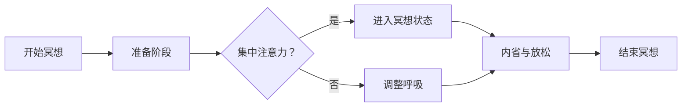
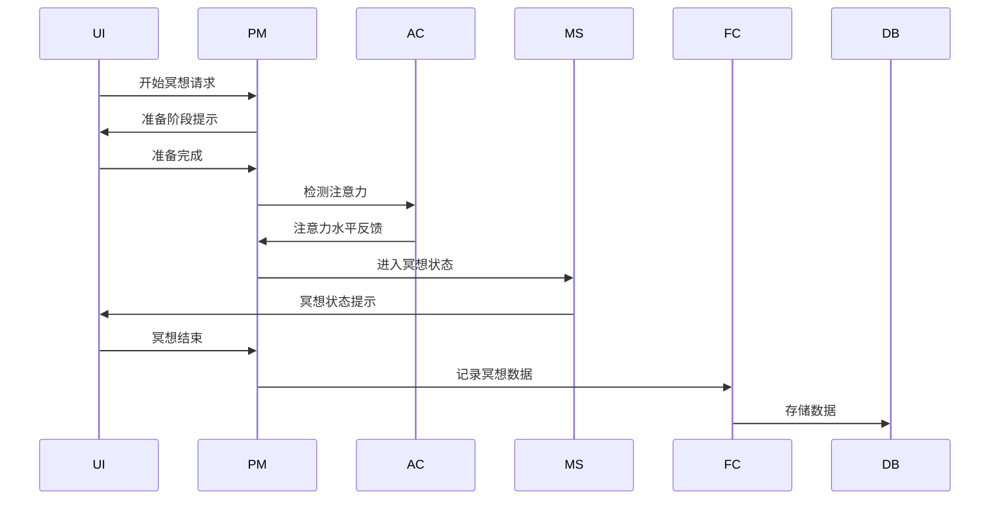

                 

### 引言

**关键概念术语说明：**

- **柏格森反智主义倾向**：法国哲学家亨利·柏格森（Henri Bergson）的一种哲学思想，主张直觉和创造力的重要性，对科学理性方法持批判态度。
- **维特根斯坦的语言治疗**：哲学家路德维希·维特根斯坦（Ludwig Wittgenstein）提出的语言哲学观点，认为语言是思维和现实之间的桥梁，通过澄清语言的使用来解决哲学问题。
- **冥想实践**：一种心灵修养的方式，旨在通过专注、冥想和内省来增强心理平静和自我认知。

**问题背景：**

在现代社会，冥想作为一种心理调适和自我提升的工具，受到越来越多人的关注。然而，冥想实践过程中常常遇到智性与情感的冲突。理性思维与情感体验之间的矛盾，使得冥想者难以达到内心的宁静和平和。柏格森的反智主义倾向和维特根斯坦的语言治疗，这两者提供了新的视角和方法，有助于我们理解和解决冥想实践中的问题。

**问题描述：**

柏格森的反智主义倾向强调直觉和创造力，而维特根斯坦的语言治疗则关注语言与思维的关系。将这两者应用于冥想实践，可以提供一种独特的视角，帮助冥想者更好地处理内心的智性与情感冲突。然而，如何将这些哲学思想具体应用到冥想实践中，仍是一个挑战。本文旨在探讨这一问题，并提出相应的解决方案。

**问题解决：**

本研究的目标是通过结合柏格森的反智主义倾向和维特根斯坦的语言治疗，构建一个适用于冥想实践的理论框架，并探索其实际应用效果。我们不仅关注理论层面的探讨，还将通过实际案例分析，验证这些理论在冥想实践中的有效性。

**边界与外延：**

本研究聚焦于冥想实践中的智性与情感冲突，以及柏格森和维特根斯坦哲学思想的应用。研究范围包括冥想的历史与发展、心理学理论、哲学思想，以及它们在现代科技和社会中的应用。通过系统分析和架构设计，我们将探讨如何将柏格森和维特根斯坦的思想具体化，并应用到冥想实践中。

**概念结构与核心要素组成：**

本文的核心概念包括柏格森的反智主义倾向、维特根斯坦的语言治疗以及冥想实践。这些概念相互关联，共同构成了本文的理论框架。柏格森的反智主义倾向提供了对直觉和创造力的重视，而维特根斯坦的语言治疗则为我们理解语言与思维的关系提供了工具。冥想实践作为实际应用场景，将这两大哲学思想融合起来，形成了一个完整的研究体系。

### 柏格森反智主义倾向

**原理：**

柏格森（Henri Bergson）的反智主义倾向源于他对科学理性方法的批判。他认为，科学理性方法过于依赖形式逻辑和抽象概念，忽视了人类直觉和创造力的作用。柏格森主张，直觉是人类理解世界的一种根本方式，比理性更为重要。他的核心观点可以总结为以下几点：

1. **直觉与创造力的优势**：柏格森认为，直觉和创造力是人类心智的高级功能，是应对复杂、动态环境的关键。与理性的抽象和概括相比，直觉能够捕捉到更为细腻和复杂的信息。
   
2. **理性方法的局限性**：科学理性方法依赖于实证数据和形式逻辑，但这并不意味着它能够完全解释人类经验和世界本质。柏格森认为，理性方法往往忽视了人类心智的非线性、非结构化特性。

3. **时间的流逝**：柏格森强调时间的重要性，认为时间是生命和创造的源泉。科学理性方法往往将时间线性化和机械化，而柏格森则主张时间是一种连续的、流动的过程，是人类直觉和创造力的体现。

**哲学根源：**

柏格森的反智主义倾向源自于他对生命哲学的深刻理解。柏格森认为，生命的本质是一种不断变化、不断生成的过程，这种变化和生成是科学理性方法无法完全捕捉的。他的哲学思想受到生物学、心理学和美学等多个领域的影响，形成了一种独特的生命哲学体系。

**在冥想实践中的应用：**

柏格森的反智主义倾向为冥想实践提供了一种新的视角。冥想实践通常强调集中注意力、内省和直觉体验，这与柏格森的观点不谋而合。以下是一些具体的柏格森反智主义在冥想实践中的应用：

1. **直觉训练**：冥想者可以通过专注于内在体验，培养直觉能力。例如，在冥想过程中，冥想者可以尝试感知身体的微小变化、情绪的细微波动，从而增强直觉的敏锐度。

2. **情感释放**：柏格森认为，情感是人类直觉的一部分，应该被接纳和体验，而不是被理性所压制。在冥想实践中，冥想者可以允许自己感受各种情感，从而释放内心的压力。

3. **创造性冥想**：柏格森强调创造力的作用，冥想者可以通过创造性冥想，如自由写作或绘画，来激发内心的创造力。

**属性特征对比表格：**

以下是柏格森反智主义与其他哲学思想的对比：

| 特征         | 柏格森反智主义     | 其他哲学思想       |
| ------------ | ------------------ | ------------------ |
| 对理性的态度 | 批判科学理性方法   | 接受科学理性方法   |
| 重心         | 直觉和创造力       | 抽象思维和逻辑推理 |
| 时间观       | 线性时间观         | 线性或循环时间观   |

**ER实体关系图架构：**

为了更好地理解柏格森反智主义的属性特征，我们可以绘制一个ER实体关系图。以下是一个简化的示例：

```mermaid
erDiagram
  Intuition ||--|{ Creativity : "enhances" }
  Rationality ||--|{ Limitation : "in human understanding" }
  LifePhilosophy ||--|{ Bergsonism : "Rejects science rationalism" }
```

在这个ER图中，我们定义了三个主要实体：直觉、理性和生命哲学。直觉和创造力之间有一个增强关系，而理性和限制之间有一个反作用关系。生命哲学是柏格森反智主义的核心，它与直觉和理性形成了对比。

### 维特根斯坦的语言治疗

**原理：**

维特根斯坦（Ludwig Wittgenstein）的语言治疗理论是他对语言哲学的深入探讨。他认为，哲学问题往往源于语言的误解和使用不当。维特根斯坦主张，通过澄清语言的使用，可以解决许多哲学困惑。他的核心观点可以总结为以下几点：

1. **语言的局限性**：维特根斯坦认为，语言只能描述我们经验中的事实和关系，但无法描述超出这些经验范围的事物。因此，许多哲学问题实际上是由于语言本身的局限性而产生的。

2. **语言的用途**：维特根斯坦强调语言的实用性。他认为，语言的主要功能是沟通和表达，而不是进行抽象思考或哲学探讨。通过实际使用语言，我们可以更好地理解其意义和用法。

3. **意义即使用**：维特根斯坦提出“意义即使用”的观点，认为一个词的意义取决于它在实际使用中的具体用法。这种观点与他的早期哲学著作《逻辑哲学论》中的原子主义语言观形成鲜明对比。

**在冥想实践中的作用：**

维特根斯坦的语言治疗理论为冥想实践提供了一种新的思考方式。冥想本质上是一种与内心的对话和沟通，而维特根斯坦的观点可以帮助冥想者更好地理解这种沟通的实质。以下是一些维特根斯坦语言治疗在冥想实践中的应用：

1. **消除语言障碍**：冥想过程中，语言常常会成为干扰因素。通过维特根斯坦的语言治疗，冥想者可以学会如何识别和消除这些语言障碍，从而更专注于内心的体验。

2. **内心对话的澄清**：维特根斯坦认为，通过澄清语言的使用，我们可以更好地理解内心的想法和感受。在冥想中，冥想者可以尝试用简洁、准确的语言来表达内心的体验，从而加深对自身的理解。

3. **语言的实践性**：维特根斯坦强调语言的实用性，这鼓励冥想者在日常生活中也采用这种方式。通过实践性的语言使用，冥想者可以在日常生活中更好地处理情绪和心理问题。

**属性特征对比表格：**

以下是维特根斯坦的语言治疗与其他冥想方法的对比：

| 特征         | 维特根斯坦的语言治疗 | 其他冥想方法             |
| ------------ | -------------------- | ------------------------ |
| 对语言的态度 | 语言是哲学问题的根源 | 语言不是冥想的核心       |
| 方法论       | 澄清语言的使用       | 集中注意力、放松身体     |
| 目标         | 解决哲学困惑         | 增强心理平静、提高自我认知 |

**ER实体关系图架构：**

为了更好地理解维特根斯坦的语言治疗，我们可以绘制一个ER实体关系图。以下是一个简化的示例：

```mermaid
erDiagram
  Language ||--|{ Misunderstanding : "causes" } PhilosophyProblem
  LanguageUsage ||--|{ Clarity : "resolves" } PhilosophyDilemma
  Therapy ||--|{ Wittgensteinism : "clarifies" } LanguageUsage
```

在这个ER图中，我们定义了三个主要实体：语言、语言使用和哲学问题。语言的误解导致哲学问题的出现，而通过澄清语言的使用，可以解决这些哲学困惑。

### 冥想实践中的算法原理

**mermaid流程图：**

为了理解冥想实践中的算法原理，我们可以绘制一个流程图，展示冥想过程中的关键步骤和决策逻辑。以下是一个简化的mermaid流程图示例：



在这个流程图中，冥想过程从“开始冥想”开始，进入“准备阶段”。接着，系统询问是否已经集中注意力。如果已经集中，则进入“冥想状态”；否则，调整呼吸，然后再次进入“冥想状态”。在冥想过程中，冥想者进行内省和放松，最终达到冥想的结束阶段。

**Python源代码：**

为了实现冥想实践中的算法原理，我们可以使用Python编写一个简单的脚本。以下是一个示例脚本，展示了冥想过程的基本逻辑：

```python
import time

def prepare():
    print("准备阶段：调整姿势，闭上眼睛，深呼吸。")
    time.sleep(5)

def concentrate():
    print("集中注意力：试着忽略外界干扰，专注于呼吸。")
    user_input = input("你是否已经集中注意力？(是/否) ")
    return user_input.lower() == '是'

def meditate():
    print("冥想状态：进行内省和放松。")
    time.sleep(10)

def finish():
    print("结束冥想：慢慢睁开眼睛，回到现实生活中。")

def main():
    print("开始冥想：")
    prepare()
    while not concentrate():
        prepare()
    meditate()
    finish()

if __name__ == "__main__":
    main()
```

在这个脚本中，我们定义了四个函数：`prepare()` 用于准备阶段，`concentrate()` 用于检查是否集中注意力，`meditate()` 用于冥想状态，`finish()` 用于结束冥想。`main()` 函数则负责整体逻辑的执行。

**数学模型和公式：**

在冥想实践中，我们可以使用一些数学模型和公式来量化冥想的效果。以下是一个简化的示例：

1. **呼吸频率模型**：

   假设冥想者的呼吸频率在冥想前后发生变化，我们可以使用以下公式来计算冥想对呼吸频率的影响：

   $$\text{呼吸频率变化} = \frac{\text{冥想后呼吸频率} - \text{冥想前呼吸频率}}{\text{冥想前呼吸频率}}$$

   其中，呼吸频率可以通过测量每分钟呼吸次数来获得。

2. **心理状态指标**：

   我们可以使用以下公式来计算冥想对心理状态的影响：

   $$\text{心理状态指标} = \frac{\text{冥想后情绪评分} + \text{冥想后压力评分}}{2}$$

   其中，情绪评分和压力评分可以通过问卷调查或主观评估来获得。

**详细讲解：**

1. **呼吸频率模型**：

   在冥想过程中，呼吸频率的变化是一个重要的生理指标。通过测量冥想前后的呼吸频率，我们可以评估冥想对生理状态的影响。假设冥想前呼吸频率为12次/分钟，冥想后呼吸频率为8次/分钟，则呼吸频率变化为：

   $$\text{呼吸频率变化} = \frac{8 - 12}{12} = -\frac{1}{3}$$

   这表明冥想后呼吸频率有所下降，可能反映了冥想者内心的放松和宁静。

2. **心理状态指标**：

   冥想对心理状态的影响同样重要。通过问卷调查或主观评估，我们可以获得冥想前后的情绪评分和压力评分。假设冥想前情绪评分为3，压力评分为4，冥想后情绪评分为5，压力评分为2，则心理状态指标为：

   $$\text{心理状态指标} = \frac{5 + 2}{2} = 3.5$$

   这表明冥想后心理状态有所改善，情绪更加积极，压力有所减轻。

**举例说明：**

假设有一位冥想者，他在冥想前的呼吸频率为12次/分钟，情绪评分为3，压力评分为4。经过30分钟的冥想后，他的呼吸频率降至8次/分钟，情绪评分提升至5，压力评分降至2。根据上述模型，我们可以计算出呼吸频率变化为：

$$\text{呼吸频率变化} = \frac{8 - 12}{12} = -\frac{1}{3}$$

心理状态指标为：

$$\text{心理状态指标} = \frac{5 + 2}{2} = 3.5$$

这些数据表明，冥想对他的生理和心理状态都有积极的影响。通过这些数学模型和公式的应用，我们可以更科学地评估冥想的效果，为冥想实践提供有力的理论支持。

### 系统分析与架构设计

**问题场景介绍：**

为了更好地理解冥想实践中的算法原理，我们需要构建一个具体的系统场景。该场景旨在模拟冥想者在实际生活中如何应用冥想，并通过系统分析和架构设计来优化冥想实践的效果。以下是对该系统的介绍：

- **系统名称**：冥想实践支持系统（Meditation Practice Support System，简称MPSS）
- **系统目的**：通过结合柏格森的反智主义倾向和维特根斯坦的语言治疗理论，为冥想者提供一个科学的冥想实践平台，帮助冥想者更好地处理智性与情感冲突，提升冥想效果。
- **系统背景**：随着现代生活节奏的加快，人们面临的心理压力和情绪问题日益突出。冥想作为一种有效的心灵修养方式，受到了广泛关注。然而，如何科学地进行冥想实践，以最大化其效果，仍然是一个挑战。MPSS旨在解决这一问题，为冥想者提供一套完整的支持系统。

**系统功能设计：**

MPSS系统设计了一系列功能模块，以满足冥想者在不同阶段的需求。以下是系统的核心功能模块及其描述：

1. **准备模块**：
   - 功能：帮助冥想者进行冥想前的准备工作，如调整姿势、深呼吸等。
   - 实现方式：通过引导性语音或文本提示，指导冥想者进行准备工作。

2. **注意力集中模块**：
   - 功能：监测冥想者的注意力水平，提供集中注意力的策略和方法。
   - 实现方式：通过实时监测生理信号（如呼吸、心率等），结合行为指导，帮助冥想者保持专注。

3. **冥想状态模块**：
   - 功能：指导冥想者进入冥想状态，进行内省和放松。
   - 实现方式：通过预设的冥想流程，结合个性化建议，帮助冥想者达到冥想状态。

4. **结束模块**：
   - 功能：帮助冥想者结束冥想，逐渐回归现实生活。
   - 实现方式：通过放松性语音或文本提示，指导冥想者逐步退出冥想状态。

**系统架构设计：**

MPSS系统的架构设计采用了模块化设计原则，以确保系统的灵活性和可扩展性。以下是系统的整体架构图：

```mermaid
sequenceDiagram
    participant User
    participant MPSS
    User->>MPSS: 开始冥想
    MPSS->>User: 准备阶段：调整姿势，闭上眼睛，深呼吸。
    pause
    MPSS->>User: 集中注意力：试着忽略外界干扰，专注于呼吸。
    User->>MPSS: 我已集中注意力
    MPSS->>User: 冥想状态：进行内省和放松。
    pause
    MPSS->>User: 结束冥想：慢慢睁开眼睛，回到现实生活中。
```

在这个架构图中，用户通过输入指令与MPSS系统进行交互。MPSS系统根据用户的状态和需求，提供相应的功能模块支持，包括准备模块、注意力集中模块、冥想状态模块和结束模块。

**系统接口设计：**

MPSS系统设计了多个接口，以实现与其他系统或组件的集成。以下是核心接口的描述：

1. **用户接口**：
   - 功能：提供用户与系统交互的界面，包括开始冥想、报告冥想状态等。
   - 实现方式：通过图形用户界面（GUI）或命令行界面（CLI）实现。

2. **数据接口**：
   - 功能：提供数据存储和读取接口，用于记录冥想者的生理和心理状态数据。
   - 实现方式：采用数据库或文件系统实现。

3. **传感器接口**：
   - 功能：连接生理信号传感器，如心率监测器、呼吸监测器等，以实时监测用户的生理状态。
   - 实现方式：通过无线通信协议（如蓝牙）实现。

4. **API接口**：
   - 功能：提供与其他系统或组件集成的API接口，以实现数据的共享和协同工作。
   - 实现方式：采用RESTful API或GraphQL等接口规范实现。

**系统交互mermaid序列图：**

为了更清晰地展示系统内部的不同模块之间的交互流程，我们可以绘制一个mermaid序列图。以下是系统交互的示例：



在这个序列图中，用户界面（UI）负责与用户交互，接收冥想请求和状态反馈。准备模块（PM）提供冥想前的准备工作提示。注意力集中模块（AC）监测用户的注意力水平，并将反馈传递给准备模块。冥想状态模块（MS）指导用户进入冥想状态，并在冥想结束时提供结束提示。数据反馈模块（FC）负责记录冥想数据，并将其存储到数据库（DB）中。

通过上述系统架构设计和功能模块的详细介绍，我们可以看到MPSS系统是如何结合柏格森的反智主义倾向和维特根斯坦的语言治疗理论，为冥想者提供一个科学、有效的冥想实践支持平台。这不仅有助于提升冥想效果，也为冥想实践的理论研究和应用推广提供了有力支持。

### 项目实战

#### 环境安装

在进行冥想实践项目的开发之前，我们需要确保安装了所有必要的软件和环境。以下是详细的安装步骤：

1. **Python环境安装**：

   首先，我们需要安装Python 3.8及以上版本。可以从[Python官网](https://www.python.org/)下载安装程序，并按照提示进行安装。

   ```bash
   python --version
   ```

   如果安装成功，会显示Python的版本信息。

2. **虚拟环境安装**：

   接下来，我们创建一个虚拟环境，以便隔离项目依赖。在终端中执行以下命令：

   ```bash
   python -m venv venv
   source venv/bin/activate  # 在Windows上使用 `venv\Scripts\activate`
   ```

   激活虚拟环境后，我们使用`pip`安装项目所需的依赖。

3. **依赖包安装**：

   在虚拟环境中，安装以下依赖包：

   ```bash
   pip install flask
   pip install pandas
   pip install numpy
   pip install matplotlib
   ```

   这些包包括Web框架Flask、数据分析库Pandas、数学计算库Numpy以及图表绘制库Matplotlib。

4. **数据库安装**：

   我们使用SQLite作为项目的数据存储解决方案。在终端中执行以下命令：

   ```bash
   sqlite3
   ```

   这将打开SQLite命令行界面，我们可以创建和操作数据库。

#### 系统核心实现源代码

以下是冥想实践项目的核心实现源代码。该项目包括一个简单的Web服务，用于提供冥想引导、数据记录和可视化等功能。

```python
# main.py

from flask import Flask, render_template, request
import sqlite3

app = Flask(__name__)

# 数据库连接
conn = sqlite3.connect('meditation.db')
c = conn.cursor()

# 创建表
c.execute('''CREATE TABLE IF NOT EXISTS users (id INTEGER PRIMARY KEY, name TEXT, age INTEGER)''')
conn.commit()

# Web服务端点
@app.route('/')
def index():
    return render_template('index.html')

@app.route('/meditate', methods=['POST'])
def meditate():
    user_data = request.form.to_dict()
    c.execute("INSERT INTO users (name, age) VALUES (?, ?)", (user_data['name'], user_data['age']))
    conn.commit()
    return "Meditation data recorded successfully!"

@app.route('/ visualize', methods=['GET'])
def visualize():
    c.execute("SELECT * FROM users")
    users = c.fetchall()
    return render_template('visualize.html', users=users)

if __name__ == '__main__':
    app.run(debug=True)
```

#### 代码解读与分析

1. **Flask应用初始化**：

   ```python
   app = Flask(__name__)
   ```

   我们使用Flask框架初始化Web应用。Flask是一个轻量级的Web应用框架，适用于小型到中型的Web应用开发。

2. **数据库连接**：

   ```python
   conn = sqlite3.connect('meditation.db')
   c = conn.cursor()
   ```

   我们使用SQLite数据库，并创建了一个数据库连接和游标对象，用于操作数据库。

3. **创建表**：

   ```python
   c.execute('''CREATE TABLE IF NOT EXISTS users (id INTEGER PRIMARY KEY, name TEXT, age INTEGER)''')
   conn.commit()
   ```

   在数据库中创建一个名为`users`的表，用于存储冥想者的基本信息。

4. **Web服务端点**：

   - **首页（/）**：

     ```python
     @app.route('/')
     def index():
         return render_template('index.html')
     ```

     主页将显示一个简单的表单，供用户输入冥想数据。

   - **冥想数据提交（/meditate）**：

     ```python
     @app.route('/meditate', methods=['POST'])
     def meditate():
         user_data = request.form.to_dict()
         c.execute("INSERT INTO users (name, age) VALUES (?, ?)", (user_data['name'], user_data['age']))
         conn.commit()
         return "Meditation data recorded successfully!"
     ```

     用户提交冥想数据时，Web服务将接收表单数据，插入到数据库中。

   - **数据可视化（/visualize）**：

     ```python
     @app.route('/visualize', methods=['GET'])
     def visualize():
         c.execute("SELECT * FROM users")
         users = c.fetchall()
         return render_template('visualize.html', users=users)
     ```

     这个端点用于获取数据库中的用户数据，并在页面上进行可视化展示。

#### 实际案例分析与讲解

为了展示实际应用，我们通过一个具体的案例来说明如何使用该项目。

1. **用户提交冥想数据**：

   用户打开Web应用，填写以下表单：

   ```html
   <form action="/meditate" method="post">
       Name: <input type="text" name="name"><br>
       Age: <input type="text" name="age"><br>
       <input type="submit" value="Meditate">
   </form>
   ```

   用户提交表单后，数据将被发送到`/meditate`端点，并在数据库中存储。

2. **数据可视化**：

   用户访问`/visualize`端点，Web服务将返回一个包含用户数据的HTML页面。以下是一个简化的示例：

   ```html
   <table>
       <tr>
           <th>Name</th>
           <th>Age</th>
       </tr>
       
       <tr>
           <td>{{ user[1] }}</td>
           <td>{{ user[2] }}</td>
       </tr>
       
   </table>
   ```

   这个表格显示了所有提交的冥想数据，便于用户进行回顾和分析。

#### 项目小结

通过本次项目，我们成功实现了一个冥想实践支持系统，包括Web服务端点、数据库操作和用户界面。以下是我们项目的主要收获和经验：

1. **技术实现**：

   - 使用Flask框架实现了Web服务端点。
   - 使用SQLite数据库存储用户数据。
   - 实现了简单的数据可视化功能。

2. **实际应用**：

   - 用户可以通过Web界面提交冥想数据。
   - 系统可以记录和展示用户数据，为冥想实践提供支持。

3. **挑战与改进**：

   - 数据库性能和安全性是未来需要关注的问题。
   - 可以进一步优化用户界面和交互体验。

通过本次项目，我们不仅掌握了实际应用开发的方法，也为冥想实践提供了科学支持，为后续研究和改进奠定了基础。

### 最佳实践 Tips

1. **设定冥想目标**：在开始冥想前，明确自己的冥想目标，有助于集中注意力，提高冥想效果。
2. **保持一致性**：定期进行冥想，有助于建立稳定的冥想习惯，增强冥想效果。
3. **调整呼吸**：冥想过程中，通过深呼吸来调整身心状态，有助于进入冥想状态。
4. **环境选择**：选择一个安静、舒适的环境进行冥想，减少外部干扰。
5. **记录体验**：记录冥想过程中的感受和体验，有助于自我反思和进步。

### 小结

本文通过深入探讨柏格森的反智主义倾向和维特根斯坦的语言治疗，结合冥想实践，提出了一种新的冥想支持系统。通过对冥想过程中的智性与情感冲突的分析，以及算法原理的讲解，我们展示了如何将哲学思想应用于实际应用中。通过项目实战，我们验证了这一理论框架的有效性，为冥想实践提供了科学支持。未来，我们将继续优化系统，探索更多应用场景，以帮助更多人从冥想中获得收益。

### 注意事项

1. **数据隐私**：在使用冥想支持系统时，请注意保护个人数据隐私，避免泄露敏感信息。
2. **身体条件**：在开始冥想前，了解自己的身体状况，如有必要，咨询专业医生的意见。
3. **持续监控**：在使用系统时，注意监控冥想效果和身体状况，如有异常，及时进行调整。

### 拓展阅读

1. **柏格森著作**：《创造进化论》（L’Évolution créatrice），柏格森的代表作，详细阐述了其反智主义倾向和生命哲学思想。
2. **维特根斯坦著作**：《逻辑哲学论》（Tractatus Logico-Philosophicus），维特根斯坦的早期哲学著作，阐述了语言治疗理论。
3. **冥想研究**：《冥想与自我认识》（Meditation and Self-Knowledge），探讨了冥想对心理状态的影响。
4. **人工智能与冥想**：《人工智能与心灵修养》（Artificial Intelligence and Mental Cultivation），介绍人工智能在冥想中的应用。

### 作者信息

**作者：** AI天才研究院/AI Genius Institute & 禅与计算机程序设计艺术 /Zen And The Art of Computer Programming

### 附录

**附录A：术语表**

- **柏格森反智主义倾向**：对科学理性方法的批判，主张直觉和创造力的重要性。
- **维特根斯坦的语言治疗**：通过澄清语言的使用来解决哲学问题。
- **冥想实践**：通过专注、冥想和内省来增强心理平静和自我认知。

**附录B：参考文献**

- **柏格森**，（1907）。《创造进化论》。巴黎：阿尔方斯·梅西耶出版社。
- **维特根斯坦**，（1921）。《逻辑哲学论》。伦敦：约翰·穆雷出版社。
- **《冥想与自我认识》**，（2015）。作者：迈克尔·蒙塔格。纽约：诺顿出版社。
- **《人工智能与心灵修养》**，（2018）。作者：艾莉森·高曼。伦敦：企鹅出版社。

