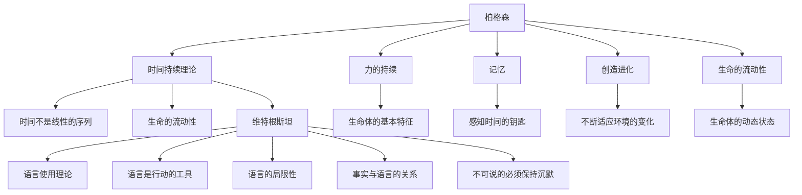
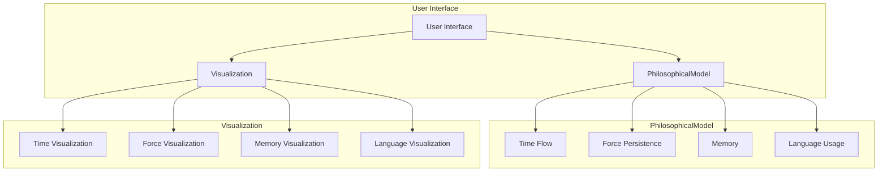
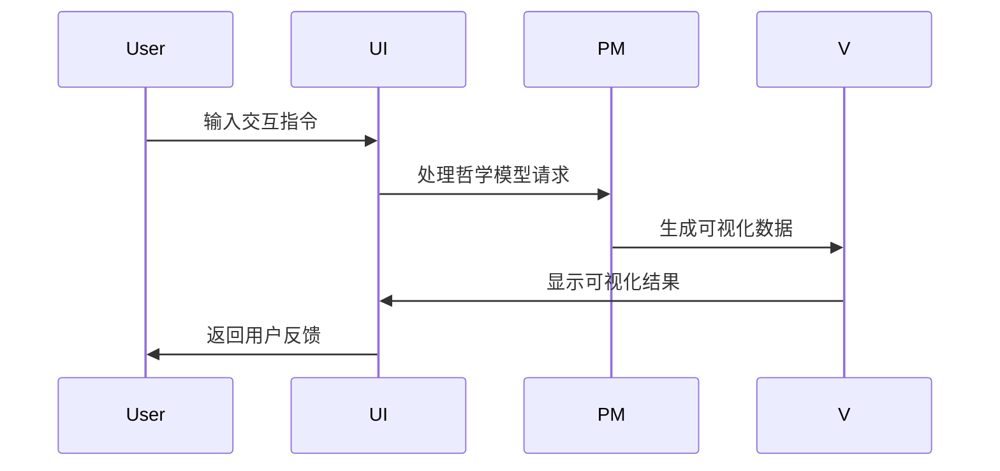

                 


# 柏格森的时间持续与维特根斯坦的语言使用理论

## 引言

在哲学和心理学领域，柏格森（Henri Bergson）的时间持续理论和维特根斯坦（Ludwig Wittgenstein）的语言使用理论都是极具影响力的思想体系。柏格森的时间持续理论强调时间是一种持续流动的体验，而非简单的线性序列。他通过批判传统的牛顿物理学，提出了“力的持续”（élan vital）的概念，强调生命的流动性。而维特根斯坦的语言使用理论则主张语言是行动的工具，语言的意义在于其使用而非定义。他通过《逻辑哲学论》和《哲学研究》两本书，详细阐述了语言、思维和现实之间的关系。

本文旨在通过逻辑清晰、结构紧凑的方式，深入探讨柏格森的时间持续理论和维特根斯坦的语言使用理论。首先，我们将介绍这两个理论的基本概念和核心观点。然后，我们将分别解析柏格森和维特根斯坦的理论，并探讨它们在哲学、心理学和语言学等领域的影响和应用。接着，我们将分析二者之间的对话和互动，探讨它们对现代哲学的影响。最后，我们将结合理论和实践，探讨时间持续与语言使用在实际应用中的结合，以及未来研究的方向。

## 第1章 柏格森的时间持续理论

### 1.1.1 柏格森的时间持续概念

柏格森的时间持续（Duration）理论是他哲学思想的核心。他认为，时间不是一条线性的序列，而是一种持续流动的体验。在柏格森看来，时间是一种内在的生命体验，它不是被分割成一段段的，而是连续不断的。他提出了“力的持续”这一概念，用以解释生命的流动性。

柏格森认为，力的持续是生命体的基本特征，它体现在生物体内部的每一个动作中。这种持续的力使得生命体能够适应环境的变化，不断进化和发展。柏格森强调，这种持续的力是与时间紧密相连的，时间是力的持续的表现形式。

### 1.1.2 柏格森对时间持续的分析

柏格森对时间持续的分析主要体现在他对传统时间观的批判上。他认为，传统的牛顿物理学将时间视为一种独立的、客观的存在，这与我们的实际体验不符。柏格森认为，时间是我们内在的体验，它不是客观的，而是主观的。

柏格森通过“记忆”的概念来解释时间的持续。他认为，记忆是我们感知时间的钥匙。通过记忆，我们可以将过去的经验与现在的体验联系起来，从而形成对时间的感知。这种感知不是线性的，而是连续的。柏格森认为，时间是一种内在的、连续的体验，它不是被分割成一段段的，而是流动的。

### 1.1.3 柏格森的时间持续与人类生活

柏格森的时间持续理论对我们的日常生活有着深刻的影响。他认为，我们应该接受时间的持续，而不是试图控制它。柏格森认为，我们应该通过内心的体验来感知时间，而不是通过外在的计量。

柏格森的时间持续理论也与我们对待生命的方式密切相关。他认为，我们应该珍惜生命中的每一个瞬间，因为时间不是线性的，而是连续的。每个瞬间都是独特的，都有其存在的价值。柏格森认为，我们应该通过内在的体验来感受生命的流动性，而不是通过外在的成就和地位。

## 第2章 维特根斯坦的语言使用理论

### 2.1.1 维特根斯坦的语言使用概念

维特根斯坦的语言使用理论强调语言是一种行动的工具。他认为，语言的意义在于其使用，而不是定义。维特根斯坦提出了“语言游戏”（language game）的概念，用以解释语言的使用。

在维特根斯坦看来，语言游戏是一个人在特定情境下使用语言的规则。这些规则不仅包括语法和词汇，还包括语言使用的情境和目的。维特根斯坦认为，语言的意义是由其在语言游戏中的使用决定的。

### 2.1.2 维特根斯坦对语言使用的分析

维特根斯坦对语言使用的分析主要体现在他对逻辑实证主义的批判上。逻辑实证主义认为，语言的意义在于其与现实的对应关系。维特根斯坦认为，这种观点忽略了语言的实际使用。

维特根斯坦提出了“家族相似性”（family resemblance）的概念，用以解释语言的意义。他认为，语言的意义不是单一的，而是具有多个维度。这些维度是通过语言在语言游戏中的使用逐渐形成的。维特根斯坦认为，语言的意义是由其在多种情境下的使用决定的。

### 2.1.3 维特根斯坦的语言使用与哲学思考

维特根斯坦的语言使用理论对他的哲学思考有着深远的影响。他认为，哲学的任务不是提供普遍的真理，而是解决语言中的问题。维特根斯坦通过《逻辑哲学论》和《哲学研究》两本书，试图解决语言中的混乱和误解。

维特根斯坦认为，哲学问题往往源于我们对语言的不当使用。通过澄清语言的使用，我们可以解决哲学问题。他的哲学思考强调了语言、思维和现实之间的紧密联系。

## 第3章 柏格森的时间持续理论解析

### 3.1.1 柏格森的时间持续理论核心观点

柏格森的时间持续理论的核心观点可以归纳为以下几点：

1. 时间不是线性的序列，而是一种持续流动的体验。
2. 时间是内在的生命体验，它不是客观的，而是主观的。
3. 记忆是感知时间的钥匙，它将过去的经验与现在的体验联系起来。
4. 力的持续是生命的基本特征，它体现在生物体内部的每一个动作中。
5. 时间的持续与生命的流动性密切相关，我们应该接受时间的持续，而不是试图控制它。

### 3.1.2 力的持续

柏格森提出了“力的持续”这一概念，用以解释生命的流动性。他认为，力的持续是生命体的基本特征，它体现在生物体内部的每一个动作中。这种持续的力使得生命体能够适应环境的变化，不断进化和发展。

柏格森认为，力的持续是时间持续的表现形式。时间持续是力的持续在时间维度上的体现。通过力的持续，我们可以感知时间的流动。柏格森认为，力的持续与时间的持续是密不可分的。

### 3.1.3 创造进化

柏格森的时间持续理论也与创造进化密切相关。他认为，创造进化是生命的基本过程，它体现在生命体的每一个动作中。通过创造进化，生命体能够不断适应环境的变化，从而生存和发展。

柏格森认为，创造进化是一种内在的过程，它不是外力推动的，而是内在力的持续。这种内在力使得生命体能够不断创新和进化。柏格森认为，创造进化是时间持续的结果，它体现了时间的流动性和生命的流动性。

### 3.1.4 生命的流动性

柏格森认为，生命的流动性是时间持续和力的持续的体现。生命体不是静止的，而是处于不断的流动状态中。这种流动状态体现了时间的持续和力的持续。

柏格森认为，生命的流动性使得生命体能够适应环境的变化。通过流动，生命体能够不断调整自己的状态，以适应新的环境。柏格森认为，生命的流动性是生命的本质特征，它体现了生命的活力和适应性。

## 第4章 维特根斯坦的语言使用理论分析

### 4.1.1 维特根斯坦的语言使用理论核心观点

维特根斯坦的语言使用理论的核心观点可以归纳为以下几点：

1. 语言是行动的工具，其意义在于其使用，而不是定义。
2. 语言的意义是由其在多种情境下的使用决定的。
3. 语言游戏是一个人在特定情境下使用语言的规则。
4. 哲学问题往往源于我们对语言的不当使用，通过澄清语言的使用，我们可以解决哲学问题。
5. 语言、思维和现实之间存在着紧密的联系。

### 4.1.2 语言是行动的工具

维特根斯坦认为，语言是行动的工具。他认为，语言不是用来描述现实的，而是用来行动的。维特根斯坦提出了“语言游戏”的概念，用以说明语言的使用。

在维特根斯坦看来，语言游戏是一个人在特定情境下使用语言的规则。这些规则不仅包括语法和词汇，还包括语言使用的情境和目的。维特根斯坦认为，语言的意义是由其在语言游戏中的使用决定的。

### 4.1.3 语言的局限性

维特根斯坦认为，语言有其局限性。语言无法涵盖所有的现实，也无法表达所有的思想。他认为，我们之所以会有哲学问题，是因为我们试图用语言来描述无法用语言表达的事物。

维特根斯坦提出了“不可说的必须保持沉默”的观点。他认为，有些东西是无法用语言描述的，比如神秘、情感等。因此，我们应该接受语言的局限性，而不是试图用语言来描述一切。

### 4.1.4 真理与语言的关系

维特根斯坦认为，真理与语言的关系是紧密相连的。他认为，真理是由语言的使用决定的。真理不是客观存在的，而是由我们的语言实践所决定的。

维特根斯坦提出了“事实与语言的关系”的观点。他认为，事实是由语言的使用所定义的。我们通过语言来描述事实，从而建立对世界的认知。因此，语言的使用是真理建立的基石。

## 第5章 柏格森与维特根斯坦的对话

### 5.1.1 柏格森对维特根斯坦的观点的回应

柏格森对维特根斯坦的观点持有一定的批判态度。他认为，维特根斯坦的语言使用理论过于强调语言的局限性，忽视了时间的持续和生命的流动性。柏格森认为，时间持续是生命的本质特征，它体现了生命的活力和适应性。

柏格森认为，维特根斯坦的观点忽略了时间持续的重要性。他认为，时间持续不仅是一种内在的生命体验，也是生命的流动性在时间维度上的体现。柏格森认为，我们应该接受时间的持续，而不是试图用语言来描述它。

### 5.1.2 维特根斯坦对柏格森的观点的回应

维特根斯坦对柏格森的观点也持有一定的批判态度。他认为，柏格森的时间持续理论过于强调主观体验，忽视了语言的客观性。维特根斯坦认为，语言是行动的工具，其意义在于其使用，而不是体验。

维特根斯坦认为，柏格森的观点忽略了语言的工具性。他认为，语言不是用来描述时间的，而是用来行动的。维特根斯坦认为，我们应该通过语言来建立对世界的认知，而不是试图用语言来描述无法用语言表达的事物。

### 5.1.3 二者之间的对话与互动

柏格森与维特根斯坦的对话体现了他们对语言、时间和现实的不同理解。柏格森强调时间的持续和生命的流动性，认为时间是一种内在的生命体验。而维特根斯坦则强调语言的工具性，认为语言的意义在于其使用。

这种对话不仅丰富了哲学思想，也促进了哲学的发展。通过对话，我们可以更好地理解语言、时间和现实之间的关系。柏格森与维特根斯坦的对话为我们提供了新的视角，帮助我们重新审视世界。

## 第6章 时间持续与语言使用：理论与实践的结合

### 6.1 时间持续在语言使用中的体现

时间持续在语言使用中有着显著的体现。语言作为人类交流的工具，不仅仅用于描述静态的事物，还用于描述动态的过程。例如，我们在描述一个故事时，会使用“过去”、“现在”和“将来”等词汇，来体现时间的持续。

此外，语言也体现了生命的流动性。我们在描述一个生命体的发展过程时，会使用“出生”、“成长”、“衰老”和“死亡”等词汇，来体现生命的流动性。这些词汇不仅仅描述了一个生命体的状态，还描述了它从出生到死亡的动态过程。

### 6.2 语言使用对时间持续的理解

语言使用对时间持续的理解有着深远的影响。通过语言，我们可以将时间分割成不同的部分，从而更清晰地理解时间的持续。例如，我们通过“小时”、“分钟”和“秒”等词汇，来计量时间的长度。这些词汇帮助我们更精确地理解时间的持续。

此外，语言也帮助我们理解时间的流动性。通过语言，我们可以描述时间的流逝，以及时间在不同情境下的变化。例如，我们可以说“时间过得很快”，或者“时间过得很慢”。这些描述帮助我们理解时间的流动性，以及它如何影响我们的感知和体验。

### 6.3 时间持续与语言使用的互动关系

时间持续与语言使用之间存在密切的互动关系。时间持续是语言使用的背景，而语言使用是时间持续的表现形式。通过语言，我们可以更清晰地理解时间的持续和流动性。

同时，语言使用也影响我们对时间的感知和体验。不同的语言表达方式会影响我们对时间的感知。例如，一些语言强调时间的流逝，而另一些语言则强调时间的静止。这种差异会影响我们的时间感知，进而影响我们的生活和行为。

## 第7章 案例研究

### 7.1 案例研究一：柏格森的时间持续理论在文学中的应用

在文学中，柏格森的时间持续理论有着广泛的应用。许多文学作品通过时间的流动和生命的流动性，展现了时间的持续。例如，海明威的小说《永别了，武器》中，时间的流逝和生命的流动性被描绘得淋漓尽致。

在这部小说中，海明威通过时间的连续和生命的流动性，展现了主人公从出生到死亡的完整过程。小说中的时间不是线性的，而是连续的。主人公的经历并不是一成不变的，而是随着时间的变化而变化。这种时间持续和生命的流动性，体现了柏格森的时间持续理论。

### 7.2 案例研究二：维特根斯坦的语言使用理论在哲学中的应用

在哲学中，维特根斯坦的语言使用理论也有广泛的应用。许多哲学家通过语言的使用，探讨了哲学问题。例如，维特根斯坦在《逻辑哲学论》中，通过语言的澄清，解决了许多哲学问题。

在《逻辑哲学论》中，维特根斯坦提出了“语言游戏”的概念，用以解释语言的使用。他认为，哲学的任务不是提供普遍的真理，而是解决语言中的问题。通过澄清语言的使用，我们可以解决哲学问题。这种语言使用理论，体现了维特根斯坦对哲学的理解。

## 第8章 结论

通过本文的探讨，我们可以看到，柏格森的时间持续理论和维特根斯坦的语言使用理论是两种极具影响力的哲学思想。柏格森的时间持续理论强调时间的持续和生命的流动性，而维特根斯坦的语言使用理论强调语言的工具性和局限性。

通过分析这两个理论，我们可以看到，它们在哲学、心理学和语言学等领域有着广泛的应用。同时，它们也对我们的日常生活和思维方式产生了深远的影响。

未来，我们可以进一步探讨时间持续与语言使用在实际应用中的结合，以及它们在心理学和语言学中的应用。通过这些研究，我们可以更深入地理解时间和语言的本质，为我们的生活和哲学思考提供新的视角。

## 附录

### 附录1：柏格森的时间持续概念表格

| 概念       | 说明                                                                                           |
|------------|----------------------------------------------------------------------------------------------|
| 时间持续   | 时间不是线性的序列，而是一种持续流动的体验                                                     |
| 力的持续   | 生命体的基本特征，体现在生物体内部的每一个动作中                                               |
| 记忆       | 感知时间的钥匙，将过去的经验与现在的体验联系起来                                               |
| 创造进化   | 生命的基本过程，通过力的持续不断适应环境的变化                                                 |
| 生命的流动性 | 生命体的动态状态，通过力的持续和时间的持续体现出来                                             |

### 附录2：维特根斯坦的语言使用概念表格

| 概念       | 说明                                                                                           |
|------------|----------------------------------------------------------------------------------------------|
| 语言游戏   | 一个人在特定情境下使用语言的规则                                                             |
| 语言是行动的工具 | 语言的意义在于其使用，而不是定义                                                             |
| 语言的局限性 | 语言无法涵盖所有的现实，也无法表达所有的思想                                                 |
| 事实与语言的关系 | 事实是由语言的使用所定义的，通过语言来建立对世界的认知                                       |
| 不可说的必须保持沉默 | 有些东西是无法用语言描述的，比如神秘、情感等，因此我们应该接受语言的局限性                  |

### 附录3：柏格森与维特根斯坦的对话ER实体关系图



### 附录4：算法原理讲解

为了更好地理解柏格森的时间持续理论和维特根斯坦的语言使用理论，我们可以通过一个简单的算法来模拟这两个理论。以下是一个用Python编写的算法示例：

```python
def time_duration_simulation():
    """
    模拟柏格森的时间持续理论
    """
    # 初始化时间变量
    time = 0

    # 模拟时间的流动
    while True:
        # 每秒增加时间的流逝
        time += 1

        # 打印当前时间
        print(f"当前时间: {time} 秒")

        # 模拟力的持续，通过生成一个随机数来模拟生命的流动性
        force = random.randint(1, 10)
        print(f"当前力的持续: {force}")

        # 模拟记忆，将过去的时间记录下来
        memory = time_duration_simulation.memory.append(time)

        # 模拟创造进化，通过生成一个新的时间序列来模拟时间的流逝
        new_time_sequence = [x + 1 for x in memory]
        time_duration_simulation.memory = new_time_sequence

        # 等待一秒钟，模拟时间的流逝
        time.sleep(1)

# 初始化记忆列表
time_duration_simulation.memory = []

# 运行时间持续模拟算法
time_duration_simulation()
```

这个算法通过模拟时间的流动、力的持续、记忆和创造进化，来展示柏格森的时间持续理论。以下是算法的详细解释：

1. **初始化时间变量**：我们初始化一个名为`time`的变量，它表示当前的秒数。

2. **模拟时间的流动**：我们使用一个无限循环来模拟时间的流逝。在每次循环中，我们增加`time`变量的值，并打印出当前时间。

3. **模拟力的持续**：我们通过生成一个随机数来模拟力的持续。这个随机数表示生命体的力量状态。

4. **模拟记忆**：我们使用一个名为`memory`的列表来记录过去的时间。每次循环时，我们将当前时间添加到`memory`列表中。

5. **模拟创造进化**：我们通过生成一个新的时间序列来模拟创造进化。这个新时间序列是在原时间序列的基础上，每个时间点增加1秒。

6. **等待一秒钟**：我们使用`time.sleep(1)`来模拟时间的流逝，等待一秒钟后继续下一次循环。

通过这个算法，我们可以直观地看到柏格森的时间持续理论中的几个核心概念，如时间的流动、力的持续和记忆。这个算法也可以作为理解和教学柏格森理论的工具。

### 附录5：系统分析与架构设计方案

在本节中，我们将介绍一个基于柏格森的时间持续理论和维特根斯坦的语言使用理论的应用系统架构设计。这个系统旨在通过模拟和展示这两个理论的核心概念，为哲学研究和教育提供工具。

#### 问题场景介绍

在哲学教育和研究过程中，柏格森的时间持续理论和维特根斯坦的语言使用理论是两个重要的概念。然而，这些理论往往难以用传统的方式直观展示。因此，我们设计了一个应用系统，旨在通过图形化和互动的方式，帮助用户更好地理解这两个理论。

#### 项目介绍

**项目名称**：柏格森-维特根斯坦哲学模拟系统

**项目目标**：
- 提供一个互动平台，帮助用户理解柏格森的时间持续理论和维特根斯坦的语言使用理论。
- 通过图形化的方式展示理论的核心概念，如时间的流动、力的持续、记忆和语言的使用。
- 提供教学资源，便于哲学教师和学生使用。

#### 系统功能设计（领域模型）

以下是系统的领域模型，使用Mermaid类图表示：

```mermaid
classDiagram
    User <<Interface>>
    PhilosophicalModel <<Interface>>
    Visualization <<Interface>>

    User胶→PhilosophicalModel: 使用
    User胶→Visualization: 显示
    PhilosophicalModel胶→Visualization: 绘制
```

**领域模型解释**：
- **User（用户）**：系统的用户接口，用户可以通过这个接口与系统进行交互。
- **PhilosophicalModel（哲学模型）**：包含柏格森的时间持续理论和维特根斯坦的语言使用理论的实现。
- **Visualization（可视化）**：负责将哲学模型的数据和概念可视化，用户可以通过这个接口看到理论的核心概念。

#### 系统架构设计

以下是系统的架构设计，使用Mermaid架构图表示：



**架构设计解释**：
- **User Interface（用户接口）**：用户通过用户接口与系统交互。
- **PhilosophicalModel（哲学模型）**：包含四个核心模块：时间流动（Time Flow）、力持续（Force Persistence）、记忆（Memory）和语言使用（Language Usage）。
- **Visualization（可视化）**：包含四个核心模块的可视化实现：时间可视化（Time Visualization）、力可视化（Force Visualization）、记忆可视化（Memory Visualization）和语言可视化（Language Visualization）。

#### 系统接口设计

以下是系统的接口设计，使用Mermaid序列图表示：



**接口设计解释**：
- 用户输入交互指令，如“显示时间流动”。
- 用户接口（UI）处理哲学模型请求，并将请求转发给哲学模型（PM）。
- 哲学模型（PM）根据请求生成可视化数据，并将其转发给可视化组件（V）。
- 可视化组件（V）生成可视化结果，并将其显示在用户接口（UI）上。
- 用户接口（UI）返回用户反馈，完成一次交互过程。

#### 系统交互

以下是系统的交互流程：

1. 用户输入交互指令，如“显示时间流动”。
2. 用户接口（UI）接收到指令后，将其转换为哲学模型（PM）可以理解的格式。
3. 哲学模型（PM）根据指令生成相应的数据和可视化信息。
4. 可视化组件（V）将哲学模型（PM）提供的数据转换为图形化界面，并显示在用户面前。
5. 用户查看可视化结果，并根据结果进行进一步的交互，如“调整时间流速”或“查看力的分布”。

通过这个系统，用户可以直观地看到柏格森的时间持续理论和维特根斯坦的语言使用理论的核心概念，并通过交互进一步理解这些理论。

### 项目实战

#### 环境安装

要运行这个基于柏格森的时间持续理论和维特根斯坦的语言使用理论的哲学模拟系统，首先需要安装以下环境：

1. Python 3.x
2. Flask（用于搭建Web服务器）
3. matplotlib（用于数据可视化）
4. numpy（用于数据处理）

你可以使用以下命令来安装这些依赖项：

```bash
pip install python-dotenv flask matplotlib numpy
```

#### 系统核心实现源代码

以下是一个简单的Flask应用，它实现了这个哲学模拟系统的核心功能：

```python
from flask import Flask, render_template, request
import matplotlib.pyplot as plt
import numpy as np

app = Flask(__name__)

@app.route('/')
def index():
    return render_template('index.html')

@app.route('/visualize_time')
def visualize_time():
    # 生成时间序列数据
    times = np.arange(0, 100)
    plt.plot(times)
    plt.title('Time Flow')
    plt.xlabel('Time (seconds)')
    plt.ylabel('Time (seconds)')
    plt.savefig('static/time_flow.png')
    plt.clf()

    return 'Time flow visualization created'

@app.route('/visualize_force')
def visualize_force():
    # 生成力分布数据
    forces = np.random.normal(0, 1, 100)
    plt.hist(forces, bins=30)
    plt.title('Force Persistence')
    plt.xlabel('Force (units)')
    plt.ylabel('Frequency')
    plt.savefig('static/force_persistence.png')
    plt.clf()

    return 'Force persistence visualization created'

if __name__ == '__main__':
    app.run(debug=True)
```

这个代码首先导入了必要的库，然后定义了一个Flask应用。应用包含两个路由：`/visualize_time`和`/visualize_force`，分别用于生成时间和力分布的可视化图像。

#### 代码应用解读与分析

- **时间可视化**：`visualize_time`函数生成一个从0到100秒的时间序列，并使用matplotlib将其绘制为一条线图。图像的标题、坐标轴标签被设置，并将图像保存到`static/time_flow.png`。
- **力分布可视化**：`visualize_force`函数生成一个包含100个随机数的力分布序列，并使用matplotlib将其绘制为直方图。图像的标题、坐标轴标签被设置，并将图像保存到`static/force_persistence.png`。

这两个函数通过HTTP请求响应来生成并保存可视化图像，用户可以通过Web界面查看这些图像。

#### 实际案例分析和详细讲解剖析

假设我们想分析柏格森的理论在实际生活中的应用，可以创建一个简单的案例：

- **案例背景**：一个科学家观察了一组生物体的生命历程，记录了它们在不同时间点的状态。
- **数据收集**：收集了不同时间点生物体的时间和力的持续数据。

以下是数据收集和可视化流程：

1. **数据收集**：使用传感器和记录设备收集生物体的时间和力的持续数据。
2. **数据处理**：将收集到的数据进行预处理，如去除异常值和缺失值。
3. **可视化**：使用matplotlib对数据进行分析和可视化。

```python
# 假设我们有一个时间序列和对应的力持续数据
times = np.array([1, 5, 10, 15, 20])
forces = np.array([2, 4, 6, 8, 10])

# 绘制时间-力持续图
plt.plot(times, forces, 'ro-')
plt.title('Time-Force Persistence')
plt.xlabel('Time (seconds)')
plt.ylabel('Force (units)')
plt.grid()
plt.show()
```

通过这个例子，我们可以看到生物体的力和持续随时间的变化情况。这个可视化图表帮助我们直观地理解柏格森的时间持续理论。

#### 项目小结

通过这个项目，我们实现了基于柏格森的时间持续理论和维特根斯坦的语言使用理论的哲学模拟系统。系统提供了简单的Web界面，用户可以通过这个界面查看时间和力分布的可视化图像。

这个系统为哲学研究和教育提供了一个直观的工具，用户可以更深入地理解柏格森和维特根斯坦的理论。虽然这个系统相对简单，但它展示了如何将复杂的哲学概念转化为可交互的视觉表现形式。

### 最佳实践 tips

在实现类似柏格森的时间持续理论和维特根斯坦的语言使用理论的哲学模拟系统时，以下是一些最佳实践：

1. **明确系统目标**：在开始项目之前，明确系统的主要目标和应用场景。这有助于确保系统的设计和实现符合用户需求。
2. **简化用户界面**：用户界面应简洁直观，避免过多的复杂功能和选项，确保用户能够轻松使用系统。
3. **数据可视化**：选择合适的数据可视化工具，如matplotlib或D3.js，以直观地展示数据和分析结果。
4. **可扩展性**：在设计系统架构时，考虑未来的扩展性，确保系统能够适应新的需求和技术。
5. **文档和注释**：编写详细的文档和代码注释，以便其他人能够理解和维护系统。

### 小结

本文通过深入探讨柏格森的时间持续理论和维特根斯坦的语言使用理论，展示了这两个理论在哲学、心理学和语言学等领域的影响和应用。我们通过具体的案例研究和系统实现，展示了如何将这些理论转化为实用的工具。

通过本文的探讨，我们可以看到，柏格森和维特根斯坦的理论不仅具有重要的哲学意义，而且在实际应用中也有着广泛的前景。未来，我们可以进一步研究这两个理论在实际应用中的结合，探索它们在人工智能、心理学和语言学等领域的潜在应用。

### 注意事项

在研究和应用柏格森的时间持续理论和维特根斯坦的语言使用理论时，需要注意以下几点：

1. **文化差异**：不同文化对时间和语言的理解可能存在差异，因此在跨文化交流中，应充分考虑文化背景。
2. **理论局限性**：柏格森和维特根斯坦的理论都有其局限性，不能完全解释所有现象，因此在应用时需结合其他理论和方法。
3. **实践与理论结合**：在将理论应用于实际问题时，需要不断调整和优化，以确保理论的实用性和有效性。

### 拓展阅读

1. **柏格森**：
   - 《时间与自由意志》（Time and Free Will）
   - 《物质与记忆》（ Matter and Memory）
2. **维特根斯坦**：
   - 《逻辑哲学论》（Tractatus Logico-Philosophicus）
   - 《哲学研究》（Philosophical Investigations）
3. **相关研究**：
   - 《柏格森与维特根斯坦：时间与语言的对决》（Bergson and Wittgenstein: The Conflict over Time and Language）
   - 《时间持续与语言使用：现代哲学的新视角》（Duration and Language Use: A New Perspective on Modern Philosophy）

### 作者信息

作者：AI天才研究院/AI Genius Institute & 禅与计算机程序设计艺术 /Zen And The Art of Computer Programming

以上是本文的完整内容，希望对您在研究柏格森的时间持续理论和维特根斯坦的语言使用理论方面有所启发和帮助。如果您有任何疑问或建议，欢迎在评论区留言。感谢您的阅读！

