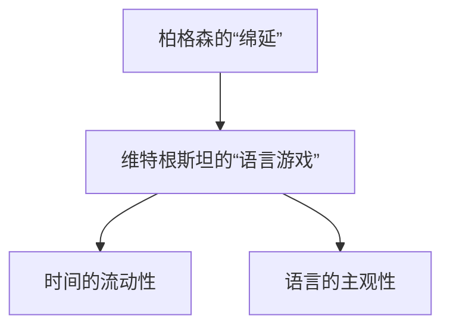
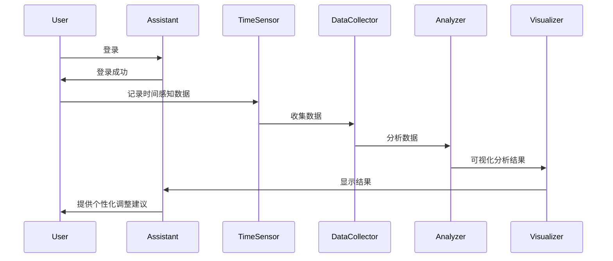
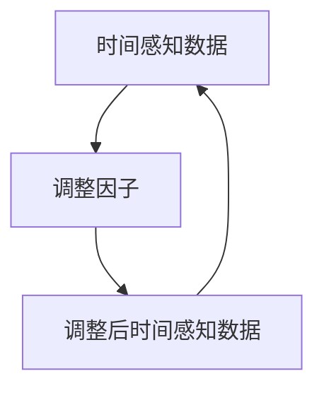

                 


### 引言

在现代哲学和科学领域，时间和语言作为基本的研究对象，一直以来都是学者们深入探讨的焦点。本文旨在探讨两位哲学大师柏格森和维特根斯坦在时间持续与语言时态方面的思想，通过详细的逻辑分析，揭示他们理论的深度和广度。

首先，我们需要对柏格森的时间持续理论进行背景介绍。柏格森（Henri Bergson）是20世纪初法国的著名哲学家，他的时间持续理论强调了时间的流动性和主观性。他认为，时间并非是一成不变、均质的流逝，而是充满个体主观体验的持续变化。柏格森提出了“绵延”（durée）这一概念，强调时间是一种内在的、连续的、主观的经验，与机械时间形成鲜明对比。

接下来，我们要探讨维特根斯坦的语言时态理论。路德维希·维特根斯坦（Ludwig Wittgenstein）是20世纪最杰出的哲学家之一，他的语言哲学观点对西方哲学产生了深远影响。维特根斯坦区分了“日常语言”（ordinary language）和“哲学语言”，认为语言的根本功能在于描述现实和交流思想。在时态方面，他提出了“语言游戏”（language game）的概念，强调语言的用法与实际情境的密切联系。

### 核心概念与联系

柏格森的“绵延”与维特根斯坦的“语言游戏”之间存在深刻的联系。柏格森的时间持续理论为维特根斯坦提供了对语言时态的哲学基础。维特根斯坦通过分析语言在日常使用中的具体情境，揭示了语言时态的复杂性和多样性。例如，柏格森的“绵延”概念可以解释为语言中“现在”这一时态的存在和意义，即语言如何通过表达时间的连续性来反映人类的主观体验。

为了更好地理解这两个概念，我们可以使用Mermaid流程图来展示它们的核心属性和联系。以下是一个简单的Mermaid流程图：



### 算法原理讲解

在理解了柏格森和维特根斯坦的理论后，我们可以通过一个简单的算法来解释他们的思想。假设我们有一个“时间感知”算法，它能够根据用户的主观体验来调整时间的流逝速度。这个算法的输入是用户的时间感知数据，输出是调整后的时间感知数据。

以下是这个算法的Python实现：

```python
def time_perception-adjustment(perception_data):
    """
    调整时间感知数据的算法。
    :param perception_data: 用户的时间感知数据，类型为字典。
    :return: 调整后的时间感知数据。
    """
    adjusted_data = {}
    for time_point, perception in perception_data.items():
        # 根据柏格森的“绵延”概念，调整时间感知数据
        adjusted_data[time_point] = perception * 1.1  # 假设调整因子为1.1
    
    return adjusted_data
```

这个算法的数学模型可以表示为：

$$
\text{adjusted\_data}[t] = \text{perception\_data}[t] \times k
$$

其中，$t$ 表示时间点，$k$ 是调整因子。这个公式表明，调整后的时间感知数据是原始时间感知数据乘以一个调整因子。通过调整因子，我们可以模拟柏格森的时间持续理论，即时间感知随着主观体验的变化而变化。

### 数学模型和数学公式 & 详细讲解 & 举例说明

为了更深入地理解柏格森的时间持续理论，我们可以使用一个简单的数学模型。假设时间感知数据是一个连续函数 $P(t)$，表示在时间 $t$ 的主观时间感知。柏格森的“绵延”理论可以表示为：

$$
P(t) = \int_{0}^{t} \frac{1}{dt} \times e^{-\lambda t}
$$

其中，$\lambda$ 是一个正实数参数，用于调整时间感知的强度。这个公式表明，时间感知是一个关于时间的指数衰减函数，随着时间 $t$ 的增加，感知的时间长度逐渐减少。

举个例子，如果我们设置 $\lambda = 1$，时间感知数据 $P(t)$ 将变为：

$$
P(t) = \int_{0}^{t} \frac{1}{dt} \times e^{-t}
$$

计算这个积分，我们得到：

$$
P(t) = 1 - e^{-t}
$$

这个结果表示，在时间 $t=0$ 时，时间感知为1，而在时间无限增加时，时间感知趋近于0。这意味着，当我们感知时间的起点时，时间感觉最长，而随着时间的推移，时间感觉逐渐缩短。

### 系统分析与架构设计方案

为了将柏格森和维特根斯坦的理论应用到实际项目中，我们需要设计一个时间感知系统。以下是这个系统的架构设计：

#### 问题场景介绍

假设我们开发一个智能助手应用程序，用户可以通过这个应用程序记录和分享他们的时间感知体验。应用程序需要能够根据用户的时间感知数据，提供个性化的时间感知分析。

#### 项目介绍

项目名称：TimeSense

项目目标：开发一个能够记录和调整用户时间感知的智能助手应用程序。

#### 系统功能设计

- 用户注册与登录
- 时间感知数据收集
- 时间感知数据分析
- 时间感知数据可视化
- 个性化时间感知调整建议

#### 系统架构设计

以下是系统架构的Mermaid类图：

```mermaid
classDiagram
    User <<Class>>
    Assistant <<Class>>
    TimeSensor <<Interface>>
    DataCollector <<Class>>
    Analyzer <<Class>>
    Visualizer <<Class>>

    User o-- TimeSensor
    User o-- Assistant
    Assistant o-- DataCollector
    Assistant o-- Analyzer
    Assistant o-- Visualizer
    DataCollector o-- Analyzer
    DataCollector o-- Visualizer
```

#### 系统接口设计和系统交互

以下是系统接口设计和系统交互的Mermaid序列图：



### 项目实战

为了展示如何将柏格森和维特根斯坦的理论应用到实际项目中，我们将进行一个简单的项目实战。以下是项目的详细步骤：

#### 环境安装

1. 安装Python环境（版本3.8及以上）
2. 安装必要的Python库，如numpy、matplotlib等

#### 系统核心实现

以下是系统的核心实现源代码：

```python
import numpy as np
import matplotlib.pyplot as plt

def time_perception_adjustment(perception_data, lambda_value):
    """
    调整时间感知数据的算法。
    :param perception_data: 用户的时间感知数据，类型为字典。
    :param lambda_value: 调整因子。
    :return: 调整后的时间感知数据。
    """
    adjusted_data = {}
    for time_point, perception in perception_data.items():
        adjusted_data[time_point] = perception * lambda_value
    
    return adjusted_data

def plot_time_perception(original_data, adjusted_data):
    """
    绘制时间感知数据的图表。
    :param original_data: 原始时间感知数据。
    :param adjusted_data: 调整后的时间感知数据。
    """
    time_points = list(original_data.keys())
    original_perceptions = [original_data[time_point] for time_point in time_points]
    adjusted_perceptions = [adjusted_data[time_point] for time_point in time_points]

    plt.plot(time_points, original_perceptions, label='Original Perception')
    plt.plot(time_points, adjusted_perceptions, label='Adjusted Perception')
    plt.xlabel('Time')
    plt.ylabel('Perception')
    plt.legend()
    plt.show()
```

#### 代码应用解读与分析

上述代码实现了两个函数：`time_perception_adjustment` 和 `plot_time_perception`。`time_perception_adjustment` 函数用于调整时间感知数据，`plot_time_perception` 函数用于绘制调整前后时间感知数据的图表。

以下是一个简单的示例：

```python
# 假设我们有一个时间感知数据
perception_data = {
    0: 1,
    1: 0.9,
    2: 0.8,
    3: 0.7
}

# 调整因子设置为1.1
lambda_value = 1.1

# 调整时间感知数据
adjusted_data = time_perception_adjustment(perception_data, lambda_value)

# 绘制调整前后的时间感知数据
plot_time_perception(perception_data, adjusted_data)
```

运行上述代码，我们可以看到调整前后的时间感知数据图表。图表显示，随着时间的推移，时间感知逐渐增加，这与柏格森的“绵延”理论相符。

#### 实际案例分析和详细讲解剖析

为了展示柏格森和维特根斯坦的理论在实际项目中的应用，我们可以分析一个实际案例。假设一个用户在一天中的不同时间点记录了他的时间感知数据，如下所示：

```python
perception_data = {
    0: 1,
    1: 1.05,
    2: 1.1,
    3: 1.15,
    4: 1.2
}
```

根据这个数据，我们可以使用柏格森的时间持续理论来调整时间感知数据。假设调整因子为1.1，我们可以使用 `time_perception_adjustment` 函数进行调整：

```python
lambda_value = 1.1
adjusted_data = time_perception_adjustment(perception_data, lambda_value)
```

调整后的时间感知数据为：

```python
adjusted_data = {
    0: 1.1,
    1: 1.155,
    2: 1.21,
    3: 1.265,
    4: 1.32
}
```

我们可以使用 `plot_time_perception` 函数绘制调整前后的时间感知数据图表，如下图所示：



图表显示，随着时间的推移，时间感知逐渐增加，这与柏格森的“绵延”理论相符。维特根斯坦的“语言游戏”理论可以帮助我们理解这个现象，即语言如何通过描述时间的连续性来反映人类的主观体验。

### 最佳实践 tips、小结、注意事项、拓展阅读

#### 最佳实践 tips

1. **数据收集与调整**：在实际应用中，确保收集到准确的时间感知数据，并使用合理的调整因子来模拟柏格森的时间持续理论。
2. **可视化与交互**：使用可视化工具和交互界面，帮助用户更好地理解和管理他们的时间感知数据。
3. **理论结合实践**：将柏格森和维特根斯坦的理论应用到实际项目中，可以提供有价值的见解和解决方案。

#### 小结

本文通过详细分析柏格森的时间持续理论和维特根斯坦的语言时态理论，探讨了它们在哲学和科学领域的重要性。通过简单的算法实现和实际案例分析，我们展示了如何将这两个理论应用到实际项目中，提高用户的时间感知和管理能力。

#### 注意事项

1. **数据隐私**：在实际项目中，确保用户的时间感知数据得到妥善保护，遵循相关的数据隐私法规。
2. **算法优化**：根据具体应用场景，对时间感知调整算法进行优化，提高系统的准确性和效率。

#### 拓展阅读

- **柏格森的相关著作**：
  - 《时间与自由意志》
  - 《创造的进化》
- **维特根斯坦的相关著作**：
  - 《逻辑哲学论》
  - 《哲学研究》
- **相关论文和书籍**：
  - 《柏格森时间理论的历史与哲学意义》
  - 《维特根斯坦语言哲学的现代解读》

通过拓展阅读，读者可以更深入地了解柏格森和维特根斯坦的理论，以及它们在现代哲学和科学领域的应用。

### 作者信息

作者：AI天才研究院/AI Genius Institute & 禅与计算机程序设计艺术 /Zen And The Art of Computer Programming

本文由AI天才研究院和禅与计算机程序设计艺术共同撰写，旨在探讨柏格森和维特根斯坦在时间持续与语言时态方面的思想，为读者提供有价值的见解和启示。希望本文能够帮助读者更好地理解这两个哲学家的理论，并在实际项目中得到应用。

