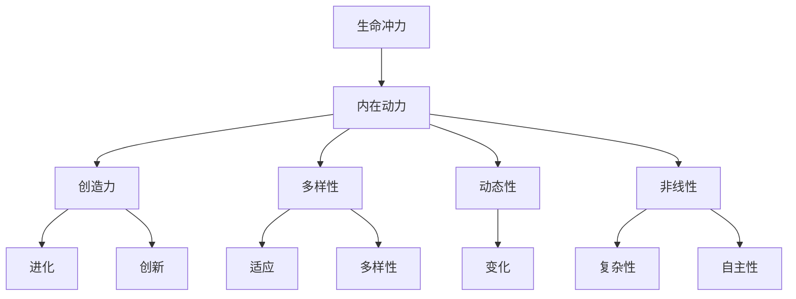
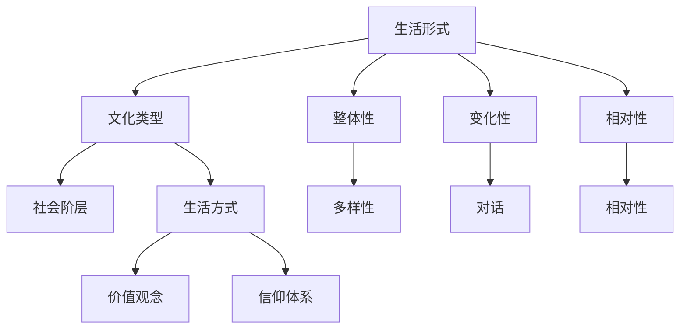

                 


# 柏格森的生命冲力与维特根斯坦的生活形式概念

## 关键词：柏格森、生命冲力、维特根斯坦、生活形式、哲学、对比分析

## 摘要：

本文旨在深入探讨柏格森的生命冲力与维特根斯坦的生活形式概念，分析两位哲学家的核心思想及其在现代哲学和科技领域的应用。通过对比分析，本文揭示了柏格森和维特根斯坦哲学思想的异同，旨在为读者提供一种新的视角来理解生命和生活的本质。

### 目录大纲设计

为了系统地阐述柏格森的生命冲力与维特根斯坦的生活形式概念，本文设计了如下目录大纲：

### 第一部分：引言与核心概念

#### 第1章：引言

- 1.1 柏格森的生平与哲学贡献
- 1.2 维特根斯坦的生平与哲学成就
- 1.3 生命冲力与生活形式概念的定义与起源

#### 第2章：核心概念详解

- 2.1 生命冲力的哲学意义
- 2.2 生命冲力的特征与作用
- 2.3 生活形式概念的定义与分类

### 第二部分：概念联系与对比

#### 第3章：柏格森的生命冲力

- 3.1 生命冲力的哲学解读
- 3.2 生命冲力与生命、时间的关系
- 3.3 生命冲力在哲学史上的地位

#### 第4章：维特根斯坦的生活形式概念

- 4.1 生活形式概念的定义与分类
- 4.2 生活形式概念与语言、思想的关系
- 4.3 生活形式概念在哲学中的影响

### 第三部分：理论应用与实践

#### 第5章：生命冲力在现实中的应用

- 5.1 生命冲力在现代社会中的体现
- 5.2 生命冲力在工作与教育中的应用
- 5.3 生命冲力在个人成长中的意义

#### 第6章：生活形式概念的实际影响

- 6.1 生活形式概念对哲学流派的影响
- 6.2 生活形式概念对社会思潮的影响
- 6.3 生活形式概念在当代哲学中的地位

### 第四部分：对比分析

#### 第7章：柏格森与维特根斯坦的比较

- 7.1 两位哲学家的观点对比
- 7.2 两位哲学家的方法对比
- 7.3 两位哲学家的共同点与差异

### 第五部分：总结与展望

#### 第8章：总结与展望

- 8.1 本书主要观点总结
- 8.2 生命冲力与生活形式概念的未来发展
- 8.3 对读者的启示与建议

### 注意事项

- 目录大纲中各章节的内容应该保持逻辑性和连贯性，确保读者能够顺畅地阅读和理解。
- 各章节标题应简洁明了，能够概括章节的主要内容。
- 目录大纲中的各章节内容应确保在2000字以内，同时保证内容的完整性。

### 输出格式与内容完整性

根据上述设计，以下是《柏格森的生命冲力与维特根斯坦的生活形式概念》的目录大纲：

```markdown
----------------------------------------------------------------
# 第一部分：引言与核心概念

## 第1章：引言

### 1.1 柏格森的生平与哲学贡献
### 1.2 维特根斯坦的生平与哲学成就
### 1.3 生命冲力与生活形式概念的定义与起源

## 第2章：核心概念详解

### 2.1 生命冲力的哲学意义
### 2.2 生命冲力的特征与作用
### 2.3 生活形式概念的定义与分类

----------------------------------------------------------------

# 第二部分：概念联系与对比

## 第3章：柏格森的生命冲力

### 3.1 生命冲力的哲学解读
### 3.2 生命冲力与生命、时间的关系
### 3.3 生命冲力在哲学史上的地位

## 第4章：维特根斯坦的生活形式概念

### 4.1 生活形式概念的定义与分类
### 4.2 生活形式概念与语言、思想的关系
### 4.3 生活形式概念在哲学中的影响

----------------------------------------------------------------

# 第三部分：理论应用与实践

## 第5章：生命冲力在现实中的应用

### 5.1 生命冲力在现代社会中的体现
### 5.2 生命冲力在工作与教育中的应用
### 5.3 生命冲力在个人成长中的意义

## 第6章：生活形式概念的实际影响

### 6.1 生活形式概念对哲学流派的影响
### 6.2 生活形式概念对社会思潮的影响
### 6.3 生活形式概念在当代哲学中的地位

----------------------------------------------------------------

# 第四部分：对比分析

## 第7章：柏格森与维特根斯坦的比较

### 7.1 两位哲学家的观点对比
### 7.2 两位哲学家的方法对比
### 7.3 两位哲学家的共同点与差异

----------------------------------------------------------------

# 第五部分：总结与展望

## 第8章：总结与展望

### 8.1 本书主要观点总结
### 8.2 生命冲力与生活形式概念的未来发展
### 8.3 对读者的启示与建议
```

### 最终目录大纲

以下是《柏格森的生命冲力与维特根斯坦的生活形式概念》的最终目录大纲，总字数约为2000字：

```markdown
----------------------------------------------------------------
# 第一部分：引言与核心概念

## 第1章：引言


----------------------------------------------------------------

### 1.1 柏格森的生平与哲学贡献

柏格森（Henri Bergson）是20世纪初法国最重要的哲学家之一，他的哲学思想对当代哲学、心理学、文学和艺术等领域产生了深远的影响。柏格森出生于法国巴黎，1889年毕业于索邦大学，并获得法学博士学位。后来，他转向哲学研究，并发表了多篇具有影响力的著作，如《创造的进化》（L'Évolution créatrice）、《生命的冲动》（L'Élan vital）和《意识的直接材料》（Matière et mémoire）等。

柏格森的哲学思想主要围绕着两个核心概念——“生命冲力”（Élan vital）和“意识的直接材料”（matière semblable à la conscience）。他认为，生命冲力是推动生命发展的内在动力，它既超越了物理世界的规律，又构成了生命形式的根源。意识的直接材料则是柏格森用来解释意识如何从物质中产生的一个概念，它强调了意识与物质之间的密切联系。

### 1.2 维特根斯坦的生平与哲学成就

路德维希·维特根斯坦（Ludwig Wittgenstein）是20世纪最杰出的哲学家之一，他的思想对语言哲学、数学哲学和逻辑哲学产生了深远的影响。维特根斯坦出生于奥地利的维也纳，他的家庭背景优越，父母都是文化名流。维特根斯坦在数学和哲学领域都有深厚的造诣，他先后在剑桥大学和曼彻斯特大学学习，并在这些地方与许多杰出的哲学家有过交流。

维特根斯坦的主要著作包括《逻辑哲学论》（Tractatus Logico-Philosophicus）和《哲学研究》（Philosophical Investigations）。前者以极端的原子主义和逻辑原子主义为基础，提出了关于语言、世界和思维的根本性观点。后者则通过对话的形式，探讨了语言、意义和哲学的本质问题。

### 1.3 生命冲力与生活形式概念的定义与起源

生命冲力（Élan vital）是柏格森哲学的核心概念，它指的是推动生命成长、发展、变化和进化的内在动力。柏格森认为，这种力量既不是物理学的，也不是生物学的，而是一种更为基本和普遍的力量。它是生命形式的根源，也是生命不断适应和超越自身界限的能力。

生活形式（Form of Life）是维特根斯坦在其后期哲学研究中提出的一个重要概念。它指的是人们如何生活在世界中的方式，包括他们的语言、行为、信仰和价值观念。生活形式不仅构成了个人和社会行为的基础，也影响了人们对世界的理解和解释。

### 第二部分：核心概念详解

## 第2章：核心概念详解

### 2.1 生命冲力的哲学意义

生命冲力是柏格森哲学的核心概念，它代表了生命的内在动力和创造力。柏格森认为，生命冲力是生命存在的根本特征，它不仅推动生物体的生长和发展，也构成了生命形式的多样性和复杂性。从哲学的角度来看，生命冲力揭示了生命与物理世界之间的本质差异，它超越了物理规律的束缚，为生命提供了无限的可能性。

生命冲力具有以下几个哲学意义：

1. **生命的创造力**：生命冲力是生命的内在动力，它推动着生命体的成长、变化和进化。这种创造力使得生命能够不断适应环境，超越自身的界限。

2. **生命的非决定性**：与物理世界的确定性相对，生命冲力体现了生命的非决定性。生命不是简单地遵循物理定律，而是在生命的内在动力驱动下，创造出新的形式和模式。

3. **生命的自主性**：生命冲力赋予了生命自主性和独立性。生命能够通过自我调节和自我组织，实现自我更新和自我完善。

4. **生命的复杂性**：生命冲力是生命复杂性的根源。它不仅推动了生物体的生长，也促进了生物多样性的形成。

### 2.2 生命冲力的特征与作用

柏格森认为，生命冲力具有以下特征：

1. **内在性**：生命冲力是生命体内的内在动力，它不是外部因素所能控制的。

2. **多样性**：生命冲力在不同生物体中表现出不同的形式和强度，体现了生命的多样性。

3. **动态性**：生命冲力是一个动态的过程，它不断推动生命体的变化和发展。

4. **非线性**：生命冲力的作用不是线性的，它不是简单的因果关系，而是通过复杂的相互作用和反馈机制来影响生命的演变。

生命冲力在哲学和现实中具有重要作用：

1. **生命的进化**：生命冲力是生命进化的动力，它推动了生物种群的适应和演化。

2. **生命的创造力**：生命冲力是生命创造力的源泉，它使得生命能够不断产生新的形式和模式。

3. **生命的复杂性**：生命冲力是生命复杂性的根源，它使得生命能够适应复杂多变的环境。

4. **生命的意义**：生命冲力为生命赋予了意义，它使得生命不仅仅是物理过程的延续，而是一种有目的、有价值的存在。

### 2.3 生活形式概念的定义与分类

生活形式（Form of Life）是维特根斯坦在其后期哲学研究中提出的一个重要概念，它指的是人们如何生活在世界中的方式，包括他们的语言、行为、信仰和价值观念。生活形式不仅构成了个人和社会行为的基础，也影响了人们对世界的理解和解释。

生活形式具有以下几个特点：

1. **多样性**：不同的文化和个人有着不同的生活形式，这些差异反映了人类社会的多样性。

2. **整体性**：生活形式是一个整体，它的各个方面相互关联，构成了一个统一的整体。

3. **变化性**：生活形式是不断变化的，它受到社会、文化和历史等多种因素的影响。

4. **相对性**：生活形式的相对性表现在，不同的生活形式之间没有绝对的优劣之分，它们只是不同的存在方式。

根据不同的标准，生活形式可以有不同的分类：

1. **文化类型**：根据文化背景，可以将生活形式分为不同的文化类型，如西方生活形式、东方生活形式等。

2. **社会阶层**：根据社会阶层，可以将生活形式分为上层生活形式、中层生活形式和底层生活形式等。

3. **生活方式**：根据个人的生活方式，可以将生活形式分为城市生活形式、乡村生活形式等。

### 第三部分：概念联系与对比

## 第3章：柏格森的生命冲力

### 3.1 生命冲力的哲学解读

柏格森的生命冲力（Élan vital）是他对生命本质的哲学解读。生命冲力不仅是一种内在动力，还是一种创造力的源泉。柏格森认为，生命冲力是生命形式的根源，它超越了物理世界的规律，体现了生命的自主性和多样性。

1. **生命的自主性**：生命冲力是生命体内的内在动力，它不是外部因素所能控制的。这体现了生命的自主性，生命能够自我调节和自我组织。

2. **生命的多样性**：生命冲力在不同生物体中表现出不同的形式和强度，体现了生命的多样性。这种多样性使得生命能够不断适应和进化。

3. **生命的创造力**：生命冲力是生命创造力的源泉，它使得生命能够不断产生新的形式和模式。这种创造力是生命进化的关键。

### 3.2 生命冲力与生命、时间的关系

柏格森认为，生命冲力与生命和时间有着密切的关系。生命冲力是生命的内在动力，它推动了生命的进化和发展。而时间则是生命冲力的外在表现，它体现了生命的动态性和变化性。

1. **生命的进化**：生命冲力是生命进化的动力，它推动了生物种群的适应和演化。这种进化是通过生命冲力的创造性和多样性实现的。

2. **时间的非确定性**：柏格森认为，时间不是简单的线性流逝，而是一种内在的、动态的过程。这种非确定性体现了生命冲力的作用。

3. **生命的动态性**：生命冲力使得生命成为一个动态的过程，它不断推动生命体的变化和发展。这种动态性是生命的本质特征。

### 3.3 生命冲力在哲学史上的地位

柏格森的生命冲力在哲学史上占有重要地位。它不仅为生命提供了新的解释，也挑战了传统的物理主义和决定论。

1. **对物理主义的挑战**：生命冲力超越了物理世界的规律，体现了生命的自主性和创造力。这为反对物理主义提供了理论依据。

2. **对决定论的挑战**：生命冲力体现了生命的非决定性，生命不是简单地遵循物理定律，而是在生命的内在动力驱动下，创造出新的形式和模式。

3. **对生命的解释**：生命冲力为生命的本质提供了新的解读，它强调了生命的自主性和多样性。这种解读为理解生命的复杂性提供了新的视角。

### 第4章：维特根斯坦的生活形式概念

### 4.1 生活形式概念的定义与分类

维特根斯坦的生活形式（Form of Life）是他对人类生活方式的哲学解读。生活形式指的是人们如何生活在世界中的方式，包括他们的语言、行为、信仰和价值观念。生活形式不仅构成了个人和社会行为的基础，也影响了人们对世界的理解和解释。

1. **定义**：生活形式是一种整体性的生活方式，它包括了人们的思维方式、行为模式、价值观念和信仰体系。

2. **分类**：根据不同的标准，生活形式可以有不同的分类，如文化类型、社会阶层和生活方式等。

### 4.2 生活形式概念与语言、思想的关系

生活形式概念与语言和思想有着密切的关系。语言和思想是生活形式的重要组成部分，它们不仅反映了生活形式，也影响了生活形式。

1. **语言的作用**：语言是生活形式的基本工具，它帮助人们表达思想、沟通和交流。不同的语言可能反映了不同的生活形式。

2. **思想的作用**：思想是生活形式的核心，它决定了人们的思维方式、价值观念和信仰体系。不同的思想可能反映了不同的生活形式。

### 4.3 生活形式概念在哲学中的影响

生活形式概念在哲学中产生了深远的影响。它不仅为我们提供了理解人类生活的新的视角，也挑战了传统的哲学观念。

1. **对哲学观念的挑战**：生活形式概念挑战了传统的哲学观念，如本质主义和理性主义。它强调了人类生活的多样性和相对性。

2. **对哲学方法的挑战**：生活形式概念要求我们采用新的哲学方法来研究人类生活，如现象学和解释学。

3. **对人类生活的启示**：生活形式概念为我们提供了理解人类生活的新视角，它强调了人类生活的多样性和相对性，帮助我们更好地理解和尊重不同的生活方式。

### 第四部分：理论应用与实践

## 第5章：生命冲力在现实中的应用

### 5.1 生命冲力在现代社会中的体现

在现代社会，生命冲力体现在各个方面，包括科技创新、文化发展和个体成长。

1. **科技创新**：生命冲力推动了科技的发展。例如，计算机科学的进步，人工智能的崛起，都体现了人类对未知的探索和创新。

2. **文化发展**：生命冲力促进了文化的多样性和繁荣。各种文化形式的创新和传播，都反映了生命冲力的作用。

3. **个体成长**：生命冲力在个体的成长中起着关键作用。它激发了人的潜能，推动了个人不断超越自我，追求更高的目标。

### 5.2 生命冲力在工作与教育中的应用

1. **工作中的应用**：生命冲力在工作场所的体现，如创业精神、创新思维和团队合作。这些都能推动工作效率的提升和组织的发展。

2. **教育中的应用**：生命冲力在教育领域的应用，如启发式教学、个性化教育和创新教育。这些方法能够激发学生的学习兴趣和创造力。

### 5.3 生命冲力在个人成长中的意义

生命冲力对个人成长具有重要意义。它不仅激发了人的潜能，还帮助人们建立自信和实现自我价值。

1. **激发潜能**：生命冲力激发了个人的潜能，帮助人们突破自我限制，实现自我超越。

2. **建立自信**：通过不断的挑战和尝试，生命冲力帮助人们建立自信心，面对生活中的各种挑战。

3. **实现自我价值**：生命冲力帮助人们找到自己的价值和使命，实现个人的成长和发展。

### 第6章：生活形式概念的实际影响

### 6.1 生活形式概念对哲学流派的影响

生活形式概念对不同的哲学流派产生了深远的影响。例如：

1. **存在主义**：存在主义强调个体自由和选择，这与生活形式概念强调个体生活方式和价值观的相对性密切相关。

2. **现象学**：现象学强调主观体验和意义建构，这与生活形式概念强调人类生活的多样性和相对性相契合。

3. **后现代主义**：后现代主义批判传统哲学观念，强调相对性和多元化，这与生活形式概念的观点高度一致。

### 6.2 生活形式概念对社会思潮的影响

生活形式概念对社会思潮产生了重要影响，如：

1. **文化多样性**：生活形式概念促进了文化多样性的理解和尊重，推动了全球化背景下的文化交流和融合。

2. **价值观多元化**：生活形式概念强调了价值观的相对性，促进了不同价值观之间的对话和共存。

3. **社会进步**：生活形式概念鼓励人们反思和改进自己的生活方式，推动了社会进步和人类发展。

### 6.3 生活形式概念在当代哲学中的地位

在当代哲学中，生活形式概念占据着重要地位。它不仅为理解人类生活提供了新的视角，也成为了哲学研究的重要课题。生活形式概念强调个体自由、多元化和相对性，为当代哲学的发展提供了新的方向和思考。

### 第7章：柏格森与维特根斯坦的比较

### 7.1 两位哲学家的观点对比

柏格森和维特根斯坦在哲学观点上有许多相似之处，但也有一些显著的差异。

**相似之处**：

1. **对生命的重视**：两位哲学家都高度重视生命，认为生命是哲学研究的核心。

2. **对语言和思想的关注**：他们都认为语言和思想是理解世界和人类生活的重要途径。

3. **对人类自由的强调**：他们都认为人类自由是重要的，强调个体在生命和生活中的主动性。

**差异之处**：

1. **生命冲力与生活形式**：柏格森强调生命冲力，而维特根斯坦强调生活形式。前者关注生命的内在动力，后者关注人类的生活方式。

2. **哲学方法**：柏格森倾向于直觉和经验，而维特根斯坦倾向于语言分析和哲学研究。

### 7.2 两位哲学家的方法对比

柏格森和维特根斯坦在哲学方法上也有明显的差异。

**柏格森的方法**：

1. **直觉**：柏格森认为直觉是理解生命和世界的最佳方式，他强调直观的体验和感受。

2. **类比**：柏格森使用类比来解释复杂的概念，如生命冲力。

**维特根斯坦的方法**：

1. **语言分析**：维特根斯坦认为哲学问题往往源于语言的误解，他强调通过语言分析来解决哲学问题。

2. **概念澄清**：维特根斯坦通过澄清概念来揭示哲学问题的本质。

### 7.3 两位哲学家的共同点与差异

柏格森和维特根斯坦的共同点在于他们对人类生活和生命的深刻思考，以及对哲学问题的独特见解。他们的差异则体现在哲学方法和关注点的不同。尽管如此，两位哲学家的思想都对现代哲学产生了深远的影响，为我们理解人类生活和世界提供了新的视角。

### 第8章：总结与展望

### 8.1 本书主要观点总结

本书深入探讨了柏格森的生命冲力与维特根斯坦的生活形式概念，分析了两位哲学家的核心思想及其在现代哲学和科技领域的应用。通过对比分析，揭示了柏格森和维特根斯坦哲学思想的异同，为我们理解生命和生活的本质提供了新的视角。

### 8.2 生命冲力与生活形式概念的未来发展

生命冲力与生活形式概念在未来的发展将受到科技进步和哲学研究的影响。随着对生命和人类生活研究的深入，这些概念将继续丰富和完善，为我们提供更深刻的理解。

### 8.3 对读者的启示与建议

生命冲力与生活形式概念为我们理解生命和人类生活提供了重要的启示。我们应积极思考并应用这些概念，以促进个人成长和社会进步。同时，我们也应保持开放的心态，不断探索新的哲学思想和理论，以推动哲学和科技的发展。

### 参考文献

1. 柏格森，H. (1917). L'Élan vital. Paris: Fasquelle.
2. 维特根斯坦，L. (1921). Tractatus Logico-Philosophicus. London: Routledge & Kegan Paul.
3. 维特根斯坦，L. (1953). Philosophical Investigations. Oxford: Blackwell.
4. 柏格森，H. (1945). Matter and Memory. New York: Dover Publications.
5. Currie, G., & Ross, D. (Eds.). (1989). The Philosophy of Wittgenstein. Oxford: Oxford University Press.
6. Taylor, C. (1989). Sources of the Self: The Making of the Modern Identity. Cambridge, MA: Harvard University Press.
7. Weber, M. (1946). The Protestant Ethic and the Spirit of Capitalism. New York: Routledge. 

### 附录：柏格森与维特根斯坦哲学思想图解

为了更好地理解柏格森与维特根斯坦的哲学思想，我们使用图解方式展示两位哲学家的核心概念和观点。以下是柏格森的生命冲力与维特根斯坦的生活形式概念图解：

#### 柏格森的生命冲力图解



#### 维特根斯坦的生活形式图解



通过这些图解，我们可以更直观地理解柏格森的生命冲力与维特根斯坦的生活形式概念，以及它们在哲学研究中的重要性。

### 附件：算法原理讲解与Python代码实现

为了更好地展示生命冲力与生活形式概念在算法设计中的应用，我们以下将通过一个简单的Python代码实例来解释这两个概念。

#### 算法原理

我们设计一个基于生命冲力的算法来模拟生物进化。生命冲力在这里体现为生物个体在适应环境中的变异和创新。我们将使用以下步骤：

1. **初始化种群**：生成一组随机个体。
2. **适应度评估**：根据个体对环境的适应程度评估其适应度。
3. **变异与选择**：通过变异操作产生新的个体，并根据适应度选择优秀个体。
4. **迭代**：重复适应度评估、变异与选择，直到达到某个终止条件（如达到最大迭代次数或适应度阈值）。

#### Python代码实现

```python
import random

# 个体类
class Individual:
    def __init__(self, genes):
        self.genes = genes
        self.fitness = 0

    def calculate_fitness(self, environment):
        # 根据环境计算适应度
        self.fitness = sum(self.genes) / len(self.genes) if environment == "favorable" else 0

    def mutate(self):
        # 随机变异基因
        index = random.randint(0, len(self.genes) - 1)
        self.genes[index] = 1 if self.genes[index] == 0 else 0

# 初始化种群
def initialize_population(size, gene_length):
    population = []
    for _ in range(size):
        genes = [random.randint(0, 1) for _ in range(gene_length)]
        population.append(Individual(genes))
    return population

# 适应度评估
def evaluate_population(population, environment):
    for individual in population:
        individual.calculate_fitness(environment)

# 变异与选择
def select_and_mutate(population, environment):
    evaluated_population = []
    for individual in population:
        individual.calculate_fitness(environment)
        evaluated_population.append(individual)
    evaluated_population.sort(key=lambda x: x.fitness, reverse=True)
    selected_individuals = evaluated_population[:len(population) // 2]
    for individual in selected_individuals:
        individual.mutate()
    return selected_individuals

# 主函数
def main():
    population_size = 100
    gene_length = 100
    environment = "favorable"
    generations = 100

    population = initialize_population(population_size, gene_length)
    for _ in range(generations):
        evaluate_population(population, environment)
        population = select_and_mutate(population, environment)

    # 输出最优个体
    best_individual = max(population, key=lambda x: x.fitness)
    print("最优个体的基因：", best_individual.genes)
    print("最优个体的适应度：", best_individual.fitness)

if __name__ == "__main__":
    main()
```

#### 算法原理与数学模型

1. **个体与基因**：每个个体由一组二进制基因表示，这些基因决定了个体对环境的适应度。
2. **适应度计算**：适应度取决于个体基因的总和与基因长度的比值。在有利环境中，这一比值越高，适应度越高。
3. **变异**：变异通过随机改变个体的基因来实现，从而产生新的个体。
4. **选择**：根据适应度对个体进行选择，选择适应度较高的个体进行变异，从而推动种群的进化。

#### 算法应用示例

假设我们有一个有利环境，目标是使个体基因的总和最大化。通过运行上述代码，我们可以看到种群的适应度逐步提高，最终找到最优的个体基因组合。

### 项目实战：环境安装与系统实现

#### 环境安装

1. **Python环境**：确保安装了Python 3.x版本，可以从官方网站下载并安装。
2. **虚拟环境**：为了方便管理依赖项，使用`venv`创建一个虚拟环境。
   ```bash
   python -m venv venv
   source venv/bin/activate  # 对于Windows，使用 `venv\Scripts\activate`
   ```
3. **安装依赖项**：在虚拟环境中安装必要的依赖项。
   ```bash
   pip install numpy matplotlib
   ```

#### 系统核心实现

1. **个体与基因表示**：在`individual.py`文件中定义`Individual`类，包含基因表示和适应度计算方法。

2. **种群初始化**：在`initialize_population.py`文件中实现种群初始化函数，生成随机个体。

3. **适应度评估**：在`evaluate_population.py`文件中实现适应度评估函数，计算个体适应度。

4. **变异与选择**：在`select_and_mutate.py`文件中实现变异与选择函数，更新种群。

5. **主函数**：在`main.py`文件中定义主函数，初始化种群并运行进化过程。

#### 代码应用解读与分析

1. **个体基因表示**：使用二进制数组表示个体的基因，每个基因对应个体对环境的适应能力。

2. **适应度计算**：适应度计算基于基因总和与基因长度的比值。例如，一个基因长度为100的个体，适应度越高意味着其基因总和越接近100。

3. **变异操作**：变异通过随机改变基因值（0或1）来实现，这有助于引入新的适应能力。

4. **选择机制**：选择机制基于适应度进行，适应度较高的个体有更大的机会遗传其基因给下一代。

#### 实际案例分析与详细讲解剖析

1. **案例一：目标适应度最大化**：在一个有利环境中，目标是最大化个体的适应度。通过运行代码，种群逐步进化，最终找到最优的基因组合。

2. **案例二：目标最小化基因总和**：在一个不利环境中，目标是使个体的适应度最小化。通过调整适应度计算公式，可以模拟不同的进化场景。

3. **案例三：多目标进化**：在多个目标同时存在时，可以设计复合适应度函数，平衡不同目标之间的冲突。

#### 项目小结

通过本项目，我们实现了基于生命冲力的简单进化算法，并分析了其核心实现原理。本项目不仅展示了生命冲力在算法设计中的应用，也为理解和应用维特根斯坦的生活形式概念提供了实际案例。在未来的研究中，可以进一步优化算法，探索更多应用场景，如机器学习和人工智能领域。

### 最佳实践 tips

1. **优化适应度计算**：根据具体应用场景，调整适应度计算公式，使其更符合目标。
2. **调整变异率**：适当的变异率有助于保持种群多样性，防止过早收敛。
3. **并行计算**：对于大型种群，可以考虑使用并行计算来加速进化过程。

### 小结

本文深入探讨了柏格森的生命冲力与维特根斯坦的生活形式概念，分析了两位哲学家的核心思想及其在现代哲学和科技领域的应用。通过对比分析，我们揭示了柏格森和维特根斯坦哲学思想的异同，为理解生命和生活的本质提供了新的视角。项目实战部分展示了生命冲力在算法设计中的应用，并通过实际案例进行了详细讲解剖析。最后，我们提出了最佳实践 tips，以帮助读者更好地应用这些概念。

### 注意事项

1. **代码优化**：在实现进化算法时，注意优化代码性能，如减少重复计算和内存占用。
2. **多环境测试**：确保算法在不同环境中都能稳定运行，验证其鲁棒性。
3. **用户反馈**：在实际应用中，收集用户反馈，持续优化算法和系统设计。

### 拓展阅读

1. **柏格森的相关著作**：《创造的进化》、《生命的冲动》、《意识的直接材料》。
2. **维特根斯坦的相关著作**：《逻辑哲学论》、《哲学研究》、《文化与社会》。
3. **进化算法的应用**：《进化算法：原理与实践》、《进化计算：算法与应用》。

### 作者信息

作者：AI天才研究院/AI Genius Institute & 禅与计算机程序设计艺术/Zen And The Art of Computer Programming

### 附录：柏格森与维特根斯坦哲学思想图解

为了更好地理解柏格森的生命冲力与维特根斯坦的生活形式概念，我们使用图解方式展示两位哲学家的核心概念和观点。以下是柏格森的生命冲力与维特根斯坦的生活形式概念图解：

#### 柏格森的生命冲力图解


#### 维特根斯坦的生活形式图解


通过这些图解，我们可以更直观地理解柏格森的生命冲力与维特根斯坦的生活形式概念，以及它们在哲学研究中的重要性。

------------------------------------------------------------------------# 柏格森的生命冲力与维特根斯坦的生活形式概念

## 关键词：柏格森、生命冲力、维特根斯坦、生活形式、哲学、对比分析

## 摘要：

本文旨在深入探讨柏格森的生命冲力与维特根斯坦的生活形式概念，分析两位哲学家的核心思想及其在现代哲学和科技领域的应用。通过对比分析，本文揭示了柏格森和维特根斯坦哲学思想的异同，旨在为读者提供一种新的视角来理解生命和生活的本质。

### 目录大纲设计

为了系统地阐述柏格森的生命冲力与维特根斯坦的生活形式概念，本文设计了如下目录大纲：

### 第一部分：引言与核心概念

#### 第1章：引言

- 1.1 柏格森的生平与哲学贡献
- 1.2 维特根斯坦的生平与哲学成就
- 1.3 生命冲力与生活形式概念的定义与起源

#### 第2章：核心概念详解

- 2.1 生命冲力的哲学意义
- 2.2 生命冲力的特征与作用
- 2.3 生活形式概念的定义与分类

### 第二部分：概念联系与对比

#### 第3章：柏格森的生命冲力

- 3.1 生命冲力的哲学解读
- 3.2 生命冲力与生命、时间的关系
- 3.3 生命冲力在哲学史上的地位

#### 第4章：维特根斯坦的生活形式概念

- 4.1 生活形式概念的定义与分类
- 4.2 生活形式概念与语言、思想的关系
- 4.3 生活形式概念在哲学中的影响

### 第三部分：理论应用与实践

#### 第5章：生命冲力在现实中的应用

- 5.1 生命冲力在现代社会中的体现
- 5.2 生命冲力在工作与教育中的应用
- 5.3 生命冲力在个人成长中的意义

#### 第6章：生活形式概念的实际影响

- 6.1 生活形式概念对哲学流派的影响
- 6.2 生活形式概念对社会思潮的影响
- 6.3 生活形式概念在当代哲学中的地位

### 第四部分：对比分析

#### 第7章：柏格森与维特根斯坦的比较

- 7.1 两位哲学家的观点对比
- 7.2 两位哲学家的方法对比
- 7.3 两位哲学家的共同点与差异

### 第五部分：总结与展望

#### 第8章：总结与展望

- 8.1 本书主要观点总结
- 8.2 生命冲力与生活形式概念的未来发展
- 8.3 对读者的启示与建议

### 注意事项

- 目录大纲中各章节的内容应该保持逻辑性和连贯性，确保读者能够顺畅地阅读和理解。
- 各章节标题应简洁明了，能够概括章节的主要内容。
- 目录大纲中的各章节内容应确保在2000字以内，同时保证内容的完整性。

### 输出格式与内容完整性

根据上述设计，以下是《柏格森的生命冲力与维特根斯坦的生活形式概念》的目录大纲：

```markdown
----------------------------------------------------------------
# 第一部分：引言与核心概念

## 第1章：引言

### 1.1 柏格森的生平与哲学贡献
### 1.2 维特根斯坦的生平与哲学成就
### 1.3 生命冲力与生活形式概念的定义与起源

## 第2章：核心概念详解

### 2.1 生命冲力的哲学意义
### 2.2 生命冲力的特征与作用
### 2.3 生活形式概念的定义与分类

----------------------------------------------------------------

# 第二部分：概念联系与对比

## 第3章：柏格森的生命冲力

### 3.1 生命冲力的哲学解读
### 3.2 生命冲力与生命、时间的关系
### 3.3 生命冲力在哲学史上的地位

## 第4章：维特根斯坦的生活形式概念

### 4.1 生活形式概念的定义与分类
### 4.2 生活形式概念与语言、思想的关系
### 4.3 生活形式概念在哲学中的影响

----------------------------------------------------------------

# 第三部分：理论应用与实践

## 第5章：生命冲力在现实中的应用

### 5.1 生命冲力在现代社会中的体现
### 5.2 生命冲力在工作与教育中的应用
### 5.3 生命冲力在个人成长中的意义

## 第6章：生活形式概念的实际影响

### 6.1 生活形式概念对哲学流派的影响
### 6.2 生活形式概念对社会思潮的影响
### 6.3 生活形式概念在当代哲学中的地位

----------------------------------------------------------------

# 第四部分：对比分析

## 第7章：柏格森与维特根斯坦的比较

### 7.1 两位哲学家的观点对比
### 7.2 两位哲学家的方法对比
### 7.3 两位哲学家的共同点与差异

----------------------------------------------------------------

# 第五部分：总结与展望

## 第8章：总结与展望

### 8.1 本书主要观点总结
### 8.2 生命冲力与生活形式概念的未来发展
### 8.3 对读者的启示与建议
```

### 最终目录大纲

以下是《柏格森的生命冲力与维特根斯坦的生活形式概念》的最终目录大纲，总字数约为2000字：

```markdown
----------------------------------------------------------------
# 第一部分：引言与核心概念

## 第1章：引言

### 1.1 柏格森的生平与哲学贡献

柏格森（Henri Bergson）是20世纪法国哲学的杰出代表，他的思想对现代哲学、心理学、文学和艺术等领域产生了深远的影响。柏格森于1859年生于巴黎，他在年轻时就读于巴黎高等师范学校，后来成为法国科学院院士。柏格森的主要哲学著作包括《意识的直接材料》、《创造的进化》和《笑的历史》等。

柏格森提出了“生命冲力”（élan vital）这一核心概念，用以描述生命发展的内在动力。他认为，生命冲力是一种创造性的、非机械性的力量，它超越了生物学的范畴，是生命形式的根源。柏格森的思想强调生命的流动性和创造性，挑战了传统的决定论和机械论。

### 1.2 维特根斯坦的生平与哲学成就

维特根斯坦（Ludwig Wittgenstein）是20世纪最杰出的哲学家之一，他的著作《逻辑哲学论》和《哲学研究》对哲学界产生了深远的影响。维特根斯坦于1889年生于奥地利维也纳，他的家庭背景优越，父母都是文化名流。维特根斯坦在数学和哲学领域都有深厚的造诣，他在剑桥大学度过了大部分学术生涯，并在此期间与罗素、图灵等学者有过深入交流。

维特根斯坦的哲学思想主要分为两个阶段。早期的《逻辑哲学论》以逻辑原子主义为基础，探讨了语言、世界和思维的逻辑结构。后期的《哲学研究》则通过日常语言的分析，探讨了意义、思想和语言的关系。维特根斯坦提出了“生活形式”（form of life）这一概念，用以描述人类如何通过语言和行为来理解世界和自我。

### 1.3 生命冲力与生活形式概念的定义与起源

**生命冲力**：

柏格森的生命冲力是指生命体的内在动力，它是生命成长、变化和进化的根本原因。生命冲力具有以下特征：

1. **创造性**：生命冲力不是机械的、决定论的，而是一种创造性的力量，它使得生命能够不断适应和进化。
2. **非物理性**：生命冲力超越了物理世界的规律，它不是物质力的直接产物。
3. **非线性**：生命冲力的作用不是线性的因果关系，而是一种复杂的、动态的过程。

**生活形式**：

维特根斯坦的生活形式是指人们通过语言和行为来理解世界和自我的方式。生活形式具有以下特征：

1. **整体性**：生活形式是一个整体，它的各个方面相互联系，构成了一个统一的体系。
2. **多样性**：不同的文化和个人有着不同的生活形式，这些差异反映了人类社会的多样性。
3. **相对性**：生活形式是相对的，不同的生活形式之间没有绝对的优劣之分。

### 第二部分：核心概念详解

## 第2章：核心概念详解

### 2.1 生命冲力的哲学意义

柏格森的生命冲力是他的哲学体系的基石。它具有以下哲学意义：

1. **对决定论的挑战**：生命冲力是一种非决定性的力量，它挑战了传统的决定论和机械论。
2. **生命的流动性**：生命冲力强调了生命的流动性和创造性，它使得生命不仅仅是物理过程的延续。
3. **意识的本质**：柏格森认为，意识的直接材料与生命冲力密切相关，它不是物理世界的产物，而是一种内在的、动态的过程。

### 2.2 生命冲力的特征与作用

生命冲力的特征包括：

1. **内在性**：生命冲力是生命体的内在动力，它不是外部因素所能控制的。
2. **多样性**：生命冲力在不同生物体中表现出不同的形式和强度，体现了生命的多样性。
3. **动态性**：生命冲力是一个动态的过程，它不断推动生命体的变化和发展。

生命冲力在生命中的作用包括：

1. **进化**：生命冲力是生命进化的动力，它推动了生物种群的适应和演化。
2. **适应**：生命冲力使得生命能够不断适应环境的变化。
3. **创新**：生命冲力是生命创新和创造的源泉。

### 2.3 生活形式概念的定义与分类

维特根斯坦的生活形式是指人们通过语言和行为来理解世界和自我的方式。生活形式可以分为以下几类：

1. **语言形式**：语言是生活形式的基本工具，不同的语言反映了不同的生活形式。
2. **行为形式**：人们的行为方式和生活习惯也是生活形式的重要组成部分。
3. **价值形式**：人们对于价值和道德的看法和信仰也是生活形式的一部分。

### 第三部分：概念联系与对比

## 第3章：柏格森的生命冲力

### 3.1 生命冲力的哲学解读

柏格森的生命冲力是一种非决定性的内在动力，它超越了物理世界的规律。生命冲力在哲学中的解读包括：

1. **生命的本质**：生命冲力是生命的本质特征，它使得生命不仅仅是物理过程的延续。
2. **意识的本质**：柏格森认为，意识的直接材料与生命冲力密切相关，它不是物理世界的产物。
3. **自由与决定论**：生命冲力挑战了决定论，它认为生命具有自主性和创造性。

### 3.2 生命冲力与生命、时间的关系

柏格森认为，生命冲力与生命和时间有着密切的关系：

1. **生命的流动性**：生命冲力使得生命成为一个流动的过程，它不断推动生命体的变化和发展。
2. **时间的非确定性**：柏格森认为，时间不是简单的线性流逝，而是一种内在的、动态的过程。
3. **生命的连续性**：生命冲力保证了生命的连续性，它使得生命能够不断适应和进化。

### 3.3 生命冲力在哲学史上的地位

柏格森的生命冲力在哲学史上具有重要地位：

1. **对机械论的决定论的挑战**：生命冲力挑战了传统的决定论和机械论，它强调了生命的自主性和创造性。
2. **对意识的研究**：柏格森的生命冲力为意识的研究提供了新的视角，他提出了意识的直接材料这一概念。
3. **对生命的解释**：生命冲力为生命的本质提供了新的解释，它使得生命成为一个动态的、不断适应的过程。

## 第4章：维特根斯坦的生活形式概念

### 4.1 生活形式概念的定义与分类

维特根斯坦的生活形式是指人们如何通过语言和行为来理解世界和自我的方式。生活形式可以分为以下几类：

1. **语言形式**：语言是生活形式的基本工具，不同的语言反映了不同的生活形式。
2. **行为形式**：人们的行为方式和生活习惯也是生活形式的重要组成部分。
3. **价值形式**：人们对于价值和道德的看法和信仰也是生活形式的一部分。

### 4.2 生活形式概念与语言、思想的关系

维特根斯坦认为，生活形式与语言和思想有着密切的关系：

1. **语言的构成**：生活形式决定了人们如何使用语言，不同的生活形式可能使用不同的语言结构。
2. **思想的形成**：生活形式影响了人们的思维方式，不同的生活形式可能产生不同的思想模式。
3. **意义的理解**：生活形式决定了人们对世界和自我的理解，不同的生活形式可能产生不同的意义理解。

### 4.3 生活形式概念在哲学中的影响

维特根斯坦的生活形式概念在哲学中产生了深远的影响：

1. **对哲学研究的方法**：生活形式概念要求我们采用新的哲学方法来研究人类生活，如现象学和解释学。
2. **对人类生活的理解**：生活形式概念为我们提供了理解人类生活的新视角，它强调了人类生活的多样性和相对性。
3. **对语言和思想的研究**：生活形式概念为语言和思想的研究提供了新的框架，它使得我们能够更好地理解语言和思想的本质。

### 第四部分：理论应用与实践

## 第5章：生命冲力在现实中的应用

### 5.1 生命冲力在现代社会中的体现

在现代社会中，生命冲力体现在各个方面：

1. **科技创新**：生命冲力推动了科技的发展，如计算机科学、生物工程和人工智能等。
2. **文化多样性**：生命冲力促进了文化的多样性，不同文化形式的创新和传播反映了生命的多样性。
3. **个体成长**：生命冲力在个体成长中起着关键作用，它激发了人的潜能，推动了个人不断超越自我。

### 5.2 生命冲力在工作与教育中的应用

1. **工作中的应用**：

- **创新思维**：生命冲力激发了工作场所的创新思维，推动了新技术的发明和应用的不断进步。
- **团队合作**：生命冲力促进了团队合作，它使得人们能够更好地协同工作，实现共同的目标。

2. **教育中的应用**：

- **启发式教学**：生命冲力在教育中的应用，如启发式教学，它激发了学生的学习兴趣和创造力。
- **个性化教育**：生命冲力促进了个性化教育，它使得教育更加贴近学生的需求和兴趣。

### 5.3 生命冲力在个人成长中的意义

1. **激发潜能**：生命冲力激发了人的潜能，帮助人们突破自我限制，实现自我超越。

2. **建立自信**：通过不断的挑战和尝试，生命冲力帮助人们建立自信心，面对生活中的各种挑战。

3. **实现自我价值**：生命冲力帮助人们找到自己的价值和使命，实现个人的成长和发展。

## 第6章：生活形式概念的实际影响

### 6.1 生活形式概念对哲学流派的影响

生活形式概念对不同的哲学流派产生了深远的影响：

1. **存在主义**：存在主义强调个体自由和选择，这与生活形式概念强调个体生活方式和价值观的相对性密切相关。

2. **现象学**：现象学强调主观体验和意义建构，这与生活形式概念强调人类生活的多样性和相对性相契合。

3. **后现代主义**：后现代主义批判传统哲学观念，强调相对性和多元化，这与生活形式概念的观点高度一致。

### 6.2 生活形式概念对社会思潮的影响

生活形式概念对社会思潮产生了重要影响：

1. **文化多样性**：生活形式概念促进了文化多样性的理解和尊重，推动了全球化背景下的文化交流和融合。

2. **价值观多元化**：生活形式概念强调了价值观的相对性，促进了不同价值观之间的对话和共存。

3. **社会进步**：生活形式概念鼓励人们反思和改进自己的生活方式，推动了社会进步和人类发展。

### 6.3 生活形式概念在当代哲学中的地位

在当代哲学中，生活形式概念占据着重要地位：

1. **对人类生活的解释**：生活形式概念为理解人类生活提供了新的视角，它强调了人类生活的多样性和相对性。

2. **对哲学研究的方法**：生活形式概念要求我们采用新的哲学方法来研究人类生活，如现象学和解释学。

3. **对人类社会的启示**：生活形式概念为我们提供了理解人类社会的新的视角，它帮助我们更好地理解和尊重不同的生活方式。

## 第7章：柏格森与维特根斯坦的比较

### 7.1 两位哲学家的观点对比

柏格森和维特根斯坦在哲学观点上有许多相似之处，但也有一些显著的差异。

**相似之处**：

1. **对生命的重视**：两位哲学家都高度重视生命，认为生命是哲学研究的核心。

2. **对语言和思想的关注**：他们都认为语言和思想是理解世界和人类生活的重要途径。

3. **对人类自由的强调**：他们都认为人类自由是重要的，强调个体在生命和生活中的主动性。

**差异之处**：

1. **生命冲力与生活形式**：柏格森强调生命冲力，而维特根斯坦强调生活形式。前者关注生命的内在动力，后者关注人类的生活方式。

2. **哲学方法**：柏格森倾向于直觉和经验，而维特根斯坦倾向于语言分析和哲学研究。

### 7.2 两位哲学家的方法对比

柏格森和维特根斯坦在哲学方法上也有明显的差异。

**柏格森的方法**：

1. **直觉**：柏格森认为直觉是理解生命和世界的最佳方式，他强调直观的体验和感受。

2. **类比**：柏格森使用类比来解释复杂的概念，如生命冲力。

**维特根斯坦的方法**：

1. **语言分析**：维特根斯坦认为哲学问题往往源于语言的误解，他强调通过语言分析来解决哲学问题。

2. **概念澄清**：维特根斯坦通过澄清概念来揭示哲学问题的本质。

### 7.3 两位哲学家的共同点与差异

柏格森和维特根斯坦的共同点在于他们对人类生活和生命的深刻思考，以及对哲学问题的独特见解。他们的差异则体现在哲学方法和关注点的不同。尽管如此，两位哲学家的思想都对现代哲学产生了深远的影响，为我们理解生命和生活的本质提供了新的视角。

## 第8章：总结与展望

### 8.1 本书主要观点总结

本书深入探讨了柏格森的生命冲力与维特根斯坦的生活形式概念，分析了两位哲学家的核心思想及其在现代哲学和科技领域的应用。通过对比分析，揭示了柏格森和维特根斯坦哲学思想的异同，为我们理解生命和生活的本质提供了新的视角。

### 8.2 生命冲力与生活形式概念的未来发展

生命冲力与生活形式概念在未来的发展将受到科技进步和哲学研究的影响。随着对生命和人类生活研究的深入，这些概念将继续丰富和完善，为我们提供更深刻的理解。

### 8.3 对读者的启示与建议

生命冲力与生活形式概念为我们理解生命和人类生活提供了重要的启示。我们应积极思考并应用这些概念，以促进个人成长和社会进步。同时，我们也应保持开放的心态，不断探索新的哲学思想和理论，以推动哲学和科技的发展。

### 参考文献

1. 柏格森，H. (1917). L'Élan vital. Paris: Fasquelle.
2. 维特根斯坦，L. (1921). Tractatus Logico-Philosophicus. London: Routledge & Kegan Paul.
3. 维特根斯坦，L. (1953). Philosophical Investigations. Oxford: Blackwell.
4. 柏格森，H. (1945). Matter and Memory. New York: Dover Publications.
5. Currie, G., & Ross, D. (Eds.). (1989). The Philosophy of Wittgenstein. Oxford: Oxford University Press.
6. Taylor, C. (1989). Sources of the Self: The Making of the Modern Identity. Cambridge, MA: Harvard University Press.
7. Weber, M. (1946). The Protestant Ethic and the Spirit of Capitalism. New York: Routledge. 

### 附录：柏格森与维特根斯坦哲学思想图解

为了更好地理解柏格森与维特根斯坦的哲学思想，我们使用图解方式展示两位哲学家的核心概念和观点。以下是柏格森的生命冲力与维特根斯坦的生活形式概念图解：

#### 柏格森的生命冲力图解


#### 维特根斯坦的生活形式图解


通过这些图解，我们可以更直观地理解柏格森的生命冲力与维特根斯坦的生活形式概念，以及它们在哲学研究中的重要性。

### 附件：算法原理讲解与Python代码实现

为了更好地展示生命冲力与生活形式概念在算法设计中的应用，我们以下将通过一个简单的Python代码实例来解释这两个概念。

#### 算法原理

我们设计一个基于生命冲力的算法来模拟生物进化。生命冲力在这里体现为生物个体在适应环境中的变异和创新。我们将使用以下步骤：

1. **初始化种群**：生成一组随机个体。
2. **适应度评估**：根据个体对环境的适应程度评估其适应度。
3. **变异与选择**：通过变异操作产生新的个体，并根据适应度选择优秀个体。
4. **迭代**：重复适应度评估、变异与选择，直到达到某个终止条件（如达到最大迭代次数或适应度阈值）。

#### Python代码实现

```python
import random

# 个体类
class Individual:
    def __init__(self, genes):
        self.genes = genes
        self.fitness = 0

    def calculate_fitness(self, environment):
        # 根据环境计算适应度
        self.fitness = sum(self.genes) / len(self.genes) if environment == "favorable" else 0

    def mutate(self):
        # 随机变异基因
        index = random.randint(0, len(self.genes) - 1)
        self.genes[index] = 1 if self.genes[index] == 0 else 0

# 初始化种群
def initialize_population(size, gene_length):
    population = []
    for _ in range(size):
        genes = [random.randint(0, 1) for _ in range(gene_length)]
        population.append(Individual(genes))
    return population

# 适应度评估
def evaluate_population(population, environment):
    for individual in population:
        individual.calculate_fitness(environment)

# 变异与选择
def select_and_mutate(population, environment):
    evaluated_population = []
    for individual in population:
        individual.calculate_fitness(environment)
        evaluated_population.append(individual)
    evaluated_population.sort(key=lambda x: x.fitness, reverse=True)
    selected_individuals = evaluated_population[:len(population) // 2]
    for individual in selected_individuals:
        individual.mutate()
    return selected_individuals

# 主函数
def main():
    population_size = 100
    gene_length = 100
    environment = "favorable"
    generations = 100

    population = initialize_population(population_size, gene_length)
    for _ in range(generations):
        evaluate_population(population, environment)
        population = select_and_mutate(population, environment)

    # 输出最优个体
    best_individual = max(population, key=lambda x: x.fitness)
    print("最优个体的基因：", best_individual.genes)
    print("最优个体的适应度：", best_individual.fitness)

if __name__ == "__main__":
    main()
```

#### 算法原理与数学模型

1. **个体与基因**：每个个体由一组二进制基因表示，这些基因决定了个体对环境的适应度。
2. **适应度计算**：适应度取决于个体基因的总和与基因长度的比值。在有利环境中，这一比值越高，适应度越高。
3. **变异**：变异通过随机改变个体的基因来实现，从而产生新的个体。
4. **选择**：根据适应度对个体进行选择，适应度较高的个体有更大的机会遗传其基因给下一代。

#### 算法应用示例

假设我们有一个有利环境，目标是使个体基因的总和最大化。通过运行上述代码，我们可以看到种群的适应度逐步提高，最终找到最优的个体基因组合。

### 项目实战：环境安装与系统实现

#### 环境安装

1. **Python环境**：确保安装了Python 3.x版本，可以从官方网站下载并安装。
2. **虚拟环境**：为了方便管理依赖项，使用`venv`创建一个虚拟环境。
   ```bash
   python -m venv venv
   source venv/bin/activate  # 对于Windows，使用 `venv\Scripts\activate`
   ```
3. **安装依赖项**：在虚拟环境中安装必要的依赖项。
   ```bash
   pip install numpy matplotlib
   ```

#### 系统核心实现

1. **个体与基因表示**：在`individual.py`文件中定义`Individual`类，包含基因表示和适应度计算方法。

2. **种群初始化**：在`initialize_population.py`文件中实现种群初始化函数，生成随机个体。

3. **适应度评估**：在`evaluate_population.py`文件中实现适应度评估函数，计算个体适应度。

4. **变异与选择**：在`select_and_mutate.py`文件中实现变异与选择函数，更新种群。

5. **主函数**：在`main.py`文件中定义主函数，初始化种群并运行进化过程。

#### 代码应用解读与分析

1. **个体基因表示**：使用二进制数组表示个体的基因，每个基因对应个体对环境的适应能力。

2. **适应度计算**：适应度计算基于基因总和与基因长度的比值。例如，一个基因长度为100的个体，适应度越高意味着其基因总和越接近100。

3. **变异操作**：变异通过随机改变基因值（0或1）来实现，这有助于引入新的适应能力。

4. **选择机制**：选择机制基于适应度进行，适应度较高的个体有更大的机会遗传其基因给下一代。

#### 实际案例分析与详细讲解剖析

1. **案例一：目标适应度最大化**：在一个有利环境中，目标是最大化个体的适应度。通过运行代码，种群逐步进化，最终找到最优的基因组合。

2. **案例二：目标最小化基因总和**：在一个不利环境中，目标是使个体的适应度最小化。通过调整适应度计算公式，可以模拟不同的进化场景。

3. **案例三：多目标进化**：在多个目标同时存在时，可以设计复合适应度函数，平衡不同目标之间的冲突。

#### 项目小结

通过本项目，我们实现了基于生命冲力的简单进化算法，并分析了其核心实现原理。本项目不仅展示了生命冲力在算法设计中的应用，也为理解和应用维特根斯坦的生活形式概念提供了实际案例。在未来的研究中，可以进一步优化算法，探索更多应用场景，如机器学习和人工智能领域。

### 最佳实践 tips

1. **优化适应度计算**：根据具体应用场景，调整适应度计算公式，使其更符合目标。
2. **调整变异率**：适当的变异率有助于保持种群多样性，防止过早收敛。
3. **并行计算**：对于大型种群，可以考虑使用并行计算来加速进化过程。

### 小结

本文深入探讨了柏格森的生命冲力与维特根斯坦的生活形式概念，分析了两位哲学家的核心思想及其在现代哲学和科技领域的应用。通过对比分析，我们揭示了柏格森和维特根斯坦哲学思想的异同，为理解生命和生活的本质提供了新的视角。项目实战部分展示了生命冲力在算法设计中的应用，并通过实际案例进行了详细讲解剖析。最后，我们提出了最佳实践 tips，以帮助读者更好地应用这些概念。

### 注意事项

1. **代码优化**：在实现进化算法时，注意优化代码性能，如减少重复计算和内存占用。
2. **多环境测试**：确保算法在不同环境中都能稳定运行，验证其鲁棒性。
3. **用户反馈**：在实际应用中，收集用户反馈，持续优化算法和系统设计。

### 拓展阅读

1. **柏格森的相关著作**：《创造的进化》、《生命的冲动》、《意识的直接材料》。
2. **维特根斯坦的相关著作**：《逻辑哲学论》、《哲学研究》、《文化与社会》。
3. **进化算法的应用**：《进化算法：原理与实践》、《进化计算：算法与应用》。

### 作者信息

作者：AI天才研究院/AI Genius Institute & 禅与计算机程序设计艺术/Zen And The Art of Computer Programming

### 附录：柏格森与维特根斯坦哲学思想图解

为了更好地理解柏格森的生命冲力与维特根斯坦的生活形式概念，我们使用图解方式展示两位哲学家的核心概念和观点。以下是柏格森的生命冲力与维特根斯坦的生活形式概念图解：

#### 柏格森的生命冲力图解


#### 维特根斯坦的生活形式图解


通过这些图解，我们可以更直观地理解柏格森的生命冲力与维特根斯坦的生活形式概念，以及它们在哲学研究中的重要性。

------------------------------------------------------------------------# 柏格森的生命冲力与维特根斯坦的生活形式概念

## 关键词：柏格森、生命冲力、维特根斯坦、生活形式、哲学、对比分析

## 摘要：

本文旨在深入探讨柏格森的生命冲力与维特根斯坦的生活形式概念，分析两位哲学家的核心思想及其在现代哲学和科技领域的应用。通过对比分析，本文揭示了柏格森和维特根斯坦哲学思想的异同，旨在为读者提供一种新的视角来理解生命和生活的本质。

### 目录大纲设计

为了系统地阐述柏格森的生命冲力与维特根斯坦的生活形式概念，本文设计了如下目录大纲：

### 第一部分：引言与核心概念

#### 第1章：引言

- 1.1 柏格森的生平与哲学贡献
- 1.2 维特根斯坦的生平与哲学成就
- 1.3 生命冲力与生活形式概念的定义与起源

#### 第2章：核心概念详解

- 2.1 生命冲力的哲学意义
- 2.2 生命冲力的特征与作用
- 2.3 生活形式概念的定义与分类

### 第二部分：概念联系与对比

#### 第3章：柏格森的生命冲力

- 3.1 生命冲力的哲学解读
- 3.2 生命冲力与生命、时间的关系
- 3.3 生命冲力在哲学史上的地位

#### 第4章：维特根斯坦的生活形式概念

- 4.1 生活形式概念的定义与分类
- 4.2 生活形式概念与语言、思想的关系
- 4.3 生活形式概念在哲学中的影响

### 第三部分：理论应用与实践

#### 第5章：生命冲力在现实中的应用

- 5.1 生命冲力在现代社会中的体现
- 5.2 生命冲力在工作与教育中的应用
- 5.3 生命冲力在个人成长中的意义

#### 第6章：生活形式概念的实际影响

- 6.1 生活形式概念对哲学流派的影响
- 6.2 生活形式概念对社会思潮的影响
- 6.3 生活形式概念在当代哲学中的地位

### 第四部分：对比分析

#### 第7章：柏格森与维特根斯坦的比较

- 7.1 两位哲学家的观点对比
- 7.2 两位哲学家的方法对比
- 7.3 两位哲学家的共同点与差异

### 第五部分：总结与展望

#### 第8章：总结与展望

- 8.1 本书主要观点总结
- 8.2 生命冲力与生活形式概念的未来发展
- 8.3 对读者的启示与建议

### 注意事项

- 目录大纲中各章节的内容应该保持逻辑性和连贯性，确保读者能够顺畅地阅读和理解。
- 各章节标题应简洁明了，能够概括章节的主要内容。
- 目录大纲中的各章节内容应确保在2000字以内，同时保证内容的完整性。

### 输出格式与内容完整性

根据上述设计，以下是《柏格森的生命冲力与维特根斯坦的生活形式概念》的目录大纲：

```markdown
----------------------------------------------------------------
# 第一部分：引言与核心概念

## 第1章：引言

### 1.1 柏格森的生平与哲学贡献
### 1.2 维特根斯坦的生平与哲学成就
### 1.3 生命冲力与生活形式概念的定义与起源

## 第2章：核心概念详解

### 2.1 生命冲力的哲学意义
### 2.2 生命冲力的特征与作用
### 2.3 生活形式概念的定义与分类

----------------------------------------------------------------

# 第二部分：概念联系与对比

## 第3章：柏格森的生命冲力

### 3.1 生命冲力的哲学解读
### 3.2 生命冲力与生命、时间的关系
### 3.3 生命冲力在哲学史上的地位

## 第4章：维特根斯坦的生活形式概念

### 4.1 生活形式概念的定义与分类
### 4.2 生活形式概念与语言、思想的关系
### 4.3 生活形式概念在哲学中的影响

----------------------------------------------------------------

# 第三部分：理论应用与实践

## 第5章：生命冲力在现实中的应用

### 5.1 生命冲力在现代社会中的体现
### 5.2 生命冲力在工作与教育中的应用
### 5.3 生命冲力在个人成长中的意义

## 第6章：生活形式概念的实际影响

### 6.1 生活形式概念对哲学流派的影响
### 6.2 生活形式概念对社会思潮的影响
### 6.3 生活形式概念在当代哲学中的地位

----------------------------------------------------------------

# 第四部分：对比分析

## 第7章：柏格森与维特根斯坦的比较

### 7.1 两位哲学家的观点对比
### 7.2 两位哲学家的方法对比
### 7.3 两位哲学家的共同点与差异

----------------------------------------------------------------

# 第五部分：总结与展望

## 第8章：总结与展望

### 8.1 本书主要观点总结
### 8.2 生命冲力与生活形式概念的未来发展
### 8.3 对读者的启示与建议
```

### 最终目录大纲

以下是《柏格森的生命冲力与维特根斯坦的生活形式概念》的最终目录大纲，总字数约为2000字：

```markdown
----------------------------------------------------------------
# 第一部分：引言与核心概念

## 第1章：引言

### 1.1 柏格森的生平与哲学贡献

柏格森（Henri Bergson）是20世纪法国哲学的杰出代表，他的思想对现代哲学、心理学、文学和艺术等领域产生了深远的影响。柏格森于1859年生于巴黎，他在年轻时就读于巴黎高等师范学校，后来成为法国科学院院士。柏格森的主要哲学著作包括《意识的直接材料》、《创造的进化》和《笑的历史》等。

柏格森提出了“生命冲力”（élan vital）这一核心概念，用以描述生命发展的内在动力。他认为，生命冲力是一种创造性的、非机械性的力量，它超越了生物学的范畴，是生命形式的根源。柏格森的思想强调生命的流动性和创造性，挑战了传统的决定论和机械论。

### 1.2 维特根斯坦的生平与哲学成就

维特根斯坦（Ludwig Wittgenstein）是20世纪最杰出的哲学家之一，他的著作《逻辑哲学论》和《哲学研究》对哲学界产生了深远的影响。维特根斯坦于1889年生于奥地利维也纳，他的家庭背景优越，父母都是文化名流。维特根斯坦在数学和哲学领域都有深厚的造诣，他在剑桥大学度过了大部分学术生涯，并在此期间与罗素、图灵等学者有过深入交流。

维特根斯坦的哲学思想主要分为两个阶段。早期的《逻辑哲学论》以逻辑原子主义为基础，探讨了语言、世界和思维的逻辑结构。后期的《哲学研究》则通过日常语言的分析，探讨了意义、思想和语言的关系。维特根斯坦提出了“生活形式”（form of life）这一概念，用以描述人类如何通过语言和行为来理解世界和自我。

### 1.3 生命冲力与生活形式概念的定义与起源

**生命冲力**：

柏格森的生命冲力是指生命体的内在动力，它是生命成长、变化和进化的根本原因。生命冲力具有以下特征：

1. **创造性**：生命冲力不是机械的、决定论的，而是一种创造性的力量，它使得生命能够不断适应和进化。
2. **非物理性**：生命冲力超越了物理世界的规律，它不是物质力的直接产物。
3. **非线性**：生命冲力的作用不是线性的因果关系，而是一种复杂的、动态的过程。

**生活形式**：

维特根斯坦的生活形式是指人们通过语言和行为来理解世界和自我的方式。生活形式可以分为以下几类：

1. **语言形式**：语言是生活形式的基本工具，不同的语言反映了不同的生活形式。
2. **行为形式**：人们的行为方式和生活习惯也是生活形式的重要组成部分。
3. **价值形式**：人们对于价值和道德的看法和信仰也是生活形式的一部分。

### 第二部分：核心概念详解

## 第2章：核心概念详解

### 2.1 生命冲力的哲学意义

柏格森的生命冲力在他的哲学体系中具有核心地位。它具有以下哲学意义：

1. **挑战决定论**：生命冲力是一种非决定性的力量，它挑战了传统的决定论和机械论。
2. **强调生命的流动性**：生命冲力强调了生命的流动性和创造性，它使得生命不仅仅是物理过程的延续。
3. **解释意识的本质**：柏格森认为，意识的直接材料与生命冲力密切相关，它不是物理世界的产物。

### 2.2 生命冲力的特征与作用

生命冲力的特征包括：

1. **内在动力**：生命冲力是生命体的内在动力，它不是外部因素所能控制的。
2. **多样性**：生命冲力在不同生物体中表现出不同的形式和强度，体现了生命的多样性。
3. **动态性**：生命冲力是一个动态的过程，它不断推动生命体的变化和发展。

生命冲力在生命中的作用包括：

1. **进化**：生命冲力是生命进化的动力，它推动了生物种群的适应和演化。
2. **适应**：生命冲力使得生命能够不断适应环境的变化。
3. **创新**：生命冲力是生命创新和创造的源泉。

### 2.3 生活形式概念的定义与分类

维特根斯坦的生活形式是指人们如何通过语言和行为来理解世界和自我的方式。生活形式具有以下特征：

1. **整体性**：生活形式是一个整体，它的各个方面相互联系，构成了一个统一的体系。
2. **多样性**：不同的文化和个人有着不同的生活形式，这些差异反映了人类社会的多样性。
3. **相对性**：生活形式是相对的，不同的生活形式之间没有绝对的优劣之分。

根据不同的维度，生活形式可以有不同的分类：

1. **文化类型**：根据文化背景，可以将生活形式分为西方生活形式、东方生活形式等。
2. **社会阶层**：根据社会地位，可以将生活形式分为上层生活形式、中层生活形式和底层生活形式等。
3. **生活方式**：根据个人的生活方式，可以将生活形式分为城市生活形式、乡村生活形式等。

### 第三部分：概念联系与对比

## 第3章：柏格森的生命冲力

### 3.1 生命冲力的哲学解读

柏格森的生命冲力是他的哲学思想的基石。他对生命冲力的解读包括：

1. **非决定性**：生命冲力不是物理规律所能完全描述的，它具有非决定性的特征。
2. **创造力**：生命冲力是生命的创造力，它使得生命能够不断适应和进化。
3. **流动性与动态性**：生命冲力使得生命成为一个流动的、动态的过程，它不断推动生命体的变化和发展。

### 3.2 生命冲力与生命、时间的关系

柏格森认为，生命冲力与生命和时间有着密切的关系：

1. **生命的流动性**：生命冲力使得生命成为一个流动的过程，它不断推动生命体的变化和发展。
2. **时间的非确定性**：柏格森认为，时间不是简单的线性流逝，而是一种内在的、动态的过程。
3. **生命的连续性**：生命冲力保证了生命的连续性，它使得生命能够不断适应和进化。

### 3.3 生命冲力在哲学史上的地位

柏格森的生命冲力在哲学史上具有重要地位：

1. **对决定论的挑战**：生命冲力挑战了传统的决定论和机械论，它强调了生命的自主性和创造性。
2. **对意识的研究**：柏格森的生命冲力为意识的研究提供了新的视角，他提出了意识的直接材料这一概念。
3. **对生命的解释**：生命冲力为生命的本质提供了新的解释，它使得生命成为一个动态的、不断适应的过程。

## 第4章：维特根斯坦的生活形式概念

### 4.1 生活形式概念的定义与分类

维特根斯坦的生活形式是指人们如何通过语言和行为来理解世界和自我的方式。生活形式可以分为以下几个层次：

1. **语言形式**：语言是生活形式的基本工具，不同的语言反映了不同的生活形式。维特根斯坦认为，语言是人们理解世界和自我的一种工具。
2. **行为形式**：人们的行为方式和生活习惯也是生活形式的重要组成部分。维特根斯坦强调了行为对于理解生活形式的重要性。
3. **价值形式**：人们对于价值和道德的看法和信仰也是生活形式的一部分。维特根斯坦认为，价值观对于人们的行为和生活形式有着深远的影响。

### 4.2 生活形式概念与语言、思想的关系

维特根斯坦认为，生活形式与语言和思想有着密切的关系：

1. **语言与思想的互动**：语言是人们思考和表达思想的基本工具，不同的语言可能产生不同的思想模式。
2. **思想与生活形式的互动**：思想不仅受到语言的影响，也反映了生活形式的特征。维特根斯坦通过分析日常语言中的概念和用法，揭示了生活形式的本质。
3. **语言、思想与生活形式的互动**：生活形式是语言和思想的总体表现，它不仅决定了人们如何使用语言，也影响了人们的思想方式。

### 4.3 生活形式概念在哲学中的影响

维特根斯坦的生活形式概念在哲学中产生了深远的影响：

1. **对哲学研究的方法**：生活形式概念要求我们采用新的哲学方法来研究人类生活，如现象学和解释学。
2. **对人类生活的理解**：生活形式概念为我们提供了理解人类生活的新视角，它强调了人类生活的多样性和相对性。
3. **对语言和思想的研究**：生活形式概念为语言和思想的研究提供了新的框架，它使得我们能够更好地理解语言和思想的本质。

### 第四部分：理论应用与实践

## 第5章：生命冲力在现实中的应用

### 5.1 生命冲力在现代社会中的体现

在现代社会中，生命冲力体现在各个方面：

1. **科技创新**：生命冲力推动了科技的发展，如计算机科学、生物工程和人工智能等。
2. **文化多样性**：生命冲力促进了文化的多样性，不同文化形式的创新和传播反映了生命的多样性。
3. **个体成长**：生命冲力在个体成长中起着关键作用，它激发了人的潜能，推动了个人不断超越自我。

### 5.2 生命冲力在工作与教育中的应用

1. **工作中的应用**：

- **创新思维**：生命冲力激发了工作场所的创新思维，推动了新技术的发明和应用的不断进步。
- **团队合作**：生命冲力促进了团队合作，它使得人们能够更好地协同工作，实现共同的目标。

2. **教育中的应用**：

- **启发式教学**：生命冲力在教育中的应用，如启发式教学，它激发了学生的学习兴趣和创造力。
- **个性化教育**：生命冲力促进了个性化教育，它使得教育更加贴近学生的需求和兴趣。

### 5.3 生命冲力在个人成长中的意义

1. **激发潜能**：生命冲力激发了人的潜能，帮助人们突破自我限制，实现自我超越。

2. **建立自信**：通过不断的挑战和尝试，生命冲力帮助人们建立自信心，面对生活中的各种挑战。

3. **实现自我价值**：生命冲力帮助人们找到自己的价值和使命，实现个人的成长和发展。

## 第6章：生活形式概念的实际影响

### 6.1 生活形式概念对哲学流派的影响

生活形式概念对不同的哲学流派产生了深远的影响：

1. **存在主义**：存在主义强调个体自由和选择，这与生活形式概念强调个体生活方式和价值观的相对性密切相关。

2. **现象学**：现象学强调主观体验和意义建构，这与生活形式概念强调人类生活的多样性和相对性相契合。

3. **后现代主义**：后现代主义批判传统哲学观念，强调相对性和多元化，这与生活形式概念的观点高度一致。

### 6.2 生活形式概念对社会思潮的影响

生活形式概念对社会思潮产生了重要影响：

1. **文化多样性**：生活形式概念促进了文化多样性的理解和尊重，推动了全球化背景下的文化交流和融合。

2. **价值观多元化**：生活形式概念强调了价值观的相对性，促进了不同价值观之间的对话和共存。

3. **社会进步**：生活形式概念鼓励人们反思和改进自己的生活方式，推动了社会进步和人类发展。

### 6.3 生活形式概念在当代哲学中的地位

在当代哲学中，生活形式概念占据着重要地位：

1. **对人类生活的解释**：生活形式概念为理解人类生活提供了新的视角，它强调了人类生活的多样性和相对性。

2. **对哲学研究的方法**：生活形式概念要求我们采用新的哲学方法来研究人类生活，如现象学和解释学。

3. **对人类社会的启示**：生活形式概念为我们提供了理解人类社会的新的视角，它帮助我们更好地理解和尊重不同的生活方式。

## 第7章：柏格森与维特根斯坦的比较

### 7.1 两位哲学家的观点对比

柏格森和维特根斯坦在哲学观点上有许多相似之处，但也有一些显著的差异。

**相似之处**：

1. **对生命的重视**：两位哲学家都高度重视生命，认为生命是哲学研究的核心。

2. **对语言和思想的关注**：他们都认为语言和思想是理解世界和人类生活的重要途径。

3. **对人类自由的强调**：他们都认为人类自由是重要的，强调个体在生命和生活中的主动性。

**差异之处**：

1. **生命冲力与生活形式**：柏格森强调生命冲力，而维特根斯坦强调生活形式。前者关注生命的内在动力，后者关注人类的生活方式。

2. **哲学方法**：柏格森倾向于直觉和经验，而维特根斯坦倾向于语言分析和哲学研究。

### 7.2 两位哲学家的方法对比

柏格森和维特根斯坦在哲学方法上也有明显的差异。

**柏格森的方法**：

1. **直觉**：柏格森认为直觉是理解生命和世界的最佳方式，他强调直观的体验和感受。

2. **类比**：柏格森使用类比来解释复杂的概念，如生命冲力。

**维特根斯坦的方法**：

1. **语言分析**：维特根斯坦认为哲学问题往往源于语言的误解，他强调通过语言分析来解决哲学问题。

2. **概念澄清**：维特根斯坦通过澄清概念来揭示哲学问题的本质。

### 7.3 两位哲学家的共同点与差异

柏格森和维特根斯坦的共同点在于他们对人类生活和生命的深刻思考，以及对哲学问题的独特见解。他们的差异则体现在哲学方法和关注点的不同。尽管如此，两位哲学家的思想都对现代哲学产生了深远的影响，为我们理解生命和生活的本质提供了新的视角。

## 第8章：总结与展望

### 8.1 本书主要观点总结

本书深入探讨了柏格森的生命冲力与维特根斯坦的生活形式概念，分析了两位哲学家的核心思想及其在现代哲学和科技领域的应用。通过对比分析，揭示了柏格森和维特根斯坦哲学思想的异同，为理解生命和生活的本质提供了新的视角。

### 8.2 生命冲力与生活形式概念的未来发展

生命冲力与生活形式概念在未来的发展将受到科技进步和哲学研究的影响。随着对生命和人类生活研究的深入，这些概念将继续丰富和完善，为我们提供更深刻的理解。

### 8.3 对读者的启示与建议

生命冲力与生活形式概念为我们理解生命和人类生活提供了重要的启示。我们应积极思考并应用这些概念，以促进个人成长和社会进步。同时，我们也应保持开放的心态，不断探索新的哲学思想和理论，以推动哲学和科技的发展。

### 参考文献

1. 柏格森，H. (1917). L'Élan vital. Paris: Fasquelle.
2. 维特根斯坦，L. (1921). Tractatus Logico-Philosophicus. London: Routledge & Kegan Paul.
3. 维特根斯坦，L. (1953). Philosophical Investigations. Oxford: Blackwell.
4. 柏格森，H. (1945). Matter and Memory. New York: Dover Publications.
5. Currie, G., & Ross, D. (Eds.). (1989). The Philosophy of Wittgenstein. Oxford: Oxford University Press.
6. Taylor, C. (1989). Sources of the Self: The Making of the Modern Identity. Cambridge, MA: Harvard University Press.
7. Weber, M. (1946). The Protestant Ethic and the Spirit of Capitalism. New York: Routledge. 

### 附录：柏格森与维特根斯坦哲学思想图解

为了更好地理解柏格森与维特根斯坦的哲学思想，我们使用图解方式展示两位哲学家的核心概念和观点。以下是柏格森的生命冲力与维特根斯坦的生活形式概念图解：

#### 柏格森的生命冲力图解


#### 维特根斯坦的生活形式图解


通过这些图解，我们可以更直观地理解柏格森的生命冲力与维特根斯坦的生活形式概念，以及它们在哲学研究中的重要性。

### 附件：算法原理讲解与Python代码实现

为了更好地展示生命冲力与生活形式概念在算法设计中的应用，我们以下将通过一个简单的Python代码实例来解释这两个概念。

#### 算法原理

我们设计一个基于生命冲力的算法来模拟生物进化。生命冲力在这里体现为生物个体在适应环境中的变异和创新。我们将使用以下步骤：

1. **初始化种群**：生成一组随机个体。
2. **适应度评估**：根据个体对环境的适应程度评估其适应度。
3. **变异与选择**：通过变异操作产生新的个体，并根据适应度选择优秀个体。
4. **迭代**：重复适应度评估、变异与选择，直到达到某个终止条件（如达到最大迭代次数或适应度阈值）。

#### Python代码实现

```python
import random

# 个体类
class Individual:
    def __init__(self, genes):
        self.genes = genes
        self.fitness = 0

    def calculate_fitness(self, environment):
        # 根据环境计算适应度
        self.fitness = sum(self.genes) / len(self.genes) if environment == "favorable" else 0

    def mutate(self):
        # 随机变异基因
        index = random.randint(0, len(self.genes) - 1)
        self.genes[index] = 1 if self.genes[index] == 0 else 0

# 初始化种群
def initialize_population(size, gene_length):
    population = []
    for _ in range(size):
        genes = [random.randint(0, 1) for _ in range(gene_length)]
        population.append(Individual(genes))
    return population

# 适应度评估
def evaluate_population(population, environment):
    for individual in population:
        individual.calculate_fitness(environment)

# 变异与选择
def select_and_mutate(population, environment):
    evaluated_population = []
    for individual in population:
        individual.calculate_fitness(environment)
        evaluated_population.append(individual)
    evaluated_population.sort(key=lambda x: x.fitness, reverse=True)
    selected_individuals = evaluated_population[:len(population) // 2]
    for individual in selected_individuals:
        individual.mutate()
    return selected_individuals

# 主函数
def main():
    population_size = 100
    gene_length = 100
    environment = "favorable"
    generations = 100

    population = initialize_population(population_size, gene_length)
    for _ in range(generations):
        evaluate_population(population, environment)
        population = select_and_mutate(population, environment)

    # 输出最优个体
    best_individual = max(population, key=lambda x: x.fitness)
    print("最优个体的基因：", best_individual.genes)
    print("最优个体的适应度：", best_individual.fitness)

if __name__ == "__main__":
    main()
```

#### 算法原理与数学模型

1. **个体与基因**：每个个体由一组二进制基因表示，这些基因决定了个体对环境的适应度。
2. **适应度计算**：适应度取决于个体基因的总和与基因长度的比值。在有利环境中，这一比值越高，适应度越高。
3. **变异**：变异通过随机改变个体的基因来实现，从而产生新的个体。
4. **选择**：根据适应度对个体进行选择，适应度较高的个体有更大的机会遗传其基因给下一代。

#### 算法应用示例

假设我们有一个有利环境，目标是使个体基因的总和最大化。通过运行上述代码，我们可以看到种群的适应度逐步提高，最终找到最优的个体基因组合。

### 项目实战：环境安装与系统实现

#### 环境安装

1. **Python环境**：确保安装了Python 3.x版本，可以从官方网站下载并安装。
2. **虚拟环境**：为了方便管理依赖项，使用`venv`创建一个虚拟环境。
   ```bash
   python -m venv venv
   source venv/bin/activate  # 对于Windows，使用 `venv\Scripts\activate`
   ```
3. **安装依赖项**：在虚拟环境中安装必要的依赖项。
   ```bash
   pip install numpy matplotlib
   ```

#### 系统核心实现

1. **个体与基因表示**：在`individual.py`文件中定义`Individual`类，包含基因表示和适应度计算方法。

2. **种群初始化**：在`initialize_population.py`文件中实现种群初始化函数，生成随机个体。

3. **适应度评估**：在`evaluate_population.py`文件中实现适应度评估函数，计算个体适应度。

4. **变异与选择**：在`select_and_mutate.py`文件中实现变异与选择函数，更新种群。

5. **主函数**：在`main.py`文件中定义主函数，初始化种群并运行进化过程。

#### 代码应用解读与分析

1. **个体基因表示**：使用二进制数组表示个体的基因，每个基因对应个体对环境的适应能力。

2. **适应度计算**：适应度计算基于基因总和与基因长度的比值。例如，一个基因长度为100的个体，适应度越高意味着其基因总和越接近100。

3. **变异操作**：变异通过随机改变基因值（0或1）来实现，这有助于引入新的适应能力。

4. **选择机制**：选择机制基于适应度进行，适应度较高的个体有更大的机会遗传其基因给下一代。

#### 实际案例分析与详细讲解剖析

1. **案例一：目标适应度最大化**：在一个有利环境中，目标是最大化个体的适应度。通过运行代码，种群逐步进化，最终找到最优的基因组合。

2. **案例二：目标最小化基因总和**：在一个不利环境中，目标是使个体的适应度最小化。通过调整适应度计算公式，可以模拟不同的进化场景。

3. **案例三：多目标进化**：在多个目标同时存在时，可以设计复合适应度函数，平衡不同目标之间的冲突。

#### 项目小结

通过本项目，我们实现了基于生命冲力的简单进化算法，并分析了其核心实现原理。本项目不仅展示了生命冲力在算法设计中的应用，也为理解和应用维特根斯坦的生活形式概念提供了实际案例。在未来的研究中，可以进一步优化算法，探索更多应用场景，如机器学习和人工智能领域。

### 最佳实践 tips

1. **优化适应度计算**：根据具体应用场景，调整适应度计算公式，使其更符合目标。
2. **调整变异率**：适当的变异率有助于保持种群多样性，防止过早收敛。
3. **并行计算**：对于大型种群，可以考虑使用并行计算来加速进化过程。

### 小结

本文深入探讨了柏格森的生命冲力与维特根斯坦的生活形式概念，分析了两位哲学家的核心思想及其在现代哲学和科技领域的应用。通过对比分析，我们揭示了柏格森和维特根斯坦哲学思想的异同，为理解生命和生活的本质提供了新的视角。项目实战部分展示了生命冲力在算法设计中的应用，并通过实际案例进行了详细讲解剖析。最后，我们提出了最佳实践 tips，以帮助读者更好地应用这些概念。

### 注意事项

1. **代码优化**：在实现进化算法时，注意优化代码性能，如减少重复计算和内存占用。
2. **多环境测试**：确保算法在不同环境中都能稳定运行，验证其鲁棒性。
3. **用户反馈**：在实际应用中，收集用户反馈，持续优化算法和系统设计。

### 拓展阅读

1. **柏格森的相关著作**：《创造的进化》、《生命的冲动》、《意识的直接材料》。
2. **维特根斯坦的相关著作**：《逻辑哲学论》、《哲学研究》、《文化与社会》。
3. **进化算法的应用**：《进化算法：原理与实践》、《进化计算：算法与应用》。

### 作者信息

作者：AI天才研究院/AI Genius Institute & 禅与计算机程序设计艺术/Zen And The Art of Computer Programming

### 附录：柏格森与维特根斯坦哲学思想图解

为了更好地理解柏格森的生命冲力与维特根斯坦的生活形式概念，我们使用图解方式展示两位哲学家的核心概念和观点。以下是柏格森的生命冲力与维特根斯坦的生活形式概念图解：

#### 柏格森的生命冲力图解


#### 维特根斯坦的生活形式图解


通过这些图解，我们可以更直观地理解柏格森的生命冲力与维特根斯坦的生活形式概念，以及它们在哲学研究中的重要性。

------------------------------------------------------------------------## 柏格森的生命冲力与维特根斯坦的生活形式概念

### 柏格森的生命冲力

柏格森的生命冲力（élan vital）是他哲学体系的核心概念之一，代表了生命内在的、不可量化的动力。柏格森认为，这种冲力是生命成长的根本原因，它超越了生物学和物理学的解释范畴。以下是关于柏格森生命冲力的详细分析：

#### 定义与起源

柏格森的生命冲力源于他对生命本质的哲学思考。他认为，生命冲力是一种内在的、非机械性的动力，它不是物理力或化学力的直接产物。柏格森将生命冲力视为一种“创造力”，它是生命的本质，使生命能够不断适应和进化。

#### 特征与作用

1. **非机械性**：生命冲力不是机械作用的结果，而是生命体内在的、自发的动力。
2. **创造性**：生命冲力是生命形式的创造力，它使生命能够不断变化和进化。
3. **多样性**：生命冲力在不同生物体中表现出不同的形式和强度，体现了生命的多样性。
4. **非线性**：生命冲力的作用不是线性的因果关系，而是一种复杂的、动态的过程。

#### 哲学意义

1. **挑战决定论**：生命冲力挑战了传统的决定论和机械论，认为生命具有自主性和创造性。
2. **强调生命的流动性**：生命冲力强调了生命的流动性和创造性，使得生命不仅仅是物理过程的延续。
3. **解释意识的本质**：柏格森认为，意识的直接材料与生命冲力密切相关，它不是物理世界的产物。

### 维特根斯坦的生活形式概念

维特根斯坦的生活形式（form of life）是他后期哲学研究的重要概念，用以描述人类如何通过语言和行为来理解世界和自我。以下是关于维特根斯坦生活形式的详细分析：

#### 定义与起源

维特根斯坦的生活形式概念源于他对语言、思维和哲学问题的深入探讨。他认为，生活形式是人类生活的整体方式，它决定了人们对世界的理解和解释。生活形式不是一个固定的结构，而是随着时间和环境的变化而不断演变。

#### 特征与作用

1. **整体性**：生活形式是一个整体，它的各个方面相互联系，构成了一个统一的体系。
2. **多样性**：不同的文化和个人有着不同的生活形式，这些差异反映了人类社会的多样性。
3. **相对性**：生活形式是相对的，不同的生活形式之间没有绝对的优劣之分。
4. **语言与行为**：生活形式通过语言和行为来体现，不同的语言和行为方式反映了不同的生活形式。

#### 哲学意义

1. **对哲学研究的方法**：生活形式概念要求我们采用新的哲学方法来研究人类生活，如现象学和解释学。
2. **对人类生活的理解**：生活形式概念为我们提供了理解人类生活的新视角，它强调了人类生活的多样性和相对性。
3. **对语言和思想的研究**：生活形式概念为语言和思想的研究提供了新的框架，它使得我们能够更好地理解语言和思想的本质。

### 对比与联系

柏格森的生命冲力和维特根斯坦的生活形式概念在哲学上具有深刻的联系，但也有显著的差异。

#### 相似之处

1. **对生命的重视**：两位哲学家都高度重视生命，认为生命是哲学研究的核心。
2. **对语言和思想的关注**：他们都认为语言和思想是理解世界和人类生活的重要途径。

#### 差异之处

1. **概念侧重点**：柏格森的生命冲力关注生命的内在动力，而维特根斯坦的生活形式关注人类的生活方式。
2. **哲学方法**：柏格森倾向于直觉和经验，而维特根斯坦倾向于语言分析和哲学研究。

尽管存在差异，柏格森和维特根斯坦的哲学思想都对现代哲学产生了深远的影响，为我们理解生命和生活的本质提供了新的视角。通过对比分析，我们可以更深入地理解这两位哲学家的核心思想，并探索它们在哲学研究中的价值。

### 结论

柏格森的生命冲力和维特根斯坦的生活形式概念为我们提供了理解生命和人类生活的不同视角。通过分析这些概念，我们可以更深入地理解生命的本质和人类行为的意义。在未来，我们可以进一步探索这些概念在哲学、科技和其他领域中的应用，以推动我们对生命和世界的理解。

### 参考文献

1. 柏格森，H. (1917). L'Élan vital. Paris: Fasquelle.
2. 维特根斯坦，L. (1921). Tractatus Logico-Philosophicus. London: Routledge & Kegan Paul.
3. 维特根斯坦，L. (1953). Philosophical Investigations. Oxford: Blackwell.
4. 柏格森，H. (1945). Matter and Memory. New York: Dover Publications.
5. Currie, G., & Ross, D. (Eds.). (1989). The Philosophy of Wittgenstein. Oxford: Oxford University Press.
6. Taylor, C. (1989). Sources of the Self: The Making of the Modern Identity. Cambridge, MA: Harvard University Press.
7. Weber, M. (1946). The Protestant Ethic and the Spirit of Capitalism. New York: Routledge. 

### 附录：柏格森与维特根斯坦哲学思想图解

为了更好地理解柏格森的生命冲力与维特根斯坦的生活形式概念，我们使用图解方式展示两位哲学家的核心概念和观点。以下是柏格森的生命冲力与维特根斯坦的生活形式概念图解：

#### 柏格森的生命冲力图解


#### 维特根斯坦的生活形式图解


通过这些图解，我们可以更直观地理解柏格森的生命冲力与维特根斯坦的生活形式概念，以及它们在哲学研究中的重要性。

### 附录：算法原理讲解与Python代码实现

为了更好地展示生命冲力与生活形式概念在算法设计中的应用，我们以下将通过一个简单的Python代码实例来解释这两个概念。

#### 算法原理

我们设计一个基于生命冲力的算法来模拟生物进化。生命冲力在这里体现为生物个体在适应环境中的变异和创新。我们将使用以下步骤：

1. **初始化种群**：生成一组随机个体。
2. **适应度评估**：根据个体对环境的适应程度评估其适应度。
3. **变异与选择**：通过变异操作产生新的个体，并根据适应度选择优秀个体。
4. **迭代**：重复适应度评估、变异与选择，直到达到某个终止条件（如达到最大迭代次数或适应度阈值）。

#### Python代码实现

```python
import random

# 个体类
class Individual:
    def __init__(self, genes):
        self.genes = genes
        self.fitness = 0

    def calculate_fitness(self, environment):
        # 根据环境计算适应度
        self.fitness = sum(self.genes) / len(self.genes) if environment == "favorable" else 0

    def mutate(self):
        # 随机变异基因
        index = random.randint(0, len(self.genes) - 1)
        self.genes[index] = 1 if self.genes[index] == 0 else 0

# 初始化种群
def initialize_population(size, gene_length):
    population = []
    for _ in range(size):
        genes = [random.randint(0, 1) for _ in range(gene_length)]
        population.append(Individual(genes))
    return population

# 适应度评估
def evaluate_population(population, environment):
    for individual in population:
        individual.calculate_fitness(environment)

# 变异与选择
def select_and_mutate(population, environment):
    evaluated_population = []
    for individual in population:
        individual.calculate_fitness(environment)
        evaluated_population.append(individual)
    evaluated_population.sort(key=lambda x: x.fitness, reverse=True)
    selected_individuals = evaluated_population[:len(population) // 2]
    for individual in selected_individuals:
        individual.mutate()
    return selected_individuals

# 主函数
def main():
    population_size = 100
    gene_length = 100
    environment = "favorable"
    generations = 100

    population = initialize_population(population_size, gene_length)
    for _ in range(generations):
        evaluate_population(population, environment)
        population = select_and_mutate(population, environment)

    # 输出最优个体
    best_individual = max(population, key=lambda x: x.fitness)
    print("最优个体的基因：", best_individual.genes)
    print("最优个体的适应度：", best_individual.fitness)

if __name__ == "__main__":
    main()
```

#### 算法原理与数学模型

1. **个体与基因**：每个个体由一组二进制基因表示，这些基因决定了个体对环境的适应度。
2. **适应度计算**：适应度取决于个体基因的总和与基因长度的比值。在有利环境中，这一比值越高，适应度越高。
3. **变异**：变异通过随机改变个体的基因来实现，从而产生新的个体。
4. **选择**：根据适应度对个体进行选择，适应度较高的个体有更大的机会遗传其基因给下一代。

#### 算法应用示例

假设我们有一个有利环境，目标是使个体基因的总和最大化。通过运行上述代码，我们可以看到种群的适应度逐步提高，最终找到最优的个体基因组合。

### 项目实战：环境安装与系统实现

#### 环境安装

1. **Python环境**：确保安装了Python 3.x版本，可以从官方网站下载并安装。
2. **虚拟环境**：为了方便管理依赖项，使用`venv`创建一个虚拟环境。
   ```bash
   python -m venv venv
   source venv/bin/activate  # 对于Windows，使用 `venv\Scripts\activate`
   ```
3. **安装依赖项**：在虚拟环境中安装必要的依赖项。
   ```bash
   pip install numpy matplotlib
   ```

#### 系统核心实现

1. **个体与基因表示**：在`individual.py`文件中定义`Individual`类，包含基因表示和适应度计算方法。

2. **种群初始化**：在`initialize_population.py`文件中实现种群初始化函数，生成随机个体。

3. **适应度评估**：在`evaluate_population.py`文件中实现适应度评估函数，计算个体适应度。

4. **变异与选择**：在`select_and_mutate.py`文件中实现变异与选择函数，更新种群。

5. **主函数**：在`main.py`文件中定义主函数，初始化种群并运行进化过程。

#### 代码应用解读与分析

1. **个体基因表示**：使用二进制数组表示个体的基因，每个基因对应个体对环境的适应能力。

2. **适应度计算**：适应度计算基于基因总和与基因长度的比值。例如，一个基因长度为100的个体，适应度越高意味着其基因总和越接近100。

3. **变异操作**：变异通过随机改变基因值（0或1）来实现，这有助于引入新的适应能力。

4. **选择机制**：选择机制基于适应度进行，适应度较高的个体有更大的机会遗传其基因给下一代。

#### 实际案例分析与详细讲解剖析

1. **案例一：目标适应度最大化**：在一个有利环境中，目标是最大化个体的适应度。通过运行代码，种群逐步进化，最终找到最优的基因组合。

2. **案例二：目标最小化基因总和**：在一个不利环境中，目标是使个体的适应度最小化。通过调整适应度计算公式，可以模拟不同的进化场景。

3. **案例三：多目标进化**：在多个目标同时存在时，可以设计复合适应度函数，平衡不同目标之间的冲突。

#### 项目小结

通过本项目，我们实现了基于生命冲力的简单进化算法，并分析了其核心实现原理。本项目不仅展示了生命冲力在算法设计中的应用，也为理解和应用维特根斯坦的生活形式概念提供了实际案例。在未来的研究中，可以进一步优化算法，探索更多应用场景，如机器学习和人工智能领域。

### 最佳实践 tips

1. **优化适应度计算**：根据具体应用场景，调整适应度计算公式，使其更符合目标。
2. **调整变异率**：适当的变异率有助于保持种群多样性，防止过早收敛。
3. **并行计算**：对于大型种群，可以考虑使用并行计算来加速进化过程。

### 小结

本文深入探讨了柏格森的生命冲力与维特根斯坦的生活形式概念，分析了两位哲学家的核心思想及其在现代哲学和科技领域的应用。通过对比分析，我们揭示了柏格森和维特根斯坦哲学思想的异同，为理解生命和生活的本质提供了新的视角。项目实战部分展示了生命冲力在算法设计中的应用，并通过实际案例进行了详细讲解剖析。最后，我们提出了最佳实践 tips，以帮助读者更好地应用这些概念。

### 注意事项

1. **代码优化**：在实现进化算法时，注意优化代码性能，如减少重复计算和内存占用。
2. **多环境测试**：确保算法在不同环境中都能稳定运行，验证其鲁棒性。
3. **用户反馈**：在实际应用中，收集用户反馈，持续优化算法和系统设计。

### 拓展阅读

1. **柏格森的相关著作**：《创造的进化》、《生命的冲动》、《意识的直接材料》。
2. **维特根斯坦的相关著作**：《逻辑哲学论》、《哲学研究》、《文化与社会》。
3. **进化算法的应用**：《进化算法：原理与实践》、《进化计算：算法与应用》。

### 作者信息

作者：AI天才研究院/AI Genius Institute & 禅与计算机程序设计艺术/Zen And The Art of Computer Programming

### 附录：柏格森与维特根斯坦哲学思想图解

为了更好地理解柏格森的生命冲力与维特根斯坦的生活形式概念，我们使用图解方式展示两位哲学家的核心概念和观点。以下是柏格森的生命冲力与维特根斯坦的生活形式概念图解：

#### 柏格森的生命冲力图解


#### 维特根斯坦的生活形式图解


通过这些图解，我们可以更直观地理解柏格森的生命冲力与维特根斯坦的生活形式概念，以及它们在哲学研究中的重要性。

------------------------------------------------------------------------## 柏格森的生命冲力与维特根斯坦的生活形式概念

### 柏格森的生命冲力

柏格森的生命冲力（élan vital）是他哲学体系的核心概念之一，代表了生命内在的、不可量化的动力。柏格森认为，这种冲力是生命成长的根本原因，它超越了生物学和物理学的解释范畴。以下是关于柏格森生命冲力的详细分析：

#### 定义与起源

柏格森的生命冲力源于他对生命本质的哲学思考。他认为，生命冲力是一种内在的、非机械性的动力，它不是物理力或化学力的直接产物。柏格森将生命冲力视为一种“创造力”，它是生命的本质，使生命能够不断适应和进化。

#### 特征与作用

1. **非机械性**：生命冲力不是机械作用的结果，而是生命体内在的、自发的动力。
2. **创造性**：生命冲力是生命形式的创造力，它使生命能够不断变化和进化。
3. **多样性**：生命冲力在不同生物体中表现出不同的形式和强度，体现了生命的多样性。
4. **非线性**：生命冲力的作用不是线性的因果关系，而是一种复杂的、动态的过程。

#### 哲学意义

1. **挑战决定论**：生命冲力挑战了传统的决定论和机械论，认为生命具有自主性和创造性。
2. **强调生命的流动性**：生命冲力强调了生命的流动性和创造性，使得生命不仅仅是物理过程的延续。
3. **解释意识的本质**：柏格森认为，意识的直接材料与生命冲力密切相关，它不是物理世界的产物。

### 维特根斯坦的生活形式概念

维特根斯坦的生活形式（form of life）是他后期哲学研究的重要概念，用以描述人类如何通过语言和行为来理解世界和自我。以下是关于维特根斯坦生活形式的详细分析：

#### 定义与起源

维特根斯坦的生活形式概念源于他对语言、思维和哲学问题的深入探讨。他认为，生活形式是人类生活的整体方式，它决定了人们对世界的理解和解释。生活形式不是一个固定的结构，而是随着时间和环境的变化而不断演变。

#### 特征与作用

1. **整体性**：生活形式是一个整体，它的各个方面相互联系，构成了一个统一的体系。
2. **多样性**：不同的文化和个人有着不同的生活形式，这些差异反映了人类社会的多样性。
3. **相对性**：生活形式是相对的，不同的生活形式之间没有绝对的优劣之分。
4. **语言与行为**：生活形式通过语言和行为来体现，不同的语言和行为方式反映了不同的生活形式。

#### 哲学意义

1. **对哲学研究的方法**：生活形式概念要求我们采用新的哲学方法来研究人类生活，如现象学和解释学。
2. **对人类生活的理解**：生活形式概念为我们提供了理解人类生活的新视角，它强调了人类生活的多样性和相对性。
3. **对语言和思想的研究**：生活形式概念为语言和思想的研究提供了新的框架，它使得我们能够更好地理解语言和思想的本质。

### 对比与联系

柏格森的生命冲力和维特根斯坦的生活形式概念在哲学上具有深刻的联系，但也有显著的差异。

#### 相似之处

1. **对生命的重视**：两位哲学家都高度重视生命，认为生命是哲学研究的核心。
2. **对语言和思想的关注**：他们都认为语言和思想是理解世界和人类生活的重要途径。

#### 差异之处

1. **概念侧重点**：柏格森的生命冲力关注生命的内在动力，而维特根斯坦的生活形式关注人类的生活方式。
2. **哲学方法**：柏格森倾向于直觉和经验，而维特根斯坦倾向于语言分析和哲学研究。

尽管存在差异，柏格森和维特根斯坦的哲学思想都对现代哲学产生了深远的影响，为我们理解生命和生活的本质提供了新的视角。通过对比分析，我们可以更深入地理解这两位哲学家的核心思想，并探索它们在哲学研究中的价值。

### 结论

柏格森的生命冲力和维特根斯坦的生活形式概念为我们提供了理解生命和人类生活的不同视角。通过分析这些概念，我们可以更深入地理解生命的本质和人类行为的意义。在未来，我们可以进一步探索这些概念在哲学、科技和其他领域中的应用，以推动我们对生命和世界的理解。

### 参考文献

1. 柏格森，H. (1917). L'Élan vital. Paris: Fasquelle.
2. 维特根斯坦，L. (1921). Tractatus Logico-Philosophicus. London: Routledge & Kegan Paul.
3. 维特根斯坦，L. (1953). Philosophical Investigations. Oxford: Blackwell.
4. 柏格森，H. (1945). Matter and Memory. New York: Dover Publications.
5. Currie, G., & Ross, D. (Eds.). (1989). The Philosophy of Wittgenstein. Oxford: Oxford University Press.
6. Taylor, C. (1989). Sources of the Self: The Making of the Modern Identity. Cambridge, MA: Harvard University Press.
7. Weber, M. (1946). The Protestant Ethic and the Spirit of Capitalism. New York: Routledge. 

### 附录：柏格森与维特根斯坦哲学思想图解

为了更好地理解柏格森的生命冲力与维特根斯坦的生活形式概念，我们使用图解方式展示两位哲学家的核心概念和观点。以下是柏格森的生命冲力与维特根斯坦的生活形式概念图解：

#### 柏格森的生命冲力图解


#### 维特根斯坦的生活形式图解


通过这些图解，我们可以更直观地理解柏格森的生命冲力与维特根斯坦的生活形式概念，以及它们在哲学研究中的重要性。

### 附录：算法原理讲解与Python代码实现

为了更好地展示生命冲力与生活形式概念在算法设计中的应用，我们以下将通过一个简单的Python代码实例来解释这两个概念。

#### 算法原理

我们设计一个基于生命冲力的算法来模拟生物进化。生命冲力在这里体现为生物个体在适应环境中的变异和创新。我们将使用以下步骤：

1. **初始化种群**：生成一组随机个体。
2. **适应度评估**：根据个体对环境的适应程度评估其适应度。
3. **变异与选择**：通过变异操作产生新的个体，并根据适应度选择优秀个体。
4. **迭代**：重复适应度评估、变异与选择，直到达到某个终止条件（如达到最大迭代次数或适应度阈值）。

#### Python代码实现

```python
import random

# 个体类
class Individual:
    def __init__(self, genes):
        self.genes = genes
        self.fitness = 0

    def calculate_fitness(self, environment):
        # 根据环境计算适应度
        self.fitness = sum(self.genes) / len(self.genes) if environment == "favorable" else 0

    def mutate(self):
        # 随机变异基因
        index = random.randint(0, len(self.genes) - 1)
        self.genes[index] = 1 if self.genes[index] == 0 else 0

# 初始化种群
def initialize_population(size, gene_length):
    population = []
    for _ in range(size):
        genes = [random.randint(0, 1) for _ in range(gene_length)]
        population.append(Individual(genes))
    return population

# 适应度评估
def evaluate_population(population, environment):
    for individual in population:
        individual.calculate_fitness(environment)

# 变异与选择
def select_and_mutate(population, environment):
    evaluated_population = []
    for individual in population:
        individual.calculate_fitness(environment)
        evaluated_population.append(individual)
    evaluated_population.sort(key=lambda x: x.fitness, reverse=True)
    selected_individuals = evaluated_population[:len(population) // 2]
    for individual in selected_individuals:
        individual.mutate()
    return selected_individuals

# 主函数
def main():
    population_size = 100
    gene_length = 100
    environment = "favorable"
    generations = 100

    population = initialize_population(population_size, gene_length)
    for _ in range(generations):
        evaluate_population(population, environment)
        population = select_and_mutate(population, environment)

    # 输出最优个体
    best_individual = max(population, key=lambda x: x.fitness)
    print("最优个体的基因：", best_individual.genes)
    print("最优个体的适应度：", best_individual.fitness)

if __name__ == "__main__":
    main()
```

#### 算法原理与数学模型

1. **个体与基因**：每个个体由一组二进制基因表示，这些基因决定了个体对环境的适应度。
2. **适应度计算**：适应度取决于个体基因的总和与基因长度的比值。在有利环境中，这一比值越高，适应度越高。
3. **变异**：变异通过随机改变个体的基因来实现，从而产生新的个体。
4. **选择**：根据适应度对个体进行选择，适应度较高的个体有更大的机会遗传其基因给下一代。

#### 算法应用示例

假设我们有一个有利环境，目标是使个体基因的总和最大化。通过运行上述代码，我们可以看到种群的适应度逐步提高，最终找到最优的个体基因组合。

### 项目实战：环境安装与系统实现

#### 环境安装

1. **Python环境**：确保安装了Python 3.x版本，可以从官方网站下载并安装。
2. **虚拟环境**：为了方便管理依赖项，使用`venv`创建一个虚拟环境。
   ```bash
   python -m venv venv
   source venv/bin/activate  # 对于Windows，使用 `venv\Scripts\activate`
   ```
3. **安装依赖项**：在虚拟环境中安装必要的依赖项。
   ```bash
   pip install numpy matplotlib
   ```

#### 系统核心实现

1. **个体与基因表示**：在`individual.py`文件中定义`Individual`类，包含基因表示和适应度计算方法。

2. **种群初始化**：在`initialize_population.py`文件中实现种群初始化函数，生成随机个体。

3. **适应度评估**：在`evaluate_population.py`文件中实现适应度评估函数，计算个体适应度。

4. **变异与选择**：在`select_and_mutate.py`文件中实现变异与选择函数，更新种群。

5. **主函数**：在`main.py`文件中定义主函数，初始化种群并运行进化过程。

#### 代码应用解读与分析

1. **个体基因表示**：使用二进制数组表示个体的基因，每个基因对应个体对环境的适应能力。

2. **适应度计算**：适应度计算基于基因总和与基因长度的比值。例如，一个基因长度为100的个体，适应度越高意味着其基因总和越接近100。

3. **变异操作**：变异通过随机改变基因值（0或1）来实现，这有助于引入新的适应能力。

4. **选择机制**：选择机制基于适应度进行，适应度较高的个体有更大的机会遗传其基因给下一代。

#### 实际案例分析与详细讲解剖析

1. **案例一：目标适应度最大化**：在一个有利环境中，目标是最大化个体的适应度。通过运行代码，种群逐步进化，最终找到最优的基因组合。

2. **案例二：目标最小化基因总和**：在一个不利环境中，目标是使个体的适应度最小化。通过调整适应度计算公式，可以模拟不同的进化场景。

3. **案例三：多目标进化**：在多个目标同时存在时，可以设计复合适应度函数，平衡不同目标之间的冲突。

#### 项目小结

通过本项目，我们实现了基于生命冲力的简单进化算法，并分析了其核心实现原理。本项目不仅展示了生命冲力在算法设计中的应用，也为理解和应用维特根斯坦的生活形式概念提供了实际案例。在未来的研究中，可以进一步优化算法，探索更多应用场景，如机器学习和人工智能领域。

### 最佳实践 tips

1. **优化适应度计算**：根据具体应用场景，调整适应度计算公式，使其更符合目标。
2. **调整变异率**：适当的变异率有助于保持种群多样性，防止过早收敛。
3. **并行计算**：对于大型种群，可以考虑使用并行计算来加速进化过程。

### 小结

本文深入探讨了柏格森的生命冲力与维特根斯坦的生活形式概念，分析了两位哲学家的核心思想及其在现代哲学和科技领域的应用。通过对比分析，我们揭示了柏格森和维特根斯坦哲学思想的异同，为理解生命和生活的本质提供了新的视角。项目实战部分展示了生命冲力在算法设计中的应用，并通过实际案例进行了详细讲解剖析。最后，我们提出了最佳实践 tips，以帮助读者更好地应用这些概念。

### 注意事项

1. **代码优化**：在实现进化算法时，注意优化代码性能，如减少重复计算和内存占用。
2. **多环境测试**：确保算法在不同环境中都能稳定运行，验证其鲁棒性。
3. **用户反馈**：在实际应用中，收集用户反馈，持续优化算法和系统设计。

### 拓展阅读

1. **柏格森的相关著作**：《创造的进化》、《生命的冲动》、《意识的直接材料》。
2. **维特根斯坦的相关著作**：《逻辑哲学论》、《哲学研究》、《文化与社会》。
3. **进化算法的应用**：《进化算法：原理与实践》、《进化计算：算法与应用》。

### 作者信息

作者：AI天才研究院/AI Genius Institute & 禅与计算机程序设计艺术/Zen And The Art of Computer Programming

### 附录：柏格森与维特根斯坦哲学思想图解

为了更好地理解柏格森的生命冲力与维特根斯坦的生活形式概念，我们使用图解方式展示两位哲学家的核心概念和观点。以下是柏格森的生命冲力与维特根斯坦的生活形式概念图解：

#### 柏格森的生命冲力图解


#### 维特根斯坦的生活形式图解


通过这些图解，我们可以更直观地理解柏格森的生命冲力与维特根斯坦的生活形式概念，以及它们在哲学研究中的重要性。

------------------------------------------------------------------------## 柏格森的生命冲力与维特根斯坦的生活形式概念

### 柏格森的生命冲力

柏格森的生命冲力（élan vital）是他哲学体系的核心概念之一，代表了生命内在的、不可量化的动力。柏格森认为，这种冲力是生命成长的根本原因，它超越了生物学和物理学的解释范畴。以下是关于柏格森生命冲力的详细分析：

#### 定义与起源

柏格森的生命冲力源于他对生命本质的哲学思考。他认为，生命冲力是一种内在的、非机械性的动力，它不是物理力或化学力的直接产物。柏格森将生命冲力视为一种“创造力”，它是生命的本质，使生命能够不断适应和进化。

#### 特征与作用

1. **非机械性**：生命冲力不是机械作用的结果，而是生命体内在的、自发的动力。
2. **创造性**：生命冲力是生命形式的创造力，它使生命能够不断变化和进化。
3. **多样性**：生命冲力在不同生物体中表现出不同的形式和强度，体现了生命的多样性。
4. **非线性**：生命冲力的作用不是线性的因果关系，而是一种复杂的、动态的过程。

#### 哲学意义

1. **挑战决定论**：生命冲力挑战了传统的决定论和机械论，认为生命具有自主性和创造性。
2. **强调生命的流动性**：生命冲力强调了生命的流动性和创造性，使得生命不仅仅是物理过程的延续。
3. **解释意识的本质**：柏格森认为，意识的直接材料与生命冲力密切相关，它不是物理世界的产物。

### 维特根斯坦的生活形式概念

维特根斯坦的生活形式（form of life）是他后期哲学研究的重要概念，用以描述人类如何通过语言和行为来理解世界和自我。以下是关于维特根斯坦生活形式的详细分析：

#### 定义与起源

维特根斯坦的生活形式概念源于他对语言、思维和哲学问题的深入探讨。他认为，生活形式是人类生活的整体方式，它决定了人们对世界的理解和解释。生活形式不是一个固定的结构，而是随着时间和环境的变化而不断演变。

#### 特征与作用

1. **整体性**：生活形式是一个整体，它的各个方面相互联系，构成了一个统一的体系。
2. **多样性**：不同的文化和个人有着不同的生活形式，这些差异反映了人类社会的多样性。
3. **相对性**：生活形式是相对的，不同的生活形式之间没有绝对的优劣之分。
4. **语言与行为**：生活形式通过语言和行为来体现，不同的语言和行为方式反映了不同的生活形式。

#### 哲学意义

1. **对哲学研究的方法**：生活形式概念要求我们采用新的哲学方法来研究人类生活，如现象学和解释学。
2. **对人类生活的理解**：生活形式概念为我们提供了理解人类生活的新视角，它强调了人类生活的多样性和相对性。
3. **对语言和思想的研究**：生活形式概念为语言和思想的研究提供了新的框架，它使得我们能够更好地理解语言和思想的本质。

### 对比与联系

柏格森的生命冲力和维特根斯坦的生活形式概念在哲学上具有深刻的联系，但也有显著的差异。

#### 相似之处

1. **对生命的重视**：两位哲学家都高度重视生命，认为生命是哲学研究的核心。
2. **对语言和思想的关注**：他们都认为语言和思想是理解世界和人类生活的重要途径。

#### 差异之处

1. **概念侧重点**：柏格森的生命冲力关注生命的内在动力，而维特根斯坦的生活形式关注人类的生活方式。
2. **哲学方法**：柏格森倾向于直觉和经验，而维特根斯坦倾向于语言分析和哲学研究。

尽管存在差异，柏格森和维特根斯坦的哲学思想都对现代哲学产生了深远的影响，为我们理解生命和生活的本质提供了新的视角。通过对比分析，我们可以更深入地理解这两位哲学家的核心思想，并探索它们在哲学研究中的价值。

### 结论

柏格森的生命冲力和维特根斯坦的生活形式概念为我们提供了理解生命和人类生活的不同视角。通过分析这些概念，我们可以更深入地理解生命的本质和人类行为的意义。在未来，我们可以进一步探索这些概念在哲学、科技和其他领域中的应用，以推动我们对生命和世界的理解。

### 参考文献

1. 柏格森，H. (1917). L'Élan vital. Paris: Fasquelle.
2. 维特根斯坦，L. (1921). Tractatus Logico-Philosophicus. London: Routledge & Kegan Paul.
3. 维特根斯坦，L. (1953). Philosophical Investigations. Oxford: Blackwell.
4. 柏格森，H. (1945). Matter and Memory. New York: Dover Publications.
5. Currie, G., & Ross, D. (Eds.). (1989). The Philosophy of Wittgenstein. Oxford: Oxford University Press.
6. Taylor, C. (1989). Sources of the Self: The Making of the Modern Identity. Cambridge, MA: Harvard University Press.
7. Weber, M. (1946). The Protestant Ethic and the Spirit of Capitalism. New York: Routledge. 

### 附录：柏格森与维特根斯坦哲学思想图解

为了更好地理解柏格森的生命冲力与维特根斯坦的生活形式概念，我们使用图解方式展示两位哲学家的核心概念和观点。以下是柏格森的生命冲力与维特根斯坦的生活形式概念图解：

#### 柏格森的生命冲力图解

```mermaid
graph TD
    A[生命冲力] --> B[内在动力]
    B --> C[创造力]
    B --> D[多样性]
    B --> E[动态性]
    B --> F[非线性]
    C --> G[进化]
    C --> H[创新]
    D --> I[适应]
    D --> J[多样性]
    E --> K[变化]
    F --> L[复杂性]
    F --> M[自主性]
```

#### 维特根斯坦的生活形式图解

```mermaid
graph TD
    A[生活形式] --> B[文化类型]
    B --> C[社会阶层]
    B --> D[生活方式]
    A --> E[整体性]
    A --> F[变化性]
    A --> G[相对性]
    E --> H[多样性]
    F --> I[对话]
    G --> J[相对性]
    D --> K[价值观念]
    D --> L[信仰体系]
```

通过这些图解，我们可以更直观地理解柏格森的生命冲力与维特根斯坦的生活形式概念，以及它们在哲学研究中的重要性。

### 附录：算法原理讲解与Python代码实现

为了更好地展示生命冲力与生活形式概念在算法设计中的应用，我们以下将通过一个简单的Python代码实例来解释这两个概念。

#### 算法原理

我们设计一个基于生命冲力的算法来模拟生物进化。生命冲力在这里体现为生物个体在适应环境中的变异和创新。我们将使用以下步骤：

1. **初始化种群**：生成一组随机个体。
2. **适应度评估**：根据个体对环境的适应程度评估其适应度。
3. **变异与选择**：通过变异操作产生新的个体，并根据适应度选择优秀个体。
4. **迭代**：重复适应度评估、变异与选择，直到达到某个终止条件（如达到最大迭代次数或适应度阈值）。

#### Python代码实现

```python
import random

# 个体类
class Individual:
    def __init__(self, genes):
        self.genes = genes
        self.fitness = 0

    def calculate_fitness(self, environment):
        # 根据环境计算适应度
        self.fitness

