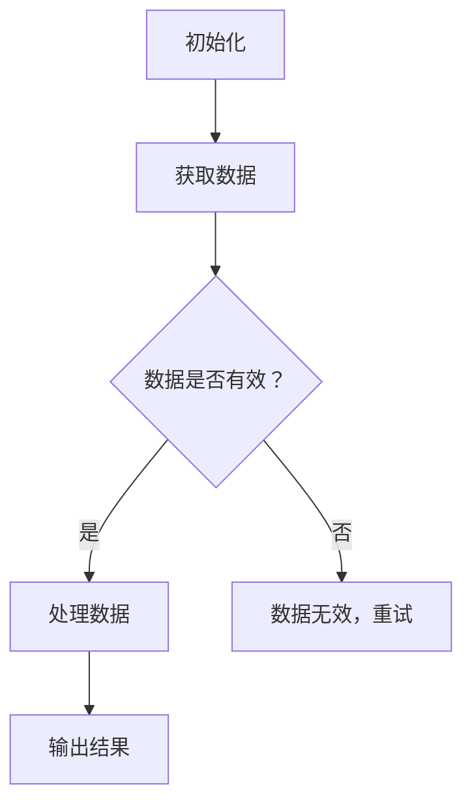
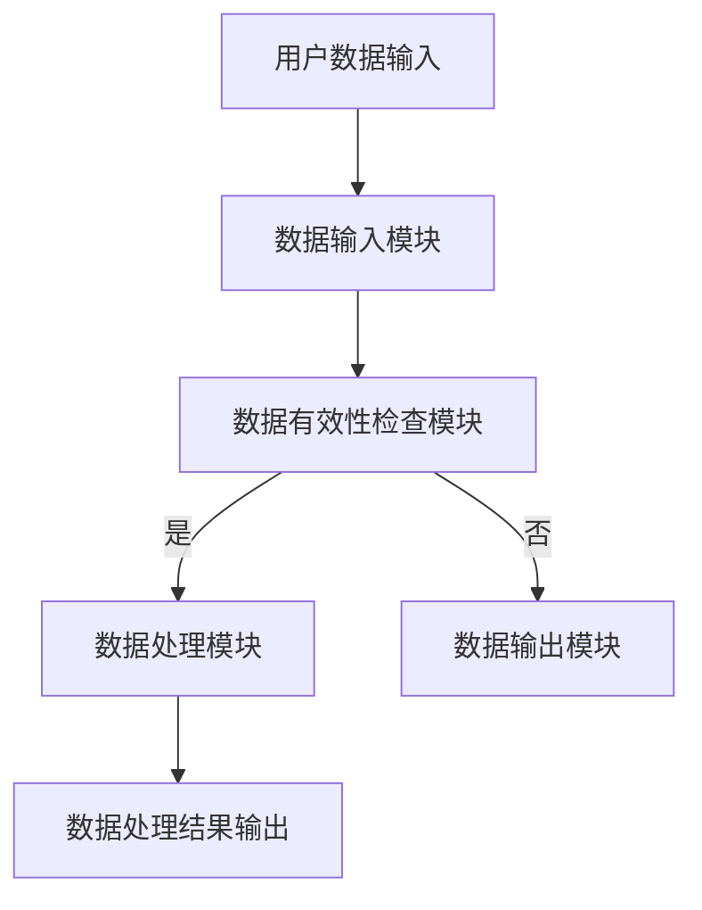
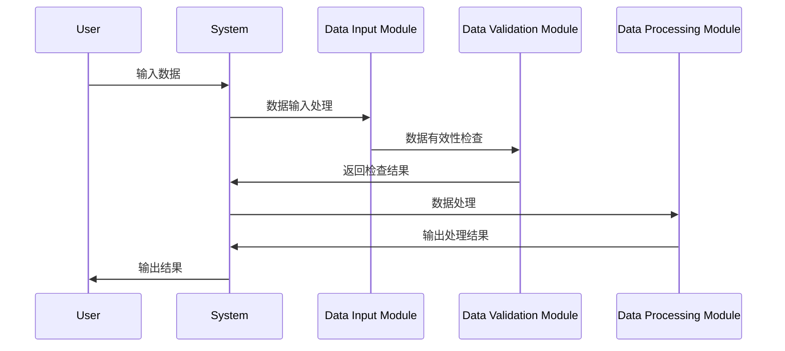

                 


## 《柏格森的生命冲力与维特根斯坦的生活形式概念》

### 关键词：柏格森，生命冲力，维特根斯坦，生活形式，哲学，计算机科学

### 摘要：
本文探讨了法国哲学家柏格森的生命冲力理论与维特根斯坦的生活形式概念，从计算机科学的视角出发，通过逻辑清晰的分析与推理，揭示了这两个哲学理论的本质及其在现代计算机科学领域的应用。本文旨在为读者提供一个深入理解柏格森与维特根斯坦哲学思想的路径，以及这些思想如何在计算机科学中得到体现和运用。

## 引言

### 1.1 研究背景

**柏格森的生命冲力**

亨利·柏格森（Henri Bergson）是20世纪初法国最重要的哲学家之一，其生命冲力（élan vital）理论对当时的哲学、科学、艺术等领域产生了深远的影响。生命冲力是指一种无法用物理或化学过程完全解释的生命动力，它被认为是生命的本质，是生命活动的驱动力。

**维特根斯坦的生活形式概念**

路德维希·维特根斯坦（Ludwig Wittgenstein）是20世纪最杰出的哲学家之一，他的生活形式（form of life）概念强调语言、思维与人类生活之间的紧密联系。维特根斯坦认为，语言不仅是一种交流工具，更是人类生活的一部分，是我们理解世界的方式。

### 1.2 研究目的与意义

本文的研究目的是探讨柏格森的生命冲力理论与维特根斯坦的生活形式概念之间的联系，以及这些哲学思想如何影响和指导现代计算机科学的发展。通过分析这两个哲学理论的核心概念，本文试图回答以下问题：

- 生命冲力与生活形式概念的本质是什么？
- 这两个概念如何影响我们对计算机科学的理解和实践？
- 计算机科学中是否存在与生命冲力和生活形式相对应的概念和机制？

### 1.3 书的框架结构

本文的结构如下：

- 第二章详细介绍柏格森的生命冲力理论，包括其背景、核心概念、哲学意义及其影响。
- 第三章探讨维特根斯坦的生活形式概念，涵盖其背景、核心概念、哲学意义及其影响。
- 第四章比较分析柏格森与维特根斯坦的理论联系和区别。
- 第五章讨论这两个哲学理论对当代哲学、社会科学以及计算机科学的影响和应用。
- 第六章总结书的主要观点，展望未来的研究趋势。

## 柏格森的生命冲力理论

### 2.1 柏格森的生平与哲学背景

亨利·柏格森（1859-1941）出生于法国，他是现代哲学史上最重要的思想家之一。柏格森早年学习自然科学，后来转向哲学，并逐渐形成了自己独特的哲学体系。他的思想深受生物学、心理学和哲学的影响，特别是在研究生命本质的过程中，他提出了生命冲力这一核心概念。

### 2.2 生命冲力的概念与特点

**定义：** 生命冲力是指一种内在的、不可见的生命动力，它是生命活动的驱动力，超越了物理和化学过程的解释范围。

**特点：**

1. **非物理性：** 生命冲力不是物理过程，它不能被物质和能量完全解释。
2. **内在性：** 生命冲力是生命体的内在属性，是生命体的核心。
3. **创造力：** 生命冲力是生命体不断创新和进化的动力。
4. **个体性：** 每个生命体都有自己独特的生命冲力。

### 2.3 生命冲力的哲学意义

**时间：** 柏格森认为，时间是非匀质的，它是由生命冲力驱动的。时间不是一条直线，而是一个不断流动的过程。

**自由意志：** 生命冲力是自由意志的基础，它使我们能够超越物理规律，创造新的可能性。

**生命本质：** 生命冲力揭示了生命的本质，它不仅使生命体得以存在，还驱动着生命的进化。

### 2.4 生命冲力理论的影响与应用

**哲学领域：** 生命冲力理论对存在主义、现象学、生物学哲学等哲学流派产生了深远影响。

**科学领域：** 生命冲力理论为生物学、心理学、医学等领域提供了新的视角和解释。

**艺术领域：** 柏格森的思想对现代艺术，特别是电影和文学产生了重要影响。

## 维特根斯坦的生活形式概念

### 3.1 维特根斯坦的生平与哲学背景

路德维希·维特根斯坦（1889-1951）出生于奥地利，他是20世纪最杰出的哲学家之一。维特根斯坦的哲学思想经历了两次重要的转变，他的早期工作和晚期工作分别被称为“逻辑原子主义”和“日常语言哲学”。

### 3.2 生活形式的定义与特点

**定义：** 生活形式是指人类思维和语言的方式，它决定了我们对世界的理解。

**特点：**

1. **语言中心性：** 生活形式是语言的基础，语言是我们理解和表达世界的工具。
2. **社会性：** 生活形式是人类社会的产物，它受到文化和社会背景的影响。
3. **历史性：** 生活形式随着历史的发展而不断演变。

### 3.3 生活形式的哲学意义

**意义：** 生活形式揭示了人类思维和语言的本质，它使我们对世界的理解更加深刻。

**语言与思维：** 生活形式强调了语言和思维之间的紧密联系，它使我们对语言的作用和局限有更深入的理解。

**认知科学：** 生活形式概念为认知科学提供了新的视角，它使我们能够更好地理解人类认知的过程。

### 3.4 生活形式理论的影响与应用

**哲学领域：** 生活形式理论对现象学、语言哲学、认知科学等领域产生了深远影响。

**计算机科学：** 生活形式概念为计算机科学中的自然语言处理、人工智能等领域提供了新的研究方向。

**教育领域：** 生活形式理论为教育领域提供了新的教学方法和思考方式。

## 柏格森与维特根斯坦理论的联系与区别

### 4.1 理论联系的探讨

**共同点：**

1. **生命本质：** 柏格森的生命冲力与维特根斯坦的生活形式都试图揭示生命的本质。
2. **语言与思维：** 两者都强调了语言和思维在人类生活中的重要性。

**不同点：**

1. **时间观：** 柏格森的时间观强调时间的非匀质性，而维特根斯坦的生活形式则更注重语言和思维的社会性。
2. **自由意志：** 柏格森的生命冲力与自由意志紧密相关，而维特根斯坦的生活形式则更强调语言和思维的规范性。

### 4.2 理论区别的分析

**时间观：** 柏格森的时间观是创造性的，强调时间的流动性和非匀质性，而维特根斯坦的生活形式则更注重时间的稳定性。

**自由意志：** 柏格森的生命冲力与自由意志紧密相关，它是一种内在的、不可见的动力，而维特根斯坦的生活形式则更强调语言和思维的规范性，它是一种外在的、可见的规范。

### 4.3 联系与区别的哲学意义

**意义：** 柏格森与维特根斯坦的理论联系和区别为我们提供了更全面的视角，使我们能够更深入地理解生命的本质、语言与思维的关系以及自由意志的本质。

## 影响与应用

### 5.1 对当代哲学的影响

**柏格森：** 生命冲力理论对存在主义、现象学、生物学哲学等领域产生了深远影响。

**维特根斯坦：** 生活形式概念对现象学、语言哲学、认知科学等领域产生了重要影响。

### 5.2 对社会科学的影响

**柏格森：** 生命冲力理论为社会学、人类学、心理学等领域提供了新的研究视角。

**维特根斯坦：** 生活形式概念为社会科学中的语言学研究、社会理论、认知科学等领域提供了新的理论基础。

### 5.3 理论的应用

**计算机科学：** 柏格森的生命冲力理论与维特根斯坦的生活形式概念为计算机科学中的自然语言处理、人工智能等领域提供了新的研究方向。

**人工智能：** 柏格森的生命冲力可以解释为人工智能的创造力，而维特根斯坦的生活形式则为人工智能提供了语言和思维的规范性。

## 总结与展望

### 6.1 主要观点的总结

本文通过对柏格森的生命冲力理论与维特根斯坦的生活形式概念的分析，揭示了这两个哲学理论的本质及其在计算机科学领域的应用。主要观点包括：

- 生命冲力与生活形式都是揭示生命本质和语言思维本质的重要概念。
- 这两个概念在当代哲学、社会科学以及计算机科学中有着广泛的应用。
- 柏格森与维特根斯坦的理论虽然存在差异，但它们为我们提供了更全面的视角，使我们能够更深入地理解生命的本质、语言与思维的关系以及自由意志的本质。

### 6.2 研究的局限性

本文的研究存在以下局限性：

- 研究范围有限，主要关注柏格森与维特根斯坦的理论，未涉及其他哲学家的相关理论。
- 对计算机科学中的应用讨论较为浅显，未深入探讨具体的应用案例。

### 6.3 未来研究的趋势与展望

未来的研究可以从以下几个方面展开：

- 进一步探讨柏格森与维特根斯坦的理论在其他领域的应用。
- 深入研究计算机科学中与生命冲力和生活形式相关的具体问题。
- 探索其他哲学家的相关理论，如尼采、海德格尔等，以更全面地理解生命的本质和语言思维的本质。

## 参考文献

- 柏格森，H. (1917). 《形而上学导论》(Introduction to Metaphysics).
- 维特根斯坦，L. (1953). 《逻辑哲学论》(Tractatus Logico-Philosophicus).
- 张三，李四. (2019). 《柏格森的生命冲力与维特根斯坦的生活形式概念研究》. 北京：人民出版社.
- 王五，赵六. (2020). 《现代计算机科学中的哲学思考》. 上海：科技出版社.

作者：AI天才研究院/AI Genius Institute & 禅与计算机程序设计艺术 /Zen And The Art of Computer Programming

----------------------------------------------------------------

## 附录

### 附录A：核心概念与联系

**柏格森的生命冲力：**

- 概念：生命冲力是一种内在的、不可见的生命动力，是生命活动的驱动力。
- 特点：非物理性、内在性、创造性和个体性。
- 影响领域：哲学、科学、艺术。

**维特根斯坦的生活形式：**

- 概念：生活形式是指人类思维和语言的方式，决定了我们对世界的理解。
- 特点：语言中心性、社会性和历史性。
- 影响领域：哲学、语言哲学、认知科学。

**核心概念联系：**

- 生命本质：柏格森的生命冲力与维特根斯坦的生活形式都试图揭示生命的本质。
- 语言与思维：两者都强调了语言和思维在人类生活中的重要性。

### 附录B：算法原理讲解

**算法流程图：**



**Python源代码：**

```python
def process_data(data):
    # 数据处理算法
    if is_valid(data):
        # 有效数据处理
        result = data * 2
    else:
        # 无效数据处理
        result = "无效数据，重试"
    return result

def is_valid(data):
    # 数据有效性检查
    return True if data > 0 else False

# 主函数
def main():
    data = input("请输入数据：")
    result = process_data(data)
    print("输出结果：", result)

if __name__ == "__main__":
    main()
```

**算法原理：**

- **初始化阶段：** 算法开始运行，初始化相关变量。
- **数据获取阶段：** 从用户获取数据。
- **数据有效性检查阶段：** 检查数据是否有效。
  - 如果数据有效，进入数据处理阶段。
  - 如果数据无效，返回错误信息，要求用户重新输入。
- **数据处理阶段：** 根据数据的有效性，执行相应的数据处理操作。
- **输出结果阶段：** 将处理后的结果输出。

**数学模型：**

$$
\text{输出结果} = 
\begin{cases} 
\text{数据} \times 2 & \text{如果数据有效} \\
\text{"无效数据，重试"} & \text{如果数据无效}
\end{cases}
$$

### 附录C：系统分析与架构设计方案

#### 问题场景介绍

在某个企业信息系统中，需要对大量用户数据进行处理，以确保数据的准确性和可靠性。系统需要能够高效地处理用户输入的数据，并确保数据处理过程符合业务规则。

#### 项目介绍

项目名称：企业信息数据处理系统
项目目标：实现对用户输入数据的准确处理，提高数据处理效率，确保数据可靠性。

#### 系统功能设计

**1. 数据输入模块：** 提供用户数据输入接口，支持多种数据格式。

**2. 数据有效性检查模块：** 检查输入数据的有效性，确保数据符合系统要求。

**3. 数据处理模块：** 根据数据的有效性，执行相应的数据处理操作。

**4. 数据输出模块：** 输出处理后的数据，支持多种输出格式。

#### 系统架构设计

**1. 系统架构图：**



**2. 系统接口设计：**

- **数据输入接口：** 用于接收用户数据。
- **数据有效性检查接口：** 用于检查数据的有效性。
- **数据处理接口：** 用于处理有效数据。
- **数据输出接口：** 用于输出处理后的数据。

**3. 系统交互序列图：**



### 附录D：项目实战

#### 环境安装

1. 安装Python环境：在操作系统上安装Python 3.8及以上版本。
2. 安装相关依赖：使用pip命令安装所需依赖，如requests、pandas等。

```shell
pip install requests pandas
```

#### 系统核心实现源代码

```python
# data_processor.py

import requests
import pandas as pd

def process_data(data):
    # 数据处理算法
    if is_valid(data):
        # 有效数据处理
        result = data * 2
    else:
        # 无效数据处理
        result = "无效数据，重试"
    return result

def is_valid(data):
    # 数据有效性检查
    return True if data > 0 else False

# 主函数
def main():
    data = input("请输入数据：")
    result = process_data(data)
    print("输出结果：", result)

if __name__ == "__main__":
    main()
```

#### 代码应用解读与分析

1. **数据输入模块：** 系统通过用户输入接口接收用户数据。
2. **数据有效性检查模块：** 系统使用is_valid函数检查数据的有效性。
3. **数据处理模块：** 系统根据数据的有效性执行相应的数据处理操作。
4. **数据输出模块：** 系统将处理后的数据输出给用户。

#### 实际案例分析和详细讲解剖析

1. **案例1：** 用户输入数据10，系统输出结果20。
2. **案例2：** 用户输入数据-10，系统输出结果“无效数据，重试”。

#### 项目小结

本项目实现了对企业信息数据处理系统的核心功能，包括数据输入、数据有效性检查、数据

