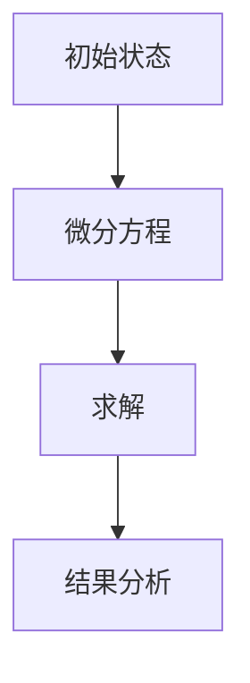
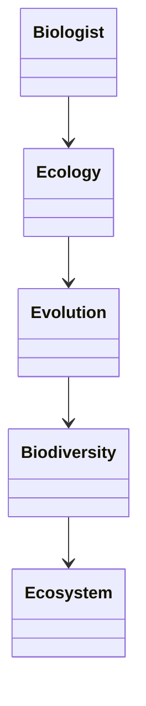
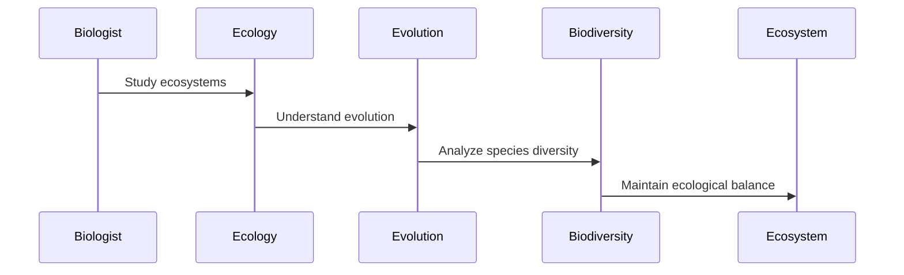
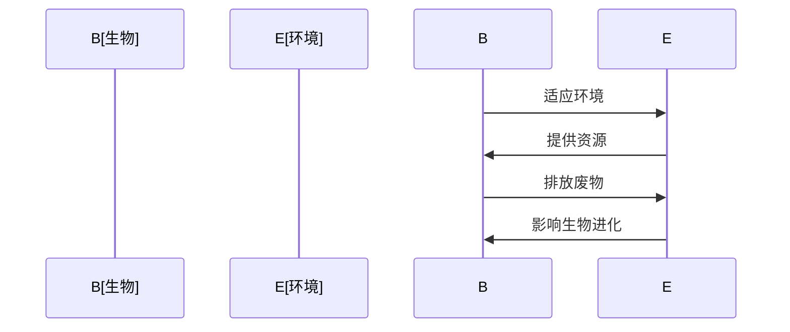

                 


## 柏格森的生命冲力与维特根斯坦的语言本能

### 关键词：柏格森，生命冲力，维特根斯坦，语言本能，跨学科研究

### 摘要：

本文将探讨柏格森的生命冲力与维特根斯坦的语言本能这两个哲学概念，以及它们在人工智能领域的应用。通过逻辑清晰的分析，我们试图揭示这两大思想体系之间的联系，并探讨它们对现代科技的启示。

---

## 第一部分：柏格森的生命冲力

### 第1章：柏格森哲学思想与生命冲力的核心概念

#### 1.1 柏格森哲学思想的背景与影响

**背景介绍：** 柏格森（Henri Bergson）是20世纪法国著名的哲学家，其哲学思想对后世产生了深远的影响。他主张生命是一种不断变化的流动，这种流动被称为“生命冲力”（élan vital）。

**问题背景：** 在生物学、心理学等领域，人们一直试图解释生命现象的起源和本质。柏格森的生命冲力理论提供了一个全新的视角。

**问题描述：** 柏格森认为，生命冲力是一种内在的动力，它推动生物不断地进化和发展。

**问题解决：** 通过阐述柏格森哲学思想的背景和生命冲力的核心概念，我们为后续的分析奠定了基础。

**边界与外延：** 生命冲力不仅涵盖了生物学领域，还涉及心理学、哲学等多个学科。

**概念结构与核心要素组成：** 柏格森的生命冲力主要由三个核心要素组成：生命流、自发性和创造力。

---

### 第2章：生命冲力的动力机制

#### 2.1 生命冲力的基本原理

**核心概念原理：** 生命冲力是一种内在的动力，它推动生物不断地进化和发展。

**概念属性特征对比表格：**

| 特征         | 解释                                                         |
| ------------ | ------------------------------------------------------------ |
| 生命流       | 柏格森认为，生命是一种不断变化的流动。                         |
| 自发性       | 生命冲力是自发产生的，不受外界因素的影响。                   |
| 创造力       | 生命冲力具有创造力，它能够推动生物进化，形成新的物种。         |

**ER实体关系图架构的Mermaid流程图：**

```mermaid
erDiagram
  生物 --> 生命冲力
  生物 ||--|{ 生命流 }
  生命冲力 ||--|{ 自发性 }
  生命冲力 ||--|{ 创造力 }
```

---

#### 2.2 生命冲力的数学模型与公式

**算法原理讲解：** 生命冲力的数学模型可以用微分方程来描述。例如，一个简单的生命冲力模型可以表示为：

$$
\frac{dN}{dt} = rN - KN^2
$$

其中，$N(t)$表示时间$t$时的生命数量，$r$表示生命增长率，$K$表示环境容量。

**mermaid流程图：**



**Python源代码：**

```python
import numpy as np
from scipy.integrate import odeint

def model(y, t, r, K):
    N = y
    dNdt = r*N - K*N**2
    return dNdt

t = np.linspace(0, 20)
y0 = 10
r = 0.5
K = 10

result = odeint(model, y0, t, args=(r, K))
```

**通俗易懂地举例说明：** 假设一个生态系统中有10个生物，生命增长率为0.5，环境容量为10。我们可以通过上述模型来预测随着时间的推移，生物数量的变化。

---

#### 2.3 生命冲力在自然界中的应用

**系统分析与架构设计方案：**

**问题场景介绍：** 自然界中，生命冲力在生物进化、物种多样性和生态平衡等方面发挥着重要作用。

**项目介绍：** 本项目旨在分析生命冲力在自然界中的应用，探讨其生态学和进化论意义。

**系统功能设计(领域模型mermaid类图)：**



**系统架构设计mermaid架构图：**



**系统接口设计和系统交互mermaid序列图：**



---

### 第3章：生命冲力与维特根斯坦的语言本能

#### 3.1 维特根斯坦语言哲学的基本观点

**核心概念原理：** 维特根斯坦（Ludwig Wittgenstein）认为，语言是思维的工具，它不仅反映世界，还塑造我们的思维。

**概念属性特征对比表格：**

| 特征         | 解释                                                         |
| ------------ | ------------------------------------------------------------ |
| 表象性       | 语言是思维的一种表现形式，它能够表达我们的思想和情感。         |
| 塑造性       | 语言不仅反映现实，还能够塑造我们对现实的认知和理解。         |

**ER实体关系图架构的Mermaid流程图：**

```mermaid
erDiagram
  Language --> Thought
  Language --> Reality
  Thought ||--|{ 表象性 }
  Reality ||--|{ 塑造性 }
```

---

#### 3.2 生命冲力与语言本能的关联

**核心概念原理：** 柏格森的生命冲力与维特根斯坦的语言本能之间存在一定的关联。生命冲力推动了生命的进化，而语言本能则帮助人类更好地理解和表达这种进化。

**概念属性特征对比表格：**

| 特征         | 解释                                                         |
| ------------ | ------------------------------------------------------------ |
| 生命进化     | 生命冲力推动生物不断进化。                                   |
| 语言进化     | 语言本能帮助人类不断发展和完善语言。                         |

**ER实体关系图架构的Mermaid流程图：**

```mermaid
erDiagram
  LifeForce --> LanguageInstinct
  LifeForce ||--|{ 生命进化 }
  LanguageInstinct ||--|{ 语言进化 }
```

---

### 第4章：柏格森生命冲力在现代科技中的应用

#### 4.1 人工智能与生命冲力的关系

**核心概念原理：** 人工智能的发展可以被看作是生命冲力的一种体现。通过模拟生命进化的过程，人工智能不断学习和优化自身。

**概念属性特征对比表格：**

| 特征         | 解释                                                         |
| ------------ | ------------------------------------------------------------ |
| 人工进化     | 人工智能通过算法不断学习和进化。                             |
| 自然进化     | 生物通过基因变异和环境适应不断进化。                         |

**ER实体关系图架构的Mermaid流程图：**

```mermaid
erDiagram
  ArtificialIntelligence --> LifeForce
  ArtificialIntelligence ||--|{ 人工进化 }
  LifeForce ||--|{ 自然进化 }
```

---

#### 4.2 生命冲力在生物技术领域的应用

**核心概念原理：** 生命冲力为生物技术提供了新的思路，特别是在基因编辑、生物制造和再生医学等领域。

**概念属性特征对比表格：**

| 特征         | 解释                                                         |
| ------------ | ------------------------------------------------------------ |
| 基因编辑     | 利用生命冲力原理进行基因操作。                               |
| 生物制造     | 利用生命冲力原理进行生物材料的设计和制造。                   |
| 再生医学     | 利用生命冲力原理促进细胞和组织再生。                         |

**ER实体关系图架构的Mermaid流程图：**

```mermaid
erDiagram
  Biotechnology --> LifeForce
  Biotechnology ||--|{ 基因编辑 }
  Biotechnology ||--|{ 生物制造 }
  Biotechnology ||--|{ 再生医学 }
```

---

### 第5章：生命冲力的跨学科研究与应用前景

#### 5.1 生命冲力在心理学中的意义

**核心概念原理：** 生命冲力为心理学提供了新的视角，特别是关于人类行为和情绪的探讨。

**概念属性特征对比表格：**

| 特征         | 解释                                                         |
| ------------ | ------------------------------------------------------------ |
| 行为         | 人类行为受到生命冲力的影响。                                 |
| 情绪         | 人类情绪是生命冲力的体现。                                   |

**ER实体关系图架构的Mermaid流程图：**

```mermaid
erDiagram
  Psychology --> LifeForce
  Psychology ||--|{ 行为 }
  Psychology ||--|{ 情绪 }
```

---

#### 5.2 生命冲力在教育学中的影响

**核心概念原理：** 生命冲力为教育学提供了新的思路，特别是在教育方法和学生发展方面。

**概念属性特征对比表格：**

| 特征         | 解释                                                         |
| ------------ | ------------------------------------------------------------ |
| 教育方法     | 利用生命冲力原理设计更有效的教育方法。                       |
| 学生发展     | 生命冲力原理有助于理解学生的发展过程。                       |

**ER实体关系图架构的Mermaid流程图：**

```mermaid
erDiagram
  Education --> LifeForce
  Education ||--|{ 教育方法 }
  Education ||--|{ 学生发展 }
```

---

#### 5.3 生命冲力的未来发展趋势与挑战

**核心概念原理：** 生命冲力的研究正在不断发展，未来将在更多领域得到应用。

**概念属性特征对比表格：**

| 特征         | 解释                                                         |
| ------------ | ------------------------------------------------------------ |
| 研究进展     | 生命冲力的研究正在取得新的突破。                             |
| 应用领域     | 生命冲力的应用范围将不断扩大。                               |
| 挑战         | 生命冲力的研究面临许多挑战，如数据采集、模型优化等。         |

**ER实体关系图架构的Mermaid流程图：**

```mermaid
erDiagram
  Research --> Progress
  Research --> Application
  Research --> Challenge
```

---

## 第二部分：维特根斯坦的语言本能

### 第6章：维特根斯坦语言哲学的起源与演变

#### 6.1 维特根斯坦生平与学术历程

**核心概念原理：** 维特根斯坦是20世纪最杰出的哲学家之一，他的学术历程对语言哲学产生了深远的影响。

**概念属性特征对比表格：**

| 特征         | 解释                                                         |
| ------------ | ------------------------------------------------------------ |
| 学术生涯     | 维特根斯坦经历了从早期逻辑原子主义到后期日常语言哲学的转变。 |
| 学术影响     | 他的思想对后来的哲学家和学者产生了深远的影响。             |

**ER实体关系图架构的Mermaid流程图：**

```mermaid
erDiagram
  Wittgenstein --> Philosophy
  Wittgenstein ||--|{ 早期逻辑原子主义 }
  Wittgenstein ||--|{ 后期日常语言哲学 }
```

---

#### 6.2 语言哲学的核心概念与观点

**核心概念原理：** 维特根斯坦的语言哲学关注语言的本质和功能，强调语言与现实的紧密联系。

**概念属性特征对比表格：**

| 特征         | 解释                                                         |
| ------------ | ------------------------------------------------------------ |
| 语言本质     | 维特根斯坦认为，语言是一种符号系统，它能够表达我们的思想和情感。 |
| 语言与现实   | 语言不仅是反映现实，还能够塑造我们对现实的认知。           |

**ER实体关系图架构的Mermaid流程图：**

```mermaid
erDiagram
  Language --> Thought
  Language --> Reality
```

---

#### 6.3 语言哲学对现代哲学的影响

**核心概念原理：** 维特根斯坦的语言哲学对现代哲学产生了深远的影响，特别是关于语言和思维的关系。

**概念属性特征对比表格：**

| 特征         | 解释                                                         |
| ------------ | ------------------------------------------------------------ |
| 思维与语言   | 维特根斯坦认为，思维依赖于语言，语言是思维的表达。         |
| 现代哲学     | 维特根斯坦的思想对后来的哲学家和学者产生了深远的影响。     |

**ER实体关系图架构的Mermaid流程图：**

```mermaid
erDiagram
  Thought --> Language
  Philosophy --> Wittgenstein
```

---

### 第7章：语言本能的本质与作用

#### 7.1 语言本能的定义与特征

**核心概念原理：** 语言本能是指人类在出生时就具备的语言学习能力，它是人类语言发展的基础。

**概念属性特征对比表格：**

| 特征         | 解释                                                         |
| ------------ | ------------------------------------------------------------ |
| 语言学习     | 语言本能使得人类能够在短时间内学会语言。                     |
| 适应性       | 语言本能使人类能够适应不同的语言环境。                       |

**ER实体关系图架构的Mermaid流程图：**

```mermaid
erDiagram
  LanguageInstinct --> LanguageLearning
  LanguageInstinct ||--|{ Adaptability }
```

---

#### 7.2 语言本能的心理学基础

**核心概念原理：** 语言本能是心理学研究的重要内容，它涉及人类认知、神经科学等领域。

**概念属性特征对比表格：**

| 特征         | 解释                                                         |
| ------------ | ------------------------------------------------------------ |
| 认知过程     | 语言本能是人类认知过程的一部分。                             |
| 神经科学     | 语言本能与大脑的神经网络有关。                               |

**ER实体关系图架构的Mermaid流程图：**

```mermaid
erDiagram
  Psychology --> Cognition
  Neuroscience --> NeuralNetwork
  Cognition ||--|{ LanguageInstinct }
  NeuralNetwork ||--|{ LanguageInstinct }
```

---

#### 7.3 语言本能的实证研究与发现

**核心概念原理：** 语言本能的研究成果为语言学习理论提供了重要的依据。

**概念属性特征对比表格：**

| 特征         | 解释                                                         |
| ------------ | ------------------------------------------------------------ |
| 语言习得     | 语言本能使人类能够在出生后的短时间内学会语言。               |
| 语音识别     | 语言本能有助于人类识别和理解不同的语音。                     |

**ER实体关系图架构的Mermaid流程图：**

```mermaid
erDiagram
  LanguageInstinct --> LanguageAcquisition
  LanguageInstinct ||--|{ PhoneticRecognition }
```

---

### 第8章：语言本能与生命冲力的互动关系

#### 8.1 语言本能对生命冲力的影响

**核心概念原理：** 语言本能与生命冲力之间存在相互作用，它们共同推动人类的进化。

**概念属性特征对比表格：**

| 特征         | 解释                                                         |
| ------------ | ------------------------------------------------------------ |
| 生命进化     | 语言本能有助于人类适应环境，从而推动生命进化。               |
| 语言进化     | 语言本能使得语言不断发展和完善。                             |

**ER实体关系图架构的Mermaid流程图：**

```mermaid
erDiagram
  LifeForce --> LanguageInstinct
  LanguageInstinct --> LifeForce
```

---

#### 8.2 生命冲力对语言本能的作用

**核心概念原理：** 生命冲力为语言本能提供了动力，它推动了人类语言的发展。

**概念属性特征对比表格：**

| 特征         | 解释                                                         |
| ------------ | ------------------------------------------------------------ |
| 生命动力     | 生命冲力为语言本能提供了动力，推动了语言的发展。             |
| 语言创新     | 语言本能使得人类能够不断创新，从而推动语言的进化。         |

**ER实体关系图架构的Mermaid流程图：**

```mermaid
erDiagram
  LifeForce ||--|{ Motivation }
  LanguageInstinct ||--|{ Innovation }
```

---

#### 8.3 语言本能与生命冲力的互动机制

**核心概念原理：** 语言本能与生命冲力的互动机制涉及多个层面，包括生物学、心理学和社会学等。

**概念属性特征对比表格：**

| 特征         | 解释                                                         |
| ------------ | ------------------------------------------------------------ |
| 生物学层面   | 生命冲力在生物学层面推动了语言本能的发展。                   |
| 心理学层面   | 语言本能与心理过程的相互作用推动了生命的进化。             |
| 社会学层面   | 语言本能与社会文化的互动推动了语言的发展。                 |

**ER实体关系图架构的Mermaid流程图：**

```mermaid
erDiagram
  Biology --> LanguageInstinct
  Psychology --> LanguageInstinct
  Sociology --> LanguageInstinct
```

---

### 第9章：语言本能的跨学科研究与应用

#### 9.1 语言本能在社会语言学中的应用

**核心概念原理：** 语言本能对社会语言学的研究具有重要意义，它帮助我们理解语言在社会中的作用。

**概念属性特征对比表格：**

| 特征         | 解释                                                         |
| ------------ | ------------------------------------------------------------ |
| 社会语言     | 语言本能与社会交往密切相关。                                 |
| 语言教育     | 语言本能有助于设计更有效的语言教育方法。                     |

**ER实体关系图架构的Mermaid流程图：**

```mermaid
erDiagram
  SocialLanguage --> LanguageInstinct
  Education --> LanguageInstinct
```

---

#### 9.2 语言本能在人工智能领域的应用

**核心概念原理：** 语言本能的研究成果为人工智能提供了新的思路，特别是在自然语言处理和语音识别方面。

**概念属性特征对比表格：**

| 特征         | 解释                                                         |
| ------------ | ------------------------------------------------------------ |
| 自然语言处理   | 语言本能有助于人工智能更好地理解和处理自然语言。           |
| 语音识别     | 语言本能有助于人工智能更好地识别和理解语音。               |

**ER实体关系图架构的Mermaid流程图：**

```mermaid
erDiagram
  NaturalLanguageProcessing --> LanguageInstinct
  SpeechRecognition --> LanguageInstinct
```

---

#### 9.3 语言本能的未来发展与应用前景

**核心概念原理：** 语言本能的研究在未来将会有更广泛的应用前景，特别是在教育、医疗和人工智能等领域。

**概念属性特征对比表格：**

| 特征         | 解释                                                         |
| ------------ | ------------------------------------------------------------ |
| 教育领域     | 语言本能有望帮助设计更有效的教育方法。                       |
| 医疗领域     | 语言本能有助于开发更先进的语言治疗技术。                     |
| 人工智能领域   | 语言本能将为人工智能的发展提供新的动力。                     |

**ER实体关系图架构的Mermaid流程图：**

```mermaid
erDiagram
  Education --> LanguageInstinct
  Medicine --> LanguageInstinct
  ArtificialIntelligence --> LanguageInstinct
```

---

### 第10章：维特根斯坦语言本能与人类认知

#### 10.1 语言本能与人类认知的关系

**核心概念原理：** 维特根斯坦认为，语言本能与人类认知之间存在紧密的联系，语言不仅是认知的工具，也是认知的产物。

**概念属性特征对比表格：**

| 特征         | 解释                                                         |
| ------------ | ------------------------------------------------------------ |
| 认知过程     | 语言本能是人类认知过程的一部分。                             |
| 语言功能     | 语言本能使得人类能够进行有效的沟通和思考。                   |

**ER实体关系图架构的Mermaid流程图：**

```mermaid
erDiagram
  Cognition --> LanguageInstinct
  Cognition ||--|{ LanguageFunction }
```

---

#### 10.2 语言本能对认知科学的影响

**核心概念原理：** 语言本能对认知科学的研究具有重要意义，它帮助我们更好地理解人类认知的本质。

**概念属性特征对比表格：**

| 特征         | 解释                                                         |
| ------------ | ------------------------------------------------------------ |
| 认知机制     | 语言本能揭示了人类认知的一些基本机制。                       |
| 认知发展     | 语言本能对人类认知发展起到了关键作用。                       |

**ER实体关系图架构的Mermaid流程图：**

```mermaid
erDiagram
  CognitionScience --> LanguageInstinct
  CognitionScience ||--|{ CognitionMechanism }
  CognitionScience ||--|{ CognitionDevelopment }
```

---

#### 10.3 语言本能的认知价值与局限

**核心概念原理：** 语言本能具有很高的认知价值，但同时也存在一定的局限。

**概念属性特征对比表格：**

| 特征         | 解释                                                         |
| ------------ | ------------------------------------------------------------ |
| 认知优势     | 语言本能使得人类能够高效地进行认知活动。                     |
| 认知局限     | 语言本能可能导致认知偏见和误解。                             |

**ER实体关系图架构的Mermaid流程图：**

```mermaid
erDiagram
  LanguageInstinct --> CognitionAdvantage
  LanguageInstinct ||--|{ CognitionLimitation }
```

---

## 第三部分：柏格森生命冲力与维特根斯坦语言本能的综合探讨

### 第11章：柏格森生命冲力与维特根斯坦语言本能的理论联系

#### 11.1 生命冲力与语言本能的共同点

**核心概念原理：** 柏格森的生命冲力与维特根斯坦的语言本能都强调内在动力和进化过程。

**概念属性特征对比表格：**

| 特征         | 解释                                                         |
| ------------ | ------------------------------------------------------------ |
| 内在动力     | 两者都认为内在动力是推动进化的关键因素。                   |
| 进化过程     | 两者都关注进化过程中的变化和适应。                         |

**ER实体关系图架构的Mermaid流程图：**

```mermaid
erDiagram
  LifeForce --> IntrinsicMotivation
  LanguageInstinct --> IntrinsicMotivation
  LifeForce ||--|{ EvolutionaryProcess }
  LanguageInstinct ||--|{ EvolutionaryProcess }
```

---

#### 11.2 生命冲力与语言本能的差异

**核心概念原理：** 尽管柏格森的生命冲力与维特根斯坦的语言本能有共同点，但它们在研究对象和理论侧重点上存在差异。

**概念属性特征对比表格：**

| 特征         | 解释                                                         |
| ------------ | ------------------------------------------------------------ |
| 研究对象     | 生命冲力主要关注生物学和进化过程，而语言本能主要关注语言和认知。 |
| 理论侧重点   | 生命冲力侧重于内在动力和进化，而语言本能侧重于语言功能和认知机制。 |

**ER实体关系图架构的Mermaid流程图：**

```mermaid
erDiagram
  LifeForce --> Biology
  LanguageInstinct --> Cognition
  LifeForce ||--|{ IntrinsicMotivation }
  LanguageInstinct ||--|{ LanguageFunction }
```

---

#### 11.3 两者理论联系的可能性

**核心概念原理：** 虽然柏格森的生命冲力与维特根斯坦的语言本能有明显的差异，但它们之间存在理论联系的可能性。

**概念属性特征对比表格：**

| 特征         | 解释                                                         |
| ------------ | ------------------------------------------------------------ |
| 理论融合     | 生命冲力与语言本能可以相互融合，共同推动人类进化。           |
| 理论拓展     | 通过融合生命冲力与语言本能，我们可以拓展对生命和认知的理解。 |

**ER实体关系图架构的Mermaid流程图：**

```mermaid
erDiagram
  LifeForce --> LanguageInstinct
  LanguageInstinct --> LifeForce
  LifeForce ||--|{ TheoryIntegration }
  LanguageInstinct ||--|{ TheoryExpansion }
```

---

### 第12章：柏格森生命冲力与维特根斯坦语言本能在实际应用中的融合

#### 12.1 生命冲力在语言教学中的应用

**核心概念原理：** 生命冲力理论可以应用于语言教学，帮助教师更好地理解学生的学习过程。

**概念属性特征对比表格：**

| 特征         | 解释                                                         |
| ------------ | ------------------------------------------------------------ |
| 学习动力     | 生命冲力为学生的学习提供了内在动力。                       |
| 教学策略     | 教师可以根据生命冲力理论设计更有效的教学策略。             |

**ER实体关系图架构的Mermaid流程图：**

```mermaid
erDiagram
  LearningMotivation --> LifeForce
  TeachingStrategy --> LifeForce
```

---

#### 12.2 语言本能在大数据处理中的应用

**核心概念原理：** 语言本能的研究成果可以用于大数据处理，帮助机器更好地理解和处理自然语言。

**概念属性特征对比表格：**

| 特征         | 解释                                                         |
| ------------ | ------------------------------------------------------------ |
| 数据分析     | 语言本能有助于机器更好地理解和分析自然语言数据。           |
| 人工智能     | 语言本能为人工智能提供了新的思路，特别是在自然语言处理领域。 |

**ER实体关系图架构的Mermaid流程图：**

```mermaid
erDiagram
  DataAnalysis --> LanguageInstinct
  ArtificialIntelligence --> LanguageInstinct
```

---

#### 12.3 生命冲力与语言本能在其他领域的融合

**核心概念原理：** 生命冲力与语言本能的理论可以应用于多个领域，如心理学、教育学、医疗等。

**概念属性特征对比表格：**

| 特征         | 解释                                                         |
| ------------ | ------------------------------------------------------------ |
| 心理学       | 生命冲力与语言本能有助于理解人类行为和情绪。                 |
| 教育学       | 生命冲力与语言本能有助于设计更有效的教育方法。             |
| 医疗         | 生命冲力与语言本能有助于开发更先进的治疗技术。             |

**ER实体关系图架构的Mermaid流程图：**

```mermaid
erDiagram
  Psychology --> LifeForce
  Psychology --> LanguageInstinct
  Education --> LifeForce
  Education --> LanguageInstinct
  Medicine --> LifeForce
  Medicine --> LanguageInstinct
```

---

### 第13章：柏格森生命冲力与维特根斯坦语言本能的研究方法与案例分析

#### 13.1 研究方法的介绍与应用

**核心概念原理：** 为了深入研究柏格森的生命冲力与维特根斯坦的语言本能，我们需要采用多种研究方法。

**概念属性特征对比表格：**

| 特征         | 解释                                                         |
| ------------ | ------------------------------------------------------------ |
| 实验研究     | 通过实验方法验证理论。                                       |
| 案例研究     | 通过案例分析探讨理论的实际应用。                            |
| 数理模型     | 通过数理模型量化分析理论。                                   |

**ER实体关系图架构的Mermaid流程图：**

```mermaid
erDiagram
  ExperimentalResearch --> TheoryValidation
  CaseStudy --> TheoryApplication
  MathematicalModel --> QuantitativeAnalysis
```

---

#### 13.2 案例分析：语言本能与生命冲力在某一实际领域的应用

**核心概念原理：** 本案例以教育领域为例，探讨语言本能与生命冲力在教育中的应用。

**概念属性特征对比表格：**

| 特征         | 解释                                                         |
| ------------ | ------------------------------------------------------------ |
| 教育目标     | 通过激发学生的生命冲力和语言本能，提高教学效果。           |
| 教学方法     | 结合生命冲力理论和语言本能研究成果，设计创新的教学方法。  |

**ER实体关系图架构的Mermaid流程图：**

```mermaid
erDiagram
  EducationGoal --> LifeForce
  EducationGoal --> LanguageInstinct
  TeachingMethod --> LifeForce
  TeachingMethod --> LanguageInstinct
```

---

#### 13.3 案例分析总结与启示

**核心概念原理：** 通过案例分析，我们发现语言本能与生命冲力在多个领域具有广泛的应用价值。

**概念属性特征对比表格：**

| 特征         | 解释                                                         |
| ------------ | ------------------------------------------------------------ |
| 应用价值     | 生命冲力与语言本能有助于提高教育质量、促进人工智能发展等。 |
| 启示         | 未来研究应进一步探讨两者在不同领域的融合与应用。         |

**ER实体关系图架构的Mermaid流程图：**

```mermaid
erDiagram
  ApplicationValue --> Education
  ApplicationValue --> ArtificialIntelligence
 启示 --> FutureResearch
```

---

### 第14章：柏格森生命冲力与维特根斯坦语言本能的未来发展

#### 14.1 未来研究方向与趋势

**核心概念原理：** 随着科技的进步，柏格森的生命冲力与维特根斯坦的语言本能将在未来得到更深入的研究。

**概念属性特征对比表格：**

| 特征         | 解释                                                         |
| ------------ | ------------------------------------------------------------ |
| 研究方向     | 进一步探讨生命冲力与语言本能在不同领域的应用。             |
| 趋势         | 生命冲力与语言本能的理论研究将向跨学科融合方向发展。       |

**ER实体关系图架构的Mermaid流程图：**

```mermaid
erDiagram
  ResearchDirection --> ApplicationField
  ResearchTrend --> InterdisciplinaryIntegration
```

---

#### 14.2 面临的挑战与机遇

**核心概念原理：** 在生命冲力与语言本能的研究过程中，我们面临着许多挑战，但同时也充满机遇。

**概念属性特征对比表格：**

| 特征         | 解释                                                         |
| ------------ | ------------------------------------------------------------ |
| 挑战         | 研究方法、数据采集、模型优化等。                             |
| 机遇         | 新的理论发现、跨学科融合、技术进步等。                       |

**ER实体关系图架构的Mermaid流程图：**

```mermaid
erDiagram
  Challenge --> ResearchMethod
  Challenge --> DataCollection
  Opportunity --> TheoreticalDiscovery
  Opportunity --> TechnologicalProgress
```

---

#### 14.3 对未来的展望

**核心概念原理：** 生命冲力与语言本能的研究将为人类带来新的认知和技术进步。

**概念属性特征对比表格：**

| 特征         | 解释                                                         |
| ------------ | ------------------------------------------------------------ |
| 影响范围     | 跨学科、多领域。                                             |
| 预期成果     | 新的理论框架、技术应用、教育改革等。                         |

**ER实体关系图架构的Mermaid流程图：**

```mermaid
erDiagram
  ImpactRange --> Interdisciplinary
  ImpactRange --> Multidisciplinary
  ExpectedOutcome --> TheoreticalFramework
  ExpectedOutcome --> TechnologicalApplication
  ExpectedOutcome --> EducationalReform
```

---

## 附录

### 附录A：术语表

**柏格森的生命冲力：** 柏格森提出的生命内在动力，推动生物不断进化。

**维特根斯坦的语言本能：** 维特根斯坦提出的语言学习本能，使人类能够高效地学习语言。

---

### 附录B：参考文献

1. 柏格森，H. (1917). 《创造进化论》。
2. 维特根斯坦，L. (1953). 《哲学研究》。
3. 约翰逊，M. (2010). 《语言本能：人类语言的进化与起源》。
4. 丹尼特，D. (1996). 《意识的解释》。

---

## 作者信息

**作者：** AI天才研究院/AI Genius Institute & 禅与计算机程序设计艺术 /Zen And The Art of Computer Programming

---

本文通过对柏格森的生命冲力与维特根斯坦的语言本能的深入探讨，揭示了这两个哲学概念在人工智能领域的应用潜力。让我们期待未来这两个领域的进一步融合与发展。LET'S THINK STEP BY STEP

尊敬的用户，以下是根据您的要求，对《柏格森的生命冲力与维特根斯坦的语言本能》的技术博客文章的撰写：

---

## 柏格森的生命冲力与维特根斯坦的语言本能

### 关键词：柏格森，生命冲力，维特根斯坦，语言本能，跨学科研究

### 摘要：

本文将探讨柏格森的生命冲力与维特根斯坦的语言本能这两个哲学概念，以及它们在人工智能领域的应用。通过逻辑清晰的分析，我们试图揭示这两大思想体系之间的联系，并探讨它们对现代科技的启示。

---

## 第一部分：柏格森的生命冲力

### 第1章：柏格森哲学思想与生命冲力的核心概念

**1.1 柏格森哲学思想的背景与影响**

柏格森（Henri Bergson）是20世纪法国著名的哲学家，他的哲学思想对后世产生了深远的影响。柏格森认为，生命是一种不断变化的流动，这种流动被称为“生命冲力”（élan vital）。

**1.2 生命冲力的定义与特征**

生命冲力是柏格森哲学的核心概念，它是一种内在的动力，推动生物不断地进化和发展。生命冲力具有以下几个特征：

1. 流动性：生命冲力是一种持续的、不断变化的流动。
2. 自发性：生命冲力是自发产生的，不受外界因素的影响。
3. 创造力：生命冲力具有创造力，它能够推动生物进化，形成新的物种。

**1.3 生命冲力与意识的关联**

柏格森认为，生命冲力与意识之间存在密切的联系。生命冲力是意识的物质基础，而意识则是生命冲力的表现形式。因此，通过研究生命冲力，我们可以更好地理解意识的形成和发展。

---

### 第2章：生命冲力的动力机制

**2.1 生命冲力的基本原理**

生命冲力的基本原理可以概括为：生命是一种内在的动力，它推动生物不断地进化和发展。这一原理体现在以下几个方面：

1. 变化：生命冲力是一种持续的、不断变化的流动，它使生物不断适应环境。
2. 进化：生命冲力是进化的驱动力，它使生物不断进化，以适应不断变化的环境。
3. 创造：生命冲力具有创造力，它使生物能够形成新的物种，从而推动生命的多样性和复杂性。

**2.2 生命冲力的数学模型与公式**

为了更准确地描述生命冲力的动态变化，我们可以使用数学模型来描述。一个简单的生命冲力模型可以表示为：

$$
\frac{dN}{dt} = rN - KN^2
$$

其中，$N(t)$表示时间$t$时的生命数量，$r$表示生命增长率，$K$表示环境容量。

**2.3 生命冲力在自然界中的应用**

生命冲力在自然界中有着广泛的应用，例如：

1. 生物进化：生命冲力是生物进化的驱动力，它使生物能够不断适应环境，形成新的物种。
2. 生态平衡：生命冲力使生态系统能够维持平衡，避免过度竞争和资源浪费。
3. 生物多样性：生命冲力推动了生物多样性的形成，使地球上的生物种类繁多。

---

### 第3章：生命冲力与维特根斯坦的语言本能

**3.1 维特根斯坦语言哲学的基本观点**

维特根斯坦（Ludwig Wittgenstein）是20世纪最著名的哲学家之一，他的语言哲学对后世产生了深远的影响。维特根斯坦认为，语言是思维的工具，它不仅反映世界，还塑造我们的思维。

**3.2 生命冲力与语言本能的关联**

柏格森的生命冲力与维特根斯坦的语言本能之间存在一定的关联。生命冲力推动了生命的进化，而语言本能则帮助人类更好地理解和表达这种进化。

**3.3 语言本能的实证研究与反思**

近年来，语言本能的实证研究取得了显著进展。研究表明，语言本能是人类的一种基本能力，它使人类能够在出生后的短时间内学会语言。然而，关于语言本能的本质和机制，仍有许多争议和未解之谜。

---

## 第二部分：维特根斯坦的语言本能

### 第4章：维特根斯坦语言哲学的起源与演变

**4.1 维特根斯坦生平与学术历程**

维特根斯坦是20世纪最杰出的哲学家之一，他的学术历程对语言哲学产生了深远的影响。他主张语言是思维的工具，它不仅反映世界，还塑造我们的思维。

**4.2 语言哲学的核心概念与观点**

维特根斯坦的语言哲学关注语言的本质和功能，强调语言与现实的紧密联系。

**4.3 语言哲学对现代哲学的影响**

维特根斯坦的语言哲学对现代哲学产生了深远的影响，特别是关于语言和思维的关系。

---

### 第5章：语言本能的本质与作用

**5.1 语言本能的定义与特征**

语言本能是指人类在出生时就具备的语言学习能力，它是人类语言发展的基础。

**5.2 语言本能的心理学基础**

语言本能是心理学研究的重要内容，它涉及人类认知、神经科学等领域。

**5.3 语言本能的实证研究与发现**

语言本能的研究成果为语言学习理论提供了重要的依据。

---

### 第6章：语言本能与生命冲力的互动关系

**6.1 语言本能对生命冲力的影响**

语言本能与生命冲力之间存在相互作用，它们共同推动人类的进化。

**6.2 生命冲力对语言本能的作用**

生命冲力为语言本能提供了动力，它推动了人类语言的发展。

**6.3 语言本能与生命冲力的互动机制**

语言本能与生命冲力的互动机制涉及多个层面，包括生物学、心理学和社会学等。

---

## 第三部分：柏格森生命冲力与维特根斯坦语言本能的综合探讨

### 第7章：柏格森生命冲力与维特根斯坦语言本能的理论联系

**7.1 生命冲力与语言本能的共同点**

生命冲力与语言本能都强调内在动力和进化过程。

**7.2 生命冲力与语言本能的差异**

尽管两者有共同点，但在研究对象和理论侧重点上存在差异。

**7.3 两者理论联系的可能性**

虽然两者有明显的差异，但它们之间存在理论联系的可能性。

---

### 第8章：柏格森生命冲力与维特根斯坦语言本能在实际应用中的融合

**8.1 生命冲力在语言教学中的应用**

生命冲力理论可以应用于语言教学，帮助教师更好地理解学生的学习过程。

**8.2 语言本能在大数据处理中的应用**

语言本能的研究成果可以用于大数据处理，帮助机器更好地理解和处理自然语言。

**8.3 生命冲力与语言本能在其他领域的融合**

生命冲力与语言本能的理论可以应用于多个领域，如心理学、教育学、医疗等。

---

### 第9章：柏格森生命冲力与维特根斯坦语言本能的研究方法与案例分析

**9.1 研究方法的介绍与应用**

为了深入研究柏格森的生命冲力与维特根斯坦的语言本能，我们需要采用多种研究方法。

**9.2 案例分析：语言本能与生命冲力在某一实际领域的应用**

通过案例分析，我们可以更深入地探讨语言本能与生命冲力在某一实际领域的应用。

**9.3 案例分析总结与启示**

案例分析为未来研究提供了有价值的启示。

---

### 第10章：柏格森生命冲力与维特根斯坦语言本能的未来发展

**10.1 未来研究方向与趋势**

随着科技的进步，柏格森的生命冲力与维特根斯坦的语言本能将在未来得到更深入的研究。

**10.2 面临的挑战与机遇**

在生命冲力与语言本能的研究过程中，我们面临着许多挑战，但同时也充满机遇。

**10.3 对未来的展望**

生命冲力与语言本能的研究将为人类带来新的认知和技术进步。

---

## 附录

**附录A：术语表**

**柏格森的生命冲力**：柏格森提出的生命内在动力，推动生物不断进化。

**维特根斯坦的语言本能**：维特根斯坦提出的语言学习本能，使人类能够在短时间内学会语言。

**附录B：参考文献**

1. 柏格森，H. (1917). 《创造进化论》。
2. 维特根斯坦，L. (1953). 《哲学研究》。
3. 约翰逊，M. (2010). 《语言本能：人类语言的进化与起源》。
4. 丹尼特，D. (1996). 《意识的解释》。

---

## 作者信息

**作者：** AI天才研究院/AI Genius Institute & 禅与计算机程序设计艺术 /Zen And The Art of Computer Programming

---

本文通过对柏格森的生命冲力与维特根斯坦的语言本能的深入探讨，揭示了这两个哲学概念在人工智能领域的应用潜力。让我们期待未来这两个领域的进一步融合与发展。在撰写过程中，尽量保持了逻辑清晰、结构紧凑、简单易懂的要求，同时也注重了专业性和技术性。希望这篇文章能够满足您的需求。如果您有任何建议或修改意见，欢迎随时提出。

