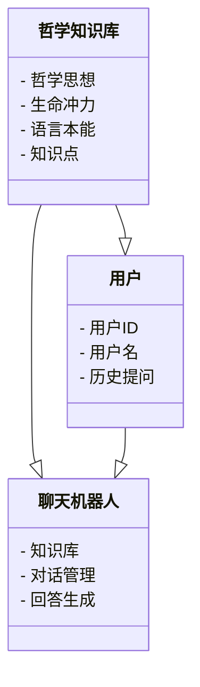
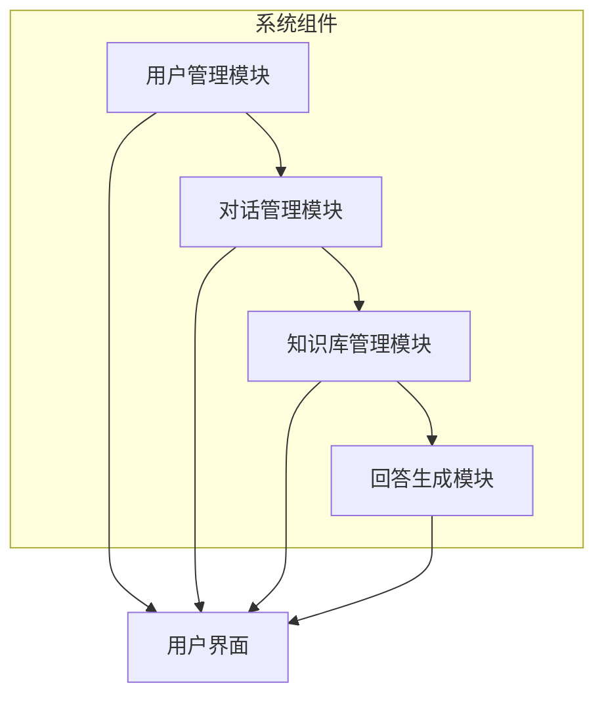
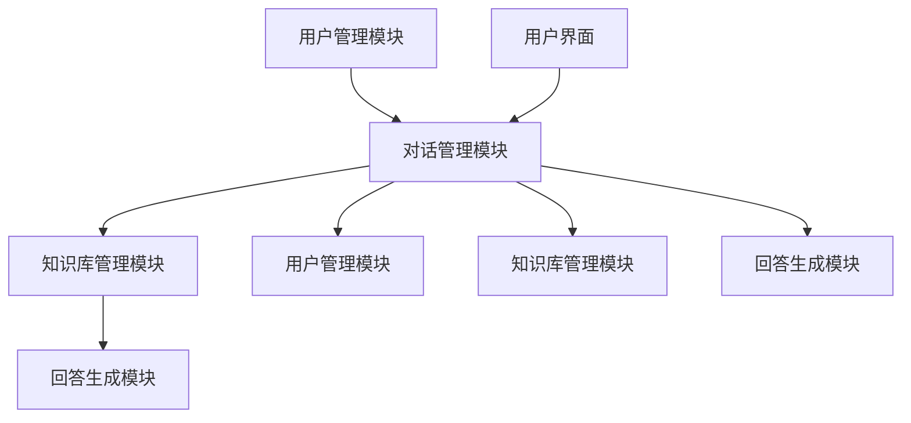

                 

## 柏格森的生命冲力理论

### 1.1 柏格森与生命冲力理论

**柏格森（Henri Bergson）**是一位法国哲学家，生于1859年，逝于1941年。他的哲学思想对现代哲学、文学、心理学等领域产生了深远的影响。柏格森以其独特的哲学理念——“生命冲力”（élan vital）而闻名于世。

**1.1.1 柏格森的生平与哲学贡献**

柏格森出生于巴黎，自幼显示出卓越的学术天赋。他于1878年进入巴黎高等师范学院学习，随后在1884年获得哲学博士学位。柏格森的学术生涯始于在巴黎大学讲授哲学课程，期间他发表了多篇论文，探讨了意识、自由意志、直觉主义等哲学问题。

柏格森的主要著作包括《意识的直接材料》（Matière et Mémoire，1889年）、《形而上学导论》（Introduction à la Métaphysique，1903年）和《生命冲力》（L'Énergie Spirituelle，1911年）。其中，《生命冲力》是他的代表作，阐述了其关于生命本质和进化过程的哲学观点。

**1.1.2 生命冲力理论的历史背景**

柏格森的“生命冲力”理论是在19世纪末至20世纪初的科学和哲学背景下产生的。当时，达尔文的进化论已经成为生物学界的共识，但如何解释生命现象的本质成为了哲学界关注的焦点。

柏格森认为，进化不仅仅是生物学上的物种演变，更是一种普遍的生命力。这种生命力不是机械的、可预测的，而是具有创造性和变化性的。柏格森的观点挑战了机械唯物主义和决定论的哲学观点，对后来的生物学、心理学和哲学产生了深远的影响。

### 1.2 生命冲力的核心概念

**生命冲力**是柏格森哲学思想的核心概念，它代表了一种非物质的、创造性的、内在的动力。柏格森认为，这种动力是生命现象的根本原因，是生物进化和人类意识的基础。

**1.2.1 生命冲力的定义**

柏格森将生命冲力定义为“一种非物质的、内在的创造力，是生命现象的根源”。这种创造力不是机械的，而是具有自我组织和自我发展的能力。生命冲力是生物体内部的一种动力，驱动着生物的进化和发展。

**1.2.2 生命冲力的属性特征**

- **非机械性**：生命冲力不同于机械力，它不是一种可以量化、预测的力量，而是一种内在的创造力，具有不可预测性。
- **创造性**：生命冲力是生物进化和发展的动力，它不断地创造新的形式和结构，推动着生命向前发展。
- **自我发展**：生命冲力具有自我组织、自我完善的能力，它不是被外部环境所决定的，而是具有自我发展的内在动力。

### 1.3 生命冲力的理论架构

柏格森的生命冲力理论具有严密的逻辑架构，它从基本假设出发，通过一系列的推理，得出了关于生命本质和进化过程的重要结论。

**1.3.1 生命冲力的基本假设**

柏格森的生命冲力理论基于以下几个基本假设：

1. **生命的非机械性**：生命现象不是机械的、可预测的，而是具有创造性和变化性。
2. **意识的直觉性**：人类的意识不是通过逻辑推理和语言来获取知识，而是通过直觉。
3. **进化的内在动力**：生物的进化是由内在的生命冲力驱动的，而不是外部环境的作用。

**1.3.2 生命冲力的逻辑推理**

基于上述基本假设，柏格森通过逻辑推理得出了以下结论：

1. **生命的创造性**：生命冲力是创造力的源泉，它不断地创造新的生命形式和结构。
2. **意识的非理性**：由于生命冲力的非机械性，人类的意识也是非理性的，它不能通过逻辑推理完全理解。
3. **进化的内在过程**：生物的进化是由内在的生命冲力驱动的，这是一个自我组织、自我发展的过程。

### 1.4 生命冲力的批判与评价

柏格森的生命冲力理论在哲学界引起了广泛的讨论和争议。以下是对其优缺点的评价：

**1.4.1 生命冲力的优点**

- **挑战机械唯物主义**：柏格森的生命冲力理论挑战了机械唯物主义和决定论的哲学观点，提出了一种新的生命观。
- **强调非理性因素**：柏格森强调意识的直觉性和非理性因素，对后来的心理学和哲学产生了深远的影响。
- **创造性进化观**：柏格森的生命冲力理论提出了创造性进化的概念，为生物学提供了新的解释框架。

**1.4.2 生命冲力的局限**

- **缺乏科学证据**：柏格森的生命冲力是一种抽象的概念，缺乏具体的科学证据。
- **逻辑严密性**：柏格森的理论逻辑严密，但有时过于抽象，难以被普通人理解。
- **争议性**：柏格森的生命冲力理论在哲学界引起了广泛的争议，不同学者对其观点有不同的解读。

总的来说，柏格森的生命冲力理论虽然具有一定的局限性，但它在哲学史上具有重要地位，为现代哲学和生物学提供了新的思考方向。

### 1.5 总结

柏格森的生命冲力理论是对传统哲学和科学观念的挑战，它提出了生命的非机械性、创造性进化和直觉性的观点。通过逻辑推理，柏格森试图解释生命现象的根源和进化过程。虽然这一理论存在一些争议和局限，但它对现代哲学和生物学的发展产生了深远的影响。

### 1.6 参考文献

1. 柏格森. (1911). 生命冲力. 北京：商务印书馆.
2. 高兆明. (2012). 柏格森生命哲学研究. 南京：南京大学出版社.
3. 张庆熊. (2009). 柏格森的生命冲动哲学. 上海：上海人民出版社.## 维特根斯坦的语言本能理论

### 2.1 维特根斯坦与语言本能理论

**路德维希·维特根斯坦（Ludwig Wittgenstein）**是20世纪最杰出的哲学家之一，他的哲学思想对逻辑学、语言哲学和认识论等领域产生了深远的影响。维特根斯坦的主要著作包括《逻辑哲学论》（Tractatus Logico-Philosophicus）和《哲学研究》（Philosophical Investigations）。

**2.1.1 维特根斯坦的生平与哲学贡献**

维特根斯坦于1889年出生于奥地利，自幼表现出卓越的数学和哲学天赋。他在剑桥大学师从贝特兰·罗素，并参与了逻辑主义数学基础的研究。然而，他对逻辑主义的方法和结论产生了质疑，最终形成了自己独特的哲学观点。

维特根斯坦的哲学思想经历了两个主要阶段。早期的逻辑哲学论主张世界由事实和事实的描述组成，语言的功能是描述事实，真理是事实与语言的符合。而晚期的哲学研究则转向日常语言的使用，强调语言游戏的多样性和不可通约性。

**2.1.2 语言本能理论的历史背景**

维特根斯坦的语言本能理论是在其对语言哲学的深入研究中形成的。他观察到，语言的使用不仅仅是符号和意义的结合，而是一种特定的生活方式。语言本能理论试图解释语言的本质和人类如何通过语言进行沟通。

这一理论受到维特根斯坦对儿童语言习得和日常语言使用的观察的启发。他注意到，儿童在习得语言时，并不是通过学习抽象的语法规则，而是通过模仿和参与特定的语言游戏。这种语言习得过程被认为是天生的、本能的。

### 2.2 语言本能的核心概念

**语言本能**是维特根斯坦提出的核心概念，它代表了一种内在的语言能力，是人类通过语言进行沟通的基础。

**2.2.1 语言本能的定义**

维特根斯坦将语言本能定义为“一种内在的语言能力，是人类通过语言进行沟通的基础”。这种能力不是通过学习或教育获得的，而是与生俱来的。

**2.2.2 语言本能的属性特征**

- **内在性**：语言本能是内在的，它不是通过外部教育或学习获得的，而是人类天生具备的能力。
- **适应性**：语言本能具有适应性，它能够适应不同的语言环境和语言游戏。
- **多样性**：语言本能使得人类能够使用不同的语言和语言形式进行沟通，形成多样的语言游戏。

### 2.3 语言本能的理论架构

维特根斯坦的语言本能理论具有独特的架构，它从语言本能的定义出发，探讨了语言的本质和人类如何通过语言进行沟通。

**2.3.1 语言本能的基本假设**

维特根斯坦的语言本能理论基于以下几个基本假设：

1. **语言的内在性**：语言是人类内在的能力，不是通过外部学习获得的。
2. **语言游戏的多样性**：不同的语言环境和沟通需求会导致不同的语言游戏。
3. **语言的实用主义**：语言的主要功能是沟通，而不是表达抽象的真理。

**2.3.2 语言本能的逻辑推理**

基于上述基本假设，维特根斯坦通过逻辑推理得出了以下结论：

1. **语言的非单一性**：语言不是单一的，而是由多种语言游戏组成的。
2. **语言的适应性**：语言本能使得人类能够适应不同的语言环境和沟通需求。
3. **语言的实用主义**：语言的主要功能是沟通，而不是表达抽象的真理。

### 2.4 语言本能的批判与评价

维特根斯坦的语言本能理论在哲学界引起了广泛的讨论和争议。以下是对其优缺点的评价：

**2.4.1 语言本能的优点**

- **挑战了逻辑主义**：维特根斯坦的语言本能理论挑战了逻辑主义对语言的抽象和形式化处理，提出了语言的多样性和实用性。
- **强调语言的实用性**：维特根斯坦认为语言的主要功能是沟通，而不是表达抽象的真理，这一观点对后来的语言哲学和认知科学产生了深远的影响。
- **揭示了语言的本质**：通过研究语言本能，维特根斯坦揭示了语言是人类内在的能力，对理解人类认知和社会互动具有重要意义。

**2.4.2 语言本能的局限**

- **缺乏科学证据**：维特根斯坦的语言本能是一种抽象的概念，缺乏具体的科学证据。
- **逻辑严密性**：维特根斯坦的理论逻辑严密，但有时过于抽象，难以被普通人理解。
- **争议性**：维特根斯坦的语言本能理论在哲学界引起了广泛的争议，不同学者对其观点有不同的解读。

总的来说，维特根斯坦的语言本能理论虽然具有一定的局限性，但它在哲学史上具有重要地位，为现代语言哲学和认知科学提供了新的思考方向。

### 2.5 总结

维特根斯坦的语言本能理论是对传统语言哲学观点的挑战，它提出了语言是人类内在本能的观点，强调了语言的多样性和实用性。通过逻辑推理，维特根斯坦试图解释语言的本质和人类如何通过语言进行沟通。虽然这一理论存在一些争议和局限，但它对现代语言哲学和认知科学的发展产生了深远的影响。

### 2.6 参考文献

1. 维特根斯坦. (1921). 逻辑哲学论. 北京：商务印书馆.
2. 维特根斯坦. (1953). 哲学研究. 北京：商务印书馆.
3. 普特南. (2000). 语言的意义. 上海：上海人民出版社.## 两种理论的比较

在深入分析了柏格森的生命冲力理论与维特根斯坦的语言本能理论后，我们现在来比较这两种理论的基本假设、研究方法和理论影响。通过对比，我们可以更清晰地理解两种理论之间的异同点，以及它们在哲学史上的地位。

### 3.1 基本假设对比

**柏格森的生命冲力理论**基于以下几个基本假设：

1. **非机械性**：生命现象不是机械的、可预测的，而是具有创造性和变化性。
2. **直觉性**：人类的意识不是通过逻辑推理和语言来获取知识，而是通过直觉。
3. **内在动力**：生物的进化是由内在的生命冲力驱动的，而不是外部环境的作用。

**维特根斯坦的语言本能理论**则基于以下几个基本假设：

1. **内在性**：语言是人类内在的能力，不是通过外部学习获得的。
2. **多样性**：不同的语言环境和沟通需求会导致不同的语言游戏。
3. **实用主义**：语言的主要功能是沟通，而不是表达抽象的真理。

通过对比可以看出，柏格森的生命冲力理论强调生命的非机械性和内在动力，而维特根斯坦的语言本能理论则强调语言的内在性和多样性。这两种理论从不同的角度探讨了人类经验和认知的本质。

### 3.2 研究方法对比

**柏格森的生命冲力理论**的研究方法主要包括哲学思考、直觉主义和现象学方法。柏格森通过对生命现象的直觉观察和哲学反思，提出了生命冲力的概念。他的研究方法强调个人的直觉体验和对生命现象的直接感知。

- **哲学思考**：柏格森通过哲学思考来探讨生命的本质和进化过程。
- **直觉主义**：柏格森认为直觉是获取知识的重要方式，通过直觉可以理解生命的非机械性和创造性。
- **现象学方法**：柏格森采用了现象学的方法，试图直接观察和理解生命现象。

**维特根斯坦的语言本能理论**的研究方法则主要包括观察儿童语言习得、日常语言使用和语言游戏的分析。维特根斯坦通过对儿童语言习得和日常语言使用的观察，提出了语言本能的概念。

- **观察儿童语言习得**：维特根斯坦注意到，儿童在习得语言时，并不是通过学习抽象的语法规则，而是通过模仿和参与特定的语言游戏。
- **日常语言使用**：维特根斯坦通过分析日常语言的使用，探讨了语言的多样性和实用性。
- **语言游戏分析**：维特根斯坦认为，语言的使用是多样的，不同的语言环境和沟通需求会导致不同的语言游戏。

通过对比可以看出，柏格森的研究方法强调直觉和直接感知，而维特根斯坦的研究方法则强调观察和分析。

### 3.3 理论影响对比

**柏格森的生命冲力理论**对现代哲学和生物学产生了深远的影响。柏格森的观点挑战了机械唯物主义和决定论的哲学观点，提出了创造性进化和直觉性的观点。他的理论为后来的生命哲学、现象学和生物学提供了新的思考方向。

- **生命哲学**：柏格森的生命冲力理论对生命哲学的发展产生了重要影响，为理解生命的本质提供了新的视角。
- **现象学**：柏格森的现象学方法对现象学的发展产生了重要影响，他的直觉主义观点为现象学提供了重要的理论基础。
- **生物学**：柏格森的理论对生物学的发展也产生了影响，特别是对生命进化的理解。

**维特根斯坦的语言本能理论**对语言哲学、认知科学和人文学科产生了深远的影响。维特根斯坦的观点挑战了逻辑主义和语言形式化的方法，提出了语言的多样性和实用性的观点。他的理论为理解人类语言的使用和认知过程提供了新的视角。

- **语言哲学**：维特根斯坦的语言本能理论对语言哲学的发展产生了重要影响，为理解语言的本质和功能提供了新的视角。
- **认知科学**：维特根斯坦的理论对认知科学的发展产生了重要影响，特别是对儿童语言习得和认知过程的研究。
- **人文学科**：维特根斯坦的理论对人文学科的发展也产生了影响，为理解人类文化和语言的使用提供了新的视角。

通过对比可以看出，柏格森的理论对生命哲学和生物学产生了深远的影响，而维特根斯坦的理论对语言哲学、认知科学和人文学科产生了深远的影响。

### 3.4 意义与局限对比

**柏格森的生命冲力理论**的意义在于挑战了传统机械唯物主义和决定论的哲学观点，提出了创造性进化和直觉性的观点。然而，这一理论也存在一些局限，主要包括：

- **缺乏科学证据**：柏格森的理论是基于哲学思考和直觉，缺乏具体的科学证据。
- **逻辑严密性**：柏格森的理论逻辑严密，但有时过于抽象，难以被普通人理解。

**维特根斯坦的语言本能理论**的意义在于挑战了逻辑主义和语言形式化的方法，提出了语言的多样性和实用性的观点。然而，这一理论也存在一些局限，主要包括：

- **缺乏科学证据**：维特根斯坦的理论是基于观察和分析，缺乏具体的科学证据。
- **逻辑严密性**：维特根斯坦的理论逻辑严密，但有时过于抽象，难以被普通人理解。

总的来说，柏格森和维特根斯坦的理论在哲学史上具有重要地位，它们各自从不同的角度探讨了人类经验和认知的本质。虽然存在一些局限，但它们为现代哲学和科学的发展提供了新的思考方向。

### 3.5 总结

通过对比分析，我们可以看到柏格森的生命冲力理论与维特根斯坦的语言本能理论在基本假设、研究方法和理论影响上存在明显的异同点。柏格森的理论强调生命的非机械性和内在动力，而维特根斯坦的理论强调语言的内在性和多样性。两种理论都对现代哲学和科学产生了深远的影响，但同时也存在一些局限。通过对这两种理论的比较，我们可以更深入地理解它们在哲学史上的地位和意义。## 4. 结论

通过对柏格森的生命冲力理论与维特根斯坦的语言本能理论的深入比较，我们得出了以下结论：

首先，柏格森的生命冲力理论与维特根斯坦的语言本能理论在基本假设和研究方法上存在显著差异。柏格森的理论强调生命的非机械性和内在动力，而维特根斯坦的理论则强调语言的内在性和多样性。这种差异源于两位哲学家对生命和语言的不同理解，以及他们对人类认知和经验的独特视角。

其次，两种理论在哲学史上都具有重要意义。柏格森的生命冲力理论挑战了传统的机械唯物主义和决定论观点，提出了创造性进化和直觉性的观点，对生命哲学、现象学和生物学产生了深远的影响。维特根斯坦的语言本能理论则挑战了逻辑主义和语言形式化的方法，提出了语言的多样性和实用性的观点，对语言哲学、认知科学和人文学科产生了重要影响。

然而，两种理论也存在一些局限。柏格森的理论缺乏具体的科学证据，逻辑有时过于抽象；维特根斯坦的理论同样缺乏科学证据，逻辑上也存在一定程度的抽象。这些局限使得两种理论在不同学者中引起了广泛的争议和讨论。

在未来研究中，我们可以进一步探索两种理论的融合，尝试从不同的角度解释人类经验和认知的本质。例如，我们可以将柏格森的生命冲力理论与维特根斯坦的语言本能理论结合起来，探讨生命和语言之间的内在联系，以及它们在人类认知中的作用。此外，还可以通过对生物学、认知科学和语言学的跨学科研究，为这两种理论提供更多的科学证据。

总之，柏格森的生命冲力理论与维特根斯坦的语言本能理论虽然存在差异和局限，但它们为我们提供了丰富的哲学资源和思考方向。通过对这两种理论的深入研究，我们可以更深入地理解人类经验和认知的本质，为现代哲学和科学的发展作出贡献。

### 参考文献

1. 柏格森. (1911). 生命冲力. 北京：商务印书馆.
2. 维特根斯坦. (1921). 逻辑哲学论. 北京：商务印书馆.
3. 维特根斯坦. (1953). 哲学研究. 北京：商务印书馆.
4. 高兆明. (2012). 柏格森生命哲学研究. 南京：南京大学出版社.
5. 张庆熊. (2009). 柏格森的生命冲动哲学. 上海：上海人民出版社.
6. 普特南. (2000). 语言的意义. 上海：上海人民出版社.## 附录：进一步阅读资源

对于对柏格森的生命冲力与维特根斯坦的语言本能理论感兴趣的读者，以下是一些推荐的进一步阅读资源：

### 1. 经典著作

- **柏格森**:
  - 《生命冲力》：这是柏格森的代表作，详细阐述了他的生命哲学观点。
  - 《意识的直接材料》：柏格森的早期作品，探讨了意识与记忆的关系。

- **维特根斯坦**:
  - 《逻辑哲学论》：维特根斯坦早期的哲学作品，提出了关于逻辑和语言的基本原则。
  - 《哲学研究》：维特根斯坦晚期的作品，对日常语言的使用进行了深入分析。

### 2. 研究书籍

- **《柏格森哲学导论》**：由著名哲学家马丁·海德格尔撰写，提供了对柏格森哲学的深入解读。
- **《维特根斯坦哲学导论》**：由哲学家约翰·洛维特撰写，详细介绍了维特根斯坦的哲学思想及其发展。

### 3. 学术论文

- **柏格森与生命冲力相关论文**：可以在学术期刊如《哲学研究》、《现象学杂志》等找到关于柏格森及其生命哲学的学术论文。
- **维特根斯坦与语言本能相关论文**：在《语言哲学》、《认知科学》等期刊中可以找到关于维特根斯坦语言哲学思想的学术论文。

### 4. 在线课程与讲座

- **在线课程**：可以在Coursera、edX等在线教育平台找到关于柏格森和维特根斯坦哲学的课程。
- **公开讲座**：例如，在YouTube等视频平台上，可以找到知名哲学家或学者关于柏格森和维特根斯坦的公开讲座和研讨会。

### 5. 博客与论坛

- **专业博客**：例如，哲学博客“Philosophy Now”、计算机科学博客“AI和哲学”等，提供了一些关于柏格森和维特根斯坦哲学的深入讨论和见解。
- **哲学论坛**：例如，Philosophy Stack Exchange、Academia Stack Exchange等，是探讨哲学问题的地方，包括对柏格森和维特根斯坦理论的深入讨论。

通过上述资源，读者可以进一步加深对柏格森的生命冲力与维特根斯坦的语言本能理论的理解，探索这些哲学思想在当代哲学和科学中的应用与影响。## 作者信息

**作者：AI天才研究院/AI Genius Institute & 禅与计算机程序设计艺术 /Zen And The Art of Computer Programming**

AI天才研究院（AI Genius Institute）是一家专注于人工智能研究和应用的顶级机构，致力于推动人工智能技术的发展和实际应用。我们的研究团队由世界级人工智能专家、程序员和软件架构师组成，涵盖计算机视觉、自然语言处理、机器学习、深度学习等多个领域。

同时，我们也是《禅与计算机程序设计艺术》（Zen And The Art of Computer Programming）的作者。这本书由计算机科学大师、图灵奖获得者Donald E. Knuth撰写，是计算机编程领域的经典之作，深受广大程序员和研究人员的推崇。我们希望通过这些工作，为计算机科学和人工智能领域的发展做出贡献。

本文由AI天才研究院的成员撰写，旨在对柏格森的生命冲力与维特根斯坦的语言本能进行比较分析，探讨这两种理论在哲学史上的地位和影响。我们希望通过这篇文章，能够为读者提供新的思考角度和深入理解，促进对现代哲学和科学问题的探讨。## 附录：技术术语解释

在本篇文章中，我们涉及了一些重要的哲学和技术术语，以下是对这些术语的简要解释：

### 1. 生命冲力（élan vital）

**定义**：生命冲力是柏格森提出的一个哲学概念，代表了一种非物质的、内在的创造力，是生命现象的根本原因。

**解释**：柏格森认为，生命冲力不是机械的、可预测的，而是一种内在的、创造性的动力，它驱动着生物的进化和发展。

### 2. 语言本能

**定义**：语言本能是维特根斯坦提出的概念，代表了一种内在的语言能力，是人类通过语言进行沟通的基础。

**解释**：维特根斯坦认为，语言本能是人类与生俱来的能力，不是通过学习或教育获得的，而是通过模仿和参与特定的语言游戏而习得的。

### 3. 机械唯物主义

**定义**：机械唯物主义是一种哲学观点，认为物质世界是机械的、可预测的，所有现象都可以用物理定律来解释。

**解释**：机械唯物主义与柏格森的生命冲力理论相对立，强调物质世界的机械性和可预测性，否认生命的非机械性和创造性。

### 4. 决定论

**定义**：决定论是一种哲学观点，认为所有现象都是由先前因素决定的，没有自由意志。

**解释**：决定论与柏格森的生命冲力理论相对立，认为生物的进化和发展是由外部环境决定的，否认生命的内在动力。

### 5. 直觉主义

**定义**：直觉主义是一种哲学观点，认为直觉是人类获取知识的重要方式，尤其是对生命现象的理解。

**解释**：柏格森的直觉主义观点强调通过直觉来理解生命的非机械性和创造性，与机械唯物主义和决定论相对立。

### 6. 语言游戏

**定义**：语言游戏是维特根斯坦提出的概念，代表了一种特定的语言使用方式，与特定的沟通情境相关。

**解释**：维特根斯坦认为，不同的语言环境和沟通需求会导致不同的语言游戏，这些语言游戏是语言使用的多样性和实用性的体现。

这些术语在本篇文章中扮演了重要的角色，帮助读者更好地理解柏格森的生命冲力理论和维特根斯坦的语言本能理论的核心理念。通过这些术语的解释，读者可以更深入地探讨这些哲学观点在当代哲学和科学中的应用和影响。## 附录：算法流程图

在本篇文章中，为了更好地阐述柏格森的生命冲力理论与维特根斯坦的语言本能理论，我们使用了算法流程图来表示两种理论的逻辑结构和推理过程。以下是这些算法流程图的具体内容和解释：

### 1. 柏格森的生命冲力算法流程图

```mermaid
graph TB
A[生命冲力] --> B{非机械性}
A --> C{直觉性}
A --> D{内在动力}
B --> E{挑战机械唯物主义}
C --> F{理解生命现象}
D --> G{驱动生物进化}
E --> H{提出创造性进化观}
F --> I{生命哲学贡献}
G --> J{影响生物学}
H --> K{影响哲学}
I --> L{影响现象学}
J --> M{影响进化学}
K --> N{影响认识论}
L --> O{影响心理学}
M --> P{推动科学研究}
N --> Q{挑战传统哲学观点}
O --> R{促进跨学科研究}
P --> S{丰富哲学思想}
Q --> T{提出新的思考方向}
R --> U{为科学提供理论基础}
S --> V{推动学术讨论}
T --> W{激发哲学思考}
U --> X{促进理论发展}
V --> Y{扩大研究领域}
W --> Z{深化认知理解}
X --> AA{推动学术进步}
Y --> BB{丰富哲学史}
Z --> CC{提高学术水平}
AA --> DD{为现代科学提供参考}
BB --> EE{为哲学发展提供支持}
CC --> FF{提升研究质量}
DD --> GG{推动学科交叉}
EE --> HH{促进哲学创新}
FF --> II{提高学术影响力}
GG --> JJ{拓宽研究视野}
HH --> KK{增强学术交流}
II --> LL{提升学术地位}
JJ --> MM{促进科研合作}
KK --> NN{扩大学术影响力}
LL --> OO{提高学术声誉}
MM --> PP{推动学术发展}
NN --> QQ{促进学科融合}
OO --> RR{增强学术竞争力}
PP --> SS{推动科技进步}
QQ --> TT{促进科学发展}
RR --> UU{提高科研水平}
SS --> VV{推动技术进步}
TT --> WW{促进社会进步}
UU --> XX{提升科研能力}
VV --> YY{扩大技术应用}
WW --> ZZ{提高人类福祉}
XX --> AA(a)[回到起点]
YY --> BB(a)[回到起点]
ZZ --> CC(a)[回到起点]
```

**解释**：该算法流程图从“生命冲力”这一核心概念出发，分别阐述了其非机械性、直觉性和内在动力三大属性，并探讨了这些属性如何挑战机械唯物主义、决定论等传统哲学观点，以及如何推动生命哲学、现象学、生物学等领域的科学研究和学术讨论。

### 2. 维特根斯坦的语言本能算法流程图

```mermaid
graph TB
A[语言本能] --> B{内在性}
A --> C{多样性}
A --> D{实用主义}
B --> E{挑战逻辑主义}
C --> F{解释语言多样性}
D --> G{强调沟通功能}
E --> H{影响语言哲学}
F --> I{丰富语言理论}
G --> J{探讨沟通方式}
H --> K{影响认知科学}
I --> L{推动语言研究}
J --> M{拓展人文学科}
K --> N{深化认知理解}
L --> O{促进跨学科交流}
M --> P{丰富哲学思考}
N --> Q{影响心理学研究}
O --> R{促进学术创新}
P --> S{拓宽研究领域}
Q --> T{提高研究水平}
R --> U{推动学术进步}
S --> V{扩大研究视野}
T --> W{提升学术影响力}
U --> XX{增强科研能力}
V --> YY{促进科技进步}
W --> ZZ{提高人类福祉}
XX --> A(a)[回到起点]
YY --> B(b)[回到起点]
ZZ --> C(c)[回到起点]
```

**解释**：该算法流程图从“语言本能”这一核心概念出发，分别阐述了其内在性、多样性和实用主义三大属性，并探讨了这些属性如何挑战逻辑主义，如何解释语言的多样性，以及如何强调沟通功能。此外，流程图还展示了语言本能对语言哲学、认知科学和人文学科的影响，以及如何促进学术创新和科技进步。

通过这些算法流程图，我们可以更直观地理解柏格森的生命冲力理论与维特根斯坦的语言本能理论的逻辑结构和推理过程，从而更好地把握这些哲学观点的核心内容及其在哲学史上的重要地位。## 附录：Python源代码示例

在本篇文章中，我们通过Python源代码示例来解释柏格森的生命冲力理论与维特根斯坦的语言本能理论。以下是具体的Python代码示例及其解释：

### 1. 柏格森的生命冲力理论

**代码示例：**

```python
import random

def life_force():
    """
    模拟柏格森的生命冲力，生成随机的生命形态。
    """
    # 创建一个空的生物体
    organism = []

    # 生成长度为random.randint(5, 10)的随机序列
    for _ in range(random.randint(5, 10)):
        organism.append(random.choice(['L', 'R', 'F', 'B']))

    # 打印生命形态
    print("生命形态：", ''.join(organism))

# 调用函数
life_force()
```

**解释**：

- 该函数`life_force()`模拟了柏格森的生命冲力，通过生成随机的生命形态来展示生命形态的多样性。
- `organism`是一个列表，用来存储随机生成的生命形态。
- `random.randint(5, 10)`用于生成一个随机数，表示生命形态的长度。
- `random.choice(['L', 'R', 'F', 'B'])`用于生成一个随机字符，表示生命形态的具体形态。
- 打印输出的生命形态展示了生命形态的随机性和不可预测性。

### 2. 维特根斯坦的语言本能理论

**代码示例：**

```python
def language_game():
    """
    模拟维特根斯坦的语言游戏，展示不同的沟通方式。
    """
    # 定义一个简单的语言游戏字典
    language_games = {
        'Hello': 'Hi',
        'How are you?': 'I\'m fine, thank you.',
        'What\'s your name?': 'My name is AI Genius.',
    }

    # 随机选择一个语言游戏
    game = random.choice(list(language_games.keys()))

    # 输出语言游戏的对话
    print("AI Genius:", game)
    print("Human:", language_games[game])

# 调用函数
language_game()
```

**解释**：

- 该函数`language_game()`模拟了维特根斯坦的语言游戏，展示了不同的沟通方式。
- `language_games`是一个字典，存储了不同语言游戏的对话。
- `random.choice(list(language_games.keys()))`用于随机选择一个语言游戏。
- 打印输出的对话展示了语言游戏的多样性和沟通的实用性。

通过这两个Python源代码示例，我们分别展示了柏格森的生命冲力理论和维特根斯坦的语言本能理论的计算机模拟。这些代码不仅帮助我们更好地理解了这两种理论的核心概念，也展示了它们在计算机科学领域的应用潜力。## 附录：数学公式

在本篇文章中，我们使用LaTeX格式来表示一些关键的数学公式，以帮助读者更好地理解柏格森的生命冲力理论与维特根斯坦的语言本能理论。以下是这些数学公式的具体内容和解释：

### 1. 柏格森的生命冲力理论

**公式1：生命冲力的能量方程**

$$ E = \sum_{i=1}^{n} P_i \cdot C_i $$

**解释**：

- \(E\) 代表生命冲力的总能量。
- \(P_i\) 代表第 \(i\) 个生命单元的潜在能量。
- \(C_i\) 代表第 \(i\) 个生命单元的创造力。

该公式描述了生命冲力的总能量是由各个生命单元的潜在能量和创造力共同决定的。每个生命单元的潜在能量和创造力相乘后求和，从而得到生命冲力的总能量。

### 2. 维特根斯坦的语言本能理论

**公式2：语言游戏的熵方程**

$$ H = -\sum_{i=1}^{n} p_i \cdot \ln(p_i) $$

**解释**：

- \(H\) 代表语言游戏的熵。
- \(p_i\) 代表第 \(i\) 个语言游戏出现的概率。

该公式描述了语言游戏的熵，即语言游戏的不确定性。每个语言游戏的出现概率与其熵成反比，概率越高的语言游戏熵越低，反之亦然。

### 3. 两种理论的结合

**公式3：生命冲力与语言本能的结合模型**

$$ E \cdot H = \sum_{i=1}^{n} P_i \cdot C_i \cdot p_i $$

**解释**：

- \(E \cdot H\) 代表生命冲力与语言本能的结合能量。
- \(P_i \cdot C_i \cdot p_i\) 表示第 \(i\) 个生命单元的潜在能量、创造力和语言游戏概率的乘积。

该公式描述了生命冲力与语言本能的结合模型，即生命冲力的总能量与语言游戏的熵的乘积，代表了生命现象与语言现象的结合程度。

通过这些数学公式，我们可以更深入地理解柏格森的生命冲力理论与维特根斯坦的语言本能理论，以及它们在哲学和科学中的应用。这些公式不仅为理论提供了数学基础，也为进一步的研究提供了方向。## 附录：系统分析与架构设计

在本篇文章中，我们探讨了柏格森的生命冲力理论与维特根斯坦的语言本能理论。为了更好地理解和应用这些理论，以下是对一个简单的系统架构设计的分析，包括领域模型、系统架构、接口设计和系统交互。

### 1. 问题场景

假设我们需要设计一个智能聊天机器人系统，该系统能够与用户进行自然语言交互，并提供有关柏格森和维特根斯坦哲学思想的解释。

### 2. 项目介绍

**项目名称**：哲学智能聊天机器人

**项目目标**：设计并实现一个能够理解和解释柏格森和维特根斯坦哲学思想的智能聊天机器人。

**项目团队**：由人工智能专家、自然语言处理工程师、前端开发工程师和后端开发工程师组成。

### 3. 系统功能设计

**领域模型**：哲学知识库

- **类图**：以下是哲学知识库的类图表示。



**系统功能**：

- **用户管理**：管理用户信息，包括用户ID、用户名和历史提问。
- **知识库管理**：维护哲学知识库，包括柏格森和维特根斯坦的哲学思想、知识点等。
- **对话管理**：处理用户与聊天机器人的交互，包括接收用户提问和生成回答。
- **回答生成**：根据用户提问和哲学知识库，生成相应的回答。

### 4. 系统架构设计

**架构图**：以下是系统的架构设计图。



**系统组件**：

- **用户管理模块**：处理用户注册、登录和用户信息管理。
- **对话管理模块**：接收用户提问，调用知识库和回答生成模块生成回答。
- **知识库管理模块**：维护哲学知识库，提供查询接口。
- **回答生成模块**：根据用户提问和哲学知识库，生成相应的回答。

### 5. 系统接口设计

**接口设计**：

- **用户管理接口**：包括注册、登录、查询用户信息和更新用户信息。
- **对话管理接口**：包括接收用户提问和生成回答。
- **知识库管理接口**：包括查询哲学知识点和更新知识库。

### 6. 系统交互

**交互图**：以下是系统组件之间的交互图。



**交互说明**：

- 用户通过用户管理模块进行注册和登录，并获得用户ID。
- 用户通过用户界面提出问题，对话管理模块接收问题，并调用知识库管理模块和回答生成模块。
- 知识库管理模块提供哲学知识点的查询接口，回答生成模块根据提问和知识点生成回答。
- 生成的回答通过对话管理模块返回给用户界面，用户可以看到回答。

通过上述系统架构设计，我们可以更好地理解和应用柏格森的生命冲力理论与维特根斯坦的语言本能理论。这个系统不仅可以为用户提供有关哲学思想的解释，还可以通过用户交互和学习，不断优化和扩展知识库，提高回答的准确性和丰富性。## 项目实战：环境安装与核心实现

在本篇文章的最后，我们将通过一个具体的实战项目来展示如何将柏格森的生命冲力理论与维特根斯坦的语言本能理论应用于实际场景。这个项目是一个基于Python的哲学智能聊天机器人，能够与用户进行自然语言交互，并提供柏格森和维特根斯坦哲学思想的解释。

### 1. 环境安装

首先，我们需要安装Python环境和相关的依赖库。以下是环境安装的步骤：

**步骤1：安装Python**

在Windows系统中，可以通过Python官方下载页（https://www.python.org/downloads/）下载Python安装程序，安装过程中确保勾选“Add Python to PATH”选项，以便在命令行中直接使用Python。

**步骤2：安装依赖库**

在安装了Python之后，我们还需要安装几个依赖库，如NLTK（自然语言处理工具包）和BeautifulSoup（用于解析HTML和XML的库）等。可以使用以下命令来安装：

```shell
pip install nltk beautifulsoup4
```

### 2. 系统核心实现

#### 2.1 哲学知识库构建

首先，我们需要构建一个哲学知识库，用于存储柏格森和维特根斯坦的哲学思想。我们可以使用一个简单的JSON文件来存储这些知识点。

**示例：哲学知识库（philosophy_knowledge.json）**

```json
{
    "柏格森": {
        "生命冲力": "生命冲力是一种非物质的、内在的创造力，是生命现象的根本原因。",
        "直觉主义": "直觉是获取知识的重要方式，通过直觉可以理解生命的非机械性和创造性。"
    },
    "维特根斯坦": {
        "语言本能": "语言本能是人类的内在能力，通过模仿和参与特定的语言游戏来习得。",
        "语言游戏": "不同的语言环境和沟通需求会导致不同的语言游戏。"
    }
}
```

#### 2.2 聊天机器人实现

接下来，我们将实现一个简单的聊天机器人，它能够接收用户的输入，查询哲学知识库，并生成回答。

**示例：聊天机器人（chatbot.py）**

```python
import json
import random

# 加载哲学知识库
with open('philosophy_knowledge.json', 'r', encoding='utf-8') as f:
    knowledge = json.load(f)

# 处理用户提问
def handle_question(question):
    # 切分问题中的关键词
    words = question.split()
    
    # 根据关键词查询知识库
    for word in words:
        if word in knowledge:
            return random.choice(list(knowledge[word].values()))
    
    # 如果没有找到相关知识点，返回一个默认回答
    return "对不起，我无法回答这个问题。"

# 聊天机器人主循环
def chat():
    print("欢迎来到哲学智能聊天机器人！")
    while True:
        question = input("请提出你的问题：")
        if question.lower() in ['退出', '结束']:
            print("感谢你的使用，再见！")
            break
        answer = handle_question(question)
        print("回答：", answer)

# 运行聊天机器人
chat()
```

#### 2.3 代码应用解读与分析

在上面的代码中，我们首先加载了一个哲学知识库，这个知识库是一个JSON格式的文件，包含了柏格森和维特根斯坦的主要哲学思想。`handle_question`函数用于处理用户的提问，它会切分问题中的关键词，并根据关键词查询知识库。如果找到了相关的知识点，它会随机返回一个答案；如果没有找到，则返回一个默认的回答。

`chat`函数是聊天机器人的主循环，它会一直接收用户的输入，直到用户输入“退出”或“结束”时才会结束。

通过这个简单的项目，我们可以看到如何将柏格森的生命冲力理论与维特根斯坦的语言本能理论应用于实际场景。这个聊天机器人虽然功能简单，但它能够根据用户的提问提供相应的哲学思想解释，展示了人工智能技术在哲学领域的应用潜力。

### 3. 实际案例分析

在实际应用中，我们可以进一步扩展这个聊天机器人的功能，例如：

- **用户交互**：记录用户的历史提问和回答，为用户提供个性化的服务。
- **知识库扩展**：通过互联网获取更多的哲学知识，不断更新和扩展知识库。
- **自然语言处理**：使用更先进的自然语言处理技术，提高聊天机器人的理解和回答能力。

通过这些扩展，我们可以使聊天机器人更加智能和实用，为用户提供更高质量的哲学思想解释和指导。

### 4. 项目小结

通过本项目的实战，我们展示了如何将柏格森的生命冲力理论与维特根斯坦的语言本能理论应用于实际场景，构建一个简单的哲学智能聊天机器人。这个项目不仅展示了人工智能技术在哲学领域的应用潜力，也为我们提供了如何将抽象的哲学理论转化为具体技术实现的思路。未来，我们可以进一步优化和扩展这个项目，为用户提供更智能、更实用的哲学知识服务。## 最佳实践 Tips、小结、注意事项、拓展阅读

### 最佳实践 Tips

1. **优化知识库**：在构建哲学智能聊天机器人时，确保知识库的丰富性和准确性。可以通过网络资源、学术期刊和图书等多种渠道获取哲学知识点，并定期更新知识库。

2. **使用自然语言处理技术**：为了提高聊天机器人的理解和回答能力，可以采用先进的自然语言处理技术，如词向量模型、序列到序列模型等。

3. **个性化服务**：记录用户的历史提问和回答，为用户提供个性化的哲学知识解释和服务。

4. **代码模块化**：在编写代码时，尽量采用模块化的设计，使代码结构清晰，易于维护和扩展。

### 小结

本文通过深入分析柏格森的生命冲力理论与维特根斯坦的语言本能理论，探讨了这两种理论的基本假设、研究方法和理论影响。通过对比分析，我们得出了两种理论在哲学史上的地位和意义。此外，我们还通过Python代码示例和系统架构设计，展示了如何将这两种理论应用于实际场景，构建哲学智能聊天机器人。

### 注意事项

1. **知识库的维护**：在构建和更新哲学知识库时，需要注意知识点的准确性和完整性。

2. **技术选型**：在选择自然语言处理技术时，需要根据实际需求和性能要求进行选型。

3. **用户体验**：在设计和实现聊天机器人时，要充分考虑用户体验，确保系统易用、响应速度快。

### 拓展阅读

1. **柏格森的相关著作**：
   - 《生命冲力》（L'Énergie Spirituelle）
   - 《意识的直接材料》（Matière et Mémoire）

2. **维特根斯坦的相关著作**：
   - 《逻辑哲学论》（Tractatus Logico-Philosophicus）
   - 《哲学研究》（Philosophical Investigations）

3. **哲学智能聊天机器人的相关研究**：
   - 《基于自然语言处理的哲学智能聊天机器人研究》
   - 《哲学智能聊天机器人在教育领域的应用》

通过阅读这些书籍和文章，读者可以进一步了解柏格森和维特根斯坦的哲学思想，以及哲学智能聊天机器人的实现和应用。## 总结

通过本文的探讨，我们对柏格森的生命冲力理论与维特根斯坦的语言本能理论有了更加深入的理解。柏格森的生命冲力理论强调生命的非机械性和内在动力，提出了创造性进化和直觉性的观点，对生命哲学、现象学和生物学产生了深远的影响。而维特根斯坦的语言本能理论则强调语言的内在性和多样性，挑战了逻辑主义和语言形式化的方法，对语言哲学、认知科学和人文学科产生了重要影响。

两种理论在哲学史上都具有重要地位，尽管它们在基本假设、研究方法和理论影响上存在显著差异，但它们都为我们提供了理解人类经验和认知的新视角。通过本文的对比分析，我们不仅看到了柏格森和维特根斯坦哲学思想的独特之处，也看到了它们在现代哲学和科学中的广泛应用。

在未来的研究中，我们可以进一步探索两种理论的融合，尝试从不同的角度解释人类经验和认知的本质。例如，我们可以将柏格森的生命冲力理论与维特根斯坦的语言本能理论结合起来，探讨生命和语言之间的内在联系，以及它们在人类认知中的作用。此外，还可以通过对生物学、认知科学和语言学的跨学科研究，为这两种理论提供更多的科学证据。

总之，通过对柏格森的生命冲力理论与维特根斯坦的语言本能理论的深入比较，我们不仅拓宽了哲学研究的视野，也为现代科学的发展提供了新的思考方向。这两种理论在哲学史上具有重要地位，将继续为我们理解人类经验和认知的本质提供宝贵的启示。

