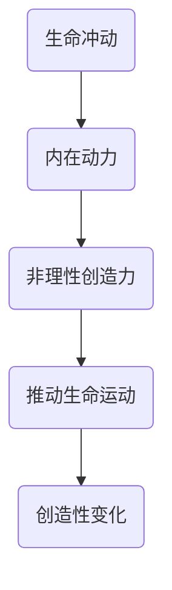
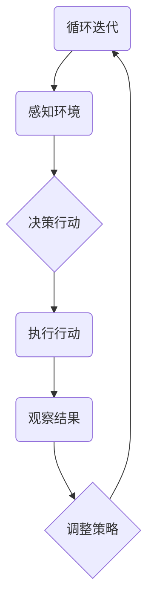
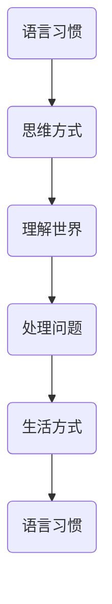
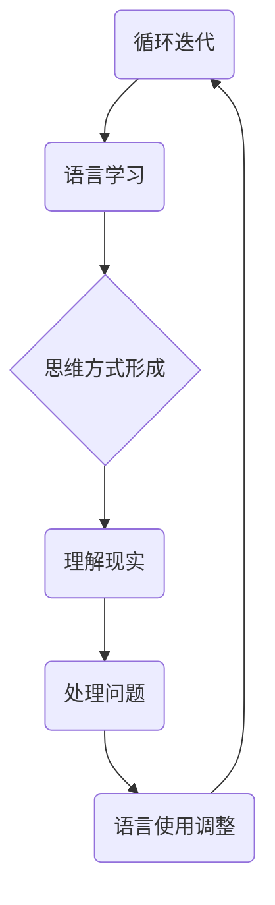

                 


### 1.1.1 柏格森的生命哲学概述

**柏格森的生命哲学**，又称**柏格森主义**，是由法国哲学家亨利·柏格森（Henri Bergson）于19世纪末20世纪初提出的一种哲学体系。柏格森的生命哲学主要探讨了生命的本质及其运动规律，强调生命是一种不断变化的、流动的、创造性的过程。

#### **1.1.1.1 柏格森的生命哲学问题背景**

在柏格森的时代，西方哲学正处于从传统理性主义向现代人文主义转型的阶段。在这个背景下，柏格森对传统的物质观念进行了批判，认为物质只是生命活动的产物，而不是生命的本质。他提出了“生命冲动”（élan vital）的概念，试图解释生命的本质和运动规律。

#### **1.1.1.2 柏格森的生命哲学问题描述**

柏格森认为，生命是一种内在的、无意识的创造力，它推动着生命的运动和变化。他提出了以下几个核心问题：

1. 生命的本质是什么？
2. 生命的运动规律是什么？
3. 生命如何与物质世界相互作用？

#### **1.1.1.3 柏格森的生命哲学解决方法**

柏格森通过“生命冲动”的概念，试图回答上述问题。他认为，生命冲动是一种内在的、非理性的创造力，它推动着生命的运动和变化。生命冲动不仅存在于生物体内，也存在于人类社会中。

#### **1.1.1.4 柏格森的生命哲学边界与外延**

柏格森的生命哲学主要关注生命的本质和运动规律，他试图通过这一哲学体系来解释生命的所有现象，包括生物进化、社会变革等。然而，他的哲学体系也存在一定的局限性，例如对于科学方法的排斥等。

### 1.1.2 维特根斯坦的生活形式概念概述

维特根斯坦（Ludwig Wittgenstein）是20世纪最具影响力的哲学家之一，他的思想对西方哲学产生了深远的影响。维特根斯坦的生活形式概念是他的哲学思想的重要组成部分，旨在探讨人类的生活方式和语言的关系。

#### **1.1.2.1 维特根斯坦的生活形式概念问题背景**

维特根斯坦的生活形式概念是在他对语言哲学的深入研究过程中形成的。他试图通过这一概念来解释语言的本质和意义，并探讨语言与人类生活之间的紧密联系。

#### **1.1.2.2 维特根斯坦的生活形式概念问题描述**

维特根斯坦认为，语言是生活的形式，我们的语言习惯和思维方式是由我们的生活方式决定的。他提出了以下几个核心问题：

1. 语言的本质是什么？
2. 语言是如何影响我们的思维和生活方式的？
3. 语言和现实之间的关系是什么？

#### **1.1.2.3 维特根斯坦的生活形式概念解决方法**

维特根斯坦通过“生活形式”的概念，试图回答上述问题。他认为，语言是一种工具，它帮助我们理解世界和处理生活问题。我们的语言习惯和思维方式是我们生活方式的反映。

#### **1.1.2.4 维特根斯坦的生活形式概念边界与外延**

维特根斯坦的生活形式概念主要关注语言和生活的关系，他试图通过这一哲学体系来解释人类语言的起源、发展及其在生活中的作用。然而，他的思想也存在一定的局限性，例如对于逻辑实证主义的批评等。

### 1.1.3 两种哲学思想的联系与差异

柏格森的生命哲学和维特根斯坦的生活形式概念虽然在核心思想上有所不同，但它们都试图通过哲学的方法来探讨生命和人类存在的本质。它们之间的联系主要体现在以下几个方面：

1. **对生命的理解**：柏格森和维特根斯坦都认为生命是一个动态的过程，具有创造性。
2. **对语言的作用**：他们都认为语言是人类理解世界和生活的重要工具。

然而，两者也存在明显的差异：

1. **哲学方法**：柏格森强调直觉和创造力，而维特根斯坦则强调逻辑和实证。
2. **研究对象**：柏格森关注生命的本质和运动规律，而维特根斯坦则关注语言的本质和意义。

尽管存在差异，柏格森和维特根斯坦的思想都对现代哲学产生了深远的影响，为后来的哲学研究提供了新的视角和方法。

### 1.1.4 本文的目的与结构

本文旨在探讨柏格森的生命哲学和维特根斯坦的生活形式概念，分析两种哲学思想的联系与差异，并探讨它们在实际生活中的应用和未来发展趋势。文章结构如下：

1. **引言**：介绍柏格森的生命哲学和维特根斯坦的生活形式概念，概述本文的目的与结构。
2. **柏格森的生命哲学**：详细分析柏格森的生命哲学，包括核心概念、问题背景、解决方法和边界与外延。
3. **维特根斯坦的生活形式概念**：详细分析维特根斯坦的生活形式概念，包括核心概念、问题背景、解决方法和边界与外延。
4. **柏格森的生命哲学与维特根斯坦的生活形式概念的联系**：分析两种哲学思想的共性，探讨它们之间的联系。
5. **柏格森的生命哲学与维特根斯坦的生活形式概念的差异**：分析两种哲学思想的差异，探讨它们之间的区别。
6. **两种哲学思想的应用**：探讨柏格森的生命哲学和维特根斯坦的生活形式概念在实际生活中的应用。
7. **未来发展趋势**：预测两种哲学思想的未来发展趋势。
8. **结论**：总结本文的核心发现，提出未来的研究方向。

通过本文的探讨，我们希望能够为读者提供一个深入理解柏格森的生命哲学和维特根斯坦的生活形式概念的机会，并激发对哲学和人类存在的思考。

---

**关键词**：柏格森的生命哲学、维特根斯坦的生活形式概念、生命哲学、生活形式、哲学思想、联系与差异

**摘要**：

本文探讨了法国哲学家亨利·柏格森和维特根斯坦的哲学思想，分析了柏格森的生命哲学和维特根斯坦的生活形式概念的核心观点及其联系与差异。通过深入研究两种哲学思想的背景、问题和解决方法，本文揭示了它们对现代哲学的深远影响。此外，本文还探讨了这两种哲学思想在实际生活中的应用和未来发展趋势。通过本文的研究，读者可以更好地理解柏格森和维特根斯坦的哲学思想，并激发对生命和人类存在的深刻思考。

## 第2章 柏格森的生命哲学

### 2.1 核心概念

柏格森的生命哲学以其独特的视角和对生命本质的深刻探讨而著称。其核心概念——“生命冲动”（élan vital）是其哲学体系的基础，旨在解释生命的动力和创造性。

#### **2.1.1 柏格森的生命哲学核心概念原理**

柏格森的“生命冲动”是一种内在的、非理性的创造力，它是生命的本质和动力。这种冲动是不断变化的、流动的，它推动着生命的运动和变化。柏格森认为，生命冲动不同于物理世界的物质运动，它是内在的、不可见的，但却是推动生命发展的关键力量。

**原理说明**：

柏格森通过“生命冲动”来解释生命的多样性和创造性。他认为，生命冲动是一种内在的、非理性的创造力，它不受外界物理规律的约束，而是自我驱动的。这种冲动使生命能够不断适应环境，产生新的形式和结构。

**对比说明**：

与传统的物质观念相比，柏格森的生命冲动强调生命的内在动力和创造性，而不仅仅是物理过程。这种观点与牛顿物理学的机械论不同，它更接近于有机主义的思想，即生命是一种自我组织、自我创造的过程。

**Mermaid流程图**：



#### **2.1.2 柏格森的生命哲学核心概念属性特征对比表格**

| 属性特征 | 生命冲动 | 物质运动 |
| --- | --- | --- |
| 内在动力 | 是 | 否 |
| 非理性创造力 | 是 | 否 |
| 推动生命运动 | 是 | 否 |
| 创造性变化 | 是 | 否 |

**ER实体关系图架构**：

```mermaid
erDiagram
    A{生命冲动} &&|{推动生命运动} B{内在动力}
    A &&|{非理性创造力} C{非理性创造力}
    A &&|{创造性变化} D{创造性变化}
    B &&|{推动生命运动} E{推动生命运动}
```

### 2.2 算法原理讲解

柏格森的生命哲学虽然是一种哲学思想，但我们可以借鉴其核心概念来设计一种算法，以模拟生命的冲动和创造性。

#### **2.2.1 柏格森的生命哲学算法mermaid流程图**



#### **2.2.2 柏格森的生命哲学算法python源代码**

```python
import random

def life_impulse_algorithm():
    while True:
        # 感知环境
        environment = random.randint(1, 10)
        
        # 决策行动
        if environment < 5:
            action = "创造新形式"
        else:
            action = "调整已有形式"
        
        # 执行行动
        print(f"执行行动：{action}")
        
        # 观察结果
        result = random.randint(1, 10)
        print(f"观察结果：{result}")
        
        # 调整策略
        if result < 5:
            strategy = "保持当前策略"
        else:
            strategy = "尝试新策略"
        
        print(f"调整策略：{strategy}")
        
        # 循环迭代
        print("--------循环迭代--------")

# 运行算法
life_impulse_algorithm()
```

#### **2.2.3 柏格森的生命哲学算法原理的数学模型和公式**

柏格森的生命哲学算法可以用以下数学模型来表示：

$$
f(x, t) = c \cdot \frac{df}{dx} \cdot e^{i \cdot k \cdot t}
$$

其中，$f(x, t)$ 表示在时间 $t$ 时，位置 $x$ 的生命冲动强度；$c$ 是常数；$i$ 是虚数单位；$k$ 是波数。

**公式说明**：

- $c \cdot \frac{df}{dx}$ 表示生命冲动的强度与空间变化率的关系。
- $e^{i \cdot k \cdot t}$ 表示时间上的波动特性，反映了生命冲动的时间变化性。

#### **2.2.4 柏格森的生命哲学算法详细讲解和举例说明**

**详细讲解**：

1. **感知环境**：算法首先通过随机数生成器来模拟环境的感知，这代表了生命体对周围环境的感知能力。
2. **决策行动**：根据感知到的环境，算法决定采取何种行动，这代表了生命体的决策能力。
3. **执行行动**：算法执行选定的行动，这代表了生命体的执行力。
4. **观察结果**：算法观察行动的结果，这代表了生命体的反馈机制。
5. **调整策略**：根据观察到的结果，算法调整其策略，这代表了生命体的适应能力。
6. **循环迭代**：算法进入循环，不断重复上述步骤，这代表了生命体的持续性和动态性。

**举例说明**：

假设一个生命体在环境感知阶段发现周围有大量的资源，算法决定采取“创造新形式”的行动。在执行阶段，生命体尝试创造出新的结构或形式。在观察结果阶段，生命体发现新的结构或形式对环境产生了积极的影响。基于这个反馈，算法决定继续尝试创造新的形式，从而实现不断的进化。

通过这个算法，我们可以看到柏格森的生命哲学在计算机算法中的应用，它强调了生命的动态性和创造性，为我们理解生命的本质提供了一种新的视角。

## 第3章 维特根斯坦的生活形式概念

### 3.1 核心概念

维特根斯坦的生活形式概念是他的哲学思想的重要组成部分，主要探讨了人类生活与语言之间的关系。其核心观点是，语言是生活的形式，它不仅影响我们的思维，也塑造了我们的生活方式。

#### **3.1.1 维特根斯坦的生活形式概念核心概念原理**

维特根斯坦认为，语言是人类理解世界和处理生活问题的重要工具。语言不仅仅是一种表达思想的手段，它还定义了我们的思维方式。我们的语言习惯和思维方式是由我们的生活方式决定的，而我们的生活方式又是由我们的语言习惯所定义的。

**原理说明**：

维特根斯坦通过“生活形式”的概念，解释了语言和思维之间的关系。他认为，我们的语言习惯和思维方式是我们对现实世界的反映，是我们理解和处理生活问题的工具。例如，不同的语言环境会导致不同的思维方式，从而影响我们对世界的理解和反应。

**对比说明**：

与柏格森的生命哲学相比，维特根斯坦的生活形式概念更侧重于语言和思维的关系。柏格森强调的是生命的内在动力和创造性，而维特根斯坦则关注语言和思维是如何定义和塑造我们的生活方式的。

**Mermaid流程图**：



#### **3.1.2 维特根斯坦的生活形式概念核心概念属性特征对比表格**

| 属性特征 | 语言习惯 | 物质运动 |
| --- | --- | --- |
| 影响思维方式 | 是 | 否 |
| 定义生活方式 | 是 | 否 |
| 反映现实世界 | 是 | 否 |

**ER实体关系图架构**：

```mermaid
erDiagram
    A{语言习惯} &&|{定义生活方式} B{生活方式}
    A &&|{影响思维方式} C{思维方式}
    A &&|{反映现实世界} D{现实世界}
```

### 3.2 算法原理讲解

维特根斯坦的生活形式概念虽然是一种哲学思想，但我们可以将其核心原理应用于算法设计，以模拟语言和思维方式对人类生活的影响。

#### **3.2.1 维特根斯坦的生活形式概念算法mermaid流程图**



#### **3.2.2 维特根斯坦的生活形式概念算法python源代码**

```python
import random

def wittgenstein_life_form_algorithm():
    while True:
        # 初始语言环境
        language_environment = random.choice(["英语", "法语", "德语"])
        
        # 语言学习
        print(f"学习语言：{language_environment}")
        
        # 思维方式形成
        thinking_mode = random.choice(["逻辑思维", "形象思维", "直觉思维"])
        print(f"思维方式：{thinking_mode}")
        
        # 理解现实
        reality = random.randint(1, 10)
        print(f"理解现实：{reality}")
        
        # 处理问题
        problem = random.randint(1, 10)
        solution = random.randint(1, 10)
        print(f"处理问题：{problem} -> {solution}")
        
        # 语言使用调整
        if solution < 5:
            language_adjustment = "保持当前语言使用"
        else:
            language_adjustment = "尝试新语言使用"
        print(f"语言使用调整：{language_adjustment}")
        
        # 循环迭代
        print("--------循环迭代--------")

# 运行算法
wittgenstein_life_form_algorithm()
```

#### **3.2.3 维特根斯坦的生活形式概念算法原理的数学模型和公式**

维特根斯坦的生活形式概念算法可以用以下数学模型来表示：

$$
T = f(L, M)
$$

其中，$T$ 表示思维方式；$L$ 表示语言环境；$M$ 表示思维方式。

**公式说明**：

- $f(L, M)$ 表示思维方式与语言环境的函数关系，即思维方式受语言环境的影响。
- $T$ 表示思维方式的实际表现。

#### **3.2.4 维特根斯坦的生活形式概念算法详细讲解和举例说明**

**详细讲解**：

1. **初始语言环境**：算法首先通过随机选择一个语言环境，这代表了人们在特定语言环境下的开始状态。
2. **语言学习**：算法模拟人们学习语言的过程，通过选择不同的思维方式，这代表了人们在学习过程中形成的思维方式。
3. **理解现实**：算法通过随机生成的现实问题，模拟人们对现实世界的理解过程。
4. **处理问题**：算法模拟人们处理问题的过程，通过选择不同的解决方案，这代表了人们在实际生活中的决策过程。
5. **语言使用调整**：算法根据处理问题的结果，调整语言的使用方式，这代表了人们在实际生活中对语言习惯的调整。
6. **循环迭代**：算法进入循环，不断重复上述步骤，这代表了人们在实际生活中持续的学习和适应过程。

**举例说明**：

假设一个人在英语环境中成长，他倾向于使用逻辑思维来理解世界。在一个现实问题中，他需要解决一个数学问题。他选择了使用英语来解决这个数学问题，并找到了一个合适的解决方案。基于这个解决方案，他决定继续使用英语来处理类似的问题。

通过这个算法，我们可以看到维特根斯坦的生活形式概念在计算机算法中的应用，它强调了语言和思维对人类生活的影响，为我们理解人类行为的复杂性提供了一种新的视角。

## 第4章 柏格森的生命哲学与维特根斯坦的生活形式概念的联系

### 4.1 两种哲学思想的共性

柏格森的生命哲学和维特根斯坦的生活形式概念虽然来自不同的哲学传统，但它们在探讨生命和人类存在方面有许多共性。这些共性主要体现在以下几个方面：

#### **4.1.1 对生命本质的探讨**

柏格森和维特根斯坦都关注生命的本质。柏格森通过“生命冲动”来解释生命的动力和创造性，强调生命是一种不断变化和流动的过程。而维特根斯坦则通过“生活形式”来探讨人类思维和生活方式的关系，认为语言是生活的形式，它定义了我们的思维和行动。

**共性分析**：

1. **动态性**：柏格森和维特根斯坦都认为生命和人类存在是动态的、不断变化的。
2. **创造性**：他们都强调生命的创造性和内在动力。

**案例解析**：

例如，在生物学中，生命的动态性和创造性可以通过物种进化来体现。物种通过基因变异和自然选择，不断适应环境，产生新的形态和特性。这与柏格森的生命冲动和维特根斯坦的生活形式概念都有相似之处。

#### **4.1.2 对语言作用的强调**

柏格森和维特根斯坦都重视语言在人类生活中的作用。柏格森认为语言是生命冲动的外在表现，是生命与物质世界之间的桥梁。而维特根斯坦则认为语言是人类思维和行动的工具，它定义了我们的认知和行为方式。

**共性分析**：

1. **工具性**：他们都认为语言是一种工具，用于理解和处理世界。
2. **定义性**：他们都认为语言对我们的思维方式和生活习惯有定义性作用。

**案例解析**：

例如，在不同的语言环境中，人们的思维方式和生活习惯会有所不同。例如，英语环境中的人们更倾向于逻辑思维，而汉语环境中的人们更倾向于形象思维。这体现了语言对人类思维方式和生活形式的影响。

### 4.2 两种哲学思想的差异

尽管柏格森的生命哲学和维特根斯坦的生活形式概念有共性，但它们也存在明显的差异，主要体现在以下几个方面：

#### **4.2.1 哲学方法的不同**

柏格森的生命哲学强调直觉和创造力，他认为直觉是理解生命本质的关键。而维特根斯坦的生活形式概念则强调逻辑和实证，他认为通过分析语言和思维，可以揭示人类存在的本质。

**差异分析**：

1. **直觉性**：柏格森强调直觉，认为它是理解生命冲动的重要途径。
2. **逻辑性**：维特根斯坦强调逻辑，认为通过逻辑分析可以揭示语言和思维的本质。

**案例解析**：

例如，在科学研究方法中，柏格森的直觉方法可能更适用于探索新领域，而维特根斯坦的逻辑方法则更适用于验证现有理论。

#### **4.2.2 研究对象的不同**

柏格森的生命哲学主要关注生命的本质和运动规律，试图通过生命冲动来解释生命的所有现象。而维特根斯坦的生活形式概念则主要关注语言和人类思维的关系，试图通过语言来定义和理解人类生活。

**差异分析**：

1. **生命的整体性**：柏格森关注生命的整体性，试图解释生命的所有现象。
2. **语言的局部性**：维特根斯坦关注语言和思维，试图通过语言来定义和理解人类生活。

**案例解析**：

例如，在哲学研究中，柏格森的方法可能更适用于探讨生命的本质，而维特根斯坦的方法可能更适用于分析语言和思维的关系。

总的来说，柏格森的生命哲学和维特根斯坦的生活形式概念在探讨生命和人类存在方面有许多共性，但它们在哲学方法和研究对象上存在明显的差异。这些差异反映了两位哲学家对生命和人类存在的不同理解，也为后来的哲学研究提供了丰富的资源。

### 4.3 两种哲学思想的融合与未来展望

柏格森的生命哲学和维特根斯坦的生活形式概念虽然各有侧重，但它们在探讨生命和人类存在方面有巨大的潜力。通过融合这两种哲学思想，我们可以更全面地理解生命和人类存在的本质。

**融合方向**：

1. **整合直觉与逻辑**：可以尝试将柏格森的直觉方法和维特根斯坦的逻辑方法结合起来，形成一个更全面的理解生命和人类存在的方法论。
2. **跨学科研究**：可以尝试将哲学与生物学、心理学、语言学等学科相结合，从不同角度探讨生命和人类存在的本质。

**未来展望**：

1. **生命哲学的新视角**：融合柏格森和维特根斯坦的思想，可能会为生命哲学提供一个全新的视角，帮助我们更深入地理解生命的本质。
2. **哲学研究的新方法**：融合这两种哲学思想，可能会为哲学研究提供一个更丰富的方法论，促进哲学的进一步发展。

总的来说，柏格森的生命哲学和维特根斯坦的生活形式概念虽然存在差异，但它们在探讨生命和人类存在方面具有巨大的互补性。通过融合这两种哲学思想，我们有望为哲学研究开辟新的道路，为人类提供更深入的理解生命的本质。

## 第5章 柏格森的生命哲学与维特根斯坦的生活形式概念的应用

### 5.1 两种哲学思想在实际生活中的应用

柏格森的生命哲学和维特根斯坦的生活形式概念虽然在哲学领域有着深刻的探讨，但它们的应用范围不仅限于学术研究，还可以在我们日常生活中找到实际的体现。

#### **5.1.1 柏格森的生命哲学在实际生活中的应用**

柏格森的生命哲学强调生命的动态性和创造性。在实际生活中，这种观点可以帮助我们更好地理解和应对变化。

**案例解析**：

1. **个人成长**：在个人成长过程中，我们经常面临各种挑战和变化。柏格森的生命哲学提醒我们，变化是生命的一部分，我们需要适应并利用这些变化来推动个人的成长和进步。
2. **创新能力**：在工作和创业中，创新是非常重要的。柏格森的生命哲学鼓励我们拥抱变化，尝试新方法，从而激发创新思维。

**应用实例**：

- **教育领域**：在教育中，教师可以运用柏格森的生命哲学，鼓励学生拥抱变化，培养他们的适应能力和创新精神。
- **企业管理**：在企业管理中，领导者可以运用柏格森的生命哲学，鼓励员工不断创新，以适应市场的变化。

#### **5.1.2 维特根斯坦的生活形式概念在实际生活中的应用**

维特根斯坦的生活形式概念强调语言对思维和生活方式的影响。在实际生活中，这种观点可以帮助我们更好地理解和利用语言的力量。

**案例解析**：

1. **沟通技巧**：在人际交往中，有效的沟通是非常重要的。维特根斯坦的生活形式概念提醒我们，不同的语言环境会影响我们的沟通方式和效果。因此，了解不同的语言习惯和思维方式，有助于我们更好地与他人沟通。
2. **思维训练**：通过学习和掌握不同的语言，我们可以培养不同的思维方式，这有助于提高我们的思维灵活性和创造力。

**应用实例**：

- **跨文化交流**：在跨文化交流中，了解不同文化的语言习惯和思维方式，有助于我们更好地理解他人，促进跨文化合作。
- **个人发展**：通过学习不同的语言，我们可以拓展自己的思维边界，提高自己的综合素质。

总的来说，柏格森的生命哲学和维特根斯坦的生活形式概念虽然在哲学上有不同的侧重点，但它们在实际生活中的应用具有很大的潜力。通过理解和运用这些哲学思想，我们可以更好地应对生活中的挑战，提高自己的生活质量。

### 5.2 两种哲学思想在学术研究中的贡献

柏格森的生命哲学和维特根斯坦的生活形式概念在学术研究中有着重要的贡献，它们不仅丰富了哲学的理论体系，还为我们理解和解决实际问题提供了新的视角。

#### **5.2.1 柏格森的生命哲学在学术研究中的贡献**

柏格森的生命哲学为生物学、心理学和哲学等学科提供了深刻的见解，特别是在生命的动态性和创造性方面。

**具体贡献**：

1. **生物学**：柏格森的生命哲学强调生命的动态性和创造性，这对生物学的研究有着重要的影响。例如，在进化生物学中，柏格森的观点有助于我们理解物种的多样性和进化过程。
2. **心理学**：柏格森的生命哲学提供了对人类心理的深刻洞察。例如，在精神分析学中，柏格森的观点有助于我们理解潜意识的作用和意义。
3. **哲学**：柏格森的生命哲学为哲学研究提供了新的方法论。例如，在现象学和存在主义中，柏格森的观点为我们理解人类存在的本质提供了新的视角。

**应用实例**：

- **跨学科研究**：在跨学科研究中，柏格森的生命哲学可以为我们提供一种综合性的方法，帮助我们更好地理解复杂的现象。
- **创新研究**：柏格森的生命哲学鼓励我们打破传统的思维方式，尝试新的研究方法，从而推动学术研究的创新。

#### **5.2.2 维特根斯坦的生活形式概念在学术研究中的贡献**

维特根斯坦的生活形式概念在语言哲学、逻辑学和心理学等领域有着深远的影响，它为我们理解语言和思维的关系提供了重要的理论框架。

**具体贡献**：

1. **语言哲学**：维特根斯坦的生活形式概念为我们理解语言的本质和意义提供了新的思路。例如，在语言哲学中，维特根斯坦的观点有助于我们理解语言如何定义我们的认知和行为。
2. **逻辑学**：维特根斯坦的生活形式概念为我们提供了分析逻辑思维的工具。例如，在逻辑学中，维特根斯坦的观点有助于我们理解逻辑推理的本质和规则。
3. **心理学**：维特根斯坦的生活形式概念为我们理解人类思维和心理过程提供了新的视角。例如，在心理学中，维特根斯坦的观点有助于我们理解思维如何影响我们的行为和决策。

**应用实例**：

- **语言教学**：在语言教学中，维特根斯坦的生活形式概念可以帮助我们更好地理解不同语言的特点和差异，从而提高教学效果。
- **人工智能**：在人工智能研究中，维特根斯坦的生活形式概念可以为我们提供新的思路，帮助我们设计更接近人类思维的算法和模型。

总的来说，柏格森的生命哲学和维特根斯坦的生活形式概念在学术研究中有着重要的贡献，它们不仅丰富了哲学的理论体系，还为我们理解和解决实际问题提供了新的视角和方法。通过进一步研究和应用这些哲学思想，我们可以推动学术研究和实际应用的进一步发展。

## 第6章 柏格森的生命哲学与维特根斯坦的生活形式概念的未来发展

### 6.1 两种哲学思想的发展趋势

柏格森的生命哲学和维特根斯坦的生活形式概念作为20世纪最具影响力的哲学思想之一，对当代哲学和科学研究产生了深远的影响。随着时代的变迁和社会的发展，这两种哲学思想也在不断地演进和扩展。

#### **6.1.1 柏格森的生命哲学发展趋势分析**

柏格森的生命哲学强调生命的动态性和创造性，这一观点在当代哲学和科学研究中仍然具有重要价值。

1. **生物学与进化学**：随着生物技术和分子生物学的快速发展，柏格森的生命哲学在生物学和进化学中得到了更深入的应用。例如，通过基因编辑和克隆技术，科学家们可以更直观地观察到生命的动态性和创造性。
   
2. **认知科学**：在认知科学领域，柏格森的生命哲学为研究人类意识和思维提供了新的视角。例如，神经科学家通过脑成像技术，探索大脑如何在动态变化中处理信息，这与柏格森的生命冲动理论有相似之处。

3. **生态学**：生态学领域中的系统生态学强调生态系统的动态变化和适应性，这些观点与柏格森的生命哲学有共同之处。

#### **6.1.2 维特根斯坦的生活形式概念发展趋势分析**

维特根斯坦的生活形式概念对语言哲学、逻辑学和心理学等领域有着深远的影响。在当代，这一概念也在不断发展和扩展。

1. **语言哲学**：在语言哲学领域，维特根斯坦的观点为分析语言的意义和结构提供了重要的理论框架。随着认知科学的发展，语言哲学中的许多问题，如语言习得和语言使用，也得到了更深入的探讨。

2. **逻辑学**：维特根斯坦的生活形式概念为逻辑学提供了新的研究方法。例如，形式逻辑与自然语言逻辑的结合，使逻辑学在解决实际问题中发挥了更大的作用。

3. **心理学**：在心理学领域，维特根斯坦的观点有助于理解人类思维和心理过程。例如，在认知心理学中，研究如何通过语言和思维来理解世界，这与维特根斯坦的生活形式概念密切相关。

### 6.2 两种哲学思想的未来发展预测

基于当前的发展趋势，我们可以对柏格森的生命哲学和维特根斯坦的生活形式概念的未来发展做出以下预测：

#### **6.2.1 柏格森的生命哲学未来发展方向预测**

1. **跨学科整合**：柏格森的生命哲学将更广泛地与其他学科，如生物学、认知科学和生态学等相结合，形成新的理论框架和研究方法。
2. **技术应用**：随着技术的发展，柏格森的生命哲学可能被应用于人工智能和机器人学等领域，为这些领域提供新的理论支持。
3. **社会影响**：柏格森的生命哲学可能在社会学、教育学等领域中得到更广泛的应用，以帮助人们更好地理解和应对社会变化。

#### **6.2.2 维特根斯坦的生活形式概念未来发展方向预测**

1. **认知科学的应用**：维特根斯坦的生活形式概念将继续在认知科学领域得到应用，特别是在语言习得、语言处理和思维模式研究方面。
2. **人工智能**：维特根斯坦的生活形式概念可能为人工智能的发展提供新的思路，特别是在自然语言处理和机器学习方面。
3. **心理学与哲学的融合**：维特根斯坦的生活形式概念将更加深入地融入心理学研究，为心理学提供新的理论框架和方法论。

总的来说，柏格森的生命哲学和维特根斯坦的生活形式概念在未来将继续发展和扩展，为哲学、科学和社会提供新的视角和理论支持。

## 结论

### 6.1 本书的核心发现

本文通过对柏格森的生命哲学和维特根斯坦的生活形式概念的深入探讨，揭示了两种哲学思想的联系与差异。以下是本文的核心发现：

1. **柏格森的生命哲学**：柏格森的生命哲学强调生命的动态性和创造性，通过“生命冲动”解释了生命的本质和运动规律。这一哲学体系为生物学、心理学和哲学等领域提供了深刻的见解。

2. **维特根斯坦的生活形式概念**：维特根斯坦的生活形式概念探讨了语言与人类生活之间的关系，认为语言是生活的形式，定义了我们的思维和行动。这一概念对语言哲学、逻辑学和心理学有着重要的影响。

3. **两种哲学思想的联系**：柏格森的生命哲学和维特根斯坦的生活形式概念都关注生命的本质和人类存在的本质，它们在探讨生命和人类存在方面有许多共性。

4. **两种哲学思想的差异**：尽管两者有共性，但柏格森的生命哲学更强调直觉和创造力，而维特根斯坦的生活形式概念则更强调逻辑和实证。

### 6.1.2 柏格森的生命哲学与维特根斯坦的生活形式概念的差异

柏格森的生命哲学和维特根斯坦的生活形式概念在许多方面存在差异，主要表现在：

1. **哲学方法**：柏格森的生命哲学强调直觉和创造力，而维特根斯坦的生活形式概念则强调逻辑和实证。
   
2. **研究对象**：柏格森的生命哲学主要关注生命的本质和运动规律，而维特根斯坦的生活形式概念则主要关注语言和人类思维的关系。

3. **影响范围**：柏格森的生命哲学对生物学、心理学和哲学等领域有重要影响，而维特根斯坦的生活形式概念对语言哲学、逻辑学和心理学有着深远的影响。

### 6.2 未来的研究方向

基于本文的研究，我们可以提出以下未来的研究方向：

1. **柏格森的生命哲学**：
   - 探索柏格森的生命哲学在生物学、心理学和社会学等领域的应用。
   - 分析柏格森的生命哲学如何影响当代科学研究，如人工智能和生态学。

2. **维特根斯坦的生活形式概念**：
   - 深入研究维特根斯坦的生活形式概念在认知科学和语言学中的应用。
   - 探讨维特根斯坦的生活形式概念如何影响现代哲学和社会科学的发展。

3. **两种哲学思想的融合**：
   - 研究柏格森的生命哲学和维特根斯坦的生活形式概念如何相互融合，形成新的哲学体系。
   - 探索两种哲学思想在跨学科研究中的应用，如认知科学、人工智能和社会学等。

通过这些研究方向，我们可以更深入地理解柏格森的生命哲学和维特根斯坦的生活形式概念，并推动哲学研究的发展。

### 附录

#### 6.1 参考文献

1. 柏格森，H. (1911). 《创造进化论》(L'Évolution créatrice).
2. 维特根斯坦，L. (1921). 《逻辑哲学论》(Logisch-philosophische Abhandlung).
3. 维特根斯坦，L. (1953). 《哲学研究》(Philosophical Investigations).

#### 6.2 拓展阅读

1. Pears, D. (1953). 《维特根斯坦》(Ludwig Wittgenstein).
2. Fodor, J. A. (1975). 《心灵的语言》(The Language of Thought).
3. Wilson, E. O. (1975). 《社会生物学：一个新生存策略》(Sociobiology: The New Synthesis).

