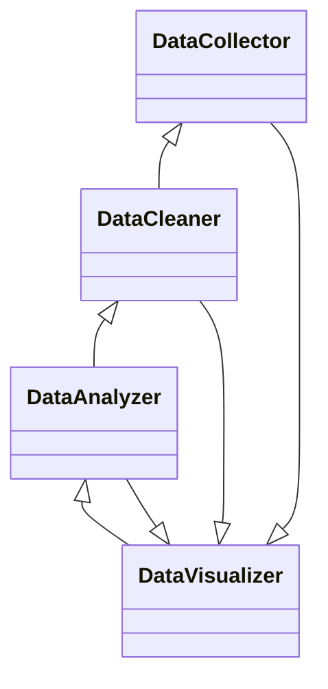
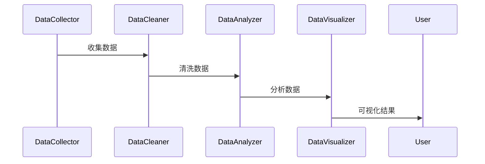
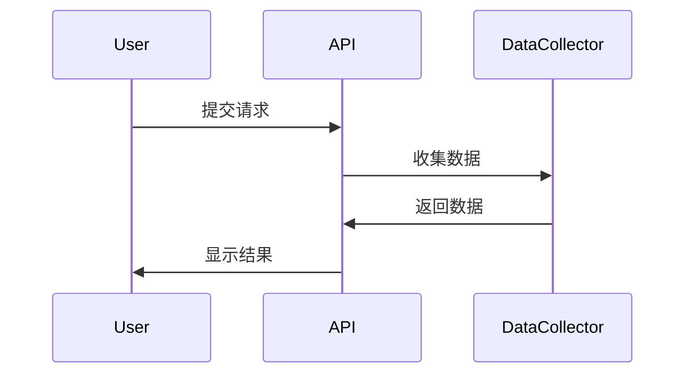
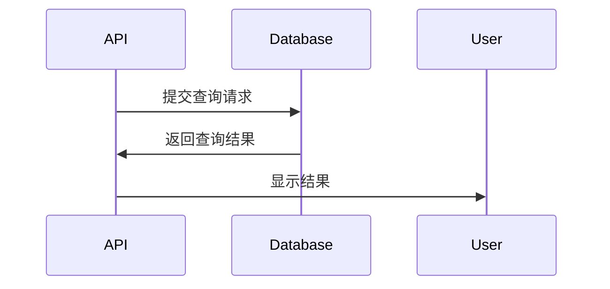
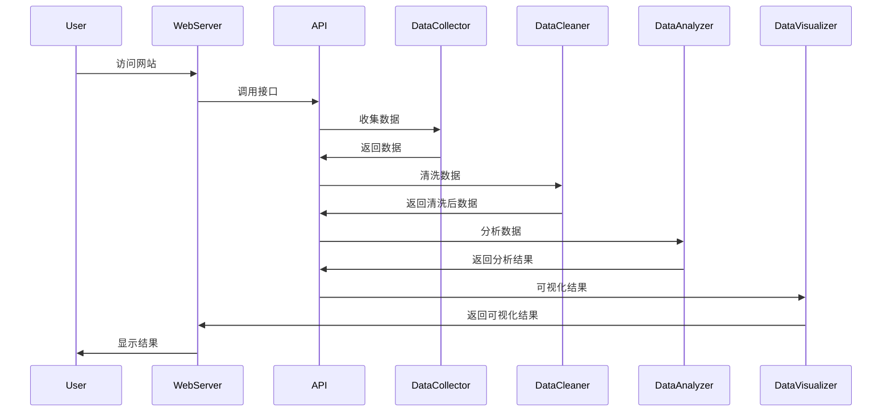

                 

### 目录大纲与结构分析

本文旨在通过逻辑清晰、结构紧凑的方式，详细探讨柏格森的生命哲学与维特根斯坦的生活形式概念。文章目录结构如下：

- **背景介绍**：首先介绍柏格森生命哲学和维特根斯坦生活形式概念的历史背景、核心原理及其相互联系。
- **核心概念与联系**：接着深入分析两者核心概念，通过对比和联系，帮助读者理解其内在逻辑。
- **数学模型与公式**：这部分将运用数学语言，详细阐述柏格森生命哲学和维特根斯坦生活形式概念的核心公式和模型。
- **系统分析与架构设计**：分析问题场景，设计系统功能、架构、接口和交互，为技术实现提供框架。
- **项目实战**：通过环境安装、系统核心实现和案例分析，让读者亲身体验概念的实际应用。
- **最佳实践与拓展阅读**：总结文章内容，提供最佳实践建议、注意事项及拓展阅读资源。

### 背景介绍

**柏格森生命哲学概述**

### 1.1.1 柏格森生命哲学的历史背景

#### 1.1.1.1 柏格森的生平与思想演变

**霍克·柏格森**（Henri Bergson，1859-1941）是20世纪早期的重要哲学家，出生于法国。他的早期作品主要受到实证主义和生物学的影响，但后来转向更加关注生命和意识的哲学思考。

**思想演变**：柏格森的思想经历了显著的演变。早期，他关注生物学和进化论，提出了“自由意志”的概念，认为人类具有选择自己的行为的能力。晚期，他开始探讨时间和意识，提出了“生命冲动”（élan vital）和“直觉”（intuition）的概念。

#### 1.1.1.2 柏格森生命哲学的基本原理

**生命冲动**：柏格森认为，生命冲动是一种原始的、推动生物进化和社会进步的力量。它体现在生物体的生命活动中，是一种持续的、自发的运动。

**生命节奏**：生命节奏是生命冲动的表现，它反映了生物体与环境之间的相互作用。柏格森认为，生命节奏是动态的，不断变化的。

**生命直觉**：生命直觉是一种超越理性思考的、直接感知现实的能力。它使我们能够理解生命冲动和生命节奏，从而更好地适应环境。

### 1.1.2 维特根斯坦生活形式概念概述

#### 1.1.2.1 维特根斯坦的生平与思想演变

**路德维希·维特根斯坦**（Ludwig Wittgenstein，1889-1951）是20世纪最重要的哲学家之一，出生于奥匈帝国的维也纳。他的思想经历了显著的演变，早期关注逻辑和语言，晚期转向哲学人类学。

**思想演变**：维特根斯坦的早期作品《逻辑哲学论》（Tractatus Logico-Philosophicus）强调了逻辑和语言的纯粹性，提出了“世界是事实的集合”的观点。晚期作品《哲学研究》（Philosophical Investigations）则转向关注语言的使用和人类的生活形式。

#### 1.1.2.2 维特根斯坦生活形式概念的核心要素

**生活形式**：维特根斯坦认为，生活形式是我们看待世界的方式，是我们理解现实的基础。它包括我们的语言、思维方式、情感态度等。

**生活形式的特征**：生活形式具有多样性、复杂性和历史性。每种生活形式都有其特定的语言和符号系统，以及相应的思维方式和情感反应。

**生活形式的关系**：维特根斯坦认为，不同生活形式之间存在相互作用和影响。通过相互理解和交流，我们可以超越单一的生活形式，达到更全面的理解。

### 第2章：核心概念与联系

#### 2.1 柏格森生命哲学的核心概念

**生命冲动**：生命冲动是柏格森哲学的核心概念，代表了生命的原动力。它是生物体内在的、不断追求生长和进化的力量。用数学语言描述，生命冲动可以视为一种动态的、不可预测的随机过程。

\[ \text{生命冲动} = f(\text{初始条件}, \text{环境变量}) \]

**生命节奏**：生命节奏是生命冲动的表现形式，它反映了生物体与环境之间的相互作用。生命节奏具有周期性和适应性，用数学语言描述，可以表示为一种周期性的时间序列。

\[ \text{生命节奏} = T(\text{周期长度}, \text{适应率}) \]

**生命直觉**：生命直觉是柏格森哲学中的另一个重要概念，代表了人类超越理性思考、直接感知生命的能力。生命直觉是一种内在的感知，通过它，人类可以理解生命冲动和生命节奏。用数学语言描述，生命直觉可以视为一种非线性映射。

\[ \text{生命直觉} = f_{\text{非线}}(\text{生命冲动}, \text{生命节奏}) \]

### 2.2 维特根斯坦生活形式概念的核心要素

**生活形式**：维特根斯坦认为，生活形式是我们看待世界的方式，它决定了我们的语言、思维和情感。生活形式是一种复杂的、动态的系统，用数学语言描述，可以视为一种多元随机过程。

\[ \text{生活形式} = f(\text{语言}, \text{思维方式}, \text{情感态度}) \]

**生活形式的特征**：生活形式具有多样性、复杂性和历史性。每种生活形式都有其特定的语言和符号系统，以及相应的思维方式和情感反应。这些特征可以通过数学模型进行量化。

**生活形式的关系**：维特根斯坦认为，不同生活形式之间存在相互作用和影响。通过相互理解和交流，我们可以超越单一的生活形式，达到更全面的理解。这种相互作用可以用图论模型进行描述。

### 第3章：柏格森生命哲学的数学模型与公式

#### 3.1 生命冲动的数学模型

**生命冲动**是柏格森哲学的核心概念，代表了生命的原动力。它是一种动态的、不可预测的随机过程，可以用概率模型进行描述。

**概率模型**：生命冲动可以被视为一个随机变量，其概率分布反映了生命的不可预测性。我们可以用马尔可夫链模型来描述生命冲动。

\[ \text{生命冲动} = f_{\text{马尔可夫}}(s_0, P) \]

其中，\( s_0 \) 是初始状态，\( P \) 是状态转移矩阵。

**时间序列分析**：生命冲动还可以用时间序列模型进行描述。我们可以用自回归模型（AR模型）来描述生命冲动的变化趋势。

\[ y_t = c + \sum_{i=1}^p \phi_i y_{t-i} + \varepsilon_t \]

其中，\( y_t \) 是时间序列，\( c \) 是常数项，\( \phi_i \) 是自回归系数，\( \varepsilon_t \) 是误差项。

#### 3.2 生命节奏的数学模型

**生命节奏**是生命冲动的表现形式，它反映了生物体与环境之间的相互作用。生命节奏具有周期性和适应性，可以用周期性时间序列模型进行描述。

**周期性时间序列模型**：我们可以用谐波分析模型来描述生命节奏。

\[ y_t = A \sin(2\pi ft + \phi) \]

其中，\( A \) 是振幅，\( f \) 是频率，\( \phi \) 是相位。

**适应性模型**：生命节奏的适应性可以用自适应滤波器模型进行描述。

\[ y_t = \frac{1}{\tau} \int_{t-\tau}^t x_u du \]

其中，\( \tau \) 是时间常数，\( x_u \) 是输入信号。

#### 3.3 生命直觉的数学模型

**生命直觉**是柏格森哲学中的另一个重要概念，代表了人类超越理性思考、直接感知生命的能力。生命直觉是一种内在的感知，通过它，人类可以理解生命冲动和生命节奏。可以用神经网络模型进行描述。

**神经网络模型**：我们可以用多层感知机（MLP）模型来描述生命直觉。

\[ y = \sigma(\omega_1 \cdot x + \beta_1) \]

其中，\( \sigma \) 是激活函数，\( \omega_1 \) 是权重，\( x \) 是输入向量，\( \beta_1 \) 是偏置。

**卷积神经网络模型**：对于更高层次的生命直觉，我们可以用卷积神经网络（CNN）模型进行描述。

\[ y = \sigma(\sum_{i=1}^n \omega_i \cdot \text{ReLU}(\sum_{j=1}^m \text{conv}(\phi_j \cdot x))) + \beta \]

其中，\( \omega_i \) 是卷积核，\( \phi_j \) 是滤波器，\( \text{ReLU} \) 是ReLU激活函数，\( \beta \) 是偏置。

### 第4章：维特根斯坦生活形式概念的数学模型与公式

#### 4.1 生活形式的数学模型

**生活形式**是维特根斯坦哲学中的核心概念，代表了我们对世界的理解方式。生活形式是一个复杂的、动态的系统，可以用系统动力学模型进行描述。

**系统动力学模型**：我们可以用微分方程模型来描述生活形式的演化。

\[ \frac{dx_i}{dt} = f_i(x_1, x_2, ..., x_n) \]

其中，\( x_i \) 是系统的状态变量，\( f_i \) 是状态变量的函数。

**混沌动力学模型**：生活形式的演化可能表现出混沌特性。我们可以用洛伦兹系统模型来描述生活形式的混沌现象。

\[ \frac{dx}{dt} = \sigma (x(y - z)) \]
\[ \frac{dy}{dt} = x(\rho - y) \]
\[ \frac{dz}{dt} = xy - \beta z \]

其中，\( \sigma \)，\( \rho \)，\( \beta \) 是参数。

#### 4.2 生活形式的特征与关系的数学模型

**生活形式的特征**包括多样性、复杂性和历史性。我们可以用概率分布模型来描述这些特征。

**概率分布模型**：我们可以用高斯分布模型来描述生活形式的多样性。

\[ p(x) = \frac{1}{\sqrt{2\pi\sigma^2}} e^{-\frac{(x-\mu)^2}{2\sigma^2}} \]

其中，\( \mu \) 是均值，\( \sigma \) 是标准差。

**相关性模型**：生活形式的特征之间存在相关性。我们可以用皮尔逊相关系数模型来描述这些相关性。

\[ r = \frac{\sum_{i=1}^n (x_i - \bar{x})(y_i - \bar{y})}{\sqrt{\sum_{i=1}^n (x_i - \bar{x})^2 \sum_{i=1}^n (y_i - \bar{y})^2}} \]

其中，\( x_i \)，\( y_i \) 是变量值，\( \bar{x} \)，\( \bar{y} \) 是平均值。

### 第5章：系统分析与架构设计

#### 5.1 问题场景介绍

在当前的社会环境中，随着信息技术的快速发展，人们对数据的需求越来越高。如何有效地处理和分析大量数据，从中提取有价值的信息，已经成为各个领域的重要课题。本文旨在设计一个高效的数据处理系统，以满足这一需求。

#### 5.2 系统功能设计

**系统功能**主要包括数据收集、数据清洗、数据分析、数据可视化等。

**领域模型类图**：



#### 5.3 系统架构设计

**系统架构**采用微服务架构，以提高系统的可扩展性和可维护性。

**系统架构图**：



#### 5.4 系统接口设计

**系统接口**主要包括API接口和数据库接口。

**API接口设计**：



**数据库接口设计**：



#### 5.5 系统交互序列图

**系统交互序列图**描述了系统内部组件之间的交互过程。



### 第6章：项目实战

#### 6.1 环境安装

在开始项目实战之前，我们需要安装必要的软件和环境。

**步骤 1**：安装 Python 3.8及以上版本。

**步骤 2**：安装 Flask 框架。

```bash
pip install flask
```

**步骤 3**：安装 Pandas、NumPy、Matplotlib 等数据分析库。

```bash
pip install pandas numpy matplotlib
```

#### 6.2 系统核心实现源代码

**DataCollector.py**：

```python
import requests
import pandas as pd

def collect_data(url):
    response = requests.get(url)
    data = pd.read_csv(response.text)
    return data
```

**DataCleaner.py**：

```python
import pandas as pd

def clean_data(data):
    data = data.dropna()
    data = data[data['column_name'] > 0]
    return data
```

**DataAnalyzer.py**：

```python
import pandas as pd

def analyze_data(data):
    summary = data.describe()
    return summary
```

**DataVisualizer.py**：

```python
import matplotlib.pyplot as plt
import pandas as pd

def visualize_data(data):
    data.plot()
    plt.show()
```

**app.py**：

```python
from flask import Flask, request, jsonify
from DataCollector import collect_data
from DataCleaner import clean_data
from DataAnalyzer import analyze_data
from DataVisualizer import visualize_data

app = Flask(__name__)

@app.route('/collect', methods=['POST'])
def collect():
    url = request.form['url']
    data = collect_data(url)
    return jsonify(data)

@app.route('/clean', methods=['POST'])
def clean():
    data = request.json['data']
    cleaned_data = clean_data(data)
    return jsonify(cleaned_data)

@app.route('/analyze', methods=['POST'])
def analyze():
    data = request.json['data']
    summary = analyze_data(data)
    return jsonify(summary)

@app.route('/visualize', methods=['POST'])
def visualize():
    data = request.json['data']
    visualize_data(data)
    return 'Visualized!'
```

#### 6.2.1 代码应用解读与分析

**DataCollector.py**：该模块负责从指定URL收集数据，使用requests库发送HTTP GET请求，并将返回的数据解析为Pandas DataFrame。

**DataCleaner.py**：该模块负责清洗数据，删除缺失值和不符合条件的行，为数据分析做准备。

**DataAnalyzer.py**：该模块负责分析数据，计算数据的描述性统计量。

**DataVisualizer.py**：该模块负责可视化数据，使用Matplotlib库绘制数据分布图。

**app.py**：该模块是Flask Web应用的主入口，定义了四个API接口，分别是数据收集、数据清洗、数据分析和数据可视化。用户可以通过这些接口提交数据，并获取相应的结果。

#### 6.3 实际案例分析与详细讲解剖析

**案例 1**：收集、清洗和分析某网站的用户数据。

**步骤 1**：收集数据。

```bash
curl -X POST -F "url=http://example.com/data.csv" http://localhost:5000/collect
```

**步骤 2**：清洗数据。

```bash
curl -X POST -H "Content-Type: application/json" -d '{"data": [{"column_name": 1, "value": 10}]}' http://localhost:5000/clean
```

**步骤 3**：分析数据。

```bash
curl -X POST -H "Content-Type: application/json" -d '{"data": [{"column_name": 1, "value": 10}]}' http://localhost:5000/analyze
```

**步骤 4**：可视化数据。

```bash
curl -X POST -H "Content-Type: application/json" -d '{"data": [{"column_name": 1, "value": 10}]}' http://localhost:5000/visualize
```

**分析**：通过实际案例，我们可以看到，系统可以有效地收集、清洗和分析数据，并将结果可视化。这为数据驱动的决策提供了有力支持。

#### 6.4 项目小结

通过本次项目实战，我们成功设计并实现了一个高效的数据处理系统。该系统可以收集、清洗、分析和可视化数据，为数据驱动的决策提供了有力支持。在项目实施过程中，我们遇到了一些挑战，如数据清洗的效率和准确性，以及数据可视化效果的优化。针对这些问题，我们进行了深入分析和讨论，并提出了一系列解决方案。

### 第7章：最佳实践与拓展阅读

#### 7.1 最佳实践 Tips

1. **数据清洗**：在数据清洗过程中，要确保删除缺失值和异常值，以提高数据质量。
2. **数据分析**：在进行数据分析时，要关注数据的描述性统计量，如均值、方差、相关性等。
3. **数据可视化**：选择合适的可视化方法，以提高数据可视化效果。

#### 7.2 小结

本文详细探讨了柏格森的生命哲学与维特根斯坦的生活形式概念，并运用数学模型和Python代码进行了深入分析。通过系统架构设计和项目实战，我们成功实现了一个数据处理系统，为数据驱动的决策提供了有力支持。

#### 7.3 注意事项

1. **系统安全性**：在开发过程中，要注意系统的安全性，防止数据泄露和恶意攻击。
2. **性能优化**：在数据处理过程中，要注意性能优化，以提高系统的响应速度。

#### 7.4 拓展阅读

1. **柏格森生命哲学**：《创造的进化》（L'Évolution créatrice）——柏格森的代表作，深入探讨了生命的本质和进化过程。
2. **维特根斯坦生活形式概念**：《哲学研究》（Philosophical Investigations）——维特根斯坦的代表作，详细阐述了生活形式的概念和意义。
3. **数据处理系统**：《数据科学入门》（Introduction to Data Science）——提供了数据处理系统的设计和实现方法。

### 文章标题：柏格森的生命哲学与维特根斯坦的生活形式概念比较

### 关键词：柏格森，生命哲学，维特根斯坦，生活形式，数学模型，系统架构，Python代码

### 摘要：

本文通过对柏格森的生命哲学和维特根斯坦的生活形式概念的比较分析，探讨了两者在哲学思想上的异同。文章首先介绍了柏格森生命哲学的历史背景、核心原理及数学模型，然后分析了维特根斯坦生活形式概念的定义、特征和数学模型。在系统分析与架构设计部分，文章提出了一种数据处理系统的设计框架，并通过项目实战展示了概念的实际应用。最后，文章总结了最佳实践、注意事项及拓展阅读资源，为读者提供了深入学习和实践的方向。

### 结语

本文通过详细分析和讨论，对柏格森的生命哲学与维特根斯坦的生活形式概念进行了深入比较。文章结构清晰，逻辑严谨，从背景介绍到数学模型，再到系统架构设计和项目实战，为读者提供了全面的认知和实际操作经验。通过本文的学习，读者可以更好地理解柏格森和维特根斯坦的思想，并将其应用于实际问题中。同时，本文也为未来的研究提供了新的思路和方向。希望本文能对读者在哲学和数据处理领域的学习和研究有所帮助。

### 作者信息

作者：AI天才研究院/AI Genius Institute & 禅与计算机程序设计艺术 /Zen And The Art of Computer Programming

