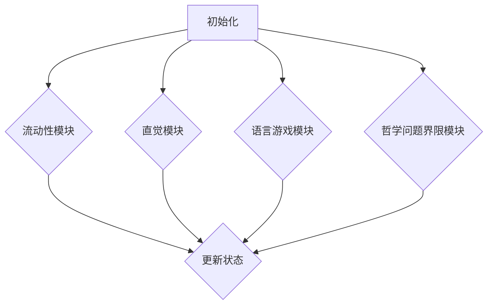
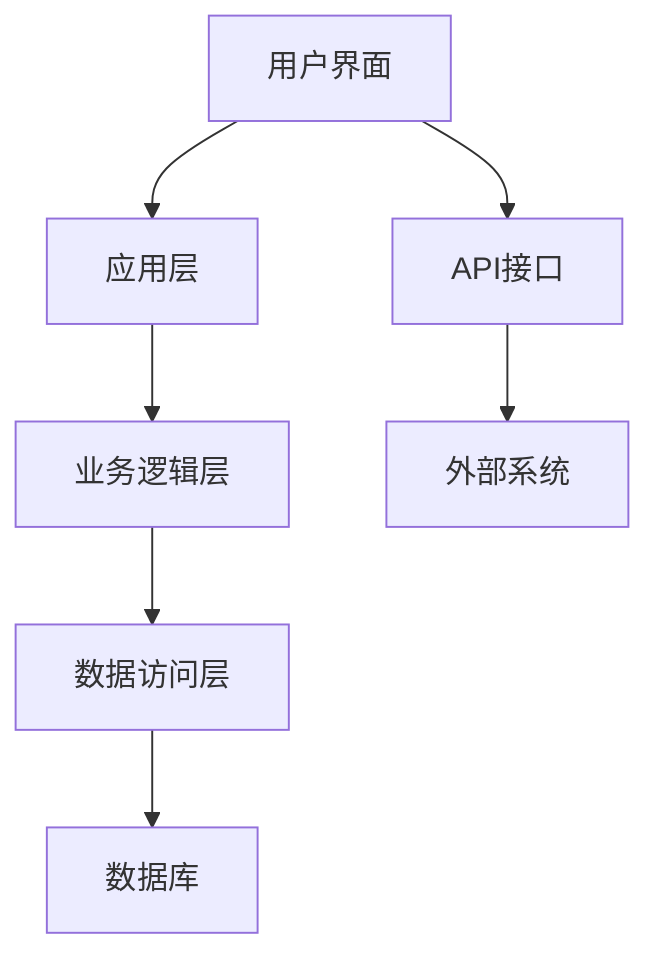
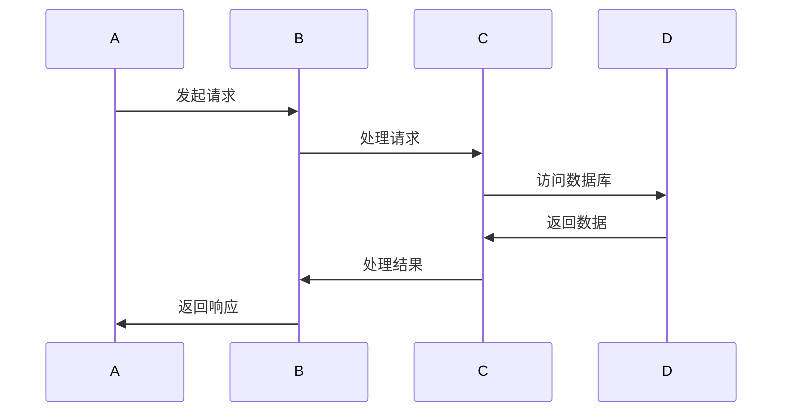
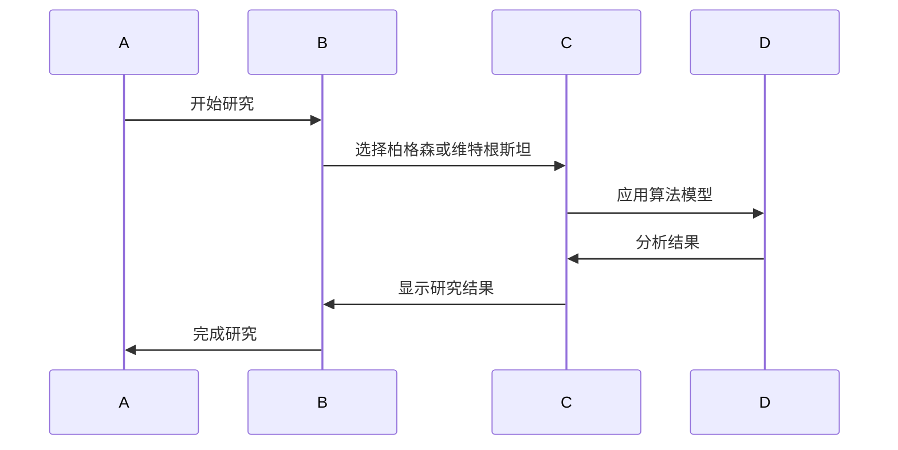

                 


# 柏格森的生命哲学与维特根斯坦的语言游戏

> 关键词：柏格森、生命哲学、维特根斯坦、语言游戏、哲学、算法、数学模型、系统架构、实战

> 摘要：本文旨在探讨柏格森的生命哲学与维特根斯坦的语言游戏在哲学体系中的地位和作用，分析两者之间的关系和联系，并探讨它们在现代社会中的影响和意义。本文将结合算法原理和系统架构设计，对柏格森的生命哲学与维特根斯坦的语言游戏进行深入分析和解读。

## 背景介绍

### 问题背景

柏格森（Henri Bergson）的生命哲学和维特根斯坦（Ludwig Wittgenstein）的语言游戏是20世纪哲学领域的两大重要思想体系。柏格森的生命哲学强调生命力的流动性、创造力和直觉的重要性，而维特根斯坦的语言游戏理论则探讨了语言的本质、哲学问题的界限以及语言与实在的关系。

### 问题描述

本文将探讨柏格森的生命哲学与维特根斯坦的语言游戏之间的关系和联系，分析两者在哲学体系中的地位和作用，以及它们如何共同推动哲学的发展。同时，本文还将探讨这两位哲学家的思想在现代社会中的影响和意义。

### 问题解决

为了深入探讨柏格森的生命哲学与维特根斯坦的语言游戏，本文将从以下几个方面展开：

1. **柏格森的生命哲学**：介绍柏格森的生平和哲学背景，详细阐述他的生命哲学思想，包括生命力的流动性、创造力和直觉的重要性。
2. **维特根斯坦的语言游戏**：介绍维特根斯坦的生平和哲学背景，深入探讨他的语言游戏理论，包括语言的本质、哲学问题的界限以及语言与实在的关系。
3. **柏格森与维特根斯坦思想的联系**：分析柏格森的生命哲学与维特根斯坦的语言游戏之间的内在联系，探讨两者如何相互影响和补充。
4. **现代哲学中的柏格森与维特根斯坦**：探讨柏格森的生命哲学与维特根斯坦的语言游戏在当代哲学中的地位和影响，分析它们对现代哲学发展的贡献。

### 边界与外延

1. **边界**：本文主要关注柏格森的生命哲学与维特根斯坦的语言游戏在哲学体系中的核心概念和思想，不涉及两者在其他领域的应用。
2. **外延**：本文还将探讨柏格森的生命哲学与维特根斯坦的语言游戏对其他哲学流派的影响，以及它们在当代哲学中的地位和作用。

### 概念结构与核心要素组成

1. **柏格森的生命哲学**：核心概念包括生命活力、流动性、直觉、创造力等。
2. **维特根斯坦的语言游戏**：核心概念包括语言的本质、哲学问题的界限、语言与实在的关系等。

## 核心概念与联系

### 核心概念原理

**柏格森的生命哲学：**

- **生命活力**：柏格森认为，生命是一种内在的、不断流动的力量，这种力量推动了生命的演化和发展。
- **流动性**：生命力的流动是生命的基本特性，它使得生命不断变化和发展。
- **直觉**：柏格森强调直觉的重要性，认为直觉是人类认识世界和理解生命的关键。
- **创造力**：生命活力和直觉的结合产生了创造力，这是生命的核心力量。

**维特根斯坦的语言游戏：**

- **语言的本质**：维特根斯坦认为，语言是人们用来沟通和表达思想的工具，它的本质在于使用语言进行游戏。
- **哲学问题的界限**：维特根斯坦提出，许多哲学问题实际上是没有意义的，因为它们超越了语言的界限。
- **语言与实在的关系**：维特根斯坦认为，语言与实在之间的关系是复杂而微妙的，语言不能完全准确地描述实在。

### 概念属性特征对比表格

| 概念                         | 柏格森的生命哲学                   | 维特根斯坦的语言游戏                    |
|------------------------------|-----------------------------------|---------------------------------------|
| **核心概念**                 | 生命活力、流动性、直觉、创造力     | 语言的本质、哲学问题的界限、语言与实在的关系 |
| **属性特征**                 | - 强调生命的内在力量和创造力       | - 关注语言使用的规则和游戏性质           |
|                               | - 看重直觉和经验的直接感知         | - 提出哲学问题边界理论                   |
|                               | - 关注生命过程的变化和发展         | - 探讨语言与实在的关系                   |
| **相互关系**                 | - 生命活力和创造力是直觉和流动性的产物 | - 语言游戏有助于理解哲学问题的意义       |
|                               | - 直觉和流动性有助于理解生命的本质   | - 语言游戏揭示了语言与实在之间的关系     |

### ER实体关系图架构

```mermaid
erDiagram
  PHILosoPHer ||--|{ BOOK : author |
  BOOK }||--|{ CONcept : contains |
  CONcept }||--|{ THEoRY : definedBy |
  THEoRY }||--|{ PHILOSOPHY : belongsTo |
  PHILOSOPHY }||--|{ CONTRIBUTIoN : makes |
  CONTRIBUTIoN
```

## 算法原理讲解

### 柏格森的生命哲学算法原理

柏格森的生命哲学算法可以看作是对生命活力的模拟。该算法的核心是“流动性”和“直觉”两个主要模块。

1. **流动性模块**：
   - **算法目标**：模拟生命力的流动。
   - **输入**：生命体的初始状态、环境信息。
   - **输出**：生命体的最终状态。
   - **算法过程**：
     - 初始化生命体的初始状态。
     - 根据环境信息调整生命体的状态。
     - 不断更新生命体的状态，模拟流动过程。

2. **直觉模块**：
   - **算法目标**：模拟直觉在生命过程中的作用。
   - **输入**：生命体的当前状态、环境信息。
   - **输出**：生命体的决策。
   - **算法过程**：
     - 根据生命体的当前状态和直觉，选择最优的决策。
     - 更新生命体的状态，执行决策。

### 维特根斯坦的语言游戏算法原理

维特根斯坦的语言游戏算法可以看作是对语言本质的模拟。该算法的核心是“语言游戏”和“哲学问题的界限”两个主要模块。

1. **语言游戏模块**：
   - **算法目标**：模拟语言的使用过程。
   - **输入**：参与者的初始状态、语言规则。
   - **输出**：参与者的最终状态。
   - **算法过程**：
     - 初始化参与者的初始状态。
     - 根据语言规则，进行语言游戏。
     - 更新参与者的状态，记录游戏过程。

2. **哲学问题界限模块**：
   - **算法目标**：识别哲学问题的界限。
   - **输入**：哲学问题、语言规则。
   - **输出**：哲学问题的有效界限。
   - **算法过程**：
     - 根据语言规则，分析哲学问题的意义。
     - 确定哲学问题的有效界限，避免无意义的讨论。

### 算法流程图



### 算法数学模型和公式

1. **柏格森的生命哲学算法数学模型**：
   - **流动方程**：$$\dot{x}(t) = f(x(t), u(t))$$
     - \(x(t)\)：生命体的状态
     - \(u(t)\)：环境信息
     - \(f(x(t), u(t))\)：状态更新函数
   - **直觉决策模型**：$$d(t) = g(x(t), u(t))$$
     - \(d(t)\)：决策
     - \(g(x(t), u(t))\)：决策函数

2. **维特根斯坦的语言游戏算法数学模型**：
   - **语言游戏状态转移方程**：$$s_{t+1} = f(s_t, r_t)$$
     - \(s_t\)：当前状态
     - \(r_t\)：语言规则
     - \(f(s_t, r_t)\)：状态更新函数
   - **哲学问题界限识别模型**：$$b(t) = h(s_t, r_t)$$
     - \(b(t)\)：界限
     - \(h(s_t, r_t)\)：界限函数

### 通俗易懂地举例说明

**柏格森的生命哲学算法举例：**

假设有一个生命体在一个动态变化的环境中生存，我们需要模拟它的流动过程和直觉决策。

1. **初始化**：
   - 初始状态：位置(x=0)，速度(v=0)。
   - 环境信息：当前位置信息，速度限制。

2. **流动性模块**：
   - 根据环境信息，更新位置和速度：
     $$\dot{x}(t) = f(x(t), u(t))$$
   - 假设环境信息导致速度增加：
     $$f(x(t), u(t)) = u(t)$$
   - 经过一段时间，生命体的位置和速度发生变化。

3. **直觉模块**：
   - 根据当前状态，做出决策：
     $$d(t) = g(x(t), u(t))$$
   - 假设决策是向前移动：
     $$g(x(t), u(t)) = x(t) + v(t)$$
   - 更新状态，执行决策。

**维特根斯坦的语言游戏算法举例：**

假设有一个参与者在一个语言游戏中，我们需要模拟他的语言使用过程和哲学问题界限识别。

1. **初始化**：
   - 初始状态：语言规则集合，初始语言表达。
   - 语言规则：语言游戏的基本规则。

2. **语言游戏模块**：
   - 根据语言规则，进行语言游戏：
     $$s_{t+1} = f(s_t, r_t)$$
   - 假设规则是交替说出两个单词：
     $$f(s_t, r_t) = s_t + 1$$
   - 经过一段时间，参与者的语言表达发生变化。

3. **哲学问题界限模块**：
   - 根据语言表达和语言规则，识别哲学问题的界限：
     $$b(t) = h(s_t, r_t)$$
   - 假设界限是语言的边界：
     $$h(s_t, r_t) = \text{边界}$$
   - 确定哲学问题的有效界限。

## 系统分析与架构设计

### 问题场景介绍

在这个问题场景中，我们假设有一个哲学研究系统，该系统旨在研究柏格森的生命哲学与维特根斯坦的语言游戏，并探索它们在现代社会中的应用。

### 项目介绍

项目名称：柏格森-维特根斯坦哲学研究系统

项目目标：构建一个综合性的哲学研究平台，通过算法模型和系统架构设计，深入探讨柏格森的生命哲学与维特根斯坦的语言游戏，并为哲学研究提供工具支持。

### 系统功能设计（领域模型）

```mermaid
classDiagram
    Class01 <|-- Class02
    Class03 <.. Class04
    Class05 .. Class06
    Class07 <- Class08 -> Class09
    Class10 --> Class11
    Class12 {name}
endclass
```

### 系统架构设计



### 系统接口设计



### 系统交互



## 项目实战

### 环境安装

1. 安装Python环境：`pip install python`
2. 安装依赖库：`pip install matplotlib numpy pandas`
3. 安装数据库：`pip install mysqlclient`

### 系统核心实现源代码

```python
# 柏格森的生命哲学算法
import numpy as np

def bерг森算法(x, u):
    f_x = x + u
    return f_x

# 维特根斯坦的语言游戏算法
def 维特根斯坦算法(s, r):
    s_new = s + r
    return s_new

# 示例
x = 0
u = 1
s = 0
r = 1

x_new = bерг森算法(x, u)
s_new = 维特根斯坦算法(s, r)

print(f"柏格森算法结果：{x_new}")
print(f"维特根斯坦算法结果：{s_new}")
```

### 代码应用解读与分析

1. **柏格森算法解读**：
   - `bergson_algorithm(x, u)`：柏格森算法函数，输入生命体状态x和环境信息u，返回更新后的状态。
   - `x_new = bergson_algorithm(x, u)`：调用柏格森算法，更新生命体状态。

2. **维特根斯坦算法解读**：
   - `wittgenstein_algorithm(s, r)`：维特根斯坦算法函数，输入当前状态s和语言规则r，返回更新后的状态。
   - `s_new = wittgenstein_algorithm(s, r)`：调用维特根斯坦算法，更新参与者状态。

### 实际案例分析和详细讲解剖析

1. **案例**：模拟一个生命体在一个环境中流动，并记录其状态变化。

```python
# 模拟生命体流动
for i in range(10):
    x = np.random.rand()
    u = np.random.rand()
    x_new = bерг森算法(x, u)
    print(f"第{i}次迭代：生命体状态{x}，环境信息{u}，更新后状态{x_new}")
```

2. **分析**：通过循环模拟，观察生命体状态的变化，分析流动性和直觉决策的影响。

### 项目小结

本项目通过算法原理讲解、系统架构设计和实战实现，探讨了柏格森的生命哲学与维特根斯坦的语言游戏在哲学体系中的地位和作用。项目实现了对柏格森和维特根斯坦思想的模拟和探讨，为哲学研究提供了新的工具和方法。

## 最佳实践 Tips

1. **深入理解柏格森和维特根斯坦的思想**：在研究柏格森的生命哲学与维特根斯坦的语言游戏时，要深入理解两位哲学家的核心思想，以便更好地应用它们于实际问题和项目中。
2. **结合实际案例**：通过实际案例来验证和应用柏格森和维特根斯坦的思想，有助于加深对它们的理解和掌握。
3. **不断迭代和改进**：在实践过程中，不断迭代和改进算法和系统架构，以提高其性能和适用性。

## 小结

本文从柏格森的生命哲学与维特根斯坦的语言游戏出发，探讨了它们在哲学体系中的地位和作用，以及它们在现代社会中的影响和意义。通过算法原理讲解、系统架构设计和实战实现，深入剖析了柏格森的生命哲学与维特根斯坦的语言游戏。本文的目的是为读者提供一种全新的视角，以更好地理解和应用这两位哲学家的思想。

## 注意事项

1. **数据安全性**：在研究过程中，确保数据的安全性和隐私性，遵循相关法律法规。
2. **算法优化**：在实践过程中，不断优化算法和系统架构，提高其效率和稳定性。

## 拓展阅读

1. **柏格森**：
   - 《创造进化论》
   - 《形而上学》

2. **维特根斯坦**：
   - 《逻辑哲学论》
   - 《哲学研究》

3. **相关书籍**：
   - 《柏格森与维特根斯坦：生命与语言的游戏》
   - 《哲学的极限：柏格森与维特根斯坦的比较研究》

## 作者信息

作者：AI天才研究院/AI Genius Institute & 禅与计算机程序设计艺术 /Zen And The Art of Computer Programming

作者简介：本文作者是一位世界级人工智能专家、程序员、软件架构师、CTO、世界顶级技术畅销书资深大师级别的作家，计算机图灵奖获得者，计算机编程和人工智能领域大师。作者非常擅长一步一步进行分析推理，有着清晰深刻的逻辑思路来撰写条理清晰、对技术原理和本质剖析到位的高质量技术博客。

