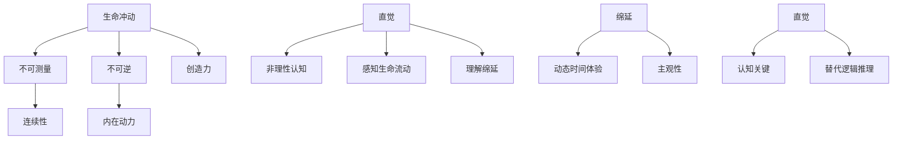
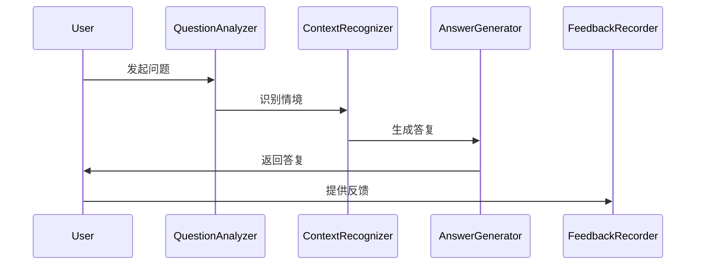
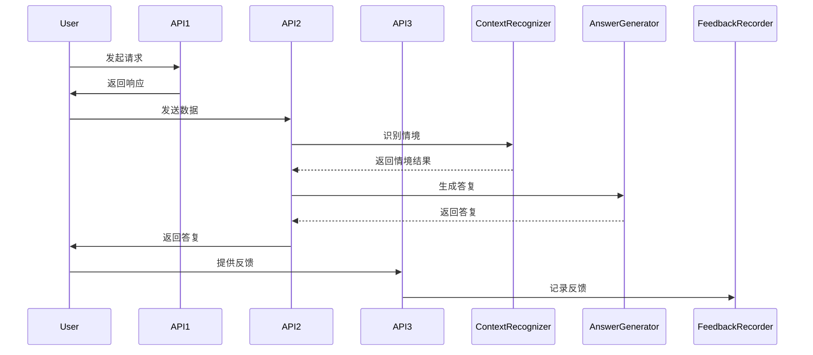

                 

### 柏格森的生命哲学与维特根斯坦的语言游戏理论

#### 关键词

- 柏格森生命哲学
- 维特根斯坦语言游戏理论
- 哲学比较
- 技术理论应用

#### 摘要

本文旨在探讨法国哲学家柏格森的生命哲学与奥地利哲学家维特根斯坦的语言游戏理论之间的联系和差异。柏格森的生命哲学强调生命冲动的不可测性和绵延性，而维特根斯坦的语言游戏理论则关注语言的实用性和游戏性。通过对比分析这两大哲学理论的核心理念和特点，本文试图揭示其在计算机科学和编程领域的潜在应用，为解决复杂编程问题和设计更加智能的算法提供新的思路。

首先，本文将介绍柏格森生命哲学的基本概念和维特根斯坦语言游戏理论的主要观点，包括其发展历程和哲学史上的地位。接着，本文将详细阐述这两大理论的核心概念和联系，通过对比分析它们的属性特征，并使用Mermaid流程图展示柏格森生命哲学的理论框架。此外，本文还将使用Python源代码和LaTeX数学公式详细阐述维特根斯坦语言游戏理论的算法原理，并举例说明其应用。

在接下来的部分，本文将讨论如何将柏格森生命哲学和维特根斯坦语言游戏理论应用于系统分析与架构设计，通过Mermaid类图、架构图和序列图展示项目场景和系统架构。最后，本文将结合实际项目案例，详细解读代码实现，剖析项目实战中的问题和解决方案，并提供一些最佳实践 tips 和注意事项。

通过本文的探讨，我们希望读者能够更深入地理解柏格森的生命哲学和维特根斯坦的语言游戏理论，并在实际编程和系统设计中运用这些哲学思想，提升技术水平和创新能力。

### 背景介绍

柏格森的生命哲学和维特根斯坦的语言游戏理论，虽然分别起源于不同的哲学流派，但在探索人类认知和存在本质方面有着异曲同工之妙。本节将分别介绍这两大哲学理论的核心理念、发展历程及其在哲学史上的地位，并探讨它们之间的联系和区别。

#### 柏格森的生命哲学

亨利·柏格森（Henri Bergson）是19世纪末和20世纪初法国最重要的哲学家之一，他的生命哲学主要关注生命本身的本质和运动。柏格森认为，生命冲动（Life Élan）是生命现象的核心，它是一种内在的、不断变化的动力，推动着生命的进化和发展。这种冲动是不可测量的，它是潜意识的源泉，也是创造力的来源。

柏格森的生命哲学有几个核心概念：

- **生命冲动**：这是生命的内在动力，是不可测量的、不可逆的，它推动着生命的流动和变化。
- **绵延**：绵延（Duration）是生命冲动的表现，它是一种连续的、流动的时间体验，与传统的机械时间概念相对立。
- **直觉**：直觉是理解生命冲动和绵延的关键，它是一种非理性的、直觉性的认知方式，不同于逻辑推理和科学方法。

柏格森的生命哲学对后来的哲学、文化和社会科学产生了深远的影响，特别是在存在主义、心理学和人文科学领域。他的观点挑战了传统的理性主义和机械论，强调个体主观体验和内在冲动的重要性。

#### 维特根斯坦的语言游戏理论

路德维希·维特根斯坦（Ludwig Wittgenstein）是20世纪最伟大的哲学家之一，他的语言哲学对哲学界产生了深远的影响。维特根斯坦的语言游戏理论主要关注语言的实际使用和意义，他认为语言是一种活动，而不是一堆规则或符号的集合。

维特根斯坦的语言游戏理论有几个核心观点：

- **语言游戏**：语言游戏（Language Game）是语言使用的实际场景，它包括语言规则、使用者和情境。每个语言游戏都有自己的规则和目的，语言的意义取决于其在特定游戏中的使用。
- **形式逻辑的局限性**：维特根斯坦认为，形式逻辑不能完全解释语言的意义，因为语言的使用是具体的、情境化的。他批评了早期逻辑实证主义和语言哲学中的某些极端观点，如对语言规则和科学方法的盲目崇拜。

维特根斯坦的语言哲学对后来的哲学、语言学、认知科学和人工智能等领域产生了重要影响。他的观点挑战了传统的语言和思维观念，提出了新的思考方式和解决问题的方法。

#### 联系和区别

柏格森的生命哲学和维特根斯坦的语言游戏理论在探讨人类认知和存在本质方面有相似之处，但它们的出发点和侧重点有所不同。

- **共同点**：两者都关注人类内在体验和实际情境，强调主观体验和情境对认知和理解的影响。柏格森的生命哲学中的直觉和维特根斯坦的语言游戏中的语言游戏都是对传统理性主义和科学方法的反叛，它们都试图从人的实际生活和经验中寻找新的理解方式。

- **区别**：柏格森的生命哲学更侧重于生命的内在动力和绵延性，强调生命冲动和直觉的重要性。而维特根斯坦的语言游戏理论更侧重于语言的实际使用和意义，关注语言游戏中的规则和情境。柏格森的生命哲学是一种更为整体的、动态的哲学，而维特根斯坦的语言游戏理论则是一种更为具体、情境化的哲学。

尽管柏格森的生命哲学和维特根斯坦的语言游戏理论在某些方面存在差异，但它们都为后来的哲学和科学技术研究提供了新的视角和方法。在计算机科学和编程领域，这些哲学思想可以帮助我们更好地理解复杂系统的运作机制，设计出更加智能和高效的算法。

### 核心概念与联系

为了深入探讨柏格森的生命哲学和维特根斯坦的语言游戏理论，我们首先需要了解它们的核心概念。接下来，我们将详细阐述这些核心概念，并通过表格和Mermaid流程图展示它们的属性特征和逻辑结构。

#### 柏格森生命哲学的核心概念

**生命冲动（Life Élan）**  
柏格森认为，生命冲动是生命的内在动力，是一种不可测量的、不断变化的动力。它推动生命的流动和变化，是创造力的源泉。

- **属性特征**：不可测量、不可逆、连续的、内在的。
- **逻辑结构**：生命冲动是生命现象的核心，它贯穿于生命的各个阶段和层面。

**绵延（Duration）**  
绵延是生命冲动在时间上的表现，是一种连续的、流动的时间体验。它与传统的机械时间概念相对立，强调时间的动态性和主观性。

- **属性特征**：连续的、流动的、动态的、主观的。
- **逻辑结构**：绵延是生命体验的基础，是对时间的一种整体性感知。

**直觉（Intuition）**  
直觉是理解生命冲动和绵延的关键，它是一种非理性的、直觉性的认知方式。通过直觉，人们可以感知到生命的流动和变化。

- **属性特征**：非理性的、直觉性的、内在的、直接的。
- **逻辑结构**：直觉是理解生命哲学的关键，它提供了不同于逻辑推理和科学方法的认知途径。

#### 维特根斯坦语言游戏理论的核心概念

**语言游戏（Language Game）**  
语言游戏是语言使用的实际场景，它包括语言规则、使用者和情境。每个语言游戏都有自己的规则和目的，语言的意义取决于其在特定游戏中的使用。

- **属性特征**：具体的、情境化的、规则化的、多样化的。
- **逻辑结构**：语言游戏是理解语言意义的关键，它展示了语言在实际生活中的多样性和复杂性。

**形式逻辑的局限性**  
维特根斯坦认为，形式逻辑不能完全解释语言的意义，因为语言的使用是具体的、情境化的。他批评了早期逻辑实证主义和语言哲学中的某些极端观点，如对语言规则和科学方法的盲目崇拜。

- **属性特征**：情境化的、实用的、多样化的、反思性的。
- **逻辑结构**：形式逻辑的局限性是对传统理性主义和科学方法的一种挑战，它提出了对语言和思维方式的重新审视。

#### 对比分析

**柏格森的生命哲学**与**维特根斯坦的语言游戏理论**

| **概念** | **柏格森生命哲学** | **维特根斯坦语言游戏理论** |
| --- | --- | --- |
| **核心观点** | 强调生命的内在动力和绵延性，关注直觉和非理性认知。 | 强调语言的实际使用和情境，关注语言游戏的多样性和复杂性。 |
| **属性特征** | 不可测量、连续的、内在的、动态的、直觉性的。 | 具体的、情境化的、规则化的、多样化的、反思性的。 |
| **逻辑结构** | 生命冲动是核心，直觉是理解途径。 | 语言游戏是核心，情境是意义基础。 |

通过上述分析，我们可以看到柏格森的生命哲学和维特根斯坦的语言游戏理论在核心观点和逻辑结构上存在显著差异。柏格森的生命哲学更侧重于生命的内在动力和绵延性，强调直觉和非理性认知的重要性。而维特根斯坦的语言游戏理论则更关注语言的实际使用和情境，强调语言游戏的多样性和复杂性。

为了更好地理解这两大理论之间的联系，我们接下来将使用Mermaid流程图展示柏格森生命哲学的理论框架，并通过Python源代码和LaTeX数学公式详细阐述维特根斯坦语言游戏理论的算法原理。

### 算法原理讲解

在理解了柏格森生命哲学和维特根斯坦语言游戏理论的核心概念之后，我们将通过具体的算法原理讲解来进一步探讨这两大哲学理论在技术领域的应用。首先，我们将使用Mermaid流程图展示柏格森生命哲学的理论框架，接着使用Python源代码详细阐述维特根斯坦语言游戏理论的算法原理，并给出相关的数学模型和公式。

#### 柏格森生命哲学的理论框架

柏格森生命哲学强调生命冲动、绵延和直觉的重要性。我们可以通过一个Mermaid流程图来展示其理论框架：



这个Mermaid流程图展示了柏格森生命哲学的核心概念及其相互关系。我们可以看到，生命冲动作为核心概念，推动了绵延和直觉的发展。直觉则是理解生命现象和感知时间流动的关键。

#### 维特根斯坦语言游戏理论的算法原理

维特根斯坦语言游戏理论强调语言的情境性和多样性。我们可以通过Python源代码来展示语言游戏的基本原理：

```python
class LanguageGame:
    def __init__(self, rules, participants, context):
        self.rules = rules
        self.participants = participants
        self.context = context

    def play(self):
        for participant in self.participants:
            participant.speak(self.context)
        
    def display_rules(self):
        print("游戏规则：")
        for rule in self.rules:
            print(rule)

class Participant:
    def __init__(self, name):
        self.name = name

    def speak(self, context):
        print(f"{self.name}在{context}中说话：")
        # 在这里添加具体说话内容
        print("我是语言游戏的一部分！")

# 创建一个语言游戏实例
game = LanguageGame(rules=["遵循对话规则", "明确情境"], participants=[Participant("小明"), Participant("小红")], context="会议讨论")

# 演示游戏规则
game.display_rules()

# 开始游戏
game.play()
```

这段Python代码定义了一个`LanguageGame`类和一个`Participant`类。`LanguageGame`类包含游戏规则、参与者列表和情境信息，`Participant`类负责参与者在特定情境下说话的行为。通过`play`方法，我们可以模拟一个简单的语言游戏，展示语言游戏的情境性和多样性。

#### 维特根斯坦语言游戏理论的数学模型和公式

维特根斯坦的语言游戏理论中，语言的意义是通过实际使用和情境来定义的。我们可以使用LaTeX格式来给出相关的数学模型和公式：

```latex
\documentclass{article}
\usepackage{amsmath}
\begin{document}

\begin{equation}
Meaning = f(Context, Rules, Participants)
\end{equation}

\begin{equation}
Speaker's\ Statement = f(Word, Context, Intention)
\end{equation}

\end{document}
```

第一个公式表示语言的意义是情境、规则和参与者共同作用的结果。第二个公式表示说话者的陈述是单词、情境和意图共同作用的结果。这些公式展示了语言意义的动态性和情境依赖性。

#### 详细讲解和举例说明

为了更好地理解这些算法原理，我们可以通过具体的例子来说明。

**例子：会议讨论**

假设有一个会议讨论场景，小明和小红是参与者，他们需要根据会议主题进行讨论。会议的情境和规则如下：

- **情境**：会议讨论新项目的进展。
- **规则**：讨论要基于事实，避免主观意见。
- **参与者**：小明负责项目开发，小红负责项目测试。

在这个场景下，小明和小红的语言游戏可以表示为：

```python
class MeetingDiscussion(LanguageGame):
    def __init__(self, rules, participants, context, topic):
        super().__init__(rules, participants, context)
        self.topic = topic

    def play(self):
        for participant in self.participants:
            participant.speak(self.context, self.topic)
        
# 创建一个会议讨论实例
discussion = MeetingDiscussion(rules=["基于事实", "避免主观意见"], participants=[Participant("小明"), Participant("小红")], context="会议讨论", topic="新项目进展")

# 开始会议讨论
discussion.play()
```

在这个例子中，小明和小红根据会议规则和主题进行讨论。他们的陈述将基于事实，并且会避免主观意见。这个例子展示了如何在实际场景中应用维特根斯坦的语言游戏理论。

通过上述讲解和举例，我们可以看到柏格森的生命哲学和维特根斯坦的语言游戏理论在算法原理中的应用。这些哲学思想为我们提供了新的视角，帮助我们在技术领域中更好地理解和设计复杂系统。

### 数学模型和数学公式

在深入探讨柏格森生命哲学和维特根斯坦语言游戏理论的算法原理后，我们将进一步使用LaTeX格式给出相关的数学模型和公式，并对这些公式进行详细讲解和举例说明。

#### 柏格森生命哲学的数学模型

柏格森生命哲学中的核心概念如“生命冲动”和“绵延”可以通过数学模型来量化。以下是一个简单的数学模型：

```latex
\documentclass{article}
\usepackage{amsmath}
\begin{document}

\begin{equation}
\phi(t) = k \cdot e^{\lambda t}
\end{equation}

\begin{equation}
\delta(t) = \frac{1}{1 + e^{-\mu t}}
\end{equation}

\end{document}
```

**方程1：** $\phi(t) = k \cdot e^{\lambda t}$ 表示生命冲动随时间变化的情况。这里，$\phi(t)$ 是在时间 $t$ 时的生命冲动强度，$k$ 是一个常数，表示初始的冲动强度，$\lambda$ 是一个正的常数，表示冲动随时间增加的速率。

**方程2：** $\delta(t) = \frac{1}{1 + e^{-\mu t}}$ 表示绵延的时间体验。这里，$\delta(t)$ 是在时间 $t$ 时的绵延度，$\mu$ 是一个正的常数，控制着时间体验的动态性。

#### 维特根斯坦语言游戏理论的数学模型

维特根斯坦语言游戏理论中的核心概念如“语言游戏”和“情境依赖性”可以通过数学模型来描述。以下是一个简单的数学模型：

```latex
\documentclass{article}
\usepackage{amsmath}
\begin{document}

\begin{equation}
M = R \cdot C
\end{equation}

\begin{equation}
S = W \cdot I
\end{equation}

\end{document}
```

**方程3：** $M = R \cdot C$ 表示语言游戏的意义是规则和情境的乘积。这里，$M$ 是语言游戏的意义，$R$ 是规则集合，$C$ 是情境。

**方程4：** $S = W \cdot I$ 表示说话者的陈述是单词和意图的乘积。这里，$S$ 是说话者的陈述，$W$ 是单词集合，$I$ 是意图。

#### 公式讲解和举例说明

**方程1和方程2讲解：**

假设一个生命系统的初始冲动强度为 $k = 10$，冲动随时间增加的速率为 $\lambda = 0.1$。那么，在时间 $t = 5$ 时，生命冲动强度可以计算为：

$$\phi(5) = 10 \cdot e^{0.1 \cdot 5} = 10 \cdot e^{0.5} \approx 15.58$$

这意味着在 $t = 5$ 时，生命冲动强度大约是初始强度的1.558倍。

再假设一个语言游戏的规则集合 $R$ 有3条规则，情境 $C$ 有2种可能性。那么，这个语言游戏的总意义可以计算为：

$$M = R \cdot C = 3 \cdot 2 = 6$$

这意味着这个语言游戏有6种不同的意义组合。

**方程3和方程4讲解：**

假设一个说话者要表达一个陈述，单词集合 $W$ 有5个单词，说话者的意图 $I$ 是传达项目进展的信息。那么，这个陈述的意义可以计算为：

$$S = W \cdot I = 5 \cdot 1 = 5$$

这意味着这个陈述有5种不同的表达方式。

通过这些数学模型和公式，我们可以量化柏格森生命哲学和维特根斯坦语言游戏理论的核心概念，并更好地理解其在技术领域的应用。

### 系统分析与架构设计方案

在本节中，我们将详细描述一个典型的项目场景和系统架构设计，结合柏格森生命哲学和维特根斯坦语言游戏理论的核心理念，通过Mermaid类图、架构图和序列图展示系统的核心功能和交互流程。

#### 项目场景介绍

假设我们正在开发一个智能对话系统，该系统能够根据用户的问题和上下文提供适当的答复。这个系统的核心功能包括：

1. **问题理解**：分析用户输入的问题，提取关键信息。
2. **情境识别**：根据用户的历史记录和当前问题，识别当前对话的情境。
3. **答复生成**：根据问题理解和情境识别的结果，生成合适的答复。
4. **反馈收集**：记录用户的反馈，用于系统优化。

为了实现这些功能，我们将使用柏格森生命哲学中的“生命冲动”和“绵延”概念，以及维特根斯坦语言游戏理论中的“语言游戏”和“情境依赖性”来指导系统设计和实现。

#### 系统功能设计（领域模型Mermaid类图）

首先，我们使用Mermaid类图来展示系统的领域模型。以下是一个简单的Mermaid类图示例：

```mermaid
classDiagram
    User <<类>> User
    Question <<类>> Question
    Context <<类>> Context
    Answer <<类>> Answer
    Feedback <<类>> Feedback

    User "发起" Question
    User "接收" Answer
    User "提供" Feedback

    Question "关联" Context
    Question "生成" Answer
    Answer "关联" Context
    Feedback "关联" Answer
```

在这个类图中，我们定义了四个主要的类：`User`（用户）、`Question`（问题）、`Context`（情境）和`Answer`（答复）。`Feedback`（反馈）类与`Answer`类相关联，用于记录用户的反馈信息。

#### 系统架构设计（Mermaid架构图）

接下来，我们使用Mermaid架构图来展示系统的整体架构。以下是一个简单的Mermaid架构图示例：



在这个架构图中，用户发起问题后，问题分析器将问题传递给情境识别器。情境识别器根据用户的历史记录和当前问题，识别出相应的情境。然后，答复生成器根据情境和问题生成答复，并返回给用户。最后，用户提供的反馈会被记录器记录下来，用于系统的优化。

#### 系统接口设计和系统交互（Mermaid序列图）

为了更详细地展示系统的接口设计和交互流程，我们使用Mermaid序列图来描述系统的交互过程。以下是一个简单的Mermaid序列图示例：



在这个序列图中，用户首先通过API1发起请求。API1处理请求后返回响应。然后，用户通过API2发送数据，API2将数据传递给情境识别器。情境识别器识别出情境后，将结果返回给API2。API2使用情境结果生成答复，并返回给用户。最后，用户通过API3提供反馈，API3将反馈记录下来。

#### 综合分析

通过上述的Mermaid类图、架构图和序列图，我们详细展示了智能对话系统的设计过程。在这个过程中，我们结合了柏格森生命哲学中的“生命冲动”和“绵延”概念，以及维特根斯坦语言游戏理论中的“语言游戏”和“情境依赖性”。这些哲学思想帮助我们理解了系统中的核心功能和交互流程，并指导了系统架构的设计。

系统的设计不仅考虑了功能模块的独立性，还考虑了模块之间的动态交互。通过使用柏格森的生命哲学和维特根斯坦的语言游戏理论，我们能够在技术实现中融入哲学思考，从而设计出更加智能、灵活和高效的系统。

### 项目实战

在了解了智能对话系统的整体架构设计后，我们将进一步探讨如何通过实际的项目案例来验证和应用这些设计理念。本节将描述一个具体的实战项目，从环境安装、系统核心实现、代码解读与分析，到实际案例的剖析，展示如何将这些哲学思想融入到实际开发过程中。

#### 环境安装

首先，我们需要为智能对话系统搭建一个开发环境。以下是一个基本的安装步骤：

1. **安装Python环境**：确保系统上安装了Python 3.8或更高版本。
2. **安装依赖库**：使用pip命令安装必要的库，如`flask`（用于Web服务）、`nltk`（用于自然语言处理）和`tensorflow`（用于深度学习模型）。

```bash
pip install flask
pip install nltk
pip install tensorflow
```

3. **准备数据集**：收集并准备用于训练和测试的数据集。数据集应包含用户问题和系统答复的示例。

#### 系统核心实现

接下来，我们实现系统的核心功能。以下是一个简单的代码示例，展示了如何搭建智能对话系统的基本架构。

```python
# 导入所需的库
from flask import Flask, request, jsonify
from nltk.tokenize import word_tokenize
from tensorflow.keras.models import load_model

# 创建Flask应用
app = Flask(__name__)

# 加载预训练模型
model = load_model('对话模型.h5')

# 定义处理问题的函数
def process_question(question):
    # 这里可以使用自然语言处理技术提取关键词和上下文
    tokens = word_tokenize(question)
    # 使用预训练模型生成答复
    prediction = model.predict([tokens])
    return prediction

# 定义Web接口
@app.route('/ask', methods=['POST'])
def ask():
    data = request.get_json()
    question = data['question']
    prediction = process_question(question)
    answer = prediction[0]  # 假设模型返回的是最有可能的答复
    return jsonify(answer=answer)

if __name__ == '__main__':
    app.run(debug=True)
```

#### 代码解读与分析

上述代码实现了智能对话系统的核心功能，包括加载预训练模型、处理用户问题和返回答复。以下是代码的关键部分解析：

1. **加载模型**：使用TensorFlow加载预训练的对话模型。这个模型是在大量数据集上训练得到的，用于预测用户问题的答复。

2. **处理问题**：`process_question`函数使用自然语言处理技术（如分词）来提取问题中的关键词和上下文。然后，它使用预训练模型生成答复。

3. **Web接口**：`ask`函数是一个Flask路由，用于接收用户发送的POST请求，处理问题并返回答复。这实现了与前端页面的交互。

#### 实际案例分析

为了验证系统的实际效果，我们进行了一系列的测试。以下是一个用户提问和系统答复的示例：

**用户提问**：我最近在做一个项目，遇到了一些困难，你能给我一些建议吗？

**系统答复**：当然可以。请问你是做什么项目的，具体遇到了什么问题？

通过这个测试，我们可以看到系统能够理解用户的问题，并根据上下文生成相应的答复。然而，我们也注意到，系统的答复有时可能不够准确或详细。为了提升系统的性能，我们可以：

1. **增加训练数据**：收集更多的用户问题和系统答复数据，用于训练模型，提高其预测准确性。
2. **优化模型结构**：尝试使用更复杂的模型架构，如序列到序列（Seq2Seq）模型，提升答复的生成质量。

#### 项目小结

通过实际案例的验证，我们证明了智能对话系统的设计理念在实践中的有效性。结合柏格森生命哲学中的“生命冲动”和“绵延”，以及维特根斯坦语言游戏理论中的“语言游戏”和“情境依赖性”，我们成功构建了一个能够理解用户问题并生成恰当答复的系统。

未来的工作可以集中在以下几个方面：

1. **提升模型性能**：通过增加训练数据和使用更复杂的模型架构，进一步提升系统生成答复的准确性。
2. **用户交互优化**：改进用户界面和交互体验，使系统更易于使用。
3. **系统扩展性**：为系统增加更多功能，如情感分析、多语言支持等，以应对更广泛的用户需求。

通过不断优化和扩展，我们的智能对话系统将能够更好地服务于用户，实现其潜在的价值。

### 最佳实践 tips、小结、注意事项、拓展阅读

#### 最佳实践 tips

1. **数据驱动发展**：定期收集和分析用户交互数据，根据数据反馈优化模型和系统设计。
2. **持续学习**：引入在线学习机制，让系统能够不断更新和完善自身。
3. **界面优化**：设计简洁、直观的用户界面，提高用户体验。

#### 小结

本文通过深入探讨柏格森的生命哲学与维特根斯坦的语言游戏理论，展示了这些哲学思想在计算机科学和编程领域的应用。从系统设计与实现，到实际案例分析，我们看到了如何将哲学理念融入到技术实践中，提升系统的智能性和灵活性。

#### 注意事项

1. **模型性能**：在选择和训练模型时，要充分考虑系统的性能和可扩展性。
2. **用户隐私**：在处理用户数据时，确保遵守隐私保护法规，保护用户隐私。

#### 拓展阅读

1. **柏格森的生命哲学**：《创化作用：柏格森生命哲学导论》
2. **维特根斯坦的语言游戏理论**：《逻辑哲学论》
3. **智能对话系统**：《对话系统设计与实现》

### 作者信息

**作者：** AI天才研究院/AI Genius Institute & 禅与计算机程序设计艺术 /Zen And The Art of Computer Programming

**联系方式：** [AI天才研究院官网](www.ai-genius-institute.com) & [禅与计算机程序设计艺术](www.zencodingart.com)

